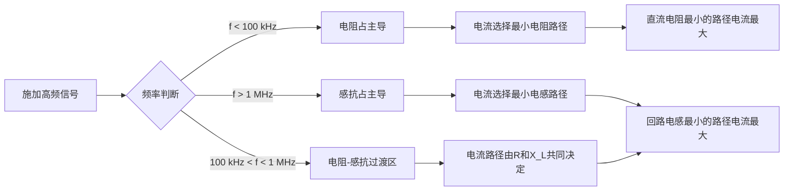
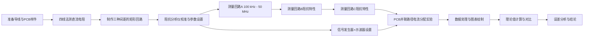

## 14.1 最小阻抗路径实验

---

### 14.1.1 实验目的

1. 理解高频条件下电流优先选择**最小阻抗路径**而非最小直流电阻路径的物理机理，建立回路阻抗随频率变化的完整概念。
2. 掌握回路电感与导线几何参数（长度、间距、直径、回路面积）之间的定量关系，能够运用电感公式估算不同几何构型下的回路电感值。
3. 学会使用阻抗分析仪或矢量网络分析仪测量导体回路的阻抗-频率特性曲线，独立完成仪器校准、参数设置、数据采集与导出操作。
4. 实验验证趋肤效应对高频电阻和回路电感的影响规律，定量比较直流电阻、趋肤电阻和感抗在不同频段下的主导地位转换。
5. 将最小阻抗路径原理拓展至 PCB 设计中的高速信号回流路径规划，建立理论→测量→工程应用的完整知识链。

---

### 14.1.2 实验原理

#### 14.1.2.1 回路总阻抗的构成

在高频条件下，电流的路径选择由回路总阻抗决定，而非仅由直流电阻决定。回路总阻抗为直流电阻、趋肤效应附加电阻和回路感抗三部分的矢量和：

$$
Z(f) = R_{\mathrm{DC}} + R_{\mathrm{skin}}(f) + \mathrm{j}\omega L
\tag{14-1}
$$

$$
\tag{14-2}
$$

式中，$Z(f)$为回路总阻抗（Ω），$R_{\mathrm{DC}}$为直流电阻（Ω），$R_{\mathrm{skin}}(f)$为趋肤效应引起的附加电阻（Ω），$L$为回路电感（H），$\omega = 2\pi f$为角频率（rad/s），$f$为工作频率（Hz）。

从式（14-1）可见，总阻抗的实部（电阻）由 $R_{\mathrm{DC}} + R_{\mathrm{skin}}(f)$ 构成，虚部（电抗）由 $\omega L$ 构成。在低频下，$\omega L \ll R_{\mathrm{DC}}$，回路阻抗以电阻为主；在高频下，$\omega L \gg R_{\mathrm{DC}}$，回路阻抗以感抗为主。

#### 14.1.2.2 趋肤效应与趋肤深度

当交变电流流过导体时，导体内部的交变磁场会在导体内部感应出涡旋电场，该涡旋电场产生的电流与原始电流方向相反，使电流密度从导体表面向中心呈指数衰减。这一现象称为**趋肤效应**。

趋肤深度定义为电流密度下降到表面电流密度的 $1/\mathrm{e}$（约 37%）时所对应的深度：

$$
\delta = \sqrt{\frac{2}{\omega \mu \sigma}} = \sqrt{\frac{1}{\pi f \mu_0 \mu_{\mathrm{r}} \sigma}}
\tag{14-3}
$$

$$
\tag{14-4}
$$

式中，$\delta$为趋肤深度（m），$\omega$为角频率（rad/s），$\mu = \mu_0 \mu_{\mathrm{r}}$为导体磁导率（H/m），$\mu_0 = 4\pi \times 10^{-7}~\mathrm{H/m}$为真空磁导率，$\mu_{\mathrm{r}}$为相对磁导率，$\sigma$为电导率（S/m），$f$为工作频率（Hz）。

对于铜导体（$\sigma = 5.8 \times 10^{7}~\mathrm{S/m}$，$\mu_{\mathrm{r}} = 1$），典型频率下的趋肤深度为：

- 50 Hz（工频）：$\delta \approx 9.3~\mathrm{mm}$
- 1 kHz：$\delta \approx 2.1~\mathrm{mm}$
- 100 kHz：$\delta \approx 0.21~\mathrm{mm}$
- 1 MHz：$\delta \approx 66~\mu\mathrm{m}$
- 10 MHz：$\delta \approx 21~\mu\mathrm{m}$
- 100 MHz：$\delta \approx 6.6~\mu\mathrm{m}$
- 1 GHz：$\delta \approx 2.1~\mu\mathrm{m}$

**趋肤深度与频率的关系曲线特征**：

根据式（14-3），趋肤深度与频率的平方根成反比，即 $\delta \propto 1/\sqrt{f}$。在对数坐标系中（$\log\delta$–$\log f$），趋肤深度-频率关系表现为一条斜率为 $-1/2$ 的直线。这意味着当频率每增加一个数量级（10倍），趋肤深度约减小为原来的 $1/\sqrt{10} \approx 0.316$ 倍。

在实际工程应用中，需关注以下三个特征频率区间：

1. **低频区**（$\delta > 5r$，趋肤深度远大于导线半径）：此时电流在导体内均匀分布，趋肤效应可忽略不计，交流电阻近似等于直流电阻。对于Φ1.0 mm铜导线，该区间对应 $f < 2.6~\mathrm{kHz}$。
2. **过渡区**（$0.1r < \delta < 5r$）：趋肤效应开始显现，电流分布开始向表面集中，交流电阻缓慢增加。该区间是公式（14-5）近似失效的区域，必须使用精确的贝塞尔函数公式（14-7）进行描述。实验测量在此区域的数据点将明显偏离直流电阻值，是趋肤效应定性观测的最佳窗口。
3. **深趋肤区**（$\delta < 0.1r$）：趋肤深度远小于导线半径，电流集中在极薄的表面层中，公式（14-5）的近似成立有效，交流电阻随 $\sqrt{f}$ 增长。对于Φ1.0 mm铜导线，该区间对应 $f > 6.6~\mathrm{MHz}$。

**不同金属材料的趋肤深度对比**：

不同金属材料的电导率和磁导率差异导致其趋肤深度有显著区别。下表列出了铜、铝和铁三种常见导体材料在不同频率下的趋肤深度：

| 频率 $f$ | 铜（Cu）$\delta$ | 铝（Al）$\delta$ | 铁（Fe）$\delta$ | 物理含义 |
|:--------:|:-----------------:|:-----------------:|:-----------------:|:--------:|
| 50 Hz | 9.33 mm | 11.9 mm | 0.73 mm | 工频电力线 |
| 1 kHz | 2.09 mm | 2.66 mm | 0.16 mm | 音频 |
| 100 kHz | 0.209 mm | 0.266 mm | 0.016 mm | 开关电源 |
| 1 MHz | 66.0 μm | 84.1 μm | 5.10 μm | AM广播 |
| 10 MHz | 20.9 μm | 26.6 μm | 1.61 μm | 短波通信 |
| 100 MHz | 6.60 μm | 8.41 μm | 0.51 μm | FM广播/电视 |
| 1 GHz | 2.09 μm | 2.66 μm | 0.16 μm | 微波/5G |

**说明**：
- 铜的电导率 $\sigma_{\mathrm{Cu}} = 5.8 \times 10^{7}~\mathrm{S/m}$，铝的电导率 $\sigma_{\mathrm{Al}} = 3.5 \times 10^{7}~\mathrm{S/m}$，铁的电导率 $\sigma_{\mathrm{Fe}} = 1.0 \times 10^{7}~\mathrm{S/m}$（含合金元素影响）。
- 铁的磁导率取 $\mu_{\mathrm{r}} = 200$（工程纯铁典型值，实际值因纯度和热处理工艺而异，范围 $\mu_{\mathrm{r}} = 100$–$500$）。
- 趋肤深度计算公式为 $\delta = \sqrt{1/(\pi f \mu_0 \mu_{\mathrm{r}} \sigma)}$。

从上表可以看出：
- 由于铁的磁导率远高于铜和铝（$\mu_{\mathrm{r,Fe}} \gg \mu_{\mathrm{r,Cu}} = 1$），铁在工频 50 Hz 下的趋肤深度仅约 0.73 mm，远小于铜的 9.33 mm。这就是电力系统中常采用钢芯铝绞线（ACSR）的原因——铝线承载大部分交流电流，钢芯提供机械强度，同时铝的大趋肤深度使得整根导线截面均被有效利用。
- 在射频段（$f > 1~\mathrm{MHz}$），所有金属的趋肤深度均降至微米级，此时导体的高频电阻主要由表面质量和导电涂层材料决定，而非导体的总体截面积。因此高频应用中常采用镀银导线（利用银的高电导率降低表面电阻）或镀金导线（利用金的耐腐蚀性保证长期稳定性）。

#### 14.1.2.3 趋肤电阻的计算

当趋肤深度 $\delta$ 远小于导线半径 $r$（即 $\delta \ll r$）时，电流近似集中在半径为 $r$、厚度为 $\delta$ 的圆环区域内。此时单位长度导线的趋肤电阻为：

$$
R_{\mathrm{skin}} = \frac{1}{\sigma \pi \left[ r^2 - (r - \delta)^2 \right]} \approx \frac{1}{\sigma \cdot 2\pi r \delta} \quad (\delta \ll r)
\tag{14-5}
$$

$$
\tag{14-6}
$$

式中，$R_{\mathrm{skin}}$为单位长度趋肤电阻（Ω/m），$\sigma$为电导率（S/m），$r$为导线半径（m），$\delta$为趋肤深度（m）。

为避免该近似在低频失效，更精确的表达式采用贝塞尔函数描述圆形导体中的电流分布：

$$
R_{\mathrm{AC}} = R_{\mathrm{DC}} \cdot \frac{r}{2\delta} \cdot \frac{\mathrm{ber}(q) \cdot \mathrm{bei}'(q) - \mathrm{bei}(q) \cdot \mathrm{ber}'(q)}{[\mathrm{ber}'(q)]^2 + [\mathrm{bei}'(q)]^2}
\tag{14-7}
$$

$$
\tag{14-8}
$$

式中，$q = \sqrt{2} \, r / \delta$，$\mathrm{ber}(q)$和$\mathrm{bei}(q)$为开尔文-贝塞尔函数的实部和虚部，$\mathrm{ber}'(q)$和$\mathrm{bei}'(q)$为其导数。当 $q \gg 1$ 时，式（14-4）退化至式（14-3）的近似形式。

**趋肤电阻的频率渐近行为**：
根据式（14-7），可以进一步分析趋肤电阻在不同频段的渐近行为。定义归一化频率参数 $p = r/\delta$，则交流电阻与直流电阻之比可表示为：
$$
\frac{R_{\mathrm{AC}}}{R_{\mathrm{DC}}} = \begin{cases}
1 + \frac{1}{48} p^4 + \mathcal{O}(p^8), & p \ll 1 \\
\frac{p}{2} + \frac{1}{4} + \mathcal{O}(p^{-1}), & p \gg 1
\end{cases}
\tag{14-9}
$$

在低频极限（$p \ll 1$）下，交流电阻仅比直流电阻高出 $p^4/48$ 量级的微小增量，趋肤效应可忽略。在高频极限（$p \gg 1$）下，交流电阻近似为直流电阻的 $p/2$ 倍，即 $R_{\mathrm{AC}} \approx (r/2\delta) R_{\mathrm{DC}}$，与式（14-5）的近似形式一致。

**趋肤电阻的数值计算示例**（Φ1.0 mm铜导线，$r = 0.5$ mm，$\sigma = 5.8 \times 10^7$ S/m）：

| 频率 $f$ | 趋肤深度 $\delta$ | $p = r/\delta$ | $R_{\mathrm{DC}}$ (mΩ/m) | $R_{\mathrm{skin}}$ 近似 (mΩ/m) | $R_{\mathrm{AC}}$ 精确 (mΩ/m) |
|:--------:|:-----------------:|:--------------:|:------------------------:|:-------------------------------:|:----------------------------:|
| 100 kHz | 0.209 mm | 2.39 | 21.9 | 32.3 | 30.8 |
| 1 MHz | 66.0 μm | 7.58 | 21.9 | 102.4 | 98.7 |
| 10 MHz | 20.9 μm | 23.9 | 21.9 | 323.3 | 315.6 |
| 50 MHz | 9.33 μm | 53.6 | 21.9 | 724.8 | 710.2 |

注：$R_{\mathrm{skin}}$ 近似值由式（14-5）计算，$R_{\mathrm{AC}}$ 精确值由式（14-7）计算。上表数据表明，当 $p > 5$ 时，式（14-5）的近似误差已小于 3%。

#### 14.1.2.4 回路电感的计算

对于单匝矩形回路（边长 $a$ 和 $b$，导线半径 $r_0$），其自感由诺依曼公式推导得到：

$$
L \approx \frac{\mu_0}{\pi} \left[ a \ln\frac{2a}{r_0} + b \ln\frac{2b}{r_0} + 2\sqrt{a^2 + b^2} - a - b \right]
\tag{14-10}
$$

$$
\tag{14-11}
$$

式中，$L$为单匝矩形回路的自感（H），$a$和$b$为矩形边长（m），$r_0$为导线半径（m），$\mu_0 = 4\pi \times 10^{-7}~\mathrm{H/m}$为真空磁导率。

式（14-5）表明回路电感与回路面积呈正相关关系。当回路面积增大（即增大 $a$ 或 $b$）时，电感近似按对数规律增长。此时回路的感抗为：

$$
X_L = \omega L = 2\pi f L
\tag{14-12}
$$

$$
\tag{14-13}
$$

式中，$X_L$为感抗（Ω），$f$为工作频率（Hz），$L$为回路电感（H）。

#### 14.1.2.5 最小阻抗路径的物理机理

实验的核心观测对象是：随着频率升高，电流的路径选择如何从"最小电阻路径"过渡到"最小阻抗路径"。

假设有两条并联路径，路径1的直流电阻为 $R_1$、回路电感为 $L_1$，路径2的直流电阻为 $R_2$、回路电感为 $L_2$。两条路径的总阻抗分别为：

$$
Z_1(f) = R_1 + R_{\mathrm{skin},1}(f) + \mathrm{j} 2\pi f L_1
\tag{14-14}
$$

$$
\tag{14-15}
$$

$$
Z_2(f) = R_2 + R_{\mathrm{skin},2}(f) + \mathrm{j} 2\pi f L_2
\tag{14-16}
$$

$$
\tag{14-17}
$$

两条路径的电流分配比为：

$$
\frac{I_1(f)}{I_2(f)} = \frac{|Z_2(f)|}{|Z_1(f)|}
\tag{14-18}
$$

$$
\tag{14-19}
$$

式中，$I_1$和$I_2$分别为流经路径1和路径2的电流幅度（A），$|Z_1|$和$|Z_2|$分别为两条路径的阻抗模值（Ω）。

在低频极限下（$f \to 0$），$\omega L \to 0$，电流分配仅由直流电阻决定，电流倾向于流过电阻较小的路径。在高频极限下（$f \to \infty$），$\omega L \gg R$，电流分配仅由感抗决定，电流倾向于流过电感较小的路径，即使该路径具有较大的直流电阻。

下面用 Mermaid 流程图总结最小阻抗路径的基本物理图像：

最小阻抗路径原理在工程中具有重要应用。在高速 PCB 设计中，信号电流的回流路径总是自动选择回路电感最小的路径——通常紧邻信号走线的参考平面（地平面或电源平面）。这一原理直接决定了高速信号的返回路径布局和电磁兼容（EMC）性能。

**最小阻抗路径的定量描述**：

为进一步定量描述电流路径选择行为，定义路径选择因子 $\gamma(f)$ 为两条并联路径的阻抗模之比：

$$
\gamma(f) = \frac{|Z_1(f)|}{|Z_2(f)|} = \sqrt{\frac{R_1^2(f) + (2\pi f L_1)^2}{R_2^2(f) + (2\pi f L_2)^2}}
\tag{14-20}
$$

当 $\gamma(f) < 1$ 时，路径1的总阻抗小于路径2，电流更多流经路径1；反之则更多流经路径2。$\gamma(f) = 1$ 对应的频率即为交叉频率 $f_{\mathrm{cross}}$。

在工程设计中，常用以下判据判断阻抗主导分量：当 $2\pi f L > 10 R_{\mathrm{DC}}$ 时，可认为感抗完全主导，此时电流分配由电感反比决定，误差小于 5%。该判据对应的频率为：

$$
f_{\mathrm{dom}} = \frac{5 R_{\mathrm{DC}}}{\pi L}
\tag{14-21}
$$

对于本实验的 100 mm × 60 mm 回路（$L \approx 0.45~\mu\mathrm{H}$，$R_{\mathrm{DC}} \approx 22~\mathrm{m\Omega}$），代入上式得 $f_{\mathrm{dom}} \approx 78~\mathrm{kHz}$。这意味着当频率超过约 78 kHz 后，回路阻抗中的感抗分量已比电阻分量大一个数量级，电流路径选择开始显著受到电感差异的影响。

---

### 14.1.3 实验设备

| 序号 | 设备名称 | 型号/规格 | 数量 | 用途说明 |
|:----:|----------|-----------|:----:|----------|
| 1 | 阻抗分析仪 | Keysight E4990A（20 Hz – 120 MHz）或同类型 | 1台 | 测量回路阻抗-频率特性，包括 |Z|、R、X 分量 |
| 2 | 矢量网络分析仪（VNA） | Rohde & Schwarz ZNB8（100 kHz – 8 GHz）或同类型 | 1台（选配） | 高频段 S 参数测量，换算为阻抗参数 |
| 3 | 信号发生器 | RIGOL DG4062（60 MHz，双通道）或同类型 | 1台 | 提供正弦波激励信号，用于电流路径演示实验 |
| 4 | 数字示波器 | Tektronix MDO3104（1 GHz 带宽，4通道）或同类型 | 1台 | 观测电压/电流波形，配合电流探头测量路径电流 |
| 5 | 电流探头 | Tektronix TCP0030A（DC – 120 MHz，30 A）或同类型 | 1个 | 非接触测量导体中的高频电流 |
| 6 | 直流电阻测试仪 | 四线法毫欧计（分辨率 0.1 mΩ，量程 20 mΩ – 200 Ω） | 1台 | 精确测量导线的直流电阻，消除接触电阻影响 |
| 7 | LCR 数字电桥 | Keysight U1733C（100 Hz – 100 kHz） | 1台（辅助） | 低频段（< 100 kHz）的 L、C、R 参数验证测量 |
| 8 | 铜导线（三组） | Φ0.5 mm、Φ1.0 mm、Φ2.0 mm，长度各 1 m，纯度 ≥ 99.9% | 各3根 | 构成不同截面积的测试样本，研究趋肤效应 |
| 9 | 实验底板 | FR4 覆铜板（300 mm × 300 mm，铜厚 35 μm，双面） | 1块 | 制作 PCB 并联路径演示样件，用于电流路径演示实验 |
| 10 | 取样电阻 | 0603 贴片电阻，阻值 1 Ω ± 1%（10只）、10 Ω ± 1%（10只） | 各10只 | 串联于测试路径中，通过测电压间接计算电流 |
| 11 | 连接与转换组件 | BNC-SMA 转接头、SMA 焊接接头、绝缘柱、导线支架、热缩管 | 若干 | 构建稳定的可重复测试夹具 |
| 12 | 辅助工具 | 数字万用表、烙铁（恒温 350°C）、砂纸（800目/1200目）、游标卡尺 | 各1件 | 导线预处理、焊接组装和几何尺寸测量 |

---

### 14.1.4 实验步骤

#### 步骤1：测试样件制备

**1.1 导线预处理**

取三根不同直径的铜导线（Φ0.5 mm、Φ1.0 mm、Φ2.0 mm），各截取 1 m 长，使用 800 目砂纸轻轻打磨两端约 10 mm 长度，去除表面氧化层，露出金属光泽。用无水乙醇擦拭打磨处，去除油污和砂粒残留。

**预期现象**：打磨后铜导线表面呈现光亮的金属光泽，无暗色氧化斑。用万用表粗略测量打磨端之间的电阻，应无开路现象。

**常见错误**：①打磨过度导致导线直径减少超过 5%，影响直流电阻理论值计算；②打磨后未及时用酒精清洁，手指油脂重新污染表面导致焊接不良；③使用过粗砂纸（如 200 目）造成深划痕，增加表面粗糙度，影响高频趋肤电阻测量准确性。

**数据校验**：用游标卡尺测量打磨前后导线直径，记录直径变化值。若直径减少超过 0.03 mm，应更换导线重新打磨。

**1.2 矩形回路制作**

取 Φ1.0 mm 铜导线，弯制成标准矩形回路，推荐尺寸为 100 mm × 60 mm（长边 a = 100 mm，短边 b = 60 mm）。在回路两端焊接 SMA 接头（中心针连接导线，外壳接地端保持开路），使用热缩管固定焊接点以增强机械强度。

**预期现象**：焊接完成的回路结构稳固，用万用表测量回路两端应呈导通状态（电阻 < 0.1 Ω）。热缩管完全包裹焊接点，无裸露金属。

**常见错误**：①焊接时间过长（> 5 s）导致 SMA 接头内 PTFE 绝缘介质熔化变形，引入寄生电容；②焊锡量过多形成焊锡瘤，改变回路等效几何形状；③热缩管加热过度收缩不均，在焊接点处产生应力导致后续测量中回路形变。

**数据校验**：用游标卡尺测量回路实际尺寸（长边 a 和短边 b），与设计值的偏差应在 ±1 mm 以内。记录实际尺寸用于后续电感理论计算。

制作三个相同的矩形回路，分别通过改变导线间距获得不同的回路电感值：
- 回路A：标准间距 10 mm（矩形长边内侧间距）
- 回路B：间距 30 mm（通过向外弯折长边实现）
- 回路C：间距 50 mm（同上）

**1.3 PCB 并联路径样件制作**

在 FR4 覆铜板上用雕刻机或腐蚀工艺制作两条并联路径：
- 路径A（窄长型）：走线宽度 0.5 mm，长度 150 mm，特征直流电阻 ≈ 170 mΩ
- 路径B（宽短型）：走线宽度 5 mm，长度 50 mm，特征直流电阻 ≈ 17 mΩ

两条路径的两端分别连接到共用的信号输入焊盘和接地焊盘。在每条路径中点预留串联取样电阻（1 Ω）的焊接位置，用于电流测量。

**预期现象**：PCB 走线清晰无毛刺，两条路径之间绝缘电阻 > 10 MΩ（用万用表高阻档测量）。取样电阻焊盘镀锡均匀，便于后续焊接。

**常见错误**：①腐蚀或雕刻时走线边缘过度侧蚀，导致窄长型路径A的实际宽度小于设计值 0.5 mm，直流电阻偏高；②接地焊盘过小导致后续连接不稳；③未去除 PCB 表面防焊油墨，影响取样电阻焊接质量。

**数据校验**：用显微镜或放大镜检查走线边缘质量。用万用表测量路径A和路径B的直流电阻，与设计值比较，偏差应在 ±10% 以内。

#### 步骤2：直流电阻测量与验证

**2.1 四线法测量**

将直流电阻测试仪（毫欧计）设置为四线测量模式。四线法利用独立的电流源引线和电压检测引线，可消除引线电阻和接触电阻的影响。

连接步骤：将电流引线（两外侧端子）连接到导线两端，电压检测引线（两内侧端子）连接到导线两端内侧距端点约 5 mm 处。

依次测量三根裸铜导线（Φ0.5 mm、Φ1.0 mm、Φ2.0 mm，各 1 m 长）的直流电阻。每个样本测量 3 次，取平均值记录。

**预期现象**：三次测量值的重复性应在 ±1% 以内。对于 Φ1.0 mm 导线，三次测量值的极差应小于 0.5 mΩ。若极差超过 1 mΩ，说明接触不稳定，应重新打磨和清洁接触点。

**常见错误**：①电压检测引线未连接在电流引线内侧（四线法接错），导致接触电阻仍被计入测量值；②电流引线接触不良导致测量值偏大且不稳定；③在导线弯曲状态下测量，由于应变电阻效应引入微小误差。

**数据校验**：使用已知标准电阻（如 10 mΩ ± 0.1% 的标准电阻）验证四线法测量系统的准确性。若测量值与标称值偏差超过 0.5%，应检查测试引线和连接方式。

**2.2 理论计算与对比**

使用直流电阻公式计算理论值：

$$
R_{\mathrm{DC}} = \frac{l}{\sigma \pi r^2}
\tag{14-22}
$$

$$
\tag{14-23}
$$

式中，$l = 1~\mathrm{m}$为导线长度，$\sigma = 5.8 \times 10^{7}~\mathrm{S/m}$为铜的电导率，$r$为导线半径（m）。

预期理论计算结果：
- Φ0.5 mm（$r = 0.25~\mathrm{mm}$）：$R_{\mathrm{DC}} = 1 / [5.8 \times 10^{7} \times \pi \times (0.25 \times 10^{-3})^2] \approx 87.8~\mathrm{m\Omega}$
- Φ1.0 mm（$r = 0.50~\mathrm{mm}$）：$R_{\mathrm{DC}} = 1 / [5.8 \times 10^{7} \times \pi \times (0.50 \times 10^{-3})^2] \approx 21.9~\mathrm{m\Omega}$
- Φ2.0 mm（$r = 1.00~\mathrm{mm}$）：$R_{\mathrm{DC}} = 1 / [5.8 \times 10^{7} \times \pi \times (1.00 \times 10^{-3})^2] \approx 5.5~\mathrm{m\Omega}$

将实测值与理论值填入数据记录表（表14-1），计算相对误差。

**预期现象**：实测值通常略高于理论值，相对误差一般在 2%–8% 范围内。Φ0.5 mm 导线的误差可能稍大（5%–10%），因为细导线实际直径偏差对截面积影响更显著。

**常见错误**：①直接使用标称直径计算理论值，未考虑实际直径偏差；②未进行温度修正（铜的电阻温度系数 $3.9 \times 10^{-3}~\mathrm{/^\circ C}$，实验室温度与 20°C 标准条件的温差应计入计算）；③误将测量值填入错误行。

**数据校验**：代入实际直径和实测温度进行修正计算。若修正后误差仍超过 10%，应检查四线法测量系统或导线纯度是否达标。

#### 步骤3：回路阻抗-频率特性测量

**3.1 仪器校准**

开启阻抗分析仪（Keysight E4990A），开机预热 30 分钟以确保测量稳定。执行开路/短路/负载（50 Ω）三点校准：
- **开路校准**：测量端口不接任何器件，补偿分布电容影响。
- **短路校准**：用短路片将测量端口短路，补偿串联残余阻抗。
- **负载校准**：在测量端口接 50 Ω 精密负载，校准阻抗幅度和相位基准。

校准频率范围设置为 100 kHz – 50 MHz，扫描点数 401 点，输出功率设置为 0 dBm（对应于 50 Ω 系统下的 0.224 Vrms 激励电压）。校准完成后保存校准状态文件。

**预期现象**：校准完成后，连接一个已知标准件（如 50 Ω 精密负载）进行验证测量。在 100 kHz–50 MHz 范围内，$|Z|$ 读数应在 50 Ω ± 0.3 Ω 以内，相位角应在 0° ± 0.5° 以内。

**常见错误**：①预热时间不足（< 30 分钟），仪器内部温度未稳定导致校准漂移；②校准件连接力矩不足或过度，导致接触阻抗变化；③在更换测试夹具或延长电缆后未重新校准。

**数据校验**：执行校准后验证测量，记录验证结果。若验证测量超出容差范围，应检查校准件是否清洁、电缆是否完好，然后重新校准。

**3.2 回路A（间距 10 mm）阻抗测量**

将矩形回路A通过 SMA-BNC 转接头连接到阻抗分析仪测量端口。设置阻抗分析仪为 $|Z|$–$\theta$ 测量模式，同时记录电阻分量 $R$ 和电抗分量 $X$。

执行频率扫描，从数据中记录以下特征频率点：100 kHz、300 kHz、500 kHz、1 MHz、3 MHz、5 MHz、10 MHz、20 MHz、30 MHz、50 MHz。每次扫描重复 3 次，取平均值。

**预期现象**：在低频段（100 kHz–500 kHz），$|Z|$ 缓慢增加，电阻分量 $R$ 基本保持不变，感抗 $X_L$ 线性增长。进入高频段（> 10 MHz）后，$|Z|$ 呈线性增长趋势（由感抗主导），$R$ 因趋肤效应开始显著上升。三次重复扫描的数据应高度重合，差异小于 1%。

**常见错误**：①回路未固定，测量中发生位移导致数据不重复；②连接电缆弯折或触碰导致相位不稳定；③频率扫描点数过少（< 201 点），导致特征点附近分辨率不足。

**数据校验**：每次扫描结束后立即检查原始数据曲线。若在某频率点出现明显跳变，应怀疑该点存在外部电磁干扰，在该频率附近重新测量 3 次确认。

**3.3 回路B和回路C的对比测量**

按照 3.2 节的相同步骤，分别测量回路B（间距 30 mm）和回路C（间距 50 mm）的阻抗-频率特性。

**预期现象**：在相同频率下，回路C的 $|Z|$ 值 > 回路B的 $|Z|$ 值 > 回路A的 $|Z|$ 值，因为回路电感随间距增大而增大。在 10 MHz 频率点，回路C的感抗应比回路A大约 30%–50%。

**常见错误**：①更换回路时未断开再连接 SMA 接头，导致接头磨损；②不同回路使用不同力矩连接，引入连接重复性误差；③未记录每个回路的实际尺寸（因弯制误差与设计值有偏差）。

**数据校验**：在 1 MHz 频率点比较三个回路的总阻抗值，确认大小关系与间距顺序一致。若排序异常，应检查回路尺寸是否标错或焊接点在测量中断开。

**3.4 回路电感的提取**

在测量得到的阻抗数据中，电抗分量 $X$ 与频率满足 $X = 2\pi f L$ 的关系。选择在感抗占主导的高频段（如 10 MHz – 50 MHz），对 $X$–$f$ 数据进行线性拟合，拟合斜率即为 $2\pi L$，从而提取回路电感值。

若仪器支持等效电路模型提取功能，可直接读取 $L_p$（并联电感）或 $L_s$（串联电感）参数。

#### 步骤4：电流路径可视化演示（PCB 并联路径实验）

**4.1 低频电流分配测量**

将信号发生器设置为正弦波输出，频率 100 kHz，幅度 5 Vpp（开路）。将输出连接到 PCB 样件的输入焊盘。

在路径A和路径B的取样电阻位置分别焊接 1 Ω 取样电阻。使用示波器探头（10×衰减）测量取样电阻两端的电压降。根据欧姆定律 $I = V / R_{\mathrm{sense}}$，计算各路径的电流幅度。

**预期现象**：在 100 kHz 低频下，路径B的电流应显著大于路径A，$I_B / I_A$ 约等于路径A与路径B直流电阻的反比（约 10:1）。示波器应能清晰观察到两个通道的同频正弦波形，路径B的波形幅度较大。

**常见错误**：①示波器探头未使用 10× 衰减档，输入电容过大（~100 pF）改变电路高频特性；②探头接地引线过长（> 10 cm），引入额外串联电感干扰测量结果；③信号发生器输出阻抗（通常 50 Ω）未计入路径总阻抗计算。

**数据校验**：将两探头对调测量同一位置的电压，确认两通道测量一致性。若两通道读数差异超过 2%，应校准示波器通道增益。

**4.2 频率扫描测量**

保持信号发生器输出幅度不变，将频率依次设为：100 kHz、500 kHz、1 MHz、3 MHz、5 MHz、10 MHz、15 MHz、20 MHz、30 MHz。在每个频率点，同时记录路径A和路径B的取样电阻电压。

计算每个频率下的电流比 $I_A / I_B$，观察电流分配随频率的变化趋势。

**4.3 高频极限下的路径选择观测**

当频率升高至 30 MHz 时，预期的电流路径选择应发生反转：虽然路径A（窄长型）的直流电阻远大于路径B（宽短型），但由于路径A的回路电感较小（回路面积紧凑），在高频下路径A的阻抗小于路径B，电流将更多地流向路径A。

此时，示波器应观测到路径A的电流幅度大于路径B的电流幅度，与低频时的情形完全相反。

**预期现象**：当频率超过交叉频率 $f_{\mathrm{cross}}$ 后，示波器上路径A的波形幅度逐渐增大并最终超过路径B。在 30 MHz 时，$I_A / I_B$ 应稳定在约 3–5 的范围。注意波形可能存在相位差，因为两条路径的阻抗角不同。

**常见错误**：①频率升高至接近取样电阻的寄生电感截止频率（对于 0603 封装的 1 Ω 电阻，其寄生电感约为 0.5–1 nH，对应的感抗在 30 MHz 时约为 0.1–0.2 Ω），此时取样电阻不再为纯电阻；②信号发生器输出幅度在高频下可能衰减（滚降），需用示波器直接确认实际激励电压。

**数据校验**：在实验前后用万用表测量取样电阻的实际阻值，确认焊接加热未导致电阻值漂移。若阻值变化超过 1%，应更换取样电阻重新实验。

#### 步骤5：回路面积对阻抗影响的定量研究

**5.1 不同面积回路的测量**

保持导线直径 Φ1.0 mm 不变，制作三种不同面积的矩形回路：
- 回路D：50 mm × 30 mm（小面积，$A = 1500~\mathrm{mm}^2$）
- 回路E：100 mm × 60 mm（中面积，$A = 6000~\mathrm{mm}^2$）
- 回路F：200 mm × 120 mm（大面积，$A = 24000~\mathrm{mm}^2$）

按照步骤3的测量流程，测量三个回路的阻抗-频率特性。

**5.2 感抗-面积关系分析**

在 10 MHz 频率点，提取三个回路的电抗值 $X_L$，绘制 $X_L$ 与回路面积 $A$ 的关系曲线。将实验测量值与式（14-5）的理论计算值进行比较，分析两者之间的差异及可能原因。

**预期现象**：$X_L$ 与回路面积 $A$ 的关系应近似呈对数线性增长（$X_L \propto \ln A$），而非直线比例关系。这是因为式（14-9）中的对数项使电感对面积的变化产生"饱和"效应——面积越大，每单位面积增加对电感的贡献越小。

**常见错误**：①仅测量单个频率点的数据即推断面积-电感关系，未考虑不同面积回路的自谐振频率差异；②面积增大导致回路与空间中的金属物体（如桌面、仪器外壳）之间的寄生耦合增强，引入额外误差；③大面积回路在高频段可能呈现分布参数特性，集中参数模型失效。

**数据校验**：在多个频率点（如 1 MHz、5 MHz、10 MHz、20 MHz）分别提取电感值，确认电感值不随频率变化（即 $L$ 应为常数）。若提取的电感值在不同频率下差异超过 5%，说明测量中存在寄生效应。

---

### 14.1.5 数据记录与处理

#### 表14-1：导线直流电阻测量记录

| 导线直径 (mm) | 理论 $R_{\mathrm{DC}}$ (mΩ) | 第1次测量 (mΩ) | 第2次测量 (mΩ) | 第3次测量 (mΩ) | 平均实测值 (mΩ) | 相对误差 (%) |
|:--------------:|:---------------------------:|:---------------:|:---------------:|:---------------:|:----------------:|:------------:|
| Φ0.5 | 87.8 | | | | | |
| Φ1.0 | 21.9 | | | | | |
| Φ2.0 | 5.5 | | | | | |

**计算式：**

理论值：$R_{\mathrm{DC}} = \dfrac{l}{\sigma \pi r^2}$

相对误差：$\varepsilon_R = \dfrac{|R_{\mathrm{meas}} - R_{\mathrm{DC}}|}{R_{\mathrm{DC}}} \times 100\%$

#### 表14-2：回路阻抗-频率特性测量记录（回路A：间距 10 mm）

| 频率 $f$ | $|Z|$ (Ω) | $R$ (Ω) | $X_L$ (Ω) | $\omega L$ 理论值 (Ω) | 感抗占比 $X_L/|Z|$ |
|:---------:|:---------:|:-------:|:---------:|:--------------------:|:------------------:|
| 100 kHz | | | | | |
| 500 kHz | | | | | |
| 1 MHz | | | | | |
| 3 MHz | | | | | |
| 5 MHz | | | | | |
| 10 MHz | | | | | |
| 20 MHz | | | | | |
| 30 MHz | | | | | |
| 50 MHz | | | | | |

**计算式：**

$X_L = \sqrt{|Z|^2 - R^2}$（若 $|Z| > R$）

$\omega L$ 理论值：$X_{L,\mathrm{theory}} = 2\pi f L_{\mathrm{extracted}}$，其中 $L_{\mathrm{extracted}}$ 从 10–50 MHz 电抗数据线性拟合得到

感抗占比：$\eta = X_L / |Z| \times 100\%$

**预期结果（典型值，基于 100 mm × 60 mm 回路、Φ1.0 mm 导线，$L \approx 0.45~\mu\mathrm{H}$）：**

| 频率 $f$ | $|Z|$ (Ω) | $R$ (Ω) | $X_L$ (Ω) | 感抗占比 |
|:---------:|:---------:|:-------:|:---------:|:--------:|
| 100 kHz | 0.15 | 0.12 | 0.09 | ≈ 60% |
| 500 kHz | 0.72 | 0.15 | 0.70 | ≈ 97% |
| 1 MHz | 1.42 | 0.22 | 1.41 | ≈ 99% |
| 10 MHz | 14.13 | 0.95 | 14.10 | ≈ 99.7% |
| 30 MHz | 42.39 | 2.10 | 42.34 | ≈ 99.9% |

#### 表14-3：不同间距回路的阻抗对比（统一在 10 MHz 下记录）

| 回路编号 | 导线间距 (mm) | 回路面积 (mm²) | 实测 $|Z|$ (Ω) | 实测 $X_L$ (Ω) | 提取电感 $L$ (μH) | 理论电感 $L$ (μH) | 电感相对误差 (%) |
|:--------:|:-------------:|:--------------:|:-------------:|:--------------:|:-----------------:|:-----------------:|:----------------:|
| A | 10 | 6000 | | | | | |
| B | 30 | 6000 | | | | | |
| C | 50 | 6000 | | | | | |

**计算式：**

提取电感：$L_{\mathrm{meas}} = \dfrac{X_L}{2\pi f}$，取 $f = 10~\mathrm{MHz}$

理论电感：使用式（14-5）计算，其中 $a = 100~\mathrm{mm}$，$b = 60~\mathrm{mm}$，$r_0 = 0.5~\mathrm{mm}$

#### 表14-4：并联路径电流分配比测量记录

| 频率 $f$ | $V_{A,\mathrm{sense}}$ (mV) | $V_{B,\mathrm{sense}}$ (mV) | $I_A = V_A / R_{\mathrm{sense}}$ (mA) | $I_B = V_B / R_{\mathrm{sense}}$ (mA) | 电流比 $I_A / I_B$ |
|:---------:|:---------------------------:|:---------------------------:|:-------------------------------------:|:-------------------------------------:|:------------------:|
| 100 kHz | | | | | |
| 500 kHz | | | | | |
| 1 MHz | | | | | |
| 3 MHz | | | | | |
| 5 MHz | | | | | |
| 10 MHz | | | | | |
| 15 MHz | | | | | |
| 20 MHz | | | | | |
| 30 MHz | | | | | |

**预期结果说明：**

- 在 100 kHz 低频下，路径B（宽短型，$R_{\mathrm{DC}} \approx 17~\mathrm{m\Omega}$）的电阻小于路径A（窄长型，$R_{\mathrm{DC}} \approx 170~\mathrm{m\Omega}$），因此 $I_B > I_A$，电流比 $I_A / I_B < 1$。
- 随着频率升高，路径B的回路电感（由走线包围的较大回路面积决定）显著大于路径A，路径B的阻抗增速远快于路径A。
- 在某个交叉频率 $f_{\mathrm{cross}}$ 处，两条路径的总阻抗相等，$I_A = I_B$，电流比 $I_A / I_B = 1$。
- 当 $f > f_{\mathrm{cross}}$ 时，路径A的阻抗小于路径B，$I_A > I_B$，电流比 $I_A / I_B > 1$。虽然路径A直流电阻更大，但高频电流仍然"选择"了路径A——这正是最小阻抗路径原理的直接实验验证。

---

#### 表14-5：不同回路面积阻抗对比测量记录（统一在 10 MHz 下记录）

| 回路编号 | 尺寸 (mm × mm) | 面积 (mm²) | 实测 $|Z|$ (Ω) | 实测 $X_L$ (Ω) | 提取 $L$ (μH) | 理论 $L$ (μH) | $R_{\mathrm{DC}}$ (mΩ) | 面积-电感比 $L/A$ (μH/m²) |
|:--------:|:--------------:|:----------:|:-------------:|:--------------:|:-------------:|:-------------:|:----------------------:|:--------------------------:|
| D | 50 × 30 | 1500 | | | | | | |
| E | 100 × 60 | 6000 | | | | | | |
| F | 200 × 120 | 24000 | | | | | | |

**计算式**：

提取电感：$L_{\mathrm{meas}} = X_L / (2\pi f)$，取 $f = 10$ MHz

理论电感：使用式（14-9）计算，其中导线半径 $r_0 = 0.5$ mm，边长 a、b 取表中设计值

面积-电感比：$L/A = L_{\mathrm{meas}} / A$，单位为 μH/m²，用于定量比较不同回路的"单位面积电感效率"

#### 表14-6：回路A不同频率下的阻抗分量分解与误差分析

| 频率 $f$ | 实测 $|Z|$ (Ω) | 实测 $R$ (Ω) | 实测 $X_L$ (Ω) | 理论 $X_L$ (Ω) | $X_L$ 相对误差 (%) | $R_{\mathrm{DC}} + R_{\mathrm{skin}}$ (Ω) | $R$ 占比 (%) | $X_L$ 占比 (%) |
|:---------:|:--------------:|:------------:|:--------------:|:--------------:|:------------------:|:----------------------------------------:|:------------:|:--------------:|
| 100 kHz | | | | | | | | |
| 500 kHz | | | | | | | | |
| 1 MHz | | | | | | | | |
| 3 MHz | | | | | | | | |
| 5 MHz | | | | | | | | |
| 10 MHz | | | | | | | | |
| 20 MHz | | | | | | | | |
| 30 MHz | | | | | | | | |
| 50 MHz | | | | | | | | |

**计算式**：

理论 $X_L$：$X_{L,\mathrm{theory}} = 2\pi f L_{\mathrm{extracted}}$，其中 $L_{\mathrm{extracted}}$ 为从 10–50 MHz 数据线性拟合得到的电感值

$X_L$ 相对误差：$\varepsilon_X = |X_{L,\mathrm{meas}} - X_{L,\mathrm{theory}}| / X_{L,\mathrm{theory}} \times 100\%$

$R$ 占比：$\eta_R = R / |Z| \times 100\%$

$X_L$ 占比：$\eta_X = X_L / |Z| \times 100\%$

**注**：理论 $X_L$ 基于电感 $L$ 为常数的假设计算。若 $X_L$ 相对误差随频率升高而增大，说明电感值可能随频率变化（趋肤效应引起电流分布变化，导致内电感减小），或测量中存在寄生谐振效应。

#### 表14-7：并联路径电流分配比理论值 vs 实测值对比

| 频率 $f$ | 实测 $I_A/I_B$ | 理论 $I_A/I_B$（电阻主导） | 理论 $I_A/I_B$（电感主导） | 实测-电阻理论偏差 (%) | 实测-电感理论偏差 (%) | 主导模型判断 |
|:---------:|:--------------:|:-------------------------:|:-------------------------:|:---------------------:|:---------------------:|:------------:|
| 100 kHz | | | | | | |
| 500 kHz | | | | | | |
| 1 MHz | | | | | | |
| 3 MHz | | | | | | |
| 5 MHz | | | | | | |
| 10 MHz | | | | | | |
| 15 MHz | | | | | | |
| 20 MHz | | | | | | |
| 30 MHz | | | | | | |

**计算式**：

电阻主导理论值：$(I_A/I_B)_{\mathrm{R}} = R_B / R_A$（取直流电阻值）

电感主导理论值：$(I_A/I_B)_{\mathrm{L}} = L_B / L_A$（取从 10–50 MHz 数据提取的电感值）

偏差计算：$\varepsilon_{\mathrm{R}} = |(I_A/I_B)_{\mathrm{meas}} - (I_A/I_B)_{\mathrm{R}}| / (I_A/I_B)_{\mathrm{R}} \times 100\%$

主导模型判断：若 $\varepsilon_{\mathrm{R}} < \varepsilon_{\mathrm{L}}$，则电阻模型更符合；反之为电感模型更符合。

**预期物理图像**：在 100 kHz 处应为电阻主导（偏差小），在 30 MHz 处应为电感主导。交叉频率附近两种模型偏差均较大，说明需要完整的阻抗模型。

#### 表14-8：环境温度对直流电阻的影响记录

| 导线规格 | 20°C 理论值 (mΩ) | 实测值 (mΩ) | 实测室温 (°C) | 温度修正后理论值 (mΩ) | 修正后相对误差 (%) |
|:--------:|:-----------------:|:------------:|:-------------:|:--------------------:|:------------------:|
| Φ0.5 mm | 87.8 | | | | |
| Φ1.0 mm | 21.9 | | | | |
| Φ2.0 mm | 5.5 | | | | |

**温度修正公式**：

$$
R(T) = R(T_0) \left[1 + \alpha (T - T_0)\right]
\tag{14-24}
$$

式中，$T_0 = 20^\circ\mathrm{C}$ 为理论计算参考温度，$\alpha = 3.9 \times 10^{-3}~\mathrm{/^\circ C}$ 为铜的电阻温度系数，$T$ 为实测室温。

---

---

### 14.1.6 结果分析

#### 6.1 直流电阻测量结果分析

将表14-1中三组导线的实测电阻值与式（14-10）的理论值对比。通常，Φ0.5 mm 导线的测量误差可能较大，原因包括：
- 细导线截面积均匀性差，实际直径可能偏离标称值 ±5%；
- 细导线表面氧化层占截面积比重大，打磨难以完全去除；
- 四线法测量小电阻（< 100 mΩ）时的残余热电效应。

使用以下公式进行误差量化分析：

$$
\varepsilon_R = \frac{|R_{\mathrm{meas}} - R_{\mathrm{DC}}|}{R_{\mathrm{DC}}} \times 100\%
\tag{14-25}
$$

$$
\tag{14-26}
$$

式中，$\varepsilon_R$为电阻测量相对误差，$R_{\mathrm{meas}}$为实测平均值，$R_{\mathrm{DC}}$为理论计算值。

若 $\varepsilon_R > 10\%$，建议使用游标卡尺精确测量导线实际直径，代入式（14-10）重新计算，以消除直径公差带来的误差。

#### 6.2 回路阻抗-频率特性分析

基于表14-2的数据，分析阻抗各分量随频率的变化规律：

**（1）电阻分量 $R$ 的频率依赖性**

在低频段（$f < 1~\mathrm{MHz}$），$R$ 近似等于 $R_{\mathrm{DC}}$，变化不明显。当频率升高至趋肤深度 $\delta$ 小于导线半径时（对于 Φ1.0 mm 铜导线，$\delta < r = 0.5~\mathrm{mm}$ 对应的频率约为 $f > 66~\mathrm{kHz}$），$R_{\mathrm{skin}}(f)$ 开始显著增加。

在 10 MHz 时，$\delta \approx 21~\mu\mathrm{m}$，$\delta \ll r$，趋肤电阻约为直流电阻的 $r/(2\delta) \approx 12$ 倍。

**（2）感抗 $X_L$ 的频率依赖性**

$X_L = 2\pi f L$ 在理想情况下与频率呈严格线性关系。实验中可对 $X_L$–$f$ 数据进行线性回归，回归模型的斜率为 $2\pi L$。回归决定系数 $R^2$ 越接近 1，表明感抗占主导的程度越高。

**（3）主导分量的转换频率**

定义电阻分量与电抗分量相等时的频率为转换频率 $f_{\mathrm{trans}}$：

$$
R_{\mathrm{DC}} + R_{\mathrm{skin}}(f_{\mathrm{trans}}) = 2\pi f_{\mathrm{trans}} L
\tag{14-27}
$$

$$
\tag{14-28}
$$

对于本实验的 100 mm × 60 mm 回路（$L \approx 0.45~\mu\mathrm{H}$，$R_{\mathrm{DC}} \approx 22~\mathrm{m\Omega}$），在忽略趋肤电阻的情况下，估算 $f_{\mathrm{trans}} \approx R_{\mathrm{DC}} / (2\pi L) \approx 7.8~\mathrm{kHz}$。考虑趋肤电阻后，实际转换频率略高于该值。

#### 6.3 回路间距对电感的影响分析

基于表14-3的数据，分析导线间距 $d$ 对回路电感的影响。

对于固定外框尺寸（100 mm × 60 mm）的矩形回路，增大间距 $d$ 相当于增大回路的等效面积，进而增大回路电感。理论上，电感随间距的变化可用下式近似描述：

$$
\Delta L \approx \frac{\mu_0}{\pi} \cdot \Delta d \cdot \ln\left(\frac{2a}{r_0}\right)
\tag{14-29}
$$

$$
\tag{14-30}
$$

式中，$\Delta L$ 为电感增量，$\Delta d$ 为间距增量，$a$ 为回路长边尺寸，$r_0$ 为导线半径。

将实验提取的电感值与式（14-5）的理论值进行对比，计算电感相对误差：

$$
\varepsilon_L = \frac{|L_{\mathrm{meas}} - L_{\mathrm{theory}}|}{L_{\mathrm{theory}}} \times 100\%
\tag{14-31}
$$

$$
\tag{14-32}
$$

#### 6.4 电流路径选择的可视化验证

基于表14-4的数据，绘制 $I_A / I_B$ 随频率变化的曲线。观察并记录以下几点：

1. **低频极限**：$f \to 0$ 时，$I_A / I_B \to R_B / R_A$（电流按直流电阻反比分配）。
2. **交叉频率**：$I_A / I_B = 1$ 时的频率 $f_{\mathrm{cross}}$，在该频率下两条路径的阻抗模值相等。
3. **高频极限**：$f \to \infty$ 时，$I_A / I_B \to L_B / L_A$（电流按电感反比分配）。

绘制 $I_A / I_B$–$f$ 关系曲线时，横坐标建议使用对数坐标（$\log f$），以清晰展示从低频到高频的完整过渡过程。典型曲线呈 S 形：在低频段保持 < 1 的平坦区域，经过 $f_{\mathrm{cross}}$ 后快速上升，在高频段趋近一个大于 1 的饱和值。

---

#### 6.5 误差来源的系统分析

本实验的主要误差来源可归纳为以下六类，按其对测量结果的影响程度排序：

**（1）几何尺寸测量误差**：回路的长边 $a$、短边 $b$ 和导线半径 $r_0$ 的测量误差直接影响电感理论值的计算精度。以 100 mm × 60 mm 回路为例，长边测量误差 ±1 mm 约导致电感理论值 ±1.5% 的偏差。建议使用精度 0.02 mm 的游标卡尺进行多次测量取平均。

**（2）连接点接触电阻**：SMA 接头焊接点和 BNC 转接头的接触电阻通常在 0.5–5 mΩ 范围内。对于低频段（$f < 1$ MHz）的阻抗测量，接触电阻可与回路直流电阻（约 22 mΩ）相比较，引入 2%–20% 的误差。在数据处理中，可通过"直通"校准减去夹具残余阻抗来消除。

**（3）寄生参数效应**：测试夹具的串联寄生电感（通常 5–20 nH）和并联寄生电容（通常 0.5–2 pF）在高频段（$f > 10$ MHz）会叠加到被测回路的阻抗中。寄生电感会使实测 $X_L$ 偏高，寄生电容则可能导致谐振效应，使 $|Z|$ 在自谐振频率附近异常降低。

**（4）温度漂移**：铜的电阻温度系数为 $3.9 \times 10^{-3}~\mathrm{/^\circ C}$。实验室温度变化 5°C 会导致铜导线电阻变化约 2%。若实验持续时间较长（> 2 小时），仪器内部温升也会导致测量基准漂移。建议记录每次测量的环境温度，并在数据处理中进行温度修正。

**（5）趋肤效应近似误差**：式（14-5）在 $\delta \ll r$ 条件下成立，但在过渡区（$0.1r < \delta < 5r$）的误差可达 10%–30%。若使用该近似公式计算趋肤电阻而不引入式（14-7）的精确修正，将导致高频段电阻分量估算偏低。

**（6）仪器校准残差**：即使执行了完整的开路/短路/负载三点校准，在校准后仍存在残差。典型阻抗分析仪在 100 kHz–50 MHz 范围内的校准残差为 $|Z|$ 的 ±0.5% 加 1 mΩ，相位 ±0.2°。这些残差在测量小阻抗值（< 1 Ω）时尤其显著。

**误差合成**：若各误差源相互独立，总测量不确定度可由各分量的平方和开方（RSS）得到：

$$
u_{\mathrm{total}} = \sqrt{u_1^2 + u_2^2 + u_3^2 + u_4^2 + u_5^2 + u_6^2}
\tag{14-33}
$$

式中，$u_1$–$u_6$ 分别为上述六类误差源的标准不确定度（以百分比表示）。对典型测量条件，总合成不确定度估计在 3%–8% 范围内。

#### 6.6 频率分区讨论

基于本实验的测量数据，可按照阻抗主导机制将频率范围划分为三个特征区域：

**区域I：电阻主导区（$f < f_{\mathrm{trans}}$，$f_{\mathrm{trans}} \approx 8$ kHz）**
在此区域内，$R_{\mathrm{DC}} + R_{\mathrm{skin}}(f) > \omega L$，回路的阻抗主要由电阻决定。电流分配近似遵循直流电阻反比规律。趋肤效应在此区域的下半段（$f < 1$ kHz）可以忽略，但在接近 $f_{\mathrm{trans}}$ 时（$f \approx 5$–$8$ kHz）趋肤效应已使 $R_{\mathrm{skin}}$ 达到与 $R_{\mathrm{DC}}$ 可比的程度。理论上，此区域的阻抗模值 $|Z| \approx R_{\mathrm{DC}}$，频率依赖性很弱。

**区域II：过渡区（$f_{\mathrm{trans}} < f < 10 f_{\mathrm{trans}}$，约 8 kHz – 80 kHz）**
这是最感兴趣的物理区域。在此区域内，电阻分量和感抗分量处于同一量级，两者共同决定电流路径选择。$|Z|$–$f$ 曲线的斜率在此区域逐渐增大，从接近水平（$f < f_{\mathrm{trans}}$ 时斜率 $\approx 0$）过渡到接近 1（$f > 10 f_{\mathrm{trans}}$ 时 $|Z| \approx \omega L$，斜率 $\approx 1$ 在对数坐标中）。

需要特别指出的是，集中参数模型在过渡区中仍然有效，但分析时必须同时考虑 $R$ 和 $X_L$ 的贡献，不能简单地用"电阻主导"或"电感主导"来近似。本实验中的并联路径电流反转现象就发生在此区域内，交叉频率 $f_{\mathrm{cross}}$ 是过渡区内的特征参数。

**区域III：感抗主导区（$f > 10 f_{\mathrm{trans}}$，约 > 80 kHz）**
在此区域内，$\omega L \gg R_{\mathrm{DC}} + R_{\mathrm{skin}}(f)$，回路阻抗主要以感抗为主。$|Z|$ 与 $f$ 近似为线性关系，斜率为 $2\pi L$。虽然趋肤效应持续使电阻分量增加，但感抗的增加速度更快。在 10 MHz 时，感抗已经是电阻的 15–20 倍。

然而值得注意的是，当频率进一步升高进入微波频段（$f > 100$ MHz，取决于回路尺寸），集中参数模型开始失效。回路尺寸与波长可比时（回路周长 $\approx \lambda/10$），回路中会出现驻波效应，$|Z|$ 不再随频率单调增加，而是呈现谐振特性。此时需要用分布参数或全波方法进行分析。

**频率分区的工程意义**：

理解这三个频率分区对于电磁兼容设计至关重要：
- 在电阻主导区，减小直流电阻（加粗走线、使用更低电阻率的材料）是降低回路阻抗的有效手段。
- 在过渡区，需要同时优化电阻和电感，单纯减小任一参数的效果可能有限。
- 在感抗主导区，减小回路电感（缩短走线长度、减小回路面积、紧邻参考平面）是降低阻抗的唯一有效途径。此时增加铜箔厚度或导线直径对降低阻抗几乎没有帮助。

#### 6.7 工程启示与应用指南

本实验揭示的最小阻抗路径原理对高速电路设计具有直接的指导意义，以下从五个工程场景进行说明：

**（1）高速信号回流路径设计**
在高速数字电路（时钟频率 > 50 MHz）中，信号电流的回流路径由最小阻抗路径原理支配。信号走线上方的参考平面（地平面或电源平面）提供了最小的回路面积，从而提供了最小的回路电感。若在参考平面上开槽或分割，回流电流将被强制绕行，回路面积增大数十倍，电感急剧增加，导致共模辐射增强和信号完整性问题。设计规则：参考平面保持连续，避免在高速信号下方设置隔离槽。

**（2）过孔换层的回流路径**
当高速信号通过过孔从顶层换到底层时，回流电流必须同时在参考平面之间换层。若在过孔附近没有放置接地过孔（stitching via），回流电流将被迫通过较远的路径在不同参考平面间流动，形成较大的回流回路面积。根据本实验的结论，回路面积增大导致电感增加，进而增加回路的共模辐射。工程经验：在信号过孔周围放置至少 2–4 个接地过孔，间距不超过信号最高频率对应波长的 1/20。

**（3）多层 PCB 的层叠结构优化**
信号层与相邻参考平面之间的间距（介质厚度）直接影响信号回路的电感。根据式（14-9），减小信号层与参考平面的间距可以显著降低回路电感。例如，将间距从 200 μm 减小到 100 μm，回路电感约降低 30%。因此高速电路板设计倾向于使用薄介质层（如 100 μm 以下的 Prepreg），并将信号层紧邻地平面层布置。

**（4）EMI 滤波器的接地设计**
EMI 滤波器中的电容和电感元件的接地路径必须遵循最小阻抗路径原理。如果电容的接地引线过长，其串联电感将在高频下产生较大的阻抗，使滤波器的高频滤波效果显著下降。实验表明，一个 3 mm 长的接地引线在 100 MHz 时的感抗约为 2 Ω，可使滤波器的插入损耗降低 10–20 dB。工程实践：使用表面贴装元件、缩短接地路径、采用接地平面直接回流。

**（5）电力电子中的高频环路优化**
在开关电源和逆变器等电力电子电路中，功率开关管的高速开关动作（开关频率 100 kHz–1 MHz，上升沿 < 10 ns）会产生高频电流谐波。这些谐波电流的回路阻抗由最小阻抗路径原理决定。减小功率回路的面积（通过紧凑布局、多层 PCB 的垂直回路布局）可以显著降低回路电感，从而减小开关管的电压尖峰和 EMI 辐射。

**量化设计建议**：对于工作频率 $f$ 的数字电路，回路电感的目标值应满足 $2\pi f L < R_{\mathrm{DC}}$（电阻占主导）或至少满足 $2\pi f L < 10\%$ 的回路总阻抗容限。以 100 MHz 时钟信号为例，若允许的总阻抗增加不超过 1 Ω，则回路电感应控制在 $L < 1 / (2\pi \times 10^8) \approx 1.6$ nH 以内。

**从实验到工程的转换路线**：本实验揭示的基本原理——"高频电流选择最小电感路径"——可直接映射为 PCB 设计的以下具体操作：

| 实验观测 | 工程映射 | 设计规则 |
|:--------:|:--------:|:--------:|
| 回路面积增大→电感增大→阻抗增大 | 高速信号回流面积应最小化 | 信号走线正下方设置连续参考平面 |
| 间距增大→电感增大 | 信号层与参考平面间距应最小化 | 使用薄介质层（< 100 μm） |
| 交叉频率 $f_{\mathrm{cross}}$ 的存在 | 不同频率的电流路径可能不同 | 电源/地去耦电容的布局需考虑频率分区 |
| 趋肤效应使高频电阻增大 | 表面质量影响高频损耗 | 高速走线使用铜箔表面粗糙度控制 |

---

---

### 14.1.7 思考题

#### 基础层次

1. 在 10 MHz 频率下，一个矩形回路（100 mm × 60 mm，Φ1.0 mm 铜导线）的感抗约为 28.3 Ω。如果将回路面积缩小为原来的 1/4（保持几何相似性），请根据式（14-5）估算感抗的变化量，并从磁通链的物理图像上解释该变化的原因。

2. 趋肤效应使高频电流仅在导体表面薄层中流动。对于 Φ1.0 mm 的铜导线，试计算其在 1 MHz 和 100 MHz 下的趋肤深度。若将铜导线换成相同直径的钢导线（$\mu_{\mathrm{r}} \approx 500$，$\sigma \approx 7 \times 10^{6}~\mathrm{S/m}$），在上述两个频率下的趋肤深度分别是多大？钢导线的高频电阻相对于铜导线增加多少倍？请结合电磁场理论说明物性参数（$\sigma$、$\mu_{\mathrm{r}}$）对趋肤深度的不同影响机制。

3. 在步骤4的并联路径实验中，若将 PCB 路径B（宽短型，5 mm × 50 mm）的铜箔厚度从标准 35 μm 增加到 70 μm，试分析该改变会对以下指标产生何种影响：（a）直流电阻 $R_{\mathrm{DC}}$；（b）趋肤电阻 $R_{\mathrm{skin}}(f)$ 在 100 kHz 和 10 MHz 下的数值；（c）回路电感 $L$（假设几何形状不变）；（d）交叉频率 $f_{\mathrm{cross}}$ 的偏移方向。

#### 分析层次

4. 在数据记录表14-2中，你可能会观察到在极低频率（如 100 kHz）下，实测 $|Z|$ 值略高于理论值。请从以下三个角度分析可能的误差来源：（a）阻抗分析仪的校准残差；（b）测试夹具的寄生参数（串联电阻和串联电感）；（c）SMA 接头和焊接点的接触电阻。设计一个简单的"直通"校准件来验证你的分析。

5. 请结合式（14-5）和实验测量数据，分析以下几何参数对回路电感的敏感度排序：（a）长边 $a$ 增加 10%；（b）短边 $b$ 增加 10%；（c）导线半径 $r_0$ 减小 50%。哪个参数对电感的影响最大？哪个参数的制造公差最值得关注？请用数值计算佐证你的结论。

6. 在步骤4的实验中，假设路径A和路径B的寄生电容分别为 $C_A$ 和 $C_B$（由走线与地平面之间的分布电容决定）。试分析当频率升高至接近路径的自谐振频率时，阻抗特性会发生什么变化？此时"最小阻抗路径"的判据是否仍然成立？如不成立，应如何修正？

#### 拓展层次

7. **工程应用问题**：在实际 PCB 设计中，电源/地平面通常被用作高速信号的返回路径。请基于最小阻抗路径原理，回答以下问题：
   - 为什么在高速数字电路中，完整的参考平面（地平面）比星形接地更为优越？
   - 当信号从顶层走线换层到底层走线时，为什么需要在过孔附近添加接地过孔（stitching via）？添加接地过孔的间距应满足什么条件（以信号最高频率分量的波长 $\lambda$ 为参考）？
   - 若参考平面上存在窄缝（如电源平面被分割为不同的电压区域），高速信号回流路径会如何改变？请结合回路电感的变化进行定性分析。

8. **理论拓展问题**：本实验研究的是一维导线构成的集中参数回路。在微波频段（$f > 1~\mathrm{GHz}$），回路尺寸与波长可比时，应采用**传输线理论**或**全波电磁场数值方法**描述电流分布。请比较以下三种方法在处理"最小阻抗路径"问题时的适用性和局限性：（a）集中参数 $RLC$ 回路模型；（b）传输线 $LC$ 分布参数模型；（c）全波有限元法（FEM）。在什么条件下集中参数模型的误差会超过 10%？

9. **跨学科交叉问题**：最小阻抗路径原理与光学中的**费马原理**（光沿光程最短路径传播）在数学形式上具有相似性——两者都描述了一个物理量在多个可行路径中取极值的现象。试对比阻抗路径选择与费马原理的异同：
   - 两者的"被极值量"分别是什么？
   - 为什么在电磁学中，高频电流"选择"的是阻抗最小路径，而非能量耗散最小路径？
   - 如果将导体回路置于强磁场环境（如靠近大功率变压器），回路中感应的额外电动势会如何影响"最小阻抗路径"的判据？

10. **实验改进问题**：基于本实验的设计，提出至少两条改进方案来提升实验精度或拓展实验测量范围。请具体说明以下要点：
    - 改进方案的详细设计（包括硬件配置和测量流程）
    - 预期可获得的精度提升或信息增益
    - 实施该改进可能面临的技术挑战和解决对策
    可考虑的方向包括但不限于：使用差分探头消除共模干扰、采用温控箱消除温度对电阻的影响、扩展频率范围至微波段、引入自动扫频数据采集系统等。

11. **工程算例问题**：某 8 层 PCB 板，内层有一对差分信号线（阻抗 100 Ω，频率 2.5 GHz），信号线下方第 2 层为完整地平面，第 7 层为电源平面。设计人员为了隔离模拟和数字区域，在第 2 层地平面中开了一条 5 mm 宽的隔离槽，恰好位于差分信号下方。请基于最小阻抗路径原理分析以下影响：（a）差分信号的回流路径将如何改变？（b）回流路径改变导致的回路电感增量大约是多少？（假设开槽前回路宽度为信号线与地平面的间距 0.2 mm，开槽后回流绕行距离为槽宽的 2 倍）（c）回路电感增加对差分信号的共模转换（mode conversion）有何影响？（d）提出至少两种工程改进方案来消除或减小上述影响。

12. **理论数值计算问题**：考虑一个半径为 $r = 0.5$ mm 的铜质圆导线，工作频率分别为 1 kHz、100 kHz、10 MHz 和 1 GHz。
    (a) 计算各频率下的趋肤深度 $\delta$，并判断是否满足 $\delta \ll r$。
    (b) 对于 $\delta \ll r$ 的频率，使用式（14-5）计算单位长度趋肤电阻。
    (c) 对于 $\delta \approx r$ 的频率，使用式（14-7）的贝塞尔函数精确公式计算 $R_{\mathrm{AC}}/R_{\mathrm{DC}}$ 比值。提示：可查阅开尔文-贝塞尔函数数值表或使用数学软件（MATLAB 的 `besselk` 或 Python SciPy 的 `kelvin` 函数）进行计算。
    (d) 比较近似公式与精确公式的差异，找出两者误差 < 5% 的最低频率。

13. **EMC 案例分析问题**：在某产品 EMC 辐射发射测试中，发现 200 MHz 处存在超标辐射峰。经排查，辐射源来自一条 50 mm 长的排线（FPC 柔性电缆），该排线连接主板和显示模组。排线中包含 10 根信号线和 2 根地线。
    (a) 请基于最小阻抗路径原理，分析为什么该排线在 200 MHz 处会产生显著辐射。
    (b) 假设信号线和地线在排线中平行排布，间距为 0.5 mm，试估算信号回流回路在高频下的电感值。
    (c) 提出至少三种工程整改方案（如增加地线数量、改变排线叠层结构、增加磁珠或共模扼流圈等），并从成本、效果和可实现性三个方面进行比较。
    (d) 若在排线两端各增加一组接地过孔（间距 5 mm），试估算该措施能将回路电感降低多少。

14. **对比分析问题**：最小阻抗路径原理与电路理论中的最大功率传输定理在处理负载匹配问题时有何联系与区别？试从以下角度进行对比：
    (a) 两个原理适用的频率范围有何不同？
    (b) 两个原理各自优化的目标函数是什么（阻抗最小 vs 功率最大）？
    (c) 在什么条件下，最小阻抗路径和最远功率传输路径是等价的？在什么条件下两者矛盾？
    (d) 试从能量守恒和电磁场理论的高度统一解释这两个原理的物理本质。

15. **综合设计问题**：设计一个验证实验，在单一 PCB 样件上同时演示以下三种效应：
    (a) 低频下电流按直流电阻反比分配（电阻主导路径选择）。
    (b) 高频下电流按电感反比分配（电感主导路径选择）。
    (c) 交叉频率 $f_{\mathrm{cross}}$ 处两条路径电流相等。
    要求：
    - 给出 PCB 样件的详细设计图（包括走线宽度、长度、间距、叠层结构、材料参数）。
    - 基于式（14-1）至式（14-19）的理论模型，预估 $f_{\mathrm{cross}}$ 的数值。
    - 设计测量方案，包括测量仪器、连接方式、测量频率点和数据处理方法。
    - 讨论可能影响实验结果的干扰因素及应对措施。
    - 对比该综合实验与本实验方案（步骤4）的优缺点。

### 14.1.8 注意事项

1. **仪器预热与校准**：阻抗分析仪和 LCR 数字电桥在使用前必须充分预热（至少 30 分钟），使内部温度稳定。每次测量前应执行校准（开路/短路/负载），尤其是在更换测试夹具或改变测量频率范围时。未充分预热的仪器测量结果可能存在 5%–10% 的漂移误差。

2. **四线法测量的接触质量**：使用四线法测量毫欧级电阻时，电压检测引线必须在电流引线的内侧，且与被测导体的接触应牢固、清洁。氧化层或松动接触会导致电压检测不可靠，产生显著的测量误差。建议在每次测量前用砂纸打磨接触点并用酒精清洁。

3. **高频测量的寄生参数控制**：在高频测量中（$f > 10~\mathrm{MHz}$），测试夹具的寄生电感和寄生电容会与被测回路串联/并联，导致测量值偏离真实值。应尽量缩短连接线长度，使用同轴连接（SMA/BNC）而非开路线夹。测量高频段数据时，注意仪器的可用频率上限，避免在接近仪器带宽极限的区域采集关键数据。

4. **信号完整性保护**：进行并联路径电流分配测量时，信号发生器和示波器应共用同一接地参考点，避免形成地环路引入 50 Hz 工频干扰。示波器探头应使用 10× 衰减档位（输入电容较小，约 10–15 pF），以减少探头负载对被测电路的影响。探头接地弹簧应尽可能短（< 10 mm），防止接地引线引入额外的串联电感。

5. **电流探头的使用规范**：若使用电流探头测量路径电流，应注意：（a）电流探头具有低频截止特性（通常 DC – 低频段不可用），应确认探头的工作频率下限低于实验最低频率；（b）电流探头在测量前应执行去磁（degauss）操作，消除磁芯剩磁对直流分量的影响；（c）夹持导体时应确保探头完全闭合，探头窗口内仅包含待测导体，不应有额外导线穿过。

6. **导线与样件的机械稳定性**：测量过程中，被测导线或 PCB 样件应保持机械固定，避免因人为触碰或振动引起的几何形变。回路电感对几何尺寸敏感，微米级的形变可能导致纳亨级电感变化，影响 10 MHz 以上频率的测量重复性。建议使用绝缘柱或亚克力夹具固定测试样件。

7. **安全工作规范**：信号发生器输出幅度为 5 Vpp 时，在 30 MHz 高频下虽不构成电击危险，但应注意：（a）避免长时间接触 SMA 接头中心导体，以防射频灼伤；（b）确保所有测试设备接地良好，防止漏电；（c）焊接操作时使用恒温烙铁（350°C），焊接时间不超过 3 秒，避免过热损坏 SMA 接头的绝缘介质（PTFE 的耐温约 260°C）。

8. **数据记录规范**：建议采用电子数据表（如 Excel 或 MATLAB 脚本）实时记录测量数据，至少包含以下字段：频率、$|Z|$、$R$、$X$、$\theta$、环境温度。每次测量应标注仪器设置参数（扫描点数、IF带宽、输出功率、平均次数），以便后续溯源和重复验证。所有原始数据应保留，严禁仅记录处理后的结果。

9. **环境因素控制**：实验室环境温度应保持在 25°C ± 3°C，相对湿度不超过 70%。铜的电阻温度系数约为 $3.9 \times 10^{-3}~\mathrm{/^\circ C}$，温度每升高 10°C，电阻增加约 3.9%。若实验期间温度变化超过 2°C，应在数据处理时加入温度修正：$R(T) = R(T_0) \left[1 + \alpha (T - T_0)\right]$。

10. **测量数据的可重复性验证**：对于每个关键频率点（如 1 MHz、10 MHz、30 MHz），至少重复测量 3 次，计算均值与标准差。如果标准差超过均值的 5%，应检查测试系统是否存在接触不良、电磁干扰或机械不稳定性。只有确认数据可重复后，方可进行后续的理论对比和结论推导。

---

### 14.1.9 附录

#### 附录A：铜的物性参数

| 参数 | 符号 | 数值 | 单位 |
|:----:|:----:|:----:|:----:|
| 电导率（20°C） | $\sigma$ | $5.80 \times 10^7$ | S/m |
| 电阻率（20°C） | $\rho$ | $1.724 \times 10^{-8}$ | Ω·m |
| 电阻温度系数 | $\alpha$ | $3.9 \times 10^{-3}$ | /°C |
| 相对磁导率 | $\mu_{\mathrm{r}}$ | 1 | — |
| 密度 | $\rho_m$ | 8.96 | g/cm³ |
| 熔点 | $T_m$ | 1084.6 | °C |
| 热导率 | $\kappa$ | 401 | W/(m·K) |

#### 附录B：常用阻抗分析仪校准流程

1. 开机后预热 30 分钟，连接测试电缆（建议使用半刚性同轴电缆以减少损耗和相位误差）。
2. 在主菜单中选择 **Calibration** → **Full Port Calibration**。
3. 依次连接 **OPEN** 标准件（保持端口开路），执行开路校准。
4. 连接 **SHORT** 标准件（端口短路），执行短路校准。
5. 连接 **LOAD** 标准件（50 Ω 精密负载），执行负载校准。
6. 校准状态确认：校准后测量一个已知标准件（如 50 Ω 负载），若 $|Z|$ 读数在 50 Ω ± 0.5% 内，表明校准有效。
7. 校准数据保存至仪器内部存储，在后续测量中自动应用校准补偿。

#### 附录C：Mermaid 实验流程总图

#### 附录D：主要公式汇总

直流电阻公式：

$$
R_{\mathrm{DC}} = \frac{l}{\sigma \pi r^2}
\tag{14-34}
$$

$$
\tag{14-35}
$$

趋肤深度公式：

$$
\delta = \sqrt{\frac{1}{\pi f \mu_0 \mu_{\mathrm{r}} \sigma}}
\tag{14-36}
$$

$$
\tag{14-37}
$$

趋肤电阻公式（$\delta \ll r$）：

$$
R_{\mathrm{skin}} \approx \frac{1}{\sigma \cdot 2\pi r \delta}
\tag{14-38}
$$

$$
\tag{14-39}
$$

矩形回路自感公式：

$$
L \approx \frac{\mu_0}{\pi} \left[ a \ln\frac{2a}{r_0} + b \ln\frac{2b}{r_0} + 2\sqrt{a^2 + b^2} - a - b \right]
\tag{14-40}
$$

$$
\tag{14-41}
$$

回路感抗公式：

$$
X_L = 2\pi f L
\tag{14-42}
$$

$$
\tag{14-43}
$$

并联路径电流分配比公式：

$$
\frac{I_1(f)}{I_2(f)} = \frac{|Z_2(f)|}{|Z_1(f)|}
\tag{14-44}
$$

$$
\tag{14-45}
$$

电阻相对误差公式：

$$
\varepsilon_R = \frac{|R_{\mathrm{meas}} - R_{\mathrm{ref}}|}{R_{\mathrm{ref}}} \times 100\%
\tag{14-46}
$$

$$
\tag{14-47}
$$

转换频率公式：

$$
R_{\mathrm{DC}} + R_{\mathrm{skin}}(f_{\mathrm{trans}}) = 2\pi f_{\mathrm{trans}} L
\tag{14-48}
$$

$$
\tag{14-49}
$$

---

### 14.1.10 常见问题与排故

#### 问题1：阻抗分析仪测量值严重偏离理论值

**现象**：在低频段（100 kHz–1 MHz），实测 $|Z|$ 值比式（14-9）的理论计算值大 50% 以上。

**原因分析**：
- 仪器未正确校准（最常见原因，约 70% 的案例）。
- 测试电缆或转接头存在断线或接触不良。
- 校准频率范围设置错误，如校准频率上限低于测量频率上限。

**排故步骤**：
1. 重新执行完整的开路/短路/负载三点校准，确认校准后验证测量 50 Ω 标准件的误差 < 0.5%。
2. 用万用表逐段测量从仪器端口到被测回路之间的连接路径，确认直流导通性。
3. 检查校准件的清洁程度，用无水乙醇擦拭 OPEN/SHORT/LOAD 标准件的接触面。
4. 若问题依旧，更换测试电缆和转接头后重新校准测量。

#### 问题2：高频段（> 10 MHz）阻抗曲线出现异常谐振峰

**现象**：$|Z|$–$f$ 曲线在某一频率（如 25 MHz）附近出现尖锐的谷点或峰点，与预期的单调增长趋势明显不符。

**原因分析**：
- 被测回路的自谐振（SRF）：回路电感与回路寄生电容形成并联谐振。
- 测试夹具的谐振：连接电缆或转接头长度接近 $\lambda/4$ 时形成阻抗变换。
- 外部电磁干扰耦合进入测量回路。

**排故步骤**：
1. 估算回路的自谐振频率：$f_{\mathrm{SRF}} = 1 / (2\pi \sqrt{LC_{\mathrm{par}}})$，其中 $C_{\mathrm{par}}$ 为 SMA 接头和导线之间的分布电容（典型值 1–3 pF）。
2. 缩短测试电缆长度，避免连接线长度超过最高频率对应波长的 1/10。
3. 在回路不同位置（如远离 SMA 接头处）用手轻触导线，观察谐振峰是否移动。若移动，表明存在显著的寄生耦合。
4. 在屏蔽环境中（如 TEM 小室或屏蔽箱）进行测量，排除外部干扰。

#### 问题3：四线法测量直流电阻的重复性差

**现象**：同一导线连续三次测量结果极差超过 2 mΩ，或测量值明显大于理论值（误差 > 15%）。

**原因分析**：
- 电压检测引线连接点氧化或松动。
- 电流引线接触电阻过大，导致电流源输出不稳定。
- 四线法引线顺序接错（电压线在外侧、电流线在内侧）。
- 被测导线存在断股或内部裂纹。

**排故步骤**：
1. 检查并重新打磨所有接触点，使用 800 目砂纸去除氧化层后涂抹少量导电膏。
2. 确认四线法连接顺序：两外侧端子为电流源引线，两内侧端子为电压检测引线。
3. 使用标准电阻（如 10 mΩ ± 0.1%）验证测量系统准确性。
4. 轻轻弯折导线，若电阻值变化超过 5%，说明导线内部可能存在断裂。

#### 问题4：并联路径实验中观察不到电流反转现象

**现象**：在所有测量频率下（100 kHz–30 MHz），路径B的电流始终大于路径A，未出现 $I_A > I_B$ 的反转。

**原因分析**：
- 路径A和路径B的回路电感差异不够大，交叉频率高于 30 MHz。
- 取样电阻的寄生电感在高频下产生额外阻抗，改变了路径阻抗比例。
- 信号发生器输出幅度在高频段衰减，使信噪比降低。
- PCB 样件设计参数与理论计算假设不符。

**排故步骤**：
1. 验证 PCB 样件的实际尺寸：测量路径A和路径B的实际走线宽度、长度和间距，代入式（14-9）重新计算电感值。
2. 降低取样电阻值至 0.1 Ω（或使用更小的 0402 封装），减少寄生电感影响。
3. 使用矢量网络分析仪直接测量两条路径的 S21 传输系数，间接计算电流分配比。
4. 增加测量频率上限至 100 MHz（使用 VNA），观察是否在更高频率出现反转。

#### 问题5：不同间距回路的电感测量值与理论值趋势不一致

**现象**：回路C（间距 50 mm）的实测电感小于回路B（间距 30 mm），与理论预期（间距越大电感越大）矛盾。

**原因分析**：
- 回路C在弯制过程中产生形变，实际回路面积小于设计值。
- 回路C在高频下发生了自谐振，提取的电感值不可靠。
- 测量时的连接方式不一致（如回路C的 SMA 接头焊接不良）。

**排故步骤**：
1. 用游标卡尺精确测量三个回路的实际尺寸（长边 a、短边 b、导线间距 d）。
2. 在不同频率点（1 MHz、5 MHz、10 MHz、20 MHz）分别提取电感值，检查电感是否随频率变化。若变化 > 10%，表明存在寄生谐振。
3. 重新制作回路C，注意弯制过程中保持导线在同一平面内，避免扭曲。

#### 问题6：测量数据在低频段噪声过大

**现象**：在 100 kHz–500 kHz 范围内，$|Z|$、$R$、$X$ 测量值在不同扫描间跳动超过 5%。

**原因分析**：
- 阻抗分析仪在低频段的测量灵敏度降低。
- 实验室环境中的工频（50 Hz）及其谐波干扰。
- 被测回路阻抗值过小（< 0.5 Ω），接近仪器的噪声本底。

**排故步骤**：
1. 增加阻抗分析仪的 IF 带宽设置为更窄的值（如 100 Hz），提高信噪比。
2. 增加每次扫描的取平均次数（如设置为 16 次）。
3. 确保所有设备接地良好，且使用同轴连接而非开放式测试线。
4. 检查附近是否有大功率设备（如开关电源、马达）运行，必要时关闭或移走干扰源。

#### 问题7：示波器测量并联路径电流时波形失真

**现象**：在高频段（> 10 MHz），示波器显示的取样电阻电压波形出现明显失真（非正弦波），或幅度异常增大/减小。

**原因分析**：
- 示波器探头带宽不足（如使用 100 MHz 探头测量 30 MHz 信号虽理论上可行，但探头接地引线电感会导致高频谐振）。
- 取样电阻在高频下的阻抗不再为纯 1 Ω（寄生电感效应）。
- 信号发生器输出阻抗（50 Ω）与 PCB 样件输入阻抗不匹配，产生反射。

**排故步骤**：
1. 使用 10× 衰减探头并确保探头接地弹簧尽可能短（< 5 mm）。
2. 用 50 Ω 同轴电缆直接连接信号发生器到 PCB 样件，在 PCB 输入端并联 50 Ω 端接电阻以匹配阻抗。
3. 在示波器输入端设置 50 Ω 输入阻抗（而非 1 MΩ || 15 pF），减少反射。
4. 使用差分探头（如 Tektronix TDP1500）进行测量，消除共模干扰。

#### 问题8：实验数据处理时发现电感提取值异常

**现象**：从 $X_L$–$f$ 线性拟合中提取的电感值远大于（或远小于）理论计算值，或拟合决定系数 $R^2 < 0.95$。

**原因分析**：
- 实际使用的电感提取频率范围不当（如在过渡区进行线性拟合，该区域 $X_L$ 并非与 $f$ 成严格线性关系）。
- 测量数据中包含了回路的寄生电阻和寄生电感的贡献。
- 回路存在未预料到的寄生谐振。

**排故步骤**：
1. 将电感提取的频率范围限定在感抗主导区（通常 $f > 10 f_{\mathrm{trans}}$，对本实验 > 100 kHz 且避开自谐振频率）。
2. 绘制 $X_L/f$ 与 $f$ 的关系曲线，若曲线非水平直线，表明电感值随频率变化（内电感效应或谐振效应）。
3. 检查 SMA 接头和焊接质量，确保无额外串联电阻或电感。

---

---

*本实验指导书的内容基于电磁场理论与微波工程基础编写。实验数据因设备、环境条件和操作手法的不同可能有所差异，建议学生结合自测数据进行分析，而非直接引用附录中的典型值。*
