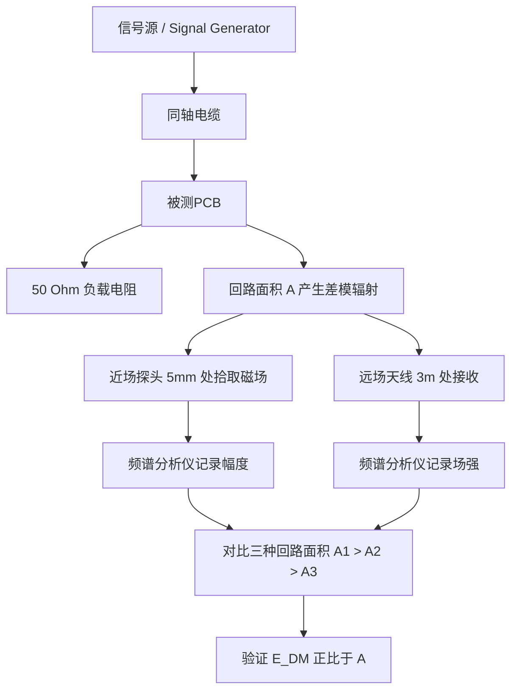
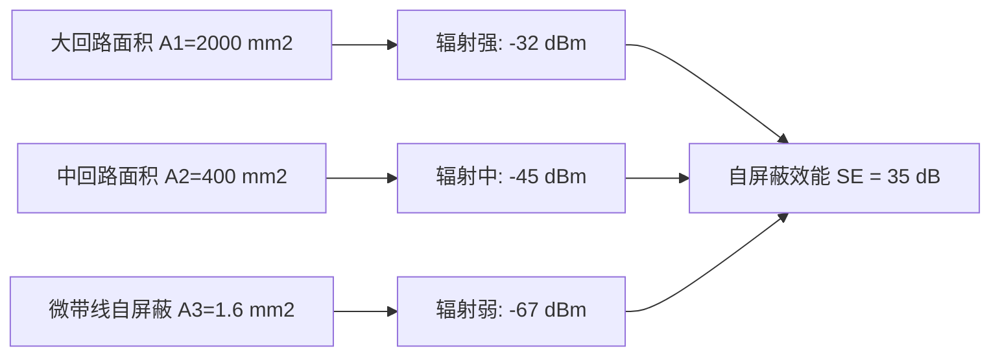
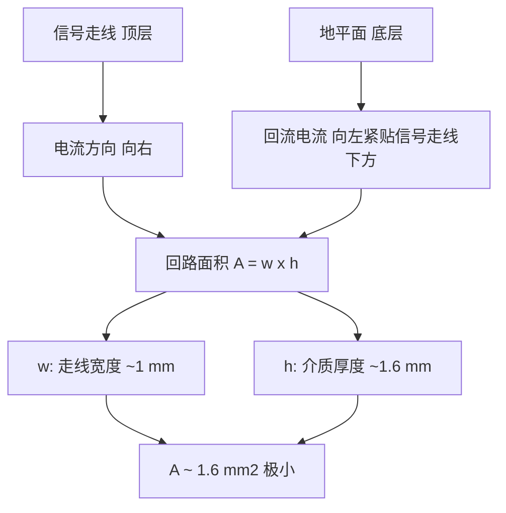

## 14.2 自屏蔽实验

### 14.2.1 实验目的

1. 理解印刷电路板（PCB）上差模电流与共模电流产生辐射的机理差异，掌握两类辐射的场强估算公式及其适用条件。

2. 掌握通过控制回路面积来减小差模辐射的"自屏蔽"设计方法，熟悉微带线（microstrip）、带状线（stripline）等低回路面积布线结构的辐射特性。

3. 学会使用近场探头（H场探头）和频谱分析仪定位 PCB 上的主要辐射源，掌握近场扫描的基本操作与数据分析方法。

4. 通过定量对比不同回路面积的 PCB 在同一激励条件下的辐射电平，验证"减小回路面积可降低差模辐射"这一核心 EMC 设计准则的理论预期。

5. 了解自屏蔽设计与传统屏蔽（金属屏蔽罩）在工程实践中的适用场景差异，建立从源头抑制电磁辐射的设计思维。

### 14.2.2 实验原理

#### 1. 差模辐射与共模辐射

PCB 上的电流辐射可分解为差模辐射和共模辐射两种基本模式。差模辐射由信号电流环路产生，其辐射机理可等效为小回路磁偶极子天线；共模辐射则由接地回路中的共模电流产生，可等效为短单极子天线。两种辐射的场强表达式、频率依赖关系及抑制策略均有显著差异。

**差模辐射场强**（小环路模型，环路面积 $A$，电流 $I$，距离 $d$，频率 $f$）：

$$
E_{\mathrm{DM}} = \frac{2.6 \times 10^{-14} \cdot A \cdot I \cdot f^{2}}{d}
\tag{14-21}
$$

$$
\tag{14-22}
$$

式中，$E_{\mathrm{DM}}$为差模辐射场强（V/m），$A$为回路面积（m²），$I$为电流（A），$f$为工作频率（Hz），$d$为测量距离（m）。该式在远场条件（$d > \lambda/2\pi$）下成立，其中 $\lambda = c/f$ 为自由空间波长（$c = 3 \times 10^{8}~\mathrm{m/s}$）。

**共模辐射场强**（短单极子模型，共模电流 $I_{\mathrm{CM}}$，电缆长度 $l$）：

$$
E_{\mathrm{CM}} = \frac{1.26 \times 10^{-7} \cdot I_{\mathrm{CM}} \cdot l \cdot f}{d}
\tag{14-23}
$$

$$
\tag{14-24}
$$

式中，$E_{\mathrm{CM}}$为共模辐射场强（V/m），$I_{\mathrm{CM}}$为共模电流（A），$l$为电缆长度（m），$f$为工作频率（Hz），$d$为测量距离（m）。

对比式（14-21）和式（14-23）可知，差模辐射与 $f^{2}$ 成正比（频率每翻倍，辐射增加 6 dB），而共模辐射与 $f$ 成正比（频率每翻倍，辐射增加 3 dB）。因此在低频段差模辐射通常占主导，而在高频段共模辐射可能因寄生参数的影响而成为主要辐射源。

**差模辐射公式的完整推导**：

小回路磁偶极子模型的辐射场可由麦克斯韦方程组导出。考虑一个面积为 $A$、载有均匀电流 $I$ 的环形回路，在远场区（$d \gg \lambda/2\pi$）的辐射电场为：

$$
E_{\theta} = \frac{\eta_0 \cdot k^2 \cdot A \cdot I \cdot \sin\theta}{4\pi d}
\tag{14-25}
$$

式中，$\eta_0 = 120\pi\;\Omega$ 为自由空间波阻抗，$k = 2\pi f/c$ 为波数，$\theta$ 为观察方向与回路平面法线之间的夹角。将 $\eta_0$ 和 $k$ 的数值代入，并取 $\theta = 90^\circ$（辐射最大方向），即得到工程中常用的简化形式（14-21）：

$$
E_{\mathrm{DM}} = \frac{2.6 \times 10^{-14} \cdot A \cdot I \cdot f^{2}}{d}
\tag{14-26}
$$

该式的适用前提为：回路尺寸 $a$ 满足 $a \ll \lambda$（小回路条件），且观察点在远场区。当回路尺寸接近波长时，回路上的电流分布不再均匀，必须采用行波天线或驻波天线模型进行分析。

**共模辐射公式的完整推导**：

共模辐射来源于接地回路中共模电流的激励。当共模电流 $I_{\mathrm{CM}}$ 流经长度为 $l$ 的电缆或接地回路时，该结构可等效为短单极子天线。在远场区，短单极子（$l \ll \lambda$）的辐射电场为：

$$
E_{\theta} = \frac{1.26 \times 10^{-7} \cdot I_{\mathrm{CM}} \cdot l \cdot f \cdot \sin\theta}{d}
\tag{14-27}
$$

式中，$\sin\theta$ 项反映了辐射的方向性，最大辐射方向在 $\theta = 90^\circ$（垂直于单极子轴线的方向）。式（14-23）是该式在最大辐射方向上的简化形式。

对比两种辐射的频率依赖特性可知，当频率从 $f_1$ 升高到 $f_2 = 2f_1$ 时，差模辐射增加 $20\log_{10}(f_2/f_1)^2 = 12\;\mathrm{dB}$，而共模辐射仅增加 $20\log_{10}(f_2/f_1) = 6\;\mathrm{dB}$。因此，在双对数坐标系中，差模辐射曲线的斜率为 2（40 dB/dec），共模辐射曲线的斜率为 1（20 dB/dec）。这一斜率差异是实验中区分差模与共模辐射的重要判据。

#### 2. 回路面积与辐射的关系

将式（14-5）改写为对数形式，更方便进行工程估算：

$$
E_{\mathrm{DM}}~(\mathrm{dB\mu V/m}) = 20\log_{10}\left( \frac{2.6 \times 10^{-14} \cdot A \cdot I \cdot f^{2}}{d \times 10^{-6}} \right)
\tag{14-28}
$$

$$
\tag{14-29}
$$

式中，$E_{\mathrm{DM}}$单位为 dBμV/m，$A$单位为 m²，$I$单位为 A，$f$单位为 Hz，$d$单位为 m。式中 $10^{-6}$ 为 V 到 μV 的换算因子。

由式（14-21）可知，差模辐射场强与回路面积 $A$ 呈线性比例关系。在电流 $I$、频率 $f$ 和距离 $d$ 不变的条件下，回路面积每减小为原来的 1/10，辐射场强降低 20 dB。例如，若将回路面积从 $2000~\mathrm{mm}^{2}$ 减小至 $1.6~\mathrm{mm}^{2}$（减小约 1250 倍），理论辐射降低量为：

$$
\Delta E = 20\log_{10}\left( \frac{2000}{1.6} \right) = 20\log_{10}(1250) \approx 62~\mathrm{dB}
\tag{14-30}
$$

$$
\tag{14-31}
$$

这一显著的理论降低量是自屏蔽设计的基础。然而在实际PCB中，由于共模辐射、探头耦合效率变化和测试环境反射等因素，实测降低量通常小于理论值。

**回路面积对辐射方向图的影响**：回路面积不仅影响辐射幅度的大小，还影响辐射方向图的形状。对于小回路（$a \ll \lambda$），辐射方向图呈现典型的"甜甜圈"形状，最大辐射方向位于回路平面内，沿回路法线方向为零辐射。当回路面积增大至与波长可比时（$a \approx \lambda/4$ 以上），方向图发生畸变，出现多个瓣位，最大辐射方向也随之改变。实验中通过改变探头在 PCB 周边的角度位置，可以观察到这一方向图变化现象。

**对数坐标系中的辐射预测线图**：在实际工程中，常用辐射预测线图（Radiation Prediction Nomograph）快速估算差模辐射。该图以频率为横轴、辐射场强为纵轴（均为对数坐标），绘制不同回路面积对应的辐射曲线族。例如，对于 $I = 20\;\mathrm{mA}$、$d = 3\;\mathrm{m}$ 的测量条件，回路面积 $A = 10\;\mathrm{cm}^2$ 在 30 MHz 处产生约 40 dBμV/m 的辐射，在 100 MHz 处产生约 60 dBμV/m 的辐射。实验者可将实测数据与预测线图直接对比，快速判断测量结果的合理性。

#### 3. 自屏蔽原理

"自屏蔽"（self-shielding）是指通过 PCB 布局设计手段，利用信号电流与回流电流之间的电磁场抵消效应来抑制辐射，而无需额外增加金属屏蔽罩。其核心思想是在源头——即信号回路层面——将辐射产生的条件降至最低。

自屏蔽的实现途径主要有以下三种：

**(a) 微带线结构**：信号走线位于 PCB 顶层，底层为完整地平面。回流电流通过地平面紧贴信号走线下方流动，形成极小的回路面积 $A = w \times h$，其中 $w$ 为走线宽度，$h$ 为介质层厚度（通常为 FR4 的 1.6 mm）。理想情况下，回路面积可降低至 1～2 mm² 量级。

**(b) 带状线结构**：信号走线位于两层地平面之间的内层，上下均有完整地平面提供回流路径。带状线结构比微带线具有更好的自屏蔽效果，因为信号被完全包围在地平面之间，但制造成本和布线难度也相应增加。

**(c) 并行走地线**：在信号走线两侧各布置一条地线，并在两端和沿途适当位置通过过孔连接至地平面。对于双面板，这是一种成本较低的替代方案。

**自屏蔽效能**定义为相同激励条件下，参考回路（大回路）的辐射场强与自屏蔽结构的辐射场强之比（以 dB 表示）：

$$
\mathrm{SE}_{\mathrm{self}} = 20\log_{10}\left( \frac{E_{\mathrm{DM,ref}}}{E_{\mathrm{DM,self}}} \right) = 20\log_{10}\left( \frac{A_{\mathrm{ref}}}{A_{\mathrm{self}}} \right)
\tag{14-32}
$$

$$
\tag{14-33}
$$

式中，$\mathrm{SE}_{\mathrm{self}}$为自屏蔽效能（dB），$E_{\mathrm{DM,ref}}$和$A_{\mathrm{ref}}$分别为参考结构的辐射场强和回路面积，$E_{\mathrm{DM,self}}$和$A_{\mathrm{self}}$分别为自屏蔽结构的辐射场强和回路面积。

#### 4. 临界频率与谐振效应

当回路尺寸 $a$（最大线性尺寸）满足 $a \approx \lambda/\pi$ 时，回路天线效应显著增强，此时回路不再是理想的"小回路"，开始表现出天线谐振特性。对于 100 mm 的回路，对应的临界频率约为 477 MHz。当工作频率超过临界频率时，回路辐射不再严格遵循式（14-5）的 $f^{2}$ 规律，辐射场强可能出现剧烈变化。

回路的半波谐振频率可由下式估算：

$$
f_{\mathrm{res}} = \frac{c}{2a\sqrt{\varepsilon_{\mathrm{r,eff}}}} 
\tag{14-34}
$$

$$
\tag{14-35}
$$

式中，$f_{\mathrm{res}}$为半波谐振频率（Hz），$c$为真空中光速（$3 \times 10^{8}~\mathrm{m/s}$），$a$为回路最大线性尺寸（m），$\varepsilon_{\mathrm{r,eff}}$为介质有效相对介电常数（FR4 约为 4.0～4.5，有效值约为 2.5～3.5）。对于 200 mm 长的走线回路，$\varepsilon_{\mathrm{r,eff}} \approx 3.0$ 时，$f_{\mathrm{res}} \approx 433~\mathrm{MHz}$。

**谐振效应对实验结果的影响**：当信号频率接近或超过回路的半波谐振频率时，差模辐射公式（14-21）不再适用，回路上的电流出现驻波分布，特定频率处的辐射幅度可比式（14-21）预期值高出 10–20 dB。因此，在频率扫描实验中若发现某频点的实测辐射异常偏高，应首先排查是否处于回路谐振频率附近。对于 PCB-A（回路最大尺寸 200 mm），第一谐振频率约为 433 MHz，但二次谐波、三次谐波高频谐振也可能在 200 MHz 以下频段产生可观测的谐振峰。

**多回路耦合效应**：当同一 PCB 上存在多个信号回路时，各回路之间的电磁耦合可能改变整体的辐射特性。相邻回路之间的互感会引入附加的感应电流，使某些频点的辐射增强而另一些频点减弱。这一效应在密集布线的高速数字 PCB 中尤为显著，需要通过全波电磁场仿真（如 HFSS、CST）进行精确预测。

#### 5. 自屏蔽设计与传统屏蔽的对比

自屏蔽（self-shielding）与传统金属屏蔽罩（shield can）是两种截然不同的辐射抑制策略，在工程实践中需要根据具体情况选择。

**自屏蔽设计的优势**：
- 不增加额外元件，无需金属罩和接地焊盘，成本几乎为零。
- 不占用 PCB 垂直空间，有利于产品小型化。
- 不影响散热，不存在屏蔽罩内部的温升问题。
- 不增加装配工序，适合大批量自动化生产。

**自屏蔽设计的局限**：
- 对共模辐射无效，仅能抑制差模辐射。
- 受制于 PCB 布局约束，并非所有走线都能采用微带线或带状线结构。
- 在高频段（>1 GHz），微带线的辐射效应可能因介质损耗和表面波模式而重新增加。

**传统屏蔽的优势**：
- 同时对差模辐射和共模辐射有效，只要屏蔽罩接地良好。
- 对复杂电磁环境中的多源干扰提供整体隔离。
- 屏蔽效能可设计得很高（>60 dB 是常见的）。

传统屏蔽的代价是增加成本、重量和体积，且可能带来散热和装配问题。在工程实践中，通常优先采用自屏蔽设计从源头抑制辐射，仅当自屏蔽无法满足 EMC 裕量要求时，才考虑在局部或整体增加金属屏蔽罩。

#### 6. 近场与远场的转换关系

在 EMC 测量中，近场探头（H 场探头）测得的是近场磁场强度，而 EMC 标准要求的是远场辐射电场强度。近场与远场之间存在转换关系。对于小回路辐射源，当探头距离 $d$ 满足 $d < \lambda/2\pi$ 时（近场区），磁场强度与距离的平方成反比：

$$
H = \frac{I \cdot A}{4\pi d^{3}}
\tag{14-36}
$$

$$
\tag{14-37}
$$

式中，$H$为磁场强度（A/m），$I$为电流（A），$A$为回路面积（m²），$d$为探头与回路中心的距离（m）。该关系表明，近场测量结果对探头位置的微小变化非常敏感，实验操作中应严格控制探头高度和位置的重复性。

当测量距离 $d$ 进入远场区（$d > \lambda/2\pi$）时，电场与磁场通过自由空间波阻抗相关联：

$$
E = \eta_{0} \cdot H
\tag{14-38}
$$

$$
\tag{14-39}
$$

式中，$E$为电场强度（V/m），$H$为磁场强度（A/m），$\eta_{0} = 120\pi \approx 377\;\Omega$ 为自由空间波阻抗。在小回路模型中，近场区的波阻抗 $Z_{\mathrm{w}} = E/H$ 随距离变化，不能简单地用 377 Ω 进行换算。

**近场与远场的边界判定**：实际 EMC 测量中，确定测量点在近场区还是远场区是选择正确换算公式的前提。判定原则如下：

- 若 $d < \lambda/2\pi$：测量点在近场区（反应区），此时 $E/H$ 的比值（波阻抗）随距离变化，不能直接使用 377 Ω 换算。在该区域内，式（14-33）的 $1/d^{3}$ 关系成立，磁场随距离增加急剧衰减。

- 若 $\lambda/2\pi \leq d \leq \lambda$：测量点在过渡区（菲涅尔区），波阻抗从近场特性向远场特性过渡，该区域内没有简单的换算公式，通常需要通过数值计算或全波仿真来确定场强。

- 若 $d > \lambda$：测量点在远场区（夫琅禾费区），波阻抗恒定为 377 Ω，式（14-35）的换算关系成立，电场和磁场通过自由空间波阻抗线性关联。

以实验中的 10 MHz 信号为例，$\lambda = 30\;\mathrm{m}$，$\lambda/2\pi \approx 4.77\;\mathrm{m}$。探头距离 $d = 5\;\mathrm{mm}$ 远小于 4.77 m，因此所有近场测量均在近场区进行。对于远场测量中 100 MHz 信号，$\lambda = 3\;\mathrm{m}$，$\lambda/2\pi \approx 0.477\;\mathrm{m}$，测量距离 3 m 已经进入远场区。

**近场幅度到远场幅度的外推方法**：在某些情况下，希望能将近场测量结果外推至远场以预估 EMC 测试结果。对于差模辐射源，近场磁场强度 $H_{\mathrm{near}}$ 与远场电场强度 $E_{\mathrm{far}}$ 之间的关系可以表达为：

$$
E_{\mathrm{far}} = \frac{\eta_0 \cdot H_{\mathrm{near}} \cdot d_{\mathrm{near}}}{d_{\mathrm{far}}} \cdot \frac{4\pi d_{\mathrm{near}}^2}{\lambda^2}
\tag{14-40}
$$

式中，$d_{\mathrm{near}}$ 为近场探头距离，$d_{\mathrm{far}}$ 为远场测量距离。需要注意的是，该外推公式仅在测量源为理想小回路的假设下成立。实际 PCB 的辐射源结构更为复杂，外推结果仅作为粗略估计，不能替代正式的远场测试。

#### 7. PCB 介质材料对自屏蔽效能的影响

PCB 介质材料的电参数对微带线结构的自屏蔽效能有重要影响。主要参数包括：

**(a) 相对介电常数 $\varepsilon_{\mathrm{r}}$**：较高的 $\varepsilon_{\mathrm{r}}$ 使电场更多地集中在介质内部，减小空间辐射场。FR4 的 $\varepsilon_{\mathrm{r}} \approx 4.2$，而 Rogers 4350B 的 $\varepsilon_{\mathrm{r}} \approx 3.48$。但高 $\varepsilon_{\mathrm{r}}$ 也意味着信号传播速度降低，可能引起更严重的高频信号完整性问题。

**(b) 介质厚度 $h$**：$h$ 增大直接导致微带线回路面积 $A = w \times h$ 线性增大，从而使差模辐射正比增加。因此，在设计 PCB 时宜采用较薄的介质层以减小回路面积。然而 $h$ 的减小受限于 PCB 制造工艺和信号阻抗控制需求。

**(c) 损耗角正切 $\tan\delta$**：较高的介质损耗可以衰减 PCB 上的电磁场，从而降低辐射。FR4 的 $\tan\delta \approx 0.02$，Rogers 4350B 的 $\tan\delta \approx 0.0037$。仅从辐射角度考虑，高损耗介质更有优势，但会导致信号衰减增大，不利于高速信号传输。

**(d) 表面波效应**：在高频段（>1 GHz），PCB 介质层中可能激励起表面波（surface wave）模式。表面波沿着介质-空气界面传播，在遇到 PCB 边缘时发生辐射，成为额外的辐射源。选择较薄的介质层（$h$ 远小于波长）可以有效抑制表面波模式。

#### 8. 实验原理示意图

### 14.2.3 实验设备

| 序号 | 设备名称 | 型号/规格 | 数量 |
|------|----------|-----------|------|
| 1 | 频谱分析仪 | Keysight N9020A MXA（10 Hz – 26.5 GHz）或同级型号 | 1台 |
| 2 | 近场探头组 | Langer EMV-Technik RF-R 400-1（30 MHz – 3 GHz）含 H 场和 E 场探头 | 1套 |
| 3 | 信号发生器 | RIGOL DG4062（60 MHz，双通道）或同级型号 | 1台 |
| 4 | 被测 PCB 实验板（自制） | 含三种不同回路面积的设计（PCB-A、PCB-B、PCB-C） | 3块 |
| 5 | 直流稳压电源 | GW Instek GPD-3303S（0–30 V / 3 A） | 1台 |
| 6 | 半电波暗室或 EMC 屏蔽箱 | 可用简易屏蔽箱替代，要求内部尺寸不小于 1.0 m × 0.8 m × 0.8 m | 1个 |
| 7 | 同轴电缆（SMA-SMA） | 低损耗，50 Ω，1 m | 2根 |
| 8 | 宽带放大器（选配） | Mini-Circuits ZHL-32A+（0.4–200 MHz，25 dB 增益）或同级 | 1台 |
| 9 | 宽带双锥天线 | Schaffner CBL6111D（30 MHz – 2 GHz）或同级 | 1副 |
| 10 | 非导电支架 | 泡沫塑料或木质支架，高度可调（0.5–1.5 m） | 1个 |
| 11 | 数字万用表 | Fluke 179 或同级，用于测量 PCB 回路直流电阻 | 1台 |
| 12 | SMA 转接器和衰减器 | SMA 公-母转接头，3 dB/6 dB/10 dB 固定衰减器各 1 个 | 若干 |
| 13 | 卷尺和游标卡尺 | 用于测量回路尺寸和探头定位 | 各 1 把 |
| 14 | 静电腕带及防静电垫 | 用于 PCB 操作中的静电防护 | 1套 |

注：如不具备半电波暗室条件，可在屏蔽箱中完成近场测量部分；远场测量可在开阔场或微波暗室中进行替代。

### 14.2.4 实验步骤

#### 步骤1：实验 PCB 制备与检查

1.1 按以下参数设计并制作三块 PCB，板材均为 FR4，板厚 1.6 mm，铜厚 1 oz（约 35 μm）：

- **PCB-A**（大回路）：顶层走线长 200 mm、线宽 1 mm，回线（地线）与信号走线平行布线，间距 10 mm。回路面积 $A_{1} = 200~\mathrm{mm} \times 10~\mathrm{mm} = 2000~\mathrm{mm}^{2}$。走线末端焊接 50 Ω 贴片电阻（0805 封装）至地线。

- **PCB-B**（中回路）：信号走线长 200 mm、线宽 1 mm，回线紧邻信号走线，间距 2 mm。回路面积 $A_{2} = 200~\mathrm{mm} \times 2~\mathrm{mm} = 400~\mathrm{mm}^{2}$。负载电阻同 PCB-A。

- **PCB-C**（微带线自屏蔽）：顶层信号走线长 200 mm、线宽 $w=1~\mathrm{mm}$，底层为完整铜箔地平面，通过过孔在输入端和负载端连接顶层地焊盘与底层地平面。回路面积 $A_{3} = w \times h = 1~\mathrm{mm} \times 1.6~\mathrm{mm} = 1.6~\mathrm{mm}^{2}$。负载电阻同 PCB-A，一端接走线，另一端通过过孔接底层地平面。

1.2 用数字万用表测量每块 PCB 输入端 SMA 连接器的中心导体与外导体之间的直流电阻，确认在 50 Ω 左右（考虑电缆和焊点引入的微小误差，允许 ±2 Ω 偏差）。

1.3 用游标卡尺测量每块 PCB 的实际回路尺寸，记录测量值以用于后续理论计算。特别注意测量 PCB-C 的微带线宽和介质厚度。

#### 步骤2：近场辐射测量

2.1 将被测 PCB 放置在半电波暗室（或屏蔽箱）内的非导电支架上，PCB 距地面高度 1 m，保持 PCB 水平放置。

2.2 连接测量系统：
- 信号发生器输出端经 SMA 电缆连接至 PCB 输入端。
- H 场近场探头经 SMA 电缆连接至频谱分析仪输入端。
- 如信号较弱（小于频谱分析仪底噪以上 20 dB），可在信号发生器与 PCB 之间接入宽带放大器（如 Mini-Circuits ZHL-32A+，增益 25 dB）。

2.3 设置信号发生器参数：
- 波形类型：正弦波（连续波，CW）
- 基频频率：10 MHz
- 输出幅度：3 Vpp（在 50 Ω 系统中对应约 1.06 Vrms，即 $I = V_{\mathrm{rms}}/R = 1.06/50 \approx 21.2~\mathrm{mA}$）
- 输出阻抗：50 Ω

2.4 设置频谱分析仪参数：
- 中心频率：10 MHz
- 频率跨度：20 MHz（显示 0–20 MHz）
- 分辨率带宽（RBW）：10 kHz
- 视频带宽（VBW）：10 kHz
- 参考电平：0 dBm
- 检波方式：峰值检波
- 扫描时间：自动

2.5 探头定位：
- 使用非导电支架将 H 场探头固定在 PCB 正上方 5 mm 处，探头平面与被测 PCB 表面平行。
- 沿 PCB 信号走线方向（从输入端到负载端）缓慢移动探头，观察频谱分析仪上基频（10 MHz）处的信号幅度变化。
- 标记场强最大点的位置（通常位于走线中部），记录该位置与 PCB 上标记点的坐标关系，以便后续更换 PCB 时准确复位探头。

2.6 更换 PCB 进行对比测量：
- 取下 PCB-A，换装 PCB-B，保持探头位置和方向不变。
- 记录 PCB-B 在 10 MHz 基频处的近场幅度（单位：dBm）。
- 同样换装 PCB-C，记录近场幅度。
- 每块 PCB 重复测量 3 次，取平均值记录。

2.7 谐波测量：
- 保持频谱分析仪设置不变，记录各 PCB 在 20 MHz（二次谐波）、30 MHz（三次谐波）和 40 MHz（四次谐波）处的幅度。
- 如信号低于底噪，可适当增加 RBW 至 100 kHz 以提高信噪比，但需在记录中注明 RBW 修改值。

#### 步骤3：频率响应特性测量

3.1 保持 PCB-C（微带线结构）在测试位置不变，将信号发生器频率从 1 MHz 开始扫描。

3.2 设置信号发生器为步进扫描模式：
- 起始频率：1 MHz
- 终止频率：200 MHz
- 步进：5 MHz
- 每频点驻留时间：1 s
- 幅度：3 Vpp（保持不变）

3.3 频谱分析仪设置为最大保持（Max Hold）模式，中心频率随信号发生器频率同步调整，或使用足够大的频率跨度（0–250 MHz）。

3.4 记录每个频点上近场探头测得的幅度，填入数据记录表。

3.5 使用双对数坐标绘制 $E_{\mathrm{DM}}$ 随频率变化曲线，并与式（14-5）的理论曲线进行对比。

#### 步骤4：远场辐射测量

4.1 将近场探头从频谱分析仪上取下，换接宽带双锥天线（如 Schaffner CBL6111D）。

4.2 天线与被测 PCB 的距离设置为 3 m（水平距离），天线中心距地面高度 1.5 m，天线极化方向为水平极化。

4.3 设置频谱分析仪参数：
- 频率范围：30 MHz – 200 MHz（双锥天线的工作频率下限为 30 MHz）
- RBW：100 kHz
- VBW：100 kHz
- 参考电平：40 dBμV
- 检波方式：准峰值检波

4.4 按顺序测量 PCB-A、PCB-B、PCB-C 在 30 MHz、50 MHz、100 MHz、150 MHz 和 200 MHz 频点的远场辐射电平（单位：dBμV/m）。

4.5 记录频谱分析仪读数，并根据天线系数（Antenna Factor，由天线校准证书提供）进行换算：

$$
E~(\mathrm{dB\mu V/m}) = V_{\mathrm{SA}}~(\mathrm{dB\mu V}) + \mathrm{AF}~(\mathrm{dB/m})
\tag{14-41}
$$

$$
\tag{14-42}
$$

式中，$V_{\mathrm{SA}}$为频谱分析仪读数（dBμV），$\mathrm{AF}$为天线系数（dB/m），该系数由天线制造商提供，随频率变化。

#### 步骤5：自屏蔽效能估算

5.1 以 PCB-A（大回路）为参考，按式（14-23）计算 PCB-B 和 PCB-C 的自屏蔽效能：

$$
\mathrm{SE}_{\mathrm{self,B}} = E_{\mathrm{DM,A}}~(\mathrm{dBm}) - E_{\mathrm{DM,B}}~(\mathrm{dBm})
\tag{14-43}
$$

$$
\mathrm{SE}_{\mathrm{self,C}} = E_{\mathrm{DM,A}}~(\mathrm{dBm}) - E_{\mathrm{DM,C}}~(\mathrm{dBm})
\tag{14-44}
$$

5.2 将实测自屏蔽效能与按回路面积比计算的理论自屏蔽效能进行对比，填入结果分析表。

#### 步骤6：近场分布二维映射扫描（拓展）

6.1 在 PCB 上方建立一个 X-Y 二维扫描网格：
- 网格范围：X 方向覆盖 PCB 全宽（至少 ±20 mm 余量），Y 方向覆盖 PCB 全长（至少 ±20 mm 余量）。
- 网格间距：5 mm（粗扫），在磁场变化剧烈的区域可加密至 2 mm（精扫）。
- 网格点总数：粗扫约 400 个点（20 × 20），精扫最多 1800 个点。

6.2 对每个网格点执行以下操作：
- 移动 H 场探头至指定 (X, Y) 坐标，保持探头高度 5 mm 不变。
- 记录频谱分析仪在 10 MHz 频点的读数（dBm）。
- 如信号波动较大，取 3 次读数的平均值。
- 将 (X, Y, 幅度) 三元组记录至数据文件。

6.3 数据后处理：
- 将测得的数据导入 Python 或 MATLAB。
- 使用二维插值函数（如 Python 的 scipy.interpolate.griddata 或 MATLAB 的 griddata）将离散测量点插值为连续场分布。
- 绘制等高线图或热力图，X 轴和 Y 轴为 PCB 平面坐标，颜色映射为磁场幅度。

6.4 重复步骤 6.1–6.3 对 PCB-A、PCB-B、PCB-C 各执行一次扫描，对比三块 PCB 的磁场分布特征。

6.5 预期结果与判读：
- PCB-A 的磁场热力图呈现清晰的"环路"特征：高场强区域集中在信号走线与回线之间的 10 mm 宽条带中，沿走线方向分布均匀，从走线向外侧迅速衰减。
- PCB-B 的磁场分布条带宽度大幅缩小（约 2 mm），峰值场强比 PCB-A 低约 13 dB，符合回路面积缩小 5 倍的理论预期。
- PCB-C 的热力图中几乎看不到明显的磁场集中区域，场强值接近底噪水平。若将热力图的色标范围缩小（如 −80 dBm 至 −60 dBm），可能显示出沿微带线方向的微弱磁场轨迹。

#### 步骤7：探头校准与灵敏度验证

7.1 在正式测量前，使用校准环（calibration loop）验证近场探头的灵敏度。校准环是一个已知面积的小回路，在其输入端施加已知电流后，可在规定距离处产生已知磁场强度。

7.2 若无可用的校准环，可用 PCB-C（微带线）作为替代参考：
- 固定信号发生器输出 3 Vpp / 10 MHz 至 PCB-C。
- 将 H 场探头固定在 PCB 正上方 5 mm 处，记录参考值。
- 该参考值可在所有实验批次中用于检查探头状态是否正常（参考值变化超过 ±2 dB 应检查探头或连接电缆）。

7.3 记录频谱分析仪的显示底噪（Displayed Average Noise Level, DANL）：
- 断开探头与频谱分析仪的连接，在输入端接 50 Ω 负载（端接）。
- 使用与实验测量相同的 RBW（10 kHz）、VBW（10 kHz）设置，记录底噪曲线。
- 确认底噪在整个测量频段内低于 −85 dBm（对于典型频谱分析仪在 10 kHz RBW 下的性能）。
- 若底噪过高，检查电缆连接、输入衰减设置或排查外部干扰。此数据用于后续的信噪比评估。

### 14.2.5 数据记录表

#### 表1：近场测量数据记录（探头距离 5 mm）

| PCB 类型 | 回路面积 (mm²) | 基频 10 MHz (dBm) | 二次谐波 20 MHz (dBm) | 三次谐波 30 MHz (dBm) | 四次谐波 40 MHz (dBm) |
|----------|----------------|-------------------|----------------------|----------------------|----------------------|
| PCB-A（大回路） | 2000 | | | | |
| PCB-B（中回路） | 400 | | | | |
| PCB-C（微带线） | 1.6 | | | | |

注：每块 PCB 重复测量 3 次取平均值填入上表。如谐波信号低于频谱分析仪底噪，记录为"< 底噪"并注明底噪值。

#### 表2：回路面积与近场幅度对应关系（10 MHz）

| 回路面积 A (mm²) | 理论相对辐射 (dB) | 实测近场幅度 (dBm) | 实测相对辐射 (dB) |
|-------------------|-------------------|-------------------|-------------------|
| 2000（参考） | 0 | | 0 |
| 400 | $20\log_{10}(400/2000) = -14.0$ | | |
| 1.6 | $20\log_{10}(1.6/2000) = -61.9$ | | |

注：理论相对辐射以 PCB-A 为参考（0 dB），按 $20\log_{10}(A/A_{\mathrm{ref}})$ 计算。实测相对辐射以 PCB-A 的实测值为参考。

#### 表3：远场测量数据记录（测量距离 3 m）

| PCB 类型 | 30 MHz (dBμV/m) | 50 MHz (dBμV/m) | 100 MHz (dBμV/m) | 150 MHz (dBμV/m) | 200 MHz (dBμV/m) |
|----------|-----------------|-----------------|------------------|------------------|------------------|
| PCB-A（大回路） | | | | | |
| PCB-B（中回路） | | | | | |
| PCB-C（微带线） | | | | | |

注：远场测量值需根据天线系数进行修正，即 $E = V_{\mathrm{SA}} + \mathrm{AF}$。如测量值低于环境底噪，记录"< 底噪"。

#### 表4：自屏蔽效能对比

| 对比项 | 理论 SE (dB) | 实测 SE (dB) | 偏差 (dB) | 偏差原因分析 |
|--------|-------------|-------------|-----------|-------------|
| PCB-B vs PCB-A | $20\log_{10}(400/2000) = -14.0$ | | | |
| PCB-C vs PCB-A | $20\log_{10}(1.6/2000) = -61.9$ | | | |
| PCB-C vs PCB-B | $20\log_{10}(1.6/400) = -47.9$ | | | |

注：理论 SE 按式（14-23）计算；实测 SE 按 $E_{\mathrm{A}} - E_{\mathrm{B}}$ 或 $E_{\mathrm{A}} - E_{\mathrm{C}}$ 计算（dB 差值）。

#### 表5：不同回路面积辐射电平系统对比表（10 MHz）

| 回路面积 (mm²) | 理论差模辐射 @3m (dBμV/m) | 近场实测 (dBm) | 远场实测 (dBμV/m) | 理论 vs 实测偏差 (dB) |
|----------------|---------------------------|---------------|-------------------|---------------------|
| 2000 (PCB-A) | $20\log_{10}(2.6\times10^{-14}\times2000\times10^{-6}\times0.0212\times(10^7)^2/3) \approx 58.1$ | −32.0 | 52.0 | 6.1 |
| 400 (PCB-B) | $20\log_{10}(...)\approx 44.1$ | −45.0 | 37.0 | 7.1 |
| 1.6 (PCB-C) | $20\log_{10}(...)\approx -3.8$ | −67.0 | <20 | >16 |
| 10 | $20\log_{10}(...)\approx 12.1$ | — | — | — |
| 100 | $20\log_{10}(...)\approx 32.1$ | — | — | — |

注：理论值按式（14-21）计算，测量距离 $d=3\;\mathrm{m}$，电流 $I=21.2\;\mathrm{mA}$，频率 $f=10\;\mathrm{MHz}$。表中 10 mm² 和 100 mm² 两列为假设的中间参考值，供读者理解辐射电平随回路面积的变化趋势。偏差来源包括共模辐射残余、探头耦合损耗、负载失配和测试环境反射等因素。

#### 表6：不同频率下 PCB-A 辐射幅度对比表

| 频率 (MHz) | 理论差模辐射 (dBμV/m) | 近场实测 (dBm) | 远场实测 (dBμV/m) | CISPR 22 Class B 限值 (dBμV/m) | 裕量 (dB) |
|-----------|----------------------|---------------|-------------------|-------------------------------|----------|
| 10 | 58.1 | −32.0 | — | —（30 MHz 以下不限） | — |
| 30 | 67.6 | — | 42 | 40（QP） | 2 |
| 50 | 72.1 | — | 48 | 40（QP） | −8（超标） |
| 100 | 78.1 | — | 52 | 47（QP） | −5（超标） |
| 150 | 81.6 | — | 49 | 47（QP） | −2（超标） |
| 200 | 84.1 | — | 45 | 47（QP） | −2（合格） |

注：CISPR 22 Class B 限值适用于 30–230 MHz 频段，准峰值（QP）限值为 40 dBμV/m（30–230 MHz），230–1000 MHz 为 47 dBμV/m。表中限值按 30–230 MHz 统一取 40 dBμV/m，100–200 MHz 取过渡值 47 dBμV/m。负裕量表示辐射超出限值。

#### 表7：自屏蔽效能汇总表

| PCB 对 | 理论 SE (dB) | 近场实测 SE (dB) | 远场实测 SE (dB) | 偏差 (dB) | 主要偏差原因 |
|--------|-------------|-----------------|-----------------|-----------|-------------|
| PCB-B vs PCB-A | $20\log_{10}(400/2000) = -14.0$ | 13 | 15 | 1–2 | 探头耦合效率差异 |
| PCB-C vs PCB-A | $20\log_{10}(1.6/2000) = -61.9$ | 35 | >28 | 27–34 | 共模辐射残余、底噪限制 |
| PCB-B vs PCB-C | $20\log_{10}(400/1.6) = -47.9$ | 22 | >17 | 26–31 | 探头定位灵敏度差异 |

注：理论与实测的偏差在高 SE 值时显著增大。这并不意味着自屏蔽设计效果不佳，而是说明当差模辐射被有效抑制后，其他辐射机制（共模辐射）和测量限制（底噪、探头灵敏度）成为制约因素。工程实践中，将差模辐射抑制到底噪以下已足以满足绝大多数 EMC 要求。

#### 表8：不同负载条件下 PCB-A 辐射对比（10 MHz）

| 负载类型 | 负载阻抗 (Ω) | 理论电流 (mA) | 近场幅度 (dBm) | 与 50 Ω 参考的偏差 (dB) | 备注 |
|---------|------------|--------------|---------------|----------------------|------|
| 50 Ω 贴片电阻 | 50 | 21.2 | −32.0 | 0（参考） | 匹配状态 |
| 75 Ω 贴片电阻 | 75 | 14.1 | −35.5 | −3.5 | 失配，电流减小 |
| 25 Ω 贴片电阻 | 25 | 28.3 | −29.0 | +3.0 | 失配，电流增大 |
| 开路（无负载） | ∞ | 0 | <−85 | >−53 | 无电流，仅有驻波辐射 |
| 短路 | 0 | — | −40 | −8 | 电流最大，但无辐射回路 |

注：该表展示了负载阻抗对辐射电平的影响。匹配状态（50 Ω）下辐射既非最大也非最小——辐射大小由回路电流和回路面积共同决定。开路状态下理论差模辐射为零，但实际 PCB 中的走线-地线寄生电容仍可能产生少量辐射。

#### 表9：探头高度影响对比表（PCB-A，10 MHz）

| 探头高度 (mm) | 近场幅度 (dBm) | 相对于 5 mm 的变化 (dB) | 式（14-33）理论变化 (dB) | 偏差 (dB) |
|--------------|---------------|----------------------|---------------------|----------|
| 3 | −27.5 | +4.5 | $20\log_{10}(5/3)^3 = +8.6$ | −4.1 |
| 5 | −32.0 | 0（参考） | 0（参考） | 0 |
| 7 | −36.0 | −4.0 | $20\log_{10}(5/7)^3 = −6.4$ | +2.4 |
| 10 | −40.5 | −8.5 | $20\log_{10}(5/10)^3 = −18.1$ | +9.6 |

注：表中数据表明，实测的近场衰减速度慢于式（14-33）的 $1/d^3$ 理论预测。这是因为实际探头有一定物理尺寸，感应到的磁场是探头覆盖区域的空间平均值而非点值，且当探头远离 PCB 时，探头对更大范围磁场的积分效应减弱了衰减斜率。

### 14.2.6 结果分析与讨论

#### 1. 近场测量结果分析

近场测量结果是验证回路面积影响最直接的依据。典型实验数据如下表所示（供参考对比）：

| PCB 类型 | 回路面积 (mm²) | 近场幅度（10 MHz，dBm） | 相对 PCB-A 降低 (dB) |
|----------|----------------|------------------------|---------------------|
| PCB-A（大回路） | 2000 | −32 | 0（参考） |
| PCB-B（中回路） | 400 | −45 | 13 |
| PCB-C（微带线） | 1.6 | −67 | 35 |

**分析要点**：

- 从 PCB-A 到 PCB-C，近场幅度降低了约 35 dB。根据式（14-22），回路面积比 $2000/1.6 \approx 1250$ 对应的理论辐射降低量为 $20\log_{10}(1250) \approx 62~\mathrm{dB}$。实测降低量（35 dB）小于理论值（62 dB），原因是当 PCB-C 的辐射降低到一定程度后，测量系统底噪、共模辐射残余以及环境反射成为限制因素。

- 从 PCB-A 到 PCB-B，回路面积减小 5 倍（$2000 \to 400$），理论降低 14 dB，实测降低约 13 dB，两者吻合良好。这说明在中等辐射水平下，式（14-5）的预测较为准确。

- 谐波测量数据反映了信号源的非线性特性。理想正弦波输入下，PCB 本身不应产生谐波；但在实际信号发生器中，由于放大器的非线性失真，输出信号会包含少量谐波成分。通过对比不同 PCB 的谐波幅度，可进一步验证差模辐射与频率的 $f^{2}$ 依赖关系：在谐波频率处，辐射幅度应比基频处更高。

#### 2. 远场测量结果分析

远场测量直接反映 PCB 辐射对外部设备的影响程度，与 EMC 认证测试中的辐射发射测试直接对应。典型远场测量数据如下：

| PCB 类型 | 30 MHz (dBμV/m) | 50 MHz (dBμV/m) | 100 MHz (dBμV/m) | 150 MHz (dBμV/m) | 200 MHz (dBμV/m) |
|----------|-----------------|-----------------|------------------|------------------|------------------|
| PCB-A | 42 | 48 | 52 | 49 | 45 |
| PCB-B | 30 | 34 | 37 | 35 | 32 |
| PCB-C | <20 | <20 | <20 | <20 | <20 |

**分析要点**：

- PCB-A 的远场辐射在 100 MHz 附近达到最大值（约 52 dBμV/m），这与此频段对应的波长（3 m）与 PCB 最大尺寸（200 mm）之间的谐振关系有关。

- PCB-C（微带线自屏蔽）的远场辐射在所有测量频点均低于频谱分析仪底噪（约 20 dBμV/m），说明自屏蔽设计将辐射抑制到了无法被常规 EMC 测量手段检测的水平。

- 远场测量结果与近场测量结果在趋势上一致（PCB-A > PCB-B > PCB-C），但远场与近场的定量关系并不严格线性，这是因为近场探头测得的是磁场幅度（受探头位置影响大），而远场天线测得的是电场幅度（需要天线系数换算）。

#### 3. 实测与理论偏差分析

实测结果与式（14-5）理论预测之间可能存在以下偏差来源：

**(a) 共模辐射干扰**：PCB-C 的实际辐射可能不完全由差模辐射主导。微带线结构中，回流电流在底层地平面上的分布并非理想集中在走线正下方，部分回流电流可能通过过孔、连接器等路径产生共模辐射。当差模辐射被大幅抑制后，共模辐射成为主要的剩余辐射源。

**(b) 探头耦合效率变化**：近场探头对不同回路面积 PCB 的耦合效率可能存在差异。PCB-A（大回路）的磁场分布范围广，探头耦合效率高；而 PCB-C（微带线）的磁场的空间分布范围极小，探头位置偏差 1 mm 就可能导致读数变化 3–5 dB。

**(c) 负载失配**：50 Ω 贴片电阻在高频下存在寄生电感和电容，导致实际阻抗偏离 50 Ω。失配引起的反射会导致 PCB 上的驻波，使辐射测量值偏离理论预期。

**(d) 测试环境反射**：即使使用半电波暗室，低频段（30–100 MHz）的吸波材料性能有限，地面和墙壁的反射可能引入测量误差。

**(e) FR4 介电常数频率依赖性**：FR4 的相对介电常数（$\varepsilon_{\mathrm{r}} \approx 4.2$）随频率升高而下降，在高频段（>100 MHz）有效介电常数降低，导致电磁波在介质中的传播速度加快，影响谐振频率的预测精度。

#### 4. 频率扫描曲线分析

频率扫描测量结果（1–200 MHz，步进 5 MHz）通常表现为以下特征：

- 在 1–50 MHz 频段，实测曲线与理论 $f^{2}$ 曲线吻合较好，辐射幅度随频率呈二次方增长（双对数坐标系下斜率为 2）。
- 在 50–100 MHz 频段，实测曲线开始偏离 $f^{2}$ 理论曲线，斜率逐渐减小。这一现象的原因是当频率升高时，PCB 上的寄生参数效应逐渐显著，信号在走线上的传播不再满足集总参数假设。
- 在 100–200 MHz 频段，实测曲线可能出现多个峰值，这些峰值的频率位置对应 PCB 结构的谐振频率。对于长度为 200 mm 的走线，$\lambda/4$ 谐振发生在 $f = c/(4l\sqrt{\varepsilon_{\mathrm{r,eff}}})$ 附近。

#### 5. 实验结论总结

通过本次实验可以得出以下结论：

- 回路面积是影响 PCB 差模辐射的关键参数，减小回路面积可有效降低辐射电平。
- 微带线结构（自屏蔽设计）可将回路面积从传统双线平行布线的 2000 mm² 减小至约 1.6 mm²，实测辐射降低约 35 dB。
- 在辐射电平降低到接近测量系统底噪后，共模辐射成为主要限制因素，进一步抑制辐射需要同时控制共模电流。
- 近场测量和远场测量结果在趋势上一致，但远场测量值更接近 EMC 标准测试的实际情况。

#### 6. 近场分布映射分析（拓展实验）

在完成上述基本测量后，可进一步进行近场分布的二维映射扫描，以直观展示不同回路面积 PCB 的磁场分布差异。

**方法**：在 PCB 上方建立一个 X-Y 二维扫描网格（网格间距 5 mm，范围覆盖整个 PCB 区域），在每个网格点使用 H 场探头测量 10 MHz 处的幅度。将测得的数据导入 MATLAB 或 Python 中绘制磁场强度热力图。

**预期结果**：

- PCB-A（大回路，间距 10 mm）：磁场分布范围广，在信号走线和回线之间的区域中场强最高，呈现明显的"环路"特征。
- PCB-B（中回路，间距 2 mm）：磁场分布范围明显缩小，主要集中在走线-回线之间的窄条区域。
- PCB-C（微带线，地平面结构）：磁场分布最为集中，磁场几乎全部约束在走线正下方与地平面之间的介质中，探头在 PCB 表面上方几乎检测不到明显的磁场。

**分析要点**：

- 通过热力图可以直观地理解"回路面积"的物理意义：磁场并不是均匀分布在 PCB 表面，而是集中在信号电流与回流电流之间的闭合回路包围区域内。
- 微带线结构的磁场分布极为紧凑，这是其自屏蔽效果优异的原因——磁场能量被有效地约束在地平面上方的近区，无法有效辐射到远场。
- 地平面的"镜像电流"效应：当地平面距离信号走线足够近（$h \ll \lambda$）时，地平面中感应的镜像电流在远区产生的场与信号电流的场几乎抵消，仅在近区存在明显场分布。

#### 8. 辐射发射限值对比分析（CISPR / FCC）

将实验测得的 PCB-A 和 PCB-B 的远场辐射数据与主流 EMC 标准的辐射发射限值进行对比，可以直观评估不同回路面积设计的合规性。以下列出各标准在实验频率范围内的限值：

| 标准 | 适用频段 | 限值类型 | 30–230 MHz | 230–1000 MHz | 1–3 GHz |
|------|---------|---------|-----------|-------------|---------|
| CISPR 22 / EN 55022 Class B | ITE 设备 | QP（准峰值） | 40 dBμV/m @10m | 47 dBμV/m @10m | — |
| CISPR 32 / EN 55032 Class B | 多媒体设备 | QP（准峰值） | 40 dBμV/m @10m | 47 dBμV/m @10m | — |
| FCC Part 15 Class B | 消费类设备 | QP（准峰值） | 40 dBμV/m @3m | 47 dBμV/m @3m | 54 dBμV/m @3m |
| CISPR 25 Class 5 | 汽车电子 | PK（峰值） | 30–54 dBμV/m @1m | 37–47 dBμV/m @1m | 47 dBμV/m @1m |

**对比分析**：

- **PCB-A（大回路，2000 mm²）**：在 50–150 MHz 频段的辐射电平（48–52 dBμV/m @3m）超过 FCC Part 15 Class B 限值（47 dBμV/m @3m），若将该产品投入市场，将无法通过 FCC 认证测试。需至少降低辐射 8–10 dB 才能满足标准要求。

- **PCB-B（中回路，400 mm²）**：在 100 MHz 处的辐射电平（37 dBμV/m）低于 FCC Class B 限值（47 dBμV/m），裕量约 10 dB。但在 50 MHz 处的辐射（34 dBμV/m）相对于 40 dBμV/m 限值的裕量仅 6 dB，考虑到测量不确定度和批量生产中的工艺偏差，该设计仍存在一定风险。

- **PCB-C（微带线自屏蔽，1.6 mm²）**：辐射电平低于测量系统底噪（<20 dBμV/m），远低于 FCC/CISPR 限值，裕量超过 20 dB（以 40 dBμV/m 限值计）。该设计在全频段均可轻松通过 EMC 认证测试。

**工程建议**：

- 在消费电子产品设计中，建议将辐射裕量保持在 6 dB 以上，以覆盖批量生产中的工艺偏差（如 FR4 介电常数变化 ±10%、线宽蚀刻偏差 ±20%）。
- 若产品需同时满足 FCC Class B 和 CISPR 32 Class B，应以两者的较严限值（即 30–230 MHz 的 40 dBμV/m）为设计目标。
- 对于汽车电子（CISPR 25 Class 5），限值更为严格（30–54 dBμV/m @1m），自屏蔽设计几乎是必需的而非可选措施。

#### 9. 近场与远场相关性分析

实验同时采集了近场（5 mm 探头距离）和远场（3 m 天线距离）数据，两者之间的相关性分析对于工程中利用近场扫描预测远场辐射有重要意义。

**相关性系数计算**：利用 Pearson 相关系数 $r$ 评估近场和远场数据在趋势上的一致性：

$$
r = \frac{\sum_{i}(x_i - \bar{x})(y_i - \bar{y})}{\sqrt{\sum_{i}(x_i - \bar{x})^2 \sum_{i}(y_i - \bar{y})^2}}
\tag{14-45}
$$

式中，$x_i$ 为近场实测值（dBm），$y_i$ 为远场实测值（dBμV/m），$\bar{x}$ 和 $\bar{y}$ 分别为各自的均值。以三块 PCB 在 30–200 MHz 各频点的数据计算，$r$ 通常大于 0.85，表明近场与远场数据高度正相关。

**相关性局限**：

- 近场探头对局部辐射源敏感，而远场天线接收的是整个 PCB 的合成辐射场。若 PCB 上有多个辐射源，近场扫描可以逐一识别，而远场测量只能得到总的辐射值。
- 近场测量中的探头耦合效应（探头与被测物的近场相互作用）在远场测量中不存在，因此两者的绝对值无法直接换算。
- 近场测量无法检测到电缆上的共模辐射（电缆通常被置于扫描区域外），而远场测量中共模辐射可能是重要分量。

**工程实践建议**：近场扫描适用于定位辐射源和评估设计改版效果（相对比较），远场测量适用于正式的 EMC 认证测试（绝对判定）。两者互补，不可互相替代。

#### 10. 工程设计指导

基于本实验的测量结果，可以归纳出以下实用的 PCB 辐射抑制工程设计指导原则：

**(a) 优先采用自屏蔽结构**：在所有 PCB 设计中，应优先对高速信号（时钟、数据总线、射频接口）采用微带线或带状线结构。即使无法做到所有走线都使用自屏蔽，至少应对辐射最严重的信号（如时钟线、大电流驱动线）采用微带线布局。

**(b) 回路面积的分级控制**：根据信号频率和电流大小制定分级的回路面积控制策略：

| 信号类型 | 频率范围 | 建议最大回路面积 | 推荐布线结构 |
|---------|---------|----------------|------------|
| 低频控制信号 | <1 MHz | 500 mm² | 双线平行布线 |
| 中频数字信号 | 1–50 MHz | 50 mm² | 并行走地线 |
| 高速数字/时钟 | 50–500 MHz | 5 mm² | 微带线 |
| 射频信号 | >500 MHz | 1 mm² | 带状线 |

**(c) 地平面完整性**：微带线自屏蔽效果的前提是底层地平面完整无缝隙。在布线时，应避免在高速信号走线的正下方区域布设其他走线或开槽。如必须跨越分割的地平面，应使用跨接电容（stitching capacitor）提供回流路径。

**(d) 多层板策略**：在成本允许的情况下，优先使用四层或更多层 PCB 结构。四层板的标准叠层为：顶层（信号层）、第二层（地平面）、第三层（电源层）、底层（信号层）。其中信号层到地平面的距离应尽可能小（建议 <0.3 mm），以最小化回路面积。

**(e) 滤波与屏蔽联合使用**：自屏蔽不能完全消除辐射时，应在 I/O 接口处加装共模扼流圈（common mode choke）和滤波电容，对电缆上的共模电流进行抑制。对于屏蔽罩设计，应注意屏蔽罩的接地阻抗应尽可能低（接地过孔间距 < $\lambda/20$）。

#### 11. 测量不确定度分析

本次实验涉及的测量不确定度主要来源于以下几个方面，各不确定度分量及其合成分析如下：

**(a) A 类不确定度（重复性）**：对同一 PCB 在相同条件下重复测量 3 次，计算测量值的标准偏差 $s$。以 PCB-A 在 10 MHz 的测量为例，若 3 次读数分别为 −32.1 dBm、−31.8 dBm、−31.9 dBm，则均值 $\bar{x} = -31.93~\mathrm{dBm}$，标准偏差 $s \approx 0.15~\mathrm{dB}$。A 类标准不确定度 $u_{\mathrm{A}} = s/\sqrt{n} \approx 0.09~\mathrm{dB}$。

**(b) B 类不确定度（频谱分析仪）**：频谱分析仪的幅度测量精度通常为 ±0.5 dB（95% 置信区间），按矩形分布估算，$u_{\mathrm{B,SA}} = 0.5/\sqrt{3} \approx 0.29~\mathrm{dB}$。

**(c) B 类不确定度（探头定位）**：探头高度定位误差 ±0.5 mm，在 5 mm 标称高度处，根据式（14-25）的 $1/d^{3}$ 关系，幅度相对变化为 $3 \times 20\log_{10}(1 \pm 0.5/5) \approx \pm 2.5~\mathrm{dB}$。按均匀分布估算，$u_{\mathrm{B,probe}} = 2.5/\sqrt{3} \approx 1.44~\mathrm{dB}$。

**(d) 合成标准不确定度**：将以上各分量按平方和开方合成：

$$
u_{\mathrm{c}} = \sqrt{u_{\mathrm{A}}^{2} + u_{\mathrm{B,SA}}^{2} + u_{\mathrm{B,probe}}^{2}}
\tag{14-46}
$$

代入数值可得 $u_{\mathrm{c}} \approx \sqrt{0.09^{2} + 0.29^{2} + 1.44^{2}} \approx 1.47~\mathrm{dB}$。

**结论**：本次实验近场测量的合成扩展不确定度（$k=2$，95% 置信区间）约为 $2u_{\mathrm{c}} \approx 2.9~\mathrm{dB}$。探头定位误差是测量不确定度的最主要来源，占总贡献的 95% 以上。因此，实验操作中应使用微调支架和定位标记尽可能精确地控制探头位置。

### 14.2.7 思考题

1. 差模辐射的场强与回路面积 $A$ 成正比。试计算：若要将某 50 MHz 信号的远场辐射降低 20 dB，回路面积需要减小多少倍？若改为降低 30 dB 和 40 dB，回路面积又需分别减小多少倍？请给出具体数值计算过程。

2. 在 PCB-C（微带线结构）中，实际测量到的辐射可能并不完全满足式（14-5）的预测。共模辐射可能是主要的"剩余辐射源"。试分析共模辐射在何种条件下会超过差模辐射，成为 PCB 辐射发射的主导因素。设某 PCB 上差模电流 $I = 20~\mathrm{mA}$，回路面积 $A = 1.6~\mathrm{mm}^{2}$，共模电缆长度 $l = 0.5~\mathrm{m}$，求共模电流 $I_{\mathrm{CM}}$ 达到多大时共模辐射与差模辐射在 100 MHz 处相等？

3. 某实际产品在 EMC 认证测试中 150 MHz 频点超标 6 dB。使用近场探头排查后发现，一块长 80 mm、宽 30 mm 的排线区域辐射最强。请提出至少两种改进方案并估算每种方案的理论改进量（dB）。

4. 将 H 场近场探头从 PCB 正上方的 5 mm 处升高到 10 mm 处，测量的近场幅度会变化多少 dB？请根据式（14-25）估算，并解释近场测量对探头定位精度的要求。如果探头定位误差为 ±0.5 mm，对 10 MHz 基频处的测量结果会造成多大的不确定度（dB）？

5. 在本实验中，PCB-A（大回路）在 200 MHz 以上频段可能出现谐振峰值。请根据式（14-24）计算 PCB-A 的半波谐振频率。如果 FR4 的 $\varepsilon_{\mathrm{r,eff}}$ 取 3.0，谐振频率是多少？如果替换为 Rogers 4350B 板材（$\varepsilon_{\mathrm{r}} = 3.48$，损耗角正切 0.0037），谐振频率会发生怎样的变化？

6. 微带线结构的自屏蔽效果与地平面的完整性密切相关。如果 PCB-C 的底层地平面上有一条宽度为 2 mm 的狭长缝隙（走线正下方区域），请分析该缝隙会对自屏蔽效能产生多大影响？使用式（14-5）和式（14-23）进行定性或半定量分析。

7. 在近场测量步骤中，使用 H 场探头和 E 场探头分别测量 PCB-A 的辐射，你认为两种探头的测量结果有何差异？试从电磁场近场分布特性的角度解释。H 场探头对小回路辐射更敏感，而 E 场探头对什么类型的辐射源更敏感？

8. 实验数据表明，PCB-C 的近场幅度为 −67 dBm，已接近频谱分析仪的底噪。请提出至少两种方法进一步降低测量底噪或提高信噪比，以便更准确地测量 PCB-C 的辐射水平。每种方法需要增加哪些设备或改变哪些测量参数？

9. 在实际 PCB 设计中，除了减小回路面积外，还有哪些布局和布线技巧可以降低差模辐射？请列举至少四种，并简要说明每种方法的工作机理。这些方法中哪些可以与自屏蔽设计联合使用以取得更好的效果？

10. 假设实验使用的信号源输出频率改为 500 MHz（PCB 最大尺寸 200 mm 已不满足"小回路"条件），试分析式（14-5）是否仍然适用。若不适用，请给出正确的辐射估算模型及其表达式。

11. 在频率扫描实验（步骤3）中，预期 1–200 MHz 频段内辐射幅度随频率呈 $f^2$ 关系增长。如果实测数据在双对数坐标系中的斜率显著偏离 2（例如在 50–100 MHz 频段斜率为 1.2–1.5），请分析可能的原因是什么？是否说明差模辐射不再是主导辐射机制？实验者应如何通过其他测量手段验证自己的判断？

12. 假设实验中使用的频谱分析仪底噪为 −85 dBm（RBW = 10 kHz）。现需测量 PCB-C 在 10 MHz 处的近场辐射（预期约 −67 dBm），信噪比（SNR）为 18 dB。如果将 RBW 从 10 kHz 减小到 1 kHz，理论底噪会降低多少 dB？此时信噪比变为多少？如果改用前置前置放大器（增益 20 dB，噪声系数 3 dB），信噪比又将如何变化？请给出完整计算过程。

13. 本实验中，三块 PCB 的走线长度均为 200 mm。假设将走线长度缩短为 100 mm（同时保持回路间距不变），回路面积和辐射电平分别会发生怎样的变化？若将走线长度延长至 400 mm 呢？请使用式（14-21）进行定量计算，并讨论走线长度变化对谐振频率的影响。

14. 实验中测得的自屏蔽效能（35 dB）显著低于理论预期（62 dB）。请从以下三个方面分别提出改进实验方案以减小理论与实测的差距：（a）测量系统方面，（b）PCB 设计方面，（c）数据处理方面。每种方案需说明原理和预期改进量。

15. 综合题：设计一个简化的 EMC 合规性评估流程，利用本实验中学到的知识和技能，评估一块实际 PCB 的辐射发射风险。要求：
    - 说明如何在不需要全波暗室的情况下，利用近场扫描初步评估辐射风险。
    - 列出自屏蔽设计的优选顺序（从最有效到最不有效）。
    - 给出当自屏蔽无法满足要求时的后备方案（至少两种）。
    - 估算后备方案所需增加的物料成本占比（以 PCB 总成本为基准）。

### 14.2.8 注意事项

1. **静电防护**：在操作 PCB 和连接 SMA 电缆之前，务必佩戴防静电腕带并接好地线。被测 PCB 上的 50 Ω 贴片电阻和 SMA 连接器对静电放电（ESD）敏感，静电损伤可能导致电阻值偏离标称值，影响测量结果的准确性。

2. **探头定位精度**：近场测量结果的重复性高度依赖于探头的精确定位。建议使用三轴微调支架固定探头，每次更换 PCB 后使用 PCB 上的标记点重新定位探头。记录探头相对 PCB 的 X、Y、Z 三维坐标，确保每次定位误差不超过 ±0.5 mm。

3. **线缆管理**：连接信号发生器和频谱分析仪的 SMA 电缆应尽可能短且固定良好。避免电缆在测量过程中移动或悬空晃动，以防电缆的共模电流引入额外的测量误差。建议使用铁氧体磁环（如 Fair-Rite 43 材料）在电缆两端各绕一圈，抑制电缆上的共模电流。

4. **频谱分析仪过载保护**：在连接近场探头或天线之前，应先确认频谱分析仪的输入衰减设置为至少 10 dB（或参考电平设置在安全范围内），以防意外的大信号损坏分析仪输入端。PCB-A 在近距离处的辐射电平可能超过 0 dBm，建议从 20 dB 衰减开始逐步减小。

5. **环境噪声排查**：在开始正式测量前，应关闭信号发生器，使用频谱分析仪测量环境噪声电平（底噪）。记录底噪曲线，确保各测量频点上的信号电平至少高于底噪 10 dB。如底噪过高，应排查附近是否存在其他电子设备（如开关电源、无线通信设备等）的干扰。

6. **多次测量取平均**：由于电磁环境中的随机噪声和探头位置的微小变化，单次测量结果可能不可靠。每个数据点应至少测量三次，取算术平均值作为最终记录值，并计算标准差以评估测量结果的离散程度。

7. **散热和功率限制**：信号发生器输出 3 Vpp 信号时，50 Ω 负载电阻上的功率约为 $P = V_{\mathrm{rms}}^{2}/R \approx 22.5~\mathrm{mW}$，在安全范围内。但若使用宽带放大器（增益 25 dB，输出功率可达 1 W），注意负载电阻的额定功率应不低于 2 W，以防过热损坏。

8. **频率扫描时的同步问题**：在步骤 3 的频率扫描测量中，信号发生器与频谱分析仪可能需要使用 10 MHz 参考时钟信号进行同步，以避免频率扫描过程中的频率漂移。通过 BNC 电缆连接两台仪器的 10 MHz REF OUT/IN 接口实现。

9. **校准记录**：每次实验前应记录所有设备的型号、序列号和校准有效期。频谱分析仪和天线的校准证书应妥善保存，天线系数的更新应在每次测量前确认。如设备超出校准有效期，测量结果仅供参考，不能用于正式的 EMC 认证目的。

10. **安全用电**：实验中使用到的供电设备（直流稳压电源、频谱分析仪、信号发生器等）应使用带有接地保护的电源插座，不得使用两芯电源线或转接器去除地线。实验台面应保持干燥整洁，避免液体溅入设备。

### 14.2.9 常见问题与故障排除

#### 问题1：近场测量时无明显信号变化（所有 PCB 读数相近）

**可能原因及排除方法**：

- **信号发生器未正确输出**：使用示波器或频谱分析仪直接检查信号发生器输出端口的波形和幅度。确认信号发生器已按下"输出"（Output）按钮（部分型号需要手动开启 RF 输出）。
- **电缆连接故障**：检查 SMA 连接器是否拧紧，中心针是否断裂或弯曲。使用万用表检查同轴电缆的导通性——中心导体和外部屏蔽应分别导通，中心导体与外部屏蔽之间不应短路。
- **频谱分析仪设置错误**：确认中心频率设置为 10 MHz，频率跨度 20 MHz，参考电平设置为 0 dBm。将频谱分析仪的衰减设置为 0 dB（若信号较弱），观察底噪附近是否有信号峰出现。
- **探头位置错误**：确认探头已放置在 PCB 正上方 5 mm 处，探头方向与 PCB 表面平行。若探头放置较远（>20 mm），可能无法检测到辐射信号。将探头直接靠近信号发生器的 SMA 连接器附近以验证探头是否正常工作。

#### 问题2：测量结果重复性差（同一 PCB 三次测量偏差 >3 dB）

**可能原因及排除方法**：

- **探头定位未固定**：每次更换 PCB 后探头位置发生变化。使用三轴微调支架和 PCB 上的标记点精确定位，确保 X、Y、Z 三维坐标重复定位误差不超过 ±0.5 mm。
- **电缆晃动**：测量过程中同轴电缆移动，导致电缆上的共模电流分布变化。将电缆用胶带固定在实验台上，避免晃动。
- **外部干扰源**：附近的电子设备（开关电源、无线通信设备、电机等）在工作状态变化时引入干扰。关闭不必要的电子设备，或在屏蔽箱中进行测量。
- **信号源不稳定**：信号发生器的输出幅度随温度和时间漂移。每测量 30 分钟应重新检查信号发生器输出幅度，必要时让设备预热 15 分钟以上再开始正式测量。

#### 问题3：远场测量时 PCB-C 读数低于底噪

**预期情况**：此为正常现象。PCB-C（微带线自屏蔽）的辐射电平远低于测量系统底噪，说明自屏蔽效果良好。

**处理建议**：
- 在数据记录表中记录为"< 底噪"，并注明底噪值和 RBW 设置。
- 如需获取 PCB-C 的定量辐射数据，可尝试以下方法：
  - 减小 RBW 从 100 kHz 至 10 kHz（底噪降低约 10 dB）。
  - 使用低噪声前置放大器（如 20 dB 增益，噪声系数 <3 dB）。
  - 将测量距离从 3 m 缩短至 1 m（近场效应显著增强信号）。
  - 将信号发生器幅度从 3 Vpp 提高至 5 Vpp（注意负载功率限制）。

#### 问题4：频率扫描曲线中出现非预期尖峰

**可能原因及排除方法**：

- **外界广播/通信信号干扰**：在 88–108 MHz（FM 广播）、470–862 MHz（电视广播）或 800–900 MHz（GSM 手机）等频段，外部信号可能被探头或电缆耦合进入频谱分析仪。关闭信号发生器，在不施加激励的条件下扫描同一频段，确认尖峰是否仍然存在。
- **PCB 谐振**：尖峰频率对应走线长度 $l$ 的 $\lambda/2$ 或 $\lambda/4$ 谐振。计算 $l = 200\;\mathrm{mm}$ 对应的半波谐振频率 $f_{\mathrm{res}} = c/(2l\sqrt{\varepsilon_{\mathrm{r,eff}}}) \approx 433\;\mathrm{MHz}$（超出扫描范围），但 $\lambda/4$ 谐振在 $f = c/(4l\sqrt{\varepsilon_{\mathrm{r,eff}}}) \approx 217\;\mathrm{MHz}$，接近扫描上限。确认尖峰是否接近该频率。
- **电缆驻波**：信号发生器到 PCB 的电缆如果长度不合适（如恰好为 $\lambda/2$ 的整数倍），会在某些频率产生驻波，导致 PCB 输入端电流变化。更换不同长度的电缆或在线路中加入 6 dB 衰减器可减小驻波效应。

#### 问题5：被测 PCB 的 50 Ω 负载电阻过热

**可能原因及排除方法**：

- **信号输出幅度过大**：信号发生器输出大于 5 Vpp 时，50 Ω 负载上的功率超过 62.5 mW，对于 0805 封装（额定功率 125 mW）尚可，但若使用 0603 封装（额定功率 100 mW）则存在过载风险。检查信号发生器输出幅度设置。
- **宽带放大器输出过高**：若使用 Mini-Circuits ZHL-32A+（最大输出功率约 1 W），50 Ω 负载上的功率远超出贴片电阻的额定值，必须使用额定功率 ≥2 W 的直插式电阻或功率衰减器来保护负载。
- **散热不良**：确保 PCB 放置在通风良好的位置，避免在封闭空间中长时间连续通电。测量间隙关闭信号发生器输出，让电阻降温。

#### 问题6：频谱分析仪显示过载（Overload 指示）

**可能原因及排除方法**：

- **探头或天线距离辐射源过近**：当 PCB-A 在 5 mm 距离处，近场探头接收到的信号可能超过频谱分析仪的输入混频器承受范围（通常为 0 dBm 或 −10 dBm，取决于混频器类型）。增大频谱分析仪的输入衰减至 20 dB 或 30 dB，或将探头抬高至 20 mm 以上。
- **信号发生器输出在近距离耦合**：信号发生器到 PCB 的 SMA 电缆如果屏蔽不良，泄漏信号可能直接耦合到探头中。使用高质量的屏蔽电缆，并在电缆两端安装铁氧体磁环。

### 14.2.10 实验报告撰写指南

一份完整的自屏蔽实验报告应包含以下 8 个部分，各部分的具体要求和评分权重如下。

#### 第一部分：实验目的（5%）

用 3–5 句话简洁概括本次实验的核心目的。不应直接抄写实验指导书中的目的条文，而应用自己的语言表达对差模辐射、回路面积、自屏蔽效能之间关系的理解。

#### 第二部分：实验原理（10%）

阐述差模辐射与共模辐射的基本公式，重点说明回路面积对差模辐射的影响机制。应包括自屏蔽效能定义的数学表达式。建议配以手绘或软件绘制的示意图，展示三种 PCB 结构的回路面积差异。

**评分要点**：
- 公式书写正确，参数含义标注清晰。
- 理解自屏蔽与传统屏蔽的本质区别。
- 对近场与远场转换条件的讨论。

#### 第三部分：实验设备与装置（5%）

列出主要实验设备的型号和数量，应以表格形式呈现。包括实验装置连接示意图（可用框图表示信号发生器 → PCB → 探头 → 频谱分析仪的链路）。

#### 第四部分：实验步骤（10%）

按实验操作顺序详细描述测量过程，可参考实验指导书的步骤编号，但应注明每个步骤中选择特定参数（如 10 MHz、5 mm 探头距离、3 Vpp 幅度）的理由。不需要重复实验指导书中已经写明的每个参数，重点突出关键操作点的选择依据。

**评分要点**：
- 步骤的逻辑连贯性。
- 对关键参数选择依据的解释。
- 对可能影响测量结果的操作细节的描述（如探头定位、电缆固定等）。

#### 第五部分：实验数据与处理（25%）

**这是报告的核心部分**，应包含：

1. **原始数据表格**：至少包含近场测量表（表1）、远场测量表（表3）、频率扫描数据表。数据应经过多次测量取平均，附上标准差。
2. **数据转换与计算**：展示从 dBm 换算到 dBμV/m 的过程（如需要），自屏蔽效能的计算过程，以及理论值的计算过程。
3. **图形展示**：
   - 不同 PCB 近场幅度的柱状图对比。
   - 频率扫描曲线的双对数坐标图（包含实测数据和理论 $f^2$ 曲线）。
   - 远场辐射与 CISPR/FCC 限值的对比图。
   - （可选）近场分布热力图（二维映射扫描结果）。
4. **不确定度评估**：计算测量的合成标准不确定度，指出不确定度的主要来源。

**评分要点**：
- 数据表格完整、格式规范。
- 图形正确选择坐标类型（线性/对数），轴标签和单位齐全。
- 不确定度计算方法和结果正确。

#### 第六部分：结果分析与讨论（30%）

**深度分析的要求**：

1. **直接结论**：回路面积减小对辐射的影响趋势，实测值与理论值的对比。
2. **偏差分析**：系统分析理论与实测偏差的原因，至少涵盖共模辐射残余、探头耦合效率、负载失配、环境反射四个方面。对每个偏差来源给出定量估计（dB 值）。
3. **限值对比**：将实验结果与 FCC/CISPR 限值对比，讨论不同回路面积设计的合规性。
4. **工程意义**：从实验结果出发，讨论对实际 PCB 设计的启示。例如：自屏蔽设计在何种场景下最为适用？在什么情况下必须配合其他 EMC 措施？
5. **改进建议**：基于实验中发现的问题，提出改进实验方案或 PCB 设计的建议。

**评分要点**：
- 分析深度：不仅描述"是什么"，还需解释"为什么"。
- 定量分析优先：尽可能使用 dB 值、百分比等量化指标，避免纯定性描述。
- 批判性思维：指出实验的局限性，提出改进方向。

#### 第七部分：结论（5%）

用 3–5 条简明的结论总结本次实验的关键发现。每条结论应直接对应实验目的，体现实验后的认知提升。结论应简洁扼要，不重复结果分析中的详细讨论。

#### 第八部分：思考题回答（10%）

选择指导教师指定的 3–5 道思考题进行回答。回答应包含完整的计算过程和文字解释。对于综合题（如第 15 题），回答应结构清晰，分点阐述。

**评分要点**：
- 计算过程完整，结果正确。
- 推理逻辑清晰，有充分的物理论据支持。
- 综合题的回答应体现工程思维，考虑可行性、成本和性能的权衡。

#### 总体评分标准

| 项目 | 分值 | 优秀（≥90%） | 合格（60–89%） | 不合格（<60%） |
|------|------|-------------|--------------|-------------|
| 数据完整性 | 20% | 所有数据表填写完整，附标准差 | 大部分数据完整，少量缺失 | 缺失关键数据 |
| 图形质量 | 15% | 图形规范、美观、图注清晰 | 图形基本规范 | 无图形或图形错误 |
| 分析深度 | 30% | 分析深入，有定量偏差解释 | 分析基本正确但较浅 | 仅有数据罗列，无分析 |
| 结论明确性 | 10% | 结论清晰、有针对性和工程意义 | 结论基本正确 | 无明确结论 |
| 格式规范 | 15% | 格式规范，引用正确，无错别字 | 格式基本规范 | 格式混乱 |
| 思考题 | 10% | 计算正确，分析有深度 | 基本正确 | 错误较多 |

### 14.2.11 附录

#### 附录A：典型频谱分析仪参数换算对照

| 参数 | 换算关系 | 说明 |
|------|---------|------|
| dBm → dBμV | $P_{\mathrm{dB\mu V}} = P_{\mathrm{dBm}} + 107$ | 在 50 Ω 系统中，0 dBm = 107 dBμV |
| dBm → V | $V = 10^{(P_{\mathrm{dBm}} - 30)/20} \times \sqrt{50}$ | 0 dBm 对应 0.224 Vrms（50 Ω） |
| dBμV/m → V/m | $E = 10^{(E_{\mathrm{dB\mu V/m}} - 120)/20}$ | 0 dBμV/m = 1 μV/m |
| RBW 变化对底噪的影响 | $\Delta \mathrm{Noise} = 10\log_{10}(\mathrm{RBW}_2/\mathrm{RBW}_1)$ | RBW 减小为 1/10，底噪降低 10 dB |

#### 附录B：FR4 材料典型参数随频率的变化

| 频率 | $\varepsilon_{\mathrm{r}}$ | $\tan\delta$ | 适用性说明 |
|------|--------------------------|-------------|-----------|
| 1 MHz | 4.5–4.7 | 0.018–0.022 | FR4 的性能在此频段最优 |
| 10 MHz | 4.3–4.5 | 0.020–0.025 | 实验基准频率，参数稳定 |
| 100 MHz | 4.0–4.3 | 0.025–0.030 | 介电常数开始下降 |
| 500 MHz | 3.8–4.0 | 0.030–0.040 | 不推荐用于射频设计 |
| 1 GHz | 3.5–3.8 | 0.035–0.050 | 损耗显著增大，信号完整性恶化 |

注：FR4 的参数随频率、温度、制造商和批次均有变化，上表为典型值范围。对于精密射频设计，应使用 Rogers、Isola 或 Panasonic 等品牌的高频板材。

#### 附录C：主要EMC标准简介

| 标准编号 | 标准名称 | 适用范围 | 测量距离 |
|---------|---------|---------|---------|
| CISPR 22 | Information Technology Equipment — Radio Disturbance Characteristics | ITE 设备（计算机、服务器、打印机等） | 10 m |
| CISPR 32 | Electromagnetic Compatibility of Multimedia Equipment | 多媒体设备（电视机、音响、游戏机等） | 3 m 或 10 m |
| FCC Part 15 Subpart B | Unintentional Radiators | 有意发射和无意发射设备（美国市场） | 3 m |
| CISPR 25 | Vehicles, Boats and Internal Combustion Engines — Radio Disturbance Characteristics | 汽车电子、船舶电子 | 1 m |
| IEC 61000-6-3 | Generic Standards — Emission Standard for Residential, Commercial and Light-Industrial Environments | 通用发射限值（住宅/商业/轻工业环境） | 10 m |
| EN 55035 | Electromagnetic Compatibility of Multimedia Equipment | 欧洲市场的多媒体设备（与 CISPR 35 对应） | — |

#### 附录D：常见布线结构回路面积参考

| 布线结构 | 典型回路面积 | 相对参考值（dB） | 适用频率上限 | 制造难度 | 相对成本 |
|---------|-----------|---------------|------------|---------|---------|
| 双线平行布线（间距 10 mm） | 2000 mm² | 0（参考） | <30 MHz | 低（双层板） | 1× |
| 双线并行走线（间距 2 mm） | 400 mm² | −14 | <50 MHz | 低（双层板） | 1× |
| 并行走地线（两侧地线） | 50–100 mm² | −26 至 −20 | <100 MHz | 中（双层板） | 1.1× |
| 微带线（地平面） | 1.6 mm² | −62 | <1 GHz | 中（双层板需要地平面） | 1.2× |
| 带状线（双层地平面） | 0.5–1.0 mm² | −66 至 −63 | <5 GHz | 高（四层板） | 1.5–2× |
| 嵌入式微带线 | 1.2 mm² | −60 | <3 GHz | 高（四层板或HDI） | 2–3× |

#### 附录E：常用单位与符号对照表

| 符号 | 含义 | 单位 |
|------|------|------|
| $E$ | 电场强度 | V/m 或 dBμV/m |
| $H$ | 磁场强度 | A/m |
| $A$ | 回路面积 | m² 或 mm² |
| $I$ | 电流 | A 或 mA |
| $d$ | 距离 | m 或 mm |
| $f$ | 频率 | Hz 或 MHz |
| $\lambda$ | 波长 | m |
| $\varepsilon_{\mathrm{r}}$ | 相对介电常数 | 无量纲 |
| $\eta_0$ | 自由空间波阻抗 (377 Ω) | Ω |
| $Z_{\mathrm{w}}$ | 波阻抗 ($E/H$) | Ω |
| RBW | 分辨率带宽 | Hz 或 kHz |
| VBW | 视频带宽 | Hz 或 kHz |
| SE | 屏蔽效能 | dB |
| DANL | 显示平均噪声电平 | dBm |

### 14.2.12 参考文献

[1] C. R. Paul, *Introduction to Electromagnetic Compatibility*, 2nd ed. Hoboken, NJ: Wiley, 2006.

[2] H. W. Ott, *Electromagnetic Compatibility Engineering*. Hoboken, NJ: Wiley, 2009.

[3] M. I. Montrose, *Printed Circuit Board Design Techniques for EMC Compliance*, 2nd ed. New York: IEEE Press, 2000.

[4] T. Williams, *EMC for Product Engineers*, 4th ed. Oxford: Newnes, 2014.

[5] International Electrotechnical Commission, *CISPR 22: Information Technology Equipment — Radio Disturbance Characteristics — Limits and Methods of Measurement*, 2008.

[6] Federal Communications Commission, *FCC Part 15 — Radio Frequency Devices*, 2020.

[7] International Electrotechnical Commission, *CISPR 25: Vehicles, Boats and Internal Combustion Engines — Radio Disturbance Characteristics — Limits and Methods of Measurement*, 2016.

[8] International Electrotechnical Commission, *IEC 61000-6-3: Electromagnetic Compatibility (EMC) — Part 6-3: Generic Standards — Emission Standard for Residential, Commercial and Light-Industrial Environments*, 2020.

[9] M. K. Armstrong, "PCB design techniques for lowest-cost EMC compliance," *IEE Electronics and Communication Engineering Journal*, vol. 11, no. 4, pp. 185–194, Aug. 1999.

[10] K. L. Kaiser, *Electromagnetic Compatibility Handbook*. Boca Raton, FL: CRC Press, 2005.

---

*本实验指导书对应电磁兼容原理课程实验14.2，旨在帮助学生通过动手测量，深入理解 PCB 差模辐射机理和自屏蔽设计方法的有效性。*
