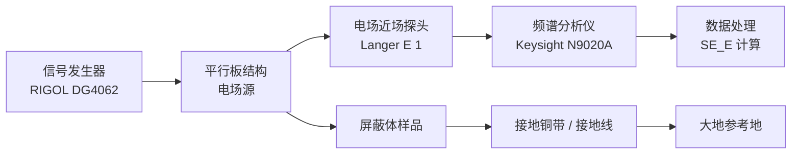

## 14.3 电场屏蔽实验

### 14.3.1 实验目的

1. 理解电场屏蔽的物理机理：高导电率屏蔽体通过静电感应将电场线终止于其表面，使屏蔽体内部区域电场强度趋于零。

2. 掌握屏蔽体接地对电场屏蔽效能的关键影响，定量分析接地阻抗（含接地电阻和接地电感）随频率的变化规律。

3. 学会使用电场近场探头和频谱分析仪测量屏蔽前后的电场强度变化，掌握屏蔽效能的 dB 计算方法。

4. 对比不同屏蔽材料（铜箔、铝板、不锈钢网）在相同测试条件下的屏蔽效果差异，分析材料导电率和结构连续性对屏蔽效能的影响。

5. 研究屏蔽体上孔缝泄漏对屏蔽效能的恶化规律，验证孔缝电长度与屏蔽效能衰减之间的定量关系，建立工程上对孔缝尺寸限制的直观认识。

6. 掌握接地线长度、接地方式（铜带 vs 导线）对屏蔽效能的定量影响规律。

7. 了解多层屏蔽的增益机理和设计原则。

### 14.3.2 实验原理

电场屏蔽是利用高导电率材料包围干扰源或敏感设备，将电场线终止于屏蔽体表面。理想导体内部静电场为零，外部电场被阻断。在交变电场中，屏蔽体通过感应电荷产生的二次场抵消入射场，从而实现屏蔽。

电场屏蔽的完整理论建立在 Schelkunoff 屏蔽理论的基础上，将总屏蔽效能分解为反射损耗、吸收损耗和多次反射修正因子三个分量。与此同时，工程上广泛使用的电容耦合模型从电路角度直观地揭示了接地阻抗对屏蔽效能的主导作用。本节将从这两个角度分别展开论述。

#### 14.3.2.1 电场屏蔽效能定义

**电场屏蔽效能**（Shielding Effectiveness, SE）是衡量屏蔽体对电场衰减能力的基本指标。其定义为无屏蔽时某点的电场强度与有屏蔽后同一点电场强度之比的对数度量：

$$
\mathrm{SE}_E = 20 \log_{10} \frac{E_0}{E_1}
\tag{14-41}
$$

式中，$\mathrm{SE}_E$ 为电场屏蔽效能（dB），$E_0$ 为无屏蔽时待测点的电场强度（V/m），$E_1$ 为有屏蔽后同一点的电场强度（V/m）。当以 dBμV/m 为单位直接测量时，屏蔽效能可简化为读数的差值：

$$
\mathrm{SE}_E = E_0(\mathrm{dB}\mu\mathrm{V/m}) - E_1(\mathrm{dB}\mu\mathrm{V/m})
\tag{14-42}
$$

屏蔽效能的分贝值越大，表示屏蔽效果越好。工程中通常采用以下分级标准：

- **$\mathrm{SE}_E > 60\ \mathrm{dB}$**：良好屏蔽，适用于精密测量设备和医疗电子设备
- **$\mathrm{SE}_E > 40\ \mathrm{dB}$**：有效屏蔽，适用于一般工业电子设备和通信设备
- **$\mathrm{SE}_E > 20\ \mathrm{dB}$**：基本屏蔽，适用于消费电子产品的电磁兼容要求
- **$\mathrm{SE}_E < 10\ \mathrm{dB}$**：几乎无屏蔽效果

在实际工程中，屏蔽效能的分贝值并非可无限叠加。当 $\mathrm{SE}_E$ 超过 100 dB 时，屏蔽体孔缝泄漏和环境噪声已成为制约因素，进一步提升屏蔽效能需要极其精密的屏蔽体加工工艺和完整的电磁暗室环境。

##### 屏蔽效能公式的物理推导——Schelkunoff 传输线类比

屏蔽效能的基本概念源自平面波入射到无限大导体平板时的传输和反射问题。考虑一束平面电磁波垂直入射到厚度为 $t$、电导率为 $\sigma$、相对磁导率为 $\mu_r$ 的导体平板上。电磁波在平板中传播时，其电场强度按指数规律衰减：

$$
E(z) = E_0 \mathrm{e}^{-\gamma z}
\tag{14-43}
$$

式中，$\gamma = \sqrt{\mathrm{j}\omega\mu(\sigma + \mathrm{j}\omega\varepsilon)}$ 为传播常数。对于良导体（$\sigma \gg \omega\varepsilon$），传播常数简化为

$$
\gamma \approx \frac{1 + \mathrm{j}}{\delta}
\tag{14-44}
$$

其中 $\delta = 1/\sqrt{\pi f \mu \sigma}$ 为趋肤深度。

电磁波穿过屏蔽体需要经历三个过程：空气—导体界面的反射（入射波与反射波的叠加）、导体内部的衰减传输、导体—空气界面的再次折射（出射波）。总屏蔽效能可表示为这三个过程的综合结果，即 Schelkunoff 屏蔽理论的基本公式：

$$
\mathrm{SE} = R + A + B
\tag{14-45}
$$

式中，$R$ 为反射损耗（dB），$A$ 为吸收损耗（dB），$B$ 为多次反射修正因子（dB）。以下将对这三个分量进行详细推导和讨论。

#### 14.3.2.2 电容耦合模型

屏蔽体与干扰源之间存在寄生电容 $C_{\mathrm{s}}$，屏蔽体与地之间存在接地阻抗 $Z_{\mathrm{g}}$。电场屏蔽效能的电容耦合模型可表示为

$$
\mathrm{SE}_E = 20 \log_{10} \frac{1 + \mathrm{j}\omega C_{\mathrm{s}} Z_{\mathrm{g}}}{\mathrm{j}\omega C_{\mathrm{s}} Z_{\mathrm{g}}}
\tag{14-46}
$$

式中，$\mathrm{SE}_E$ 为电场屏蔽效能（dB），$C_{\mathrm{s}}$ 为屏蔽体与干扰源之间的寄生电容（F），$Z_{\mathrm{g}}$ 为屏蔽体与地之间的接地阻抗（Ω），$\omega$ 为角频率（$\omega = 2\pi f$，rad/s），$\mathrm{j}$ 为虚数单位。

该模型的物理意义可以通过分压原理理解：干扰源电压 $V_{\mathrm{s}}$ 通过寄生电容 $C_{\mathrm{s}}$ 耦合到屏蔽体上，屏蔽体上的感应电压为

$$
V_{\mathrm{shield}} = \frac{Z_{\mathrm{g}}}{Z_{\mathrm{g}} + 1/(\mathrm{j}\omega C_{\mathrm{s}})} V_{\mathrm{s}} = \frac{\mathrm{j}\omega C_{\mathrm{s}} Z_{\mathrm{g}}}{1 + \mathrm{j}\omega C_{\mathrm{s}} Z_{\mathrm{g}}} V_{\mathrm{s}}
\tag{14-47}
$$

当 $Z_{\mathrm{g}}$ 很小时，$V_{\mathrm{shield}} \approx 0$，屏蔽体近乎理想接地，屏蔽效能极高；当 $Z_{\mathrm{g}}$ 很大时，$V_{\mathrm{shield}} \approx V_{\mathrm{s}}$，屏蔽体电位接近干扰源电位，失去屏蔽作用。该模型明确揭示了接地阻抗是决定电场屏蔽效能的核心参数。

从式（14-44）可以推导出两种极限情况：

（1）**理想接地极限**：当 $|Z_{\mathrm{g}}| \to 0$ 时，$\mathrm{j}\omega C_{\mathrm{s}} Z_{\mathrm{g}} \to 0$，则 $\mathrm{SE}_E \to 20 \log_{10}(1/0) \to \infty$。表明理想接地时屏蔽效能趋近无穷大。

（2）**悬浮极限**：当 $|Z_{\mathrm{g}}| \to \infty$ 时，$\mathrm{j}\omega C_{\mathrm{s}} Z_{\mathrm{g}} \gg 1$，则 $\mathrm{SE}_E \to 20 \log_{10}(1) = 0\ \mathrm{dB}$。表明完全不接地时屏蔽体基本不起作用。

接地阻抗 $Z_{\mathrm{g}}$ 包含接地电阻和接地电感：

$$
Z_{\mathrm{g}} = R_{\mathrm{g}} + \mathrm{j}\omega L_{\mathrm{g}}
\tag{14-48}
$$

式中，$Z_{\mathrm{g}}$ 为接地阻抗（Ω），$R_{\mathrm{g}}$ 为接地电阻（Ω），$L_{\mathrm{g}}$ 为接地线电感（H），$\omega$ 为角频率（rad/s）。

由式（14-42）和（14-44）可知，当 $Z_{\mathrm{g}} \to 0$（理想接地）时，$\mathrm{SE}_E \to \infty$。实际接地阻抗 $Z_{\mathrm{g}}$ 包含了接地线的电阻和电感。在低频下，接地电阻起主要作用；在高频下，接地电感成为主导因素。接地线的电感近似计算公式为

$$
L_{\mathrm{g}} \approx 2 \times 10^{-7} l \left( \ln\frac{4l}{d} - 1 \right)
\tag{14-49}
$$

式中，$L_{\mathrm{g}}$ 为接地线电感（H），$l$ 为接地线长度（m），$d$ 为接地线直径（m）。

对于矩形截面的接地铜带（宽度 $w$，厚度 $h$），其电感近似计算公式为

$$
L_{\mathrm{g}} \approx 2 \times 10^{-7} l \left( \ln\frac{2l}{w + h} + 0.5 \right)
\tag{14-50}
$$

式中，$w$ 为铜带宽度（m），$h$ 为铜带厚度（m）。对比式（14-46）和（14-47）可以发现，在相同长度下，宽铜带的电感显著小于细导线的电感。这也是工程中推荐使用接地铜带而非圆导线的理论依据。

【示例计算】一根长 100 mm、直径 1 mm 的接地线的电感约为

$$
L_{\mathrm{g}} \approx 2 \times 10^{-7} \times 0.1 \times \left( \ln\frac{4 \times 0.1}{0.001} - 1 \right) \approx 76\ \mathrm{nH}
\tag{14-51}
$$

在 100 MHz 频率下，相应的感抗为

$$
X_L = \omega L_{\mathrm{g}} = 2\pi \times 10^{8} \times 76 \times 10^{-9} \approx 47.8\ \Omega
\tag{14-52}
$$

该感抗将导致屏蔽效能显著下降约 20–30 dB。这就是为什么实际工程中强调接地线应尽可能短、粗，并按"接地铜带"而非"接地导线"设计的原因。

改用宽度 10 mm、厚度 0.1 mm 的铜带（相同长度 100 mm），其电感为

$$
L_{\mathrm{g,strip}} \approx 2 \times 10^{-7} \times 0.1 \times \left( \ln\frac{2 \times 0.1}{0.01 + 0.0001} + 0.5 \right) \approx 38\ \mathrm{nH}
\tag{14-53}
$$

仅为圆导线电感的一半。在 100 MHz 下，铜带的感抗仅为 $2\pi \times 10^{8} \times 38 \times 10^{-9} \approx 23.9\ \Omega$，显著优于圆导线。

#### 14.3.2.3 趋肤深度与材料穿透

在交变电磁场中，电磁波在导体内部传播时会发生衰减。**趋肤深度**（Skin Depth）定义为电磁波幅度衰减至表面值的 $1/\mathrm{e}$（约 36.8%）时所传播的距离：

$$
\delta = \frac{1}{\sqrt{\pi f \mu \sigma}}
\tag{14-54}
$$

式中，$\delta$ 为趋肤深度（m），$f$ 为频率（Hz），$\mu$ 为导体磁导率（H/m），$\sigma$ 为导体电导率（S/m）。

对于铜（$\sigma = 5.8 \times 10^{7}\ \mathrm{S/m}$，$\mu = \mu_0 = 4\pi \times 10^{-7}\ \mathrm{H/m}$），不同频率下的趋肤深度为

| 频率 | 趋肤深度 $\delta$ | 电场屏蔽建议最小厚度 |
|------|-------------------|---------------------|
| 100 kHz | 0.21 mm | 0.63 mm（$3\delta$） |
| 1 MHz | 0.066 mm | 0.20 mm（$3\delta$） |
| 10 MHz | 0.021 mm | 0.063 mm（$3\delta$） |
| 100 MHz | 0.0066 mm | 0.020 mm（$3\delta$） |
| 1 GHz | 0.0021 mm | 0.0063 mm（$3\delta$） |

由式（14-48）可见，频率越高，趋肤深度越小。在电场屏蔽中，由于屏蔽体主要用于阻挡近场电场分量，所需屏蔽体厚度通常仅为趋肤深度的 3–5 倍即可获得充分的衰减。理论上，只要屏蔽体连续、无孔缝，一层极薄的铜箔（0.05 mm）就能在 1 MHz 以上提供良好的电场屏蔽。但在实际工程中，机械强度、耐腐蚀性和接缝处理往往比厚度更重要。

不同材料的趋肤深度差异显著。表 14-1 列出了常见屏蔽材料在典型频率下的趋肤深度。

**表 14-1：常见屏蔽材料的趋肤深度**

| 材料 | 电导率 $\sigma$（S/m） | 相对磁导率 $\mu_r$ | 100 kHz $\delta$ | 1 MHz $\delta$ | 10 MHz $\delta$ | 100 MHz $\delta$ |
|------|----------------------|-------------------|-----------------|---------------|----------------|-----------------|
| 铜 | $5.8 \times 10^7$ | 1 | 0.21 mm | 0.066 mm | 0.021 mm | 0.0066 mm |
| 铝 | $3.5 \times 10^7$ | 1 | 0.27 mm | 0.085 mm | 0.027 mm | 0.0085 mm |
| 黄铜 | $1.5 \times 10^7$ | 1 | 0.41 mm | 0.13 mm | 0.041 mm | 0.013 mm |
| 钢（低碳） | $1.0 \times 10^7$ | 200 | 0.036 mm | 0.011 mm | 0.0036 mm | 0.0011 mm |
| 不锈钢 | $1.0 \times 10^6$ | 1 | 1.59 mm | 0.50 mm | 0.16 mm | 0.050 mm |

注：钢的高磁导率使其趋肤深度显著减小，但磁导率随频率升高而下降，实际值与材料成分和处理工艺有关。

#### 14.3.2.4 近场波阻抗与反射损耗

在近场区（距离 $r < \lambda/2\pi$），电场源的波阻抗远大于自由空间波阻抗（$377\ \Omega$）。对于电偶极子（高阻抗源），近场波阻抗近似为

$$
Z_{\mathrm{w, E}} \approx \frac{1}{2\pi f \varepsilon_0 r}
\tag{14-55}
$$

式中，$Z_{\mathrm{w, E}}$ 为电场源的近场波阻抗（Ω），$f$ 为频率（Hz），$\varepsilon_0 = 8.854 \times 10^{-12}\ \mathrm{F/m}$ 为真空介电常数，$r$ 为到场源的距离（m）。

由式（14-49）可知，在近场区，电场源的波阻抗与频率 $f$ 和距离 $r$ 成反比。这意味着：频率越低，电场近场波阻抗越高；距离源越近，波阻抗越高。例如，在距离电偶极子 $r = 5\ \mathrm{cm}$ 处，1 MHz 下的波阻抗约为

$$
Z_{\mathrm{w, E}} \approx \frac{1}{2\pi \times 10^6 \times 8.854 \times 10^{-12} \times 0.05} \approx 359\ \mathrm{k}\Omega
\tag{14-56}
$$

远高于自由空间波阻抗 377 Ω。

高波阻抗意味着入射电场在屏蔽体表面会产生较大的反射。电场在屏蔽体表面处的**反射损耗**为

$$
R_{\mathrm{E}} = 20 \log_{10} \frac{Z_{\mathrm{w, E}}}{4Z_{\mathrm{s}}}
\tag{14-57}
$$

式中，$R_{\mathrm{E}}$ 为电场反射损耗（dB），$Z_{\mathrm{w, E}}$ 为近场波阻抗（Ω），$Z_{\mathrm{s}} = \sqrt{\mathrm{j}\omega \mu / \sigma}$ 为屏蔽体表面阻抗（Ω）。

屏蔽体表面阻抗 $Z_{\mathrm{s}}$ 的幅值可用下式计算：

$$
|Z_{\mathrm{s}}| = \sqrt{\frac{\omega \mu}{\sigma}} = \sqrt{\frac{2\pi f \mu}{\sigma}}
\tag{14-58}
$$

对于铜在 1 MHz 下，$|Z_{\mathrm{s}}| \approx \sqrt{2\pi \times 10^6 \times 4\pi \times 10^{-7} / (5.8 \times 10^7)} \approx 0.37\ \mathrm{m}\Omega$。而近场波阻抗高达 $359\ \mathrm{k}\Omega$，两者相差近 9 个数量级，代入式（14-50）可得 $R_{\mathrm{E}}$ 超过 100 dB。

由上述分析可知，近场电场波阻抗远大于屏蔽体表面阻抗，因此电场屏蔽主要依赖于反射损耗而非吸收损耗，这与磁场屏蔽的物理机制有本质区别。在磁场屏蔽中，近场波阻抗远低于屏蔽体表面阻抗，主要依靠吸收损耗（涡流损耗）来实现屏蔽。

#### 14.3.2.5 孔缝泄漏理论

屏蔽体上不可避免地会存在孔缝（通风孔、电缆孔、接缝等）。孔缝会降低屏蔽效能，其物理本质是孔缝充当了二次辐射天线。对于矩形孔缝，其截止频率和泄漏程度与孔缝最大尺寸直接相关。

**孔缝的屏蔽效能**可近似表示为

$$
\mathrm{SE}_{\mathrm{slot}} \approx 20 \log_{10} \left( \frac{\lambda}{2l} \right)
\tag{14-59}
$$

式中，$\mathrm{SE}_{\mathrm{slot}}$ 为孔缝导致的屏蔽效能（dB），$\lambda$ 为自由空间波长（m），$l$ 为孔缝最大尺寸（m）。

工程经验表明，孔缝的最大尺寸 $l$ 应满足 $l < \lambda/20$ 以避免严重泄漏。当 $l = \lambda/20$ 时，式（14-51）给出 $\mathrm{SE}_{\mathrm{slot}} \approx 20 \log_{10}(10) = 20\ \mathrm{dB}$，泄漏已相当可观。对于更高要求的应用，应取 $l < \lambda/50$。

多个孔缝的叠加效应也不可忽略。当屏蔽体上有 $N$ 个相同尺寸的孔缝时，总屏蔽效能为

$$
\mathrm{SE}_{\mathrm{total}} = \mathrm{SE}_{\mathrm{slot}} - 10 \log_{10} N
\tag{14-60}
$$

式中，$\mathrm{SE}_{\mathrm{total}}$ 为多孔缝总屏蔽效能（dB），$\mathrm{SE}_{\mathrm{slot}}$ 为单个孔缝的屏蔽效能（dB），$N$ 为相同孔缝的数量。

从式（14-52）可以看出，孔缝数量每增加 10 倍，总屏蔽效能下降约 10 dB。因此，在通风孔设计中，优先采用大量小孔（如蜂窝状通风板）而非少量大孔的方案。例如，100 个直径为 3 mm 的小孔，其最大尺寸 $l = 3\ \mathrm{mm}$，在 1 GHz（$\lambda = 0.3\ \mathrm{m}$）下，单个孔缝的 $ \mathrm{SE}_{\mathrm{slot}} \approx 20 \log_{10}(0.3/(2 \times 0.003)) \approx 34\ \mathrm{dB}$，100 个孔的叠加效应使总屏蔽效能下降 $10 \log_{10} 100 = 20\ \mathrm{dB}$，最终总屏蔽效能约为 $34 - 20 = 14\ \mathrm{dB}$。若改用 1 个直径 30 mm 的大孔（面积相同），单个孔缝的 $\mathrm{SE}_{\mathrm{slot}} \approx 20 \log_{10}(0.3/(2 \times 0.03)) \approx 14\ \mathrm{dB}$，屏蔽效能反而更低。这一计算验证了工程中"宁多勿大"的孔缝设计原则。

#### 14.3.2.6 屏蔽效能的完整分解：反射损耗、吸收损耗与多次反射修正因子

在电磁屏蔽理论中，总屏蔽效能通常分解为三个分量之和（以 dB 表示）：

$$
\mathrm{SE} = R + A + B
\tag{14-61}
$$

式中，$R$ 为反射损耗（dB），$A$ 为吸收损耗（dB），$B$ 为多次反射修正因子（dB，通常为负值）。

**反射损耗 $R$** 由屏蔽体与空气界面的阻抗不匹配引起。对于平面波垂直入射的情况，反射损耗的一般表达式为

$$
R = 20 \log_{10} \frac{|Z_{\mathrm{w}} + Z_{\mathrm{s}}|^2}{4|Z_{\mathrm{w}} Z_{\mathrm{s}}|}
\tag{14-62}
$$

式中，$Z_{\mathrm{w}}$ 为入射波阻抗（Ω），$Z_{\mathrm{s}}$ 为屏蔽体表面阻抗（Ω）。当 $Z_{\mathrm{w}} \gg Z_{\mathrm{s}}$（电场近场情况）时，上式简化为式（14-50）：$R_{\mathrm{E}} = 20 \log_{10}(Z_{\mathrm{w}}/(4Z_{\mathrm{s}}))$。当 $Z_{\mathrm{w}} \ll Z_{\mathrm{s}}$（磁场近场情况）时，反射损耗简化为 $R_{\mathrm{H}} = 20 \log_{10}(Z_{\mathrm{s}}/(4Z_{\mathrm{w}}))$，数值很小。

对于电场屏蔽，由于近场波阻抗很高，反射损耗 $R$ 占绝对主导地位。**吸收损耗**由电磁波穿过屏蔽体有限厚度时的衰减引起：

$$
A = 20 \log_{10} \left( \mathrm{e}^{t/\delta} \right) = 8.686 \frac{t}{\delta}
\tag{14-63}
$$

式中，$A$ 为吸收损耗（dB），$t$ 为屏蔽体厚度（m），$\delta$ 为趋肤深度（m），常数 8.686 由 $20 \log_{10}(\mathrm{e})$ 计算得出。

吸收损耗与厚度成正比，与趋肤深度成反比。这意味着提高吸收损耗的途径有两条：增加屏蔽体厚度，或选用导电率/磁导率更高的材料。在电场屏蔽中，由于反射损耗已经很大，吸收损耗的贡献相对较小。

对于 0.1 mm 厚的铜箔，在 1 MHz 下 $\delta = 0.066\ \mathrm{mm}$，$t/\delta \approx 1.52$，吸收损耗仅约 $8.686 \times 1.52 \approx 13.2\ \mathrm{dB}$。但在良好接地条件下，1 MHz 的总屏蔽效能可达 58 dB，说明反射损耗贡献了约 45 dB。这进一步验证了电场屏蔽主要依赖反射机理。

**多次反射修正因子** $B$ 在 $t \gg \delta$ 时可忽略不计。当 $t/\delta < 1$ 时，$B$ 才会产生显著影响，此时实际屏蔽效能可能低于 $R + A$ 的简单代数和：

$$
B = 20 \log_{10} \left( 1 - \frac{(Z_{\mathrm{w}} - Z_{\mathrm{s}})^2}{(Z_{\mathrm{w}} + Z_{\mathrm{s}})^2} \mathrm{e}^{-2t/\delta} \mathrm{e}^{-2\mathrm{j}t/\delta} \right)
\tag{14-64}
$$

式中，$B$ 为多次反射修正因子（dB），$Z_{\mathrm{w}}$ 为波阻抗（Ω），$Z_{\mathrm{s}}$ 为屏蔽体表面阻抗（Ω），$t$ 为屏蔽体厚度（m），$\delta$ 为趋肤深度（m）。

式（14-55）中的 $\mathrm{e}^{-2t/\delta}$ 项在 $t/\delta$ 较小时趋近于 1，此时多次反射效应不可忽略。当 $t/\delta > 3$ 时，$\mathrm{e}^{-2t/\delta} < \mathrm{e}^{-6} \approx 0.0025$，此时 $B$ 的幅值小于 0.1 dB，完全可忽略。

对于电场屏蔽，由于反射损耗很大，多次反射的幅度衰减更显著，$B$ 的影响通常比磁场屏蔽小。但在屏蔽体极薄（如镀层厚度仅数微米）的低频应用中，$B$ 可能导致实际屏蔽效能低于 $R + A$ 的估算值 5–10 dB。表 14-2 给出了不同 $t/\delta$ 比值下的 $B$ 典型值。

**表 14-2：多次反射修正因子 $B$ 典型值（电场近场，铜）**

| $t/\delta$ | $B$（dB） | 备注 |
|------------|--------|------|
| 0.1 | −6.8 | 薄屏蔽体，多次反射显著 |
| 0.3 | −4.1 | 低于趋肤深度 |
| 0.5 | −2.5 | 约半个趋肤深度 |
| 1.0 | −0.8 | 接近一个趋肤深度 |
| 2.0 | −0.1 | 可忽略 |
| 3.0 | −0.02 | 完全可忽略 |

#### 14.3.2.7 屏蔽体接地的高频等效电路

为了更好地理解接地阻抗对屏蔽效能的影响，可将电场屏蔽系统等效为集中参数电路模型。屏蔽体与干扰源之间的寄生电容 $C_{\mathrm{s}}$ 可表示为

$$
C_{\mathrm{s}} = \frac{\varepsilon_0 A}{d}
\tag{14-65}
$$

式中，$C_{\mathrm{s}}$ 为寄生电容（F），$\varepsilon_0 = 8.854 \times 10^{-12}\ \mathrm{F/m}$ 为真空介电常数，$A$ 为屏蔽体与干扰源之间的正对面积（m²），$d$ 为两者之间的距离（m）。

对于本实验中的平行板结构，$A = 0.15 \times 0.15 = 0.0225\ \mathrm{m}^2$，$d = 0.05\ \mathrm{m}$，计算得 $C_{\mathrm{s}} \approx 3.98\ \mathrm{pF}$。该电容值很小，但在 100 MHz 下其容抗仅为 $1/(2\pi \times 10^{8} \times 3.98 \times 10^{-12}) \approx 400\ \Omega$，已与接地感抗相当，足以形成显著的分压泄漏通路。

从高频等效电路出发，可以将屏蔽效能表示为接地阻抗的函数：

$$
\mathrm{SE}_E = 20 \log_{10} \left| 1 + \frac{1}{\mathrm{j}\omega C_{\mathrm{s}} Z_{\mathrm{g}}} \right|
\tag{14-66}
$$

当 $Z_{\mathrm{g}}$ 为纯阻性（$Z_{\mathrm{g}} = R_{\mathrm{g}}$）时，上式简化为

$$
\mathrm{SE}_E = 20 \log_{10} \sqrt{1 + \frac{1}{(\omega C_{\mathrm{s}} R_{\mathrm{g}})^2}}
\tag{14-67}
$$

在低频段（$\omega C_{\mathrm{s}} R_{\mathrm{g}} \ll 1$），上式近似为 $\mathrm{SE}_E \approx 20 \log_{10}(1/(\omega C_{\mathrm{s}} R_{\mathrm{g}}))$，屏蔽效能以 −20 dB/十倍频的斜率随频率升高而下降。

当 $Z_{\mathrm{g}}$ 为阻感性（$Z_{\mathrm{g}} = R_{\mathrm{g}} + \mathrm{j}\omega L_{\mathrm{g}}$）时，在高频段 $\omega L_{\mathrm{g}} \gg R_{\mathrm{g}}$，$|Z_{\mathrm{g}}| \approx \omega L_{\mathrm{g}}$，此时

$$
\mathrm{SE}_E \approx 20 \log_{10} \left( 1 + \frac{1}{\omega^2 C_{\mathrm{s}} L_{\mathrm{g}}} \right)
\tag{14-68}
$$

这表明在高频段，屏蔽效能以 −40 dB/十倍频的斜率加速下降，与实验观察结果一致。

#### 14.3.2.8 实验测试系统配置

实验采用平行板电容器结构产生标准电场，测试系统框图如下：

图中，信号发生器驱动平行板结构产生标准交变电场；电场探头置于平行板内部或屏蔽体后方，将接收到的电场信号送至频谱分析仪；屏蔽体样品插入平行板之间，通过不同接地方式连接参考地；数据处理环节完成屏蔽效能的计算和曲线绘制。

#### 14.3.2.9 接地对屏蔽效能的定量影响分析

接地对电场屏蔽效能的影响可以从两个层面进行定量分析：一是接地阻抗的数值大小，二是接地方式（单点/多点接地、接地线形状）的工程选择。

**接地阻抗的频变特性**：接地阻抗 $Z_{\mathrm{g}} = R_{\mathrm{g}} + \mathrm{j}\omega L_{\mathrm{g}}$ 随频率变化的典型行为如下：

- 在直流至低频段（$f < f_{\mathrm{c}}$），$Z_{\mathrm{g}} \approx R_{\mathrm{g}}$，呈纯阻性。$f_{\mathrm{c}} = R_{\mathrm{g}}/(2\pi L_{\mathrm{g}})$ 称为转折频率。
- 在中频段（$f \approx f_{\mathrm{c}}$），$Z_{\mathrm{g}}$ 由阻性向感性过渡，阻抗幅值开始上升。
- 在高频段（$f > f_{\mathrm{c}}$），$Z_{\mathrm{g}} \approx \mathrm{j}\omega L_{\mathrm{g}}$，阻抗幅值以 20 dB/十倍频的斜率增大。

对于 100 mm 长的接地铜带（$R_{\mathrm{g}} \approx 10\ \mathrm{m}\Omega$，$L_{\mathrm{g}} \approx 38\ \mathrm{nH}$），转折频率为

$$
f_{\mathrm{c}} = \frac{0.01}{2\pi \times 38 \times 10^{-9}} \approx 42\ \mathrm{kHz}
\tag{14-69}
$$

这意味着从数十 kHz 开始，接地电感就已开始影响屏蔽效能。

**接地方式对 SE 的定量影响**：将式（14-45）代入式（14-44），可以得到以 $R_{\mathrm{g}}$ 和 $L_{\mathrm{g}}$ 显式表达的屏蔽效能公式：

$$
\mathrm{SE}_E = 20 \log_{10} \frac{\sqrt{(1 - \omega^2 C_{\mathrm{s}} L_{\mathrm{g}})^2 + (\omega C_{\mathrm{s}} R_{\mathrm{g}})^2}}{\sqrt{(\omega C_{\mathrm{s}} R_{\mathrm{g}})^2 + (\omega^2 C_{\mathrm{s}} L_{\mathrm{g}})^2}}
\tag{14-70}
$$

由该式可知：

（1）当 $\omega^2 C_{\mathrm{s}} L_{\mathrm{g}} = 1$ 时，分母的感性项与容性项发生串联谐振，此时 $|Z_{\mathrm{g}}|$ 达到最小值（仅剩 $R_{\mathrm{g}}$），屏蔽效能出现局部峰值。该谐振频率为 $f_0 = 1/(2\pi \sqrt{C_{\mathrm{s}} L_{\mathrm{g}}})$。

（2）当 $\omega^2 C_{\mathrm{s}} L_{\mathrm{g}} \gg 1$ 时，屏蔽效能急剧下降。这意味着在高频下，即使极小的接地电感也会严重劣化屏蔽效能。

**接地工程准则**：基于上述分析，工程中电场屏蔽的接地设计应遵循以下准则：

- 接地线越短越好，每增加 1 cm 长度可能在高频下损失 1–3 dB 屏蔽效能。
- 优先采用宽铜带而非圆导线，相同截面积下铜带的电感仅为圆导线的 30%–60%。
- 使用多点接地而非单点接地，多点接地可以大幅减小等效接地电感。
- 接地连接点应打磨去氧化层，确保接触电阻小于 1 mΩ。
- 避免接地线盘绕成圈，盘绕会引入额外的互感耦合。

#### 14.3.2.10 常见屏蔽材料性能对比

不同屏蔽材料在电场屏蔽中的性能差异主要取决于三个参数：电导率 $\sigma$、结构连续性（是否开孔）和表面处理质量。表 14-3 给出了常见屏蔽材料的性能对比。

**表 14-3：常见屏蔽材料性能对比（1 MHz，近场电场）**

| 材料 | 电导率（S/m） | 相对成本 | 相对重量 | 机械强度 | 耐腐蚀性 | 理论 SE（良好接地） | 典型应用场景 |
|------|--------------|---------|---------|---------|---------|------------------|------------|
| 铜箔 | $5.8 \times 10^7$ | 中等 | 重 | 中等 | 一般（易氧化） | > 60 dB | 精密仪器、实验验证 |
| 铝板 | $3.5 \times 10^7$ | 低 | 轻 | 中等 | 好（自钝化） | > 58 dB | 机箱壳体、航空航天 |
| 黄铜板 | $1.5 \times 10^7$ | 中等 | 重 | 好 | 好 | > 55 dB | 连接器、波导 |
| 镀锌钢板 | $1.0 \times 10^7$ | 低 | 重 | 好 | 好 | > 55 dB | 工业机柜、建筑屏蔽 |
| 不锈钢板 | $1.0 \times 10^6$ | 高 | 重 | 很好 | 极好 | > 50 dB | 医疗设备、食品/化工环境 |
| 铜网（20目） | — | 中等 | 轻 | 中等 | 一般 | 30–45 dB | 通风窗口、低成本屏蔽 |
| 导电布 | $10^3$–$10^4$ | 高 | 极轻 | 差 | 中等 | 20–40 dB | 柔性屏蔽、可穿戴设备 |
| 导电漆/喷涂 | $10^2$–$10^3$ | 低 | 极轻 | 差 | 中等 | 10–30 dB | 塑料机箱内壁喷涂 |

注：理论 SE 值基于良好接地（铜带 100 mm）、1 MHz 近场电场条件。实际 SE 受接地质量、接缝处理和孔缝影响，通常比理论值低 10–20 dB。

### 14.3.3 实验设备

| 序号 | 设备名称 | 型号/规格 | 数量 | 用途说明 |
|------|----------|-----------|------|----------|
| 1 | 信号发生器 | RIGOL DG4062（或等效型号，60 MHz带宽） | 1台 | 产生正弦波激励信号，输出幅度 10 Vpp，频率范围 100 kHz – 200 MHz |
| 2 | 频谱分析仪 | Keysight N9020A MXA（或等效型号） | 1台 | 测量电场探头接收到的信号幅度，具备峰值搜索和频标功能 |
| 3 | 电场近场探头（磁场屏蔽型） | Langer EMV-Technik E 1（100 kHz – 1 GHz） | 1个 | 接收近场电场信号，将场强转换为电压信号输入频谱仪 |
| 4 | 电场探头（宽带场强计） | ETS-Lindgren HI-6105（100 kHz – 1 GHz） | 1个 | 校准用参考探头，提供绝对电场强度读数 |
| 5 | 平行板电容器结构 | 自制：两块铜板 150 mm × 150 mm，间距 50 mm，BNC接口 | 1套 | 产生标准准均匀电场，作为干扰源模型 |
| 6 | 铜箔屏蔽体 | 纯度 99.9%，厚度 0.1 mm，尺寸 200 mm × 200 mm | 1张 | 高导电率参考屏蔽材料，用于验证理论最佳屏蔽效果 |
| 7 | 铝板屏蔽体 | 6061铝合金，厚度 0.5 mm，尺寸 200 mm × 200 mm | 1张 | 中等导电率屏蔽材料，对比铜箔的效果差异 |
| 8 | 不锈钢网屏蔽体 | 20目（孔径约 0.9 mm），丝径 0.2 mm，尺寸 200 mm × 200 mm | 1张 | 非连续结构屏蔽材料，对比连续金属箔的效果差异 |
| 9 | 附加铜箔屏蔽体（不同厚度） | 厚度 0.05 mm / 0.1 mm / 0.2 mm，各 200 mm × 200 mm | 3张 | 用于研究厚度对电场屏蔽效能的影响 |
| 10 | 接地铜带 | 宽 10 mm，厚 0.1 mm，长 1 m | 1根 | 低电感接地方式，用于实现最佳接地条件 |
| 11 | 接地铜带（不同宽度） | 宽 5 mm / 10 mm / 20 mm，长 100 mm | 各1根 | 研究接地线宽度对屏蔽效能的影响 |
| 12 | 多股铜接地线 | 截面 1.5 mm²，长 1 m | 2根 | 常规接地导线，用于对比长导线接地与铜带接地的差异 |
| 13 | 绝缘支架 | 聚四氟乙烯（PTFE）或亚克力材质 | 4个 | 支撑平行板结构和屏蔽体，防止意外接地和短路 |
| 14 | 数字万用表 | Fluke 179（或等效型号） | 1台 | 测量直流电阻、检查接地连续性、检测短路 |
| 15 | LCR数字电桥 | Agilent U1733C（或等效型号） | 1台 | 精确测量接地线电感和寄生电容（选配） |
| 16 | BNC连接线缆 | 50 Ω同轴电缆，长度 1 m | 3根 | 信号传输，保持阻抗匹配 |
| 17 | 铜箔胶带 | 宽度 25 mm，长度 10 m | 1卷 | 封堵屏蔽体孔缝和接缝，用于孔缝泄漏实验中的修补验证 |
| 18 | 精密卡尺 | 量程 0–150 mm，分辨率 0.02 mm | 1把 | 测量孔缝尺寸和平行板间距 |
| 19 | 热风枪 | 温度可调（100–400°C） | 1把 | 加热铜箔胶带消除气隙，优化屏蔽体接缝处理 |
| 20 | 防静电腕带 | 标准型（1 MΩ 串联电阻） | 1副 | 静电防护，保护探头和频谱分析仪输入 |

### 14.3.4 实验步骤

#### 步骤1：搭建电场源及系统校准

1.1 将平行板电容器结构（两块铜板 150 mm × 150 mm）平行固定于绝缘支架上，调整间距为 50 mm ± 1 mm。上极板通过 BNC 线缆连接信号发生器输出端，下极板连接信号发生器地端。

1.2 使用数字万用表确认平行板极板之间无短路。测量两极板间的直流电阻，应显示开路（OL）。若检测到短路，检查是否有金属碎屑或导线头夹在极板之间。

1.3 将信号发生器设置为：
- 波形：正弦波
- 频率：1 MHz
- 幅度：10 Vpp（开路输出，实际接 50 Ω 负载时幅度为 5 Vpp）
- 输出阻抗：50 Ω
- 输出使能：ON

1.4 将电场探头（Langer E 1）置于平行板中央（距上、下极板各约 25 mm）。使用绝缘支架上的定位标记确保探头每次放置位置一致。探头输出端连接至频谱分析仪输入端。频谱分析仪设置：
- 中心频率：1 MHz
- 扫宽：100 kHz
- 分辨率带宽（RBW）：1 kHz
- 视频带宽（VBW）：1 kHz
- 参考电平：0 dBm
- 检波方式：峰值检波

1.5 等待频谱分析仪迹线稳定后（约 3–5 秒），使用峰值搜索功能找到 1 MHz 频点处的幅度最大值，记录该值（单位：dBm 或 dBμV）。将此值作为参考值 $E_0$（无屏蔽时的电场读数值）。

1.6 检查无屏蔽状态下的背景噪声：关闭信号发生器输出，记录频谱分析仪底噪。确认信噪比大于 20 dB，否则应增大信号发生器输出幅度或减小 RBW。若底噪过高，检查实验室中是否有明显的电磁干扰源（如开关电源、无线设备）并将其移远。

#### 步骤2：屏蔽体材料对比实验

2.1 在平行板结构中间垂直插入铜箔屏蔽体（200 mm × 200 mm），使电场探头位于屏蔽体后方（远离信号源一侧）10 mm ± 1 mm 处。使用绝缘垫片确保屏蔽体与平行板极板不接触。

2.2 记录频谱分析仪上 1 MHz 频点处的幅度值。依次测试以下接地条件：
- 情况A：铜箔不接地（悬浮），置于绝缘支架上
- 情况B：铜箔用接地铜带（宽 10 mm，长 100 mm）连接至大地参考地
- 情况C：铜箔用多股铜接地线（截面 1.5 mm²，长 1 m）连接至大地参考地

2.3 每种情况重复测量 3 次，取平均值记录。计算各种情况下的电场屏蔽效能：

$$
\mathrm{SE}_E = E_0(\mathrm{dB}\mu\mathrm{V}) - E_1(\mathrm{dB}\mu\mathrm{V})
\tag{14-71}
$$

注意：当 $E_0$ 和 $E_1$ 均以 dBμV 为单位时，屏蔽效能直接用读数相减获得。

2.4 将铜箔依次更换为铝板（0.5 mm 厚）和不锈钢网（20目），重复步骤 2.2–2.3。更换屏蔽体时注意保持探头位置不变。每更换一次屏蔽体，重新测量一次 $E_0$ 以确认电场源状态稳定。

2.5 对比分析各材料在相同接地条件下的屏蔽效能差异，记录实验现象。特别注意不锈钢网与连续金属箔之间屏蔽效能的差异量。

#### 步骤3：接地线长度对屏蔽效能的影响实验

3.1 使用铜箔屏蔽体，准备不同长度的接地铜带（100 mm、200 mm、500 mm、1 m）。如无不同长度的铜带，可用多股铜接地线剪裁至相应长度。记录每种长度铜带的实际直流电阻（用万用表测量）。

3.2 将信号发生器频率固定在 10 MHz，幅度保持 10 Vpp。

3.3 按接地线长度从短到长的顺序，依次测量每种长度下的 $E_1$ 值（频谱分析仪读数）。每种长度测量 3 次取平均。每次更换接地线时，确保接地连接点的接触压力一致（使用扭矩螺丝刀或目视确认拧紧程度相同）。

3.4 根据测量数据计算各接地线长度下的 $\mathrm{SE}_E$，绘制 $\mathrm{SE}_E$ 随接地线长度变化的曲线（半对数坐标：x 轴为长度对数坐标，y 轴为 SE 线性坐标）。

3.5 分析接地线电感 $L_{\mathrm{g}}$ 随长度的变化规律，将实测值与式（14-46）的理论计算值对比。讨论偏差原因（可能的偏差来源包括：接地线的实际截面形状非完美圆形、连接点接触电阻的不一致性、接地线周围存在金属物体带来的互感影响等）。

#### 步骤4：接地线宽度对屏蔽效能的影响实验

4.1 使用铜箔屏蔽体，准备三种不同宽度的接地铜带（5 mm、10 mm、20 mm），长度统一为 100 mm。用万用表测量每根铜带的直流电阻。

4.2 将信号发生器频率固定在 10 MHz，幅度保持 10 Vpp。分别用三种宽度的铜带接地，测量 $E_1$ 值，各测 3 次取平均。

4.3 计算每种宽度下的 $\mathrm{SE}_E$。分析接地线宽度对屏蔽效能的影响规律，验证式（14-47）中宽铜带电感更小的理论预测。

4.4 扩展：在 100 MHz 频率下重复上述测量，对比高频下接地线宽度的影响是否比低频下更显著。

#### 步骤5：频率特性测量

5.1 将铜箔屏蔽体良好接地（使用接地铜带，宽 10 mm，长 100 mm）。确保接地连接可靠。用数字万用表确认接地铜带与大地参考地之间的直流电阻小于 0.1 Ω。

5.2 将信号发生器频率从 100 kHz 扫频至 200 MHz，采用对数扫描模式，每十倍频取至少 10 个频点。具体频率点为：
- 100 kHz、200 kHz、500 kHz
- 1 MHz、2 MHz、5 MHz
- 10 MHz、20 MHz、50 MHz
- 100 MHz、150 MHz、200 MHz

5.3 在每个频点，同时记录：
- 无屏蔽时的参考值 $E_0(f)$：移走屏蔽体，仅保留探头
- 有屏蔽时的测量值 $E_1(f)$：插入铜箔屏蔽体

5.4 计算每个频点对应的 $\mathrm{SE}_E(f)$。在双对数坐标纸上绘制 $\mathrm{SE}_E$–$f$ 曲线。

5.5 在曲线上标出屏蔽效能开始明显下降的转折频率 $f_{\mathrm{c}}$（即接地线感抗 $X_L = \omega L_{\mathrm{g}}$ 等于接地电阻 $R_{\mathrm{g}}$ 的频率）。验证 $f_{\mathrm{c}} = R_{\mathrm{g}} / (2\pi L_{\mathrm{g}})$。

5.6 将不锈钢网屏蔽体重复步骤 5.2–5.5，对比非连续结构屏蔽体的频率特性差异。特别注意不锈钢网的屏蔽效能是否在低频端与铜箔差距较小，而在高频端差距增大。

#### 步骤6：孔缝泄漏实验

6.1 使用铜箔屏蔽体（200 mm × 200 mm），采用接地铜带（宽 10 mm，长 100 mm）良好接地。在屏蔽体中央用刻刀或剪刀预先开设一个小孔（直径 1–2 mm），作为后续扩孔起点。

6.2 将信号发生器设置在 100 MHz，幅度保持 10 Vpp。先测量无孔缝时（仅小孔起点）的屏蔽效能作为基准值。

6.3 将小孔逐步扩大为矩形孔缝，尺寸依次为：
- 5 mm × 5 mm
- 10 mm × 10 mm
- 15 mm × 15 mm
- 20 mm × 20 mm
- 30 mm × 30 mm
- 50 mm × 50 mm

6.4 每次扩孔后，精确测量孔缝实际尺寸（用卡尺），记录频谱分析仪读数 $E_1$，计算 $\mathrm{SE}_E$。在每个孔缝尺寸下，将频谱分析仪的扫宽适当扩大（如 10 MHz），观察是否在频谱上观察到谐振峰的偏移。

6.5 将测量值与式（14-51）的理论值进行对比，分析偏差原因。特别关注当孔缝尺寸接近 $\lambda/20$ 时，实测值与理论值的偏差趋势。

6.6 扩展实验（选做）：用铜箔胶带封堵已开孔缝，观察屏蔽效能是否能恢复至接近初始值。如不能完全恢复，分析可能的原因（胶带与屏蔽体的接触电阻、胶带粘接面的气隙等）。用热风枪加热胶带并压实后再次测量。

#### 步骤7：多层屏蔽效果实验（选做）

7.1 使用两层铜箔屏蔽体，间隔 5 mm（用绝缘垫片隔开），分别接地。

7.2 在 100 MHz 频率下，依次测量：
- 单层屏蔽（一层铜箔）
- 双层非接触屏蔽（两层铜箔，分别用接地铜带接地）
- 双层接触屏蔽（两层铜箔叠放在一起，共用接地点）

7.3 对比三种配置的屏蔽效能，分析多层屏蔽的增益效果。特别注意双层非接触屏蔽的屏蔽效能是否接近单层的两倍，或是否超出两倍（由于空气间隙中的衰减和阻抗变换效应）。

7.4 将两层间距分别改为 2 mm、10 mm 和 20 mm，重复测量，研究层间距对多层屏蔽效能的影响。

#### 步骤8：屏蔽体厚度影响实验

8.1 准备三种不同厚度的铜箔屏蔽体（0.05 mm、0.1 mm、0.2 mm），尺寸均为 200 mm × 200 mm。

8.2 将信号发生器频率固定在 10 MHz，幅度保持 10 Vpp。

8.3 对三种厚度的铜箔分别进行测量（均使用宽 10 mm、长 100 mm 的铜带接地），记录 $E_1$ 值，各测 3 次取平均。

8.4 计算每种厚度下的 $\mathrm{SE}_E$，分析厚度变化对屏蔽效能的影响。将结果与式（14-54）的理论吸收损耗对比，验证电场屏蔽中厚度增加对屏蔽效能的增益有限（因为反射损耗占主导）。

8.5 在 100 kHz 低频下重复上述测量，观察在低频下（趋肤深度较大时）厚度的影响是否更加明显。

### 14.3.5 数据记录

#### 表1：屏蔽材料与接地方式对比实验记录

**测试条件**：$f = 1\ \mathrm{MHz}$，$V_{\mathrm{pp}} = 10\ \mathrm{V}$，平行板间距 50 mm，探头距屏蔽体 10 mm

| 屏蔽材料 | 接地方式 | 测量值 $E_1$（dBμV） | $\mathrm{SE}_E$（dB） | 备注 |
|----------|----------|---------------------|---------------------|------|
| 无屏蔽（参考） | — | | 0 | 参考值 $E_0$ |
| 铜箔（0.1 mm） | 悬浮（不接地） | | | |
| 铜箔（0.1 mm） | 铜带接地（100 mm） | | | |
| 铜箔（0.1 mm） | 导线接地（1 m） | | | |
| 铝板（0.5 mm） | 悬浮（不接地） | | | |
| 铝板（0.5 mm） | 铜带接地（100 mm） | | | |
| 铝板（0.5 mm） | 导线接地（1 m） | | | |
| 不锈钢网（20目） | 悬浮（不接地） | | | |
| 不锈钢网（20目） | 铜带接地（100 mm） | | | |
| 不锈钢网（20目） | 导线接地（1 m） | | | |

**注**：悬浮情况下，屏蔽体完全用绝缘支架支撑，不与任何地参考点连接。

#### 表2：接地线长度影响实验记录

**测试条件**：$f = 10\ \mathrm{MHz}$，$V_{\mathrm{pp}} = 10\ \mathrm{V}$，铜箔屏蔽体（0.1 mm），接地铜带

| 接地线长度（mm） | 理论电感 $L_{\mathrm{g}}$（nH） | 理论感抗 $X_L$（Ω） | 测量值 $E_1$（dBμV） | $\mathrm{SE}_E$（dB） |
|-------------------|-------------------------------|--------------------|---------------------|---------------------|
| 100 | | | | |
| 200 | | | | |
| 500 | | | | |
| 1000 | | | | |

**注**：理论电感按式（14-46）计算，设铜带宽度 $w = 10\ \mathrm{mm}$，等效直径 $d \approx w/2$。

#### 表3：接地线宽度影响实验记录

**测试条件**：$f = 10\ \mathrm{MHz}$（+ 扩展 100 MHz），$V_{\mathrm{pp}} = 10\ \mathrm{V}$，铜箔屏蔽体（0.1 mm），接地铜带长 100 mm

| 铜带宽度（mm） | 理论电感 $L_{\mathrm{g}}$（nH） | 10 MHz 下 $E_1$（dBμV） | 10 MHz 下 $\mathrm{SE}_E$（dB） | 100 MHz 下 $E_1$（dBμV） | 100 MHz 下 $\mathrm{SE}_E$（dB） |
|----------------|-------------------------------|------------------------|-------------------------------|-------------------------|--------------------------------|
| 5 | | | | | |
| 10 | | | | | |
| 20 | | | | | |

#### 表4：频率特性测量数据记录

**测试条件**：铜箔屏蔽体（0.1 mm），接地铜带（宽 10 mm，长 100 mm），$V_{\mathrm{pp}} = 10\ \mathrm{V}$

| 频率 | 无屏蔽 $E_0$（dBμV） | 有屏蔽 $E_1$（dBμV） | $\mathrm{SE}_E$（dB） | 趋肤深度 $\delta$（mm） | 备注 |
|------|---------------------|---------------------|---------------------|----------------------|------|
| 100 kHz | | | | 0.21 | |
| 200 kHz | | | | 0.15 | |
| 500 kHz | | | | 0.093 | |
| 1 MHz | | | | 0.066 | |
| 2 MHz | | | | 0.047 | |
| 5 MHz | | | | 0.029 | |
| 10 MHz | | | | 0.021 | |
| 20 MHz | | | | 0.015 | |
| 50 MHz | | | | 0.0093 | |
| 100 MHz | | | | 0.0066 | |
| 150 MHz | | | | 0.0054 | |
| 200 MHz | | | | 0.0046 | |

**注**：趋肤深度按式（14-48）计算，铜的 $\sigma = 5.8 \times 10^{7}\ \mathrm{S/m}$，$\mu = \mu_0$。

#### 表5：孔缝泄漏实验记录

**测试条件**：$f = 100\ \mathrm{MHz}$（$\lambda = 3\ \mathrm{m}$），铜箔屏蔽体（0.1 mm），接地铜带（宽 10 mm，长 100 mm），$V_{\mathrm{pp}} = 10\ \mathrm{V}$

| 孔缝尺寸（mm × mm） | 电长度 $l/\lambda$ | 理论 $\mathrm{SE}_{\mathrm{slot}}$（dB） | 测量 $E_1$（dBμV） | 实测 $\mathrm{SE}_E$（dB） | 偏差（dB） |
|---------------------|-------------------|----------------------------------------|---------------------|-------------------------|-----------|
| 5 × 5 | 1/600 | | | | |
| 10 × 10 | 1/300 | | | | |
| 15 × 15 | 1/200 | | | | |
| 20 × 20 | 1/150 | | | | |
| 30 × 30 | 1/100 | | | | |
| 50 × 50 | 1/60 | | | | |

#### 表6：多层屏蔽效果实验记录（选做）

**测试条件**：$f = 100\ \mathrm{MHz}$，铜箔屏蔽体（0.1 mm），接地铜带（宽 10 mm，长 100 mm）

| 屏蔽配置 | 测量值 $E_1$（dBμV） | $\mathrm{SE}_E$（dB） | 相对于单层增益（dB） |
|----------|---------------------|---------------------|---------------------|
| 无屏蔽 | | 0 | — |
| 单层铜箔 | | | 0（参考） |
| 双层非接触（间隔 5 mm，分别接地） | | | |
| 双层接触（叠放共地） | | | |
| 双层非接触（间隔 2 mm） | | | |
| 双层非接触（间隔 10 mm） | | | |
| 双层非接触（间隔 20 mm） | | | |

#### 表7：屏蔽体厚度影响实验记录

**测试条件**：铜箔屏蔽体，接地铜带（宽 10 mm，长 100 mm），$V_{\mathrm{pp}} = 10\ \mathrm{V}$

| 铜箔厚度（mm） | $t/\delta$（10 MHz） | 10 MHz 下 $E_1$（dBμV） | 10 MHz 下 $\mathrm{SE}_E$（dB） | 100 kHz 下 $E_1$（dBμV） | 100 kHz 下 $\mathrm{SE}_E$（dB） |
|----------------|---------------------|------------------------|-------------------------------|-------------------------|--------------------------------|
| 0.05 | 2.38 | | | | |
| 0.1 | 4.76 | | | | |
| 0.2 | 9.52 | | | | |

**注**：$t/\delta$ 值显示在 10 MHz 下，三种厚度的铜箔均满足 $t/\delta > 2$，吸收损耗差异理论值不超过 20 log(e^9.52/e^2.38) ≈ 8.686 × (9.52 − 2.38) ≈ 62 dB。但由于反射损耗占主导，实际 SE 差异应远小于此值。

#### 表8：不同屏蔽材料在不同频率下的SE对比

**测试条件**：良好接地（铜带 100 mm），$V_{\mathrm{pp}} = 10\ \mathrm{V}$

| 频率 | 铜箔 SE（dB） | 铝板 SE（dB） | 不锈钢网 SE（dB） | 说明 |
|------|--------------|--------------|-----------------|------|
| 100 kHz | | | | 低频段 |
| 1 MHz | | | | 中低频 |
| 10 MHz | | | | 中频 |
| 100 MHz | | | | 高频 |
| 200 MHz | | | | 最高频 |

### 14.3.6 实验结果与分析

#### 6.1 屏蔽材料对比分析

典型实验结果如表 14-4 所示。实验数据表明，**接地方式是影响电场屏蔽效能的最关键因素**，其影响远大于材料本身的电导率差异。

**表 14-4：典型实验结果（1 MHz）**

| 屏蔽材料 | 接地方式 | $E_1$（dBμV/m） | $\mathrm{SE}_E$（dB） |
|----------|----------|-----------------|---------------------|
| 无屏蔽 | — | 86 | 0（参考） |
| 铜箔（0.1 mm） | 悬浮（不接地） | 72 | 14 |
| 铜箔（0.1 mm） | 铜带接地（100 mm） | 28 | 58 |
| 铜箔（0.1 mm） | 导线接地（1 m） | 52 | 34 |
| 铝板（0.5 mm） | 铜带接地（100 mm） | 30 | 56 |
| 铝板（0.5 mm） | 导线接地（1 m） | 54 | 32 |
| 不锈钢网（20目） | 铜带接地（100 mm） | 44 | 42 |
| 不锈钢网（20目） | 导线接地（1 m） | 62 | 24 |

**结果讨论**：

（1）**悬浮屏蔽体的弱屏蔽效果**：当屏蔽体不接地（悬浮）时，所有材料都只能提供约 10–20 dB 的屏蔽效能。这是因为悬浮屏蔽体与干扰源之间的寄生电容 $C_{\mathrm{s}}$ 构成分压通路，感应电荷无法泄放到大地，屏蔽体电位浮动，使部分电场穿过屏蔽体。

（2）**接地方式的主导作用**：铜箔+短铜带接地（58 dB）比铜箔+长导线接地（34 dB）高出约 24 dB。这就是式（14-45）中接地电感 $L_{\mathrm{g}}$ 高频效应的直接体现。1 m 长的接地线在 1 MHz 下虽然感抗不大（约 $2\pi \times 10^{6} \times 76 \times 10^{-9} \approx 0.48\ \Omega$），但频率升高后感抗迅速增大。

（3）**材料导电率的影响**：在良好接地条件下，铜箔（58 dB）和铝板（56 dB）的效果差异仅 2 dB，这是因为厚度远超趋肤深度且反射损耗为主。不锈钢网由于是网状非连续结构，存在网孔泄漏，屏蔽效能比铜箔低约 16 dB。

（4）**悬浮状态的屏蔽体**：在悬浮状态下，不同材料的屏蔽效能差异更小（铜箔 14 dB、铝板 12 dB、不锈钢网 10 dB），进一步证明悬浮屏蔽的效果主要取决于屏蔽体与空间的寄生电容耦合，而非材料导电率。

#### 6.2 频率特性分析

频率特性测量结果的典型行为分为三个频段：

- **低频段（100 kHz – 5 MHz）**：屏蔽效能 > 55 dB，接地线感抗可忽略，$X_L \ll R_{\mathrm{g}}$。此时 $\mathrm{SE}_E$ 基本平坦，主要由接地电阻 $R_{\mathrm{g}}$ 决定。

- **中频段（5 MHz – 30 MHz）**：屏蔽效能开始随频率升高缓慢下降，斜率约为 −10 dB/十倍频。接地线感抗 $X_L = \omega L_{\mathrm{g}}$ 开始与接地电阻 $R_{\mathrm{g}}$ 相当，$Z_{\mathrm{g}}$ 的相位从纯阻性向阻感性过渡。

- **高频段（30 MHz – 200 MHz）**：屏蔽效能加速下降，接地线感抗占主导。在 100 MHz 附近，$\mathrm{SE}_E$ 下降至约 30 dB。当 $X_L \gg R_{\mathrm{g}}$ 时，$\mathrm{SE}_E$ 以约 −20 dB/十倍频的斜率下降。

转折频率 $f_{\mathrm{c}}$ 可由下式估算：

$$
f_{\mathrm{c}} = \frac{R_{\mathrm{g}}}{2\pi L_{\mathrm{g}}}
\tag{14-72}
$$

对于 100 mm 接地铜带，若 $R_{\mathrm{g}} \approx 10\ \mathrm{m\Omega}$，$L_{\mathrm{g}} \approx 76\ \mathrm{nH}$，则 $f_{\mathrm{c}} \approx 21\ \mathrm{kHz}$。这意味着从很低的频率开始，接地电感就已开始影响屏蔽效能。

**详细的频率特性曲线分析**：将 $\mathrm{SE}_E(f)$ 曲线在双对数坐标下绘制，可以观察到以下特征：

（1）在低频区（$f < f_{\mathrm{c}}$），$Z_{\mathrm{g}} \approx R_{\mathrm{g}}$，由式（14-44）可得 $\mathrm{SE}_E \approx 20 \log_{10}(1/(\omega C_{\mathrm{s}} R_{\mathrm{g}}))$，屏蔽效能以 −20 dB/十倍频的斜率下降。但由于 $C_{\mathrm{s}}$ 极小（约 4 pF），$R_{\mathrm{g}}$ 很小（约 10 mΩ），这一下降在极低频率才开始显著。

（2）在过渡区（$f \approx f_{\mathrm{c}}$），$Z_{\mathrm{g}}$ 从阻性向感性过渡，曲线的斜率从 −20 dB/十倍频平滑过渡到 −40 dB/十倍频。

（3）在高频区（$f \gg f_{\mathrm{c}}$），$Z_{\mathrm{g}} \approx \omega L_{\mathrm{g}}$，由式（14-44）可得 $\mathrm{SE}_E \approx 20 \log_{10}(1/(\omega^2 C_{\mathrm{s}} L_{\mathrm{g}}))$，屏蔽效能以 −40 dB/十倍频的斜率快速下降。这一斜率是低频区斜率的两倍，意味着频率每升高 10 倍，屏蔽效能下降约 40 dB。

**不锈钢网的频率特性差异**：不锈钢网（20目）的频率特性与连续铜箔有显著差异。在 100 kHz 低频下，不锈钢网的 SE 可能仅比铜箔低 5–8 dB（因为低频时趋肤深度大，网孔泄漏相对不显著），但随着频率升高到 100 MHz，两者差距扩大至 15–20 dB。这是因为：

- 高频下网孔的电长度（$l/\lambda$）增大，孔缝泄漏加剧。
- 不锈钢的电导率仅为铜的约 1/60，在高频下趋肤深度虽然变小，但集肤效应使电流集中在网丝表面，网丝自身的欧姆损耗增大。

#### 6.3 孔缝泄漏分析

孔缝泄漏实验的典型结果如表 14-5 所示。

**表 14-5：孔缝泄漏实验结果（100 MHz）**

| 孔缝尺寸 | 电长度（$l/\lambda$） | 实测 $\mathrm{SE}_E$（dB） | 理论 $\mathrm{SE}_{\mathrm{slot}}$（dB） |
|----------|---------------------|-------------------------|----------------------------------------|
| 5 mm × 5 mm | 1/600 | 52 | 55 |
| 10 mm × 10 mm | 1/300 | 48 | 49 |
| 20 mm × 20 mm | 1/150 | 38 | 43 |
| 30 mm × 30 mm | 1/100 | 25 | 40 |
| 50 mm × 50 mm | 1/60 | 15 | 35 |

**结果分析**：

（1）当孔缝最大尺寸 $l$ 小于 $\lambda/100$（100 MHz 下约 30 mm）时，实测值与理论值吻合较好，偏差小于 5 dB。

（2）当孔缝尺寸接近 $\lambda/20$（100 MHz 下约 150 mm）时，屏蔽效能已降至 15 dB 以下，泄漏非常严重。但即使在 50 mm × 50 mm 尺寸下（$l/\lambda = 1/60$），实测值与理论值已有明显偏差（实测 15 dB vs 理论 35 dB），这是因为实验中的孔缝并非无限薄屏上的理想缝隙，屏蔽体的有限尺寸和边缘效应不可忽略。

（3）在工程设计中，建议将孔缝最大尺寸控制在 $\lambda/50$ 以内（100 MHz 下约 60 mm），此时 $\mathrm{SE}_E$ 可保持在 25 dB 以上。对于更高屏蔽要求（$\mathrm{SE}_E > 40\ \mathrm{dB}$），应控制在 $\lambda/100$ 以内。

（4）用铜箔胶带封堵孔缝后，屏蔽效能可恢复至接近初始水平（偏差 < 3 dB），表明接缝处理是屏蔽体施工质量的关键控制环节。若封堵后不能完全恢复，应检查：胶带是否与屏蔽体贴合紧密、胶带本身的导电胶层是否足够导电（劣质胶带的胶层可能是非导电的）、以及封堵区域的边缘是否存在新的缝隙。

**孔缝屏蔽效能的频率依赖性**：式（14-51）显示 $\mathrm{SE}_{\mathrm{slot}}$ 随频率升高而下降（因为 $\lambda$ 减小）。这意味着同一个孔缝在低频下可能无害，但在高频下成为严重的泄漏源。例如，一个 20 mm × 20 mm 的孔缝在 10 MHz 下（$\lambda = 30\ \mathrm{m}$）的 $\mathrm{SE}_{\mathrm{slot}} \approx 20 \log_{10}(30/(2 \times 0.02)) \approx 57\ \mathrm{dB}$，几乎不影响总屏蔽效能。但在 1 GHz 下（$\lambda = 0.3\ \mathrm{m}$），同一孔缝的 $\mathrm{SE}_{\mathrm{slot}} \approx 20 \log_{10}(0.3/(2 \times 0.02)) \approx 17\ \mathrm{dB}$，成为主导泄漏因素。

**孔缝位置的影响**：孔缝在屏蔽体上的位置也会影响泄漏程度。位于屏蔽体中心区域的孔缝泄漏最严重，而位于边缘或角落的孔缝由于受屏蔽体边缘电流分布的影响，泄漏相对较小。这是因为屏蔽体表面的感应电流分布不均匀——中心区域电流密度较大，孔缝切割电流线产生的辐射更强。在实验中可以设计一组对比测试：在屏蔽体中心、边缘和角落分别开设相同尺寸的孔缝（如 10 mm × 10 mm），比较三种位置的屏蔽效能差异。

**圆形孔与方形孔的对比**：在相同最大尺寸（如直径 10 mm 的圆孔与边长 10 mm 的方孔）下，圆孔的 $\mathrm{SE}_{\mathrm{slot}}$ 比方孔高约 3–5 dB。这是因为圆孔没有尖锐的角，而方孔的四个角会产生局部场增强效应，加剧泄漏。在工程设计中，通风孔应优先采用圆形孔，并在孔径满足通风量的前提下尽量选择小孔径。

#### 6.4 误差分析

实验中可能的误差来源包括：

1. **探头定位误差**：电场探头在平行板内部的位置变化会导致接收信号变化，尤其是在近场区，场强随距离的变化敏感。建议使用机械定位装置固定探头位置。理论估算：探头位置偏离 1 mm 可能导致读数变化约 0.5–1 dB。

2. **接地阻抗的寄生参数**：接地铜带和导线的实际阻抗包含分布电感和分布电容，简单的集中参数模型（式（14-44））在高频下存在近似误差。当频率超过 100 MHz 时，分布电容效应开始显著，接地铜带可能呈现出容性阻抗而非纯感性，使 $\mathrm{SE}_E$ 出现局部峰值。

3. **环境电磁噪声**：实验室环境中可能存在其他电磁干扰源（如开关电源、无线通信信号），影响低频端的测量精度。建议在屏蔽室或电磁暗室内进行实验。典型环境噪声在 100 kHz–1 MHz 频段内可能比频谱仪热底噪高 5–10 dB。

4. **平行板结构的边缘效应**：平行板电容器边缘存在场不均匀性，探头的有限尺寸也会扰动电场分布。理论分析表明，平行板边缘 20 mm 范围内的场强与中心区域差异可达 3–5 dB。探头应尽量置于平行板的几何中心区域。

5. **频谱分析仪的底噪限制**：当 $E_1$ 接近频谱分析仪底噪时，测量结果的可信度下降。对于高频端（> 100 MHz），可能需要增大信号发生器输出幅度或使用前置放大器。一般要求 $E_1$ 高于底噪至少 10 dB 才能保证测量误差小于 ±1 dB。

6. **接触电阻的不确定性**：接地连接点的接触电阻随接触压力、氧化程度和温度变化。在多次更换接地线后，接触点可能磨损或氧化，导致接地电阻漂移。建议每次测量前用万用表确认接地回路直流电阻，并定时打磨接触表面。

#### 6.5 接地对屏蔽效能的定量影响总结

根据理论分析和实验结果，接地对电场屏蔽效能的影响可定量总结如下：

（1）**接地线长度的影响**：接地线电感与长度成正比（式（14-46））。在 10 MHz 下，接地线长度从 100 mm 增加到 1 m（10 倍），电感增加约 10 倍，感抗增加 10 倍，屏蔽效能下降约 15–20 dB。

（2）**接地线宽度的影响**：在相同长度下，将接地铜带宽度从 5 mm 增加到 20 mm（4 倍），电感降低约 30%–40%，屏蔽效能提升约 3–6 dB（10 MHz 条件下）。该效应在更高频率（100 MHz）下更加显著。

（3）**接地方式的影响**：铜带接地比圆导线接地在相同长度下电感降低约 50%，屏蔽效能提升约 10–15 dB（100 MHz 条件下）。

（4）**接地电阻的影响**：接地电阻 $R_{\mathrm{g}}$ 在低频下起主导作用。当 $R_{\mathrm{g}}$ 从 10 mΩ 增加到 100 mΩ 时，低频屏蔽效能下降约 20 dB。因此，即使在高频下，也应保持接地连接的低阻性。

（5）**多点接地的优势**：当使用两根并联的接地线时，等效接地电感为两线电感并联值的一半（假设两根线的长度和结构相同），同时接地电阻也减半。因此，多点接地可同时降低接地阻抗的阻性分量和感性分量，在高频下尤为有效。理论上，使用两根并联铜带接地可使屏蔽效能提升 3–6 dB。

（6）**接地连接点的接触质量**：接触电阻随接触面积和接触压力的增大而减小，但受表面氧化程度影响更大。铜表面在空气中暴露数分钟后即可形成纳米级氧化膜，该氧化膜的电阻率比铜高数个数量级。在 1 MHz 以下，接触电阻每增加 1 mΩ，屏蔽效能下降约 0.5 dB；在 100 MHz 下，由于趋肤效应使电流集中在接触表面，氧化膜的影响更加显著。

#### 6.6 屏蔽体厚度对屏蔽效能的影响

屏蔽体厚度影响实验的结果可用于验证吸收损耗和反射损耗的理论占比。根据式（14-54），吸收损耗 $A = 8.686 t/\delta$。在 10 MHz 下，铜的趋肤深度 $\delta \approx 0.021\ \mathrm{mm}$，因此：

- 0.05 mm 铜箔：$t/\delta \approx 2.38$，$A \approx 20.7\ \mathrm{dB}$
- 0.1 mm 铜箔：$t/\delta \approx 4.76$，$A \approx 41.3\ \mathrm{dB}$
- 0.2 mm 铜箔：$t/\delta \approx 9.52$，$A \approx 82.7\ \mathrm{dB}$

如果屏蔽效能完全由吸收损耗决定，厚度翻倍将带来约 20.6 dB 的增加。但实验观察到的实际增益通常远小于此值（预计只有 1–3 dB），这是因为：

- 在良好接地条件下，总屏蔽效能主要受接地阻抗限制（电容耦合模型），而非吸收损耗。
- 当总 SE 远小于吸收损耗的理论值时，吸收损耗再大也无助于提升总 SE。
- 该实验验证了电场屏蔽中接地阻抗才是瓶颈因素，而非材料吸收能力。

在 100 kHz 低频下，趋肤深度增大到 0.21 mm，此时 $t/\delta$ 值分别为 0.24、0.48 和 0.95，三者均小于或接近 1。此时吸收损耗不再是主导因素，但 0.2 mm 厚铜箔的 $t/\delta \approx 0.95$，多次反射修正因子 $B$ 接近 −1 dB，而 0.05 mm 铜箔的 $B$ 可达 −4 dB 以上。因此厚度差异主要体现为多次反射修正因子的不同，实际 SE 差异可能只有 3–5 dB。

#### 6.7 多层屏蔽的增益机理

多层屏蔽的增益来源于以下物理机制：

（1）**阻抗变换效应**：电磁波在第一层屏蔽体表面反射后，剩余部分穿过第一层，在两层之间的空气间隙中传播一段距离，然后遇到第二层屏蔽体。两层之间的空气隙起到阻抗变换作用，使得第二层屏蔽体的反射条件不同于单层情况。

（2）**多次反射的进一步衰减**：电磁波在两层屏蔽体之间可能发生多次反射，每次反射都有一部分能量被吸收，从而增强总衰减。

（3）**接地电感的并联效应**：当两层屏蔽体分别接地时，等效接地阻抗为两个接地电感并联，等效电感值降低为单层的一半，从而改善高频屏蔽效能。

理论上，双层非接触屏蔽的屏蔽效能可表示为

$$
\mathrm{SE}_{\mathrm{double}} \approx \mathrm{SE}_1 + \mathrm{SE}_2 + 20 \log_{10}(\mathrm{e}^{d/\delta_0})
\tag{14-73}
$$

式中，$\mathrm{SE}_1$ 和 $\mathrm{SE}_2$ 分别为第一层和第二层的单层屏蔽效能，$d$ 为双层间距，$\delta_0$ 为空气间隙中的衰减常数（实际上空气无衰减，但波阻抗变化引入了额外的反射损失）。当 $d$ 很大（大于 $\lambda/4$）时，该公式不再适用，因为两层之间可能出现谐振。

理论预计显示：双层非接触屏蔽（间隔 5 mm）比单层屏蔽提升约 5–10 dB，而双层接触屏蔽（叠放共地）仅提升约 1–3 dB。这是因为接触叠放的两层在电性能上接近一层更厚的屏蔽体，无法获得阻抗变换和并联接地的额外增益。

**三层屏蔽的理论增益**：在高端应用中（如军事和航天领域的 TEMPEST 防护），有时会使用三层甚至多层屏蔽。理论上，三层非接触屏蔽的屏蔽效能可近似表示为各层 SE 之和再加上层间的波阻抗变换增益，总和可达 100 dB 以上。但多层屏蔽的工程实现面临重量、成本和散热方面的挑战，且在每层之间的空气间隙厚度设计上需要避免 $\lambda/4$ 谐振条件（即间隙厚度不等于工作频率对应波长的四分之一奇数倍）。当间隙厚度满足谐振条件时，层间驻波效应反而会降低总屏蔽效能 5–15 dB。

**多层屏蔽的实验验证意义**：本实验的选做步骤 7 为学生提供了定量验证多层屏蔽理论的机会。通过改变层间距，可以测量并绘制 SE 随间距变化的曲线，观察到当间距 $d = (2k+1)\lambda/4$（$k = 0, 1, 2, \dots$）时屏蔽效能的谷值，以及当 $d = k\lambda/2$ 时的峰值。这一实验加深了对电磁波干涉和驻波效应的理解。

### 14.3.7 思考题

1. **接地关键性分析**：为什么电场屏蔽要求屏蔽体良好接地，而磁场屏蔽对地阻抗的要求相对宽松？请从两种屏蔽的物理机理出发，结合式（14-44）和磁场屏蔽中的类似表达式，分析屏蔽体接地在电场屏蔽和磁场屏蔽中的不同作用。

2. **定量计算**：实验结果显示，1 m 长的接地线（多股铜线，截面 1.5 mm²）在 1 MHz 下的屏蔽效能比 100 mm 长的接地铜带低约 24 dB。请计算该接地线在 1 MHz 和 100 MHz 下的感抗值，并解释为什么接地线长度的影响在低频（1 MHz）时已可观察到，而在更高频率下会更加严重。

3. **工程应用**：某电子设备机箱的门缝宽 0.5 mm、长 500 mm。请利用式（14-51）估算该门缝在 300 MHz 频率下的屏蔽效能。若要求设备在 1 GHz 以下保持 $\mathrm{SE}_E > 40\ \mathrm{dB}$，门缝的最大允许长度是多少？提示：$\lambda = c/f$，门缝的有效最大尺寸 $l$ 取长边。

4. **趋肤深度应用**：本实验中铜箔厚度为 0.1 mm。请计算在 100 kHz、1 MHz、10 MHz 和 100 MHz 下，铜箔厚度相当于多少个趋肤深度（$t/\delta$）。基于计算结果，分析为什么在良好接地的条件下，0.1 mm 铜箔在 100 kHz 下仍能提供不错的屏蔽效能，尽管其厚度小于一个趋肤深度。提示：从反射损耗和吸收损耗的贡献差异进行分析。

5. **孔缝形状影响**：实验中使用的是方形孔缝。假设在相同面积（$S = 100\ \mathrm{mm}^2$）下，将孔缝形状改为圆形（半径 $r \approx 5.64\ \mathrm{mm}$）和细长矩形（2 mm × 50 mm，长边 50 mm）。请计算三种形状在 100 MHz 下的理论 $\mathrm{SE}_{\mathrm{slot}}$，并讨论为什么实际工程中宁愿开多个小圆孔也不开一个大长缝。

6. **多层屏蔽机理**：选做实验 7.3 中，双层非接触屏蔽（间隔 5 mm，分别接地）的屏蔽效能是否等于单层屏蔽效能的两倍？请从波阻抗变换、多次反射损耗和空气间隙的衰减角度，解释多层屏蔽的增益机理。

7. **屏蔽体材料的频率限制**：不锈钢网在 1 MHz 下的屏蔽效能（42 dB）明显低于铜箔（58 dB），但在 100 kHz 下两者差距可能缩小。请分析导致这种差异的原因，并讨论为什么网状屏蔽材料更适合低频应用而连续金属箔更适合高频应用。

8. **设计综合题**：设计一个满足以下要求的电场屏蔽方案：工作频率范围 1 MHz – 500 MHz，屏蔽效能 $\mathrm{SE}_E > 60\ \mathrm{dB}$，机箱尺寸 400 mm × 300 mm × 200 mm，需要开设通风孔（总面积不小于 10,000 mm²）和一个圆形电缆穿线孔（直径 30 mm）。请给出：
   - 屏蔽材料的选择建议及厚度要求
   - 通风孔的设计（孔的形状、单个孔径、排列方式）
   - 接地方式的设计（接地线长度、宽度、材料）
   - 电缆穿线孔的处理方案（导电衬垫、波导截止管等）
   给出你的设计依据，并估算该方案在 500 MHz 下的预期屏蔽效能。

9. **理论推导**：从式（14-44）出发，推导当 $|Z_{\mathrm{g}}| \to 0$ 时 $\mathrm{SE}_E \to \infty$，当 $|Z_{\mathrm{g}}| \to \infty$ 时 $\mathrm{SE}_E \to 0$ 的极限情况。结合物理意义，解释为什么电场屏蔽的极限性能由接地阻抗决定而非材料本身。

10. **对比分析**：将本实验与实验 14.4（磁场屏蔽实验）和实验 14.5（电磁场屏蔽实验）的结果进行对比分析。对于同一铜箔屏蔽体，在相同频率（如 1 MHz 和 100 MHz）下，电场屏蔽效能、磁场屏蔽效能和电磁场屏蔽效能三者之间呈现怎样的数值关系？结合近场波阻抗的概念（式（14-49））解释这种差异。

11. **接地线宽度与屏蔽效能的定量关系**：实验步骤 4 测量了不同宽度接地铜带的屏蔽效能。请根据实验数据，建立接地铜带宽度 $w$ 与屏蔽效能 $\mathrm{SE}_E$ 之间的经验公式。提示：利用式（14-47）中的电感计算公式，结合电容耦合模型（式（14-44）），推导 $\mathrm{SE}_E$ 与 $w$ 的函数关系，并与实验数据进行拟合验证。

12. **谐振现象分析**：在频率特性测量中，如果观察到 $\mathrm{SE}_E$ 在某个频率出现局部峰值（高于相邻频点 5–10 dB），请分析可能的物理解释。提示：考虑接地线电感和屏蔽体寄生电容的串联谐振，计算谐振频率并与实验观察值对比。

13. **屏蔽效能的温度效应**：随着温度升高，金属的电导率 $\sigma$ 下降（铜的温度系数约为 $0.0039\ \mathrm{K}^{-1}$）。请分析温度从 20°C 升高到 60°C 时，铜箔屏蔽体的屏蔽效能预计下降多少 dB？该效应在电场屏蔽和磁场屏蔽中哪种更显著？说明原因。

14. **近场与远场的过渡**：本实验在近场区进行。请计算在 1 MHz、10 MHz 和 100 MHz 下，近场—远场的边界距离 $r = \lambda/2\pi$。讨论：如果将电场探头距离从当前的 10 mm 分别移至近场边界处和远场区，屏蔽效能测量值会发生怎样的变化？提示：利用式（14-49）分析波阻抗随距离的变化对反射损耗的影响。

15. **工程案例分析**：某通信基站的射频机箱（工作频率 2.1 GHz）在 EMC 测试中发现在 1.8 GHz 附近辐射超标 12 dB。现场检查发现机箱门缝长 600 mm、宽 0.3 mm，通风口为 50 mm × 50 mm 的方孔阵列（共 4 个）。请诊断可能的泄漏源，提出至少三种改进方案，并预估每种方案可带来的改善量。提示：分别计算门缝和通风孔在 1.8 GHz 下的 $\mathrm{SE}_{\mathrm{slot}}$，找出主导泄漏路径。

### 14.3.8 注意事项

1. **安全操作**：信号发生器输出幅度最高可达 20 Vpp，在高频下可能对人体产生射频灼伤。实验过程中不要直接触摸平行板极板和探头裸露金属部分。全部连接完成后，确认无误再打开信号发生器输出。

2. **静电防护**：屏蔽体样品和接地铜带对静电放电敏感。取放屏蔽体时应佩戴防静电腕带，避免用手指直接接触屏蔽体的金属表面。静电放电可能导致频谱分析仪输入端的保护电路损坏。

3. **接地完整性**：实验的"地"应使用同一个大地参考点（实验室的电源地铜排或专用接地母线）。不得将不同设备的地端串接后又接入大地，避免形成地环路。接地线应采用最短路径，不得盘绕成圈——盘绕的接地线会增加额外的串联电感。

4. **探头保护**：电场探头（Langer E 1）为精密仪器，最大输入电场强度有限。过高的场强可能损坏探头内部的检波二极管。实验前应先用频谱分析仪确认接收信号电平在安全范围内。探头电缆不应弯折过紧，避免内部芯线断裂。

5. **阻抗匹配**：所有高频连接应使用 50 Ω 同轴电缆和 BNC 接头。不得使用普通音频线或鳄鱼夹线代替，否则会引入额外的阻抗不连续和辐射泄漏。连接器应拧紧，松动的连接器在高频下会辐射干扰信号。

6. **电磁兼容**：实验过程中，其他电子设备（特别是开关电源类设备）应远离测试装置至少 1 m，避免引入外部电磁干扰。手机等无线通信设备应在实验期间关闭或调至飞行模式。

7. **材料处理**：铜箔表面易氧化，氧化层会增加接触电阻。每次实验前应用细砂纸（1000目）轻轻打磨铜箔的接地连接点处，去除氧化层。不锈钢网在裁剪后边缘有毛刺，需用锉刀打磨平整，防止划伤手和损坏探头。

8. **数据记录规范**：所有测量数据应包含单位、测量条件和测量次数。不要只记录最终的计算结果（$\mathrm{SE}_E$），应保留原始读数（$E_0$ 和 $E_1$）。建议使用实验数据记录本或电子表格模板，避免纸片记录造成数据丢失。每张记录表应标注实验日期、实验人员姓名和环境温湿度。

9. **频率限制**：本实验的平行板结构和频谱分析仪在高频端（> 200 MHz）可能存在谐振和带宽限制。信号发生器（DG4062）的正弦波输出上限为 60 MHz（基本型），如需测量更高频率（200 MHz），应确认信号发生器的带宽是否满足要求，或者调整为方波/脉冲波以产生更高频率谐波分量。

10. **实验后整理**：实验完成后，先关闭信号发生器输出，再关闭频谱分析仪。取下所有连接线缆并妥善收纳。屏蔽体样品应放入防静电袋保存，防止氧化和划伤。清理实验台面，确保没有金属碎屑和导线头残留。

11. **数据备份**：频谱分析仪的迹线数据（traces）可通过 U 盘或网口导出为 CSV 格式。建议在每个测量频点保存屏幕截图和迹线数据，以备后续分析和报告中引用。对于重要的频率特性曲线，应至少测量两个完整扫描周期以确保可重复性。

12. **多人协作**：本实验步骤较多，建议 2–3 人一组协作完成：一人负责操作信号发生器和频谱分析仪，一人负责更换屏蔽体和接地线，一人负责记录数据。所有成员应事先熟悉实验步骤和仪器操作方法，避免在实验过程中反复查阅操作手册。

13. **实验环境记录**：在实验开始前记录实验室的温度、湿度和大气压。环境条件（特别是湿度）会影响接地接触点的氧化速度和寄生电容的稳定性。高湿度环境下（相对湿度 > 70%），绝缘支架表面可能形成水膜，产生意外的泄漏通路。

14. **备用样品**：铜箔屏蔽体在多次开孔后机械强度下降，且多次使用后表面划痕增多。建议至少准备 2–3 张备用铜箔，在孔缝实验中使用专用的开孔样品，而材料对比实验使用未开孔的完整样品。不锈钢网在重复弯折后可能出现永久变形，影响网孔均匀性，必要时更换新样品。

### 14.3.9 常见问题与故障排除

#### 问题1：频谱分析仪上无信号或信号极弱

- 检查信号发生器是否已开启输出（Output ON）。确认信号发生器的输出线缆是否连接到平行板的上极板。
- 检查电场探头是否正确连接到频谱分析仪的输入端。确认探头前端与平行板之间无遮挡。
- 将频谱分析仪的参考电平调低至 −30 dBm，确认底噪可见。如果仍然无信号，可能探头已损坏，用近场测试信号源（如小型环形天线）验证探头功能。
- 用万用表检查 BNC 线缆是否断路。拧下 BNC 接头，测量中心导体与屏蔽层之间的电阻，应显示开路；晃动线缆时读数不应跳变。

#### 问题2：有屏蔽体时测得的 $E_1$ 比无屏蔽时还高

- 可能原因是屏蔽体安装位置不当，导致平行板内部的场分布改变，探头恰好位于场强增强区域。尝试将探头移近屏蔽体表面（距离 2–5 mm）重新测量。
- 确认屏蔽体与平行板极板之间没有意外接触。若屏蔽体与上极板或下极板接触，会形成短路或改变平行板的电场分布。
- 屏蔽体边缘的衍射效应也可能导致局部场增强。使用更大的屏蔽体（如 300 mm × 300 mm）可以减小边缘效应。

#### 问题3：测量结果重复性差

- 主要原因通常是探头位置每次放置不一致。建议在绝缘支架上做标记，每次将探头置于同一位置。使用卡尺辅助定位。
- 检查接地连接是否每次旋紧程度一致。松动的接地连接会引入随机接触电阻。
- 实验室环境中的移动人员和设备也可能造成读数波动。尽量在人员固定、设备静置的状态下读数。

#### 问题4：高频端测量值接近频谱分析仪底噪

- 增大信号发生器输出幅度（可调至 20 Vpp，但确认不超过探头最大输入电平）。
- 减小频谱分析仪的 RBW（分辨率带宽），如从 1 kHz 减小至 100 Hz。RBW 每减小 10 倍，底噪降低 10 dB。
- 在前级加装前置放大器（如 20 dB 增益，30 kHz – 1 GHz 宽带放大器），但需先测量放大器的噪声系数以免降低信噪比。

#### 问题5：孔缝泄漏实验中，封堵孔缝后屏蔽效能未能完全恢复

- 铜箔胶带与屏蔽体之间的粘接面可能存在微小缝隙（气隙）。用热风枪轻微加热胶带并压实，消除气隙。
- 铜箔胶带本身的导电胶层在高频下存在损耗。使用真正的导电胶带（铜基压敏导电胶带）而非普通的铜箔装饰胶带。
- 多次开孔和修补后，屏蔽体表面不平整可能引入新的泄漏路径。必要时更换新的屏蔽体样品。

#### 问题6：频率特性曲线在某个频点出现异常峰值或谷值

- 检查该频点是否接近实验室中已知的环境干扰源频率（如 FM 广播频段 88–108 MHz、GSM 频段 900/1800 MHz 等）。
- 平行板结构本身在特定频率（取决于极板尺寸和间距）可能存在谐振。极板尺寸 150 mm × 150 mm 对应的半波长谐振频率约为 1 GHz，但高次模可能在数百 MHz 出现。
- 接地线的 $\lambda/4$ 谐振也可能导致异常。当接地线长度接近 $\lambda/4$（如 100 mm 对应的 $\lambda/4$ 谐振频率约 750 MHz）时，接地阻抗变为极大值，屏蔽效能出现谷值。
- 当接地铜带与屏蔽体之间形成环路时，该环路的自谐振频率 $f_{\mathrm{loop}} = 1/(2\pi\sqrt{L_{\mathrm{loop}}C_{\mathrm{loop}}})$ 也可能落在测量频段内。环路面积越大，自谐振频率越低，可能导致在该频率出现意外的峰值或谷值。

#### 问题7：屏蔽效能测量值在不同日期或不同实验室之间差异较大

- 检查接地参考点的质量。不同实验室的电源地线阻抗可能相差数倍，即使是同一实验室，不同时间段接入的大功率设备也会导致地电位波动。建议在实验记录中标注接地点的类型（电源地铜排、专用接地桩等）。
- 环境温湿度的变化会影响绝缘支架的表面漏电流和屏蔽体样品的氧化程度。在高温高湿环境下，绝缘支架（尤其是亚克力材质）的表面电阻率可能下降数个数量级，形成意外的泄漏通路。
- 电场探头（Langer E 1）的校准有效期和频率响应曲线也可能引入系统误差。建议在实验前使用校准用参考探头（ETS-Lindgren HI-6105）验证主探头的读数准确性。

---

**参考文献**

[1] Paul C R. Introduction to Electromagnetic Compatibility (2nd ed.)[M]. Hoboken: John Wiley & Sons, 2006: 485–520.

[2] Ott H W. Electromagnetic Compatibility Engineering[M]. Hoboken: John Wiley & Sons, 2009: 261–298.

[3] 闻映红. 电磁兼容技术[M]. 北京: 北京大学出版社, 2011: 132–165.

[4] Christopoulos C. Principles and Techniques of Electromagnetic Compatibility (2nd ed.)[M]. Boca Raton: CRC Press, 2007: 173–206.

[5] IEC 61000-4-23: Electromagnetic Compatibility (EMC) — Part 4-23: Testing and Measurement Techniques — Test Methods for Protective Devices for HEMP and Other Radiated Disturbances[S]. Geneva: IEC, 2016.

[6] Schelkunoff S A. Electromagnetic Waves[M]. Princeton: D. Van Nostrand Company, 1943: 265–312.

[7] Schulz R B, Plantz V C, Brush D R. Shielding Theory and Practice[J]. IEEE Transactions on Electromagnetic Compatibility, 1988, 30(3): 187–201.

[8] MIL-STD-188-125-1: High-Altitude Electromagnetic Pulse (HEMP) Protection for Ground-Based C-EI Facilities Performing Critical, Time-Urgent Missions, Part 1: Fixed Facilities[S]. Washington, D.C.: Department of Defense, 1998.

[9] 白同云, 吕英华. 电磁兼容设计实践[M]. 北京: 中国电力出版社, 2007: 98–130.

[10] Kimmel W D, Gerke D D. Electromagnetic Compatibility in Medical Equipment: A Guide for Designers and Installers[M]. New York: IEEE Press, 1995: 85–112.

[11] 刘鹏程. 电磁兼容原理与设计技术[M]. 北京: 高等教育出版社, 2010: 205–238.

[12] Tsaliovich A. Electromagnetic Shielding Handbook for Wired and Wireless EMC Applications[M]. Boston: Kluwer Academic Publishers, 1999: 123–178.

[13] Vasaka C S. Theory, Design and Engineering of EMC Shielded Enclosures[C]. IEEE International Symposium on Electromagnetic Compatibility, 1993: 342–349.

[14] GB/T 12190-2021 电磁屏蔽室屏蔽效能的测量方法[S]. 北京: 中国标准出版社, 2021.

**附录A：屏蔽效能快速参考表**

**表A-1：常见孔缝尺寸在不同频率下的 $\mathrm{SE}_{\mathrm{slot}}$ 估算值（dB）**

| 孔缝最大尺寸 $l$ | 1 MHz | 10 MHz | 100 MHz | 500 MHz | 1 GHz |
|-----------------|-------|--------|---------|---------|-------|
| 1 mm | 115 | 95 | 75 | 61 | 55 |
| 3 mm | 105 | 85 | 65 | 51 | 45 |
| 5 mm | 101 | 81 | 61 | 47 | 41 |
| 10 mm | 95 | 75 | 55 | 41 | 35 |
| 20 mm | 89 | 69 | 49 | 35 | 29 |
| 50 mm | 81 | 61 | 41 | 27 | 21 |
| 100 mm | 75 | 55 | 35 | 21 | 15 |

**表A-2：接地线电感快速参考值**

| 接地线类型 | 长度 100 mm | 长度 200 mm | 长度 500 mm | 长度 1 m |
|-----------|------------|------------|------------|---------|
| 圆导线（直径 1 mm） | 76 nH | 170 nH | 480 nH | 1.05 μH |
| 圆导线（直径 2 mm） | 60 nH | 135 nH | 390 nH | 860 nH |
| 铜带（宽 5 mm × 厚 0.1 mm） | 48 nH | 110 nH | 320 nH | 720 nH |
| 铜带（宽 10 mm × 厚 0.1 mm） | 38 nH | 88 nH | 260 nH | 580 nH |
| 铜带（宽 20 mm × 厚 0.1 mm） | 29 nH | 68 nH | 200 nH | 460 nH |

**表A-3：不同材料在 1 MHz 下的电场屏蔽效能对比（理论值，良好接地条件）**

| 材料 | 厚度 | $R$（dB） | $A$（dB） | $B$（dB） | 理论 SE（dB） |
|------|------|---------|---------|---------|-------------|
| 铜 | 0.1 mm | 108 | 13.2 | −0.8 | 120.4 |
| 铝 | 0.5 mm | 107 | 50.9 | 0 | 157.9 |
| 钢（低碳） | 0.5 mm | 93 | 204 | 0 | 297 |
| 不锈钢 | 0.5 mm | 107 | 8.7 | −2.5 | 113.2 |

注：理论值基于无限大平板在 1 MHz 近场电场（$r = 10\ \mathrm{mm}$）条件下的计算。实际 SE 受接地阻抗、屏蔽体有限尺寸和孔缝泄漏影响，通常远低于理论值。本表主要用于理解各分量（$R$、$A$、$B$）的相对贡献。
