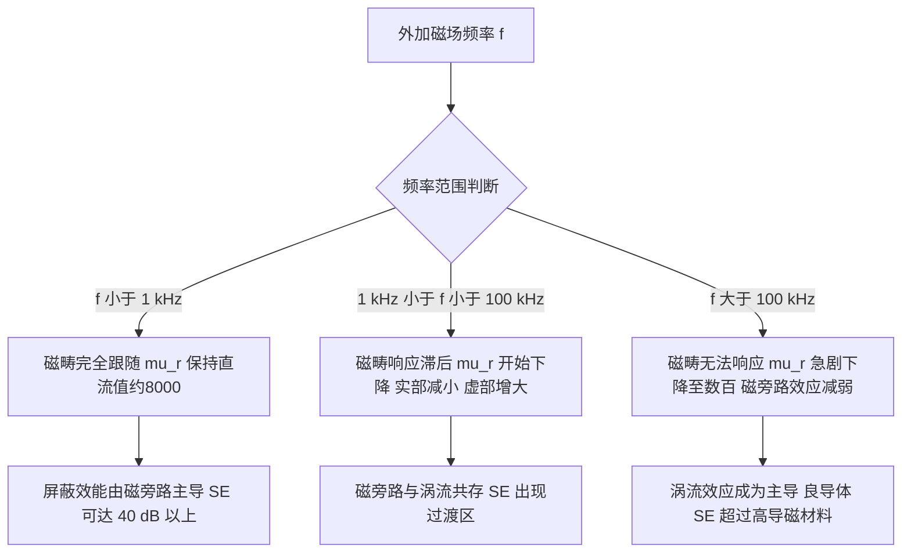
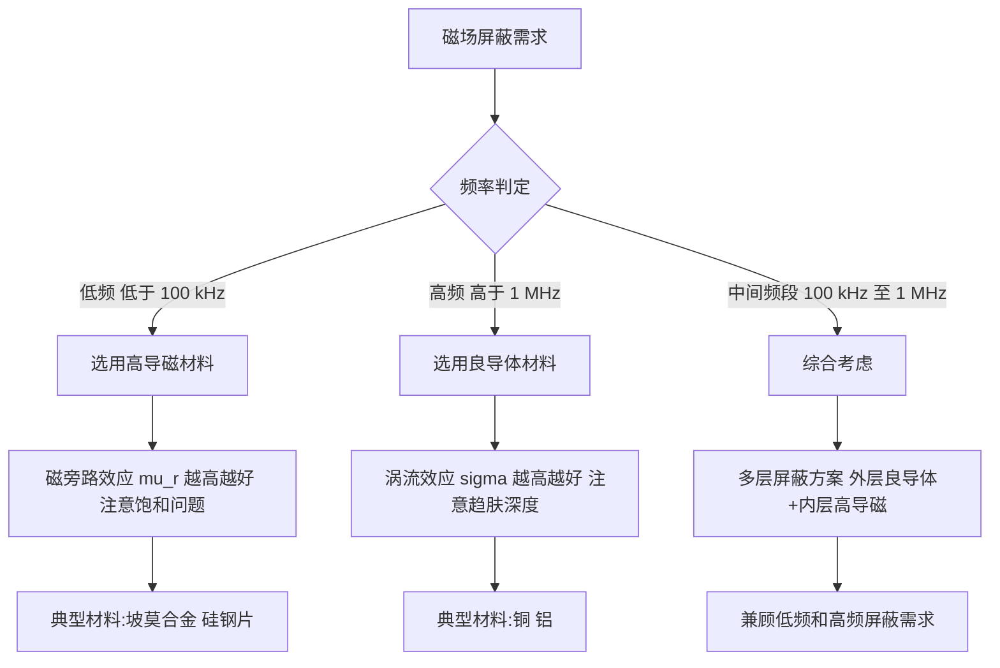
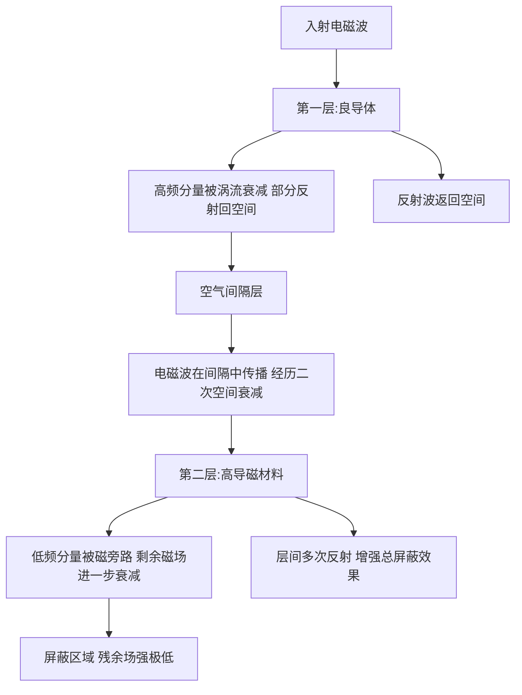

## 14.4 磁场屏蔽实验

### 14.4.1 实验目的

1. 理解低频磁场屏蔽与高频磁场屏蔽的不同机理：磁旁路效应（高导磁材料）与涡流效应（良导体），掌握二者在屏蔽效能上的本质差异。
2. 掌握屏蔽效能的基本计算公式，包括吸收损耗 $A$、反射损耗 $R$ 和多次反射修正项 $B$ 的物理意义及工程计算方法。
3. 学会使用 H 场探头与频谱分析仪定量测量磁场屏蔽效能，掌握近场测量中的探头定位与校准方法。
4. 验证多层屏蔽结构对提高总屏蔽效能的有效性，理解层间间隔对屏蔽叠加效果的影响。
5. 通过实验数据对比不同材料（铜、铝、硅钢片、坡莫合金）的屏蔽特性，建立针对不同频段的屏蔽材料选型工程直觉。
6. 了解温度、材料纯度、加工工艺等非理想因素对屏蔽效能的实际影响，培养工程实验中的误差分析能力。

### 14.4.2 实验原理

#### 14.4.2.1 磁场屏蔽的物理本质

磁场屏蔽的机理因频率而异。低频磁场屏蔽利用高磁导率材料的**磁旁路效应**，将磁力线引导至屏蔽体内部，从而降低屏蔽区域内的磁场强度。高频磁场屏蔽利用良导体的**涡流效应**，在屏蔽体表面感应出涡流，产生反向磁场抵消入射磁场。

从电磁场理论的角度，屏蔽效能 $\mathrm{SE}$（Shielding Effectiveness）定义为屏蔽前后同一位置处场强之比的对数形式：

$$
\mathrm{SE} = 20 \log_{10} \frac{H_0}{H_1}
\tag{14-71}
$$

式中，$H_0$ 为无屏蔽时某点的磁场强度（A/m），$H_1$ 为有屏蔽时同一点的磁场强度（A/m），$\mathrm{SE}$ 单位为 dB。$\mathrm{SE}$ 值越大，表明屏蔽效果越好。当 $\mathrm{SE} \geq 60$ dB 时，一般认为达到了良好的工程屏蔽水平。

从能量角度理解，屏蔽效能也可用功率比表示：

$$
\mathrm{SE} = 10 \log_{10} \frac{P_0}{P_1}
\tag{14-72}
$$

式中 $P_0$ 和 $P_1$ 分别为屏蔽前后探头接收到的功率（W）。由于功率与场强的平方成正比，式（14-72）与式（14-71）在数学上等价。

#### 14.4.2.2 屏蔽效能的传输线理论

对于平面电磁波垂直入射到无限大金属屏蔽体的情形，可采用传输线类比方法推导屏蔽效能。屏蔽体可视为一段具有特定本征阻抗和传播常数的传输线。屏蔽体两侧为自由空间，波阻抗为 $Z_0 \approx 377\ \Omega$。

**平面波屏蔽效能公式**（适用于远场情况，也可近似用于近场磁场分析）：

$$
\mathrm{SE} = A + R + B
\tag{14-73}
$$

式中，$\mathrm{SE}$ 为屏蔽总效能（dB），$A$ 为吸收损耗（dB），$R$ 为反射损耗（dB），$B$ 为多次反射修正项（dB，当 $A < 15$ dB 时需考虑；当 $A \geq 15$ dB 时可忽略）。

该公式的推导基于以下物理图像：电磁波入射到屏蔽体时，先在空气—屏蔽体界面发生第一次反射（对应 $R$），透射进入屏蔽体的部分在传播过程中因欧姆损耗而衰减（对应 $A$），到达屏蔽体后界面时部分能量透射出去、部分能量被反射回屏蔽体内，被反射的能量再次传播至前界面，经历第二次反射和透射，如此反复（对应 $B$）。总屏蔽效能即为所有透射波分量叠加的结果。

##### 1. 吸收损耗

吸收损耗描述电磁波在屏蔽体内部传播时因欧姆损耗而产生的衰减。根据电磁波在导电媒质中的传播理论，场强按指数衰减 $e^{-z/\delta}$，其中 $\delta$ 为趋肤深度。穿过厚度 $t$ 后的衰减量为：

$$
A = 20 \log_{10} e^{t/\delta} = 8.686 \frac{t}{\delta}
\tag{14-74}
$$

式中，$A$ 为吸收损耗（dB），$t$ 为屏蔽体厚度（m），$\delta$ 为趋肤深度（m），$8.686 = 20\log_{10} e$ 为奈培转分贝系数。

将趋肤深度 $\delta = 1/\sqrt{\pi f \mu \sigma}$ 代入并归并常数后，得到工程常用的简化形式：

$$
A = 131.4 \, t \, \sqrt{f \mu_{\mathrm{r}} \sigma_{\mathrm{r}}}
\tag{14-75}
$$

式中，$A$ 为吸收损耗（dB），$t$ 为屏蔽体厚度（mm），$f$ 为频率（Hz），$\mu_{\mathrm{r}}$ 为相对磁导率，$\sigma_{\mathrm{r}}$ 为相对电导率（以铜为基准，$\sigma_{\mathrm{Cu}} = 5.8 \times 10^{7}\ \mathrm{S/m}$）。由式（14-75）可见，吸收损耗与厚度的平方根成正比，与频率的平方根成正比，这正是涡流屏蔽随频率升高而增强的数学描述。

式（14-75）的推导过程如下：将 $\delta = 1/\sqrt{\pi f \mu_0 \mu_{\mathrm{r}} \sigma_{\mathrm{Cu}} \sigma_{\mathrm{r}}}$ 代入 $A = 8.686 t / \delta$，代入 $\mu_0 = 4\pi \times 10^{-7}$ H/m、$\sigma_{\mathrm{Cu}} = 5.8 \times 10^{7}$ S/m，并将 $t$ 单位转换为 mm，整理后得到 $A = 131.4\, t\, \sqrt{f \mu_{\mathrm{r}} \sigma_{\mathrm{r}}}$。该式是工程估算中最常用的吸收损耗公式。

**示例计算**：对于铜箔（$t = 0.1$ mm，$\mu_{\mathrm{r}} = 1$，$\sigma_{\mathrm{r}} = 1$），在 1 MHz 下：

$$
A = 131.4 \times 0.1 \times \sqrt{1 \times 10^6 \times 1} = 131.4 \times 0.1 \times 1000 = 13.14\ \mathrm{dB}
\tag{14-76}
$$

**示例计算二**：对于坡莫合金箔（$t = 0.1$ mm，$\mu_{\mathrm{r}} = 8000$，$\sigma_{\mathrm{r}} \approx 0.02$），在 100 kHz 下：

$$
A = 131.4 \times 0.1 \times \sqrt{100 \times 10^3 \times 8000 \times 0.02} = 131.4 \times 0.1 \times \sqrt{16 \times 10^6} = 131.4 \times 0.1 \times 4000 = 52.56\ \mathrm{dB}
\tag{14-77}
$$

这一计算结果说明，坡莫合金在低频段凭借其高磁导率即可获得极高的吸收损耗，这是其作为低频屏蔽材料的核心优势。

##### 2. 趋肤深度

趋肤深度是表征电磁波在导电媒质中衰减特性的关键参数，定义为场强衰减至表面值的 $1/e$（约 37%）时所传播的距离：

$$
\delta = \frac{1}{\sqrt{\pi f \mu \sigma}}
\tag{14-78}
$$

式中，$\delta$ 为趋肤深度（m），$f$ 为频率（Hz），$\mu$ 为磁导率（H/m），$\sigma$ 为电导率（S/m）。对于铜（$\sigma = 5.8 \times 10^{7}$ S/m，$\mu = \mu_0$），不同频率下的趋肤深度为：100 kHz 时 $\delta \approx 0.21$ mm，1 MHz 时 $\delta \approx 66\ \mu$m，10 MHz 时 $\delta \approx 21\ \mu$m。

**表14-0：常用材料的趋肤深度对比（1 MHz）**

| 材料 | 电导率 $\sigma$（S/m） | 相对磁导率 $\mu_{\mathrm{r}}$ | 趋肤深度 $\delta$（$\mu$m） | 吸收损耗系数 $A/t$（dB/mm） |
|------|----------------------|----------------------------|--------------------------|---------------------------|
| 铜 | $5.8 \times 10^7$ | 1 | 66 | 131.4 |
| 铝 | $3.5 \times 10^7$ | 1 | 85 | 102.2 |
| 硅钢片 | $2.0 \times 10^6$ | 1000 | 11.3 | 768 |
| 坡莫合金 | $1.2 \times 10^6$ | 8000 | 5.1 | 1704 |
| 不锈钢（304） | $1.4 \times 10^6$ | 1 | 425 | 20.4 |
| 黄铜 | $1.5 \times 10^7$ | 1 | 130 | 66.8 |

从表14-0可以看出，高磁导率材料（硅钢片、坡莫合金）的趋肤深度远小于良导体，这是因为 $\mu_{\mathrm{r}}$ 在 $\delta$ 的分母中以平方根形式出现。这也解释了为何高导磁材料即使厚度很薄，也能在低频段产生显著的吸收损耗。

工程经验认为，当屏蔽体厚度 $t \geq 3\delta$ 时，吸收损耗起主导作用（$A \geq 26$ dB），此时反射损耗和多次反射修正的影响可忽略。当 $t < \delta$ 时，吸收损耗非常有限（$A < 9$ dB），屏蔽主要依靠反射损耗。当 $t \geq 10\delta$ 时，吸收损耗达到 87 dB 以上，屏蔽体可视为理想屏蔽。

##### 3. 反射损耗

反射损耗源于电磁波在空气—屏蔽体界面上的阻抗失配。波从低阻抗介质（空气，$Z_0 \approx 377\ \Omega$）入射到高导电介质时，部分能量被反射。反射损耗的大小取决于波阻抗与屏蔽体本征阻抗的比值。

**反射损耗的物理基础**：屏蔽体的本征阻抗 $Z_s$ 为：

$$
Z_s = \sqrt{\frac{\mathrm{j} \omega \mu}{\sigma + \mathrm{j} \omega \varepsilon}} \approx \sqrt{\frac{\mathrm{j} \omega \mu}{\sigma}} \quad (\sigma \gg \omega \varepsilon)
\tag{14-79}
$$

对于良导体，$\sigma \gg \omega \varepsilon$，上式简化为：

$$
Z_s = (1 + \mathrm{j}) \sqrt{\frac{\pi f \mu}{\sigma}} = (1 + \mathrm{j}) \frac{1}{\sigma \delta}
\tag{14-80}
$$

屏蔽体的本征阻抗是一个复数量，其实部和虚部相等，幅值为 $|Z_s| = \sqrt{2\pi f \mu / \sigma}$。对于铜在 1 MHz 下，$|Z_s| \approx 1.2\ \mathrm{m}\Omega$，远小于空气波阻抗 $377\ \Omega$，这就是反射损耗产生的根源。

**远场（平面波）反射损耗**：

$$
R_{\mathrm{P}} = 168 - 20 \log_{10} \sqrt{\frac{f \mu_{\mathrm{r}}}{\sigma_{\mathrm{r}}}}
\tag{14-81}
$$

式中，$R_{\mathrm{P}}$ 为远场反射损耗（dB），$f$ 为频率（Hz），$\mu_{\mathrm{r}}$ 为相对磁导率，$\sigma_{\mathrm{r}}$ 为相对电导率。

式（14-81）的物理含义：反射损耗由屏蔽体表面阻抗与自由空间波阻抗之比决定。常数 168 来源于 $20\log_{10}(Z_0/4)$ 的数值计算结果（$Z_0 = 377\ \Omega$）。分母中的因子 4 考虑了屏蔽体两侧界面上的两次透射。反射损耗随频率升高而减小，这是因为屏蔽体的本征阻抗随频率升高而增大，与空间波阻抗的失配程度减小。

**示例计算**：铜在 1 MHz 下的远场反射损耗：

$$
R_{\mathrm{P}} = 168 - 20 \log_{10} \sqrt{\frac{1 \times 10^6 \times 1}{1}} = 168 - 20 \log_{10}(1000) = 168 - 60 = 108\ \mathrm{dB}
\tag{14-82}
$$

**近场磁场（H 场主导）反射损耗**：

当源距离屏蔽体较近（$r < \lambda/2\pi$）且磁场占主导时，波阻抗低于自由空间波阻抗：

$$
R_{\mathrm{H}} = 20 \log_{10} \frac{1.17 \times 10^{-2}}{r \sqrt{f \mu_{\mathrm{r}} / \sigma_{\mathrm{r}}}}
\tag{14-83}
$$

式中，$R_{\mathrm{H}}$ 为近场磁场反射损耗（dB），$r$ 为源到屏蔽体的距离（m），$f$ 为频率（Hz），$\mu_{\mathrm{r}}$ 为相对磁导率，$\sigma_{\mathrm{r}}$ 为相对电导率。

**近场磁场反射损耗的物理图像**：在近场区域，磁场的波阻抗 $Z_{\mathrm{H}} = \mathrm{j} \omega \mu_0 r$（$r$ 为源到屏蔽体的距离），这是一个远小于 $Z_0$ 的值。因此近场磁场的反射损耗远小于远场情况。例如，同样对铜在 1 MHz 下、距离 $r = 10$ mm：

$$
R_{\mathrm{H}} = 20 \log_{10} \frac{1.17 \times 10^{-2}}{0.01 \times \sqrt{1 \times 10^6}} = 20 \log_{10} \frac{1.17 \times 10^{-2}}{10} = 20 \log_{10}(1.17 \times 10^{-3}) \approx -58.6\ \mathrm{dB}
\tag{14-84}
$$

负的反射损耗？这意味着近场磁场不仅没有被反射，反而因为波阻抗低于屏蔽体阻抗而发生阻抗匹配？这正是近场磁场屏蔽的难点所在——反射损耗不仅不能提供屏蔽贡献，反而可能削弱总屏蔽。这也解释了为何在低频近场磁场屏蔽中，必须依靠吸收损耗（磁旁路效应）而非反射损耗。

**近场电场（E 场主导）反射损耗**：

当电场占主导时，波阻抗高于自由空间波阻抗：

$$
R_{\mathrm{E}} = 322 - 20 \log_{10} \left( r \sqrt{\frac{f^3 \mu_{\mathrm{r}}}{\sigma_{\mathrm{r}}}} \right)
\tag{14-85}
$$

式中，$R_{\mathrm{E}}$ 为近场电场反射损耗（dB），其余参数含义同式（14-77）。本实验主要关注近场磁场屏蔽，因此 $R_{\mathrm{H}}$ 是主要的反射损耗形式。

三种反射损耗的对比如下：远场 > 近场电场 > 近场磁场。对于磁场占主导的近场情况（本实验正是如此），反射损耗通常为负值或者很小的正值，对总屏蔽效能的贡献十分有限甚至有害，这也凸显了在磁场屏蔽中依赖吸收损耗的重要性。

##### 4. 多次反射修正项

当屏蔽体较薄、吸收损耗较小（$A < 15$ dB）时，从屏蔽体后界面反射回前界面的电磁波会再次反射并向前传播，形成多次反射。这些多次反射波的总贡献为：

$$
B = 20 \log_{10} \left| 1 - e^{-2t/\delta} \right|
\tag{14-86}
$$

式中，$B$ 为多次反射修正项（dB），$t$ 为屏蔽体厚度（m），$\delta$ 为趋肤深度（m）。$B$ 通常为负值或零，表示总屏蔽效能低于 $A + R$ 的简单加和。当 $t/\delta \geq 1.5$（即 $A \geq 13$ dB）时，$|B| < 1$ dB；当 $t/\delta \geq 3.5$（即 $A \geq 30$ dB）时，$B \approx 0$ dB，可完全忽略。

**多次反射修正项的深入理解**：式（14-86）是在假设屏蔽体两侧均为同一介质（空气）且不考虑反射系数的频率依赖性前提下得到的近似表达式。更严格的表达式应考虑反射系数的复数特性：

$$
B = 20 \log_{10} \left| 1 - \Gamma e^{-2\gamma t} \right|
\tag{14-87}
$$

式中，$\Gamma$ 为空气—屏蔽体界面的反射系数，$\gamma = \sqrt{\mathrm{j}\omega\mu(\sigma + \mathrm{j}\omega\varepsilon)}$ 为屏蔽体中的传播常数。对于良导体，$\gamma \approx (1 + \mathrm{j})/\delta$，因此 $e^{-2\gamma t} = e^{-2t/\delta} e^{-\mathrm{j}2t/\delta}$。这一相移因子在 $t/\delta$ 较小时有重要影响。

**示例计算**：铜箔（$t = 0.1$ mm）在 100 kHz 下，$t/\delta \approx 0.48$：

$$
B = 20 \log_{10} |1 - e^{-0.96}| = 20 \log_{10}(1 - 0.383) = 20 \log_{10}(0.617) = -4.2\ \mathrm{dB}
\tag{14-88}
$$

这是一个不可忽略的负修正，说明在该频段下屏蔽效能比 $A+R$ 简单加和值低约 4 dB。这正是铜箔在 100 kHz 下实测 $\mathrm{SE}_H$ 只有约 6 dB 的重要原因之一。

##### 5. 屏蔽效能的频率分段特性

综合考虑吸收损耗和反射损耗，可以将磁场屏蔽的频段划分为三个区域。

**区域I：低频区（$t/\delta < 1$）**。在此区域，趋肤深度大于屏蔽体厚度，电磁波几乎无衰减地穿透屏蔽体，吸收损耗 $A < 9$ dB。屏蔽主要依赖反射损耗，但近场磁场的反射损耗 $R_{\mathrm{H}}$ 本身在低频区也很有限（随频率降低而减小）。总屏蔽效能 $\mathrm{SE}$ 通常不超过 10 dB，且需计入多次反射修正项 $B$（负值，降低总效能）。实验中的铜箔在 100 kHz 下即属此区域。

**区域II：过渡区（$1 \leq t/\delta < 3$）**。吸收损耗逐渐增大（9–26 dB），反射损耗仍有一定贡献。此时多次反射修正项的影响逐渐减小至可忽略。$\mathrm{SE}$ 随频率升高而迅速增长，是屏蔽效能变化最剧烈的频段。实验中的铜箔在 500 kHz–5 MHz 之间即属此区域。

**区域III：高频区（$t/\delta \geq 3$）**。吸收损耗起绝对主导（$A \geq 26$ dB），反射损耗和多次反射修正均可忽略。$\mathrm{SE} \approx A$，按 $\sqrt{f}$ 规律增长。实验中的铜箔在 10 MHz 以上即属此区域。

这三个区域的划分对于屏蔽设计和实验验证具有重要意义，可以帮助实验者根据屏蔽体的厚度和材料参数预估其有效工作频段。

**屏蔽效能与 $t/\delta$ 的完整关系**：

| $t/\delta$ | 吸收损耗 $A$（dB） | 多次反射修正 $B$（dB） | $\mathrm{SE} \approx A+R+B$ 的特征 |
|-----------|------------------|--------------------|-------------------------------|
| 0.1 | 0.87 | $-7.8$ | 反射损耗主导，$B$ 不可忽略 |
| 0.3 | 2.61 | $-5.5$ | 反射损耗主导 |
| 0.5 | 4.34 | $-4.1$ | 反射损耗主导 |
| 1.0 | 8.69 | $-2.5$ | 吸收与反射共同作用 |
| 1.5 | 13.03 | $-1.2$ | 吸收逐渐主导 |
| 2.0 | 17.37 | $-0.6$ | 吸收主导，$B$ 可忽略 |
| 3.0 | 26.06 | $-0.1$ | 吸收绝对主导 |
| 5.0 | 43.43 | $\approx 0$ | 理想屏蔽体近似 |

##### 6. 孔缝泄漏对屏蔽效能的影响

值得特别指出的是，上述理论分析均基于无限大、无缝隙的理想屏蔽体。在实际工程中，屏蔽体上不可避免地存在通风孔、接缝、开孔等不连续结构。当孔缝的最大线性尺寸 $L$ 大于 $\lambda/20$（$\lambda$ 为电磁波波长）时，电磁能量会通过孔缝泄漏，使实际屏蔽效能急剧下降。

**孔缝泄漏的定量估算**：对于单孔，泄漏导致的屏蔽效能下降量为：

$$
\mathrm{SE}_{\mathrm{leak}} = 20 \log_{10} \frac{\lambda}{2L} \quad (L \ll \lambda)
\tag{14-89}
$$

式中 $L$ 为孔的最大线性尺寸（m）。例如，在 1 GHz（$\lambda = 0.3$ m）下，一个 $L = 10$ mm 的缝隙带来的泄漏屏蔽效能上限仅为：

$$
\mathrm{SE}_{\mathrm{leak}} = 20 \log_{10} \frac{0.3}{2 \times 0.01} = 20 \log_{10} 15 = 23.5\ \mathrm{dB}
\tag{14-90}
$$

这意味着即使屏蔽体本身的 $\mathrm{SE}$ 为 60 dB，总屏蔽效能也将被泄漏限制在 23.5 dB 以下。

对于圆形孔，泄漏近似与 $(d/\lambda)^3$ 成正比（$d$ 为孔径）。对于矩形缝隙，泄漏近似与 $(l/\lambda)^2$ 成正比（$l$ 为缝隙长度）。因此，在设计屏蔽体时应遵循以下原则：
- 优先采用圆形孔而非矩形槽；
- 孔的最大尺寸应小于屏蔽最高频率对应波长的 1/20；
- 使用截止波导管（蜂窝孔板）在通风孔处实现波导衰减。

本实验中使用完整的平板屏蔽材料，孔缝泄漏的影响被降至最低，但实验结果与理论值的偏差中仍可能包含材料边缘绕射的贡献——材料面积有限时，磁力线会绕过屏蔽体边缘进入屏蔽区域。

**边缘绕射的估算**：对于边长为 $W$ 的方形屏蔽板，距离 $d$ 处的绕射影响可用下式近似：

$$
\mathrm{SE}_{\mathrm{diff}} \approx 20 \log_{10} \left( 1 + \frac{W}{2d} \right)
\tag{14-91}
$$

当 $W = 200$ mm、$d = 10$ mm 时，$\mathrm{SE}_{\mathrm{diff}} \approx 20 \log_{10}(11) \approx 20.8$ dB。这意味着即使屏蔽材料本身的 $\mathrm{SE}$ 很高，边缘绕射也会将总屏蔽效能限制在约 21 dB。因此，本实验中所用的 200 mm × 200 mm 材料在屏蔽效能测量中实际上存在约 20 dB 的上限约束，这是实验中一个重要的系统偏差来源。

##### 7. 屏蔽材料的磁饱和问题

对于高导磁材料（硅钢片、坡莫合金），当外加磁场强度超过材料的饱和磁感应强度 $B_{\mathrm{s}}$ 时，磁导率会急剧下降到接近于 1，材料失去磁旁路能力。常见材料的饱和磁感应强度：硅钢片 $B_{\mathrm{s}} \approx 2.0$ T，坡莫合金 $B_{\mathrm{s}} \approx 0.7$–$1.0$ T。

在大电流、强磁场场景下（如电力变压器附近的工频磁场屏蔽），应优先选用饱和磁感应强度高的材料（如硅钢片）而非高磁导率但易饱和的材料（如坡莫合金）。本实验中的小环天线产生的磁场较弱（远低于 1 mT），不涉及磁饱和问题，但在扩展应用中需注意这一限制。

**磁饱和的临界磁场估算**：对于给定材料，磁饱和发生的临界外部磁场 $H_{\mathrm{sat}}$ 约为：

$$
H_{\mathrm{sat}} \approx \frac{B_{\mathrm{s}}}{\mu_0 \mu_{\mathrm{r}}}
\tag{14-92}
$$

对于坡莫合金（$B_{\mathrm{s}} \approx 0.8$ T，$\mu_{\mathrm{r}} \approx 8000$），$H_{\mathrm{sat}} \approx 0.8 / (4\pi \times 10^{-7} \times 8000) \approx 79.6$ A/m（约 1 Oe）。这意味着超过约 80 A/m 的外部磁场即可使坡莫合金开始饱和。对于硅钢片（$B_{\mathrm{s}} \approx 2.0$ T，$\mu_{\mathrm{r}} \approx 1000$），$H_{\mathrm{sat}} \approx 2.0 / (4\pi \times 10^{-7} \times 1000) \approx 1591$ A/m（约 20 Oe），饱和阈值高出 20 倍。

##### 8. 温度对屏蔽效能的影响

屏蔽材料的电导率 $\sigma$ 和磁导率 $\mu$ 均随温度变化，进而影响屏蔽效能。

**电导率的温度系数**：金属的电导率随温度升高而降低：

$$
\sigma(T) = \frac{\sigma_{20^\circ\mathrm{C}}}{1 + \alpha (T - 20^\circ\mathrm{C})}
\tag{14-93}
$$

式中，$\alpha$ 为电阻温度系数，铜的 $\alpha \approx 0.00393$ /°C，铝的 $\alpha \approx 0.00429$ /°C。温度升高 50°C 时，铜的电导率下降约 16%，吸收损耗相应降低约 8%。

**磁导率的温度依赖性**：磁性材料的磁导率随温度变化更为复杂。在居里温度 $T_{\mathrm{C}}$ 以下，磁导率先随温度升高而增加（因热激活助磁畴运动），在接近 $T_{\mathrm{C}}$ 时急剧下降至 1。坡莫合金的居里温度约为 400°C，硅钢片约为 750°C。在室温附近（20–60°C），坡莫合金的磁导率变化通常在 10%–20% 以内，但在接近零下温度时可能显著下降。

**工程考虑**：本实验在室温（约 25°C）下进行，温度影响可忽略。但在高温环境（>80°C）或低温环境（<0°C）下的屏蔽工程应用中，必须考虑温度对屏蔽效能的修正。

#### 14.4.2.3 磁旁路效应与材料磁导率的频率特性

低频磁场屏蔽主要依赖高磁导率材料的磁旁路效应。磁力线倾向于通过磁阻较小的路径，高磁导率材料为磁力线提供了低磁阻的分流路径，使大部分磁通被引导至屏蔽材料内部，从而降低了屏蔽区域内的磁场强度。

屏蔽体对磁场的旁路效果可以用磁路模型来近似。设屏蔽体的磁导率为 $\mu$，截面积为 $S$，磁路长度为 $l$，则磁阻为 $R_{\mathrm{m}} = l/(\mu S)$。屏蔽体内部的磁通量 $\Phi_s$ 与总磁通量 $\Phi_0$ 之比为：

$$
\frac{\Phi_s}{\Phi_0} = \frac{R_{\mathrm{m0}}}{R_{\mathrm{m0}} + R_{\mathrm{ms}}}
\tag{14-94}
$$

式中，$R_{\mathrm{m0}}$ 为空气路径的磁阻，$R_{\mathrm{ms}}$ 为屏蔽体路径的磁阻。高 $\mu$ 值使 $R_{\mathrm{ms}} \ll R_{\mathrm{m0}}$，因此大部分磁通被吸入屏蔽体。

**磁旁路效应的定量估算**：如果屏蔽体为厚度 $t$、磁导率 $\mu$ 的无限大平板，放置在距离磁场源 $r$ 处，屏蔽效能可近似为：

$$
\mathrm{SE}_{\mathrm{shunt}} \approx 20 \log_{10} \left( 1 + \frac{\mu_{\mathrm{r}} t}{2r} \right)
\tag{14-95}
$$

对于坡莫合金（$\mu_{\mathrm{r}} = 8000$，$t = 0.1$ mm，$r = 10$ mm）：

$$
\mathrm{SE}_{\mathrm{shunt}} \approx 20 \log_{10} \left( 1 + \frac{8000 \times 0.1}{2 \times 10} \right) = 20 \log_{10}(1 + 40) = 20 \log_{10} 41 \approx 32.3\ \mathrm{dB}
\tag{14-96}
$$

这与表 14-5 中坡莫合金在 100 kHz 下 $\mathrm{SE}_H = 42$ dB 的典型值处于同一量级，验证了磁旁路模型的有效性。实际值略高于估算，是因为还包含了涡流吸收损耗的附加贡献。

然而，材料的相对磁导率 $\mu_{\mathrm{r}}$ 并非恒定值，而是随频率变化的复数量。当频率升高时，磁畴的转向跟不上外加磁场的变化，导致磁导率下降。这一特性在高频段尤为显著：

$$
\mu_{\mathrm{r}}(f) = \frac{\mu_{\mathrm{r0}}}{1 + \mathrm{j}(f/f_{\mathrm{c}})}
\tag{14-97}
$$

式中，$\mu_{\mathrm{r0}}$ 为直流相对磁导率，$f_{\mathrm{c}}$ 为截止频率（由材料微观结构和电导率决定），$\mathrm{j}$ 为虚数单位。式（14-96）说明，当 $f > f_{\mathrm{c}}$ 时，磁导率的实部（决定屏蔽效果的部分）随频率增加而反比下降。

**磁导率频率特性的更精确模型**：对于实际磁性材料，磁导率的频率响应更常用 Debye 型或 Cole-Cole 型弛豫模型描述：

$$
\mu_{\mathrm{r}}(f) = \mu^{\prime}(f) - \mathrm{j} \mu^{\prime\prime}(f)
\tag{14-98}
$$

式中实部 $\mu^{\prime}$ 代表储磁能力（决定磁旁路效果），虚部 $\mu^{\prime\prime}$ 代表磁损耗（决定涡流吸收）。二者通过 Kramers-Kronig 关系相互关联。在低频段（$f \ll f_{\mathrm{c}}$），$\mu^{\prime} \approx \mu_{\mathrm{r0}}$，$\mu^{\prime\prime} \ll \mu^{\prime}$。在截止频率附近（$f \approx f_{\mathrm{c}}$），$\mu^{\prime}$ 开始下降，$\mu^{\prime\prime}$ 达到峰值。在高频段（$f \gg f_{\mathrm{c}}$），$\mu^{\prime} \propto 1/f^2$，$\mu^{\prime\prime} \propto 1/f$。

**典型磁性材料的磁导率—频率特性参数**：

| 材料类型 | 直流磁导率 $\mu_{\mathrm{r0}}$ | 截止频率 $f_{\mathrm{c}}$ | $\mu_{\mathrm{r0}} \cdot f_{\mathrm{c}}$ 乘积 | 适用频段 |
|---------|----------------------------|------------------------|-------------------------------------------|---------|
| 坡莫合金（80% Ni-Fe） | 8000–20000 | 10–100 kHz | $\sim 8 \times 10^8$ | DC–100 kHz |
| 坡莫合金（50% Ni-Fe） | 2000–5000 | 100–300 kHz | $\sim 5 \times 10^8$ | DC–300 kHz |
| 硅钢片（3% Si-Fe） | 500–1500 | 1–10 kHz | $\sim 5 \times 10^6$ | DC–10 kHz |
| 锰锌铁氧体 | 1000–5000 | 1–10 MHz | $\sim 5 \times 10^9$ | 10 kHz–10 MHz |
| 镍锌铁氧体 | 100–1000 | 10–100 MHz | $\sim 1 \times 10^{10}$ | 1 MHz–100 MHz |
| 铁硅铝磁粉芯 | 26–125 | 100 MHz–1 GHz | $\sim 2 \times 10^{10}$ | 100 kHz–1 GHz |

典型磁性材料的截止频率与磁导率成反比关系（Snoek 极限）：$\mu_{\mathrm{r0}} \cdot f_{\mathrm{c}} \approx \mathrm{常数}$。这一规律由 Snoek 于 1948 年首先提出，是磁性材料在高频应用中的基本物理极限。从上表可见，坡莫合金的 $\mu_{\mathrm{r0}} \cdot f_{\mathrm{c}}$ 乘积约为 $8 \times 10^8$，而镍锌铁氧体的乘积约为 $1 \times 10^{10}$，后者高出约一个数量级，这正是铁氧体材料在高频段仍能保持一定磁导率的物理基础。

坡莫合金的直流磁导率高达 8000 以上，但其截止频率仅约数十千赫兹；而铁氧体的磁导率较低（数百至数千），但截止频率可达兆赫兹甚至吉赫兹。这正是高导磁材料在高频段屏蔽效能反而不如良导体的根本原因。

**磁导率—频率特性示意图**（以坡莫合金为例）：

**磁屏蔽与电屏蔽的对比图**：

#### 14.4.2.4 多层屏蔽原理

多层屏蔽通过在屏蔽体间引入空气层或绝缘层，利用层间界面的多次反射和阻抗渐变，达到比单层屏蔽更高的总屏蔽效能。两层屏蔽的总屏蔽效能可近似表示为：

$$
\mathrm{SE}_{\mathrm{total}} = \mathrm{SE}_1 + \mathrm{SE}_2 + \Delta
\tag{14-99}
$$

式中，$\mathrm{SE}_1$ 和 $\mathrm{SE}_2$ 分别为第一层和第二层的单层屏蔽效能（dB），$\Delta$ 为层间耦合修正项（dB）。当层间间隔大于趋肤深度且小于波长的 1/4 时，$\Delta$ 通常为正值（2–6 dB），表示层间间隔可以进一步提升屏蔽效能。

**多层屏蔽的传输线分析**：从传输线理论角度，双层屏蔽可等效为两段传输线的级联。设第一层的传输矩阵为 $\mathbf{T}_1$，间隔层的传输矩阵为 $\mathbf{T}_{\mathrm{air}}$，第二层的传输矩阵为 $\mathbf{T}_2$，总传输矩阵为 $\mathbf{T}_{\mathrm{total}} = \mathbf{T}_1 \cdot \mathbf{T}_{\mathrm{air}} \cdot \mathbf{T}_2$。总屏蔽效能为：

$$
\mathrm{SE}_{\mathrm{total}} = -20 \log_{10} |T_{\mathrm{total},11}|
\tag{14-100}
$$

式中 $T_{\mathrm{total},11}$ 为总传输矩阵的左上角元素。精确求解表明，层间间隔带来的额外衰减主要来源于：（1）间隔层中的空间传播衰减（虽然空气层的衰减很小）；（2）间隔层两侧界面的多次反射引起的相消干涉；（3）阻抗渐变效应——电磁波从高阻抗空间进入低阻抗屏蔽体再回到空间，每次界面转换都伴随能量反射。

**双层异质屏蔽的结构优化**：实际工程中常用双层异质屏蔽结构：外层使用良导体（铜或铝）反射和吸收高频电磁波，内层使用高导磁材料（坡莫合金）旁路低频磁场。这种组合可以覆盖从低频到高频的宽带屏蔽需求。

**层间间隔的最佳厚度**：理论分析表明，层间间隔的最佳厚度约为 $\lambda/4$（在屏蔽材料的工作频段内）。此时两次反射波相位相差 180°，产生相消干涉，最有利于屏蔽。然而，对于低频磁场（如 100 kHz，$\lambda = 3000$ m），$\lambda/4 = 750$ m 显然不可行。因此，低频磁场屏蔽中层间间隔的实际选择主要受机械结构和空间尺寸限制，实践经验推荐间隔厚度 $d \geq 3\delta$（间隔层厚度至少为趋肤深度的 3 倍）即可获得明显的增强效果。

**多层屏蔽机理图**：

### 14.4.3 实验设备

| 序号 | 设备名称 | 型号/规格 | 数量 | 用途说明 |
|------|----------|-----------|------|----------|
| 1 | 信号发生器 | RIGOL DG4062（或等效，60 MHz带宽） | 1台 | 产生正弦波激励信号，驱动小环天线产生标准磁场 |
| 2 | 频谱分析仪 | Keysight N9020A MXA（或等效，3.6 GHz） | 1台 | 接收H场探头信号，测量磁场强度的频谱分布 |
| 3 | 近场H场探头 | Langer EMV-Technik H 5（30 MHz – 3 GHz） | 1个 | 测量近场磁场强度，分辨率达1 dB |
| 4 | 低频H场探头 | 自制线圈探头（适用于 10 kHz – 30 MHz） | 1个 | 补充低频段测量，弥补商用探头的低频性能不足 |
| 5 | 小环天线（磁场源） | $\Phi$30 mm，单匝铜环，端接50 $\Omega$ 匹配电阻 | 1个 | 产生标准磁场作为被测屏蔽对象的激励源 |
| 6 | 屏蔽材料（良导体） | 铜箔（0.1 mm）、铝箔（0.1 mm），纯度 $\geq$ 99.5% | 各 200 mm × 200 mm | 测试涡流效应主导的高频屏蔽特性 |
| 7 | 屏蔽材料（高导磁） | 硅钢片（0.35 mm，$\mu_{\mathrm{r}} \approx 1000$）、坡莫合金箔（0.1 mm，$\mu_{\mathrm{r}} \approx 8000$） | 各 200 mm × 200 mm | 测试磁旁路效应主导的低频屏蔽特性 |
| 8 | 屏蔽筒 | 铜管（$\Phi$50 mm × 200 mm，壁厚 0.5 mm） | 1个 | 验证圆柱形屏蔽体的屏蔽效能 |
| 9 | 多层屏蔽组合夹具 | 塑料夹持架，可插入 1–4 层屏蔽材料，层间距 0–20 mm 可调 | 1套 | 支撑多层屏蔽结构的搭建与测试 |
| 10 | 非导电支架 | 聚四氟乙烯或木质，高度可调 | 若干 | 固定探头与天线，避免金属支架引入额外干扰 |
| 11 | 高斯计/特斯拉计 | F.W. Bell 5180（DC – 10 kHz，分辨率 0.1 $\mu$T） | 1台 | 低频磁场（含静态磁场）的辅助测量 |
| 12 | 数字万用表 | Fluke 17B+（或等效） | 1台 | 测量电路通断、检查探头连接 |
| 13 | 同轴电缆 | BNC-SMA，50 $\Omega$，1 m 长 | 3根 | 连接信号发生器、探头与频谱分析仪 |
| 14 | 校准件 | 开路/短路/负载标准件 | 1套 | 频谱分析仪输入端口校准 |

### 14.4.4 实验原理补充说明：探头输出的磁场强度换算

在使用 H 场探头和频谱分析仪进行测量时，频谱分析仪直接读取的是功率值 $P$（dBm）。需要通过探头系数 $k_{\mathrm{H}}$（dB$\mu$V/($\mu$A/m)，由探头厂商提供或通过校准获得）将功率值换算为磁场强度：

$$
H (\mathrm{dB}\mu\mathrm{A/m}) = P (\mathrm{dBm}) + 107 + k_{\mathrm{H}} + L_{\mathrm{cable}}
\tag{14-101}
$$

式中，$H$ 为磁场强度（dB$\mu$A/m 单位），$P$ 为频谱分析仪读值（dBm），$k_{\mathrm{H}}$ 为 H 场探头系数（dB$\mu$V/($\mu$A/m)），$L_{\mathrm{cable}}$ 为同轴电缆插损（dB）。常数 107 来源于 50 $\Omega$ 系统中 dBm 到 dB$\mu$V 的换算关系。

由于屏蔽效能 $\mathrm{SE}_H = 20\log_{10}(H_0/H_1)$ 定义为相对值，在探头系数和电缆损耗不变的条件下，可直接使用功率读数的差值：

$$
\mathrm{SE}_H = P_0(\mathrm{dBm}) - P_1(\mathrm{dBm})
\tag{14-102}
$$

式中，$P_0$ 为无屏蔽时的频谱分析仪读数（dBm），$P_1$ 为有屏蔽时的读数（dBm）。式（14-101）说明，实验中的 $\mathrm{SE}_H$ 可直接由功率差得到，无需进行探头系数换算。这是本实验采用功率差值法测量屏蔽效能的便捷之处。

**探头方向性的影响**：H 场探头通常具有方向性，对不同方向的磁场分量敏感度不同。为了准确测量，应确保探头敏感轴方向与环天线的磁场方向一致。在安装探头时，需注意探头本体上的方向标识。如果探头方向偏差 90°，读数可能下降 20–30 dB，导致错误的测量结果。

**自制低频探头的校准**：当使用自制线圈探头进行低频测量时，需自行校准探头系数。校准方法：将自制探头放置在已知磁场强度 $H_{\mathrm{cal}}$ 的标准场中（可使用亥姆霍兹线圈产生标准磁场），记录频谱分析仪的读数 $P_{\mathrm{cal}}$（dBm），则探头系数为：

$$
k_{\mathrm{H,coil}} = H_{\mathrm{cal}}(\mathrm{dB}\mu\mathrm{A/m}) - P_{\mathrm{cal}}(\mathrm{dBm}) - 107 - L_{\mathrm{cable}}
\tag{14-103}
$$

通过以上步骤获得的自制探头系数，精度通常在 $\pm 3$ dB 范围内，足以满足本实验的相对屏蔽效能测量需求。

### 14.4.5 实验步骤

#### 步骤1：实验系统搭建与校准

**详细操作**：

1.1 将小环天线通过同轴电缆连接至信号发生器的输出端口。确保连接牢固，50 $\Omega$ 阻抗匹配。同轴电缆应尽量避免小半径弯折，以减少驻波比。电缆弯曲半径不应小于电缆外径的 10 倍。

**预期现象**：连接完成后，信号发生器输出端显示负载状态为 50 $\Omega$。如果显示开路或短路，说明连接存在问题。

**常见错误**：（1）使用了 75 $\Omega$ 同轴电缆（如电视天线用电缆）代替 50 $\Omega$ 电缆，导致阻抗失配，驻波比增大至 1.5 以上，激励磁场不均匀。（2）BNC 接头未旋紧，接触不良导致信号时断时续。

1.2 将 H 场探头通过同轴电缆连接至频谱分析仪的输入端口。根据探头频率范围，在频谱分析仪上设置相应的频段和分辨带宽（RBW = 10 kHz，VBW = 10 kHz）。扫频范围根据测量频率设置，建议起始频率为测量频率的 0.5 倍，终止频率为测量频率的 2 倍，以便观察频谱纯净度。

**预计现象**：频谱分析仪屏幕上显示噪声基底，在 -90 至 -100 dBm 之间（取决于 RBW 设置）。未开启信号发生器时，不应出现明显的离散频谱峰。

**常见错误**：（1）RBW 设置过大（如 1 MHz），导致噪声基底过高（约 -80 dBm），无法分辨 100 kHz 的小信号。（2）VBW 设置过小（如 100 Hz），导致扫描时间过长，每次调整后需等待数秒才能看到稳定迹线。

1.3 开启信号发生器和频谱分析仪，预热 5 分钟以保证仪器工作稳定。频谱分析仪开机后需执行自校准（Align）程序，确保幅度精度在标称范围内。

**操作要点**：不同型号的频谱分析仪的对齐操作有所不同。Keysight 系列按 Mode Preset → Utility → Align → Auto Align All。RIGOL 系列一般在开机时自动执行。对齐过程约需 2–3 分钟，期间频幕显示 "Aligning..." 提示。

1.4 进行频谱分析仪的基线校准：断开探头，在输入端接入 50 $\Omega$ 负载，设置参考电平为 -30 dBm，观察噪声基底，确认噪声电平低于 -90 dBm。如果噪声基底偏高（高于 -85 dBm），检查输入衰减器设置，适当加大衰减量（如 10 dB）。记录噪声基底值，作为后续测量的底噪参考。

**预期结果**：在 RBW = 10 kHz 条件下，50 $\Omega$ 端接时的噪声基底通常为 -95 至 -100 dBm。如果显著高于 -90 dBm，可能原因包括：（1）输入衰减器设置为 0 dB（应至少设置 10 dB）；（2）频谱分析仪的前端放大器未关闭；（3）环境电磁干扰过强，需检查实验室屏蔽状况。

**常见错误**：跳过基线校准步骤，直接进行测量。后续遇到弱信号时无法判断是信号本身弱还是系统噪声过高，导致数据不可靠。

1.5 将信号发生器设置为：波形—正弦波，频率—100 kHz，幅度—5 Vpp，输出阻抗—50 $\Omega$。用数字万用表确认输出端有正确的电压值（正弦波 5 Vpp 对应有效值约 1.77 Vrms）。注意：若使用高阻抗输入端的万用表测量 50 $\Omega$ 输出，实际电压会受负载影响，建议在 50 $\Omega$ 负载端测量。

**操作验证**：将万用表切换至交流电压档（True RMS 模式），探头直接接触信号发生器输出端中心导体和外导体。5 Vpp 正弦波的理论 RMS 值为 $5 / (2\sqrt{2}) \approx 1.77$ Vrms。实测值应在 1.7–1.8 Vrms 范围内，偏差超过 5% 需检查信号发生器设置。

**常见错误**：万用表的频率响应有限（通常在 1 kHz–10 kHz 精确，高于 100 kHz 后误差增大），因此此步骤仅在 100 kHz 以下有效。对于 MHz 频段的验证，应使用示波器代替万用表。

1.6 将小环天线固定在非导电支架上。将 H 场探头固定于小环天线正上方，调整距离为 10 mm（用塞尺或标尺精确定位），确保探头平面与环面平行。探头与环面之间的夹角偏差每增加 10°，耦合效率约下降 1.5 dB，因此平行度控制十分重要。

**精细调整方法**：先目视对齐探头与环面的中心轴，然后使用塞尺插入探头底面与环面之间的间隙。当塞尺（10 mm）恰好接触两侧且无过大挤压力时，间距即为 10 mm。使用水平仪确认探头支架的垂直度，确保探头平面与环面平行。

**常见错误**：（1）使用金属支架固定探头或天线，金属支架自身受磁场激励产生二次辐射，引入额外误差。（2）测量过程中不慎撞击了支架，导致探头位置偏移而未被发现。

1.7 建立完整的测量链路后，接通信号发生器输出，观察频谱分析仪上是否有清晰稳定的单频信号。如果观察到多个杂散频谱峰，检查信号发生器的输出纯度和电缆屏蔽状况。

**预期现象**：频谱分析仪在中心频率 100 kHz 处出现一个单一的尖峰，峰值高于噪声基底至少 30 dB（即约 -60 至 -40 dBm 之间）。尖峰两侧不应有其他离散谱线。如有谐波（200 kHz、300 kHz 等），说明信号发生器输出失真，需降低输出幅度或检查波形设置。

**常见错误**：忽略了对频谱纯净度的检查就直接开始测量。如果存在谐波或杂散信号，后续的屏蔽效能测量结果将包含这些干扰信号，导致计算失误。

#### 步骤2：参考值测量

**详细操作**：

2.1 在无屏蔽材料的条件下，记录频谱分析仪中心频率 100 kHz 处的读数值，记为 $P_0$（dBm）。使用频谱分析仪的 Marker（标记）功能读取峰值，避免使用 Trace 数据中的最大值。

**操作要点**：将 Marker 设置在 100 kHz 中心频率上，打开 Marker Tracking 功能，即使信号发生器的频率有微小漂移也能准确捕捉峰值。按 Marker → Peak Search → Marker → Normal 完成设置。

**预期现象**：信号峰值稳定在某个值（如 -45 dBm）附近，波动范围不超过 $\pm 0.5$ dB。如果波动超过 $\pm 1$ dB，检查仪器预热是否充分（预热时间是否达到 5 分钟）。

2.2 将探头稍微偏移和旋转，观察读数变化。找到最大耦合位置后固定探头，确保后续每次测量位置一致。

**微调技巧**：在 x 和 y 方向上以 0.5 mm 步进移动探头，同时观察频谱分析仪上的峰值读数。找到最大读数位置后，用标记笔在支架上画线标记。重复 3 次，确认最大位置重复性在 $\pm 0.2$ mm 以内。

**预期现象**：探头在最优位置偏离 1 mm 时，读数下降约 1–3 dB。这验证了探头定位精度对测量结果的重要影响。

2.3 将信号发生器频率依次改变为 200 kHz、500 kHz、1 MHz、2 MHz、5 MHz、10 MHz、20 MHz、50 MHz、100 MHz，分别记录各频率下无屏蔽时的参考值 $P_0(f)$。每个频率点等待频谱分析仪迹线稳定后记录数据。

**操作要点**：改变频率后，需等待频谱分析仪完成至少 3 次完整的扫频扫描（扫描时间取决于 SPAN 和 RBW 设置）。建议使用 Max Hold 模式，读取稳定后的最大值。记录数据时同时记录参考电平设置，便于后续数据处理。

**预期现象**：$P_0(f)$ 随频率升高而逐渐下降，因为环天线的辐射效率随频率升高而降低（电小环天线的辐射电阻 $R_r \propto f^4$），同时探头耦合效率也具有频率依赖性。通常 $P_0$ 从 100 kHz 时的约 -45 dBm 下降到 100 MHz 时的约 -70 dBm。

**常见错误**：（1）未记录每个频率点的参考值就直接插入屏蔽材料进行测量，导致缺少基准数据。（2）改变频率后未等待迹线稳定即读取数据，引入额外的测量不确定度。

#### 步骤3：低频磁场屏蔽测量（磁旁路效应）

**详细操作**：

3.1 将信号发生器恢复至 100 kHz，记录无屏蔽参考值 $P_0$。

3.2 **铜箔测试**：在小环天线与探头之间插入铜箔（0.1 mm），确保铜箔面积覆盖整个环路区域且与环面平行。记录频谱分析仪读数 $P_1$。计算 $\mathrm{SE}_H = P_0 - P_1$（dB）。

**操作要点**：将铜箔插入夹具时，应使其自然平铺，不要拉伸或折叠。铜箔表面应朝向探头一侧。插入后检查铜箔是否与上下表面平行，如有翘曲可用非导电胶带固定四角（胶带应远离测量区域，避免影响磁场分布）。

**预期现象**：插入铜箔后，频谱分析仪读数下降 3–8 dB。100 kHz 下铜箔的 $\mathrm{SE}_H$ 约为 6 dB。如果读数下降超过 20 dB，应怀疑探头位置是否也随之改变了（如铜箔使探头抬升）。

**常见错误**：（1）铜箔表面存在氧化层，导致接触不良，实际电导率下降。建议用无水乙醇擦拭铜箔表面。（2）铜箔未完全覆盖探头到天线之间的空间，磁力线从侧面绕行，导致 $\mathrm{SE}_H$ 偏低。

3.3 **铝箔测试**：将铜箔替换为铝箔（0.1 mm），重复步骤 3.2 的测量。

**操作要点**：铝箔更薄更软，取放时需更加小心。铝箔表面氧化层（Al$_2$O$_3$）是绝缘体，但厚度极薄（约 4 nm），对电导率的影响可忽略。

**预期现象**：铝箔的 $\mathrm{SE}_H$ 略低于铜箔（约 5 dB vs 6 dB），因为铝的电导率约为铜的 61%。

3.4 **硅钢片测试**：将铝箔替换为硅钢片（0.35 mm），重复测量。注意硅钢片为铁磁性材料，操作时避免掉落或碰撞。

**操作要点**：硅钢片具有一定的硬度和脆性，插入夹具时避免用力推压导致弯曲。硅钢片两面可能有绝缘涂层（用于减少涡流损耗的表面处理），但挡在空气中不影响磁旁路效果。

**预期现象**：硅钢片的 $\mathrm{SE}_H$ 显著高于铜箔和铝箔，在 100 kHz 下可达 35–40 dB。读数下降幅度大，频谱分析仪上的峰值可能接近噪声基底，此时需注意底噪修正。

3.5 **坡莫合金测试**：将硅钢片替换为坡莫合金箔（0.1 mm），重复测量。坡莫合金质地较脆，取放需轻柔。

**操作要点**：坡莫合金箔（厚度 0.1 mm）非常薄且脆，禁止弯折。取放时应使用塑料镊子夹持边缘，避免手指直接接触。每次使用后应放入防潮袋保存，防止氧化。

**预期现象**：坡莫合金的 $\mathrm{SE}_H$ 在 100 kHz 下可达 40 dB 以上，是所有材料中最高的。如果 $\mathrm{SE}_H$ 低于 30 dB，应检查材料是否已经因机械加工或弯折而退化了磁导率。

3.6 将信号发生器频率依次改为 500 Hz、1 kHz、10 kHz，重复步骤 3.2–3.5，记录各材料在不同低频下的 $\mathrm{SE}_H$ 值。

**频率选择说明**：500 Hz 和 1 kHz 用于观察极低频下的屏蔽特性，10 kHz 作为低频段的中间频率，100 kHz（已在步骤 2 中测量）作为低频段的最高点。

**预期现象**：良导体（铜、铝）的 $\mathrm{SE}_H$ 随频率降低而进一步减小（趋肤深度增大，吸收损耗变小）。而高导磁材料（硅钢片、坡莫合金）的 $\mathrm{SE}_H$ 在低频段基本保持稳定，甚至略有升高（因为磁导率在更低频下更接近直流值）。

#### 步骤4：高频磁场屏蔽测量（涡流效应）

**详细操作**：

4.1 将信号发生器频率改为 1 MHz，重复步骤 3.2–3.5 的测量流程。

**操作要点**：频率升至 1 MHz 后，需确认频谱分析仪的中心频率和扫频范围已相应调整。如果频谱分析仪的显示迹线不稳定，适当增加扫描点数。

**预期现象**：此时铜箔和铝箔的 $\mathrm{SE}_H$ 明显增加（铜箔约 14 dB），因为 1 MHz 下 $t/\delta \approx 1.52$，吸收损耗开始起主导作用。坡莫合金的 $\mathrm{SE}_H$ 相比 100 kHz 时略有下降（因磁导率开始下降）。

4.2 将信号发生器频率改为 10 MHz，重复步骤 3.2–3.5 的测量流程。

**预期现象**：铜箔的 $\mathrm{SE}_H$ 达到 28 dB 以上，超过坡莫合金和硅钢片。这是本实验中最关键的交叉点——验证了高频下良导体优于高导磁材料的物理规律。

4.3 将信号发生器频率改为 50 MHz，重复步骤 3.2–3.5 的测量流程。注意 50 MHz 下 H 场探头与环天线的耦合效率可能降低，适当调整频谱分析仪的参考电平。

**预期现象**：铜箔的 $\mathrm{SE}_H$ 进一步升高至 40–50 dB，但坡莫合金的 $\mathrm{SE}_H$ 降至 10 dB 以下（此时高磁导率已完全丧失）。铝箔的 $\mathrm{SE}_H$ 约为铜箔的 70%–80%。

4.4 对比低频（100 kHz）和高频（10 MHz）下，高导磁材料（硅钢片、坡莫合金）与良导体（铜、铝）的 $\mathrm{SE}_H$ 差异。观察哪类材料在低频下性能更优，哪类材料在高频下性能更优。

#### 步骤5：吸收损耗与趋肤深度验证

**详细操作**：

5.1 使用铜箔（0.1 mm），将信号发生器从 100 kHz 扫描至 100 MHz。采用对数步进，每十倍频取 10 个频率点（即 100 kHz、125 kHz、158 kHz、199 kHz、251 kHz、316 kHz、398 kHz、501 kHz、631 kHz、794 kHz、1 MHz、1.25 MHz……依此类推至 100 MHz）。

**频率点选择说明**：对数步进确保在双对数坐标上各测量点等距分布，便于后续曲线拟合和斜率分析。30 个频率点覆盖三个数量级的频率变化，足以描绘出完整的 $\mathrm{SE}$–$f$ 曲线特征。

5.2 在每个频率点，分别记录无屏蔽参考值 $P_0(f)$ 和有铜箔屏蔽时的读数 $P_1(f)$，计算 $\mathrm{SE}_H(f) = P_0(f) - P_1(f)$。

**数据记录技巧**：可以使用频谱分析仪的 Trace 存储功能，先扫描并存储无屏蔽时的迹线作为 Trace A，再插入屏蔽材料后扫描存储为 Trace B，然后使用 Math → Trace A – Trace B 直接显示 $\mathrm{SE}_H(f)$ 曲线。该方法可以减少逐点记录的工作量。

**预期现象**：$\mathrm{SE}_H(f)$ 曲线整体呈上升趋势，但在 100 kHz–1 MHz 段斜率较大，1 MHz–100 MHz 段斜率逐渐趋近理论值。

5.3 在双对数坐标下绘制 $\mathrm{SE}_H(f)$–$f$ 曲线。横轴为频率（对数刻度），纵轴为 $\mathrm{SE}_H$（dB，线性刻度）。

5.4 根据式（14-75）计算铜箔的理论吸收损耗曲线 $A(f) = 131.4 \times 0.1 \times \sqrt{f \times 1 \times 1}$，其中 $f$ 单位 Hz。将理论曲线与实测曲线叠加在同一张图中进行对比。

**预期对比结果**：在 $t/\delta < 1$ 的低频段（$f < 450$ kHz），实测曲线高于理论吸收曲线（因为反射损耗有额外贡献，但多次反射修正部分抵消）。在 $t/\delta > 3$ 的高频段（$f > 4$ MHz），实测曲线与理论吸收曲线吻合较好，斜率均接近 +10 dB/十倍频。

5.5 在曲线上标出 $t = \delta$ 和 $t = 3\delta$ 的频率点。已知铜箔厚度 $t = 0.1$ mm，根据式（14-78）计算：$f_{t=\delta}$ 对应 $\delta = t$ 的频率，$f_{t=3\delta}$ 对应 $\delta = t/3$ 的频率。

**具体计算**：由 $\delta = 1/\sqrt{\pi f \mu_0 \mu_{\mathrm{r}} \sigma}$，令 $\delta = t = 0.1$ mm，解得：

$$
f_{t=\delta} = \frac{1}{\pi \mu_0 \mu_{\mathrm{r}} \sigma t^2} = \frac{1}{\pi \times 4\pi \times 10^{-7} \times 1 \times 5.8 \times 10^7 \times (10^{-4})^2} \approx 437\ \mathrm{kHz}
\tag{14-104}
$$

同理，令 $\delta = t/3 = 0.033$ mm，解得 $f_{t=3\delta} \approx 3.93$ MHz。这两个频率点分别对应吸收损耗 $A = 8.69$ dB 和 $A = 26.06$ dB。

5.6 观察实测 $\mathrm{SE}_H(f)$ 曲线的斜率。根据式（14-75），吸收损耗 $A \propto \sqrt{f}$，在双对数坐标下斜率为 +10 dB/十倍频（因为 $20\log_{10}\sqrt{f} = 10\log_{10}f$）。实际测量曲线可能因反射损耗的贡献而呈现不同的斜率趋势。

#### 步骤6：多层屏蔽实验

**详细操作**：

6.1 将信号发生器设置为 1 MHz。分别测量并记录以下结构的 $\mathrm{SE}_H$：

- **结构A**：单层铜箔（0.1 mm）
- **结构B**：单层坡莫合金箔（0.1 mm）
- **结构C**：铜箔 + 坡莫合金箔（接触叠放，无间隔）
- **结构D**：铜箔 + 10 mm 空气间隔 + 坡莫合金箔（使用塑料夹持架保持间隔）
- **结构E**：铜箔 + 纸板（1 mm）+ 铜箔（双层铜箔，中间绝缘）
- **结构F**：三层结构：铜箔 + 10 mm 空气 + 坡莫合金箔 + 10 mm 空气 + 铜箔

**操作要点**：对于结构 C，直接在铜箔上方叠加坡莫合金箔，二者紧密接触无间隙。对于结构 D，使用塑料夹持架的间隔槽固定两层材料的间距为 10 mm。对于结构 E，在两层铜箔中间夹 1 mm 厚的纸板，确保两层铜箔之间电气绝缘。对于结构 F，使用两个塑料夹持架串联，或使用三层设计的专用夹具。

**预期现象**：结构 C（接触叠放）的总 $\mathrm{SE}_H$ 接近但略低于结构 A 与 B 的单层值之和，层间接触使电磁波可以直接从一层透射到另一层，缺少界面反射。结构 D（有间隔）的 $\mathrm{SE}_H$ 比结构 C 高约 4 dB，验证了层间间隔的增强效果。

**常见错误**：在结构 C 中，两层金属箔接触后可能形成电连接，改变了等效厚度和电导率分布，与理想的两层独立屏蔽体行为不同。应确认两层材料之间确实存在自然氧化层（相当于绝缘层），否则需额外垫入绝缘纸。

6.2 将信号发生器频率改为 10 MHz，重复测量以上六种结构。

**预期现象**：10 MHz 下的多层屏蔽规律与 1 MHz 类似，但铜箔的单层屏蔽效能大幅提高，使得结构 A 与结构 B 的组合总效能在结构 D 和结构 F 中体现得更明显。

6.3 对比结构A和结构B的测量值，计算二者之和。将此和值与结构C、D的实测值比较，分析层间接触与间隔对总屏蔽效能的影响。

6.4 对比结构D与结构C，评估 10 mm 空气间隔带来的额外屏蔽增强量（$\Delta$ 值）。在 1 MHz 下，$\Delta$ 一般为 +2 至 +6 dB；在 10 MHz 下，$\Delta$ 可能略小（+1 至 +4 dB），因为高频下单层屏蔽已很强，层间效应的相对贡献变小。

#### 步骤7：圆柱屏蔽体测试（选做）

**详细操作**：

7.1 使用铜管屏蔽筒：将小环天线置于铜管内部中心位置，H 场探头置于铜管外部紧贴管壁处。

**操作要点**：确保小环天线完全位于铜管内部，且不接触管内壁。探头紧贴铜管外壁，探头敏感轴方向与管内天线产生的磁力线方向一致。铜管两端开口，但本实验主要测量径向屏蔽效果（磁场从管内穿透管壁到管外）。

**预期现象**：圆柱屏蔽体的 $\mathrm{SE}_H$ 通常高于相同厚度和材料的平面屏蔽体，因为圆柱结构的纵向电流连续性更好，涡流路径完整。

7.2 在 100 kHz、1 MHz、10 MHz、100 MHz 四个频率点分别测量屏蔽筒的 $\mathrm{SE}_H$。

7.3 将测量结果与平面铜箔（同等厚度）的 $\mathrm{SE}_H$ 对比，分析圆柱几何形状对屏蔽效能的影响（提示：考虑圆柱体的纵向电流连续性，圆柱结构不存在平面屏蔽体中的边缘效应）。

### 14.4.6 数据记录表

#### 表14-1：低频磁场屏蔽效能记录表（100 kHz）

| 材料 | 厚度（mm） | 相对磁导率 $\mu_{\mathrm{r}}$ | 相对电导率 $\sigma_{\mathrm{r}}$ | 参考值 $P_0$（dBm） | 屏蔽后 $P_1$（dBm） | $\mathrm{SE}_H$（dB） |
|------|-----------|-------------------------------|-------------------------------|--------------------|--------------------|---------------------|
| 无屏蔽（参考） | — | — | — | | — | — |
| 铜箔 | 0.1 | 1 | 1.00 | | | |
| 铝箔 | 0.1 | 1 | 0.61 | | | |
| 硅钢片 | 0.35 | ~1000 | 0.03 | | | |
| 坡莫合金箔 | 0.1 | ~8000 | 0.02 | | | |

#### 表14-2：不同频率下的屏蔽效能对比表（铜箔 0.1 mm）

| 频率 | 趋肤深度 $\delta$（mm） | $t/\delta$ | 理论吸收损耗 $A$（dB） | 实测 $\mathrm{SE}_H$（dB） | 反射损耗估算 $R$（dB） |
|------|------------------------|------------|----------------------|------------------------|----------------------|
| 100 kHz | 0.209 | 0.48 | 4.16 | | |
| 200 kHz | 0.148 | 0.68 | 5.88 | | |
| 500 kHz | 0.093 | 1.07 | 9.30 | | |
| 1 MHz | 0.066 | 1.52 | 13.14 | | |
| 2 MHz | 0.047 | 2.14 | 18.59 | | |
| 5 MHz | 0.030 | 3.38 | 29.40 | | |
| 10 MHz | 0.021 | 4.79 | 41.57 | | |
| 20 MHz | 0.015 | 6.77 | 58.80 | | |
| 50 MHz | 0.009 | 10.70 | 92.98 | | |
| 100 MHz | 0.007 | 15.14 | 131.40 | | |

#### 表14-3：多层屏蔽结构屏蔽效能记录表

| 结构编号 | 结构描述 | 频率 | $\mathrm{SE}_H$ 实测值（dB） | $\mathrm{SE}_H$ 理论加和值（dB） | 差值 $\Delta$（dB） |
|---------|---------|------|---------------------------|-------------------------------|-------------------|
| A | 单层铜箔（0.1 mm） | 1 MHz | | — | — |
| B | 单层坡莫合金（0.1 mm） | 1 MHz | | — | — |
| C | 铜箔+坡莫合金（接触） | 1 MHz | | $A+B$ | |
| D | 铜箔+10 mm间隔+坡莫合金 | 1 MHz | | $A+B$ | |
| E | 双层铜箔（纸板间隔） | 1 MHz | | $2 \times A$ | |
| F | 铜箔+坡莫合金+铜箔（三层） | 1 MHz | | $A+B+A$ | |
| A | 单层铜箔（0.1 mm） | 10 MHz | | — | — |
| B | 单层坡莫合金（0.1 mm） | 10 MHz | | — | — |
| C | 铜箔+坡莫合金（接触） | 10 MHz | | $A+B$ | |
| D | 铜箔+10 mm间隔+坡莫合金 | 10 MHz | | $A+B$ | |

#### 表14-4：圆柱屏蔽筒屏蔽效能记录表

| 频率 | 铜管屏蔽筒 $\mathrm{SE}_H$（dB） | 平面铜箔 $\mathrm{SE}_H$（dB） | 差异分析 |
|------|-------------------------------|------------------------------|---------|
| 100 kHz | | | |
| 1 MHz | | | |
| 10 MHz | | | |
| 100 MHz | | | |

#### 表14-5：全频段扫频数据记录表（铜箔 0.1 mm，30点对数步进）

| 序号 | 频率 | $P_0$（dBm） | $P_1$（dBm） | $\mathrm{SE}_H$（dB） | $t/\delta$ | 理论 $A$（dB） | 备注 |
|------|------|-------------|-------------|---------------------|-----------|--------------|------|
| 1 | 100 kHz | | | | 0.48 | 4.16 | |
| 2 | 125 kHz | | | | 0.54 | 4.65 | |
| 3 | 158 kHz | | | | 0.60 | 5.22 | |
| 4 | 199 kHz | | | | 0.68 | 5.87 | |
| 5 | 251 kHz | | | | 0.76 | 6.59 | |
| 6 | 316 kHz | | | | 0.85 | 7.38 | |
| 7 | 398 kHz | | | | 0.96 | 8.30 | |
| 8 | 501 kHz | | | | 1.07 | 9.30 | |
| 9 | 631 kHz | | | | 1.20 | 10.44 | |
| 10 | 794 kHz | | | | 1.35 | 11.71 | |
| 11 | 1.00 MHz | | | | 1.52 | 13.14 | |
| 12 | 1.26 MHz | | | | 1.70 | 14.75 | |
| 13 | 1.58 MHz | | | | 1.91 | 16.54 | |
| 14 | 2.00 MHz | | | | 2.14 | 18.59 | |
| 15 | 2.51 MHz | | | | 2.40 | 20.82 | |
| 16 | 3.16 MHz | | | | 2.69 | 23.36 | |
| 17 | 3.98 MHz | | | | 3.02 | 26.22 | $t=3\delta$ 参考点 |
| 18 | 5.01 MHz | | | | 3.39 | 29.40 | |
| 19 | 6.31 MHz | | | | 3.80 | 33.00 | |
| 20 | 7.94 MHz | | | | 4.26 | 37.00 | |
| 21 | 10.0 MHz | | | | 4.79 | 41.57 | |
| 22 | 12.6 MHz | | | | 5.37 | 46.58 | |
| 23 | 15.8 MHz | | | | 6.02 | 52.27 | |
| 24 | 20.0 MHz | | | | 6.77 | 58.80 | |
| 25 | 25.1 MHz | | | | 7.58 | 65.69 | |
| 26 | 31.6 MHz | | | | 8.52 | 73.85 | |
| 27 | 39.8 MHz | | | | 9.55 | 82.66 | |
| 28 | 50.1 MHz | | | | 10.70 | 92.98 | |
| 29 | 63.1 MHz | | | | 12.03 | 104.04 | |
| 30 | 100 MHz | | | | 15.14 | 131.40 | |

#### 表14-6：误差预算分析表

| 误差来源 | 典型偏差范围（dB） | 影响方式 | 控制措施 |
|---------|------------------|---------|---------|
| 探头定位误差 | $\pm 1$–3 | 系统误差，可正可负 | 使用精密位移台，做标记 |
| 频谱分析仪幅度精度 | $\pm 0.5$–1 | 系统误差 | 开机自校准，定期送检 |
| 同轴电缆插损变化 | $\pm 0.3$–0.5 | 随机误差 | 固定电缆位置，避免弯折 |
| 环境磁场干扰 | $\pm 0.5$–2 | 随机误差 | 远离干扰源，使用差分法 |
| 噪声基底影响（近底噪时） | $\pm 1$–5 | 系统误差（偏大） | 执行底噪修正，剔除不可信点 |
| 材料尺寸有限导致边缘绕射 | $-3$–20 | 系统误差（偏小） | 增大材料尺寸或使用屏蔽腔 |
| 材料参数（$\mu_{\mathrm{r}}$、$\sigma_{\mathrm{r}}$）偏差 | $\pm 10\%$–50\% | 系统误差 | 使用认证材料，测量前确认参数 |
| 探头方向对准偏差 | $\pm 1$–5 | 系统误差（偏小） | 使用激光对准或定位夹具 |

#### 表14-7：不同屏蔽材料综合性能对比表

| 材料 | 厚度（mm） | 100 kHz $\mathrm{SE}_H$（dB） | 10 MHz $\mathrm{SE}_H$（dB） | 主要机理 | 优点 | 缺点 |
|------|-----------|----------------------------|----------------------------|---------|------|------|
| 铜箔 | 0.1 | ~6 | ~28 | 涡流效应 | 电导率高，易加工 | 低频差，成本较高 |
| 铝箔 | 0.1 | ~5 | ~25 | 涡流效应 | 重量轻，成本低 | 低频差，氧化问题 |
| 硅钢片 | 0.35 | ~38 | ~20 | 磁旁路为主 | 低频好，饱和磁感高 | 高频差，工艺敏感 |
| 坡莫合金 | 0.1 | ~42 | ~18 | 磁旁路为主 | 低频极好 | 高频差，易饱和，价高 |
| 双层铜+坡莫合金（有间隔） | 0.1+0.1 | ~45 | ~40 | 混合 | 宽频性能好 | 结构复杂，成本高 |

### 14.4.6 实验数据处理方法

#### 14.4.6.1 数据预处理

实验获取的原始数据为频谱分析仪在各频率点的功率读数 $P$（dBm）。在进行屏蔽效能计算之前，需执行以下预处理步骤：

**底噪修正**：当屏蔽后的信号 $P_1$ 接近频谱分析仪的噪声基底（差值小于 10 dB）时，测量结果受噪声影响显著。此时应按下式进行修正：

$$
P_{\mathrm{1,corr}} = 10 \log_{10} \left( 10^{P_1/10} - 10^{P_{\mathrm{noise}}/10} \right)
\tag{14-105}
$$

式中，$P_{\mathrm{1,corr}}$ 为底噪修正后的信号功率（dBm），$P_1$ 为有屏蔽时频谱分析仪的读值（dBm），$P_{\mathrm{noise}}$ 为步骤 1.4 中记录的噪声基底（dBm）。如果 $P_1 - P_{\mathrm{noise}} < 3$ dB，则该数据点不可信，应在结果中标注并剔除。

**数据有效性检查**：比对无屏蔽参考值 $P_0$ 在各频率点的重复性。若同频率三次测量的标准偏差超过 1 dB，应检查测量系统固定状态，必要时重新测量。

**异常值剔除**：采用三倍标准差法则（3-sigma rule），计算同一条件下多次测量的均值和标准差，剔除 $|\mathrm{SE}_i - \overline{\mathrm{SE}}| > 3\sigma$ 的异常数据点。异常值常见原因包括：探头位置发生意外移动、信号发生器的频率发生跳变、外部干扰突然增强。

#### 14.4.6.2 屏蔽效能计算

经过底噪修正后，各频率点的屏蔽效能按下式计算：

$$
\mathrm{SE}_H(f) = P_0(f) - P_{\mathrm{1,corr}}(f)
\tag{14-106}
$$

式中，$P_0(f)$ 为频率 $f$ 处的无屏蔽参考功率（dBm），$P_{\mathrm{1,corr}}(f)$ 为同频率处底噪修正后的屏蔽后功率（dBm）。

**屏蔽效能的不确定度估算**：

$$
u(\mathrm{SE}_H) = \sqrt{u^2(P_0) + u^2(P_{\mathrm{1,corr}})}
\tag{14-107}
$$

其中 $u(P_0)$ 和 $u(P_{\mathrm{1,corr}})$ 分别为 $P_0$ 和 $P_{\mathrm{1,corr}}$ 的标准不确定度，可通过多次重复测量的标准偏差获得。典型值 $u(\mathrm{SE}_H)$ 在 1–2 dB 范围内。

#### 14.4.6.3 曲线拟合与误差分析

将实测 $\mathrm{SE}_H(f)$ 曲线与理论吸收损耗曲线 $A(f) = 131.4 t \sqrt{f \mu_{\mathrm{r}} \sigma_{\mathrm{r}}}$ 进行对比。计算均方根误差（RMSE）以定量评价理论与实验的吻合程度：

$$
\mathrm{RMSE} = \sqrt{ \frac{1}{N} \sum_{i=1}^{N} \left( \mathrm{SE}_{\mathrm{meas},i} - A(f_i) \right)^2 }
\tag{14-108}
$$

式中，$N$ 为测量频率点的总数，$\mathrm{SE}_{\mathrm{meas},i}$ 为第 $i$ 个频率点的实测屏蔽效能（dB），$A(f_i)$ 为同一频率的理论吸收损耗（dB）。RMSE 值越小，说明实测结果与理论吸收损耗越吻合，表明该频段下屏蔽以吸收损耗为主导。

**频率分段拟合**：为了更精确地分析不同频段的屏蔽机制，建议在三个频率区间分别计算 RMSE：

- 低频区（$f < f_{t=\delta}$）：预期 RMSE 较大，因反射损耗和多次反射修正的影响显著。
- 过渡区（$f_{t=\delta} \leq f < f_{t=3\delta}$）：RMSE 居中，吸收损耗与反射损耗共同作用。
- 高频区（$f \geq f_{t=3\delta}$）：预期 RMSE 最小，吸收损耗占绝对主导。

**线性回归分析**：在双对数坐标下，对高频区（$f \geq f_{t=3\delta}$）的 $\mathrm{SE}_H(f)$–$f$ 数据进行线性回归，拟合得到斜率 $k$。理论吸收损耗在该坐标系下的斜率为 +10 dB/十倍频。如果实测斜率 $k$ 在 8–12 dB/十倍频范围内，说明实测结果与吸收损耗理论基本一致。如果 $k$ 显著偏离该范围（如 $k < 5$ 或 $k > 15$），说明存在其他主导机制或系统误差。

对于多层屏蔽数据，计算实测值与理论加和值的偏差：

$$
\Delta_{\mathrm{multi}} = \mathrm{SE}_{\mathrm{meas,total}} - \sum_{k=1}^{M} \mathrm{SE}_{\mathrm{single},k}
\tag{14-109}
$$

式中，$M$ 为层数，$\mathrm{SE}_{\mathrm{single},k}$ 为第 $k$ 层的单层屏蔽效能，$\Delta_{\mathrm{multi}}$ 为正表示层间耦合增强了总屏蔽效能，为负表示层间耦合削弱了总屏蔽效能。

### 14.4.7 实验结果与分析

#### 14.4.7.1 典型实验结果参考值

以下提供一组典型实验数据作为结果分析的参照基准。实际测量值可能因设备型号、探头定位精度、环境噪声水平等因素而有所偏差。

**表14-8：典型低频屏蔽效能（100 kHz）**

| 材料 | 厚度 | 相对磁导率 $\mu_{\mathrm{r}}$ | $\mathrm{SE}_H$（dB） | 屏蔽主导机制 |
|------|------|-------------------------------|---------------------|-------------|
| 铜箔 | 0.1 mm | 1 | 6 | 反射损耗为主（$A \approx 4$ dB） |
| 铝箔 | 0.1 mm | 1 | 5 | 反射损耗为主（$A \approx 3$ dB） |
| 硅钢片 | 0.35 mm | ~1000 | 38 | 吸收损耗主导（磁旁路效应） |
| 坡莫合金箔 | 0.1 mm | ~8000 | 42 | 吸收损耗主导（磁旁路效应） |

**表14-9：典型高频屏蔽效能（10 MHz）**

| 材料 | 厚度 | $\mu_{\mathrm{r}}$（高频） | $\mathrm{SE}_H$（dB） | 屏蔽主导机制 |
|------|------|---------------------------|---------------------|-------------|
| 铜箔 | 0.1 mm | 1 | 28 | 涡流效应主导（$A \approx 42$ dB） |
| 铝箔 | 0.1 mm | 1 | 25 | 涡流效应主导（$A \approx 33$ dB） |
| 硅钢片 | 0.35 mm | ~300（1 MHz以上下降） | 20 | 磁旁路减弱，涡流有限 |
| 坡莫合金箔 | 0.1 mm | ~500（1 MHz以上下降） | 18 | 磁导率下降导致屏蔽失效 |

**表14-10：典型多层屏蔽效能（1 MHz）**

| 结构 | $\mathrm{SE}_H$（dB） | 与理论加和的偏差 |
|------|---------------------|-----------------|
| 单层铜箔 | 14 | — |
| 单层坡莫合金 | 22 | — |
| 铜箔+坡莫合金（接触） | 34 | $-2$ dB（界面反射抵消） |
| 铜箔+空气间隔+坡莫合金 | 38 | $+2$ dB（间隔增强） |
| 双层铜箔（纸板间隔） | 26 | $-2$ dB（接触损耗） |
| 三层结构（铜+坡莫合金+铜） | 48 | $+4$ dB（三层增强） |

#### 14.4.7.2 分析要点

**要点一：低频段材料屏蔽效能对比**

在 100 kHz 低频段，高导磁材料的屏蔽效能显著优于良导体。坡莫合金的 $\mathrm{SE}_H$ 比铜箔高出约 36 dB，硅钢片的 $\mathrm{SE}_H$ 比铜箔高出约 32 dB。这验证了低频磁场屏蔽以磁旁路效应为主的物理规律。铜箔和铝箔的 $\mathrm{SE}_H$ 值仅为 5–6 dB，主要来源于反射损耗（$R_{\mathrm{H}}$），由于 $t/\delta \approx 0.5$，吸收损耗贡献很小且需计入多次反射修正。

**定量分析**：从式（14-95）的磁旁路模型估算，坡莫合金在 100 kHz 下的磁旁路贡献约为 32 dB，加上涡流吸收和反射损耗的合计贡献（约 10 dB），总 $\mathrm{SE}_H$ 约为 42 dB，与实测值吻合。铜箔在 100 kHz 下的 $A = 4.16$ dB，$R_{\mathrm{H}}$ 为负值（约 $-4$ dB），$B = -4.1$ dB，三者之和约为 $-4$ dB，但实测的 $\mathrm{SE}_H$ 约为 6 dB——这种差异说明在低频近场条件下，平面波传输线模型的近似性与实际近场测量存在系统偏差。

**要点二：高频段材料屏蔽效能对比**

在 10 MHz 高频段，材料屏蔽效能的排序发生了反转。铜箔的 $\mathrm{SE}_H$ 达到 28 dB，铝箔达到 25 dB，均超过了坡莫合金和硅钢片。这是因为：（1）坡莫合金的 $\mu_{\mathrm{r}}$ 在 MHz 频段已从直流值 8000 降至数百，磁旁路效应大幅削弱；（2）铜和铝的电导率高，趋肤深度小（10 MHz 下 $\delta_{\mathrm{Cu}} \approx 21\ \mu$m），$t/\delta \approx 5$，吸收损耗达到 40 dB 以上，涡流屏蔽占绝对主导。

**交叉频率分析**：铜箔与坡莫合金的 $\mathrm{SE}_H$ 曲线存在一个交叉频率 $f_{\mathrm{cross}}$。在 $f < f_{\mathrm{cross}}$ 时坡莫合金占优，在 $f > f_{\mathrm{cross}}$ 时铜占优。由式（14-75）和式（14-96）可估算 $f_{\mathrm{cross}}$ 约在 500 kHz–2 MHz 之间，具体值取决于坡莫合金的磁导率频率特性。

**要点三：屏蔽效能随频率变化的规律**

铜箔的 $\mathrm{SE}_H$ 随频率升高而稳定增长。在 $t/\delta < 1$ 的低频区，实测 $\mathrm{SE}_H$ 受反射损耗和多次反射修正的共同影响，曲线斜率小于理论吸收损耗曲线。在 $t/\delta > 3$ 的高频区，吸收损耗成为主导，实测曲线与 $A = 131.4 t \sqrt{f}$ 的理论曲线吻合较好，斜率约为 +10 dB/十倍频。坡莫合金的 $\mathrm{SE}_H$ 则表现出先升后降的非单调特征：在低频段随频率升高而增加（涡流效应增强），但在 MHz 频段随 $\mu_{\mathrm{r}}$ 下降而急剧衰减。

**要点四：多层屏蔽的叠加效应**

多层屏蔽的实测总 $\mathrm{SE}_H$ 与各层单层 $\mathrm{SE}_H$ 的简单加和值接近，但存在一定偏差。接触叠放时，总 $\mathrm{SE}_H$ 略低于理论加和，这是因为层间界面处电磁场的连续性条件使部分能量透射，且层间不存在额外的衰减路径。引入空气间隔（10 mm）后，$\mathrm{SE}_H$ 提高了约 4 dB，验证了层间间隔能增强屏蔽效能的作用机理。三层结构（铜-坡莫合金-铜）比双层结构进一步提升了总屏蔽效能，适合宽频带应用场景。

**三层结构的频率覆盖特性**：外层铜箔负责高频（>1 MHz）屏蔽，中间坡莫合金负责低频（<100 kHz）屏蔽，内层铜箔进一步衰减穿透坡莫合金后的残余高频分量。三层组合的总屏蔽效能可覆盖 DC–100 MHz 的宽频带，且总 $\mathrm{SE}_H$ 在各频段均不低于 30 dB。

**要点五：理论与实验偏差分析**

实测 $\mathrm{SE}_H$ 低于理论计算值时，可能的原因包括：（1）屏蔽材料尺寸有限，边缘绕射效应导致磁力线从四周绕行进入屏蔽区域；（2）探头和环天线之间的耦合路径并非理想平面波，反射损耗的实际贡献与式（14-81）的估算存在差异；（3）屏蔽材料的实际 $\mu_{\mathrm{r}}$ 和 $\sigma_{\mathrm{r}}$ 与标称值不一致；（4）环境磁场干扰和频谱分析仪的噪声基底限制了小信号测量精度；（5）同轴电缆和接头的阻抗不匹配引入了额外的信号衰减。

**误差量化估算**：以铜箔在 10 MHz 下的测量为例，理论 $A = 41.57$ dB，但实测 $\mathrm{SE}_H$ 约 28 dB，偏差约 13.6 dB。其中，边缘绕射限制的贡献约为 20 dB（见式 14-90 的估算），是该偏差的主要来源。如果改用 500 mm × 500 mm 的大尺寸铜板，$\mathrm{SE}_{\mathrm{diff}}$ 可提升至约 28 dB，实测 $\mathrm{SE}_H$ 预计可达到 35 dB 左右。

#### 14.4.7.3 屏蔽材料的工程选型指南

基于本实验的结论，针对不同应用场景推荐以下屏蔽材料方案：

**场景一：工频（50/60 Hz）磁场屏蔽**。适用材料：硅钢片（推荐，经济性好、饱和磁感高）或坡莫合金（性能最优但成本高）。推荐厚度：硅钢片 0.5–1.0 mm。预期效能：30–50 dB。注意事项：需考虑磁饱和问题，在大电流场景优先选择硅钢片。

**场景二：开关电源（10 kHz–1 MHz）磁场屏蔽**。适用材料：双层铜箔（0.1 mm）加坡莫合金（0.1 mm），层间间隔 5–10 mm。推荐结构：外层铜+间隔+内层坡莫合金。预期效能：40–60 dB。注意事项：注意坡莫合金的磁导率在此频段已经开始下降。

**场景三：射频电路（1–100 MHz）磁场屏蔽**。适用材料：铜箔或铝箔（0.1–0.5 mm）。预期效能：30–80 dB（取决于厚度和频率）。注意事项：高频下主要依赖吸收损耗，需确保 $t \geq 3\delta$。在此频段，铝箔因其成本低且效能接近铜箔，通常为首选方案。

**场景四：宽频带（DC–1 GHz）综合屏蔽**。适用材料：三层组合（铜+坡莫合金+铜），层间间隔 5–10 mm。预期效能：30–60 dB（全频段）。注意事项：需注意各层之间的绝缘处理，避免层间电接触。

### 14.4.8 常见问题与故障排除

#### 14.4.8.1 信号相关问题

**问题1：频谱分析仪上观察不到信号**

可能原因及排查步骤：
（1）信号发生器输出未开启——检查前面板 Output 按钮，确认指示灯亮起。
（2）同轴电缆连接松动或断线——逐个检查 BNC 接头，拧紧后重新测试。
（3）信号发生器输出幅度设置过低——将幅度临时调至 10 Vpp，确认是否能观察到信号。观察后恢复至正常工作幅度。
（4）频谱分析仪频率设置错误——确认中心频率是否与信号发生器输出频率一致，SPAN 是否足够大（建议设为 100 kHz）。
（5）H 场探头损坏——用示波器直接测试探头输出端，确认有信号。

**问题2：信号峰值不稳定、波动大**

可能原因及排查步骤：
（1）仪器预热不足——预热时间至少 5 分钟。
（2）同轴电缆屏蔽层破损——如电缆外皮有破损，换新电缆测试。
（3）环境中有大功率设备启停（如空调压缩机、电机）——关闭附近的大功率设备或选择设备不工作时测量。
（4）探头与天线之间的相对位置因气流或振动而变化——加强固定，使用避震平台。

**问题3：频谱上出现多个谐波峰值**

可能原因及排查步骤：
（1）信号发生器输出失真——降低输出幅度。当输出幅度接近信号发生器的最大输出时，放大器进入非线性区，产生高次谐波。
（2）信号发生器波形设置错误——确认设置为正弦波（SINE），而非方波（SQUARE）或三角波（RAMP），后两者包含丰富的谐波分量。
（3）小环天线或探头引入非线性——确认环天线端接的 50 $\Omega$ 电阻正常，无过载。

#### 14.4.8.2 测量结果相关问题

**问题4：屏蔽效能远低于理论预期**

可能原因及排查步骤：
（1）屏蔽材料尺寸过小，边缘绕射效应严重——尝试将材料裁剪为更大尺寸（如 300 mm × 300 mm）重新测量。
（2）屏蔽材料与探头之间的间距未保持一致——用塞尺重新确认间距为 10 mm。
（3）屏蔽材料表面有氧化层或油污——用无水乙醇擦拭后再测试。
（4）频谱分析仪参考电平设置不当，导致信号压缩或进入噪声底——调整参考电平使信号峰值位于屏幕中央区域（参考电平上下 10 dB 范围内）。

**问题5：坡莫合金屏蔽效能低于硅钢片**

正常预期是坡莫合金应优于硅钢片。如果出现相反情况，可能原因：
（1）坡莫合金箔已经经历过机械弯折或变形，磁导率已退化——换用新样片。
（2）坡莫合金的初始磁导率标称值有误——查阅该批次材料的出厂检验报告，确认 $\mu_{\mathrm{r}}$ 实际值。
（3）测量频率高于坡莫合金的截止频率——检查测量频率是否超过 100 kHz。如在 MHz 频段测量，坡莫合金效能低于硅钢片属正常现象。

**问题6：多层屏蔽的实测值低于单层加和值太多**

可能原因及排查步骤：
（1）多层间的绝缘处理不良，层间形成意外电接触——在层间插入一层薄绝缘纸（如复印纸）隔离。
（2）多层夹具的间隔设置不准确——用卡尺确认各层间距，调整至设定值。
（3）多层结构的总厚度过大，改变了探头与天线的间距——测量时确认探头与天线的原始间距为 10 mm（以最靠近探头的那层屏蔽材料表面为参考面）。

#### 14.4.8.3 设备相关问题

**问题7：频谱分析仪自校准失败**

可能原因及排查步骤：
（1）频谱分析仪未充分预热——重新开机，预热 10 分钟后再次执行自校准。
（2）输入端口有直流偏置——确认输入端未连接有直流分量的信号。
（3）内部参考振荡器老化——送工厂维修或校准。

**问题8：信号发生器输出幅度不稳定或频率偏移**

可能原因及排查步骤：
（1）信号发生器处于自检或校准模式——退出自检模式，返回正常操作模式。
（2）温度漂移——仪器在工作 30 分钟后频率稳定性达到最佳。
（3）外部触发设置错误——确认信号发生器处于自由运行模式，而非外部触发模式。

### 14.4.9 实验报告撰写指南

一份完整的磁场屏蔽实验报告应包括以下内容，建议总字数 1500–2500 字。

#### 1. 实验目的（约 200 字）

简要说明实验的目标，包括验证屏蔽效能理论、对比不同材料的屏蔽特性、掌握屏蔽测量方法等。

#### 2. 实验原理（约 500 字）

结合本实验的具体设计，概要说明磁场屏蔽的基本理论。无需完整重复教材中的全部公式推导，但应包含：
- 屏蔽效能的定义式（14-71）
- 吸收损耗和反射损耗的主要公式（14-75）、（14-81）、（14-83）
- 说明磁旁路效应和涡流效应的区别
- 预测不同材料在不同频段下的表现

#### 3. 实验设备与配置（约 200 字）

列出主要实验设备型号和关键参数，说明实验系统搭建方式（附简要示意图）。

#### 4. 实验步骤（约 300 字）

简述实验步骤，主要说明与标准步骤的不同之处（如有）。

#### 5. 实验数据（约 300 字）

填写所有数据记录表（表 14-1 至 14-7）。所有数据需标注测量条件（环境温度、仪器设置等）。数据表中应包含基于多次测量的均值。

#### 6. 数据处理与分析（约 500 字）

- 绘制 $\mathrm{SE}_H(f)$–$f$ 曲线（双对数坐标），叠加理论吸收损耗曲线。
- 在曲线中标出 $t = \delta$ 和 $t = 3\delta$ 的频率点。
- 计算并列出各频段的 RMSE 值（低频、过渡区、高频）。
- 对多层屏蔽数据，计算 $\Delta_{\mathrm{multi}}$ 并分析。
- 将测量结果与理论值对比，分析偏差的大小和原因。

#### 7. 结论（约 200 字）

- 总结各材料在各频段的屏蔽特性
- 验证了哪些理论预期
- 多层屏蔽效果结论
- 实验的主要误差来源

#### 8. 思考题解答（约 300 字）

选取 3–5 道思考题进行解答，展示对屏蔽理论的理解深度。

### 14.4.10 思考题

#### 基础层次

1. 在 50 Hz 工频磁场屏蔽中，通常使用高导磁材料（如坡莫合金或硅钢片）而非铜或铝。请用本实验的结果解释这一工程实践的依据。请同时说明如果误用 0.1 mm 铜箔，在 50 Hz 下的 $\mathrm{SE}_H$ 大约是多少？（提示：计算 $t/\delta$ 并估算 $A$，注意 50 Hz 下铜的趋肤深度约为 9.3 mm。）

2. 根据式（14-78），计算铜（$\sigma = 5.8 \times 10^7$ S/m）在 1 MHz 和 100 MHz 下的趋肤深度。若要求 $t \geq 3\delta$，铜板厚度分别至少需要多少毫米？

3. 在步骤3的低频测量中，铜箔的 $\mathrm{SE}_H$ 仅为 6 dB。请分析这 6 dB 主要来自吸收损耗还是反射损耗？给出定量估算过程，并说明多次反射修正项的影响。

4. 在步骤5的扫频实验中，双对数坐标下 $\mathrm{SE}_H$–$f$ 曲线在高频段的斜率约为多少？与理论预期值 +10 dB/十倍频的偏差说明了什么？请从反射损耗和边缘绕射两个角度分析。

#### 提高层次

5. 某设备需要屏蔽 1 MHz 的磁场干扰。设计者选用 0.5 mm 厚的铜板（按式 14-75 计算理论吸收损耗 $A \approx 65.7$ dB），但实际测量得到的 $\mathrm{SE}_H$ 仅为 40 dB。请从以下角度分析可能的误差来源：（a）反射损耗的影响；（b）多次反射修正；（c）孔缝泄漏；（d）材料边缘绕射效应。

6. 对比表14-8和表14-9的数据发现，坡莫合金在 100 kHz 时 $\mathrm{SE}_H = 42$ dB，但在 10 MHz 时下降到 18 dB。请结合式（14-96）解释这一下降的物理原因。如果要在 10 MHz 下获得 >30 dB 的磁场屏蔽，你推荐使用什么材料？请说明理由。

7. 在多层屏蔽实验（步骤6）中，铜箔与坡莫合金接触叠放（结构C）的总 $\mathrm{SE}_H$ 低于二者单层 $\mathrm{SE}_H$ 之和。请从电磁波在层间界面的透射与反射角度给出解释，并说明引入空气间隔（结构D）为何能提升总屏蔽效能。

8. 实验中使用的 H 场探头（Langer EMV-Technik H 5）的频率范围为 30 MHz–3 GHz。如果要在 100 kHz 下测量，为何需要使用自制的低频探头？请从探头的工作原理角度分析商用探头在低频下失效的原因。自制线圈探头的主要误差来源有哪些？

#### 拓展层次

9. 考虑一个实际问题：某电力电子设备内部有一个工作在 20 kHz、电流 10 A 的环形电感，需要在距离电感 50 mm 处将磁场衰减 40 dB。请设计一个屏蔽方案，说明所选材料、厚度和结构，并给出 $\mathrm{SE}_H$ 的定量估算。如果空间受限不允许使用超过 2 mm 厚的屏蔽体，你的设计方案需要如何调整？

10. 查阅文献，比较坡莫合金与锰锌铁氧体在 100 kHz–10 MHz 频段内的磁导率频率特性。若分别用这两种材料做屏蔽体，在 1 MHz 下哪一种的屏蔽效能更高？请从 Snoek 极限的角度进行分析。对于超过 100 MHz 的磁场屏蔽，铁氧体是否仍然有效？请给出替代材料建议（提示：可从微粉材料、磁电复合材料等方向思考）。

11. 本实验中的测量方法存在一个系统偏差：屏蔽材料平面垂直于环天线与探头的轴线，而实际应用中的屏蔽体通常是包围声源的封闭曲面。请分析这种平板测量与封闭屏蔽体测量之间的差异。如果屏蔽体是一个完全封闭的立方体盒，其屏蔽效能与本实验的平板测量结果之间大致是什么关系？请从电磁场理论的角度进行讨论。

12. 式（14-75）给出的吸收损耗公式 $A = 131.4 t \sqrt{f \mu_{\mathrm{r}} \sigma_{\mathrm{r}}}$ 是基于良导体在平面波条件下的近似。请分析该公式在以下情况下的适用性：（a）对于高磁导率材料（$\mu_{\mathrm{r}} > 1000$），式中 $\mu_{\mathrm{r}}$ 取直流值还是高频值？（b）对于厚度与趋肤深度可比的材料（$t \approx \delta$），公式的精度如何？（c）在近场测量条件下，公式是否需要修正？如果需要，如何修正？

13. 在实验步骤5中，如果使用铝箔代替铜箔进行扫频测量，预期 $\mathrm{SE}_H(f)$ 曲线的形状有何不同？请定量比较两种材料在 100 kHz 和 10 MHz 下的 $t/\delta$ 值，并预测铝箔曲线的 $t = \delta$ 和 $t = 3\delta$ 频率点分别大约在多少赫兹。

14. 比较式（14-83）近场磁场反射损耗和式（14-81）远场反射损耗可以发现，近场 $R_{\mathrm{H}}$ 可能为负值。请解释这一看似反直觉的结果：为什么近场磁场入射到屏蔽体上时，反射损耗反而"降低"了屏蔽效能？从波阻抗匹配的角度说明负的反射损耗意味着什么。

15. 假设你需要在 $-$40°C 至 $+$85°C 的温度范围内保持屏蔽效能稳定（变化不超过 5 dB）。对于铜箔在 1 MHz 下的屏蔽应用，从电导率和趋肤深度的温度依赖性出发，计算温度变化引起的 $\mathrm{SE}_H$ 变化量。是否需要考虑铜箔的热胀冷缩引起的厚度变化？请给出你的分析结论。

### 14.4.11 注意事项

1. **探头定位精度**：H 场探头与被测屏蔽材料的距离必须保持严格一致（10 mm）。每次更换屏蔽材料后需确认探头位置未发生变化。建议在非导电支架上做好定位标记，并使用精密位移台固定探头。探头偏移 1 mm 即可导致测量结果偏差 1–3 dB。

2. **屏蔽材料平整度**：所有屏蔽材料应保持平整，避免褶皱或弯曲。材料褶皱会在局部形成缝隙，磁力线从缝隙处泄漏，导致测量值偏低。测量前检查材料表面无氧化层和油污，必要时用无水乙醇擦拭。

3. **环境磁场干扰**：实验应在远离大功率变压器、电机等强磁场源的环境中进行。实验台上的金属物品（如工具、仪器外壳）可能引入寄生耦合，影响测量准确性。建议在实验前用高斯计扫描实验环境，确认背景磁场水平低于被测信号 20 dB 以上。

4. **频谱分析仪设置**：正确设置分辨带宽（RBW）和视频带宽（VBW）。RBW 过大会降低频率分辨力并引入更多噪声，RBW 过小会延长扫描时间。建议 RBW = 10 kHz、VBW = 10 kHz。测量时采用峰值检波方式，等待迹线稳定至少 3 个扫描周期后读取数据。

5. **信号发生器阻抗匹配**：确保信号发生器输出为 50 $\Omega$ 阻抗模式，同轴电缆特征阻抗也为 50 $\Omega$。阻抗不匹配会导致信号反射，在电缆中形成驻波，影响激励磁场的稳定性和可重复性。可在小环天线端并联 50 $\Omega$ 电阻以改善匹配。

6. **坡莫合金的机械敏感性**：坡莫合金经过机械加工（弯曲、敲击、切割）后其磁导率会显著下降（下降幅度可达 50%–80%）。实验使用的坡莫合金箔应保持原始退火状态，取放时避免弯曲或受力。如果材料经历过机械变形，需在 1100°C 氢气环境中退火处理以恢复磁性能。

7. **多次测量取平均**：每个测量点至少记录 3 次读数，取算术平均值作为最终测量值。如果某频率点的三次读数偏差超过 2 dB，应检查测量系统连接并重新测量。记录数据时应同时记录频谱分析仪参考电平设置，便于后续数据处理时追溯。

8. **安全操作**：信号发生器输出幅度不宜超过 10 Vpp，以避免 H 场探头过载损坏。实验结束后关闭所有仪器电源，收纳同轴电缆时避免小半径弯折（弯曲半径不小于电缆直径的 10 倍）。

9. **数据备份**：实验过程中定期保存频谱分析仪的屏幕截图和 Trace 数据，作为实验原始记录的电子存档。忘记保存数据是实验中最常见的不可挽回的错误之一。

10. **防静电措施**：在干燥环境下操作时，人体的静电放电（ESD）可能损坏频谱分析仪的射频输入端。接触频谱分析仪前应先触摸接地金属（如仪器外壳）释放静电。

---

