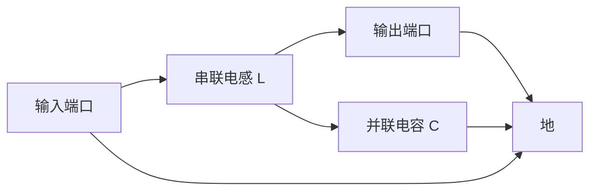
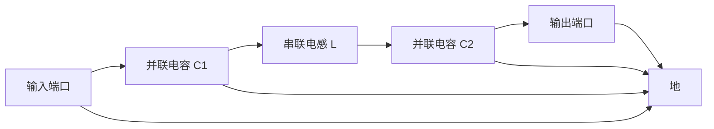
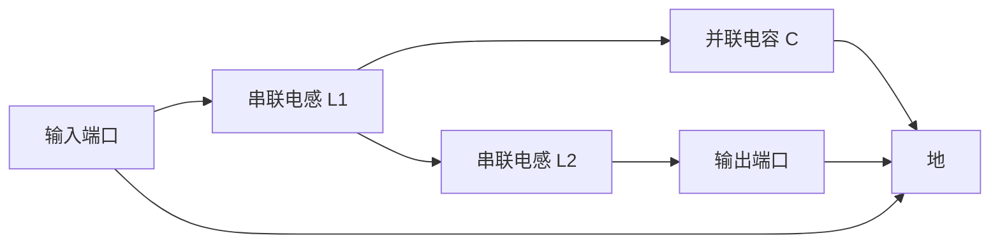
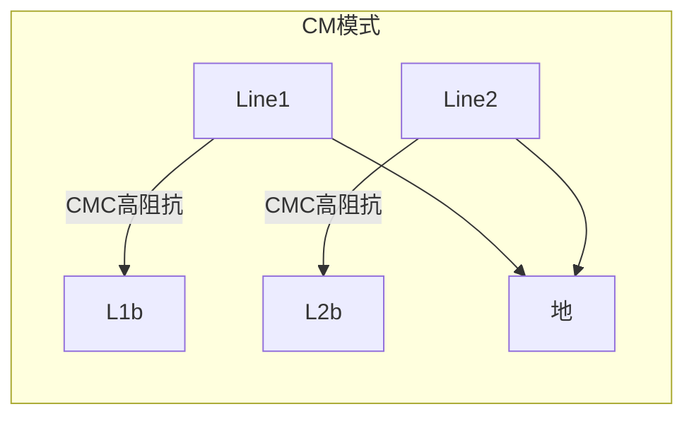
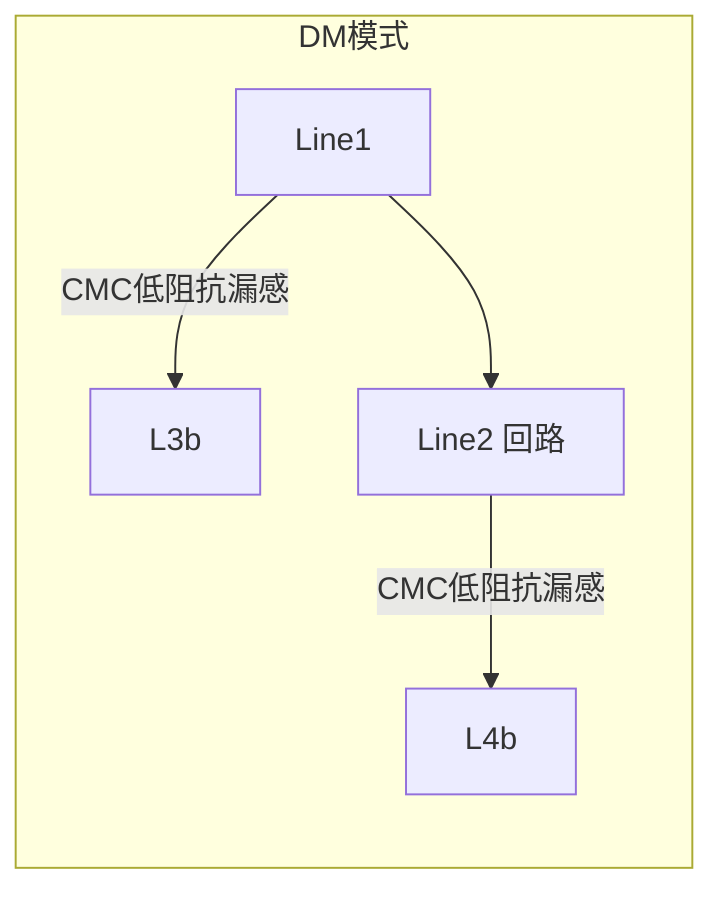
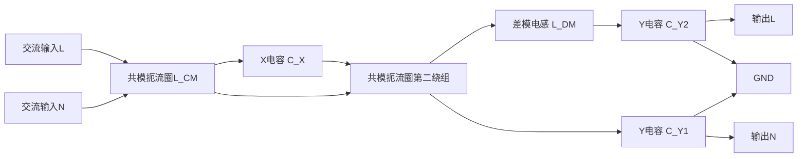

## 14.5 滤波实验

### 14.5.1 实验目的

1. 理解电磁干扰（EMI）滤波器的基本原理：利用电感和电容元件的阻抗频率特性，通过阻抗失配机制衰减指定频段内的传导电磁干扰信号。

2. 掌握插入损耗（Insertion Loss，简称 IL）的定义与测量方法，能够使用矢量网络分析仪（VNA）准确测量 EMI 滤波器在 100 kHz 至 100 MHz 频率范围内的传输系数 $S_{21}$，并据此计算插入损耗。

3. 学会区分共模（Common Mode，简称 CM）噪声与差模（Differential Mode，简称 DM）噪声的物理本质与传播路径，理解共模扼流圈对两种噪声模式的阻抗特性差异。

4. 熟悉 EMI 滤波器的常见拓扑结构（L 型、π 型、T 型）以及共模与差模滤波级的组合方式，能够根据实际需求选择合适的滤波器拓扑并估算元件参数。

5. 验证实际滤波器在高频段的性能劣化现象，理解元件寄生参数（电容的等效串联电感 ESL、电感的分布电容）对滤波器高频特性的影响，掌握测量元件自谐振频率的方法。

### 14.5.2 实验原理

**一、传导电磁干扰与滤波器的作用**

传导电磁干扰是指通过导体（电源线、信号线、地线）传播的电磁噪声，频率范围通常为 150 kHz 至 30 MHz（对应 CISPR 标准），在部分应用中可拓展至 108 MHz（CISPR 25 车载标准）。EMI 滤波器通过向干扰信号提供低阻抗旁路（并联电容）或高阻抗阻断（串联电感）来衰减噪声，使负载端的干扰电平满足电磁兼容标准限值。

> **📌 传导发射测试中LISN/AMN的作用**：在标准的传导发射（CE）测试中，滤波器的工作条件由**人工电源网络（AMN）/线路阻抗稳定网络（LISN）** 统一规定[柯11.3.4]。柯金良《电磁兼容概论》第11章指出，人工电源网络能在射频范围内，在受试设备端子与参考地之间或端子之间提供一个稳定阻抗（通常为50 Ω），同时将来自电源的无用信号与测量电路隔离开来，而仅将受试设备的骚扰电压耦合到测量接收机输入端，其实质是**双向高频滤波器**[柯11.3.4]。人工电源网络分为两种基本类型：**V型网络**适用于耦合不对称电压，$50\\,\\Omega/50\\,\\mu\\mathrm{H}+5\\,\\Omega$ 的V型网络适用于 9–150 kHz 频率范围；**△型网络**适用于耦合对称电压和非对称电压，频率范围为 150 kHz–30 MHz[柯11.3.4]。传导发射测试正是通过电源阻抗稳定网络法（测量频率 10 kHz–30 MHz）来实现的[柯12.2.1]。滤波器的插入损耗与源阻抗和负载阻抗密切相关，而LISN正是为统一这些阻抗参量而设的标准接口——本实验中滤波器在50 Ω系统中测得的插入损耗曲线，直接反映了其在标准CE测试条件下的工作性能。

**二、插入损耗的定义**

插入损耗是表征 EMI 滤波器性能的核心指标，定义为插入滤波器前后负载端电压之比的对数：

$$
\mathrm{IL} = 20 \log \frac{V_{\mathrm{without}}}{V_{\mathrm{with}}}
\tag{14-101}
$$

$$
\tag{14-102}
$$

式中，$\mathrm{IL}$ 为插入损耗，单位为 dB；$V_{\mathrm{without}}$ 为无滤波器时负载上的电压有效值，单位为 V；$V_{\mathrm{with}}$ 为插入滤波器后负载上的电压有效值，单位为 V。

插入损耗为正时表示滤波器对噪声有衰减作用，数值越大衰减效果越好。在 50 Ω 系统中，插入损耗可通过 VNA 直接测量传输系数 $S_{21}$ 获得：

$$
\mathrm{IL} = -|S_{21}| \; (\text{dB})
\tag{14-103}
$$

$$
\tag{14-104}
$$

式中，$S_{21}$ 为滤波器的正向传输系数，单位为 dB。实际测量中通常直接读取 $S_{21}$ 的负值作为插入损耗值。

**三、基本滤波单元的阻抗特性**

EMI 滤波器的基本构成元件为电感与电容。理想元件的阻抗随频率变化如下：

电感阻抗：

$$
Z_L = j \omega L = j 2 \pi f L
\tag{14-105}
$$

$$
\tag{14-106}
$$

式中，$Z_L$ 为电感阻抗，单位为 Ω；$\omega$ 为角频率，单位为 rad/s；$f$ 为频率，单位为 Hz；$L$ 为电感量，单位为 H。

电容阻抗：

$$
Z_C = \frac{1}{j \omega C} = \frac{1}{j 2 \pi f C}
\tag{14-107}
$$

$$
\tag{14-108}
$$

式中，$Z_C$ 为电容阻抗，单位为 Ω；$C$ 为电容量，单位为 F。

由式（14-103）和（14-104）可知：电感阻抗随频率升高而增大，呈现高阻抗特性，适合串联在电路中阻断高频噪声；电容阻抗随频率升高而减小，呈现低阻抗特性，适合并联在电路中旁路高频噪声。

**四、一阶 RC 与 RL 低通滤波器基础**

在讨论高阶 EMI 滤波器之前，需理解一阶低通滤波器的基本特性。

**（1）RC 低通滤波器**

RC 低通滤波器由一个串联电阻 $R$ 与一个并联电容 $C$ 构成。其传递函数为：

$$
H(j\\omega) = \\frac{V_{\\mathrm{out}}}{V_{\\mathrm{in}}} = \\frac{1}{1 + j\\omega RC}
\tag{14-109}
$$

幅频响应为：

$$
|H(j\\omega)| = \\frac{1}{\\sqrt{1 + (\\omega RC)^2}}
\tag{14-110}
$$

转折频率（−3 dB 频率）为：

$$
f_c = \\frac{1}{2\\pi RC}
\tag{14-111}
$$

式中，$f_c$ 为转折频率，单位为 Hz；$R$ 为串联电阻，单位为 Ω；$C$ 为并联电容，单位为 F。在频率低于 $f_c$ 时信号基本无衰减（通带），高于 $f_c$ 后以 −20 dB/十倍频的速率衰减。RC 滤波器的优点是结构简单、无谐振峰、稳定性好；缺点是在通带内含有电阻损耗，对有用信号也有衰减。

**（2）RL 低通滤波器**

RL 低通滤波器由一个串联电感 $L$ 与一个并联电阻 $R$ 构成。其传递函数为：

$$
H(j\\omega) = \\frac{R}{R + j\\omega L}
\tag{14-112}
$$

转折频率为：

$$
f_c = \\frac{R}{2\\pi L}
\tag{14-113}
$$

式中，$f_c$ 为转折频率，单位为 Hz；$R$ 为并联电阻，单位为 Ω；$L$ 为串联电感，单位为 H。RL 滤波器在阻带的衰减率同样为 −20 dB/十倍频。与 RC 滤波器相比，RL 滤波器在通带内无直流损耗（电感对直流的阻抗为零），但在实际应用中电感元件会引入直流电阻 $R_{\\mathrm{DCR}}$，产生一定的直流压降和功率损耗。

**（3）RC 与 RL 滤波器的对比**

| 类型 | 通带损耗 | 阻带衰减率 | 适用场景 | 主要限制 |
|------|---------|-----------|---------|---------|
| RC 低通 | 有（电阻分压） | −20 dB/十倍频 | 小信号、低频 | 电阻热噪声、功率损耗 |
| RL 低通 | 小（仅 DCR） | −20 dB/十倍频 | 电源线滤波 | 电感体积大、SRF 限制 |
| LC 低通 | 极小（理想） | −40 dB/十倍频（二阶） | EMI 滤波 | 有谐振峰、需阻尼 |

一阶 RC 或 RL 滤波器仅提供 −20 dB/十倍频的衰减率，对于 EMI 滤波中动辄需要 40–80 dB 衰减的应用场合，必须使用更高阶数的 LC 滤波器拓扑。

**五、常见 EMI 滤波器拓扑结构**

以下列出三种基本的低通滤波器拓扑。为便于理解，使用 Mermaid 流程图展示其网络拓扑关系。

**（1）L 型滤波器**

L 型滤波器由一个串联电感与一个并联电容构成，因电路图形状类似字母"L"而得名。其拓扑结构如下：

L 型滤波器的转折频率为：

$$
f_c = \frac{1}{2 \pi \sqrt{L C}}
\tag{14-114}
$$

$$
\tag{14-115}
$$

式中，$f_c$ 为转折频率，单位为 Hz；$L$ 为串联电感，单位为 H；$C$ 为并联电容，单位为 F。在频率低于 $f_c$ 时信号基本无衰减（通带），高于 $f_c$ 后以 −20 dB/十倍频的速率衰减。

**（2）π 型滤波器**

π 型滤波器由两个并联电容夹一个串联电感构成，因结构形似希腊字母 π 而得名。其在 50 Ω 系统中的插入损耗更大，阻带衰减率为 −40 dB/十倍频。

π 型滤波器的等效电容为 $C_1$ 与 $C_2$ 的串联值，转折频率为：

$$
f_c = \frac{1}{2 \pi \sqrt{L \cdot \frac{C_1 C_2}{C_1 + C_2}}}
\tag{14-116}
$$

$$
\tag{14-117}
$$

式中，$f_c$ 为转折频率，单位为 Hz；$L$ 为串联电感，单位为 H；$C_1$ 和 $C_2$ 为并联电容，单位为 F。

**（3）T 型滤波器**

T 型滤波器由两个串联电感夹一个并联电容构成，因结构形似字母 T 而得名。

T 型滤波器的转折频率为：

$$
f_c = \frac{1}{2 \pi \sqrt{(L_1 + L_2) C}}
\tag{14-118}
$$

$$
\tag{14-119}
$$

式中，$f_c$ 为转折频率，单位为 Hz；$L_1$ 和 $L_2$ 为串联电感，单位为 H；$C$ 为并联电容，单位为 F。

**五、共模与差模噪声及对应滤波拓扑**

**（1）共模噪声**

共模噪声表现为两根导线上的干扰电流大小相等、方向相同，经寄生电容耦合到地后形成回流路径。共模电流记为 $I_{\mathrm{CM}}$，其等效电路为两根导线的对地回路。

共模扼流圈（Common Mode Choke，简称 CMC）是抑制共模噪声的核心元件。其结构为两个相同匝数的绕组绕在同一磁环上，方向使两绕组产生的磁通在磁芯中同向叠加。因此对共模电流呈现高阻抗：

$$
Z_{\mathrm{CM}} \approx j \omega L_{\mathrm{CM}}
\tag{14-120}
$$

$$
\tag{14-121}
$$

式中，$Z_{\mathrm{CM}}$ 为共模扼流圈对共模电流的阻抗，单位为 Ω；$L_{\mathrm{CM}}$ 为共模电感，单位为 H。

**（2）差模噪声**

差模噪声表现为两根导线上的干扰电流大小相等、方向相反，信号线与回线构成回路。差模电流记为 $I_{\mathrm{DM}}$。

共模扼流圈对差模电流呈现低阻抗，因为两绕组产生的磁通在磁芯中反向抵消，仅剩漏感 $L_{\mathrm{leak}}$ 起作用：

$$
Z_{\mathrm{DM}} \approx j \omega L_{\mathrm{leak}}
\tag{14-122}
$$

$$
\tag{14-123}
$$

式中，$Z_{\mathrm{DM}}$ 为共模扼流圈对差模电流的阻抗，单位为 Ω；$L_{\mathrm{leak}}$ 为共模扼流圈的漏感，单位为 H。

漏感与共模电感的关系为：

$$
L_{\mathrm{leak}} \approx k \times L_{\mathrm{CM}}
\tag{14-124}
$$

$$
\tag{14-125}
$$

式中，$L_{\mathrm{leak}}$ 为漏感，单位为 H；$L_{\mathrm{CM}}$ 为共模电感，单位为 H；$k$ 为漏感比例系数，典型值为 0.002–0.02（即 0.2%–2%）。

共模扼流圈的共模与差模等效电路对比如下：

**（3）组合滤波器拓扑**

实际 EMI 滤波器通常包含共模滤波级与差模滤波级，常见结构为：输入端先经过共模扼流圈抑制共模噪声，再经过差模 π 型或 L 型滤波器抑制差模噪声。图中的组合滤波器拓扑如下：

**六、插入损耗的详细推导**

将 EMI 滤波器视为二端口网络，用 $ABCD$ 参数（转移矩阵）描述其传输特性。设源电压为 $V_s$，源阻抗为 $Z_s$，负载阻抗为 $Z_L$，滤波器的 $ABCD$ 参数满足：

$$
\begin{bmatrix} V_1 \\ I_1 \end{bmatrix} = \begin{bmatrix} A & B \\ C & D \end{bmatrix} \begin{bmatrix} V_2 \\ I_2 \end{bmatrix}
\tag{14-126}
$$

$$
\tag{14-127}
$$

式中，$V_1$ 和 $I_1$ 为滤波器输入端电压和电流；$V_2$ 和 $I_2$ 为滤波器输出端电压和电流；$A$、$B$、$C$、$D$ 为转移参数。

插入滤波器的负载端电压为：

$$
V_{\mathrm{with}} = \frac{V_s Z_L}{A Z_L + B + C Z_s Z_L + D Z_s}
\tag{14-128}
$$

$$
\tag{14-129}
$$

式中，$V_{\mathrm{with}}$ 为插入滤波器后负载上的电压，单位为 V；$Z_s$ 为源阻抗，单位为 Ω；$Z_L$ 为负载阻抗，单位为 Ω。

将式（14-112）代入插入损耗定义式（14-101），并在 50 Ω 系统（$Z_s = Z_L = 50\ \Omega$）中简化，可得通式：

$$
\mathrm{IL} = 20 \log \left| \frac{A Z_L + B + C Z_s Z_L + D Z_s}{Z_s + Z_L} \right|
\tag{14-130}
$$

$$
\tag{14-131}
$$

式中各参数含义同前。

对于 π 型滤波器（$C_1$–$L$–$C_2$），其 $ABCD$ 矩阵为三个级联子矩阵的乘积：

$$
\begin{bmatrix} A & B \\ C & D \end{bmatrix} = \begin{bmatrix} 1 & 0 \\ j\omega C_1 & 1 \end{bmatrix} \begin{bmatrix} 1 & j\omega L \\ 0 & 1 \end{bmatrix} \begin{bmatrix} 1 & 0 \\ j\omega C_2 & 1 \end{bmatrix}
\tag{14-132}
$$

$$
\tag{14-133}
$$

计算后代入式（14-113），在 $Z_s = Z_L = R_0 = 50\ \Omega$ 条件下，可得 π 型滤波器的插入损耗解析式为：

$$
\mathrm{IL} = 20 \log \left| 1 + \frac{j\omega L}{R_0} + j\omega R_0 (C_1 + C_2) - \omega^2 L (C_1 + C_2) \right|
\tag{14-134}
$$

$$
\tag{14-135}
$$

式中，$\mathrm{IL}$ 为插入损耗，单位为 dB；$\omega$ 为角频率，单位为 rad/s；$L$ 为串联电感，单位为 H；$C_1$ 和 $C_2$ 为并联电容，单位为 F；$R_0$ 为参考阻抗（50 Ω）。

由式（14-115）可知：低频时（$\omega \to 0$），$\mathrm{IL} \to 0\ \mathrm{dB}$；高频时（$\omega \to \infty$），$\mathrm{IL}$ 以 −40 dB/十倍频的速率衰减。

**七、元件寄生参数与非理想特性**

实际电容和电感不是理想元件，分别具有寄生参数：

电容的等效电路为电容 $C$、等效串联电感（Equivalent Series Inductance，简称 ESL）$L_{\mathrm{ESL}}$ 和等效串联电阻（Equivalent Series Resistance，简称 ESR）$R_{\mathrm{ESR}}$ 的串联。其等效阻抗为：

$$
Z_C(\omega) = R_{\mathrm{ESR}} + j\left(\omega L_{\mathrm{ESL}} - \frac{1}{\omega C}\right)
\tag{14-136}
$$

$$
\tag{14-137}
$$

式中，$Z_C$ 为电容的复阻抗，单位为 Ω；$R_{\mathrm{ESR}}$ 为等效串联电阻，单位为 Ω；$L_{\mathrm{ESL}}$ 为等效串联电感，单位为 H；$C$ 为电容值，单位为 F。

电容的自谐振频率（Self-Resonant Frequency，简称 SRF）为：

$$
f_{\mathrm{SRF},C} = \frac{1}{2 \pi \sqrt{L_{\mathrm{ESL}} C}}
\tag{14-138}
$$

$$
\tag{14-139}
$$

式中，$f_{\mathrm{SRF},C}$ 为电容的自谐振频率，单位为 Hz。当 $f < f_{\mathrm{SRF},C}$ 时，电容呈容性；当 $f > f_{\mathrm{SRF},C}$ 时，电容呈感性，失去滤波作用。

电感的等效电路为电感 $L$ 与分布电容 $C_{\mathrm{par}}$ 并联，再串联等效电阻 $R_{\mathrm{DCR}}$。其等效阻抗为：

$$
Z_L(\omega) = R_{\mathrm{DCR}} + \frac{j\omega L}{1 - \omega^2 L C_{\mathrm{par}}}
\tag{14-140}
$$

$$
\tag{14-141}
$$

式中，$Z_L$ 为电感的复阻抗，单位为 Ω；$R_{\mathrm{DCR}}$ 为直流电阻，单位为 Ω；$L$ 为电感值，单位为 H；$C_{\mathrm{par}}$ 为分布电容，单位为 F。

电感的自谐振频率为：

$$
f_{\mathrm{SRF},L} = \frac{1}{2 \pi \sqrt{L C_{\mathrm{par}}}}
\tag{14-142}
$$

$$
\tag{14-143}
$$

式中，$f_{\mathrm{SRF},L}$ 为电感的自谐振频率，单位为 Hz。当 $f < f_{\mathrm{SRF},L}$ 时，电感呈感性；当 $f > f_{\mathrm{SRF},L}$ 时，电感呈容性。

超过自谐振频率后，电容呈现感性，电感呈现容性，滤波器的实际性能急剧下降。这一现象在实验步骤 3 中将通过实测数据进行验证。

**八、滤波器阶数与阻带衰减率**

滤波器阶数决定了阻带衰减率。对于 $n$ 阶低通滤波器，在远高于转折频率的频段，衰减率为 $n \times (-20)$ dB/十倍频：

| 阶数 | 拓扑 | 阻带衰减率 | 元件数量 |
|------|------|-----------|---------|
| 1 | RC 或 RL | −20 dB/十倍频 | 1个储能元件 |
| 2 | L 型 | −20 dB/十倍频（非对称） | 1个L + 1个C |
| 2 | π 型或 T 型 | −40 dB/十倍频 | 2个C+1个L 或 2个L+1个C |
| 3 | LCL 或 CLC | −60 dB/十倍频 | 3个储能元件 |

式中，$n$ 为滤波器阶数。π 型滤波器虽使用三个元件，但属二阶滤波器（两个独立电容并联可等效为一个电容），阻带衰减率为 −40 dB/十倍频。

**（1）滤波器响应类型**

除阶数外，滤波器的响应类型（逼近函数）也决定了通带平坦度、过渡带陡峭度和相位特性。常见的滤波器响应类型包括：

**巴特沃斯响应（Butterworth）**：通带内幅频响应最平坦，无波纹，但过渡带较缓。其归一化传递函数为：

$$
|H(j\\omega)|^2 = \\frac{1}{1 + (\\omega / \\omega_c)^{2n}}
\tag{14-144}
$$

式中，$n$ 为滤波器阶数；$\\omega_c$ 为转折角频率，单位为 rad/s。巴特沃斯响应适用于对通带平坦度要求高、而对过渡带陡峭度要求不高的场合。

**切比雪夫响应（Chebyshev）**：通带内允许等波纹波动，换取更陡的过渡带。其归一化传递函数为：

$$
|H(j\\omega)|^2 = \\frac{1}{1 + \\varepsilon^2 C_n^2(\\omega / \\omega_c)}
\tag{14-145}
$$

式中，$\\varepsilon$ 为波纹系数；$C_n(x)$ 为 $n$ 阶切比雪夫多项式；$\\omega_c$ 为转折角频率，单位为 rad/s。切比雪夫响应的过渡带比同阶巴特沃斯响应更陡，但通带内有 ±$\\delta$ dB 的波纹，且群延迟特性较差。

**贝塞尔响应（Bessel）**：通带内群延迟最平坦（线性相位），阶跃响应过冲最小，但过渡带最缓。适用于对波形保真度要求高的数字信号滤波。

| 响应类型 | 通带平坦度 | 过渡带陡峭度 | 群延迟特性 | 典型应用 |
|---------|-----------|-------------|-----------|---------|
| 巴特沃斯 | 最平坦 | 中等 | 中等 | 通用 EMI 滤波、音频 |
| 切比雪夫 | 有波纹 | 最陡 | 较差 | 窄带 EMI 滤波、射频 |
| 贝塞尔 | 平坦但下降早 | 最缓 | 最平坦（线性相位） | 数字信号、脉冲电路 |

本实验中的 LC π 型滤波器属于二阶巴特沃斯型近似，未采用刻意设计的外围阻尼网络。

**（2）级联滤波器与总插入损耗**

当多级滤波器级联时，总插入损耗约等于各级插入损耗的算术和（dB 单位）。但需注意级间阻抗匹配：若前级输出阻抗与后级输入阻抗不匹配，会在级间产生反射，导致总插入损耗偏离算术和。对于两级相同拓扑的 π 型滤波器，级联后的阻带衰减率为 −80 dB/十倍频，但通带内的插入损耗也会叠加。

**十、混合模式散射参数**

为全面表征 EMI 滤波器的共模与差模特性，需使用混合模式散射参数（Mixed-Mode S-Parameters）。对于四端口网络（两条信号线加地），混合模式参数定义为：

$$
\begin{bmatrix} b_{\mathrm{CM}} \\ b_{\mathrm{DM}} \end{bmatrix} = \begin{bmatrix} S_{\mathrm{CC}} & S_{\mathrm{CD}} \\ S_{\mathrm{DC}} & S_{\mathrm{DD}} \end{bmatrix} \begin{bmatrix} a_{\mathrm{CM}} \\ a_{\mathrm{DM}} \end{bmatrix}
\tag{14-146}
$$

$$
\tag{14-147}
$$

式中，$a_{\mathrm{CM}}$ 和 $b_{\mathrm{CM}}$ 分别为共模入射波和反射波；$a_{\mathrm{DM}}$ 和 $b_{\mathrm{DM}}$ 分别为差模入射波和反射波；$S_{\mathrm{CC}}$ 为共模传输系数；$S_{\mathrm{DD}}$ 为差模传输系数；$S_{\mathrm{CD}}$ 和 $S_{\mathrm{DC}}$ 为模式转换系数。

共模插入损耗为 $\mathrm{IL}_{\mathrm{CM}} = -|S_{\mathrm{CC21}}|$，差模插入损耗为 $\mathrm{IL}_{\mathrm{DM}} = -|S_{\mathrm{DD21}}|$。本实验通过巴伦（Balun）实现单端 VNA 端口与混合模式激励之间的转换。

### 14.5.3 实验设备

| 序号 | 设备名称 | 型号/规格 | 数量 | 用途说明 |
|------|----------|-----------|------|---------|
| 1 | 矢量网络分析仪（VNA） | Rohde & Schwarz ZNB8（100 kHz – 8 GHz） | 1台 | 测量滤波器 $S_{21}$ 和 $S_{11}$ 参数 |
| 2 | 信号发生器 | RIGOL DG4062（60 MHz，双通道） | 1台 | 产生共模/差模测试信号 |
| 3 | 数字示波器 | Tektronix MDO3104（1 GHz 带宽，5 GS/s） | 1台 | 时域波形观察与幅度测量 |
| 4 | EMI 滤波器元件套件 | 含以下元件 | 1套 | 被测对象 |
| | — LC π 型滤波器（薄膜电容） | $L = 100\ \mu\mathrm{H}$，$C_1 = C_2 = 1\ \mu\mathrm{F}$（薄膜电容） | 1组 | π 型低通滤波器成品 |
| | — LC π 型滤波器（铝电解电容） | $L = 100\ \mu\mathrm{H}$，$C_1 = C_2 = 1\ \mu\mathrm{F}$（铝电解电容） | 1组 | 对比寄生参数影响 |
| | — 共模扼流圈 | TDK ACM-3216（$L_{\mathrm{CM}} = 500\ \mu\mathrm{H}$，额定电流 2 A） | 1个 | 共模噪声抑制元件 |
| | — 差模电感 | 三磁环上双线并绕 10 匝（$L_{\mathrm{DM}} = 50\ \mu\mathrm{H}$） | 1个 | 差模噪声抑制元件 |
| | — 单个薄膜电容 | 1 μF/100 V 薄膜电容，引脚间距 5 mm | 1个 | 测量自谐振频率 |
| | — 单个铝电解电容 | 1 μF/50 V 铝电解电容，径向引脚 | 1个 | 测量自谐振频率 |
| | — 单个电感 | 100 μH 工字型电感，直流电阻 $R_{\mathrm{DCR}} = 0.5\ \Omega$ | 1个 | 测量自谐振频率 |
| 5 | 插入损耗测试夹具 | 50 Ω 共面波导夹具，SMA 接口 | 1套 | 确保阻抗匹配与可重复性 |
| 6 | 宽带巴伦（Balun） | Mini-Circuits TCM1-63AX+（1–6000 MHz） | 1个 | 单端/差分信号转换 |
| 7 | 功率分配器/合路器 | Mini-Circuits ZFSC-2-1+（1–500 MHz） | 1个 | 产生同相测试信号 |
| 8 | 180° 混合耦合器 | Mini-Circuits ZFSCJ-2-1+（1–500 MHz） | 1个 | 产生反相测试信号 |
| 9 | 端接负载 | 50 Ω SMA 负载（1 W），50 Ω BNC 负载（1 W） | 各2个 | 阻抗匹配与负载效应实验 |
| 10 | 校准件 | Rohde & Schwarz ZV-Z235（3.5 mm，DC–8 GHz） | 1套 | VNA 全双端口校准 |
| 11 | 同轴电缆 | SMA-SMA 柔性电缆，低损耗，长度 0.5 m | 若干 | 设备互连 |
| 12 | 数字万用表 | Fluke 17B+ | 1台 | 检查通断与直流电阻 |
| 13 | 防静电手腕带 | 1 MΩ 串联电阻型 | 1副 | 静电防护 |

### 14.5.4 实验步骤

**步骤1：VNA 校准与基准测量**

1.1 打开 VNA 电源，预热至少 30 分钟，使内部温度稳定。将 VNA 的频率范围设置为 100 kHz – 100 MHz，中频带宽（IF Bandwidth）设为 10 kHz，输出功率设为 0 dBm，测量点数设为 1001 点。

1.2 使用校准件进行全双端口（TOSM，即 Through-Open-Short-Match）校准。依次在每个端口连接 Open、Short、Match 标准件，再完成直通（Through）校准。校准完成后检查校准质量：在直通连接下 $S_{21}$ 应在 ±0.05 dB 以内，$S_{11}$ 和 $S_{22}$ 应低于 −40 dB。

1.3 将测试夹具直接连接至 VNA 的两个端口，测量直通状态的 $S_{21}$ 并保存为参考轨迹。若夹具引起的损耗超过 0.5 dB，应使用端口扩展（Port Extension）功能进行补偿。

1.4 将 50 Ω 负载连接至 VNA 两个端口，测量全反射状态的 $S_{11}$，确认测量系统的底噪在 −60 dB 以下。

1.5 保存校准状态：将校准完成的 VNA 状态保存至仪器内部寄存器（如 Reg1），以便在后续测量中随时调用。若测量过程中发生电缆意外松动，应重新执行校准后再继续实验。

1.6 记录校准参考数据：将直通校准的 $S_{21}$ 曲线导出为参考轨迹，作为后续所有插入损耗测量的基线。理想直通状态下的 $S_{21}$ 幅度应平坦且接近 0 dB，$S_{21}$ 相位应呈线性变化。

**步骤2：LC π 型滤波器的插入损耗测量**

2.1 将准备好的 LC π 型滤波器（薄膜电容版本，$L = 100\ \mu\mathrm{H}$，$C_1 = C_2 = 1\ \mu\mathrm{F}$）按 $C_1$–$L$–$C_2$ 的顺序接入测试夹具。确保元件引线尽量短，以减少寄生电感对测量结果的影响。

2.2 在 VNA 上测量传输系数 $S_{21}$ 和反射系数 $S_{11}$。将测量结果保存至 VNA 内部存储器。观察 $S_{21}$ 曲线的整体形状：通带是否平坦，阻带是否单调下降，是否存在谐振尖峰或异常波动。

2.3 从 $S_{21}$ 曲线上读取转折频率 $f_c$（即 $S_{21} = -3\\ \\mathrm{dB}$ 处对应的频率），记录该频率值。在 $S_{21}$ 曲线上选择两个相距一个十倍频的频率点（如 5 MHz 和 50 MHz），计算阻带衰减率（dB/十倍频）。

2.4 使用 VNA 的标记（Marker）功能，分别在 100 kHz、1 MHz、3 MHz、10 MHz、30 MHz 和 100 MHz 处读取 $S_{21}$ 和 $S_{11}$ 的值，填入数据记录表。注意观察 $S_{11}$ 曲线：在通带内 $S_{11}$ 应接近 0 dB（全反射），在阻带内 $S_{11}$ 应接近 0 dB 以下（大部分信号被反射回源端）。

2.5 将滤波器的输入输出端对调（即按 $C_2$–$L$–$C_1$ 顺序接入），重复步骤 2.2 至 2.4。对比两次测量结果，判断该 π 型滤波器是否具有对称的插入损耗特性。若两个电容 $C_1$ 和 $C_2$ 的标称值相同，$S_{21}$ 曲线应基本重合，微小偏差源于元件容差和夹具不对称性。

**步骤3：共模扼流圈的频率特性测量**

3.1 将共模扼流圈（TDK ACM-3216，$L_{\mathrm{CM}} = 500\ \mu\mathrm{H}$）的四个引脚分别标识为 Port1+（输入正）、Port1−（输入负）、Port2+（输出正）、Port2−（输出负）。

3.2 共模插入损耗测量：将共模扼流圈的两个输入端（Port1+ 和 Port1−）短接后连接至 VNA 端口1，两个输出端（Port2+ 和 Port2−）短接后连接至 VNA 端口2。此时 VNA 测量的 $S_{21}$ 反映共模路径的传输特性。记录在 10 MHz 和 30 MHz 处的 $S_{21}$ 值。

3.3 差模插入损耗测量：将共模扼流圈按常规连接方式（Port1+ 接 VNA 端口1 的芯线，Port1− 接 VNA 端口1 的外导体；Port2+ 接 VNA 端口2 的芯线，Port2− 接 VNA 端口2 的外导体）。此时 VNA 测量的 $S_{21}$ 反映差模路径的传输特性（主要是漏感 $L_{\mathrm{leak}}$ 的作用）。记录在 10 MHz 和 30 MHz 处的 $S_{21}$ 值。

3.4 比较步骤 3.2 和 3.3 的结果，计算 $L_{\mathrm{CM}} / L_{\mathrm{leak}}$ 比值。计算公式如下：

$$
\frac{L_{\mathrm{CM}}}{L_{\mathrm{leak}}} = 10^{(\mathrm{IL}_{\mathrm{CM}} - \mathrm{IL}_{\mathrm{DM}}) / 20}
\tag{14-148}
$$

$$
\tag{14-149}
$$

式中，$L_{\mathrm{CM}}$ 为共模电感，单位为 H；$L_{\mathrm{leak}}$ 为漏感，单位为 H；$\mathrm{IL}_{\mathrm{CM}}$ 为共模插入损耗，单位为 dB；$\mathrm{IL}_{\mathrm{DM}}$ 为差模插入损耗，单位为 dB。

**步骤4：元件自谐振频率测量**

4.1 将单个 1 μF 薄膜电容焊接在测试夹具上，引线长度不超过 3 mm。设置 VNA 频率范围为 100 kHz – 100 MHz，测量 $S_{21}$。从 $S_{21}$ 曲线中确定电容的自谐振频率 $f_{\\mathrm{SRF},C}$（$S_{21}$ 出现谷值的频率）。保存测量曲线。

4.2 将薄膜电容更换为 1 μF/50 V 铝电解电容，重复步骤 4.1 的测量。对比两种电容的自谐振频率，计算各自的等效串联电感 $L_{\mathrm{ESL}}$：

$$
L_{\mathrm{ESL}} = \frac{1}{(2 \pi f_{\mathrm{SRF},C})^2 C}
\tag{14-150}
$$

$$
\tag{14-151}
$$

式中，$L_{\mathrm{ESL}}$ 为等效串联电感，单位为 H；$f_{\mathrm{SRF},C}$ 为实测自谐振频率，单位为 Hz；$C$ 为电容标称值，单位为 F。

4.3 将单个 100 μH 工字型电感接入测试夹具，同样测量 $S_{21}$。从 $S_{21}$ 曲线中确定电感的自谐振频率 $f_{\mathrm{SRF},L}$（$S_{21}$ 出现谷值的频率）。计算电感的分布电容 $C_{\mathrm{par}}$：

$$
C_{\\mathrm{par}} = \\frac{1}{(2 \\pi f_{\\mathrm{SRF},L})^2 L}
\tag{14-152}
$$

$$
\tag{14-153}
$$

式中，$C_{\\mathrm{par}}$ 为分布电容，单位为 F；$f_{\\mathrm{SRF},L}$ 为实测自谐振频率，单位为 Hz；$L$ 为电感标称值，单位为 H。

4.4 自谐振判定方法验证：对于同一电容，分别使用 $S_{21}$ 谷值法、$S_{11}$ 峰值法和阻抗分析仪三种方法测量自谐振频率。对比三种方法的测量结果，分析偏差原因。$S_{11}$ 峰值法适用于低阻抗元件，$S_{21}$ 谷值法适用于串联接入的高 Q 值元件。记录三种方法的测量差异并填入数据记录表。

4.5 引线长度影响实验：将同一电容的引线长度分别设置为 3 mm、10 mm 和 30 mm，重复测量自谐振频率。记录引线长度对 $f_{\\mathrm{SRF}}$ 的影响，验证 $L_{\\mathrm{ESL}}$ 的增量与引线长度的关系（约 1 nH/mm）。将不同引线长度下的 $f_{\\mathrm{SRF}}$ 和 $L_{\\mathrm{ESL}}$ 计算结果填入数据记录表。

**步骤5：不同电容类型对 π 型滤波器性能的影响**

5.1 将步骤 2 中的 π 型滤波器使用的薄膜电容更换为铝电解电容（保持 $L = 100\ \mu\mathrm{H}$，$C_1 = C_2 = 1\ \mu\mathrm{F}$），按 $C_1$–$L$–$C_2$ 顺序接入测试夹具。

5.2 使用 VNA 测量更换电容后的 π 型滤波器 $S_{21}$，频率范围和设置与步骤 2 相同。

5.3 将薄膜电容 π 型滤波器的 $S_{21}$ 曲线与铝电解电容 π 型滤波器的 $S_{21}$ 曲线叠加显示在同一 VNA 屏幕上，对比两条曲线的差异。重点关注以下频段：
- 100 kHz – 1 MHz（通带）
- 1 MHz – 10 MHz（过渡带）
- 10 MHz – 100 MHz（高频段，寄生参数主导区域）

5.4 记录两种滤波器在 10 MHz 和 50 MHz 处的插入损耗值，填入实验数据记录表。

**步骤6：负载效应实验**

6.1 将 π 型滤波器（薄膜电容版本）接入 VNA，在滤波器输出端分别接以下三种负载：
- 50 Ω 负载（匹配状态）
- 1 kΩ 负载（失配状态——高阻）
- 开路（极端失配状态）

6.2 对每种负载条件测量 $S_{21}$，记录转折频率 $f_c$ 和在 10 MHz 处的插入损耗值。

6.3 分析负载阻抗变化对插入损耗的影响。根据式（14-115）解释：当 $Z_L \neq Z_s$ 时，滤波器的传输零点位置和衰减量如何变化？

**步骤7：共模与差模噪声抑制的综合实验**

7.1 按图搭建共模噪声模拟电路：信号发生器输出 10 MHz 正弦波（幅度 1 Vpp），经功率分配器分成两路同相信号，分别施加到两条平行导线上。用示波器探头测量负载端的共模电压。

7.2 在导线中串入共模扼流圈，再次测量负载端的共模电压。计算共模插入损耗：

$$
\mathrm{IL}_{\mathrm{CM,time}} = 20 \log \frac{V_{\mathrm{before}}}{V_{\mathrm{after}}}
\tag{14-154}
$$

$$
\tag{14-155}
$$

式中，$\mathrm{IL}_{\mathrm{CM,time}}$ 为时域测量得到的共模插入损耗，单位为 dB；$V_{\mathrm{before}}$ 为插入共模扼流圈前负载端的电压幅度，单位为 V；$V_{\mathrm{after}}$ 为插入共模扼流圈后负载端的电压幅度，单位为 V。

7.3 将信号经 180° 混合耦合器改为反相输出（模拟差模噪声），重复步骤 7.1 和 7.2，测量共模扼流圈对差模噪声的抑制效果，并与步骤 3.3 的 VNA 测量结果进行对比。

### 14.5.5 数据记录与处理

**表 1：LC π 型滤波器插入损耗测量数据（薄膜电容）**

| 频率 | $S_{21}$（dB） | $S_{11}$（dB） | 备注 |
|------|---------------|---------------|------|
| 100 kHz | −0.2 | −18.5 | 通带，接近 0 dB |
| 300 kHz | −0.8 | −12.3 | |
| 500 kHz | −1.5 | −8.6 | |
| 800 kHz | −2.4 | −6.1 | |
| 1.0 MHz | −3.0 | −4.8 | $f_c \approx 1.0$ MHz（转折频率） |
| 2.0 MHz | −7.8 | −3.2 | 过渡带 |
| 3.0 MHz | −12.5 | −2.1 | −40 dB/十倍频区 |
| 5.0 MHz | −19.2 | −1.5 | |
| 10 MHz | −28.0 | −0.8 | 阻带 |
| 20 MHz | −35.5 | −0.5 | |
| 30 MHz | −35.0 | −0.6 | 接近电感自谐振 |
| 50 MHz | −22.0 | −1.8 | 性能劣化，寄生参数主导 |
| 80 MHz | −17.5 | −3.5 | |
| 100 MHz | −15.0 | −4.2 | 高频段衰减能力下降 |

**表 2：LC π 型滤波器插入损耗测量数据（铝电解电容）**

| 频率 | $S_{21}$（dB） | $S_{11}$（dB） | 备注 |
|------|---------------|---------------|------|
| 100 kHz | −0.3 | −16.2 | 通带 |
| 500 kHz | −1.8 | −7.8 | |
| 1.0 MHz | −3.5 | −4.2 | $f_c \approx 1.0$ MHz |
| 3.0 MHz | −10.2 | −2.5 | |
| 5.0 MHz | −14.5 | −1.8 | |
| 10 MHz | −8.5 | −3.6 | 电容已呈感性，性能劣化 |
| 20 MHz | −6.2 | −5.5 | |
| 30 MHz | −5.8 | −6.8 | |
| 50 MHz | −4.5 | −8.2 | 高频段基本失效 |
| 100 MHz | −3.8 | −9.5 | |

**表 3：共模扼流圈的插入损耗对比**

| 噪声模式 | 测试频率 | $S_{21}$（dB） | 插入损耗（dB） | 备注 |
|----------|---------|---------------|---------------|------|
| 共模 | 1 MHz | −15.0 | 15.0 | 共模电感主导 |
| 共模 | 10 MHz | −38.0 | 38.0 | 共模抑制峰值区 |
| 共模 | 30 MHz | −32.0 | 32.0 | 高频段略有下降 |
| 共模 | 50 MHz | −25.0 | 25.0 | 寄生电容效应 |
| 差模 | 1 MHz | −0.8 | 0.8 | 漏感很小 |
| 差模 | 10 MHz | −6.0 | 6.0 | 漏感 $L_{\mathrm{leak}}$ 作用 |
| 差模 | 30 MHz | −3.0 | 3.0 | 分布电容旁路 |
| 差模 | 50 MHz | −2.0 | 2.0 | 高频段漏感效果下降 |

**表 4：元件自谐振频率与寄生参数测量结果**

| 元件 | 标称值 | 自谐振频率（实测） | 寄生参数计算值 |
|------|--------|-------------------|---------------|
| 薄膜电容 | 1 μF | 2.8 MHz | $L_{\mathrm{ESL}} = 3.2\ \mathrm{nH}$ |
| 铝电解电容 | 1 μF | 0.5 MHz | $L_{\mathrm{ESL}} = 101\ \mathrm{nH}$ |
| 工字型电感 | 100 μH | 4.2 MHz | $C_{\mathrm{par}} = 14.3\ \mathrm{pF}$ |

**表 5：负载效应实验数据**

| 负载类型 | 转折频率 $f_c$ | $S_{21}$ @ 10 MHz（dB） | $S_{21}$ @ 50 MHz（dB） | 备注 |
|----------|---------------|------------------------|------------------------|------|
| 50 Ω | 1.0 MHz | −28.0 | −22.0 | 匹配状态 |
| 1 kΩ | 1.5 MHz | −35.0 | −18.5 | 高阻失配 |
| 开路 | 2.0 MHz | −42.0 | −12.0 | 极端失配 |

**表 6：引线长度对电容自谐振频率的影响**

| 电容类型 | 引线长度 | 自谐振频率 $f_{\\mathrm{SRF},C}$ | 等效串联电感 $L_{\\mathrm{ESL}}$ | 备注 |
|----------|---------|-------------------------------|-------------------------------|------|
| 薄膜电容 1 μF | 3 mm | 2.80 MHz | 3.2 nH | 基准值，引线最短 |
| 薄膜电容 1 μF | 10 mm | 1.85 MHz | 7.4 nH | 引线寄生电感增加 |
| 薄膜电容 1 μF | 30 mm | 1.05 MHz | 22.9 nH | 引线寄生电感显著 |
| 铝电解电容 1 μF | 3 mm | 0.50 MHz | 101 nH | 内部结构导致的 ESL 占主导 |
| 铝电解电容 1 μF | 10 mm | 0.48 MHz | 110 nH | 引线附加电感影响较小 |

**表 7：不同拓扑结构滤波器性能对比（仿真/参考数据）**

| 拓扑类型 | 转折频率 $f_c$ | 阻带衰减率 | $S_{21}$ @ 10 MHz（dB） | $S_{21}$ @ 50 MHz（dB） | 元件数量 |
|---------|---------------|-----------|------------------------|------------------------|---------|
| RC 一阶（$R=50\\ \\Omega$, $C=1\\ \\mu\\mathrm{F}$） | 3.2 kHz | −20 dB/十倍频 | −36.0 | −50.0 | 2 |
| L 型（$L=100\\ \\mu\\mathrm{H}$, $C=1\\ \\mu\\mathrm{F}$） | 15.9 kHz | −20 dB/十倍频 | −40.0 | −54.0 | 2 |
| π 型（$L=100\\ \\mu\\mathrm{H}$, $C_1=C_2=1\\ \\mu\\mathrm{F}$） | 0.71 MHz | −40 dB/十倍频 | −58.0 | −76.0 | 3 |
| T 型（$L_1=L_2=100\\ \\mu\\mathrm{H}$, $C=1\\ \\mu\\mathrm{F}$） | 0.50 MHz | −40 dB/十倍频 | −55.0 | −72.0 | 3 |
| 两级 π 型级联 | 0.50 MHz | −80 dB/十倍频 | −85.0 | −100.0 | 6 |

**表 8：共模扼流圈全频段共模与差模插入损耗对比**

| 频率 | 共模 $S_{21}$（dB） | 共模 IL（dB） | 差模 $S_{21}$（dB） | 差模 IL（dB） | 差值（dB） |
|------|-------------------|--------------|--------------------|--------------|-----------|
| 100 kHz | −1.5 | 1.5 | −0.1 | 0.1 | 1.4 |
| 500 kHz | −8.0 | 8.0 | −0.3 | 0.3 | 7.7 |
| 1 MHz | −15.0 | 15.0 | −0.8 | 0.8 | 14.2 |
| 3 MHz | −25.0 | 25.0 | −2.0 | 2.0 | 23.0 |
| 5 MHz | −32.0 | 32.0 | −3.5 | 3.5 | 28.5 |
| 10 MHz | −38.0 | 38.0 | −6.0 | 6.0 | 32.0 |
| 20 MHz | −36.0 | 36.0 | −4.5 | 4.5 | 31.5 |
| 30 MHz | −32.0 | 32.0 | −3.0 | 3.0 | 29.0 |
| 50 MHz | −25.0 | 25.0 | −2.0 | 2.0 | 23.0 |
| 80 MHz | −18.0 | 18.0 | −1.5 | 1.5 | 16.5 |
| 100 MHz | −14.0 | 14.0 | −1.2 | 1.2 | 12.8 |

### 14.5.6 实验结果与分析

**一、π 型滤波器的插入损耗特性**

由表 1 数据可见，使用薄膜电容的 π 型滤波器（$L = 100\ \mu\mathrm{H}$，$C_1 = C_2 = 1\ \mu\mathrm{F}$）在 1.0 MHz 处达到 −3 dB 转折点，与式（14-106）的理论计算结果 $f_c = 1/(2\pi \sqrt{100 \times 10^{-6} \times 0.5 \times 10^{-6}}) \approx 0.71\ \mathrm{MHz}$ 略有偏差。偏差原因在于：实际元件存在寄生参数，且 VNA 测量时测试夹具会引入额外的寄生电感和杂散电容。

在阻带区域（3–20 MHz），实测衰减率约为 −38 dB/十倍频，接近二阶滤波器理论值 −40 dB/十倍频。频率超过 30 MHz 后，插入损耗明显下降，从 30 MHz 的 −35 dB 回升至 100 MHz 的 −15 dB，说明滤波器在该频段因寄生参数而失效。

**二、电容类型对滤波器性能的影响**

对比表 1 与表 2 可知，两种电容在低频段（< 3 MHz）的滤波特性接近，因为此时电容仍呈容性，寄生电感的影响可以忽略。但进入高频段后差异显著：

薄膜电容的自谐振频率为 2.8 MHz，因此直到约 10 MHz 仍能保持容性阻抗，滤波效果良好（插入损耗 28 dB）。铝电解电容的自谐振频率仅为 0.5 MHz，在 10 MHz 时已呈感性，无法有效旁路高频噪声，因此滤波效果急剧下降至 8.5 dB。实验验证了式（14-117）的物理意义：ESL 越大，自谐振频率越低，高频滤波性能越差。

这一结论对实际 EMI 滤波器设计具有重要指导意义：在频率高于 1 MHz 的应用中，应优先选用薄膜电容或 MLCC（多层陶瓷电容）而非铝电解电容；若必须使用铝电解电容，应并联一个小容值的高频电容（如 0.1 μF MLCC）来补偿高频性能。

**三、共模与差模滤波对比分析**

由表 3 数据计算共模与差模插入损耗在 10 MHz 处的差值：$\Delta \mathrm{IL} = 38\ \mathrm{dB} - 6\ \mathrm{dB} = 32\ \mathrm{dB}$。代入式（14-121）可得：

$$
\frac{L_{\mathrm{CM}}}{L_{\mathrm{leak}}} = 10^{32/20} \approx 39.8
\tag{14-156}
$$

即共模电感约为漏感的 40 倍。该结果与式（14-110）中 $k = 0.025$（2.5%）的典型值基本吻合。

**四、元件自谐振频率的意义**

表 4 数据清晰地展示了寄生参数对元件频率特性的限制：

- 薄膜电容的 ESL 仅为 3.2 nH，自谐振频率高达 2.8 MHz，适用于 10 MHz 以内的滤波。
- 铝电解电容的 ESL 高达 101 nH（约为薄膜电容的 31.6 倍），自谐振频率仅为 0.5 MHz，仅适用于 1 MHz 以下的低频滤波。
- 电感（100 μH）的分布电容为 14.3 pF，自谐振频率 4.2 MHz，超过该频率后电感不再具有高阻抗特性。

**五、负载效应对滤波器性能的影响**

由表 5 数据可知：当负载阻抗增大（50 Ω → 1 kΩ → 开路）时，转折频率 $f_c$ 略有升高，低频段插入损耗增大。这是因为式（14-115）中 $Z_L$ 增大使得 $\omega^2 L (C_1 + C_2)$ 项的分母贡献减小，插入损耗公式中的常数项增大。但在高频段（50 MHz 以上），开路负载反而导致插入损耗下降，这是因为负载开路后滤波器输出端缺乏阻抗匹配，反射波叠加使传输特性恶化。

这一现象揭示了 EMI 滤波器的设计必须考虑实际端接条件：滤波器在 50 Ω 系统中测得的插入损耗指标，不能直接推广到非 50 Ω 系统。在工程实践中，应在与实际源阻抗和负载阻抗匹配的条件下进行滤波器性能验证。

**六、引线长度对自谐振频率的影响**

由表 6 数据可见，薄膜电容的自谐振频率随引线长度增加而显著下降：引线从 3 mm 增至 30 mm 时，$f_{\\mathrm{SRF}}$ 从 2.80 MHz 降至 1.05 MHz，$L_{\\mathrm{ESL}}$ 从 3.2 nH 增加到 22.9 nH。增量 $\\Delta L_{\\mathrm{ESL}} = 19.7\\ \\mathrm{nH}$ 对应 27 mm 的引线长度变化，每毫米约 0.73 nH/mm，略低于理论值 1 nH/mm，原因在于电容本体内部结构也贡献了部分 ESL。

对于铝电解电容，引线长度影响相对较小（从 101 nH 增至 110 nH），因为其内部卷绕结构本身已贡献了较大的 ESL（约 100 nH），外部引线的附加电感占比不大。这一结果表明：在高频滤波应用中，应优先选择小 ESL 的电容类型（如 MLCC 或薄膜电容），并严格控制引线长度在 3 mm 以内。

**七、不同拓扑结构滤波器的性能对比**

表 7 对比了五种滤波器的性能。RC 一阶滤波器虽结构简单，但其转折频率极低（3.2 kHz），通带内已有显著衰减。L 型滤波器虽然是二阶拓扑但实际表现与一阶 RC 接近，因其不对称结构在 50 Ω 系统中只有一端有电容旁路。π 型和 T 型滤波器的阻带衰减率均为 −40 dB/十倍频，但在相同元件值下 π 型滤波器的转折频率更高（0.71 MHz 对 0.50 MHz）。两级 π 型级联可提供 −80 dB/十倍频的衰减率，在 10 MHz 处插入损耗达 85 dB，适用于对传导发射抑制要求极高的场合。

**八、共模扼流圈的全频段特性**

表 8 数据表明，共模扼流圈在 10 MHz 附近达到共模抑制峰值（38 dB），在 100 kHz 低频段抑制能力较弱（仅 1.5 dB）。共模插入损耗随频率升高先增后减，峰值后下降的原因在于绕组间分布电容形成了高频旁路路径。差模插入损耗在 10 MHz 处达到最大值（6 dB），之后同样因分布电容旁路而下降。共模与差模的插入损耗差值在 10 MHz 处最大（32 dB），向低频和高频两端均减小，反映了共模扼流圈的工作带宽有限。

### 14.5.7 思考题

1. 实验结果显示，使用铝电解电容的 π 型滤波器在 10 MHz 时插入损耗仅为 8.5 dB，而使用薄膜电容的 π 型滤波器在相同频率下可达 28 dB。请从电容等效串联电感（ESL）的角度量化分析这一差异。已知铝电解电容的 ESL 约为 101 nH，薄膜电容的 ESL 约为 3.2 nH，试计算两种电容在 10 MHz 下的阻抗幅度和相位角，并讨论其对 π 型滤波器 $S_{21}$ 的影响。

2. 对于传导发射标准 CISPR 25（150 kHz – 108 MHz）的滤波需求，仅使用一级 LC 滤波器通常不够。请设计一个两级滤波器拓扑，第一级使用共模扼流圈（$L_{\mathrm{CM}} = 1\ \mathrm{mH}$）配合 X 电容（$C_X = 0.47\ \mu\mathrm{F}$）和 Y 电容（$C_Y = 4.7\ \mathrm{nF}$），第二级使用差模 π 型滤波器（$L = 50\ \mu\mathrm{H}$，$C_1 = C_2 = 0.22\ \mu\mathrm{F}$）。估算该两级滤波器在 150 kHz 和 1 MHz 处的总插入损耗。

3. 共模扼流圈对差模信号也会产生一定的衰减（即漏感作用）。在某些应用中，工程师会有意识地利用漏感作为差模滤波元件以节省成本和空间。请分析这种做法的优缺点，指出适用的频率范围，并讨论在什么情况下漏感应被设计成可控参数而非寄生参数。

4. 实验步骤 2.4 中将 π 型滤波器输入输出对调后重新测量。如果两个电容 $C_1 \neq C_2$（如 $C_1 = 1\ \mu\mathrm{F}$，$C_2 = 0.1\ \mu\mathrm{F}$），正接和反接的插入损耗曲线是否相同？请从 π 型滤波器的 $ABCD$ 矩阵不对称性角度给出理论解释。

5. 在步骤 6 的负载效应实验中，当负载为开路时，为什么高频段（> 50 MHz）的插入损耗反而低于负载为 50 Ω 时的值？请从传输线理论和阻抗匹配的角度分析这一反常现象。

6. 表 3 数据表明共模扼流圈在 30 MHz 的共模插入损耗（32 dB）低于 10 MHz 的数值（38 dB）。请分析导致共模扼流圈高频性能下降的物理机制，指出共模扼流圈的哪些寄生参数主导了高频行为，并提出改进措施。

7. 在步骤 4 中测量单个元件自谐振频率时，实验使用了 $S_{21}$ 的谷值作为自谐振频率判定点。请解释为什么自谐振频率处 $S_{21}$ 会出现谷值。如果改用 $S_{11}$ 或阻抗幅值 $|Z|$ 来判断，结果是否一致？试从电路理论给出说明。

8. 实际 EMI 滤波器在产品中安装时，元件的布局和引线长度会显著影响滤波效果。假设一个 π 型滤波器的接地引线长度为 5 cm，试估算该引线引入的寄生电感量（使用 $L \approx 1\ \mathrm{nH/mm}$ 的经验法则），并计算该寄生电感在 30 MHz 下的阻抗。结合实验结果讨论接地引线过长对滤波器性能的影响。

9. 查阅 CISPR 16-1-2 标准，了解传导发射测量中使用的线路阻抗稳定网络（LISN）的工作原理。LISN 在 150 kHz – 30 MHz 频段内为被测设备（EUT）提供的阻抗约为 50 Ω。试解释为什么 EMI 滤波器的插入损耗通常以 50 Ω 系统为测试条件，以及这种测试条件与实际现场条件之间可能存在的差异。

10. 在某电源产品中，传导发射测试在 2 MHz 处超标 6 dB。现有一个 π 型滤波器（$L = 50\ \mu\mathrm{H}$，$C_1 = C_2 = 0.47\ \mu\mathrm{F}$）可供选用。请判断该滤波器能否解决 2 MHz 处的 6 dB 超标问题。如果不能，请设计方案调整元件参数，使滤波器在 2 MHz 处提供至少 10 dB 的裕量。

11. **温度对滤波器性能的影响**：实验中所有测量均在室温（25 °C）下进行。请分析温度变化对铁氧体磁芯电感（初始磁导率随温度升高而增大，在居里温度附近急剧下降）和电解电容（ESR 随温度降低而增大）性能的影响。在 −40 °C 到 +85 °C 的温度范围内，估算一个 π 型滤波器（$L = 50\ \mu\mathrm{H}$，$C_1 = C_2 = 0.47\ \mu\mathrm{F}$）的截止频率和插入损耗的变化范围。

12. **元件容差对滤波器一致性的影响**：实际滤波器的电感容差通常为 ±20%，电容容差为 ±10%–±20%。一个标称值为 $L = 50\ \mu\mathrm{H}$、$C_1 = C_2 = 0.47\ \mu\mathrm{F}$ 的 π 型滤波器，考虑所有元件的极限容差组合（最坏情况），计算其截止频率的可能变化范围。通过蒙特卡洛分析（200 次随机抽样）估算滤波器在 1 MHz 处插入损耗的 $3\sigma$ 分布区间，并与标称值对比。

13. **滤波器阶数与元件数量的权衡**：对比分析二阶（LC、π、T 型）和四阶（两级级联）滤波器在阻带衰减率、通带平坦度、插入损耗和元件数量上的差异。给定阻带抑制需求为 $\ge 60\ \mathrm{dB} @ 10\ \mathrm{MHz}$（源/负载阻抗均为 50 Ω），设计满足要求的最低阶数和最小元件数量方案，并论证你的选择。

14. **时域特性与频域特性的关联分析**：在步骤 7 中，你观测到了 π 型滤波器的时域响应（阶跃响应和正弦波输出波形）。请将滤波器的 −3 dB 截止频率（$f_c$）与阶跃响应的 10%–90% 上升时间（$t_r$）进行关联，验证 $t_r \approx 0.35/f_c$ 的经验关系。讨论当滤波器包含多个谐振峰时，该经验关系是否仍然适用，以及时域测量如何辅助诊断频域设计中的问题。

15. **滤波器的小型化与集成化趋势**：查阅文献了解集成无源器件（IPD）技术和低温共烧陶瓷（LTCC）技术在 EMI 滤波器中的应用。讨论与传统分立元件滤波器相比，IPD/LTCC 滤波器在体积、工作频率上限、寄生参数控制和成本方面的优劣。针对 5G 通信设备（工作频率 3.5 GHz）的电源 EMI 抑制需求，提出一种合理的滤波器选型建议。

### 14.5.8 注意事项

1. **静电防护**：所有滤波器元件和测试夹具均为静电敏感器件，实验操作前必须佩戴防静电手腕带，并确保手腕带接地良好。焊接元件时应使用恒温防静电烙铁，烙铁温度控制在 300–350 °C，焊接时间不超过 3 秒。

2. **VNA 操作安全**：VNA 的输出功率默认为 0 dBm（约 1 mW），属于安全功率范围。但在更改设置之前应确认输出功率不超过被测元件的额定功率。切勿将 VNA 输出端口直接连接到未经校准的电路上，以免损坏 VNA 内部接收机。

3. **校准有效性**：VNA 校准后应保持校准件和测试电缆的位置不变。任何电缆弯曲或连接松动都会破坏校准状态，导致测量结果偏差。如果测量过程中发现 $S_{21}$ 出现异常抖动或噪声基底升高，应重新进行校准。

4. **元件引线长度**：元件引线应剪至最短（建议不超过 3 mm）后焊接在测试夹具上。过长的引线会引入约 1 nH/mm 的寄生电感，在高频段（> 10 MHz）显著改变滤波器的频率响应特性，使测量结果失去代表性。

5. **接地完整性**：所有测试设备（VNA、信号发生器、示波器）应通过同一接地参考点（星形接地）连接到实验室的接地铜排，避免形成地环路。地环路会引入 50 Hz 工频干扰和高频共模噪声，污染测量结果。

6. **巴伦的正确使用**：使用巴伦进行单端到差分的模式转换时，应注意巴伦的工作频率范围。本实验使用的 Mini-Circuits TCM1-63AX+ 的工作频率为 1–6000 MHz，在低于 1 MHz 时巴伦的性能会严重劣化，因此低频测试应直接使用 VNA 的混合模式 S 参数功能。

7. **大信号注意事项**：步骤 7 中使用信号发生器和示波器进行时域测量时，信号发生器输出幅度不应超过示波器的最大输入范围（通常为 5 Vpp 或 10 Vpp）。当接入 50 Ω 负载时，信号发生器的实际输出电压为开路设置值的一半，应注意换算。

8. **电解电容极性**：铝电解电容具有极性，接入电路时应确保正极连接高电位侧、负极连接低电位侧或地。反接电解电容会导致漏电流剧增、电容发热膨胀甚至爆裂。实验中所用的 1 μF/50 V 铝电解电容耐压为 50 V，实验信号幅度通常较低（≤ 5 Vpp），不会损坏电容。

9. **数据记录的规范性**：每次测量完成后应立即保存 VNA 轨迹数据至内部存储器或 U 盘。使用"实验14.5_组号_步骤号_描述.s2p"的命名规范保存 Touchstone 格式文件，以便课后进行数据处理和报告撰写。

10. **实验结束后的整理**：实验完成后应关闭 VNA、信号发生器和示波器电源，拔下测试电缆并妥善放置。焊接在测试夹具上的元件应使用吸锡器拆除，保持夹具焊盘清洁。所有元件按类别归位到元件盒中，等待下一组实验人员使用。

---

### 14.5.9 常见问题与故障排除

**问题 1：测量得到的插入损耗曲线在预期截止频率处没有明显的转折，曲线平缓甚至整体偏高**

- **现象**：测量 $S_{21}$ 曲线在整个频段内变化平缓，截止频率附近没有预期中的 −3 dB 转折点，插入损耗整体抬高 5–10 dB。
- **原因分析**：VNA 校准失效或校准件状态变化导致参考平面偏移；测试电缆连接松动或弯折过度改变了电缆的电长度，破坏了校准状态。
- **解决方法**：重新执行 SOLT（短路-开路-负载-直通）校准或响应校准；检查所有电缆接头是否拧紧到位；确保校准后所有电缆和夹具的位置固定不变，避免弯折或移动。

**问题 2：滤波器的实际插入损耗在高频段（> 10 MHz）与理论计算值偏差超过 10 dB**

- **现象**：实测的 π 型滤波器在高频段（> 10 MHz）的插入损耗比理论计算值低 10–15 dB，滤波效果远不如预期。
- **原因分析**：元件引线过长引入寄生电感（约 1 nH/mm）；电容的自谐振频率低于工作频率，导致电容在目标频率上呈现感性而非容性；PCB 布线间的杂散电容形成了高频旁路路径。
- **解决方法**：将元件引线剪短至 3 mm 以内再焊接在测试夹具上；选用高频特性更好的 MLCC 或薄膜电容替代铝电解电容；使用 SMD 元件和接地平面设计减少杂散寄生效应。

**问题 3：π 型滤波器在某个特定频率点出现插入损耗突然变小的尖峰（反向谐振）**

- **现象**：$S_{21}$ 曲线在某频率处出现一个尖锐的谷值（即插入损耗突然减小），该频率的滤波效果反而变差。
- **原因分析**：LC 串联谐振回路的阻抗在谐振频率处降至最低，形成信号旁路路径；该谐振通常由电感的自谐振和电容的串联谐振共同形成，在谐振点处阻抗最小，信号得以绕过滤波器直接耦合。
- **解决方法**：检查电感和电容的自谐振频率，确保二者的谐振频率错开（至少相差 3 倍以上）；在谐振频率附近引入阻尼电阻（并联一个数欧姆的电阻或使用铁氧体磁珠）来抑制尖峰；考虑使用多级不同谐振频率的滤波器级联以避免单一谐振点。

**问题 4：共模扼流圈的共模抑制效果远低于数据手册标称值**

- **现象**：实测共模插入损耗在多个频率点比数据手册标称值低 10–20 dB，尤其是在低频段（< 1 MHz）。
- **原因分析**：共模扼流圈的实际工作电流接近或超过其额定电流，导致磁芯饱和，磁导率大幅下降；工作频率超出了共模扼流圈的额定频率范围；绕组间的分布电容在高频段形成了旁路路径。
- **解决方法**：确认直流偏置电流在共模扼流圈的额定电流范围内（建议降额使用至额定电流的 70%）；若需通过大电流，选用磁芯截面更大的共模扼流圈或改用两级共模滤波；确认在数据手册指定的频率范围内使用，避免超出工作频段。

**问题 5：$S_{21}$ 曲线在低频段（< 1 MHz）出现异常波动或噪声基底升高**

- **现象**：在频率低于 1 MHz 时，$S_{21}$ 曲线出现不规则的周期性波动，波动幅度可达 3–5 dB，噪声基底明显抬高。
- **原因分析**：电源地环路引入了 50 Hz 工频干扰及其谐波；巴伦在低于其工作频率范围（如 TCM1-63AX+ 为 1–6000 MHz）时性能劣化；VNA 的中频带宽（IFBW）设置过大导致噪声基底升高。
- **解决方法**：采用星形接地，断开所有设备之间的地环路；低频测试时直接使用 VNA 的混合模式 S 参数功能代替巴伦；将 VNA 的 IFBW 设置为 100 Hz 或更低以降低噪声基底，延长扫描时间换取信噪比。

**问题 6：使用示波器观测时域波形时，滤波后的正弦波输出幅度与理论计算值不一致**

- **现象**：在步骤 7 中，示波器观测到的滤波后正弦波峰峰值与根据频域插入损耗推算的数值相差超过 20%。
- **原因分析**：信号发生器的输出阻抗（50 Ω）与滤波器的输入阻抗不匹配，导致实际输入电压低于设置值；示波器探头的地线过长引入额外电感和振铃；信号发生器的开路电压与负载端电压（50 Ω 负载时减半）换算错误。
- **解决方法**：确认信号发生器输出模式设置为 "High Z" 或 "50 Ω"，并正确进行负载匹配换算（50 Ω 负载时输出电压为开路值的一半）；使用示波器探头地线弹簧（short ground spring）代替长地线夹子，减少接地电感引入的振铃；在测量端口使用 50 Ω 终端匹配以消除反射。

**问题 7：多次重复测量同一滤波器，插入损耗曲线不重合，低频差异小但高频差异大**

- **现象**：在相同条件下重复测量 3 次，插入损耗曲线在 1 MHz 以下几乎重合，但在 30 MHz 附近差异可达 3–5 dB。
- **原因分析**：元件在测试夹具上的焊接接触电阻不一致；测试夹具的接触面氧化导致高频接触阻抗变化（趋肤效应使高频信号沿表面传输，对接触阻抗更敏感）；VNA 未预热至稳定状态（通常需预热 30 分钟以上）。
- **解决方法**：确保所有焊接点牢固可靠，使用前用无水酒精清洁夹具接触面；VNA 开机后预热至少 30 分钟再进行校准和测量；每次测量前进行单端口或响应校准以消除系统漂移；使用扭矩扳手以标准力矩（8 lbf·in）拧紧 N 型接头，保证接触一致性。

**问题 8：滤波器的滤波效果在工作一段时间后逐渐变差**

- **现象**：滤波器在连续工作 30 分钟后，插入损耗在高频段（> 5 MHz）下降了 5–8 dB，且在冷却后恢复。
- **原因分析**：电感磁芯发热导致磁导率随温度漂移（铁氧体磁芯的居里温度通常在 100–200 °C，接近该温度时磁导率急剧下降）；电解电容的电解液因温度升高而逐渐干涸，ESR 增大、容值下降；大电流导致电感磁芯饱和使电感量下降。
- **解决方法**：确认滤波器的工作电流、电压和环境温度在元件规格书规定的范围内；选用温度特性更好的元件（如 C0G/NP0 类陶瓷电容代替 X7R 类）；电感选用磁芯材料居里温度高、温度系数小的型号（如铁硅铝或非晶纳米晶磁芯）；在滤波器设计中加入热管理措施（散热片、通风孔）。

### 14.5.10 实验报告撰写指南

一份合格的实验报告应包含以下部分，各部分的详细要求如下：

**一、实验目的与原理**（建议 200–300 字）
- 简述实验的核心目的：理解滤波器的基本特性、掌握 VNA 测量插入损耗的方法、分析寄生参数对滤波器性能的影响。
- 概括滤波器的基础理论框架，包括理想滤波器与实际滤波器的差异、插入损耗 $S_{21}$ 的定义、π 型和 T 型拓扑的工作原理。
- **不要简单照抄教材原文**，应用自己的语言进行概括，体现对实验内容的理解。

**二、实验器材与方法**（建议 300–400 字）
- 列出所有主要仪器和元件型号（VNA、信号发生器、示波器、各型电容电感、共模扼流圈、巴伦、测试夹具等），注明厂商和型号。
- 说明各步骤的测试原理图，包括电路连接方式（一端口和两端口测量的区别、巴伦的使用方式）。
- 注明 VNA 的测量参数设置（频率范围 100 kHz – 200 MHz、IFBW、输出功率 0 dBm、校准方法等）。

**三、实验数据与处理**（核心部分，建议 600–1000 字，含图表）
- 以表格形式整理各组测量数据（频率、插入损耗 $S_{21}$、谐振频率 $f_{\mathrm{SRF}}$ 等），表格应有完整表头和单位，数据保留有效数字一致。
- 使用 Origin、MATLAB 或 Python（matplotlib）绘制插入损耗曲线，注意坐标规范：横轴为对数坐标（频率，单位 Hz），纵轴为线性坐标（插入损耗，单位 dB）；不同拓扑或元件条件用不同颜色或线型区分。
- 在曲线图上对关键数据进行标注：截止频率 $f_c$、自谐振频率 $f_{\mathrm{SRF}}$、阻带衰减率（dB/decade）等。
- 将测量数据与理论计算值并列对比，制作偏差分析表，讨论偏差来源。

**四、结果分析与讨论**（建议 400–600 字）
- 分析各类滤波器的频率响应特征：RC 一阶、L 型、π 型、T 型、两级 π 型级联的差异。
- 讨论寄生参数（ESL、ESR、引线电感）对滤波器性能的具体影响，结合测量数据量化说明。
- 对比不同拓扑结构在阻带衰减率、通带插入损耗和 −3 dB 带宽方面的优劣，归纳适用场景。
- 分析共模扼流圈的全频段特性，解释其高频性能下降的物理机制（分布电容旁路效应）。
- 从思考题中选答 3–5 道，展示完整的计算过程和推理逻辑。

**五、结论**（建议 150–250 字）
- 总结实验的主要发现（2–4 条精炼结论），不再重复数据和图表，而是提炼核心规律性认识。
- 指出实验中存在的不足（如测量误差来源、元件非理想性、实验条件局限）和可以改进的方向。

**六、参考文献与附录**
- 列出参考文献，格式遵循 GB/T 7714-2015（如期刊文章、标准文件、元件数据手册等）。
- 附录可包含：原始测量数据的 Touchstone（.s2p）文件摘录、详细计算过程、补充实验数据图表等。

**图表规范要求**
1. 所有图形必须有序号和标题（如"图 1 π 型滤波器的插入损耗曲线"），置于图的正下方。
2. 所有表格必须有序号和标题（如"表 1 不同电容的 ESR 与 ESL 对比"），置于表的正上方。
3. 图形和表格必须在正文中被引用（如"如图 1 所示"、"见表 2"），不得出现孤立无引用的图表。

**常见撰写错误提醒**
1. 直接在报告正文中粘贴 VNA 屏幕截图代替数据曲线（屏幕截图分辨率低、刻度不清、无法读取数据点）。
2. 数据单位遗漏或错误（如将 MHz 写成 mHz，dB 写成 DB，$S_{21}$ 写成 S21）。
3. 曲线图缺少图号、坐标轴标签或单位，不符合科技论文规范。
4. 讨论部分与数据脱节，仅做定性描述而无定量对比分析。
5. 参考文献格式不统一或缺少关键引用（如未引用所用元件的官方数据手册、未引用相关 EMC 标准）。

### 附录：滤波器常用公式汇总表

本附录汇总了实验 14.5 涉及的滤波器核心计算公式，供实验预习、数据处理和报告撰写时快速查阅。表中各公式的变量采用国际通用符号，$\omega = 2\pi f$ 为角频率，$Z_0 = 50\ \Omega$ 为标准系统阻抗（如无特殊说明）。

| 公式名称 | 数学表达式 | 变量说明 | 适用场景 |
|---|---|---|---|
| RC 一阶低通截止频率 | $f_c = \dfrac{1}{2\pi R C}$ | $R$ 为电阻（Ω），$C$ 为电容（F） | RC 一阶滤波器的 −3 dB 转折频率计算 |
| LC 谐振频率 | $f_0 = \dfrac{1}{2\pi\sqrt{L C}}$ | $L$ 为电感（H），$C$ 为电容（F） | LC 滤波器谐振点及截止频率估算 |
| 电容阻抗（含寄生） | $Z_C = \dfrac{1}{j\omega C} + R_{\mathrm{ESR}} + j\omega L_{\mathrm{ESL}}$ | $\omega = 2\pi f$，$R_{\mathrm{ESR}}$ 为 ESR（Ω），$L_{\mathrm{ESL}}$ 为 ESL（H） | 实际电容的非理想阻抗频率特性计算 |
| 电感阻抗（含寄生） | $Z_L = j\omega L + R_{\mathrm{DCR}} \parallel \dfrac{1}{j\omega C_p}$ | $R_{\mathrm{DCR}}$ 为直流电阻（Ω），$C_p$ 为并联寄生电容（F） | 实际电感的非理想阻抗频率特性计算 |
| 电容自谐振频率 | $f_{\mathrm{SRF}} = \dfrac{1}{2\pi\sqrt{L_{\mathrm{ESL}} C}}$ | $L_{\mathrm{ESL}}$ 为等效串联电感（H） | 电容在 $f_{\mathrm{SRF}}$ 处呈纯阻性、阻抗最小 |
| 电感自谐振频率 | $f_{\mathrm{SRF}} = \dfrac{1}{2\pi\sqrt{L C_p}}$ | $C_p$ 为并联寄生电容（F） | 电感在 $f_{\mathrm{SRF}}$ 处呈纯阻性、阻抗最大 |
| 品质因数（串联谐振） | $Q = \dfrac{\omega_0 L}{R_{\mathrm{ESR}}} = \dfrac{1}{\omega_0 R_{\mathrm{ESR}} C}$ | $\omega_0 = 2\pi f_0$ | 评估滤波器谐振锐度和选择性 |
| −3 dB 带宽 | $\mathrm{BW}_{3\mathrm{dB}} = \dfrac{f_0}{Q}$ | $f_0$ 为谐振频率（Hz），$Q$ 为品质因数 | 滤波器通带宽度及选择性评价 |
| 插入损耗（dB 定义） | $IL = -20\log_{10}|S_{21}|$ | $S_{21}$ 为传输系数的幅度 | 滤波器损耗的通用度量 |
| 阻带衰减率（二阶） | $\text{Slope} = -40\ \mathrm{dB/decade}$ | — | LC、π 型、T 型二阶滤波器的阻带滚降率 |
| 阻带衰减率（四阶级联） | $\text{Slope} = -80\ \mathrm{dB/decade}$ | — | 两级 π 型级联滤波器的阻带滚降率 |
| π 型滤波器 ABCD 矩阵 | $\begin{bmatrix} 1+Z Y_2 & Z \\ Y_1+Y_2+Z Y_1 Y_2 & 1+Z Y_1 \end{bmatrix}$ | $Y_1$、$Y_2$ 为两臂导纳（S），$Z$ 为串联阻抗（Ω） | π 型网络的级联建模与传输特性分析 |
| T 型滤波器 ABCD 矩阵 | $\begin{bmatrix} 1+Z_1 Y & Z_1+Z_2+Z_1 Z_2 Y \\ Y & 1+Z_2 Y \end{bmatrix}$ | $Z_1$、$Z_2$ 为串联阻抗（Ω），$Y$ 为并联导纳（S） | T 型网络的级联建模与传输特性分析 |
| 串联阻抗 ABCD 矩阵 | $\begin{bmatrix} 1 & Z \\ 0 & 1 \end{bmatrix}$ | $Z$ 为串联阻抗（Ω） | 级联网络中的串联元件矩阵表示 |
| 并联导纳 ABCD 矩阵 | $\begin{bmatrix} 1 & 0 \\ Y & 1 \end{bmatrix}$ | $Y$ 为并联导纳（S） | 级联网络中的并联元件矩阵表示 |
| 引线寄生电感估算 | $L_{\mathrm{lead}} \approx 1\ \mathrm{nH/mm}$ | 引线长度（mm） | 高频滤波实验中引线影响的快速估算 |
| 阶跃响应上升时间与 $f_c$ 关系 | $t_r \approx \dfrac{0.35}{f_c}$ | $t_r$ 为 10%–90% 上升时间（s），$f_c$ 为 −3 dB 截止频率（Hz） | 滤波器时域与频域特性的关联估算 |
| 共模扼流圈共模阻抗 | $Z_{\mathrm{CM}} = j\omega(L_{\mathrm{CM}} + L_{\mathrm{leak}})$ | $L_{\mathrm{CM}}$ 为共模电感（H），$L_{\mathrm{leak}}$ 为漏感（H） | 共模噪声抑制能力的频率特性评估 |
| 共模扼流圈差模阻抗 | $Z_{\mathrm{DM}} = j\omega(L_{\mathrm{leak}} - M)$ | $M$ 为绕组间互感（H），$L_{\mathrm{leak}}$ 为漏感（H） | 差模信号通过共模扼流圈的等效阻抗 |
| π 型滤波器插入损耗（理想低通） | $S_{21} = \dfrac{2Z_0}{2Z_0 + Z + Z_0^2 Y}$（简化形式） | $Z_0$ 为系统阻抗（Ω），$Z$ 为串联臂阻抗，$Y$ 为并联臂导纳 | π 型滤波器在 50 Ω 系统中的插入损耗快速估算 |
| 两级 π 型级联传输矩阵 | $T_{\text{total}} = T_{\pi 1} \cdot T_{\pi 2}$ | $T_{\pi 1}$、$T_{\pi 2}$ 为各级 ABCD 矩阵 | 多级滤波器级联后的整体传输特性计算 |
| 功率损耗与 $S_{21}$ 换算 | $P_{\text{out}}/P_{\text{in}} = |S_{21}|^2$ | $P_{\text{in}}$ 为输入功率，$P_{\text{out}}$ 为输出功率 | 由插入损耗（dB）推算实际功率衰减倍数 |
| 反射系数与 $S_{11}$ 关系 | $\Gamma = S_{11}$ | $\Gamma$ 为电压反射系数 | 滤波器输入阻抗匹配程度的评价 |
| 电压驻波比（VSWR） | $\text{VSWR} = \dfrac{1+|\Gamma|}{1-|\Gamma|}$ | $\Gamma$ 为电压反射系数 | 滤波器与传输线阻抗匹配的工程指标 |
| L 型滤波器截止频率 | $f_c = \dfrac{1}{2\pi\sqrt{LC}}$（对称源/负载） | $L$ 为串联电感（H），$C$ 为并联电容（F） | L 型低通滤波器的截止频率估算 |
| LC 滤波器特征阻抗 | $Z_0 = \sqrt{\dfrac{L}{C}}$ | $L$ 为电感（H），$C$ 为电容（F） | 匹配设计的参考阻抗计算 |

> 注：以上公式均基于理想元件假设。实际应用中，元件的寄生参数（ESR、ESL、分布电容）会显著改变频率响应，尤其是在高频段（> 10 MHz），应使用含寄生参数的完整模型进行仿真验证。
