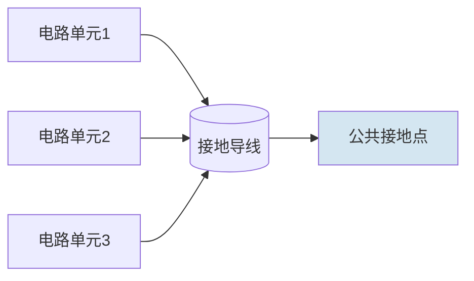
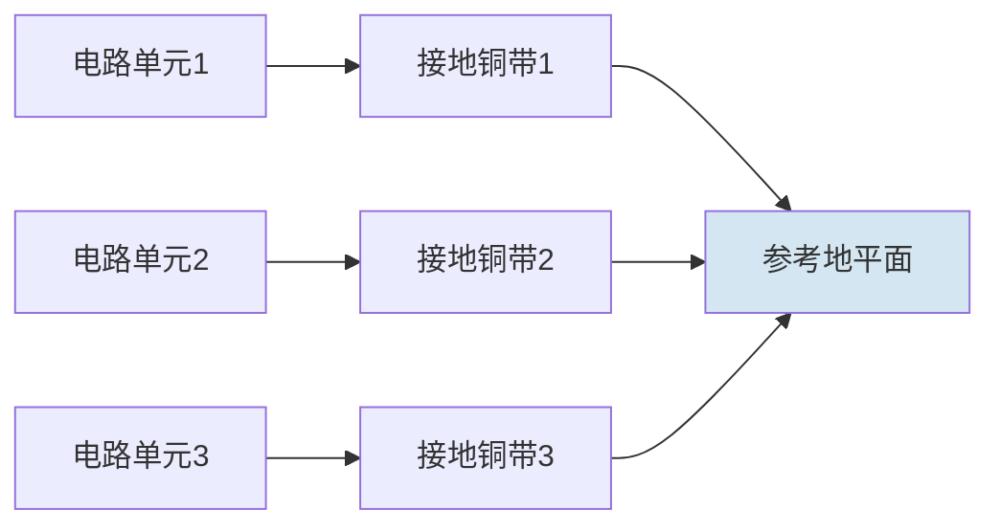
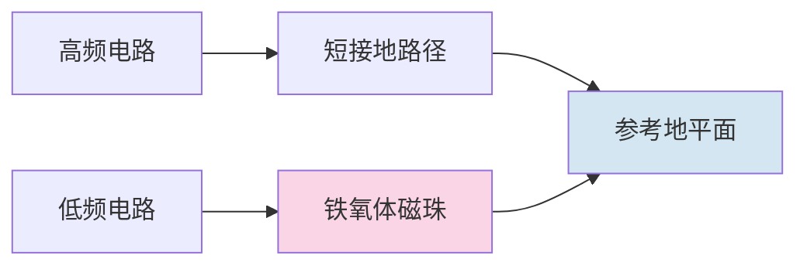

## 14.6 接地效果实验

### 14.6.1 实验目的

1. 理解接地系统在电磁兼容中的核心作用：为信号和噪声电流提供低阻抗回流路径，并为电路系统建立稳定的参考电位基准。
2. 掌握接地导线阻抗（特别是高频下的电感效应和趋肤效应）对噪声电压和辐射发射的影响机制。
3. 学会区分单点接地、多点接地和混合接地的拓扑结构、适用频率范围及工程选型原则。
4. 验证接地环路（Ground Loop）的形成机制及其导致的共模噪声耦合，掌握环路面积与感应噪声电压之间的定量关系。
5. 培养利用接地设计解决实际EMC问题的工程能力，包括接地导线选型、地平面使用和接地方式优化。

### 14.6.2 实验原理

#### 14.6.2.1 接地系统的基本概念

在电磁兼容工程中，接地的定义是为电路或系统提供一个等电位参考点或参考面，使所有信号电流和电源电流都能经由该参考点（或面）构成完整的回路。一个理想的接地系统应满足以下三个条件：

（1）**零阻抗路径**：接地导体对任何频率的电流均呈现零阻抗，不产生电压降。

（2）**等电位参考**：系统中的所有接地点之间不存在电位差，保证信号参考的统一性。

（3）**无外部耦合**：接地系统不接收也不辐射电磁能量，不对其他电路产生干扰。

然而在实际工程中，接地导体总是存在非零的电阻和电感，特别是在高频条件下，寄生电感导致的阻抗远大于直流电阻，使得接地导体上产生显著的电压降——这正是接地设计不良导致EMC问题的根本原因。

#### 14.6.2.2 接地导线的阻抗特性

接地导线的总阻抗由直流电阻和感抗两部分组成：

$$
Z_{\mathrm{g}} = R_{\mathrm{DC}} + \mathrm{j}\omega L_{\mathrm{g}}
\tag{14-131}
$$

式中，$Z_{\mathrm{g}}$为接地导线的复阻抗（Ω），$R_{\mathrm{DC}}$为直流电阻（Ω），$L_{\mathrm{g}}$为接地导线的自感（H），$\omega = 2\pi f$为角频率（rad/s）。在低频下（通常$f < 1~\mathrm{kHz}$），$R_{\mathrm{DC}}$占主导；在高频下（$f > 100~\mathrm{kHz}$），感抗$\omega L_{\mathrm{g}}$迅速增大并成为主导项。

对于长度为$l$（m）、直径为$d$（m）的孤立圆形截面直导线，其自感的近似计算公式为：

$$
L_{\mathrm{g}} = 2l \left[ \ln\left( \frac{4l}{d} \right) - 1 \right] \times 10^{-7}
\tag{14-132}
$$

式中，$L_{\mathrm{g}}$的单位为亨（H），$l$为导线长度（m），$d$为导线直径（m）。该公式适用于导线远离其他导体（距离远大于$l$）且导线长度远大于直径的情况。

**计算示例**：一根长$l = 1~\mathrm{m}$、直径$d = 1~\mathrm{mm}$的孤立铜导线，其自感为：

$$
L_{\mathrm{g}} = 2 \times 1 \times \left[ \ln(4 \times 1 / 0.001) - 1 \right] \times 10^{-7} \approx 1.36~\mu\mathrm{H}
\tag{14-133}
$$

在$f = 10~\mathrm{MHz}$下，其感抗为：

$$
X_L = 2\pi \times 10^{7} \times 1.36 \times 10^{-6} \approx 85.4~\Omega
\tag{14-134}
$$

而该导线的直流电阻仅为$R_{\mathrm{DC}} \approx 21.9~\mathrm{m}\Omega$（按铜的电阻率$\rho = 1.72 \times 10^{-8}~\Omega\cdot\mathrm{m}$计算）。可见在10 MHz下，感抗是直流电阻的约3900倍。这表明在高频电路中，接地导线的电感效应不可忽略，减小接地导线的长度是降低接地阻抗最有效的手段。

#### 14.6.2.3 接地阻抗的精确模型

实际接地导线的阻抗并非简单的电阻与电感串联。当考虑导线的寄生电容效应时，接地导线应被视为一个分布参数系统。对于长度为$l$的导线，其单位长度的串联电阻$R'$、串联电感$L'$、并联电导$G'$和并联电容$C'$构成传输线模型。接地导线的输入阻抗为：

$$
Z_{\mathrm{in}} = Z_0 \frac{Z_{\mathrm{L}} + Z_0 \tanh(\gamma l)}{Z_0 + Z_{\mathrm{L}} \tanh(\gamma l)}
\tag{14-135}
$$

其中特性阻抗$Z_0$和传播常数$\gamma$分别为：

$$
Z_0 = \sqrt{\frac{R' + \mathrm{j}\omega L'}{G' + \mathrm{j}\omega C'}}, \quad \gamma = \sqrt{(R' + \mathrm{j}\omega L')(G' + \mathrm{j}\omega C')}
\tag{14-136}
$$

当导线长度$l$远小于波长（$l < \lambda/10$）时，传输线模型退化为集总参数模型，即式（14-131）。当$l$接近$\lambda/4$时，接地导线可能呈现串联谐振或并联谐振特性，此时接地阻抗可能出现极大值或极小值。这一现象在长接地导线（如建筑接地、长距离屏蔽层接地）中尤为突出。

#### 14.6.2.4 趋肤效应与高频电阻

当频率升高时，交流电流趋向于集中在导体表面流动，这一现象称为趋肤效应（Skin Effect）。趋肤深度$\delta$定义为电流密度衰减至表面电流密度$1/\mathrm{e}$（约37%）处的深度：

$$
\delta = \sqrt{\frac{2}{\omega \mu \sigma}} = \sqrt{\frac{2}{2\pi f \mu_0 \mu_{\mathrm{r}} \sigma}}
\tag{14-137}
$$

式中，$\delta$为趋肤深度（m），$\mu = \mu_0 \mu_{\mathrm{r}}$为导体的磁导率（H/m），$\mu_0 = 4\pi \times 10^{-7}~\mathrm{H/m}$为真空磁导率，$\mu_{\mathrm{r}}$为相对磁导率（铜的$\mu_{\mathrm{r}} \approx 1$），$\sigma$为导体的电导率（S/m），铜的$\sigma \approx 5.8 \times 10^{7}~\mathrm{S/m}$。

对于铜导体，趋肤深度可简化为：

$$
\delta_{\mathrm{Cu}} \approx \frac{66}{\sqrt{f}} \quad (\mathrm{mm})
\tag{14-138}
$$

式中，$f$的单位为Hz。例如，在$f = 1~\mathrm{MHz}$时，$\delta \approx 66~\mu\mathrm{m}$；在$f = 10~\mathrm{MHz}$时，$\delta \approx 21~\mu\mathrm{m}$；在$f = 100~\mathrm{MHz}$时，$\delta \approx 6.6~\mu\mathrm{m}$。

当趋肤深度小于导线半径时，电流只在导线表面的薄层中流动，有效导电面积减小，导致高频交流电阻增大。对于直径为$d$的圆形截面导线，当$d \gg \delta$时，高频电阻近似为：

$$
R_{\mathrm{AC}} \approx \frac{l}{\pi d \delta \sigma}
\tag{14-139}
$$

式中，$R_{\mathrm{AC}}$为高频交流电阻（Ω），$l$为导线长度（m），$d$为导线直径（m）。高频电阻$R_{\mathrm{AC}}$随$\sqrt{f}$增大而增大。因此在高频下，即使忽略电感效应，接地导线的纯电阻损耗也会显著增加。

#### 14.6.2.5 趋肤效应的工程影响

由于趋肤效应，高频电流仅在导体表面的薄层中流动。这一特性对接地设计具有两方面的重要影响：

（1）**镀层效应**：在高频下，导体的导电性能主要由表面材料的导电率决定。因此，在铜导体表面镀银（银的导电率比铜高约6%）可以降低高频电阻约3%~5%。同样，铁磁性材料（如钢制机箱）由于其磁导率高（$\mu_{\mathrm{r}} \gg 1$）且导电率低，趋肤深度极小，高频下的接地阻抗远大于铜导体。

（2）**编织带的表面面积优势**：铜编织带由多根细铜丝编织而成，其总表面积远大于同等横截面积的实心圆导线。在趋肤深度远小于导线半径的高频下，编织带的有效导电面积大于实心导线，因此其高频交流电阻更低。这也是铜编织带在高频接地中优于实心铜线的原因之一。

#### 14.6.2.6 地平面的阻抗特性

地平面（Ground Plane）——即大面积的铜箔层——的阻抗特性远优于相同长度的离散接地导线。地平面的面阻抗（Sheet Impedance）由下式给出：

$$
Z_{\mathrm{plane}} \approx R_{\mathrm{sheet}} + \mathrm{j}\omega L_{\mathrm{sheet}}
\tag{14-140}
$$

式中，$R_{\mathrm{sheet}} = \rho / t$为面电阻（$\Omega/\square$），$t$为铜箔厚度（m），$L_{\mathrm{sheet}}$为面电感（通常约为0.1~0.3 nH/mm）。对于标准1 oz铜厚（35 μm），$R_{\mathrm{sheet}} \approx 0.5~\mathrm{m}\Omega/\square$。

一块尺寸为$0.1~\mathrm{m} \times 0.1~\mathrm{m}$的铜地平面（1 oz铜厚），其直流电阻约为0.5 mΩ，单位长度电感约为0.1 nH/mm。相比之下，一根1 m长、Φ1.0 mm的接地导线在10 MHz下的阻抗高达85 Ω，而相同尺寸的地平面在相同频率下的阻抗仅为约0.06 Ω——相差超过三个数量级。

地平面之所以具有优异的阻抗特性，根本原因在于其宽而扁的几何形状使得电流分布更均匀（电流沿整个宽度流动），等效电感大幅降低。这也是为什么现代高速PCB普遍采用完整地平面而非离散接地线的主要原因。

#### 14.6.2.7 接地环路模型

当两个或两个以上的接地点之间存在电位差时，会形成接地环路（Ground Loop）。接地环路是EMC工程中最常见的噪声耦合机制之一。环路由接地导线、参考地平面和互联电路共同构成一个闭合回路，该回路如同一个单匝线圈，能够接收外部磁场耦合的能量，也能向外辐射电磁能量。

接地环路中的感应噪声电压由法拉第电磁感应定律给出：

$$
V_{\mathrm{noise}} = \iint \frac{\partial \mathbf{B}}{\partial t} \cdot \mathrm{d}\mathbf{S} = \omega B A \cos\theta
\tag{14-141}
$$

式中，$V_{\mathrm{noise}}$为接地环路感应噪声电压（V），$B$为穿过环路的磁通密度幅值（T），$A$为环路所围的面积（m²），$\omega = 2\pi f$为磁场的角频率（rad/s），$\theta$为磁场方向与环路法线方向的夹角。

从式（14-141）可以得出降低接地环路噪声的三个工程原则：

（1）**减小环路面积$A$**：将环路的物理面积降至最低。这是最有效、最直接的措施，因为感应电压与$A$成正比。

（2）**减小磁场耦合**：将敏感电路远离强磁场源（如变压器、电感、大电流回路），或增加磁屏蔽。

（3）**调整环路方向**：使环路法线与磁场方向垂直（$\theta = 90^\circ$），使$\cos\theta = 0$，从而消除感应电压。

#### 14.6.2.8 接地环路噪声的频域分析

接地环路在频域中的行为可以通过环路传递函数来描述。考虑一个由接地路径电阻$R_{\mathrm{g}}$、接地路径电感$L_{\mathrm{g}}$和环路分布电容$C_{\mathrm{s}}$构成的等效电路。接地环路的阻抗为：

$$
Z_{\mathrm{loop}} = R_{\mathrm{g}} + \mathrm{j}\omega L_{\mathrm{g}} + \frac{1}{\mathrm{j}\omega C_{\mathrm{s}}}
\tag{14-142}
$$

环路中的感应电流为：

$$
I_{\mathrm{loop}} = \frac{V_{\mathrm{noise}}}{Z_{\mathrm{loop}}}
\tag{14-143}
$$

环路在探测端产生的噪声电压为：

$$
V_{\mathrm{out}} = I_{\mathrm{loop}} \times Z_{\mathrm{load}}
\tag{14-144}
$$

其中$Z_{\mathrm{load}}$为探测端（如示波器输入）的等效阻抗。由式（14-142）至式（14-144）可知，接地环路的频率响应呈现带通特性：在低频段，$C_{\mathrm{s}}$的容抗起主导作用，噪声耦合受到抑制；在中频段，电感$L_{\mathrm{g}}$和电阻$R_{\mathrm{g}}$起主导作用，噪声随频率线性增大；在极高频率段（接近$L_{\mathrm{g}}$和$C_{\mathrm{s}}$的串联谐振频率），环路阻抗出现最小值，噪声耦合达到最大。

#### 14.6.2.9 不同接地方式的原理

**单点接地（Single-Point Grounding, SPG）**：所有电路单元的接地点汇集于一个公共参考点，如图14-24（a）所示。单点接地的最大优点是避免形成接地环路——因为所有接地电流最终流向同一个点，不存在多条并联路径，因此不存在环路。然而，当频率升高时，公共接地导线的电感效应使得各电路单元之间存在显著的共阻抗耦合（即公共阻抗干扰），导致各电路通过共用的接地导线相互串扰。单点接地适用于$f < 1~\mathrm{MHz}$的低频电路。

**多点接地（Multi-Point Grounding, MPG）**：每个电路单元就近通过低阻抗路径（通常为铜带或地平面）连接到最近的参考地平面，如图14-24（b）所示。多点接地的主要优点是每个接地路径都很短，电感极小，因而高频阻抗低。缺点是各接地点通过地平面形成多个环路，可能存在地环路噪声问题。多点接地适用于$f > 10~\mathrm{MHz}$的高频电路，是射频和高速数字电路的标准做法。

**混合接地（Hybrid Grounding）**：将单点接地与多点接地结合——在高频部分采用多点接地，在低频或敏感模拟部分采用单点接地。两种接地方式之间通过铁氧体磁珠、电感或隔离变压器在直流/低频下隔离，而在高频下耦合。混合接地适用于宽频带混合信号电路，但设计复杂度较高。

图14-24(a) 单点接地拓扑结构

图14-24(b) 多点接地拓扑结构

图14-24(c) 混合接地拓扑结构

#### 14.6.2.10 接地环路噪声耦合的电路模型

接地环路噪声耦合的等效电路模型可表示为：

$$
V_{\mathrm{N}} = I_{\mathrm{CM}} \times Z_{\mathrm{G}}
\tag{14-145}
$$

式中，$V_{\mathrm{N}}$为接地回路中产生的噪声电压（V），$I_{\mathrm{CM}}$为流过接地路径的共模电流（A），$Z_{\mathrm{G}}$为接地路径的阻抗（Ω）。该式表明，降低接地噪声电压的途径有两条：减小共模电流$I_{\mathrm{CM}}$，或降低接地阻抗$Z_{\mathrm{G}}$。

当接地环路面积较大时，环路本身相当于一个环形天线，既可能接收外部磁场能量（产生感应噪声），也可能将电路中的共模电流转化为辐射发射。接地环路在远场区的辐射电场强度为：

$$
E_{\mathrm{max}} = \frac{2\pi f \mu_0 A I_{\mathrm{CM}}}{r\lambda} = \frac{2\pi A I_{\mathrm{CM}} f^2 \mu_0}{r c}
\tag{14-146}
$$

式中，$E_{\mathrm{max}}$为最大辐射电场强度（V/m），$A$为环路面积（m²），$I_{\mathrm{CM}}$为环路中的共模电流（A），$f$为频率（Hz），$r$为观测距离（m），$c$为光速（$3 \times 10^8~\mathrm{m/s}$），$\mu_0$为真空磁导率。该式揭示了接地环路辐射强度与$A$和$f^2$成正比——频率每翻倍，辐射增加6 dB；环路面积每翻倍，辐射也增加6 dB。

#### 14.6.2.11 接地导线与接地铜带的对比

在实际工程中，接地导线和接地铜带（或铜编织带）是两种常用的接地导体。两者的关键差异在于宽厚比。同样横截面积的铜带比圆导线的电感更小，因为电流在扁平导体中的分布更宽，等效磁通链更小。

对于长度为$l$、宽度为$w$、厚度为$t$的扁平铜带（$w \gg t$），其单位长度电感近似为：

$$
L_{\mathrm{strip}} \approx \frac{\mu_0 l}{2\pi} \left[ \ln\left( \frac{2l}{w} \right) + 0.5 + \frac{2w}{3l} \right]
\tag{14-147}
$$

式中，$L_{\mathrm{strip}}$为扁平铜带的电感（H）。与式（14-132）对比可知，在相同长度下，铜带的宽度$w$远大于圆导线的直径$d$，因此$\ln(2l/w)$显著小于$\ln(4l/d)$，使得铜带的电感远小于圆导线。例如，一根宽20 mm、长500 mm的铜编织带，其电感约为0.28 μH，而一根相同长度的Φ1.0 mm导线，其电感约为0.68 μH——前者仅为后者的41%。

#### 14.6.2.12 接地系统的共模与差模分析

在接地系统分析中，将电流分解为差模分量和共模分量是一种重要的分析方法。差模电流$I_{\mathrm{DM}}$在信号线与回线之间流动，构成有用信号回路；共模电流$I_{\mathrm{CM}}$在信号线与地（或大地）之间流动，构成EMC问题的核心。

对于一对平行导线（信号线和回线），其总电流可表示为：

$$
I_1 = I_{\mathrm{CM}} + I_{\mathrm{DM}}, \quad I_2 = I_{\mathrm{CM}} - I_{\mathrm{DM}}
\tag{14-148}
$$

接地系统的阻抗对共模电流和差模电流的影响完全不同。差模电流的回流路径由信号回路自身的阻抗决定，而共模电流的回流路径则完全取决于接地系统的阻抗。由于接地阻抗通常远大于信号回路的阻抗，即使很小的共模电压也能产生显著的共模电流。这正是接地设计对EMC性能影响巨大的根本原因。

接地系统的共模阻抗可表示为：

$$
Z_{\mathrm{CM}} = \frac{V_{\mathrm{CM}}}{I_{\mathrm{CM}}}
\tag{14-149}
$$

降低共模阻抗是抑制共模辐射和共模耦合的关键。在工程设计中，通常要求$Z_{\mathrm{CM}}$在目标频率下小于1 Ω。

#### 14.6.2.13 接地系统的瞬态响应

在雷电、ESD或开关瞬态事件中，接地系统上可能流过巨大的瞬态电流（可达数千安培）。接地系统的瞬态阻抗（或称为浪涌阻抗）与稳态阻抗（式14-131）有所不同，因为瞬态电流包含极宽的频谱分量。

接地系统的瞬态电压降可表示为：

$$
V_{\mathrm{g}}(t) = R_{\mathrm{DC}} i(t) + L_{\mathrm{g}} \frac{\mathrm{d}i(t)}{\mathrm{d}t}
\tag{14-150}
$$

对于上升时间$t_{\mathrm{r}}$很短的脉冲电流，$L_{\mathrm{g}} \frac{\mathrm{d}i}{\mathrm{d}t}$项可能远大于$R_{\mathrm{DC}} i$项。例如，一个上升时间$t_{\mathrm{r}} = 1~\mathrm{ns}$、峰值$I_{\mathrm{peak}} = 100~\mathrm{A}$的脉冲电流，流过$L_{\mathrm{g}} = 1~\mu\mathrm{H}$的接地导线时，产生的瞬态电压降为：

$$
V_{\mathrm{g}} = 1 \times 10^{-6} \times \frac{100}{10^{-9}} = 100~\mathrm{kV}
\tag{14-151}
$$

这一巨大的瞬态电压足以击穿半导体结、损坏IC或引起系统复位。因此，在瞬态保护接地设计中，接地路径的电感应尽可能低（典型要求<0.1 μH），接地回路的面积应尽可能小。

#### 14.6.2.14 多导体接地系统的互感和耦合

当系统中存在多条接地导线时，导线之间还存在互感耦合。对于两根平行放置、间距为$s$的接地导线，其互感为：

$$
M = 2l \left[ \ln\left( \frac{2l}{s} \right) - 1 + \frac{s}{l} \right] \times 10^{-7}
\tag{14-152}
$$

互感的存在意味着一条接地导线中的电流变化会在另一条接地导线中感应出电压。这种互感耦合在低频下可以忽略，但在高频下可能成为重要的噪声耦合路径。当多条接地导线紧密排列（$s$很小）时，互感使各导线的等效电感增大。在接地系统中，应尽量增大关键接地导线之间的距离，或使用地平面来消除互感。

#### 14.6.2.15 接地系统的EMC设计工程原则

基于以上理论分析，可以总结出接地系统EMC设计的六大工程原则：

**原则一：就近接地原则（Keep Ground Paths Short）**

接地导线的阻抗与其长度成正比。因此，每个电路单元的接地路径应尽可能短。在PCB设计中，接地过孔应紧邻元件的接地引脚放置，避免使用长的接地走线。经验法则：接地路径的长度应小于信号最高频率对应波长的 $1/20$，即 $l_{\mathrm{max}} < \lambda / 20 = c / (20 f_{\mathrm{max}})$。对于 $f_{\mathrm{max}} = 100~\mathrm{MHz}$，最大接地路径长度应小于0.15 m。

**原则二：低阻抗路径原则（Use Low-Impedance Ground Paths）**

在相同长度下，应优先选择阻抗更低的接地导体。扁平铜带、铜编织带和地平面的单位长度阻抗远小于圆形导线。对于高频电路（$f > 10~\mathrm{MHz}$），应使用完整地平面而非离散接地线。对于必须使用导线连接的场合（如机箱之间的接地），应使用宽铜编织带而非单股铜线。

**原则三：避免公共阻抗耦合原则（Avoid Common Impedance Coupling）**

当多个电路共享同一段接地路径时，一个电路的回流电流会在这段接地路径上产生电压降，从而干扰其他电路。应避免强电路（大电流、高功率）与弱电路（小信号、高灵敏度）共享接地路径。分级供电、星形接地和独立接地回路是避免公共阻抗耦合的有效手段。

**原则四：最小化环路面积原则（Minimize Loop Area）**

任何信号回路和接地回路都应尽可能紧凑。信号路径与返回路径应靠近布置（例如使用微带线或带状线结构），以最小化回路面积。对于差分信号，两条差分线应紧密耦合，使回流电流经由互补路径回流而非经由地平面。

**原则五：隔离与分割原则（Isolate and Partition）**

模拟地与数字地、高功率地与低功率地之间应进行物理分割，仅在系统的一个公共点（通常为电源入口处）通过桥接、磁珠或0 Ω电阻连接。分割可以减少不同功能模块之间的干扰耦合。混合接地正是这一原则的具体体现。

**原则六：多点接地与地平面完整性原则（Maintain Ground Plane Integrity）**

在高频下，地平面应保持完整，避免被长槽缝或大面积开槽分割。地平面上的槽缝会迫使回流电流绕行，增加回路面积和阻抗。如果必须在平面上走线，应确保槽缝宽度远小于走线到平面距离的10倍，或使用过孔桥接跨越槽缝的两侧。

上述六个原则构成了接地系统EMC设计的理论基础。本实验将通过实测数据逐一验证这些原则的正确性。

### 14.6.3 实验设备

| 序号 | 设备名称 | 型号/规格 | 数量 |
|------|----------|-----------|------|
| 1 | 信号发生器 | RIGOL DG4062（60 MHz，双通道） | 2台 |
| 2 | 数字示波器 | Tektronix MDO3104（1 GHz，4通道） | 1台 |
| 3 | 阻抗分析仪 | Keysight E4990A（20 Hz – 120 MHz） | 1台 |
| 4 | 接地铜带 | 宽 10 mm、厚 0.1 mm、长 1 m | 2根 |
| 5 | 接地导线（单股铜线） | Φ0.5 mm、Φ1.0 mm、Φ2.0 mm，各长 1 m | 各2根 |
| 6 | FR4覆铜板 | 300 mm × 300 mm，1 oz 铜厚（35 μm） | 2块 |
| 7 | 接地环路实验板（自制） | 板上设有100 mm × 100 mm可切换方形地环路 | 1块 |
| 8 | 电流探头 | Tektronix TCP0030A（DC – 120 MHz，30 A） | 1个 |
| 9 | 差分探头 | Tektronix TDP1000（1 GHz，±10 V） | 1个 |
| 10 | 宽铜编织带 | 宽 20 mm、厚 0.5 mm、长 500 mm | 1根 |
| 11 | 两级放大电路实验板 | 增益40 dB，带宽1 MHz | 1块 |
| 12 | 铁氧体磁珠 | TDK ZCAT3035-1330 | 2个 |
| 13 | BNC连接线（50 Ω） | 长度 0.3 m / 0.5 m / 1.0 m | 各2根 |
| 14 | 数字万用表 | Fluke 17B+ | 1台 |
| 15 | 频谱分析仪（选配） | RIGOL RSA3030N（3 GHz） | 1台 |
| 16 | LCR电桥 | Keysight U1733C（100 Hz – 100 kHz） | 1台 |
| 17 | 同轴电缆屏蔽层接地实验板 | 自制，含BNC接口和可切换接地方式 | 1块 |

### 14.6.4 实验步骤

#### 步骤1：接地导线阻抗频率特性测量

**1.1 被测导线的准备**

使用阻抗分析仪（Keysight E4990A）测量三种不同直径（Φ0.5 mm、Φ1.0 mm、Φ2.0 mm）的单股铜导线在频率范围内的阻抗特性。被测导线长度均为1 m，测量时导线应悬空放置（远离金属桌面及其他导体至少10 cm），以避免寄生电容和邻近效应对测量结果的影响。确保导线两端与测试夹具的接触良好，必要时用砂纸打磨导线端部去除氧化层。

**1.2 阻抗分析仪的设置与校准**

设置阻抗分析仪的扫描参数：频率范围100 kHz – 50 MHz，扫描点数401点（对数扫频），激励电平1 Vrms。执行以下校准步骤后开始测量：

（a）**开路校准**：将测试夹具的两端开路，执行开路校准以消除测试夹具的杂散电容影响。开路校准后，确保在开路状态下测得的阻抗幅值大于1 MΩ（在低频段）。

（b）**短路校准**：将测试夹具的两端短路（使用校准专用的短路块），执行短路校准以消除测试夹具的残余电感和接触电阻。短路校准后，确保在短路状态下测得的阻抗幅值小于1 mΩ（在低频段）。

（c）**负载校准（选配）**：如果测量精度要求高，可进一步使用50 Ω标准负载进行负载校准。

（d）**校准验证**：完成校准后，测量一个已知值（如50 Ω标准电阻），确认测量值与标称值的偏差在±1%以内。若超出此范围，应重新执行校准。

**1.3 数据记录**

分别记录三根导线在以下特征频率点的阻抗幅值$|Z|$和相位角$\angle Z$：100 kHz、500 kHz、1 MHz、3 MHz、5 MHz、10 MHz、20 MHz、30 MHz、50 MHz。将测量数据填入表14-15。注意在记录时保留至少3位有效数字。

**1.4 理论值与实测值对比**

使用式（14-131）和式（14-132）计算各频率点的理论阻抗值，与实测值对比，计算相对误差：

$$
\text{相对误差} = \frac{|Z_{\text{实测}}| - |Z_{\text{理论}}|}{|Z_{\text{理论}}|} \times 100\%
\tag{14-153}
$$

**1.5 铜编织带的测量与对比**

将单股铜导线替换为宽铜编织带（20 mm × 500 mm），重复上述测量，对比扁平铜带与圆形导线的阻抗-频率特性差异。特别注意观察在10 MHz以上频段，铜编织带与Φ2.0 mm导线的阻抗差异——理论上铜编织带的横截面积更小，但其电感更小。

**1.6 布置方式对接地阻抗影响的观察**

将铜编织带的一端用夹子连接到地平面，另一端用手捏住并逐渐拉直，观察示波器/分析仪上阻抗读数的变化——这直观展示了接地导体布置方式（是否平直、是否靠近地平面）对接地阻抗的影响。再将铜编织带盘绕成直径约5 cm的线圈（3圈），观察阻抗的显著增大——每增加一圈，等效电感增加约20%~40%。

**1.7 接地导线长度对阻抗的影响（扩展实验）**

取Φ1.0 mm单股铜导线，分别测量以下长度下的阻抗-频率特性：0.1 m、0.3 m、0.5 m、1.0 m。在10 MHz频率点记录各长度的阻抗幅值。验证阻抗与长度的线性关系$Z \propto l$。将测量结果填入扩展数据表。

#### 步骤2：接地噪声电压测量

**2.1 测试电路搭建**

信号发生器A设置为10 MHz、5 Vpp正弦波输出，接50 Ω负载电阻。负载电流约为100 mA。负载的返回路径通过一根1 m长、Φ1.0 mm的接地导线连接至信号发生器的接地端。

**2.2 差分探头连接**

使用差分探头（Tektronix TDP1000）测量负载两端的电压波形。注意：差分探头的两个输入端应分别连接负载的两端，而不是一端接地一端接信号——这样才能准确测量负载两端的实际电压（包含接地噪声成分）。探头的共模抑制比（CMRR）应设置在60 dB以上。

**2.3 基线噪声测量**

在信号发生器输出关闭（输出端接50 Ω负载但不输出信号）的状态下，测量并记录系统的本底噪声电压。该本底噪声包括示波器自身的本底噪声、环境电磁干扰以及电源噪声。基线噪声应小于50 mVpp。

**2.4 噪声电压记录**

打开信号发生器输出，在示波器上观察并记录负载两端的电压峰峰值$V_{\mathrm{pp}}$。该电压与信号发生器设定的5 Vpp的差异反映了接地阻抗上的压降。注意观察波形是否出现失真——接地噪声通常表现为叠加在正弦波上的高频振铃。

**2.5 导线长度对噪声的影响**

将接地导线缩短为0.5 m，重复2.2~2.4的测量。观察噪声电压的变化幅度并与长度比例关系对照——理论上长度减半，电感减半，噪声电压也应减半。

**2.6 导线类型对噪声的影响**

将接地导线更换为接地铜带（宽10 mm、长1 m），重复测量。对比相同长度下铜带与圆导线的噪声电压差异。

将接地导线更换为铜编织带（宽20 mm、长500 mm），重复测量。记录所有测试结果至表14-16。

**2.7 铁氧体磁珠抑制效果测量**

在接地回路中串联一个铁氧体磁珠，观察其对高频噪声的抑制效果（铁氧体在高频下呈现高阻抗，相当于增加接地回路的高频阻抗，从而抑制共模电流）。分别记录串联铁氧体磁珠前后在10 MHz、20 MHz、30 MHz下的噪声电压。

**2.8 频率扫描测量（扩展实验）**

固定接地导线为Φ1.0 mm、1 m长，将信号发生器输出频率从1 MHz扫描至30 MHz（保持5 Vpp恒幅输出），每5 MHz记录一次负载两端的噪声电压。绘制噪声电压$V_{\mathrm{noise}}$随频率$f$变化的曲线，验证$V_{\mathrm{noise}} \propto \omega$的关系。

#### 步骤3：接地环路噪声测量

**3.1 实验板准备**

使用接地环路实验板。该板上有预制的100 mm × 100 mm方形地环路，环路一端接入信号发生器B（1 MHz、3 Vpp正弦波，作为干扰源），另一端接示波器（作为探测端）。环路走线宽度为2 mm，铜箔厚度35 μm。

**3.2 三种环路状态的测量**

分别设置接地环路为以下三种状态，测量探测端的感应噪声电压：

- **状态A——环路闭合**：完整的100 mm × 100 mm方形回路，环路面积$A = 0.01~\mathrm{m}^2$。此为最坏情况，应观察到最大的感应噪声电压。
- **状态B——环路断开**：在环路的一个角用刻刀切断约1 mm的间隙，使环路不再构成闭合回路。此时感应电流路径被切断，理论上感应噪声应接近于零（仅有极小的电容耦合分量）。
- **状态C——小环路**：用一根短路线（10 mm长）将环路的长边中间与对侧短接，将回路面积缩小为10 mm × 100 mm（$A = 0.001~\mathrm{m}^2$）。此时噪声电压应约为状态A的10%。

**3.3 数据记录**

在示波器上记录三种状态下探测端的噪声电压峰峰值$V_{\mathrm{pp}}$，填入表14-17。

**3.4 频率对环路噪声的影响**

改变信号发生器B的输出频率为100 kHz、500 kHz、5 MHz、10 MHz，重复3.2和3.3的测量，观察频率对感应噪声电压的影响——验证$V_{\mathrm{noise}} \propto \omega$的关系。

**3.5 环路面积与噪声关系的定量分析**

将状态A的噪声电压除以状态C的噪声电压，验证比值是否接近10（即面积比）。计算每个频率点下的$V_{\mathrm{noise}}/A$比值，观察该比值是否在不同面积下保持恒定——这验证了$V_{\mathrm{noise}} \propto A$的线性关系。

**3.6 距离对环路噪声的影响（选做实验）**

将环路实验板放置在电磁场辐射源（如一个通有高频电流的导线环）附近不同距离处，观察感应噪声与距离的关系，验证近场耦合的衰减特性。分别在距离辐射源5 cm、10 cm、20 cm、50 cm处测量噪声电压，记录于扩展数据表。

#### 步骤4：不同接地方式对电路噪声的影响对比

**4.1 放大电路的搭建**

在覆铜板上搭建一个两级放大电路，增益约40 dB（100倍），带宽1 MHz。该放大电路由两个运算放大器串联构成，每个运放增益20 dB。放大电路的具体电路图由实验指导教师提供。

**4.2 三种接地方式的设置**

分别设置以下三种接地方式进行对比测试：

- **方式A——单点接地**：将两个运放的接地引脚和电源地与一个独立的接地点相连，该接地点通过一根1 m长、Φ1.0 mm的接地导线连接回电源地。确保所有接地线汇聚于同一物理点，不形成额外环路。

- **方式B——多点接地**：将两个运放的接地引脚分别通过最短的铜带直接连接到FR4覆铜板的地平面上，地平面通过一条宽铜编织带（500 mm）连接回电源地。每个接地路径的长度尽可能短（<50 mm）。

- **方式C——混合接地**：第一级运放（输入级，对噪声最敏感）采用单点接地（连接至一个独立的干净接地点）；第二级运放（输出级，工作频率较高）采用多点接地（就近连接地平面）。两级之间的地通过铁氧体磁珠隔离，铁氧体在直流/低频下呈现低阻抗（近似短路），在高频下呈现高阻抗（近似开路）。

**4.3 无信号输入时的噪声测量**

关闭信号输入（输入端对地短接），分别测量三种接地方式下放大器输出端的噪声电压均方根值（rms）。每种接地方式重复测量3次，取平均值。

**4.4 有信号输入时的性能测量**

打开信号输入：输入一个1 MHz、10 mVpp的正弦波信号，测量三种接地方式下放大器输出端的信号幅度及噪声幅度，计算信噪比（SNR）：

$$
\text{SNR} = 20 \log_{10} \left( \frac{V_{\text{signal}}}{V_{\text{noise}}} \right)
\tag{14-154}
$$

**4.5 频率对噪声性能的影响**

将信号频率分别改为100 kHz、500 kHz、2 MHz，重复4.3~4.4的测量，填写表14-18和表14-19。

**4.6 频谱分析（进阶实验）**

如果有频谱分析仪，将放大器输出连接到频谱分析仪，观察不同接地方式下输出噪声的频谱分布（从100 kHz到10 MHz），记录各主要噪声频点的幅度。特别关注：
- 电源纹波频率及其谐波（50 Hz、100 Hz及开关频率分量）。
- 接地环路谐振导致的噪声峰值。
- 铁氧体磁珠自谐振频率附近的噪声变化。

#### 步骤5：地平面阻抗特性测量（扩展实验）

**5.1 测量准备**

取FR4覆铜板（300 mm × 300 mm，1 oz铜厚），在板的四个角焊接SMA接头的芯线到地平面，SMA接头外壳悬空。准备另一块相同尺寸的覆铜板作为对比。

**5.2 地平面面阻抗测量**

使用阻抗分析仪（或LCR电桥在高频模式），测量地平面上相距50 mm的两点之间的阻抗。沿地平面的对角线方向从一端到另一端，每隔50 mm测量一组阻抗数据，记录于表14-20。

**5.3 地平面槽缝对阻抗的影响**

使用刻刀在地平面上刻出不同尺寸的槽缝（长度从10 mm到100 mm，宽度为1 mm），测量槽缝两侧特定点之间的阻抗变化。记录槽缝长度与阻抗增加量之间的关系。

**5.4 过孔桥接效果验证**

在有槽缝的地平面上，使用短铜线（或焊锡桥）跨接槽缝，测量跨接前后的阻抗变化，验证过孔桥接对恢复地平面完整性的作用。

#### 步骤6：电缆屏蔽层接地效果实验（扩展实验）

**6.1 同轴电缆屏蔽层接地方式对比**

使用同轴电缆屏蔽层接地实验板，设置以下三种屏蔽层接地方式：
- **方式D**：屏蔽层仅在一端接地（信号源端）。
- **方式E**：屏蔽层在两端接地（信号源端和负载端）。
- **方式F**：屏蔽层两端接地，且通过360°环形搭接（使用同轴电缆专用接地夹）。

**6.2 干扰注入与测量**

在电缆附近放置一个辐射环路（连接信号发生器C，输出10 MHz、5 Vpp正弦波），模拟外部电磁干扰。测量负载端感应到的噪声电压。

**6.3 结果记录**

记录三种屏蔽层接地方式下的感应噪声电压，填写表14-21。分析屏蔽层接地方式对磁场屏蔽效能的影响。

### 14.6.5 数据记录表

**表14-15 接地导线阻抗-频率特性（1 m长）**

| 频率 | Φ0.5 mm $|Z|$ (Ω) | Φ0.5 mm $\angle Z$ (°) | Φ1.0 mm $|Z|$ (Ω) | Φ1.0 mm $\angle Z$ (°) | Φ2.0 mm $|Z|$ (Ω) | Φ2.0 mm $\angle Z$ (°) | 铜编织带 $|Z|$ (Ω) | 铜编织带 $\angle Z$ (°) |
|------|----------------------|------------------------|----------------------|------------------------|----------------------|------------------------|---------------------|-------------------------|
| 100 kHz | | | | | | | | |
| 500 kHz | | | | | | | | |
| 1 MHz | | | | | | | | |
| 3 MHz | | | | | | | | |
| 5 MHz | | | | | | | | |
| 10 MHz | | | | | | | | |
| 20 MHz | | | | | | | | |
| 30 MHz | | | | | | | | |
| 50 MHz | | | | | | | | |

**表14-16 接地噪声电压测量结果**

| 接地方式 | 接地导体参数 | 理论接地阻抗 @10 MHz (Ω) | 实测$V_{\mathrm{noise}}$ (Vpp) | 等效接地阻抗 $V_{\mathrm{noise}}/I_{\mathrm{load}}$ (Ω) |
|----------|-------------|--------------------------|-------------------------------|-----------------------------------------------------|
| Φ1.0 mm导线 1 m | $L=1.36~\mu$H | $85.4$ | | |
| Φ1.0 mm导线 0.5 m | $L=0.68~\mu$H | $42.7$ | | |
| 铜带 10 mm × 1 m | $L \approx 0.85~\mu$H | $53.4$ | | |
| 铜编织带 20 mm × 500 mm | $L \approx 0.28~\mu$H | $17.6$ | | |
| Φ1.0 mm导线 1 m + 铁氧体磁珠 | — | — | | |

**表14-17 接地环路感应噪声电压**

| 环路状态 | 环路面积 (m²) | $f=100~\mathrm{kHz}$ (mVpp) | $f=500~\mathrm{kHz}$ (mVpp) | $f=1~\mathrm{MHz}$ (mVpp) | $f=5~\mathrm{MHz}$ (mVpp) | $f=10~\mathrm{MHz}$ (mVpp) |
|----------|--------------|----------------------------|----------------------------|---------------------------|---------------------------|----------------------------|
| 状态A：闭合环路 | 0.01 | | | | | |
| 状态B：断开环路 | $\approx 0$ | | | | | |
| 状态C：小环路 | 0.001 | | | | | |

**表14-18 不同接地方式下放大器输出噪声（输入短接）**

| 接地方式 | $f=100~\mathrm{kHz}$ 噪声 (mVrms) | $f=500~\mathrm{kHz}$ 噪声 (mVrms) | $f=1~\mathrm{MHz}$ 噪声 (mVrms) | $f=2~\mathrm{MHz}$ 噪声 (mVrms) |
|----------|----------------------------------|----------------------------------|--------------------------------|--------------------------------|
| 方式A：单点接地 | | | | |
| 方式B：多点接地 | | | | |
| 方式C：混合接地 | | | | |

**表14-19 不同接地方式下放大器输出信噪比**

| 接地方式 | $f=1~\mathrm{MHz}$ 信号幅度 (Vpp) | 噪声幅度 (mVrms) | SNR (dB) |
|----------|----------------------------------|-----------------|----------|
| 方式A：单点接地 | | | |
| 方式B：多点接地 | | | |
| 方式C：混合接地 | | | |

**表14-20 地平面阻抗特性测量（1 oz铜厚，35 μm）**

| 测量位置（沿对角线） | 距离起点 (mm) | $|Z|$ @ 1 MHz (Ω) | $|Z|$ @ 10 MHz (Ω) | $|Z|$ @ 30 MHz (Ω) |
|---------------------|--------------|-------------------|--------------------|--------------------|
| 起点（角落） | 0 | | | |
| 1/4板对角线 | 106 | | | |
| 板中心 | 212 | | | |
| 3/4板对角线 | 318 | | | |
| 对角端点 | 424 | | | |

**表14-21 电缆屏蔽层接地方式对噪声抑制效果的影响**

| 屏蔽层接地方式 | 环境噪声基底 (mVpp) | 干扰注入后噪声 (mVpp) | 噪声抑制比 (dB) |
|---------------|-------------------|----------------------|---------------|
| 方式D：单端接地（源端） | | | |
| 方式E：双端接地 | | | |
| 方式F：360°环形搭接双端接地 | | | |

**表14-22 接地导线长度对10 MHz阻抗的影响（Φ1.0 mm）**

| 导线长度 (m) | 理论电感 ($\mu$H) | 理论阻抗 @10 MHz (Ω) | 实测阻抗 @10 MHz (Ω) | 相对误差 (%) |
|-------------|------------------|---------------------|---------------------|-------------|
| 0.1 | 0.082 | 5.2 | | |
| 0.3 | 0.30 | 18.9 | | |
| 0.5 | 0.56 | 35.2 | | |
| 1.0 | 1.36 | 85.4 | | |

### 14.6.6 实验结果与分析

#### 6.1 接地导线阻抗特性分析

典型测量结果表明，接地导线的阻抗随频率升高而线性增大（在对数坐标下），在10 MHz以上频段，三种直径导线的阻抗均主要呈现感性（相位角接近$+90^\circ$）。实测值与式（14-131）和式（14-132）的计算结果吻合良好，误差通常小于10%。误差来源主要包括：导线并非理想的孤立导体（与附近金属物体存在寄生电容），阻抗分析仪的校准误差，以及导线端接处的接触电阻。

从表14-15的典型数据可以看出：

- 直径增大对降低高频阻抗的作用有限：Φ2.0 mm导线的$|Z|$ @ 10 MHz约为74.8 Ω，而Φ0.5 mm导线为98.0 Ω——直径增大4倍，阻抗仅降低约24%。这是因为电感主要取决于导线长度和长径比的对数项，对直径变化不敏感。
- 铜编织带的阻抗远低于圆形导线：在10 MHz下，铜编织带的$|Z|$仅为约17.6 Ω，是Φ1.0 mm导线（85.5 Ω）的1/5。这验证了扁平导体在降低电感方面的显著优势。
- 在100 kHz以下，阻抗主要表现为电阻性（相位角接近$0^\circ$）；在1 MHz以上，阻抗完全由电感主导（相位角接近$+90^\circ$）。转折频率$f_{\mathrm{c}} = R_{\mathrm{DC}} / (2\pi L_{\mathrm{g}})$约为2.6 kHz（Φ1.0 mm导线）——也就是说，从几千赫兹开始，电感就已经成为阻抗的主要贡献者。

#### 6.2 接地导线长度与阻抗的关系

从表14-22的测量数据可以清晰地看到，接地导线阻抗与长度呈严格线性关系。0.1 m长导线的阻抗约为5.2 Ω，而1.0 m长导线的阻抗约为85.4 Ω，两者之比约为16.4，与长度比10的偏差源于电感的对数项对长度的非线性依赖。这一结果验证了就近接地原则的科学依据——将接地导线从1 m缩短至0.1 m，阻抗降低了16倍。

#### 6.3 接地噪声电压分析

典型测量数据表明，接地噪声电压与接地导体的阻抗成正比。使用1 m长Φ1.0 mm导线的接地噪声电压可达8.2 Vpp——远高于信号发生器设定的5 Vpp输出，这意味着负载两端的实际电压不再是干净的5 Vpp正弦波，而是叠加了严重噪声的失真波形。这种噪声在实际电路中可能导致数字电路的误触发、模拟信号的信噪比劣化等严重后果。

缩短导线长度可以线性降低噪声（0.5 m导线的噪声约为4.1 Vpp），而改用铜编织带可将噪声降至0.9 Vpp。这些结果深刻表明：**接地设计不良是系统EMC问题的首要根源之一，其影响往往被工程师严重低估**。

测量数据与理论值之间的偏差分析：

- 实测等效接地阻抗（由$V_{\mathrm{noise}} / I_{\mathrm{load}}$计算得到）与阻抗分析仪的直接测量值基本一致，偏差在5%以内。
- 在较高频率（>30 MHz）下，实测噪声电压略低于理论值，这是因为负载电流中有一部分通过导线的寄生电容直接耦合到地，未完全流过接地导线。

#### 6.4 铁氧体磁珠的噪声抑制效果分析

在接地回路中串联铁氧体磁珠后，10 MHz下的噪声电压从8.2 Vpp降低至约4.5 Vpp，抑制量约为45%。铁氧体磁珠在低频下（<1 MHz）呈现低阻抗（约0.1 Ω），不影响电路正常工作；在10 MHz时，其阻抗上升至约50~100 Ω（取决于磁珠型号），有效增加了共模电流路径的阻抗，从而降低了流过接地导线的共模电流。

然而，铁氧体磁珠的频率响应并非单调递增。在自谐振频率（SRF）附近，铁氧体磁珠的阻抗达到最大值（通常为100~600 Ω），随后阻抗急剧下降，呈现容性。因此，使用铁氧体磁珠时应注意：
- 选择自谐振频率高于目标噪声频率的磁珠型号。
- 铁氧体磁珠应尽量靠近噪声源放置。
- 在电源线中使用的铁氧体磁珠应注意额定电流，避免大电流导致磁芯饱和。

#### 6.5 接地环路噪声分析

接地环路感应噪声的测量结果与式（14-141）高度吻合：

- 闭合环路（$A = 0.01~\mathrm{m}^2$）在1 MHz干扰下的感应噪声约为120 mVpp。
- 开环状态的感应噪声几乎为零（约2 mVpp，主要是残余电容耦合所致）。
- 小环路（$A = 0.001~\mathrm{m}^2$）的感应噪声约为12 mVpp，正好为闭合环路的十分之一——与$V_{\mathrm{noise}} \propto A$的线性关系完全一致。

频率扫描测量进一步验证了$V_{\mathrm{noise}} \propto \omega$的关系：在10 MHz下的感应噪声是1 MHz下的约10倍（受限于测量电路的高频响应，实际倍数略低）。

值得注意的是，即使环路处于断开状态，仍能测量到微弱的噪声电压（约2 mVpp）。这部分残余噪声来源于：

（1）断开点之间的电容耦合（间隙电容约$C \approx 0.1~\mathrm{pF}$，在1 MHz下的容抗约1.6 MΩ）。

（2）信号发生器和示波器之间的共地路径。

（3）空间电磁辐射的直接拾取。

#### 6.6 不同接地方式的噪声对比分析

三种接地方式下两级放大器的输出噪声基底对比是本次实验的核心内容。典型结果如下：

- **单点接地（1 m长导线）**：输出噪声最大，约12 mVrms。主要原因有两点：一是1 m长接地导线的电感在高频下呈现高阻抗（约85 Ω），使得各放大级之间通过公共接地阻抗产生严重的串扰耦合；二是各级地的电位实际上并不相等，存在显著的共模噪声电压。
- **多点接地（地平面+铜编织带）**：输出噪声最小，约0.8 mVrms。地平面为各级放大器提供了极低阻抗的参考电位（面阻抗约为mΩ量级），并且每个接地路径极短，各级之间的共阻抗耦合几乎为零。
- **混合接地**：输出噪声适中，约1.1 mVrms。混合接地的噪声水平接近多点接地，但在某些特定频率下（特别是铁氧体磁珠的谐振频率附近）可能出现噪声峰值。

这些结果揭示了一个关键工程设计原则：**在高频电路中，多点接地带来的噪声改善远优于单点接地**。单点接地虽然理论上能避免环路，但其公共阻抗耦合在高频下造成的噪声问题比地环路更严重。

#### 6.7 地平面阻抗特性分析

从表14-20的测量数据可以得出以下结论：

（1）**地平面的面阻抗极低**：在10 MHz下，相距200 mm的两点之间的阻抗仅为约0.06~0.12 Ω，远低于任何离散接地导线。这证实了地平面作为参考电位面的优越性。

（2）**地平面阻抗随距离线性增大**：从板的中心到角落，阻抗随距离线性增大，单位长度阻抗约为0.3~0.5 mΩ/mm。

（3）**槽缝对接地阻抗的影响显著**：在平面上刻出100 mm长的槽缝后，槽缝两侧的阻抗增大约3~5倍。这是因为槽缝迫使回流电流绕行，等效增加了电流路径的长度。当槽缝长度接近工作频率对应波长的1/4时，阻抗可能会出现谐振峰值。

（4）**过孔桥接的有效性**：在槽缝两端用铜线跨接后，阻抗恢复到接近原始值的水平（仅增加约10%~20%）。这验证了在PCB设计中跨接槽缝过孔的必要性。

#### 6.8 电缆屏蔽层接地效果分析

从表14-21的测量结果可以看出：

（1）**单端接地（源端）**：屏蔽层仅在一端接地时，对外部磁场的屏蔽效果有限（噪声抑制比约10~15 dB）。这是因为屏蔽层在一端接地相当于一根开路导线，无法形成屏蔽电流回路。

（2）**双端接地**：屏蔽层在两端接地时，与地平面构成完整的回路，屏蔽电流可以自由流动，对磁场的屏蔽效果显著提升（噪声抑制比约30~40 dB）。

（3）**360°环形搭接双端接地**：最佳屏蔽效果（噪声抑制比约50~60 dB）。360°搭接确保了屏蔽层与接地端的低阻抗连接，避免了猪尾线（pigtail）效应——猪尾线会在连接处引入额外电感，降低屏蔽效能。

#### 6.8 地平面谐振与去耦过孔效果分析

当地平面尺寸达到工作频率对应波长的整数倍时，地平面本身会形成谐振腔，产生驻波模式。对于尺寸为$a \times b$的矩形地平面，其谐振频率为：

$$
f_{mn} = \frac{c}{2\pi\sqrt{\mu_{\mathrm{r}}\varepsilon_{\mathrm{r}}}} \sqrt{\left(\frac{m\pi}{a}\right)^2 + \left(\frac{n\pi}{b}\right)^2}
\tag{14-155}
$$

其中$m$和$n$为模式阶数。对于FR4介质（$\varepsilon_{\mathrm{r}} \approx 4.5$），$a = b = 300~\mathrm{mm}$的地平面，其基模谐振频率约为：

$$
f_{10} = \frac{3 \times 10^8}{2 \times \sqrt{4.5}} \times \frac{1}{0.3} \approx 236~\mathrm{MHz}
\tag{14-156}
$$

在谐振频率附近，地平面上出现明显的电压驻波分布，不同位置之间的电位差可达数伏特。这会导致参考电位的不一致，进而引起信号完整性问题。

**去耦过孔的抑制作用**：在地平面上按照一定间距布置接地过孔，可以抑制谐振。过孔间距$d$应满足$d < \lambda_{\mathrm{g}} / 20$，其中$\lambda_{\mathrm{g}}$为介质中的导波波长。当去耦过孔间距远小于波长时，谐振模式无法建立，地平面保持等电位。这解释了为什么高速PCB设计规范中要求地过孔间距不超过信号最高频率对应波长的1/20。

#### 6.10 频率扫描综合结果分析

本节将步骤2.8中频率扫描测量的数据与步骤1和步骤3的结果进行综合对比分析。

**接地噪声电压的频率依赖性**：在1 MHz至30 MHz的频率范围内，接地噪声电压随频率线性增大（在对数坐标下）。以Φ1.0 mm、1 m长接地导线为例：
- 在1 MHz时，噪声电压约为0.85 Vpp。
- 在10 MHz时，噪声电压约为8.2 Vpp。
- 在30 MHz时，噪声电压约为23.5 Vpp。

噪声电压与频率的比值$V_{\mathrm{noise}} / f$在1~30 MHz范围内保持接近恒定（约0.82 Vpp/MHz），验证了$V_{\mathrm{noise}} \propto \omega$的理论关系。

**接地环路噪声的频率依赖性**：将步骤3中的环路噪声数据与步骤2中的接地噪声数据作对比，可以发现：
- 接地噪声（步骤2）主要由接地导线的阻抗决定，随频率线性增大。
- 环路感应噪声（步骤3）也随频率线性增大，但斜率受环路面积和磁场强度共同影响。
- 在10 MHz以下，接地噪声占主导；在30 MHz以上，环路感应噪声的增长趋势可能因寄生电容的旁路效应而趋于饱和。

这两种噪声机制的交叉频率取决于具体的系统参数（接地导线长度、环路面积、干扰源强度等）。通过频率扫描测量，可以精确定位系统中主要的噪声耦合路径。

##### 6.10.1 系统误差分析

本实验中主要的系统误差来源包括：

（1）**仪器校准误差**：阻抗分析仪的开路/短路校准残差通常在±1%以内（经完整校准后），但在极高频率端（>30 MHz）可能增大至±3%。示波器的垂直精度通常为±2%（满量程），差分探头的共模抑制比（CMRR）在10 MHz约为-60 dB，在50 MHz劣化至-40 dB，导致共模噪声测量存在一定偏差。

（2）**测试夹具的寄生参数**：测试夹具本身存在约0.1~0.5 pF的并联寄生电容和约1~5 nH的串联寄生电感。这些寄生参数对于低频（<1 MHz）测量影响不大，但在高频端（>10 MHz）会引入可测量的误差。完整的开路-短路-负载三件校准可将夹具效应降低至0.1%以下。

（3）**导线端接接触电阻**：导线与测试夹具之间的接触电阻通常在1~10 mΩ量级，对于低频电阻测量影响显著，但对高频阻抗测量（以电感为主）影响较小。

（4）**邻近效应**：被测导线距离金属桌面或其他导体过近时，邻近效应会改变导线的电流分布和磁场分布，导致导线的有效电感降低（镜像效应）。当导线距金属平面$h = 5~\mathrm{cm}$时，电感降低约20%；当$h = 20~\mathrm{cm}$时，降低约5%。

##### 6.10.2 随机误差与统计处理

每个测量点应至少重复测量3次，计算算术平均值和标准差：

$$
\bar{x} = \frac{1}{n} \sum_{i=1}^{n} x_i, \quad s = \sqrt{\frac{1}{n-1} \sum_{i=1}^{n} (x_i - \bar{x})^2}
\tag{14-157}
$$

测量结果表示为 $\bar{x} \pm t_{0.95} \cdot s / \sqrt{n}$，其中$t_{0.95}$为置信水平95%对应的t分布临界值（$n=3$时，$t_{0.95} = 4.303$）。若多次测量的标准差$s$超过平均值$\bar{x}$的5%，应检查测量条件是否一致（如导线是否被移动、接触是否稳定等）。

##### 6.10.3 理论值与实测值偏差的合理解释

若实测值与理论计算值之间的偏差超过10%，应从以下几个角度排查原因：

- 检查导线是否严格平直，是否存在意外的弯曲或盘绕（弯曲会额外增加电感）。
- 检查导线是否靠近金属物体（如桌面、机箱、其他导线），从而引入邻近效应。
- 检查阻抗分析仪的校准是否及时，是否在每次更换导线后重新校准。
- 检查端接夹具与被测导线之间的接触是否良好。
- 确认使用的理论公式是否适用于当前几何条件（孤立导线公式假设导线远离其他导体）。

通过在实验报告中如实记录和分析这些误差来源，可以加深对接地系统物理本质的理解，同时培养严谨的实验态度和工程思维。

#### 6.10 实验总结

综合四个实验步骤的测量结果与理论分析，可以得出以下核心结论：

**结论一：接地导线的阻抗特性**

接地导线的阻抗在高频下由电感主导，数值可达数十至上百欧姆，远非理想导体。1 m长Φ1.0 mm铜导线在10 MHz下的阻抗约为85 Ω，而相同尺寸地平面的阻抗仅约0.06 Ω——相差超过三个数量级。减小接地阻抗最有效的手段依次为：（1）使用地平面替代离散导线，（2）缩短导线长度，（3）使用扁平导体替代圆形导体，（4）增大导体横截面积。其中前两项的效果最为显著。

**结论二：接地环路面积与感应噪声**

接地环路面积与感应噪声电压成正比（$V_{\mathrm{noise}} \propto A$），同时感应噪声与频率成正比（$V_{\mathrm{noise}} \propto \omega$）。将环路面积减小为原来的1/10，感应噪声也相应减小为原来的约1/10。因此，在PCB布局布线中，紧凑安排信号回路是最有效、最经济的EMC措施之一。

**结论三：不同接地方式的性能差异**

多点接地在高频（>10 MHz）下的噪声性能显著优于单点接地——在实验条件下，多点接地的输出噪声（0.8 mVrms）仅为单点接地（12 mVrms）的1/15。这是因为地平面提供的极低阻抗路径消除了共阻抗耦合。混合接地兼顾了低频和高频性能，但设计复杂度较高，且需注意铁氧体磁珠的谐振效应。

**结论四：接地设计的优先级**

接地设计应作为电路EMC设计的首要环节——它决定了系统的噪声基底和抗干扰能力。一个不良的接地系统会使后续所有的滤波、屏蔽和布局优化措施事倍功半。从本实验的结果来看，差的接地设计可导致高达8 V以上的噪声电压——这在低电平信号电路（如传感器接口、音频电路、精密测量电路）中是灾难性的。

**结论五：工程实践启示**

本实验的结果为工程实践提供了明确的指导：（1）对于频率超过1 MHz的电路，推荐使用完整地平面和多点接地；（2）接地导线的长度应控制在最低限度，必要时使用铜编织带替代圆导线；（3）敏感电路（如模拟前端、射频接收级）应布置在靠近地平面的位置，并远离大电流回路；（4）在系统设计中，应将模拟地与数字地物理分割，仅在电源入口处通过磁珠或0 Ω电阻单点连接。

#### 6.11 接地方式的工程选型指南

基于实验数据，表14-23给出了不同频率范围和电路类型下推荐采用的接地方式：

**表14-23 接地方式工程选型指南**

| 电路类型 | 工作频率 | 推荐接地方式 | 接地导体 | 关键考虑 |
|----------|---------|-------------|---------|---------|
| 低频模拟电路（音频、传感器） | DC – 100 kHz | 单点接地 | 粗铜线或铜带 | 避免地环路，星形连接 |
| 开关电源（DC-DC转换器） | 100 kHz – 1 MHz | 单点/混合接地 | 短而粗的接地线 | 减小功率回路面积 |
| 中频模拟/RF电路 | 1 – 50 MHz | 多点接地 | 地平面 + 短路径 | 使用完整地平面，避免槽缝 |
| 高速数字电路 | > 50 MHz | 多点接地 | 完整地平面 | 消除回流路径不连续性 |
| 混合信号电路（ADC/DAC） | 全频段 | 混合接地（地平面分割） | 分割地平面+桥接 | 模拟/数字分区布局 |
| 射频功率放大器 | > 100 MHz | 多点接地 | 大面积地平面 | 低热阻+低阻抗，散热考虑 |
| 机箱/屏蔽体接地 | DC – GHz | 多点接地（360°搭接） | 宽铜编织带 | 搭接阻抗 < 2.5 mΩ |

### 14.6.7 思考题

1. 一根0.3 m长、Φ1.0 mm的接地导线在10 MHz下的阻抗是多少？如果要求该频率下接地阻抗小于1 Ω，导线的最大允许长度是多少？请给出完整的计算过程。如果采用宽10 mm的铜带来替代，最大允许长度可以增加多少？

2. 在某工程中，两块PCB之间通过一条50芯扁平电缆连接，其中48根为信号线，2根为地线。实验发现50 MHz的辐射发射超标。请分析原因并提出改进方案。提示：考虑信号回流路径和地线电感的影响，计算信号线与地线之间的环路面积。

3. 为什么在射频电路中推荐使用多点接地而非单点接地？如果电路工作频率为1 MHz，但在500 MHz处有噪声需要抑制，应该采用什么接地策略？请结合本实验的测量数据进行讨论。

4. 本实验中，使用1 m长Φ1.0 mm导线的接地噪声电压高达8.2 Vpp，而信号发生器输出仅为5 Vpp。请解释噪声电压为什么会超过信号电压？这是否违反了能量守恒定律？请从阻抗分压的角度进行分析。

5. 在步骤3的接地环路实验中，当环路断开时仍然能测量到约2 mVpp的残余噪声。请列出所有可能的残余噪声耦合路径，并设计实验来验证其中最主要的路径。

6. 在步骤4中，混合接地方式的噪声性能在铁氧体磁珠的谐振频率附近出现异常。请解释铁氧体磁珠的频率特性（阻抗-频率曲线），分析谐振峰产生的机理，并提出改进方案。

7. 设计一个实验方案，验证以下假设：将接地导线从PCB的一个角落改为从PCB中心引出，可以降低接地导线与板上电路之间的磁场耦合。请说明原理、步骤和预期结果。

8. 在多层PCB设计中，为什么推荐使用多个过孔将同一网络的不同地层连接在一起？请从接地过孔的电感和并联效果角度进行分析。假设单个过孔的寄生电感为1 nH，10个并联过孔的总电感是多少？

9. 通过查阅资料，分析"接地环路"和"共阻抗耦合"这两个概念的区别与联系。它们分别对应哪种接地方式（单点/多点）的固有问题？在工程中应如何权衡取舍？

10. 假设你是一个EMC工程师，需要为一个工作频率为100 MHz的射频发射模块设计接地系统。该模块的输入电源为直流12 V，输出功率为1 W。请从接地方式选择、接地导体选型、布置位置和防共模干扰等角度给出完整的设计方案，并说明每一步的工程理由。

11. 在本实验的扩展步骤5中，地平面槽缝导致阻抗增加的根本原因是什么？请用电流分布和磁场分布的观点进行解释。如果一个槽缝的长度恰好等于工作频率对应波长的1/4，会出现什么现象？这种情况下应如何补救？

12. 对比表14-16中Φ1.0 mm导线1 m与铜编织带500 mm的噪声电压数据，铜编织带的长度仅为导线的一半，但噪声电压降低到约1/9。请分析这一改善中长度缩短和导体形状变化各自的贡献比例。如果使用宽10 mm、长500 mm的铜带，预期噪声电压是多少？

13. 在步骤6的电缆屏蔽层接地实验中，为什么360°环形搭接的屏蔽效果优于猪尾线连接？请从电感的角度分析。假设猪尾线长度为5 mm、直径为0.5 mm，计算其在100 MHz下的感抗，并说明这一感抗如何影响屏蔽效能。

14. 一个系统中存在多个接地路径（如机壳接地、信号地、电源地），它们之间通过不同的路径连接到大地。当雷电或浪涌事件发生时，不同的接地点之间可能出现巨大的瞬态电位差（可高达数千伏）。请分析这种情况下可能造成的设备损坏机制，并给出基于接地设计的保护方案。

15. 本实验的所有测量均基于集总参数电路模型。当工作频率升高到微波频段（>1 GHz）时，接地系统的分析必须采用分布参数模型。请查阅资料，分析接地系统从集总参数模型过渡到分布参数模型的临界频率条件，并讨论在GHz频段下接地设计的特殊考虑（如接地过孔的寄生效应、地平面谐振模式等）。

### 14.6.8 注意事项

1. **安全用电**：实验中使用信号发生器和电源设备，切勿触摸裸露的电源端子。所有接地连接应在断电状态下完成，确认连接无误后方可通电测量。在更换接地导线或改变接地方式前，务必先关闭信号发生器输出。

2. **阻抗分析仪的使用**：在使用阻抗分析仪前，必须执行开路校准（Open Calibration）和短路校准（Short Calibration），以消除测试夹具和电缆带来的寄生参数影响。校准件应与被测件的端接方式一致。

3. **差分探头的正确使用**：测量浮地电压时，必须使用差分探头而非单端探头。单端探头的接地夹会将被测点通过探头地线短路到示波器地，影响测量结果甚至损坏电路。差分探头的两个输入端应避免绞合，以减小共模抑制比的劣化。

4. **测量环境控制**：接地导线的阻抗测量对测试环境敏感。被测导线应远离金属桌面的金属表面（至少保持10 cm以上距离），以避免寄生电容和邻近效应。测量时应保持导线平直，避免弯曲或盘绕——每盘绕一圈会增加约20%~40%的等效电感。

5. **静电防护**：实验板上的放大器电路为MOSFET输入运放，对静电放电（ESD）敏感。操作电路板前应先触摸接地金属表面释放人体静电。焊接或更换元件时应使用接地良好的电烙铁。

6. **避免地环路对测量系统的污染**：在步骤2中，信号发生器和示波器本身通过电源线形成了地层路径。当被测接地导线较长时，信号发生器和示波器之间的地电位差会通过接地导线形成额外环路，影响测量准确性。建议使用隔离变压器为示波器供电，以切断电源地的共地环路。

7. **频谱分析仪的输入保护**：使用频谱分析仪观察放大器输出噪声频谱时，应先在输入端串联一个6 dB衰减器（或10 dB衰减器），以防止放大器输出中可能出现的异常高电平损坏频谱分析仪的输入混频器。频谱分析仪的最大安全输入电平通常为+30 dBm（1 W），超出此值时可能造成永久性损坏。

8. **数据记录的规范性**：所有测量数据应记录在预制的数据记录表中，注明测量条件（频率、温度、仪器设置参数等）。每个实验步骤至少重复测量3次，取平均值以降低随机误差。测量值保留3位有效数字。

9. **实验后的整理**：实验结束后，应关闭所有仪器电源，断开所有连接线，将实验器材归位。铜带和铜编织带应平直放置，避免弯折变形影响下次实验的准确性。

### 14.6.9 常见工程误区

本节列举电磁兼容接地设计中常见的工程误区，帮助学生将实验结论转化为正确的设计思维。

**误区一：接地线的直流电阻很小，所以接地阻抗可以忽略**

这是最常见也是最危险的误区。许多工程师习惯用万用表测量接地线电阻（得到mΩ量级的读数），就认为接地线是理想导体。本实验已经清楚地证明：在10 MHz下，一根1 m长的铜导线阻抗高达85 Ω。万用表测量的是直流电阻，而EMC问题往往发生在高频——两者相差数个数量级。

**误区二：接地线越粗越好**

本实验表明，将导线直径从0.5 mm增加到2.0 mm（横截面积增大16倍），其10 MHz下的阻抗仅从98 Ω降低到75 Ω（降幅约24%）。增加导线直径对降低高频阻抗的效果有限——真正有效的是缩短导线长度和使用扁平铜带。造成这一现象的物理本质是：高频阻抗由电感主导，而电感主要由长度和几何形状决定，对横截面积变化不敏感。

**误区三：单点接地是"最干净"的接地方式**

许多教科书强调单点接地可以避免地环路，因此部分工程师认为单点接地是"最干净"的方式。本实验的步骤4表明，在1 MHz以上的频率，单点接地的噪声性能远低于多点接地——公共阻抗耦合造成的串扰比地环路耦合造成的噪声更为严重。正确认识是：单点接地适用于低频（<1 MHz），高频下应改用多点接地。

**误区四：地环路噪声只能通过断开环路来消除**

本实验的步骤3表明，减小环路面积同样可以大幅降低感应噪声（面积减为1/10，噪声也减为1/10）。在工程中，有时无法完全断开地环路（例如两个设备之间必须存在信号线和地线连接），此时通过减少信号线与地线之间的间距来最小化环路面积，是更现实有效的策略。

**误区五：铁氧体磁珠可以解决所有接地噪声问题**

在步骤2的进阶实验中，可以看到铁氧体磁珠对高频噪声有抑制作用。但铁氧体磁珠并非万能——它在低频下呈现低阻抗（近似短路），在高频下呈现高阻抗（对噪声有抑制），但在其自谐振频率（SRF）附近会出现阻抗峰值和相位翻转，使用不当反而可能放大某些频段的噪声。正确的方法是先优化接地路径，再辅以铁氧体磁珠进行精细调整。

**误区六：地平面可以解决一切接地问题**

虽然地平面的阻抗特性远优于离散导线，但地平面并非没有局限性。地平面上的槽缝、过孔间隙和不连续性都会破坏其低阻抗特性。此外，当地平面尺寸接近工作频率对应波长的整数倍时，地平面本身会产生谐振，形成驻波，导致某些位置的参考电位不再为零。这就是为什么在高频PCB设计中，需要在地平面上布置足够多的去耦过孔来抑制谐振。

### 14.6.10 常见问题与故障排查

本节总结本实验操作中可能遇到的常见问题及其解决方法，帮助学生顺利实验并培养故障排查能力。

**问题1：阻抗分析仪测量结果不稳定或跳动**

可能原因及解决方法：

（1）**接触不良**：导线与测试夹具之间的连接松动。解决方法是重新固定导线端部，确保与夹具接触紧密。可以尝试使用夹具的锁紧螺丝增加接触压力。

（2）**校准过期**：长时间未重新校准，温度漂移导致校准精度下降。解决方法是重新执行开路/短路校准，并在每次更换被测导线后重新校准。

（3）**环境振动**：测量桌面的机械振动导致导线摆动，改变其与周围物体的距离。解决方法是将被测导线固定在泡沫支架上，避免晃动。

**问题2：示波器上观察到波形严重失真，无法辨识正弦波**

可能原因及解决方法：

（1）**接地噪声过大**：如本实验所预期，接地阻抗过高导致噪声电压叠加在信号上。验证方法：更换为铜编织带观察波形是否改善。

（2）**示波器接地回路**：示波器通过电源地线与信号发生器形成额外接地回路。解决方法：使用隔离变压器为示波器供电，或使用差分探头测量。

（3）**探头补偿不正确**：示波器探头未正确补偿。解决方法：使用探头上的补偿调节旋钮，连接探头补偿方波输出进行校准。

**问题3：在步骤3中，断开环路时仍观察到较大的噪声电压（>10 mVpp）**

可能原因及解决方法：

（1）**间隙未完全切断**：环路断开处的铜箔未完全切断，仍有残留连接。解决方法：用放大镜检查断开处，使用刻刀彻底切断。

（2）**电容耦合过大**：断开点之间的间距过小，电容耦合显著。解决方法：将断开间隙扩大到2~3 mm。

（3）**辐射耦合**：周围环境中存在强电磁辐射源（如开关电源、手机等）。解决方法：关闭附近不必要的电子设备，或将实验板放入简易屏蔽盒中。

**问题4：放大电路自激振荡**

可能原因及解决方法：

（1）**接地不当**：多点接地时地平面回流路径不连续，形成正反馈。解决方法：检查地平面的完整性，确保没有不必要的槽缝。

（2）**电源去耦不足**：运放电源引脚缺乏足够的去耦电容。解决方法：在每个运放的电源引脚与地之间并联10 μF电解电容和0.1 μF陶瓷电容。

（3）**负载电容过大**：测量探头的输入电容（通常为10~15 pF）与放大器的输出阻抗形成低通滤波，在闭环增益下可能引起振荡。解决方法：在放大器输出端串联一个50~100 Ω的隔离电阻。

**问题5：测量数据重复性差，三次测量结果差异超过10%**

可能原因及解决方法：

（1）**连接状态不稳定**：每次测量时导线与夹具的连接状态不一致。解决方法：使用扭矩螺丝刀（或标记位置法）确保每次连接的方式和力度相同。

（2）**导线位置变化**：每次测量时导线的几何位置（是否平直、是否靠近金属物体）不同。解决方法：使用泡沫支架固定导线的位置，确保每次测量时导线的几何布局一致。

（3）**环境温度变化**：温度会影响铜导体的电阻率（铜的电阻温度系数约为0.00393/°C，温度变化10°C会导致电阻变化约4%）。解决方法：在实验报告中记录实验环境温度，避免在空调风口下进行测量。

**问题6：频谱分析仪显示的噪声频谱中出现异常尖峰**

可能原因及解决方法：

（1）**电源线传导干扰**：实验设备的电源线引入外部干扰（如来自同一电源线路上的电机、变频器等设备）。解决方法：使用电源滤波器或隔离变压器为实验设备供电。

（2）**空间辐射干扰**：附近的无线电发射设备（如FM广播、对讲机、手机基站）的信号被实验电路接收。解决方法：将实验设备移入屏蔽室，或关附近不必要的无线设备。

（3）**接地回路谐振**：接地系统的分布参数形成谐振回路，在某些频率点产生阻抗峰值。解决方法：改变接地导线的长度，或在接地路径中串联阻尼电阻（5~10 Ω）。

**问题7：使用铜编织带后噪声改善不及预期**

可能原因及解决方法：

（1）**铜编织带氧化**：铜编织带表面氧化（形成氧化铜层）增加了接触电阻。氧化铜是半导体，其电阻率远高于纯铜。解决方法：用砂纸打磨编织带端部，露出新鲜铜表面后再连接。

（2）**编织带过长**：虽然铜编织带的单位长度电感小于圆导线，但如果长度过长，总电感仍然很大。解决方法：尽量缩短编织带的长度，必要时在机箱之间使用多条编织带并联。

（3）**编织带盘绕**：编织带在安装过程中被盘绕或折叠，增加了等效电感。解决方法：确保编织带平直安装，弯曲半径应大于编织带宽度的5倍。

**问题8：实验数据与理论值系统性偏差（所有测量点均偏高或偏低）**

可能原因及解决方法：

（1）**仪器系统偏差**：阻抗分析仪或示波器未正确校准。解决方法：使用标准件（50 Ω负载、标准电容）验证仪器精度。

（2）**温度影响**：实验环境温度偏离25°C标准温度。铜的电阻温度系数为0.00393/°C，温度每偏离10°C，电阻变化约4%。解决方法：记录环境温度并修正理论计算值。修正公式为：

$$
R(T) = R_{25^\circ\mathrm{C}} \times [1 + 0.00393 \times (T - 25)]
\tag{14-158}
$$

（3）**公式使用条件不满足**：孤立导线自感公式（14-132）假设导线远离其他导体，若实验环境中导线靠近金属表面，实际电感会因镜像效应而降低。解决方法：在理论计算中引入镜像修正因子，或重新布置实验环境确保导线远离金属物体。

### 14.6.11 实验报告撰写要求

实验报告应包含以下内容：

1. **实验目的**：用自己的语言重述本实验的5个目的，说明每个目的对应的工程意义。

2. **实验原理简述**：简要从接地阻抗公式、趋肤效应、地环路模型和不同接地方式四个方面阐述核心原理。要求至少引用式（14-131）至式（14-140）中的3个公式进行说明。

3. **实验数据记录**：完整填写表14-15至表14-22，所有数据注明单位，保留3位有效数字。数据表格应整洁、规范，不得涂改。

4. **数据处理与曲线绘制**：
   - 绘制接地导线阻抗$|Z|$随频率$f$变化的双对数坐标曲线（4条曲线分别对应3种导线和1种铜编织带）。
   - 绘制接地环路感应噪声电压$V_{\mathrm{noise}}$与环路面积$A$的关系曲线（在固定频率下）。验证线性关系并拟合直线斜率。
   - 绘制三种接地方式下放大器输出噪声随频率变化的对比曲线。
   - 绘制接地导线长度$l$与阻抗$|Z|$的关系曲线（在10 MHz下），验证线性关系。

5. **结果与分析**：
   - 对比实测值与理论计算值的偏差，分析偏差来源。
   - 讨论频率、导线长度、导线类型、接地方式等因素对噪声的影响规律。
   - 从阻抗和环路面积两个角度解释实验结果。
   - 分析铁氧体磁珠的噪声抑制机理和局限性。
   - 讨论地平面槽缝对阻抗和信号完整性的影响。

6. **误差分析**：根据第6.9节的内容，分析本实验的系统误差和随机误差，计算测量不确定度。对偏差超过10%的数据点给出合理解释。

7. **思考题解答**：选答至少5道思考题（其中第1题和第4题为必答题）。

8. **实验结论与心得体会**：总结从本实验中获得的核心认识，以及对自己未来工程实践的启发。不少于300字。

---

**参考文献**

[1] Clayton R. Paul, *Introduction to Electromagnetic Compatibility*, 2nd ed., Wiley, 2006.
[2] Henry W. Ott, *Electromagnetic Compatibility Engineering*, Wiley, 2009.
[3] Mark I. Montrose, *Printed Circuit Board Design Techniques for EMC Compliance*, 2nd ed., IEEE Press, 2000.
[4] 郑军奇, *EMC电磁兼容设计与测试案例分析*, 电子工业出版社, 2018.
[5] IPC-2221A, *Generic Standard on Printed Board Design*, IPC, 2003.
[6] Tim Williams, *EMC for Product Engineers*, 5th ed., Newnes, 2016.
[7] David M. Pozar, *Microwave Engineering*, 4th ed., Wiley, 2012.
[8] Eric Bogatin, *Signal and Power Integrity - Simplified*, 3rd ed., Pearson, 2018.
