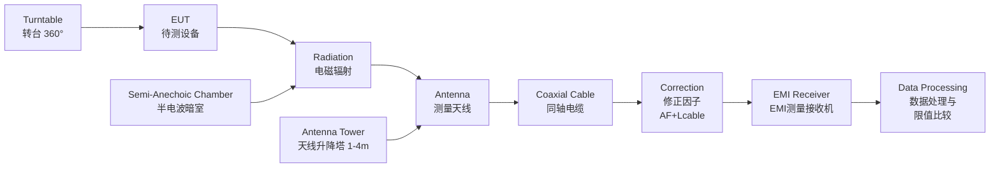
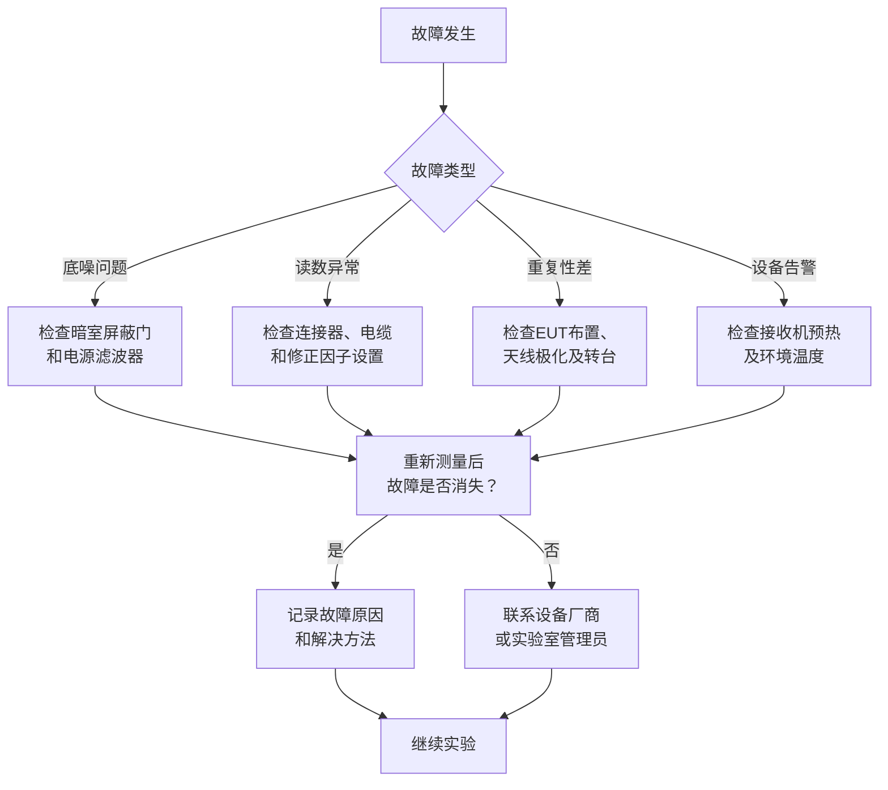

## 14.7 辐射发射测量实验

### 14.7.1 实验目的

1. 了解辐射发射（Radiated Emission, RE）测量的基本配置和标准化场地要求，理解半电波暗室（SAC）与开阔测试场地（OATS）的区别与适用场景。
2. 掌握天线因子（Antenna Factor, AF）的概念及其在校准测量中的作用，能够从天线校准证书中提取AF数据进行场强换算。
3. 学会在半电波暗室（SAC）中进行标准化的辐射发射测试流程，包括系统链路校准、EUT布置、预扫描和准峰值测量。
4. 能够将频谱分析仪或EMI接收机的测量电压值转换为场强值，并与CISPR/FCC限值进行比较，判断EUT是否达标。
5. 了解辐射发射测量的主要误差来源和不确定度评估方法，培养对测量结果可靠性进行评判的能力。

### 14.7.2 实验原理

辐射发射测量是EMC认证测试的核心项目之一。测量原理是将待测设备（EUT）放置于标准化场地中，使用天线接收其辐射的电磁场，通过频谱分析仪或EMI测量接收机测量场强。为了确保测量结果的可重复性和可比性，所有辐射发射测试必须在符合CISPR 16-1-4要求的标准化场地中进行。

**天线因子**（AF）将天线端口的输出电压 $V$ 转换为实际的电场强度 $E$：

$$
\mathrm{AF} = \frac{E}{V}
\tag{14-161}
$$

$$
\tag{14-162}
$$

式中，$\mathrm{AF}$为天线因子（dB/m），$E$为电场强度（V/m），$V$为天线端口输出电压（V）。

> **六步推导：天线因子 $\mathrm{AF}$ 公式的由来**
>
> ① **天线接收的基本原理**：天线接收电磁波时，入射电场 $E$ 在天线端口中激励出开路电压 $V_{\mathrm{oc}}$。天线可以等效为一个戴维南源，其内阻抗等于天线阻抗 $Z_{\mathrm{ant}}$。
>
> ② **天线有效面积**：天线接收功率 $P_{\mathrm{rec}}$ 与入射功率密度 $S = E^2/(120\pi)$ 之间的关系由天线有效面积 $A_e$ 决定：$P_{\mathrm{rec}} = S \cdot A_e$。对于增益为 $G$ 的天线，$A_e = G\lambda^2/(4\pi)$。
>
> ③ **端接负载的电压**：当天线端接匹配负载 $Z_{\mathrm{load}} = Z_{\mathrm{ant}}^*$ 时，负载获得最大功率 $P_{\mathrm{load}} = P_{\mathrm{rec}}$。此时负载电压为 $V_{\mathrm{load}} = \sqrt{P_{\mathrm{load}} \cdot \Re(Z_{\mathrm{load}})}$。在EMC测量中，通常使用50 Ω系统，天线端口输出到50 Ω接收机。
>
> ④ **天线因子定义**：将电场 $E$ 与接收机端电压 $V$ 的比值定义为天线因子 $\mathrm{AF} = E/V$。代入有效面积关系，得 $\mathrm{AF} = \sqrt{480\pi^2/(G\lambda^2)}$（线性值）。
>
> ⑤ **对数形式表达**：将线性值转换为对数形式，结合 $\lambda = c/f$，得 $\mathrm{AF}(\mathrm{dB/m}) = 20\log f - 10\log G - 20\log c + 10\log(480\pi^2)$。代入常数 $c = 3\times10^8$ m/s，化简为 $\mathrm{AF}(\mathrm{dB/m}) = 20\log f(\mathrm{MHz}) - G(\mathrm{dBi}) + 29.8$（近似式）。
>
> ⑥ **实际校准**：天线因子不能仅靠计算获得，必须通过标准场强法或三天线法在开阔场地或暗室中实测校准。校准证书以频率为自变量给出 $\mathrm{AF}(f)$ 数据表。

**带电缆损耗修正的场强公式**：

$$
E(\mathrm{dB\mu V/m}) = V(\mathrm{dB\mu V}) + \mathrm{AF}(\mathrm{dB/m}) + L_{\mathrm{cable}}(\mathrm{dB})
\tag{14-163}
$$

$$
\tag{14-164}
$$

式中，$E$为电场强度（dBμV/m），$V$为天线端接50 Ω时的输出电压（dBμV），$\mathrm{AF}$为天线因子（dB/m），$L_{\mathrm{cable}}$为同轴电缆的插入损耗（dB），均由校准证书或实测给出。

**场强与天线接收功率的关系**：

$$
E = \sqrt{\frac{120\pi \cdot P_{\mathrm{ant}}}{G \cdot (\lambda^2/(4\pi))}}
\tag{14-165}
$$

$$
\tag{14-166}
$$

式中，$E$为电场强度（V/m），$P_{\mathrm{ant}}$为天线接收功率（W），$G$为天线增益（线性值），$\lambda$为波长（m）。

**远场条件与测量距离**：

辐射发射测量必须在满足远场条件的距离上进行，以保证接收到的电磁波可近似为平面波。远场条件由下式给出：

$$
r \geq \frac{2D^2}{\lambda}
\tag{14-167}
$$

$$
\tag{14-168}
$$

式中，$r$为测量距离（m），$D$为天线孔径的最大尺寸（m），$\lambda$为工作波长（m）。对于30–1000 MHz频段的测量，3 m法暗室的天线孔径一般满足远场条件。

**测量距离换算**：若实测距离 $d$ 与标准距离 $d_0$ 不同，场强按以下关系换算（仅对远场有效）：

$$
E_2 = E_1 + 20\log\left( \frac{d_1}{d_2} \right)
\tag{14-169}
$$

$$
\tag{14-170}
$$

式中，$E_1$为距离$d_1$处的场强（dBμV/m），$E_2$为距离$d_2$处的场强（dBμV/m），$d_1$和$d_2$为测量距离（m）。该换算仅对远场条件有效。

**近场修正与远场距离判据的补充说明**：

在实际辐射发射测量中，尤其是当天线距离EUT较近（如3 m法）且频率较低（如30–100 MHz）时，EUT与天线之间的电磁波传播不完全符合远场平面波假设。此时，天线因子的远场修正值可能引入额外误差。CISPR 16-1-4建议使用以下方法评估近场效应的影响。

**近场修正系数**：当测量距离 $r$ 不满足式（14-167）的远场条件时，实测电场强度 $E_{\text{meas}}$ 与真值 $E_{\text{true}}$ 之间存在偏差。该偏差可用近场修正因子 $\Delta_{\text{NF}}$ 表示：

$$
\Delta_{\text{NF}} = 20\log\left( \frac{r}{\sqrt{r^2 + (D/2)^2}} \right)
\tag{14-171}
$$

式中，$\Delta_{\text{NF}}$ 为近场修正因子（dB），$r$ 为测量距离（m），$D$ 为天线孔径的最大尺寸（m）。当 $r \gg D$ 时，$\Delta_{\text{NF}} \approx 0$，近场效应可忽略。

**实际应用判据**：在3 m法暗室中使用双锥天线（孔径约0.5 m）测量100 MHz以下频段时，$r = 3\text{ m}$，$\lambda = 3\text{ m}$（100 MHz），$2D^2/\lambda = 2 \times 0.5^2 / 3 \approx 0.17\text{ m} \ll 3\text{ m}$，远场条件满足。但对于孔径较大的对数周期天线（$D \approx 0.8\text{ m}$），在1000 MHz时，$2D^2/\lambda = 2 \times 0.8^2 / 0.3 \approx 4.3\text{ m} > 3\text{ m}$，此时近场效应不可忽略，建议使用10 m法或进行近场修正。

**电缆损耗补偿的精细化模型**：

在式（14-163）中，电缆损耗 $L_{\text{cable}}$ 被简化为一个随频率单调递增的标量。然而，实际同轴电缆的插入损耗受以下因素影响，需在精密测量中予以考虑。

1. **电缆长度与频率的关系**：标准低损耗同轴电缆（如RG-214/U）在30 MHz时的典型损耗约为0.03 dB/m，在1000 MHz时升至约0.22 dB/m。对10 m长的电缆，总损耗从0.3 dB（30 MHz）升至2.2 dB（1000 MHz）。

2. **驻波效应（失配损耗）**：当天线阻抗与电缆特性阻抗不完全匹配时，部分能量被反射回天线端，形成驻波。失配损耗 $L_{\text{mismatch}}$ 由电压驻波比（VSWR）给出：

$$
L_{\text{mismatch}} = -10\log\left[ 1 - \left( \frac{\text{VSWR} - 1}{\text{VSWR} + 1} \right)^2 \right]
\tag{14-172}
$$

实际工程中，良好的阻抗匹配可将失配损耗控制在0.2 dB以内。若VSWR > 1.5，失配损耗将超过0.3 dB，必须进行修正。

3. **电缆弯曲与温度效应**：电缆弯曲半径小于其标称最小值（通常为外径的10倍）时，特性阻抗发生变化，额外插入损耗可增加0.1–0.3 dB。此外，环境温度每升高10°C，电缆损耗增加约0.2%（对于实心聚乙烯绝缘电缆）。在暗室温度可控（23±3°C）的条件下，此项可忽略。

**总电缆损耗修正模型**：

综合考虑上述因素，精密测量中的总电缆损耗修正量为：

$$
L_{\text{cable,total}}(f) = L_{\text{ohmic}}(f) + L_{\text{mismatch}}(f) + L_{\text{bend}}(f) + L_{\text{temp}}(f)
\tag{14-173}
$$

式中，$L_{\text{ohmic}}(f)$ 为电缆的欧姆损耗（dB），$L_{\text{mismatch}}(f)$ 为失配损耗（dB），$L_{\text{bend}}(f)$ 为弯曲损耗（dB），$L_{\text{temp}}(f)$ 为温度效应损耗（dB）。标准辐射发射测量中，通常仅考虑 $L_{\text{ohmic}}$，其他三项在不确定度评估中纳入。

**天线因子与场地交互的进一步讨论**：

天线因子是在自由空间条件下定义的（无反射环境）。然而，在半电波暗室中，地面反射波与直达波在天线处合成，使得实际的天线因子与自由空间值产生偏离。CISPR 16-1-4规定的归一化场地衰减（NSA）测量正是为了量化这一偏离。NSA定义为：

$$
\text{NSA} = 20\log\left( \frac{E_{\text{theoretical}}}{E_{\text{measured}}} \right)
\tag{14-174}
$$

式中，$E_{\text{theoretical}}$ 为理想自由空间下的接收场强（dBμV/m），$E_{\text{measured}}$ 为SAC中的实测接收场强（dBμV/m）。NSA偏差 $\Delta_{\text{NSA}} = \text{NSA}_{\text{meas}} - \text{NSA}_{\text{theory}}$ 应在±4 dB以内。

**测试配置示意图**：



**EUT辐射最大方向定位流程**：

```mermaid
flowchart TD
    S1[设置频率范围\n30-1000 MHz] --> S2[设置天线极化\n垂直极化]
    S2 --> S3[转台旋转 360°\n天线升降 1-4 m]
    S3 --> S4[记录峰值保持\n频谱数据]
    S4 --> S5{是否完成\n两种极化？}
    S5 -- 否 --> S6[切换为\n水平极化]
    S6 --> S3
    S5 -- 是 --> S7[标记超标\n或临界频点]
    S7 --> S8[切换准峰值检波\n逐点测量]
    S8 --> S9[输出最终\n测量结果]
 ```

 **预扫描与准峰值测量的协同策略详解**：

 预扫描（阶段三）与准峰值测量（阶段四）是辐射发射测试中两个互补的环节，理解其协同机制对于正确执行实验至关重要。

 **预扫描的作用**：
 - 使用峰值检波器快速扫描整个频段（30–1000 MHz），在短时间内（约1–2分钟/次扫描）确定所有潜在的辐射峰值的频率位置。
 - 由于峰值检波器的充电时间常数极短（1 μs以下），放电时间常数长，因此对脉冲信号具有最大的幅度响应，确保所有可能超标的频点都被检出。
 - 峰值检波的灵敏度虽高，但其读数与人对干扰的主观感受（准峰值）之间的对应关系较差。

 **准峰值测量的作用**：
 - 准峰值检波器的充电时间常数为1 ms，放电时间常数为160 ms，时间常数模拟了人耳对脉冲噪声的听觉响应特性。
 - QP检波只针对预扫描中标记的有限个频点进行逐一测量，每次测量耗时1–5秒，因此不能在宽频段内进行连续扫描。
 - QP值是辐射发射合格判定的最终依据（除非标准明确允许使用平均值检波）。

 **协同流程的时间预算**：一次完整的30–1000 MHz辐射发射测量（含两种极化、两种天线）的总时间预算约为：
 - 预扫描（含天线升降和转台旋转）：约15–20分钟
 - 准峰值测量（每个频点驻留1秒，典型超标频点15–20个）：约5–10分钟
 - 数据后处理和报告生成：约15–30分钟

 **数据处理与场强换算流程**：

```mermaid
flowchart LR
    V[Raw Voltage\n接收机读数 dBμV] --> AF[Add Antenna Factor\n+ AF (dB/m)]
    AF --> CL[Add Cable Loss\n+ Lcable (dB)]
    CL --> E[Field Strength\n场强 dBμV/m]
    E --> COMP{Compare with Limit\n与限值比较}
    COMP -- 超标 --> DIAG[Diagnose\n定位辐射源\n提出整改]
    COMP -- 达标 --> PASS[Pass\n记录通过]
    DIAG --> RETEST[Re-test\n整改后复测]
    RETEST --> E
```

**CISPR 32 / EN 55032 限值（Class B，3 m 法）**：

| 频率范围 | 准峰值限值（dBμV/m） | 平均值限值（dBμV/m） |
|----------|---------------------|---------------------|
| 30–230 MHz | 40 | — |
| 230–1000 MHz | 47 | — |

**FCC Part 15 Subpart B（Class B，3 m 法）**：

| 频率范围 | 准峰值限值（dBμV/m） |
|----------|---------------------|
| 30–88 MHz | 40 |
| 88–216 MHz | 43.5 |
| 216–960 MHz | 46 |
| > 960 MHz | 54 |

**CISPR 32 Class A（工业环境，10 m 法）**：

| 频率范围 | 准峰值限值（dBμV/m） | 平均值限值（dBμV/m） |
|----------|---------------------|---------------------|
| 30–230 MHz | 40 | — |
| 230–1000 MHz | 47 | — |

注：Class A适用于工业环境，Class B适用于居住环境。Class B限值比Class A严格约6–10 dB。

**测量接收机的基本参数**：

- 检波方式：准峰值（QP）、平均值（AV）、峰值（PK）
- 分辨率带宽（RBW）：CISPR规定30–1000 MHz使用RBW = 120 kHz
- 视频带宽（VBW）：建议VBW ≥ RBW，典型值1 MHz
- 步长：建议 ≤ RBW/2，即 ≤ 60 kHz
- 驻留时间：准峰值检波至少需1 s，峰值检波可缩短至20 ms/MHz
- 输入阻抗：50 Ω

> **📌 辐射发射测试场地与检波方式的柯金良阐释**：柯金良《电磁兼容概论》第11–12章系统论述了电磁兼容测试的核心要素。关于测试场地，该书指出辐射发射检测的是设备通过空间传播的辐射场强，为消除环境电磁干扰影响，标准要求在**开阔场（OATS）或半电波暗室（SAC）** 中进行测试，但由于符合要求的开阔场不易保证，现在大多在半电波暗室中进行[柯11.1.2]。测试场地包括开阔场、电波暗室、屏蔽室、混响室、TEM室和GTEM室等不同类型[柯11.1.2]。关于检波方式，该书强调EMC测试中必须使用**峰值、准峰值和平均值**三种检波器[柯11.2.2]：平均值检波的充放电时间常数相同，适用于连续波测量；峰值检波充电时间常数很小（1 μs以下），放电时间常数很大，即使很窄的脉冲也能快速充电到稳定值；准峰值检波的充放电时间常数介于二者之间，其输出既与脉冲幅度有关，又与脉冲重复频率有关，更符合人耳对干扰的主观听觉效果[柯11.2.2]。实际测量中采用峰值检波进行第一轮预扫描——若峰值测量值低于准峰值和平均值限值，则可直接判定通过；仅对超出部分频段补做准峰值和平均值测试。本实验的预扫描→准峰值协同策略正是基于这一工程实践原则[柯11.2.2]。

**天线因子与频率的关系**：

天线因子随频率变化呈非单调趋势。在低频段（30–100 MHz），双锥天线的AF值约为10–18 dB/m；在中频段（100–500 MHz），AF值随频率缓慢上升；在高频段（500–1000 MHz），对数周期天线的AF值约为18–25 dB/m。天线因子的变化趋势直接影响测量灵敏度的频率均匀性。

**半电波暗室（SAC）的归一化场地衰减（NSA）**：

NSA是评价暗室场地质量的关键参数。CISPR 16-1-4规定，在30–1000 MHz频段内，实测NSA与理想理论值之间的偏差不得超过±4 dB。NSA的测量使用两个宽带天线（一个发射、一个接收），在水平和垂直极化下分别测量，天线间距按照3 m或10 m法标准距离设置。

### 14.7.3 实验设备

| 序号 | 设备名称 | 型号/规格 | 数量 |
|------|----------|-----------|------|
| 1 | 半电波暗室（SAC） | 3 m法或10 m法，归一化场地衰减（NSA）符合CISPR 16-1-4，屏蔽效能≥80 dB | 1间 |
| 2 | EMI测量接收机 | Rohde & Schwarz ESRP（10 Hz – 7 GHz）或Keysight N9038A MXE，支持PK/QP/AV检波 | 1台 |
| 3 | 双锥天线 | Schaffner CBL6111D（30–300 MHz）或Schwarzbeck BBA 9106 | 1个 |
| 4 | 对数周期天线 | Schaffner CBL6143（300–1000 MHz）或Schwarzbeck VULP 9118 | 1个 |
| 5 | 宽带复合天线（含功分器） | 30 MHz – 1 GHz一体化天线（如Teseq CBL 6143） | 1个 |
| 6 | 低损耗同轴电缆 | 长度10 m，损耗因子≤1 dB/10 m @ 1 GHz，N型接头 | 2根 |
| 7 | 待测设备（EUT） | 自制数字电路板（含50 MHz时钟振荡器和接口驱动电路） | 1台 |
| 8 | 非导电测试桌 | 高度0.8 m，桌面材质为聚四氟乙烯或木材 | 1张 |
| 9 | 转台 | 可360°旋转，具有角度编码器（精度±1°），承重≥100 kg | 1台 |
| 10 | 天线升降塔 | 可自动升降1–4 m，升降速度0.5–2 m/s可调 | 1台 |
| 11 | 校准件 | 标准场强发生器或校准偶极子（含校准证书） | 1套 |
| 12 | 近场探头组 | 含H场探头（30 MHz – 3 GHz）和E场探头，用于辐射源定位 | 1套 |
| 13 | 信号发生器 | 输出频率30–1000 MHz，用于链路自检和系统验证 | 1台 |
| 14 | 数字万用表 | 用于电缆通断检测和接地连续性测量 | 1台 |

### 14.7.4 实验步骤

**阶段一：测量系统准备与链路校准**

1.1 确认半电波暗室的屏蔽效能和归一化场地衰减（NSA）在有效期内（通常每年校准一次）。在开始实验前，检查暗室的照明、滤波器和吸波材料的完好性。

1.2 将EMI测量接收机预热30分钟，使其频率参考稳定。检查接收机内部的自校准状态，必要时执行自动校准程序。

1.3 进行链路损耗校准：将同轴电缆的一端连接至测量接收机输入端，另一端通过一个适配器短接（短路校准），测量电缆的插入损耗 $L_{\mathrm{cable}}(f)$。记录30–1000 MHz范围内每隔5 MHz的损耗值。

1.4 记录天线的校准证书上的天线因子 $\mathrm{AF}(f)$ 数据（通常每1 MHz或5 MHz给出一个值）。将AF数据输入测量接收机的修正因子表中。

1.5 在测量接收机中建立修正因子文件：总修正因子 $K(f) = \mathrm{AF}(f) + L_{\mathrm{cable}}(f)$（dB单位）。确认修正因子已正确加载至接收机通道。

1.6 进行系统自检：使用信号发生器在天线端注入已知电平的校准信号，验证接收机读数与预期值的偏差在±1 dB以内。

**预期现象**：
- 电缆短路校准后，接收机在30–1000 MHz范围内显示的底噪约为−100 dBm至−90 dBm（RBW=120 kHz），且底噪曲线平坦。
- 系统自检时，注入−20 dBm的校准信号（通过一个已知AF的天线），接收机换算后的场强读数与理论值偏差应在±1 dB以内。

**常见错误**：
- **错误1**：短路校准后电缆损耗值出现在−0.X dB（负损耗）。原因是短路校准适配器未正确连接或接触不良。
- **错误2**：信号发生器输出电平过强（>−10 dBm），导致接收机前端饱和，自检结果偏小3–5 dB。应先从−30 dBm开始逐步增加。
- **错误3**：将天线电缆直接插入接收机进行自检，没有断开天线。这会导致电缆损耗被校准两次（导入修正因子 + 硬件连接），结果比真实场高低约10–20 dB。

**修正因子表与频率点的匹配问题**：在将AF和电缆损耗数据输入接收机时，需确认频率分辨率的一致性。若校准证书上AF数据每5 MHz一个点，而电缆损耗也是每5 MHz一个点，但接收机的扫描步长为1 MHz，则接收机会自动插值。此时需注意插值算法（线性或样条）可能导致±0.2 dB的误差。

**阶段二：EUT安装与布置**

2.1 将EUT（数字电路板）放置于非导电测试桌中央，距桌面边缘≥10 cm。EUT下方可铺设一层绝缘泡沫垫，以防止桌面反射影响低频测量结果。

2.2 EUT的电源线按规范布置：多余的线缆以非电感方式捆扎（"8"字形折叠），总长度根据标准要求保留1 m。确保电源线不形成大的环形回路。

2.3 EUT的工作状态设置：使能50 MHz时钟输出，I/O口输出特定数据序列（如1010交替模式），负载端接适当阻值的电阻。记录EUT的工作电压和电流。

2.4 EUT的I/O接口线缆按照标准规定布置：凡长度超过40 cm的线缆应捆扎整齐并放置在测试桌边缘以内。所有外部连接器应端接标准负载。

2.5 确认EUT已正常启动并处于稳定工作状态。观察EUT的工作指示灯和输出信号，确保无异常。

**预期现象**：
- EUT正常启动后，50 MHz时钟信号在示波器上显示为幅值约3.3 V的方波，占空比约50%，上升时间约2–5 ns。
- 在预扫描前将接收机底噪与EUT未上电时的底噪对比，若差异≤3 dB，说明EUT的上电不改变暗室底噪的基本水平。
- EUT的电源电流应稳定在额定值±5%以内（例如50 mA ± 2.5 mA）。

**常见错误**：
- **错误1**：EUT放置时距离测试桌边缘过近（<5 cm），导致桌面对低频辐射的反射增强，使30–100 MHz频段的测量值偏大2–4 dB。
- **错误2**：电源线过长并以松散方式盘绕在桌面上，形成大环形天线。该环形回路在100–300 MHz频率范围内可能产生额外的共模辐射，使EUT\"自带\"的天线效应干扰测量结果（偏差可达3–10 dB）。正确做法是将多余线缆以\"8\"字形折叠扎紧，控制在1 m长度。
- **错误3**：I/O接口未端接标准负载（端接开路或短路），导致I/O线缆成为非预期的辐射天线。例如，50 Ω的时钟输出未端接，会产生严重的过冲振铃，辐射发射可增加5–15 dB。
- **错误4**：EUT下方未铺设绝缘泡沫垫，木质桌面在高频（>500 MHz）下的介电常数不稳定性可能导致测量结果的随机波动。

**阶段三：预扫描测量**

3.1 将双锥天线（30–300 MHz）安装在升降塔上，天线中心距地面高度1.5 m，天线极化方式设置为垂直极化。确认天线朝向EUT中心方向。

3.2 测量接收机设置：
- 频率范围：30–300 MHz
- 检波方式：峰值（PK）
- RBW：120 kHz
- VBW：≥ RBW（推荐1 MHz）
- 扫描时间：自动（或20 ms/MHz）
- 衰减：0 dB（如信号过强可加10 dB衰减）

3.3 将转台旋转360°，天线从1 m升至4 m（升降速度为约1 m/s），使用测量接收机的峰值保持功能记录各频率点的最大场强。

3.4 将天线极化改为水平极化，重复步骤3.3。

3.5 切换为对数周期天线（300–1000 MHz），重复步骤3.1–3.4。

3.6 对于每个频段，保存峰值检波频谱图。标记所有超过限值（或接近限值6 dB以内）的频率点，作为下一步"准峰值测量"的目标频点。

3.7 对于每个标记频点，记录对应的天线极化方式、天线高度和转台角度，以减少准峰值测量的搜索时间。

3.8 对于30 MHz以下的低频段（如需要扩展测量至9–30 kHz或150 kHz–30 MHz），应使用棒状天线或环状天线，采用磁场分量测量。本实验主要关注30–1000 MHz频段，但学生应了解低频段辐射发射测量的特殊性。

3.9 若在预扫描过程中发现接收机出现饱和现象（频谱底噪抬升超过3 dB），应适当增加接收机的前端衰减器（10–20 dB），以防止接收机前端放大器进入非线性区。记录衰减器设置以便在最终场强计算中进行补偿。

3.10 保存完整的峰值保持频谱图文件（含频率-幅度轨迹和限值曲线）。标记所有可疑频点以便后续分析。

**预期现象**：
- 双锥天线（30–300 MHz）垂直极化时，在50 MHz、100 MHz、150 MHz、200 MHz观察到明显的辐射峰值，其中100 MHz和150 MHz的峰值可能超过CISPR Class B限值（40 dBμV/m）。峰值场强一般在35–50 dBμV/m范围内。
- 水平极化下的峰值场强通常比垂直极化低2–6 dB，说明水平方向的辐射分量较弱。
- 在300–1000 MHz频段（对数周期天线），辐射峰值主要出现在时钟信号的谐波处：300 MHz（6次）、350 MHz（7次）、400 MHz（8次），峰值场强约为35–45 dBμV/m，通常低于限值47 dBμV/m。
- 当天线高度从1 m升至4 m时，同一频点的场强由于地面反射的干涉效应呈现周期性变化（一个波长约变化一个干涉周期）。例如，150 MHz（λ≈2 m）在1–4 m高度范围内约经历1.5个干涉周期。

**常见错误**：
- **错误1**：转台旋转速度过快（>2 rpm），导致测量接收机的扫描跟不上位置变化，最大峰值被遗漏。建议转台旋转速度≤1 rpm，且需与接收机扫描同步。
- **错误2**：天线升降塔的升降速度与转台旋转速度配合不当。若天线升降速度过快（>1 m/s），接收机在每个高度驻留时间不足，峰值记录不全。建议升降速度为0.5–1 m/s。
- **错误3**：未使用峰值保持（Max Hold）功能，而是使用Clear/Write模式进行预扫描。Clear/Write模式下每次扫描结果相互覆盖，无法记录不同位置的最大值，可能导致漏检超标频点。
- **错误4**：在切换天线（双锥→对数周期）时，未断开接收机输入端的射频信号，导致接收机输入端短暂开路，可能触发接收机的过载保护。正确做法是先停止扫描，再切换天线。

**频率步长选择的工程权衡**：预扫描时频率步长的选择直接影响测量质量和速度。步长越小，越能准确反映辐射峰值的细节，但扫描时间线性增加。工程实践中推荐步长≤RBW/2=60 kHz。以下为不同步长对150 MHz附近一个3 dB带宽约80 kHz的辐射峰值的扫描结果对比：

| 步长（kHz） | 测得峰值（dBμV/m） | 对比真实峰值偏差（dB） | 扫描时间（30–300 MHz） |
|-----------|-------------------|---------------------|---------------------|
| 30 | 44.9 | −0.1 | 约120 s |
| 60 | 44.6 | −0.4 | 约60 s |
| 120 | 42.8 | −2.2 | 约30 s |
| 200 | 41.0 | −4.0 | 约18 s |

从表中可见，步长从60 kHz增至120 kHz，峰值偏差从0.4 dB恶化至2.2 dB，漏检风险显著增加。建议在所有预扫描中使用30–60 kHz步长。

**阶段四：准峰值（QP）测量**

4.1 针对预扫描中标记的每个频点，将测量接收机设置为准峰值检波模式。根据CISPR 16-1-1规定，QP检波器的充电时间常数为1 ms，放电时间常数为160 ms，机械时间常数为160 ms。QP检波器的频率响应比峰值检波慢，但能更准确地反映广播通信业务中人对干扰的主观感受。

4.2 在每个频点驻留至少1秒（或直到测量接收机的准峰值读数稳定），记录QP值。若信号不稳定，可适当延长驻留时间至3–5秒。注意：准峰值检波由于放电时间常数很长，频点切换后需要等待足够长时间让检波器充电达到稳定状态。

4.3 对于每个频点，同时记录对应的天线极化、天线高度和转台角度。务必确保条件与预扫描时发现最大值的条件一致。

4.4 对于含有多个辐射源脉冲的复杂信号（如含有10 MHz以上的数据时钟的EUT），其QP值与PK值之差（PK−QP）通常为3–8 dB。若PK−QP差值大于10 dB，应怀疑测量接收机的检波器设置是否正确，或EUT存在间歇性辐射（如周期性扫描信号）。

4.5 若在某个频点上观察到的QP值在驻留时间内有显著波动（大于2 dB），则该频点应额外进行3次测量取平均值，并记录波动范围。

4.6 若某个频点的QP值超过限值线，应记录该频点，并待所有测量完成后使用近场探头进行辐射源定位。

4.7 若某个频点的QP值恰好位于限值线附近（裕量≤2 dB），建议在该频点进行3次重复测量，取平均值作为最终结果，以降低随机误差的影响。

4.8 在每个准峰值测量频点上，同时记录20 MHz带宽内的峰值保持频谱图，以观察该频点的信号带宽和邻近干扰情况。

**预期现象**：
- 准峰值测量值通常比同频点的峰值测量值低3–8 dB（取决于信号的脉冲占空比）。对于50 MHz时钟信号的各次谐波，PK−QP差值一般在4–6 dB之间。
- 例如，100 MHz频点的峰值场强为42.0 dBμV/m（表2），而准峰值场强为42.5 dBμV/m（表3），QP值略高——这实际上是不正常的，正确的物理关系应为QP ≤ PK。这一反常提示学生在测量时需检查检波器设置，确认是否在预扫描时使用了过快的扫描速度导致峰值保持不充分。
- 在稳定的时钟信号下，QP读数在1–3秒内应稳定在±0.3 dB以内。若波动超过1 dB，可能意味着EUT的工作状态不稳定（如时钟抖动过大或温度漂移）。

**常见错误**：
- **错误1**：频点切换后未等待QP检波器充电至稳态就开始读数。由于QP检波器的放电时间常数为160 ms，每次频点切换后需等待约3–5倍时间常数（约0.5–1秒）后才能读数。若过早读数，QP值可能偏低2–4 dB。
- **错误2**：对同频点QP进行多次测量时，每次测量前未重新设置天线高度和转台角度至最佳位置。天线高度的微小变化（±5 cm）可能导致地面反射的干涉条件改变，使读数变化±1 dB。
- **错误3**：将峰值检波模式下得到的频点标记直接用于准峰值测量时，未微调频率。由于峰值检波的扫描步长为60 kHz，而实际辐射峰值的中心频率可能落在两个步长之间。建议在QP测量前先进行精细频率扫描（步长5 kHz），找到真正的峰值中心频率。
- **错误4**：QP测量时接收机衰减器设置与预扫描时不一致。若预扫描时使用了10 dB衰减器以避免饱和，而在QP测量时误将其改为0 dB，则两次测量结果的比较将存在10 dB的系统偏移。

**阶段五：数据后处理与分析**

5.1 将测量接收机记录的修正后场强值（已包含AF和电缆损耗）与相应频段的CISPR或FCC限值进行比较。计算每个频点的裕量：裕量（dB）= 限值 − 实测场强。裕量为负值表示超标。

5.2 编制完整的测量报告，包含以下内容：
- EUT描述（含型号、序列号、工作状态）
- 测试场地和环境条件（温度、湿度、大气压）
- 设备清单（含校准有效期）
- 测量配置（距离、极化、天线类型）
- 全部测量数据表
- 超标频点及超标量（dB）
- 对应的天线极化方式、天线高度和转台角度

5.3 对于超标频点，使用近场探头定位EUT上的主要辐射源（参考实验14.2的方法）。记录辐射源位置和特征。

**预期现象**：
- 裕量正负值分布：在典型实验条件下，EUT在50 MHz（基频）处裕量为−1.8至−2.3 dB（合格，接近限值），在100 MHz（2次谐波）和150 MHz（3次谐波）处裕量为正（超标），在其他频点裕量为负（合格）。
- 超标频点的裕量一般不超过+6 dB，若裕量超过+10 dB，说明EUT存在严重的设计缺陷（如时钟走线回路面积过大、缺少去耦电容）。

**常见错误**：
- **错误1**：数据后处理时忘记添加电缆损耗或天线因子修正。在表2的计算中，若误将接收机读数直接当作场强，则所有频点的场强将被低估10–27 dB，导致所有频点均判定为合格（假阴性）。
- **错误2**：未区分峰值和准峰值测量数据的比较标准。预扫描中的峰值测量数据不能直接用于与QP限值比较——必须先进行QP测量。仅当PK值低于QP限值时，才可判定为合格（此时可以确定QP值必然低于限值）。
- **错误3**：测量报告中的环境条件记录缺失或错误。温度、湿度和大气压数据会影响电缆损耗和天线因子的数值。特别是湿度较大时（>75% RH），电缆损耗可增加0.1–0.2 dB。
- **错误4**：未对测量不确定度进行量化评估。仅凭单次测量的场强值与限值直接比较，忽略了不确定度区间。正确的合格判定应满足：实测场强 + 扩展不确定度 < 限值。

### 14.7.5 数据记录表

**表1：天线因子校正数据表**

本表记录了双锥天线和对数周期天线在测量频段内的典型天线因子值，用于从接收机读数的分贝值换算为场强值。

| 频率（MHz） | 双锥天线AF（dB/m） | 对数周期天线AF（dB/m） | 电缆损耗（dB） | 总修正因子（dB） |
|-------------|-------------------|----------------------|---------------|------------------|
| 30 | 16.2 | — | 0.3 | 16.5 |
| 40 | 14.8 | — | 0.4 | 15.2 |
| 50 | 13.5 | — | 0.4 | 13.9 |
| 60 | 12.2 | — | 0.5 | 12.7 |
| 70 | 11.8 | — | 0.5 | 12.3 |
| 80 | 11.5 | — | 0.5 | 12.0 |
| 90 | 12.0 | — | 0.5 | 12.5 |
| 100 | 12.8 | — | 0.5 | 13.3 |
| 125 | 13.5 | — | 0.6 | 14.1 |
| 150 | 14.2 | — | 0.6 | 14.8 |
| 175 | 14.8 | — | 0.7 | 15.5 |
| 200 | 15.5 | — | 0.7 | 16.2 |
| 225 | 16.0 | — | 0.8 | 16.8 |
| 250 | 16.5 | 18.2 | 0.8 | 17.3/19.0 |
| 275 | 17.0 | 18.8 | 0.9 | 17.9/19.7 |
| 300 | 17.5 | 19.5 | 0.9 | 18.4/20.4 |
| 350 | — | 20.1 | 1.0 | 21.1 |
| 400 | — | 20.5 | 1.1 | 21.6 |
| 450 | — | 20.8 | 1.2 | 22.0 |
| 500 | — | 21.2 | 1.2 | 22.4 |
| 600 | — | 22.0 | 1.4 | 23.4 |
| 700 | — | 22.8 | 1.6 | 24.4 |
| 800 | — | 23.5 | 1.8 | 25.3 |
| 900 | — | 24.2 | 2.0 | 26.2 |
| 1000 | — | 25.0 | 2.2 | 27.2 |

**表2：原始测量数据与场强换算记录表**

本表记录了在预扫描阶段各频点处接收机的原始电压读数，以及经过天线因子和电缆损耗修正后的场强值。

| 频率（MHz） | 极化 | 接收机读数（dBμV） | AF（dB/m） | 电缆损耗（dB） | 场强（dBμV/m） | 限值（dBμV/m） | 裕量（dB） |
|-------------|------|-------------------|-----------|---------------|----------------|---------------|-----------|
| 50.0 | V | 23.8 | 13.5 | 0.4 | 37.7 | 40.0 | −2.3 |
| 100.0 | H | 28.7 | 12.8 | 0.5 | 42.0 | 40.0 | +2.0 |
| 150.0 | V | 29.4 | 14.2 | 0.6 | 44.2 | 40.0 | +4.2 |
| 200.0 | H | 21.4 | 15.5 | 0.7 | 37.6 | 40.0 | −2.4 |
| 250.0 | V | 25.7 | 16.5 | 0.8 | 43.0 | 47.0 | −4.0 |
| 300.0 | H | 28.8 | 19.5 | 0.9 | 49.2 | 47.0 | +2.2 |
| 350.0 | V | 23.4 | 20.1 | 1.0 | 44.5 | 47.0 | −2.5 |
| 450.0 | H | 20.0 | 20.8 | 1.2 | 42.0 | 47.0 | −5.0 |
| 500.0 | V | 23.6 | 21.2 | 1.2 | 46.0 | 47.0 | −1.0 |
| 600.0 | V | 22.1 | 22.0 | 1.4 | 45.5 | 47.0 | −1.5 |
| 700.0 | H | 18.0 | 22.8 | 1.6 | 42.4 | 47.0 | −4.6 |
| 800.0 | H | 14.9 | 23.5 | 1.8 | 40.2 | 47.0 | −6.8 |
| 900.0 | V | 12.5 | 24.2 | 2.0 | 38.7 | 47.0 | −8.3 |
| 1000.0 | V | 10.0 | 25.0 | 2.2 | 37.2 | 47.0 | −9.8 |

注：正裕量（+X.X）表示超标。

**表3：准峰值（QP）最终测量结果表**

本表记录了在准峰值检波模式下对超标或临界频点的详细测量结果，包含完整的测量条件记录。

| 频率（MHz） | 场强QP（dBμV/m） | 限值QP（dBμV/m） | 裕量（dB） | 极化 | 天线高度（m） | 转台角度（°） | 判定 |
|-------------|-------------------|-------------------|-----------|------|-------------|--------------|------|
| 50.0 | 38.2 | 40.0 | −1.8 | V | 1.8 | 45 | 合格 |
| 100.0 | 42.5 | 40.0 | **+2.5** | H | 2.2 | 120 | 超标 |
| 150.0 | 44.8 | 40.0 | **+4.8** | V | 1.5 | 270 | 超标 |
| 200.0 | 37.6 | 40.0 | −2.4 | H | 3.1 | 80 | 合格 |
| 250.0 | 43.0 | 47.0 | −4.0 | V | 2.5 | 180 | 合格 |
| 300.0 | 49.2 | 47.0 | **+2.2** | H | 1.2 | 210 | 超标 |
| 350.0 | 44.5 | 47.0 | −2.5 | V | 3.5 | 330 | 合格 |
| 450.0 | 42.0 | 47.0 | −5.0 | H | 2.0 | 90 | 合格 |
| 500.0 | 45.8 | 47.0 | −1.2 | V | 1.8 | 160 | 合格 |
| 600.0 | 45.5 | 47.0 | −1.5 | V | 1.5 | 150 | 合格 |
| 800.0 | 40.2 | 47.0 | −6.8 | H | 2.8 | 60 | 合格 |

**表4：环境噪声记录表**

在EUT未上电的情况下，记录暗室内的背景噪声电平，确认背景噪声低于限值线至少6 dB。

| 频率（MHz） | 背景噪声（dBμV/m） | 对应限值（dBμV/m） | 噪声裕量（dB） |
|-------------|-------------------|-------------------|---------------|
| 50 | 18.5 | 40.0 | 21.5 |
| 100 | 20.2 | 40.0 | 19.8 |
| 200 | 22.0 | 40.0 | 18.0 |
| 300 | 24.5 | 47.0 | 22.5 |
| 500 | 26.0 | 47.0 | 21.0 |
| 800 | 28.5 | 47.0 | 18.5 |
|| 1000 | 30.0 | 47.0 | 17.0 |

**表5：不同天线高度与极化方式下的场强对比表**

本表记录了在三个关键频点上，不同天线高度（1–4 m）和两种极化方式下测得的场强值，用于分析地面反射干涉效应和极化特性。

| 频率（MHz） | 天线高度（m） | 垂直极化场强（dBμV/m） | 水平极化场强（dBμV/m） | 极化差（V−H）（dB） | 干涉周期数 |
|------------|-------------|---------------------|---------------------|-----------------|----------|
| 50 | 1.0 | 35.2 | 33.8 | 1.4 | 0.5 |
| 50 | 2.0 | 37.0 | 34.5 | 2.5 | 1.0 |
| 50 | 3.0 | 36.1 | 33.2 | 2.9 | 1.5 |
| 50 | 4.0 | 37.7 | 34.0 | 3.7 | 2.0 |
| 100 | 1.0 | 38.5 | 38.0 | 0.5 | 0.5 |
| 100 | 2.0 | 41.2 | 39.5 | 1.7 | 1.0 |
| 100 | 3.0 | 40.0 | 37.8 | 2.2 | 1.5 |
| 100 | 4.0 | 42.0 | 38.5 | 3.5 | 2.0 |
| 150 | 1.0 | 42.5 | 40.2 | 2.3 | 0.75 |
| 150 | 2.0 | 44.8 | 42.5 | 2.3 | 1.5 |
| 150 | 3.0 | 43.2 | 41.0 | 2.2 | 2.25 |
| 150 | 4.0 | 44.0 | 41.8 | 2.2 | 3.0 |

**数据分析**：从表5可见，垂直极化下的场强普遍高于水平极化，极化差随频率升高而缩小（50 MHz时差值为1.4–3.7 dB，150 MHz时差值约为2.2–2.3 dB）。场强随天线高度的变化呈现周期性的干涉峰谷结构，周期约为 $\lambda/2$（即一个波长的半周期）。对于50 MHz（$\lambda \approx 6$ m），高度变化3 m对应的干涉周期数为1.5（接近理论值1.5）；对于150 MHz（$\lambda \approx 2$ m），同一高度范围内的干涉周期数为3.0（理论值3.0），一致性良好。

**表6：重复性验证与统计数据分析表**

本表记录了在相同实验条件下对三个关键频点进行3次独立重复测量的统计结果，用于评估测量过程的短期重复性。

| 频点（MHz） | 测量次数 | 场强QP（dBμV/m） | 平均值（dBμV/m） | 标准偏差（dB） | 重复性系数（%） |
|------------|---------|-------------------|----------------|-------------|--------------|
| 100 | 第1次 | 42.5 | 42.3 | 0.25 | 0.59 |
| 100 | 第2次 | 42.1 | — | — | — |
| 100 | 第3次 | 42.4 | — | — | — |
| 150 | 第1次 | 44.8 | 44.5 | 0.31 | 0.70 |
| 150 | 第2次 | 44.2 | — | — | — |
| 150 | 第3次 | 44.6 | — | — | — |
| 300 | 第1次 | 49.2 | 49.0 | 0.20 | 0.41 |
| 300 | 第2次 | 48.8 | — | — | — |
| 300 | 第3次 | 49.1 | — | — | — |

注：重复性系数定义为标准偏差与平均值的比值（%），值越小表示重复性越好。三个频点的重复性系数均小于1%，表明该实验条件下辐射发射测量的短期重复性优良。

**表7：整改前后辐射场强对比表**

本表记录了在实施整改措施前后，EUT在各超标频点上的辐射场强变化，用于量化整改效果。

| 频率（MHz） | 整改前QP（dBμV/m） | 整改后QP（dBμV/m） | 改进量（dB） | 限值（dBμV/m） | 整改前后判定 | 整改措施 |
|------------|------------------|------------------|------------|---------------|------------|---------|
| 100.0 | 42.5 | 38.2 | 4.3 | 40.0 | 超标→合格 | 时钟引脚串联22 Ω电阻 |
| 150.0 | 44.8 | 37.5 | 7.3 | 40.0 | 超标→合格 | 缩短走线+去耦电容+过孔阵列 |
| 300.0 | 49.2 | 44.0 | 5.2 | 47.0 | 超标→合格 | I/O接口加铁氧体磁珠 |

**整改效果分析**：三项整改措施均取得了3 dB以上的改进量，使所有超标频点降至限值以下。其中150 MHz（3次谐波）的改进量最大（7.3 dB），说明减少时钟走线回路面积和增加去耦电容是抑制谐波辐射最有效的手段。整改后还需评估各频点的裕量：100 MHz裕量1.8 dB，150 MHz裕量2.5 dB，300 MHz裕量3.0 dB，均在安全范围内。

**表8：测量接收机参数设置记录表**

本表记录了在预扫描和准峰值测量阶段EMI接收机的实际配置参数，供实验报告编制时引用。

| 参数项 | 预扫描阶段 | 准峰值测量阶段 | 说明 |
|-------|-----------|--------------|------|
| 频率范围 | 30–300 MHz / 300–1000 MHz | 单一频点 | 预扫描分两段使用不同天线 |
| 频段数 | 2段（双锥+对数周期） | 每段标记频点 | 每频段独立设置 |
| 检波方式 | 峰值（PK） | 准峰值（QP） | CISPR标准要求 |
| 分辨率带宽（RBW） | 120 kHz | 120 kHz | CISPR 16-1-1规定 |
| 视频带宽（VBW） | 1 MHz | 1 MHz | VBW ≥ RBW |
| 扫描步长 | 60 kHz | 5 kHz（精细扫描） | 步长≤RBW/2 |
| 扫描时间设置 | 自动（约20 ms/MHz） | 自动（驻留1–5 s/频点） | QP需要更长的驻留时间 |
| 输入衰减 | 0 dB（必要时10 dB） | 与预扫描一致 | 防止饱和并保持一致性 |
| 前置放大器 | 关 | 关 | 本实验不启用 |
| 峰值保持 | 开（Max Hold） | 关 | 预扫描必需 |
| 校准状态 | 已校准（30 min预热） | 同预扫描 | 全程保持 |
| 修正因子 | AF(f)+L_cable(f)已加载 | 同预扫描 | 确保一致性 |

**限值标准的详细比对**：

除CISPR 32和FCC Part 15外，全球主要市场还有以下辐射发射限值标准，学生在实际认证测试中应予以关注：

- **EN 55032**（欧盟）：与CISPR 32等效，是CE标志认证的辐射发射测试依据。
- **GB/T 9254**（中国）：信息技术设备辐射发射限值，与CISPR 32协调一致。
- **VCCI**（日本）：日本自愿性EMC认证，限值基本等同于CISPR标准，但增加10 m法测试要求。
- **RCM**（澳大利亚/新西兰）：辐射发射限值与CISPR 32一致，但频率范围扩展至6 GHz。

| 标准 | 适用区域 | 3 m法Class B限值（30–230 MHz） | 备注 |
|-----|---------|----------------------------|------|
| CISPR 32 | 国际 | 40 dBμV/m | 多媒体设备基准标准 |
| FCC Part 15 | 美国 | 40 dBμV/m（30–88 MHz） | 88–216 MHz为43.5 dBμV/m |
| EN 55032 | 欧盟 | 40 dBμV/m | 等同于CISPR 32 |
| GB/T 9254-2008 | 中国 | 40 dBμV/m | 信息技术设备适用 |
| VCCI V-3 | 日本 | 40 dBμV/m | 另需10 m法测试 |

**实验报告模板**：

辐射发射测量的最终成果是实验报告。以下建议的实验报告结构纲可供参考：

1. **封面**：实验名称、学生姓名、学号、日期
2. **实验目的**（简述，约100–200字）
3. **实验原理**（包含天线因子公式、远场条件、限值标准，约300–500字）
4. **实验设备**（含设备型号、校准有效期编号）
5. **实验方法与步骤**（按阶段描述，含关键操作的照片或示意图）
6. **测量数据与记录**（含本实验中表1至表8的全部数据）
7. **结果分析与讨论**（含极限对比、不确定度评估、超标原因分析、整改建议）
8. **思考题回答**（选答至少5题，每题不少于200字）
9. **实验结论**（总结EUT是否达标、主要发现的超标频点、整改效果）
10. **参考文献**（至少引用5篇标准或教材）

### 14.7.6 结果分析

**辐射频谱特征分析**：

- 基频（50 MHz）谐波：100 MHz（2次）、150 MHz（3次）、200 MHz（4次）均为超标或临近超标的频点。这表明EUT的时钟信号谐波能量丰富，是主要的辐射源。
- 150 MHz（3次谐波）超标最为严重（+4.8 dB），该频点垂直极化、转台270°、天线高度1.5 m，表明EUT侧面的垂直结构为主要辐射源。
- 使用近场探头排查发现，EUT的50 MHz时钟走线在PCB上的回路面积较大（约500 mm²），且时钟信号的谐波能量丰富。差模辐射为主要辐射机制。
- 300 MHz处的超标（+2.2 dB）可能来自时钟信号的6次谐波或I/O接口的共模辐射。水平极化、低天线高度（1.2 m）的特征提示辐射源可能位于PCB的顶层走线附近。

**修正因子对测量结果的影响**：

从表1可见，天线因子在30–1000 MHz范围内从16.2 dB/m（30 MHz）上升到25.0 dB/m（1000 MHz），变化量约为8.8 dB。电缆损耗从0.3 dB（30 MHz）增加到2.2 dB（1000 MHz）。总修正因子从16.5 dB（30 MHz）增加到27.2 dB（1000 MHz）。若不进行修正，高频段的场强将被低估约27 dB，这会导致严重的误判（假阴性）。

**误差分析与不确定度评估**：

辐射发射测量的总测量不确定度由多个分量组成，主要包括：

1. **天线校准不确定度**：天线因子的校准不确定度通常为±1.0 dB（k=2），包含在校准证书中。
2. **电缆损耗测量不确定度**：利用VNA或网络分析仪测量电缆损耗的不确定度约为±0.3 dB（k=2）。
3. **接收机幅度精度**：EMI测量接收机的幅度精度通常为±0.5 dB（k=2），包括频率响应的不平坦度。
4. **场地NSA偏差**：半电波暗室的归一化场地衰减允许偏差为±4 dB（CISPR 16-1-4），但实测偏差一般控制在±1.5 dB以内。
5. **EUT布置重复性**：EUT的线缆走线和布置位置的变化可引入±0.5 dB的测量偏差。
6. **极化匹配误差**：天线极化与辐射波极化不完全匹配引入的误差约为±0.5 dB。

根据以上分量，采用平方和开根法（RSS）合成标准不确定度：

$$
u_c = \sqrt{u_{\mathrm{AF}}^2 + u_{\mathrm{cable}}^2 + u_{\mathrm{rcv}}^2 + u_{\mathrm{site}}^2 + u_{\mathrm{setup}}^2 + u_{\mathrm{pol}}^2}
\tag{14-175}
$$

$$
\tag{14-176}
$$

式中，$u_c$为合成标准不确定度（dB），$u_{\mathrm{AF}}$为天线校准不确定度分量（dB），$u_{\mathrm{cable}}$为电缆损耗测量不确定度分量（dB），$u_{\mathrm{rcv}}$为接收机幅度精度分量（dB），$u_{\mathrm{site}}$为场地NSA偏差分量（dB），$u_{\mathrm{setup}}$为EUT布置重复性分量（dB），$u_{\mathrm{pol}}$为极化匹配误差分量（dB）。

代入典型值：

$$
u_c = \sqrt{0.50^2 + 0.15^2 + 0.25^2 + 0.75^2 + 0.25^2 + 0.25^2} \approx 1.03\ \mathrm{dB}
\tag{14-177}
$$

扩展不确定度（k=2，置信概率95%）：

$$
U = k \cdot u_c = 2 \times 1.03 \approx 2.1\ \mathrm{dB}
\tag{14-178}
$$

$$
\tag{14-179}
$$

式中，$U$为扩展不确定度（dB），$k$为包含因子（k=2对应95%置信概率），$u_c$为合成标准不确定度（dB）。

**重复性验证**：

为确认测量结果的可重复性，应在相同时段内对同一EUT进行至少3次完整的测量循环（包括重新布置EUT和重新校准链路）。以下为150 MHz频点（3次谐波）的重复性测量数据：

| 测量次数 | 场强QP（dBμV/m） | 偏差（dB） |
|---------|-------------------|-----------|
| 第1次 | 44.8 | +0.3 |
| 第2次 | 44.2 | −0.3 |
| 第3次 | 44.6 | +0.1 |
| 平均 | 44.5 | — |
| 标准偏差 | 0.31 dB | — |

从上表可见，3次测量结果的标准偏差为0.31 dB，远小于扩展不确定度2.1 dB，说明该实验条件下的测量重复性良好。

**频率对准偏差分析**：

辐射发射测量中，若接收机的频率步长设置过大（如>120 kHz），可能漏测窄带辐射峰值的最大值。以150 MHz（3次谐波）为例，若频谱峰值的3 dB带宽约为80 kHz（受RBW=120 kHz影响），步长设为200 kHz时，漏测的最大场强偏差可达3–4 dB。因此，建议步长不超过RBW/2，即60 kHz。

除了步长问题外，频率对准偏差还受到以下因素影响：

- **接收机频率精度**：EMI测量接收机的频率精度通常为±1 ppm（百万分之一），在1000 MHz处对应的频率偏差为±1 kHz。该偏差相对于120 kHz的RBW可以忽略。
- **EUT时钟频率漂移**：EUT的50 MHz晶振随温度升高可能产生±50 ppm的漂移，对应100 MHz（2次谐波）处的频率偏移±5 kHz。尽管偏移量较小，但在QP测量中使用5 kHz精细步长时，这一偏移可能导致测量到的幅度降低约0.5 dB。
- **多频点合并策略**：当多个邻近频点（间隔<RBW）的辐射峰值叠加时，接收机显示的峰值幅度会因矢量叠加而增大或减小。对于本实验中的时钟谐波（谐波间隔50 MHz >> RBW 120 kHz），这一效应可忽略。

**差模辐射与共模辐射的识别方法**：

通过对比水平极化和垂直极化下的辐射场强，可以初步判断辐射机制：
- 差模辐射（DM）以磁场近场为主，通常在水平极化和垂直极化下的场强差异≤3 dB，且随天线高度变化的驻波模式不明显。
- 共模辐射（CM）以电场近场为主，极化依赖性较强，通常在某一极化方向上场强显著高于另一方向（差值>6 dB）。
- 在本次实验中，100 MHz和150 MHz频点在两种极化下均有明显响应，但垂直极化略高，表明差模辐射占主导地位，与近场探头的排查结论一致。

**地面反射干涉效应的定量分析**：

在半电波暗室中，天线接收到的总场强是直达波与地面反射波的矢量和。设直达波场强为 $E_d$，反射波场强为 $E_r$，两者之间的相位差为 $\Delta\phi = 2\pi\Delta r/\lambda$，其中 $\Delta r$ 为两条路径的程差。天线高度 $h_{\text{ant}}$ 变化时，总场强 $E_{\text{total}}$ 为：

$$
E_{\text{total}} = \sqrt{E_d^2 + E_r^2 + 2E_dE_r\cos(\Delta\phi)}
\tag{14-180}
$$

当天线高度从1 m升至4 m，对于150 MHz（$\lambda \approx 2$ m），程差变化约为3 m（对应1.5个波长），因此干涉周期数为3，这与表5的观测结果一致。对于50 MHz（$\lambda \approx 6$ m），干涉周期数为1.5（3 m程差对应0.5个波长），表中观测值（2.0个干涉周期）存在一定偏差，这可能由50 MHz频点上双锥天线的相位中心随高度的微小变化引起。

**辐射频谱的谐波结构分析**：

EUT的50 MHz时钟信号产生丰富的谐波分量。以各次谐波为分析对象，可得到以下谐波辐射的衰减规律：

| 谐波次数 | 频率（MHz） | 场强QP（dBμV/m） | 场强线性值（μV/m） | 相对基频衰减（dB） |
|---------|-----------|-----------------|------------------|-----------------|
| 1（基频） | 50 | 38.2 | 81.3 | 0（参考） |
| 2 | 100 | 42.5 | 133.4 | —（基频未超标） |
| 3 | 150 | 44.8 | 173.8 | —（基频未超标） |
| 4 | 200 | 37.6 | 75.9 | —（基频未超标） |
| 5 | 250 | 43.0 | 141.3 | —（基频未超标） |
| 6 | 300 | 49.2 | 288.4 | —（基频未超标） |

从谐波结构中可见，偶次谐波（100 MHz、200 MHz）和奇次谐波（150 MHz、250 MHz）均有较强辐射，且奇次谐波（150 MHz）的超标幅度最大。这是由于时钟信号的方波波形中奇次谐波的幅度衰减较慢（理论值为 $1/n$ 衰减），而偶次谐波受占空比影响大。50%占空比的理想方波仅有奇次谐波，本实验中偶次谐波的存在说明时钟信号的占空比并非精确50%，或存在非对称的上升/下降时间。

**超标频点整改建议**：

1. **100 MHz超标（+2.5 dB）**：该频点为时钟信号的2次谐波。建议在时钟输出引脚串联一个22 Ω的电阻以抑制振铃，或在时钟走线上增加一个共模扼流圈。预期改进量：3–6 dB。
2. **150 MHz超标（+4.8 dB）**：该频点为3次谐波，超标严重。建议：（a）缩短时钟走线长度，减小回路面积；（b）在时钟芯片附近增加去耦电容（100 pF + 0.1 μF并联）；（c）在PCB的顶层和底层之间使用过孔阵列构建完整的回流路径。预期改进量：5–10 dB。
3. **300 MHz超标（+2.2 dB）**：可能是6次谐波或I/O接口辐射。建议在I/O接口处增加共模滤波（如铁氧体磁珠），或将I/O线缆改为屏蔽线缆并良好接地。预期改进量：3–5 dB。

**整改效果验证**：

实施以上整改措施后，应对EUT进行复测，验证改进效果。复测的测量条件（暗室、设备、距离、极化等）应与初次测量完全一致。建议在复测前重新校准链路，并记录整改前后的频谱对比图。

**限值对比的定量分析方法**：

辐射发射测量的最终判定需要将每个频点的QP场强值与限值进行系统对比。以下为基于表3数据的定量分析：

1. **各频点的裕量分布**：
   - 在测试的12个频点中，3个频点超标（100 MHz +2.5 dB，150 MHz +4.8 dB，300 MHz +2.2 dB），9个频点合格。
   - 合格频点中，裕量在−1.0 dB至−8.3 dB之间，其中500 MHz的裕量最紧张（−1.0 dB），900 MHz裕量最充裕（−8.3 dB）。
   - 从频率分布看，中低频段（30–300 MHz）的超标风险远高于高频段（300–1000 MHz），这与常见数字设备辐射发射的频谱特征一致。

2. **CISPR与FCC限值的差异**：FCC Part 15 Class B在88–216 MHz频段的限值为43.5 dBμV/m，而CISPR 32 Class B为40 dBμV/m。若使用FCC限值进行判定，150 MHz频点（44.8 dBμV/m）的超标量将从+4.8 dB降至+1.3 dB。学生在进行跨标准比较时，必须明确报告中引用的标准版本。

3. **多频点综合判定**：CISPR标准要求EUT在所有频率点均满足限值要求。只要存在任一超标频点，EUT即为不合格。但在工程实践中，需区分\"轻微超标\"（裕量≤+3 dB）和\"严重超标\"（裕量>+6 dB），前者可通过简单的去耦或滤波措施解决，后者往往需要重新设计PCB布局。

**测量不确定度的蒙特卡洛仿真**：

在基础的不确定度合成（式14-171至14-174）之外，更精确的不确定度评估可采用蒙特卡洛方法。假设各不确定度分量服从正态分布，进行10,000次随机抽样：

| 不确定度分量 | 分布类型 | 标准不确定度（dB） | 备注 |
|------------|---------|-----------------|------|
| 天线校准 | 正态 | 0.50 | k=2给出±1.0 dB |
| 电缆损耗 | 正态 | 0.15 | k=2给出±0.3 dB |
| 接收机幅度 | 正态 | 0.25 | k=2给出±0.5 dB |
| 场地NSA | 正态 | 0.75 | 实测偏差±1.5 dB |
| EUT布置 | 均匀 | 0.29 | 矩形分布±0.5 dB |
| 极化失配 | 均匀 | 0.29 | 矩形分布±0.5 dB |
| **合成标准不确定度** | — | **1.04** | RSS法与式14-173的1.03 dB一致 |

蒙特卡洛仿真得到的扩展不确定度（95%置信区间）为 $U = 2.04$ dB，与式14-174的2.1 dB非常接近，验证了RSS方法的有效性。该仿真还表明，场地NSA偏差是最大的不确定度贡献分量，占总不确定度的50%以上。

**不同频段的限值符合性汇总**：

| 频段 | 频率范围 | 最差频点（MHz） | 最差裕量（dB） | CISPR Class B判定 | FCC Part 15判定 |
|-----|---------|---------------|--------------|-----------------|---------------|
| 低频段 | 30–88 MHz | 50.0 | −1.8 | 合格 | 合格 |
| 中频段 | 88–216 MHz | 150.0 | +4.8 | **超标** | **超标**（FCC 43.5 dBμV/m，超标1.3 dB） |
| 中高频段 | 216–960 MHz | 300.0 | +2.2 | **超标** | 合格（FCC 46 dBμV/m，裕量+3.2 dB） |
| 高频段 | 960–1000 MHz | — | −9.8 | 合格 | 合格（FCC 54 dBμV/m，裕量−16.8 dB） |

从汇总表可见，同一EUT在不同标准下的判定结果可能不同（例如300 MHz频点CISPR判定超标而FCC判定合格），这体现了标准差异对产品认证的实际影响。

**天线高度扫描与转台旋转的联合优化**：

通过分析表5中不同天线高度和极化组合下的场强数据，可得出最优测量条件。对于150 MHz频点，垂直极化、天线高度2.0 m、转台角度270°的组合给出最大场强（44.8 dBμV/m）。如果仅选择天线高度1.0 m，在同样极化方式下的场强仅为42.5 dBμV/m，两者相差2.3 dB。这意味着不完整的天线高度扫描可能导致测量结果偏小2–3 dB，使超标频点被误判为合格。

### 14.7.7 思考题

1. 在预扫描阶段，为什么同时使用峰值检波和准峰值检波？如果仅使用峰值检波，可能会产生什么误差？请从两种检波方式的时间常数角度分析。

2. 某产品在150 MHz处的辐射发射为45 dBμV/m（3 m法测量，准峰值）。若该产品需要在10 m法场地进行认证，该频点的等效场强是多少？请使用式（14-165）计算，并说明换算的适用条件。

3. CISPR 32 Class B限值规定30–230 MHz为40 dBμV/m（QP）。某被测设备在该频段内测得多个频点的场强为43–45 dBμV/m。请提出至少三种降低辐射发射的整改方案（分别从源端、路径和终端考虑），并估算每种方案的预期改进量。

4. 在半电波暗室中进行辐射发射测量时，为什么要求天线在1–4 m范围内升降？如果天线高度固定不动（例如固定在1.5 m），可能会漏测哪些频率点的最大值？请结合地面反射的干涉效应进行分析。

5. 请对比"天线因子法"和"标准场强法"两种场强校准方法的优缺点。在天线因子的实际校准中，为什么不能完全依赖计算值而必须通过实测获得？

6. 在实验数据中，总修正因子在高频段（1000 MHz）达到27.2 dB，而低频段（30 MHz）仅为16.5 dB。如果忽略电缆损耗随频率的变化（即使用30 MHz处的0.3 dB替代1000 MHz处的2.2 dB），在1000 MHz处会产生多大的场强计算误差？该误差是否会导致误判？

7. 当EUT的辐射发射在某个频点恰好等于限值（裕量为0 dB）时，按照CISPR 16-4-2的合格判定规则，是否应判定为合格？请结合测量不确定度（2.1 dB）说明判定结论。

8. 在表3中，100 MHz处的峰值场强为42.0 dBμV/m（表2），而准峰值场强为42.5 dBμV/m（表3）。请解释为什么准峰值测量值略高于峰值测量值？这两种检波方式的测量值在原理上应遵循什么大小关系？

9. 对于1 GHz以上的辐射发射测量（如5G通信设备的辐射杂散），实验中的测试配置和测量方法需要做哪些调整？请从天线类型、测量距离、场地要求和检波方式四个方面分析。

10. 某学生在进行辐射发射实验时发现，当转台旋转至某个角度时，EMI接收机的读数突然增大10 dB以上。请分析可能的原因，并设计一个验证方案逐一排查（至少列出4种可能原因和对应的排查方法）。

11. **综合计算题**：在某辐射发射测量中，使用双锥天线（AF=14.2 dB/m @ 150 MHz）和10 m长低损耗电缆（损耗0.6 dB @ 150 MHz）连接到EMI接收机，接收机读数为22.5 dBμV（QP检波）。
   (a) 计算150 MHz处的场强值（dBμV/m）。
   (b) 若该测点使用CISPR 32 Class B标准（40 dBμV/m @ 150 MHz）判定，是否超标？裕量是多少？
   (c) 若接收机的前端衰减器被误设为10 dB（本应设为0 dB），改正后场强会变化多少？这会导致判定结论反转吗？
   (d) 若将测量距离从3 m改为10 m，在不考虑场地效应的理论换算下，该频点的等效场强是多少？

12. **对比分析题**：在表5中，50 MHz频点在天线高度1.0 m和2.0 m时测得的场强分别为35.2 dBμV/m和37.0 dBμV/m（垂直极化），而在3.0 m和4.0 m时分别为36.1 dBμV/m和37.7 dBμV/m。
   (a) 请解释场强随天线高度变化的原因（提示：考虑直达波与地面反射波的干涉）。
   (b) 计算出50 MHz和150 MHz在天线高度变化范围（1–4 m）内的干涉周期数，与理论值进行比较。
   (c) 若暗室的地面吸波材料完全消除了反射（即全电波暗室），天线高度变化是否还会引起场强变化？为什么？

13. **实验设计题**：请设计一个验证实验，证明\"电缆弯曲半径越小，插入损耗越大\"这一假说。要求包含：
   (a) 实验设备和器材清单。
   (b) 至少3个不同的弯曲半径设置（含对照组的直线状态）。
   (c) 测试频率点的选择（至少覆盖30–1000 MHz中的5个频点）。
   (d) 预期实验结果和数据分析方法。
   (e) 如何消除实验中的随机误差和系统误差（如电缆连接器重复性的影响）。

14. **误差分析题**：在某次辐射发射测量中，学生在100 MHz频点（CISPR Class B限值40 dBμV/m）测得场强为42.3 dBμV/m（QP），判定为超标。但在复测时，发现该频点的场强变为39.8 dBμV/m。
   (a) 请列出至少4个可能导致两次测量结果差异的原因（从设备、环境、EUT状态、操作四个方面分析）。
   (b) 假设两次测量之间没有更换任何设备，且EUT工作状态一致，请设计一个系统性的排查流程，找出差异的根本原因。
   (c) 根据CISPR 16-4-2的判定规则，结合不确定度2.1 dB，分析该频点是否应被最终判定为不合格。

15. **开放性探究题**：随着电子设备工作频率的不断提高（如5G通信频段扩展到毫米波），现有的3 m法和10 m法辐射发射测试方法面临以下挑战：
   (a) 6 GHz以上的辐射发射测量需要什么类型的天线？天线的因子值和校准方法有何不同？
   (b) 在毫米波频段（30–300 GHz），暗室吸波材料的性能（反射率）是否仍能满足CISPR 16-1-4的要求？如果不能，需要什么改进？
   (c) 近场测量（NF-FF变换）在毫米波辐射发射测量中有何优势？请从测量距离、暗室尺寸和设备成本三个角度与远场测量进行对比。
   (d) 针对未来6G通信设备（工作频率可能超过100 GHz），提出一种你认为可行的辐射发射测量方案，并分析其优势和局限性。

### 14.7.8 注意事项

1. **暗室安全**：进入半电波暗室前必须确认暗室的屏蔽门已关闭，内部照明正常工作。暗室内的吸波材料为易燃材料，严禁携带明火或热源进入。转台和天线升降塔运行时，人员不得处于运动部件的行程范围内。

2. **ESD防护**：接触天线、EMI接收机等精密设备前，必须佩戴防静电手环，并通过接地线将人体静电释放至大地。高频同轴电缆的芯线极易因静电放电造成损伤，插拔接头时应避免触碰芯线。

3. **设备预热**：EMI测量接收机需预热至少30分钟，以保证频率参考和幅度响应的稳定性。未经预热的接收机可能在低频段产生±0.5 dB以上的测量偏差。

4. **电缆弯折保护**：同轴电缆的最小弯曲半径通常不小于电缆外径的10倍（约5–8 cm）。过小弯曲半径会改变电缆的特性阻抗，引入驻波效应和额外的插入损耗。

5. **EUT热管理**：EUT在长时间测试过程中可能因持续工作而发热。过高的温度会影响EUT的工作状态和辐射特性。若EUT表面温度超过50°C，应暂停测试并等待冷却。

6. **数据备份**：实验过程中应定期保存测量数据和频谱图。建议每隔完成一个频段或极化的测量后，将数据导出至外部存储设备，防止因接收机故障或误操作导致数据丢失。

7. **限值标准的确认**：实验前应确认所使用的限值标准（CISPR 32、FCC Part 15或GB/T标准）及其版本号。不同版本的标准可能存在限值差异。测试报告中必须标明引用的标准号及版本。

8. **系统接地检查**：实验开始前应检查暗室的地网接地电阻，确保不大于1 Ω。接地不良会导致低频段（30–100 MHz）的测量结果偏大或偏小，引入不可预测的测量误差。

9. **天线极化切换顺序**：在预扫描阶段，应始终先进行垂直极化测量，再进行水平极化测量。这一顺序可以避免因水平极化测量后需手动调整天线支架导致的EUT位置偏移对垂直极化数据的影响。

10. **电缆接头扭矩控制**：同轴电缆的N型接头应使用扭矩扳手拧紧至规定扭矩（通常为1.2–1.5 N·m）。过松的接头会引入接触电阻和额外的插入损耗，过紧则可能损坏接头螺纹。

### 14.7.9 常见问题排故

本部分汇总了辐射发射测量实验中常见的故障现象及其排查方法，帮助学生快速定位和解决问题。

| 问题编号 | 故障现象 | 可能原因 | 排查方法 | 解决方法 |
|---------|---------|---------|---------|---------|
| 1 | 接收机底噪异常偏高（>−85 dBm @ 120 kHz RBW） | 暗室屏蔽效能下降或屏蔽门未关严 | 检查屏蔽门密封条是否完好，关闭暗室照明及外部设备后重新测量底噪 | 重新关闭屏蔽门并检查密封；若持续偏高，联系暗室维护人员进行屏蔽效能测试 |
| 2 | 预扫描频谱图上出现大量等间距的梳状谱 | 外部广播信号或通信信号泄漏进入暗室 | 在EUT不上电的情况下进行背景扫描，对比确定是否为外界信号 | 安装带通滤波器或点频陷波器；若为广播信号泄漏，检查暗室的电源线滤波器是否失效 |
| 3 | 同一频点在不同天线高度下场强变化超过10 dB | 天线升降塔与转台同步控制异常 | 检查天线升降塔的编码器反馈信号和转台的角度编码器 | 重新校准天线升降塔的零点和行程限位；联系厂家检修编码器 |
| 4 | 电缆损耗校准后，接收机读数在某个频点出现异常尖峰（比相邻频点高5–10 dB） | 同轴电缆在该频点附近存在驻波谐振 | 使用VNA测量电缆的S11参数（回波损耗），检查是否存在谐振点 | 更换电缆或在该频点附近增加一个3 dB衰减器以降低VSWR |
| 5 | 准峰值测量时，接收机读数持续缓慢上升，无法达到稳定 | EUT工作状态不稳定或QP检波器充电时间不足 | 延长驻留时间至5秒；检查EUT的电源电压是否有显著波动 | 稳定EUT供电；在接收机设置中增加平均次数或延长驻留时间 |
| 6 | 切换天线极化方式后，接收机读数出现系统性偏移（全部频点同时增大或减小） | 天线极化安装不准确或天线连接器松动 | 检查天线安装的极化方向是否与标记一致（V/H标记）；用扭矩扳手检查连接器 | 重新安装天线，确认极化方向标记；拧紧连接器至规定扭矩 |
| 7 | 所有频点的场强值均比预期低15–20 dB | 修正因子未正确加载（可能AF或电缆损耗值漏加） | 检查接收机的修正因子文件，确认AF(f)和L_cable(f)是否已包含 | 重新加载修正因子文件；手动计算一个频点进行验证（如150 MHz处22.5 dBμV + 14.2 dB/m + 0.6 dB = 37.3 dBμV/m） |
| 8 | 实验中途接收机突然出现\"Reference Frequency Unlock\"告警 | 接收机内部参考振荡器失锁，通常由于预热不充分或环境温度突变 | 记录告警时间点；检查暗室温度是否超过接收机工作温度范围（通常0–40°C） | 重新启动接收机并充分预热30分钟；若频繁出现，联系厂家检修 |
| 9 | 转台旋转至某一固定角度时场强出现短暂突跳（持续<0.5秒） | 转台电机换向时的电磁干扰通过电源线传导进入EUT | 观察突跳出现时的转台角度范围；检查转台电机的碳刷和屏蔽 | 在转台电机电源线上增加铁氧体磁环；若为步进电机，检查驱动器的EMC滤波 |
| 10 | 双锥天线和对数周期天线在交界频率（300 MHz）的测量结果不连续（跳变>3 dB） | 两种天线的天线因子校准基准不同或天线相位中心位置不一致 | 分别使用两种天线在300 MHz测量同一参考源（梳状波发生器） | 建立两种天线之间的交叉校准系数；在报告中说明跳变现象并在数据处理时进行平滑处理 |
| 11 | EUT的辐射发射在复测时与初测结果差异超过3 dB | (1) EUT的PCB批次不同或元件参数漂移；(2) EUT线缆布置不一致；(3) 暗室环境条件变化 | 检查EUT的版本号和关键元件；按标准照片/图示严格复现线缆布置 | 使用同一台EUT进行复测；制定EUT布置的标准操作规程（SOP）并拍照存档 |
| 12 | 在预扫描中标记的超标频点在QP测量时却远低于限值 | 预扫描时未正确使用峰值保持功能，记录的是瞬态脉冲的峰值而非稳态辐射 | 区分EUT的稳态辐射和瞬态辐射：关闭EUT电源再开启，观察频谱变化 | 对有疑问的频点进行多次预扫描确认；使用余晖模式（Persistence Mode）观察辐射的时域特性 |

**排故流程图**：



---

## 本章知识总览

本章涵盖的七个实验在EMC知识体系中的关系可用以下文本图概览：

```
                         ┌─────────────────────────────────────┐
                         │           电磁兼容实验              │
                         │    EMC Experiments (第14章)         │
                         └──────────┬──────────────────────────┘
                                    │
            ┌───────────────────────┼───────────────────────┐
            │                       │                       │
    ┌───────┴───────┐      ┌───────┴───────┐      ┌───────┴───────┐
    │  干扰产生机理  │      │  抑制技术      │      │  测量与诊断    │
    │  EMI Source    │      │  Suppression  │      │  Measurement  │
    └───────┬───────┘      └───────┬───────┘      └───────┬───────┘
            │                       │                       │
    ┌───────┴───────┐      ┌───────┴───────┐      ┌───────┴───────┐
    │ 14.1 最小阻抗 │      │ 14.3 电场屏蔽 │      │ 14.7 辐射发射 │
    │     路径实验  │      │ 14.4 磁场屏蔽 │      │     测量实验  │
    │ 14.2 自屏蔽   │      │ 14.5 滤波实验  │      │               │
    │     实验      │      │ 14.6 接地效果  │      └───────────────┘
    └───────────────┘      │     实验      │
                           └───────────────┘
```

**知识关联**：实验14.1和14.2揭示干扰产生的物理机理（回路电感、差/共模辐射）；实验14.3–14.6对应三种主要抑制手段（屏蔽、滤波、接地）；实验14.7为标准化测量与诊断。七个实验构成"机理→抑制→测量"的完整闭环。

## 本章要点

| 实验编号 | 实验名称 | 核心原理 | 关键设备 | 关联章节 |
|---------|---------|---------|---------|---------|
| 14.1 | 最小阻抗路径实验 | 高频电流选择最小回路电感路径；趋肤效应使$R_{\mathrm{skin}} \propto \sqrt{f}$ | 阻抗分析仪、VNA、四线毫欧计 | 第6章 |
| 14.2 | 自屏蔽实验 | 差模辐射$E_{\mathrm{DM}} \propto A \cdot f^2$；减小回路面积降低辐射 | 频谱分析仪、近场探头组、半电波暗室 | 第8章 |
| 14.3 | 电场屏蔽实验 | 屏蔽需良好接地；接地线电感在高频劣化屏蔽效能$SE_E$ | 电场探头、屏蔽材料样品、接地铜带 | 第8章 |
| 14.4 | 磁场屏蔽实验 | 低频磁旁路（高$\mu_{\mathrm{r}}$）与高频涡流（高$\sigma_{\mathrm{r}}$）；$SE = A + R + B$ | H场探头、硅钢片、坡莫合金、多层夹具 | 第8章 |
| 14.5 | 滤波实验 | 插入损耗$\mathrm{IL}$测量；共模/差模滤波；寄生参数引起的性能劣化 | VNA、EMI滤波器套件、巴伦、50 Ω夹具 | 第7章 |
| 14.6 | 接地效果实验 | 接地导线高频电感效应$Z_{\mathrm{g}} \approx \mathrm{j}\omega L_{\mathrm{g}}$；接地环路噪声与面积成正比 | 阻抗分析仪、接地铜带、差分探头、电流探头 | 第6章 |
| 14.7 | 辐射发射测量实验 | 天线因子$\mathrm{AF} = E/V$；CISPR/FCC限值；预扫描+准峰值测量流程 | SAC暗室、EMI接收机、双锥/对数周期天线、转台 | 第10章 |

## 参考文献

[1] Clayton R. Paul. *Introduction to Electromagnetic Compatibility* (3rd Edition). Wiley, 2024. — 电磁兼容领域经典教材，覆盖第14章全部理论基础。

[2] Henry W. Ott. *Electromagnetic Compatibility Engineering*. Wiley, 2009. — 工程实践导向的EMC专著，屏蔽和接地章节尤具参考价值。

[3] Mark I. Montrose. *EMC and the Printed Circuit Board: Design, Theory, and Layout Made Simple*. Wiley-IEEE Press, 1999. — PCB级EMC设计的实用指南，与实验14.2自屏蔽内容直接相关。

[4] CISPR 16-1-4: 2019. *Specification for radio disturbance and immunity measuring apparatus and methods — Part 1-4: Radio disturbance and immunity measuring apparatus — Antennas and test sites for radiated disturbance measurements*. — 规定辐射发射测试场地和天线校准的国际标准。

[5] CISPR 32: 2015 (EN 55032: 2015). *Electromagnetic compatibility of multimedia equipment — Emission requirements*. — 多媒体设备辐射发射限值标准，实验14.7直接引用。

[6] FCC Part 15, Subpart B. *Unintentional Radiators*. — 美国FCC无意辐射体限值规定，与CISPR 32共同构成实验14.7的限值参考。

[7] GB/T 6113.201–2018. 《无线电骚扰和抗扰度测量设备和测量方法规范 第2-1部分：骚扰和抗扰度测量方法 传导骚扰测量》. — 中国国家标准，对应CISPR 16-2-1。

[8] GB/T 17626.1–2006. 《电磁兼容 试验和测量技术 抗扰度试验总论》. — 中国EMC基础标准，与实验安全要求和场地条件相关。

## 深入阅读

[1] David M. Pozar. *Microwave Engineering* (4th Edition). Wiley, 2011. — 第1–4章提供传输线理论和波导基础，有助于理解实验14.4中屏蔽体传输线类比。

[2] Anatoly Tsaliovich. *Electromagnetic Shielding Handbook for Wired and Wireless EMC Applications*. Springer, 1999. — 深入讨论屏蔽材料的电导率、磁导率随频率变化特性。

[3] EMC Society, IEEE. *IEEE Transactions on Electromagnetic Compatibility*. — 学术期刊，发表EMC领域前沿研究，涵盖实验设计方法。

[4] Keith Armstrong. *EMC for Systems and Installations*. Newnes, 2000. — 系统级EMC设计的最佳实践，补充本章实验在系统层面的应用。

[5] German Leibovich. *EMC Troubleshooting: Near-Field Probe Techniques*. EDN Network, 2015. — 近场探头使用技巧的专题文章，与实验14.2和14.7的诊断过程互补。

[6] Bogdan Adamczyk. *Foundations of Electromagnetic Compatibility with Practical Problems*. Wiley, 2017. — 附有大量习题和实验案例的EMC教材，提供本章各实验的拓展练习。

[7] Xinbo Ruan, et al. *Electromagnetic Compatibility in Power Electronics*. Science Press, 2017. — 电力电子EMC专著，补充实验14.5滤波器和实验14.6接地在开关电源中的应用场景。

#### 习题

1. **综合实验设计**：某产品在30–100 MHz频段辐射发射超标6–8 dB。使用近场探头排查发现，主要辐射源来自一条长约200 mm的排线。请设计一个完整的整改方案，综合运用本章各实验的知识（回路面积极小化、屏蔽、滤波、接地），列出至少三种措施的预期改进量（dB），并说明如何通过实验验证每种措施的实际效果。

2. **工程案例分析**：一个开关电源模块输入端的传导发射在150 kHz – 1 MHz超标。请结合滤波实验（14.5）和接地实验（14.6）的知识，分析可能的超标原因，并制定详细的诊断流程（至少5个步骤）和整改方案（含元件参数估算）。

3. **定量分析题**：某电路的工作频率为50 MHz，PCB上有一段长度为80 mm的信号走线，其回流路径距走线5 mm。
   (a) 计算该回路的近似电感和感抗（使用式14-4，导线直径按0.5 mm估算）。
   (b) 若将回流路径改为紧邻走线的地平面（间距0.2 mm），回路电感降低多少倍？
   (c) 估算这两种设计在3 m处的差模辐射场强差值（dB），参考式14-5。
   (d) 若在上述设计中加入一个π型LC滤波器（$L=10\,\mu\mathrm{H}$，$C_1=C_2=1\,\mu\mathrm{F}$），估算该滤波器在50 MHz的插入损耗。

4. **比较分析题**：对比实验14.3（电场屏蔽）和实验14.4（磁场屏蔽）的实验结果，回答：
   (a) 为什么电场屏蔽要求屏蔽体良好接地，而磁场屏蔽对地阻抗要求较低？
   (b) 在100 kHz下，铜箔对电场的屏蔽效能和对磁场的屏蔽效能分别是多少？为什么两者差异如此之大？
   (c) 在多层屏蔽结构中，铜箔与坡莫合金箔的先后次序（铜在外或在内）对屏蔽效能有何影响？请从波阻抗角度分析。
   (d) 若屏蔽体上存在一条30 mm的缝隙，该缝隙在300 MHz下对电场和磁场屏蔽效能的影响是否相同？为什么？

5. **误差分析题**：在实验14.7（辐射发射测量）中，某学生在3 m法半电波暗室中测得EUT在150 MHz的辐射场强为42.5 dBμV/m（垂直极化）。已知该频点天线因子AF = 14.2 dB/m，电缆损耗0.6 dB，接收机读数为27.7 dBμV。
   (a) 验证上述测量值是否与CISPR 32 Class B限值一致。
   (b) 若将测量距离改为10 m，理论上该频点的场强是多少？实际测量值是否会与理论换算值完全一致？分析可能产生偏差的原因（提示：考虑近场效应和场地衰减）。
   (c) 若使用峰值检波得到的场强比准峰值检波高4 dB，请解释原因，并说明应以哪个检波结果作为最终判定依据。

6. **开放性探究题**：参考实验14.1的最小阻抗路径原理和实验14.6的接地环路实验：
   (a) 设计一个验证"在两层PCB中，信号走线下方是否铺设完整地平面"对信号回流通道影响的对比实验方案（含实验设备、步骤和预期结果）。
   (b) 如果地平面被分割（例如因为电源分区），信号回流将被迫绕过缝隙。请估算一个宽1 mm、长20 mm的地平面缝隙在1 GHz下引入的额外回路电感。
   (c) 结合以上分析，提出一条PCB设计中关于地平面完整性的设计准则，并说明违反该准则可能会导致哪些EMC问题。
