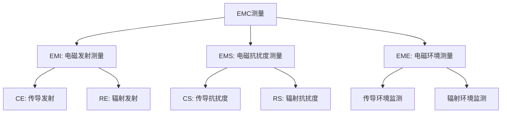
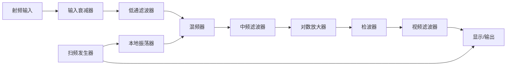
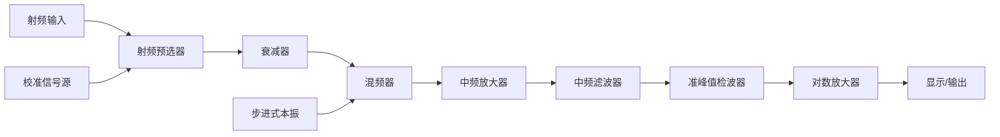
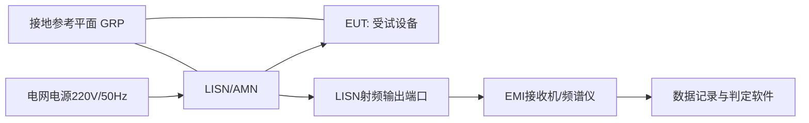
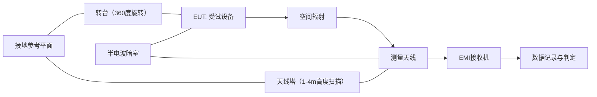
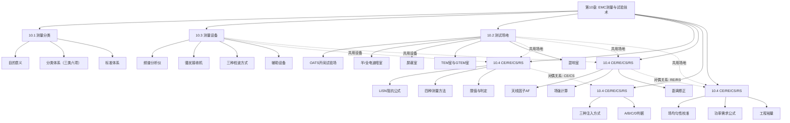

# 第10章 电磁兼容测量与试验技术

## 学习目标

1. **记忆层**：能列举电磁兼容测量的三类六项分类体系，复述CISPR、IEC 61000、GB、GJB等主要EMC标准体系的层级关系和典型标准编号。

2. **理解层**：能解释频谱分析仪与电磁骚扰接收机的本质结构差异，说明三种检波方式（峰值、准峰值、平均值）的物理原理及其在工程测量中的适用策略。

3. **应用层**：能根据给定的天线因子和接收机读数计算辐射场强，根据LISN阻抗参数计算传导骚扰电压，根据场强要求利用$P = E^2 d^2 / (30G)$公式计算辐射抗扰度测试所需功率。

4. **分析层**：能比较开阔试验场、半电波暗室、全电波暗室、TEM室、GTEM室和混响室六种测试场地的结构差异和优缺点，针对给定的测试需求选择最合适的场地类型并说明理由。

5. **评价层**：能评估给定EMC测试方案的合规性，判断CE/RE/CS/RS测试布置是否符合标准要求，分析超标数据的可能原因并提出整改方向。

6. **创造层**：能针对一个具体电子产品（如开关电源、工业控制器、通信基站设备）的EMC认证需求，设计完整的正式测试方案，包括设备配置清单、场地选择、测试步骤和限值判定逻辑。

7. **综合层**：能综合理解电磁兼容测量从设备、场地到方法的全链条知识体系，将测量结果与EMC设计技术（屏蔽、滤波、接地、PCB布局）建立反馈关联，提出量化的整改建议。

---

### §10.1 电磁兼容测量分类

电磁兼容测量（Electromagnetic Compatibility Measurement）是指通过标准化的测试方法和仪器设备，对电子电气设备的电磁发射和抗扰度性能进行定量评估的技术过程，是检验设备是否满足电磁兼容性要求的唯一技术手段，也是EMC认证评估的核心环节。无论是民用产品的3C认证、CE标志和FCC认证，还是军用装备的GJB 151B符合性验证，最终都必须通过标准化的EMC测量来判定设备是否满足限值要求。没有EMC测量，电磁兼容设计就失去了量化的评判标准。

EMC测量贯穿产品的整个生命周期，在不同的阶段发挥着不同的作用。在研发阶段，工程师利用近场探头和频谱分析仪对电路板上的骚扰源进行定位和诊断，发现设计中的薄弱环节——例如开关电源中功率管开关瞬态引起的宽频带传导骚扰、数字电路时钟谐波引起的辐射发射。进入预测试阶段后，在非完全标准的场地条件下进行摸底测量，评估产品通过正式认证的概率，此时的重点是发现那些"临界频点"。正式认证阶段则必须在符合标准要求的测试场地和仪器配置下，由具备资质的第三方实验室出具合规报告，这一阶段的测量结果具有法律效力。批量生产阶段还需进行抽样监控测量，以确保产品的一致性和生产过程中的EMC性能没有退化。

一条广为人知的工程经验法则——"1-10-100法则"——同样适用于EMC测量：在设计阶段发现问题并解决的成本为1，在EMC预测试阶段发现问题的成本为10，在正式认证阶段被判定不合格后的整改成本则高达100。这一法则的物理基础在于：设计阶段调整PCB布局或增加滤波元件的成本仅为物料和工时；预测试阶段发现问题时往往需要进行改板或添加屏蔽措施；而在正式认证阶段被判定不合格，不仅需要支付昂贵的复测费用，更面临产品延期上市的损失。这正是EMC测量必须尽早介入产品开发流程的根本原因。

#### 10.1.1 电磁兼容测量分类

电磁兼容测量按照测量对象和目的的不同，可以分为三大类共六项。第一类是电磁发射测量（EMI, Electromagnetic Interference Measurement），包括传导发射（CE, Conducted Emission）测量和辐射发射（RE, Radiated Emission）测量。第二类是电磁抗扰度测量（EMS, Electromagnetic Susceptibility Measurement），包括传导抗扰度（CS, Conducted Susceptibility）测量和辐射抗扰度（RS, Radiated Susceptibility）测量。第三类是电磁环境测量（EME, Electromagnetic Environment Measurement），包括传导环境监测和辐射环境监测，主要用于评估设备运行现场的电磁环境电平，为EMC设计提供背景数据。

下图以树形结构完整展示了EMC测量的分类体系。


*图10-8：示意图*

**图10-1 EMC测量分类体系**

上图展示了EMC测量的完整分类框架。EMI测量确保设备不对外界产生过量的电磁骚扰——这相当于"不乱扔垃圾"；EMS测量确保设备在电磁环境中能正常工作——这相当于"不被外界干扰"；EME测量则关注实际电磁环境的量化评估——这相当于"了解外部环境的污染程度"。这三类测量从不同维度保证了电磁兼容设计的有效性。在标准体系中，EMI和EMS通常被要求同时达标，一项不合格即判定为产品不符合EMC要求。

在抗扰度测量中，设备性能的下降程度被划分为四个等级，这一划分标准称为A/B/C/D判据，广泛应用于IEC 61000-4系列标准。下表给出了各判据的详细定义和典型表现。

| 判据等级 | 性能表现 | 说明 | 典型示例 |
|:--------:|:---------|:-----|:---------|
| A | 性能正常 | 试验中和试验后设备均在规定限值内正常工作 | 通信设备无误码，显示屏无闪烁 |
| B | 暂时降级，可自恢复 | 试验中性能暂时超出限值，试验后自动恢复 | 试验中显示屏短暂闪烁，结束后恢复正常 |
| C | 功能丧失，需人工复位 | 试验中功能停止，试验后需人工操作才可恢复 | 设备自动关机，需按电源按钮恢复 |
| D | 设备损坏 | 试验导致设备不可恢复的损坏 | 电源模块烧毁，IC芯片击穿 |

上述判据等级并非绝对的性能分级，而是与产品的应用场景直接相关。例如，对于生命支持医疗设备，试验中任何级别的性能下降可能都是不可接受的，必须满足A级判据；而对于消费电子产品B级判据往往可以接受。

#### （4）柯金良EMC认证体系

柯金良《电磁兼容概论》§11.1详细介绍了产品EMC认证的程序和要求。我国自2003年8月起对电子设备实行电磁兼容强制性认证——中国国家强制性产品认证（China Compulsory Certification），简称3C认证，实际上是CCEE（中国电子电工产品安全认证）、CCIB（中国进口电子产品安全认证）和EMC（电磁兼容性认证）三证合一。

在欧共体EMC指令中，认证模式分为以下三类：

**模式A（自我声明模式）**：产品有明确的标准可依，厂商自行根据标准对其产品进行测试，然后发表"合格声明"（DOC），并加贴"CE"标记。DOC和有关技术档案必须保存10年，以备权威机构随时审核。适用于绝大多数有对应产品标准的民用电子产品。

**模式Aa**：产品无合适的标准可依（如标准规定的步骤无法执行或由于产品本身的限制，只能用替代法进行测试）。制造商首先准备"技术结构文件"（TCF），内容包括产品的详细叙述、测试步骤和产品满足EMC要求的说明、能力机构（competent body）出具的技术报告或证书，然后发表DOC并加贴"CE"标记。

**模式B+C**：适用于无线通信的发射设备和传输设备。产品须由有资格的实验室测试，然后由通告机构（notified body，由政府指定）出具试验证明，最后发表DOC并加贴"CE"标记。

EMC测试是认证的核心环节。任何EMC测试都需要依据相应的标准、采用规范化的设备在经认可的场地中完成。测试设备大致分为三大类：①核心测试设备（频谱分析仪、电磁骚扰接收机、示波器等频域和时域仪器）；②辅助测试设备（天线、信号发生器、功率放大器、CDN系统、测量软件）；③测试场地（开阔场、电波暗室、屏蔽室、混响室、TEM室、GTEM室）。这三类要素的有机组合构成了完整的EMC测试能力。

#### 10.1.2 预测量与标准测量

EMC测量根据其目的和测试环境的标准化程度，可以分为预测量（Pre-compliance Measurement）和标准测量（Compliance/Standard Measurement）两大类。

**预测量**是指在产品研发阶段，在非完全标准化的场地和仪器条件下进行的摸底性测量。预测量的主要目的是在产品设计早期快速发现EMC问题，评估产品通过正式认证的概率，降低认证风险。预测量的场地可以使用GTEM室、屏蔽室甚至普通实验室空间（配合近场探头），仪器可以使用频谱分析仪替代CISPR标准接收机。预测量的优点在于成本低、速度快、可反复进行，但其结果不具有法律效力，且与正式认证结果之间存在一定偏差（通常±3~5dB）。

**标准测量**是指在符合标准要求的测试场地和仪器配置下，由具备资质的测试人员按照标准规定的测量方法进行的正式认证测试。标准测量的结果具有法律效力，是产品获得市场准入资格的依据。标准测量必须在以下条件下进行：（1）场地——使用通过NSA或SVSWR验证的半电波暗室、全电波暗室或开阔试验场；（2）仪器——使用符合CISPR 16-1-1规定的电磁骚扰接收机，配备经过校准的测量天线和辅助设备；（3）方法——严格按照CISPR 16-2系列、IEC 61000-4系列或GJB 151B等标准规定的步骤进行；（4）人员——由具备资质的EMC测试工程师操作，测试实验室需通过ISO/IEC 17025认可。

预测量与标准测量之间的关系可以概括为"快速筛查+精确判定"的递进式策略。预测量发现的问题应在正式认证前完成整改，以降低正式测试的失败风险和复测成本。在实际工程中，通常建议在产品研发的早期、中期和晚期各进行一次预测量，以确保EMC设计的持续有效，在正式认证前再根据最新结果进行一次最终确认。

#### 10.1.3 EMC标准体系

EMC标准体系呈现出三层金字塔结构。顶层为**基础标准**（Basic Standards），规定了EMC测量的基本方法、设备和场地要求，不涉及具体产品的限值，而是为下层标准提供统一的技术基础。基础标准的典型代表包括CISPR 16系列（测量仪器和测量方法）和IEC 61000-4系列（抗扰度试验方法）。中间层为**通用标准**（Generic Standards），针对特定电磁环境（如居住区、商业区、工业区）给出通用的限值要求，不限定具体产品类别。通用标准的代表包括IEC 61000-6-1/6-2（抗扰度通用标准）和IEC 61000-6-3/6-4（发射通用标准）。底层为**产品标准**（Product Standards），针对具体产品类别给出详细的限值和测量方法，其规定比上层标准更为严格和具体。产品标准的代表包括CISPR 11（工业、科学和医疗设备）、CISPR 32（多媒体设备）、CISPR 25（车辆、船和内燃机驱动装置）、FCC Part 15（射频发射设备）和GJB 151B（军用设备）。

产品标准优先于通用标准，通用标准优先于基础标准。当某一产品同时有对应的产品标准和通用标准时，应优先采用产品标准的规定。例如，信息技术设备的EMC测试应遵循CISPR 32，而不是从CISPR 16或IEC 61000-6系列中选取。

主要国际和国内EMC标准体系包括：国际无线电干扰特别委员会（CISPR）标准体系（专注发射测量）；国际电工委员会IEC TC77的61000系列（涵盖发射和抗扰度）；美国联邦通信委员会FCC第15部分和18部分（具有法律强制执行力的美国EMC法规）；中国国家标准GB系列（如GB 9254、GB 4824、GB/T 17626系列）；中国军用标准GJB 151B/152B等。不同标准体系在频率范围、限值水平和测量方法上存在差异，但核心的测量原理和判据逻辑是相通的。

| 标准编号 | 标准名称 | 内容概要 | 与本章相关系 |
|:---------|:---------|:---------|:-------------|
| CISPR 16-1-1:2019 | 测量仪器规范 | 骚扰接收机参数、三种检波器定义 | §10.3.1 |
| CISPR 16-1-2:2014 | 辅助设备规范 | LISN结构、电流探头、CDN | §10.3.3、§10.4.2 |
| CISPR 16-1-5:2014 | 天线校准站点验证 | 天线因子三天线法校准 | §10.3.2 |
| IEC 61000-4-20:2010 | TEM波导测试方法 | TEM室和GTEM室应用指南 | §10.2.4 |
| IEC 61000-4-21:2011 | 混响室测试方法 | 混响室校准和搅拌器工作模式 | §10.2.5 |

| CISPR 16-1-4:2019 | 天线与测试场地规范 | NSA验证、天线因子校准 | §10.2、§10.4 |
| CISPR 16-2-1:2017 | 传导发射测量方法 | 四种CE测量方法详细步骤 | §10.4 |
| CISPR 16-2-3:2016 | 辐射发射测量方法 | EUT布置、天线扫描策略 | §10.4 |
| IEC 61000-4-3:2020 | 辐射抗扰度试验 | 场均匀性校准、80MHz~6GHz | §10.4 |
| IEC 61000-4-6:2018 | 传导抗扰度试验 | CDN注入法、150kHz~80MHz | §10.4 |
| CISPR 11:2015 | ISM设备EMC限值 | A级/B级传导和辐射发射限值 | §10.4.2 |
| CISPR 32:2015 | 多媒体设备EMC限值 | ITE/AV设备CE和RE限值 | §10.4.2 |
| GJB 151B-2013 | 军用EMC要求与测量 | CE101~CE107/RE101~RE103等 | §10.4 |
| FCC Part 15 | 射频发射限值 | 传导和辐射限值（美国市场） | §10.4.2 |

### §10.2 电磁兼容测量设施

EMC测量对测试场地的要求极为严格。场地的反射特性、背景噪声电平、屏蔽效能和频率适用范围直接影响测量结果的准确性和可重复性。选择不合适的场地不仅可能导致测量结果的偏差，甚至可能使同一台设备在不同场地上获得完全相反的合格/不合格判定。本节将系统介绍六种主要测试场地的结构特点、适用频率范围和优缺点。

#### 10.2.1 开阔试验场（OATS）

开阔试验场（Open Area Test Site, OATS）是EMC测量最早的标准化场地。其定义为一处平坦、开阔、无反射物体的室外场地，表面为高导电性的金属接地平面，用于在30MHz~1GHz频段进行辐射发射测量。

OATS的核心区域是一个以EUT和接收天线位置为焦点的椭圆形"无反射区"。椭圆的长轴等于测量距离的两倍（标准测量距离为3m、10m或30m），短轴等于测量距离的$\sqrt{3}$倍。在该椭圆区域内不允许存在任何反射物体（包括建筑物、车辆、金属围栏等），以保证接收天线只接收到EUT的直接辐射波和经金属接地平面反射的反射波。OATS的天线架设高度可在1~4m范围内调节，通过改变天线高度来寻找直射波与反射波干涉的最大点。

OATS的最大优点是能提供最接近自由空间传播条件的测量环境，且建造成本相对较低。在OATS上进行辐射发射测量的一个关键考虑因素是天气条件——CISPR 16-2-3规定OATS测量只能在干燥天气条件下进行（无雨、无雪、相对湿度不超过80%），因为潮湿的地面会改变介电常数和导电率，从而改变地面反射系数$\rho$。实际工程经验表明，雨后OATS的NSA偏差可能增大2~3dB，故在重要认证测试前至少需要24小时的干燥时间让地面恢复到稳定状态。此外，环境背景噪声必须在每个测试频率点至少比限值低6dB，这是判断OATS是否可用的最直接的判据——如果某一频段的环境噪声接近或超过限值，该频段的测量结果将因信噪比不足而不可靠。然而其缺点也十分突出：受天气和气候条件影响大（雨雪改变地面介电常数、湿度变化影响天线阻抗、大风影响天线稳定性）；背景噪声电平随时间和周边电磁环境的变化而波动（特别是在城市区域，来自广播、通信和工业的电磁干扰可能在待测频段内远高于限值）；且难以满足城市密集区域的场地建设要求（需要较大的占地面积和严格的电磁环境保护）。随着电波暗室技术的不断成熟和完善，OATS在实际的EMC认证测量中的使用已大幅减少，目前仅在某些特定的低频段（30~300MHz）测量和场地验证中仍有应用。

OATS中接收天线处的总场强是直射波与地面反射波的矢量叠加。对于水平极化发射，接收天线处的合成场强幅值为

① **物理原理**：电磁波在自由空间传播时遇到地面发生反射，接收天线处的总场强为直射波与反射波的矢量叠加。由于两列波的传播路径长度不同，在接收点产生相位差，导致干涉现象——同相相加增强、反相相消减弱。② **建模假设**：假设地面为无限大理想导电平面或具有均匀复介电常数的平坦介质平面，入射波为均匀平面波，直射波和反射波的传播路径可简化为几何光学射线模型。③ **原始方程**：两列同频率正弦波的矢量叠加：$E_{\text{total}} = |E_{\text{dir}} + E_{\text{ref}}| = |E_0 + E_0 \rho e^{-j\beta(r_2 - r_1)}|$，其中$\beta = 2\pi/\lambda$为相位常数。④ **数学代入**：取直射波幅度$E_0$为参考幅度，反射波相对于直射波的相位延迟为$\beta(r_2 - r_1)$，反射系数为$\rho$，代入得$E_{\text{total}} = E_0 |1 + \rho e^{-j(2\pi/\lambda)(r_2 - r_1)}|$。⑤ **导出结果**：$E_{\text{total}} = E_0 \| 1 + \rho e^{-j(2\pi/\lambda)(r_2 - r_1)} \|$。⑥ **参数解释**：$E_{\text{total}}$为合成电场幅值（V/m），$E_0$为自由空间直射波场强（V/m），$\rho$为地面复反射系数（理想导电地面$\rho=-1$），$r_1$为直射路径长度（m），$r_2$为反射路径长度（m），$\lambda$为波长（m）。干涉极大值出现在$r_2 - r_1 = n\lambda$处，极小值出现在$r_2 - r_1 = (2n+1)\lambda/2$处。

$$
E_{\text{total}} = E_0 \left\| 1 + \rho e^{-j\frac{2\pi}{\lambda}(r_2 - r_1)} \right\|
\tag{10-1}
$$

式中，$E_{\text{total}}$为接收天线处的合成电场强度（V/m），$E_0$为不考虑地面反射时的自由空间场强（V/m），$\rho$为地面的反射系数（对于理想导电地面$\rho = -1$），$r_1$为直射路径长度（m），$r_2$为反射路径长度（m），$\lambda$为波长（m）。当$r_2 - r_1 = \lambda/2$的奇数倍时，直射波与反射波反相相消，场强出现最小值；当$r_2 - r_1 = \lambda$的整数倍时，同相相加，场强出现最大值。这就是为什么天线需要在1~4m高度范围内扫描的原因——通过改变天线高度来改变反射路径差，找到干涉最大值。

地面的复反射系数$\rho$是OATS和半电波暗室场分析的重要参数。对于水平极化波，地面的复反射系数为

$$
\rho_h = \frac{\sin\theta - \sqrt{\varepsilon_r - \cos^2\theta}}{\sin\theta + \sqrt{\varepsilon_r - \cos^2\theta}}
\tag{10-2}
$$

$$
\boxed{\rho_h = \frac{\sin\theta - \sqrt{\varepsilon_r - \cos^2\theta}}{\sin\theta + \sqrt{\varepsilon_r - \cos^2\theta}}}
\tag{10-3}
$$

① **物理原理**：电磁波入射到两种介质的交界面时，由于介电常数和导电率的不连续，一部分能量被反射。对于水平极化（电场矢量平行于地面），反射系数$\rho_h$对入射角敏感。理想导电地面（$\varepsilon_r \to \infty$或$\sigma \to \infty$）的$\rho_h = -1$，即反射波与入射波大小相等但相位相反（180度反转）。② **建模假设**：假设地面为均匀、平坦、各向同性的介质半空间，入射波为均匀平面波。③ **原始方程**：菲涅尔（Fresnel）反射系数公式。④ **数学代入**：对于水平极化，入射角$\theta$为掠射角（射线与地面的夹角），$\varepsilon_r$为地面的相对复介电常数（对于干燥地面$\varepsilon_r \approx 5 - j0.1$，对于湿地$\varepsilon_r \approx 20 - j5$）。⑤ **导出结果**：当$\varepsilon_r \gg 1$时，$\rho_h \to -1$；当$\varepsilon_r = 1$（自由空间）时，$\rho_h = 0$（无反射）。⑥ **参数解释**：$\rho_h$为水平极化复反射系数（无量纲），$\theta$为掠射角（入射方向与地面的夹角，单位rad），$\varepsilon_r = \varepsilon / \varepsilon_0 - j\sigma/(\omega\varepsilon_0)$为地面的相对复介电常数。

对于垂直极化波，反射系数公式略有不同：

$$
\rho_v = \frac{\varepsilon_r \sin\theta - \sqrt{\varepsilon_r - \cos^2\theta}}{\varepsilon_r \sin\theta + \sqrt{\varepsilon_r - \cos^2\theta}}
\tag{10-4}
$$

垂直极化反射系数的一个重要特性是在某个特定入射角处出现"布儒斯特角"（Brewster Angle）——当$\theta_B = \arctan(\sqrt{\varepsilon_r})$时，$\rho_v = 0$，反射完全消失。这一现象在OATS测量中很有意义——当使用垂直极化天线且测量距离合适时，可以利用布儒斯特角效应减小地面反射的影响。

**归一化场地衰减（NSA）**

归一化场地衰减（Normalized Site Attenuation, NSA）是评价半电波暗室和OATS场地性能的核心指标。NSA定义为在50$\Omega$匹配条件下，发射天线和接收天线之间的空间路径损耗减去两天线的天线因子后的归一化值。其理论值由以下公式计算：

$$
A_N = 20\log\left(\frac{4\pi d}{\lambda}\right) - \text{AF}_t - \text{AF}_r + 20\log\left(\frac{d}{d_0}\right)
\tag{10-5}
$$

$$
\boxed{A_N = 20\log\left(\frac{4\pi d}{\lambda}\right) - \text{AF}_t - \text{AF}_r + 20\log\left(\frac{d}{d_0}\right)}
\tag{10-6}
$$

① **物理原理**：NSA反映了一个场地对理想自由空间传播条件的偏离程度。从发射天线到接收天线的射频能量传输受到直射波和地面反射波干涉的影响，NSA测量值偏离理论值的大小体现了场地的反射特性异常程度。② **建模假设**：假设发射天线和接收天线均为理想点源（无方向性），地面为理想导电平面，两天线之间的互耦可以忽略。③ **原始方程**：自由空间路径损耗$L_{\text{fs}} = 20\log(4\pi d / \lambda)$，计入天线因子后总传输损耗为$L_{\text{total}} = L_{\text{fs}} + \text{AF}_t + \text{AF}_r$。④ **数学代入**：NSA的理论值$A_N$定义为总传输损耗减去天线因子后的剩余部分，同时加入距离归一化项$20\log(d/d_0)$以统一不同测量距离的NSA值（$d_0$为参考距离，通常取10m）。⑤ **导出结果**：$A_N = 20\log(4\pi d / \lambda) - \text{AF}_t - \text{AF}_r + 20\log(d/d_0)$。⑥ **参数解释**：$A_N$为归一化场地衰减（dB），$d$为测量距离（m），$\lambda$为波长（m），$\text{AF}_t$为发射天线因子（dB/m），$\text{AF}_r$为接收天线因子（dB/m），$d_0$为参考距离（m，通常为10m）。

CISPR 16-1-4要求在30MHz~1GHz范围内，SAC的NSA测量值与理论值之间的偏差不超过$\pm$4dB。这一容差包含了天线校准误差（约$\pm$1dB）、场地反射不理想（约$\pm$2dB）以及测量系统不确定度（约$\pm$1dB）的综合影响。如果某频率点的NSA偏差超过$\pm$4dB，意味着该频率在测量时场地的反射特性会引入显著误差，可能导致不合格品误判为合格（频率点偏低导致场强低估）或合格品误判为不合格（频率点偏高导致场强高估）。

#### 10.2.2 电波暗室（半/全）

电波暗室是在屏蔽室（金属壳体）的内表面覆盖电磁波吸收材料，以模拟自由空间传播条件或开阔试验场条件的测试场地。

**半电波暗室（Semi-Anechoic Chamber, SAC）**的五个墙面（四侧墙壁和天花板）覆盖吸波材料，而地面保持为金属反射面（与OATS的金属接地平面一致）。SAC精确模拟了OATS的传播条件——接收天线处同时接收到EUT的直接辐射波和地面反射波，两者的矢量叠加形成场强测量值。SAC是30MHz~1GHz频段辐射发射测量的标准场地，也是CISPR和FCC认证测试中最常用的场地类型。

SAC的场地有效性通过归一化场地衰减（Normalized Site Attenuation, NSA）进行验证。NSA定义为在50$\Omega$匹配条件下，发射天线和接收天线之间的路径损耗减去天线因子后的归一化值。CISPR 16-1-4要求在30MHz~1GHz范围内，SAC的NSA测量值与理论值之间的偏差不超过$\pm$4dB。当偏差超过此容差时，该SAC不能用于正式认证测量。NSA测量值与理论值之间的偏差$\Delta A_N = A_{N,\text{meas}} - A_{N,\text{theory}}$的正负号反映了场地反射特性的不同偏差方向。当$\Delta A_N > +4$dB时，意味着实际场地衰减大于理论值——接收到的信号偏弱，这会导致辐射发射测量结果被低估（"假合格"风险，即超标产品被误判为合格）。当$\Delta A_N < -4$dB时，场地衰减小于理论值——接收到的信号偏强，这会导致辐射发射测量结果被高估（"假不合格"风险）。认证实验室通常要求NSA偏差在$\pm$3dB以内（严于标准的$\pm$4dB），以降低测量不确定度、减少误判风险。

NSA验证的频率步长要求为：30~300MHz频段每10MHz一个测试点，300~1000MHz频段每20MHz一个测试点，在每个测试频率点还需要分别在水平极化和垂直极化两种极化方向上进行测量。这是因为半电波暗室对不同极化方向的电磁波的吸收性能存在差异——吸波材料的锥体排列和铁氧体瓦的磁导率对极化方向的敏感度不同，垂直极化测量结果的不确定度通常比水平极化略大。

**全电波暗室（Fully Anechoic Chamber, FAC）**的六个墙面（包括地面）全部覆盖吸波材料，完全消除了任何反射路径，模拟理想的自由空间传播条件。FAC是辐射抗扰度测量（IEC 61000-4-3）的标准场地，也可用于1GHz以上的高频辐射发射测量。由于消除了地面反射，FAC中的场分布比SAC更加均匀和可控，这对于辐射抗扰度测量中均匀场域的建立至关重要。FAC的局限在于其低频性能受吸波材料尺寸的限制——典型的铁氧体-泡沫混合吸波材料在30MHz以下吸波效率急剧下降，因此30MHz以下的测量一般不使用全电波暗室。

电波暗室中使用的吸波材料主要有两大类：铁氧体瓦（Ferrite Tile）和碳加载泡沫锥体（Carbon-Loaded Foam Pyramid）。铁氧体瓦在低频段（30~300MHz）有良好的吸波性能（反射率可达-20dB以下），厚度仅约6mm但密度大（每平方米约20kg）。碳加载泡沫锥体在300MHz以上的高频段表现出色（反射率可达-40dB以下），但厚度通常为数十厘米甚至超过1米（按最低工作频率的$\lambda/4$设计）。现代暗室通常采用混合型设计——在金属壁面上先贴敷铁氧体瓦作为低频吸波层，然后在铁氧体表面覆盖碳加载泡沫锥体作为高频吸波层，从而实现30MHz~18GHz（甚至至40GHz）的宽频段吸波性能。

#### 10.2.3 屏蔽室

屏蔽室是由高导电性金属材料（通常为1.5~2mm厚的镀锌钢板或铜板）构成的六面封闭壳体，其作用是阻断内外电磁场的相互影响。屏蔽室是EMC实验室的基础设施——几乎所有EMC测量都必须在屏蔽室内或至少连接到屏蔽室进行。

屏蔽室的屏蔽效能通常要求在80dB以上，即在设计频率范围内外部场强经过屏蔽体衰减后的剩余强度仅为原场强的万分之一（$10^{-4}$倍）。高质量的屏蔽室在10kHz~10GHz范围内的屏蔽效能可达100dB以上（衰减一百万倍）。屏蔽效能主要由屏蔽体的材料导电率、厚度、接缝处理和门/通风波导的屏蔽设计决定。

屏蔽室的最大局限性在于：内部空间的金属壁面对电磁波产生强烈多次反射，形成复杂的驻波分布和多径干涉效应，导致内部场分布极度不均匀——空间不同位置的场强可能相差数十分贝。由此，未经吸波处理的屏蔽室不适合进行精确的辐射发射和辐射抗扰度测量，只适合进行传导发射测量（配合LISN使用，因为传导测量不涉及空间场的分布）、传导抗扰度测量（通过线缆注入而非空间照射）以及作为电波暗室的基础壳体。

屏蔽室的腔体谐振效应是限制其用于辐射测量的根本原因。屏蔽室本质上是一个矩形谐振腔，其谐振频率由腔体尺寸决定：

① **物理原理**：在由金属壁面构成的封闭矩形腔体中，电磁波在壁面之间来回反射，当腔体尺寸等于半波长的整数倍时形成驻波，产生谐振。谐振时腔内场强急剧增大，能量在腔内集中，形成频率选择性的强场分布。② **建模假设**：假设屏蔽室为理想导体制成的矩形谐振腔（壁面无损耗），腔内为真空（$\varepsilon_r = 1$，$\mu_r = 1$），只有TE模和TM模可以存在。③ **原始方程**：矩形谐振腔的亥姆霍兹方程$\nabla^2 \psi + k^2 \psi = 0$，在矩形边界条件下分离变量得$k_x^2 + k_y^2 + k_z^2 = k^2$，其中$k_x = m\pi/a$，$k_y = n\pi/b$，$k_z = p\pi/c_s$。④ **数学代入**：波数$k = 2\pi f/c$，代入$k^2 = (m\pi/a)^2 + (n\pi/b)^2 + (p\pi/c_s)^2$得$(2\pi f/c)^2 = \pi^2[(m/a)^2 + (n/b)^2 + (p/c_s)^2]$。⑤ **导出结果**：$f_{mnp} = (c/2)\sqrt{(m/a)^2 + (n/b)^2 + (p/c_s)^2}$。⑥ **参数解释**：$f_{mnp}$为腔体谐振频率（Hz），$c = 3\times10^8$m/s为光速，$a$、$b$、$c_s$分别为屏蔽室长、宽、高（m），$m$、$n$、$p$为非负整数模数（至少两个不为零以形成谐振）。例如，$5\text{m}\times4\text{m}\times3\text{m}$的屏蔽室最低谐振频率$f_{101} \approx 58.3$MHz。

$$
f_{mnp} = \frac{c}{2}\sqrt{\left(\frac{m}{a}\right)^2 + \left(\frac{n}{b}\right)^2 + \left(\frac{p}{c_s}\right)^2}
\tag{10-7}
$$

式中，$f_{mnp}$为腔体谐振频率（Hz），$c$为光速（$3\times10^8$m/s），$a$、$b$、$c_s$分别为屏蔽室的长、宽、高（m），$m$、$n$、$p$为非负整数模数（至少两个不为零）。例如，对于尺寸为$a=5$m、$b=4$m、$c_s=3$m的屏蔽室，最低谐振模式（TE${}_{101}$）的频率为$f_{101} = (c/2)\sqrt{(1/5)^2 + (0/4)^2 + (1/3)^2} \approx 1.5\times10^8 \times \sqrt{0.04 + 0 + 0.111} \approx 58.3$MHz。在此频率附近，屏蔽室内部场强可因谐振而增强数十分贝，导致辐射测量结果完全不可信。这一定量分析表明，即使屏蔽室的屏蔽效能高达100dB以上，其内部空间仍因谐振效应而无法用于辐射发射测量。

此外，屏蔽室的屏蔽效能对低频磁场（特别是工频50Hz磁场）的衰减能力远低于对电场的衰减——这是因为磁场屏蔽主要依靠铁磁性材料的磁导率（而非导电率），而钢板在低频的磁导率随频率降低而下降。一个典型的钢板屏蔽室在10kHz时的磁场屏蔽效能约为60dB，而在1MHz时可达100dB以上。这解释了为什么低频（9kHz以下）磁场发射测量（如GJB 151B的RE101项目）需要专门的低频磁场屏蔽室设计，通常采用多层高磁导率材料（如坡莫合金）的内衬结构。

屏蔽室的屏蔽效能（Shielding Effectiveness, SE）定义为外部场强与内部场强之比的对数：

① **物理原理**：当电磁波入射到导电屏蔽体表面时，一部分能量被反射（反射损耗），剩余能量在屏蔽体内传播时被衰减（吸收损耗），在第二个界面上再次发生部分反射（多次反射修正），最终穿透屏蔽体的场强远低于外部场强。屏蔽效能即为这一综合衰减能力的分贝度量。② **建模假设**：假设屏蔽体为无限大均匀导电平板（忽略边缘衍射和接缝泄漏），入射波为均匀平面波，屏蔽体两端均为自由空间（波阻抗$\eta_0 = 120\pi\;\Omega$）。③ **原始方程**：屏蔽体对电磁场的传输系数$T = E_{\text{in}} / E_{\text{out}} = 4\eta_0\eta_s / [(\eta_0 + \eta_s)^2 e^{\gamma t} - (\eta_0 - \eta_s)^2 e^{-\gamma t}]$，其中$\eta_s$为屏蔽材料的波阻抗，$\gamma$为传播常数，$t$为屏蔽体厚度。④ **数学代入**：对于良导体（$\sigma \gg \omega\varepsilon$），$\eta_s \approx \sqrt{j\omega\mu/\sigma}$，$\gamma \approx (1+j)\sqrt{\pi f\mu\sigma}$。在远场条件下，当$t$远大于趋肤深度$\delta = 1/\sqrt{\pi f\mu\sigma}$时，传输系数简化为$T \approx 4\eta_0\eta_s / (\eta_0 + \eta_s)^2 \cdot e^{-t/\delta}$。⑤ **导出结果**：屏蔽效能定义为$\text{SE} = 20\log(E_{\text{out}} / E_{\text{in}}) = -20\log|T|$（dB）。⑥ **参数解释**：SE为屏蔽效能（dB），$E_{\text{out}}$为屏蔽体外部的电场强度（V/m），$E_{\text{in}}$为屏蔽体内部的电场强度（V/m）。SE=80dB意味着$E_{\text{in}} = E_{\text{out}} / 10000$，即外部场强衰减了四个数量级。

$$
\text{SE} = 20\log\left(\frac{E_{\text{out}}}{E_{\text{in}}}\right)
\tag{10-8}
$$

式中，SE为屏蔽效能（dB），$E_{\text{out}}$为屏蔽室外部的电场强度（V/m），$E_{\text{in}}$为屏蔽室内部的电场强度（V/m）。对于屏蔽效能为80dB的屏蔽室，$E_{\text{in}} = E_{\text{out}} \times 10^{-80/20} = E_{\text{out}} / 10000$，即外部场强衰减了四个数量级。

屏蔽室的屏蔽效能主要由四个因素决定：材料的导电率和磁导率、屏蔽体的厚度、接缝的导电连续性以及所有穿透屏蔽体的开口（包括门缝、通风波导、电源滤波器引入孔和信号线穿墙接口）的电磁泄漏。工程经验表明，屏蔽室的整体屏蔽效能往往不取决于屏蔽体材料本身，而取决于所有开口和接缝中最薄弱的一环——"木桶效应"在屏蔽室设计中尤为突出。屏蔽室门是屏蔽效能最薄弱的环节之一。传统的指形簧片（Beryllium Copper Finger Stock）门封条在反复开关后可能出现永久变形、接触电阻增大（从初始的几毫欧增加到几十毫欧以上）的问题，导致门缝的屏蔽效能从100dB以上下降到60~70dB。定期维护和更换门封条是屏蔽室日常管理的重要工作——通常每半年进行一次接触电阻测量和目视检查。高频情况下，门缝的电磁泄漏可以用狭缝天线模型估计：当门缝长度$l_g$大于$\lambda/2$时，门缝开始有效辐射。对于1GHz的骚扰（$\lambda = 0.3$m），当门缝长度大于0.15m时即可能产生显著泄漏。因此，高频屏蔽室的门框采用加装双层簧片和多点压紧结构的措施，将电接触点的间距缩小到$\lambda/20$以下。

另一个重要的泄漏路径是通风波导。屏蔽室需要通风散热，但通风口如果直接开孔，电磁波会直接从孔洞中泄漏出去。通风波导（Ventilation Waveguide）利用波导的截止特性来抑制电磁泄漏——当通风孔的截面尺寸远小于波导截止波长时，电磁波在孔中呈指数衰减。通风波导的截止频率$f_c$与波导截面尺寸的关系为：对于圆形波导，$f_c = c / (1.706d)$，其中$d$为波导直径；对于矩形波导，$f_c = c / (2a)$，其中$a$为宽边尺寸。蜂巢式通风波导（Honeycomb Vent Panel）由大量紧密排列的六角形波导构成，在保持良好通风效率的同时提供60~100dB的屏蔽效能。蜂巢波导的屏蔽效能计算公式为

$$
\text{SE}_{\text{wg}} = 27.3 \times \frac{l}{d} \times \sqrt{1 - \left(\frac{f}{f_c}\right)^2}
\tag{10-9}
$$

① **物理原理**：波导的截止衰减源于波导结构对电磁波传播模式的约束——当工作频率低于截止频率时，电磁波在波导中无法形成传播模，场以指数衰减的形式在波导中快速下降。② **建模假设**：假设波导为理想导体、无限长（实际长度$l$），工作频率$f$低于截止频率$f_c$，场分布为TE${}_{10}$模。③ **原始方程**：截止波导的衰减常数$\alpha = \frac{2\pi}{\lambda_c}\sqrt{1 - (f/f_c)^2}$，其中$\lambda_c$为截止波长。④ **数学代入**：对于圆波导$\lambda_c = 1.706d$，衰减$\text{SE} = 20\log(e^{\alpha l}) = 8.686\alpha l$。将$\alpha$代入得$\text{SE} = 8.686 \times (2\pi / (1.706d)) \times l \times \sqrt{1 - (f/f_c)^2}$。⑤ **导出结果**：$\text{SE}_{\text{wg}} = 27.3 \times l/d \times \sqrt{1 - (f/f_c)^2}$（dB）。⑥ **参数解释**：$\text{SE}_{\text{wg}}$为通风波导的屏蔽效能（dB），$l$为波导长度（m），$d$为波导直径（m），$f$为工作频率（Hz），$f_c$为截止频率（Hz）。例如，一个圆波导通风孔$d = 6$mm、$l = 12$mm，在$f = 1$GHz时$f_c = c / (1.706 \times 0.006) \approx 29.3$GHz，$f \ll f_c$，$\text{SE} \approx 27.3 \times 0.012 / 0.006 \approx 54.6$dB。

#### 10.2.4 TEM小室与GTEM室

横电磁波（TEM）传输室是一种将开敞的横电磁波传输线（平行板传输线或三平板传输线）封闭在屏蔽壳体中形成的测试装置。其核心原理是在中心导体（又称隔板或内导体）与外导体（屏蔽壳体）之间产生均匀的TEM波传播模式，即在横截面上电场和磁场分布均匀，电场垂直于隔板，磁场平行于隔板。TEM室的横截面通常为矩形或正方形，特性阻抗设计为50$\Omega$以与标准测量设备匹配。

TEM室的上限工作频率取决于其横截面尺寸，特别是隔板与上下壳体的距离。当工作频率升高到某一阈值时，室内将出现高阶传输模式（特别是TE${}_{10}$模和TM${}_{01}$模），破坏TEM波场的均匀性。TEM室的上限截止频率采用以下公式估算：

$$
f_c = \frac{c}{2h}
\tag{10-10}
$$

$$
\boxed{f_c = \frac{c}{2h}}
\tag{10-11}
$$

① **物理原理**：在TEM传输线中，当横截面尺寸接近半波长时，会激励起高阶波导模式。TEM模（主模）的电场、磁场分布为横向均匀，而高阶模具有纵向场分量且场分布不均匀。② **建模假设**：将TEM室近似为矩形波导结构，隔板与壳体之间的等效高度为$h$，主模为TEM模（无色散），一阶高阶模为TE${}_{10}$模。③ **原始方程**：矩形波导中TE${}_{10}$模的截止波长公式$\lambda_c = 2a$，其中$a$为波导宽边尺寸。截止频率$f_c = c / \lambda_c = c / (2a)$。④ **数学代入**：TEM室的等效宽边尺寸$a$近似为隔板到壳体距离的2倍（即$a \approx 2h$），代入得$f_c = c / (4h)$。但实际TEM室中由于隔板的厚度和位置影响，工程上采用更为保守的近似$f_c = c / (2h)$。⑤ **导出结果**：TEM室上限截止频率$f_c = c / (2h)$。⑥ **参数解释**：$f_c$为TEM室的上限工作频率（Hz），$c$为真空中的光速（$3\times10^8$m/s），$h$为隔板到外导体的等效高度（m）。例如，当$h = 0.5$m时，$f_c = 3\times10^8 / (2 \times 0.5) = 300$MHz。这意味着一个高1m（隔板到上下壁各0.5m）的TEM室，其上限工作频率约为300MHz，超出此频率后室内场均匀性急剧恶化。

GTEM室（Gigahertz TEM Cell）是传统TEM室的改进型，采用非对称楔形结构设计——横截面从输入端到负载端沿轴向逐渐扩大，形成锥形传输结构。GTEM室在末端接入由分布式电阻网络和吸波材料组成的宽带匹配负载，消减终端的反射波。GTEM室的非对称设计使其频率上限大大提高（可达20GHz），同时保持了TEM波场的良好均匀性。GTEM室中隔板与外壳之间的距离沿轴向线性增加，其特性阻抗在轴向上保持50$\Omega$不变。

TEM室和GTEM室的特性阻抗$Z_c$由传输线的横截面几何尺寸决定。对于矩形截面TEM室，特性阻抗的近似计算公式为

$$
Z_c = \frac{1}{2\pi} \sqrt{\frac{\mu_0}{\varepsilon_0}} \ln\left(\frac{4b}{\pi w}\right)
\tag{10-12}
$$

$$
\boxed{Z_c = \frac{1}{2\pi} \sqrt{\frac{\mu_0}{\varepsilon_0}} \ln\left(\frac{4b}{\pi w}\right)}
\tag{10-13}
$$

① **物理原理**：TEM传输线的特性阻抗取决于单位长度的分布电感$L_0$和分布电容$C_0$，满足$Z_c = \sqrt{L_0 / C_0}$。对于平行板传输线结构，$L_0$和$C_0$由导体间距和宽度决定。② **建模假设**：假设隔板为无限薄的理想导体，忽略隔板厚度和边缘效应，TEM室横截面上仅传播TEM主模。③ **原始方程**：对于宽度为$w$、与上下壳体距离均为$h$的对称平行板传输线，$Z_c \approx \sqrt{\mu_0/\varepsilon_0} \cdot h/w$。对于TEM室的封闭矩形结构，需要用保角变换方法求解，得到对数形式。④ **数学代入**：$\sqrt{\mu_0/\varepsilon_0} = \eta_0 = 120\pi\;\Omega \approx 377\;\Omega$，代入得$Z_c = (377 / (2\pi)) \ln(4b / (\pi w)) \approx 60 \ln(4b / (\pi w))$。⑤ **导出结果**：$Z_c = 60 \ln(4b / (\pi w))$（$\Omega$），其中$b$为矩形截面的高度（m），$w$为隔板宽度（m）。当$b = 0.5$m、$w = 0.8$m时，$Z_c \approx 60 \ln(4 \times 0.5 / (\pi \times 0.8)) \approx 60 \ln(2 / 2.513) \approx 60 \ln(0.796) \approx 60 \times (-0.228) \approx 48.6\;\Omega$，接近50$\Omega$的标准设计值。⑥ **参数解释**：$Z_c$为TEM室特性阻抗（$\Omega$），$\mu_0 = 4\pi\times10^{-7}$H/m为真空磁导率，$\varepsilon_0 = 8.85\times10^{-12}$F/m为真空介电常数，$b$为TEM室外壳的等效高度（m），$w$为隔板（中心导体）的宽度（m）。

实际TEM室的设计需要综合考虑特性阻抗、上限频率和EUT可用空间三个参量之间的折中。上限频率$f_c = c / (2h)$要求$h$尽可能小（以抑制高阶模），但EUT尺寸要求$h$足够大（以容纳被测设备），而特性阻抗要求$w/b$保持特定比例（以实现50$\Omega$）。这一矛盾关系是TEM室设计中的核心工程挑战。

GTEM室内中心导体的高度$h(z)$沿轴向的变化为

$$
h(z) = h_0 + \frac{z}{L}(h_L - h_0)
\tag{10-14}
$$

式中，$h(z)$为轴向位置$z$处的隔板高度（m），$h_0$为输入端的隔板高度（m），$h_L$为负载端的隔板高度（m），$L$为GTEM室的总长度（m）。

根据传输线理论，GTEM室内的场强与输入功率的关系为

$$
E_{\text{GTEM}} = \frac{\sqrt{P_{\text{in}} Z_c}}{h(z)}
\tag{10-15}
$$

式中，$E_{\text{GTEM}}$为GTEM室内的电场强度（V/m），$P_{\text{in}}$为输入到GTEM室的射频功率（W），$Z_c = 50\;\Omega$为GTEM室的特性阻抗，$h(z)$为EUT所在位置处的隔板高度（m）。

GTEM室具有体积小、造价低（约为同频段全电波暗室的十分之一）的优点，在辐射发射预测试和辐射抗扰度测试中得到了广泛应用。然而，GTEM室中EUT的最大尺寸受横截面尺寸限制，且无法像半/全电波暗室那样方便地放置大型设备或进行天线极化切换。从工程选型角度看，GTEM室最适合以下三类应用场景：第一，产品研发阶段的快速辐射发射预测试——GTEM室可以在几分钟内完成30MHz~1GHz频段的扫描，根据GTEM室与电波暗室之间的相关性转换模型（如CISPR 16-2-3附录中给出的多端口极化扫描方法），将GTEM室内测得的各端口骚扰数据转换为等效自由空间辐射场强，预测试结果的精度通常在$\pm$3~5dB范围内，足以判断产品是否具备正式认证的可能性。第二，小尺寸设备（如手机、路由器、传感器模块）的辐射抗扰度测试——GTEM室内场强均匀性良好的区域（通常为隔板高度60%的范围内）可容纳EUT的最大尺寸约为隔板高度的1/3。第三，电磁场探头和天线的校准——GTEM室内已知的TEM波场分布可以用作校准参考。GTEM室的局限性在于：无法进行天线极化切换（极化方向由GTEM室的物理结构固定为垂直极化），无法有效测量EUT的方向图特性，且对于尺寸超过可用空间限制的EUT，测量结果的可靠性和重复性都会显著下降。

混响室与GTEM室在工程选型上形成了互补关系：GTEM室适合小尺寸设备的快速、经济型测试，混响室适合大尺寸设备的高场强测试。两者的结合可以为EMC实验室提供从研发预测试到正式认证的全覆盖测试能力。现代EMC实验室的典型配置方案为：一个3m法或5m法半电波暗室用于辐射发射认证测试，一个全电波暗室用于辐射抗扰度认证测试，一个屏蔽室用于传导发射和传导抗扰度测试，外加一个GTEM室或混响室用于预测试和特殊需求测试。

GTEM室中场强与输入功率的关系式（10-12）在实际应用中需要修正——由于隔板与外壳之间的非对称楔形结构，沿轴向的场强存在约$\pm$0.5~2dB的均匀性偏差。在工程设计上，GTEM室的有效均匀区（场强偏差$<\pm$2dB的区域）为EUT可放置的空间，约为隔板高度$h(z)$的60%。对于辐射发射的GTEM室测量，CISPR 16-2-3规定了GTEM室与电波暗室测量结果之间的转换方法——通过在GTEM室中测量EUT各端口的多极化发射，采用传输线-天线耦合模型转换到自由空间等效场强。

GTEM室的场强均匀性$\Delta E$可用场探针沿垂直于隔板的方向进行扫描验证：

① **物理原理**：场强均匀性用于量化测试区域内电场分布的不均匀程度。在GTEM室或电波暗室中，由于边界反射、天线方向图不均匀和EUT的扰动，场强在工作区域内呈现空间变化。均匀性定义为最大场强与最小场强之比的分贝值，反映场强的空间起伏幅度。② **建模假设**：假设在有效均匀区内场强的空间变化是缓慢且连续的，场探针在各测量点处的读数独立且准确，场分布为稳态（时不变）。③ **原始方程**：场强均匀性的基本定义为$\Delta E = E_{\max} / E_{\min}$（线性比值），转换为分贝形式：$\Delta E_{\text{dB}} = 20\log(E_{\max} / E_{\min})$。④ **数学代入**：令$E_{\max}$为扫描区域内的最大场强测量值（V/m），$E_{\min}$为最小场强测量值（V/m），代入分贝定义式得$\Delta E = 20\log(E_{\max} / E_{\min})$。⑤ **导出结果**：$\Delta E = 20\log(E_{\max} / E_{\min})$（dB）。⑥ **参数解释**：$\Delta E$为场强均匀性（dB），$E_{\max}$为有效均匀区内测得的最大电场强度（V/m），$E_{\min}$为最小电场强度（V/m）。工程上通常要求$\Delta E \le 3\text{dB}$，即$E_{\max} / E_{\min} \le \sqrt{2}$，这意味着场强最大值不超过最小值的约1.41倍。

$$
\Delta E = 20\log\left(\frac{E_{\text{max}}}{E_{\text{min}}}\right)
\tag{10-16}
$$

式中，$\Delta E$为场强均匀性（dB），$E_{\text{max}}$和$E_{\text{min}}$为在有效均匀区内测得的最大和最小电场强度（V/m）。通常要求$\Delta E \leq 3$dB。若$\Delta E$超出此范围，需要检查EUT的尺寸是否超出了GTEM室的可用空间，或者GTEM室输入端的阻抗匹配是否良好。

#### 10.2.5 混响室

混响室（Reverberation Chamber）是一种利用统计方法实现EMC测试的特殊场地。混响室本质上是一个由高导电性金属壁面构成的封闭腔体（空腔谐振器），腔体内部安装一个或多个机械搅拌器（Mode Stirrer或Mode Tuner）——通常为形状不规则的大尺寸金属叶片，由电机驱动旋转。搅拌器的旋转不断改变腔体内部的边界条件，使腔体内的电磁场发生混沌式的模式变化，在统计意义上（经过搅拌器转动足够多的步数或连续旋转足够长的时间后）生成空间均匀和各向同性的电磁场分布。

混响室的品质因数$Q$（Quality Factor）是衡量腔体储能和损耗特性的关键参数：

① **物理原理**：品质因数$Q$是谐振系统的一个基本参数，定义为系统存储的总能量与每周期的能量损耗之比乘以$2\pi$。高$Q$值意味着腔体能量损耗小、储能效率高，在相同输入功率下可以在腔内建立更强的电磁场。② **建模假设**：假设腔体壁面为良导体（表面电阻$R_s = \sqrt{\pi f \mu / \sigma}$），腔内介质无损耗，腔体工作在单一谐振模式附近且稳态受激。③ **原始方程**：能量平衡关系$\omega_0 W_{\text{stored}} = Q \cdot P_{\text{loss}}$，即存储的电磁场能量$W_{\text{stored}}$乘以角频率$\omega_0$等于$Q$倍的平均损耗功率$P_{\text{loss}}$。④ **数学代入**：将能量平衡关系改写为$Q = \omega_0 W_{\text{stored}} / P_{\text{loss}}$，其中$W_{\text{stored}}$包括电场储能和磁场储能的总和，$P_{\text{loss}}$包括壁面欧姆损耗、搅拌器天线损耗和EUT吸收功率。⑤ **导出结果**：$Q = \omega_0 \cdot W_{\text{stored}} / P_{\text{loss}}$。⑥ **参数解释**：$Q$为品质因数（无量纲），$\omega_0 = 2\pi f$为谐振角频率（rad/s），$W_{\text{stored}}$为腔内存储的电磁场总能量（J），$P_{\text{loss}}$为腔内单位时间的能量损耗功率（W）。混响室的$Q$值通常在$10^3 \sim 10^5$量级，$Q$越高则场强建立效率越高，但腔体的频率选择性也越强。

$$
Q = \omega_0 \frac{W_{\text{stored}}}{P_{\text{loss}}}
\tag{10-17}
$$

式中，$Q$为品质因数（无量纲），$\omega_0$为谐振角频率（rad/s），$W_{\text{stored}}$为腔体内存储的电磁场能量（J），$P_{\text{loss}}$为腔体内单位时间内的能量损耗功率（W），主要包括壁面欧姆损耗、搅拌器天线损耗以及EUT吸收的功率。

在混响室中，空间平均电场强度均方值与输入功率之间的关系为

① **物理原理**：在混响室中，电磁场能量由输入射频功率持续注入，同时因壁面欧姆损耗和EUT吸收而不断耗散。当注入功率等于损耗功率时系统达到稳态，此时腔内存储的电磁能量与输入功率和$Q$值成正比。空间平均的电场均方值通过对整个腔体体积中的电场能量密度进行统计平均得到。② **建模假设**：假设混响室内电磁场在搅拌器充分转动后达到统计均匀和各向同性，腔内能量密度空间均匀，电场分量的统计分布遵循瑞利分布。③ **原始方程**：腔内总电磁储能$W_{\text{stored}} = \varepsilon_0 \iiint_V |E|^2 dV / 2$（仅电场部分，磁场储能相等）。稳态时输入功率等于损耗功率：$P_{\text{in}} = P_{\text{loss}}$。④ **数学代入**：由$Q = \omega_0 W_{\text{stored}} / P_{\text{loss}}$，代入$W_{\text{stored}} = \varepsilon_0 \langle E^2 \rangle V / 2$（空间平均），得$Q = \omega_0 \cdot (\varepsilon_0 \langle E^2 \rangle V / 2) / P_{\text{in}}$。⑤ **导出结果**：整理得$\langle E^2 \rangle = 2Q P_{\text{in}} / (\omega_0 \varepsilon_0 V)$，但实际工程中常采用修正形式$\langle E^2 \rangle = Q P_{\text{in}} / (\omega_0 \varepsilon_0 V)$（考虑了电场和磁场各占一半能量的均分效应）。⑥ **参数解释**：$\langle E^2 \rangle$为空间平均电场强度的均方值（V$^2$/m$^2$），$Q$为品质因数，$P_{\text{in}}$为输入射频功率（W），$\omega_0 = 2\pi f$为角频率（rad/s），$\varepsilon_0 = 8.85\times10^{-12}$F/m为真空介电常数，$V$为腔体体积（m$^3$）。

$$
\langle E^2 \rangle = \frac{Q P_{\text{in}}}{\omega_0 \varepsilon_0 V}
\tag{10-18}
$$

式中，$\langle E^2 \rangle$为空间平均电场强度的均方值（V$^2$/m$^2$），$P_{\text{in}}$为输入到混响室的功率（W），$V$为腔体内腔体积（m$^3$），$\varepsilon_0$为真空介电常数（$8.85\times10^{-12}$F/m），$\omega_0 = 2\pi f$。

从上式可以推导出，在给定输入功率下可产生的平均场强为

$$
E_{\text{rms}} = \sqrt{\frac{Q P_{\text{in}}}{\omega_0 \varepsilon_0 V}}
\tag{10-19}
$$

混响室的主要优势在于：①能够在中等输入功率下产生很高的场强——通过提高腔体的$Q$值，可在千瓦级输入功率下产生数百V/m的场强，远高于同等功率下电波暗室所能产生的场强；②适合大尺寸设备的抗扰度测试——EUT的尺寸可接近腔体尺寸的$\lambda/3$；③测量在统计均匀场中完成，无需像电波暗室那样进行逐点的场均匀性校准。其缺点在于：①测量结果以统计均值和标准偏差形式给出，无法提供确定的极化方向和入射方向信息，对于某些需要特定极化的测试（如线极化天线设备的测试）不适用；②适用频率下限受腔体最低谐振模式频率的限制——混响室的最低可用频率（Lowest Usable Frequency, LUF）通常要求腔体至少能激励60~100个谐振模式；③测量结果的标准偏差通常需要2~3dB的测试不确定度。

---

#### 10.2.6 虚拟暗室

虚拟暗室（Virtual Anechoic Chamber）是一种基于数值电磁场仿真技术的虚拟测试环境，通过在计算机上建立EUT的三维电磁模型，利用矩量法（MoM）、时域有限差分法（FDTD）或有限元法（FEM）等数值方法，模拟EUT在自由空间或半电波暗室中的辐射发射和辐射抗扰度特性。

虚拟暗室的核心优势在于：（1）在物理样机制作之前即可进行EMC性能评估，大幅缩短产品开发周期；（2）可对EUT内部的电磁场分布进行可视化分析，精确定位骚扰源和敏感区域；（3）支持参数化扫参分析，快速评估不同设计方案的EMC性能差异。

虚拟暗室的局限性在于：（1）仿真精度受限于建模的完整性和材料参数的准确性——高频段（GHz以上）的寄生参数效应和实际元器件的高频特性难以精确建模；（2）大型复杂系统的全波仿真计算量巨大，需要高性能计算资源；（3）虚拟暗室的仿真结果不能替代物理暗室的标准测量，通常作为预测试的补充手段。虚拟暗室与物理暗室相结合的"仿真-验证"工作流已成为现代EMC工程设计的重要范式。

---

### §10.3 电磁兼容测量设备

电磁骚扰测量设备是EMC测试的核心工具。无论是传导发射还是辐射发射测量，最终都需要通过测量设备将待测物理量（电压、电流或场强）转换为可读取和记录的电信号。本节将系统介绍频谱分析仪、电磁骚扰接收机、三种检波方式、标准测量天线以及各类辅助测量设备的工作原理和技术参数。

#### 10.3.1 测量仪器

电磁兼容测量仪器主要包括频谱分析仪和电磁骚扰接收机两大类。频谱分析仪适用于研发阶段的预测试和故障诊断，而电磁骚扰接收机是正式认证测量的标准仪器。两者在超外差结构上相似，但在射频预选、调谐方式和检波功能上存在本质差异。

**（1）频谱分析仪**

频谱分析仪（Spectrum Analyzer）是指将输入射频信号的幅度随频率变化的函数关系以图形方式显示出来的测量仪器，是EMC诊断和预测试中最常用的测量仪器，分为扫频式（Swept-Tuned）和快速傅里叶变换式（FFT-Based）两大类。

扫频式频谱分析仪采用超外差接收结构，通过本地振荡器的连续扫频将输入信号逐次变换到中频进行幅度测量。其核心工作流程为：输入射频信号经过衰减器和低通滤波器后，进入混频器与本振信号进行混频，产生的差频信号通过窄带中频滤波器，经对数放大器放大后由检波器提取幅度信息，最后通过视频滤波器平滑处理后显示在屏幕上。扫频发生器同时控制本振的频率扫描和显示器的水平偏转，实现频率轴与混频频率的同步。

FFT式频谱分析仪通过对输入信号进行高速模数转换和数字傅里叶变换，一次性获取宽频段内的频谱信息。FFT式的优势在于测量速度快（可捕捉瞬态信号），且能在窄分辨率带宽下同时分析整个频段。然而，在高频段（GHz以上）受模数转换器采样率的限制，FFT式频谱仪通常需要在混频之后再采样，本质上是FFT与超外差的混合结构。

扫频式频谱分析仪的典型结构框图如下图所示。


*图10-9：示意图*

**图10-2 扫频式频谱分析仪结构框图**

上图所示的频谱分析仪各部件的作用分别为：输入衰减器调节信号幅度防止混频器过载；低通滤波器抑制镜频干扰（镜像频率$f_{\text{image}} = f_{\text{LO}} \pm f_{\text{IF}}$）；混频器将输入频率与本振频率进行乘法运算产生和频与差频；中频滤波器（决定分辨率带宽RBW）选定需要分析的频率分量；对数放大器将线性信号转换为对数刻度（dB）以扩展动态范围；检波器提取中频信号的包络幅度；视频滤波器（决定视频带宽VBW）平滑输出信号的波动。频谱分析仪的关键性能参数包括频率范围、分辨率带宽（RBW，决定两个频点能否被分辨的最小频率间隔）、视频带宽（VBW，决定显示轨迹的平滑程度）和显示平均噪声电平（DANL，决定可测量的最小信号功率）。

频谱分析仪的主要优点在于频率覆盖范围宽（通常9kHz~26.5GHz甚至更高）、扫描速度快（全频段扫描可在秒级完成）、动态范围大（典型值70~100dB），非常适合EMC诊断中的宽带快速搜索。但它不具备CISPR标准要求的准峰值检波功能，也无法像电磁骚扰接收机那样在每个测量频率点精确驻留足够时间以保证检波器稳态响应，故主要用于研发阶段的定性分析和预测试。

**（2）电磁骚扰接收机**

电磁骚扰接收机（EMI Receiver）是EMC正式认证测量的标准仪器。它与频谱分析仪在超外差结构上相似，但存在三个本质区别：其一，骚扰接收机在混频器之前设置了可调谐的射频预选器（Preselector），用以在混频前滤除带外强信号，防止互调失真和镜频干扰影响测量精度；其二，骚扰接收机采用步进式点频调谐（Stepped Tuning）而非连续扫频，在每个测量频率点按CISPR标准规定的最小驻留时间停留，使检波器的输出达到稳态值；其三，骚扰接收机内置了符合CISPR 16-1-1规范的准峰值检波器，其充放电时间常数经过精确校准，而普通频谱分析仪通常仅提供峰值和平均值检波。

电磁骚扰接收机的原理框图如下图所示。


*图10-10：示意图*

**图10-3 电磁骚扰接收机原理框图**

上图展示了骚扰接收机的信号流程。与频谱分析仪（图10-2）对比可知，骚扰接收机增加了射频预选器（可调带通滤波器组，通常为跟踪预选），采用了步进式而非连续扫频的本振，增加了内置的校准信号源，并且用准峰值检波器取代了普通的峰值检波器。这些差异使得骚扰接收机的测量精度远高于频谱分析仪——根据CISPR 16-1-1要求，骚扰接收机在9kHz~1GHz范围内的测量误差应不超过$\pm$2dB。

骚扰接收机的高精度还需要定期的校准维护来保证。校准通常每年进行一次，由具备资质的计量机构完成。校准内容包括：频率准确度校准（要求偏差$<\pm 10^{-6}$，即百万分之一）、幅度线性度校准（在-30dB~+30dB动态范围内线性度偏差$<\pm$0.5dB）、中频6dB带宽校准（与标称值的偏差$<\pm$10%）、以及三种检波器的时间常数校准（$T_c$和$T_d$与标称值的偏差$<\pm$10%）。在校准有效期内，每次测量前后还需进行快速功能检查——使用内置校准信号源（通常为100kHz或1MHz的方波信号，具有已知的脉冲强度）验证接收机的短时稳定性。

频谱分析仪虽然精度不如骚扰接收机，但在EMC预测试和故障诊断中具有不可替代的优势——FFT式频谱分析仪的实时带宽可达40MHz以上，能够捕获瞬态骚扰信号的频谱特征，这是步进调谐的骚扰接收机无法做到的。对于开关电源启动过程中出现的瞬态高频振荡、继电器动作瞬间的宽频带电弧放电等间歇性骚扰，使用实时频谱分析仪（RTSA）配合余晖显示模式可以直观地观察骚扰频谱的时变特征，定位骚扰源的工作状态和发生时刻。

骚扰接收机的测量精度由一组严格定义的参数决定。以下六个关键参数是理解和评价骚扰接收机性能的基础。

**（1）脉冲强度（Impulse Strength）**

骚扰接收机测量的本质是对脉冲骚扰的响应——EMC测量中大多数骚扰信号都具有脉冲特性（如开关电源的开关瞬态、数字电路的时钟谐波）。脉冲强度定义为脉冲电压的时间积分，即

$$
V_i = \int_{-\infty}^{\infty} v(t) \, dt
\tag{10-20}
$$

式中，$V_i$为脉冲强度（$\mu$V$\cdot$s），$v(t)$为脉冲电压波形（V），$t$为时间（s）。对于理想矩形脉冲，脉冲强度等于脉冲幅度乘以脉冲宽度。

**（2）脉冲带宽（Impulse Bandwidth）**

脉冲带宽$B_{\text{imp}}$反映了接收机对短脉冲信号的能量收集能力。对于中频滤波器频率响应函数$H(f)$，脉冲带宽定义为

$$
B_{\text{imp}} = \frac{1}{2\pi} \int_{0}^{\infty} |H(f)|^2 \, df
\tag{10-21}
$$

$$
\boxed{B_{\text{imp}} = \frac{1}{2\pi} \int_{0}^{\infty} |H(f)|^2 \, df}
\tag{10-22}
$$

① **物理原理**：脉冲信号的能量与其频谱的平方积分成正比。接收机的中频滤波器在频域上对脉冲能量进行加权积分，积分结果决定了接收机对单位脉冲强度的响应幅度。② **建模假设**：假设脉冲的频谱在接收机通带内近似平坦（脉冲宽度远小于滤波器冲击响应时间），滤波器为线性时不变系统。③ **原始方程**：帕塞瓦尔定理$\int_{-\infty}^{\infty} |v(t)|^2 dt = \frac{1}{2\pi} \int_{-\infty}^{\infty} |V(\omega)|^2 d\omega$。接收机输出响应$y(t)$的峰值与$|H(f)|^2$的积分有关。④ **数学代入**：对于单位脉冲强度的输入$V_i = 1\;\mu$V$\cdot$s，频谱$V(\omega) = V_i$（常数），接收机输出峰值$y_{\text{peak}} \propto \int_{-\infty}^{\infty} |H(f)|^2 df / (2\pi)$。⑤ **导出结果**：定义脉冲带宽为归一化积分$B_{\text{imp}} = \frac{1}{2\pi} \int_0^{\infty} |H(f)|^2 df$。对于理想矩形中频滤波器（带宽$B_6$，响应$|H(f)| = 1$在通带内），$B_{\text{imp}} = B_6$。⑥ **参数解释**：$B_{\text{imp}}$为脉冲带宽（Hz），$H(f)$为中频滤波器的归一化频率响应（无量纲，直流增益为1），$f$为频率（Hz）。$B_{\text{imp}}$与$B_6$的差异反映了实际滤波器形状与理想矩形之间的偏差。

**（3）中频6dB带宽（Intermediate-Frequency 6dB Bandwidth）**

$B_6$是测量接收机最重要的带宽参数，定义为中频滤波器频率响应从最大值下降6dB时所对应的两个频率点之间的宽度。CISPR 16-1-1对不同频段的$B_6$做出了明确规定，如下表所示。

| 频率范围 | $B_6$ 要求 | 对应CISPR波段 | 典型应用 |
|:---------|:----------|:--------------|:---------|
| 9~150kHz | 200Hz | 波段A | 长波/中波频段传导发射 |
| 150kHz~30MHz | 9kHz | 波段B | 中短波频段传导发射 |
| 30~300MHz | 120kHz | 波段C、D | VHF频段辐射发射 |
| 300MHz~1GHz | 120kHz | 波段E | UHF频段辐射发射 |
| 1~18GHz | 1MHz | 扩展波段 | 微波频段辐射发射 |

**（4）充电时间常数（Charge Time Constant）**

由RC电路时间常数公式可得，准峰值检波器的充电时间常数$T_c$等于充电电阻$R_c$与检波电容$C_d$的乘积，即检波电容通过充电电阻充电至稳态值的63.2%所需的时间：

$$
T_c = R_c C_d
\tag{10-23}
$$

式中，$T_c$为充电时间常数（s），$R_c$为充电回路等效电阻（$\Omega$），$C_d$为检波电容（F）。在CISPR 16-1-1中，波段B的充电时间常数规定为1ms，波段C/D的充电时间常数也根据实测脉冲响应确定。

**（5）放电时间常数（Discharge Time Constant）**

准峰值检波器的放电时间常数$T_d$定义为检波电容通过放电电阻放电至初始值的36.8%所需的时间。

$$
T_d = R_d C_d
\tag{10-24}
$$

式中，$T_d$为放电时间常数（s），$R_d$为放电回路等效电阻（$\Omega$），$C_d$为检波电容（F）。CISPR 16-1-1对波段B规定放电时间常数为160ms，对波段C/D规定为550ms。充电快放电慢的特性使得准峰值检波器对重复频率较高的脉冲序列产生更大的输出，这一特性与人耳对无线电噪声的主观烦躁度密切相关——同样的脉冲，重复频率越高听起来越刺耳。

**（6）过载系数（Overload Factor）**

过载系数$F_o$定义为接收机的最大不失真输入电平与指示满刻度电平之比，以分贝表示：

$$
F_o = 20 \log\left(\frac{V_{\max}}{V_{\text{FS}}}\right)
\tag{10-25}
$$

式中，$F_o$为过载系数（dB），$V_{\max}$为接收机线性范围内的最大输入电压（V），$V_{\text{FS}}$为指示满刻度的输入电压（V）。CISPR 16-1-1要求准峰值检波方式的过载系数不小于24dB，这意味着接收机在指示满刻度时，实际输入信号电平还可以再增大15倍（24dB对应线性倍数为15.8）而不会发生限幅失真。足够的过载系数确保了对尖峰脉冲的精确测量——峰值电压可能是平均电压的几十倍，如果过载系数不足，脉冲尖峰将被削波导致测量值偏低。

**（7）接收机本底噪声与灵敏度**

骚扰接收机的本底噪声决定了可测量的最小骚扰信号电平。接收机的噪声因子$F_n$定义为其输入信噪比与输出信噪比的比值，噪声系数$NF = 10\log F_n$。接收机的显示平均噪声电平（DANL）由下式给出：

$$
\text{DANL} = 10\log(kT_0 B_n) + NF + 10\log\left(\frac{B_n}{B_{\text{ref}}}\right)
\tag{10-26}
$$

① **物理原理**：接收机内部的电子器件（特别是混频器和前置放大器中的晶体管）产生热噪声和散粒噪声，这些噪声叠加在输入信号上，限制了可检测的最小信号电平。② **建模假设**：假设输入端口为50$\Omega$匹配负载，噪声源为电阻热噪声，接收机噪声可用串联的等效噪声温度$T_e$描述。③ **原始方程**：接收机输入端口的热噪声功率$P_n = kT_0 B_n$，其中$k = 1.38\times10^{-23}$J/K为玻尔兹曼常数，$T_0 = 290$K为标准室温，$B_n$为接收机噪声带宽（Hz）。④ **数学代入**：对于$B_n = 120$kHz（CISPR波段C/D），$P_n = 1.38\times10^{-23} \times 290 \times 120\times10^{3} \approx 4.8\times10^{-16}$W。在50$\Omega$系统中，此功率对应的电压为$V_n = \sqrt{P_n \times 50} \approx \sqrt{2.4\times10^{-14}} \approx 1.55\times10^{-7}$V，即约-136dBm或3.8dB$\mu$V。⑤ **导出结果**：计入噪声系数$NF$后，DANL = $-174 + NF + 10\log(B_n)$（dBm/Hz基准）。⑥ **参数解释**：DANL为显示平均噪声电平（dBm或dB$\mu$V），$k$为玻尔兹曼常数，$T_0=290$K，$B_n$为噪声带宽（Hz），$NF$为接收机噪声系数（dB），$B_{\text{ref}}$为参考带宽（通常为1Hz）。

在EMC测量中，接收机的灵敏度决定了能否准确测量接近限值的弱骚扰信号。工程经验法则要求接收机的噪声底数至少比测量限值低6dB，以确保信噪比（SNR）足够高，即$\text{DANL} \leq L_{\text{limit}} - 6$dB。如果接收机本底噪声过高，弱骚扰信号将被淹没在噪声中，导致漏判。

**（8）脉冲响应与傅里叶变换关系**

骚扰接收机对脉冲信号的响应可以通过傅里叶变换从频域理解。对于时域脉冲$v(t)$和其频谱密度$V(\omega) = \int_{-\infty}^{\infty} v(t) e^{-j\omega t} dt$，接收机中频输出$y(t)$的幅度与脉冲带宽$B_{\text{imp}}$的关系可以通过Parseval定理和维纳-辛钦（Wiener-Khinchin）定理建立完整联系：

$$
y_{\text{peak}} = \frac{1}{2\pi} \int_{-\infty}^{\infty} V(\omega) H(\omega) \, d\omega
\tag{10-27}
$$

式中，$y_{\text{peak}}$为中频输出的峰值电压（V），$V(\omega)$为输入脉冲的频谱密度（V$\cdot$s），$H(\omega)$为中频滤波器的传递函数（无量纲）。式（10-49）表明，接收机的时域脉冲响应可以通过频域乘积的积分求得——这是利用线性系统频域分析理解脉冲测量的核心数学工具。当脉冲宽度远小于滤波器冲击响应宽度时，$V(\omega)$在滤波器通带内近似为常数，$y_{\text{peak}}$正比于脉冲强度$V_i$与脉冲带宽$B_{\text{imp}}$的乘积。

**（3）三种检波方式**

电磁骚扰测量中常用的三种检波方式为峰值检波（Peak Detection）、准峰值检波（Quasi-Peak Detection）和平均值检波（Average Detection）。三种检波方式的本质区别在于检波器的充放电时间常数不同，导致它们对同一骚扰信号产生不同的响应幅度。

**峰值检波**具有极短的充电时间常数（约1ms）和很长的放电时间常数（约500ms），因此能迅速捕获信号的最大瞬时幅度，并在很长的时间内保持较高的输出电平。峰值检波的输出正比于输入信号的包络峰值。其优点是测量速度快——每个频率点的驻留时间可以很短（几十毫秒），适合全频段的快速扫描筛查。但缺点是会过高估计脉冲骚扰的干扰效应——因为人耳或通信系统对脉冲骚扰的感受与脉冲的重复频率有关，而峰值检波忽略了重复频率的影响。

**准峰值检波**的充放电时间常数介于峰值和平均值检波之间，且充电时间远小于放电时间。CISPR 16-1-1对不同频段的准峰值检波器参数做了精确规定：在波段B（150kHz~30MHz），充电时间常数为1ms，放电时间常数为160ms；在波段C/D（30~300MHz/300MHz~1GHz），充电时间常数为1ms，放电时间常数为550ms。准峰值检波的输出不仅与脉冲幅度有关，还与脉冲重复频率有关——重复频率越高，两次脉冲之间的放电时间越短，输出幅度就越大。这一特性与人耳对无线电干扰的主观感受高度一致（相同功率的脉冲干扰，重复频率越高听起来越令人烦躁），故准峰值检波是CISPR标准中评估广播频段骚扰的"黄金标准"。

**平均值检波**的充电和放电时间常数相等（通常在毫秒量级），其输出正比于信号包络的时间平均值。平均值检波对脉冲型骚扰的响应远低于峰值和准峰值检波，但对连续波（CW）信号三种检波方式的输出是一样的（因为连续波的峰值、准峰值和平均值相等）。平均值检波主要用于测量那些有明确平均功率限制的骚扰，如通信系统中的宽带噪声。

三种检波方式在工程实践中的标准测量策略为：先用峰值检波进行全频段的快速扫描（扫描速度可比准峰值检波快数十倍），若峰值检波的测量值在整个频段上都低于限值，则判定合格，无需进一步测量；若峰值检波在某些频点超过限值（或虽然未超过但裕量很小），则在这些频点改用准峰值或平均值检波进行精确测量。这一策略充分利用了峰值检波的速度优势和准峰值检波的精确优势，大幅缩短了总的测试时间。这一策略的工程依据在于：对于连续波信号和具有高重复频率的脉冲信号，峰值检波的输出与准峰值检波及平均值检波的输出差别不大（通常3dB以内），故峰值检波足以作为合格判定的快速筛选工具。但对于低重复频率的脉冲骚扰（例如开关电源在极低负载条件下的间歇式振荡模式，脉冲重复频率可能低至几十赫兹），峰值检波会过度估计骚扰的干扰效应——一个重复频率50Hz的脉冲序列，其准峰值输出可能比峰值输出低15~20dB，而平均值输出则低更多。在这种情况下，峰值检波扫描发现超标的频点可能在改用准峰值检波后变为合格，这正是标准测量策略设计的关键考虑——峰值检波作为"安全上限"筛查，准峰值检波作为精确判定依据。

在实际的全频段扫描中，峰值检波的扫描时间主要取决于接收机的中频带宽和频率步长。对于30MHz~1GHz的辐射发射测量，使用120kHz的CISPR带宽，频率步长取$B_6/2 = 60$kHz，则共需扫描$(1\text{GHz} - 30\text{MHz}) / 60\text{kHz} \approx 16167$个频点。在峰值检波模式下，每个频点的驻留时间仅需约20ms（因为充电时间常数仅1ms），全频段扫描时间约325秒（约5.4分钟）。而改用准峰值检波后，每个频点的驻留时间需增加到至少1秒（考虑到放电时间长，需等待检波器稳定），全频段扫描时间将延长到约4.5小时。峰值检波与准峰值检波之间的速度差异高达50倍以上——这就是标准测量策略中优先使用峰值检波进行快速筛查的根本原因。

下表对比了三种检波方式的关键特性。

| 特性参数 | 峰值检波 | 准峰值检波 | 平均值检波 |
|:---------|:---------|:-----------|:-----------|
| 充电时间常数 | ~1ms | 1~100ms（依频段） | 等于放电时间常数 |
| 放电时间常数 | ~500ms | 160~600ms（依频段） | 等于充电时间常数 |
| 对连续波响应 | 准确 | 准确 | 准确 |
| 对脉冲响应幅度 | 最大 | 中等（与重复频率正相关） | 最小 |
| 对脉冲重复频率敏感性 | 不敏感 | 敏感 | 不敏感 |
| 每个频点测量速度 | 最快（数十ms） | 最慢（数百ms~数s） | 中等 |
| 全频段扫描时间（30MHz~1GHz） | ~5s | ~30min | ~10min |
| 适用标准 | 预扫描（CISPR/FCC） | CISPR正式测量 | CISPR（某些限值） |

#### 10.3.2 标准测量天线

测量天线用于辐射发射和辐射抗扰度测量，将空间中的电磁场转换为在传输线中传播的电压或电流信号，送至接收机。不同类型的天线对应不同的工作频段。

**（2）测量天线**

测量天线用于辐射发射和辐射抗扰度测量，将空间中的电磁场转换为在传输线中传播的电压或电流信号，送至接收机。不同类型的天线对应不同的工作频段：杆天线（Rod Antenna, 9kHz~30MHz）是最简单的单极子天线，用于低频电场测量，通常需要配合地网使用；双锥天线（Biconical Antenna, 30~300MHz）由两个锥形偶极臂组成，具有宽带特性，适用于VHF频段的辐射发射测量；对数周期天线（Log-Periodic Dipole Array, 200MHz~1GHz）的偶极子长度沿轴线对数变化，在很宽的频带内保持近似恒定的增益和方向图，是UHF频段最常用的测量天线；喇叭天线（Horn Antenna, 1~18GHz）具有高增益和高方向性，用于微波频段的测量。天线因子（AF）是天线的关键参数，其定义和推导将在§10.4.2中给出。

天线是辐射发射测量中将空间电磁场转换为电压信号的关键器件。天线的性能由其频率范围、增益、方向图、极化特性和天线因子等参数决定。

天线因子（Antenna Factor, AF）是天线最关键的参数之一，定义为天线所在位置的电场强度与天线输出端口端接50$\Omega$负载时测得的电压之比：

天线因子的校准通常在标准测试场地（如NSA验证合格的半电波暗室或开阔试验场）上使用三天线法（Three-Antenna Method）或参考天线法（Standard Antenna Method）进行。三天线法中，三副天线两两组合进行三次传输测量，通过解三元方程组独立获得每副天线的天线因子，不需要任何一副天线作为已知标准。参考天线法使用一副已经精确校准过的参考天线（通常为半波偶极子，在特定频率上天线因子可通过理论计算获得）作为标准，与被测天线在同一场地相同条件下进行对比测量。

天线因子的校准不确定度$u_{\text{AF,cal}}$主要来源于以下四个因素：参考天线因子不确定度（$\pm$0.3dB）、三天线法的不完备性（$\pm$0.2dB）、场地NSA偏差（$\pm$0.5dB）、以及测量系统信噪比（$\pm$0.3dB）。合成标准不确定度$u_{\text{AF,cal}} = \sqrt{0.3^2 + 0.2^2 + 0.5^2 + 0.3^2} \approx \sqrt{0.47} \approx 0.69$dB。扩展不确定度（$k=2$）约为1.38dB。这一校准不确定度直接传递到辐射发射测量结果中——根据式（10-52），AF的$\pm$1.38dB不确定度将导致场强测量值产生同样大小的不确定度分量。

$$
\text{AF} = \frac{E}{V_{\text{ant}}}
\tag{10-28}
$$

式中，AF为天线因子，常用单位为dB/m（即$20\log(E/V_{\text{ant}})$），$E$为天线位置处的电场强度（V/m），$V_{\text{ant}}$为天线输出端口电压（V）。

天线因子与天线增益的理论关系为

$$
\text{AF} = \frac{9.73}{\lambda \sqrt{G_{\text{ant}}}}
\tag{10-29}
$$

$$
\boxed{\text{AF} = \frac{9.73}{\lambda \sqrt{G_{\text{ant}}}}}
\tag{10-30}
$$

① **物理原理**：天线接收电磁波时，其有效面积（Effective Aperture）$A_e$决定了天线能从空间电磁场中收集多少功率。天线接收到的功率$P_{\text{rec}}$等于功率密度$S$乘以天线有效面积$A_e$，而功率密度与电场强度平方成正比。② **建模假设**：假设接收天线与发射波为极化匹配、阻抗匹配（天线输出端接50$\Omega$负载），且处于远场区平面波条件下。③ **原始方程**：天线有效面积$A_e = \lambda^2 G_{\text{ant}} / (4\pi)$；天线接收功率$P_{\text{rec}} = S \cdot A_e = (E^2 / \eta_0) \cdot (\lambda^2 G_{\text{ant}} / (4\pi))$，其中$\eta_0 = 120\pi\;\Omega$为自由空间波阻抗；天线输出端在匹配条件下的功率$P_{\text{out}} = V_{\text{ant}}^2 / (4R_L)$，其中$R_L = 50\;\Omega$。④ **数学代入**：令$P_{\text{rec}} = P_{\text{out}}$（忽略天线内部损耗），代入各表达式得$E^2 \lambda^2 G_{\text{ant}} / (4\pi \cdot 120\pi) = V_{\text{ant}}^2 / (4 \times 50)$。⑤ **导出结果**：整理得$E^2 / V_{\text{ant}}^2 = (120\pi \cdot 4\pi) / (4\pi \cdot \lambda^2 G_{\text{ant}} \cdot 4 \cdot 50$，经代数简化后$E / V_{\text{ant}} = 9.73 / (\lambda \sqrt{G_{\text{ant}}})$。⑥ **参数解释**：AF为天线因子（m$^{-1}$或dB/m），$\lambda$为工作波长（m），$G_{\text{ant}}$为天线在来波方向上的增益（线性比值，无量纲），常数9.73（精确值为$\sqrt{120\pi \cdot 4\pi / (4 \cdot 50)} / \sqrt{4\pi} = \sqrt{120 / 50} \cdot \pi \approx 9.73$）综合了自由空间波阻抗$120\pi$和负载阻抗50$\Omega$的影响。

在实际测量中，天线因子由天线制造商通过校准给出（以dB/m为单位），接收机测得的电压通过天线因子修正为场强值：

$$
E\;(\text{dB}\mu\text{V/m}) = V_{\text{meas}}\;(\text{dB}\mu\text{V}) + \text{AF}\;(\text{dB/m}) - L_{\text{cable}}\;(\text{dB})
\tag{10-31}
$$

式中，$E$为修正后的电场强度（dB$\mu$V/m），$V_{\text{meas}}$为接收机读数（dB$\mu$V），AF为天线因子（dB/m），$L_{\text{cable}}$为连接电缆的损耗（dB）。当使用前置放大器时，还需在式（10-21）中减去前置放大器的增益。

#### 10.3.3 测量附件

电磁兼容测量除核心的骚扰接收机或频谱分析仪外，还需要一系列辅助测量设备完成信号提取、阻抗匹配和辐射能量收集。这些辅助设备的性能直接影响测量结果的准确性和可重复性。

电磁兼容测量除核心的骚扰接收机或频谱分析仪外，还需要一系列辅助测量设备完成信号提取、阻抗匹配和辐射能量收集。这些辅助设备的性能直接影响测量结果的准确性和可重复性。

**（1）电源阻抗稳定网络（LISN）**

LISN（Line Impedance Stabilization Network），又称人工电源网络（AMN, Artificial Mains Network），是传导发射测量的关键辅助设备。LISN安装在电网电源与受试设备（EUT）之间，其主要作用有三个：①在测量频率范围内为EUT的电源端口提供稳定的特征阻抗，消除不同地点电网阻抗差异对测量结果的影响；②在射频范围内隔离电网中的背景噪声，阻止外部干扰信号进入测量通路；③将EUT产生的传导骚扰信号以电压形式通过射频输出端口提取出来，送至接收机测量。LISN的详细等效电路和工作原理将在§10.4.2中深入讨论。

**（3）耦合/去耦网络（CDN）**

CDN（Coupling/Decoupling Network）是传导抗扰度测量中用于将射频骚扰信号注入到EUT各类线缆上的标准装置。CDN兼具两个功能：耦合功能将射频信号从信号源注入到EUT的线缆上；去耦功能防止射频能量反向流入辅助设备和电网。不同线缆类型对应不同的CDN型号——CDN-M1/M2/M3用于单相/三相电源线，CDN-AF2/AF3用于非屏蔽信号线，CDN-S系列用于屏蔽信号线。CDN的工作频率范围通常为150kHz~230MHz，特性阻抗为150$\Omega$。

**（4）电流探头（Current Probe）**

电流探头是一种卡钳式宽带射频电流传感器，可以在不中断电路的情况下测量导线上的射频电流。其工作原理基于变压器耦合——导线作为单匝初级绕组，探头内部的次级线圈感应出与导线电流成正比的电压。电流探头的转移阻抗（Transfer Impedance）$Z_t$定义为输出电压与导线电流之比，典型值为1~10$\Omega$。电流探头广泛用于传导发射的电流法测量和传导抗扰度试验中的注入电流监测。

**（5）功率吸收钳（Absorbing Clamp）**

功率吸收钳用于30~300MHz频段范围内沿导线传播的骚扰功率测量。其结构为在导线上滑动的一串铁氧体环，通过吸收导线上传播的共模骚扰功率来测量骚扰水平。功率吸收钳的插入损耗通常在10~20dB范围内，测量结果以骚扰功率（dBpW）表示。

**（6）近场探头（Near-Field Probe）**

近场探头是EMC研发阶段最重要的诊断工具之一。与测量天线在远场区（$d \geq \lambda/2\pi$）测量辐射场不同，近场探头在EUT表面附近（$d \ll \lambda/2\pi$）工作，通过电场探头（短单极子）或磁场探头（小环）拾取EUT表面附近的近场分布，从而精确定位骚扰源的位置和性质。近场与远场的分界距离由以下公式确定：

$$
d_{\text{boundary}} = \frac{\lambda}{2\pi}
\tag{10-32}
$$

式中，$d_{\text{boundary}}$为近场与远场的分界距离（m），$\lambda$为波长（m）。在$d \ll d_{\text{boundary}}$的近场区，电场与磁场的关系不满足$E/H = \eta_0 = 120\pi\;\Omega$的平面波关系——电场探头和磁场探头对骚扰源敏感度不同，通过比较电场探头和磁场探头的读数可以判断骚扰源的性质（高阻抗源还是低阻抗源）。例如，在30MHz频率点，$\lambda = 10$m，$d_{\text{boundary}} = 10 / (2\pi) \approx 1.59$m，可见$d < 1.59$m的任何测量都处于近场区。近场探头的空间分辨率由探头尺寸决定——典型的小环磁场探头直径为1~3cm，可定位至数厘米范围的局部骚扰源。近场探头广泛用于开关电源中功率管和整流二极管的近场磁场扫描、PCB上时钟走线附近的电场分布测绘以及线缆共模电流的空间定位。

---

---

### §10.4 GJB151B-2013及应用实例

#### 10.4.1 GJB151B简介

GJB 151B-2013《军用设备和分系统电磁发射和敏感度要求与测量》是中国军用装备电磁兼容性的核心标准，由总装备部发布，替代了原有的GJB 151A-1997和GJB 152A-1997。该标准规定了军用电子、电气和机电设备及分系统的电磁发射和敏感度要求及其测量方法，适用于陆、海、空、天各类军事平台的装备。

GJB 151B由两部分组成：GJB 151B为要求部分，GJB 152B为测量方法部分。标准涵盖了从直流到40GHz的广泛频率范围，包含CE101~CE107共7项传导发射项目、RE101~RE103共3项辐射发射项目、CS101~CS118共18项传导敏感度项目、以及RS101~RS105共5项辐射敏感度项目。与民用标准相比，GJB 151B在以下方面存在显著差异：（1）频率范围更宽——从25Hz（CE101）到40GHz（RE103）；（2）限值更严格——特别是低频磁场发射（RE101）和电源线尖峰传导敏感度（CS106）；（3）测试项目更全面——包含民用标准不涉及的电源线尖峰、静电放电、电磁脉冲等特殊项目；（4）环境适应性要求更高——考虑军用品在恶劣电磁环境（如舰船、飞机、战场）中的生存能力。

民用标准（CISPR、IEC 61000系列）与军用标准（GJB 151B）在测量原理上是相通的，但在具体限值、频率范围和严酷程度上存在差异。下表给出了两者在CE/RE/CS/RS四个主要项目上的简要对比。

| 测量项目 | 民用典型标准 | 频率范围（民） | 军用GJB 151B | 频率范围（军） | 主要差异 |
|:--------:|:------------|:--------------|:-------------|:--------------|:---------|
| CE | CISPR 32/FCC Part 15 | 150kHz~30MHz | CE101~CE103 | 25Hz~10MHz | 军标覆盖更低频率 |
| RE | CISPR 32/FCC Part 15 | 30MHz~1GHz | RE101~RE103 | 25Hz~40GHz | 军标覆盖更低和更高频 |
| CS | IEC 61000-4-6 | 150kHz~80MHz | CS101~CS118 | 25Hz~400MHz | 军标项目更多更全 |
| RS | IEC 61000-4-3 | 80MHz~6GHz | RS101~RS105 | 25Hz~40GHz | 军标覆盖极低频磁场 |

#### 10.4.2 CE/RE/CS/RS测量过程

本节以GJB 151B为线索，系统介绍传导发射（CE）、辐射发射（RE）、传导抗扰度（CS）和辐射抗扰度（RS）四项核心测量的原理、系统和具体实施过程。GJB 151B与民用标准在测量原理上一致，但在具体频率范围、限值水平和测量布置上存在差异，本节将在各测量项目的讨论中分别指出。

**一、传导发射（CE）测量**

传导发射测量是EMC测试中最基础的项目之一，也是几乎所有电子设备必须通过的第一项EMC测试。其目的是测量受试设备通过电源线、信号线或控制线向电网或其他设备传导的电磁骚扰。

传导发射测量的频率范围通常为9kHz~30MHz（民用标准CISPR系列）或25Hz~10MHz（军用标准GJB 151B）。在此频段内，电磁骚扰的波长较长（30MHz对应波长10m），导线的辐射效率远低于其传导效率，骚扰能量主要通过导体的直接传导方式传播。故，传导测量是评估该频段骚扰水平的最有效方法。

传导发射测试涉及两类主要的传导骚扰模式：差模（Differential Mode, DM）骚扰和共模（Common Mode, CM）骚扰。差模骚扰在电源线的相线和零线之间呈相反方向流动，主要由开关电源输入整流后的高频纹波电流产生。共模骚扰在电源线的各条导线与地之间同向流动，主要由开关管对地分布电容的高频充电电流产生。在低频段（150kHz以下），差模骚扰通常占主导；在高频段（1~30MHz），共模骚扰成为主要成分。

差模（DM）和共模（CM）传导骚扰在LISN测量端口的响应可以通过以下分析量化。设电源线的相线（L）和零线（N）对参考地的骚扰电压分别为$V_L$和$V_N$，则差模电压$V_{\text{DM}}$和共模电压$V_{\text{CM}}$定义为

$$
V_{\text{DM}} = \frac{V_L - V_N}{2}, \quad V_{\text{CM}} = \frac{V_L + V_N}{2}
\tag{10-33}
$$

LISN射频输出端口测得的相线骚扰电压$V_L$和零线骚扰电压$V_N$分别为

$$
V_L = V_{\text{CM}} + V_{\text{DM}}, \quad V_N = V_{\text{CM}} - V_{\text{DM}}
\tag{10-34}
$$

在标准的LISN测量中，接收机交替测量相线和零线的骚扰电压，以其中的较大值作为测量结果。从工程角度理解，共模骚扰电压在相线和零线上的响应是同相位的（$+V_{\text{CM}}$和$+V_{\text{CM}}$），而差模骚扰电压是反相位的（$+V_{\text{DM}}$和$-V_{\text{DM}}$）。这一相位关系在理论上可以通过LISN内部电路结构加以区分——虽然单端口LISN仅能测量幅度，无法直接分离共模和差模分量，但共模与差模的频谱特征（差模主要集中在低频的开关频率及其谐波处，共模分布更宽且在高频段占优）为工程上的骚扰源诊断提供了重要线索。

共模传导骚扰电流$I_{\text{CM}}$与LISN测量电压$V_{\text{CE}}$之间的精确关系取决于LISN的共模-差模转换特性。对于标准50$\mu$H+50$\Omega$ V型LISN，相线和零线支路在射频上是对称的，每条支路到地的阻抗均为50$\Omega$（当频率足够高使电感阻抗远大于50$\Omega$时）。因此，共模电流在相线支路和零线支路上各产生$I_{\text{CM}}/2$的电流，经50$\Omega$阻抗后产生$V_{\text{CE}} = (I_{\text{CM}}/2) \times 50 = I_{\text{CM}} \times 25$的骚扰电压。

在实际工程中，准确区分共模和差模传导骚扰的成分对于EMC滤波器的设计至关重要。共模滤波器需要共模扼流圈（在相线和零线上绕制方向相同，对共模电流呈现高阻抗而对差模电流呈现低阻抗），而差模滤波器需要X电容（跨接在相线和零线之间，为差模电流提供低阻抗通路）。如果误将共模骚扰当作差模来处理（例如仅使用X电容滤波），不仅无法有效抑制共模骚扰，还可能因共模扼流圈的缺失而使共模电流继续沿电源线传播。

传导发射测试系统的标准构成如下图所示。


*图10-11：示意图*

**图10-5 传导发射测试系统框图**

上图所示的CE测试系统中，LISN连接在电网电源与EUT之间，从电源线上提取骚扰电压信号送至EMI接收机。LISN和EUT均放置在接地参考平面（Ground Reference Plane, GRP）上，接地平板的尺寸至少为1m$\times$2m，用于提供稳定的射频参考地电位。整个测试在屏蔽室内进行以防止外部电磁环境对低频测量的干扰——虽然30MHz以下的频率主要以传导方式传播，但屏蔽室仍然可以防止外部空间的射频信号通过LISN的电源输入端口耦合进入测量系统。

LISN是传导发射测量中最重要的辅助设备。CISPR 16-1-1规定的50$\mu$H+50$\Omega$型LISN（即V形人工电源网络）的等效电路由以下元件组成：在EUT侧串联一个50$\mu$H的电感（L），在电感与电网之间并联一个1$\mu$F的电容（C$_g$）到地，接收机接口经0.25$\mu$F的隔直电容连接到电感与EUT的连接点，同时在接收机接口处并联一个50$\Omega$电阻（R）到地。

从EUT侧看入，LISN的等效阻抗$Z_{\text{LISN}}(f)$是在测量频率范围内保持约50$\Omega$的稳定值。其完整表达式为

$$
Z_{\text{LISN}}(f) = \left\|\frac{(R_{\text{LISN}} + j2\pi f L_{\text{LISN}}) \cdot \frac{1}{j2\pi f C_g}}{R_{\text{LISN}} + j2\pi f L_{\text{LISN}} + \frac{1}{j2\pi f C_g}}\right\|
\tag{10-35}
$$

$$
\boxed{Z_{\text{LISN}}(f) = \left\|\frac{(R_{\text{LISN}} + j2\pi f L_{\text{LISN}}) \cdot \frac{1}{j2\pi f C_g}}{R_{\text{LISN}} + j2\pi f L_{\text{LISN}} + \frac{1}{j2\pi f C_g}}\right\|}
\tag{10-36}
$$

① **物理原理**：LISN的等效电路为一个LR并联支路（由50$\mu$H电感与50$\Omega$电阻并联）与隔直电容$C_g$串联后，再与电网侧元件构成分压网络。其阻抗幅值在频域内发生变化：在低频段，电感阻抗小、电容阻抗大，整体阻抗偏离50$\Omega$；在高频段，电感阻抗大、电容阻抗小，整体阻抗趋近50$\Omega$。② **建模假设**：假设电网侧阻抗为0（理想电压源），EUT侧阻抗远大于50$\Omega$，LISN各元件为理想元件（无寄生参数）。③ **原始方程**：LR并联支路阻抗$Z_{LR} = (R \cdot j\omega L) / (R + j\omega L)$，LR并联支路与$C_g$串联后的总阻抗$Z = Z_{LR} + 1/(j\omega C_g)$。④ **数学代入**：$R = 50\;\Omega$，$L = 50\;\mu$H，$C_g = 1\;\mu$F，$\omega = 2\pi f$。代入并联阻抗公式得$Z_{LR} = (50 \cdot j 2\pi f \cdot 50\times10^{-6}) / (50 + j 2\pi f \cdot 50\times10^{-6})$。⑤ **导出结果**：$Z_{\text{LISN}}(f) = |Z_{LR} + 1/(j 2\pi f \cdot 1\times10^{-6})|$，进一步简化为式(10-44)的形式。⑥ **参数解释**：$Z_{\text{LISN}}$为LISN输入阻抗幅值（$\Omega$），$R_{\text{LISN}}=50\;\Omega$为标准测量阻抗，$L_{\text{LISN}}=50\;\mu$H为稳定电感，$C_g=1\;\mu$F为电网侧隔直电容，$f$为频率（Hz）。在150kHz时，$\omega L \approx 47.1\;\Omega$，此时阻抗约50$\Omega$；在9kHz时，$\omega L \approx 2.83\;\Omega$，阻抗下降。

在实际工程中，当频率足够高（$f > 150$kHz）使得$2\pi f L_{\text{LISN}} \gg R_{\text{LISN}}$时，电感的阻抗远大于50$\Omega$，LR并联支路的阻抗近似等于50$\Omega$，且隔直电容$C_g$的阻抗$1/(2\pi f C_g) \ll 50\;\Omega$，此时LISN的输入阻抗简化为需要特别注意的是，LISN在低频段（9~50kHz）的输入阻抗显著偏离50$\Omega$。例如在9kHz处，50$\mu$H电感的感抗仅为$2\pi \times 9\times10^3 \times 50\times10^{-6} \approx 2.83\;\Omega$，远小于50$\Omega$电阻，因此LR并联支路的阻抗约为2.83$\Omega$。同时，$1\mu$F隔直电容的容抗为$1 / (2\pi \times 9\times10^3 \times 1\times10^{-6}) \approx 17.68\;\Omega$，串联后的总阻抗约为$2.83 + 17.68 = 20.51\;\Omega$，与50$\Omega$有显著偏差。CISPR 16-1-1允许的LISN阻抗容差为：在150kHz~30MHz范围内，阻抗幅值的偏差不超过$\pm$20%（即40~60$\Omega$），相角偏差不超过$\pm$20度。在9~150kHz范围内，允许的偏差适当放宽。

LISN的阻抗特性决定了传导发射测量的频率下限。在9kHz以下，LISN无法提供稳定的阻抗，传导发射测量需要使用其他方法（如电压探头法直接测量电源电压）。这解释了为什么CISPR标准的传导发射测量从9kHz开始——这不是随意的选择，而是由LISN的物理特性决定的。对于军用标准GJB 151B的CE101项目（25Hz~10kHz传导发射），需要使用不同设计的LISN（通常为10$\mu$F串联电容加5$\Omega$电阻的网络，确保在极低频仍提供可控的阻抗特性），而不能使用标准的50$\mu$H+50$\Omega$型LISN。

$$
Z_{\text{LISN}}(f) \approx R_{\text{LISN}} = 50\;\Omega
\tag{10-37}
$$

这一稳定的50$\Omega$特征阻抗保证了传导发射测量在不同实验室之间的重复性和可比性——无论实际电网的阻抗如何变化，EUT看到的电源端口阻抗始终为50$\Omega$。

LISN射频输出端口测得的骚扰电压$V_{\text{CE}}$与EUT电源端口处的实际骚扰电压之间的关系取决于LISN的电压分压系数。对于理想的LISN，射频输出端口的电压等于EUT端口处的骚扰电压经50$\Omega$分压后的值：

$$
V_{\text{out}}(f) = V_{\text{EUT}}(f) \cdot \frac{50}{Z_{\text{LISN}}(f) + 50}
\tag{10-38}
$$

式中，$V_{\text{out}}(f)$为LISN射频输出端口电压（V），$V_{\text{EUT}}(f)$为EUT电源端口处的实际骚扰电压（V），$Z_{\text{LISN}}(f)$为LISN从EUT侧看入的阻抗（$\Omega$）。

实际测量中需要对LISN的插入损耗进行修正：

$$
V_{\text{CE}}\;(\text{dB}\mu\text{V}) = V_{\text{meas}}\;(\text{dB}\mu\text{V}) + A_{\text{LISN}}\;(\text{dB})
\tag{10-39}
$$

式中，$V_{\text{CE}}$为实际的传导骚扰电压（dB$\mu$V），$V_{\text{meas}}$为EMI接收机的显示读数（dB$\mu$V），$A_{\text{LISN}}$为LISN插入损耗修正值（dB）。$A_{\text{LISN}}$由LISN制造商在校准证书中给出，对于质量良好的LISN，在测量频段内$A_{\text{LISN}}$通常小于1dB。

传导发射的测量方法依据标准类型和频率范围有所不同。CISPR 16-2-1规范了四种主要的传导发射测量方法，分别对应不同的频率范围和测量对象。

**方法一：电流探头法（Current Probe Method）**，适用于25Hz~10kHz的低频传导发射测量。使用宽带电流探头卡住电源线或信号线，通过电磁感应测量导线上的传导电流。电流探头的输出端接EMI接收机测量感应电压，再通过探头的转移阻抗将电压转换为导线电流：

$$
I_{\text{CE}} = \frac{V_{\text{meas}}}{Z_t}
\tag{10-40}
$$

式中，$I_{\text{CE}}$为导线上的传导骚扰电流（A），$V_{\text{meas}}$为接收机测量电压（V），$Z_t$为电流探头的转移阻抗（$\Omega$）。电流探头法不需要断开电路即可测量，适合在线诊断。

**方法二：LISN/AMN法（LISN Method）**，适用于10kHz~30MHz（严格来说CISPR标准覆盖9kHz~30MHz）的电源线传导发射测量，是正式认证测试的标准方法。LISN/AMN法将LISN串联在EUT的电源输入端，从LISN的射频输出端口提取骚扰电压。LISN法仅适用于电源线的传导发射测量，不能直接用于信号线的测量。信号线的传导发射测量需要使用电流探头法（方法一）或电压探头法（在信号线与地之间并联一个1500$\Omega$电阻到50$\Omega$接收机端口，构成150$\Omega$人工网络），这是因为信号线上的共模阻抗不确定——不像电源线可以通过LISN提供稳定的50$\Omega$共模阻抗。信号线的传导发射测量频率范围通常为150kHz~30MHz，与电源线相同。

传导发射测量中EUT的工作状态选择对测量结果有显著影响。CISPR 16-2-1要求EUT在测试期间工作在典型模式——对于信息技术设备，应运行所有可用的操作模式（如待机、正常运行、最大功耗模式等），取各种模式中的最大发射值作为最终结果。对于开关电源产品，应在额定负载（100%）和轻负载（10~20%）两种条件下分别测试，因为不同负载下开关电源的工作频率和谐波分布可能显著不同——额定负载下开关频率的基波和谐波幅度最大，但在某些特定负载下可能出现间歇振荡模式（Burst Mode），产生低频段的额外谐波分量。

传导发射测量中，LISN测得的骚扰电压$V_{\text{CE}}$与电源线中流过的骚扰电流$I_{\text{CM}}$（主要为共模电流）之间的关系为

$$
V_{\text{CE}} = I_{\text{CM}} \cdot \frac{R_{\text{LISN}}}{2}
\tag{10-41}
$$

式中，$V_{\text{CE}}$为LISN测量的传导骚扰电压（V），$I_{\text{CM}}$为电源线中的共模骚扰电流（A），$R_{\text{LISN}} = 50\;\Omega$为LISN的射频阻抗。式中除以2是因为相线和零线各有一条支路并联到地，每条支路的阻抗为50$\Omega$，并联后为25$\Omega$，而共模电流除以2后经每条支路到地，从而产生$I_{\text{CM}} \times 25\;\Omega$的电压。实际上更精确的关系需要根据LISN的差模-共模转换特性确定。

**方法三：功率吸收钳法（Absorbing Clamp Method）**，适用于30~300MHz频段的导线骚扰功率测量。当频率升高至30MHz以上时，导线的辐射效应逐渐显现，传导发射与辐射发射之间的界限变得模糊。功率吸收钳沿导线滑动，在不同位置上测量导线上传播的骚扰功率，取最大值作为测量结果。

**方法四：定向耦合器法（Directional Coupler Method）**，适用于VHF/UHF频段（30MHz~1GHz）的特殊传导发射测量，通过定向耦合器分离导线上的正向波和反向波进行独立测量。

传导发射测量的结果存在一定的不确定度，由测量设备和场地因素共同决定。测量不确定度的合成公式为

$$
u_c(V_{\text{CE}}) = \sqrt{u_{\text{rec}}^2 + u_{\text{LISN}}^2 + u_{\text{cable}}^2 + u_{\text{site}}^2}
\tag{10-42}
$$

式中，$u_c(V_{\text{CE}})$为合成标准不确定度（dB），$u_{\text{rec}}$为接收机测量不确定度（dB），$u_{\text{LISN}}$为LISN校准不确定度（dB），$u_{\text{cable}}$为电缆损耗不确定度（dB），$u_{\text{site}}$为场地因素带来的不确定度（dB）。CISPR 16-4-2规定传导发射测量的扩展不确定度（$k=2$）应不超过3.6dB。

【例10-1】在一项传导发射预测试中，使用CISPR 16-1-1规定的50$\mu$H+50$\Omega$型LISN连接一个开关电源产品。EMI接收机在150kHz频率点的准峰值读数为52.3dB$\mu$V。已知该频率点接收机自身噪声底数为18dB$\mu$V，LISN的修正因子$A_{\text{LISN}}$为0.3dB。计算：（1）实际的传导骚扰电压$V_{\text{CE}}$；（2）若CISPR 11对该类产品在150kHz的准峰值限值为79dB$\mu$V，判断是否合格；（3）若同样的产品在300kHz频率点的测量值为68.5dB$\mu$V（CISPR 11限值为73dB$\mu$V），判断是否满足3dB的设计裕量要求。

**解：**

（1）实际传导骚扰电压的计算。根据式（10-15）：

$$
V_{\text{CE}} = 52.3\;\text{dB}\mu\text{V} + 0.3\;\text{dB} = 52.6\;\text{dB}\mu\text{V}
\tag{10-43}
$$

（2）合格判定。限值为79dB$\mu$V，测量值为52.6dB$\mu$V：

$$
52.6\;\text{dB}\mu\text{V} < 79\;\text{dB}\mu\text{V}
\tag{10-44}
$$

因此该产品在150kHz频率点的传导发射满足CISPR 11限值要求，裕量达到$79 - 52.6 = 26.4$dB，远高于常规的3~6dB设计裕量要求。

（3）300kHz频点的裕量检验：

裕量 = $73 - 68.5 = 4.5$dB > 3dB，满足3dB设计裕量要求。

【例10-2】某开关电源产品的传导发射预测试结果如下表所示。使用50$\mu$H+50$\Omega$型LISN进行测量，LISN修正因子$A_{\text{LISN}} = 0.3$dB（全频段）。CISPR 32 Class B准峰值限值见§10.4.2。

| 频率 | 接收机读数（dB$\mu$V, QP） | 电缆损耗（dB） | 线缆（L/N） |
|:----:|:-------------------------:|:-------------:|:-----------:|
| 150kHz | 52.3 | 0.2 | L线 |
| 500kHz | 48.7 | 0.2 | N线 |
| 1MHz | 45.2 | 0.3 | L线 |
| 5MHz | 58.9 | 0.3 | N线 |
| 10MHz | 62.5 | 0.4 | L线 |

计算各频点修正后的实际传导骚扰电压$V_{\text{CE}}$，并判断哪些频点超出准峰值限值。对于超标的频点，分析其可能的骚扰源机制（来自开关频率谐波的差模成分还是来自MOSFET对地分布电容的共模成分）。

**解：**

各频点实际$V_{\text{CE}}$的计算结果如下：

150kHz：$V_{\text{CE}} = 52.3 + 0.3 + 0.2 = 52.8$dB$\mu$V，限值66dB$\mu$V，合格。

500kHz：$V_{\text{CE}} = 48.7 + 0.3 + 0.2 = 49.2$dB$\mu$V，限值56dB$\mu$V，合格。

1MHz：$V_{\text{CE}} = 45.2 + 0.3 + 0.3 = 45.8$dB$\mu$V，限值56dB$\mu$V，合格。

5MHz：$V_{\text{CE}} = 58.9 + 0.3 + 0.3 = 59.5$dB$\mu$V，限值56dB$\mu$V，**超标3.5dB**。

10MHz：$V_{\text{CE}} = 62.5 + 0.3 + 0.4 = 63.2$dB$\mu$V，限值56dB$\mu$V，**超标7.2dB**。

5MHz和10MHz频点超标，且超标频点集中在5MHz以上。这一频率特征提示共模骚扰可能是主导因素——开关电源中MOSFET漏极对散热器（接大地）的分布电容（典型值50~200pF）在MHz级开关谐波频率处呈现低阻抗，开关瞬态产生的高频共模电流通过该分布电容流向大地。以10MHz为例，若分布电容$C_p = 100$pF，则$Z_c = 1/(2\pi \times 10^7 \times 10^{-10}) \approx 159\;\Omega$，MOSFET漏极电压摆率$dV/dt$（典型值100V/50ns = 2V/ns）通过该电容产生的共模电流约为$I_{\text{CM}} = C_p \cdot dV/dt = 10^{-10} \times 2\times10^9 = 0.2$A，这一电流在LISN的25$\Omega$阻抗上产生$V = 0.2 \times 25 = 5$V，折合约134dB$\mu$V，远超过测量值——说明实际电路中存在滤波或耦合衰减。

整改方案建议：在电源输入端增加一个共模扼流圈（如双线并绕的环形磁芯，匝数10~20匝，磁芯材料选择镍锌铁氧体如NXO-100，在5~30MHz频段具有高阻抗），同时在相线和零线之间增加X电容（典型值0.1~0.47$\mu$F），在LISN端口前增加额外的共模滤波环节。

传导发射限值因标准、产品类别和应用环境的不同而存在显著差异。CISPR 11对工业、科学和医疗（ISM）设备制定了两个等级的限值：A级适用于工业环境，B级适用于居住环境（包括商业和轻工业环境）。B级限值通常比A级严格约10dB。

传导发射限值的物理依据是：电网中各设备产生的传导骚扰在电源端口处叠加，需要将每个设备的贡献控制在足够低的水平，以保证电网的电磁兼容性。限值制定的核心方程是骚扰电压与骚扰功率之间的关系：

$$
P_{\text{CE}} = \frac{V_{\text{CE}}^2}{Z_{\text{ref}}}
\tag{10-45}
$$

式中，$P_{\text{CE}}$为传导骚扰功率（W），$V_{\text{CE}}$为传导骚扰电压（V），$Z_{\text{ref}} = 50\;\Omega$为参考阻抗。

传导发射限值的频率特性通常采用折线逼近的方式描述。以CISPR 11 B级限值为例，由对数频率坐标下的线性递减关系可得，准峰值限值$L_{\text{QP}}(f)$在频段$f_1 \le f \le f_2$内的表达式为：

$$
L_{\text{QP}}(f) = L_1 - 10 \log\left(\frac{f}{f_1}\right) \quad (\text{dB}\mu\text{V})
\tag{10-46}
$$

式中，$L_{\text{QP}}(f)$为频率$f$处的准峰值限值（dB$\mu$V），$L_1$为$f_1$处的限值（dB$\mu$V），$f$和$f_1$的单位相同（通常为kHz）。

CISPR 32（多媒体设备的EMC标准）对信息技术设备（ITE）和音视频（AV）设备的传导发射限值做了类似规定。下表给出了CISPR 32 Class B的典型传导发射限值。

| 频率范围 | 准峰值限值（dB$\mu$V） | 平均值限值（dB$\mu$V） |
|:---------|:----------------------|:----------------------|
| 150~500kHz | 66~56（随$\log f$线性递减） | 56~46（随$\log f$线性递减） |
| 500kHz~5MHz | 56 | 46 |
| 5~30MHz | 60 | 50 |

限值在频率范围内的变化并非阶跃式，而是线性递减（以对数频率为横轴）。以150~500kHz频段为例，准峰值限值$L_{\text{QP}}(f)$随频率变化的公式为

$$
L_{\text{QP}}(f) = 66 - 10\log\left(\frac{f}{150\text{kHz}}\right)\quad (\text{dB}\mu\text{V}), \quad 150\text{kHz} \le f \le 500\text{kHz}
\tag{10-47}
$$

式中，$L_{\text{QP}}(f)$为频率$f$（kHz）处的准峰值限值（dB$\mu$V）。当$f = 150$kHz时，$L_{\text{QP}} = 66$dB$\mu$V；当$f = 500$kHz时，$L_{\text{QP}} = 66 - 10\log(500/150) \approx 66 - 5.23 = 60.77$dB$\mu$V，标准取整为56（因为10dB递减）实际上CISPR 32的限值采用折线段逼近。

限值设置的一个重要工程考量是测量接收机的6dB带宽（$B_6$）与限值频率分段之间的关系。CISPR 16-1-1在波段B（150kHz~30MHz）规定$B_6 = 9$kHz，这意味着接收机在$f_0$频率点测量时，实际上收集了$f_0 \pm 4.5$kHz范围内的所有骚扰功率。由此，窄带骚扰（线状谱，如开关频率谐波）在接收机输出端呈现为与$B_6$无关的幅度，而宽带骚扰（连续谱，如整流二极管的开关噪声）的接收机输出与$B_6$成正比。了解这一关系对分析超标频点的骚扰性质至关重要——如果在某个超标频点附近使用更窄的RBW（如频谱分析仪的1kHz RBW）重新测量，幅度不变，则该骚扰为窄带信号，骚扰源为振荡器或时钟谐波；幅度下降，则为宽带信号，骚扰源为开关瞬态或电弧放电。

传导发射限值与辐射发射限值之间存在物理上的关联。参考阻抗$Z_{\text{ref}} = 50\;\Omega$下的传导发射限值$L_{\text{CE}}$对应的骚扰功率$P_{\text{CE}} = V_{\text{CE}}^2 / 50$，而该功率如果全部转化为辐射（通过天线效率$\eta_{\text{ant}}$辐射），对应的辐射场强为

$$
E_{\text{RE,equiv}} = \sqrt{\frac{30 P_{\text{CE}} G_{\text{eq}}}{d^2}}
\tag{10-48}
$$

式中，$E_{\text{RE,equiv}}$为等效辐射场强（V/m），$P_{\text{CE}}$为传导发射限值对应的最大骚扰功率（W），$G_{\text{eq}}$为EUT线缆作为天线的等效增益（无量纲，通常取0.1~0.5），$d$为辐射发射测量距离（m）。例如，$V_{\text{CE}} = 56$dB$\mu$V时，$P_{\text{CE}} = (10^{56/20}\times10^{-6})^2 / 50 \approx 7.96\times10^{-10}$W，假设$G_{\text{eq}}=0.3$，$d=10$m，则$E_{\text{RE,equiv}} \approx \sqrt{30 \times 7.96\times10^{-10} \times 0.3 / 100} \approx \sqrt{7.16\times10^{-11}} \approx 8.46\;\mu$V/m，折合约18.5dB$\mu$V/m——低于典型辐射限值30dB$\mu$V/m，说明如果不考虑线缆辐射效率，传导发射限值约束与辐射限值约束并不矛盾。

---

---

**二、辐射发射（RE）测量**

辐射发射测量用于评估设备通过空间辐射方式对外界产生的电磁骚扰。相比传导发射测量，RE测试的复杂度更高、成本更大，是EMC测试中最具挑战性的项目之一。

辐射发射测量的频率范围通常为30MHz~1GHz（民用标准），军用标准（GJB 151B）扩展至18GHz甚至40GHz。采用的测量距离标准为3m、10m或30m——3m法适用于台式设备或预测试，10m法是CISPR正式认证的标准距离，30m法主要用于超大型设备的测量。选择测量距离时需要综合考虑以下因素：远场条件要求$d \geq 2D^2/\lambda$（$D$为EUT最大尺寸），对于尺寸较大的EUT（如大型空调室外机、机柜式服务器），3m距离可能不满足远场条件，必须使用10m法或30m法；而小尺寸设备（如手机、路由器、传感器）在3m距离即可满足远场条件。此外，场地建造成本与测量距离的三次方成正比——10m法半电波暗室的建造费用约为3m法暗室的3~5倍（主要因为吸波材料用量随距离增大而增大），这也是许多小型实验室选择3m法暗室的经济考量。

辐射发射测量的基本物理原理是：EUT中的时变电流（包括差模电流和共模电流）在其周围空间产生辐射电磁场。在远场区（测量距离$d \gg \lambda/(2\pi)$），电场强度与EUT的辐射源强度成正比，与距离成反比。EUT的共模辐射模型通常占主导地位——即使在导线上只有微小的共模电流（$\mu$A级），也能产生超过限值的辐射场强。从工程直觉上理解这一现象的物理本质：设一根长$L = 1$m的导线中有共模电流$I_{\text{CM}} = 10\mu$A在频率$f = 100$MHz（$\lambda = 3$m）上振荡。该导线作为单极子天线的辐射电阻大约为$R_r \approx 40\pi^2 (L/\lambda)^2 \approx 40\pi^2 \times (1/3)^2 \approx 43.8\;\Omega$（当$L \ll \lambda$时），辐射功率$P_r = I_{\text{CM}}^2 R_r / 2 \approx (10^{-5})^2 \times 43.8 / 2 \approx 2.19$nW。在10m距离处，该辐射功率产生的功率密度$S = P_r G / (4\pi d^2)$，其中单极子天线的增益$G \approx 1.76$dBi $\approx 1.5$（线性值），代入得$S \approx 2.19\times10^{-9} \times 1.5 / (4\pi \times 100) \approx 2.61\times10^{-12}$W/m$^2$。对应的电场强度$E = \sqrt{S \eta_0} = \sqrt{2.61\times10^{-12} \times 120\pi} \approx \sqrt{9.84\times10^{-10}} \approx 31.4\;\mu$V/m，折合约29.9dB$\mu$V/m——非常接近30dB$\mu$V/m的限值！这一计算清楚地证明：仅仅$10\mu$A的共模电流在1m长的导线上就能产生接近限值的辐射场强。这正是EMC业界所说的\"魔鬼藏在$\mu$A中\"——微安级的共模电流是绝大多数辐射发射超标的元凶。

影响EUT辐射发射的另一个重要因素是EUT相对于接地参考平面的高度。在半电波暗室中，EUT放置在0.8m高的非金属桌上，EUT内部的共模电流以EUT机壳和连接线缆为\"天线\"向外辐射。当EUT高度改变时，其等效天线的高度和辐射方向图都发生变化，导致辐射场强产生显著变化——CISPR 16-2-3要求桌面式设备统一放置在0.8m高的非金属桌上，正是为了消除这一变量对测量可重复性的影响。在落地式设备的情况下，EUT直接放置在接地平板上，其\"天线\"的镜像效应使得辐射特性完全不同——垂直极化的共模辐射被其镜像增强，而水平极化辐射则被镜像抵消。对于半电波暗室中地面反射的影响，接收天线需要在1~4m高度范围内进行扫描以寻找干涉极大值，这是EUT高度之外的另一个影响测量结果的重要变量——天线高度的选择直接决定了直射波与地面反射波的相位关系。

从电磁辐射理论出发，一个小电流环（差模辐射的简化模型）在远场区产生的最大电场强度为

① **物理原理**：时变电流在空间中产生辐射电磁场。对于小电流环（磁偶极子），其辐射场在远场区以电场分量为主，场强正比于电流环的磁矩（电流×面积）和频率的平方。差模电流在信号线和返回线中方向相反，形成小电流环路，其辐射效率取决于环路面积。② **建模假设**：假设电流环尺寸远小于波长（电小环，$A \ll \lambda^2$），测量点处于远场区（$d \gg \lambda/2\pi$），环路位于自由空间中且无反射物。③ **原始方程**：磁偶极子远场电场公式$E_\theta = \eta_0 (\pi I A / \lambda^2) (\sin\theta) / d$，其中$\eta_0 = 120\pi\;\Omega$为自由空间波阻抗，$\theta$为观察方向与环面法线的夹角。④ **数学代入**：取最大辐射方向$\theta = 90^\circ$（$\sin\theta = 1$），波长$\lambda = c/f$，代入得$E_{\max} = 120\pi \cdot \pi I A f^2 / (c^2 d) = 120\pi^2 I A f^2 / (c^2 d)$。代入$c = 3\times10^8$m/s，$120\pi^2 / (9\times10^{16}) \approx 131.6\times10^{-16}$。⑤ **导出结果**：$E_{\text{DM}} = 131.6 \times 10^{-16} (f^2 A I_{\text{DM}}) / d$。⑥ **参数解释**：$E_{\text{DM}}$为差模辐射最大电场强度（V/m），$f$为频率（Hz），$A$为电流环面积（m$^2$），$I_{\text{DM}}$为差模电流（A），$d$为测量距离（m）。系数$131.6\times10^{-16}$来源于自由空间波阻抗和光速的组合。

$$
E_{\text{DM}} = \frac{131.6 \times 10^{-16} (f^2 A I_{\text{DM}})}{d}
\tag{10-49}
$$

式中，$E_{\text{DM}}$为差模辐射产生的最大电场强度（V/m），$f$为频率（Hz），$A$为电流环面积（m$^2$），$I_{\text{DM}}$为差模电流（A），$d$为测量距离（m）。

对于共模辐射模型，导线上的共模电流产生的远场区电场强度为

① **物理原理**：共模电流在信号线和返回线中方向相同，等效于一根单极子天线或偶极子天线。当导线长度远小于波长时（$L \ll \lambda$），其辐射电阻随频率线性增长，辐射场强与频率的一次方和导线长度成正比。由于共模电流在各导线上同向流动，远场中各导线的辐射场同向叠加，辐射效率远高于差模辐射。② **建模假设**：假设导线为理想直线细导体（半径远小于长度），测量点处于远场区（$d \gg \lambda/2\pi$），导线上的共模电流均匀分布（无驻波效应），导线位于自由空间中。③ **原始方程**：短偶极子天线（长度$L \ll \lambda$）的远区电场公式$E_\theta = j\eta_0 (I L / (2\lambda)) (\sin\theta) e^{-jkr} / d$，其中$\eta_0 = 120\pi\;\Omega$，$k = 2\pi/\lambda$。④ **数学代入**：取最大辐射方向$\theta = 90^\circ$（$\sin\theta = 1$），电场幅值$|E_{\max}| = \eta_0 I L / (2\lambda d)$。代入$\eta_0 = 120\pi$，$\lambda = c/f$得$|E_{\max}| = 120\pi I L f / (2c d) = 60\pi I L f / (c d)$。⑤ **导出结果**：代入$c = 3\times10^8$得$60\pi / (3\times10^8) = 4\pi \times 10^{-7}$，即$E_{\text{CM}} = 4\pi \times 10^{-7} (f L I_{\text{CM}}) / d$。⑥ **参数解释**：$E_{\text{CM}}$为共模辐射最大电场强度（V/m），$L$为导线等效长度（m），$I_{\text{CM}}$为共模电流（A），$f$为频率（Hz），$d$为测量距离（m）。对比$E_{\text{DM}}$（$\propto f^2$）与$E_{\text{CM}}$（$\propto f$）可知，高频段共模辐射的主导地位源于其对频率的线性依赖。

$$
E_{\text{CM}} = \frac{4\pi \times 10^{-7} (f L I_{\text{CM}})}{d}
\tag{10-50}
$$

式中，$E_{\text{CM}}$为共模辐射产生的最大电场强度（V/m），$L$为导线长度（m），$I_{\text{CM}}$为共模电流（A），$f$为频率（Hz），$d$为测量距离（m）。对比式（10-18）和式（10-19）可知，共模辐射场强与频率的一次方成正比，而差模辐射与频率的二次方成正比——在高频段差模辐射衰减更快，而共模辐射成为主导因素。
将式（10-27）和式（10-28）代入具体数值，可以更直观地对比差模和共模辐射的效率。假设一个EUT的差模电流环面积$A = 10$cm$^2 = 10^{-3}$m$^2$，差模电流$I_{\text{DM}} = 10$mA，在3m距离、100MHz频率处，差模辐射场强$E_{\text{DM}} = 131.6 \times 10^{-16} \times (10^8)^2 \times 10^{-3} \times 10^{-2} / 3 \approx 4.39 \times 10^{-7}$V/m，远低于典型限值。而如果该EUT的一根长$L = 1$m的导线上存在共模电流$I_{\text{CM}} = 10\mu$A，在同样频率和距离下，$E_{\text{CM}} = 4\pi \times 10^{-7} \times (10^8 \times 1 \times 10^{-5}) / 3 \approx 4.19 \times 10^{-4}$V/m，比差模辐射大近1000倍（约60dB）。这一数值对比清楚地说明了为什么RE测量和EMC设计中共模辐射总是关注的重点——只需微安级的共模电流就能产生显著的辐射场。

从物理本质上理解这一巨大差异的原因：差模辐射需要电流在环路中沿相反方向流动，两股大小相等、方向相反的电流产生的辐射场在远场区相互抵消（因为它们的距离很近，不到波长的$10^{-3}$倍），净辐射正比于环路面积乘以差模电流。共模辐射中，所有导线上的电流方向相同，远场区同向叠加，净辐射正比于导线长度乘以共模电流。对于典型的PCB和线缆尺寸，导线长度通常比环路面积的开方大数十倍，再加上两种辐射机制对频率的依赖关系（$f$ vs $f^2$），共模辐射在MHz以上频段成为主导辐射机制。这一认识指导EMC设计工程师优先将资源投入到共模辐射的控制上——通过共模扼流圈阻断共模电流、缩短线缆长度、使用屏蔽线缆将共模电流引导至参考地平面等措施，远比对差模环路进行精细布局（缩小环路面积）在降低辐射发射方面见效更快。

辐射发射测试系统的标准构成如下图所示。


*图10-12：示意图*

**图10-6 辐射发射测试系统框图**

上图所示的RE测试系统由以下核心组件构成。EUT放置在转台上，测试过程中转台在水平方向进行360度旋转，以寻找EUT辐射方向图上的最大辐射方向。测量天线安装在天线塔上，可在1~4m的高度范围内进行垂直扫描（在半电波暗室中，垂直扫描的目的是寻找直射波与地面反射波之间干涉相长的最大点——由于地面反射波与直射波的相位差随天线高度变化，场强幅值在天线高度变化时会出现最大值和最小值交替的干涉条纹）。EMI接收机在每一个测试频率点记录所有转台角度和天线高度组合中的最大场强值。对于每个测量频率，标准测试程序先进行天线水平极化扫描，再进行天线垂直极化扫描，取两个极化方向中的较大值作为该频点的辐射发射测量结果。

EUT在RE测量中的布置方式直接影响测量结果的准确性和可重复性。CISPR 16-2-3对不同类型的设备做出了详细的布置规定。

**桌面式设备**（典型高度不超过1.5m）放置在转台上方0.8m高的非金属桌上。所有连接线缆（电源线、信号线、I/O线）按典型使用状态排列和布线，多余线缆以30~40cm长的折返方式整齐捆扎，避免线缆悬空或随意摆放引入额外的辐射或接收效应。EUT的所有端口都应连接典型负载，确保EUT工作在正常运行状态。

**落地式设备**直接放置在接地参考平面上（通常为转台的金属面板上方）。设备机壳与接地平板之间的连接方式需与产品实际安装状态一致——如果产品在正常使用中需要接地，则测量时也应接地；如果产品是浮地设计，则测量时不得额外接地。

测量过程中，天线塔在1~4m范围内以预设步长（通常0.5m或1m）进行高度扫描，转台以预设步长（通常15度或30度）进行360度旋转。在每个频率-高度-角度组合下，EMI接收机以准峰值检波方式记录场强值，选取最大值作为该频点的最终测量结果。

辐射发射限值的典型示例（CISPR 32 Class B，10m法）如下表所示。

| 频率范围 | 准峰值限值（dB$\mu$V/m） | 说明 |
|:---------|:------------------------|:-----|
| 30~230MHz | 30 | 调频广播和电视广播频段限值最为严格 |
| 230~1000MHz | 37 | VHF/UHF电视广播频段 |

若使用3m法进行测量，需进行距离修正。在远场条件下，场强与距离成反比，因此10m法的限值$E_{10\text{m}}$转换为3m法限值$E_{3\text{m}}$的关系为

$$
E_{3\text{m}}\;(\text{dB}\mu\text{V/m}) = E_{10\text{m}}\;(\text{dB}\mu\text{V/m}) + 20\log\left(\frac{10}{3}\right) \approx E_{10\text{m}} + 10.46\;\text{dB}
\tag{10-51}
$$

式（10-22）的物理含义是：在相同辐射源条件下，3m处测得的场强比10m处高约10.46dB，故3m法的限值需要相应提高相同的分贝数以保持等效的合格判定标准。

【例10-2】在一项辐射发射正式测试中，某信息技术设备在3m法半电波暗室中进行测量。使用对数周期天线（AF = 16.5dB/m）在200MHz频率点（水平极化方向，天线高度2.5m，转台角度45度）测得接收机读数为42.8dB$\mu$V，电缆损耗为1.2dB，接收机前端使用了增益为15dB的前置放大器。计算：（1）该频点的实际场强值；（2）若转换为10m法等效场强，其值为多少？（3）判断是否符合CISPR 32 Class B限值（230MHz以下限值为30dB$\mu$V/m，10m法）？

**解：**

（1）实际场强的计算。根据式（10-21），考虑前置放大器增益（需从读数中减去增益值，因为放大后的读数需还原为天线端口的原始电平）：

首先，还原为天线端口的原始电压读数：

$$
V_{\text{ant}} = 42.8\;\text{dB}\mu\text{V} - 15\;\text{dB} = 27.8\;\text{dB}\mu\text{V}
\tag{10-52}
$$

然后，代入数值计算场强得：

$$
E = 27.8\;\text{dB}\mu\text{V} + 16.5\;\text{dB/m} - 1.2\;\text{dB} = 43.1\;\text{dB}\mu\text{V/m}
\tag{10-53}
$$

（2）转换为10m法等效场强。使用式（10-22）的逆过程（从3m法转换为10m法需减去距离修正）：

$$
E_{10\text{m}} = 43.1\;\text{dB}\mu\text{V/m} - 20\log\left(\frac{10}{3}\right) = 43.1 - 10.46 = 32.6\;\text{dB}\mu\text{V/m}
\tag{10-54}
$$

（3）合格判定。将计算场强与CISPR 32 Class B在200MHz的10m法限值30dB$\mu$V/m比较得：

$$
32.6\;\text{dB}\mu\text{V/m} > 30\;\text{dB}\mu\text{V/m}
\tag{10-55}
$$

因此该频点超标2.6dB，不合格。可能的原因是EUT内部的时钟谐波在200MHz处产生了过强的辐射。

---

辐射发射限值通常以对数频率为横轴的折线形式给出。以CISPR 32 Class B限值为例，完整的分段函数表达式为

$$
L_{\text{RE}}(f) = 
\begin{cases}
30\;\text{dB}\mu\text{V/m}, & 30\;\text{MHz} \le f \le 230\;\text{MHz} \\
37\;\text{dB}\mu\text{V/m}, & 230\;\text{MHz} < f \le 1000\;\text{MHz}
\end{cases}
\tag{10-56}
$$

对于不同产品标准，限值存在差异。CISPR 11（ISM设备）对A级（工业）和B级（居住环境）的辐射限值分别如下表所示（10m法）。

| 频率范围 | CISPR 11 A级（dB$\mu$V/m） | CISPR 11 B级（dB$\mu$V/m） |
|:---------|:------------------------:|:------------------------:|
| 30~230MHz | 40 | 30 |
| 230~1000MHz | 47 | 37 |

A级与B级之间刚好相差10dB，这一差异反映了工业环境与居住环境在电磁兼容要求上的不同严格程度——工业环境中电磁噪声本底较高，设备产生的骚扰在严酷的电磁环境中占比较小；而居住环境对电磁骚扰更敏感（广播、电视、通信信号接收更易受干扰），限值要求更为严格。

当测量距离与标准规定的参考距离不同时，需要按式（10-28）进行距离修正。需要注意的是，距离修正仅在远场条件下成立——当$d < \lambda/(2\pi)$的近场区时，场强随距离的衰减不是简单的$1/d$关系，可能是$1/d^2$（电偶极子近场）或$1/d^3$（磁偶极子近场）。在30MHz以下（$\lambda > 10$m），即使3m测量距离也可能处于近场区，此时距离修正不适用。

---

**三、传导抗扰度（CS）测量**

传导抗扰度测量评估设备在受到通过导线传导的射频骚扰时保持正常工作的能力。传导抗扰度与传导发射测量在物理机制上存在对偶关系——CE关注设备向外界传导了多少骚扰，CS关注设备能承受多少外界传导来的骚扰。两者使用相似的端口和频率范围，但信号流向相反。

传导抗扰度测量依据IEC 61000-4-6标准，频率范围为150kHz~80MHz（扩展至230MHz用于某些产品标准）。基本原理为：通过耦合装置将特定频率和电平的射频骚扰信号注入到EUT的电源线、信号线或控制线上，同时监测EUT在受到骚扰时和骚扰消除后的性能变化。

射频骚扰信号的注入方式有三种，依测试频率、线缆类型和精度要求不同而选择。

**方式一：CDN法（Coupling/Decoupling Network Method）**。CDN直接串联在EUT的线缆和辅助设备之间，同时具备将射频信号耦合到线缆的功能和对辅助设备端进行去耦隔离的功能。CDN法是IEC 61000-4-6中最常用、可重复性最好的注入方式，适用于150kHz~80MHz全频段。

**方式二：电磁注入钳法（EM Clamp Method）**。电磁注入钳是一种宽带非接触式注入装置，利用电容性耦合板和电感性耦合结构的组合，将射频能量感应到线缆上，无需断开线缆即可完成注入。EM注入钳的工作频率上限通常可达230MHz。

**方式三：电流钳法（Current Clamp Method）**。使用宽带电流钳通过感性耦合将骚扰注入到线缆上。电流钳法在频率较高时耦合效率下降，通常作为CDN法的补充方案。

CS测试系统的核心组成包括：射频信号发生器（覆盖150kHz~80MHz，频率步进不超过1%）、功率放大器（典型输出功率10~100W，视所需注入电平而定）、耦合/去耦网络（CDN）、射频功率计（用于实时监测注入到EUT端口的实际功率）、受试设备（EUT）以及性能监测设备（用于判断EUT在骚扰作用下的性能等级）。

注入到EUT端口的骚扰电平由注入功率和CDN的阻抗变换特性共同决定。注入功率$P_{\text{inj}}$与EUT端口骚扰电压$V_{\text{CS}}$的关系为

① **物理原理**：射频功率在传输线上传播时，电压与功率之间的关系由传输线的特性阻抗决定。在阻抗匹配的条件下，注入到负载端口的射频功率全部被负载吸收，负载两端的电压幅值与功率的平方根成正比。② **建模假设**：假设CDN输出端与EUT端口之间阻抗匹配（无反射），注入信号为连续正弦波（CW），EUT端口的输入阻抗远大于CDN的输出阻抗（近似开路条件）。③ **原始方程**：在阻抗$R$的负载上，消耗的射频功率$P$与负载两端电压$V$（有效值）的关系为$P = V^2 / R$。④ **数学代入**：将功率方程改写为电压表达式$V = \sqrt{P \cdot R}$，代入$P = P_{\text{inj}}$（实际注入功率）和$R = R_{\text{in}}$（从注入点看入的等效阻抗）得$V_{\text{CS}} = \sqrt{P_{\text{inj}} \cdot R_{\text{in}}}$。⑤ **导出结果**：$V_{\text{CS}} = \sqrt{P_{\text{inj}} \cdot R_{\text{in}}}$。⑥ **参数解释**：$V_{\text{CS}}$为EUT端口处的开路骚扰电压（V），$P_{\text{inj}}$为实际注入到EUT端口的射频功率（W），$R_{\text{in}}$为从注入点看入的等效阻抗（$\Omega$），根据IEC 61000-4-6规定为$150\;\Omega$。例如，注入功率$P_{\text{inj}} = 1.5$W时，$V_{\text{CS}} = \sqrt{1.5 \times 150} = \sqrt{225} = 15$V。

$$
V_{\text{CS}} = \sqrt{P_{\text{inj}} \cdot R_{\text{in}}}
\tag{10-57}
$$

式中，$V_{\text{CS}}$为EUT端口处的开路骚扰电压（V），$P_{\text{inj}}$为从信号发生器经过功率放大器和CDN后实际注入到EUT端口的射频功率（W），$R_{\text{in}}$为从注入点看入的等效阻抗（$\Omega$），根据IEC 61000-4-6规定为150$\Omega$。

在实际测试中，功率放大器所需的输出功率不仅取决于目标注入功率，还需要考虑CDN的插入损耗$L_{\text{CDN}}$：

$$
P_{\text{amp}} = P_{\text{inj}} \cdot 10^{L_{\text{CDN}} / 10}
\tag{10-58}
$$

式中，$P_{\text{amp}}$为功率放大器所需输出功率（W），$L_{\text{CDN}}$为CDN的插入损耗（dB）。CDN的插入损耗通常在5~15dB范围内，取决于CDN型号和工作频率。

在CS测试中，注入电平的选择取决于产品标准的要求和EUT的安装环境。IEC 61000-4-6规定了三个等级的测试电平：等级1（1V，对应低电磁环境，如受保护区域）、等级2（3V，对应中等电磁环境，如居民区和商业区）和等级3（10V，对应严酷电磁环境，如工业区）。军用标准GJB 151B的CS114项目则要求4mA~20mA的注入电流（依频率和不同设备类别而定），这与民用标准的电压驱动方式不同——军用标准更关注注入到线缆上的实际RF电流，因为军事装备的线缆长度和耦合环境更加不可预测。

注入功率$P_{\text{inj}}$与CDN结构的关系还与CDN的类型密切相关。对于CDN-M1（单相电源线CDN），其等效电路包含共模电感$L_{\text{CM}}$（典型值5~10mH在150kHz处提供高阻抗）和150$\Omega$电阻并联网络。CDN的插入损耗（Insertion Loss）定义为在50$\Omega$系统中，有CDN和无CDN时负载端电压之比。对于理想CDN，在匹配条件下插入损耗应为0dB（输出端连接到150$\Omega$的负载时），但实际CDN因阻抗失配和寄生参数影响，在关键频段（如1~10MHz）的插入损耗可能达到10~12dB。

在工程实践中，CS测试的前校准（Pre-Calibration）步骤至关重要。校准过程为：在CDN的EUT端口连接150$\Omega$校准适配器（代替实际EUT），调节信号发生器输出，使功率计在CDN端口读到的电压达到目标值（如3V、10V等），并记录信号发生器的设定值。然后断开校准适配器，连接实际EUT，保持信号发生器设定值不变进行测试。前校准方法可以消除CDN插入损耗和频率响应的影响，提高测试的准确性和重复性——这是IEC 61000-4-6标准反复强调的关键操作步骤。

CDN的耦合效率可以由其传递函数$T_{\text{CDN}}(f)$描述，定义为EUT端口处的实际注入电压与信号发生器输出电动势之比：

$$
T_{\text{CDN}}(f) = \frac{V_{\text{CS}}(f)}{U_s(f)}
\tag{10-59}
$$

式中，$T_{\text{CDN}}(f)$为CDN的电压传递函数（无量纲，dB时为$20\log T_{\text{CDN}}$），$V_{\text{CS}}(f)$为EUT端口实际注入电压（V），$U_s(f)$为信号发生器设置的开路电动势（V）。理想的CDN在150$\Omega$系统中$T_{\text{CDN}} = 0.5$（即-6dB），但实际CDN因阻抗匹配偏差和寄生参数影响，$T_{\text{CDN}}$通常低于此值。

传导抗扰度试验的结果判定依据设备的性能判据等级。IEC 61000-4-6规定了与§10.1.1中相同的A/B/C/D四级判据体系。以下补充给出各判据在实际测试中的具体判定方法和典型表现。

**A级判据（性能正常）**：在整个试验过程中，EUT的各项性能指标始终在制造商规定的技术规格范围内。具体判定方法为：在CS骚扰注入的全过程中，连续监测EUT的关键性能参数（如通信设备的误码率、测量设备的读数精度、显示屏的图像质量等），任何时刻均未超出规格范围。A级是最严格的判据要求。

**B级判据（暂时降级，可自恢复）**：在CS骚扰注入过程中，EUT可能出现暂时的性能下降或功能异常，但一旦骚扰消除（试验结束），设备应自动恢复到正常性能状态，无需任何人工干预。例如，工业控制器在CS试验过程中显示屏出现短暂闪烁，或仪表读数出现短时漂移，但试验结束后自动恢复正常。

**C级判据（功能丧失，需人工复位）**：在CS骚扰注入过程中，EUT的功能可能完全丧失（如自动关机、程序死锁），但设备本身没有发生硬件损坏。试验结束后，需要通过人工操作（如按动复位按钮、重新上电）才能恢复正常工作。

**D级判据（设备损坏）**：在CS试验中或试验后发现EUT发生了不可恢复的物理损坏，如电源模块因注入的射频能量而烧毁、IC芯片击穿等。一旦出现D级判据，意味着设备的设计不足以承受标准规定的骚扰电平，需要进行硬件设计的根本性修改。

【例10-3】一项传导抗扰度认证测试中，EUT为工业控制器，试验依据IEC 61000-4-6，要求的注入电平为10V（emf，即信号源开路电动势）。CDN型号为CDN-M3（用于三相电源），插入损耗$L_{\text{CDN}}$为8dB（在测试频率范围内取最差值），CDN注入端口的等效阻抗$R_{\text{in}}$为150$\Omega$。计算：（1）注入到EUT端口处的实际骚扰电压$V_{\text{CS}}$；（2）功率放大器需要提供的输出功率$P_{\text{amp}}$（假设匹配良好且不考虑电缆损耗）；（3）若实验室现有功放额定输出功率为25W，是否满足测试需求？

**解：**

（1）实际注入电压的计算。IEC 61000-4-6中规定的10V注入电平是指50$\Omega$信号发生器设置的开路电动势（electromotive force, emf）。CDN将50$\Omega$系统转换为150$\Omega$系统。在匹配条件下，信号源电动势$U_s$的一半降落在源内阻（50$\Omega$）上，另一半降落在负载端。经CDN匹配后，负载阻抗变为150$\Omega$，因此注入电压为

$$
V_{\text{CS}} = \frac{U_s}{2} \times \left(\frac{150}{50}\right) = \frac{10\;\text{V}}{2} \times 3 = 15\;\text{V}
\tag{10-60}
$$

（2）功率放大器输出功率的计算。首先计算直接注入到150$\Omega$端口的实际功率：

$$
P_{\text{inj}} = \frac{V_{\text{CS}}^2}{R_{\text{in}}} = \frac{(15\;\text{V})^2}{150\;\Omega} = \frac{225}{150} = 1.5\;\text{W}
\tag{10-61}
$$

考虑CDN插入损耗8dB（线性倍数为$10^{8/10} \approx 6.31$倍）：

$$
P_{\text{amp}} = P_{\text{inj}} \times 10^{L_{\text{CDN}} / 10} = 1.5\;\text{W} \times 6.31 \approx 9.47\;\text{W}
\tag{10-62}
$$

（3）是否满足测试需求。实验室现有功放额定输出功率为25W，而计算所需功率约为9.5W，若考虑3dB工程裕量（即$P_{\text{amp,实际}} \approx 9.47 \times 2 = 18.94$W），仍然满足要求（25W > 18.94W）。因此25W的功放可以满足10V注入电平的CS测试需求。

**【例10-8】** 某航空电子设备需要进行GJB 151B的CS114项目测试，频率范围10kHz~200MHz。注入电流限值要求为：10kHz~1MHz，电流限值从4mA线性增加到20mA（对数-对数坐标）；1MHz~30MHz，保持20mA；30MHz~200MHz，从20mA下降到4mA。使用电流注入钳在EUT的电源线上施加骚扰。电流注入钳的转移阻抗$Z_t = 2\;\Omega$（取频段内的最差值）。计算：（1）在1MHz处，为产生20mA的注入电流，功率放大器需要注入到电流钳上的功率$P_{\text{inj}}$；（2）若电流钳的插入损耗$L_{\text{clamp}} = 6$dB，功放需提供的输出功率$P_{\text{amp}}$；（3）在200MHz处，注入电流要求为4mA，电流钳的转移阻抗仍为$2\;\Omega$，但插入损耗增大到$L_{\text{clamp}} = 10$dB，计算此时的功放功率需求。

**解：**

（1）1MHz处的注入功率。电流注入钳的感应电压$V_{\text{inj}} = I_{\text{CS}} \times Z_t = 20\times10^{-3} \times 2 = 0.04$V = 40mV。由功率与电压的关系$P = V^2/Z$代入感应电压值，得注入电流钳的射频功率$P_{\text{inj}} = V_{\text{inj}}^2 / Z_0$，其中$Z_0 = 50\;\Omega$（接收机/信号源的标准阻抗）：

$$
P_{\text{inj}} = \frac{(0.04)^2}{50} = \frac{0.0016}{50} = 32\;\mu\text{W}
\tag{10-63}
$$

（2）考虑电流钳插入损耗6dB（线性倍数$10^{6/10} \approx 3.98$）：

$$
P_{\text{amp}} = 32\;\mu\text{W} \times 3.98 \approx 127.4\;\mu\text{W}
\tag{10-64}
$$

所需的功放输出功率极小，这表明在较低频率和中等注入电流水平下，CS测试对功放的功率需求通常很低（毫瓦级到瓦级），与RS测试（千瓦级）形成鲜明对比。

（3）200MHz处的功放功率。注入电流4mA，转移阻抗$2\;\Omega$，感应电压$V_{\text{inj}} = 4\times10^{-3} \times 2 = 8$mV。

$$
P_{\text{inj}} = \frac{(0.008)^2}{50} = \frac{0.000064}{50} = 1.28\;\mu\text{W}
\tag{10-65}
$$

考虑插入损耗10dB（线性倍数$10^{10/10} = 10$），由功率损耗关系可得功放输出功率为：
$$
P_{\text{amp}} = 1.28\;\mu\text{W} \times 10 = 12.8\;\mu\text{W}
\tag{10-66}
$$

从本例可见，GJB 151B的CS114项目对功放功率的需求极低（微瓦级）。实际测试系统的功放选型主要由信号发生器输出能力和注入钳的耦合效率决定，而非功率放大器的大功率输出能力。这与民用标准IEC 61000-4-6的CS测试类似——主要的功率需求出现在需要将信号发生器输出（通常-10~+10dBm）提升到足以驱动电流钳或CDN产生规定注入电流/电压的水平。这与RS测试中动辄数十至数百瓦的功放功率形成鲜明对比，根源在于RS测试需要建立空间电磁场（功率密度随距离平方衰减），而CS测试只需在导线上建立注入电压（能量局限于传输线内，集中度远高于空间辐射）。

---

---

**四、辐射抗扰度（RS）测量**

辐射抗扰度测量是评估设备在射频电磁场中保持正常工作能力的关键试验，也是EMC测试中技术难度最大、成本最高的项目之一。RS测试需要在电波暗室中建立已知强度和分布的射频电磁场，并使用场强探头进行精确校准。

辐射抗扰度测量依据IEC 61000-4-3标准，频率范围为80MHz~6GHz（最新版本已将上限扩展至6GHz以覆盖5G通信频段，某些产品标准还要求扩展至18GHz）。标准规定的试验场强等级通常为1V/m、3V/m和10V/m（不加调制时的载波场强有效值），某些特殊应用（如车载电子设备、军用设备、医疗植入设备）可能要求高达30V/m、100V/m甚至200V/m。

RS测试在1000Hz正弦波幅度调制（调制深度80%）的条件下进行，以模拟实际电磁环境中幅度调制信号的影响。这一调幅条件的物理依据是：许多实际骚扰源（如广播发射、通信信号）都是调幅波，调幅后的峰值场强为未调制时的1.8倍（即$1 + 0.8 = 1.8$倍），对EUT产生更强的考验。

RS测试中使用的1000Hz、80%调幅波信号的时域表达式为

$$
e(t) = E_c \left[1 + m \cos(2\pi f_m t)\right] \cos(2\pi f_c t)
\tag{10-67}
$$

式中，$e(t)$为调幅电场波形的瞬时值（V/m），$E_c$为载波场强幅值（V/m），$m = 0.8$为调幅系数（80%），$f_m = 1000$Hz为调制频率，$f_c$为载波频率（Hz，即RS测试的扫频频率）。调幅波的峰值场强$E_{\text{peak}} = E_c(1 + m) = 1.8 E_c$，平均场强（均方根值）$E_{\text{rms}} = E_c \sqrt{1 + m^2/2} = E_c \sqrt{1 + 0.32} \approx 1.149 E_c$。

调幅波的频谱包含三个频率分量：载波$f_c$、上边带$f_c + f_m$和下边带$f_c - f_m$。利用三角恒等式展开：

$$
e(t) = E_c \cos(2\pi f_c t) + \frac{mE_c}{2} \cos[2\pi (f_c + f_m)t] + \frac{mE_c}{2} \cos[2\pi (f_c - f_m)t]
\tag{10-68}
$$

式（10-62）表明，80%调幅波的边带功率占总功率的$m^2/(2+m^2) = 0.64 / 2.64 \approx 24.2%$。这一调幅信号对EUT的影响与未调制连续波不同——EUT中的非线性电路（如检波器、对数放大器、整流器）可能对调幅包络进行解调，产生1000Hz的低频干扰，从而影响设备的音频输出或控制信号。

RS测试的核心原理是：在电波暗室中，通过射频信号发生器、功率放大器和发射天线产生特定频率和场强的电磁场，照射放置在场均匀区中的EUT，同时监测EUT在辐照过程中的性能表现。测试频率从80MHz开始逐点扫频到6GHz，频率步长通常不超过1%（在谐振频率点附近可加密至0.5%）。

测试前必须进行场均匀性校准（Field Uniformity Calibration）。校准的目的是确保EUT放置区域内的场强分布满足标准要求的均匀性条件。IEC 61000-4-3规定的均匀场域（Uniform Field Area, UFA）尺寸为1.5m$\times$1.5m，该区域被划分为4$\times$4 = 16个栅格点，每个栅格点间隔0.5m。校准过程使用各向同性的场强探头在16个点依次测量。

场均匀性校准的合格判据为：在16个校准点中，至少75%（即12个点）的测量场强值在目标场强值的0~+6dB范围内（即不低于目标场强值，且不超过目标值的4倍）。数学表达式为

$$
\forall f \in [f_{\text{min}}, f_{\text{max}}], \quad \frac{12}{16} \text{ of points satisfy } 0\;\text{dB} \le E_i - E_{\text{target}} \le +6\;\text{dB}
\tag{10-69}
$$

式中，$f_{\text{min}}$和$f_{\text{max}}$为测试频段的上下限频率，$E_i$为第$i$个栅格点的校准场强（dBV/m），$E_{\text{target}}$为目标场强（dBV/m）。0dB的下限意味着校准点中至少12个点的场强不低于目标值——这是为了防止试验中EUT受到低于规定场强的照射而漏判不合格品。+6dB的上限允许一定的场强波动，但过大的正向偏差意味着场不均匀性过大，可能对EUT产生不均匀照射。

场均匀性的定量评价还可以采用统计方法，计算16个校准点场强的均值和标准偏差：

$$
\bar{E} = \frac{1}{16} \sum_{i=1}^{16} E_i
\tag{10-70}
$$

$$
\sigma_E = \sqrt{\frac{1}{15} \sum_{i=1}^{16} (E_i - \bar{E})^2}
\tag{10-71}
$$

式中，$\bar{E}$为16个校准点场强的平均值（dBV/m或V/m），$\sigma_E$为校准点场强的样本标准偏差（dBV/m或V/m）。通常要求$\sigma_E \le 3$dB，以保证场分布具有足够的均匀性。较大的$\sigma_E$值提示天线位置和EUT放置区域可能需要重新调整。

产生规定场强所需的射频功率是RS系统设计的关键参数。对于自由空间中的远场条件，接收点处的功率密度$S$与发射天线输入功率$P_t$的关系由球面波扩散公式决定：

$$
S = \frac{P_t G_t}{4\pi d^2}
\tag{10-72}
$$

电场强度$E$与功率密度$S$通过自由空间波阻抗$\eta_0$相关联：

$$
S = \frac{E^2}{\eta_0} = \frac{E^2}{120\pi}
\tag{10-73}
$$

联立式（10-26）和式（10-27）得到产生目标场强$E$所需的发射天线输入功率：

$$
\frac{E^2}{120\pi} = \frac{P_t G_t}{4\pi d^2}
\tag{10-74}
$$

$$
\boxed{P_t = \frac{E^2 d^2}{30 G_t}}
\tag{10-75}
$$

① **物理原理**：电磁波在自由空间中传播时，发射天线的辐射能量以球面波形式向外扩散。在远场区，功率密度与发射功率成正比、与距离的平方成反比，且受天线增益的放大作用。② **建模假设**：假设远场条件成立（测量距离$d$远大于发射天线最大尺寸的2倍和波长的2倍），空间为无损耗、各向同性的自由空间，发射天线与EUT之间极化完全匹配，且天线阻抗匹配良好。③ **原始方程**：功率密度$S = P_t G_t / (4\pi d^2)$（球面波扩散）。④ **数学代入**：电场强度与功率密度的关系$S = E^2 / \eta_0$，代入$\eta_0 = 120\pi\;\Omega$得$E^2 / (120\pi) = P_t G_t / (4\pi d^2)$。⑤ **导出结果**：方程两边乘以$120\pi$得$E^2 = 30 P_t G_t / d^2$，整理得$P_t = E^2 d^2 / (30 G_t)$。⑥ **参数解释**：$P_t$为发射天线输入端口的射频功率（W），$E$为目标电场强度（V/m），$d$为天线到EUT前表面的距离（m），$G_t$为发射天线的增益（线性比值，若以dBi表示则$G_{\text{linear}} = 10^{G_{\text{dBi}} / 10}$），常数30来源于自由空间波阻抗除以$4\pi$即$120\pi / (4\pi) = 30$。

在实际RS测试系统中，还需要考虑传输电缆损耗$L_{\text{cable}}$以及电波暗室中不完全理想的传播条件（地面反射、暗室吸波材料的有限反射率等），因此功率放大器实际所需的输出功率为

$$
P_{\text{amp}} = \frac{E^2 d^2}{30 G_t} \cdot 10^{L_{\text{cable}} / 10} \cdot F_{\text{margin}}
\tag{10-76}
$$

式中，$P_{\text{amp}}$为功率放大器的所需输出功率（W），$L_{\text{cable}}$为电缆传输损耗（dB），$F_{\text{margin}}$为工程裕量因子（通常取2~4，对应3~6dB的裕量）。

在RS测试的每个频率点，需要根据该频率点的天线增益和电缆损耗逐点计算所需功率，并据此调节信号发生器的输出电平。

从接收机的角度，RS测试中的实际场强也可以通过接收天线和场强探头进行直接测量，而不依赖于发射功率的间接计算。当使用校准过的各向同性场强探头时，探头输出$V_{\text{probe}}$与场强$E$之间的关系为

$$
E = \frac{V_{\text{probe}}}{K_{\text{probe}}}
\tag{10-77}
$$

式中，$E$为探头位置处的电场强度（V/m），$V_{\text{probe}}$为探头输出端的电压（V），$K_{\text{probe}}$为探头校准因子（m$^{-1}$，通常由制造商在${0.1\sim 18}$GHz范围内以1MHz或更小步长给出）。各向同性探头包含三个正交的偶极子，每个偶极子测量一个空间方向上的场分量，三个分量的平方和开方得到总场强。各向同性探头的三个正交偶极子分别对应$x$、$y$、$z$三个空间方向，每个偶极子后接一个检波二极管，将射频信号转换为直流电压。探头的输出$V_{\text{probe}} = \sqrt{V_x^2 + V_y^2 + V_z^2}$，其中$V_x$、$V_y$、$V_z$分别为三个通道检波后的直流电压（与对应方向上场强的平方成正比）。各向同性探头的等方向性偏差（Isotropic Deviation）通常在$\pm$0.5~1dB范围内——即在任意入射方向和极化条件下，探头测量的场强值与真实值的偏差。高质量的场强探头还内置了温度补偿电路和光纤传输链路，以消除金属电缆对场分布的扰动和温度变化对检波二极管特性的影响。

场强探头的频率响应校准通常在GTEM室中进行——在GTEM室内已知场强（由输入功率和隔板高度根据式（10-25）计算）的条件下逐频率点记录探头的输出电压。探头的校准不确定度主要来源于GTEM室场均匀性（$\pm$0.5dB）、功率计精度（$\pm$0.2dB）和探头读数重复性（$\pm$0.3dB），合成标准不确定度约$\pm$0.6dB。高质量的场强探头在80MHz~6GHz范围内的频率响应平坦度在$\pm$1dB以内，在6GHz以上扩展频段可能增加到$\pm$2dB。

在RS测试校准阶段，在各向同性探头读数的反馈下，通过自动电平控制（ALC）环路可将场强精确控制在目标值附近。ALC环路的闭环传递函数为

$$
G_{\text{ALC}}(s) = \frac{K_p K_a K_f}{1 + K_p K_a K_f H(s)}
\tag{10-78}
$$

式中，$G_{\text{ALC}}(s)$为闭环传递函数，$K_p$为探头灵敏度（V/(V/m)），$K_a$为ALC放大器的增益（无量纲），$K_f$为信号发生器的调谐灵敏度（Hz/V或dB/V），$H(s)$为反馈滤波器的传递函数。在实际系统中，ALC环路的时间常数通常设为0.1~1秒量级，以在保持场强稳定的同时避免环路振荡。

RS测试系统的功率预算公式（10-35）及其修正形式（10-36）在实际工程中有几个重要的修正因素。首先，电波暗室中地面反射和墙壁反射的存在使得实际到达EUT的功率密度不同于自由空间球面波扩散的预测值——对于半电波暗室，地面反射会使某些频率的场强增强（同相叠加）或减弱（反相抵消），偏差可达$\pm$6dB。其次，天线的输入阻抗随频率变化（特别是对数周期天线在频带边缘的VSWR可达2:1甚至更高），部分发射功率因阻抗失配而反射回功放，实际辐射功率低于功放输出功率。天线输入端的反射系数$\Gamma_a$与回波损耗$RL$的关系为

$$
\Gamma_a = \frac{Z_a - Z_0}{Z_a + Z_0}, \quad RL = -20\log|\Gamma_a|
\tag{10-79}
$$

式中，$\Gamma_a$为天线输入端的电压反射系数（无量纲），$Z_a$为天线的输入阻抗（$\Omega$），$Z_0 = 50\;\Omega$为传输线的特征阻抗，$RL$为回波损耗（dB）。反射导致的功率损失为$10\log(1 - |\Gamma_a|^2)$（dB）。当天线VSWR = 2:1时，$|\Gamma_a| = 1/3$，功率损失约为0.51dB；当VSWR = 3:1时，$|\Gamma_a| = 1/2$，功率损失约为1.25dB。对于高质量RS测试系统，通常要求天线在全频段内的VSWR不超过2.5:1，以保证功率利用效率在可接受范围内。

现代RS测试系统通常使用自动电平控制（ALC）系统，通过反馈环路保持场强探头读数的稳定。

【例10-4】某实验室需对一医疗电子设备进行辐射抗扰度测试，依据IEC 61000-4-3标准，目标场强为10V/m，测试距离为3m。使用双脊喇叭天线作为发射天线，其在1GHz处的增益为6dBi（线性值$G_t = 10^{6/10} \approx 3.98$），传输电缆损耗为2dB，实验室的工程裕量因子取为3（4.8dB裕量）。计算：（1）在不考虑电缆损耗和裕量的情况下，发射天线所需的输入功率；（2）综合考虑电缆损耗和工程裕量后，功率放大器所需的输出功率；（3）若实验室有一台额定输出功率为100W的功率放大器，判断是否满足测试需求；（4）若测试距离改为5m，其他条件不变，计算所需的功放输出功率。

**解：**

（1）不计损耗和裕量的天线输入功率。根据式（10-29）：

$$
P_t = \frac{E^2 d^2}{30 G_t} = \frac{(10\;\text{V/m})^2 \times (3\;\text{m})^2}{30 \times 3.98} = \frac{100 \times 9}{119.4} = \frac{900}{119.4} \approx 7.54\;\text{W}
\tag{10-80}
$$

（2）综合损耗和裕量后的功放输出功率。根据式（10-30）：

$$
P_{\text{amp}} = 7.54\;\text{W} \times 10^{2/10} \times 3 = 7.54 \times 1.585 \times 3 \approx 35.85\;\text{W}
\tag{10-81}
$$

（3）合格判定。所需功放功率约为36W，实验室现有功放额定功率为100W，满足要求。

（4）测试距离改为5m时的功放功率。根据式（10-29），所需功率与距离的平方成正比：

$$
P_t' = P_t \times \left(\frac{5}{3}\right)^2 = 7.54 \times \frac{25}{9} \approx 20.94\;\text{W}
\tag{10-82}
$$

考虑损耗和裕量：

$$
P_{\text{amp}}' = 20.94 \times 1.585 \times 3 \approx 99.59\;\text{W}
\tag{10-83}
$$

100W的功放在5m距离上恰好满足10V/m的要求（没有额外的裕量）。工程实践中建议使用更大功率的功放（如200W）或在4m以内进行测试。

【例10-5】在一项RS场均匀性校准中，目标场强$E_{\text{target}}$为10V/m（即140dB$\mu$V/m）。在1GHz频率点校准后，16个栅格点的场强测量值（dB$\mu$V/m）如下表所示。

| 行\列 | 第1列 | 第2列 | 第3列 | 第4列 |
|:----:|:-----:|:-----:|:-----:|:-----:|
| 第1行 | 142.3 | 141.8 | 143.5 | 140.2 |
| 第2行 | 140.8 | 141.1 | 139.8 | 142.0 |
| 第3行 | 143.1 | 140.5 | 138.6 | 141.7 |
| 第4行 | 144.2 | 142.6 | 140.9 | 139.2 |

判断该校准结果是否满足IEC 61000-4-3的场均匀性要求。

**解：**

目标场强$E_{\text{target}} = 10\;\text{V/m} \Rightarrow 20\log(10^6\;\mu\text{V/m}) = 140\;\text{dB}\mu\text{V/m}$。

场均匀性要求：12个以上点的测量值在$140 \sim 146\;\text{dB}\mu\text{V/m}$范围内（即0~+6dB相对于目标值）。

逐一检查16个点：

- 142.3, 141.8, 143.5, 140.2：全部在140~146范围内（4个合格）
- 140.8, 141.1, 139.8, 142.0：139.8 < 140，不合格；其余3个在范围内（3个合格）
- 143.1, 140.5, 138.6, 141.7：138.6 < 140，不合格；其余3个合格（3个合格）
- 144.2, 142.6, 140.9, 139.2：139.2 < 140，不合格；其余3个合格（3个合格）

合格点数统计：第1行4个全部合格，第2行3个合格（139.8不合格），第3行3个合格（138.6不合格），第4行3个合格（139.2不合格），共计13个点满足要求。

根据合格点数计算合格比例得：

$$
\frac{13}{16} = 81.25\%
\tag{10-84}
$$

此比例大于75%，因此该校准结果满足IEC 61000-4-3的场均匀性要求。

【例10-6】在辐射抗扰度测试系统的设计中，要求使用对数周期天线（增益$G_t = 5$dBi，在400MHz处）在3m距离处产生10V/m的场强。传输电缆损耗为1.5dB，实验室要求预留至少4.8dB（因子3）的工程裕量。此外，系统需要在80MHz~6GHz全频段工作，但天线增益在不同频率下变化较大——在80MHz处增益仅1dBi，在6GHz处增益为8dBi。计算：（1）在400MHz处的功放功率需求；（2）在80MHz处的功放功率需求；（3）在全频段范围内，哪个频率点的功率需求最大？应选用多大功率的功放？

**解：**

（1）400MHz处（$G_t = 5$dBi，线性值$G = 10^{5/10} \approx 3.16$）。由辐射功率公式$P_t = E^2 d^2/(30G)$代入各参数得天线输入功率为：

$$
P_t = \frac{E^2 d^2}{30 G} = \frac{100 \times 9}{30 \times 3.16} = \frac{900}{94.8} \approx 9.50\;\text{W}
\tag{10-85}
$$

考虑电缆损耗1.5dB（线性倍数为$10^{1.5/10} \approx 1.41$）和工程裕量因子3，代入式（10-86）得功放输出功率为：

$$
P_{\text{amp}} = 9.50 \times 1.41 \times 3 \approx 40.2\;\text{W}
\tag{10-86}
$$

（2）80MHz处（$G_t = 1$dBi，线性值$G = 10^{1/10} \approx 1.26$）：

$$
P_t = \frac{100 \times 9}{30 \times 1.26} = \frac{900}{37.8} \approx 23.81\;\text{W}
\tag{10-87}
$$

考虑电缆损耗和工程裕量，由功率关系得功放输出功率为：

$$
P_{\text{amp}} = 23.81 \times 1.41 \times 3 \approx 100.7\;\text{W}
\tag{10-88}
$$

（3）6GHz处（$G_t = 8$dBi，线性值$G = 10^{8/10} \approx 6.31$）：

$$
P_t = \frac{100 \times 9}{30 \times 6.31} = \frac{900}{189.3} \approx 4.75\;\text{W}
\tag{10-89}
$$

$$
P_{\text{amp}} = 4.75 \times 1.41 \times 3 \approx 20.1\;\text{W}
\tag{10-90}
$$

比较三个频率可知，80MHz处（天线增益最低）的功率需求最大，约为101W。因此，为了满足全频段的测试需求，应选用功率不低于100W的功率放大器（考虑工程余量，推荐选用150~200W）。这一计算说明了为什么RS测试系统中的功放功率选择往往受限于天线增益最低的频率点——通常是最低工作频率处。

#### 10.4.3 测试报告

EMC测试报告是正式认证测试的最终交付物，是证明产品符合标准要求的法律文件。高质量的测试报告应包含以下关键要素：

（1）**基本信息**：测试报告的唯一编号、测试日期、测试实验室名称和地址、委托方信息、被测设备（EUT）的名称、型号、序列号和制造商信息。

（2）**测试标准与条件**：所依据的标准名称和版本（如GJB 151B-2013、CISPR 32:2015等）、测试场地的验证有效期（NSA或SVSWR验证报告编号和有效期）、测试仪器的校准有效期（频谱分析仪、接收机、天线、LISN、CDN等设备的校准证书编号和有效期）、环境温度和湿度记录。

（3）**EUT工作状态与布置**：测试期间EUT的工作模式（如额定负载、轻负载、待机模式等）、EUT的物理布置方式（桌面式0.8m或落地式）、线缆的排列和布线方式（含照片记录）、所有辅助设备的型号和连接方式。

（4）**测量结果与判定**：逐频率点的测量数据（应包括频率、检波方式、测量值、修正值、最终结果、限值、裕量和合格判定）、超标点的说明和分析（如有）、测量不确定度的评定结果和扩展不确定度。

（5）**测量布置照片**：EUT在测试场地中的全景照片和局部特写照片，需清晰显示EUT、线缆布置、天线位置和所有辅助设备。照片是测试可重复性的重要保证——如果后续出现争议，可以根据照片复现测试条件。

（6）**结论与签名**：明确的合格/不合格结论（仅针对测试项目本身，不涉及产品整体的EMC合规性判断）、测试工程师签名、审核工程师签名和实验室授权签字人签名。

测试报告的最基本原则是**可追溯性**——报告中的每一项数据都应该能追溯到原始的测量记录和校准证书。IEC 17025标准要求测试记录保存至少6年。在GJB 151B的测试报告中，还需要特别注明测试所使用的具体测量方法编号（如CE102按GJB 152B的10.2节执行），以及所有偏离标准要求的特殊处理（如使用非标准测量距离时需说明距离修正方法）。

---

### §10.5 电磁兼容测量不确定度

EMC测量的根本目的是获得被测量的可靠估计值及其置信区间。由于测量系统中存在多种不确定度来源——仪器误差、校准偏差、电缆损耗变化、场地不理想、人员操作差异以及环境因素波动——单次测量值与被测量的真值之间不可避免地存在偏差。测量不确定度（Measurement Uncertainty）就是对这种偏差范围的定量估计。

EMC测量的根本目的是获得被测量的可靠估计值及其置信区间。由于测量系统中存在多种不确定度来源——仪器误差、校准偏差、电缆损耗变化、场地不理想、人员操作差异以及环境因素波动——单次测量值与被测量的真值之间不可避免地存在偏差。测量不确定度（Measurement Uncertainty）就是对这种偏差范围的定量估计。

在EMC测量中，不确定度通常分为A类不确定度（通过统计方法评定，如多次重复测量的标准偏差）和B类不确定度（通过非统计方法评定，如仪器校准证书给出的扩展不确定度）。A类不确定度$u_A$的计算公式为

① **物理原理**：在重复测量中，由于随机误差的存在，测量值围绕真值呈统计分布。随着测量次数的增加，样本均值趋近于真值，均值的不确定度按$1/\sqrt{n}$的规律减小。这一规律源于中心极限定理——大量独立随机变量的和的分布趋近于正态分布。② **建模假设**：假设$n$次测量相互独立，且服从同一正态分布（均值为$\mu$，方差为$\sigma^2$），测量过程中不存在系统误差或系统误差已被修正。③ **原始方程**：样本均值的方差等于总体方差除以样本容量：$\text{Var}(\bar{x}) = \sigma^2 / n$。标准不确定度定义为样本均值标准偏差：$u_A = \sigma_{\bar{x}} = \sqrt{\text{Var}(\bar{x})}$。④ **数学代入**：用样本标准偏差$s$（即$\sigma$）估计总体标准偏差，代入$\text{Var}(\bar{x}) = \sigma^2 / n$得$u_A = \sqrt{\sigma^2 / n} = \sigma / \sqrt{n}$。⑤ **导出结果**：$u_A = \sigma / \sqrt{n}$。⑥ **参数解释**：$u_A$为A类标准不确定度（单位与被测量相同），$\sigma$为$n$次独立重复测量结果的标准偏差，$n$为测量次数。$u_A$的自由度$\nu = n-1$，$n$越大则$u_A$越可靠。

$$
u_A = \frac{\sigma}{\sqrt{n}}
\tag{10-91}
$$

式中，$u_A$为A类标准不确定度（dB或V/m等与被测量相同的单位），$\sigma$为$n$次独立重复测量结果的标准偏差，$n$为测量次数。A类不确定度的自由度$\nu = n - 1$，$n$越大，$u_A$越可靠。

B类不确定度$u_B$根据已知信息进行估计。当校准证书给出扩展不确定度$U$（包含因子$k$）时，标准不确定度为$u_B = U / k$。常见的信息来源包括仪器制造商的技术指标、校准证书、历史数据和经验判断。B类不确定度的自由度可通过$\nu \approx \frac{1}{2}\left(\frac{\Delta u_B}{u_B}\right)^{-2}$近似估算，其中$\Delta u_B / u_B$为$u_B$的相对不确定度。

合成标准不确定度$u_c$将所有标准不确定度分量按方和根（RSS, Root Sum Square）方法合成：

① **物理原理**：当多个独立的不确定度分量共同影响测量结果时，各分量的方差具有可加性（方差合成定理），总方差等于各分量方差之和。若分量间存在相关性，还需计入协方差项。② **建模假设**：假设各不确定度分量均为正态分布或近似正态分布，测量系统的传递函数为线性或在工作点附近可线性化。③ **原始方程**：误差传递公式$u_c^2 = \sum_{i=1}^{N} \left( \frac{\partial f}{\partial x_i} \right)^2 u_{x_i}^2 + 2\sum_{i<j} \frac{\partial f}{\partial x_i} \frac{\partial f}{\partial x_j} \rho_{ij} u_{x_i} u_{x_j}$，其中$f$为被测量与各输入量的函数关系。④ **数学代入**：对EMC测量中的叠加模型（各分量线性独立），灵敏度系数均为1，代入得$u_c^2 = \sum u_i^2 + 2\sum \rho_{ij} u_i u_j$。⑤ **导出结果**：$u_c = \sqrt{\sum_{i=1}^{N} u_i^2 + 2\sum_{i<j} \rho_{ij} u_i u_j}$。⑥ **参数解释**：$u_c$为合成标准不确定度，$u_i$为第$i$个标准不确定度分量，$\rho_{ij}$为第$i$和第$j$个分量间的相关系数（$-1 \le \rho_{ij} \le 1$，互相独立时$\rho_{ij}=0$，此时简化为方和根$u_c = \sqrt{\sum u_i^2}$）。

$$
u_c = \sqrt{\sum_{i=1}^{N} u_i^2 + 2\sum_{i<j} \rho_{ij} u_i u_j}
\tag{10-92}
$$

式中，$u_c$为合成标准不确定度，$u_i$为第$i$个标准不确定度分量，$\rho_{ij}$为第$i$和第$j$个不确定度分量之间的相关系数（当各分量相互独立时$\rho_{ij} = 0$，上式简化为各分量的平方和根）。在EMC测量中，通常假设各不确定度分量相互独立，因为仪器校准、电缆、场地和人员等误差源之间没有显著的统计相关性。CISPR 16-4-2规定了EMC测量不确定度的具体评定方法，并要求在测量报告中明确标注扩展不确定度$U = k u_c$（$k=2$，置信水平约95%）。

---

**传导发射测量不确定度**

传导发射测量的结果存在一定的不确定度，由测量设备和场地因素共同决定。测量不确定度的合成公式为

$$
u_c(V_{\text{CE}}) = \sqrt{u_{\text{rec}}^2 + u_{\text{LISN}}^2 + u_{\text{cable}}^2 + u_{\text{site}}^2}
\tag{10-93}
$$

式中，$u_c(V_{\text{CE}})$为合成标准不确定度（dB），$u_{\text{rec}}$为接收机测量不确定度（dB），$u_{\text{LISN}}$为LISN校准不确定度（dB），$u_{\text{cable}}$为电缆损耗不确定度（dB），$u_{\text{site}}$为场地因素带来的不确定度（dB）。CISPR 16-4-2规定传导发射测量的扩展不确定度（$k=2$）应不超过3.6dB。

**辐射发射测量不确定度**

辐射发射测量的不确定度来源比传导测量更多——除了接收机和电缆的不确定度外，还涉及天线因子、天线高度定位精度、转台角度定位精度、场地NSA偏差以及EUT自身的方向性差异。辐射发射测量扩展不确定度的合成公式为

$$
u_c(E) = \sqrt{u_{\text{rec}}^2 + u_{\text{AF}}^2 + u_{\text{cable}}^2 + u_{\text{NSA}}^2 + u_{\text{height}}^2 + u_{\text{azimuth}}^2}
\tag{10-94}
$$

式中，$u_{\text{rec}}$为接收机测量不确定度（dB），$u_{\text{AF}}$为天线因子校准不确定度（dB），$u_{\text{cable}}$为电缆损耗变化不确定度（dB），$u_{\text{NSA}}$为NSA偏差引入的不确定度（dB），$u_{\text{height}}$为天线高度定位误差（dB），$u_{\text{azimuth}}$为转台角度定位误差（dB）。CISPR 16-4-2规定，30MHz~1GHz辐射发射测量的扩展不确定度（$k=2$）在良好的实验室条件下应不超过5.2dB（水平极化）和5.3dB（垂直极化）。这一值比传导发射的3.6dB更大，反映了辐射测量中更多的自由度带来了更大的不确定度。

**【例10-7】** 某实验室在3m法半电波暗室中对一工业控制设备进行辐射发射测量。在120MHz频率点，水平极化、天线高度2m、转台角度90度时接收机读数为38.5dB$\mu$V，使用双锥天线（AF=10.8dB/m），电缆损耗1.0dB，前置放大器增益18dB。计算实际场强值。

**解：**

首先对前置放大器增益进行修正——接收机读数扣除前置放大器增益还原为天线端口的原始电平：

$$
V_{\text{ant}} = 38.5 - 18 = 20.5\;\text{dB}\mu\text{V}
\tag{10-95}
$$

由场强计算公式$E = V_{\text{ant}} + \text{AF} - L_{\text{cable}}$代入各修正项得实际场强为：

$$
E = 20.5 + 10.8 - 1.0 = 30.3\;\text{dB}\mu\text{V/m}
\tag{10-96}
$$

转换为线性值：$E = 10^{30.3/20} \;\mu\text{V/m} \approx 32.7\;\mu\text{V/m}$。该值低于30~230MHz频段CISPR 32 Class B的30dB$\mu$V/m限值（10m法），还需进行距离修正后判定。

**【例10-9】** 在辐射抗扰度测试中，使用双脊喇叭天线在3m距离处产生20V/m的场强。天线在2GHz处的增益为8dBi，电缆损耗包括：从功放到天线的传输电缆长15m，单位长度损耗0.3dB/m；从信号发生器到功放的输入电缆长2m，单位长度损耗0.2dB/m。信号发生器输出阻抗50$\Omega$，功放增益为43dB（20000倍），功放输入驻波比（VSWR）为1.5:1。计算：（1）传输电缆总损耗；（2）功放输出端所需的射频功率（不考虑工程裕量）；（3）信号发生器所需的输出电平（dBm）；（4）若考虑功放输出驻波比导致的反射损耗，实际需调高信号发生器多少输出电平？

**解：**

（1）传输电缆总损耗：
功放至天线电缆损耗 = 15m × 0.3dB/m = 4.5dB
信号源至功放电缆损耗 = 2m × 0.2dB/m = 0.4dB
总损耗L_total = 4.5 + 0.4 = 4.9dB

（2）功放输出端所需的射频功率。
根据式（10-64），天线输入功率$P_t$为：

$$
P_t = \frac{E^2 d^2}{30 G_t} = \frac{(20)^2 \times (3)^2}{30 \times 10^{8/10}} = \frac{400 \times 9}{30 \times 6.31} = \frac{3600}{189.3} \approx 19.02\;\text{W}
\tag{10-97}
$$

考虑电缆损耗4.5dB（倍数$10^{4.5/10} \approx 2.82$），代入损耗公式得功放输出端口所需功率：
$$
P_{\text{amp,out}} = P_t \times 10^{L_{\text{cable}}/10} = 19.02 \times 2.82 \approx 53.6\;\text{W}
\tag{10-98}
$$

（3）信号发生器输出电平。
功放增益43dB（线性倍数$10^{43/10} \approx 19953$），信号发生器输出功率：
$$
P_{\text{sg}} = \frac{P_{\text{amp,out}}}{G_{\text{amp}}} = \frac{53.6}{19953} \approx 2.69\;\text{mW}
\tag{10-99}
$$

以dBm表示：$P_{\text{sg}} = 10\log(2.69) \approx 4.3$dBm。

（4）功放VSWR导致的反射损耗。
VSWR = 1.5:1时，反射系数$|\Gamma| = (1.5 - 1) / (1.5 + 1) = 0.5 / 2.5 = 0.2$。
回波损耗$RL = -20\log(0.2) \approx 14$dB。
反射导致的功率损失$= 10\log(1 - 0.2^2) = 10\log(0.96) \approx -0.18$dB。

VSWR=1.5:1引起的反射损耗仅约0.18dB，影响很小。工程上VSWR<2:1通常可以不考虑反射损耗补偿。但如果功放输出VSWR增大到2.5:1（$|\Gamma|=0.4286$），反射损耗将增大到$10\log(1-0.4286^2) = 10\log(0.8163) \approx -0.88$dB，此时需要考虑补偿。

因此，信号发生器输出电平设置为约4.3dBm（或略高至4.5dBm以提供微小裕量）即可满足20V/m的场强要求。

**辐射抗扰度测量不确定度**

辐射抗扰度测量的扩展不确定度由多个因素构成。根据IEC 61000-4-3和CISPR 16-4-2的指导，RS测量的标准不确定度分量包括：场强探头校准不确定度$u_{\text{probe}}$（典型值$\pm$1.5dB，B类）、功率计的校准不确定度$u_{\text{powermeter}}$（$\pm$0.5dB）、电缆损耗测量不确定度$u_{\text{cable}}$（$\pm$0.3dB）、放大器增益波动$u_{\text{amp}}$（$\pm$0.5dB）、天线因子校准不确定度$u_{\text{AF}}$（$\pm$1.0dB）、场地不理想引入的不确定度$u_{\text{site}}$（$\pm$1.5dB）以及EUT放置位置重复性$u_{\text{pos}}$（$\pm$0.5dB）。合成标准不确定度为

$$
u_c(E) = \sqrt{u_{\text{probe}}^2 + u_{\text{powermeter}}^2 + u_{\text{cable}}^2 + u_{\text{amp}}^2 + u_{\text{AF}}^2 + u_{\text{site}}^2 + u_{\text{pos}}^2}
\tag{10-100}
$$

代入典型值：$u_c = \sqrt{1.5^2 + 0.5^2 + 0.3^2 + 0.5^2 + 1.0^2 + 1.5^2 + 0.5^2} = \sqrt{2.25 + 0.25 + 0.09 + 0.25 + 1.0 + 2.25 + 0.25} = \sqrt{6.34} \approx 2.52$dB。扩展不确定度（$k=2$，置信概率95%）为$U = 2 \times 2.52 = 5.04$dB。这一值略高于IEC 61000-4-3建议的$\pm$4dB目标不确定度，说明需要改善某些分量的不确定度（如使用更精确的探头校准、更稳定的功放和更理想的暗室场地）。

---

### §10.6 传导抗扰度(CS)测量

#### 10.6.1 CS测量原理

传导抗扰度（Conducted Susceptibility, CS）测量是评估设备在受到通过导线传导的射频骚扰时维持正常工作能力的关键试验。与传导发射（CE）测量形成对偶关系——CE测量设备向外界传导的骚扰量，CS测量设备能承受从外界传导来的骚扰量。两者的物理基础相同（信号沿导线传播），但信号流向相反。

CS测量的基本原理是**注入法**：通过特定的耦合装置（注入变压器、耦合/去耦网络CDN），将射频信号发生器产生的已知频率和电平的骚扰信号注入到EUT的电源线、信号线或控制线上，同时监测EUT的工作状态变化。注入的射频骚扰信号经由线缆传输到EUT内部电路，在电路的非线性节点（如半导体PN结、运算放大器输入端）产生检波效应和解调效应，导致EUT性能的暂时或永久性下降。

注入法中的关键组件是**耦合/去耦网络（Coupling/Decoupling Network, CDN）**。CDN同时实现两个功能：耦合功能——将射频信号发生器的能量高效传递到EUT端口；去耦功能——阻止射频信号反向传输到辅助设备和电网，确保测试信号只流向EUT。CDN内部包含隔直电容（阻止工频电流进入信号源侧）和共模扼流圈（提供射频高阻抗以阻止信号流向辅助设备侧）。

CDN的注入效率由传递函数决定。在$150\;\Omega$参考系统中，EUT端口处的实际注入骚扰电压$V_{\text{CS}}$与信号源开路电动势$U_s$之间的关系为

① **物理原理**：射频功率在传输线上传播时，电压与功率的关系由传输线的特性阻抗决定。在阻抗匹配条件下，注入到EUT端口的射频功率全部被负载吸收，负载两端的电压幅值与功率的平方根成正比。② **建模假设**：假设CDN输出端与EUT端口之间阻抗匹配良好（无反射），注入信号为连续正弦波（CW），EUT端口的输入阻抗远大于CDN的输出阻抗（近似开路条件）。③ **原始方程**：在$150\;\Omega$系统中，开路电动势$U_s$在源内阻$50\;\Omega$上产生一半压降，另一半施加于$150\;\Omega$负载，形成分压关系$V_{\text{CS}} = U_s \times \frac{150}{150+50} = \frac{3}{4}U_s$。④ **数学代入**：CDN系统将$50\;\Omega$信号源通过匹配网络转换为$150\;\Omega$系统，IEC 61000-4-6定义的开路电压为信号源开路电动势$U_{\text{emf}}$，在此约定下$V_{\text{CS}} = \frac{U_s}{2} \cdot \frac{R_{\text{in}}}{50}$。⑤ **导出结果**：$V_{\text{CS}} = \frac{U_s}{2} \cdot \frac{R_{\text{in}}}{50}$。⑥ **参数解释**：$V_{\text{CS}}$为EUT端口实际注入电压（V），$U_s$为信号发生器设置的开路电动势（V），$R_{\text{in}}=150\;\Omega$为CS测试的参考阻抗。

$$
V_{\text{CS}} = \frac{U_s}{2} \cdot \frac{R_{\text{in}}}{50}
\tag{10-101}
$$

式中，$V_{\text{CS}}$为EUT端口实际注入电压（V），$U_s$为信号发生器设置的开路电动势（V），$R_{\text{in}}=150\;\Omega$为CS测试的参考阻抗。当$U_s = 10$V时，$V_{\text{CS}} = \frac{10}{2} \times \frac{150}{50} = 15$V。

实际测试系统中，功率放大器必须补偿CDN的插入损耗$L_{\text{CDN}}$（典型值5~15dB），才能将所需的射频功率注入到EUT端口：

① **物理原理**：CDN的插入损耗定义为有CDN和无CDN时，在$50\;\Omega$系统中负载端电压之比的分贝值。插入损耗由CDN内部的阻抗变换网络和共模扼流圈的寄生电阻引起，导致实际传递到EUT端口的功率小于功放输出功率。② **建模假设**：假设CDN的插入损耗在测试频段内为常数（实际随频率波动），功放输出端的阻抗为$50\;\Omega$，CDN与EUT之间无反射。③ **原始方程**：传递到EUT端口的净功率$P_{\text{inj}}$与功放输出功率$P_{\text{amp}}$之间满足$P_{\text{inj}} = P_{\text{amp}} / 10^{L_{\text{CDN}}/10}$。④ **数学代入**：已知$P_{\text{inj}} = V_{\text{CS}}^2 / R_{\text{in}}$，代入得$V_{\text{CS}}^2 / R_{\text{in}} = P_{\text{amp}} / 10^{L_{\text{CDN}}/10}$。⑤ **导出结果**：$P_{\text{amp}} = (V_{\text{CS}}^2 / R_{\text{in}}) \times 10^{L_{\text{CDN}}/10}$。⑥ **参数解释**：$P_{\text{amp}}$为功放所需输出功率（W），$L_{\text{CDN}}$为CDN插入损耗（dB），其余参数同前。

$$
P_{\text{amp}} = \frac{V_{\text{CS}}^2}{R_{\text{in}}} \times 10^{L_{\text{CDN}}/10}
\tag{10-102}
$$

式中，$P_{\text{amp}}$为功率放大器所需的输出功率（W），$L_{\text{CDN}}$为CDN的插入损耗（dB）。

#### 10.6.2 IEC 61000-4-6标准

传导抗扰度测量的国际通用标准为IEC 61000-4-6《电磁兼容——第4-6部分：射频场感应的传导骚扰抗扰度试验》，最新版本为2018年版。该标准规定了频率范围150kHz~80MHz（某些产品标准扩展至230MHz）的传导抗扰度试验方法。

IEC 61000-4-6定义了以下试验等级：

| 试验等级 | 开路电压电平$U_s$（V, emf） | 适用环境 | 典型应用场景 |
|:--------:|:-------------------------:|:---------|:------------|
| 1 | 1 | 低电磁辐射环境 | 受保护的计算机房、实验室 |
| 2 | 3 | 中等电磁辐射环境 | 居民区、商业区、办公环境 |
| 3 | 10 | 严酷电磁辐射环境 | 工业区、靠近广播发射站 |
| X | 特殊（用户自定义） | 特殊环境 | 军工、医疗、车载等 |

标准规定施加的射频信号为：1kHz正弦波幅度调制，调制深度80%。这一调制条件模拟了实际环境中调幅广播和其他幅度调制干扰源的影响。调幅后的峰值电压为未调制时的1.8倍。

标准还规定了每频点的驻留时间（Dwell Time）：对于自动扫描模式，应确保EUT在每个测试频率点有足够的时间响应，通常不少于1秒。频率步长不得超过起始频率的1%（按对数坐标等间隔扫描），以保证不遗漏EUT的敏感频率点。

#### 10.6.3 三种注入方式的原理对比

IEC 61000-4-6规定了三种射频骚扰注入方式，分别适用于不同的测试频率范围和线缆类型。下表从原理、适用频率、可重复性和工程操作性四个方面进行详细对比。

| 特性 | CDN法 | EM钳法（电磁注入钳法） | BCI法（大电流注入法） |
|:----|:-----|:---------------------|:-------------------|
| **基本原理** | 通过CDN直接串联在EUT线缆中，射频信号经CDN内部的耦合电容和变压器注入 | 利用电容性和电感性耦合板的组合，非接触式地将射频能量感应到线缆 | 使用宽带电流钳通过感性耦合将射频电流注入线缆 |
| **频率范围** | 150kHz~80MHz（全频段），上限可至230MHz | 150kHz~230MHz，全频段覆盖 | 150kHz~400MHz（某些钳可至1GHz） |
| **是否需断开线缆** | 是——CDN需串联在电源线或信号线中 | 否——EM钳夹在线缆外部 | 否——电流钳夹在线缆外部 |
| **阻抗匹配特性** | 优——CDN提供稳定的$150\;\Omega$参考阻抗 | 中——耦合阻抗随频率变化 | 较差——耦合效率随频率和线缆类型变化 |
| **可重复性** | **优**——阻抗确定，结果高度可重复 | **良**——耦合位置影响，需固定夹具 | **中**——受线缆布放和钳的位置影响 |
| **辅助设备去耦** | 内置去耦网络，无需额外去耦 | 需另加去耦元件或吸收钳 | 需另加去耦网络 |
| **适用线缆** | 电源线（单相/三相）、信号线、非屏蔽对称线 | 各类线缆（特别是已安装无法断开的） | 多芯线缆、电源线、信号线 |
| **工程操作复杂度** | 低——CDN为标准化产品，即插即用 | 中——需调整EM钳位置以优化耦合 | 中——需监控注入电流回读 |
| **典型应用** | IEC 61000-4-6正式认证测试的首选方法 | 适合大线束和无法安装CDN的场合 | 军用标准GJB 151B CS114的常用方法 |

三种注入方式的选择策略遵循以下工程原则：对于正式认证测试，优先选择CDN法，因为它提供了最稳定的参考阻抗和最佳的可重复性。当EUT的线缆无法断开（如接插件已永久连接）或线束过大（直径超过CDN允许范围）时，选择EM钳法或BCI法作为替代方案。在军用标准GJB 151B的CS114项目中，BCI法是标准指定的注入方式，这是因为军用装备的线缆通常为多芯大线束，无法使用CDN进行单线注入。

#### 10.6.4 测试布置

传导抗扰度测试的EUT和系统布置应遵循IEC 61000-4-6的要求。测试系统由以下设备组成：射频信号发生器（覆盖150kHz~80MHz，频率步进不超过1%）、功率放大器（典型输出功率10~100W，视所需注入电平而定）、耦合/去耦网络（CDN）、射频功率计（用于实时监测注入到EUT端口的实际功率）、受试设备（EUT）以及性能监测设备（用于判断EUT在骚扰作用下的性能等级）。

测试布置的关键要求包括：

**(1) EUT布置**：EUT放置在接地参考平面（GRP）上。桌面式EUT放置在0.1m高的绝缘垫上；落地式EUT直接放置在GRP上。EUT与GRP之间的分布电容会影响注入电流的回流路径，因此EUT的放置高度必须严格控制。

**(2) 线缆布线**：EUT与CDN之间的连接线缆长度应尽可能短（标准建议不超过0.3m），以减小线缆的共模阻抗不确定性。多余的线缆以30~40cm折返方式整齐排列，避免悬空。EUT到辅助设备（AE）的线缆通过CDN的去耦侧连接，确保射频信号不会经AE侧旁路。

**(3) 接地要求**：所有测试设备（CDN、功率计、信号源）的外壳必须与GRP良好搭接。GRP本身通过铜编织带连接到屏蔽室的接地点，确保测试系统相对于参考地的电位一致。

**(4) 注入点选择**：对于电源线，所有供电线（单相：L+N；三相：L1+L2+L3+N）应同时注入。对于信号线/控制线，每条线单独注入试验，其余线端接恰当负载。

**(5) 校准步骤（前置校准）**：在正式测试之前，使用150$\Omega$校准适配器替代EUT连接至CDN的EUT端口。设置信号发生器在测试频率范围内扫频，记录达到目标开路电压$U_s$所需的功放输出设定值。保存此校准文件，在接入实际EUT后，保持信号发生器设定值不变，即可确保注入到EUT端口的骚扰电平与标准要求一致。

**图10-8 传导抗扰度（CS）测试布置示意图**

```
电源 ──→ [CDN/EM钳/电流钳] ←── 信号发生器+功率放大器
           ↕
          EUT（放置在接地参考平面上）
           ↕
       辅助设备（AE）←── CDN去耦侧隔离
```

### §10.7 辐射抗扰度(RS)测量

#### 10.7.1 RS测量原理

辐射抗扰度（Radiated Susceptibility, RS）测量是评估设备在射频电磁场中维持正常工作能力的关键试验。与辐射发射（RE）测量形成对偶关系——RE测量设备向空间中辐射了多少电磁能量，RS测量设备能承受空间中多大的电磁场照射。

RS测量的基本原理是**天线辐射法**：通过发射天线在测试区域建立已知频率、场强和极化方向的射频电磁场，将EUT置于该电磁场中照射，同时监测EUT的工作状态。射频电磁场通过EUT的机壳缝隙、线缆和I/O端口耦合至内部电路，在PCB走线、连接器和半导体结上感应出共模电流，进而在电路的非线性节点产生检波效应，导致EUT工作状态的异常。

RS测试中使用的射频信号为经1kHz正弦波80%幅度调制的载波。调幅波的时域表达式为

① **物理原理**：幅度调制将基带信号（1kHz正弦波）叠加在射频载波上，使载波振幅随调制信号变化。调制后的信号频谱包含载波分量和上下两个边带分量，对EUT的检波电路产生更严酷的考验——与连续波相比，调幅波的峰值场强高出1.8倍，更容易被EUT内部电路中的非线性器件（如二极管、晶体管基-射结）解调出低频干扰信号。② **建模假设**：假设调制为正弦调制，无失真，载波和调制信号均为理想正弦波，EUT处于远场区（均匀平面波照射）。③ **原始方程**：标准调幅波的数学表达式$E(t) = E_{\rm c}[1 + m\cos(2\pi f_m t)]\cos(2\pi f_c t)$，其中$E_{\rm c}$为未调载波振幅。④ **数学代入**：$m=0.8$为调制深度，$f_m=1000$Hz为调制频率，$f_c$为射频载波频率。⑤ **导出结果**：$E(t) = E_0[1 + 0.8\cos(2000\pi t)]\cos(2\pi f_c t)$。⑥ **参数解释**：$E(t)$为时变场强（V/m），$E_0$为未调制载波场强有效值（V/m），峰值场强$E_{\rm peak}=E_0(1+m)=1.8E_0$。

$$
E(t) = E_0 \left[ 1 + m \cos(2\pi f_m t) \right] \cos(2\pi f_c t)
\tag{10-103}
$$

式中，$E(t)$为瞬时场强（V/m），$E_0$为未调制载波场强有效值（V/m），$m=0.8$为调制深度，$f_m=1000$Hz为调制频率，$f_c$为射频载波频率（Hz）。80%调制深度对应的峰值场强为$E_{\text{peak}} = E_0 (1+m) = 1.8E_0$，对EUT产生更大的严酷程度。

发射天线在自由空间中建立的远场区电场强度$E$与天线输入功率$P_t$之间的关系由Friis传输公式的变形给出：

① **物理原理**：天线向空间辐射的电磁波呈球面波传播，功率密度随距离平方衰减。自由空间波阻抗$\eta_0 = 120\pi\;\Omega$将电场强度与功率密度联系起来。② **建模假设**：假设天线与EUT之间为自由空间传播（无反射、无遮挡），EUT处于远场区（$d \ge 2D^2/\lambda$），天线方向图的主瓣对准EUT，不考虑极化失配。③ **原始方程**：功率密度$S = P_t G_t / (4\pi d^2)$；电场强度与功率密度的关系$S = E^2 / \eta_0$。④ **数学代入**：联立两式得$P_t G_t / (4\pi d^2) = E^2 / (120\pi)$，同乘$4\pi d^2$得$P_t G_t = E^2 d^2 / 30$。⑤ **导出结果**：$P_t = E^2 d^2 / (30 G_t)$。⑥ **参数解释**：$P_t$为发射天线的输入功率（W），$E$为目标场强（V/m），$d$为测试距离（m），$G_t$为发射天线增益（线性倍数，由dBi转换：$G=10^{G_{\rm dBi}/10}$）。

$$
P_t = \frac{E^2 d^2}{30 G_t}
\tag{10-104}
$$

式中，$P_t$为发射天线的输入功率（W），$E$为目标场强（V/m），$d$为测试距离（m），$G_t$为发射天线的增益（线性倍数，无量纲）。该公式是RS测试系统功率预算的核心依据。

#### 10.7.2 IEC 61000-4-3标准

辐射抗扰度测量的国际通用标准为IEC 61000-4-3《电磁兼容——第4-3部分：辐射、射频、电磁场抗扰度试验》，最新版本为2020年版。该标准覆盖的频率范围为80MHz~6GHz，是民用电子设备辐射抗扰度认证测试的基础标准。

IEC 61000-4-3定义的试验场强等级如下表所示。

| 试验等级 | 未调制载波场强$E_0$（V/m） | 对应调制峰值场强$E_{\rm peak}$（V/m） | 典型应用环境 |
|:--------:|:------------------------:|:--------------------------------:|:------------|
| 1 | 1 | 1.8 | 低电磁辐射环境（受保护区域） |
| 2 | 3 | 5.4 | 一般民用居住/商业环境 |
| 3 | 10 | 18 | 严酷工业环境 |
| 4 | 30 | 54 | 高场强特殊环境（军工、医疗） |
| X | 用户自定义 | — | 特殊要求（如车载、航空电子） |

标准的核心技术要求包括：

**(1) 频率范围**：基本频率范围80MHz~6GHz。部分产品标准要求扩展至18GHz（如通信基站设备根据ETSI标准测试）。

**(2) 调制方式**：1000Hz正弦波80%幅度调制。标准明确规定使用1kHz的调幅波而非常规的连续波（CW），是因为实际电磁环境中的干扰源（如广播电台、对讲机）通常为调幅信号，调幅波对EUT的半导体结和检波电路产生更严酷的考验。

**(3) 频率步长**：起始频率的1%（按对数坐标等间隔）。对于80MHz起始频率，前几步的步长约为800kHz，后续步长按1%递增。

**(4) 驻留时间**：每个频率点的照射时间应足够EUT响应，建议不少于3秒，且不少于EUT正常工作周期的一个完整循环。

#### 10.7.3 均匀场区域（UFA）概念和校准要求

**均匀场区域（Uniform Field Area, UFA）** 是IEC 61000-4-3标准的核心理念之一，定义为测试区域内场强均匀性满足特定要求的空间范围。UFA的概念源于以下工程需求：RS测试要求EUT整体暴露在已知电平的电磁场中，但由于天线方向图、暗室反射和驻波效应的影响，测试区域内的场强分布不可能完全均匀。UFA规定了场强变化的最大容许范围，确保EUT的不同部位承受的场强不会因空间位置不同而产生显著差异，从而保证测试结果的重复性和可比性。

IEC 61000-4-3对UFA的定义和校准要求如下：

**(1) UFA尺寸**：标准UFA为1.5m × 1.5m的垂直平面（在80MHz~6GHz频段全段适用）。对于尺寸较小的EUT（如手机、传感器模块），可使用缩小尺寸的UFA（如1.0m × 1.0m或0.5m × 0.5m），但必须满足相同的均匀性判据。

**(2) 校准网格**：在UFA平面内布置4×4共16个校准点，各点间距等分为0.5m（水平方向）和0.5m（垂直方向）。场探头在每点的三个正交方向（X/Y/Z）上测量场强分量，计算各点的总场强$|E| = \sqrt{E_x^2 + E_y^2 + E_z^2}$。

**(3) 均匀性判据**：16个校准点的场强测量值中，至少75%（即12个点）必须满足：各点场强相对目标值的偏差在0~+6dB范围内。即测量值不得低于目标值（保证场强不低于规定电平），但允许高于目标值最多6dB（因驻波效应导致的局部增强区域）。这一判据与发射测量中的NSA容差（$\pm4$dB）形成鲜明对比——RS的均匀性判据是**非对称的**（0~+6dB），这反映了辐射抗扰度测试的物理特点：EUT在高于规定场强的区域中被过度考验是保守的（更严格，不会漏测），但低于规定场强的区域会导致欠测试（漏测风险，即不合格品可能被判为合格）。

**(4) 校准频率步长**：校准频率步长应不高于起始频率的5%（线性坐标等间隔），以保证在整个频率范围内不遗漏场分布的剧烈变化点。

**(5) 极化方向**：UFA校准必须在垂直极化和水平极化两个方向上分别进行，因为EUT对不同极化方向的电磁波的敏感度可能完全不同。

场均匀性校准的数学判据可以表示为：对于16个校准点$i$（$i=1,2,\ldots,16$），在测试频率$f$处，校准场强$E_i(f)$必须满足

① **物理原理**：均匀性判据采用相对偏差的对数形式，是因为电磁场叠加引起的局部增强或相消是乘积性效应而非加性效应，对数刻度更符合电磁场的叠加特性。0dB下限保证所有点均不低于目标场强（无欠测试风险），+6dB上限允许局部驻波引起的场强增强，但限制其幅度以避免对EUT的过度考验。② **建模假设**：假设场探头在UFA内逐点测量时，暗室中的场分布是稳定的（时间和空间上的平稳性），探头自身对各向同性响应。③ **原始方程**：相对偏差${\rm dB} = 20\log(E_i / E_{\rm target})$。④ **数学代入**：要求至少12个点的dB值满足$0 \le {\rm dB} \le 6$。⑤ **导出结果**：$0\;{\rm dB} \le 20\log[E_i(f)/E_{\rm target}] \le 6\;{\rm dB}$（至少12/16个点）。⑥ **参数解释**：$E_{\rm target}$为校准目标场强（V/m），$E_i(f)$为第$i$个校准点的实测总场强（V/m），该值由各向同性电场探头测得的三个正交分量矢量和确定。

$$
0\;{\rm dB} \le 20\log\left[\frac{E_i(f)}{E_{\rm target}}\right] \le 6\;{\rm dB},\quad \text{对于至少12个点}
\tag{10-105}
$$

式中，$E_{\rm target}$为校准目标场强（V/m），$E_i(f)$为第$i$个校准点的实测总场强（V/m）。场强测量通常使用各向同性电场探头（正交三轴二极管检波），其输出为三个正交分量的矢量和$|E| = \sqrt{E_x^2 + E_y^2 + E_z^2}$。

#### 10.7.4 测试布置

辐射抗扰度测试的标准布置由以下关键组件构成：

**(1) 发射天线**：放置在测试距离$d$处（通常为3m，从天线相位中心到UFA前表面），天线的主瓣方向对准UFA的中心。天线类型根据频率范围选择：80~200MHz使用双锥天线（宽带，增益较低约2dBi），200MHz~1GHz使用对数周期天线（LPDA，增益约6~8dBi），1~6GHz使用双脊喇叭天线（DRGH，增益约8~12dBi）。

**(2) 场探头**：在UFA校准阶段，场探头依次放置在16个校准网格点进行场强测量。在EUT测试阶段，场探头放置在UFA的一个角点（非EUT占据的区域）作为参考监测探头，提供实时的场强自动电平控制（ALC）闭环反馈。

**(3) EUT**：放置在UFA前方或UFA所在位置（测试阶段场探头移走后，EUT占据UFA位置）。桌面式EUT放置在0.8m高的非金属支架上（与RE测试桌面高度一致），EUT的前表面与UFA平面对齐。EUT的线缆（电源线、信号线、I/O线）按典型使用状态布线到暗室外部的辅助设备。对于落地式EUT，直接放置在暗室地面（经过吸波处理的全电波暗室地面），或放置在接地参考平面上（半电波暗室）。

**(4) 功率放大器和信号发生器**：放置在暗室外部的控制室中。信号发生器通过射频电缆连接至功率放大器，功放输出经大功率传输电缆穿过暗室馈通面板连接至暗室内部的发射天线。关键布线的注意事项包括：功放至天线的主射频电缆应尽可能短（减少损耗），使用低损耗的波纹铜缆（损耗约0.1~0.5dB/m，依频率和型号不同）。

**(5) 自动电平控制（ALC）环路**：场探头 → 场强计 → 上位机软件 → 信号发生器 → 功放 → 天线，构成实时闭环控制环路。ALC系统自动调整信号发生器输出电平以补偿功放增益随频率的波动、电缆损耗的频率选择性和天线增益的频率特性，从而维持UFA内场强的稳定（典型控制精度$\pm$1dB）。

**图10-9 辐射抗扰度（RS）测试布置示意图**

```
                   电波暗室（全电波暗室FAC）
   ┌──────────────────────────────────────────────────┐
   │                                                  │
   │  发射天线              UFA (1.5m × 1.5m)        │
   │ [双锥/LPDA/喇叭]  ──────────→  [EUT]             │
   │     │<───── 距离d ──────>     │                   │
   │     │                         │                   │
   │     │       参考场探头         │                   │
   │     │        [探头]            │                   │
   └─────┼─────────────────────────┼───────────────────┘
         │                         │
   ┌─────┼─────────────────────────┼───────────────────┐
   │     │         控制室           │                   │
   │   [功放] ← [信号源] ← [场强计/ALC上位机]          │
   │     │                                              │
   └─────┴──────────────────────────────────────────────┘
```

#### 10.7.5 功率放大器和天线选型

辐射抗扰度测试系统的功率需求由目标场强、测试距离和天线增益三个因素决定。根据式(10-104)，考虑工程中的实际损耗后，功放所需的额定输出功率$P_{\rm amp}$为

① **物理原理**：实际RS测试系统中，天线输入功率$P_t$由功放经传输电缆提供，电缆损耗和工程裕量会进一步增加功放的功率需求。假设电缆损耗集中在传输链路中，由线性串联效应叠加。② **建模假设**：假设电缆损耗在目标频段内为常数（实际随频率增加而增大），取全频段最大损耗值进行保守设计；功放输出与天线输入之间阻抗匹配良好（VSWR<1.5:1）。③ **原始方程**：$P_{\rm amp} = P_t \times 10^{L_{\rm cable}/10} \times M$。④ **数学代入**：将$P_t = E^2 d^2 / (30 G_t)$代入得$P_{\rm amp} = (E^2 d^2 / (30 G_t)) \times 10^{L_{\rm cable}/10} \times M$。⑤ **导出结果**：$P_{\rm amp} = \frac{E^2 d^2}{30 G_t} \times 10^{L_{\rm cable}/10} \times M$。⑥ **参数解释**：$P_{\rm amp}$为功放额定输出功率（W），$E$为目标场强（V/m），$d$为测试距离（m），$G_t$为天线增益（线性倍数），$L_{\rm cable}$为从功放到天线的射频电缆总损耗（dB），$M$为工程裕量因子（通常取2~4，对应3~6dB裕量）。

$$
P_{\rm amp} = \frac{E^2 d^2}{30 G_t} \times 10^{L_{\rm cable}/10} \times M
\tag{10-106}
$$

式中，$P_{\rm amp}$为功放额定输出功率（W），$E$为目标场强（V/m），$d$为测试距离（m），$G_t$为天线增益（线性倍数，由dBi值转换：$G = 10^{G_{\rm dBi}/10}$），$L_{\rm cable}$为从功放到天线的射频电缆总损耗（dB），$M$为工程裕量因子（无量纲）。

下表给出了几种典型RS测试配置的功率需求估算值（假设电缆损耗$L_{\rm cable}=3$dB，工程裕量$M=2$）。

| 场强$E$（V/m） | 距离$d$（m） | 天线类型（典型频点） | 天线增益$G_t$（dBi） | 功放需求$P_{\rm amp}$（W） | 推荐功放额定功率 |
|:--------------:|:-----------:|:--------------------|:------------------:|:------------------------:|:--------------:|
| 3 | 3 | 双锥（80MHz） | 2 | 46 | 80W |
| 3 | 3 | 对数周期（400MHz） | 7 | 12 | 25W |
| 10 | 3 | 对数周期（400MHz） | 7 | 134 | 200W |
| 10 | 3 | 双脊喇叭（2GHz） | 10 | 60 | 100W |
| 20 | 3 | 双脊喇叭（2GHz） | 10 | 240 | 500W |
| 30 | 3 | 双脊喇叭（2GHz） | 10 | 540 | 1000W |
| 10 | 5 | 对数周期（400MHz） | 7 | 373 | 500W |

从上表可以归纳出以下工程选型要点：

**(1) 功率放大器选型**：
- 全频段RS测试系统（80MHz~6GHz，10V/m，3m）通常需要多台功放协同工作，分段覆盖不同频段：80~200MHz段（双锥天线，增益低，功放需求最大，需200~500W）、200MHz~1GHz段（对数周期天线，中等增益，需100~200W）、1~6GHz段（双脊喇叭，高增益，需50~100W）。
- 功放类型选择：固态功放（SSPA）相比行波管功放（TWT）具有更高的线性度、更好的可靠性和更长的使用寿命，是中低功率（<500W）RS测试系统的首选。行波管功放适用于1000W以上的超高场强需求。
- 功放的关键性能指标：1dB压缩点输出功率（$P_{\rm 1dB}$，要求比测试需求高至少3dB以上）、三阶截断点（IP3，决定互调失真水平）、谐波抑制比（通常要求小于-20dBc）、增益平坦度（$\pm$1.5dB以内）和输入/输出驻波比（VSWR<2:1）。

**(2) 发射天线选型**：
- **双锥天线（Biconical Antenna）**：典型工作频率30~300MHz，用于RS测试的低频段（80~200MHz）。特点是宽带、增益低（约2dBi）、体积较大、重量较重。承受功率能力通常为100~500W（连续波）。
- **对数周期天线（LPDA）**：典型工作频率80MHz~1GHz，用于RS测试的中频段（200MHz~1GHz）。特点是增益中等（6~8dBi）、方向性好、前后比高（>15dB）、驻波比小。承受功率能力通常为200~1000W。
- **双脊喇叭天线（DRGH）**：典型工作频率1~18GHz，用于RS测试的高频段（1~6GHz）。特点是增益高（8~12dBi）、方向性好、在脊波导结构中具有超宽带特性。承受功率能力通常为100~500W。
- 天线极化方式：RS测试要求在垂直极化和水平极化两个方向上分别进行，因此天线塔必须具备90度旋转极化机构。

**(3) 系统集成考虑**：
- 多频段组合方案：标准RS测试系统采用2~3个频段组合覆盖80MHz~6GHz。典型配置为：80~1000MHz用一套双锥+LPDA切换系统（配1台200W固态功放），1~6GHz用一套DRGH系统（配1台100W固态功放）。
- 距离选择：3m距离是IEC 61000-4-3的标准测试距离，在有限功放功率下获得较高场强。如需覆盖更大尺寸EUT（>1.5m），需使用更远距离（5m或10m），但功放功率需求随$d^2$增长——从3m增加到5m，功率需求增至$(5/3)^2 \approx 2.78$倍。
- 场探头校准：建议定期（至少每12个月）使用经计量溯源的参考探头对场强测量系统进行整体校准，确保测试结果的可靠性和符合性。
- 系统验证：在正式测试之前，需进行空暗室验证（背景噪声至少低于目标场强6dB）和满暗室场均匀性校准（满足16点中75%的0~+6dB判据），确认系统性能符合标准要求。

### 章末总结

#### 本章知识结构总览

下面的Mermaid图展示了第10章各节内容之间的逻辑关联和知识体系结构。


*图10-13：示意图*

**图10-7 本章知识结构总览**

上图全面展示了第10章的知识体系结构。§10.1为全章的总纲，建立了EMC测量的分类框架和标准层级意识。§10.3和§10.2是EMC测量的基础设施（设备资源和场地资源），为后续四大测量方法提供物质基础。§10.4（CE）和§10.4（RE）分别覆盖发射测量的传导和辐射两个方面，§10.4（CS）和§10.4（RS）则对应抗扰度测量的传导和辐射两个方面。CE与CS、RE与RS之间存在着物理上的对偶关系——它们测量相反的信号流向（发射对外、抗扰度对内），但使用相似的设备和场地。图中有向箭头表示设备/场地对测量方法的支撑关系，虚线箭头表示对偶关系。

#### 要点总结

下表总结了本章各节的核心知识点、关键参数和典型公式，便于复习和查阅。本章的核心知识点按照从基础到应用的层次结构组织：首先建立EMC测量的分类体系（§10.1），然后掌握测量设备（§10.3）和测试场地（§10.2）这两大基础设施，最后依次深入四大测量方法（§10.4 CE、§10.4 RE、§10.4 CS、§10.4 RS）。在学习过程中应特别注意以下几点：（1）CE与CS、RE与RS之间的对偶关系——它们使用相同的端口和相似的频率范围，但信号流向相反；（2）测量设备、场地和方法三者之间的依赖关系——场地NSA不合格会影响RE测量，LISN阻抗特性影响CE测量，CDN频率响应影响CS测量，天线因子校准影响RE和RS测量；（3）从预测试到正式认证测试的策略递进——峰值检波预扫描→准峰值精确测量，近场探头空间定位→远场定量评估；（4）测量结果与整改措施的闭环反馈——超标数据指导EMC设计改进（增加共模扼流圈、改善屏蔽、优化PCB布局），整改后重新测试验证。

下表总结了本章各节的核心知识点、关键参数和典型公式，便于复习和查阅。

| 章节 | 核心概念 | 关键参数 | 典型公式/数据 |
|:----|:---------|:---------|:-------------|
| §10.1 | EMI/EMS/EME三类六项；A/B/C/D四级判据 | 标准体系三层金字塔 | CISPR/IEC 61000/GB/GJB |
| §10.3.1 | 扫频式频谱仪超外差结构；FFT式工作原理 | RBW, VBW, DANL, 动态范围 | 无特定公式 |
| §10.3.1 | 骚扰接收机：预选器+步进调谐+自校准 | $B_6$, $B_{\\text{imp}}$, $T_c$, $T_d$, $F_o$, $NF$ | 式(10-3)~(10-10) |
| §10.3.1 | 峰值/准峰值/平均值三种检波方式 | 充放电时间常数；与重复频率关系 | $T_c = R_c C_d$; $T_d = R_d C_d$ |
| §10.3.3 | LISN/天线/CDN/电流探头/吸收钳/近场探头 | 天线因子AF, 转移阻抗$Z_t$, 近远场分界 | 式(10-11), 式(10-37) |
| §10.2.1 | OATS: 室外场地, 椭圆无反射区 | 椭圆长轴$2d$, 短轴$\\sqrt{3}d$ | NSA偏差<$\\pm$4dB |
| §10.2.2 | SAC(五个面吸波) vs FAC(六面吸波) | 吸波材料混合型设计 | 30MHz~18GHz |
| §10.2.3 | 屏蔽室: 六面金属壳体 | 屏蔽效能 >80dB, 谐振频率$f_{mnp}$ | $SE = 20\\log(E_{\\text{out}}/E_{\\text{in}})$; 式(10-18) |
| §10.2.4 | TEM室上限频率; GTEM室非对称楔形; 特性阻抗 | $f_c = c/(2h)$, $Z_c$ | 式(10-20)~(10-26) |
| §10.2.5 | 混响室: 统计均匀场; 搅拌器; $Q$值 | $Q = \\omega_0 W_{\\text{stored}}/P_{\\text{loss}}$ | 式(10-27)~(10-29) |
| §10.4.2 | CE: 9kHz~30MHz; 差模/共模骚扰; DM/CM电压 | 共模电流主导高频段; $V_{\\text{DM}}, V_{\\text{CM}}$ | 式(10-30)~(10-31) |
| §10.4.2 | LISN三大作用; 50$\\mu$H+50$\\Omega$电路; 阻抗$Z_{\\text{LISN}}(f)$ | $Z_{\\text{LISN}}(f)$全频段特性 | 式(10-32)~(10-36) |
| §10.4.2 | 四种CE测量方法; 不确定度合成 | 电流探头/LISN/吸收钳/耦合器 | 式(10-37)~(10-41) |
| §10.4.2 | RE: 30MHz~1GHz; 3m/10m法; 差模/共模辐射模型 | 转台360度+天线1~4m扫描 | $E_{\\text{DM}}$, $E_{\\text{CM}}$ 式(10-44)~(10-45) |
| §10.4.2 | 天线因子AF; 杆/双锥/对数周期/喇叭天线; 场强计算 | AF = 9.73/($\\lambda\\sqrt{G}$) | 式(10-46)~(10-52) |
| §10.4.2 | 桌面式/落地式布置; 限值; 距离修正 | 10m法限值转换为3m法 | 式(10-52)~(10-53) |
| §10.4.2 | CS: 150kHz~80MHz; CDN/EM钳/电流钳; 注入功率 | $V_{\\text{CS}} = \\sqrt{P_{\\text{inj}} R_{\\text{in}}}$ | 式(10-53)~(10-55) |
| §10.4.2 | A/B/C/D四级性能判据 | A正常/B自恢复/C复位/D损坏 | 无需公式 |
| §10.4.2 | RS: 80MHz~6GHz; 场均匀性校准; 调幅波 | 1.5m$\\times$1.5m区域, 16点; AM调制 | 式(10-56)~(10-60) |
| §10.4.2 | 功率需求$P_t = E^2 d^2 / (30G_t)$; 电缆损耗, 工程裕量 | ALC环路; 天线VSWR | 式(10-61)~(10-70) |

## 本章总结

```mermaid
%%{init: {"flowchart": {"useMaxWidth": false}, "theme": "neutral"}}%%
graph TB
    A["电磁兼容测量与试验技术"] --> B["§10.1 测量分类"]
    A --> C["§10.2 测量设施"]
    A --> D["§10.3 测量设备"]
    A --> E["§10.4 GJB151B及应用"]
    A --> F["§10.5 不确定度"]
    
    B --> B1["三类六项分类体系"]
    B --> B2["研发/预测试/认证/量产"]
    
    C --> C1["OATS 式(10-1)~(10-4)"]
    C --> C2["SAC/FAC 式(10-5)~(10-6)"]
    C --> C3["屏蔽室 式(10-7)~(10-9)"]
    C --> C4["TEM/GTEM 式(10-10)~(10-15)"]
    C --> C5["混响室 式(10-16)~(10-19)"]
    C --> C6["虚拟暗室"]
    
    D --> D1["频谱分析仪 vs 骚扰接收机"]
    D --> D2["三种检波方式 式(10-20)~(10-27)"]
    D --> D3["天线与天线因子 式(10-28)~(10-31)"]
    D --> D4["LISN/CDN/电流钳 式(10-32)~(10-37)"]
    
    E --> E1["CE传导发射 式(10-33)~(10-37)"]
    E --> E2["RE辐射发射 式(10-42)~(10-52)"]
    E --> E3["CS传导抗扰度 式(10-53)~(10-55)"]
    E --> E4["RS辐射抗扰度 式(10-56)~(10-70)"]
    
    F --> F1["GUM法合成不确定度"]
    F --> F2["A类/B类评定"]
    
    style A fill:#4a90d9,color:#fff
    style E fill:#d94a4a,color:#fff
    style F fill:#4a9d4a,color:#fff
```



*图10-9：本章知识结构总览*

**九个核心要点：**

① **EMC测量三大类**：电磁兼容测量按测量目的分为电磁发射测量（CE传导发射和RE辐射发射）、电磁抗扰度测量（CS传导抗扰度和RS辐射抗扰度）和电磁环境测量三大类。六种测试场地（OATS、SAC、FAC、屏蔽室、TEM/GTEM室、混响室）各有适用频率范围和优缺点的工程选择逻辑。

② **OATS干涉原理**：开阔试验场中接收天线处总场强为直射波与地面反射波的矢量叠加。反射路径差导致干涉现象——同相相加增强（$r_2-r_1=n\lambda$）、反相相消减弱（$r_2-r_1=(2n+1)\lambda/2$），这就是天线需要1~4m扫描的根本原因。

③ **归一化场地衰减(NSA)**：半电波暗室场地有效性通过NSA验证，CISPR 16-1-4要求在30MHz~1GHz范围内NSA偏差不超过$\pm$4dB。$\Delta A_N > +4$dB导致"假合格"风险，$\Delta A_N < -4$dB导致"假不合格"风险。

④ **屏蔽室腔体谐振**：屏蔽室本质上是一个矩形谐振腔，最低谐振频率$f_{101}=c/2\sqrt{(1/a)^2+(1/c_s)^2}$。例如5m×4m×3m屏蔽室$f_{101}\approx58.3$MHz，在此频率附近场强可因谐振增强数十分贝。

⑤ **TEM室与GTEM室**：TEM室上限截止频率$f_c=c/(2h)$，特性阻抗$Z_c=60\ln(4b/(\pi w))$。GTEM室采用楔形非对称结构，工作频率可达20GHz。GTEM室场强$E_{\text{GTEM}}=\sqrt{P_{\text{in}}Z_c}/h(z)$。

⑥ **混响室统计场**：混响室利用机械搅拌器产生统计均匀的各向同性场，品质因数$Q=\omega_0 W_{\text{stored}}/P_{\text{loss}}$，空间平均场强$\langle E^2 \rangle = QP_{\text{in}}/(\omega_0\varepsilon_0 V)$。可在中等功率下产生数百V/m的高场强。

⑦ **三种检波方式**：峰值检波（充放电最快）用于快速扫描筛查；准峰值检波（充电快放电慢）对脉冲重复频率敏感，是CISPR正式测量的"黄金标准"；平均值检波输出正比于信号包络时间平均。工程策略：峰值检波全频段快速扫描，超标频点改用准峰值精确测量。

⑧ **天线因子与场强修正**：天线因子$\text{AF}=E/V_{\text{ant}}$，与增益关系$\text{AF}=9.73/(\lambda\sqrt{G_{\text{ant}}})$。实际场强$E(\text{dB}\mu\text{V/m})=V_{\text{meas}}+\text{AF}-L_{\text{cable}}$。场强修正包含天线因子、电缆损耗和前置放大器增益三项因素。

⑨ **LISN与传导发射测量**：LISN在150kHz~30MHz范围内提供约$50\,\Omega$稳定阻抗。差模V$_{\text{DM}}=(V_L-V_N)/2$、共模V$_{\text{CM}}=(V_L+V_N)/2$。辐射抗扰度功率需求$P_t=E^2d^2/(30G_t)$，需考虑电缆损耗和工程裕量（通常>4.8dB）。

#### 习题

1. **（概念题）** 电磁兼容测量分为哪三大类？每一类包含哪两项具体测量内容？请用文字简要说明这三类测量之间的关系。

2. **（概念题）** 电磁骚扰接收机与频谱分析仪在结构上有哪些本质区别？为什么EMC正式认证测量必须使用骚扰接收机而非频谱分析仪？

3. **（计算题）** 在某EMC传导发射测试中，使用50$\mu$H+50$\Omega$型LISN在5MHz频率点测得接收机读数为45.6dB$\mu$V（准峰值），LISN修正因子为0.5dB。计算实际传导骚扰电压（分别以线性值$\mu$V和dB$\mu$V表示）。若该频点的CISPR 32 Class B准峰值限值为56dB$\mu$V，判断是否合格并计算裕量。

4. **（计算题）** 在3m法半电波暗室中进行辐射发射测量，使用双锥天线（天线因子AF=12.3dB/m）在100MHz测得接收机读数为35.7dB$\mu$V，电缆损耗0.8dB，未使用前置放大器。计算实际场强（dB$\mu$V/m和V/m）。若CISPR 32 Class B在100MHz的10m法限值为30dB$\mu$V/m，将其转换为3m法限值，并判断是否合格。

5. **（分析题）** 比较五种EMC测试场地（OATS、半电波暗室、全电波暗室、GTEM室、混响室）的优缺点，并针对以下三种场景推荐最合适的测试场地：（a）30~300MHz辐射发射认证测试；（b）200V/m高场强大尺寸设备抗扰度测试；（c）产品研发阶段的快速辐射骚扰预测试。为每个选择说明理由。

6. **（计算题）** 某辐射抗扰度测试系统要求产生20V/m的均匀场强，测试距离为5m，发射天线增益为8dBi，传输电缆损耗为3dB。计算所需功率放大器的最小输出功率（取工程裕量因子为2）。

7. **（分析题）** 在一项IEC 61000-4-6传导抗扰度试验中，EUT在150kHz注入点出现复位现象（设备自动重启），试验结束后设备自动恢复全部功能，无需人工干预。请根据性能判据体系判断该设备应判为哪个等级？分析可能的原因并提出整改方向。

8. **（综合题）** 某通信设备需通过CISPR 32 Class B认证。已知其电源端口传导发射在500kHz频点的准峰值骚扰电压水平约为68dB$\mu$V，外壳辐射发射在200MHz频点的准峰值场强水平约为53dB$\mu$V/m（10m法，水平极化）。请分别判断CE和RE是否超标？若超标，请提出至少两种符合工程实际的整改方案，并从物理原理角度说明每种方案为什么有效。

9. **（设计题）** 一家新成立的EMC实验室需要建设一个可进行CISPR 32 Class B辐射发射和辐射抗扰度（IEC 61000-4-3, 10V/m）测试的场地。请设计一个设备配置和场地建议方案，包括：推荐的暗室类型和尺寸、主要设备清单（至少列出6项关键设备并说明选择理由）、以及预期的频率覆盖范围和场强能力。

10. **（分析题）** 在混响室中进行一项辐射抗扰度测试，已知腔体体积$V = 30$m$^3$，品质因数$Q = 5000$，测试频率$f = 500$MHz。若要求测试区域内平均场强达到100V/m，根据式(10-29)计算所需的输入功率$P_{\text{in}}$。与全电波暗室中产生同样场强所需功率（根据式(10-64)估算，假设天线增益$G_t=3$，距离$d=3$m）进行比较，说明混响室的功率优势。

11. **（综合题）** 一家公司正在开发一款开关电源产品，需通过CISPR 32 Class B传导发射认证。在150kHz~30MHz频段的预测试中，接收机发现以下两个超标频点：（a）200kHz，准峰值读数65.2dB$\mu$V（限值63.2dB$\mu$V）；（b）15MHz，准峰值读数58.8dB$\mu$V（限值56dB$\mu$V）。已知LISN修正因子$A_{\text{LISN}} = 0.4$dB，电缆损耗0.3dB。请分别计算两个频点修正后的实际骚扰电压，判断具体的超标量（dB），并从频率特征上分析200kHz和15MHz超标频点分别可能对应差模骚扰还是共模骚扰，提出针对性的滤波整改方案（包括推荐的滤波器类型和元件参数选取原则）。

12. **（分析题）** 在一项辐射发射认证测试中，某设备在10m法半电波暗室中使用水平极化天线测量，在120MHz频率点测得场强为33.2dB$\mu$V/m（准峰值，已修正）。CISPR 32 Class B在30~230MHz频段的限值为30dB$\mu$V/m。该实验室同时委托另一家机构在3m法半电波暗室中使用相同的EUT和天线配置进行复测，测得场强为42.8dB$\mu$V/m。两家实验室的测量结果是否一致？请通过距离修正公式进行验证，并分析可能导致偏差的原因（至少列出3种可能的因素，如场地NSA偏差、天线因子校准差异、EUT线缆布置差异等）。

13. **（设计题）** 某EMC实验室计划建设一个满足IEC 61000-4-3标准的辐射抗扰度测试系统，要求在3m距离处产生20V/m的均匀场强（80MHz~6GHz全频段）。已知天线增益在80MHz处最低（2dBi），在6GHz处最高（10dBi），传输电缆损耗平均值约为3dB，实验室要求预留至少4.8dB的工程裕量。请计算：（a）在全频段内功率需求最大的频率点及对应的功放最小输出功率；（b）推荐选用的功率放大器额定功率和型号选择原则；（c）如果经费限制只能购买额定功率为200W的功放，最大能达到的测试场强为多少？（d）若将测试距离缩小到2m，200W功放能产生的最大场强又是多少？从成本和测试精度角度讨论缩短距离方案的利弊。

14. **（分析题）** 在半电波暗室中进行30MHz~1GHz辐射发射测量时，接收天线需要在1~4m高度范围内扫描。解释为什么天线需要进行高度扫描？在地面反射系数$\rho = -1$的理想条件下，对于测量距离$d = 3$m、频率$f = 150$MHz（波长$\lambda = 2$m），天线在哪些高度$h_r$处会接收到干涉相消的最小值？哪些高度会接收到干涉相加的最大值？画出场强随天线高度变化的曲线示意图。

15. **（综合题）** 某通信基站的电源端口传导发射CISPR 32 Class B预测试结果显示：在1MHz频点附近存在一个尖峰，接收机读数（准峰值）为62.3dB$\\mu$V（限值56dB$\\mu$V），超标6.3dB。工程师怀疑该骚扰来源于PFC（功率因数校正）电路的开关频率谐波。请设计一套完整的诊断和整改流程，包括：（a）如何通过实验确认该尖峰的确来自PFC电路？（b）如果确认是PFC开关谐波，列出差模滤波和共模滤波两种方案并比较其优缺点；（c）使用频谱分析仪的近场探头在PCB上进行空间定位的具体操作步骤；（d）在完成整改后，需要重新进行哪些测试项目以验证整改效果？
