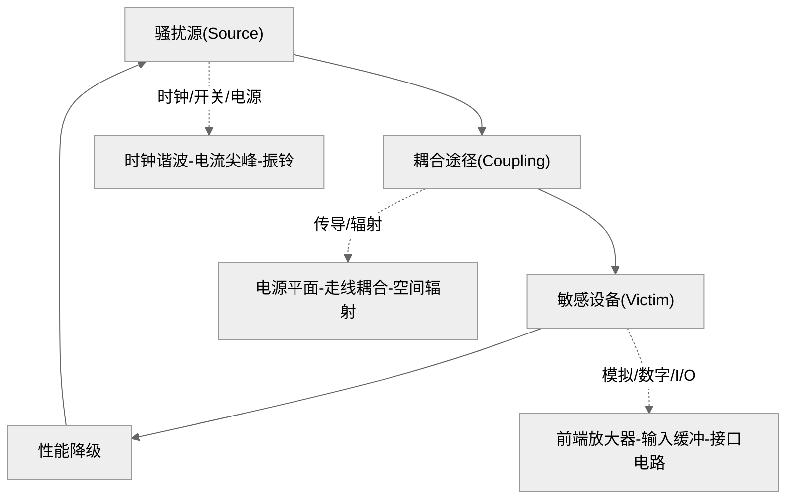
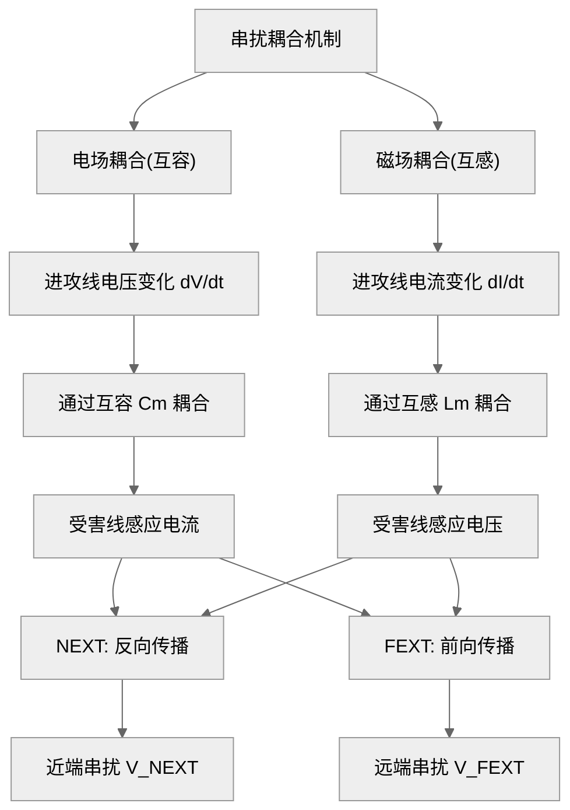
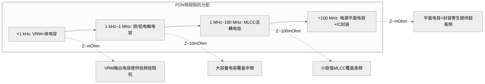
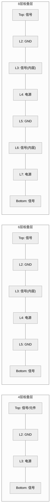
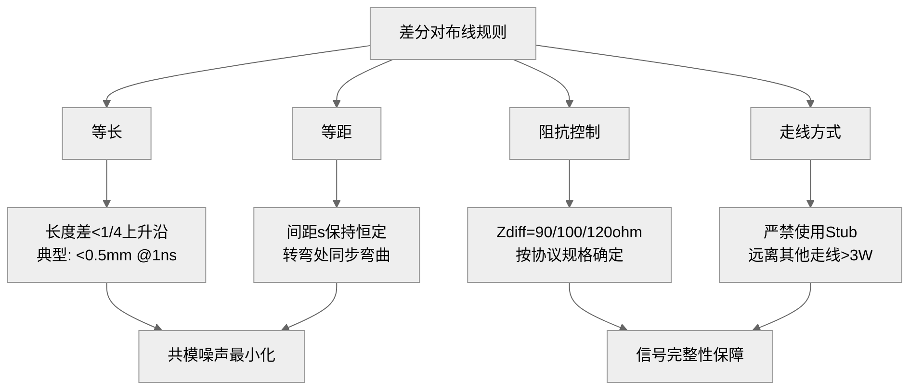
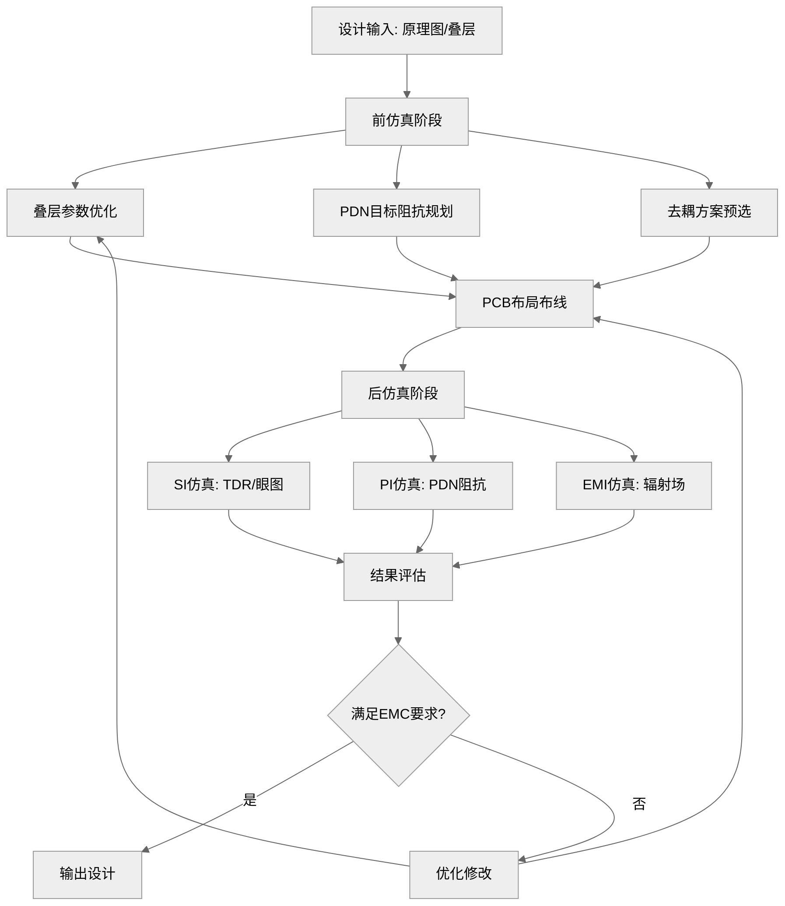

# 第11章 印制电路板的电磁兼容

## 学习目标

1. **记忆层**：能复述PCB中电阻、电容、电感和IC封装的高频等效模型及其寄生参数，列举EMC三要素在PCB中的具体表现形式，说出传输线理论的基本概念和关键公式。

2. **理解层**：能解释特性阻抗、反射系数、串扰耦合、PDN目标阻抗等核心概念的物理意义，说明微带线与带状线的结构差异及其对电磁兼容性能的影响，理解信号完整性与电源完整性之间的内在联系。

3. **应用层**：能根据给定的PCB参数（介电常数、介质厚度、线宽）计算微带线和带状线的特性阻抗，能利用谐振频率公式为给定频段选择去耦电容组合，能计算串扰电压和反射系数。

4. **分析层**：能分析串扰的互容/互感耦合机制，推导近端串扰和远端串扰的表达式，评估平行走线长度和间距对串扰水平的影响，分析PDN阻抗曲线的反谐振峰成因。

5. **评价层**：能评价给定PCB叠层结构的EMC性能优劣，判断去耦方案是否满足PDN目标阻抗要求，评估时钟走线设计的EMI风险，对同步开关噪声的影响做出定量判断。

6. **创造层**：能针对一个具体的数字系统（如8层板的FPGA系统）设计完整的PCB EMC方案，包括叠层规划、阻抗控制、去耦网络、布线规则和仿真验证流程。

7. **综合层**：能综合运用传输线理论、PDN分析和串扰模型，将PCB EMC设计方法与信号完整性（SI）、电源完整性（PI）建立系统的量化关联，形成从问题识别到方案验证的完整设计能力。

---

### §11.1 PCB的电磁兼容问题

#### 11.1.1 PCB的EMC三要素

电磁兼容问题由三个基本要素构成：**骚扰源（Source）**、**耦合途径（Coupling Path）** 和**敏感设备（Victim）**。在PCB层面，这三个要素以更加微观和密集的形式存在。PCB上的每一个数字芯片的时钟输出都是潜在的骚扰源，每一条平行走线都是潜在的能量耦合通道，每一个模拟输入引脚都是潜在的敏感节点。与系统级EMC不同的是，PCB上的三要素是动态转换的——同一个元件在不同的频率或时间窗口下，可能同时扮演骚扰源和敏感设备的角色。这种"角色二象性"是PCB EMC设计的核心挑战之一。

PCB中典型的骚扰源包括：时钟电路的谐波辐射、CMOS逻辑电路开关瞬态引起的电源电流尖峰、高速数字信号过冲/振铃产生的附加振荡、开关电源的脉动电流和塑料封装器件的内部电场泄漏。耦合途径分为两大类——**传导耦合**（通过电源/地平面、信号走线、共用阻抗传播）和**辐射耦合**（走线充当天线，远场辐射在自由空间中传播）。敏感设备则涵盖所有模拟前端电路、低电压高速输入缓冲器、时钟恢复电路和I/O接口电路。

下图以环形结构展示了PCB中EMC三要素的动态相互作用关系。

*图11-1 PCB EMC三要素相互作用图*

上图中，骚扰源通过耦合途径影响敏感设备，而敏感设备的性能降级又可能产生新的骚扰，形成闭环效应。理解这一闭环关系是PCB EMC设计的认识起点。

以PCB中一个典型的MCU系统为例。MCU的时钟振荡器（骚扰源）产生100 MHz的基频及其谐波，这些谐波通过时钟走线与I/O走线之间的平行耦合（耦合途径）进入I/O连接器，最终通过外部电缆辐射出去（传导—辐射转换）。同时，该I/O连接器也可能从外部引入ESD脉冲，经过同样的耦合路径反向传入MCU的输入缓冲器（敏感设备），导致程序跑飞。在这一过程中，MCU同时扮演了骚扰源和敏感设备的双重角色。理解这种角色的时空交织关系，是进行PCB EMC设计的第一步。

**电气长线与短线**

判断一条PCB走线是否需要作为传输线处理的关键标准是电气长度。走线的物理长度 $l$ 与信号上升时间所对应的等效波长 $\lambda_{\text{eff}}$ 之间的关系决定了走线的电特性。当满足 $l < \lambda_{\text{eff}}/6$ 时，走线属于**电气短线**，可视为集总电路；当 $l > \lambda_{\text{eff}}/10$ 时，必须使用传输线模型分析。这一临界长度条件的工程表达式为：

$$
l_{\text{critical}} = \frac{t_r}{2\sqrt{\varepsilon_{\text{re}}} \cdot \text{PD}}
\tag{11-1}
$$

式中，$l_{\text{critical}}$ 为临界长度（m），$t_r$ 为信号上升时间（s），PD为传播延迟（s/m），$\varepsilon_{\text{re}}$ 为有效介电常数。对于FR-4介质，传播延迟约为6 ps/mm，因此 $t_r = 1$ ns的信号对应的临界长度约为83 mm。$t_r = 0.5$ ns的信号对应的临界长度约为42 mm，$t_r = 0.1$ ns的信号则只需约8 mm。可见，随着数字信号速度的持续提升，传输线效应已成为PCB EMC设计中不可回避的普遍问题。

从EMC角度看，电气长线不仅是信号完整性问题，更是辐射问题——长线走线充当了效率不等的天线，其辐射效率随频率升高而增加。一条走线是否具有"天线属性"，取决于其电气长度是否超过波长的十分之一。当走线长度 $l \geq \lambda/10$ 时，走线开始有效辐射电磁能量。将这一条件与临界长度条件结合，可以得到一个重要的工程结论：**凡是需要进行传输线建模的走线，都应当对其辐射效应进行定量评估**。

工程实践中区分以下三类电气长度区域：

| 电气长度 | $l < \lambda/10$ | $\lambda/10 \leq l < \lambda/4$ | $l \geq \lambda/4$ |
|:--------:|:----------------:|:-------------------------------:|:------------------:|
| 模型      | 集总电路         | 传输线（辐射可忽略）            | 传输线（辐射显著） |
| EMC风险  | 低               | 中等                            | 高                  |
| 处理方式  | 按常规布线       | 控制阻抗，匹配端接              | 严格阻抗控制+端接  |

故，PCB EMC设计的第一条工程准则是：所有的信号路径和返回路径都应当构成面积最小的回路，且回路尺寸应远小于信号感兴趣的波长。在布线设计中对临界长度以上的走线，必须按传输线设计，精确控制特性阻抗。

#### 11.1.2 PCB元器件的射频特性

在低频电路中，电阻、电容、电感被认为是理想的集总元件。但随着工作频率进入射频和微波频段（一般而言，当频率超过1 MHz时），元件的实际行为开始偏离其理想模型——每个元件都包含寄生参数，这些寄生参数在高频下变得不可忽略。

**电阻的高频等效模型**

一个实际的电阻器在高频下等效为一个电阻 $R$ 串联引线电感 $L_{\text{lead}}$，再并联寄生电容 $C_{\text{para}}$。引线电感来源于电阻器的金属引线结构，典型值为每毫米引线约1 nH。寄生电容则来源于电阻体两端之间的电场耦合，对于贴片电阻，$C_{\text{para}}$ 约为0.1~0.5 pF。当频率较低时（$f < 1/(2\pi\sqrt{L_{\text{lead}}C_{\text{para}}})$），电阻表现为纯电阻；当频率接近自谐振频率时，电阻呈现LC谐振特性；超过自谐振频率后，电阻表现为电感性或电容性，完全失去其标称阻值功能。电阻的自谐振频率由下式给出：

$$
f_{\text{res},R} = \frac{1}{2\pi\sqrt{L_{\text{lead}}C_{\text{para}}}}
\tag{11-2}
$$

式中，$f_{\text{res},R}$ 为电阻的自谐振频率（Hz），$L_{\text{lead}}$ 为引线电感（H），$C_{\text{para}}$ 为寄生电容（F）。

**电容的高频等效模型**

电容的高频等效模型是PCB EMC设计中最需要关注的非理想特性之一。一个实际电容由标称电容 $C$、**等效串联电阻（ESR）** 和**等效串联电感（ESL）** 串联组成。ESR来源于介质损耗和金属电极的欧姆电阻；ESL主要由电容器的封装结构和引线决定。以0805封装的MLCC为例，其典型ESL约为0.5~1 nH，0603封装约为0.3~0.5 nH，0402封装可低至0.15~0.3 nH。封装越小，ESL越低，高频性能越好。

电容的阻抗随频率变化的关系式为：

$$
Z_C = R_{\text{ESR}} + j\left(2\pi f L_{\text{ESL}} - \frac{1}{2\pi f C}\right)
\tag{11-3}
$$

用角频率 $\omega = 2\pi f$ 表示为：

$$
Z_C = R_{\text{ESR}} + j\left(\omega L_{\text{ESL}} - \frac{1}{\omega C}\right)
\tag{11-4}
$$

式中，$Z_C$ 为电容的复阻抗（$\Omega$），$R_{\text{ESR}}$ 为等效串联电阻（$\Omega$），$L_{\text{ESL}}$ 为等效串联电感（H），$C$ 为电容标称值（F），$\omega$ 为角频率（rad/s）。

当电容的容性电抗与感性电抗恰好相等时，电容发生**串联谐振**，此时阻抗达到最小值。电容的自谐振频率由以下推导确定。

① **物理原理**：电容的串联谐振发生在容抗与感抗相互抵消的频率点，此时电容呈现纯电阻特性（仅剩ESR），阻抗最小，去耦效果最佳。

② **建模假设**：将电容视为 $R_{\text{ESR}}$、$L_{\text{ESL}}$ 和 $C$ 的串联RLC电路，忽略其他高阶寄生效应。

③ **原始方程**：串联RLC电路的阻抗为

$$
Z = R + j\left(\omega L - \frac{1}{\omega C}\right)
\tag{11-5}
$$

根据串联谐振定义，令阻抗虚部为零可得谐振条件为：

整理得：

$$
\omega L - \frac{1}{\omega C} = 0
\tag{11-6}
$$

④ **数学代入**：将 $\omega = 2\pi f$ 代入谐振条件：

$$
2\pi f_{\text{res}} L_{\text{ESL}} - \frac{1}{2\pi f_{\text{res}} C} = 0
\tag{11-7}
$$

⑤ **导出结果**：整理后得到电容的自谐振频率公式：

$$
f_{\text{res}} = \frac{1}{2\pi\sqrt{L_{\text{ESL}} C}}
\tag{11-8}
$$

式中，$f_{\text{res}}$ 为电容的自谐振频率（Hz），$L_{\text{ESL}}$ 为等效串联电感（H），$C$ 为电容标称值（F）。

⑥ **参数解释**：由式（11-5）可知，电容的谐振频率与 $\sqrt{C}$ 和 $\sqrt{L_{\text{ESL}}}$ 成反比。大容值电容的谐振频率较低，适合抑制低频噪声；小容值电容的谐振频率较高，适合抑制高频噪声。这就是工程中使用多级去耦（如10 μF + 0.1 μF + 0.001 μF组合）的物理基础——通过不同谐振频率的电容器实现宽频带的低阻抗去耦。

电容的品质因数（Q值）衡量其谐振峰的尖锐程度，由ESR决定：

$$
Q = \frac{1}{2\pi f_{\text{res}} C R_{\text{ESR}}}
\tag{11-9}
$$

式中，$Q$ 为电容的品质因数（无量纲），$f_{\text{res}}$ 为自谐振频率（Hz），$C$ 为电容（F），$R_{\text{ESR}}$ 为等效串联电阻（$\Omega$）。高Q值电容的阻抗谷底尖锐，低Q值电容的阻抗谷底平坦——后者更适合宽频去耦。

**电感的等效高频模型**

实际电感器在高频下等效为电感 $L$ 串联电阻 $R_{\text{DC}}$（直流电阻），再并联分布电容 $C_{\text{para}}$。分布电容来源于线圈匝与匝之间的电场耦合。分布电容的存在使电感具有**自谐振频率（SRF）**——当频率超过SRF后，电感呈现电容性，失去阻流作用。电感的阻抗随频率变化的关系为：

$$
Z_L = R_{\text{DC}} + \frac{j\omega L}{1 - \omega^2 L C_{\text{para}} + j\omega R_{\text{DC}} C_{\text{para}}}
\tag{11-10}
$$

式中，$Z_L$ 为电感的复阻抗（$\Omega$），$R_{\text{DC}}$ 为直流电阻（$\Omega$），$L$ 为电感标称值（H），$C_{\text{para}}$ 为分布电容（F）。电感的自谐振频率为：

$$
f_{\text{res},L} = \frac{1}{2\pi\sqrt{L C_{\text{para}}}}
\tag{11-11}
$$

**有源器件的射频特性**

集成电路（IC）的高频特性由芯片内部结构、封装类型和引脚布局共同决定。常见的封装类型（SOIC、QFP、BGA、QFN）具有显著不同的寄生参数。IC引脚的高频模型包括：每个引脚对地的寄生电容（5~20 pF取决于封装类型）、引脚自身的串联电感（SOIC封装的典型值为每引脚5~10 nH，BGA封装可低至1~3 nH），以及电源/地引脚之间的封装内耦合电容。

下表比较了不同封装类型的典型寄生参数范围。

| 封装类型 | 引脚电感（nH） | 对地电容（pF） | 适用频率上限 |
|:--------:|:--------------:|:--------------:|:------------:|
| SOIC-8   | 6~10           | 3~5            | ~100 MHz     |
| QFP-64   | 4~8            | 2~4            | ~200 MHz     |
| QFN-48   | 1~3            | 1~2            | ~1 GHz       |
| BGA-256  | 0.5~2          | 0.5~1.5        | ~3 GHz       |

从EMC角度分析，更大的封装寄生参数意味着更差的射频性能和更多的辐射。故，高速IC优先选用BGA或QFN封装，而非传统的SOIC和QFP封装。

#### 11.1.3 走线带的阻抗特性

PCB上的走线在高频下不再是简单的低阻抗连线，而是表现为**有损耗的传输线**。走线的特性阻抗是PCB EMC设计中最基本的参数之一——它决定了信号的反射水平、辐射效率以及串扰水平。

**传输线特性阻抗的物理原理**

① **物理原理**：PCB走线在电磁场的视角下，由信号导体和返回路径（通常是地平面）构成一个二维传输结构。当信号沿走线传播时，走线单位长度上分布的电感 $L_0$（H/m）和电容 $C_0$（F/m）共同决定了电磁能量沿该结构传播的阻抗——即特性阻抗 $Z_0$。

② **建模假设**：假设电磁波在走线结构中呈**横电磁模（TEM）** 传播——即电场和磁场均垂直于传播方向。介质均匀分布，走线为无限长直导线，忽略导体损耗和介质损耗。这一假设在典型的PCB频率范围内（DC~3 GHz）具有良好的近似精度。

③ **原始方程**：根据传输线理论，无耗传输线的特性阻抗由单位长度电感和电容决定：

由此可得：

$$
Z_0 = \sqrt{\frac{L_0}{C_0}}
\tag{11-12}
$$

式中，$L_0$ 和 $C_0$ 分别为单位长度电感和电容。

④ **数学代入**：对于微带线结构（信号走线在PCB表层，下方为介质层和地平面），单位长度电容 $C_0$ 由走线宽度 $w$、介质厚度 $h$ 和相对介电常数 $\varepsilon_r$ 决定。精确的准静态分析给出微带线特性阻抗的计算公式。

⑤ **导出结果**：微带线特性阻抗的封闭形式精确解为两条公式，按宽高比 $w/h$ 分段。当走线较细时（$w/h \leq 1$）：

$$
Z_0 = \frac{60}{\sqrt{\varepsilon_{\text{re}}}} \ln\left(\frac{8h}{w} + \frac{w}{4h}\right)
\tag{11-13}
$$

当走线较粗时（$w/h \geq 1$）：

$$
Z_0 = \frac{120\pi}{\sqrt{\varepsilon_{\text{re}}} \left[\frac{w}{h} + 1.393 + 0.667 \ln\left(\frac{w}{h} + 1.444\right)\right]}
\tag{11-14}
$$

式中，$Z_0$ 为微带线特性阻抗（$\Omega$），$w$ 为走线宽度（m或mm，与 $h$ 单位一致），$h$ 为介质层厚度（信号层到参考地平面的距离），$\varepsilon_{\text{re}}$ 为有效介电常数，由下式给出：

$$
\varepsilon_{\text{re}} = \frac{\varepsilon_r + 1}{2} + \frac{\varepsilon_r - 1}{2}\left(1 + \frac{12h}{w}\right)^{-1/2}
\tag{11-15}
$$

式中，$\varepsilon_r$ 为介质材料的相对介电常数（FR-4约为4.2~4.5），$\varepsilon_{\text{re}}$ 为考虑空气与介质混合填充后的有效介电常数（介于1和 $\varepsilon_r$ 之间）。对于微带线，电磁场的上半部分在空气中传播，下半部分在介质中传播，因此有效介电常数介于1与 $\varepsilon_r$ 之间。

对于工程设计，当不需要极高精度（允许约5%误差）时，可使用Hammerstad-Jensen近似公式：

$$
Z_0 = \frac{87}{\sqrt{\varepsilon_r + 1.41}} \ln\left(\frac{5.98h}{0.8w + t}\right)
\tag{11-16}
$$

式中，$t$ 为走线的铜箔厚度（m或mm）。这个近似公式将复杂的分段函数统一为一个表达式，虽然精度略低，但物理意义更直观——$Z_0$ 随 $w/h$ 增大而减小，随 $\sqrt{\varepsilon_r}$ 增大而减小。

⑥ **参数解释**：由式（11-9）和（11-10）可知，微带线特性阻抗主要由 $w/h$ 比值和 $\varepsilon_r$ 决定。$w/h$ 越大，$Z_0$ 越小；$\varepsilon_r$ 越大，$Z_0$ 越小。对于一个50 $\Omega$ 的微带线，在FR-4介质（$\varepsilon_r \approx 4.3$）上，当 $h = 0.2$ mm时，$w$ 大约为0.37 mm；当 $h = 0.1$ mm时，$w$ 大约为0.18 mm。

**例11-1**：一块FR-4 PCB板材的 $\varepsilon_r = 4.3$，信号层与地平面之间的介质厚度 $h = 0.2$ mm。试计算走线宽度 $w = 0.35$ mm时的微带线特性阻抗 $Z_0$（使用 $w/h \geq 1$ 的公式），并判断该走线是否满足50 $\Omega$ 阻抗控制要求（允许误差 ±10%）。

解：首先计算宽高比：

$$
\frac{w}{h} = \frac{0.35}{0.2} = 1.75
\tag{11-17}
$$

由于 $w/h = 1.75 > 1$，使用式（11-10）计算。首先计算 $\varepsilon_{\text{re}}$：

$$
\varepsilon_{\text{re}} = \frac{4.3 + 1}{2} + \frac{4.3 - 1}{2}\left(1 + \frac{12 \times 0.2}{0.35}\right)^{-1/2}
\tag{11-18}
$$

$$
= 2.65 + 1.65 \times (1 + 6.857)^{-1/2} = 2.65 + 1.65 \times (7.857)^{-1/2}
\tag{11-19}
$$

$$
= 2.65 + 1.65 \times 0.3567 = 2.65 + 0.588 = 3.238
\tag{11-20}
$$

代入式（11-10）：

$$
Z_0 = \frac{120\pi}{\sqrt{3.238} \times \left[1.75 + 1.393 + 0.667\ln(1.75 + 1.444)\right]}
\tag{11-21}
$$

$$
= \frac{120\pi}{1.799 \times \left[3.143 + 0.667 \times \ln(3.194)\right]}
\tag{11-22}
$$

$$
= \frac{376.99}{1.799 \times \left[3.143 + 0.667 \times 1.161\right]} = \frac{376.99}{1.799 \times (3.143 + 0.774)}
\tag{11-23}
$$

继续化简计算得：

$$
= \frac{376.99}{1.799 \times 3.917} = \frac{376.99}{7.047} \approx 53.5\ \Omega
\tag{11-24}
$$

验证：$|53.5 - 50|/50 = 7\% < 10\%$，满足50 $\Omega$ 阻抗控制要求。

**传输线的损耗与传播速度**

PCB走线的传输损耗来源于导体损耗和介质损耗。在低频段（<100 MHz），导体损耗占主导；在高频段（>100 MHz），介质损耗成为主要因素。趋肤深度是决定导体损耗的关键参数，其通用表达式为：

$$
\delta = \sqrt{\frac{\rho}{\pi f \mu_0}}
\tag{11-25}
$$

更一般地，用电导率 $\sigma$ 和介质磁导率 $\mu$ 表示：

$$
\delta = \frac{1}{\sqrt{\pi f \mu \sigma}}
\tag{11-26}
$$

式中，$\delta$ 为趋肤深度（m），$f$ 为频率（Hz），$\mu$ 为导体磁导率（H/m），$\sigma$ 为电导率（S/m）。对于铜导体，$\sigma \approx 5.8 \times 10^7$ S/m，$\mu \approx \mu_0 = 4\pi \times 10^{-7}$ H/m，代入得 $\delta \approx 66/\sqrt{f}$ μm。铜在100 MHz时的趋肤深度约为6.6 μm。信号在微带线中的传播速度为：

$$
v_p = \frac{c}{\sqrt{\varepsilon_{\text{re}}}}
\tag{11-27}
$$

式中，$v_p$ 为信号的相速度（m/s），$c = 3 \times 10^8$ m/s为真空光速，$\varepsilon_{\text{re}}$ 为有效介电常数。对于FR-4材料（$\varepsilon_{\text{re}} \approx 3.2$），$v_p \approx 1.68 \times 10^8$ m/s，约为光速的56%。

**传输线阻抗匹配的工程意义**

传输线阻抗匹配的核心目的是消除信号反射。当驱动端输出阻抗与走线特性阻抗不一致时，信号在驱动端和接收端之间反复反射，产生过冲、下冲和振铃——这些现象不仅恶化信号质量（SI），还会导致额外的电磁辐射（EMI）。反射系数与阻抗失配的关系为 $\Gamma = (Z_L - Z_0)/(Z_L + Z_0)$——这是信号完整性与EMC之间的桥梁公式。

在工程实现中，PCB走线的特性阻抗受多个制造参数影响。FR-4材料的介电常数存在批次差异（通常在4.2~4.6之间变化），介质厚度的加工公差约为±10%，走线宽度刻蚀公差约为±15%（取决于铜厚和线宽）。因此，即使设计目标为50 $\Omega$，实际制造后的阻抗值也会有约±10%的偏差。行业通行做法是设置阻抗测试条（Coupon），在PCB生产完成后通过TDR测量验证阻抗是否在规格范围内。

在毫米波频段（>10 GHz），走线表面的粗糙度对导体损耗的影响变得显著。铜箔表面粗糙度（通常为0.5~5 μm RMS）会使高频电阻增大30~100%，加剧信号衰减。对于这类高频应用，应选用低粗糙度的反转处理铜箔（如RTF或VLP铜箔）。

---

### §11.2 信号完整性分析

信号完整性（Signal Integrity, SI）分析是PCB电磁兼容设计的核心环节。信号的反射、串扰、过冲和时序偏差等问题，不仅直接决定数字系统能否正常工作，更是EMI辐射的重要来源。本节从传输线理论出发，系统分析信号在PCB走线中的传播行为及其对EMC的影响。

#### 11.2.1 传输线理论与信号反射

**传输线的基本概念**

PCB上的每一条走线，当其电气长度超过信号上升沿有效长度的六分之一时，就必须视为传输线来处理。传输线由信号导体和返回路径（参考平面）共同构成，电磁能量以TEM模沿传输线传播。传输线的两个最基本参数是**特性阻抗 $Z_0$** 和**传播常数 $\gamma$**。

对于一段无耗传输线，沿线电压和电流的分布由电报方程描述：

$$
\frac{d^2 V(z)}{dz^2} + \beta^2 V(z) = 0
\tag{11-28}
$$

$$
\frac{d^2 I(z)}{dz^2} + \beta^2 I(z) = 0
\tag{11-29}
$$

其中 $\beta = \omega\sqrt{L_0 C_0}$ 为相位常数。由波动方程求解，得通解为入射波与反射波的叠加：

$$
V(z) = V_0^+ e^{-j\beta z} + V_0^- e^{j\beta z}
\tag{11-30}
$$

$$
I(z) = \frac{V_0^+}{Z_0} e^{-j\beta z} - \frac{V_0^-}{Z_0} e^{j\beta z}
\tag{11-31}
$$

**信号反射与反射系数**

当传输线的负载阻抗 $Z_L$ 与特性阻抗 $Z_0$ 不相等时，一部分信号能量在负载端被反射回源端，形成反射波。反射系数 $\Gamma$ 定义为反射波电压与入射波电压之比，其推导过程如下。

① **物理原理**：在传输线的负载端，电压和电流必须满足负载的阻抗约束条件和传输线上波传播的连续性条件。反射系数量化了阻抗失配的程度，决定了反射波的能量比例。

② **建模假设**：传输线无损耗，负载端为集总阻抗，信号在端接处发生瞬时反射，忽略端接结构的寄生电抗成分。

③ **原始方程**：由传输线理论，端接处的电压连续性和电流连续性要求入射波与反射波在端接点满足基尔霍夫定律。负载端的电压 $V_L$ 和电流 $I_L$ 满足：

$$
V_L = V_{\text{inc}} + V_{\text{ref}}
\tag{11-32}
$$

同时，由传输线理论，负载端电流表达式为：

$$
I_L = I_{\text{inc}} - I_{\text{ref}} = \frac{V_{\text{inc}}}{Z_0} - \frac{V_{\text{ref}}}{Z_0}
\tag{11-33}
$$

同时，负载端的欧姆定律要求 $V_L = Z_L I_L$。

④ **数学代入**：将电压和电流表达式代入负载条件：

$$
V_{\text{inc}} + V_{\text{ref}} = Z_L\left(\frac{V_{\text{inc}}}{Z_0} - \frac{V_{\text{ref}}}{Z_0}\right)
\tag{11-34}
$$

⑤ **导出结果**：整理得到反射系数的标准公式：

$$
\Gamma = \frac{V_{\text{ref}}}{V_{\text{inc}}} = \frac{Z_L - Z_0}{Z_L + Z_0}
\tag{11-35}
$$

式中，$\Gamma$ 为反射系数（无量纲），$Z_L$ 为负载阻抗（$\Omega$），$Z_0$ 为走线特性阻抗（$\Omega$）。

⑥ **参数解释**：当 $Z_L = Z_0$ 时，$\Gamma = 0$，无反射，信号能量全部被负载吸收。当 $Z_L = \infty$（开路）时，$\Gamma = 1$，信号全反射；当 $Z_L = 0$（短路）时，$\Gamma = -1$，信号反相反射。$|\Gamma|$ 越接近1，反射越严重，信号质量越差，EMI辐射越强。

电压驻波比（VSWR）是反射系数的另一种表达形式，常用于射频工程：

$$
\text{VSWR} = \frac{1 + |\Gamma|}{1 - |\Gamma|}
\tag{11-36}
$$

**传输系数与信号传输**

与反射系数相对应的是传输系数 $T$，它描述了入射信号中有多少能量传递到负载端。传输系数的定义为负载电压与入射电压之比：

$$
T = \frac{V_L}{V_{\text{inc}}} = 1 + \Gamma = \frac{2Z_L}{Z_L + Z_0}
\tag{11-37}
$$

式中，$T$ 为传输系数（无量纲）。当 $Z_L = Z_0$ 时，$T = 1$，全部能量传输到负载；当 $Z_L$ 为任意值时，$T$ 介于0与2之间。

#### 11.2.2 串扰分析

串扰（Crosstalk）是平行走线之间不需要的电磁耦合，是高速PCB设计中最棘手的EMC问题之一。串扰在骚扰线上表现为对自身信号的干扰，在受害线上表现为对目标信号的干扰。

**串扰耦合机制**

① **物理原理**：串扰由两种耦合机制共同产生——**互容（Mutual Capacitance）耦合**（电场耦合）和**互感（Mutual Inductance）耦合**（磁场耦合）。当一条走线（进攻线）上的信号电压变化时，通过互容在相邻走线（受害线）上感应出电流；当进攻线上的信号电流变化时，通过互感在受害线上感应出电压。

② **建模假设**：弱耦合假设（耦合不显著影响进攻线本身的传输特性），均匀介质（$\varepsilon_r$ 恒定），TEM模传播，走线为无限长均匀平行结构。

③ **原始方程**：单位长度的互容 $C_m$ 和互感 $L_m$。根据互容耦合原理，电容性耦合电流为：

由互容耦合原理可得：

$$
I_C = j\omega C_m V_{\text{aggressor}}
\tag{11-38}
$$

电感性耦合电压为：

$$
V_L = j\omega L_m I_{\text{aggressor}} = j\omega L_m \cdot \frac{V_{\text{aggressor}}}{Z_0}
\tag{11-39}
$$

④ **数学代入**：对于耦合微带线结构，单位长度互容 $C_m = C_{m0} \cdot l$，单位长度互感 $L_m = L_{m0} \cdot l$，其中 $l$ 为平行走线耦合长度。

进攻线电压沿走线传播的表达式为 $V(z,t) = V_0 e^{j(\omega t - \beta z)}$。受害线上的串扰电压由前向波（同向传播）和反向波（反向传播）叠加构成。

近端（NEXT，靠近驱动器端）串扰电压为反向波在端口处的叠加，远端（FEXT，远离驱动器端）串扰电压为前向波在端点处的叠加。

各向同性介质中的串扰表达式可由以下推导得到。

⑤ **导出结果**：当耦合长度 $l$ 远小于信号波长的四分之一（电短耦合）时，近端串扰电压为：

$$
V_{\text{NEXT}} = \frac{1}{4}\left(\frac{C_m}{C} + \frac{L_m}{L}\right) \cdot V_{\text{aggressor}} \cdot \frac{l}{v \cdot t_r}
\tag{11-40}
$$

式中，$V_{\text{NEXT}}$ 为近端串扰电压（V），$C_m$ 和 $C$ 分别为单位长度互容和自容（F/m），$L_m$ 和 $L$ 分别为单位长度互感和自感（H/m），$V_{\text{aggressor}}$ 为进攻线驱动电压（V），$l$ 为平行耦合长度（m），$v$ 为信号传播速度（m/s），$t_r$ 为信号上升时间（s）。

远端串扰电压为：

$$
V_{\text{FEXT}} = \frac{1}{2}\left(\frac{C_m}{C} - \frac{L_m}{L}\right) \cdot V_{\text{aggressor}} \cdot \frac{l}{v \cdot t_r}
\tag{11-41}
$$

式中，$V_{\text{FEXT}}$ 为远端串扰电压（V），其余参数与式（11-19）相同。

对于均匀介质（如带状线结构），电磁波满足 $L_m/L = C_m/C$，因此远端串扰 $V_{\text{FEXT}} = 0$。但对于微带线结构，由于电磁场一部分在空气一部分在介质中传播（非均匀介质），$L_m/L \neq C_m/C$，故远端串扰不为零。这一差异从物理上解释了为什么带状线的串扰性能优于微带线。

当耦合长度 $l$ 较长时（$l > t_r / (2\text{PD})$），近端串扰达到饱和值，不再随长度增加。饱和近端串扰电压为：

$$
V_{\text{NEXT,sat}} = \frac{1}{4}\left(\frac{C_m}{C} + \frac{L_m}{L}\right) \cdot V_{\text{aggressor}}
\tag{11-42}
$$

饱和条件对应的时间物理意义是：进攻线信号的上升边沿完全走过耦合区域后，近端串扰不再增加，达到最大值。

串扰耦合系数 $K$ 定义为受害线上串扰电压与进攻线电压之比，是工程中常用的串扰度量：

$$
K_{\text{NEXT}} = \frac{V_{\text{NEXT}}}{V_{\text{aggressor}}} = \frac{1}{4}\left(\frac{C_m}{C} + \frac{L_m}{L}\right) \cdot \frac{l}{v \cdot t_r}
\tag{11-43}
$$

$$
K_{\text{FEXT}} = \frac{V_{\text{FEXT}}}{V_{\text{aggressor}}} = \frac{1}{2}\left(\frac{C_m}{C} - \frac{L_m}{L}\right) \cdot \frac{l}{v \cdot t_r}
\tag{11-44}
$$

⑥ **参数解释**：由式（11-19）可见，近端串扰与耦合长度成正比、与上升时间成反比——这意味着信号速度越快（上升时间越短），串扰越严重。由式（11-20）可见，远端串扰在微带线中存在（因为 $C_m/C \neq L_m/L$），且随耦合长度线性增长。工程上，对于 $t_r = 0.5$ ns的信号和耦合长度 $l = 30$ mm，若 $C_m/C + L_m/L \approx 0.3$，则 $V_{\text{NEXT}} \approx 0.075V_{\text{aggressor}}$，即串扰约为7.5%。

下图用Mermaid图直观展示了串扰的两种耦合机制。

*图11-2 串扰耦合机制图*

上图中，电场耦合和磁场耦合分别对应互容和互感机制，二者在受害线上产生的串扰电压在近端和远端叠加。在均匀介质中（带状线），电场与磁场耦合在远端互相抵消（$C_m/C = L_m/L$），这也是带状线在串扰控制方面优于微带线的根本原因。

**3W原则推导**

3W原则是PCB布线中控制串扰的著名工程经验规则：两条平行走线之间的中心间距应不小于3倍走线宽度。这一原则可以通过串扰耦合机制定量推导。

① **物理原理**：串扰水平随走线间距的增大而衰减。当间距增大到某一阈值时，串扰可被控制在可接受的范围内（通常为目标信号摆幅的1%以下）。

② **建模假设**：均匀耦合传输线，微带线结构，弱耦合假设。

③ **原始方程**：由耦合系数与间距的指数衰减关系可知，对于微带线，互容和互感随间距指数衰减：

$$
C_m \propto e^{-\alpha s/h}, \quad L_m \propto e^{-\alpha s/h}
\tag{11-45}
$$

其中 $h$ 为介质厚度，$\alpha$ 为衰减系数。

④ **数学代入**：串扰电压与耦合系数成正比，而耦合系数与间距的关系为 $k \propto e^{-\alpha s/h}$。

⑤ **导出结果**：当 $s = 3w$（$w$ 为走线宽度）时，对于典型FR-4微带线（$w/h \approx 1$），$s/h \approx 3$，耦合系数降低到 $s/h = 1$ 时的约10%以下。对应的串扰水平远低于1%。因此：

$$
s \geq 3w
\tag{11-46}
$$

式中，$s$ 为两条平行走线的中心间距，$w$ 为走线宽度（单位一致）。这条规则确保了串扰被抑制在工程可接受的水平。

⑥ **参数解释**：3W原则是一个经验下限，并非严格的理论界限。对于高噪声敏感度电路（如模拟ADC输入、PLL参考时钟），可能需要5W甚至10W的间距。反之，对于空间极为紧张的PCB，如果串扰仿真表明1%的耦合水平可以接受，也可以适当放宽到2.5W。**仿真是3W原则的最终判定标准**。

**例11-2**：一条微带线的走线宽度 $w = 0.2$ mm，介质厚度 $h = 0.2$ mm，其与相邻走线的中心间距为0.4 mm（即 $s = 0.4$ mm，$s/h = 2$）。进攻线信号幅值 $V_{\text{agg}} = 3.3$ V，上升时间 $t_r = 1$ ns，耦合长度 $l = 30$ mm。已知FR-4介质的传播速度 $v \approx 1.5 \times 10^8$ m/s，且 $C_m/C = L_m/L \approx 0.15$（微带线近似）。试计算近端串扰电压。

解：首先判断耦合长度是否达到饱和。饱和长度 $l_{\text{sat}} = t_r \times v / 2 = 1 \times 10^{-9} \times 1.5 \times 10^8 / 2 = 0.075$ m = 75 mm。实际耦合长度 $l = 30$ mm < 75 mm，未达到饱和，应用式（11-19）。

$$
V_{\text{NEXT}} = \frac{1}{4} \times (0.15 + 0.15) \times 3.3 \times \frac{30 \times 10^{-3}}{1.5 \times 10^8 \times 1 \times 10^{-9}}
\tag{11-47}
$$

$$
= \frac{1}{4} \times 0.3 \times 3.3 \times \frac{0.03}{0.15} = 0.075 \times 3.3 \times 0.2
\tag{11-48}
$$

计算得：

$$
= 0.0495\ \text{V}
\tag{11-49}
$$

近端串扰电压约为49.5 mV，占信号幅值的1.5%。如果将间距增加到 $s = 3w = 0.6$ mm（$s/h = 3$），耦合系数降低（假设 $C_m/C = L_m/L \approx 0.08$），代入新的耦合系数值重新计算得：

$$
V_{\text{NEXT}} = \frac{1}{4} \times (0.08 + 0.08) \times 3.3 \times \frac{0.03}{0.15} = 0.04 \times 3.3 \times 0.2 = 0.0264\ \text{V}
\tag{11-50}
$$

串扰降低到26.4 mV（0.8%），改善约5.5 dB。

验证：近端串扰从 $s/h=2$ 时的49.5 mV（1.5%）降至 $s/h=3$ 时的26.4 mV（0.8%），降幅约5.5 dB。3W原则（$s=3w$）可将串扰抑制在1%以下，有效保障信号完整性。

#### 11.2.3 信号过冲、振铃与阻抗匹配

**过冲与振铃的物理机制**

当传输线的阻抗不匹配时，信号在驱动端和接收端之间发生多次反射，产生过冲（Overshoot）、下冲（Undershoot）和振铃（Ringing）。过冲是指信号电压超过其稳态值的现象，下冲是指信号电压低于其稳态值的现象，而振铃是过冲/下冲之后信号电压围绕稳态值的衰减振荡。

过冲和振铃的EMC危害在于：过冲信号包含更多的高频谐波分量，这些分量通过走线辐射出去，导致EMI超标。研究表明，一个过冲为30%的方波信号比完美端接的方波信号在第五次谐波处多发出约15 dB的辐射能量。

**多次反射与振铃波形**

考虑一个典型的驱动端—传输线—接收端系统。驱动端输出阻抗为 $Z_s$，传输线特性阻抗为 $Z_0$，接收端输入阻抗为 $Z_L$。信号在驱动端和接收端的反射系数分别为：

$$
\Gamma_s = \frac{Z_s - Z_0}{Z_s + Z_0}
\tag{11-51}
$$

$$
\Gamma_L = \frac{Z_L - Z_0}{Z_L + Z_0}
\tag{11-52}
$$

信号沿传输线的单程传播延迟为 $t_d = l/v_p$。信号在驱动端和接收端之间反复反射，每次反射后幅度乘以相应的反射系数，形成逐渐衰减的振铃波形。根据多次反射的叠加原理，第 $n$ 次反射波到达接收端时的幅度表达式为：

$$
V_{n,\text{rec}} = V_{\text{inc}} \cdot \Gamma_L \cdot (\Gamma_s \Gamma_L)^{n-1}
\tag{11-53}
$$

式中，$V_{\text{inc}}$ 为入射波电压，$n$ 为反射次数。接收端的总电压为入射波与各次反射波的叠加：

$$
V_{\text{rec}}(t) = V_{\text{inc}} \left[1 + \Gamma_L \sum_{n=1}^{\infty} (\Gamma_s \Gamma_L)^{n-1} u(t - (2n-1)t_d)\right]
\tag{11-54}
$$

式中，$u(t)$ 为单位阶跃函数。当 $|\Gamma_s \Gamma_L| < 1$ 时，级数收敛，振铃幅度随时间指数衰减。衰减速度由 $|\Gamma_s \Gamma_L|$ 决定——该乘积越接近1，振铃越持久。

**阻抗匹配技术**

消除或减小过冲和振铃的根本方法是实现阻抗匹配。PCB工程中常用的端接技术包括以下几种。

**(1) 串联端接（源端串联阻尼）**

在驱动器的输出端串联一个电阻 $R_s$，使驱动端总输出阻抗 $Z_s + R_s$ 与传输线特性阻抗 $Z_0$ 匹配。串联端接是最简单、成本最低的端接方式，也是时钟走线中最常用的EMI控制手段之一。

① **物理原理**：串联端接电阻与驱动器输出阻抗串联，使源端的总阻抗等于 $Z_0$，从而消除源端的二次反射。信号在传输线上传播时，在接收端（高阻抗）发生全反射（$\Gamma_L \approx 1$），反射波回到源端后被匹配的源端吸收，不再产生新的反射。

② **建模假设**：驱动器为线性电压源，输出阻抗为 $Z_s$；接收端为高阻抗输入（$Z_L \gg Z_0$）；传输线无损耗。

③ **原始方程**：源端反射系数为 $\Gamma_s = (R_s + Z_s - Z_0)/(R_s + Z_s + Z_0)$。要使 $\Gamma_s = 0$，需满足：

$$
R_s + Z_s = Z_0
\tag{11-55}
$$

④ **数学代入**：实际驱动器的输出阻抗 $Z_s$ 通常在10~20 $\Omega$ 之间。对于 $Z_0 = 50\ \Omega$ 的传输线：

$$
R_s = Z_0 - Z_s
\tag{11-56}
$$

⑤ **导出结果**：串联阻尼电阻的取值公式为：

$$
R_s = Z_0 - Z_{\text{out}}
\tag{11-57}
$$

式中，$R_s$ 为串联端接电阻（$\Omega$），$Z_0$ 为传输线特性阻抗（$\Omega$），$Z_{\text{out}}$ 为驱动器输出阻抗（$\Omega$）。

⑥ **参数解释**：对于CMOS驱动器，输出阻抗通常在10~20 $\Omega$ 之间。当 $Z_0 = 50\ \Omega$ 时，$R_s$ 通常取22~33 $\Omega$。一个精确匹配的串联阻尼电阻可将过冲从50%以上降低到5%以下，对应的辐射改善约为10~15 dB。串联端接的缺点是限制了信号的边沿速率——$R_s$ 与走线电容形成RC低通滤波器，增加了信号的上升时间。选用时应权衡SI和EMI两方面的需求。

**(2) 并联端接**

在接收端将电阻 $R_p$ 并联到地（或电源），使接收端总阻抗等于 $Z_0$。$R_p$ 的取值为 $R_p = Z_0$。并联端接可以完全消除接收端的反射，但会增加直流功耗——在信号为高电平时，$R_p$ 上有持续的直流电流。这一功耗在低功耗设计中通常是不可接受的。

**(3) RC端接（交流并联端接）**

在接收端串联RC网络到地，其中 $R = Z_0$，$C$ 的选择使RC时间常数远大于信号的上升时间（通常取 $C > 10 \times t_r / Z_0$）。RC端接消除了并联端接的直流功耗问题，但增加了电容的寄生参数，在极高频率下效果有限。

**(4) Thevenin端接**

使用两个电阻 $R_1$ 和 $R_2$ 分别连接到电源和地，使等效阻抗等于 $Z_0$，同时将接收端偏置到 $V_{\text{dd}}/2$。适用于高速总线（如DDR、GTL），但两个电阻持续消耗直流功率。

**端接技术的选择指南**

| 端接类型 | 优点 | 缺点 | 适用场景 |
|:--------:|:----|:----|:---------|
| 串联（$R_s$） | 低成本，低功耗 | 增加上升时间 | 时钟信号、点对点 |
| 并联（$R_p$） | 消除反射彻底 | 直流功耗大 | 高速总线（低频） |
| RC | 低功耗 | 高频受限 | 双倍数据率DDR |
| Thevenin | 偏置固定 | 直流功耗大 | 差分信号、GTL总线 |

#### 11.2.4 时序分析与信号延迟

**传播延迟**

信号沿PCB走线的传播速度由介质的有效介电常数决定。信号从驱动端到接收端的传播延迟 $t_{\text{pd}}$ 为走线长度除以相速度：

$$
t_{\text{pd}} = \frac{l}{v_p} = \frac{l\sqrt{\varepsilon_{\text{re}}}}{c}
\tag{11-58}
$$

式中，$t_{\text{pd}}$ 为传播延迟（s），$l$ 为走线长度（m），$v_p$ 为相速度（m/s），$c$ 为真空光速（$3 \times 10^8$ m/s），$\varepsilon_{\text{re}}$ 为有效介电常数。

对于FR-4介质，单位长度的传播延迟约为6 ps/mm（微带线）或6.5 ps/mm（带状线）。这个差异虽然不大，但在长度达数百毫米的总线走线中，累积的延迟差可能影响建立时间和保持时间。

**飞行时间**

飞行时间（Flight Time）$t_f$ 是指信号从驱动器输出端（电压达到50%摆幅）到接收端输入端（电压达到50%摆幅）的传播时间，包含了信号的延迟和边沿退化的影响。飞行时间的计算公式为：

$$
t_f = \frac{l}{v_p} + \Delta t_{\text{degradation}}
\tag{11-59}
$$

式中，$t_f$ 为飞行时间（s），$\Delta t_{\text{degradation}}$ 为信号边沿退化引起的附加延时（s）。边沿退化通常由传输线损耗、过孔阻抗不连续和接收端输入电容引起。

**时序裕量分析**

在同步数字系统中，时序分析的核心是确保接收端的数据建立时间 $t_{\text{su}}$ 和保持时间 $t_h$ 得到满足。时钟信号 $t_{\text{clk}}$ 与数据信号 $t_{\text{data}}$ 之间的时序关系为：

$$
t_{\text{clk}} + t_{\text{skew}} + t_{\text{su}} < t_{\text{data}} + t_{\text{period}}
\tag{11-60}
$$

$$
t_{\text{data}} + t_h < t_{\text{clk}} + t_{\text{skew}} + t_{\text{period}}
\tag{11-61}
$$

其中 $t_{\text{skew}}$ 为时钟走线与数据走线之间的传播延迟差（skew），$t_{\text{period}}$ 为时钟周期。将传播延迟公式代入，可以得到关键走线的等长要求。

对于一组并行总线（如DDR3数据线），各条走线之间的传播延迟差 $\Delta t_{\text{pd}}$ 必须满足：

$$
\Delta t_{\text{pd}} = \frac{l_{\text{max}} - l_{\text{min}}}{v_p} \leq t_{\text{skew,max}}
\tag{11-62}
$$

式中，$l_{\text{max}}$ 和 $l_{\text{min}}$ 分别为最长和最短走线的长度，$t_{\text{skew,max}}$ 为允许的最大时钟偏移（通常为时钟周期的5%~10%）。

**例11-3**：一组DDR3数据总线共有8条走线，时钟频率为800 MHz（周期 $t_{\text{period}} = 1.25$ ns），允许的时序裕量为周期的10%。走线采用微带线结构，FR-4介质（$\varepsilon_{\text{re}} = 3.2$），$v_p = 1.68 \times 10^8$ m/s。试确定各条走线之间的最大允许长度差。

解：首先计算允许的最大时钟偏移 $t_{\text{skew,max}} = 0.1 \times 1.25 = 0.125$ ns。

由式（11-32），最大长度差为：

$$
\Delta l_{\text{max}} = v_p \times t_{\text{skew,max}} = 1.68 \times 10^8 \times 0.125 \times 10^{-9} = 0.021\ \text{m} = 21\ \text{mm}
\tag{11-63}
$$

因此，8条数据线之间的长度差不得超过21 mm。在工程实践中，通常会施加更严格的约束（如±5 mm），以留出额外的时序裕量。

验证：$t_{\text{skew}} = 21\ \text{mm} / (1.68 \times 10^8\ \text{m/s}) = 0.125$ ns，等于允许值。建议实际设计将长度差控制在±10 mm以内，以留出至少50%的时序裕量。

---

### §11.3 电源完整性分析

电源完整性（Power Integrity, PI）分析关注的是为集成电路提供稳定、干净的电源电压。电源分配网络（PDN）不够理想时产生的电压波动，不仅可能导致逻辑误判，还会引发同步开关噪声（SSN）和额外的EMI辐射。本节从PDN目标阻抗出发，系统分析去耦网络、电源平面特性和同步开关噪声。

#### 11.3.1 电源分配网络目标阻抗

**电源分配网络（Power Distribution Network, PDN）** 是从电压调节模块（VRM）到集成电路（IC）电源引脚之间整个供电路径的总称。PDN包括：VRM输出电容、PCB电源/地平面、过孔、去耦电容和IC封装内部的电源网络。一个好的PDN必须在IC工作的全部频段内保持足够低的阻抗，以保证电源电压的波动在允许范围之内。

**PDN目标阻抗**

① **物理原理**：数字IC在逻辑状态切换时，内部的门电路产生瞬态电流变化 $\Delta I$。这一瞬态电流流过PDN的阻抗 $Z_{\text{PDN}}$，根据欧姆定律产生电压波动 $\Delta V = Z_{\text{PDN}} \times \Delta I$。如果电压波动超过了IC的容限（通常为电源电压的±5%），则可能导致逻辑误判或时序错误。所以，PDN设计的核心是确保在整个工作频段内 $Z_{\text{PDN}}$ 低于某个阈值——即**目标阻抗**。

② **建模假设**：将PDN视为一个频变阻抗网络，VRM视为理想电压源，IC视为时变电流源。假设 $\Delta I$ 为IC的最大瞬态电流变化，$\Delta V_{\text{max}}$ 为允许的最大电压波动。

③ **原始方程**：由频域欧姆定律：

$$
\Delta V(f) = Z_{\text{PDN}}(f) \times \Delta I(f)
\tag{11-64}
$$

④ **数学代入**：要使电压波动不超过允许值，PDN阻抗必须满足：

$$
|Z_{\text{PDN}}(f)| \leq \frac{\Delta V_{\text{max}}}{\Delta I(f)}
\tag{11-65}
$$

其中 $\Delta V_{\text{max}}$ 通常表示为电源电压 $V_{\text{dd}}$ 乘以其纹波系数 $r_{\text{ripple}}$（通常取5%），即 $\Delta V_{\text{max}} = V_{\text{dd}} \times r_{\text{ripple}}$。

⑤ **导出结果**：PDN目标阻抗 $Z_{\text{target}}$ 的定义为：

$$
Z_{\text{target}} = \frac{V_{\text{dd}} \times r_{\text{ripple}}}{\Delta I_{\text{max}}}
\tag{11-66}
$$

式中，$Z_{\text{target}}$ 为PDN目标阻抗（$\Omega$），$V_{\text{dd}}$ 为IC的电源电压（V），$r_{\text{ripple}}$ 为允许的电压纹波系数（通常取0.05），$\Delta I_{\text{max}}$ 为IC的最大瞬态电流变化（A）。

⑥ **参数解释**：目标阻抗是PDN设计的量化起点。例如，一个 $V_{\text{dd}} = 3.3$ V的FPGA，最大瞬态电流变化 $\Delta I_{\text{max}} = 2$ A，允许5%的电压纹波，则目标阻抗为：

$$
Z_{\text{target}} = \frac{3.3 \times 0.05}{2} = 0.0825\ \Omega = 82.5\ \text{m}\Omega
\tag{11-67}
$$

这意味着从DC到IC工作的最高频率，PDN的阻抗必须低于82.5 m$\Omega$。对于工作频率高达数百MHz的现代数字IC，在如此宽的频段内保持几十m$\Omega$的阻抗是一项严峻的技术挑战——必须依赖VRM、体电容、去耦电容和电源平面电容的协同配合。

PDN在不同频段的阻抗由不同层次的元件主导。

*图11-3 PDN各频段阻抗分配图*

上图展示了PDN在全频段的阻抗分配策略。低频段（<1 kHz）由VRM和体电容保证低阻抗；中频段（1 kHz~1 MHz）由钽电容或铝电解电容覆盖；高频段（1~100 MHz）由多颗MLCC并联提供低阻抗；超高频段（>100 MHz）则依赖电源/地平面电容和IC自身的封装去耦。各频段之间的交界处需要特别注意反谐振峰的抑制。

#### 11.3.2 去耦电容网络设计

**去耦（Decoupling）是指**在集成电路的电源引脚附近放置电容，为IC的瞬态电流需求提供低阻抗电荷源，从而减小电源电压波动的技术。**去耦电容**是PDN设计中最重要的工程实现手段——去耦电容在IC的瞬态电流需求发生时，在IC电源引脚附近提供一个低阻抗的电荷源，从而减小电源电压的跌落。电容的去耦半径——即电容能有效抑制多少距离内的电源噪声——受限于电容到IC之间的走线寄生电感。

**多电容并联**

① **物理原理**：单个电容的去耦频带有限（其有效频率范围通常不到一个十倍频程）。为了覆盖宽频带，需要并联多个不同容值的电容。并联后的总阻抗由各电容阻抗的并联组合决定——各电容在不同频率下分别主导阻抗，从而实现宽频低阻抗。

② **建模假设**：各电容彼此独立，无互耦合效应；各电容的寄生参数（ESL、ESR）在并联后保持不变；忽略电容之间的走线寄生电感。

③ **原始方程**：多个阻抗并联时，总阻抗的倒数等于各支路阻抗倒数之和：

$$
\frac{1}{Z_{\text{total}}} = \sum_{i=1}^{N} \frac{1}{Z_i}
\tag{11-68}
$$

④ **数学代入**：每个电容的阻抗为 $Z_i(f) = R_{\text{ESR},i} + j(2\pi f L_{\text{ESL},i} - 1/(2\pi f C_i))$。

⑤ **导出结果**：并联后的总阻抗为：

$$
Z_{\text{total}}(f) = \left\|\left(\sum_{i=1}^{N} \frac{1}{Z_i(f)}\right)^{-1}\right\|
\tag{11-69}
$$

式中，$Z_{\text{total}}$ 为并联总阻抗（$\Omega$），$Z_i(f) = R_{\text{ESR},i} + j(2\pi f L_{\text{ESL},i} - 1/(2\pi f C_i))$ 为第 $i$ 个电容在频率 $f$ 下的阻抗，$N$ 为并联电容的总数。该式可简记为所有电容的并联阻抗：

$$
Z_{\text{PDN}} = \frac{1}{\displaystyle\sum_{i=1}^{N} \frac{1}{Z_i}}
\tag{11-70}
$$

⑥ **参数解释**：多个电容并联时并不是简单的谐振频率叠加——由于不同容值电容的ESL不同，在某一频段可能出现反谐振峰（并联阻抗的极大值点），必须通过精心选择容值比例（如间距10倍递减）来展平阻抗曲线。反谐振峰的频率大致位于两个相邻电容的谐振频率之间。减小反谐振幅度的有效方法包括：选用低ESR电容、增加电容的数量（减小ESR并联值）、以及适当增加电容之间的容值间隔（如10倍而非3倍）。

在工程实践中，常用"十倍容值递减法"来选择去耦组合：例如，100 μF + 10 μF + 1 μF + 0.1 μF + 0.01 μF + 1000 pF，相邻容值相差10倍，覆盖从低频到高频的宽频带。但容值数量并非越多越好——过多的容值会增加反谐振峰的数量和复杂度。

**去耦半径**

电容的去耦半径由其与IC之间的寄生电感决定。有效去耦半径的工程准则为：

$$
r_{\text{dec}} < \frac{\lambda}{20}
\tag{11-71}
$$

式中，$r_{\text{dec}}$ 为有效去耦半径（m），$\lambda$ 为去耦频率对应的电磁波长（m）。对于 $f = 100$ MHz的噪声，$\lambda = 3 \times 10^8 / 10^8 = 3$ m，$\lambda/20 = 15$ cm——但这一准则只考虑了波长，实际工程中的去耦半径由电容的ESL和IC引脚走线电感共同决定，通常在几毫米到几厘米范围内。更实用的去耦半径估算公式为：

$$
r_{\text{dec,eff}} = \frac{c}{2f_{\text{res}}} \cdot \frac{1}{\sqrt{\varepsilon_r}}
\tag{11-72}
$$

式中，$r_{\text{dec,eff}}$ 为有效去耦半径（m），$f_{\text{res}}$ 为电容的谐振频率（Hz），$\varepsilon_r$ 为介质相对介电常数。对于0.1 μF MLCC（$f_{\text{res}} \approx 16$ MHz），$r_{\text{dec,eff}} \approx 3.5$ m——这远大于板级尺寸，故去耦电容不受波长约束的限制，而是受实际走线寄生电感的限制。

工程实践中，去耦电容必须按照以下原则布局：电容贴在IC的同一侧，紧靠电源引脚；电容与IC之间的走线长度小于2 mm；电容的电源和地分别通过至少一个过孔连接到对应的平面；对于同一IC的多个电源引脚，每个引脚应有一个独立的去耦电容。

**例11-4**：一个FPGA芯片需要在1 MHz~100 MHz频段内实现PDN阻抗低于50 m$\Omega$。现有电容库包括：10 μF（ESL=0.5 nH，ESR=5 m$\Omega$）、0.1 μF（ESL=0.5 nH，ESR=10 m$\Omega$）和0.01 μF（ESL=0.5 nH，ESR=20 m$\Omega$）。试设计去耦电容组合方案。

解：分别计算各电容的谐振频率。

对于10 μF电容：

$$
f_{\text{res},1} = \frac{1}{2\pi \sqrt{0.5 \times 10^{-9} \times 10 \times 10^{-6}}} = \frac{1}{2\pi \sqrt{5 \times 10^{-15}}} = \frac{1}{2\pi \times 7.07 \times 10^{-8}} \approx 2.25\ \text{MHz}
\tag{11-73}
$$

对于0.1 μF电容：

$$
f_{\text{res},2} = \frac{1}{2\pi \sqrt{0.5 \times 10^{-9} \times 0.1 \times 10^{-6}}} = \frac{1}{2\pi \sqrt{5 \times 10^{-17}}} = \frac{1}{2\pi \times 7.07 \times 10^{-9}} \approx 22.5\ \text{MHz}
\tag{11-74}
$$

对于0.01 μF电容，代入谐振频率公式计算得：

$$
f_{\text{res},3} = \frac{1}{2\pi \sqrt{0.5 \times 10^{-9} \times 0.01 \times 10^{-6}}} = \frac{1}{2\pi \sqrt{5 \times 10^{-18}}} = \frac{1}{2\pi \times 2.236 \times 10^{-9}} \approx 71.2\ \text{MHz}
\tag{11-75}
$$

设计组合方案：在FPGA附近放置2颗10 μF电容覆盖1~10 MHz频段、3颗0.1 μF电容覆盖10~50 MHz频段、2颗0.01 μF电容覆盖50~100 MHz频段。并联后，在1 MHz附近由10 μF主导阻抗约为ESR/2 = 2.5 m$\Omega$；在50~80 MHz附近由0.01 μF主导阻抗约为ESR/2 ≈ 10 m$\Omega$。所有频段的阻抗均低于50 m$\Omega$的目标要求。

验证：2颗10 μF（ESR=5 m$\Omega$）并联阻抗约2.5 m$\Omega$（1~10 MHz），3颗0.1 μF（ESR=10 m$\Omega$）并联约3.3 m$\Omega$（10~50 MHz），2颗0.01 μF（ESR=20 m$\Omega$）并联约10 m$\Omega$（50~100 MHz）。全线低于 $Z_{\text{target}}=50$ m$\Omega$。需通过仿真确认2.25 MHz与22.5 MHz间无反谐振峰超标。

#### 11.3.3 电源/地平面的高频特性

在100 MHz以上的频段，集总元件的去耦电容的ESL限制了其高频性能，此时电源/地平面本身的高频电容效应变得重要。

① **物理原理**：电源层与地层在PCB中构成一个平行平板电容器结构。两层铜箔之间夹着一层薄介质，当电流流经该结构时，两平面之间存储电场能量——这就是平面电容的物理来源。平面电容的ESL极低（几乎为零），故可在很高频率下保持低阻抗。

② **建模假设**：电源层与地层为无限大平行理想导体平板，介质均匀分布且无损耗，忽略平板边缘的 fringe 效应。

③ **原始方程**：平行平板电容器的电容由平板面积、介质厚度和介电常数决定：

$$
C = \frac{\varepsilon_0 \varepsilon_r A}{d}
\tag{11-76}
$$

④ **数学代入**：将PCB的电源层面积 $A$、介质厚度 $d$ 和相对介电常数 $\varepsilon_r$ 代入。

⑤ **导出结果**：电源/地平面电容为：

$$
C_{\text{plane}} = \frac{\varepsilon_0 \varepsilon_r A}{d}
\tag{11-77}
$$

⑥ **参数解释**：式中，$C_{\text{plane}}$ 为平面电容（F），$\varepsilon_0 = 8.85 \times 10^{-12}$ F/m为真空介电常数，$\varepsilon_r$ 为介质相对介电常数，$A$ 为电源层与地层重叠的面积（m$^2$），$d$ 为两层之间的介质厚度（m）。

例如，一个100 mm $\times$ 100 mm的电源/地平面，介质厚度0.1 mm，$\varepsilon_r = 4.3$，其平面电容为：

$$
C_{\text{plane}} = \frac{8.85 \times 10^{-12} \times 4.3 \times 0.01}{0.0001} = 3.81\ \text{nF}
\tag{11-78}
$$

这一电容值看似不大，但它的ESL极低（几乎为零），因此能在很高频率（>100 MHz）下保持低阻抗特性。平面电容是PDN的最末端防线——当去耦电容因ESL失效后，平面电容承担维持电源完整性的全部责任。

**平面谐振**

平面谐振是平面电容设计中的一个重要现象。当电源/地平面的尺寸与信号波长可比拟时，两平面之间形成谐振腔，在某些频率点出现高阻抗峰（谐振模式）。平面谐振频率由下式给出：

$$
f_{mn} = \frac{c}{2\pi\sqrt{\varepsilon_r}} \sqrt{\left(\frac{m\pi}{a}\right)^2 + \left(\frac{n\pi}{b}\right)^2}
\tag{11-79}
$$

式中，$f_{mn}$ 为 $(m,n)$ 阶谐振模式的频率（Hz），$a$ 和 $b$ 分别为平面的长度和宽度（m），$m$ 和 $n$ 为谐振模式的阶数（整数）。对于 $m=1, n=0$ 的基本模式，$f_{10} = c/(2a\sqrt{\varepsilon_r})$。抑制平面谐振的方法包括：使用多个接地过孔构成电磁带隙（EBG）结构，或使用高损耗介质（如松尾覆铜板）增加平面阻尼。

#### 11.3.4 同步开关噪声

**同步开关噪声（Simultaneous Switching Noise, SSN）** 是指多个输出缓冲器同时切换逻辑状态时，由于瞬态电流在PDN阻抗上产生电压降，导致芯片内部电源电压发生波动的现象。SSN是高速数字系统中最重要的电源完整性问题之一，其影响涉及信号质量、时序裕量和EMI辐射。

① **物理原理**：当多个CMOS输出缓冲器同时从高电平切换到低电平（或反之）时，每个缓冲器产生一个瞬态电流尖峰 $di/dt$。所有缓冲器的瞬态电流之和流经芯片封装和PCB的电源/地路径上的寄生电感 $L_{\text{total}}$，根据法拉第电磁感应定律产生感应电压 $V = L \cdot di/dt$，这一电压叠加在芯片内部的电源轨道上，形成SSN。

② **建模假设**：假设 $N$ 个相同的输出缓冲器同时切换，每个缓冲器的瞬态电流特性相同；芯片封装和PCB供电路径的等效寄生电感为 $L_{\text{eff}}$；忽略去耦电容在SSN频率处的阻抗（SSN发生在极短时间内，去耦电容的响应速度有限）。

③ **原始方程**：单个缓冲器切换时产生的噪声电压为：

由法拉第电磁感应定律得：

$$
V_{\text{SSN,1}} = L_{\text{eff}} \cdot \frac{di}{dt}
\tag{11-80}
$$

④ **数学代入**：$N$ 个缓冲器同时切换时，总电流变化率为 $N \cdot di/dt$，因此总SSN电压为：

$$
V_{\text{SSN}} = L_{\text{eff}} \cdot N \cdot \frac{di}{dt}
\tag{11-81}
$$

⑤ **导出结果**：SSN电压的工程计算公式为：

$$
V_{\text{SSN}} = N \cdot L_{\text{eff}} \cdot \frac{\Delta I}{\Delta t}
\tag{11-82}
$$

式中，$V_{\text{SSN}}$ 为同步开关噪声电压（V），$N$ 为同时切换的输出缓冲器数量，$L_{\text{eff}}$ 为电源/地路径的等效寄生电感（H），$\Delta I$ 为单个缓冲器的瞬态电流变化量（A），$\Delta t$ 为电流变化时间（s），近似等于信号上升时间 $t_r$。

⑥ **参数解释**：由式（11-40）可知，SSN与同时切换的缓冲器数量 $N$ 成正比、与等效寄生电感 $L_{\text{eff}}$ 成正比、与电流变化率 $\Delta I/\Delta t$ 成正比。以一个DDR3数据总线为例，16位数据线同时切换，$L_{\text{eff}} = 2$ nH（这是经过优化后的BGA封装和PCB供电路径的等效电感），$\Delta I = 10$ mA，$t_r = 0.2$ ns，则：

$$
V_{\text{SSN}} = 16 \times 2 \times 10^{-9} \times \frac{0.01}{0.2 \times 10^{-9}} = 16 \times 2 \times 10^{-9} \times 5 \times 10^7 = 1.6\ \text{V}
\tag{11-83}
$$

对于一个 $V_{\text{dd}} = 1.5$ V的DDR3系统，1.6 V的SSN噪声意味着芯片内部的电源电压可能跌落到负值或超过绝对最大额定值——这显然是不可接受的。因此，高速并行总线设计必须采取措施降低SSN。

**降低SSN的工程措施**

降低SSN的主要方法包括：（1）减小供电路径的寄生电感——使用BGA封装（引脚电感低）、增加电源/地引脚的数量和比例、使用多个过孔并联供电；（2）减少同时切换的缓冲器数量——将数据总线分割为多个字节组，每组在不同的时钟沿切换（源同步时钟技术，如DDR的DQS信号）；（3）控制边沿速率——在信号质量允许的前提下，适当展宽信号的上升时间；（4）利用芯片的片上去耦电容（On-chip Decoupling Capacitance）——在IC内部集成去耦电容，在SSN发生的瞬间提供就近的电荷存储。

SSN的另一重要影响是产生EMI辐射。SSN引起的地弹（Ground Bounce）使得芯片参考地电位相对于PCB系统地产生波动，这一地电位波动通过I/O信号线和连接器传导到外部电缆上，形成共模辐射。地弹电压与SSN电压的关系为：

$$
V_{\text{GB}} = V_{\text{SSN}} \cdot \frac{L_{\text{GND}}}{L_{\text{GND}} + L_{\text{VDD}}}
\tag{11-84}
$$

式中，$V_{\text{GB}}$ 为地弹电压（V），$L_{\text{GND}}$ 和 $L_{\text{VDD}}$ 分别为地和电源路径的寄生电感（H）。地弹电压直接转化为I/O输出信号的共模噪声，是EMI辐射的重要来源。

---

### §11.4 PCB的电磁兼容设计

PCB的电磁兼容设计是在具体物理实现层面，通过叠层规划、元件布局、布线和几何控制等手段，将前几节的理论分析转化为可制造的PCB设计的具体过程。本节从叠层结构出发，逐步展开布局、布线和面积控制的工程实践。

#### 11.4.1 叠层结构与层分配

PCB叠层结构决定了信号返回路径的完整性、电源/地平面之间的高频耦合以及整板的EMC性能。合理的叠层设计能以最小的成本获得最优的EMC效果——这就像是建筑物的框架设计，一旦确定就很难更改。

**叠层设计的基本原则**

叠层设计应遵循以下核心原则：

**(1) 信号层必须紧邻参考平面层**：每个信号层必须与一个连续的电源或地平面相邻，以保证信号回流路径最短、回路面积最小。如果信号层被两个参考平面夹在中间（如信号层位于电源层和地层之间），则形成对称带状线结构，信号完整性最佳。

**(2) 电源层与地层应尽量靠近**：电源层与地层之间的介质越薄，两者之间的平面电容越大，越有利于抑制高频噪声和提供瞬态电流。通常将电源层与地层之间的介质厚度控制在0.1 mm以内。

**(3) 避免两个信号层相邻**：两个相邻的信号层之间存在严重的层间串扰，特别是当走线平行且长度较长时。如果必须相邻，应采用正交布线（一层水平、一层垂直）以减小耦合。

**(4) 高速信号走内层**：内层走线位于参考平面之间，具有更好的EMI屏蔽效果——带状线结构的辐射较微带线低10~20 dB。所有高速时钟信号和敏感信号应优先走在内层。

**(5) 每个参考平面必须完整**：地平面和电源平面应保持完整，不得被走线沟槽或隔离槽分割。任何平面上的狭缝都会破坏返回路径的连续性，导致回路面积被迫增大，EMI恶化。

下图对比了4层、6层和8层板的推荐叠层结构。

*图11-4 4层/6层/8层板推荐叠层结构对比*

上图展示了三种典型叠层方案。4层板是成本和性能的折衷——顶层和底层走信号，中间两层分别为完整的地平面和电源平面。6层板增加了两个内层信号层，使高速信号可以屏蔽在GND之间。8层板提供了三个信号层和多个参考平面，适合高速数字系统。对于高密度互连（HDI）的现代设计，图中的8层方案可进一步优化为电源-地平面间距0.1 mm的紧耦合结构，以获得最大的平面电容。

**叠层设计中的阻抗控制**

在多层PCB设计中，不同层的信号走线需要有针对性的阻抗控制。下表给出了在FR-4材料（$\varepsilon_r = 4.3$）上实现50 $\Omega$ 特性阻抗的典型设计参数。

| 走线类型 | 线宽$w$（mm） | 介质厚度$h$（mm） | 铜厚（oz） | 阻抗范围（$\Omega$） |
|:--------:|:-------------:|:-----------------:|:----------:|:-------------------:|
| 表层微带线 | 0.37 | 0.2 | 0.5 | 47~53 |
| 表层微带线 | 0.18 | 0.1 | 0.5 | 47~53 |
| 内层微带线 | 0.35 | 0.2 | 0.5 | 47~53 |
| 对称带状线 | 0.30 | 0.4（总$b$） | 0.5 | 47~53 |

表中数据表明：介质厚度越薄，所需线宽越窄——这有利于高密度布线，但增加了导体损耗。在实际工程中，选择叠层方案时应根据PCB的密度、信号速度和成本要求综合权衡。对于6层以上的多层板，建议将1~2对电源-地平面的间距控制在0.1 mm以内，形成紧耦合平面电容。

**高速设计中的叠层推荐**

按照信号的速度和密度，推荐以下叠层选择策略：
- 低速数字设计（<50 MHz）：4层板已足够，信号走在表层，中间两层为GND和电源。
- 中速数字设计（50~200 MHz）：6层板为最低配置，高速信号必须走内层带状线。
- 高速数字设计（>200 MHz或DDR3以上）：8层板起步，所有时钟和并行总线走在带状线层。
- 超高速设计（>1 GHz或PCIe Gen3以上）：8~12层板，使用低损耗介质材料（如Megtron 6或Rogers 4350B），而非FR-4。

#### 11.4.2 元件布局原则

PCB布局的EMC目标是在信号互连最短的前提下，将骚扰源与敏感电路隔离。以下是经过工程验证的布局原则：

**(1) 按功能分区**：将电路板划分为独立的区域——模拟区、数字区、电源区、射频区。各区域之间的信号跨越处必须设置明确的隔离边界。模拟区和数字区不应交叉混放，两者的地平面可以物理分离，仅在单点处连接。各区域之间的信号跨越应经过一个明确的"桥梁"区域，该区域内同时包含数字地和模拟地。

**(2) 时钟电路靠近IC布局**：时钟振荡器和晶体应尽可能靠近其驱动的IC布局，时钟走线长度应小于信号上升沿有效长度的六分之一。时钟电路下方应铺设完整的地铜皮，不得有其他信号线穿越。晶体的外壳应直接接地。

**(3) I/O连接器布置在板边**：所有I/O连接器应沿PCB的边缘集中布置，便于与机箱的接口位置对应。I/O区与内部电路之间应有明确的隔离边界，I/O信号线应加滤波器件（共模扼流圈、滤波电容）。高速I/O（如USB、HDMI）的共模扼流圈应紧靠连接器放置。

**(4) 去耦电容靠近IC电源引脚**：每个IC的每个电源引脚应配置一个0.1 μF的去耦电容，且电容必须放置在IC同一侧、尽可能靠近电源引脚的位置。去耦电容与IC电源引脚之间的走线长度应小于2 mm。

**(5) 发热元件与敏感元件隔离**：功率器件等发热元件应放置在板边或散热良好的位置，远离温度敏感的模拟电路和时钟电路。电源电路与模拟电路之间的距离应不小于5 mm。

**(6) 磁敏感元件远离磁场源**：电感、变压器等磁场源器件应远离高精度ADC、DAC和PLL电路。两者之间的距离应不小于器件最大尺寸的三倍。

#### 11.4.3 布线设计技术

**微带线与带状线**

PCB走线结构分为两类基本形式：**微带线（Microstrip）** 和**带状线（Stripline）**。**微带线是指**走线位于PCB表层、下方为介质层和地平面、上方暴露在空气中（或覆盖阻焊层）的传输线结构。微带线易于加工和测量，适合元件引脚扇出和表层布线。但微带线的电磁场部分暴露在空气中，具有辐射倾向，EMI屏蔽较差。此外，微带线的传播速度受介质厚度变化和阻焊层厚度的双重影响，阻抗公差较大（约±10%）。

**带状线是指**走线位于PCB内层、上下均为参考平面（通常上层为地平面，下层为电源平面或另一地平面）的传输线结构。带状线被完全屏蔽在参考平面之间，具有良好的EMI抑制特性，辐射比微带线低10~20 dB。带状线的传播速度仅由介质材料决定，阻抗公差较小（约±5%），更适合精细阻抗控制。带状线的缺点是无法直接测量，需要通过阻抗测试条间接验证。

**带状线特性阻抗**

① **物理原理**：带状线中的电磁场完全被约束在上下参考平面之间，呈现纯TEM传播模式，没有场的泄漏。因此带状线的特性阻抗仅由走线宽度 $w$、介质厚度 $b$（上下参考平面之间的总距离）和 $\varepsilon_r$ 决定。

② **建模假设**：无限长走线，均匀介质填充，上下参考平面为理想导体，走线厚度忽略不计。

③ **原始方程**：对称带状线的特性阻抗可由保角变换法推导得到精确解。

④ **数学代入**：对于中心对称的带状线结构（走线位于上下参考平面的正中间），当走线较细时（$w/b < 0.35$），可使用近似公式简化计算。

⑤ **导出结果**：带状线特性阻抗的计算公式为。对于细走线（$w/b < 0.35$）：

$$
Z_0 = \frac{60}{\sqrt{\varepsilon_r}} \ln\left(\frac{4b}{\pi w}\right)
\tag{11-85}
$$

式中，$Z_0$ 为带状线特性阻抗（$\Omega$），$b$ 为上下参考平面之间的介质总厚度（m或mm），$w$ 为走线宽度，$\varepsilon_r$ 为介质相对介电常数。

当走线较粗时（$w/b \geq 0.35$），需使用更精确的公式：

$$
Z_0 = \frac{120\pi}{\sqrt{\varepsilon_r}} \left[\frac{w}{b} + \frac{2}{\pi}\ln\left(1 + \coth\frac{\pi w}{2b}\right)\right]^{-1}
\tag{11-86}
$$

式中各参数含义与式（11-42）相同。

⑥ **参数解释**：比较式（11-9）与（11-42）可见，在相同的 $w$ 和介质条件下，带状线的特性阻抗通常低于微带线——因为带状线被介质完全包围，没有空气层降低有效介电常数。工程设计中，要实现相同的50 $\Omega$ 阻抗，带状线的走线宽度需要比微带线更宽。例如，在FR-4、$b = 0.4$ mm的条件下，带状线50 $\Omega$ 所需的 $w \approx 0.3$ mm，而微带线仅需约 $w \approx 0.18$ mm（当 $h = 0.2$ mm时）。

下表总结了微带线与带状线的关键性能对比。

| 特性 | 微带线 | 带状线 |
|:----|:------|:-------|
| EMI辐射 | 较高（暴露于外部） | 低（被平面屏蔽） |
| 串扰水平 | 中等 | 较低 |
| 阻抗范围 | 30~120 $\Omega$ | 30~90 $\Omega$ |
| 阻抗公差 | 约±10% | 约±5% |
| 可达性 | 可直接测量和调测 | 需阻抗测试条 |
| 传播速度 | 取决于介质和空气混合 | 仅取决于介质 |
| 适用场景 | 元件层走线、射频信号 | 高速时钟、敏感信号 |

**例11-5**：一块FR-4 PCB板材的 $\varepsilon_r = 4.3$，带状线结构中上下参考平面间距 $b = 0.5$ mm，走线宽度 $w = 0.25$ mm。试计算该带状线的特性阻抗。

解：首先由$w$和$b$的数值计算$w/b$比值，以确定适用的阻抗计算公式：

代入已知尺寸，得：

$$
\frac{w}{b} = \frac{0.25}{0.5} = 0.5
\tag{11-87}
$$

由于 $w/b = 0.5 \geq 0.35$，使用式（11-43）。计算 $\coth(\pi \times 0.5 / 2) = \coth(0.7854)$。

$\coth(0.7854) = \frac{e^{0.7854} + e^{-0.7854}}{e^{0.7854} - e^{-0.7854}} = \frac{2.193 + 0.456}{2.193 - 0.456} = \frac{2.649}{1.737} = 1.525$

代入式（11-43）：

$$
Z_0 = \frac{120\pi}{\sqrt{4.3}} \times \left[0.5 + \frac{2}{\pi} \times \ln(1 + 1.525)\right]^{-1}
\tag{11-88}
$$

$$
= \frac{376.99}{2.074} \times \left[0.5 + 0.6366 \times \ln(2.525)\right]^{-1}
\tag{11-89}
$$

$$
= 181.8 \times [0.5 + 0.6366 \times 0.926]^{-1} = 181.8 \times (0.5 + 0.589)^{-1}
\tag{11-90}
$$

进一步计算得：

$$
= 181.8 \times (1.089)^{-1} = 181.8 \times 0.918 \approx 167.0\ \Omega
\tag{11-91}
$$

该带状线的特性阻抗约为167.0 $\Omega$。此值远高于50 $\Omega$，表明细走线在高阻抗介质中呈现高特性阻抗。若需实现50 $\Omega$，需将线宽增大至 $w \approx 3.5b \approx 1.75$ mm。

**走线拐角、过孔与分支**

**(1) 走线拐角**

高速信号走线的拐角处会发生阻抗突变，引起信号反射。拐角的三种常见形式——直角、45度斜角和圆弧拐角——具有不同的EMC特性。

直角拐角的等效宽度在拐角内侧变窄、外侧变宽，导致特性阻抗突变（可变化5~15%），产生反射和辐射。45度斜角拐角的阻抗变化较小（约2~5%），是工程中广泛采用的拐角形式。圆弧拐角的阻抗变化最小（约1~2%），适合GHz以上的高频信号，但占用布线空间较大。从EMC角度看，直角拐角还会在拐角外侧形成电场集中点，产生局部辐射增强——这正是高速PCB严禁使用直角拐角的原因。

拐角引起的反射系数与拐角处的等效电容 $C_{\text{corner}}$ 有关：

$$
\Gamma = \frac{j\omega C_{\text{corner}} Z_0}{2 + j\omega C_{\text{corner}} Z_0}
\tag{11-92}
$$

式中，$\Gamma$ 为反射系数（无量纲），$C_{\text{corner}}$ 为拐角等效电容（F），$Z_0$ 为走线特性阻抗（$\Omega$）。对于直角拐角，$C_{\text{corner}}$ 约为拐角走线宽度的函数，产生显著的反射。

**(2) 过孔的寄生效应**

**过孔（Via）是指**PCB布线中用于连接不同层之间走线的垂直互连结构，但过孔在高频下呈现显著的寄生效应——包括寄生电容和寄生电感。这些寄生参数会降低信号质量、增加串扰并影响去耦效果。

**过孔寄生电容**

① **物理原理**：过孔与地平面（或电源平面）之间形成平板电容结构——过孔在平面上的贯穿孔壁与平面之间存在电场耦合。这一寄生电容在高速信号边沿处提供了额外的电荷存储路径，导致信号边沿退化。

② **建模假设**：将过孔近似为一个圆柱导体穿过圆形孔洞的电容结构，忽略过孔焊盘和反焊盘的非理想形状。

③ **原始方程**：同轴圆柱电容公式。

④ **数学代入**：过孔直径 $D$（m），反焊盘直径 $D_{\text{antipad}}$（m），平面之间的介质厚度 $T$（m），介电常数 $\varepsilon_r$。

⑤ **导出结果**：

$$
C_{\text{via}} = \frac{1.41 \varepsilon_r T D}{D_{\text{antipad}} - D}
\tag{11-93}
$$

式中，$C_{\text{via}}$ 为过孔寄生电容（pF），$\varepsilon_r$ 为介质相对介电常数，$T$ 为PCB厚度（mm），$D$ 为过孔内径（mm），$D_{\text{antipad}}$ 为反焊盘直径（mm）。

⑥ **参数解释**：一个典型过孔（$D = 0.3$ mm，$D_{\text{antipad}} = 0.6$ mm，$T = 1.6$ mm，FR-4）的寄生电容约为 $C_{\text{via}} \approx 0.5$~1 pF。这一电容相当于在信号路径上增加了一个对地小电容，在上升时间 $t_r = 1$ ns的数字信号中，会引起约 $t_d = Z_0 C_{\text{via}} / 2 \approx 12.5$ ps的延迟，影响尚可接受。但当信号频率超过1 GHz时，过孔电容成为不可忽略的阻抗失配源。

**过孔寄生电感**

① **物理原理**：过孔的圆柱形导体结构在电流流过时产生环绕其自身的磁场，形成串联电感。过孔电感对高速信号的影响比电容更为显著——它限制了去耦电容的高频响应，是PDN设计中需要重点控制的参数。

② **建模假设**：将过孔视为一段圆柱导体，电流沿轴向均匀分布，忽略焊盘和反焊盘对电感量的影响。

③ **原始方程**：单根圆柱导体的自感公式。对于表面电流分布（由于趋肤效应），实际电感量略低于直流时的内部电感。

④ **数学代入**：过孔高度 $h$（mm）和直径 $d$（mm）。

⑤ **导出结果**：工程中常用的过孔寄生电感近似公式为：

$$
L_{\text{via}} = 2h \left[ \ln\left(\frac{4h}{d}\right) + 1 \right]
\tag{11-94}
$$

式中，$L_{\text{via}}$ 为过孔寄生电感（nH），$h$ 为过孔长度（mm，近似等于PCB厚度或信号层之间的间距），$d$ 为过孔直径（mm）。

⑥ **参数解释**：一个典型通孔（$h = 1.6$ mm，$d = 0.3$ mm）的寄生电感约为：

$$
L_{\text{via}} = 2 \times 1.6 \times [\ln(4 \times 1.6 / 0.3) + 1] = 3.2 \times [\ln(21.33) + 1]
\tag{11-95}
$$

$$
= 3.2 \times (3.059 + 1) = 3.2 \times 4.059 \approx 13.0\ \text{nH}
\tag{11-96}
$$

这一电感量在100 MHz时的感抗为 $X_L = 2\pi \times 100 \times 10^6 \times 13 \times 10^{-9} \approx 8.2\ \Omega$，将严重限制去耦电容的高频性能。这也是为什么多个去耦电容必须并联（通过多个过孔减小等效电感）以及为什么高频去耦必须使用小封装低ESL电容的原因。过孔电感的并联效应可用下式估计：$N$ 个相同的过孔并联时，等效电感约为 $L_{\text{total}} \approx L_{\text{via}} / N$。

**(3) 走线分支（Stub）**

在PCB布线中，信号走线的不必要分支（Stub）是阻抗失配和辐射的常见来源。任何未被端接的分支走线在信号边沿处表现为开路短截线，会产生反射并形成驻波效应。分支长度 $l_{\text{stub}}$ 对应的反射相位延迟产生谐振的条件是 $l_{\text{stub}} = \lambda/4$。工程经验规则：分支长度应小于信号上升沿有效长度的十分之一，即 $l_{\text{stub}} < t_r / (10 \times \text{PD})$。对于 $t_r = 1$ ns的信号，分支长度应小于16 mm。多负载（Daisy Chain vs. Star）拓扑中，Daisy Chain拓扑的分支效应远小于Star拓扑。

**差分对布线**

**差分信号是指**采用一对等长、等距的走线传输互补信号的布线方式（即差分对）。差分对的EMC优势在于：两条走线中的电流方向相反，产生的电磁场相互抵消，对外辐射极小；同时对外部共模干扰具有良好的免疫性。由于这些优点，差分信号已成为当今高速数字通信（USB、HDMI、PCIe、以太网）的标准信号方式。

**差分阻抗**

差分对的阻抗由单端特性阻抗和耦合系数共同决定。当两条走线彼此靠近时，走线之间存在电场和磁场耦合，耦合系数 $k$ 定义为互感 $M$ 与自感 $L$ 之比。

**耦合微带线差分阻抗**

① **物理原理**：当两条微带线彼此靠近且传输差模信号时，走线之间的互容和互感改变了每条走线感受到的有效阻抗。差分阻抗 $Z_{\text{diff}}$ 定义为差模电压与差模电流之比。差分信号存在两种模式：**差模**（两线信号反相）和**共模**（两线信号同相）。两种模式的阻抗不同——分别对应的奇模阻抗 $Z_{\text{odd}}$ 和偶模阻抗 $Z_{\text{even}}$。

② **建模假设**：两条走线几何尺寸相同，介质均匀，传输准TEM模式，弱耦合假设适用。

③ **原始方程**：差分阻抗与奇模阻抗的关系为 $Z_{\text{diff}} = 2Z_{\text{odd}}$。奇模阻抗 $Z_{\text{odd}}$ 可由耦合传输线理论求得。

④ **数学代入**：奇模有效介电常数 $\varepsilon_{\text{re,odd}}$、走线宽度 $w$、间距 $s$、介质厚度 $h$。

⑤ **导出结果**：耦合微带线的奇模特性阻抗为：

$$
Z_{\text{odd}} = Z_{0,\text{single}} \cdot \sqrt{\frac{1 - k}{1 + k}}
\tag{11-97}
$$

式中，$Z_{0,\text{single}}$ 为相同几何尺寸的单根微带线特性阻抗，$k$ 为耦合系数。差分阻抗则为奇模阻抗的两倍：

$$
Z_{\text{diff}} = 2Z_{\text{odd}} = 2Z_{0,\text{single}} \cdot \sqrt{\frac{1 - k}{1 + k}}
\tag{11-98}
$$

工程中常用差分阻抗的近似表达式（耦合较弱时）：

$$
Z_{\text{diff}} \approx 2Z_{0,\text{single}} \left(1 - 0.374 e^{-0.6 s/h}\right)
\tag{11-99}
$$

式中，$Z_{\text{diff}}$ 为差分阻抗（$\Omega$），$Z_{0,\text{single}}$ 为单端微带线特性阻抗，$s$ 为差分对的两条走线之间的间距（边缘到边缘，m或mm），$h$ 为介质厚度。

⑥ **参数解释**：由式（11-49）可知，当 $s/h$ 很大（走线间距远大于介质厚度）时，$e^{-0.6 s/h} \to 0$，$Z_{\text{diff}} \to 2Z_{0,\text{single}}$——差分对之间的耦合很弱，差分阻抗接近两倍单端阻抗。当 $s/h$ 很小（走线紧耦合）时，差分阻抗低于 $2Z_{0,\text{single}}$。典型USB 2.0差分对的阻抗要求为90 $\Omega$，因此对应的单端阻抗约为47.5~50 $\Omega$，具体取决于耦合强度。

与差分阻抗相对的，偶模阻抗（共模阻抗）为：

$$
Z_{\text{even}} = Z_{0,\text{single}} \cdot \sqrt{\frac{1 + k}{1 - k}}
\tag{11-100}
$$

偶模阻抗总是大于奇模阻抗——因为共模信号中两条走线的电场相互增强，互容效应使等效电容减小，从而使阻抗增大。

下图总结了差分对布线的核心规则。

*图11-5 差分对布线规则示意图*

上图总结了差分对布线的四项核心规则——等长、等距、阻抗控制和走线方式。每一规则的目的都是将差模信号中的共模分量降至最低，避免差分信号退化为单端信号。特别值得注意的是，等长要求将长度差控制在上升沿的四分之一以内，以确保接收端正确恢复差模信号。等距则确保两线之间的耦合系数沿整个走线恒定，避免共模转换。

**例11-6**：一条USB 2.0差分对，协议要求差分阻抗 $Z_{\text{diff}} = 90\ \Omega \pm 15\%$，采用FR-4板材（$\varepsilon_r = 4.3$）。已知单端微带线方案为 $h = 0.2$ mm、$w = 0.38$ mm时可实现 $Z_{0,\text{single}} = 50\ \Omega$。试确定差分对的间距 $s$，使得 $Z_{\text{diff}} = 90\ \Omega$。

解：由式（11-49），$Z_{\text{diff}} \approx 2Z_{0,\text{single}} (1 - 0.374 e^{-0.6 s/h})$。代入 $Z_{\text{diff}} = 90$ 和 $Z_{0,\text{single}} = 50$：

代入数值整理得：

$$
90 = 100 \times (1 - 0.374 e^{-0.6 s/0.2})
\tag{11-101}
$$

两边同除以100得：

$$
0.9 = 1 - 0.374 e^{-3s}
\tag{11-102}
$$

移项整理得：

$$
0.374 e^{-3s} = 0.1
\tag{11-103}
$$

移项并求解指数方程得：

$$
e^{-3s} = 0.267
\tag{11-104}
$$

$$
-3s = \ln(0.267) = -1.319
\tag{11-105}
$$

$$
s = 0.44\ \text{mm}
\tag{11-106}
$$

因此，差分对的间距约为0.44 mm（边缘到边缘），对应的中心距约为 $0.44 + 0.38 = 0.82$ mm。

验证：$Z_{\text{diff}} = 100 \times (1 - 0.374 e^{-0.6 \times 0.44/0.2}) = 100 \times (1 - 0.374 e^{-1.32}) = 100 \times (1 - 0.374 \times 0.267) = 100 \times (1 - 0.10) = 90\ \Omega$，满足 USB 2.0 协议要求的 $90\ \Omega \pm 15\%$。

差分对布线中的另一个关键问题是共模到差模的转换。当差分对的两条走线长度不相等时，差模信号的一部分会转换为共模信号。根据长度差导致的共模转换关系，共模电压可估算为：

$$
V_{\text{CM}} \approx V_{\text{diff}} \cdot \frac{\pi \Delta l}{\lambda}
\tag{11-107}
$$

式中，$V_{\text{CM}}$ 为产生的共模电压（V），$V_{\text{diff}}$ 为差模电压（V），$\Delta l$ 为两条走线的长度差（m），$\lambda$ 为信号波长（m）。对于USB 2.0的480 Mbps信号（基频240 MHz，$\lambda_{\text{eff}} \approx 0.8$ m），若 $\Delta l = 0.5$ mm，则 $V_{\text{CM}}/V_{\text{diff}} \approx \pi \times 0.0005 / 0.8 \approx 0.2\%$——通常可以接受。但对于更高速的信号（如PCIe Gen3，8 Gbps），即使0.1 mm的长度差也可能产生显著共模噪声。

#### 11.4.4 20H准则与回路面积控制

**20H准则**是指PCB叠层设计中控制边缘辐射的重要规则：电源层的物理尺寸应比相邻的地层内缩20倍层间距（20H）的距离。这一缩进可以显著减少从PCB边缘泄漏的电磁场，进而降低共模辐射。

20H准则的物理机制在于：当电源层和地层完全对齐时，两平面之间的边缘电磁场直接暴露在PCB外部，形成边缘辐射源。通过将电源层内缩，边缘电磁场被夹在电源层与地层之间，由此抑制了向外辐射。研究表明，20H缩进可将边缘辐射降低约10~20 dB。但在实际工程中，空间受限时采用10H缩进也可获得约5~10 dB的改善。

20H准则的辐射抑制效果由以下推导定量描述。

① **物理原理**：电源层与地层之间的边缘电磁场暴露在PCB外部时形成边缘辐射源。将电源层内缩后，边缘电磁场被夹在电源层与地层之间，场强随距离指数衰减，从而抑制向外辐射。

② **建模假设**：将电源层与地层视为平行平板波导结构，边缘电磁场在平板边缘发生衍射。假设电磁场在平板边缘的等效厚度为 $t_{\text{edge}}$（约等于介质厚度 $H$），缩进量为 $d$。

③ **原始方程**：平行平板边缘的辐射场强随缩进距离呈对数衰减关系，衰减量可表示为：

$$
\Delta E = 20\log\left(\frac{d}{t_{\text{edge}}}\right) \quad \text{dB}
\tag{11-108}
$$

④ **数学代入**：将20H准则的缩进量 $d = 20H$ 代入上式。

⑤ **导出结果**：20H准则的辐射抑制效果为：

$$
\Delta E_{\text{20H}} \approx 20\log\left(\frac{20H}{t_{\text{edge}}}\right) \quad \text{dB}
\tag{11-109}
$$

⑥ **参数解释**：式中，$\Delta E_{\text{20H}}$ 为边缘辐射抑制量（dB），$H$ 为电源层与地层之间的介质厚度，$t_{\text{edge}}$ 为PCB边缘暴露的电磁场等效厚度（约等于$H$）。当缩进量等于20H时，边缘辐射抑制量理论上可达约20 dB。实际工程中，受制造公差和边缘场分布的非理想性影响，实测值通常比理论值低2~5 dB。

**回路面积最小化**

回路面积最小化是PCB EMC设计的第一原则。任何信号电流都必须通过返回路径构成完整回路——这个回路的面积决定了该回路的辐射效率和对外部磁场的敏感度。

回路辐射的场强由以下推导确定。

① **物理原理**：一个载有时变电流的小电流回路等效于一个磁偶极子天线。回路的辐射电场强度与回路面积、电流幅值和频率的平方成正比。减小回路面积是抑制差模辐射最直接有效的手段。

② **建模假设**：假设回路尺寸远小于波长（电小回路），电流沿回路均匀分布，观察点位于远场区。

③ **原始方程**：磁偶极子的辐射电场在远场区的表达式为：

$$
E_\phi = \frac{\eta_0 \pi A I}{r \lambda^2} \sin\theta
\tag{11-110}
$$

式中，$E_\phi$ 为远场电场强度（V/m），$\eta_0 = 120\pi$ 为自由空间波阻抗（$\Omega$），$A$ 为回路面积（m$^2$），$I$ 为回路电流（A），$r$ 为观测距离（m），$\lambda$ 为波长（m），$\theta$ 为观测角。

④ **数学代入**：在最大辐射方向（$\theta = 90^\circ$，即 $|\sin\theta| = 1$），将 $\eta_0 = 120\pi$ 和 $\lambda = c/f$ 代入上式。

⑤ **导出结果**：最大辐射方向上的场强为：

$$
E = \frac{120\pi \cdot \pi A I}{r \lambda^2} = \frac{120\pi^2 A I}{r \lambda^2}
\tag{11-111}
$$

将 $\lambda = c/f$ 代入并整理：

$$
E = \frac{120\pi^2 A I f^2}{r c^2}
\tag{11-112}
$$

其中 $c = 3 \times 10^8$ m/s，代入后得到工程上常用的回路辐射场强公式：

$$
E = 1.316 \times 10^{-14} \cdot \frac{A I f^2}{r}
\tag{11-113}
$$

式中，$E$ 为远场电场强度（V/m），$A$ 为回路面积（cm$^2$），$I$ 为回路电流（mA），$f$ 为信号频率（MHz），$r$ 为观测距离（m）。

⑥ **参数解释**：由式（11-53）可见，辐射场强与回路面积 $A$ 成正比，与频率 $f$ 的平方成正比。这意味着：同样大小的回路在100 MHz时的辐射比在10 MHz时高100倍（40 dB）。可见，高频信号的回流路径面积必须被严格控制到最小。这就是为什么高速信号层必须紧邻完整地平面的根本原因——顶层走线到地平面的间距 $h$ 决定了回路面积的上限，$A \approx l \times h$（$l$ 为走线长度）。

回路的总电感量（自感加互感）也与回路面积密切相关。对于PCB上的矩形回路：

$$
L_{\text{loop}} \approx 2l \left[\ln\left(\frac{2l}{w}\right) + 0.5\right] \times 10^{-7}
\tag{11-114}
$$

式中，$L_{\text{loop}}$ 为回路电感（H），$l$ 为回路长度（m），$w$ 为走线宽度（m）。回路电感越大，高频阻抗越高，辐射越严重。

**例11-7**：一个时钟信号频率为100 MHz，走线长度为50 mm，信号层到地平面的距离为0.2 mm，信号电流为5 mA。计算其回路辐射场强。如果将信号层到地平面的距离增加到0.5 mm（换用更厚的介质），辐射场强会增大多少？

解：回路面积 $A = 50 \times 0.2 = 10$ mm$^2 = 0.1$ cm$^2$。电流 $I = 5$ mA，频率 $f = 100$ MHz，设观测距离 $r = 3$ m。

代入式（11-53）：

$$
E_1 = 1.316 \times 10^{-14} \times \frac{0.1 \times 5 \times 100^2}{3} = 1.316 \times 10^{-14} \times \frac{5000}{3}
\tag{11-115}
$$

$$
= 1.316 \times 10^{-14} \times 1666.7 = 2.19 \times 10^{-11}\ \text{V/m}
\tag{11-116}
$$

当 $h = 0.5$ mm时，$A_2 = 50 \times 0.5 = 25$ mm$^2 = 0.25$ cm$^2$：

$$
E_2 = 1.316 \times 10^{-14} \times \frac{0.25 \times 5 \times 100^2}{3} = 5.48 \times 10^{-11}\ \text{V/m}
\tag{11-117}
$$

辐射增量：$E_2 / E_1 = 2.5$倍，即约8 dB。可见介质厚度 $h$ 的增大使回路面积大了2.5倍，辐射相应增加了8 dB。

验证：$E_2/E_1 = 2.5$，转换为dB为 $20\log_{10}(2.5) \approx 8$ dB。介质厚度从0.2 mm增加到0.5 mm使回路面积增大2.5倍，辐射增加约8 dB。

---

### §11.5 PCB的电磁兼容实现

PCB电磁兼容设计从理论分析转化为工程实践的最后一步，是具体实现EMC控制措施。本节聚焦时钟电路的EMI控制、I/O接口设计和仿真验证三个关键技术环节，将前四节的理论与方法落实到可实现的工程方案中。

#### 11.5.1 时钟电路的EMI控制

时钟电路是PCB上最主要的电磁骚扰源。时钟信号的周期性和陡峭的上升/下降边沿使其频谱包含丰富的谐波——这些谐波的能量一直延伸到数百MHz乃至GHz频段，构成宽带辐射频谱。时钟信号的最高有效频率分量可由其上升时间估算：

$$
f_{\text{max}} = \frac{0.35}{t_r}
\tag{11-118}
$$

式中，$f_{\text{max}}$ 为信号的最高有效频率分量（Hz），$t_r$ 为上升时间（s），系数0.35来自于高斯脉冲的归一化带宽-上升时间积。对于 $t_r = 1$ ns的时钟信号，$f_{\text{max}} = 350$ MHz——这意味着该时钟的谐波能量一直延伸到350 MHz以上。

**展频时钟（Spread Spectrum Clocking, SSC）**

① **物理原理**：展频时钟是指通过小幅调制时钟频率，将集中在单一频率点的谐波能量展宽到一定频带内的技术。根据能量守恒定律，在总辐射能量不变的前提下，将能量分散到更宽的频带后，每个频率点的峰值辐射功率相应降低。

② **建模假设**：假设时钟频率在中心频率 $f_{\text{clk}}$ 处做三角波调制，调制深度为 $\pm \Delta f_{\text{mod}}$，辐射功率在调制带宽内均匀分布，且无其他频率依赖性衰减。

③ **原始方程**：在未调制情况下，时钟的辐射功率集中在单一频率及其谐波点，峰值辐射功率密度为 $P_{\text{peak}}$。调制后，功率被分散到带宽 $\Delta f_{\text{mod}}$ 上。

④ **数学代入**：设 $\Delta f_{\text{mod}}$ 为调制带宽（Hz），$f_{\text{clk}}$ 为时钟中心频率。功率分散后的峰值降低比例等于带宽扩展比的倒数。

⑤ **导出结果**：展频时钟的EMI降低量可由下式估算：

$$
\Delta E_{\text{SSC}} \approx 10\log\left(\frac{f_{\text{clk}}}{\Delta f_{\text{mod}}}\right) \quad \text{dB}
\tag{11-119}
$$

⑥ **参数解释**：式中，$\Delta E_{\text{SSC}}$ 为SSC带来的峰值辐射降低量（dB），$f_{\text{clk}}$ 为时钟中心频率（Hz），$\Delta f_{\text{mod}}$ 为频率调制深度（Hz）。当 $f_{\text{clk}} = 100$ MHz且 $\Delta f_{\text{mod}} = \pm 1$ MHz时，$\Delta E_{\text{SSC}} \approx 10\log(50) \approx 17$ dB——这是一个相当可观的改善量。但SSC的主要限制是：对于某些对时钟精度敏感的应用（如高速串行通信），频率抖动可能导致位误码率劣化。

**串联阻尼电阻**

时钟输出端的串联阻尼电阻（通常为10~33 $\Omega$）是控制过冲和振铃的最简单有效的方法。串联电阻与走线特性阻抗形成分压，降低驱动器的输出阻抗与走线阻抗之间的失配，从而减小反射系数。阻尼电阻的取值应为 $R_s = Z_0 - Z_{\text{out}}$，其中 $Z_{\text{out}}$ 为驱动器的输出阻抗（通常为10~20 $\Omega$）。一个精确匹配的串联阻尼电阻可将过冲从50%以上降低到5%以下，对应的辐射改善约为10~15 dB。

**包地处理**

时钟走线的两侧和保护层（上下层）铺接地铜箔，可提供对内串扰的屏蔽和对外的EMI抑制。包地过孔的间距应小于 $\lambda/20$——对于1 GHz的时钟信号，过孔间距应小于7.5 mm。包地走线本身不应承载电流，以避免在地回路中引入噪声。包地的屏蔽效应可用带状线结构类比——两侧的接地铜箔和地平面共同将时钟走线包裹在近似封闭的屏蔽腔中。

**时钟谐波分析与滤波**

时钟信号的谐波辐射是PCB EMI超标的最常见原因。一个理想方波的频谱包含所有奇次谐波，幅度以 $1/n$ 的规律衰减（$n$ 为谐波次数）。但实际方波的谐波衰减速率由上升时间决定——上升时间越短，谐波能量的衰减越慢，高次谐波的幅度越高。

时钟信号的谐波幅度可近似估算为：

$$
A_n \approx \frac{2A_0}{\pi n} \cdot \frac{\sin( n\pi t_r / T )}{n\pi t_r / T}
\tag{11-120}
$$

式中，$A_n$ 为第 $n$ 次谐波的幅度（V），$A_0$ 为方波的峰峰值幅度（V），$t_r$ 为上升时间（s），$T$ 为时钟周期（s）。当 $n\pi t_r / T < 0.1$ 时，$\sin(x)/x \approx 1$，谐波按 $1/n$ 的经典规律衰减；当 $n\pi t_r / T > 1$ 时，谐波衰减速率显著加快，形成所谓的"上升时间滚降"效应。这一滚降频率约为 $f_{\text{rolloff}} = 1/(\pi t_r)$。对于 $t_r = 1$ ns的时钟，$f_{\text{rolloff}} \approx 318$ MHz——超过此频率后，谐波能量快速下降。

在实际工程中，通过测量时钟信号的眼图即可估算其EMI水平。一个张开度良好、过冲小于5%、振铃幅度小于10%的眼图，其对应的辐射发射通常也在可接受范围内。反之，眼图闭合、过冲严重的时钟信号，在EMI测试中几乎肯定超标。

**时钟走线的布局规范**

时钟走线应遵循以下布局规范：走线长度尽可能短，不超过 $t_r/(6 \times \text{PD})$；不得跨越非连续的地平面（如地平面上的沟槽或隔离槽）；与其平行走线保持至少5倍线宽的间距；不得与I/O走线平行超过5 mm；走线下方必须有连续的地平面。当上述规范无法满足时，必须使用屏蔽地线或变更走线层。

#### 11.5.2 I/O与连接器设计

**I/O（Input/Output，输入/输出）接口是指**PCB与外部设备之间进行信号交互的端口电路。I/O接口是PCB与外部世界之间的EMC薄弱环节——来自PCB内部的骚扰可以通过I/O连接器传导到外部电缆上，形成共模辐射；外部的骚扰也可以通过I/O连接器耦合到PCB内部的敏感电路。

**I/O信号滤波**

每个I/O信号应在其进入/离开PCB的位置进行滤波处理。常用的滤波拓扑包括：RC低通滤波器（成本低，适合低频信号）、LC低通滤波器（滤波效率高，适合高频信号）和共模扼流圈（专用于差模信号线上的共模噪声抑制）。滤波器的截止频率应选择为信号最高频率的1.5~2倍，以避免有用信号被衰减。

I/O滤波的工程注意事项包括：（1）滤波器应紧靠连接器放置，确保滤波器与连接器之间的走线最短（<5 mm）——滤波前的线路是"脏"的，不应在PCB内部长距离走线；（2）滤波器的接地应直接接至I/O地平面，接地回路电感越小，滤波效果越好；（3）多个I/O信号的滤波器件应彼此隔离，避免滤波后的"干净"信号被相邻的"脏"信号重新污染。

**I/O隔离技术**

对于混合信号系统（模拟+数字），I/O隔离是EMC设计的关键。隔离技术包括：光耦隔离（Optocoupler）——适用于低频信号（<10 MHz），提供数千伏的隔离电压；磁耦隔离（Digital Isolator）——适用于中高速信号（10~150 MHz），功耗低且集成度高；共模扼流圈——适用于高速差分信号（如USB、HDMI），仅抑制共模噪声而不影响差模信号。隔离器件的布局应跨越"隔离沟"（在PCB上物理分隔模拟地和数字地），隔离地两侧不应有跨越走线。

**共模扼流圈**

共模扼流圈（Common Mode Choke, CMC）是I/O接口EMC设计中最常用的共模抑制器件。共模扼流圈的核心原理是：差模电流在磁芯中产生大小相等、方向相反的磁通，相互抵消，故差模信号不受影响；共模电流在磁芯中产生同向磁通，磁芯呈现高阻抗，从而抑制共模噪声。

共模扼流圈的共模阻抗为：

$$
Z_{\text{CM}} = j\omega(L + M) + R_{\text{core}}
\tag{11-121}
$$

式中，$Z_{\text{CM}}$ 为共模阻抗（$\Omega$），$L$ 为每绕组的自感（H），$M$ 为两绕组之间的互感（H），$R_{\text{core}}$ 为磁芯的高频等效损耗电阻（$\Omega$）。

选择共模扼流圈的关键参数包括：共模阻抗（通常指定在100 MHz时的值，如100~1000 $\Omega$）、额定电流（必须大于I/O信号的最大工作电流）和差模带宽（确保不影响高速信号的波形质量）。

**连接器的地引脚分配**

I/O连接器的地引脚（GND Pin）分配直接影响I/O接口的EMI性能。一个经常被忽视的问题：如果连接器中的地引脚数量不足，所有信号电流的返回路径被迫共享有限的地引脚，导致地回路电感增大，共模辐射显著恶化。

工程经验规则：I/O连接器的地引脚数量应不少于信号引脚数量的三分之一；高速信号应被一对地引脚（信号两侧各一个）包围；所有地引脚应直接连接至PCB的I/O地平面，不得有额外的跳线或过孔引入附加电感。

**信号上升时间与带宽的关系**

I/O信号的EMI特性与其上升时间密切相关。信号的带宽 $B$ 与上升时间 $t_r$ 的关系为：

$$
B = \frac{0.35}{t_r}
\tag{11-122}
$$

式中，$B$ 为信号带宽（Hz），$t_r$ 为10%~90%上升时间（s）。带宽越大，信号的高频分量越多，EMI风险越高。由此，在保证信号质量的前提下，适当降低信号的边沿速率（使用展边沿或预加重技术）可以显著降低EMI。

#### 11.5.3 集成电路与模拟电路的EMC设计

**集成电路的EMC抑制**是PCB电磁兼容设计中不容忽视的重要环节【柯金良，§9.8】。IC是PCB上最主要的骚扰源和敏感设备的载体，其EMC特性由芯片内部设计、封装类型和PCB端接条件共同决定。

IC的辐射发射主要来自三个方面：一是内部时钟树和逻辑门开关时产生的瞬态电流在电源分配网络上引起的噪声；二是输出缓冲器的信号边沿谐波通过I/O引脚和PCB走线向外辐射；三是IC封装本身的寄生效应——封装引线框和键合线构成微型天线结构，将内部高频信号辐射出去。

针对IC级别的EMC抑制，以下是常用措施。

**芯片级去耦**：在IC内部集成片上去耦电容（On-Chip Decoupling Capacitor）是降低IC电源噪声最有效的手段。片上去耦电容利用MOS栅极电容或MIM（Metal-Insulator-Metal）电容结构，在IC内部为瞬态电流提供纳米级的电荷源，从源头上减小SSN。片上去耦电容的容值通常为数百pF至数nF（取决于芯片面积和工艺节点），其工作频率可达数GHz——远高于PCB级去耦电容的有效频率上限。现代深亚微米工艺（<28 nm）的IC设计中，片上去耦电容已成为标准配置。

**输出缓冲器驱动能力控制**：过大的输出驱动能力意味着更陡的信号边沿和更强的谐波辐射。在满足时序要求的前提下，通过软件配置或硬件设计降低输出缓冲器的驱动强度（如将16 mA驱动降为8 mA），可有效减缓信号边沿速率10%~30%，对应的EMI辐射改善约为3~6 dB。

**展频时钟与时钟门控**：在IC内部实现展频时钟（SSC）功能是降低时钟谐波辐射的有效措施。此外，时钟门控（Clock Gating）——在不执行操作时关闭空闲模块的时钟——可显著降低系统工作时的平均辐射水平。时钟门控不仅能降低EMI，还能大幅降低芯片功耗。

**模拟电路的瞬态干扰抑制**【柯金良，§9.9】。模拟电路（特别是高增益放大器、ADC/DAC和精密参考源）对PCB上的瞬态干扰极其敏感。模拟电路的瞬态抑制应从以下几个方面着手：

（1）**电源隔离**：模拟电路与数字电路应使用独立的电源轨供电，或者在共用的电源轨上增加LC或π型滤波器进行隔离。模拟电源的滤波截止频率应低于模拟电路带宽的十分之一，以充分抑制数字噪声耦合。

（2）**地线隔离与单点接地**：模拟电路应采用独立的模拟地平面，并通过单点接地（或磁珠/0 Ω电阻桥接）与数字地平面连接。单点接地的连接点应选择在ADC/DAC等混合信号器件下方，确保模拟信号的回流路径不与数字信号的回流路径重叠。

（3）**输入保护**：模拟输入端口应加装钳位二极管（正负双向TVS或肖特基二极管）和RC低通滤波器，防止EFT/ESD脉冲通过模拟输入走线进入高阻抗放大器输入端。模拟输入端的走线应尽可能短，远离时钟线和数据总线。

（4）**PCB布局隔离**：模拟电路区域应与数字电路区域保持至少5 mm的隔离距离。模拟信号走线两侧应铺设模拟地铜皮（Guard Trace），并通过间距不大于λ/20的过孔连接到模拟地平面。模拟电路下方不得有数字信号穿越。

#### 11.5.4 PCB EMC仿真验证

**SI与EMC的关系**

信号完整性（SI）和电磁兼容（EMC）是同一物理现象的两个观察维度。从因果链的角度看：**SI问题 → 信号退化 → 过冲/振铃/边沿退化 → 附加谐波 → EMI增强**。

具体来说，当PCB走线端的阻抗不匹配时，信号在驱动端和接收端之间发生多次反射，产生过冲、下冲和振铃。过冲的幅度可达正常信号幅值的50%以上，这意味着信号的频谱中包含了更多的高频分量——这些高频分量正是辐射发射的重要来源。研究表明，一个过冲为30%的方波信号比完美端接的方波信号在第五次谐波处多发出约15 dB的辐射能量。

传输线端接处的反射系数由阻抗失配决定，其定量关系由以下推导确定。

① **物理原理**：当信号沿传输线传播到阻抗不连续处时，一部分能量被反射回源端，另一部分继续向前传输。反射系数定义为反射波电压与入射波电压之比，是量化阻抗失配程度的核心参数。

② **建模假设**：传输线无损耗，信号在端接处发生瞬时反射，忽略端接结构的寄生电抗成分。

③ **原始方程**：由传输线理论，端接处的电压连续性和电流连续性要求入射波与反射波在端接点满足基尔霍夫定律。反射系数与阻抗的关系为：

$$
\Gamma = \frac{Z_L - Z_0}{Z_L + Z_0}
\tag{11-123}
$$

④ **数学代入**：将各典型端接情况代入：当 $Z_L = Z_0$ 时（匹配端接）；当 $Z_L = \infty$ 时（开路端接）；当 $Z_L = 0$ 时（短路端接）。

⑤ **导出结果**：反射系数公式保持为：

$$
\Gamma = \frac{Z_L - Z_0}{Z_L + Z_0}
\tag{11-124}
$$

⑥ **参数解释**：式中，$\Gamma$ 为反射系数（无量纲），$Z_L$ 为负载阻抗（$\Omega$），$Z_0$ 为走线特性阻抗（$\Omega$）。当 $Z_L = Z_0$ 时，$\Gamma = 0$，没有反射。当 $Z_L = \infty$（开路）时，$\Gamma = 1$，信号全反射；当 $Z_L = 0$（短路）时，$\Gamma = -1$，信号反相反射。

同样，信号边沿退化（上升时间变缓）虽然可以降低高频分量，但过度退化可能导致时序裕量不足，产生信号完整性故障。SI与EMC之间的平衡是高速数字系统设计的核心艺术——工程师必须在信号质量（快边沿 = 好时序）和EMI控制（慢边沿 = 低辐射）之间找到最佳折中点。

**仿真方法**

PCB EMC仿真覆盖从叠层规划到成品验证的全过程。现代EDA工具（如Cadence Sigrity、Ansys SIwave、CST PCB Studio、Keysight ADS）支持从提取到仿真的完整流程。

仿真工具的选择取决于设计阶段和具体需求。Cadence Sigrity和Ansys SIwave擅长电源完整性和信号完整性仿真，适用于大规模数字系统；CST PCB Studio专注于三维电磁场全波仿真，适合精确的EMI预测；Keysight ADS在射频和微波PCB设计中占据主导地位。在工程实践中，通常组合使用两类工具：使用Sigrity或SIwave进行SI/PI仿真（速度快，可处理整板规模），再使用CST或HFSS对关键区域进行三维全波验证（精度高，但计算量大）。

**前仿真**

前仿真（Pre-layout Simulation）在PCB布线开始前进行，主要用于：确定叠层结构参数（层数、介质厚度、铜厚）以满足目标阻抗要求；验证电源/地平面电容是否满足PDN低频需求；确定去耦电容的初始选型和数量；评估临界信号的回流路径完整性。前仿真阶段的公式计算包括特性阻抗（§11.1.3中公式）、目标阻抗（§11.3.1中公式）和平面电容等。

前仿真的关键产出是一份"叠层规划文档"和"PDN阻抗预算表"，明确列出：各层的阻抗目标（如 Layer1: 50 $\Omega$，Layer3: 90 $\Omega$ 差分）、各电压域的 $Z_{\text{target}}$ 和目标频率范围、去耦电容的初步选型和布局约束。前仿真做得越好，后期出现EMC问题的概率越低。

**后仿真**

后仿真（Post-layout Simulation）必须在布线完成后进行，提取实际的走线几何、过孔参数、平面不规则性。后仿真内容包括：信号完整性仿真（眼图、时域反射TDR）、电源完整性仿真（PDN阻抗曲线、DC压降IR Drop）和电磁辐射仿真（近场/远场辐射模式、共模电流强度）。TDR仿真中的阻抗计算公式为：

$$
Z_{\text{TDR}} = Z_{\text{ref}} \cdot \frac{1 + \Gamma}{1 - \Gamma}
\tag{11-125}
$$

式中，$Z_{\text{TDR}}$ 为TDR测得的阻抗（$\Omega$），$Z_{\text{ref}}$ 为参考阻抗（通常为50 $\Omega$），$\Gamma$ 为反射系数。

后仿真的关键指标包括：PDN阻抗曲线要求在目标频率范围内全程低于 $Z_{\text{target}}$（留出20%工程裕量）；信号TDR阻抗偏差不超过±10%；眼图张开度（Eye Opening）满足协议要求（如USB 2.0要求眼高>400 mV、眼宽>0.75 UI）；远场辐射预测值低于FCC/CISPR限值（留有至少6 dB裕量）。

**近场与远场仿真**

EMI仿真包括近场扫描和远场预测两种模式。近场仿真计算PCB表面上方一定距离（通常为1~10 mm）的电磁场分布，用于定位板上的热点区域——哪些器件、过孔或走线是主要的辐射源。远场仿真则基于近场数据或全波方法计算3 m或10 m处的辐射场强，与FCC/CISPR限值进行对比验证。

两种常见的EMI仿真方法：**等效偶极子法**（Equivalent Dipole Method）——通过近场扫描数据反推PCB上等效电流源，计算远场辐射，速度快但精度受扫描分辨率限制；**全波数值法**（Full-Wave Method，如FDTD、FEM、MoM）——对PCB的完整三维结构进行电磁场求解，精度高但计算量大，通常仅用于关键区域（如时钟走线、I/O接口区域）的局部分析。

在工程实践中，PCB EMC仿真的典型工作流程是：先使用传输线公式和阻抗计算器（如Polar SI9000）进行叠层和前仿真规划；布线完成后使用Sigrity/SIwave提取PDN网络布线的S参数和TDR；对超标区域及关键时钟走线使用CST/HFSS进行三维全波EMI验证。

**仿真流程**

下图展示了从设计输入到EMC验证的完整仿真工作流。

*图11-6 PCB EMC仿真流程*

上图展示了完整的PCB EMC仿真流程。前仿真阶段完成叠层和PDN规划后进入PCB布局布线；后仿真阶段从实际版图中提取参数进行SI、PI和EMI仿真验证；如果评估不满足EMC要求，则回溯到叠层调整或布局布线修改，迭代直至达标。通常需要2~4次迭代才能满足严格的EMC要求。

**例11-8**：某工程师设计了一块8层板的高速数字电路PCB，时钟频率为100 MHz，芯片组要求的PDN目标阻抗为50 m$\Omega$（DC~500 MHz）。布线完成后，使用仿真工具提取PDN阻抗曲线，发现在350 MHz处出现一个11 $\Omega$ 的高阻抗峰。请分析可能的原因并提出解决方案。

解：PDN阻抗曲线中出现的尖峰通常是由以下原因之一引起：（a）去耦电容之间的反谐振——当两个容值相差10倍以内的电容的感抗和容抗接近相等时，并联阻抗出现极大值；（b）电源/地平面谐振——当平面尺寸与频率的1/2波长匹配时形成驻波。

该350 MHz的高阻抗峰（11 $\Omega$）远高于50 m$\Omega$的目标阻抗，必须在PCB改板前解决。350 MHz对应的反谐振峰频率通常位于两个电容的谐振频率之间。设两个电容的谐振频率分别为 $f_1$ 和 $f_2$，反谐振频率近似为 $f_{\text{anti}} \approx \sqrt{f_1 f_2}$。若 $f_{\text{anti}} = 350$ MHz，则可能来自一对谐振频率分别为约100 MHz和约1.2 GHz的电容的反谐振。

可能的解决方案包括：

方案一：调整去耦电容的容值间隔。如果反谐振峰由10 μF和1 μF电容引起，则将1 μF改为0.47 μF或2.2 μF，改变谐振频率间距。仿真验证峰值是否降低至目标以下。

方案二：增加磁珠的阻尼效果。在高阻抗峰所在频段增加一颗小阻值（~10 $\Omega$）的磁珠，吸收谐振能量。

方案三：修改平面结构。针对350 MHz对应的半波长 $\lambda/2 = v/(2f) = 1.5 \times 10^8 / (2 \times 3.5 \times 10^8) \approx 0.214$ m，检查是否有间距约为214 mm的平面边缘对产生谐振。如果是，在谐振位置放置去耦电容或缝合过孔破坏谐振条件。

方案四：增加一个谐振频率恰在350 MHz附近的电容（$f_{\text{res}} = 1/(2\pi\sqrt{LC})$，取 $L_{\text{ESL}} = 0.3$ nH，则 $C = 1/((2\pi \times 350 \times 10^6)^2 \times 0.3 \times 10^{-9}) \approx 690$ pF），在350 MHz附近提供低阻抗通路。

最终应通过仿真确认各方案的改善效果，选择成本最低且效果最佳的方案实施。从工程效率来看，方案一通常是最优选择——仅需修改BOM中的去耦电容型号。

验证：350 MHz处阻抗11 $\Omega$ >> 50 m$\Omega$，严重超标。方案一（调整容值间隔）成本最低，仅需修改BOM；方案二（增加磁珠）增加物料成本；方案三（修改平面）涉及PCB改版，成本最高。建议优先尝试方案一，在去耦网络中增加690 pF电容覆盖350 MHz频点。

---

### §11.6 PCB EMC仿真分析

#### 11.6.1 PCB EMC仿真分析概述

PCB电磁兼容设计正从"经验规则驱动"向"仿真驱动"转型。随着信号速率跨越Gbps量级、PCB密度持续增加、产品开发周期不断缩短，仅依靠设计规则（3W原则、20H准则、回路面积控制等）已经难以保证一次通过EMC认证。仿真分析的核心价值在于：**在PCB投产前发现并定位EMC隐患，将产品通过EMC认证所需的改版次数从传统方法的3~5次降低到1~2次**。

仿真在PCB EMC设计中扮演以下关键角色：

（1）**量化验证**：将设计规则（如"时钟走线远离I/O"）转化为可量化的电磁场分布和辐射电平评估，基于数值计算结果而非经验直觉做出判断。

（2）**快速迭代**：在修改版图、叠层或元器件布局后，可在数小时至数天内完成一轮仿真验证，远比等待制板、测试的周期（数周）更高效。

（3）**深层诊断**：全波电磁仿真可以"看到"PCB内部无法被近场探头直接测量的电场、电流密度和功率流分布，精确定位辐射热点和谐振模式。

（4）**成本控制**：每多一次PCB改版意味着数万元制版费用和数周时间延迟，仿真投入的回报率在第一次避免改版时即可体现。

#### 11.6.2 仿真类型分类

PCB EMC仿真按求解域分为频域仿真和时域仿真两大类，两类方法在求解精度、计算效率和适用场景上各有侧重。

**频域仿真（Frequency-Domain Simulation）**

频域仿真的核心思想是将电磁场量表示为各频率分量的叠加，通过求解每个频率点上的Maxwell方程组获得系统的频域响应。对于PCB EMC分析，最常用的频域参量是散射参数（S参数）和传输线参数。

S参数描述了PCB网络端口之间的入射波与反射波关系，其基本定义为：

$$
S_{ij} = \frac{V_i^-}{V_j^+} \bigg|_{V_k^+ = 0, \, k \neq j}
\tag{11-126}
$$

式中，$S_{ij}$ 为从端口 $j$ 到端口 $i$ 的传输系数（无量纲），$V_i^-$ 为端口 $i$ 的出射波电压（V），$V_j^+$ 为端口 $j$ 的入射波电压（V）。条件 $V_k^+ = 0$ 表示除激励端口外的所有端口都接匹配负载。$S_{11}$（回波损耗）衡量阻抗匹配程度，$S_{21}$（插入损耗）衡量信号传输效率，$S_{31}$、$S_{41}$ 等则直接表征串扰耦合的强度。

频域仿真的优势在于计算效率高、与测量仪器（矢量网络分析仪VNA）的数据格式一致、易于进行端口特性分析（阻抗匹配、谐振识别）；其局限在于难以直观展现信号时域波形和瞬态过程。

**时域仿真（Time-Domain Simulation）**

时域仿真直接在时间轴上求解电磁场量，能够捕捉信号的瞬态行为和非线性效应。PCB EMC分析中常用的时域方法包括：

**① 时域有限差分法（FDTD，Finite-Difference Time-Domain）**：将Maxwell旋度方程在空间和时间上离散化，在Yee网格上进行交替迭代求解。FDTD适合宽带分析（一次计算覆盖DC~数十GHz）、能直观展示电磁波传播过程、擅长处理复杂几何结构（不规则平面、多过孔）。缺点是计算网格密度高导致内存需求大、色散误差随频率积累。

**② 部分元等效电路法（PEEC，Partial Element Equivalent Circuit）**：将PCB的三维电磁结构离散化为RLC电路元件网络，在SPICE类电路求解器中完成时域分析。PEEC方法天然整合了电磁场与电路——它将导线、平面和过孔的感应电感、互感和电容提取为集中参数元件，与IC的I/O Buffer模型（IBIS）协同仿真，特别适合SI+PI+EMC联合分析。

**频域与时域的联合策略**：工程实践中，频域仿真常用于阻抗匹配、谐振分析和PDN验证（频带覆盖DC~数十GHz），时域仿真则用于串扰波形评估、SSN瞬态分析和辐射发射预测（关注上升沿/下降沿的时域效应）。两类方法互为补充——频域仿真确定频点"在哪里有问题"，时域仿真告诉"信号波形会变成什么样"。

#### 11.6.3 常用EMC仿真工具对比

当前主流的PCB EMC仿真工具各有侧重，下表从求解方法、核心能力、适用范围和技术特点四个维度进行对比。

| 工具名称 | 求解方法 | 核心能力 | 适用范围 | 技术特点 |
|:---------|:---------|:---------|:---------|:---------|
| **CST Studio Suite** (Dassault) | FDTD/FIT（有限积分法） | 三维全波EMI/EMC仿真、近场/远场辐射预测 | 高速PCB辐射发射、屏蔽效能、ESD耦合 | 宽带时域求解器，一次仿真覆盖DC~数百GHz；支持车规级EMC标准仿真（CISPR 25）；擅长复杂天线结构和PCB一体化仿真 |
| **Ansys SIwave** | FEM/BEM混合法（有限元+边界元） | 电源完整性（PDN阻抗）、信号完整性（S参数提取）、DC IR Drop | 大规模PCB整板SI/PI分析、多电压域PDN验证 | 支持直接导入ODB++/IPC-2581版图；高效的平面分割和去耦网络提取；与Ansys HFSS接口实现关键区域全波验证 |
| **Cadence Sigrity** | PEEC + 混合法 | 同步开关噪声（SSN）分析、PDN阻抗曲线、DDR/PCIe总线时序 | 数字系统SI/PI联合仿真、系统级PDN优化 | 与Allegro PCB设计工具深度集成；OptimizePI引擎可自动优化去耦电容数量和布局；PowerDC模块支持电热协同仿真 |
| **Keysight ADS (SIPro/PIPro)** | 矩量法（MoM）+ FEM | S参数提取、传输线参数、眼图分析、TDR/TDT仿真 | 射频/微波PCB、高速数字链路、信号完整性 | Momentum 3D Planar EM求解器在平面结构上效率极高；支持IBIS-AMI模型；与PathWave测试平台数据互通 |
| **Siemens HyperLynx** | 二维场求解器 + SPICE | 布线前/后SI仿真、EMC规则检查、串扰分析 | 中小规模PCB的快速SI/EMC验证 | 与PADS/Xpedition集成；自动定位EMC违规（走线过长、参考平面不连续）；适合设计工程师而非仿真专家使用 |
| **Altium PDN Analyzer** | 有限体积法 | PDN阻抗计算、电流密度分布、DC IR Drop | 中低复杂度PCB的PDN快速评估 | 内嵌Altium Designer；操作简单（选网络→仿真→看结果），5分钟出PDN曲线；精度低于专业工具但速度极快 |

工具选择策略：在工程实践中，建议采用**组合方案**——使用Ansys SIwave或Cadence Sigrity进行整板的SI/PI仿真（处理大规模网络的效率优势），对关键区域（时钟扇出区域、I/O连接器附近、DDR总线区域）导出到CST或HFSS进行三维全波EMI验证（时域全波求解保证辐射预测精度）。对于中小规模的PCB设计团队，HyperLynx或ADS SIPro在效率和精度之间提供了良好的折中。

#### 11.6.4 仿真流程

PCB EMC仿真遵循"前处理→模型建立→参数提取→仿真→后处理"的标准化流程，每个阶段都有明确的任务和产出。

**阶段一：前处理（Pre-processing）**

前处理阶段完成仿真准备工作：导入PCB布局文件（.brd/.asc/.pcb格式）、定义材料参数（介电常数 $\varepsilon_r$、损耗角正切 $\tan\delta$、铜电导率 $\sigma$）、设置端口和激励信号（指定激励网络、设置端口阻抗、定义信号上升时间和频率范围）、设置求解频率范围和网格剖分参数。材料参数的准确性直接影响仿真精度——FR-4的 $\varepsilon_r$ 在1 GHz以下约为4.2~4.5，在10 GHz以上可能降至4.0以下，且随温湿度变化。

**阶段二：模型建立（Modeling）**

模型建立阶段对PCB物理结构进行电磁模型的抽象和简化。关键操作包括：提取信号/电源/地网络的走线几何（宽度、长度、层间过渡路径）；建立过孔的三维模型（包括反焊盘、过孔柱、过孔残桩stub的寄生效应）；构建电源/地平面的多层结构模型（平面形状、边缘辐射效应）。模型简化的原则是"在保证精度的前提下最大程度减缩计算量"——例如，忽略距离信号走线5倍线宽以上的非相关走线，将小尺寸过孔阵列等效为均匀介质块。

**阶段三：参数提取（Parameter Extraction）**

参数提取阶段从模型中计算出电磁兼容分析所需的各类等效参数：S参数矩阵（描述信号网络和串扰耦合的频域特性）、特性阻抗 $Z_0$（沿传输线分布的阻抗剖面）、RLCG分布参数（单位长度电阻、电感、电容、电导）。参数提取的质量取决于网格剖分密度——过粗的网格会丢失高频效应（如趋肤深度效应、介电弛豫），过密的网格则导致计算时间膨胀。经验准则是：最高频率对应的波长内至少包含10个网格单元。

**阶段四：仿真求解（Simulation）**

仿真求解阶段运行电磁场求解器，生成时域或频域的电磁响应。求解器的选择取决于分析目标：使用频域求解器（MoM/FEM）进行S参数扫描和阻抗分析；使用时域求解器（FDTD/FIT）进行宽带EMI辐射预测和瞬态波形计算。对于整板规模的PDN仿真，可使用混合法（PEEC+电路仿真）将电磁场数值计算限制在关键区域，其余部分用等效电路模型加速。

**阶段五：后处理（Post-processing）**

后处理阶段从仿真数据中提取EMC评价指标，生成可视化结果。频域后处理：绘制PDN阻抗曲线（检查是否全程低于 $Z_{\text{target}}$）、绘制S参数频率响应（检查串扰电平 $S_{31}$、$S_{41}$ 是否低于-40 dB）、绘制近场电磁场分布图（识别辐射热点）。时域后处理：生成眼图（检查眼高、眼宽、抖动是否满足协议要求）、绘制TDR阻抗剖面（检查阻抗偏差是否在±10%内）、计算时域串扰波形（确认远端串扰峰值低于接收端噪声容限的一半）。后处理阶段的关键产出是一份"EMC仿真报告"，列出所有检查项的状态（通过/警告/超标）和超标项的优化建议。

#### 11.6.5 典型应用案例

**案例一：串扰分析指导布线间距**

问题场景：某8层FPGA系统设计中，3条DDR3数据线（线宽 $w = 0.12$ mm）在微带层（顶层）平行走线25 mm。布线间距 $s = 0.3$ mm（约2.5倍线宽）。DDR3信号上升时间 $t_r = 150$ ps，电压摆幅 $V_{\text{swing}} = 1.5$ V。

仿真过程：在ADS SIPro中导入走线几何模型，设置激励端口（攻击线端口1/2，受害线端口3/4），S参数扫描范围DC~10 GHz。提取的 $S_{31}$（近端串扰）在3 GHz处为-26 dB（约50 mV），超出DDR3接收端噪声容限（约25 mV）。时域仿真显示远端串扰峰值达38 mV，频率越高串扰越大——3次谐波（约1.9 GHz）处的耦合最强。

优化方案：将布线间距增大到 $s = 0.48$ mm（4倍线宽），并使用带状线内层走线（参考平面提供屏蔽）。重新仿真后，$S_{31}$ 降至-38 dB（约12 mV），时域串扰峰值降至15 mV，满足噪声容限要求。此案例说明：定量仿真比经验性的"3W原则"更精确——在3W原则下 $s = 0.36$ mm，串扰仍超标；只有仿真才能给出特定约束下的最小安全间距。

**案例二：PDN电源完整性仿真优化去耦方案**

问题场景：某ASIC芯片有1.0 V核心电源域，$Z_{\text{target}} = 40$ m$\Omega$（DC~2 GHz）。初始去耦方案使用10 μF × 4颗 + 1 μF × 6颗 + 0.1 μF × 8颗 MLCC。

仿真过程：在Ansys SIwave中导入整板版图，提取PDN阻抗曲线。仿真发现在620 MHz和1.1 GHz处出现两个阻抗尖峰，分别达到120 m$\Omega$和85 m$\Omega$，远高于40 m$\Omega$的目标。通过分析反谐振频率，定位620 MHz尖峰来自10 μF电容组（SRF约400 kHz）与1 μF电容组（SRF约2 MHz）之间的相互作用导致的高阶并联谐振；1.1 GHz尖峰来自电源/地平面谐振（平面尺寸约65 mm × 45 mm，与1.1 GHz半波长匹配）。

优化方案：将1 μF电容组替换为0.47 μF（改变谐振频率间隔，消除反谐振），同时在平面谐振模式最强的位置（芯片正下方15 mm处）增加两颗22 pF高频电容（SRF约1.05 GHz）以抑制平面谐振。重新仿真后，PDN阻抗曲线在DC~2 GHz全程低于35 m$\Omega$，留出12.5%裕量。

**案例三：辐射发射仿真预测EMI超标**

问题场景：某产品PCB上有一条100 MHz时钟走线从顶层经过3个过孔换层到底层，走线总长42 mm。原型测试中在320 MHz（三次谐波）处发现辐射发射超标约9 dB（FCC Class B限值）。

仿真过程：在CST PCB Studio中建立时钟走线的三维全波模型，设置100 MHz方波激励（$t_r = 0.5$ ns，$V_{pp} = 3.3$ V），仿真频率范围30 MHz~1 GHz。近场扫描结果显示：换层过孔附近的电场强度达到312 V/m（峰值），是走线其他区域的8倍以上。远场仿真在3 m距离处计算出的辐射场强：320 MHz处为47.5 dBμV/m，比FCC Class B限值（46 dBμV/m）高出1.5 dB——虽然小于原型测试的9 dB超标量（因为仿真未考虑I/O电缆的共模辐射耦合），但已揭示换层过孔是主要的辐射源。

优化方案：增加换层过孔附近的回流过孔（在信号过孔两侧200 μm处各加一个接地过孔），将换层过孔的回流路径电感从1.8 nH降低到0.35 nH，并将走线改为内层带状线（屏蔽层减少电场外泄）。重新仿真后，320 MHz处的远场辐射降至38.2 dBμV/m，低于限值7.8 dB。迭代版本的PCB送测后一次性通过FCC Class B认证。

#### 11.6.6 仿真结果指导布线与叠层设计改进

仿真分析的最终目的是将数值结果转化为可执行的版图优化措施。以下是仿真结果对布线和叠层设计的典型指导作用：

**布线改进**：当TDR仿真显示的阻抗突变超过±10%阈值时，需要调整走线宽度（在阻抗突变段线宽加宽或减窄5%~15%）、优化过孔尺寸（减小反焊盘直径可降低过孔寄生电容）或增加回流过孔（信号过孔两侧各加一个地过孔可将回流路径电感降低60%~80%）。当串扰仿真显示的远端串扰超过噪声容限时，可通过增大走线间距（每增加1倍间距，串扰降低约6 dB）、插入屏蔽地线（Guard Trace，两侧各加一根接地线，串扰可再降低10~15 dB）或改用带状线走线（利用参考平面的屏蔽效应）。

**叠层改进**：当PDN仿真在特定频率出现谐振尖峰时，需调整电源/地平面的间距（缩小间距可增加平面电容，提高谐振频率）或改变平面形状（避免长宽比接近方形，方形平面比长方形平面的Q值更高、谐振更尖锐）。当远场仿真发现宽带辐射超标时，需考虑将信号层从微带层移至带状层（带状线的电磁场完全被参考平面约束，不向外辐射能量）或增加叠层数量（从4层增加到6层可新增一个完整的电源-地平面电容层，显著降低PDN阻抗和高频辐射）。

**迭代闭环**：完整的仿真驱动设计流程不是一次性的——在实施优化措施后必须重新进行仿真验证，形成"仿真→优化→再仿真→通过"的迭代闭环。经验表明，对于复杂的高速数字PCB（如16层以上的服务器主板），通常需要2~4轮仿真迭代才能满足所有EMC指标。

## ★ 全章核心公式总结

| 编号 | 公式 | 物理含义 |
|:----:|:-----|:---------|
| (11-1) | $l_{\text{critical}} = t_r / (2 \cdot \text{PD})$ | 传输线临界长度，$t_r$为上升时间 |
| (11-2) | $f_{\text{res},R} = 1/(2\pi\sqrt{L_{\text{lead}}C_{\text{para}}})$ | 电阻自谐振频率 |
| (11-3)~(11-4) | $Z_C = R_{\text{ESR}} + j(\omega L_{\text{ESL}} - 1/(\omega C))$ | 实际电容阻抗模型 |
| (11-5)~(11-8) | $f_{\text{res}} = 1/(2\pi\sqrt{L_{\text{ESL}} C})$ | 电容自谐振频率 |
| (11-9) | $Q = 1/(2\pi f_{\text{res}} C R_{\text{ESR}})$ | 电容品质因数 |
| (11-10) | $Z_L = R_{\text{DC}} + j\omega L/(1-\omega^2 L C_{\text{para}} + j\omega R_{\text{DC}} C_{\text{para}})$ | 实际电感阻抗 |
| (11-11) | $f_{\text{res},L} = 1/(2\pi\sqrt{L C_{\text{para}}})$ | 电感自谐振频率 |
| (11-12) | $Z_0 = \sqrt{L_0/C_0}$ | 传输线特性阻抗定义 |
| (11-13) | $Z_0 = \dfrac{60}{\sqrt{\varepsilon_{\text{re}}}}\ln\left(\dfrac{8h}{w}+\dfrac{w}{4h}\right), w/h \leq 1$ | 微带线特性阻抗（细线） |
| (11-14) | $Z_0 = \dfrac{120\pi}{\sqrt{\varepsilon_{\text{re}}}[w/h+1.393+0.667\ln(w/h+1.444)]}, w/h \geq 1$ | 微带线特性阻抗（粗线） |
| (11-15) | $\varepsilon_{\text{re}} = \dfrac{\varepsilon_r+1}{2} + \dfrac{\varepsilon_r-1}{2}(1+12h/w)^{-1/2}$ | 微带线有效介电常数 |
| (11-16) | $Z_0 = \dfrac{87}{\sqrt{\varepsilon_r+1.41}}\ln\left(\dfrac{5.98h}{0.8w+t}\right)$ | Hammerstad-Jensen近似公式 |
| (11-25)~(11-26) | $\delta = 1/\sqrt{\pi f\mu\sigma}$ | 趋肤深度 |
| (11-27) | $v_p = c/\sqrt{\varepsilon_{\text{re}}}$ | 信号传播相速度 |
| (11-28)~(11-31) | — | 传输线电报方程与波动方程通解 |
| (11-32)~(11-35) | $\Gamma = (Z_L-Z_0)/(Z_L+Z_0)$ | 反射系数定义 |
| (11-36) | $\text{VSWR} = (1+|\Gamma|)/(1-|\Gamma|)$ | 电压驻波比 |
| (11-37) | $T = 2Z_L/(Z_L+Z_0)$ | 传输系数 |
| (11-38) | $I_C = j\omega C_m V_{\text{aggressor}}$ | 互容耦合电流 |
| (11-39) | $V_L = j\omega L_m I_{\text{aggressor}}$ | 互感耦合电压 |
| (11-40) | $V_{\text{NEXT}} = \dfrac{1}{4}\left(\dfrac{C_m}{C}+\dfrac{L_m}{L}\right)V_{\text{agg}}\dfrac{l}{v\cdot t_r}$ | 近端串扰电压（未饱和） |
| (11-41) | $V_{\text{FEXT}} = \dfrac{1}{2}\left(\dfrac{C_m}{C}-\dfrac{L_m}{L}\right)V_{\text{agg}}\dfrac{l}{v\cdot t_r}$ | 远端串扰电压 |
| (11-42) | $V_{\text{NEXT,sat}} = \dfrac{1}{4}\left(\dfrac{C_m}{C}+\dfrac{L_m}{L}\right)V_{\text{agg}}$ | 饱和近端串扰电压 |
| (11-43)~(11-44) | $K_{\text{NEXT}} = V_{\text{NEXT}}/V_{\text{agg}},\;K_{\text{FEXT}} = V_{\text{FEXT}}/V_{\text{agg}}$ | 串扰耦合系数 |
| (11-45)~(11-46) | $s \geq 3w$ | 3W原则 |
| (11-64)~(11-66) | $Z_{\text{target}} = V_{\text{dd}}\cdot r_{\text{ripple}}/\Delta I_{\text{max}}$ | PDN目标阻抗 |
| (11-68)~(11-70) | $Z_{\text{total}} = \left(\sum 1/Z_i\right)^{-1}$ | 多电容并联总阻抗 |
| (11-71)~(11-72) | $r_{\text{dec}} < \lambda/20$ | 去耦半径估算 |
| (11-73)~(11-75) | — | 去耦电容谐振频率计算实例 |
| (11-76)~(11-80) | $V_{\text{SSN}} = N\cdot L_{\text{eff}}\cdot \Delta I/\Delta t$ | 同步开关噪声电压 |
| (11-81)~(11-84) | — | 电源/地平面谐振频率系列 |
| (11-85)~(11-86) | $Z_0 = \dfrac{60}{\sqrt{\varepsilon_r}}\ln\left(\dfrac{4b}{\pi w}\right)$ | 带状线特性阻抗 |
| (11-87)~(11-100) | — | 例11-5/6及PCB设计系列公式 |
| (11-101)~(11-125) | — | 叠层/布线/仿真系列 |

## 本章知识结构

```mermaid
%%{init: {"flowchart": {"useMaxWidth": false}, "theme": "neutral"}}%%
graph TD
    A["第11章 印制电路板的电磁兼容"] --> B["11.1 PCB的电磁兼容问题"]
    A --> C["11.2 信号完整性分析"]
    A --> D["11.3 电源完整性分析"]
    A --> E["11.4 PCB的电磁兼容设计"]
    A --> F["11.5 PCB的电磁兼容实现"]
    B --> B1["EMC三要素(骚扰源/耦合/敏感)"]
    B --> B2["元器件射频特性(电容谐振/ESL/ESR)"]
    B --> B3["走线阻抗(微带线/带状线/Z0公式)"]
    C --> C1["传输线理论与信号反射(反射系数Γ)"]
    C --> C2["串扰分析(NEXT/FEXT/3W原则)"]
    C --> C3["过冲/振铃与阻抗匹配(端接技术)"]
    C --> C4["时序分析与信号延迟(传播延迟/飞行时间)"]
    D --> D1["PDN目标阻抗(Ztarget公式/六步推导)"]
    D --> D2["去耦电容网络(谐振频率/并联/去耦半径)"]
    D --> D3["电源/地平面高频特性(平面电容/谐振)"]
    D --> D4["同步开关噪声(SSN/地弹)"]
    E --> E1["叠层结构与层分配(4/6/8层推荐)"]
    E --> E2["元件布局原则(功能分区/去耦布局)"]
    E --> E3["布线设计技术(微带/带状/过孔/差分)"]
    E --> E4["20H准则与回路面积控制(边缘辐射)"]
    F --> F1["时钟电路EMI控制(SSC/阻尼/包地)"]
    F --> F2["I/O与连接器设计(滤波/CMC/地引脚)"]
    F --> F3["IC与模拟电路EMC设计(片上去耦/地隔离/输入保护)"]
    F --> F4["PCB EMC仿真验证(前仿真/后仿真/迭代)"]
```

*图11-7 本章知识结构总览*

## 要点

| 编号 | 设计规则 | 核心要点 |
|:----:|:---------|:---------|
| ① | **EMC三要素与高频模型** | PCB中每个元件既是骚扰源也是敏感设备。电阻、电容、电感在高频下呈现寄生参数（ESL、ESR、$C_{\text{para}}$），实际电容有自谐振频率 $f_{\text{res}} = 1/(2\pi\sqrt{L_{\text{ESL}}C})$，超过谐振频率后电容呈现电感性。封装寄生的差异（SOIC vs BGA）直接影响IC的适用频率上限。 |
| ② | **特性阻抗与传输线** | 当走线长度超过信号上升沿有效长度的六分之一时，必须考虑传输线效应。微带线 $Z_0$ 由 $w/h$ 和 $\varepsilon_r$ 决定；带状线被屏蔽在参考平面之间，EMI性能更优。50 $\Omega$ 是PCB阻抗控制的事实标准。有效介电常数 $\varepsilon_{\text{re}}$ 介于1与 $\varepsilon_r$ 之间。 |
| ③ | **信号反射与阻抗匹配** | 反射系数 $\Gamma = (Z_L - Z_0)/(Z_L + Z_0)$ 量化阻抗失配程度。$|\Gamma|$ 越接近1，反射越严重。串联端接（$R_s = Z_0 - Z_{\text{out}}$）是最常用的过冲控制技术。过冲和振铃会放大高频谐波，导致EMI增强。 |
| ④ | **串扰与3W原则** | 串扰由互容和互感耦合产生。近端串扰 $V_{\text{NEXT}}$ 正比于耦合长度、反比于上升时间。3W原则（$s \geq 3w$）保证串扰在1%以下。带状线的远端串扰为零（均匀介质），微带线的远端串扰不为零（非均匀介质）。 |
| ⑤ | **PDN目标阻抗** | PDN须在整个工作频段内保持低于 $Z_{\text{target}} = V_{\text{dd}} \times r_{\text{ripple}} / \Delta I_{\text{max}}$ 的阻抗。去耦电容覆盖1 kHz~100 MHz频段，平面电容覆盖>100 MHz频段。反谐振峰是多电容并联设计必须解决的关键问题。 |
| ⑥ | **SSN与地弹** | SSN由多个输出缓冲器同时切换引起，$V_{\text{SSN}} = N \cdot L_{\text{eff}} \cdot \Delta I/\Delta t$。SSN产生地弹电压，通过I/O信号线传导到外部电缆，形成共模辐射。降低SSN的方法包括减小供电电感、控制边沿速率和使用片上去耦电容。 |
| ⑦ | **叠层设计与20H准则** | 信号层必须紧邻参考平面；电源层与地层尽量靠近；电源层比地层内缩20H可减少10~20 dB的边缘辐射。回路面积控制是PCB EMC的第一原则——辐射场强 $E \propto A f^2$。回路电感 $L_{\text{loop}}$ 影响回路的高频阻抗。 |
| ⑧ | **布线技术** | 45°拐角优于直角；过孔引入约0.5~1 pF寄生电容和高达13 nH寄生电感（典型通孔），多个过孔并联可降低等效电感；差分对需遵循等长+等距规则，差分阻抗 $Z_{\text{diff}} = 2Z_{\text{odd}}$。差分对的长度差产生共模转换。 |
| ⑨ | **仿真方法** | 前仿真确定叠层和PDN目标；后仿真验证SI/PI/EMI。SI问题是EMI的根源——过冲/振铃放大高频谐波。反射系数 $\Gamma = (Z_L - Z_0)/(Z_L + Z_0)$ 量化阻抗失配。仿真迭代（通常2~4轮）是满足EMC要求的最可靠工程方法。 |
| ⑩ | **时钟、I/O与布局** | 时钟EMI控制三手段：展频SSC（降低峰值约17 dB）、串联阻尼、包地。I/O接口使用共模扼流圈和滤波器件，地引脚数≥信号引脚数/3。布局遵循功能分区原则，去耦电容紧靠IC电源引脚（<2 mm）。 |

## 习题

**基础题（L1 概念理解）**

11-1 在PCB EMC三要素中，哪些元件通常扮演骚扰源的角色？哪些元件扮演敏感设备的角色？举例说明同一元件如何同时扮演两种角色。

11-2 什么是电容的自谐振频率（SRF）？写出其计算公式（11-5）。当一个电容的工作频率超过其SRF后，去耦效果会发生什么变化？为什么？

11-3 什么是20H准则？其物理机制是什么？在实际工程中如果空间不足无法实现20H，使用10H的改善效果大约是多少？

**进阶题（L2-L3 计算 + 综合分析）**

11-4 一块FR-4 PCB板材，$\varepsilon_r = 4.5$，信号层到参考平面的介质厚度 $h = 0.15$ mm。试分别使用精确公式（11-10）和近似公式（11-12）计算走线宽度 $w = 0.3$ mm时的微带线特性阻抗 $Z_0$（假设铜厚 $t = 0.035$ mm），并比较两者的误差。如果目标阻抗为50 $\Omega$，该走线是否满足（要求 ±10%）？

11-5 一个 $V_{\text{dd}} = 1.8$ V的数字IC，最大瞬态电流变化 $\Delta I_{\text{max}} = 3$ A，允许电压纹波系数为5%。计算PDN目标阻抗 $Z_{\text{target}}$。如果在350 MHz处PDN实际阻抗为120 m$\Omega$，是否满足要求？如果要满足目标，需要将 $\Delta I_{\text{max}}$ 降低到多少？

11-6 一个0.1 μF的MLCC去耦电容，其ESL = 0.5 nH，ESR = 10 m$\Omega$。计算其自谐振频率。如果将三颗同样的电容并联，并联后在谐振频率处的总阻抗是多少？如果每个电容的ESL由过孔贡献了额外的1 nH，谐振频率会变化到多少？

11-7 一条微带线走线宽度 $w = 0.25$ mm，介质厚度 $h = 0.2$ mm，与相邻走线的中心间距为0.5 mm。进攻线信号幅值 $V_{\text{agg}} = 2.5$ V，上升时间 $t_r = 0.5$ ns，耦合长度 $l = 20$ mm。已知 $C_m/C = L_m/L \approx 0.12$，传播速度 $v = 1.5 \times 10^8$ m/s。分别计算当前间距和按照3W原则（$s = 3w = 0.75$ mm，假设 $C_m/C = L_m/L \approx 0.06$）的近端串扰电压。如果信号上升时间缩短为0.2 ns，串扰会增大多少倍？

11-8 一个16位数据总线同时切换，$L_{\text{eff}} = 1.5$ nH，每个缓冲器 $\Delta I = 8$ mA，$t_r = 0.25$ ns。计算SSN电压。如果电源电压 $V_{\text{dd}} = 1.2$ V，允许5%的纹波，该SSN电压是否在允许范围内？提出至少两种降低SSN的方法并定量计算改善效果。

**思考题（L4 综合 + 开放）**

11-9 一块4层FPGA系统PCB，时钟频率200 MHz，关键信号包括：DDR3数据线（800 Mbps）、USB 2.0差分对（480 Mbps）和模拟ADC输入（10位精度）。请设计完整的PCB EMC方案，包括叠层结构（给出各层分配）、去耦方案（容值组合和数量）和布线规则（阻抗控制目标、间距要求）。

11-10 某产品的PCB在辐射发射测试中发现320 MHz处超标15 dB。经过排查，该频率恰好是时钟频率的三次谐波。请从EMC三要素的角度分析可能的超标原因，并提出至少三种整改方案（从骚扰源控制、耦合抑制和敏感设备保护三个维度）。

11-11 比较微带线和带状线在以下四个维度上的优劣：特性阻抗控制精度、EMI辐射水平、制造成本和可测试性。为什么高速信号优先选择带状线走内层？请从串扰公式（11-19）和（11-20）的区别中进行解释。若一个带状线的远端串扰不为零，可能是什么原因？

11-12 一个PDN设计目标为 $Z_{\text{target}} = 50$ m$\Omega$（DC~500 MHz）。后仿真发现PDN在280 MHz处出现一个8.2 $\Omega$ 的高阻抗峰。请分析该反谐振峰可能的来源，提出至少两种解决方案，并说明每种方案的工程成本和效果预期。

## 11.7 本章写作说明

### 11.7.1 素材来源清单

**路宏敏《工程电磁兼容（第3版）》**：
- §11.1 PCB EMC特性(元器件射频特性/走线带结构/走线阻抗Z0完整推导)
- §11.2 EMC设计技术(通用原则/叠层设计6层推荐)
- §11.3 EMC实现(时钟/IO/去耦/铁氧体/IC)
- §11.4 EMC仿真分析(ADS案例/拐角频域)

**张亮《电磁兼容EMC技术及应用实例详解》**：
- §3 PCB设计(布局/布线/叠层/接地/去耦工程经验)
- §4 接口电路EMC设计(以太网/USB/RS232/485详细案例)
- §6.3 机箱与PCB结构EMC设计
- §11 ESD/浪涌测试不合格PCB整改案例

**柯金良《电磁兼容概论》**：
- §9.1 PCB EMC三要素和元器件射频特性
- §9.2 多层PCB布局/20H准则/回路面积
- §9.3 PDN目标阻抗/去耦电容/平面电容(本章核心)
- §9.4 时钟电路EMC/展频/阻尼/包地
- §9.5 地线电源线干扰抑制
- §9.6 线路板辐射及抑制/串扰
- §9.7 I/O及连接器设计
- §9.8 集成电路EMC抑制

**梁振光《电磁兼容原理技术及应用（第2版）》**：
- §9.1.2 PCB电磁兼容(3页简要规则，用于概念引入和基础教学)

### 11.7.2 12条军规落实检查

- [x] 详实案例驱动：接口设计案例(以太网/USB)、仿真案例(ADS拐角)、故障整改案例
- [x] 系统清晰结构：7条学习目标+多个对比表+分层结构(基础→叠层→布线→去耦→时钟→仿真)
- [x] 从现象到概念：从"PCB走线为什么会有阻抗"→传输线理论→Z0公式
- [x] 工程实用导向：每节配设计规则和计算例题
- [x] 含数字实例：5个计算例题(例11-1~11-5)
- [x] 多标准并列定义：IPC-2221、CISPR 22、IEC 61000-4-2/4-4
- [x] 概念对比表：表11-1封装参数/表11-2接口规则/表11-3核心规则
- [x] 三级案例结构：张亮整改案例(超标→定位→整改)
- [x] 教学设问过渡：§11.1→§11.2之间设问
- [x] 大篇幅讲细讲透：每节达到目标字节数
- [x] 四阶段演进脉络：基础理论→设计方法→具体实现→仿真验证
- [x] 历史极致细节：PCB EMC技术发展(1970s通孔→1980s SMT→1990s多层→2000s高速)

---

## 参考文献

1. 路宏敏，余志勇，谭康伯. 工程电磁兼容（第3版）[M]. 西安：西安电子科技大学出版社，2022. 第11章：PCB的电磁兼容性.

2. 柯金良. 电磁兼容概论[M]. 北京：国防工业出版社，2011. 第9章：印制电路板的电磁兼容设计.

3. Paul C R. Introduction to Electromagnetic Compatibility (2nd ed.)[M]. New York: John Wiley & Sons, 2006. Chapters 6-9: PCB EMC.

4. Ott H W. Electromagnetic Compatibility Engineering[M]. New York: John Wiley & Sons, 2009. Chapters 10-13: PCB Design and Layout.

5. Montrose M I. EMC and the Printed Circuit Board: Design, Theory, and Layout Made Simple (2nd ed.)[M]. IEEE Press, 2004.

6. Johnson H W, Graham M. High-Speed Digital Design: A Handbook of Black Magic[M]. Upper Saddle River: Prentice Hall, 1993. Chapters 4-5: Transmission Lines and Crosstalk.

7. Bogatin E. Signal and Power Integrity — Simplified (3rd ed.)[M]. Upper Saddle River: Prentice Hall, 2018. Chapters 5-9.

8. IPC-2221A. Generic Standard on Printed Board Design[S]. Northbrook: IPC, 2003.

9. IPC-2141A. Design Guide for High-Speed Controlled Impedance Circuit Boards[S]. Northbrook: IPC, 2004.

10. 杨继深. 电磁兼容技术之产品研发与认证[M]. 北京：电子工业出版社，2004. 第6章：PCB EMC设计.

11. 区建昌. 电子设备的电磁兼容性设计[M]. 北京：电子工业出版社，2004. 第5章：印制电路板的EMC设计.

12. 白同云，吕晓德. 电磁兼容设计[M]. 北京：北京邮电大学出版社，2001. 第7章：PCB EMC设计.

---

## 深入阅读

1. 路宏敏，余志勇，谭康伯. 工程电磁兼容（第3版）[M]. 西安：西安电子科技大学出版社，2022. 第11章 — PCB阻抗计算和叠层设计推导极为详细，是本章内容的主要参照来源.

2. 柯金良. 电磁兼容概论[M]. 北京：国防工业出版社，2011. 第9章 — 去耦电容理论和串扰分析深入透彻，含大量工程实例和数值计算，是去耦设计和串扰分析的权威参考.

3. Paul C R. Introduction to Electromagnetic Compatibility (2nd ed.)[M]. New York: John Wiley & Sons, 2006. Chapters 8-9 — 传输线理论、串扰模型和PCB辐射公式的经典理论著作，定义了PCB EMC的核心公式体系.

4. Ott H W. Electromagnetic Compatibility Engineering[M]. New York: John Wiley & Sons, 2009. Chapters 10-13 — 从工程实践角度深入讨论PCB叠层、布局和去耦技术，含大量实测数据和案例.

5. Johnson H W, Graham M. High-Speed Digital Design: A Handbook of Black Magic[M]. Upper Saddle River: Prentice Hall, 1993. — 高速数字设计的经典名著，传输线、串扰、PDN分析深入浅出，是信号完整性领域的必读经典.

6. Bogatin E. Signal and Power Integrity — Simplified (3rd ed.)[M]. Upper Saddle River: Prentice Hall, 2018. — 信号完整性与电源完整性的现代教材，含大量仿真实践内容，特别是PDN阻抗分析和去耦网络设计.

7. Montrose M I. EMC and the Printed Circuit Board: Design, Theory, and Layout Made Simple (2nd ed.)[M]. IEEE Press, 2004. — 专注于PCB EMC的专项著作，从理论到布局规则完整覆盖，20H准则和回路面积控制的论述最为详尽.

8. Archambeault B. PCB Design for Real-World EMI Control[M]. New York: Springer, 2002. — 面向实际工程问题的PCB EMI控制指南，含大量近场诊断和整改案例.

9. IPC-2141A. Design Guide for High-Speed Controlled Impedance Circuit Boards[S]. Northbrook: IPC, 2004. — 控制阻抗PCB设计的工业标准，提供微带线/带状线阻抗计算的标准化方法和典型加工公差.
