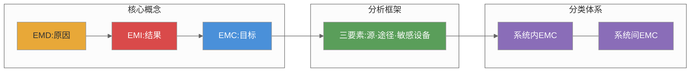

# 第一章 绪论

## 内容提要

本章是电磁兼容课程的导引篇章。电磁兼容（Electromagnetic Compatibility，EMC）是研究在有限的空间、时间和频谱资源条件下，各种用电设备（广义的还包括生物体）可以共存，并不致引起降级的一门学科。随着电子技术、计算机技术及电力电子技术的飞速发展，各种电气、电子设备的数量和种类急剧增加，电磁环境日趋复杂，电磁兼容问题已从早期的无线电干扰扩展到工业、民用、医疗、军事等几乎所有用电领域。本章首先通过大量真实的电磁干扰危害案例说明电磁兼容研究的重要性，然后系统给出电磁骚扰（EMD）、电磁干扰（EMI）和电磁兼容（EMC）的基本概念和定义，介绍电磁干扰三要素及其数学模型，回顾电磁兼容学科在国际和国内的发展历程，概述电磁兼容的主要研究内容，最后总结电磁兼容学科的基本特点。通过本章学习，读者将对电磁兼容学科有一个清晰、全面的总体认识。

通过本章学习，读者应达成以下学习目标：

1. 认识到电磁干扰对军事装备、工业控制、医疗设备、民用电子等多领域的严重危害
2. 准确辨析电磁骚扰（EMD）、电磁干扰（EMI）与电磁兼容（EMC/EMC性）的区别与联系
3. 掌握电磁干扰三要素及其数学模型，能运用三要素法分析与诊断实际的电磁干扰问题
4. 理解系统内电磁兼容与系统间电磁兼容的分层概念
5. 了解电磁兼容学科从19世纪至今的发展脉络和里程碑事件
6. 建立对电磁兼容主要研究内容的体系化认知
7. 理解电磁兼容学科的主要特点，特别是分贝单位制的使用

---

## 1.1 电磁兼容定义内涵

### 1.1.1 电磁干扰

#### （1）电磁干扰定义

打开电视机时，旁边的日光灯管会瞬间变暗一下——这是因为大量电流涌向电视机，同一电源线上的日光灯"抢"不到足够的电压。使用吹风机时，附近的收音机发出"啪啦啪啦"的噪声——这是因为吹风机的电动机在运转时产生了微弱的脉冲电流，通过电源线传入了收音机。手机靠近音箱时，音箱发出"滋滋"的刺耳声——这是因为手机的射频信号通过空间传播到音箱电路。这些都是每一个人在日常生活中都曾遇到过的小"麻烦"，但它们背后指向的其实是同一个工程问题——电磁干扰。

就在这些日常现象的背后，电磁干扰在重大工程和国防装备中造成的后果往往远超想象。现代科学技术的发展使各种电子、电气设备广泛应用于人们的日常生活、国民经济的各个部门及国防建设中。电子、电气设备不仅数量及种类不断增加，而且向小型化、数字化、高速化及网络化的方向快速发展。设备在正常工作时，往往会产生一些有用或无用的电磁能量，这些电磁能量可能影响处于同一电磁环境中的其他设备、系统和生物体，导致电磁环境日趋复杂，造成电磁污染。因此，电磁干扰问题越来越突出，电磁兼容已成为一门不可忽视的综合性学科。

电磁干扰的危害主要体现在两个方面：一是电气、电子设备相互之间的有害影响，二是电磁污染对人体健康的影响。电磁干扰信号作用于电气、电子设备或系统及其内部电路，影响其运行的安全性和可靠性，降低其工作性能。据统计，干扰引起的电气、电子设备事故占总事故的90%左右【梁振光，第1章】。由于电磁干扰引起事故的实例不胜枚举，以下通过若干具有代表性的典型案例来认识电磁干扰的危害严重性。

**案例一：丰田汽车电子节气门EMI事件（2009—2011）。** 2009年至2011年间，丰田汽车因电子节气门控制系统（ETCS）的电磁兼容缺陷引发全球性安全危机，累计召回超过900万辆汽车。事件起因于多起车辆非预期加速事故报告——驾驶员踩下制动踏板时车辆反而加速，造成数十起伤亡事故。美国国家公路交通安全管理局（NHTSA）与NASA联合展开历时10个月的技术调查，最终报告明确指出：电子节气门控制系统的EMC设计存在固有缺陷。具体工程分析表明，发动机控制单元（ECU）的电源滤波电路对100kHz~1MHz频段的传导干扰抑制不足——在特定工况下，来自交流发电机和点火系统的传导骚扰脉冲通过电源线进入ECU，使节气门位置传感器信号产生约200mV的偏置漂移，触发系统进入故障安全模式，将节气门开度设定在约30%的"默认大开度"状态。接地回路的设计也存在共阻抗耦合问题——传感器信号回路与功率回路共用同一接地点，功率回路的大电流瞬变（峰值可达80A）在公共接地阻抗上产生约150mV的压降，叠加到传感器信号端。丰田为此支付了约12亿美元民事罚款和数亿美元和解费用，并对ECU进行了彻底的硬件重新设计——增加三级EMI电源滤波（共模扼流圈+差模X电容+共模Y电容），将传感器信号回路改为差分独立接地。此事件直接推动了ISO 11452和CISPR 25等汽车EMC标准的修订升级，各车企随之大幅提升整车级EMC验证要求。

**案例二：iPhone 12法国SAR超标禁售事件（2020—2023）。** 2020年9月，苹果公司发布iPhone 12系列手机。2023年9月12日，法国国家频率管理局（ANFR）发布正式检测报告，认定iPhone 12在人体肢体接触测试中的比吸收率（SAR）为5.74W/kg，超出欧盟4.0W/kg的限值标准。ANFR据此要求苹果在法国市场立即暂停销售iPhone 12。工程根因分析确认：iPhone 12的天线设计在特定频段（特别是用于低数据速率传输的2G/GSM 900MHz频段）的辐射效率偏高，且该机型的基带功率控制算法在弱信号场景下会将发射功率提升至最大允许值（约33dBm ERP）。当用户手持手机贴紧肢体时，由于人体组织对900MHz电磁波的介电常数（εr≈55）和电导率（σ≈0.97S/m）导致能量吸收增强，SAR显著上升。苹果随后于2023年10月发布iOS 17.1软件更新，在检测到手机靠近人体时主动将最大发射功率降低约2~3dB，并优化了射频功率回退算法，使肢体SAR降至3.98W/kg的合规水平。此事件深刻证明了EMC法规对消费电子产品的硬约束力——技术先进也不能豁免合规测试。法国ANFR在2024年将SAR随机抽检范围扩大至更多品牌和型号，欧盟也重新审视了SAR限值与实际使用场景的匹配性。

**案例三：5G C-band与航空无线电高度计干扰事件（2021—2023）。** 2021年起，美国联邦通信委员会（FCC）开放3.7~3.98GHz的C-band频段用于5G通信部署。该频段与航空无线电高度计（工作在4.2~4.4GHz）之间仅隔220MHz的保护频带。工程分析表明，5G基站的大功率发射（有效辐射功率ERP可达1640W）产生的带外杂散发射和功率放大器三阶互调产物（IM3）可落入4.2~4.4GHz频段——当两个C-band载波分别位于3.8GHz和4.0GHz时，其三阶互调产物2f₁−f₂=3.6GHz和2f₂−f₁=4.2GHz，后者恰好落在无线电高度计的接收机通带内。同时，5G基站天线的旁瓣辐射通过机场跑道附近的近场耦合进入机载高度计接收天线，其耦合路径损耗经实测约为65~75dB。2022年1月，美国联邦航空管理局（FAA）发出紧急适航指令，警告C-band 5G信号可能干扰飞机无线电高度计——影响低能见度条件下的自动着陆（CAT II/III）、反推力控制和地形告警等功能。AT&T和Verizon被迫两次推迟商用部署，在主要机场周围设立约2km的缓冲区，并将基站功率降低约6dB。此事件导致美国航空业损失约6.3亿美元，5G运营商额外投入超10亿美元调整部署方案。该事件是系统间EMC协调的典型案例，推动ITU和各国监管机构重新评估频段划分中的保护频带要求——当前建议将保护频带从220MHz扩展至至少400MHz。

**案例四：波音787锂电池热失控事件中的EMC因素（2013）。** 2013年1月7日，日本航空一架波音787在波士顿洛根机场地面停放期间，辅助动力装置（APU）的锂离子电池组（由八块单体锂电池串联组成，额定电压32V，容量76Ah）发生热失控，电池舱冒出浓烟，导致飞机停飞。同年1月16日，全日空另一架波音787在飞行中驾驶舱出现电池烟雾警报，紧急迫降高松机场。直接原因是锂离子电池内部短路引发热失控——但后续由NTSB（美国国家运输安全委员会）主导的深入调查发现，根本原因与电池管理系统（BMS）的EMC设计密切相关。BMS采用电压监测电路实时检测每节电池单体电压（锂离子电池的安全上限为4.2V），但该监测电路的信号线在机舱布线中与机载大功率HF通信发射机（工作于18~30MHz频段，发射功率可达400W）的馈线平行敷设约1.5m，间距仅8cm。HF发射时，电磁场通过互容和互感耦合在BMS信号线上感应出共模电压（实测约3.5Vrms），使电压监测电路的ADC采样结果出现约±150mV的跳变误差——当这种跳变发生在充电末期，误差可能导致系统在单体电压已超过4.2V安全上限时仍误判为正常，延迟过充电保护响应，最终引发锂枝晶生长和内部短路。NTSB最终报告明确指出BMS的EMC缺陷是"促成因素"之一。波音随后对787电池系统进行了全面重新设计：电池封装在钢制专用容器中，内部增加电池单体间距至2mm并在单体间加装云母隔热片，温度传感器从4个增至12个，BMS信号线缆更换为双层屏蔽电缆且屏蔽层实施360°端接，并在BMS输入端加装共模滤波器和瞬态抑制二极管。FAA于2013年4月批准改进方案，但波音787全球停飞造成了约6亿美元的损失。

**案例五：大疆Mavic 3无人机GPS共址干扰事件（2022）。** 2022年5月，大疆创新发布Mavic 3系列旗舰级消费无人机，搭载RTK高精度定位模块标称可实现厘米级定位。然而用户在高压输电线路附近飞行时，GPS定位精度从亚米级恶化至数十米级，甚至出现返航点漂移导致飞丢事故。大疆技术团队分析确认此问题为典型的共址干扰——Mavic 3将GPS L1频段（1575.42MHz，信号功率低至−130dBm）天线与O3图传系统2.4GHz发射天线集成在同一机身模块内，天线间距仅约15cm。图传发射功率在远距离模式下高达28dBm（约630mW EIRP），其功率放大器在1.5GHz频段的宽带噪声基底（noise floor）泄漏约−65dBm/Hz。该噪声被GPS接收机接收后，使GPS信号载噪比（C/N₀）从正常的45dB-Hz骤降至28dB-Hz以下，已低于GPS接收机跟踪门限（约32dB-Hz），导致定位丢失。高压输电线（220kV及以上）的电晕放电在10~100MHz范围内产生宽带电磁骚扰，通过无人机碳纤维机身（屏蔽效能仅约20dB）的装配缝隙耦合进入GPS接收前端，进一步恶化了信噪比。大疆于2022年12月发布固件更新：在GPS信号弱时自动将图传发射功率从28dBm降低至22dBm（降低6dB），并优化了GPS接收机的窄带/宽带干扰检测与抑制算法。随后推出的Mavic 3 Pro改进了天线布局——将GPS天线移至机臂末端，与图传天线间距增大至35cm，并将图传功放输出端加装SAW带通滤波器（2.4GHz±40MHz，带外抑制≥30dB），从根本上降低了噪声泄漏。

**案例六：京沪高铁CTCS-3列控系统EMC工程（2011—2013）。** 京沪高铁于2011年6月30日开通运营，设计时速350km/h，采用CTCS-3级列车运行控制系统——通过无线闭塞中心（RBC）和GSM-R铁路专用移动通信系统（工作频率885~889MHz/930~934MHz）实现车地连续通信，由车载ATP（自动列车防护）设备生成速度-距离制动曲线。在联调联试阶段和运营初期发现，列车以300km/h以上驶过某些区段时偶发紧急制动——据统计某月发生多达12次，严重干扰运输秩序。工程团队经系统级EMC排查，定位出三条主要干扰路径。第一，牵引变流器（采用IGBT开关，开关频率1.2kHz，单机额定功率约5MW）输出的PWM电压含有大量谐波，经牵引电机和钢轨回流回路形成传导干扰，其5kHz~50kHz频段的分量通过钢轨耦合至轨道电路（ZPW-2000A型，工作频段1700~2600Hz），使轨道电路接收器将空闲区段误判为占用，触发ATP紧急制动。第二，受电弓离线产生的电弧放电（脉冲上升时间约100ns，重复频率约2~5kHz，频谱覆盖150kHz~1GHz）通过GSM-R天线耦合干扰车地通信，导致RBC与ATP之间的安全数据链路误码率从10⁻⁶上升至10⁻³，触发链路超时保护。第三，牵引电机PWM控制产生的高次谐波（可达30MHz）通过车体结构形成的共模电流环路耦合进入ATP系统的速度传感器信号线缆。京沪高铁公司实施了系统级EMC加固：牵引变流器输出端加装共模扼流圈和dU/dt滤波器（截止频率约5kHz），钢轨回流回路中每2km安装一台阻抗平衡变压器，ATP信号电缆更换为双层编织屏蔽电缆（屏蔽效能≥60dB@30MHz）且屏蔽层实施360°端接，GSM-R车顶天线移离受电弓区域3.2m。加固后ATP误制动率降低超过95%，月均误制动次数从12次降至0~1次。

**案例七：心脏起搏器与消费电子产品的EMC（生物医学EMC典型案例）。** 心脏起搏器通过植入电极向心肌发送低电平脉冲（典型幅度2.5~5V，脉宽0.4~0.5ms，频率60~80次/分钟）来维持正常心律。其感知电路对心内微伏级电信号进行检测，灵敏度高达0.5~2.5mV——这意味着感知电路极易受到外部电磁场的干扰。2008年，美国梅奥医学中心开展大规模临床研究，系统测试了多种消费电子产品对起搏器的干扰效应。研究发现：手机（特别是GSM制式，脉冲发射频率217Hz，峰值功率2W）靠近起搏器5cm以内时，射频信号被起搏器电极导线（相当于偶极天线，在900MHz频段具有良好的接收效率）和起搏器钛金属外壳接收，通过PN结整流效应产生低频干扰信号（约200~400Hz），落入起搏器感知滤波器的通带（10~100Hz），导致起搏器误判心脏活动"正常"而抑制起搏输出——对于完全起搏器依赖型患者，这种抑制持续超过3秒即可引起晕厥甚至心脏停搏。研究还发现，iPad平板电脑扬声器内置钕磁铁产生的静磁场（距表面1cm处约30mT，距表面3cm处约10mT）在靠近起搏器2cm以内时，可使起搏器内部的磁簧开关闭合并强制切换至固定频率模式（VOO），丧失对心率变化的响应能力。此外，Qi标准无线充电器在近场（≤3cm）产生的交变磁场强度约10~15μT@100~200kHz，通过电极导线耦合至心肌，在心脏不应期之外施加额外电刺激可能诱发心律失常。基于这些发现，国际标准ISO 14117（2016版）更新了植入式医疗设备的EMC测试要求：测试频率范围从0~1GHz扩展至0~3GHz，测试场强从3V/m提高至30V/m（ISM频段），并要求无线充电器干扰测试增加至50cm距离。临床上建议起搏器患者将手机等消费电子产品与植入部位保持15cm以上距离。

凡此种种，不胜枚举。由于电磁骚扰的频谱很宽，可以覆盖0~40GHz频率范围，所以"电磁污染"已和水与空气受到的污染一样，正在引起人们的极大关注。综上所述，可以看到，电磁骚扰有可能使电气、电子设备和系统的工作性能偏离预期的指标或使工作性能出现不希望的偏差——即工作性能发生了"降级"，甚至还可能使设备和系统失灵或导致寿命缩短，严重时还可能摧毁设备和系统，而且还将影响人体健康。因此，人们面临着一个新问题，就是如何提高现代电气、电子设备和系统在复杂的电磁环境中的生存能力，以确保电气、电子设备和系统达到初始的设计目的。正是在这样的背景下产生了电磁兼容的概念，形成了一门新兴的综合性学科——电磁兼容（Electromagnetic Compatibility，EMC）。

在深入讨论电磁兼容之前，必须首先厘清两个密切相关但本质不同的概念——**电磁骚扰**（Electromagnetic Disturbance，EMD）和**电磁干扰**（Electromagnetic Interference，EMI）。

**电磁骚扰**是指任何可能引起装置、设备或系统性能降低，或者对有生命或无生命物质产生损害作用的电磁现象【路宏敏，§1.2.1】。电磁骚扰可能是电磁噪声、无用信号，也可能是传播媒介自身的变化。电磁噪声是一种明显不传送信息的时变电磁现象，它可能与有用信号叠加或组合，通常是脉动的和随机的，但也可能是周期的。无用信号是指可能损害有用信号接收的信号，例如广播电台对邻近频道的泄漏信号。传播媒介自身的变化，如电离层扰动引起的无线电波传播条件变化、电缆特性阻抗的均匀性变化等。理解"骚扰"（Disturbance）一词的核心要点在于它强调的是"可能性"——某种电磁现象具有潜在的危害性，但不一定已经造成了实际损害。举例而言，电动机换向时产生的电磁脉冲本身是一种电磁骚扰（电磁噪声），但如果在附近没有敏感设备，这一骚扰并未对任何设备造成实际影响。

**电磁干扰**是指电磁骚扰引起的设备、传输通道或系统性能的下降【路宏敏，§1.2.1】。我国国家军用标准GJB 72A—2002对电磁干扰的定义更加直接：任何能中断、阻碍、降低或限制通信电子设备有效性能的电磁能量。"干扰"（Interference）一词强调的是"实际后果"——性能下降已经发生。电磁干扰信号作用于电气、电子设备或系统及其内部电路，影响其运行的安全性和可靠性，降低其工作性能。例如，前文中的案例中，丰田汽车ECU的电源滤波缺陷导致节气门位置传感器信号受到传导干扰——这是电磁干扰；而在传导脉冲尚未引起传感器偏置漂移之前，该脉冲本身只是一个电磁骚扰。

电磁骚扰与电磁干扰的因果关系可以形式化描述如下：

$$
\text{电磁骚扰（EMD）} \xrightarrow{\text{通过耦合途径作用于敏感设备}} \text{电磁干扰（EMI）}
\tag{1-1}
$$

即：EMD是原因、是现象；EMI是结果、是后果。这种因果关系的理解是学习电磁兼容学科的逻辑起点。

为了进一步厘清两者的区别，以下用表格进行多维度对比。

**表 1-1：电磁骚扰（EMD）与电磁干扰（EMI）的详细对比**

| 对比维度 | 电磁骚扰（EMD） | 电磁干扰（EMI） |
|:---------|:-------------|:------------|
| 本质 | 客观存在的电磁现象 | 性能下降的后果 |
| 因果角色 | 原因（Cause） | 结果（Effect） |
| 是否必然造成损害 | 不一定，仅为可能 | 已经造成实际损害 |
| 存在条件 | 可独立于敏感设备存在 | 依赖敏感设备的响应 |
| 消除方式 | 通过屏蔽、滤波等从源头抑制 | 通过提高设备抗扰度来抵御 |
| 物理量描述 | 场强、功率密度、电流幅度 | 信噪比恶化量、误码率增加量 |
| 标准术语来源 | GB/T 4365—2003, IEC 60050—161 | GJB 72A—2002, IEEE Std 473 |
| 典型实例 | 电动机运行时产生的电磁场 | 该电磁场导致无线电接收机发出噪声 |

#### （2）电磁干扰三要素

从最直观的日常场景出发：为什么手机靠近音箱会发出"滋滋"声？仔细分析这个过程中，手机在发射射频信号（这是"源"），信号通过空气传播到音箱电路（这是"途径"），音箱的扬声器系统受到干扰发出杂音（这是"受扰设备"）。任何一个电磁干扰事件，不论发生在家庭还是战场上，都可以用这套思路来拆解。

从上面的辨析可以看出，EMI是EMD通过某种耦合途径作用于敏感设备的结果。由此引出了电磁兼容分析中最核心、最基本的框架——**电磁干扰三要素**。任何电磁干扰的产生，必须同时具备三个基本条件，称为电磁干扰三要素【梁振光，§2.1.2】。

**第一，电磁骚扰源**——产生电磁能量的设备、系统或自然现象。骚扰源可以是自然源，如雷电、静电放电、太阳射电噪声等；也可以是人为源，如数字电路时钟、开关电源、电动机、无线发射机、电力电子装置等。不同骚扰源具有不同的特性参数，主要包括频谱宽度、幅度或电平、波形特征、出现率、辐射极化特性和方向特性。例如，数字电路的时钟信号是周期性脉冲，其频谱呈离散谱线状分布，谐波可延伸至数百MHz；雷电放电是宽频带瞬态脉冲，能量从几kHz延伸到几十MHz；静电放电则是一种单次瞬态脉冲，频谱连续分布，能量集中在几十MHz至几百MHz范围。电磁骚扰源分类的详细讨论将在第3章中展开。

**第二，耦合途径**——电磁能量从骚扰源传输到敏感设备的通道。耦合途径分为两大类：**传导耦合**和**辐射耦合**。传导耦合通过导线、电缆、公共阻抗等导体传播，常见形式包括共阻抗耦合（多个设备共用电源线或地线时，一个设备的电流变化通过公共阻抗影响另一个设备）、电容性耦合（即电场耦合，两个导体之间存在分布电容时，一个导体的电压变化通过电容耦合到另一个导体）和电感性耦合（即磁场耦合，两个导体之间存在互感时，一个导体的电流变化通过互感在另一个导体上感应出电压）。辐射耦合通过空间电磁场传播，常见形式包括天线耦合、导线感应耦合、闭合回路耦合和孔缝耦合。在工程实际中，传导耦合和辐射耦合往往同时存在，共同构成复杂的电磁耦合网络。关于传导耦合和辐射耦合的详细分析和等效电路计算方法将在第4章和第5章中专题讨论。

**第三，敏感设备**——对电磁骚扰产生响应、出现性能降级或功能失效的设备或系统。不同设备对于不同频段、不同特性的骚扰具有不同的敏感度。模拟音频电路对电源线传导的工频谐波较为敏感，数字电路对窄脉冲干扰更为敏感，而无线接收机对同频或邻近频段的骚扰最为敏感。提高敏感设备的抗扰度是EMC设计的三大方向之一，相关技术措施将在第6章至第8章中详细介绍。

三要素之间的定量关系可以用传输模型来描述。设骚扰源的发射强度为 $S(f)$，耦合通道的传输效率为 $C(f)$（无量纲，取值范围0~1），敏感设备的敏感度阈值为 $R_{\text{th}}(f)$，则敏感设备实际接收到的干扰电平为：

$$
E_{\text{int}}(f) = S(f) \cdot C(f)
\tag{1-2}
$$

当 $E_{\text{int}}(f) \geq R_{\text{th}}(f)$ 时，电磁干扰即发生。式中，$S(f)$ 为单位频率上骚扰源发射的电磁能量（单位取决于骚扰源的具体类型，如V/Hz或W/Hz），$C(f)$ 为描述电磁能量从骚扰源到敏感设备之间传输效率的函数（0表示完全不耦合，1表示完全耦合），$R_{\text{th}}(f)$ 为敏感设备在频率 $f$ 处能够承受的最大干扰电平（与 $E_{\text{int}}$ 同量纲）。

这一乘积模型的工程意义重大：等式右边是乘积关系——任意一个因子趋近于零，$E_{\text{int}}(f)$ 就趋近于零，干扰即不存在。也就是说，**消除三要素中的任意一个，电磁干扰即不复存在**。由此导出EMC设计的三条基本策略：

策略一：**抑制骚扰源**——降低源的发射强度，具体措施包括加装电源滤波器、减缓数字信号边沿速率、优化开关电源的布局布线、采用展频技术降低时钟谐波峰值等。

策略二：**切断耦合途径**——阻断电磁能量从源到敏感设备的传输路径，具体措施包括采用金属屏蔽、优化接地设计、增大空间距离、使用隔离变压器或光电耦合器件、在高频段采用屏蔽电缆等。

策略三：**提高敏感设备抗扰度**——增强设备承受电磁骚扰的能力，具体措施包括采用差分信号传输（共模抑制）、增加去耦电容、选用抗扰度更高的元器件、优化PCB布局布线减少天线效应等。

在工程实践中，通常根据具体问题的性质和成本约束，选择最经济、最易实现的策略。例如，对于电源线传导干扰问题，在骚扰源侧加装滤波器往往比在每一台敏感设备侧加装滤波器更为经济。对于辐射干扰问题，对骚扰源进行屏蔽通常比对敏感设备进行屏蔽更为可行。

**表 1-2：典型电磁干扰实例的三要素分析**

|| 场景 | 骚扰源 | 耦合途径 | 敏感设备 | 干扰表现 | 推荐策略 |
|:-----|:-------|:---------|:---------|:---------|:---------|
|| 手机靠近CRT显示器 | 手机射频发射 | 空间辐射 | CRT显示器 | 图像抖动、失真 | 增大距离/屏蔽 |
|| 车间大负载投运 | 接触器开关操作 | 电源线传导 | 计算机 | 重启、死机 | 加装电源滤波器 |
|| 静电放电损坏IC | 人体带电（数kV） | 接触/空气放电 | CMOS集成电路 | 逻辑翻转、芯片烧毁 | 加ESD防护器件 |
|| 汽车经过高压线 | 高压电晕放电 | 空间电磁场 | 车载收音机 | 收音噪声 | 收音机加屏蔽 |
|| 吸尘器影响电视机 | 电动机换向火花 | 电源线传导 | 电视机 | 屏幕雪花 | 电源线加磁环 |

#### （3）电磁兼容核心术语体系

以上关于EMD、EMI和EMC的辨析只是电磁兼容学科庞大术语体系的开端。柯金良教授在其《电磁兼容概论》中系统整理了EMC领域的23条核心术语，涵盖了从"电磁发射"到"兼容裕度"的完整概念链【柯金良，§1.1.2】。以下是按逻辑关系梳理的术语体系：

**第一组：原因类术语（描述电磁现象本身）**

① **电磁发射（Emission）**——从源向外发出电磁能的现象。需特别注意：EMC中的"发射"既包含传导发射（通过导线传播），也包含辐射发射（通过空间传播），而通信中的"发射"主要指辐射发射。EMC中的发射常常是无意的——电线、电缆等本用于其他用途的部件充当了发射的角色。② **电磁噪声（Noise）**——一种明显不传送信息的时变电磁现象，可能与有用信号叠加或组合。噪声是无法消除的，只能被削弱到不产生干扰的程度。③ **无用信号（Unwanted Signal）**——可能损害有用信号接收的信号。它与"干扰信号"的区别在于：无用信号是"可能"损害，而干扰信号是"确实"造成了损害。④ **电磁骚扰（Electromagnetic Disturbance, EMD）**——任何可能引起装置、设备或系统性能降低，或对有生命或无生命物质产生损害作用的电磁现象。电磁骚扰可以是电磁噪声、无用信号或传播媒介自身的变化。

**第二组：后果类术语（描述骚扰造成的影响）**

⑤ **电磁干扰（Electromagnetic Interference, EMI）**——电磁骚扰引起的设备、传输通道或系统性能的下降。骚扰是原因，干扰是结果。⑥ **性能降低（Degradation of Performance）**——装置、设备或系统的工作性能与正常性能的非期望偏离。例如，手机接收机灵敏度从1μV降低到5μV，虽然用户未必察觉，但已构成性能降低。⑦ **干扰信号（Interfering Signal）**——损害有用信号接收的信号。它与"无用信号"的根本区别在于损害已经发生。

**第三组：环境与能力类术语**

⑧ **电磁环境（Electromagnetic Environment）**——存在于给定场所的所有电磁现象的总和。ANSI进一步细化为：一个设备在完成其规定任务时可能遇到的辐射或传导电磁发射电平在不同频段内的功率分布及其随时间分布。⑨ **抗扰度（Immunity）**——装置、设备或系统面临电磁骚扰不降低运行性能的能力。⑩ **电磁敏感性（Susceptibility, EMS）**——在存在电磁骚扰的情况下，装置、设备或系统不能避免性能降低的能力。敏感性高则抗扰度低，两者是同一枚硬币的两面——军用标准体系常用"敏感性"，民用标准体系惯用"抗扰度"【柯金良，§1.1.2】。

**第四组：度量与控制类术语**

⑪ **电平（Level）**——用规定方式在规定时间间隔内求得的功率或场参数的平均值或加权值，可用对数（分贝）表示。⑫ **发射电平（Emission Level）**——用规定方法测得的由特定设备发射的某给定电磁骚扰电平。⑬ **发射限值（Emission Limit）**——规定的电磁骚扰源的最大允许发射电平，是人为规定的技术指标。⑭ **抗扰度电平（Immunity Level）**——将某给定电磁骚扰施加于设备而其仍能正常工作的最大骚扰电平。⑮ **抗扰度限值（Immunity Limit）**——规定的最小抗扰度电平。⑯ **电磁兼容电平（Electromagnetic Compatibility Level）**——预期加于工作条件下设备上的规定最大电磁骚扰电平，是统计意义上的参考值。⑰ **发射裕度（Emission Margin）**——电磁兼容电平与发射限值之间的差值。⑱ **抗扰度裕度（Immunity Margin）**——抗扰度限值与电磁兼容电平之间的差值。⑲ **兼容裕度（Compatibility Margin）**——抗扰度电平与发射限值之间的差值，是衡量系统EMC可靠性的定量指标。

这23条术语之间的关系可以用发射/抗扰度限值关系图来直观展示。图1-3示意了兼容电平、发射限值、抗扰度限值之间的层次关系：电磁兼容电平作为统计参考基准，发射限值设置在其下方（留有发射裕度），抗扰度限值设置在其上方（留有抗扰度裕度），两者之间构成了"兼容窗口"——保证在正常电磁环境下，按标准设计的设备之间可以兼容工作。

```
              骚扰电平（dB）
                    ↑
        ┌──────────────────────────┐
        │      抗扰度限值             │  ← 设备设计目标（必须达到）
        ├──────────────────────────┤
        │    抗扰度裕度              │
        ├──────────────────────────┤
        │     电磁兼容电平            │  ← 统计参考值
        ├──────────────────────────┤
        │    发射裕度                │
        ├──────────────────────────┤
        │      发射限值              │  ← 法规强制要求（不得超过）
        └──────────────────────────┘
                    ↓
                频率 f
```
*图 1-3：发射/抗扰度限值与兼容电平的层次关系（示意）*

这一关系图清晰地展示了电磁兼容设计的核心逻辑：将设备的实际发射电平控制在发射限值以内，将敏感设备的抗扰度设计在抗扰度限值以上，两者之间保留足够的兼容裕度——这就是EMC设计的定量化目标【柯金良，§1.1.2】。

#### （4）柯金良EMC设计方法：测试修改法、系统设计法与分层综合设计法

除了上述三要素设计策略外，柯金良教授还提出了另一种互补的分类视角【柯金良，§1.4】。**测试修改法**相当于前文所述的问题解决法——在设计过程中几乎不考虑EMC问题，在对样机进行测试时发现问题再修改，再测试直到满足要求。**系统设计法**相当于前文所述的系统法——在产品的设计过程中仔细预测各种可能发生的EMC问题，从设计阶段就采取各种措施。**分层与综合设计法**则是柯金良教授的独到见解：根据防护措施在实现EMC时的重要性，分层依次进行设计——第一层为有源器件的选择和印制板设计，第二层为接地设计，第三层为屏蔽设计，第四层为滤波设计，然后进行综合设计。这种分层设计法具有很强的工程操作性，将在第2章中结合具体的EMC设计方法进一步展开。

### 1.1.2 电磁兼容定义

在理解了EMD与EMI的区别以及三要素框架之后，下面给出电磁兼容的定义。

在日常生活中，"兼容"一词描述的是一种和谐的共存状态。举例来说，在某一近海中，如果近海水域被生活污水和工厂排放的工业污水所污染导致鱼类品种减少或死亡，那么人类及工厂与鱼类就"不兼容"。然而，若采取适当的有效措施使污水得到净化处理，达到鱼类在其中生存的标准，鱼类在含有经过净化处理的污水的近海水域生存就不会受到污水的威胁，人类及工厂与鱼类就"兼容"。电磁兼容的逻辑与此完全相同——只不过兼容的对象不是鱼类与废水，而是电气电子设备与电磁环境【路宏敏，§1.2.2】。

**电磁兼容（Electromagnetic Compatibility，简称EMC）**作为学科的名称，是指研究在有限的空间、时间和频谱资源条件下，各种用电设备（广义的还包括生物体）可以共存，并不致引起降级的一门学科。

**电磁兼容性**则是指设备或系统在其电磁环境下能正常工作，并且不对该环境中任何事物构成不能承受的电磁骚扰的能力。

各主要标准化组织对电磁兼容性给出了大同小异的定义。国家标准GB/T 4365—2003《电工术语 电磁兼容》与国际电工委员会（IEC）60050—161的定义完全一致：设备或系统在其电磁环境中能正常工作且不对该环境中任何事物构成不能承受的电磁骚扰的能力。美国电气电子工程师协会（IEEE）给电磁兼容性下的定义是："设备、装置或系统在其电磁环境中满意地工作，同时不向该环境排放超过允许范围的电磁扰动。"国际电工委员会（IEC）认为电磁兼容是一种能力的表现，其定义更加简洁："电磁兼容性是设备的一种能力，它在其电磁环境中能完成它的功能，而不至于在其环境中产生不允许的干扰。"国家军用标准GJB 72A—2002的定义更加具体：设备（分系统、系统）在共同的电磁环境中能一起执行各自功能的共存状态——该设备不会由于受到同一电磁环境中其他设备的电磁发射导致或遭受不允许的降级；它也不会使同一电磁环境中其他设备因受其电磁发射而导致或遭受不允许的降级。

上述定义虽措辞不同，但反映的都是同一个核心要求，包含两个条件，缺一不可：

- **条件一（抗扰度要求）**：设备在其电磁环境中能正常工作。设备必须能够"扛得住"环境中存在的各种电磁骚扰，不能因为其他设备的正常电磁发射而出现功能降级或失效。
- **条件二（发射要求）**：设备不对该环境中任何事物构成不能承受的电磁骚扰。设备不能成为一个让其他设备无法正常工作的骚扰源。一个"合规"的设备不仅要完成自己的功能，还要确保自己的电磁发射不对电磁环境中的其他设备造成不可接受的影响。

两个条件缺一不可。只满足条件一意味着设备自身抗干扰能力强，但本身可能是一个强骚扰源，会干扰其他设备的正常工作。只满足条件二意味着设备不干扰他人，但自身十分脆弱，无法在正常电磁环境中稳定运行。真正的电磁兼容性是两者兼得——既要"不怕别人"，也要"不扰别人"。

**表 1-3：电磁骚扰、电磁干扰与电磁兼容的关系**

| 概念 | 英文缩写 | 角色 | 一句话描述 |
|:-----|:--------|:-----|:----------|
| 电磁骚扰 | EMD | 原因、现象 | 可能有害的电磁现象 |
| 电磁干扰 | EMI | 结果、后果 | 已发生的性能下降 |
| 电磁兼容 | EMC | 目标、能力 | 设备共存且互不干扰的共存状态 |

### 1.1.3 电磁兼容内涵

**（1）电磁兼容 Vs 电磁兼容性**

在日常书写和口头表达中，"电磁兼容"和"电磁兼容性"经常不加区分地使用，但严格来说两者存在区别。电磁兼容（EMC）是学科的名称，侧重于理论研究和学术探讨——当我们说"电磁兼容是一门新兴的综合性学科"时，使用的是学科含义。电磁兼容性则是设备或系统的一种性能指标，侧重于工程属性和技术评估——当我们说"该产品通过了EMC认证、电磁兼容性能良好"时，使用的是性能含义。在学术语境中称为"电磁兼容学科"，在工程认证和产品标准中称为"产品的电磁兼容性能"。

**（2）系统内电磁兼容**

系统内电磁兼容（Intra-system EMC）是指给定系统内部各分系统、设备及部件相互之间的电磁兼容性。其特点是设计者对整个系统的配置有较高的控制自由度，可以决定设备的布局位置、线缆的走向路径、接地方式、屏蔽方案等，因此系统内EMC问题通常可以通过精心的工程设计来加以解决。系统内电磁兼容性可分为系统之间的电磁兼容性和系统内部的电磁兼容性。IEEE对系统内电磁兼容性的定义是："同一系统各部分之间能够正常工作而不会因同一系统中其他源的电磁发射产生可察觉的性能下降的状态。"影响系统内电磁兼容性的主要因素包括公共阻抗的耦合、设备机壳间的耦合、机壳与电缆的耦合、天线间的耦合等【路宏敏，§1.2.3】。

典型例子是一架飞机内部的导航系统、通信系统、雷达系统和飞行控制系统之间的电磁兼容性。这些系统安装在同一平台上，空间距离只有几米甚至几十厘米，电磁环境密度极高，但设计者可以通过统一的空间布局、频段分配和接地设计来确保互不干扰。在美国军用标准MIL-E-6051D中，系统电磁兼容性被定义为一个重要指标，对于军事系统电磁干扰裕度要求为20dB。

**（3）系统间电磁兼容**

系统间电磁兼容（Inter-system EMC）是指某系统与其运行所处的电磁环境或其他系统之间的电磁兼容性。其特点是设计者通常只能控制自身系统，对其他系统或环境因素缺乏干预能力。IEEE对系统间电磁兼容性的定义是："某一系统能够在另一系统发射的电磁环境中正常工作而不发生可察觉的性能下降的状态。"影响系统之间电磁兼容性的主要因素包括天线与天线的耦合、天线与电缆的耦合等【路宏敏，§1.2.3】。

典型例子包括：飞机与地面导航台之间的电磁兼容性（飞机的机载电子设备不能干扰地面导航设施的正常工作，地面导航信号也不能干扰飞机上敏感电子设备的接收）；相邻频段的广播电台之间的互调干扰避免；5G通信基站与卫星地球站之间的频率协调等。系统间EMC通常依赖于国际标准和各国法规来协调各方行为。

| 对比维度 | 系统内EMC | 系统间EMC |
|:---------|:----------|:----------|
| 研究范围 | 同一系统内部的设备之间 | 不同系统之间 |
| 空间尺度 | 几厘米至数十米 | 数百米至数千公里 |
| 控制能力 | 可全面控制布局、线缆、屏蔽 | 通常只能控制自身系统 |
| 设计自由度 | 较大——可自由调整设计 | 小——受标准和法规约束 |
| 典型解决方法 | 屏蔽、滤波、分区布局、优化接地 | 频率协调、空间隔离、遵循标准限值 |
| 工程实例 | 机载电子设备布局优化 | 5G基站与卫星地球站频率兼容 |

**（4）电磁兼容学科中的电磁干扰**

在电磁兼容学科中，电磁干扰不是孤立看待的个别事故，而是作为电磁兼容问题的对立面——"不兼容"的具体表现形式来研究的。EMC学科研究电磁干扰，关注的不是单一干扰事件的罗列，而是覆盖了从"为什么会发生"到"怎么防止发生"的完整技术链条：干扰是怎么产生的（骚扰源的特性分析和分类）→干扰是怎么传播的（传导和辐射耦合途径的机理分析）→干扰造成了什么后果（敏感设备的响应特性和受损程度评估）→怎么阻止干扰的发生（屏蔽、滤波、接地、搭接等控制技术的工程应用）。这四环链条构成了本书后续各章的基本框架：第2章在概述基础上展开电磁兼容标准体系和设计方法；第3章深入讨论各类电磁骚扰源的特性与分类；第4章和第5章分别分析传导耦合和辐射耦合的机理与计算方法；第6章至第8章分别介绍搭接、接地、滤波和屏蔽等具体的EMC控制技术；第9章讨论电磁兼容分析和预测方法。

---

## 1.2 电磁兼容学科发展

在建立了电磁兼容的基本概念体系之后，有必要回顾一下这门学科一百多年的发展历程。了解这段历史不仅有助于认识学科的全貌，也有助于理解当前EMC标准体系和设计方法的形成逻辑——它们不是某一天突然产生的，而是在一次次重大事故的教训和一次次技术革新中逐步积累、逐步完善的。以下按四个历史阶段进行梳理【路宏敏，§1.3】。

### 1.2.1 国际的电磁兼容发展

**第一阶段：萌芽探索期（19世纪末—20世纪30年代）**

这一阶段的核心特征是：电磁干扰作为一种现象被初步认识到，但尚未形成系统的理论和方法，研究活动以零散的实验和观察为主。

1881年，英国科学家希维赛德（Oliver Heaviside）发表了题为"论干扰"（On Interference）的论文，这是人类历史上第一篇有意识研究电磁干扰问题的学术文献，标志着研究干扰问题的开端【路宏敏，§1.3】。1888年，德国物理学家赫兹（Heinrich Hertz）通过火花隙实验成功产生和接收了电磁波，验证了麦克斯韦于1864年创立的电磁场理论，从此开启了电磁干扰的实验研究——赫兹的实验装置本身构成了人类第一个有意的电磁波发射和接收系统。1889年，英国邮电部门开始系统研究通信线路之间的串扰问题，这是将干扰研究从实验室推向工程实际的重要一步。

进入20世纪20年代，随着无线电广播的迅速普及，无线电噪声干扰成为公众和业界关注的焦点。当时各种电气设备（电动机、开关、汽车点火装置等）产生的电磁噪声严重干扰了广播接收，引起了广泛的社会关注。在美国，电力设备制造商和电力事业公司首先注意到这一问题——无线电噪声严重到足以导致美国国家电光协会（National Electric Light Association）和美国国家电气制造商协会（National Electrical Manufacturers Association）相继设立技术委员会，专门研究无线电噪声的测量方法和执行标准。在20世纪30年代，这些努力促成了几份技术报告、一份测量方法文件的出版以及专用测试设备的开发。具体的进展包括：测量架空电力输电线附近电场强度的步骤的制定、测量无线电广播电台产生场强的方法的标准化、测量无线电噪声和场强设备的开发，以及确定无线电噪声容限所需信息库的建立【路宏敏，§1.3】。

几乎同时，欧洲多个国家的技术论文开始关注无线电干扰的各个方面。在美国，人们对大量无线电干扰案例进行了详细分析——仅1934年一年就分析了一千多个与无线电干扰相关的案例，发现干扰来自电动机、开关和汽车点火装置的运行，同时也来自电力牵引和电力输电线。在欧洲，工程师们逐渐形成共识：无线电干扰领域具有国际级的共同技术研究价值，国际合作是必要的——因为无线电传输"不认识"地理和国家的边界，而且离开制造国的设备可能在许多国家销售和使用，因此必须符合所有相关国家的标准。

1933年，国际无线电干扰特别委员会（CISPR——Comité International Spécial des Perturbations Radioélectriques）在法国巴黎成立。CISPR是世界上最早的EMC标准化组织，由国际电工委员会（IEC）和国际广播联盟（UIR）联合发起。它的成立标志着电磁干扰问题从个别工程师的经验判断上升为国际组织的标准化协作。CISPR第一次会议于1934年6月28日至30日在巴黎召开，提出了两个核心问题：一是"可以接受的无线电干扰限值是多少"，二是"如何测量无线电干扰"。在随后的两三年内，CISPR取得了显著的进展：确立了为工程界所接受的无线电干扰测量方法基础，开发了频率为160~1605kHz的测试设备；1934年至1939年间发表了CISPR会议录和报告RI1~8，提供了关于测量接收机设计、场测量等关键资料；规定了频段为0.15~18MHz的无线电噪声和场强仪技术指标；对架空电力传输线附近的无线电广播场强和无线电噪声场强进行了实际测量；在160~1605kHz频率范围内发展了测量来自电气设备的传导无线电噪声的标准化步骤；设计并制造了用于上述测量的专用测量接收机、无线电噪声场强仪和其他测试设备【路宏敏，§1.3】。1940年，美国公布了一个关于测量无线电噪声方法的综合性报告。

**第二阶段：组织化与学科形成期（20世纪40年代—60年代）**

这一阶段的核心特征是：第一个EMC规范诞生，EMC概念被正式提出，学科体系开始形成。

20世纪40年代初，随着通信、广播和军事电子技术的迅速发展，人们越来越深刻地认识到：等到设备造好后再去排除干扰，代价太高、效果太差。如果能在设计阶段就考虑到电磁兼容性，那才是根本的解决之道。这种认识催生了"电磁兼容性"（Electromagnetic Compatibility）概念的正式提出——从"排除干扰"到"设计兼容"，这是一次思维方式上的根本转变。

1944年，德国电气工程师协会（VDE）制定了世界上第一个电磁兼容性规范VDE 0878。1945年，美国颁布了最早的军用电磁兼容规范JAN-I-225。1944年和1945年这两年相继出现的这两个规范性文件，标志着EMC从无章可循的自发行为进入了有标准可依的规范化时代。

第二次世界大战给电磁兼容领域注入了新的动力。第二次世界大战期间，军方对使用电信和雷达设备产生了广泛兴趣，对无线电干扰以及比正常无线电广播频率更高的频段产生了迫切需求。20世纪40年代，军方推动了对军用EMC标准的研究，开发了对直到20MHz的电磁干扰进行可靠测量的测试设备。20世纪50年代这一频率上限提高到30MHz，60年代进一步提高到1000MHz。从一开始，军方执行的标准就非常严格——在航空和航天系统、卫星技术中，电磁干扰的控制具有最高的优先等级。这些工作导致了许多面向实际工程的技术成果，然而其中相当一部分长期处于保密状态。

第二次世界大战期间，CISPR的技术工作完全停止。战后CISPR会议迅速恢复，美国、加拿大和澳大利亚加入了CISPR的审议，使这一论坛真正具有了全球代表性。CISPR论坛成为达成无线电干扰测量方法国际协议以及协调测量设备技术标准的核心场所。随着更高频率（如1000MHz）的使用，越来越多的亚洲国家和其他大洲的国家以及几个国际组织开始参加CISPR会议，使CISPR在国际电磁干扰技术合作中扮演了不可替代的角色。

第二次世界大战后期及战后，随着无线电通信非军事应用的日益增加，电磁干扰问题和EMC设计原理的工程实现需求变得愈加明显。在美国和欧洲的许多国家，关于干扰机理及其效应的基础研究、测量技术的完善、使电磁干扰最小化的设计方法论成为研究热点。各国在实际测量方面做了大量工作——无线电和电视接收机、电力输电线、家用电器、汽车、工业科学医疗（ISM）设备发射的电磁噪声都获得了详细测量、系统报道和广泛讨论。最初的工作侧重于达成测量步骤和测量方法的国际协议，但更为困难的问题也随之而来——各国开始制定适用于本国的干扰控制限值，如美国的联邦通信委员会（FCC）和英国的标准协会（BSI）开始颁布适用于各自国家的干扰控制极限。

1964年，IEEE学报Transactions on RFI分册正式改名为IEEE Transactions on Electromagnetic Compatibility。这一事件被学界公认为电磁兼容学科形成的**标志性里程碑**【路宏敏，§1.3】。一本专业学术期刊的创立意味着该领域已经积累了足够丰富的理论成果和足够规模的研究人员，形成了相对独立的知识体系。在此之前，EMC的研究成果分散发表在电子工程和无线电技术的各类期刊中；有了自己的专刊之后，EMC的理论研究开始加速——从1964年至今，该期刊每年发表数百篇EMC领域的前沿研究论文。

**第三阶段：体系化发展期（20世纪70年代—90年代）**

这一阶段的核心特征是：学科理论体系趋于完善，国际标准体系逐步形成，EMC认证从"自愿遵循"走向"法律强制"。

20世纪70年代，国际EMC学术会议进入每年定期举办的成熟阶段。美国学者B. E. Keiser出版了《电磁兼容原理》专著——这是世界上第一本系统性的EMC教材。美国国防部编辑出版了多种EMC设计手册和美军电磁兼容标准，这些材料对全球EMC工程实践产生了深远影响。到20世纪80年代，美国、德国、日本、前苏联、法国等经济发达国家在电磁兼容研究和应用方面已达到很高水平。具体表现为：建立了完整的电磁兼容标准和规范体系；研制出高精度的电磁发射（EMI）及电磁敏感度（EMS）自动测试系统，使EMC测试从手工操作进入了自动化时代；开发出多种系统内和系统间的电磁兼容性分析和预测软件，使工程师能够在使用计算机在设计阶段评估电磁兼容性；开发研制出多种抑制电磁干扰的新材料和新工艺。电磁兼容设计已成为产品设计中保证产品可靠性的重要一环【路宏敏，§1.3】。

CISPR在这一时期继续发挥着核心作用。CISPR在第16号出版物（CISPR 16）中将该领域的各种测量程序和电磁干扰推荐极限合并为一份综合性文件，成为全球EMC测量的基石。CISPR还陆续出版了包括无线电及电视接收机、工业科学医疗（ISM）设备、汽车、荧光灯等各类产品的电磁噪声测量和限值标准。在20世纪80年代，随着信息技术和数字电子产品的爆炸式增长，CISPR出版了第22号出版物（CISPR 22），专门规定信息技术设备的辐射发射和传导发射限值。CISPR 22对全球计算机和数字设备行业产生了极为深远的影响——任何想在全球市场销售计算机、打印机、显示器的制造商，都必须满足CISPR 22的限值要求。

20世纪60年代以后，电气与电子工程领域进入了数字时代——数字计算机、信息技术、测试设备、电信、半导体技术飞速发展。数字设备和系统对电磁噪声特别敏感，因为它们无法区分有用脉冲信号和瞬时噪声干扰。同时，数字电路本身也产生了大量的宽带电磁噪声——极短的脉冲上升时间（从纳秒到皮秒级）在频谱上贡献了丰富的谐波成分，时钟频率的不断提高使这些谐波延伸到越来越高的频段。数字电子设备广泛使用了固态器件和集成电路，而它们容易被瞬态电磁噪声损坏。因此，为了使敏感的半导体器件在电磁环境中可靠工作，特殊的设计方法和工程防护措施成为必要。这一领域在20世纪80年代和90年代受到了全球范围的广泛关注。

几个发达国家开始将注意力集中于用法规形式确定各种电气和电子设备允许的电磁发射极限，以及这些设备在销售之前必须经受的抗扰度试验等级。美国联邦通信委员会（FCC）对数字设备的辐射发射做出了严格规定，德国通信技术中央局（FTZ）颁布了相应的执行标准，英国标准协会（BSI）和日本干扰自愿控制委员会（VCCI）也各自建立了本国标准。政府内的专门机构如美国国家航空和航天管理局（NASA）、国家电信和情报局（NTIA）也发布了控制电磁辐射和电磁抗扰性的执行标准。国际民用航空组织（ICAO）和国际海事协商组织（IMCO）也将注意力集中于电磁噪声及其允许极限。

在欧洲，随着欧洲自由贸易区（EFTA）的出现，20世纪80年代欧洲国家特别注意发展统一的EMC标准。为了确保欧洲的工厂能够在整个欧洲范围内销售产品，统一的方法和相同的标准是必需的。1973年，欧洲电气产品标准委员会（CENELEC——Comité Européen de Normalisation ÉLECtrotechnique）成立，专门负责制定协调一致的欧洲EMC标准，这些标准涉及无线电接收机、电视机、信息技术设备、工业科学医疗设备等广泛领域。

1996年1月1日，欧洲共同体12个国家和欧洲自由贸易联盟北欧6国共同宣布强制执行EMC指令（89/336/EEC），凡不符合EMC标准的产品一律不准进入欧盟市场。这一政策的深远影响无论怎样强调都不过分——它把电磁兼容从一个企业"可做可不做"的技术优化选项，变成了一个"不做就别想卖到欧洲市场"的法定准入门槛。从此，EMC认证与电气安全认证处于同等重要的地位，全世界的电子产品制造商都必须正视EMC问题。产品电磁兼容性达标认证，已由单个国家发展到一个地区乃至整个贸易联盟的统一行动。

**第四阶段：21世纪的新发展**

进入21世纪，全球EMC标准体系日趋完善。国际上已形成以IEC 61000-4系列为核心的基础标准体系，各国和地区在统一国际标准的基础上发展出适应本地工业水平的配套标准。美国军方在原有MIL-STD-461/462/463基础上持续更新，其最新版本为MIL-STD-461G。美国军方还发布了涉及系统电磁兼容和各类军事平台（雷达、飞行器电源、航天系统、海军平台、移动通信）设计和运行要求的多个标准。

随着5G通信、新能源汽车、物联网、人工智能等新兴技术的迅猛发展，EMC的研究对象正在发生深刻变化：从单一设备扩展到智能网联系统，从kHz频段扩展到毫米波频段，从单纯的电磁干扰控制扩展到电磁环境适应性评估和电磁兼容预测分析。新的挑战包括：电动汽车无线充电系统的电磁场安全、5G毫米波基站的电磁辐射评估、医疗植入设备与消费电子产品的电磁兼容、人工智能芯片的高速信号完整性等。这些新挑战将使EMC学科在可预见的未来持续保持旺盛的生命力。


*图1-1：示意图*

*图 1-1：电磁兼容学科发展时间线（★为学科形成标志）*

### 1.2.2 国内的电磁兼容发展

我国的EMC研究起步较晚，但发展速度较快【梁振光，§1.1；路宏敏，§1.3】。

我国由于过去的工业基础比较薄弱，电磁环境危害尚未充分暴露，对电磁兼容的认识不足，因此与国际间的差距较大。第一个干扰标准是1966年由原第一机械工业部制定的部级标准JB 854—66《船用电气设备工业无线电干扰端子电压测量方法与允许值》。然而，直到20世纪80年代初才真正开始有组织、系统地制定国家级和行业级的EMC标准和规范。

1981年，航空工业部颁布了HB 5662—81《飞机设备电磁兼容性要求和测试方法》，这是我国第一个比较完整的航空领域EMC标准。此后，在标准和规范的研究与制定方面，我国有了较大进展。截至1999年8月底，我国已颁布现行EMC国家标准76个，其中强制性标准29个。

20世纪80年代以来，国内电磁兼容学术组织纷纷成立，学术活动频繁开展。1984年，中国通信学会、中国电子学会、中国铁道学会和中国电机工程学会在重庆联合召开了第一届全国电磁兼容性学术会议（录用论文49篇）。虽然论文数量不多，但这标志着我国EMC学术交流活动正式起步。1992年5月，中国电子学会和中国通信学会在北京成功举办了第一届北京国际电磁兼容学术会议（EMC'92/Beijing），录用论文173篇，这标志着我国电磁兼容学科迅速发展并开始参与世界交流【路宏敏，§1.3】。

20世纪90年代以来，随着国民经济和高新科技产业的迅速发展，航天、通信、电子、军事等部门投入了大量人力、财力，建立了一批EMC试验测试中心，引进了许多先进的EMI/EMS自动测试系统和试验设备。一些军种、部门、研究所及大学陆续建立了电磁兼容性实验研究室，电子、电气设备研究、设计及制造单位也都纷纷配备了电磁兼容性设计、测试人员。电磁兼容工程设计和预测分析在实际科研工作中得到了长足发展。

电磁污染作为环境污染的一种，其危害性日益引起政府部门的重视。国家环境保护局于1997年3月25日发布实施《电磁辐射环境保护管理办法》，该办法规定的电磁辐射包括信息传递中的电磁波发射、工业科学医疗应用中的电磁辐射、高压送变电中产生的电磁辐射。其他相关的国家标准还包括：GB 8702—1988《电磁辐射防护规定》、GB 9175—1988《环境电磁波卫生标准》、GB 10436—1989《作业场所微波辐射卫生标准》、GB 16203—1996《作业场所工频电场卫生标准》、GJB 5313—2004《电磁辐射暴露限值和测量方法》、GJB 6520—2008《战场电磁环境分类与分级方法》等。2009年9月，首届电磁环境效应与防护技术学术研讨会在昆明召开，由总装备部电磁兼容与防护专业组和强电磁场环境模拟与防护技术国防科技重点实验室联合主办，讨论了电磁兼容的发展趋势。

2003年8月1日，中国强制认证（CCC）正式实施——包含了对产品电磁兼容性的要求，这是我国EMC管理走向制度化的标志性事件。国家出入境检验检疫局于1999年发布通知，自1999年1月1日起对计算机、显示器、打印机、开关电源、电视机、音响设备等六种进口商品强制执行电磁兼容检测。

目前，我国已形成以GB/T 17626系列（等同IEC 61000-4）和GJB 151B/152B为核心的EMC标准体系。军用设备和分系统的电磁兼容性标准目前执行的是GJB 151B—2013《军用设备和分系统电磁发射和敏感度要求与测量》，系统电磁兼容标准为GJB 1389A—2005《系统电磁兼容性要求》。科学技术的发展以及产品研发对电磁兼容专门人才的需求旺盛，部分重点高校已相继开设电磁兼容原理与设计课程，翻译和编写了一批教材。从近几年的本科生和研究生就业情况看，我国急需大批电磁兼容专门人才【路宏敏，§1.3】。

| 年代 | 国际重要事件 | 中国重要事件 |
|:----:|:------------|:------------|
| 1881 | 希维赛德发表"论干扰" | — |
| 1933 | CISPR成立 | — |
| 1944 | VDE 0878——世界上首个EMC规范 | — |
| 1964 | IEEE Trans. on EMC创刊（学科形成标志） | — |
| 1966 | — | 首个干扰标准JB 854—66 |
| 1981 | — | 航空标准HB 5662—81 |
| 1984 | — | 首届全国EMC学术会议（重庆，49篇论文） |
| 1990 | — | 北京国际EMC会议（173篇论文），走向世界 |
| 1996 | 欧盟EMC指令强制执行——全球转折点 | — |
| 2003 | — | CCC强制认证实施——国内转折点 |
| 2013 | IEC 61000-4系列日臻完善 | GJB 151B/152B发布 |

---

## 1.3 电磁兼容研究内容

电磁兼容的研究内容可以从**狭义**和**广义**两个层面来理解。

从**狭义概念**出发，电磁兼容是围绕电磁干扰三要素（骚扰源、耦合途径、敏感设备）展开的技术研究，其核心任务是抑制电磁干扰、实现用电设备之间的兼容共存。狭义EMC主要关注工程实践中的具体技术问题，包括：研究电磁骚扰源的产生机理、发射特性和抑制措施；分析电磁骚扰的传导和辐射传播途径及其切断方法；确定敏感设备的响应特性和提高抗扰度的技术途径；以及建立相应的测量方法和标准体系来评估和验证EMC性能。

从**广义概念**出发，电磁兼容已远远超出了"排除干扰"这一单纯的技术范畴，发展成为一个涵盖电磁场理论、电路与系统、信号处理、材料科学、生物医学等多学科交叉的系统工程。广义EMC不仅包括电磁干扰的抑制技术，还涉及电磁频谱的利用和管理、电磁环境污染的评估与防控、电磁脉冲（EMP）及其对电子设备和系统的破坏与防护、电磁信息泄漏的检测与防护（TEMPEST）、电磁辐射对生物体的影响等前沿领域。

当前电磁兼容学科的主要研究领域包括以下九个方面。

**① 电磁干扰特性及其传播理论。** 这是EMC学科最基础的研究方向。研究内容主要包括电磁骚扰源的时域和频域特性分析。在时域方面，需要研究骚扰波形的幅度、脉冲宽度、上升时间、重复频率等参数——例如ESD脉冲通常用双指数函数来描述，其上升时间在亚纳秒量级、持续时间在数百纳秒量级，频谱能量分布在几十MHz到几百MHz范围；在频域方面，需要研究骚扰信号的功率谱密度、谐波分布特性——例如数字时钟的频谱是离散的，基频处的能量最大，奇次谐波能量次之，偶次谐波通常较小。传导耦合的三种基本方式——共阻抗耦合、电容性耦合（电场耦合）、电感性耦合（磁场耦合）——各自具有不同的等效电路模型和定量计算方法，它们的耦合效率与频率、距离、几何尺寸等参数密切相关。辐射耦合的四种途径——天线耦合、导线感应耦合、闭合回路耦合、孔缝耦合——的物理机理也各不相同，例如孔缝耦合的效率取决于孔缝尺寸与波长的比值，当孔缝尺寸达到半波长时耦合效率最高。近场区和远场区的波阻抗特性也有显著差异——近场区电场和磁场随距离的衰减速率不同，远场区电磁波近似为平面波，波阻抗约为377Ω。这些传播机理的数学描述是理解后续所有屏蔽、滤波、接地技术的基础，这部分内容将在第4章和第5章中详细展开。

**② 电磁危害及电磁频谱管理。** 电磁辐射已被列为继水污染、空气污染、噪声污染和固体废物污染之后的第五种公害——电磁污染。电磁能危害主要表现在三个方面：第一，射频辐射对人身健康的危害，包括热效应（高功率密度下生物组织吸收电磁能量导致温度升高）和非热效应（低功率密度下长期暴露可能对神经系统、造血系统造成影响）；第二，核电磁脉冲（HEMP）和雷电等强电磁骚扰对电子设备的破坏，这种破坏可能是永久性的（器件烧毁）也可能是暂时性的（逻辑错误）；第三，静电放电（ESD）对集成电路和敏感设备的潜在威胁——人体在干燥环境下可携带数kV的静电，一次不经意的触碰就可能击穿MOS器件的栅氧化层。频谱管理是另一个重要方面。电磁频谱是有限的自然资源，其占用率日益饱和，需要由国际电信联盟（ITU）进行全球协调，我国则由中国无线电管理委员会负责国内频段的分配和管理。频谱管理的核心问题是如何在有限的频谱资源中实现多个无线系统的高效共存——这本身就是一个复杂的电磁兼容问题。以5G通信为例，5G使用的高频段（毫米波）与卫星通信、雷达等系统的频段相邻甚至重叠，如何协调这些系统之间的频率使用是频谱管理的现实挑战。

**③ 电磁兼容性工程分析与控制技术。** 在实际工程中，电磁干扰的传播很少以单一的基本耦合形态出现，而通常是多种耦合形态的组合。例如，两根平行导线之间的电磁耦合实质上是电容性耦合和电感性耦合的组合——在高频情况下，分布参数效应使问题更加复杂；电磁场对导线的感应耦合并传输到导线终端的模式，实质上是空间辐射耦合和传输线传导两种基本形态的组合。这些"典型耦合模式"在工程分析中已固化为标准模块，可以直接用于分析更复杂的电磁干扰问题。在控制技术方面，屏蔽、滤波、接地、搭接和合理布局是四项基本措施。屏蔽利用屏蔽体对电磁波的反射和吸收来阻断辐射传播——屏蔽效能的计算包括反射损耗（与材料电磁参数相关）和吸收损耗（与材料厚度和工作频率相关）两部分；滤波利用滤波器的频率选择特性来抑制传导干扰——滤波器设计的关键是阻抗匹配，EMI滤波器与常规信号滤波器不同，它需要在宽频带内保持高性能；接地是通过提供低阻抗回路来控制共模干扰——接地系统的设计直接影响到系统的高频性能。新材料如导电聚合物、纳米吸波材料、频率选择表面（FSS）和电磁带隙结构（EBG）不断涌现，为EMC控制提供了新的技术途径。第6至第8章将分别介绍搭接、接地、滤波和屏蔽的具体设计和工程应用。

**④ 电磁兼容设计方法。** EMC设计方法经历了三个阶段的演进。问题解决法——先研制设备，然后针对调试中出现的干扰问题采用各种抑制技术加以解决，是一种事后补救模式，在发达国家延续到20世纪50年代，而在我国许多制造厂商目前仍停留在这一阶段。这种方法的最大问题在于成本——设备已经研制出来了，再解决干扰问题往往需要进行大量的拆卸和修改，甚至重新设计，造成人力、财力的浪费。规范法——按颁布的EMC标准和规范进行设计制造，比问题解决法合理。由于在设计中已经采取了一定的预防措施，可以在一定程度上防止电磁干扰问题的出现。但标准和规范不是针对某个具体设备或系统制定的，因此用规范法解决的问题不一定是真正存在的问题，而且规范建立在经验基础上而非预测分析的基础上，可能留有较大的裕度或存在不适用的情况。系统法——利用计算机软件对某一特定系统的设计方案进行电磁兼容性分析和预测。系统法从设计开始就评估设备或系统的电磁兼容性，并在设计、制造、组装和试验过程中不断进行预测分析，根据预测结果反复修改设计直至完全合理后再进行硬件生产。系统法是电磁兼容设计的趋势，目前美国、英国等发达国家均建立了完善的、多功能的电磁兼容性预测程序库与数据库。EMC设计的经济学准则是著名的"1-10-100"法则：在产品设计初期解决EMC问题的成本为1，试制阶段为10，批量生产后为100——这一法则清楚地表明，越晚解决EMC问题代价越大。

**⑤ 电磁兼容性测量和试验技术。** EMC测量贯穿于产品分析建模、开发设计、检验认证、干扰诊断等各个阶段，是EMC工作不可或缺的组成部分。正如C.R. Paul教授所言，没有哪个领域像EMC这样强烈地依赖于测量。研究内容包括：EMI测量和EMS测量两大部分。EMI测量分为传导发射（CE）测量和辐射发射（RE）测量——CE测量通常使用线路阻抗稳定网络（LISN）和EMI接收机在9kHz~30MHz频率范围内进行，RE测量则在天线、电波暗室和EMI接收机的配合下在30MHz~1GHz频率范围内进行，更高频率的辐射发射测量已经扩展到毫米波段。EMS测量分为传导敏感度（CS）和辐射敏感度（RS）——CS测试通过耦合/去耦网络（CDN）或注入钳向设备电源线和信号线注入干扰信号，RS测试则在电波暗室中用天线向设备辐射电磁场。各种测量设施各有特点和适用条件：开阔试验场（OATS）具有最真实的电磁环境但受天气和背景噪声影响大；半电波暗室和全电波暗室在受控环境条件下进行EMC测量，是目前使用最广泛的设施；TEM小室和GTEM小室适用于较小尺寸设备的测量；混响室适用于大尺寸设备的高场强测试。EMI接收机不同于普通的频谱分析仪——它内置了准峰值检波器和标准规定的测量带宽，能够按照CISPR 16等基础标准的要求进行合规性测量。这些测量设备和测量方法的详细讨论将在第10章中展开。

**⑥ 电磁兼容性标准与工程管理。** EMC标准是电磁兼容设计和试验的根本依据。国际上采用三层金字塔体系：基础标准（规定测量方法和试验装置，如CISPR 16——它规定了EMI接收机的技术指标、测量天线的性能要求、测量场地的验证方法等）、通用标准（给定环境中所有产品的最低要求，如IEC 61000-6系列——分为居住环境和工业环境两大类，分别给出了发射限值和抗扰度要求）、产品类标准（针对特定产品的详细限值和测量方法，如CISPR 11——工业科学医疗设备、CISPR 22——信息技术设备、CISPR 25——车辆和船用内燃机等）。EMC工程管理在计划、组织、监督、控制和指导五个方面展开，贯穿产品从需求分析到认证上市的全生命周期。一个典型的EMC管理流程包括：EMC需求分析→方案EMC评审→详细EMC设计审查→预测试→正式认证测试→批量生产EMC一致性监控。任何一个环节的缺失都可能导致产品在认证阶段才发现EMC问题，届时整改成本将数倍于设计阶段。

**⑦ 电磁兼容分析和预测。** 电磁兼容分析和预测是合理进行电磁兼容性设计的基础。通过对电磁干扰的预测，能够对潜在的电磁干扰进行定量的估计和模拟，避免采取过高的抑制措施造成浪费，同时也可以避免设备和系统建成后才发现不兼容的难题——系统建成后修改设计的代价极高，有时甚至无法彻底解决。基本方法是将电磁干扰特性、传输函数和敏感度特性用数学模型描述，编制计算机程序，在系统设计阶段运行预测程序来评估潜在的电磁干扰问题。预测方法通常采用分级筛选策略：幅度筛选（从大量干扰中剔除明显不构成威胁的弱干扰，将少数强干扰从大量弱干扰中分离出来）→频率筛选（考虑发射设备与接收设备之间的频率间隔，排除修正后安全裕度小于阈值电平的干扰组）→详细预测（对保留的干扰进一步考虑时间相关性、极化匹配、天线增益、距离衰减等因素进行更详细的计算）→性能分析（将预测干扰电平与系统的性能标准联系起来，确定最终干扰概率分布）。这种分级筛选的核心思想——"不要对所有事物进行同等精度的分析"——在系统工程设计中具有普遍的指导意义。发达国家已经建立了多种EMC预测软件，这些软件基于矩量法（MoM）、时域有限差分法（FDTD）、传输线矩阵法（TLM）等数值算法，能够对复杂系统的EMC问题进行相当准确的仿真预测。

**⑧ 电磁脉冲与信息泄漏防护。** 电磁脉冲（EMP）是十分严重的电磁干扰源，其频谱覆盖范围极宽（从甚低频到数百MHz），场强极大（电场强度可达40kV/m以上），作用范围可达数千公里。EMP分为高空核爆电磁脉冲（HEMP）——由核爆炸产生的强电磁脉冲，其上升时间为纳秒级，场强可达50kV/m，覆盖面积可达数千公里；雷电电磁脉冲（LEMP）——由雷电放电产生的电磁脉冲，虽然幅度不如HEMP但发生频率高得多；系统-generated电磁脉冲（SGEMP）——由系统内部的强电磁过程产生的电磁脉冲。天线、输电线、电缆和各种屏蔽壳体都会被EMP感应产生强大的脉冲射频电流，进入设备内部将导致严重破坏甚至永久性损坏。EMP的防护措施（屏蔽、滤波、限幅）与常规EMC技术有相通之处，但防护等级、响应速度、能量承受能力的要求远高于常规EMC。例如，EMP防护要求屏蔽体对电场和磁场都有极高的衰减能力，滤波器的截止频率更低、功率容量更大，限幅器件（如气体放电管、MOV、TVS管）的响应速度要达到纳秒级。TEMPEST（防电磁信息泄漏技术）是EMC与信息安全交汇的新兴领域——计算机、通信设备等信息处理设备在运行时会辐射携带信息内容的电磁波，这些电磁波在一定距离内可以被接收和重构，造成信息泄漏。TEMPEST防护技术包括电磁屏蔽（使辐射信号衰减到无法被接收的程度）、红黑电源隔离（防止信息信号通过电源线传导泄漏）、信号干扰覆盖（用噪声信号掩盖有用信号）和光纤替代金属线缆（消除缆绳的辐射途径）等。关于EMP防护和TEMPEST的具体设计方法将在第6章中详细介绍。

**⑨ 系统电磁兼容。** 随着系统规模的不断扩大，干扰源的多样性、耦合途径的复杂性、敏感设备的密集性使系统级EMC成为独立的研究方向。在一个复杂系统中，一个设备可能同时扮演"骚扰源"和"敏感设备"的双重角色，传播途径呈多通道网络结构，干扰源与敏感设备之间呈多对多的复杂对应关系。美国军用标准MIL-E-6051D对系统级EMC提出了明确的定量要求：对于军事系统，电磁干扰裕度至少为20dB——即干扰信号电平必须比敏感设备门限至少低20dB，以保证在系统全寿命周期内（包括器件老化、温度变化、电磁环境恶化等情况）的可靠性。系统内与系统间电磁兼容性问题往往十分复杂，需要对专业系统进行建模、测量、预测和一体化设计【路宏敏，§1.4】。系统级EMC设计的方法论已在航空电子、舰船电子、车载电子等大型系统中得到广泛应用。

| 研究领域 | 核心问题 | 与三要素的关系 | 所属学科 |
|:---------|:---------|:-------------|:---------|
| 干扰特性与传播 | 干扰如何产生、如何传播 | 骚扰源 + 耦合途径 | 电磁场理论 |
| 危害与频谱管理 | 电磁污染如何防控 | 骚扰源（环境视角） | 环境科学 |
| 工程分析与控制 | 如何抑制干扰 | 耦合途径（阻断） | 电路与系统 |
| EMC设计方法 | 如何预防性设计 | 三要素综合优化 | 工程设计 |
| 测量与试验 | 如何验证EMC性能 | 敏感设备（响应评估） | 计量测试 |
| 标准与管理 | 以何为据、如何管理 | 三要素规范化 | 标准化 |
| 分析与预测 | 如何提前评估 | 三要素数学建模 | 计算电磁学 |
| 脉冲与信息防护 | 如何防御极端威胁 | 源 + 敏感设备 | 高功率电磁学、信息安全 |
| 系统EMC | 多源多路径如何协调 | 系统级 | 系统工程 |

---

## 1.4 电磁兼容学科特点

电磁兼容是一门具有鲜明特色的新兴综合性交叉学科。它虽然有其独立的理论体系，但由于学科形成还处于发展和完善的过程中，其理论体系还存在一些不够严密和系统的地方。此外，它涉及的基础知识覆盖面宽广，因此对于初学者来说，掌握电磁兼容理论和技术具有一定的难度。认清这些特点，有助于读者找到有效的学习路径，减少入门的障碍【路宏敏，§1.5】。

**（1）综合性交叉学科**

电磁兼容学科是自然科学和工程学的一个分支，其涉及的基础知识极为广泛。电磁兼容涉及的学科包括：数学（傅里叶分析、概率统计）、电磁场理论、天线与电波传播、电路理论、信号分析、通信理论、材料科学、生物医学等。在工程应用层面，电磁兼容几乎覆盖了所有现代工业领域——电力、通信、交通、计算机、航空航天、国防建设、医疗等。因此，掌握电磁兼容需要多学科的知识基础。这是初学者感到入门较难的主要原因之一。不过，EMC工程师并不需要成为任何单一学科的专家，而是需要在多个相关领域具备"够用"的知识储备。这种"宽而不深"的知识结构既是这门学科的鲜明特色，也是它与传统单一学科的主要区别【梁振光，§1.4；路宏敏，§1.5】。

**（2）大量引用无线电技术的概念和术语**

电磁兼容是从无线电抗干扰技术发展而来的，其理论体系大量沿用了无线电工程的概念和术语体系。例如，电气设备对骚扰信号的响应称为"敏感"（Susceptibility），导线之间的相互耦合称为"串扰"（Crosstalk），时变电磁场在导线上产生的响应称为"电磁场激励"（Field-to-wire Coupling）等。对于非无线电专业的读者而言，这些术语初看起来可能比较生僻。关键在于理解其物理本质——"串扰"说到底就是两根导线之间的互感和互容耦合，与电路理论中的耦合概念是一致的；"敏感"实质上就是设备对骚扰信号的响应特性描述。理解了物理本质，术语名称只是一个标签而已【梁振光，§1.4；路宏敏，§1.5】。

**（3）极强的实用性**

电磁兼容是一门实践性很强的应用学科，特别重视工程经验和技能。干扰的确定、抑制技术的选择、技术参数的具体取值，很大程度上取决于设计工程师的经验积累和判断能力。据统计，干扰引起的电气电子设备事故占总事故的90%左右【梁振光，第1章】。课本上的知识是基础，但真正的EMC能力需要在实验室和工程现场中反复实践和积累——这就像学游泳，看了再多的教材，不下水是永远学不会的。因此，在学习过程中应注重理论联系实际，将课本知识与工程案例结合起来。

**（4）极其依赖于测量**

美国肯塔基大学C. R. Paul教授有一句在EMC界广为引用的话："对于最后的成功验证，也许没有任何其他领域像电磁兼容那样强烈地依赖于测量。"在EMC中，研究对象的频域特性和时域特性都极其复杂，频率范围从直流延伸到数十GHz，使得集中参数与分布参数同时存在、近场与远场同时存在、传导与辐射同时存在。理论分析和仿真预测的结果最终必须通过实际测量来验证。从设计开发阶段的诊断性测试到最终的标准符合性认证，测量贯穿EMC工作的始终。在EMC领域中，我们所面对的研究对象无论其频域特性还是时域特性都十分复杂，对测量设备与设施的特性以及测量方法均予以严格的规定是首要条件【路宏敏，§1.5】。

除上述四个大纲明确指出的特点外，以下两个特点对初学者同样具有重要意义。

**（5）以电磁场理论为理论基础**

大部分电磁干扰以"电磁场"的形式出现和相互作用，麦克斯韦方程组是分析所有电磁干扰传播现象的终极理论工具。屏蔽效能的计算公式（反射损耗加吸收损耗）、传输线耦合模型、天线间的互耦合分析都直接建立在电磁场理论基础之上。许多EMC计算公式都是从电磁场理论公式经过简化和演绎而形成的。例如，屏蔽体对平面波的屏蔽效能计算公式源自电磁波在介质分界面上的反射和传输理论。对于电磁场理论基础知识薄弱的读者，建议在学习EMC的过程中适当回顾麦克斯韦方程组和传输线理论的基本概念【路宏敏，§1.5】。

**（6）计量单位的特殊性——分贝（dB）制**

在常规电工技术中，功率用W（瓦特）、电压用V（伏特）、电流用A（安培）表示。但在EMC工程中，几乎所有的量值都采用**分贝（dB）**来表示，这常常让初学者感到不习惯。分贝的名称来源于贝尔电话实验室的Alexander Graham Bell。最初的定义是**贝尔（Bel）**：$1\text{ Bel} = \log(P_2/P_1)$。但1 Bel代表10倍功率比，在大多数工程场景中偏大，因此引入"分贝"（deciBel）= 1/10 Bel。这就是系数10的来源：

$$
\text{dB} = 10\log\left(\frac{P_2}{P_1}\right)
\tag{1-3}
$$

对于电压比值，考虑到电阻性负载上 $P = U^2 / R$：

$$
\text{dB} = 10\log\left(\frac{U_2^2 / R}{U_1^2 / R}\right) = 10\log\left(\frac{U_2}{U_1}\right)^2 = 20\log\left(\frac{U_2}{U_1}\right)
\tag{1-4}
$$

使用分贝有两个主要便利。**便利一**：当阻抗恒定时，功率比和电压比的分贝值相等，即 $10\log(P_2/P_1) = 20\log(U_2/U_1)$，这使得工程换算大为简化——在50Ω测试系统中，从功率读数（dBm）转换到电压读数（dBμV）只需要加减常数，不需要计算阻抗。**便利二**：EMC中的量值动态范围极大，从纳瓦级（nW）到兆瓦级（MW），跨了15个数量级，用线性单位直接表示时数字非常不便；用dB表示后数值范围被压缩到约$-100\sim+100$之间，记录和比较都大大简化。

常用的绝对分贝单位包括：**dBW**（以1W为基准，0 dBW = 1W）、**dBm**（以1mW为基准，0 dBm = 1mW，这是EMC测量中最常用的功率单位）、**dBμV**（以1μV为基准，0 dBμV = 1μV，这是标准中规定传导发射和辐射发射限值时最常使用的电压单位）。

各单位之间的换算关系为：$P_{\text{dBm}} = P_{\text{dBW}} + 30$，$U_{\text{dBμV}} = U_{\text{dBV}} + 120$。

在**50Ω系统**中（EMI接收机、频谱分析仪的标准输入阻抗），电压与功率之间有一个极其常用的快捷换算公式。以下给出从基本原理到最终公式的**完整代数推导**。

**第一步：从功率定义出发**

在50Ω负载上，功率 $P$ 与电压 $U$ 的关系由焦耳定律给出：

$$
P = \frac{U^2}{R} = \frac{U^2}{50}
\tag{1-5}
$$

**第二步：代入dBm的定义**

dBm定义为以1 mW（$10^{-3}$ W）为参考基准的功率对数：

$$
P_{\text{dBm}} = 10\log\left(\frac{P}{1\text{ mW}}\right) = 10\log\left(\frac{U^2 / 50}{10^{-3}}\right) = 10\log\left(\frac{U^2}{50} \times 10^{3}\right)
\tag{1-6}
$$

**第三步：运用对数运算性质展开**

使用对数恒等式 $\log(ab) = \log a + \log b$ 和 $\log(a^k) = k\log a$：

$$
\begin{aligned}
P_{\text{dBm}} &= 10\left[\log(U^2) - \log(50) + \log(10^3)\right] \\
&= 10\left[2\log U - \log(50) + 3\right] \\
&= 20\log U - 10\log(50) + 30
\end{aligned}
\tag{1-7}
$$

**第四步：将 $\log U$ 转换为 dBμV 表示**

dBμV定义为 $U_{\text{dBμV}} = 20\log(U / 1\mu\text{V}) = 20\log U - 20\log(10^{-6}) = 20\log U + 120$。因此：

$$
20\log U = U_{\text{dBμV}} - 120
\tag{1-8}
$$

代入上式：

$$
\begin{aligned}
P_{\text{dBm}} &= (U_{\text{dBμV}} - 120) - 10\log(50) + 30 \\
&= U_{\text{dBμV}} - 120 - 10\log(50) + 30 \\
&= U_{\text{dBμV}} - 90 - 10\log(50)
\end{aligned}
\tag{1-9}
$$

**第五步：计算 $\log(50)$**

$10\log(50) = 10\log(5 \times 10) = 10(\log 5 + 1) = 10(0.699 + 1) = 16.99 \approx 17$

因此：

$$
P_{\text{dBm}} = U_{\text{dBμV}} - 90 - 17 = U_{\text{dBμV}} - 107
\tag{1-10}
$$

**第六步：整理得到最终公式**

$$
U_{\text{dBμV}} = P_{\text{dBm}} + 107 \quad (50\Omega)
\tag{1-11}
$$

$$
P_{\text{dBm}} = U_{\text{dBμV}} - 107 \quad (50\Omega)
\tag{1-12}
$$

> **六步推导核心公式**：以上两式是50Ω系统中dBμV与dBm之间相互换算的基本公式，由功率定义出发经六步代数推导得到。

**记忆方法**：107 = 120（μV→V的换算常数）− 13（$10\log(50 \times 10^{-3})$的绝对值）。记住"107"即可在50Ω系统中的dBm和dBμV之间任意切换。

**例 1-1**：某EMI接收机在50Ω输入下测得干扰信号为-20 dBm，求对应的dBμV值和绝对电压值。

解：由式（1-5）得 $U_{\text{dBμV}} = -20 + 107 = 87\ \text{dBμV}$。绝对电压 $U = 10^{87/20} \times 10^{-6} \approx 22.4\ \text{mV}$。

**例 1-2**：某设备辐射发射限值为40 dBμV/m（3m处），实测值为37 dBμV/m。问该设备是否超标？裕量是多少？这个裕量是否充足？

解：37 dBμV/m < 40 dBμV/m，故不超标。裕量为40 - 37 = 3 dB。在工程实践中，3 dB的裕量属于偏紧——通常希望至少有6 dB的裕量，因为不同测试实验室之间的测量重复性误差通常为±2~3 dB，3 dB的裕量可能在另一实验室的测试中被"消耗"掉。

**例 1-3**：小米SU7多路逆变器谐波叠加案例——分贝对数特性的工程应用

某电动汽车在EMC预测试阶段，发现牵引系统在150kHz~30MHz频段的传导发射存在超标风险。该车采用前后双电机独立驱动方案（前感应异步电机220kW+后永磁同步电机275kW），由两个独立的SiC逆变器分别驱动，两个逆变器的开关频率均设定在8.5kHz。EMC测试工程师在LISN（线路阻抗稳定网络，50Ω）上测量了每个逆变器单独工作时的传导发射电平，发现两者在开关频率的某次高次谐波（约2.04MHz，对应开关频率的第240次谐波）上的发射电平几乎相同——每个逆变器单独工作时的QP（准峰值）检波电平均为62dBμV。然而当两个逆变器同时工作时，合成电平并非简单的线性相加。

这一现象背后的dB运算法则如下：两个独立噪声源在接收端的合成电平取决于它们之间的相位关系。在最不利的同相叠加情况下，合成电压幅度为两电压幅度之和，即：

$$
U_{\\text{total}} = U_1 + U_2 = 2U_1
\tag{1-13}
$$

转换为dBμV表示：

$$
U_{\\text{total(dBμV)}} = 20\\lg(2U_1) = 20\\lg U_1 + 20\\lg 2 = 62 + 6 = 68\\text{ dBμV}
\tag{1-14}
$$

即两个等幅同相声源叠加后总电平增加6dB。如果考虑最乐观的反相叠加（相位差180°），两者相互抵消，合成电平可能低于单路电平。工程实践中通常以同相叠加作为最恶劣情况进行分析。

现在考虑滤波方案的效果评估。方案A：仅在单个逆变器输出端加装EMI滤波器，使其单路发射电平从62dBμV降至47dBμV（降低15dB），另一路保持62dBμV不变。此时双路同相叠加的总电平为：

$$
U_{\\text{total}} = 20\\lg(10^{47/20} + 10^{62/20}) = 20\\lg(223.9 + 1258.9) \\approx 63.4\\text{ dBμV}
\tag{1-15}
$$

方案B：在两个逆变器输出端各加装相同的EMI滤波器，使每路均降至47dBμV，此时双路叠加总电平为：

$$
U_{\\text{total}} = 47 + 6 = 53\\text{ dBμV}
\tag{1-16}
$$

**工程启示**：从以上计算可以得出三条重要结论。第一，方案A仅比不采取任何措施（68dBμV）降低了4.6dB，远低于直观预期的15dB——原因在于未滤波的一路"淹没"了已滤波的一路。第二，方案B相比方案A进一步降低了10.4dB——这表明在多个等幅干扰源共存的场景下，必须对所有干扰源进行等量抑制才能获得最大效益。第三，即使只对一路进行滤波，该滤波措施仍然是有价值的——它为后续对另一路实施滤波后的总效果贡献了3dB的累积改善。这个案例揭示的分贝对数叠加规律是EMC工程中判断滤波和屏蔽措施投入产出的基本数学工具，与"不能用线性直觉判断对数效果"的核心思想完全一致。

**表 1-4：常用比值速查表**

| 功率/电压比值 | 功率比（dB） | 电压比（dB） |
|:-------------:|:-----------:|:-----------:|
| 2:1 | 3.0 | 6.0 |
| 10:1 | 10.0 | 20.0 |
| 100:1 | 20.0 | 40.0 |
| 1000:1 | 30.0 | 60.0 |

关于分贝制的系统介绍和更多的换算练习，将在第2章2.5节中展开。

#### （7）电尺寸——频率与物理尺寸的相对关系

电磁兼容问题涵盖极其宽广的频率范围。离开骚扰源的频率来讨论电子电路或辐射体的物理尺寸是没有意义的——同一根10 cm长的导线，对于50 Hz的工频信号（λ=6000 km，电尺寸=1.67×10⁻⁸）是电小尺寸，可以用集总参数模型分析；但对于1.5 GHz的WiFi信号（λ=20 cm，电尺寸=0.5），该导线已成为一个高效的半波偶极天线。因此，在EMC工程中，物体本身的物理尺寸不太重要，真正具有决定意义的是其**电尺寸**【柯金良，§1.1.4】。

电尺寸定义为物理尺寸与信号波长的相对比值：

$$
k = \frac{l}{\lambda} = \frac{l f}{v}
\tag{1-17}
$$

式中，$k$ 为物体的电尺寸（无量纲）；$l$ 为物体的物理尺寸；$\lambda$ 为信号在自由空间中的波长；$f$ 为信号的频率；$v$ 为电磁波在物体所在媒质中的波速度。

工程判据：一般当物体的物理尺寸小于波长的十分之一时（$l < \lambda/10$），即 $k < 0.1$，认为该物体是**电小尺寸**——此时可用集总参数模型分析，导体上各点的电压和电流可以认为处处相等。当 $k \geq 0.1$ 时，必须用分布参数模型分析，导体上的波效应（驻波、行波、辐射）变得显著。

电尺寸概念在EMC工程中的应用贯穿后续各章：在判断干扰主导类型（$k<0.1$ 以传导为主，$k\geq0.1$ 辐射开始显著）、屏蔽体的孔缝设计（孔缝最大线度应远小于 $\lambda/10$）、接地导体的选择（高频接地导体长度应远小于 $\lambda/10$）等方面都具有核心指导作用。第2.5.4节将对此进行系统展开。

#### （8）窄带与宽带的分类

在EMC工程中，根据信号带宽与中心频率的相对关系，对电磁骚扰信号进行窄带/宽带分类具有重要的工程意义——它直接决定了EMI测量中应选用何种检波器（峰值检波器适用于窄带干扰、准峰值检波器适用于宽带干扰）以及采取何种抑制策略。柯金良教授在其书中引用了Giri提出的带宽分类方法【柯金良，§1.1.5】，其核心定义如下。

百分比带宽 $B_{\text{wp}}$ 定义为：

$$
B_{\text{wp}} = 200 \times \frac{f_{\text{h}} - f_{\text{l}}}{f_{\text{h}} + f_{\text{l}}} \;(\%)
\tag{1-18}
$$

其中 $f_{\text{h}}$ 和 $f_{\text{l}}$ 分别为信号幅值下降3 dB时对应的高端频率和低端频率。根据 $B_{\text{wp}}$ 的数值，电磁骚扰信号可分为以下四类：

**表 1-5：带宽分类表（Giri分类法）**

| 带宽范围 | 百分比带宽 $B_{\text{wp}}$ | 波段比值 $B_{\text{r}}$ | 典型电磁现象 |
|:-------:|:------------------------:|:----------------------:|:----------|
| 窄带 | $B_{\text{wp}} \leq 1\%$ | $B_{\text{r}} \leq 1.01$ | 无线电发射载波、晶体振荡器基波 |
| 中频带 | $1\% < B_{\text{wp}} \leq 100\%$ | $1.01 < B_{\text{r}} \leq 3$ | 调制信号（AM/FM）、数字时钟谐波 |
| 宽带 | $100\% < B_{\text{wp}} \leq 163.4\%$ | $3 < B_{\text{r}} \leq 10$ | 开关电源噪声、ESD脉冲 |
| 超宽带 | $163.4\% < B_{\text{wp}} \leq 200\%$ | $10 < B_{\text{r}}$ | 冲激雷达信号、超宽带UWB通信 |

其中波段比值 $B_{\text{r}} = f_{\text{h}} / f_{\text{l}}$。窄带信号的能量集中在很窄的频带内，峰值幅度高，容易出现单个频点的超标问题；宽带信号的能量分散在很宽的频带上，虽然各频点的幅度较低，但可能跨越多个频段造成广泛的干扰。这一分类方法在第2章和第10章的测量技术中均有重要应用。

---

## 本章总结

本章所学的核心知识体系可归纳为以下示意图和要点。

**本章知识结构总览**


*图1-2：示意图*

*图 1-2：第一章知识体系总览*

---

**六个核心要点：**

| # | 要点 | 关键内容 | 对应章节 |
|:-:|:-----|:---------|:--------:|
| ① | **EMD—EMI—EMC逻辑链** | 骚扰是**原因**、现象；干扰是**结果**、后果；EMC是**目标**。三者构成"认识现象→面对后果→追求兼容"的学习路径。 | §1.1.1(1) |
| ② | **三要素框架** | $E_{\text{int}}(f) = S(f) \cdot C(f) \geq R_{\text{th}}(f)$。任意一个因子趋零则干扰消失，由此导出三类EMC设计策略：**抑制源、切断路、提高抗**。 | §1.1.1(2) |
| ③ | **系统分层** | **系统内EMC**——同一系统内部设备之间，设计者可全面控制布局和屏蔽（如飞机舱内设备）；**系统间EMC**——不同系统之间，受标准和法规约束（如5G基站与卫星站）。 | §1.1.3(2)(3) |
| ④ | **发展里程碑** | CISPR成立（1933）→ IEEE EMC期刊创刊（1964，**学科形成标志**）→ 欧盟EMC指令强制（1996）→ CCC认证实施（2003）→ GJB 151B/152B发布（2013）。 | §1.2节 |
| ⑤ | **研究内容体系** | **狭义**——围绕三要素的技术研究；**广义**——涵盖频谱管理、电磁防护、TEMPEST、生物效应等多学科系统工程。九大领域构成完整EMC知识版图。 | §1.3节 |
| ⑥ | **分贝单位制** | dB是对数单位，可将nW~MW的动态范围压缩到-100~+100之间。**50Ω系统核心公式**：$U_{\text{dBμV}} = P_{\text{dBm}} + 107$。 | §1.4节特点六 |

---

---

## 习题

**基础题**

1-1 电磁骚扰（EMD）与电磁干扰（EMI）有何本质区别？请用具体实例说明二者之间的因果关系。

1-2 电磁干扰三要素是什么？为什么说三要素缺一不可？消除其中任何一个要素分别对应着怎样的EMC设计策略？

1-3 分别解释系统内电磁兼容和系统间电磁兼容的含义，并各举一个工程实例说明两者的主要区别。

1-4 电磁兼容学科发展史上的标志性事件有哪些？（至少列举5个，说明每个事件发生的年份及其对学科发展的意义）

1-5 电磁兼容学科的主要特点有哪些？选择其中三个，简要阐述每个特点的含义。

1-6 在电磁兼容工程中为什么要使用分贝（dB）作为计量单位？列举使用分贝的两个主要便利性。

**进阶题**

1-7 比较IEC、IEEE和我国GJB对电磁兼容性的定义，归纳三者的共同核心要素。

1-8 电磁兼容研究内容在狭义和广义两个层面有何区别？简述各主要研究领域的核心问题及其与三要素的对应关系。

1-9 在50Ω系统中，某信号功率为-30dBm。求：①对应的dBμV值；②对应的绝对电压值（V）。

1-10 某设备传导发射限值为60dBμV，实测值为53dBμV。该设备是否满足要求？裕量是多少dB？该裕量在工程上是否充足？

**思考题**

1-11 回顾你日常使用电子设备的场景（如手机靠近音箱发出杂音、微波炉工作时WiFi变慢、充电时触摸屏失灵等），用三要素框架分析至少两个场景中可能存在的EMC隐患。

1-12 查阅资料，了解GJB 151B与MIL-STD-461之间的关系，写一篇约300字的比较分析。

---

## 参考文献

1. 路宏敏. 工程电磁兼容（第3版）[M]. 西安：西安电子科技大学出版社，2022. 第1章
2. 梁振光. 电磁兼容原理技术及应用（第2版）[M]. 北京：机械工业出版社，2018. 第1章
3. 张亮. 电磁兼容EMC技术及应用实例详解 [M]. 北京：电子工业出版社，2014. 第1章
4. GB/T 4365—2003 电工术语 电磁兼容 [S]. 北京：中国标准出版社，2003
5. GJB 72A—2002 电磁干扰和电磁兼容性术语 [S]. 北京：总装备部，2002
6. GJB 151B—2013 军用设备和分系统电磁发射和敏感度要求与测量 [S]. 北京：总装备部，2013
7. GJB 1389A—2005 系统电磁兼容性要求 [S]. 北京：总装备部，2005
8. GJB 5313—2004 电磁辐射暴露限值和测量方法 [S]. 北京：总装备部，2004
9. IEC 60050—161 International Electrotechnical Vocabulary — EMC [S]. IEC, 1990
10. CISPR 16 无线电骚扰测量设备和测量方法 [S]. IEC, 2003
11. MIL-E-6051D 系统电磁兼容性要求 [S]. 美国国防部，1980
12. GB 8702—1988 电磁辐射防护规定 [S]. 北京：国家环境保护局，1988
13. GB 9175—1988 环境电磁波卫生标准 [S]. 北京：国家卫生部，1988

---

## 深入阅读

1. C. R. Paul. Introduction to Electromagnetic Compatibility (2nd Ed.) [M]. Wiley, 2006. —— EMC领域公认的经典入门教材，三要素和耦合机理讲得尤为透彻，建议作为辅助教材同步阅读
2. H. W. Ott. Electromagnetic Compatibility Engineering [M]. Wiley, 2009. —— 侧重工程实践的权威参考书，案例丰富、实用性强，特别适合有一定基础后阅读
3. B. E. Keiser. Principles of Electromagnetic Compatibility (3rd Ed.) [M]. Artech House, 1987. —— EMC学科形成期的经典著作，反映了EMC从无线电干扰技术中独立出来的历史脉络
4. 刘尚合. 静电放电及危害防护 [M]. 北京：北京邮电大学出版社，2004. —— 静电放电EMC的国内权威专著，第1.1节中多个ESD相关案例可在此书中找到深入分析
5. 马伟明，张磊，孟进. 独立电力系统及其电力电子装置的电磁兼容 [M]. 北京：科学出版社，2007. —— 电力系统EMC的国内代表作，第1.1节中的谐波污染问题在此有系统分析

---
