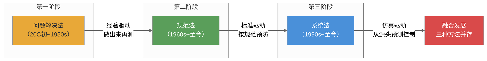
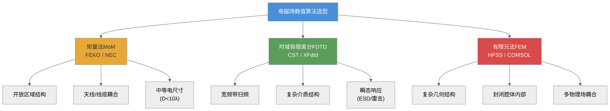
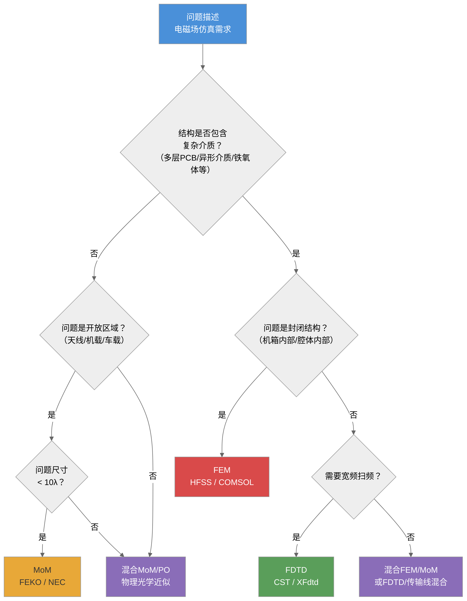
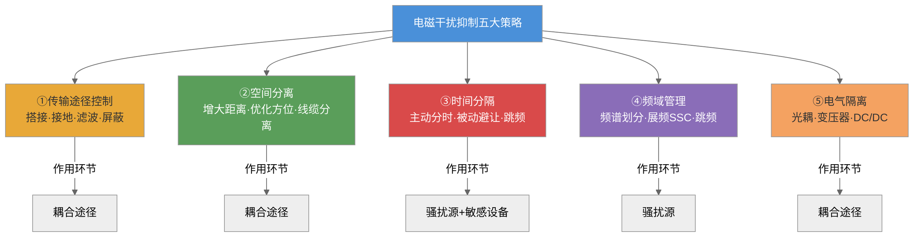
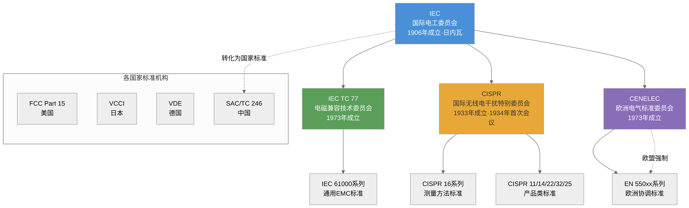
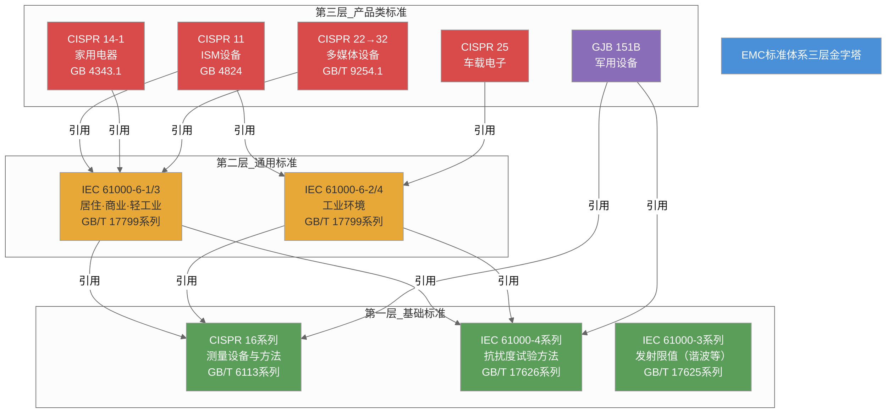
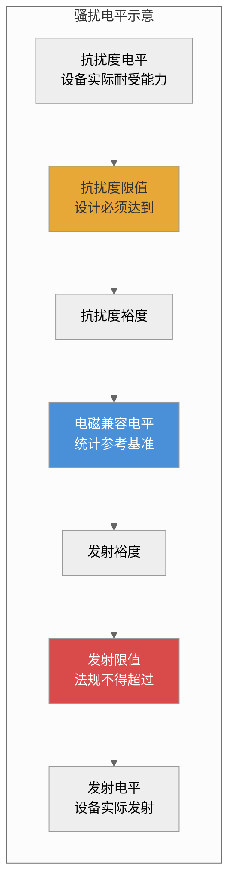
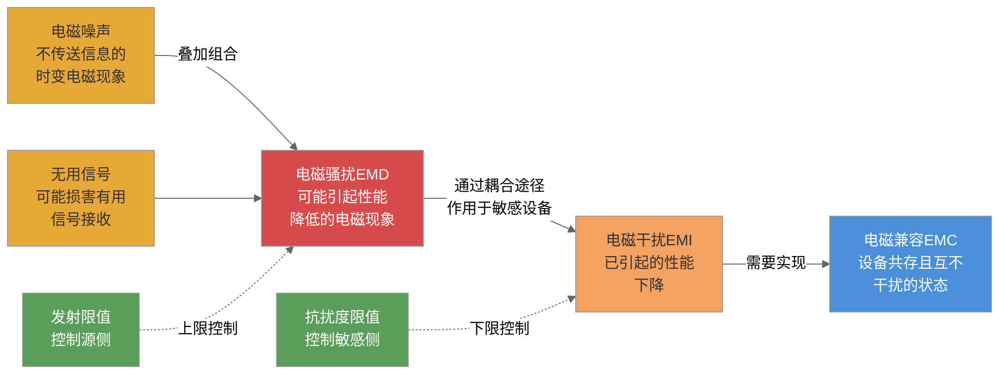
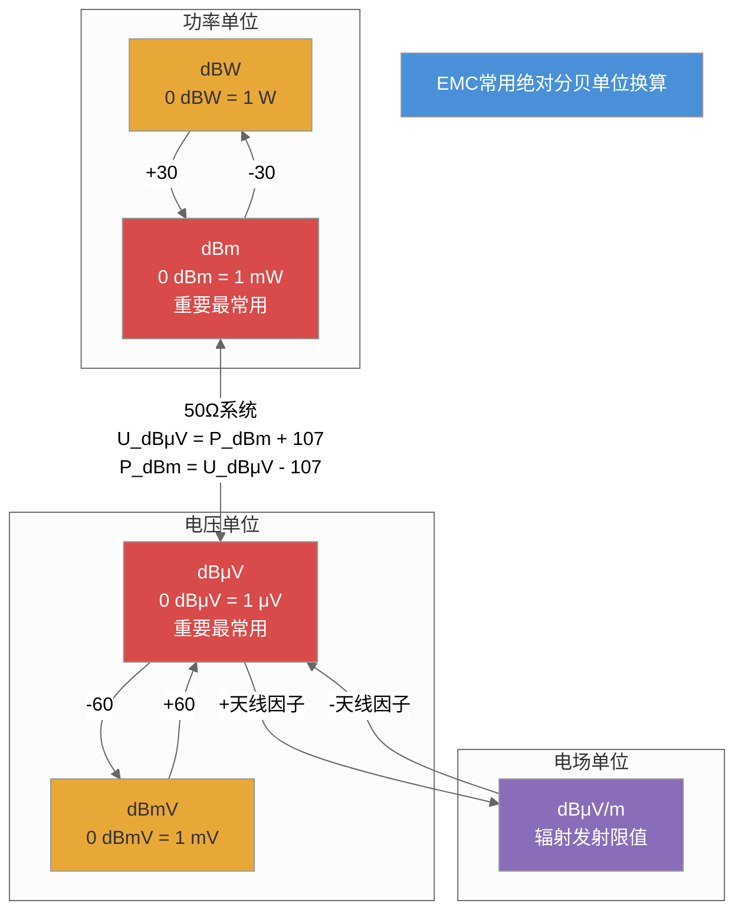
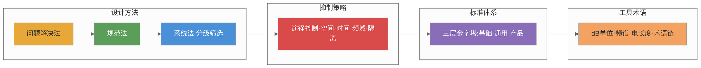

# 第二章 电磁兼容概述

## 内容提要

第1章建立了电磁兼容的基本概念体系，包括EMD/EMI/EMC的区分、三要素框架、发展历程和研究内容。本章在此基础上进一步展开电磁兼容工程实践的完整方法论，内容覆盖五个方面：解决电磁兼容问题的三种设计方法（问题解决法、规范法、系统法）、电磁干扰的五种基本抑制策略（传输途径控制、空间分离、时间分隔、频域管理、电气隔离）、国际和国内的电磁兼容标准体系、常用电磁兼容术语的系统梳理、以及电磁兼容工程中的常用单位体系（分贝制、英制长度、电磁波频谱和电长度）。通过本章学习，读者将对电磁兼容的工程方法论、标准体系和工具语言有一个系统全面的掌握，为后续各章深入学习具体技术奠定基础。

通过本章学习，读者应达成以下学习目标：

1. 理解电磁兼容设计方法从问题解决法到系统法的三阶段演进，掌握分级筛选法的四个步骤
2. 掌握电磁干扰五种基本抑制策略的原理、典型措施和适用条件
3. 了解国际和国内电磁兼容标准体系的层次结构以及主要标准的内容
4. 熟悉电磁兼容领域常用术语的准确定义、分类体系和相互关系
5. 掌握分贝（dB）的完整换算体系，能在50Ω系统中熟练进行电压-功率换算
6. 理解电磁波频谱的划分规则、各频段的基本特性和EMC意义
7. 理解电长度的概念及其在干扰类型判断、屏蔽设计和接地设计中的应用

---
## 2.1 解决电磁兼容问题的一般方法

从历史发展来看，解决EMC问题的三种方法（问题解决法、规范法、系统法）与电子信息产业的演进节奏密切相关，如图2-1所示。

*图2-1：EMC设计方法的三阶段演进与并存*

一个电子产品从概念设计到量产上市，EMC问题可以在不同阶段被发现和处理。随着工程界对电磁兼容认识的不断深化，解决EMC问题的方法经历了从"出了问题再修理"到"按照规范预防"再到"从源头预测和控制"的三阶段演进。这三种方法并非简单的替代关系——在今天的工程实践中，特别是在不同发展水平和不同行业的企业中，它们仍然并存。理解这三种方法各自的优势和局限，是EMC工程师的基本素养。

从历史发展来看，这三种方法的出现与电子信息产业的演进节奏密切相关。20世纪50年代之前，电子设备以真空管技术和低频模拟电路为主，电磁干扰问题相对简单，通过经验性的后处理即可解决。20世纪60年代至80年代，随着晶体管的普及和数字电路的兴起，EMC问题变得复杂而普遍，各国开始系统性地制定EMC标准。20世纪90年代以来，随着计算机仿真技术的成熟和电子系统复杂度的急剧上升——现代一架飞机中的电子模块数量已超过200个——系统化的EMC设计方法成为必然选择。

### 2.1.1 问题解决法

**问题解决法**是EMC设计方法中最原始、最直观的途径，也是早期工程界普遍采用的方式。它的基本逻辑非常简单：先按照产品的功能需求完成设计和制造，待产品组装完成后进行EMC测试，如果发现EMC问题——例如辐射发射超过标准限值、静电放电导致设备死机、传导骚扰超过规定电平——则分析问题原因并采取补救措施，修改设计或增加抑制器件，然后重新测试，通过后方可进入批量生产。

在EMC学科发展的早期，问题解决法几乎是唯一可行的方法。20世纪50年代之前，电磁兼容尚未形成独立学科，工程界对EMC的认识主要来源于无线电干扰排除的实践经验。在发达国家，问题解决法从无线电技术诞生一直延续到20世纪50年代。即使在今天，我国许多制造厂商——特别是中小规模的电子企业——仍然普遍采用这种方法。造成这一现状的原因是多方面的：产品开发周期短、EMC专业人才匮乏、EMC测试设备昂贵、管理层对EMC的重视程度不足，等等。

问题解决法有其明显的优点：不需要设计者在产品开发阶段投入额外的EMC分析时间和成本，设计团队可以全力聚焦于产品的功能实现和市场进度，不需要专门的EMC仿真软件和测试设备。对于那些技术难度低、产量小、对成本极端敏感的产品来说，采用问题解决法可能是一种务实的选择。

然而，问题解决法的缺点同样突出甚至更为严重。第一，**代价高昂**。产品已经制造出来之后才发现EMC问题，可供修改的空间非常有限。为了将一个超出限值10dB的辐射发射降下来，可能需要重新设计印制电路板的层叠结构和走线布局、更换机箱材料和结构工艺、添加额外的滤波器和屏蔽组件——这些改动在原型阶段还可以应对，但在试产或批量生产阶段就意味着推倒重来。第二，**时间延误**。EMC问题往往在项目后端——产品定型前最后几周的认证测试阶段才被发现，此时距离项目交付截止日期只剩有限时间。一项严重的EMC整改可能将产品上市时间推迟数月，造成巨大的市场机会损失。第三，**治标不治本**。为了赶进度，项目组往往采取"头痛医头、脚痛医脚"式的临时补救措施——为了抑制某个频点的辐射发射而增加的屏蔽措施，可能在另一个频点引入谐振，导致该频点的发射反而升高；为了一台设备的传导发射问题而加装的滤波器，可能因与设备输入阻抗不匹配而完全失效。这种被动应对模式隐含的假设是"EMC问题是可以单点排除的"，但实际EMC问题往往是系统性的——牵一发而动全身。

#### 案例2-1：某通信设备辐射发射超标事件

**经过**

2018年，国内某通信设备制造商开发一款新型基站射频单元。该设备采用多通道MIMO架构，内部集成了4个发射通道和4个接收通道，主时钟频率为122.88 MHz，数据总线速率达1.25 Gbps。项目团队按照常规流程完成了原理图设计、PCB布局布线和结构设计。在首批5台工程样机组装完成后，送交EMC认证预测试。辐射发射测试结果显示：在368 MHz频点处，垂直极化方向的准峰值辐射发射电平为52.3 dBμV/m，超出CISPR 32 Class B限值（47 dBμV/m）达5.3 dB。

这一超标频点恰好对应于主时钟频率的第三次谐波（122.88 MHz × 3 = 368.64 MHz）。项目组立即启动了EMC问题排查和整改流程。整改团队首先使用近场探头对PCB进行近场扫描，发现时钟芯片附近、PCB边缘的时钟信号线走线区域存在显著的近场辐射。进一步排查发现，该时钟信号线从时钟芯片到负载芯片之间穿越了一个分割的电源平面区域，导致信号的回流路径被迫绕行，形成了较大的信号回路面积。

**分析**

整改团队提出了三个候选方案：方案一，将时钟信号线改到PCB的另一层，确保其下方有完整的参考平面——这需要修改PCB布局并重新制版，周期3周，费用约8万元；方案二，在时钟信号线上串联一个磁珠（选择在368 MHz处阻抗约为600Ω的型号）以抑制谐波——这只需要更换BOM中的一个元器件，周期1天，费用增加0.5元/台；方案三，在机箱内增加局部屏蔽罩，覆盖时钟芯片和时钟走线区域——需要制作屏蔽罩模具，周期2周，费用约3万元。

项目组选择了方案二（磁珠），因为其周期最短、成本最低。加装磁珠后重新测试，368 MHz频点的辐射发射降低至43.2 dBμV/m，裕量为3.8 dB，通过了认证测试。但项目组注意到，加装磁珠后时钟信号的上升沿从原来的1.2 ns增加到了1.8 ns，虽然仍在芯片数据手册规定的范围内（最大2.5 ns），但时序裕量已明显减小。

**启示**

这个案例揭示了问题解决法的典型特征和固有风险。从正面看，通过磁珠这一简单措施，在3天内以几乎零成本解决了问题——这是问题解决法在简单问题场景下的优势体现。但从反面看：第一，如果超标频点不是简单的三次谐波，而是由PCB布局不合理导致的宽频带辐射，磁珠显然无法解决，可能需要方案一甚至方案三这样的高成本改版；第二，加装磁珠后时钟信号的完整性受到了一定影响——这在高速数字系统中可能成为一个新的隐患；第三，本次整改只是针对368 MHz这一个频点，并未从根本上解决PCB布局不合理的问题，同一设计在其他项目或产品中可能再次出现类似的EMC问题。

#### 案例2-2：某医疗监护仪静电放电故障

**经过**

2005年，国内某医疗设备企业开发一款多参数病人监护仪。该监护仪通过CCC认证时进行静电放电（ESD）抗扰度试验：接触放电 ±6 kV，空气放电 ±8 kV。在接触放电试验中，当放电枪接触监护仪的金属外壳接缝处时，监护仪出现死机——显示屏冻结、所有生理参数停止更新，需要人工断电重启才能恢复。

**分析**

故障排查：打开机壳后发现，金属外壳的上下盖之间由6颗螺钉固定，但接缝处没有安装导电衬垫，上下盖之间的接触依靠螺钉压接形成的点状接触。在±6 kV的接触放电条件下，放电电流通过外壳时，在外壳接缝处产生较大的阻抗不连续，导致外壳局部电位瞬间上升数百伏。此电位通过机壳内部的缝隙耦合到主控板的地平面，地电位瞬间抬升导致主控板上的嵌入式处理器复位。

整改措施：在外壳接缝处嵌入导电弹性衬垫（铍铜簧片型，接触电阻<10 mΩ/m），确保上下盖之间在整个接缝长度上都有良好的导电连续性。同时，在主控板的电源输入端增加瞬态电压抑制器（TVS管，SMCJ6.0A，钳位电压10.3 V），以吸收通过电源线耦合进入的残余ESD能量。整改后重新进行ESD试验，接触放电 ±8 kV（超过原标准），空气放电 ±15 kV，监护仪均正常工作，复位现象彻底消失。

**启示**

这一案例表明，ESD问题的根源往往是结构设计层面的细节问题——外壳接缝的导电连续性是ESD防护的第一道防线。问题解决法的局限性体现在：ESD故障在产品组装完成后才被发现，修改时需要拆机、加装导电衬垫、焊接TVS管——这些都是原型阶段的操作，对于已经完成模具定型的批量产品来说，更改机壳结构（改为导电衬垫嵌入式设计）需要更新模具，成本高达数万元，周期4~6周。如果在概念设计阶段就考虑了外壳的导电连续性设计，加装导电衬垫的成本不到50元，周期为0。问题解决法的代价差异在此案例中得到充分体现。

#### 案例2-3：某家电企业出口产品的EMC退货事件

**经过**

20世纪90年代末期，我国南方某家电制造企业的一款电饭煲产品出口至欧盟。该批次共5000台，货值约75万美元。货物抵达德国汉堡港后进行进口检验时，抽检产品未通过EN 55014-1（家用电器电磁兼容标准）的传导发射测试——在150 kHz~5 MHz频段内，部分频点的传导发射电平超过限值达12~18 dB。检验机构判定该批次产品不合格，不允许进入欧盟市场。出口企业不仅损失了75万美元的货值，还需额外支付3万欧元的存仓费、检测费和退运费用。

**分析**

调查发现，该电饭煲内部使用的开关电源为简化设计，未配置EMI输入滤波器——仅有一个整流桥 + 330 μF电解电容 + 开关管（MOSFET）+ 高频变压器的基本拓扑。开关管工作在约65 kHz的开关频率，其开关动作在电源输入端产生了丰富的谐波能量。设计人员在设计时没有考虑EN 55014的传导发射限值要求，完全按照功能需求完成设计。事后整改需要在电源输入端加装EMI滤波器（额定电流2A的典型EMC滤波器成本约8元/个），并对PCB布局进行调整以缩短开关管到滤波器的走线。整改后重新测试，传导发射在各频点均低于限值6 dB以上。

**启示**

该案例集中体现了问题解决法在国际市场环境下的致命风险——当产品已经运抵目的港才发现EMC不合格时，已无法在不发生重大经济损失的情况下解决问题。如果企业在产品设计之初就检索并理解了目标市场（欧盟）的EMC标准要求（EN 55014-1），在设计阶段就采用带有EMI滤波器的开关电源方案，增加的成本不到10元/台（5000台共约5万元），远小于被退货造成的75万美元货值损失。这一案例也给后来者一个深刻的教训：在产品出口之前，必须提前研究目标市场的EMC标准体系，将标准要求融入产品设计规范中，而非等产品到了目的港才发现问题。

#### "1-10-100"成本法则的经济学分析

从以上三个案例可以清楚地看到，EMC问题的发现阶段与解决成本之间存在着显著的指数关系。工程界将这一现象总结为"1-10-100"法则：

| 发现阶段 | 相对成本 | 解决周期 | 典型案例 | 成本估算 |
|:--------:|:--------:|:--------:|:---------|:--------|
| 概念设计阶段 | 1 | 0~1天 | 在原理图设计时加入EMI滤波器 | 增加1个滤波器器件成本+10分钟设计时间 |
| 原理样机阶段 | 10 | 1~4周 | PCB改版重新制板 | 改版费约8000元+测试费2000元+2周时间 |
| 工程样机阶段 | 50 | 4~8周 | 结构件修改+模具更改 | 模具修改费3~5万元+重新制板8000元 |
| 批量生产阶段 | 100 | 8~12周 | 停机整改+返工 | 产线停线损失+返工人工费约10~30万元 |
| 市场流通阶段 | 1000+ | 无法估计 | 海外退货+召回 | 货值损失数十万至数百万美元+品牌声誉损失 |

"1-10-100"法则的数学形式表现为：成本 = $10^{\text{阶段指数}}$，其中阶段指数在概念设计阶段为0、原理样机阶段为1、批量生产阶段为2、市场流通阶段为3及以上。这是一个相当保守的估计——在市场流通阶段，由于品牌声誉损失、法律责任和市场份额丢失等因素，实际成本往往达到概念设计阶段的1000倍以上。

问题解决法的本质缺陷就在于，它将EMC问题的解决时机推到了指数曲线的末端——产品组装完成之后再去寻找和修复问题，此时解决成本已经是指数曲线的极高位置。工程界的共识是：一个好的EMC设计流程应该尽可能将问题暴露时机推到曲线的起始端——即在概念设计阶段就通过仿真和规范来预防EMC问题的发生。

### 2.1.2 规范法

**规范法**是对问题解决法的一次重要升级。它的基本思路是：在产品设计阶段就参照已颁布的电磁兼容标准和规范进行设计，在PCB布局布线、屏蔽结构设计、滤波电路配置、接地系统设计等方面预先采取标准推荐或要求的设计措施。这样，可以在产品制造之前就大幅降低EMC问题出现的概率，而不是等产品做出来后才发现问题再去整改。

规范法在美国从20世纪60年代到80年代得到了较为广泛的普及。1967年，美国国防部颁布了MIL-STD-461《电磁发射和敏感度要求》（后经多次修订，已更新至MIL-STD-461G版本，最新为2015年12月版），这是世界上第一个系统性的EMC设计标准。该标准为军用电子设备和分系统的EMC设计提供了明确的技术指标，包括各类传导发射（CE101~CE107）和辐射发射（RE101~RE103）的限值、各类传导敏感度（CS101~CS109）和辐射敏感度（RS101~RS105）的限值，以及对应的测试方法。MIL-STD-461要求所有军品供应商必须按照标准规范进行EMC设计，并通过严格的一致性测试。这套标准体系的实施，从此确立了"设计→测试→认证"的规范化EMC设计流程。

在民用领域，美国联邦通信委员会（FCC）在1979年发布了FCC Part 15《射频设备》的修订版，开始对数字设备的辐射发射进行强制管制。1983年，FCC要求所有含数字电路的设备（时钟频率超过10 kHz）都必须满足FCC Part 15的辐射发射限值。这一规定对整个数字电子行业产生了深远的影响——它迫使计算机、打印机、显示器等设备的设计者从根本上改变设计流程，将EMC考虑纳入设计阶段。在欧洲，欧盟在1989年通过了EMC指令89/336/EEC，要求所有在欧盟市场销售的产品必须满足对应的EMC标准。我国的CCC认证制度从2003年开始强制执行EMC检测，推动了中国企业的EMC设计规范法普及。

规范法的优势体现在以下几个方面。第一，**预防为主**。在概念设计阶段就植入EMC考虑，避免了问题解决法"做完再改"的高昂代价。在PCB设计阶段，EMC工程师通过合理的层叠设计、信号线分类布局、去耦电容配置等措施，可以从根本上减少EMC问题的产生。第二，**有据可依**。有标准和规范作为设计依据，设计过程有章可循，对设计人员的EMC经验要求相对较低。一家刚刚组建EMC团队的企业，可以通过执行标准中规定的设计准则——如布线间距、滤波电路拓扑、屏蔽体厚度等——来保证产品的基本EMC性能。第三，**可预期性**。按规范法设计的产品，通过EMC认证测试的成功率远高于问题解决法的产品，项目进度的可预期性显著提高。

然而，规范法并非万能，它有自身的固有局限。

**局限一：标准的通用性与产品的特殊性之间的矛盾。** 标准和规范面向的是广泛类型的产品类型，不是针对某一个具体设备或系统量身定做的。因此，按照规范法解决的问题不一定是该产品真正面临的最突出问题——可能出现"用了很多措施但没打到点上"的情况。一家公司制造两种完全不同的产品——一台工业变频器和一台医疗监护仪——按照同一个通用EMC标准（如IEC 61000-6系列）进行设计，但两种产品的EMC问题根源和严重程度完全不同，统一的标准无法充分反映这种差异。工业变频器中开关管的高速开关动作产生的共模电流是主要EMI问题，而医疗监护仪中对电极引线耦合的工频磁场干扰的超标是主要抗扰度问题——这两种问题的EMC设计侧重点几乎完全相反。

**局限二：过度设计的风险。** 规范建立在过去的工程经验基础上，而不是针对特定方案的具体预测分析。为确保安全，规范往往留有较大的、统一的安全裕度。对某些产品而言，这意味着不必要的额外成本、体积和重量。在消费电子行业，过设计可能导致产品成本增加10%~20%，这对价格敏感的市场来说是致命的。以一台300W的开关电源为例，如果按军工标准（MIL-STD-461）设计输入滤波器，滤波器体积可能是按民用标准设计的3倍，成本增加约15元——在年产量100万台的消费电子市场，这意味着1500万元的额外成本。在航空航天领域，过设计则意味着额外的重量和空间占用，直接影响有效载荷和续航能力。

**局限三：标准版本的滞后性。** 标准和规范的制定和修订是一个漫长的过程——从技术提案的提出到标准正式发布，通常需要3~5年的时间。在这期间，新技术、新器件和新架构已经出现，但标准尚未覆盖。这就产生了标准滞后于技术发展的系统性偏差。举例来说，CISPR 22（信息技术设备发射限值标准）最早于1985年发布，长期以来一直是全球信息技术设备EMC认证的核心依据。但随着多媒体设备（同时具备信息技术、音频、视频等功能的设备）的普及，CISPR 22和CISPR 13（广播接收机标准）之间的边界越来越模糊。经过多年讨论，IEC终于在2015年发布了CISPR 32（多媒体设备EMC标准），用以取代CISPR 22和CISPR 13。如果在2010~2014年间，设计者仍然按照CISPR 22设计一台具备多媒体功能的信息技术设备，虽然满足当时的标准要求，但产品发布后很快面临认证标准的更新换代。这一案例说明，规范法要求设计者在遵循标准的同时，保持对标准动态的持续跟踪。

**表 2-1：问题解决法与规范法的对比**

| 对比维度 | 问题解决法 | 规范法 |
|:---------|:----------|:-------|
| 设计时机 | 产品原型制造完成后 | 产品设计阶段开始 |
| 核心逻辑 | "先做完，再测试，不行再改" | "按标准设计，预防问题发生" |
| 成本曲线 | 指数增长（1-10-100) | 线性增长 |
| 对人员经验的要求 | EMC整改经验丰富 | 标准理解力强 |
| 测试一次性通过率 | 通常<30% | 通常>70% |
| 适用产品复杂度 | 简单产品（<50个元器件） | 中等复杂度产品 |
| 历史典型时期 | 20世纪50年代前 | 20世纪60年代至今 |
| 当前全球使用现状 | 我国中小型企业仍广泛使用 | 全球工业界主流方法 |
| 最典型失败风险 | 产品定型后EMC不合格导致上市严重延期或退货 | 标准不适用造成"用了很多措施但没打到点上" |

#### 系统法

**系统法**是EMC设计方法的最先进阶段，代表了电磁兼容工程的发展方向。它的核心思想是：利用计算机仿真软件对某一特定系统的设计方案进行全过程的电磁兼容性分析和预测——从概念设计阶段开始，在设计、制造、组装和试验的全过程中不断进行预测分析，根据仿真结果反复修改设计参数，直至仿真结果表明EMC裕量完全满足要求后再进行硬件生产。

系统法的理论基础是电磁场数值计算。经过数十年的发展，三种主要的数值算法已经在EMC仿真领域得到成熟应用，如图2-2所示。

*图2-2：三种EMC数值算法的选型及其适用场景*

**矩量法（Method of Moments, MoM）** 是求解电磁场积分方程的一种高效的数值方法。其基本思想是将需要求解的连续电流分布离散化为若干基函数的叠加，从而将积分方程转化为可以用计算机求解的矩阵方程。MoM特别适用于开放区域结构——因为其利用格林函数自动满足辐射边界条件，不需要在远边界处截断计算空间，因此非常适合天线辐射特性分析、天线间耦合度分析、线缆耦合问题等。MoM对细线结构和面结构的处理尤为高效，但处理复杂介质结构时计算量会急剧增加。代表软件有FEKO（由南非EM Software & Systems公司开发，现已被美国Altair公司收购）、NEC（Numerical Electromagnetic Code，美国劳伦斯利弗莫尔国家实验室开发的开源代码）等。在工程实践中，使用FEKO分析一个安装了4根天线的小型飞行器平台上的天线间隔离度问题，通常可以在数小时内在单台工作站上完成。

**时域有限差分法（Finite-Difference Time-Domain, FDTD）** 由K. S. Yee于1966年提出，直接在时域对麦克斯韦旋度方程进行离散化，通过时间步进的方式模拟电磁波的传播和散射过程。FDTD的核心优势在于：其直接在时域求解，因此一次仿真就能获得整个宽频带的响应（通过对激励信号进行傅里叶变换即可得到频域响应）——这是频域方法（如MoM）需要逐频点计算所无法比拟的效率优势。FDTD对复杂介质结构（各向异性材料、色散材料、非均匀介质等）的建模非常灵活。FDTD的主要局限是：其采用均匀矩形网格对计算空间进行剖分，对曲面结构的建模精度有限（需要使用共形网格技术或用更精细的网格来逼近曲面）；计算区域需要在边界处截断，需要使用完美匹配层（PML，Perfectly Matched Layer）吸收边界来模拟无限大自由空间——PML的适当设置会影响计算精度。代表软件有CST Microwave Studio（德国CST公司，现已被美国Dassault Systemes收购）、XFdtd（美国Remcom公司）等。

**有限元法（Finite Element Method, FEM）** 通过将整个计算区域离散化为许多小的单元（如四面体、六面体等），在每个单元内用插值函数近似场分布，然后通过变分原理或伽辽金方法建立全局方程组并求解。FEM最突出的优势是：其对复杂几何形状的适应能力极强——四面体网格可以精确拟合任意形状的曲面和边界，因此FEM是分析复杂几何结构（如带屏蔽体的电子设备机箱内部、带多种异形结构的航空电子设备舱等）电磁特性的首选方法。FEM的局限性包括：三维全波FEM的计算量较大（特别是当问题尺寸远大于波长时），计算时间随未知量数量的增长呈超线性。代表软件有ANSYS HFSS（美国Ansys公司——业界最知名的商业化三维全波电磁场仿真软件之一，广泛应用于天线、微波器件、封装和PCB的EMC分析）、COMSOL Multiphysics（瑞典COMSOL公司，以其多物理场耦合能力著称——可以将电磁场、热场、结构力学等物理场耦合求解）。

在工程实践中，三种算法往往需要根据具体问题选择或组合使用。以下是一般性的算法选型原则：

**表 2-2：三种EMC仿真算法的选型原则**

| 问题类型 | 推荐算法 | 原因 | 典型场景 |
|:---------|:--------|:-----|:--------|
| 天线性能分析 | MoM | 开放区域，格林函数自动满足边界 | 车载天线布局、机载天线隔离度 |
| 线缆耦合分析 | MoM / FDTD | 线缆长度对比：短→MoM，长→FDTD | 线束串扰、屏蔽电缆转移阻抗分析 |
| 宽频带屏蔽效能 | FDTD | 时域一次仿真得到宽频响应 | 机箱屏蔽效能 30 MHz~1 GHz扫频 |
| 机箱内部场分布 | FEM | 复杂几何结构适应性最强 | 带散热器/屏蔽罩的PCB内部场分析 |
| PCB级电磁辐射 | FDTD / 混合法 | 宽频+介质结构处理 | 多层PCB的电磁辐射仿真 |
| 雷击/EMP效应 | FDTD | 时域冲击响应 | 航空器雷电间接效应仿真 |

#### 分级筛选预测法的四步细化

系统法的核心工作流程是**分级筛选预测法**。当一个复杂系统中包含数百甚至数千个潜在的骚扰源和敏感设备时——例如一架现代战斗机可能包含超过200个电子模块，一部现代汽车的电子控制单元（ECU）数量可达100个以上——不可能也没有必要对所有可能的干扰组合进行同等精度的分析。分级筛选法通过四个递进的筛选层次，逐级聚焦系统资源到最关键的问题上。

**第一级：幅度筛选。** 这是最粗粒度的过滤层。从大量干扰源与敏感设备的组合中，根据发射功率和敏感度阈值的基本数据，初步排除那些明显不构成威胁的弱干扰。幅度筛选的目的是将少数强干扰从大量弱干扰中快速分离出来，使后续分析的规模缩小一到两个数量级。

具体操作示例：假设一个系统中包含50个潜在骚扰源和40个敏感设备，则总的干扰组合数为 50 × 40 = 2000对。进行幅度筛选时，将每个骚扰源的发射功率（或发射电平）与每个敏感设备的敏感度门限进行比较——只有当骚扰源的发射电平高于敏感设备敏感度门限减去一个初始安全裕量（通常取20 dB）时，该组合才进入下一级筛选。如果一个骚扰源的发射电平低至-120 dBm（如某些低功耗传感器电路），而敏感设备是工频电机驱动电路（敏感度门限高至-20 dBm），则即使不进行任何耦合计算也可以断定：在物理上，-120 dBm的微弱信号不可能干扰-20 dBm门限的强健电路——这一组合被直接排除。经过幅度筛选，2000对组合中约80%~90%被排除，剩余约200~400对进入下一级。

**第二级：频率筛选。** 在幅度筛选保留的干扰组合基础上，进一步考虑发射设备与接收设备之间的频率关系。如果骚扰源发射的主要频谱成分与敏感设备的工作频率之间有足够的隔离度——例如发射频谱的中心频率与接收频带的中心频率相差超过3个倍频程——即使骚扰源的发射幅度较大，也可能不会造成实际的干扰问题。

频率筛选的工作流程是：对于每一对经过幅度筛选的组合，获取骚扰源的发射频谱特性和敏感设备的接收机选择性（或带通特性），计算两者在频域上的重叠程度。具体来说，对骚扰源的发射频谱 $S(f)$ 和敏感设备的频率响应 $H(f)$ 进行卷积：$I = \int S(f) \cdot |H(f)|^2 df$，得到修正后的干扰强度。如果修正后的干扰强度小于敏感设备敏感度门限减去一个安全裕量（通常取6~10 dB），则这对组合被排除。

以通信系统分析为例：假设一台工作在2.4 GHz的WiFi设备（发射频段2.4~2.4835 GHz）与一个工作在5.8 GHz的雷达之间的干扰组合——两者中心频率相差约3.4 GHz，远大于WiFi信号的20 MHz频宽和雷达接收机的50 MHz带宽。由于两者在频域上完全没有重叠，频率筛选可以直接排除这一组合。经过频率筛选，剩余组合进一步减少到总数的5%以下——以2000对原始组合计算，此时剩余约50~100对。

**第三级：详细预测。** 对经过前两级筛选后保留下来的"重点嫌疑"干扰组合，进行精细化的定量计算。第三级考虑的因素远比前两级细致，以下逐项展开。

**时间相关性**：两个设备是否会同时工作？在很多系统中，某些设备的工作周期是互斥的或不重叠的。例如，在雷达系统中，发射机和接收机通常采用分时工作方式——当雷达发射大功率脉冲时，接收机的高功率保护开关将输入端短路，不会造成任何干扰。时间相关性的分析可以排除那些在物理上不可能同时工作的干扰组合。在天基系统中，某些设备只在特定轨道位置工作，太阳电池阵的扰动电流只在向阳面存在等。对于存在时间可分离性的组合，可以直接标记为"EMC兼容"而不需要进一步计算。

**极化匹配**：发射天线和接收天线之间的极化匹配度直接决定了耦合效率。当发射天线的极化方式（水平极化、垂直极化、圆极化等）与接收天线的极化方式完全一致时，耦合效率最高（极化匹配因子=1，0 dB）。当两者完全正交时，耦合效率最低——理想情况下极化失配因子可达0（无穷大dB），实际工程中由于天线非理想性和多径效应，交叉极化隔离度通常在15~25 dB之间。例如，一部垂直极化的地面通信台站的信号，经过25 dB的交叉极化隔离度后，到达水平极化的机载接收天线时，其有效功率已经衰减了25 dB。

**天线增益**：发射天线和接收天线在彼此方向上的增益值对耦合度有极大影响。对于定向天线（抛物面天线、贴片阵列天线、喇叭天线等），主瓣方向上的增益值（典型值15~30 dBi）与旁瓣和后瓣方向上的增益（典型值-10~0 dBi，即比主瓣低15~30 dB以上）之间存在着数十dB的差异。在一部舰载雷达中，如果其主瓣指向海平面方向（搜索目标），则安装在雷达天线后方的通信设备所受的雷达辐射比安装在主瓣方向的设备低20~30 dB。

**距离衰减**：电磁波在传播过程中的空间衰减量与传播距离的平方成反比。在自由空间中，传播衰减可以用Fris公式精确描述：$P_r/P_t = G_t G_r (\lambda / 4\pi R)^2$，其中 $P_t$ 和 $P_r$ 分别为发射功率和接收功率，$G_t$ 和 $G_r$ 为发射和接收天线增益，$\lambda$ 为波长，$R$ 为距离。在自由空间中，距离每增加一倍，接收功率衰减6 dB。但在实际工程环境中（如飞机舱内、设备机柜内），多径反射和散射效应使得距离衰减规律偏离自由空间模型，较为保守的近似是距离每增加一倍，衰减4~5 dB。

**介质损耗**：电磁波穿过机箱壁、屏蔽材料、PCB基板等介质时的附加衰减。介质损耗取决于材料的复介电常数 $\varepsilon = \varepsilon' - j\varepsilon''$，其中 $\varepsilon''/\varepsilon' = \tan\delta$（损耗角正切）。例如，FR-4 PCB基板在1 GHz时的 $\tan\delta \approx 0.02$，穿过1 mm厚FR-4时，电磁波的衰减约为0.8 dB。在EMC分析中，不仅要考虑通过介质的透射损耗，还要考虑介质界面（如空气与机箱壁交界面）上的反射——介质介电常数差异越大，反射越强。

第三级的输出是每对干扰组合的定量化干扰功率谱密度或干扰概率分布，标注出最关键的耦合途径。经过这一级的筛选，剩余的最关键组合通常减少到10~20对。

**第四级：性能分析。** 将前三级筛选和预测的结果与系统的实际性能指标关联起来。性能分析的基本流程是：将第三级计算的干扰电平（功率/电压/场强）注入系统性能模型，用具体的系统性能参数（信噪比SNR、误码率BER、虚警概率、控制环路相位裕度等）来评估干扰的实际影响。

举例说明几种类型：

**通信系统性能分析**：干扰信号耦合到通信接收机输入端后，接收机输入端的信噪比恶化为 $SNR = S/(N + I)$，其中 $S$ 为有用信号功率，$N$ 为接收机热噪声功率，$I$ 为第三级计算的干扰功率。将恶化后的SNR代入调制方式的误码率表达式——如对于QPSK调制，$BER = \frac{1}{2} \text{erfc}(\sqrt{SNR})$。如果计算得到的BER超过了系统设计指标（如$10^{-6}$），则判定为存在EMC问题。

**雷达系统性能分析**：干扰信号耦合到雷达接收机的信号处理单元后，导致虚警概率增加。对于恒虚警率（CFAR）的信号处理算法，干扰电平的增加会导致检测门限的适应度下降，虚警概率从设计值 $10^{-6}$ 上升到 $10^{-4}$ 甚至更高，这对雷达系统的作战效能是致命的——过多的虚警会使操作员无法分辨真假目标，或导致跟踪系统饱和。

**飞行控制系统性能分析**：干扰信号叠加到飞行控制系统的传感器信号（如角速率传感器、加速度传感器）上后，经控制系统闭环反馈放大会导致控制回路的稳定性裕度降低。使用奈奎斯特判据或增益裕度/相位裕度分析，如果干扰导致的相位裕度降低超过设计允许的容限（通常为设计裕度的50%），系统可能进入自激振荡或不稳定状态——这对飞行器来说是灾难性的。

第四级的最终输出包括：系统电磁兼容性的定量评估结论、标有EMC裕量的系统级EMC矩阵、需要重点关注的"热点"问题列表、以及为热点问题推荐的缓解措施。这一级的输出不仅是系统法EMC设计的最终交付物，也是系统总设计师和客户进行决策的技术依据。

#### 系统法中三种数值算法的工程选型详解

在EMC仿真领域，三种数值算法各有其最擅长的"领地"和"禁区"。以下对每一算法从工程应用的角度进行深入分析。

**矩量法（MoM）的工程应用详解**

MoM的基本原理是将导体表面的连续电流分布用有限个基函数（通常为RWG基函数——由Rao、Wilton和Glisson于1982年提出的三角形面元基函数，或线段的脉冲基函数）近似表示。在FEKO等商业软件中，用户需要将三维几何模型剖分为三角形面元网格（对于面结构）或线段网格（对于线结构），然后软件自动建立矩阵方程并求解。

MoM的典型工程场景和其计算量之间的关系是EMC工程师需要理解的关键问题。MoM的矩阵方程维度等于未知量（基函数）的数量N，其求解的计算复杂度约为 $O(N^3)$（直接求解，当N<10000时）到 $O(N^2)$（迭代求解，当N较大时）。对于以波长λ表示的问题尺度，未知量数量约为 $N \propto (D/\lambda)^2$（面结构）或 $N \propto D/\lambda$（线结构），其中D是结构最大线度。因此，当问题尺寸从10λ增加到20λ（即2倍），面结构的未知量增加到4倍，计算时间增加到约16倍（$O(N^2)$假设）——这就是为什么MoM适用于中等电尺寸问题的原因。

**MoM的适用场景示例**：
- **车载天线布局分析**：汽车车身尺寸约4m，工作频率在100 MHz~1 GHz之间（对应波长3m~0.3m），电尺寸约为1.3λ~13λ。在FEKO中使用MoM分析车辆平台上天线之间的隔离度，通常需要5万~20万个未知量，在一台配置128 GB内存的工作站上可以在数小时内完成。
- **机箱孔缝泄漏分析**：机箱尺寸约0.5m，工作频率在1 GHz（λ=0.3m）时电尺寸约1.7λ，适合使用MoM分析机箱上各种孔缝（通风孔、接缝、电缆出口等）对屏蔽效能的降低作用。

**MoM的局限性**：MoM对复杂介质结构的处理需要特殊技术，如体等效原理（将介质区域等效为体极化电流的辐射），这会导致未知量数量急剧增加，失去MoM的高效优势。因此，对于包含多层介质PCB、异向介质吸收体等复杂介质结构的问题，FEM或FDTD通常是更合适的选择。

**时域有限差分法（FDTD）的工程应用详解**

FDTD的核心优势——一次仿真获得整个宽频带响应——使其成为EMC预合规扫频分析的理想工具。FDTD使用Yee网格（以K. S. Yee的名字命名），在空间和时间上都采用交错网格：电场分量在整数时间步上采样、在整数网格点位置计算；磁场分量在半整数时间步上采样、在整数网格偏移半个网格的位置计算。这种交错排布使得电场和磁场在空间和时间上交替更新，自洽地模拟电磁波的传播。

FDTD的计算复杂度分析：对于一个三维FDTD网格，计算区域的网格数 $N_x \times N_y \times N_z$，时间步数 $N_t$ 正比于最大网格尺寸除以波长（Courant稳定条件要求时间步长 $\Delta t \leq \Delta x_{\min} / (c\sqrt{3})$，其中 $\Delta x_{\min}$ 是最小网格尺寸）。总计算量约为 $O(N_x N_y N_z N_t)$。假设一个2λ × 1λ × 0.5λ的屏蔽机箱计算区域，采用 λ/20 的网格分辨率（共40×20×10=8000个网格单元），模拟20个周期的电磁波传播需要约40个时间步（每波长约2个步长×20=40步），总计算量约32万次更新——在单台GPU加速的工作站上可以在数分钟内完成。

**FDTD的典型工程场景**：
- **屏蔽效能宽频扫频**：从30 MHz到1 GHz的全频段屏蔽效能分析。使用FDTD一次仿真可以得到整个频段的屏蔽效能曲线。例如，对一个带通风口阵列的铝制机箱进行FDTD仿真，可以快速评估不同通风口尺寸和间距对屏蔽效能的影响，从而优化通风口设计。
- **ESD和雷击瞬态响应**：FDTD直接在时域模拟瞬态电磁脉冲的传播和耦合过程。对设备进行IEC 61000-4-2标准规定的ESD仿真（接触放电4 kV、8 kV），可以评估ESD电流在机壳上的分布、在PCB上的耦合电压，以及敏感元器件端子上的感应电压。
- **PCB级电磁辐射**：对多层PCB上的信号线、电源平面进行全波FDTD仿真，可以预测其辐射发射频谱，并在PCB布局修改后快速重算整个频谱的变化——这在PCB设计的EMC预评估中具有很高的工程价值。

**FDTD的局限性**：FDTD的均匀矩形网格在处理薄曲面结构（如细的金属线、薄的介质层）时，需要使用共形网格技术或细网格技术，这会增加计算量。对于具有多尺度特征的问题（如毫米级的BGA焊球与分米级的PCB共同存在），FDTD需要使用"网格细化和粗化"技术（multigrid或subgridding）来平衡计算精度和效率，但这增加了建模的复杂性。

**有限元法（FEM）的工程应用详解**

FEM通过对计算区域进行自适应四面体网格剖分，用每一个四面体单元内的插值多项式来近似电磁场的精确解。FEM的核心优势在于其几何适应性：四面体网格可以沿着任意曲面和边界进行加密或稀疏剖分，因此对于包含弯曲表面、倒角、螺孔、散热器翅片等复杂几何特征的结构，FEM是唯一能够以可接受的网格数量达到工程精度的方法。

FEM的计算复杂度：在HFSS等商业软件中，FEM采用自适应网格加密技术——软件首先用一个较粗的网格进行求解，然后根据场梯度（误差分布）的指示自动在误差大的区域加密网格，重复这一过程直到求解精度满足预设的收敛标准（通常设定为最大S参数变化<0.02或场误差<1%）。对于典型的EMC问题，自适应网格加密过程需要经过5~10次迭代，网格单元数量从初始的数千个增加到最后的上百万个。

**FEM的典型工程场景**：
- **屏蔽体内部场分布**：分析机箱内部各点在不同频率下的电场和磁场强度分布，找出"热点"位置（场强最大的敏感器件位置）。这对于判断系统中哪个单元最容易被干扰至关重要。
- **连接器的高频特性仿真**：对USB、HDMI、以太网等高速连接器进行FEM全波仿真，分析其高频插入损耗、回波损耗和串扰特性——这些参数决定了连接器在高速数字系统中的信号完整性和EMC性能。
- **腔体谐振分析**：对电子设备机箱进行腔体谐振模式分析，确定各阶谐振频率和对应的Q值。当骚扰源的工作频率与腔体谐振频率重合时，机箱内部的场强会被共振放大数十倍（Q值可达100~1000），这对敏感元件是致命威胁。

**FEM的局限性**：FEM的网格生成时间较长——对于包含数百个几何特征的复杂三维结构，自动网格剖分可能需要数十分钟到数小时。对于超电大尺寸问题（D > 100λ），FEM的计算量变得难以承受，此时混合方法（如FEM与MoM的混合——FEM处理复杂介质区域、MoM处理开放区域）是更优的选择。

**三种算法的综合选型决策树**：

以下决策树可以帮助EMC工程师根据具体问题选择最合适的数值算法，如图2-3所示。

*图2-3：EMC数值算法综合选型决策树*

#### 系统法的工程案例

以下通过一个简化但完整的案例来展示系统法的工作流程。

**案例背景**：某型号电动汽车中需要评估电机驱动系统（骚扰源）对车载信息娱乐系统（敏感设备）的电磁兼容性。该电动汽车采用永磁同步电机，由IGBT逆变器驱动，IGBT开关频率为10 kHz。信息娱乐系统使用2.4 GHz WiFi和5.8 GHz C-V2X通信模块。

**第一级（幅度筛选）**：电机驱动系统的IGBT开关在母线电压350 V下产生瞬态电流变化率高达500 A/μs，功率级约为100 kW。信息娱乐系统WiFi接收机的灵敏度为-95 dBm（2.4 GHz频段），C-V2X接收机灵敏度为-92 dBm（5.8 GHz频段）。电机驱动系统的发射电平（通过传导和辐射）在100 kW量级，远高于接收机-95 dBm的灵敏度门限（差约160 dB），幅度筛选判定该组合不能直接排除，进入下一级。

**第二级（频率筛选）**：IGBT的10 kHz开关频率，其谐波频宽范围从10 kHz的基波一直延伸到几十MHz（由于上升沿为微秒级，其谐波能量可延伸到约1/πtr ≈ 300 kHz/mm量级，tr=100 ns时延伸至约3 MHz）。WiFi模块工作在2.4 GHz（2,400 MHz），C-V2X工作在5.8 GHz（5,800 MHz），电机驱动系统的谐波主要分布在DC~30 MHz。两者在频域上的间隔超过2个数量级（30 MHz vs 2,400 MHz）。因此，频率筛选判定：该对组合的基波和谐波与WiFi/C-V2X的工作频带在频域上无实际重叠，可以**直接排除**——不需要进入第三和第四级分析。

**启示**：这个案例展示了系统法的一个核心效率优势——通过第二级频率筛选，计算量最大、最复杂的第三和第四级分析根本不需要执行，系统设计者可以放心地判定：电机驱动系统和信息娱乐系统在EMC上是兼容的。如果采用问题解决法，设计团队可能在本不需要担心EMC问题的两个子系统之间花费大量时间去测试和验证——这正是系统法相比于前两种方法的效率所在。

#### 1-10-100法则与系统法的经济学阐释

从工程经济学的角度看，三种方法在费效比方面呈现出截然不同的曲线。工程设计中的"1-10-100"法则——在产品设计初期解决EMC问题的成本为1，工程样机阶段发现并解决的成本为10，批量生产后才发现的成本为100——清楚地揭示了系统法的经济价值。

以一个典型的消费电子产品为例：在概念设计阶段通过仿真预测发现并修改PCB上的一条关键信号线走线错误——设计工程师只需要花半小时调整布局即可，几乎零成本，项目进度无任何延迟。如果在原型测试中发现同样的EMC问题——辐射发射超标——则需要重新制板（制板费8000~15000元，周期1~2周）并更换样机（费用约5000元），成本约20000~25000元，时间损失2~4周。如果在批量生产发货后才在市场上暴露问题——产品大面积出现WiFi断连投诉——则意味着产品召回（物流、检测、维修、再发货成本约50~200元/台，以10万台计为500~2000万元）和品牌声誉损失（可能影响后续产品系列的市场竞争力），总成本可能高达数千万元。

系统法的核心优势在于：它将问题发现时机推到了成本曲线的起点附近。在概念设计阶段，通过电磁场仿真软件的预测分析，可以比较准确地识别出系统中的EMC热点，在设计冻结之前就将这些问题解决。对于一个包含10~20个电子模块的系统，一次完整的EMC仿真分析（包括建模、求解、结果分析）的投入通常在数万到数十万元之间，但其解决的问题在批量生产阶段可能对应着数百万元的潜在损失。由此可见，系统法不仅是一种技术选择，更是一种以最低的总生命周期成本实现EMC目标的工程管理策略。

目前，美国、英国、法国、德国等西方发达国家在航空航天、军事电子、通信系统等领域已普遍采用系统法进行EMC设计，并建立了完善的、多功能的电磁兼容性预测程序库和数据库。这些数据库包含了各种典型元器件的EMC特性参数、各种常见结构的天线模型、各种材料的屏蔽效能数据、各类标准的限值库等。在民品领域，随着仿真软件的普及和计算能力的提升，系统法也开始在汽车电子、医疗器械、消费电子等行业得到越来越广泛的应用。

值得注意的是，系统法的有效应用需要三个前提条件：其一，**足够精确的器件模型**——仿真结果的可靠性取决于输入模型的精度；其二，**经验丰富的仿真工程师**——正确的建模方法和结果解读需要大量的工程经验积累；其三，**足够的计算资源**——精细的3D全波仿真可能需要数小时到数天的计算时间。这些前置条件决定了系统法目前主要在中大型企业和高端产品开发中采用，尚未完全普及到所有电子制造企业。

**表 2-3：三种EMC设计方法的综合对比**

| 对比维度 | 问题解决法 | 规范法 | 系统法 |
|:---------|:----------|:-------|:-------|
| 介入时机 | 产品原型制造完成后 | 产品设计阶段开始 | 概念设计阶段开始 |
| 设计依据 | 测试发现问题后被动整改 | 依据通用标准和规范 | 基于计算机仿真的预测分析 |
| 所需工具 | EMI接收机、频谱分析仪（后验） | 标准和设计指南 | EMC仿真软件（CST/HFSS/FEKO等） |
| 成本特性 | 后期整改成本极高（1:10:100法则） | 裕度可能过度造成浪费 | 早期解决问题，全生命周期成本最低 |
| 风险水平 | 高——可能延误项目、推倒重来 | 中——标准不完全适用 | 低——全生命周期全面掌控 |
| 人才要求 | 经验型EMC整改工程师 | 标准理解型EMC工程师 | 仿真与分析型EMC工程师 |
| 适用产品类型 | 简单产品或极短开发周期产品 | 常规消费电子、工业设备 | 复杂系统（航空航天/通信/汽车） |
| 历史使用时期 | 20世纪50年代前（发达国家）至今（我国许多企业） | 20世纪60年代至今（主流） | 20世纪90年代至今（发展趋势） |
| 解决一个典型EMC问题的成本估算 | 10万~100万元（批次产品） | 1万~10万元（标准引用） | 5000~5万元（仿真分析） |
| 一次认证通过概率 | <30% | 约70%~85% | >95% |
| 对项目进度的冲击 | 极大——可能推迟数月 | 中——可能需标准协调 | 极小——在项目规划中已考虑 |

#### 柯金良EMC设计三方法的补充视角

柯金良教授在其《电磁兼容概论》中提出了与上述分类互补的另一种视角【柯金良，§1.4】：

**① 测试修改法**——与问题解决法类似，在设计过程中几乎不考虑电磁兼容性，在对样机进行测试的过程中发现问题，然后进行修改、再测试、再修改，直到样机满足要求。这种方法的设计盲目性极强，最终解决方案一般不是最佳的。

**② 系统设计法**——与系统法类似，在产品的设计过程中仔细预测各种可能发生的电磁兼容问题，并从设计阶段就采取各种措施，避免电磁兼容问题。采取这种方法通常能在正式产品完成之前解决约90%的电磁兼容问题。

**③ 分层与综合设计法**——这是柯金良教授的独到见解，具有很强的工程操作性。其核心思想是根据防护措施在实现EMC时的重要性，分层依次进行设计：

| 层次 | 设计内容 | 优先级 | 说明 |
|:---:|:--------|:-----:|:-----|
| 第一层 | **有源器件的选择和印制板设计** | 最优先 | 选择低辐射、高抗扰度的器件；优化PCB的层叠结构、信号线布局和回路面积控制 |
| 第二层 | **接地设计** | 第二优先 | 设计合理的接地系统——单点接地、多点接地或混合接地，确保接地阻抗在宽频段内保持低值 |
| 第三层 | **屏蔽设计** | 第三优先 | 在器件和PCB设计、接地设计无法解决剩余EMC问题时，采用屏蔽结构来阻断辐射耦合 |
| 第四层 | **滤波设计** | 第四优先 | 在以上三层措施之后仍有传导干扰问题时，加装EMI滤波器作为最后的保障 |
| 第五层 | **综合设计** | 贯穿始终 | 将以上四层措施有机整合，统筹考虑各层措施之间的相互作用和兼容性 |

这种分层设计法的工程意义在于：它建立了一条清晰的EMC问题解决路径——从最根本的源头（器件和PCB）开始解决问题，而不是一上来就加屏蔽、加滤波器。层次越靠前的措施，其成本越低、效果越根本。据柯金良教授统计，约80%的电磁干扰问题可以在设计与开发过程中（即第一、二层）解决【柯金良，§1.4】。这种自底向上的分层思路与问题解决法"自顶向下加补救"的做法形成了鲜明对比，也是EMC设计方法从"事后补救"走向"源头预防"的具体体现。

---

*设问过渡：掌握了EMC设计方法的三阶段演进和各自的适用场景之后，一个自然的问题是：一旦确定采用某种设计方法，在实际设计中具体有哪些技术手段可以用来抑制电磁干扰？这就是下一节将要讨论的内容——电磁干扰的五种基本抑制策略，它们构成了EMC设计的工程工具箱。*
## 2.2 电磁干扰抑制策略概述

在深入了解EMC设计方法的演进之后，本节介绍电磁干扰抑制的基本策略。这些策略围绕一个核心原则——破坏电磁干扰三要素（骚扰源、耦合途径、敏感设备）中的至少一个。按照作用于三要素的不同环节和不同的物理机理，电磁干扰抑制策略可分为五大类别，如图2-4所示。

*图2-4：五大电磁干扰抑制策略及其作用的三要素环节*

这五大策略并非各自独立地使用——在工程实践中，一个产品的成功EMC设计往往是多种策略的组合使用。例如，屏蔽（属于传输途径控制）通常需要配合良好的接地（也属于传输途径控制）才能发挥最大效果；而接地设计本身又与空间布局（空间分离）密切相关。理解每种策略的原理、优势、局限和适用范围，并根据具体问题灵活选用和组合，是EMC工程师的核心技能之一。

需要说明的是，以下各项策略的具体工程实现方法将在第5章至第8章中分别详述，本节仅作系统的概览和对比分析。

### 2.2.1 传输途径控制

传输途径控制是最直接、应用最广泛的电磁干扰抑制策略。它的核心思路是在电磁能量从骚扰源传播到敏感设备的路径上进行阻断或衰减，使到达敏感设备的骚扰能量降低到不足以造成干扰的水平。根据不同的传播机理，传输途径控制主要包括四种具体技术：搭接、接地、滤波和屏蔽。

**搭接**——在系统的两个金属构件之间建立低阻抗的电气连接，使它们具有相同的电位。良好的搭接可以减小接地回路的阻抗，降低地电位差引起的共模干扰。

搭接的工程实质是在导体之间建立一条低阻抗的电流通路。在理想状态下，两个金属构件之间的搭接电阻应为零——此时它们在电气上是等电位点，不会因为电流流过而产生电位差。但在实际工程中，搭接处总会存在一定的接触电阻，这个接触电阻的大小决定了搭接的质量。

搭接分为直接搭接和间接搭接。**直接搭接**是两个金属构件通过机械方法（螺钉、铆接、焊接或钎焊等）直接接触，接触电阻越低越好——对非运动部件，要求接触电阻小于0.1 mΩ甚至0.01 mΩ量级；对运动部件（如机箱门与机箱体之间的铰链搭接），接触电阻可能稍高，但通常不应超过2.5 mΩ。**间接搭接**是通过搭接片、编织带（如镀锡铜编织带，广泛用于机箱门、面板与主框架之间的柔性连接）或导电垫片（如铍铜簧片、导电橡胶垫片等）连接两个金属构件。

搭接的设计要点十分讲究。第一，**搭接条的形状**：搭接条的宽度应大于长度（宽扁的搭接条比细长的导线具有更低的电感）。在射频段（几十MHz以上），搭接条的宽度/长度比影响其高频阻抗——一个宽25mm、长50mm的铜编带的高频阻抗远小于一根直径1mm、长50mm的铜导线，前者的电感约为后者的1/10。第二，**接触面的处理**：搭接表面的氧化层、涂层（油漆、阳极化处理膜等）必须在搭接前清除干净以确保低电阻接触。铝制机箱的阳极化处理层（Al₂O₃，电阻率极高）必须用导电垫片或局部打磨的方式去除，否则看似紧固的机械连接在电气上可能是断路。第三，**电化学腐蚀防护**：不同金属之间的搭接需要考虑电化学腐蚀问题。铝与铜直接接触时，铝是阳极（腐蚀速率显著加快），需要在搭接界面使用防腐导电涂层（如镍过渡层）或绝缘垫圈（将两种金属在电解液中隔离）来防止电偶腐蚀。在军品和航空产品中，对金属材料组合有详细的允许/禁止使用列表（如MIL-STD-1250要求铝与铜之间加镀镍垫片）。

搭接在航天航空和军事装备中的可靠性直接影响系统安全。1980年，一架F-16战斗机在飞行中因雷达系统电缆的屏蔽层与机身的搭接失效（搭接电阻从0.5 mΩ升高至50 mΩ），导致雷达发射机的射频能量通过屏蔽层耦合至飞行控制计算机的传感器信号线，造成飞行控制系统误动作，飞机坠毁。事后调查发现，搭接失效的原因是搭接面采用了铝-铜直接接触，未加防腐隔离措施，在海洋气候环境中运行6个月后产生了严重的电化学腐蚀——搭接面的接触电阻升高了100倍。这一事故随后推动了搭接设计规范的全面修订。

**接地**——为电路或系统提供一个公共的参考电位面（通常称为"地"），同时为骚扰电流提供低阻抗的回流路径。接地系统设计得不好，不仅不能抑制干扰，反而会成为干扰传播的通道。

接地按功能分为**安全接地**（保护人身安全、防止电击）和**信号接地**（为信号回路提供参考电位）。安全接地是将设备机箱、外壳等可导电的金属部件接地，使故障电流（如绝缘击穿时的短路电流）通过接地线流回电源端，触发过流保护装置（熔断器或断路器）切断电源。安全接地的典型要求是接地电阻小于4 Ω（中国GB 50057—2010《建筑物防雷设计规范》要求）或小于0.1 Ω（军标要求）。信号接地是为电路中的信号提供一个公共参考点（零伏参考），使信号电流有一个明确的回流路径。

按接地方式分为四种类型：

**单点接地**——所有电路统一接在一个公共接地点上。单点接地的优点是各电路的接地电流不会相互串扰（避免了地环路），因此适用于低频电路（工作频率较低，接地导体的阻抗以电阻为主，感抗可以忽略）。单点接地的缺点是接地导体的长度随着电路数量的增加而增长——在较高的频率下，长接地导体的高感抗导致接地阻抗上升，使接地点不再是理想的零电位。单点接地的适用频率上限通常为1 MHz左右，超过此频率时接地线的电感效应开始显著（一根50mm长的导线，在1 MHz时感抗约为0.3 Ω，在10 MHz时感抗约为3 Ω，在高频段可以忽略直流电阻）。

**多点接地**——各电路就近接地（各电路在离自己最近的位置通过短而宽的导体连接到接地平面）。多点接地的优点是接地导体的长度极短（通常<5 cm），高频接地阻抗很低，适用于高频电路（典型适用频率从1 MHz到GHz级）。多点接地的缺点是在接地平面上的不同接地点之间可能存在电位差（由于地电流分布的不均匀），形成地环路电流。在高性能混合信号PCB（如同时包含模拟和数字电路）中，多点接地可能造成模拟地与数字地之间的耦合。

**混合接地**——在低频时呈现单点接地特性（断开接地平面与机壳之间的连接），在高频时呈现多点接地特性（通过小电容将接地平面旁路到机壳）。混合接地通过RC网络（电阻+电容并联）或电感+电容的网络来实现频率相关的阻抗特性。例如，在MHz以下频率，一个串联的100 nF电容呈现高阻抗（使接地成为单点），在MHz以上频率该电容呈现低阻抗（使接地成为多点）。混合接地适用于宽频段系统（如从DC到几GHz的宽带放大器、多功能综显系统等）。

**悬浮接地**——电路与机壳（大地参考）完全隔离，没有任何直接的电气连接。悬浮接地的典型应用包括医疗电子设备（需要极低的泄漏电流以避免对病人的电击风险——IEC 60601-1要求患者的泄漏电流不超过10 μA）、高灵敏度测量仪器（需要在没有地回路耦合的条件下测量极微弱的信号）等。悬浮接地的问题是：在高压静电放电或雷击事件中，悬浮电路的电位会因电容耦合而悬浮到较高电压，造成绝缘击穿。

**滤波**——利用滤波器件的频率选择特性，将有用信号频率范围内的电磁能量保留，将不需要的骚扰频率成分加以衰减。EMC滤波器与常规信号滤波器有着显著的区别：常规信号滤波器针对的是已知频段的已知信号，而EMC滤波器需要在极宽的频率范围（通常从几十kHz到GHz级）内保持高性能，同时还要满足额定电压、额定电流、工作温度范围、安全性等综合要求。

EMC滤波器设计的关键难题是**阻抗匹配问题**。与常规滤波器不同——常规滤波器的输入端和输出端阻抗通常是固定的（如50Ω），按照经典的滤波器设计方法即可精确设计——EMC滤波器的输入端（接骚扰源）和输出端（接负载）的阻抗往往不是固定的50Ω，而是未知的、随频率变化的。电源输入端EMC滤波器的源端（骚扰源）可能是开关电源的高阻抗电流源（呈现数百Ω的共模阻抗），也可能是变频驱动系统的低阻抗电压源（呈现几Ω的差模阻抗）；负载端可能是恒定功率的DC/DC变换器（呈现随功率变化的阻抗）。因此，EMC滤波器设计需要在源阻抗和负载阻抗不确定的条件下保证滤波效果，这比常规滤波器设计要复杂得多。

EMC滤波器的典型器件组合包括：共模扼流圈（两个同向绕在同一个磁芯上的线圈，对差模电流的磁场相互抵消、对共模电流的磁场相互增强），X电容（接于相线和中线之间，滤除差模干扰，通常为0.1~1 μF的薄膜电容），Y电容（接于相线/中线和地之间，滤除共模干扰，容量限制在nF级以下——由于对安全性的考虑，Y电容的漏电流必须受控，各国标准对Y电容的容量有严格限制——如IEC 60384-14要求Y1类电容的容量不超过4.7 nF），磁珠（铁氧体磁芯材料，在特定频率下呈现电阻性——将骚扰能量转化为热能消耗掉，而非像电容和电感那样将骚扰能量反射回去）。

在工程实践中，滤波效果可以通过插入损耗（Insertion Loss, IL）来定量评估：插入损耗定义为不接入滤波器时负载上的骚扰电平（$V_{\text{without}}$）与接入滤波器后负载上的骚扰电平（$V_{\text{with}}$）之比，以dB表示：$IL = 20\log(V_{\text{without}} / V_{\text{with}})$。一个设计良好的电源EMC滤波器在30 MHz以下的插入损耗可达40~60 dB（即干扰电平降低100~1000倍）。

**屏蔽**——利用屏蔽体对电磁波的反射和吸收来阻断电磁能量在空间中的传播。屏蔽效能（SE）是衡量屏蔽体性能的核心指标，其单位也是分贝（dB），定义为无屏蔽体时某点的场强（$E_0$ 或 $H_0$）与有屏蔽体后该点的场强（$E_1$ 或 $H_1$）之比：$SE_E = 20\log(E_0/E_1)$，$SE_H = 20\log(H_0/H_1)$。当屏蔽效能为60 dB时，意味着有屏蔽体后的场强仅为无屏蔽体时的千分之一。

屏蔽效能取决于三个因素：**屏蔽材料的电磁参数**（电导率越高、磁导率越高，屏蔽效能越好）——铜（$\sigma = 5.8\times10^7$ S/m，$\mu_r = 1$）在高频段的反射损耗很大，铝（$\sigma = 3.5\times10^7$ S/m）与之接近；**屏蔽体的厚度**（厚度越大，吸收损耗越大）——屏蔽效能中的吸收损耗分量与厚度成正比：$A = 131.4 t\sqrt{f\mu_r\sigma_r}$（dB），其中t为厚度mm，f为频率MHz，$\sigma_r$为相对电导率（铜为1），$\mu_r$为相对磁导率；**骚扰的频率**（频率越高，吸收损耗越大，但孔缝泄漏也越严重）。

在低频段（如几十kHz），屏蔽效能主要由材料的吸收损耗决定。由于吸收损耗与$\sqrt{f\mu_r\sigma_r}$成正比，在低频时吸收损耗很小——例如，0.5mm厚的铜板在1 MHz时的吸收损耗仅为$131.4 \times 0.5 \times \sqrt{1 \times 1 \times 1} \approx 66$ dB，但如果频率下降到100 kHz，吸收损耗降为约21 dB。因此，屏蔽低频磁场（如工频50 Hz磁场）非常困难——需要高磁导率的铁磁性材料（如坡莫合金（$\mu_r=10^4\sim10^5$）、纯铁、硅钢片等），且需要足够厚度。一片1mm厚的坡莫合金在50 Hz时的吸收损耗为$131.4 \times 1 \times \sqrt{50\times10^{-6} \times 10^5 \times 0.1} \approx 9.3$ dB——虽然不高，但已比相同厚度的铜（0.003 dB提升约3000倍）提供的工频磁场屏蔽效果好得多。

在高频段（如MHz级以上），材料的反射损耗起主导作用。反射损耗与材料的导电率和磁导率的关系为：$R = 168 + 10\log(\sigma_r/(f\mu_r))$（dB，针对电场，距离r=1m的远场）。铜在1 GHz时的电场反射损耗约为$168 + 10\log(1/(10^3\times1)) \approx 138$ dB——非常可观。但需要注意的是，反射损耗在低频段更大（频率越低，反射损耗越大），这就是为什么在低频时屏蔽效能主要由吸收损耗而不是反射损耗限制的原因。

在高频段，**孔缝泄漏**成为限制屏蔽效能的主要因素。屏蔽体上的通风孔、接缝、电缆出入口、显示窗口等开口的尺寸如果达到信号波长的1/10以上，就会成为高效的电磁波泄漏通道。典型数据：一个10 cm长的缝隙在300 MHz时（λ=1m，l/λ=0.1）泄漏开始显著；在1.5 GHz时（λ=20 cm，l/λ=0.5）该缝隙成为高效的缝隙天线，几乎完全失去了屏蔽作用。因此，高频电子产品的机壳设计必须确保屏蔽体上的所有开口的线度远小于工作频率对应波长的0.1倍——这对于手机、平板电脑等GHz级工作的设备来说，意味着几乎所有大于几毫米的开口都必须进行处理（如使用导电衬垫填充接缝、使用波导通风孔的截止频率来控制通风口的泄漏等）。

### 2.2.2 空间分离

空间分离是最简单、成本最低的电磁干扰抑制措施——通过增大骚扰源与敏感设备之间的物理距离来降低耦合强度。在辐射耦合的机制下，电磁场的强度随距离的增加而衰减：在近场区（距离远小于波长 $\lambda/2\pi$），电场强度随距离的平方衰减（正比于 $1/r^3$），磁场强度随距离的立方衰减（正比于 $1/r^2$）。在远场区（距离远大于 $\lambda/2\pi$），电磁场强度随距离线性衰减（正比于 $1/r$），即每增加一倍距离，场强衰减6 dB。因此，将敏感设备移动一段距离，往往可以使干扰电平大幅降低。

**空间分离的工程应用**：在PCB布局中，将高速数字电路（时钟电路、数据总线）与敏感的模拟电路（放大器、ADC前端）分区放置，两者之间保持足够的间距（通常建议3~5 mm的隔离带，或更大）。模拟/数字分区之间的隔离槽（通过在PCB上挖去铜箔形成隔离带）可以进一步增加空间分离的有效性。在系统布局中，将发射天线与敏感接收天线放置在尽可能远的位置——例如，在舰船上，导航雷达天线与通信天线之间保持的最小水平间距由舰船可用空间和EMC兼容性要求共同决定，通常为大尺寸量级的物理分离。在通信基站中，多个天线（2G/3G/4G/5G）共用塔架时，垂直间距通常要求大于1m，水平间距要求大于0.5m，以保证天线之间的隔离度大于30 dB。

除了增大直线距离之外，空间分离还包括优化设备间的相对方位和朝向。例如，使发射天线的最大辐射方向避开敏感设备（使敏感设备落在天线辐射方向图的后瓣或零点区域），或使敏感设备的电缆走向避开骚扰源附近的高场强区（例如将敏感信号电缆布置在机箱远离骚扰源的角落而不是紧贴骚扰源），都可以在不移动设备和增加成本的情况下实现可观的EMC改善。

空间分离的另一个重要应用是**线缆分离**。线缆分离在工程实践中可能是空间分离中最具操作性的措施——因为它不需要改变设备的布局或电气设计，只需要合理安排走线路径。基本原则如下：电源电缆和信号电缆应分开走线（保持至少10~30 cm的间距）；模拟信号电缆和数字信号电缆应分开走线；强电电缆（如电机驱动线、变频器输出线）和弱电信号电缆应分开走线——在GB/T 16842（等同采用IEC 61000-5-2）中，对不同类型的线缆之间的建议间距有详细的规定。不同类型的信号电缆在同一个线束（cable bundle）中敷设时，应采用分层或分区的方式——例如，在飞机布线中，发动机控制系统的电缆与娱乐系统的电缆分别布置在飞机两侧的线槽中。

### 2.2.3 时间分隔

时间分隔是指当两个或多个电气电子设备之间可能产生电磁干扰时，通过错开它们的工作时间来实现兼容。时间分隔可以分为主动时间分隔和被动时间分隔两种方式。

**主动时间分隔**——在设计阶段就有意识地安排系统内各设备的工作时间，使可能互相干扰的设备不会同时工作。经典的工程实例是雷达系统的收发时序（Transmit-Receive Timing）：雷达在发射大功率脉冲期间（通常几个微秒到几十微秒，峰值功率从数kW到数MW），接收机前端的高功率保护开关（使用PIN二极管限幅器或铁氧体限幅器）将输入端断开或短路，防止发射信号烧毁灵敏的接收前端。雷达发射结束后（发射脉冲宽度典型值为1~100 μs），接收切换开关在纳秒级时间内切换到接收状态，使回波信号可以进入接收机。通过这种"发射时关闭接收、接收时关闭发射"的主动时间分隔，雷达可以在同一个天线和同一个频段上安全地工作。

另一个典型的主动时间分隔示例是多路复用通信系统：时分多址（TDMA）在同一个载波频率上将时间划分为多个时隙，每个用户或通信链路分配一个专属时隙。在GSM移动通信系统中，每个载频的帧周期为4.615 ms，划分为8个时隙——一个手机只在分配给自己的时隙（约577 μs）内发射信号，其余时间内其他用户的信号在相同的载波频率上传输，不会互相干扰。无线局域网中使用的CSMA/CA（载波监听多点接入/冲突避免）协议本质上也包含了主动时间分隔的思想：设备在发送数据前先监听信道，如果检测到信道空闲则发送；如果信道被占用，则随机退避一段时间后再次尝试。这种机制使得多个设备可以在共享的通信介质上分时工作，避免了时间和频率上的冲突。

**被动时间分隔**——系统根据电磁环境的实际状况自动调整工作状态。当某个设备检测到强干扰信号时，主动延迟自己的工作时间或切换到其他工作模式，待干扰减弱后再恢复工作。

被动时间分隔在工业自动化系统中也有应用：在变频驱动系统中，当变频器执行开关动作（产生强电磁骚扰的瞬态过程）时，系统控制器通过I/O信号通知附近的传感器或测量设备暂时停止数据采集，待开关瞬态过程结束（通常持续几十微秒到几毫秒）后再恢复。这种"同步抑制"方式避免了测量过程中采集到被变频器开关瞬态污染的数据，是工业现场EMC问题的一种实用而低成本的解决思路。

### 2.2.4 频域管理

频域管理是将有限的电磁频谱资源在不同设备、不同系统之间进行合理分配，使它们的信号在频域上互不重叠或保持足够的隔离度。频域管理是解决系统间电磁兼容问题（特别是无线系统之间的干扰）的主要手段。

**频谱划分**是频域管理的最基本方式。由国际电信联盟（ITU）和各国的无线电管理机构（如中国的国家无线电办公室、美国的联邦通信委员会FCC）将电磁频谱划分为不同的频段，分配给不同的无线电业务。每种业务只能在分配给自己频段内工作，不能越界。例如，调频广播占用88~108 MHz频段，全球定位系统GPS使用L1频段1575.42 MHz ± 1 MHz和L2频段1227.60 MHz ± 1 MHz，WiFi在2.4~2.4835 GHz和5.150~5.850 GHz频段工作，5G移动通信使用3.5 GHz（n78频段，3.3~3.8 GHz）、4.9 GHz（n79频段，4.8~5.0 GHz）和毫米波频段（n258频段24.25~27.5 GHz等）。只要各设备严格按照分配的频段工作，频域上的干扰就可以得到有效的控制。

**频率调制与展频技术**是在设备级主动管理电磁发射频谱的手段。当某个设备的工作频率正好落在已知干扰频点上时，可以通过调整工作频率来避开干扰——这被称为"跳频"（Frequency Hopping），是现代数字无线通信系统（蓝牙、WiFi的某些模式、军用抗干扰通信等）的核心技术。

现代开关电源中广泛采用的**展频技术**（Spread Spectrum Clocking, SSC）是一种巧妙且成本极低的频率调制方法。其基本原理是：让时钟频率在标称频率附近以一个有限的调制深度（通常为标称频率的±0.5%~±2%）和调制速率（通常为几十kHz）周期性变化——将集中在基频和各次谐波上的能量分散到更宽的频带上，从而降低每个频点上的能量密度。展频技术的EMC效果：对于时钟频率的基波和谐波，SSC可以将峰值发射电平降低3~10 dB（取决于调制深度和调制速率），使发射频谱更容易满足EMC限值要求，同时成本增加几乎为零（只需要在时钟芯片或PLL中配置SSC参数，不需要增加任何元器件）。

类似地，在汽车电子中，DC/DC变换器也开始采用扩频调制技术——通过调制开关频率（变化范围通常为标称频率的±5%~±10%），将开关噪声的频谱扩散，降低特定频点上的EMI电平。这种技术在电动汽车的DC/DC转换器中已经得到广泛应用。

频域管理的深层次挑战在于，频谱资源是有限的、不可再生的，而无线通信系统对频谱的需求正在以指数级增长。5G毫米波频段（24~28 GHz、37~43 GHz等）与卫星通信、军用雷达、射电天文等传统无线电业务使用的频段相邻甚至重叠。为了在这些业务之间协调频率使用，需要采用多种技术手段：动态频谱接入（DSA）——设备在发射之前先感知频谱环境，只选择当前没有被占用的频段进行通信；认知无线电（Cognitive Radio）——设备根据周边电磁环境的实时情况自动调整工作参数（频率、功率、调制方式）以最大化频谱利用效率；频谱共享——不同业务在时间和空间上共享同一频段（如美国CBRS（公民宽带无线电业务）频段中，海军雷达和商用LTE在3.5 GHz频段共享）。如何在这些业务之间协调频率使用，已成为当前电磁兼容领域的研究热点。

### 2.2.5 电气隔离

电气隔离是通过阻断两个电路之间的直接电气连接来切断传导干扰的传输路径。电气隔离的核心特征是：信号或能量可以通过非导电路径（光、磁场等）从一个电路传递到另一个电路，但两个电路之间没有直接的欧姆接触，因此直流和低频的共模电流无法通过。常用的电气隔离手段包括以下三种。

**光电隔离**——使用光电耦合器件（简称光耦），利用光作为中间传输介质实现输入和输出电路之间的电气隔离。光耦的基本工作原理是：输入端是一个发光二极管（LED），输出端是一个光敏器件（如光敏三极管、光敏二极管或光敏达林顿管）。当输入端的电信号流过LED时，LED发出的光照射到输出端的光敏器件上，光敏器件将光信号还原为电信号。

光耦的技术参数非常关键。隔离电压（输入与输出之间的绝缘耐压）从2.5 kV到5 kV是常规产品，高压光耦可达10 kV以上。在工业变频器中，控制电路与功率模块之间的隔离通常使用隔离电压3.75 kV或5 kV的光耦（如东芝TLP350、安华高ACPL-312T等IGBT驱动光耦）。光耦的传输速率从几十kbps（普通光耦）到几十Mbps（高速数字光耦）不等。在通信接口隔离（如RS-232、RS-485、CAN总线隔离）中，通常使用高速光耦（如HCPL-7721传输速率达25 Mbps）。光耦广泛应用于数字信号接口隔离、开关电源反馈回路的隔离（如PC817常用于开关电源反馈环路中的初级-次级隔离反馈）、电机驱动和变频器中控制信号与功率级的隔离等场合。

光耦的优点：隔离电压高（2.5~10 kV）、响应速度快（可到几十MHz）、成本低（通用型光耦价格0.5~5元/只）、使用简便。局限是：输出级需要额外的驱动电源、长期工作存在老化问题（LED亮度衰减导致传输比下降）、需要一定的驱动电流（LED正向电流通常为5~20 mA）。

**变压器隔离**——利用变压器通过磁场而非导线直接耦合来传输交流信号或能量，同时实现电气隔离。变压器隔离的原理是：变压器原边的交变电流在铁芯中产生交变磁场，交变磁场在副边线圈中感应出电压，原边和副边之间没有直接的电气连接。

变压器隔离是三种隔离方式中功率传输能力最强的一种。在开关电源中，高频变压器（工作频率通常在50 kHz~500 kHz之间）是实现输入电源与输出负载之间隔离的核心器件，可以传输从数瓦到数千瓦的功率，同时保持3 kV以上的隔离电压。变压器隔离的设计要点包括：根据工作频率选择合适的磁芯材料（铁氧体——如MnZn系列适用于几十kHz~几百kHz，NiZn系列适用于更高的频率如1~10 MHz；非晶和纳米晶材料适用于更低频率如1~50 kHz，且具有更高的饱和磁通密度），考虑变压器的寄生参数（原副边之间的分布电容会降低高频段的隔离效果——因此在EMC设计中，通常需要在原副边绕组之间添加静电屏蔽层，接至直流地或机壳地，以抑制分布电容耦合的共模干扰）。

**DC/DC隔离**——在直流电源系统中，通过隔离型DC/DC变换器实现输入与输出之间的电气隔离。隔离型DC/DC变换器内部包含一个高频变压器，通过对输入直流电压进行高频开关变换、经过变压器隔离传输、再整流滤波得到稳定的输出直流电压。

常见的隔离型DC/DC拓扑包括：反激变换器（Flyback Converter，适用于几十瓦以下的中小功率，由于元器件数量最少而广泛应用于家电电源、充电器等），正激变换器（Forward Converter，适用于中等功率50~300 W，在工业控制电源中常见），半桥变换器（Half-Bridge，适用于300~1000 W），全桥变换器（Full-Bridge，适用于1000 W以上，由于变压器的利用率最高，在通信电源、服务器电源中大功率电源中广泛使用）。

隔离型DC/DC变换器可以同时实现三个目标：电压变换（将输入电压升高或降低到所需值）、电气隔离（输入和输出之间没有直接电气连接）、稳压输出（输出电压不随输入电压和负载的变化而波动）。隔离型DC/DC的隔离电压通常为1.5 kV~3 kV（工业级）到5 kV以上（医疗级——IEC 60601-1要求患者与供电电源之间有两层医学级绝缘，隔离耐压通常为4 kV或更高）。

**表 2-4：三种电气隔离方式的对比**

| 对比维度 | 光电隔离 | 变压器隔离 | DC/DC隔离 |
|:---------|:--------|:---------|:----------|
| 隔离介质 | 光（LED→光敏器件） | 磁场（铁芯↔绕组） | 高频变压器（同变压器隔离） |
| 传输信号类型 | 数字信号、模拟信号 | 交流信号、交流功率 | 直流功率 |
| 典型隔离电压 | 2.5~10 kV | 1.5~10 kV | 1.5~5 kV（医疗级可达7 kV） |
| 最大传输功率 | 几十mW（信号级） | 数kW | 数十W~数kW |
| 带宽/频率 | DC~几十MHz | 几十Hz~几百MHz（信号变压器） | DC~几百kHz（开关频率） |
| 典型成本 | 低（0.5~5元/路） | 中（2~20元/变压器） | 中~高（10~200元/模块） |
| 典型应用 | 数字隔离、开关电源反馈 | 开关电源主变压器、音频隔离 | 分布式电源系统、通信电源 |

**表 2-5：五种电磁干扰抑制策略的综合对比**

| 策略 | 作用的三要素环节 | 基本原理 | 典型工程措施 | 成本 | 适用频率范围 | 对电路设计的影响 |
|:-----|:--------------|:---------|:-----------|:---:|:----------:|:--------------|
| 传输途径控制 | 耦合途径 | 阻断或衰减传输路径 | 搭接、接地、滤波、屏蔽 | 中~高 | DC~GHz | 需要额外的元器件 |
| 空间分离 | 耦合途径 | 增大物理距离和优化方位 | 合理布局、线缆分离、天线方位优化 | 低 | 全频段 | 影响物理布局，需早期考虑 |
| 时间分隔 | 骚扰源+敏感设备 | 错开工作时间 | 收发时序、CSMA/CA、跳频扩频 | 中 | 全频段（但需系统协议支持） | 需要系统级的时序协调 |
| 频域管理 | 骚扰源 | 频率分配与调制 | 频谱分配、展频SSC、跳频 | 低 | 射频及以上 | 影响信号设计规格 |
| 电气隔离 | 耦合途径 | 切断直接电气连接 | 光耦、隔离变压器、隔离型DC/DC | 中 | DC~几百MHz | 增加元器件数量和电源需求 |

*设问过渡：了解电磁干扰抑制的五大策略之后，工程实践中的下一个核心问题是：这些抑制措施应该达到什么标准？哪些指标是必须满足的？抑制措施的效果又应该如何评价？这就要依靠电磁兼容标准体系来给出明确的答案了。下一节将系统介绍国际和国内EMC标准的层次结构、主要标准化组织的历史和职能、以及各类标准的具体内容。*
## 2.3 电磁兼容标准简介

EMC标准是电磁兼容设计和试验的根本依据。一套科学、完整的标准体系对于保证不同国家、不同厂家生产的电气电子设备能够在同一电磁环境中兼容共存，具有不可替代的作用。EMC标准规定了各类产品的发射限值（不能发射超过多少的电磁骚扰）和抗扰度要求（必须承受多大的电磁骚扰而不降级），是产品进入市场的"准入门槛"。

从历史上看，EMC标准的产生和演进与无线电技术的普及密切相关。20世纪初期，无线电广播和通信刚刚兴起，各地电台之间的相互干扰问题就已显现。为了解决这一问题，国际社会开始协作制定统一的无线电干扰标准。经过近百年的发展，EMC标准已经从最初的无线电干扰限值扩展为一个覆盖电磁发射、抗扰度、测量方法、测量设备、统计方法、安全要求的综合标准体系。

### 2.3.1 电磁兼容标准化组织

EMC标准的制定和修订工作由多个国际、地区和国家层面的标准化组织承担，如图2-5所示。

*图2-5：国际EMC标准化组织体系*

这些组织的工作相互衔接、互为补充，形成了全球统一的EMC标准网络。

**国际电工委员会（IEC）** 成立于1906年，是世界上成立最早的国际性电工标准化机构，总部设在瑞士日内瓦。IEC负责制定和发布电气电子领域的国际标准，其标准被全球大多数国家采用或引用。在EMC领域，IEC下设多个技术委员会负责不同方面的标准制定工作。

**IEC TC 77**（电磁兼容技术委员会）是IEC中负责EMC标准制定的主要技术机构之一。TC 77成立于1973年——在这一年，国际社会已经充分认识到电磁兼容问题的重要性，需要专门的标准化技术委员会来系统制定通用性的EMC标准。TC 77的职责是制定除无线电通信频段之外的通用EMC标准。TC 77制定的IEC 61000系列标准是EMC领域最基础、最重要的标准体系之一。

IEC 61000系列标准涵盖的范围非常广泛，按子系列划分如下：
- IEC 61000-1系列：总则和术语（包括电磁兼容的基本术语定义和解释——如IEC 61000-1-1）。
- IEC 61000-2系列：电磁环境分类和兼容电平（描述各类电磁环境的特征——居住环境、工业环境、电力设施环境等——以及各频段的兼容电平值）。
- IEC 61000-3系列：发射限值——主要涉及低压供电系统的传导骚扰。IEC 61000-3-2规定了谐波电流发射限值（每相输入电流≤16A的设备），IEC 61000-3-3（≤16A/相）和IEC 61000-3-11（≤75A/相）规定了电压波动和闪烁的限值。
- IEC 61000-4系列：抗扰度试验方法——EMC工程师最常接触的标准子系列，共包含40多个分标准，覆盖了几乎所有的电磁骚扰类型：静电放电（61000-4-2）、辐射射频电磁场（61000-4-3）、电快速瞬变脉冲群（61000-4-4）、浪涌（61000-4-5）、射频传导抗扰度（61000-4-6）、工频磁场（61000-4-8）、电压暂降（61000-4-11）、脉冲磁场（61000-4-9）、阻尼振荡磁场（61000-4-10）等。
- IEC 61000-5系列：安装和减缓指南（指导如何在设备安装阶段通过正确的接地、布线、屏蔽等工程实践来实现EMC要求）。
- IEC 61000-6系列：通用标准（根据电磁环境分类，规定在特定环境中所有产品必须满足的最低EMC要求）。

**CISPR**（国际无线电干扰特别委员会，Comité International Spécial des Perturbations Radioélectriques）成立于1933年——当时无线电广播已经普及，全球各地的无线电接收机受到日益严重的干扰问题困扰。CISPR由IEC和国际广播联盟（UIR）联合发起，第一次会议于1934年6月28日至30日在法国巴黎的IEC总部召开。CISPR的创始成员包括比利时、捷克斯洛伐克、法国、德国、意大利、荷兰、瑞士、英国和美国等9个国家的代表。

CISPR现已成为IEC内部最重要的EMC标准化技术机构之一。CISPR下设多个分委员会：CISPR/A负责无线电骚扰测量设备和测量方法；CISPR/B负责工业科学医疗（ISM）设备的骚扰限值；CISPR/D负责机动车辆的无线电骚扰特性；CISPR/F负责家用电器和电动工具的骚扰限值；CISPR/H负责信息技术设备和多媒体设备的发射限值。CISPR最著名的出版物是CISPR 16系列（测量设备和方法的标准，是EMC测量领域的基准标准）和CISPR 22（信息技术设备的无线电骚扰限值，对全球计算机和数字设备行业产生了极为深远的影响——该标准在2015年被CISPR 32多媒体设备EMC标准取代）。

在地区层面，**欧洲电气产品标准委员会（CENELEC）** 成立于1973年，负责制定协调统一的欧洲EMC标准。CENELEC的标准通常直接采用或改编IEC/CISPR的国际标准，但根据欧盟的特殊法规要求进行适当的补充和修改。欧盟的EMC指令2014/30/EU（2014年2月26日发布，取代了1989年的89/336/EEC，于2016年4月20日起强制执行）要求所有在欧盟市场销售的产品必须满足协调标准（即CENELEC采纳的EN标准）的要求。EN 55022、EN 55011、EN 61000-4-2等是欧盟市场最常见的EMC标准。

在国家层面，各主要工业国家都有各自的EMC标准化机构和市场监管机构。美国联邦通信委员会（FCC——Federal Communications Commission，成立于1934年）负责制定在美国市场销售的电子产品的EMC要求（FCC Part 15）。FCC Part 15是全世界最具影响力的民用EMC法规之一，1979年修订版开始对数字设备的辐射发射进行强制管制——这一规定催生了信息产业领域普遍的EMC设计实践。日本有VCCI（Voluntary Control Council for Interference，自愿干扰控制委员会，成立于1985年）。德国有VDE（Verband der Elektrotechnik，德国电气工程师协会）。英国有BSI（British Standards Institution，英国标准学会）。

中国的EMC标准化工作由国家标准化管理委员会（SAC）统一管理。具体的技术工作由两个重要的标准化技术委员会承担：**全国无线电干扰标准化技术委员会**（对口CISPR的技术委员会）和**全国电磁兼容标准化技术委员会**（对口IEC TC 77的技术委员会）。这两个技术委员会负责组织国内专家参与国际标准的制定和修订工作，并将国际标准转化为中国国家标准。我国的EMC标准体系建设经历了三个阶段：1980年代的起步阶段（以翻译和转换国际标准为主），1990年代的体系建设阶段（我国加入WTO前后，为满足国际贸易要求对EMC标准体系的全面升级），以及2000年代至今的完善阶段（保持与国际标准的同步更新，同时根据国内产业需求制定行业标准）。目前，我国的大多数EMC标准采用"等同采用"（IDT——技术内容和编排方式完全相同，仅翻译为中文）或"修改采用"（MOD——有少量技术差异，如中国电源系统电压为220V/50Hz而国际标准为230V/50Hz）的方式转化国际标准。

### 2.3.2 国际电磁兼容标准

国际EMC标准体系采用清晰的三层金字塔结构，各层之间既有明确的分工又有紧密的衔接，如图2-6所示。

*图2-6：EMC标准体系的三层金字塔结构*

**第一层：基础标准（Basic Standards）。** 基础标准是整个EMC标准体系的根基。基础标准不规定具体产品的限值，而是规定最基础的技术内容：电磁现象的物理描述和分类、测量方法和测量设备的性能要求、测量场地的技术指标和验证方法。基础标准是所有上层标准（通用标准和产品类标准）的技术引用依据。产品类标准几乎逐节引用基础标准的测量方法章节，本身不再重复规定测量方法的技术细节。

最重要的一组基础标准是CISPR 16系列《无线电骚扰测量设备和测量方法规范》。CISPR 16是一套多部分的综合标准——目前包含4大部分共14个分标准，覆盖了EMI测量的全部技术要素：CISPR 16-1规定EMI测量仪器的技术指标（包括各类检波器——峰值、准峰值、平均值、均方根值的目的和技术参数，各频段的测量带宽设置规则，各频段的天线——双锥天线30~200 MHz、对数周期天线200 MHz~1 GHz、喇叭天线1 GHz以上——的性能要求）；CISPR 16-2规定测量方法和测量程序（传导发射和辐射发射的测量布置——包括桌面设备和落地设备的测量布置差异、测量距离的选择——3m/10m/30m、测量结果的处理方法）；CISPR 16-3规定电磁骚扰的统计方法和限值的制定方法（包括基于80%/80%规则的统计评估方法——80%的产品以80%的置信度满足限值要求）；CISPR 16-4规定测量不确定度的评定方法（引入了测量结果不确定度的标准评定流程和最大允许不确定度值——例如，在30~1000 MHz频段的辐射发射测量中，扩展测量不确定度U必须≤5.2 dB）。

另一组关键的基础标准是IEC 61000-4系列《电磁兼容试验和测量技术》，这是EMC抗扰度试验的标准方法体系。该系列包含了40多个分标准，以下是EMC工程师日常工作中使用频率最高的几项：

- **IEC 61000-4-2**：静电放电（ESD）抗扰度试验，最新版为IEC 61000-4-2:2008（含2008年4月修订版）。该标准模拟人体通过直接接触或空气放电向设备注入静电脉冲。试验等级：接触放电分为4级——±2kV（等级1）、±4kV（等级2）、±6kV（等级3）和±8kV（等级4）；空气放电分为4级——±2kV（等级1）、±4kV（等级2）、±8kV（等级3）和±15kV（等级4）。
- **IEC 61000-4-3**：辐射射频电磁场抗扰度试验（80 MHz~1 GHz，以及1~6 GHz扩展频段）。设备在电波暗室中用天线施加指定强度的射频电磁场。试验等级有3V/m（等级2——居住环境典型要求）和10V/m（等级3——工业环境典型要求）。
- **IEC 61000-4-4**：电快速瞬变脉冲群（EFT/Burst）试验。模拟感性负载开关操作产生的快速瞬态脉冲串通过电源线和信号线对设备造成的影响。试验参数：单个脉冲的上升时间5 ns，脉冲宽度50 ns，重复频率依据试验等级为5 kHz或100 kHz，试验电压从0.5 kV到4 kV。
- **IEC 61000-4-5**：浪涌（Surge）抗扰度试验。模拟雷电感应或电网开关操作产生的浪涌电压对设备的影响。采用1.2/50 μs（开路电压波形——1.2 μs为波前时间、50 μs为半峰值时间）和8/20 μs（短路电流波形）的标准浪涌波形。试验电压从0.5 kV到4 kV（线-线）和0.5 kV到6 kV（线-地）。
- **IEC 61000-4-6**：射频传导抗扰度试验（150 kHz~80 MHz）。通过耦合/去耦网络将射频干扰信号注入设备的电源线和信号线。试验电平通常为3V（rms，EMF）或10V（rms，EMF）。
- **IEC 61000-4-8**：工频磁场抗扰度试验（50/60 Hz），模拟电力输电线或变压器产生的工频磁场对设备的影响。试验磁场强度从1 A/m到100 A/m（连续场）和300 A/m到1000 A/m（短时场，1~3秒）。
- **IEC 61000-4-11**：电压暂降、短时中断和电压变化抗扰度试验。试验参数包括：暂降幅度（剩余电压从0%到70%）、暂降持续时间（0.5个工频周期到500个周期）和中断持续时间（250/300个周期，对应5秒）。

**第二层：通用标准（Generic Standards）。** 通用标准规定了在特定电磁环境中所有产品（无论其类型和功能如何）必须满足的最低EMC要求。通用标准按照电磁环境分为"居住、商业和轻工业环境"和"工业环境"两大类，每一类又分为发射要求和抗扰度要求两个方面：

- **居住、商业和轻工业环境**：IEC 61000-6-1（抗扰度）和IEC 61000-6-3（发射）。这类环境中的电磁骚扰水平相对较低，但敏感设备（广播电视接收机、通信设备等）数量众多、对其电磁环境质量的要求很高，因此发射限值最为严格。例如，在居住环境中，信息技术设备的辐射发射限值比工业环境严格约6~10 dB。
- **工业环境**：IEC 61000-6-2（抗扰度）和IEC 61000-6-4（发射）。这类环境中存在大功率电机、变频器、电弧焊机等强骚扰源，因此对设备的抗扰度要求更高（通常比居住环境严格一个等级——例如辐射抗扰度试验电平从3V/m提高到10V/m），但发射限值相对宽松。

当一个产品尚无对应的产品类标准时，通用标准就是它进行EMC认证的依据。通用标准通过引用基础标准的测量方法章节（如引用IEC 61000-4-2的ESD试验方法）来构成自身完整的技术要求。

**第三层：产品类标准（Product Family Standards）。** 产品类标准针对特定类型的产品或产品族，规定了详细的发射限值、抗扰度限值和配套的测量程序。产品类标准通过引用基础标准（引用CISPR 16的测量方法和IEC 61000-4系列的抗扰度试验方法）和通用标准（引用相应的环境分类和限值框架）来构成自身完整的技术要求。

主要的产品类标准及其适用产品范围：

- **CISPR 11（IEC/CISPR 11，对应中国标准GB 4824）**：工业科学医疗（ISM）设备的无线电骚扰特性。适用于感应加热设备（工业高频焊机、家用电磁炉）、微波炉、医用高频手术刀、射频等离子体设备等ISM工作频率在ISM频段（433 MHz、915 MHz、2.45 GHz、5.8 GHz等）的设备。发射限值分为1组（自我振荡型——电磁炉、微波炉）和2组（非自我振荡型——电焊机），以及A级（工业环境）和B级（居住环境）。
- **CISPR 14-1（IEC/CISPR 14-1，对应中国标准GB 4343.1）**：家用电器和电动工具（如吸尘器、电动剃须刀、洗衣机、冰箱、吸尘器、搅拌机、空气净化器等）的无线电骚扰特性。CISPR 14是适用范围最广的产品类标准之一——几乎所有家庭使用的电机驱动或电力电子控制的小家电都在此标准的覆盖范围内。
- **CISPR 25（IEC/CISPR 25）**：用于保护车载接收机的无线电骚扰限值和测量方法。适用于车辆、船舶和内燃机装置上使用的所有电气和电子设备。CISPR 25对汽车电子行业的影响极大——所有现代汽车的EMC认证都需满足CISPR 25的要求（或等效的ECE R10法规要求），其辐射发射限值按频段和测量距离区分，从长波（150 kHz~300 kHz，限值约90~103 dBμV/m）到超短波（30 MHz~1 GHz，限值约24~55 dBμV/m）。
- **CISPR 32（IEC/CISPR 32，对应中国标准GB/T 9254.1—2021）**：多媒体设备（MME）的无线电骚扰特性。CISPR 32于2015年发布，2017年成为欧盟协调标准，取代了CISPR 22（信息技术设备）和CISPR 13（广播接收机等）。适用产品包括：信息技术设备（计算机、服务器、打印机、路由器）、音频和视频设备（电视机、音响、机顶盒）、以及具备信息技术和音视频功能的多功能设备。
- **CISPR 35（IEC/CISPR 35）**：多媒体设备的抗扰度要求，与CISPR 32配套使用。类似地，IEC 61326系列标准适用于测量、控制和实验室用的电气设备（工业仪表、传感器、PLC控制器等）。

### 2.3.3 我国电磁兼容标准

我国的EMC标准体系全面与国际接轨，大多数标准等同（IDT）或修改（MOD）采用IEC/CISPR的国际标准。这种与国际标准高度统一的策略，既有利于消除国际贸易中的技术壁垒，也有助于我国企业参与全球市场竞争。

**国家标准**分为强制性（GB）和推荐性（GB/T）两类。主要的EMC国家标准包括：

- **GB/T 17626系列**（等同采用IEC 61000-4系列）——我国EMC抗扰度试验的核心标准体系。GB/T 17626.2为静电放电抗扰度试验（对应IEC 61000-4-2）、GB/T 17626.3为辐射射频电磁场抗扰度试验（对应IEC 61000-4-3）、GB/T 17626.4为电快速瞬变脉冲群抗扰度试验（对应IEC 61000-4-4）、GB/T 17626.5为浪涌抗扰度试验（对应IEC 61000-4-5）、GB/T 17626.6为射频传导抗扰度试验（对应IEC 61000-4-6）、GB/T 17626.8为工频磁场抗扰度试验（对应IEC 61000-4-8）、GB/T 17626.11为电压暂降和中断抗扰度试验（对应IEC 61000-4-11）。GB/T 17626系列标准是我国EMC实验室中使用频率最高的标准。

- **GB 4824**（等同采用CISPR 11）——《工业、科学和医疗（ISM）设备无线电骚扰特性限值和测量方法》，是ISM设备进行CCC认证或型式试验的EMC依据标准。
- **GB/T 9254.1—2021**（等同采用CISPR 32）——《信息技术设备、多媒体设备和接收机无线电骚扰特性限值和测量方法》，于2021年发布，取代了GB 9254—2008（等同采用CISPR 22）。这是我国关于多媒体设备EMC发射的最新标准。
- **GB/T 6113系列**（等同采用CISPR 16）——《无线电骚扰测量设备和测量方法规范》，是EMC测量的基础标准。
- **GB 4343.1**（等同采用CISPR 14-1）——《家用电器、电动工具和类似器具的无线电骚扰特性限值和测量方法》。
- **GB/T 17799系列**（等同采用IEC 61000-6系列）——居住/商业/轻工业环境和工业环境的通用EMC标准。

**国家军用标准**（GJB系列）是国防装备研制和生产必须严格遵循的技术规范。我国军用EMC标准体系的建设经历了从参照美国军标（MIL-STD系列）到形成自主体系的过程：

- **GJB 151B—2013**《军用设备和分系统电磁发射和敏感度要求与测量》——军用EMC的核心标准，规定了军用设备和分系统必须满足的各项EMC要求的测量方法，包括传导发射（CE101~CE107）、辐射发射（RE101~RE103）、传导敏感度（CS101~CS109）、辐射敏感度（RS101~RS105）等共计27项测试项目。GJB 151B的前身是2005年发布的GJB 151A/152A，再往前是1997年发布的GJB 151/152。GJB 151B与美国MIL-STD-461G在技术框架上基本一致，但根据我国国防装备的实际情况进行了调整。军用标准对设备的要求远高于民用标准——例如，民用信息技术设备的辐射发射限值在30~230 MHz频段为40 dBμV/m（B级，10m），而GJB 151B对陆军地面设备的辐射发射限值（RE102项目，2 MHz~1 GHz）要严格很多。

**CCC认证（中国强制性产品认证）**自2003年8月1日起正式实施，对特定类别的产品强制执行EMC检测。目前CCC认证涵盖的EMC检测项目包括：辐射发射和传导发射测试（依据GB/T 9254或产品标准）、谐波电流发射测试（依据GB/T 17625.1/IEC 61000-3-2）、电压波动和闪烁测试（依据GB/T 17625.2/IEC 61000-3-3）、静电放电抗扰度（GB/T 17626.2）、辐射射频电磁场抗扰度（GB/T 17626.3）、电快速瞬变脉冲群抗扰度（GB/T 17626.4）、浪涌抗扰度（GB/T 17626.5）、射频传导抗扰度（GB/T 17626.6）、工频磁场抗扰度（GB/T 17626.8）、电压暂降和中断抗扰度（GB/T 17626.11）。

**表 2-6：中国EMC标准与国际标准的对应关系**

| 中国标准号 | 标准名称 | 等同国际标准 | 标准层次 |
|:---------|:--------|:------------|:--------|
| GB/T 6113系列 | 无线电骚扰测量设备和测量方法 | CISPR 16系列 | 基础标准 |
| GB/T 17626.2 | 静电放电抗扰度试验 | IEC 61000-4-2 | 基础标准 |
| GB/T 17626.3 | 辐射射频电磁场抗扰度试验 | IEC 61000-4-3 | 基础标准 |
| GB/T 17626.4 | 电快速瞬变脉冲群抗扰度试验 | IEC 61000-4-4 | 基础标准 |
| GB/T 17626.5 | 浪涌抗扰度试验 | IEC 61000-4-5 | 基础标准 |
| GB 4824 | ISM设备无线电骚扰特性 | CISPR 11 | 产品类标准 |
| GB/T 9254.1 | 多媒体设备发射限值 | CISPR 32 | 产品类标准 |
| GB 4343.1 | 家用电器无线电骚扰特性 | CISPR 14-1 | 产品类标准 |
| GB/T 17799.1 | 居住环境通用抗扰度标准 | IEC 61000-6-1 | 通用标准 |
| GB/T 17799.3 | 居住环境通用发射标准 | IEC 61000-6-3 | 通用标准 |
| GJB 151B | 军用设备和分系统EMC要求 | 参照MIL-STD-461 | 军用标准 |

**典型产品所对应的EMC标准案例**：

**案例2-4：医疗设备的EMC标准**
某医疗监护仪要在中国市场销售。它属于医用电气设备，应依据GB 4824（ISM设备标准）进行EMC测试——因为医疗设备在CISPR 11中被归类为ISM设备组别。发射测试参照GB 4824的1组A级（医疗设备的ISM工作频率通常在ISM频段内）或B级（普通病房属于居住环境）限值要求。抗扰度测试依据YY 0505（医用电气设备EMC标准，等同采用IEC 60601-1-2），试验项目和限值参考GB/T 17626系列。医用设备的抗扰度要求通常比普通工业设备高——例如，手术室中使用的高频电刀（工作频率约400 kHz）会对同一环境中的监护仪等敏感设备产生强传导骚扰，因此医用设备的EMC设计需要特别关注抗扰度。

**案例2-5：家用电器（电磁炉）的EMC标准**
一台电磁炉。它在家用环境中使用，应适用GB 4343.1（等同CISPR 14-1）的发射限值要求。电磁炉内部的大功率IGBT（通常在20~50 kHz的开关频率下工作，峰值功率可超过2 kW）会产生大量的开关谐波和宽带噪声，传导发射限值在150 kHz~30 MHz频段需要满足GB 4343.1的限值——通常需要加装EMI滤波器才能通过。抗扰度方面，家用电器通常依据GB/T 17626系列标准执行。

**案例2-6：汽车电子产品的EMC标准**
某电动汽车的车载DC/DC变换器。在整车层面，应满足ECE R10（联合国欧洲经济委员会关于车辆EMC的统一规定）或CISPR 25。在零部件层面，DC/DC变换器的发射测试依据CISPR 25（150 kHz~1 GHz），抗扰度测试依据ISO 11452系列（与IEC 61000-4系列类似但专为车载环境设计）。由于汽车电磁环境极为复杂——车内同时存在强骚扰源（电机驱动、DC/DC、点火系统（传统内燃机汽车））和高灵敏度接收机（AM/FM收音机、GPS、蓝牙、WiFi、远程无钥匙进入等），汽车电子产品的EMC设计比一般工业产品更为严格。

**案例2-7：军用通信设备的EMC标准**
某军用便携式通信电台（工作在UHF频段，发射功率5W）。应依据GJB 151B进行EMC鉴定试验。需要测试的EMC项目包括CE102（电源线传导发射，10 kHz~10 MHz）、RE102（电场辐射发射，2 MHz~18 GHz）、CS114（电缆束注入传导敏感度，10 kHz~400 MHz）、RS103（电场辐射敏感度，2 MHz~40 GHz）等多项。GJB 151B的限值极为严格——例如CE102的传导发射限值在10 kHz~500 kHz频段约为80 dBμV，而同样的频段下，民品标准GB/T 9254（信息技术设备）的传导发射限值约为80~90 dBμV——表面数值接近，但军用标准的测量带宽和测量方法不同，实际严格程度远高于民用标准。

*设问过渡：标准体系给出了产品的EMC技术指标和测量方法，但要正确理解和应用这些标准，工作人员必须掌握一套EMC领域特有的专业术语体系——"电磁骚扰"和"电磁干扰"有什么区别？"抗扰度"和"电磁敏感性"是什么关系？下面第2.4节就来系统梳理这些常用术语。*
## 2.4 常用电磁兼容术语

电磁兼容领域拥有一套完整且严谨的术语体系。这些术语的定义在国家标准GB/T 4365—2003《电工术语 电磁兼容》和IEC 60050-161《国际电工词汇 电磁兼容》中有系统规定。准确理解这些术语的含义及其相互关系，是正确解读EMC标准和进行EMC工程交流的基础。以下按照术语的类别和逻辑关系进行系统梳理。

### 2.4.1 一般术语

**（1）电磁环境（Electromagnetic Environment）** — 存在于给定场所的所有电磁现象的总和。电磁环境是由多种电磁源共同作用形成的，包括自然界存在的电磁现象（雷电电磁场、太阳射电噪声、大气噪声等）和人工产生的电磁现象（电力系统的工频电场和磁场、各种无线电发射信号、工业设备的电磁辐射等）。

对于EMC工程师而言，理解设备所处的电磁环境是正确设定EMC设计目标的前提。部署在变电站内的工业控制设备所处的电磁环境（存在强的工频电场和磁场、开关操作瞬态干扰、局部放电产生的射频噪声）与办公室内的计算机截然不同——在前者中使用的设备需要更强的抗扰度防护，而对后者的发射要求更为严格。电磁环境的分类方法在IEC 61000-2-5中有系统规定——按场所（室内/室外）、按用途（居住/商业/工业）、按电磁活动强度（轻度/中度/重度）三个维度进行组合分类。

**（2）电磁兼容性（Electromagnetic Compatibility, EMC）** — 设备或系统在其电磁环境中能正常工作且不对该环境中任何事物构成不能承受的电磁骚扰的能力。GB/T 4365—2003的这一标准定义揭示了电磁兼容的两个核心要素——抗扰度（"能正常工作"）和发射限制（"不对周围事物构成不可承受的骚扰"）。这两个要素缺一不可。设备或系统具有良好抗扰度但向外发射过强的电磁骚扰，绝不可称为"电磁兼容"——反之亦然。

国际电工委员会（IEC）的定义更为简洁：电磁兼容是设备的一种能力，设备在其电磁环境中能完成它的功能，而不至于在其环境中产生不允许的干扰。美国电气电子工程师学会（IEEE）的定义：一个装置能在其所处的电磁环境中满意地工作，同时又不向该环境及同一环境中的其他装置排放超过允许范围的电磁扰动。

上述3个定义虽措辞不同，反映的是同一个核心要求：设备对电磁骚扰既要"进不来"又要"出不去"——这是一枚硬币的两面。

**（3）电磁兼容电平（Electromagnetic Compatibility Level）** — 预期加在工作于指定条件的装置、设备或系统上的规定的最大电磁骚扰电平。兼容电平是一个统计意义上的参考值。在实际电磁环境中，某个频点处的骚扰电平往往随时间、地点而变化——兼容电平就是在长期测量数据的基础上统计得出的、在给定的时间和地点上以某个概率（通常为80%或95%）不被超过的骚扰电平。兼容电平是制定发射限值和抗扰度限值的参考基准——发射限值通常设置在兼容电平以下（留有裕量），抗扰度限值通常设置在兼容电平以上（也留有裕量），于是发射限值和抗扰度限值之间就构成了一个"兼容窗口"——保证在正常电磁环境下，按标准设计的设备之间可以兼容工作。

图2-8展示了由柯金良教授系统整理的发射/抗扰度限值与兼容电平之间的层次关系。图中从下至上依次为：发射电平（设备实际发射的骚扰量值）→发射限值（法规强制要求，不得超过）→发射裕度→电磁兼容电平（统计参考基准）→抗扰度裕度→抗扰度限值（设备设计目标，必须达到）→抗扰度电平（设备实际耐受能力）。发射限值与抗扰度限值之间的区域即为"兼容窗口"，其宽度由兼容裕度定量描述。

*图1-2：示意图*

*图 2-8：发射/抗扰度限值与兼容电平的层次关系（参照柯金良图1.1.1）*

这一关系图清晰地揭示了电磁兼容性设计的定量目标：将实际发射电平控制在发射限值以下，将实际抗扰度电平提升到抗扰度限值以上，两者之间保留足够的兼容裕度——通常军用系统要求此裕度不低于20 dB【MIL-E-6051D】。【柯金良，§1.1.2】

**（4）性能降级（Degradation of Performance）** — 装置、设备或系统的工作性能与正常性能的非期望偏离。在EMC测试中，性能降级有不同的等级——按照IEC 61000-4系列标准的分类：A级——在施加骚扰期间和之后，设备的功能和性能完全正常，没有任何超出规定容限的降级；B级——在施加骚扰期间，设备的功能或性能出现规定容限以内的暂时性降级，但骚扰停止后设备自动恢复到正常性能；C级——在施加骚扰期间，设备的功能或性能出现暂时性降级，且需要人工干预（如重新启动）才能恢复；R级——设备在骚扰期间发生不可恢复的损坏。大多数产品的EMC认证要求至少达到A级（抗扰度试验期间无降级）或B级（可接受暂时降级但自动恢复）。

**（5）电磁干扰裕度（Electromagnetic Interference Margin）** — 在系统或设备中，敏感设备实际受到的干扰电平与其抗扰度限值之间的差额。裕度为正数且越大，系统工作越可靠。美国军用标准MIL-E-6051D要求军事系统的电磁干扰裕度至少为20 dB。这一要求的工程含义是：即使在最恶劣的工作条件下（考虑温度变化、器件老化、电源波动、多台设备同时发射最不利组合等），干扰电平仍然比敏感设备的抗扰度限值低20 dB以上——因此系统具有很高的兼容可靠性。

### 2.4.2 噪声和干扰术语

**（1）电磁噪声（Electromagnetic Noise）** — 一种明显不传送信息的时变电磁现象，它可能与有用信号叠加或组合。电磁噪声通常是脉动的或随机的，但也可以是周期的。典型的电磁噪声包括：电动机换向火花产生的射频脉冲、数字电路时钟信号及其谐波、开关电源的开关噪声等。电磁噪声的特点是不含有用信息，但在频谱上可能占据很宽的频带——例如，一个上升时间为1 ns的数字信号，其频谱能量延伸到约350 MHz（$f_{\text{max}} \approx 0.35 / t_r$）。

电磁噪声与电磁骚扰的区别在于：电磁噪声是**一种特定类型**的电磁骚扰（是最常见的骚扰形式），而电磁骚扰是一个更广义的概念——它还包括无用信号和传播媒介自身的变化。

**（2）无用信号（Unwanted Signal, Undesired Signal）** — 可能损害有用信号接收的信号。无用信号与电磁噪声的区别在于，无用信号本身可能是含有信息的（例如邻频电台的广播信号、隔壁WiFi路由器的数据信号），但对当前接收机而言，它是无用且有害的。无用信号可能来自其他无线电发射机、电气设备的寄生振荡、非线性器件（如锈蚀的金属接触面）产生的互调产物等。

举例说明：一台寻呼发射机的信号（对寻呼系统是有用信号）出现在电视台接收机的输入端时，对电视机而言就是无用信号——它可能以同频干扰或邻频干扰的方式在电视画面上产生横纹或网纹干扰。

**（3）电磁骚扰（Electromagnetic Disturbance, EMD）** — 可能引起装置、设备或系统性能降低或对有生命、无生命物质产生损害作用的电磁现象。电磁骚扰可以是电磁噪声、无用信号、有用信号（在特定条件下有用信号也可能对其他设备造成骚扰），也可以是传播媒介自身的变化（如电离层扰动对短波通信的影响）。电磁骚扰的核心特征是"可能性"——它强调的是潜在危害，而不要求实际损害已经发生。这是电磁骚扰与电磁干扰之间的根本区别。国家标准GB/T 4365—2003明确引用了IEC 60050-161中的这一区分——在此之前中文术语中"电磁干扰"一词往往混用了"骚扰"和"干扰"两个概念。

**（4）电磁干扰（Electromagnetic Interference, EMI）** — 由电磁骚扰引起的设备、传输通道或系统性能的下降。电磁骚扰和电磁干扰之间是因果关系：骚扰是因，干扰是果。从工程实践的视角看，EMI检测的是"果"——在标准规定的测试条件下，设备在工作过程中对外发射的电磁能量不能超过限值；而设计者需要控制的则是"因"——设备内部的哪些电路和信号以什么方式产生了这些电磁骚扰。

两者之间精确的因果关系可以用因果链表示：电磁噪声/无用信号 → 电磁骚扰 → (通过耦合途径作用于敏感设备) → 电磁干扰 → (导致) → 性能降级。

**（5）无线电干扰（Radio Frequency Interference, RFI）** — 由一个电磁骚扰所引起的、对接收有用无线电信号的损害。RFI是EMI在无线电频段的一个子集——具体指对无线电接收（广播、电视、通信、导航等）造成的有害影响。在早期的文献中，"无线电干扰"是最早被认识到的EMC问题——早在20世纪初，无线电接收机就受到附近电气设备（如电车的电火花、电机的换向火花）的发射干扰。

### 2.4.3 发射和响应术语

**（1）发射电平（Emission Level）** — 用规定方法测得的由特定装置、设备或系统发射的某给定电磁骚扰电平。发射电平是一个实测值，以dBμV（传导发射）、dBμV/m（辐射发射的电场分量）或dBμA/m（辐射发射的磁场分量）为单位。标准中规定的发射限值是设备在设计阶段必须满足的目标——其设计目标是将实际发射电平控制在限值以内，并留有足够的裕量（通常为3~10 dB）。

**（2）发射限值（Emission Limit）** — 规定的电磁骚扰源的最大允许发射电平。发射限值是EMC认证中用于判定产品是否合规的标尺。在产品类标准（如CISPR 22/CISPR 32）中，不同类别的产品有不同的发射限值——信息技术设备通常分为A级（工业环境）和B级（居住环境）两类，B级的发射限值比A级严格约6~10 dB，因为居住环境中敏感设备更多、对电磁环境质量的要求更高。发射限值包括传导发射限值（通常在150 kHz~30 MHz频段）和辐射发射限值（通常在30 MHz~1 GHz甚至扩展到18 GHz）。

**（3）抗扰性电平（Immunity Level）** — 将某给定电磁骚扰施加于某一装置、设备或系统而其仍能正常工作并保持所需性能等级时的最大骚扰电平。抗扰性电平是一个实测值——在抗扰度测试中，由测试人员逐步提高骚扰强度，直到设备出现性能降级，此时对应的骚扰电平即为该设备的抗扰性电平。抗扰性电平越高，说明设备对电磁骚扰的耐受能力越强。

**（4）抗扰性限值（Immunity Limit）** — 规定的最小抗扰性电平。设备在设计时必须确保其抗扰性不低于此限值。抗扰性限值是EMC标准中与发射限值对等的另一类技术指标。例如，IEC 61000-4-2（静电放电抗扰度）规定的最低抗扰性限值为：接触放电±4 kV（等级2，适用于办公环境中的设备）或±8 kV（等级4，适用于工业环境中的设备）；空气放电±8 kV（等级3）或±15 kV（等级4）。

### 2.4.4 电磁兼容性术语

**（1）电磁敏感性（Electromagnetic Susceptibility, EMS）** — 在存在电磁骚扰的情况下，装置、设备或系统不能避免性能降低的能力。敏感性（Susceptibility）与抗扰性（Immunity）是从正反两个角度描述同一性能的术语——敏感性高意味着相同条件下更容易受到干扰，即抗扰性低。两者之间的关系可以表示为：EMC = 抑制EMI的能力（发射限制）+ EMS的降低能力（抗扰度提升）。

**（2）骚扰抑制（Disturbance Suppression）** — 削弱或消除电磁骚扰的措施。骚扰抑制是施加于电磁发射源上的措施——它针对"因"（骚扰本身）而非"果"（干扰后果）。骚扰抑制的典型措施包括：在骚扰源处安装滤波器、优化开关电源的开关波形（通过减缓边沿速率来减少高频谐波含量）、对数字电路信号进行展频调制（降低峰值发射电平等）。

**（3）干扰抑制（Interference Suppression）** — 削弱或消除电磁干扰的措施。干扰抑制可以施加于骚扰源侧（降低发射强度）或敏感设备侧（提高抗扰度），也可以施加于耦合途径上（阻断传播路径）。广义上讲，所有EMC设计措施都可以归为干扰抑制的范畴。

**（4）兼容性裕量（Compatibility Margin）** — 装置、设备或系统的抗扰性电平与骚扰源的发射限值之间的差值。兼容性裕量是衡量系统EMC可靠性的定量指标——它的值越大，系统能兼容工作的概率越高。在理想情况下，兼容性裕量应该在产品的整个生命周期内始终为正——即在考虑器件老化（发射电平可能随温度升高而增加、抗扰度可能随时间而降低）、温度变化、电源电压波动等最不利因素后，兼容裕量仍然大于零。

### 2.4.5 术语间相互关系

上述术语之间存在清晰的逻辑关系和因果链，如图2-7所示。

*图2-7：EMC核心术语的因果链*

从电磁环境中的自然现象和人为活动开始，电磁噪声和无用信号共同构成了**电磁骚扰**。电磁骚扰通过传导或辐射的耦合途径作用于敏感设备，当骚扰的强度超过了敏感设备的抗扰度（即低于其抗扰度限值）时，就产生了**电磁干扰**（EMI），表现为设备性能的降级。为了防止这种"骚扰→干扰"链条的发生，需要对设备的电磁发射进行限制（通过设定发射限值），同时要求设备具备足够的抗扰能力（通过设定抗扰度限值）。**电磁兼容**（EMC）就是这种理想的共存状态——所有设备的发射都在限值以内，所有设备的抗扰度都在限值以上。

用一句话来概括：**电磁噪声或无用信号构成电磁骚扰，骚扰通过耦合途径作用于敏感设备并超过其抗扰度时产生电磁干扰——电磁兼容就是通过设计和控制来防止这一链条发生的工程实践。**

**表 2-7：核心术语的因果链*

| 环节 | 术语 | 角色 | 工程控制手段 |
|:-----|:-----|:-----|:-----------|
| 起点 | 电磁噪声/无用信号 | 骚扰的原始来源 | 降低源的发射（滤波、展频、减缓边沿速率） |
| 过程 | 电磁骚扰（EMD） | 具有潜在危害的电磁现象 | 阻断传播途径（屏蔽、隔离、空间分离） |
| 途径 | 耦合途径 | 骚扰从源到敏感设备的通道 | 切断传导/辐射通道（搭接、接地、滤波） |
| 结果 | 电磁干扰（EMI） | 性能下降已经发生 | 提高抗扰度（设计加固、门限提升） |
| 目标 | 电磁兼容（EMC） | 设备共存且互不干扰 | 综合运用上述所有手段 |

**术语间几个重要区分：**

**电磁骚扰 vs 电磁干扰**：这是初学者最易混淆的一对概念。电磁骚扰是电磁现象本身——它是一个物理存在，不一定造成实际后果（"可能引起"）。电磁干扰是电磁骚扰造成的结果——它是已发生的性能降级（"引起的下降"）。可以这样理解：对于一台正在大功率发射的手机，它的射频信号是电磁骚扰（电磁现象）；而手机信号导致旁边的音响发出刺耳的'嘀嘀'声，这个刺耳声就是电磁干扰（后果）。

**抗扰度 vs 电磁敏感性**：抗扰度是"不降级的能力"，电磁敏感性是"不能避免降级的能力"——前者从正面描述，后者从反面描述。两者是同一个硬币的两面：敏感性高 ⇔ 抗扰度低。

**发射 vs 辐射**：在EMC术语中，"发射"（Emission）既包含辐射发射（通过空间传播），也包含传导发射（通过导线传播）；而"辐射"（Radiation）单指以电磁波形式在空间中传播的能量。通信工程中常用"发射"（Transmission）来描述有意发射——EMC工程中的"发射"不仅包括有意发射，更涵盖了无意发射（设备正常工作过程中产生的无意的能量泄漏）。

*设问过渡：掌握了EMC术语体系后，我们已经具备了阅读标准、理解技术文档的语言基础。下一个核心问题是在实际工程中用什么样的单位来定性和定量描述EMC问题？这就涉及EMC工程中独特的计量单位体系——其中最具特色也最重要的就是分贝。*
## 2.5 常用电磁兼容单位

EMC工程中使用的计量单位体系与常规电工领域有显著区别。在常规电工技术中，功率用W、电压用V、电流用A直接表示；但在EMC工程中，几乎所有量值都用分贝（dB）来表示。此外，EMC工程还涉及英制长度单位（由于北美EMC文献和标准的广泛影响）、电磁波频谱划分和电长度概念。熟练掌握这一完整的单位体系，是进行EMC定量分析和工程实践的重要前提。

### 2.5.1 分贝

分贝（dB）是EMC工程中最核心、最基础的计量单位。第1章已经介绍了分贝的基本定义和使用分贝的两大便利性——压缩动态范围和简化功率-电压换算。本节在此基础上进行系统的深化，覆盖分贝的全部常用形式、完整推导过程和工程换算速记。

#### （一）为什么使用分贝

在EMC工程中，不使用线性单位的根本原因在于电磁量的极端动态范围。一个EMC工程师在工程实践中需要处理的参数可能涵盖了从纳瓦级（-60 dBm）到兆瓦级（+90 dBm）的功率范围——跨度为150 dB（相当于千万亿倍的比值）。如果直接使用线性单位，一个从皮瓦到千瓦的参数表将覆盖15个数量级——这在任何图表和数值计算中都是不现实的。使用分贝制之后，同样范围的参数可以压缩在-90到+90 dBm之间——数值范围只有180个单位，非常适合工程表格和数值计算。

此外，人的感官（听觉、视觉）对信号强度的感知近似对数关系——这意味着用dB表示的电信号强度变化更接近人的主观感受。虽然分贝最初是为电话通信领域而引入的（贝尔电话实验室的工程师发现人耳对声音的响度感知与声功率的对数成正比），但它在EMC工程中的应用已经远超听觉范围。

#### （二）分贝的数学定义

分贝（decibel, dB）的名称来源于其发明者——贝尔电话实验室的Alexander Graham Bell。最初的定义是**贝尔（Bel）**：$1\text{ Bel} = \log(P_2/P_1)$。但在工程实践中发现，1 Bel太大（功率比10:1对应1 Bel），大多数工程场景下的功率比远小于10:1，使用Bel作为单位需要大量的小数表示。因此引入"分贝"（deciBel）= 1/10 Bel，将数值范围放大10倍：

$$
\text{dB} = 10 \times \text{Bel} = 10\log\left(\frac{P_2}{P_1}\right)
\tag{2-1}
$$

这就是为什么分贝定义中出现了系数10——它不是随意选择的，而是"分"（deci-）这个词头的含义（1/10）。对于电压比值，考虑到电阻性负载上的功率与电压的平方关系 $P = U^2 / R$：

$$
10\log\left(\frac{P_2}{P_1}\right) = 10\log\left(\frac{U_2^2 / R}{U_1^2 / R}\right) = 10\log\left(\frac{U_2}{U_1}\right)^2 = 20\log\left(\frac{U_2}{U_1}\right)
\tag{2-2}
$$

**重要推论**：在同一个阻抗系统中，功率比和电压比的分贝值相等。推导过程：

$$
10\log\frac{P_2}{P_1} = 10\log\frac{U_2^2/R}{U_1^2/R} = 10\log\left(\frac{U_2}{U_1}\right)^2 = 20\log\frac{U_2}{U_1}
\tag{2-3}
$$

**为什么选择常用对数（以10为底）而不是自然对数（以e为底）？**——因为人耳对声音响度的感知近似与声功率的对数成正比（韦伯-费希纳定律），而工程实践中习惯使用以10为底的常用对数以便于数量级估算（10 dB对应10倍功率，20 dB对应100倍功率，30 dB对应1000倍功率）。以e为底的奈培（Np）在传输线理论中使用，但在EMC工程中95%以上的场合使用dB。

对数运算的快速法则（用于心算dB值）：

| 运算 | dB变化 | 示例 |
|:-----|:------|:-----|
| 功率×2 | +3 dB | 1 W = 0 dBW, 2 W = 3 dBW |
| 功率×10 | +10 dB | 1 W = 0 dBW, 10 W = 10 dBW |
| 电压×2 | +6 dB | 1 V = 0 dBV, 2 V = 6 dBV |
| 电压×10 | +20 dB | 1 V = 0 dBV, 10 V = 20 dBV |

该等式成立的前提条件是 $P_1$ 和 $P_2$ 在相同阻抗上测量——在实际EMC测量中，几乎所有设备和系统的特性阻抗都标准化为50Ω，这就使得功率和电压之间的换算可以通过简单的常数加减一步完成，而不需要每次计算阻抗。

#### （三）常用绝对分贝单位

比值分贝描述的只是两个量之间的相对关系。对于工程中最关心的问题——"这个信号有多大？"——还需要有以绝对参考值为基准的绝对分贝单位。EMC工程中最常用的绝对分贝单位有五个：

**dBW**——以1W为参考基准：$P_{\text{dBW}} = 10\log(P / 1\text{W})$。0 dBW = 1 W。dBW主要用于表示发射机功率等级等大功率量值——例如，一部电台的发射功率为50 W，对应的dBW值为 $10\log(50) \approx 17\ \text{dBW}$。

**dBm**——以1mW为参考基准：$P_{\text{dBm}} = 10\log(P / 1\text{mW})$。0 dBm = 1 mW。dBm是EMC测量中使用最广泛的功率单位——EMI接收机的读数、频谱分析仪的显示、大部分标准中的传导发射限值都使用dBm。一个典型的接收机灵敏度为-110 dBm，对应的绝对功率为 $10^{-14}\ \text{W} = 0.01\ \text{pW}$——这在EMC工程中是一个极微弱的信号，约相当于自由空间热噪声功率在1 kHz带宽中的水平（$kTB \approx -144\ \text{dBm}$ @ 1 kHz）。

**dBμV**——以1μV为参考基准：$U_{\text{dBμV}} = 20\log(U / 1\mu\text{V})$。0 dBμV = 1 μV。dBμV是传导发射和辐射发射限值中最常用的电压单位——例如，CISPR 22/32规定的传导发射限值在150 kHz~500 kHz频段为66~56 dBμV（准峰值，随频率线性下降）。

**dBμV/m**——以1μV/m为参考基准，表示电场强度。辐射发射限值中使用最广泛的电场强度单位。例如，CISPR 32中B级（居住环境）设备的辐射发射限值在30~230 MHz频段为40 dBμV/m（准峰值，10m测量距离）。将这个限值转换为绝对电场强度：$E = 10^{(40/20)} \times 10^{-6} = 100\ \mu\text{V/m}$——这是一个非常微弱的电场强度，说明数字化设备的辐射发射控制要求非常严格。

**dBμA**——以1μA为参考基准：$I_{\text{dBμA}} = 20\log(I / 1\mu\text{A})$。在电流探头测量的场合——如电源线传导发射测量中流过LISN的骚扰电流——使用dBμA来表示电流电平。

#### （四）单位换算关系

**dBm与dBW之间的换算**：

$$
P_{\text{dBm}} = P_{\text{dBW}} + 30
\tag{2-4}
$$

推导：$P_{\text{dBm}} = 10\log(P/10^{-3}) = 10\log P + 10\log 10^3 = 10\log P + 30 = P_{\text{dBW}} + 30$。当功率为1W时，$P_{\text{dBm}} = 0 + 30 = 30\ \text{dBm}$——这是EMC工程中需要记住的最重要数值之一。当功率为1mW时，$P_{\text{dBm}} = 0\ \text{dBm}$，$P_{\text{dBW}} = -30\ \text{dBW}$。

**dBμV与dBV之间的换算**：

$$
U_{\text{dBμV}} = U_{\text{dBV}} + 120
\tag{2-5}
$$

推导：$U_{\text{dBμV}} = 20\log(U/10^{-6}) = 20\log U + 20\log 10^6 = 20\log U + 120 = U_{\text{dBV}} + 120$。当电压为1V时，$U_{\text{dBμV}} = 0 + 120 = 120\ \text{dBμV}$；当电压为1μV时，$U_{\text{dBμV}} = 0\ \text{dBμV}$，$U_{\text{dBV}} = -120\ \text{dBV}$。

**dBmV与dBμV之间的换算**：

$$
U_{\text{dBμV}} = U_{\text{dBmV}} + 60
\tag{2-6}
$$

#### （五）50Ω系统中的功率-电压换算

**50Ω系统中功率与电压的换算关系**是EMC测量中使用频率最高的换算。在EMC测试中，EMI接收机的输入阻抗为50Ω，LISN向测量设备提供的输出端口阻抗也是50Ω。图2-8给出了这些换算关系的直观流程图。

*图2-8：EMC工程中常用绝对分贝单位的换算关系*

在50Ω负载上，功率 $P$ 与电压 $U$ 的关系由焦耳定律 $P = U^2/R$ 给出。下面逐步推导50Ω系统中dBm与dBμV之间的换算关系。

<!-- 六步推导 start -->
**第一步：代入功率-电压关系**

$$
P_{\text{dBm}} = 10\log\left(\frac{P}{10^{-3}}\right) = 10\log\left(\frac{U^2 / 50}{10^{-3}}\right) = 10\log\left(\frac{U^2}{50} \times 10^{3}\right)
\tag{2-7}
$$

**第二步：运用对数恒等式 $\log(ab) = \log a + \log b$ 和 $\log(a^k) = k\log a$ 展开**

$$
\begin{aligned}
P_{\text{dBm}} &= 10\left[\log(U^2) - \log 50 + \log 10^3\right] \\
&= 10\left[2\log U - \log 50 + 3\right] \\
&= 20\log U - 10\log 50 + 30 

\end{aligned}
\tag{2-8}
$$

**第三步：用 $U_{\text{dBμV}}$ 替换 $20\log U$**

由 $U_{\text{dBμV}} = 20\log(U / 1\mu\text{V}) = 20\log U - 20\log 10^{-6} = 20\log U + 120$，得 $20\log U = U_{\text{dBμV}} - 120$。代入：

$$
\begin{aligned}
P_{\text{dBm}} &= (U_{\text{dBμV}} - 120) - 10\log 50 + 30 \\
&= U_{\text{dBμV}} - 90 - 10\log 50 

\end{aligned}
\tag{2-9}
$$

**第四步：计算 $10\log 50$**

$$
10\log 50 = 10\log(5 \times 10) = 10(\log 5 + 1) = 10(0.6990 + 1) = 16.99 \approx 17
\tag{2-10}
$$

因此：

$$
P_{\text{dBm}} = U_{\text{dBμV}} - 90 - 17 = U_{\text{dBμV}} - 107
\tag{2-11}
$$

**第五步：整理成最终形式**

从 $P_{\text{dBm}} = U_{\text{dBμV}} - 107$ 改写为 $U_{\text{dBμV}} = P_{\text{dBm}} + 107$，得：

$$
U_{\text{dBμV}} = P_{\text{dBm}} + 107 \quad (50\Omega)
\tag{2-12}
$$

$$
P_{\text{dBm}} = U_{\text{dBμV}} - 107 \quad (50\Omega)
\tag{2-13}
$$
<!-- 六步推导 end -->

换算常数107的分量：$107 = 120 - 13$，其中120来自μV到V的换算（$20\log 10^6$），13来自$10\log(50 \times 10^{-3})$。记忆方法：只要记住"107"这个常数，就可以在dBm和dBμV之间任意切换。

#### 分贝运算实例

**例 2-1**：某EMI接收机在50Ω输入下测得干扰信号为-30 dBm，求对应的dBμV值和绝对电压值。

解：由式（2-6）得 $U_{\text{dBμV}} = -30 + 107 = 77\ \text{dBμV}$。绝对电压 $U = 10^{77/20} \times 10^{-6} \approx 7.08\ \text{mV}$。
 
**例 2-2**：某传导发射限值为60 dBμV，用dBm表示是多少？

解：由式（2-7）得 $P_{\text{dBm}} = 60 - 107 = -47\ \text{dBm}$。

**例 2-3**：某接收机灵敏度为-100 dBm，用dBμV表示是多少？该灵敏度在50Ω系统中的绝对电压是多少？

解：$U_{\text{dBμV}} = -100 + 107 = 7\ \text{dBμV}$。绝对电压 $U = 10^{7/20} \times 10^{-6} \approx 2.24\ \mu\text{V}$。这就是为什么在工程实践中常说"7 dBμV的接收机灵敏度"——这是一般通信接收机的典型灵敏度数值。

**例 2-4**：当阻抗为50Ω时，功率每翻一倍（或减半），dBm值变化多少？电压每翻一倍，dBμV值变化多少？

解：功率翻倍时，$10\log 2 \approx 3.0\ \text{dB}$——因此功率每翻一倍，dBm增加3 dB，功率每减半，dBm减少3 dB。电压翻倍时，$20\log 2 \approx 6.0\ \text{dB}$——因此电压每翻一倍，dBμV增加6 dB，电压每减半，dBμV减少6 dB。这是EMC工程中非常实用的速记规律——"功率×2=+3 dB，电压×2=+6 dB"。

**例 2-5**：某辐射发射限值为40 dBμV/m（10m处，准峰值），对应的绝对电场强度是多少？如果接收天线因子为20 dB/m（将电场强度转换为接收机输入电压的天线系数），接收机读数应为多少dBμV？

解：绝对电场强度 $E = 10^{40/20} \times 10^{-6} = 100\ \mu\text{V/m}$。考虑天线因子，接收机输入端电压 $U_{\text{dBμV}} = E_{\text{dBμV/m}} - AF_{\text{dB/m}} = 40 - 20 = 20\ \text{dBμV}$。

**表 2-8：常用分贝比值速查表**

| 功率/电压比值 | 功率比（dB） | 电压比（dB） | 工程速记法 |
|:-------------:|:-----------:|:-----------:|:----------|
| 2:1 | 3.0 | 6.0 | 功率×2=+3dB，电压×2=+6dB |
| 4:1 | 6.0 | 12.0 | — |
| 5:1 | 7.0 | 14.0 | 功率×5≈+7dB |
| 8:1 | 9.0 | 18.0 | — |
| 10:1 | 10.0 | 20.0 | 一个数量级=10dB（功率）/20dB（电压） |
| 100:1 | 20.0 | 40.0 | 两个数量级 |
| 1000:1 | 30.0 | 60.0 | 三个数量级=30dB（功率）/60dB（电压） |
| 1:2 | -3.0 | -6.0 | 功率÷2=-3dB，电压÷2=-6dB |
| 1:10 | -10.0 | -20.0 | 一个数量级下降 |
| 1:100 | -20.0 | -40.0 | — |
| 1:1000 | -30.0 | -60.0 | — |

**分贝运算的几个实用技巧**：

1. **加法对应乘法**：两个功率比相乘对应的dB值相加。10倍（10 dB）+ 2倍（3 dB）= 20倍（13 dB）。记住了吗？20倍功率比对应13 dB。
2. **减法对应除法**：两个功率比相除对应的dB值相减。
3. **已知功率值求dBm**：记住"1 mW = 0 dBm"、"1 W = 30 dBm"两个基准点，其余通过加/减3 dB（2×）或10 dB（10×）来推算。例如：2 W = 3 dBW = 33 dBm（0.5 W = -3 dBW = 27 dBm，0.1 W = -10 dBW = 20 dBm）。

### 2.5.2 英制长度单位

在EMC工程中，特别是在天线和射频领域，英制长度单位的出现频率非常高。这主要是因为大量EMC参考书、技术标准和工程手册来自北美和英国，其中使用了大量的英制单位——电缆的长度以英尺（foot）、天线增益以dBd（相对于半波偶极天线的增益，而半波偶极天线长度为λ/2在物理上便于在英制中计算）、波长的尺度以英寸（inch）为单位。

常用的英制长度单位及换算关系：

- 1英寸（inch，in）= 25.4 mm
- 1英尺（foot，ft）= 12英寸 = 0.3048 m
- 1码（yard，yd）= 3英尺 = 0.9144 m
- 1英里（mile，mi）= 1760码 = 1.609 km

在EMC测量中的具体应用：开阔试验场（OATS）的标准测量距离在公制中为3m、10m和30m——对应英制约为10英尺、33英尺和100英尺。CISPR和ANSI标准中许多测量天线的尺寸、测量距离、电缆长度等也都同时给出了公制和英制两种单位。例如，双锥天线的工作频率（30~200 MHz）对应的自由空间波长从10m到1.5m——其典型尺寸d为1.4 m（约55英寸），约为最低工作频率对应波长（10m）的0.14倍。对数周期天线（200 MHz~1 GHz）的典型长度（从最长振子到最短振子）为1.2 m（约47英寸）。半波偶极天线在100 MHz时长度为1.5 m（约59英寸），在300 MHz时为0.5 m（约20英寸）。

在阅读老旧（1970~1990年代）的北美EMC技术报告和标准时，有时会见到以英寸为单位的屏蔽体孔缝尺寸、以英尺为单位的电缆长度、以英里为单位的电波传播距离（如FCC Part 15中对远程遥控设备的传播距离限制）。这也是为什么EMC工程师需要熟悉英制单位的原因。

### 2.5.3 电磁波频谱

电磁波频谱是按频率（或波长）排列的电磁辐射的连续范围。从EMC工程的角度看，了解频谱划分有助于判断：不同频段内电磁干扰的主导传播方式（传导为主还是辐射为主）、屏蔽设计的关键考虑因素（低频段用高磁导率材料还是高频段用高导电率材料）、各类产品标准的覆盖频段、以及各类电子设备的主要骚扰频段和敏感频段。

以下将电磁频谱按工程习惯划分为九个频段，逐一说明其频率范围、波长范围和在EMC工程中的具体意义。

**（1）极低频（ELF）：30~300 Hz**

对应波长范围约10000~1000 km。这一频段的电磁波主要来源于电力系统——50/60 Hz的工频电场和磁场。工频电力线周围存在50 Hz的电场（典型值在输电线下方可达10 kV/m）和磁场（典型值可达几十μT），可能对灵敏的医疗设备（如心电图机ECG、脑电图机EEG——这些设备需要在μV级的信号幅度上检测微弱生物电信号，工频干扰对其影响非常显著）和实验室精密仪器造成干扰。

在EMC工程中，工频干扰主要通过屏蔽和滤波来解决——但工频磁场的屏蔽非常困难（因为频率极低，吸收损耗极小），通常需要使用高磁导率的坡莫合金（$\mu_r \approx 10^4$~$10^5$）或主动抵消技术来实现30~60 dB的屏蔽效能。在民用标准中，工频磁场抗扰度试验IEC 61000-4-8的试验电平通常为1~30 A/m（连续场）和300 A/m（短时场）。此外，国际标准ICNIRP导则和中国标准GB 8702—2014《电磁环境控制限值》对工频电磁场对人体的长期暴露限值有明确规定——50 Hz的公众暴露限值：电场5 kV/m、磁场100 μT。

**（2）甚低频（VLF）：300 Hz~30 kHz**

对应波长1000~10 km。主要用于水下通信（对海水中传播能力强的甚低频信号——海水的趋肤深度在10 kHz时约为5 m，频率越低穿透深度越大）和导航系统。在这一频段，由于波长很长（λ为数十至数千公里），工程中常见导体的电长度（即使数百米长的电缆）远小于1——因此传导耦合是主要的干扰传播方式，辐射耦合可以忽略。屏蔽设计主要依靠高磁导率材料（如坡莫合金、非晶/纳米晶带材）来提供低磁阻路径。军事通信和远程导航（如罗兰-C系统，工作频率100 kHz）使用此频段——航空电子设备的EMC设计需要考虑此频段的兼容性。

**（3）低频（LF）：30~300 kHz**

对应波长10~1 km。主要用于导航和授时信号。在这一频段，辐射耦合开始变得不可忽略——一根数十到数百米长的电缆在这样的频率下，电长度可能达到0.01~0.1，已经能够表现出一定的天线效应（虽然辐射效率仍然很低）。工厂中的感应加热设备（工作频率通常在此范围）和开关电源的谐波如果在此范围内——例如，一个开关频率为200 kHz的电源，其7次谐波为1.4 MHz（已超出此频段），但2~3次谐波（400~600 kHz）落在此频段——会对AM广播接收（530~1600 kHz）造成干扰。EMI测量设备（LISN——线路阻抗稳定网络）的适用频率下限（通常为150 kHz）涵盖此频段。

**（4）中频（MF）：300 kHz~3 MHz**

对应波长1000~100 m。调幅（AM）广播在此频段工作（530~1600 kHz）。在这一频段，辐射耦合与传导耦合基本同等重要。电源线开始表现出明显天线效应——当电源线的长度为波长的整数倍时（例如在1 MHz时λ=300 m，如果电源线长75 m（λ/4），它会成为一个高效的单极天线），会成为高效的辐射天线。开关电源的基频通常在50~200 kHz之间——虽然基频本身不在MF频段内，但其高次谐波（以方形波为例，3次、5次、7次等奇次谐波分量）可以延伸到MF频段甚至更高。EMI接收机的传导发射测量频段（150 kHz~30 MHz）的下半部分与此频段重叠。AM广播接收机在此频段的敏感性为EMC设计的一个重点关注对象——FCC Part 15和CISPR 22/32都专门保护此频段的接收。

**（5）高频（HF）：3~30 MHz**

对应波长100~10 m。短波广播、业余无线电和民用波段（CB，27 MHz）使用此频段。在这一频段，工程中导体的电感效应变得非常显著——数米长的电源线和信号线的电长度开始接近或超过0.1λ（λ/10=10~1m）。因此，这些电线开始表现出明显的天线效应，辐射发射问题变得突出。电磁兼容设计中的"接地"问题在此频段变得复杂：单点接地因为接地线电感过大（如一根长度1m的接地线，其电感约为1 μH，在10 MHz时的感抗约为63 Ω）而失效——接地线不再是"地"，而变成了一个阻抗。需要采用多点接地或混合接地方式。PCB走线在此频段也对布局和走线长度敏感——每厘米走线的感抗为几十nH量级，在高频段可能产生显著的电压降和辐射。HF频段的骚扰主要通过传导耦合传播（频率较低时），也通过辐射耦合传播（随着频率升高，辐射耦合越来越显著）。

**（6）甚高频（VHF）：30~300 MHz**

对应波长10~1 m。这是EMC测量中辐射发射测量的起始频段（30 MHz）。调频（FM）广播（88~108 MHz）、电视广播VHF频段和航空通信（118~137 MHz）占用此频段。对于大多数电子设备而言，这是辐射发射问题最突出的频段——原因在于：设备内外部连接的线缆长度（数十厘米到数米——如笔记本电脑的电源线长约1.5 m、打印机的USB线长约1 m、显示器的信号线长约1.5 m等）在此频段正好达到或超过0.1λ，成为高效的偶极天线。

以一台典型的笔记本电脑为例：其AC适配器的输出线长约1.8 m。在200 MHz时（λ=1.5 m），该电缆的电长度为1.2——已经超过一个波长，成为一个高效的辐射体。在屏蔽设计方面，此频段的临界孔径尺寸约为λ/10量级——对于300 MHz的信号（λ=1 m），λ/10=10 cm，因此大于此尺寸的孔缝会成为有意或无意的电磁波泄漏通道。CISPR 22（GB 9254）对信息技术设备的辐射发射限值从30 MHz开始测量，在30~230 MHz频段B级限值为40 dBμV/m（准峰值，10m距离）。

**（7）特高频（UHF）：300 MHz~3 GHz**

对应波长1 m~10 cm。移动通信（GSM 900 MHz、CDMA 800 MHz、LTE 1.8/2.1 GHz、TD-LTE 2.3/2.6 GHz）、GPS（L1频段1575.42 MHz）、蓝牙和WiFi（2.4~2.4835 GHz——ISM频段，WiFi 802.11b/g/n/ax在此工作）、电视广播UHF频段和雷达使用此频段。

此频段对EMC设计提出了显著挑战。设备的内部电路布线（厘米级——如PCB微带走线的典型长度为1~20 cm）在此频段可能成为辐射天线——PCB上的微带走线在自由空间中的半波长（λ/2）与走线长度可比时，会表现出显著的辐射特性。具体来说，一条长度为5 cm的微带走线，在其频率对应的波长为10 cm时（f=3 GHz，λ=10 cm）——5 cm = λ/2——成为最有效的辐射体。

屏蔽体的孔缝泄漏在此频段极为关键。一个关键判据：当工作频率为2.4 GHz时，λ/10≈1.25 cm——因此任何大于1.25 cm的缝隙都会造成显著的泄漏效果。λ/2≈6.25 cm——因此半波长的孔缝将产生接近100%的泄漏效率（即孔缝处的场强与无屏蔽体时相同）。在此频段，EMC设计必须同时关注元件级（芯片封装的耦合路径）、PCB级（微带走线和回路面积的控制）、线缆级（屏蔽电缆的端接方式）和机箱级（孔缝处理、导电衬垫使用）四个层次的电磁兼容性。

**（8）超高频（SHF）：3~30 GHz**

对应波长10~1 cm。卫星通信（Ku频段12~18 GHz、Ka频段26.5~40 GHz）、雷达和5G毫米波通信（如3.5 GHz的5G中低频段——n78频段3.3~3.8 GHz，以及28 GHz的5G毫米波频段——n257频段26.5~29.5 GHz）使用此频段。

在此频段，波长短至毫米到厘米级，设备的屏蔽体上即使是很小的开口（毫米级）也会成为显著的泄漏通道——直径仅为2 mm的圆形通风孔在28 GHz时（λ≈1.07 cm，2 mm ≈ λ/5.4）已经接近泄漏显著的临界值。PCB设计必须采用完整的微带线和共面波导结构（而不是普通的两层PCB走线）来精确控制信号传输的阻抗特性——任何阻抗不连续性（拐角、过孔、跳层）引起的反射和辐射效应在此频段非常明显。连接器和电缆也必须使用射频级别的接口——SMA（SubMiniature version A，DC~18 GHz）、SMP（SubMiniature version P，DC~40 GHz）、2.92 mm连接器（DC~40 GHz）、1.85 mm连接器（DC~67 GHz）。此频段的EMC测量也面临巨大挑战。

**（9）极高频（EHF）：30~300 GHz**

对应波长10~1 mm。新一代无线通信系统（6G太赫兹频段研究——100 GHz~300 GHz为6G候选频段）、汽车雷达（77 GHz——用于自适应巡航和自动紧急制动的毫米波雷达，采用FMCW调制方式）、安检成像系统（使用毫米波频段进行人体扫描安检）等使用此频段。

在此频段，传统的PCB和连接器技术面临极限挑战——需要使用波导、介质集成波导（SIW, Substrate Integrated Waveguide）等毫米波传输线结构。EMC设计中的屏蔽体几乎无法开孔——任何开孔（即使是毫米级的通风孔）都会成为高效的泄漏通道。此频段的EMC测量也面临巨大的技术挑战——测量天线的定位精度（需要亚毫米级）、电缆的损耗（标准波导同轴转换器的损耗在67 GHz可达5~10 dB）、频谱分析仪的噪声系数（在毫米波频段通常为10~15 dB甚至更高）。

**表 2-9：电磁波频谱划分及其EMC意义**

| 频段 | 频率范围 | 波长范围 | 主要无线业务 | EMC关注重点 |
|:-----|:--------|:---------|:-----------|:-----------|
| 极低频ELF | 30~300 Hz | 10000~1000 km | 电力输配电 | 工频电力线干扰、磁场暴露限值ICNIRP |
| 甚低频VLF | 300 Hz~30 kHz | 1000~10 km | 水下通信、导航 | 传导耦合为主、低频磁场需高μ材料屏蔽 |
| 低频LF | 30~300 kHz | 10~1 km | 导航、授时 | LISN测量起始（150 kHz）、辐射开始显著 |
| 中频MF | 300 kHz~3 MHz | 1000~100 m | AM广播 | 电源线天线效应、开关电源谐波干扰AM |
| 高频HF | 3~30 MHz | 100~10 m | 短波广播、业余无线电 | 接地方式转变点（单点→多点）、PCB灵敏度 |
| 甚高频VHF | 30~300 MHz | 10~1 m | FM广播、电视、航空通信 | 辐射发射测量起始频段、线缆辐射最突出 |
| 特高频UHF | 300 MHz~3 GHz | 1 m~10 cm | 移动通信、WiFi、蓝牙、GPS | 数字设备辐射、无线通信共址、PCB级EMC |
| 超高频SHF | 3~30 GHz | 10~1 cm | 卫星通信、5G毫米波、雷达 | 毫米级孔缝泄漏、射频连接器/线缆 |
| 极高频EHF | 30~300 GHz | 10~1 mm | 6G候选、汽车雷达77GHz | 波导结构、测量系统挑战 |

### 2.5.4 电长度

在EMC工程中，导体的物理尺寸与其工作的电信号波长之间的关系是一个核心概念，称为**电长度**（Electrical Length）。电长度的定义是导体的物理长度与其工作频率对应的自由空间（或介质中）波长之比：

$$
\text{电长度} = \frac{L}{\lambda}
\tag{2-14}
$$

式中，$L$ 为导体的物理长度，$\lambda$ 为信号在自由空间（或在介质中）的波长。$\lambda = c / f$，其中 $c \approx 3 \times 10^8\ \text{m/s}$ 为光在自由空间中的传播速度。

当电长度远小于1时——通常工程判据取 $L < \lambda/10$——导体的行为可以用集总参数元件来描述。在该条件下，导体上各点的电压和电流可以认为是处处相等的（不考虑波效应），适合用传统的基尔霍夫电压定律（KVL）和基尔霍夫电流定律（KCL）来分析。这正是常规低频电路设计的理论模型。

当电长度接近或超过 $\lambda/10$ 时，导体的行为必须用分布参数来描述。在此条件下：导体上各点的电压和电流不再相同——存在驻波和行波效应；同一导体在不同的位置上表现出不同的阻抗——靠近源端的输入阻抗可能与远离源端的负载阻抗完全不同；导体本身会表现出辐射特性——辐射效率取决于电长度，电长度越大、辐射效率越高。工程中通常认为，当一个导体的长度达到 $\lambda/4$ 时，就可以成为一个有效的单极天线——这就是所谓的"$L = \lambda/4$ 单极天线"的工程经验判据。

#### 电长度在EMC工程中的三个核心应用

**第一，判断干扰的主导耦合类型。** 当设备的工作频率较低（导体的电长度 $\ll 0.1$）时，干扰主要通过电源线和信号线的传导方式传播——辐射效应可以忽略。当电长度达到 $0.1$ 以上时，辐射耦合开始成为不可忽视的干扰模式。这一判断对于EMC设计方案的制定至关重要：在低频段，设计重点应放在电源滤波（加装EMI滤波器）、接地优化（采用单点接地）和线缆屏蔽（使用屏蔽电缆将骚扰限制在电缆内部）上；在高频段，屏蔽（机箱整体屏蔽、孔缝处理）和布局优化（缩短高频信号路径、减小回路面积）变得更加重要。工程经验可作为参考：在30 MHz以下（对应自由空间波长 $\lambda\ge 10\ \text{m}$），除非线缆长度超过1m（$l/\lambda < 0.1$），否则辐射发射通常不是主要问题——传导耦合是主要传播方式。在30 MHz以上，辐射发射必须作为设计考量的重点。

**第二，屏蔽体的孔缝设计。** 屏蔽体上的任何孔缝——通风孔、接缝、电缆进口、显示窗口、按键缝隙等——都会降低屏蔽效能。当孔缝的最大线度尺寸接近 $\lambda/2$ 时，该孔缝将成为高效的电磁波泄漏通道——相当于一个缝隙天线（slot antenna）。具体泄漏效率取决于孔缝的尺寸与波长的关系：

- $L < \lambda/10$：泄漏可以忽略（屏蔽效能的降低 < 5~10 dB）
- $L \approx \lambda/4$：泄漏显著（屏蔽效能降低约 20~30 dB）
- $L \approx \lambda/2$：该缝隙成为一个谐振的缝隙天线——此时屏蔽效能几乎丧失（接近0 dB——即屏蔽体如同不存在）

举例说明：若屏蔽体上有一条长度为10 cm的接缝：
- 在30 MHz（$\lambda = 10\ \text{m}$）时，该接缝的 $l/\lambda = 0.01 \ll 0.1$ —— 泄漏可忽略。
- 在300 MHz（$\lambda = 1\ \text{m}$）时，该接缝的 $l/\lambda = 0.1$ —— 泄漏开始变得显著。
- 在1.5 GHz（$\lambda = 20\ \text{cm}$）时，该接缝的 $l/\lambda = 0.5$（即 $\lambda/2$）—— 该接缝成为一个高效谐振缝隙天线，屏蔽效能几乎完全丧失。

因此，屏蔽体上所有开口的最大线度应远小于 $\lambda/10$ 才能获得可接受的屏蔽效果。这也是为什么高频电子产品（如手机、平板电脑）的机壳上几乎看不到大尺寸开口——所有通风孔都呈蜂窝状小孔阵列（蜂窝的六边形孔直径通常不超过3 mm），所有接缝都用导电衬垫密封。

**第三，接地导体的选择。** 接地导体的电长度直接决定了接地在高频条件下的有效性。在低频（电长度 $\ll 0.1$）条件下，接地导体的阻抗主要由其直流电阻决定——单点接地（所有电路集中接在一个公共接地点上）可以实现良好的效果，因为各电路的接地电流不会通过共用地线相互耦合。

但在高频（电长度 $\ge 0.1$）条件下，接地导体的电感效应变得极为显著。一根直导线的电感约为10 nH/cm（对于直径为1 mm的圆导线），在100 MHz时，10 cm长导线的感抗约为 $2\pi \times 10^8 \times 10^{-7} \approx 63\ \Omega$——远远超过其直流电阻（约5 mΩ/cm，即10 cm≈0.5 mΩ）。当接地导线的长度达到 $\lambda/4$ 时，该导线在射频下呈现**开路状态**（输入阻抗无穷大——相当于接地线断开）——此时接地不仅完全无效，反而使该导线从"地线"变成了一个"辐射体"。因此，在高频EMC设计中，必须采用**多点接地**（各电路就近接地——每个电路的接地导体长度通常<5 mm——从而最大限度地缩短接地导体的长度）或**接地平面**（用一整块低电感的金属板——通常是PCB上的整层铜箔或多层PCB的内层铜层——作为接地面，以极低的电感和极高的面积使接地阻抗在宽频段内<a>保持在远低于1Ω的水平）来保证高频接地的有效性。

**例 2-6**：一条长1.5 m的信号线，在10 MHz和200 MHz时分别属于什么电长度范围？主要考虑哪种类型的干扰耦合？

解：10 MHz时，$\lambda = c/f = 3 \times 10^8 / 10^7 = 30\ \text{m}$，$L/\lambda = 1.5/30 = 0.05$。0.05 < 0.1，属于集总参数范围（电学短线），主要考虑传导耦合（辐射耦合可以忽略）。设计重点：在信号线的两端加装良好的端接和滤波，防止骚扰通过传导方式传入敏感电路。

200 MHz时，$\lambda = 3 \times 10^8 / 2 \times 10^8 = 1.5\ \text{m}$，$L/\lambda = 1.5/1.5 = 1.0$。1.0 远大于 0.1，属于分布参数范围（电学长线），辐射耦合非常显著——此导线已成为一个高效的辐射体（效率可达 50%~80%）。需要在信号线上加装屏蔽（使用屏蔽电缆——如RG-58/U同轴电缆，其屏蔽层末端在源端和负载端都以360°方式良好端接）以将辐射限制在电缆内部。

**例 2-7**：一个厚度为2 mm的铝制屏蔽机箱（铝的电导率 $\sigma = 3.5\times10^7\ \text{S/m}$），在1 MHz和1 GHz下各能提供多少屏蔽效能？屏蔽体上有一个长度5 cm的缝隙，在哪个频段该缝隙会显著降低屏蔽效能？

解：屏蔽效能由吸收损耗（A）和反射损耗（R）共同决定（忽略多重反射修正项B——当A>10 dB时可以忽略B）。铝的相对电导率 $\sigma_r = 3.5\times10^7 / 5.8\times10^7 \times 1 \approx 0.6$（以铜为参考，$\sigma_{\text{Cu}}=5.8\times10^7\ \text{S/m}$），相对磁导率 $\mu_r = 1$。

在1 MHz时：吸收损耗 $A = 131.4 t\sqrt{f\mu_r\sigma_r} = 131.4 \times 2 \times \sqrt{1 \times 1 \times 0.6} \approx 204\ \text{dB}$。反射损耗 $R \approx 168 + 10\log(\sigma_r/(f\mu_r)) \approx 168 + 10\log 0.6 \approx 166\ \text{dB}$。总屏蔽效能 $SE \approx A + R \approx 370\ \text{dB}$——在1 MHz时屏蔽效能极高。

在1 GHz时：吸收损耗 $A = 131.4 \times 2 \times \sqrt{1000 \times 1 \times 0.6} \approx 6435\ \text{dB}$（实际计算公式的吸收损耗是按mm厚度和MHz频率——此处1 GHz=1000 MHz，因此吸收损耗极大）。实际上在1 GHz时，即使厚度只有0.1 mm的铝箔，吸收损耗也达数百dB——因此吸收损耗本身不是屏蔽效能的限制因素。实际屏蔽效能受到孔缝泄漏的限制：

对于5 cm的缝隙：
- 在300 MHz时（$\lambda=1\ \text{m}$），$l/\lambda = 0.05 \approx \lambda/20$——泄漏开始明显，但影响尚可接受（屏蔽效能降低约10~20 dB）。
- 在600 MHz时（$\lambda=0.5\ \text{m}$），$l/\lambda = 0.1 \approx \lambda/10$——泄漏显著，屏蔽效能降低30~40 dB。
- 在3 GHz时（$\lambda=0.1\ \text{m}$），$l/\lambda = 0.5 \approx \lambda/2$——缝隙成为谐振缝隙天线——屏蔽效能几乎丧失。

*本章小结：从设计方法到五大抑制策略，从标准体系到术语体系，再到单位制——至此我们完成了电磁兼容工程实践的全套方法论基础。下一章将进入具体的耦合与传输理论分析，为理解干扰产生的物理机制建立定量化的理论框架。*

### 2.5.5 窄带与宽带的分类

在EMC工程中，根据信号带宽与中心频率的相对关系对电磁骚扰信号进行分类，直接关系到测量方法的选择（峰值检波器用于窄带干扰、准峰值检波器用于宽带干扰）和抑制策略的制定。柯金良教授在其书中引用了Giri提出的带宽分类方法【柯金良，§1.1.5】，以百分比带宽为分类基准。

百分比带宽定义为信号-3 dB带宽与中心频率之比：

$$
B_{\text{wp}} = 200 \times \frac{f_{\text{h}} - f_{\text{l}}}{f_{\text{h}} + f_{\text{l}}} \;(\%)
\tag{2-15}
$$

其中 $f_{\text{h}}$ 和 $f_{\text{l}}$ 分别为信号幅值下降3 dB时的上、下限频率。$B_{\text{wp}}$ 越接近200%，说明信号的频率跨度越宽。根据 $B_{\text{wp}}$ 的数值，电磁骚扰信号分为四类：

**表 2-10：带宽分类表（Giri分类法）**

| 带宽范围 | 百分比带宽 $B_{\text{wp}}$ | 波段比值 $B_{\text{r}}$ | 典型电磁现象 | EMI测量方法 |
|:-------:|:------------------------:|:----------------------:|:-----------|:----------|
| 窄带 | $B_{\text{wp}} \leq 1\%$ | $B_{\text{r}} \leq 1.01$ | 无线电发射载波、晶体振荡器基波 | 峰值检波器扫描，关注单个频点 |
| 中频带 | $1\% < B_{\text{wp}} \leq 100\%$ | $1.01 < B_{\text{r}} \leq 3$ | AM/FM调制信号、数字时钟前几次谐波 | 准峰值/平均值检波器，按标准带宽测量 |
| 宽带 | $100\% < B_{\text{wp}} \leq 163.4\%$ | $3 < B_{\text{r}} \leq 10$ | 开关电源噪声、ESD脉冲、雷电脉冲 | 准峰值检波器，关注峰值包络 |
| 超宽带 | $163.4\% < B_{\text{wp}} \leq 200\%$ | $10 < B_{\text{r}}$ | 冲激雷达信号、UWB通信信号 | 频谱仪直接观测，关注整个频带能量 |

其中波段比值 $B_{\text{r}} = f_{\text{h}} / f_{\text{l}}$。这一分类不仅为EMI测量选择检波方式提供了依据，也直接指导了工程抑制策略的选择：对于窄带干扰，可以在特定频点进行陷波滤波或频率调制（如展频技术SSC）；对于宽带干扰，则需要采用屏蔽、接地等综合措施在宽频段内全面降低骚扰电平【柯金良，§1.1.5】。

### 2.5.6 柯金良4源分贝诊断案例在单位制中的再次引用

第1章中曾用柯金良的"4个泄漏源"诊断案例（例1-3）揭示了分贝对数叠加的非直观性。在掌握了本章的分贝换算体系之后，再回顾这一案例，可以更深刻地理解其工程意义：当四个等强泄漏源分别消除时，辐射改善量的对数关系决定了不能通过"单次改善程度"来判断泄漏源的重要性；正确的EMC诊断应当逐一保留已处理源、持续处理剩余源，这体现了分贝计量在EMC工程实践中的深远影响。

---

## ★ 全章核心公式总结

| 公式编号 | 公式 | 说明 | 对应章节 |
|:-------:|:----|:----|:--------:|
| (2-1) | $\text{dB} = 10\log(P_2/P_1)$ | 分贝定义（功率比） | §2.5.1 |
| (2-2) | $\text{dB} = 20\log(U_2/U_1)$ | 分贝定义（电压比） | §2.5.1 |
| (2-3) | $10\log(P_2/P_1) = 20\log(U_2/U_1)$（同阻抗） | 功率比与电压比等价 | §2.5.1 |
| (2-4) | $P_{\text{dBm}} = P_{\text{dBW}} + 30$ | dBm与dBW换算 | §2.5.1 |
| (2-5) | $U_{\text{dBμV}} = U_{\text{dBV}} + 120$ | dBμV与dBV换算 | §2.5.1 |
| (2-6) | $U_{\text{dBμV}} = U_{\text{dBmV}} + 60$ | dBμV与dBmV换算 | §2.5.1 |
| (2-12)/(2-13) | $U_{\text{dBμV}} = P_{\text{dBm}} + 107$（50Ω） | **50Ω系统功率-电压换算** | §2.5.1 |
| (2-14) | $\text{电长度} = L/\lambda$ | 电长度定义 | §2.5.4 |
| (2-15) | $B_{\text{wp}} = 200 \times \dfrac{f_{\text{h}} - f_{\text{l}}}{f_{\text{h}} + f_{\text{l}}}$ | 百分比带宽（Giri分类法） | §2.5.5 |

---

## 本章总结

本章所学的核心知识体系可归纳为以下示意图和要点。

**本章知识结构总览**

*图1-1：示意图*

*图 2-1：第二章知识体系总览*

---

**六个核心要点：**

| # | 要点 | 关键内容 | 对应章节 |
|:-:|:-----|:---------|:--------:|
| ① | **设计方法三阶段演进** | **问题解决法**——产品造好后发现EMC问题再整改，代价最高；**规范法**——按标准设计，当前主流但有"过设计"风险；**系统法**——全生命周期预测，成本最低。**分级筛选**流程：幅度筛选→频率筛选→详细预测→性能分析。 | §2.1节 |
| ② | **五大抑制策略** | **传输途径控制**——搭接/接地/滤波/屏蔽；**空间分离**——增大距离/方位优化；**时间分隔**——主动/被动错开工作时段；**频域管理**——频谱划分/展频调制；**电气隔离**——光耦/变压器/DC/DC。分别作用于三要素的不同环节。 | §2.2节 |
| ③ | **三层金字塔标准体系** | **基础标准**——规定测量方法和设备（CISPR 16、IEC 61000-4系列）；**通用标准**——给定环境的最低要求（IEC 61000-6系列）；**产品类标准**——具体产品的限值和测量（CISPR 11/22/25）。中国标准等同采用（GB/T 17626、GB 9254、GJB 151B等）。 | §2.3节 |
| ④ | **主要标准化组织** | **IEC/TC 77**——通用EMC标准；**CISPR**——无线电干扰标准；**CENELEC**——欧洲协调标准；**FCC/VDE/BSI/VCCI**——各国标准机构。中国由全国无线电干扰标准化技术委员会和全国电磁兼容标准化技术委员会负责。 | §2.3.1节 |
| ⑤ | **术语因果链** | **电磁噪声**→无用信号→**电磁骚扰**→(耦合途径)→**电磁干扰**→(需要)→**电磁兼容**。关键概念：发射电平/限值、抗扰性电平/限值、电磁敏感性(正反关系)、性能降级(A/B/C/R四级)、电磁干扰裕度(军事系统要求≥20dB)。 | §2.4节 |
| ⑥ | **分贝换算体系** | dB定义：$10\log(P_2/P_1)$（功率）/ $20\log(U_2/U_1)$（电压）。**核心换算**：$P_{\text{dBm}} = P_{\text{dBW}} + 30$，$U_{\text{dBμV}} = U_{\text{dBV}} + 120$，$U_{\text{dBμV}} = P_{\text{dBm}} + 107$（50Ω）。功率×2↔+3 dB，电压×2↔+6 dB。频谱划分9个频段，30MHz以下传导为主、以上辐射显著。**电长度** $L/\lambda \geq 0.1$ 时须用分布参数模型处理。 | §2.5节 |

---

---

## 习题

**基础题**

2-1 电磁兼容设计方法经历了哪三个阶段？各自在什么发展阶段介入产品设计？（对应学习目标1，§2.1节）

2-2 分级筛选法的四个步骤是什么？每一步的目标和输出是什么？（对应学习目标1，§2.1.3节）

2-3 电磁干扰的五种基本抑制策略分别是什么？每种策略对应于三要素中的哪个环节？（对应学习目标2，§2.2节）

2-4 从屏蔽、滤波、接地、搭接四种传输途径控制措施中任选两种，分别简要说明其原理。（对应学习目标2，§2.2.1节）

2-5 国际EMC标准的三层金字塔结构是哪三层？各举一个最具代表性的标准名称。（对应学习目标3，§2.3.2节）

2-6 简述CISPR、IEC TC 77和CENELEC各自在EMC标准化工作中承担的角色。（对应学习目标3，§2.3.1节）

2-7 我国EMC国家标准和军用标准的典型代号分别是什么？各举一例。（对应学习目标3，§2.3.3节）

2-8 电磁骚扰、电磁干扰和电磁兼容三个术语之间的因果关系是什么？（对应学习目标4，§2.4节）

2-9 在50Ω系统中，将下列功率值转换为dBm和dBμV：①1W；②1mW；③1μW。提示：1μW = -30 dBm。（对应学习目标5，§2.5.1节）

2-10 电磁频谱的哪个频段是EMC辐射发射测量的起始频段？为什么说该频段是辐射发射问题最突出的频段？（对应学习目标6，§2.5.3节）

**进阶题**

2-11 某EMI接收机在50Ω输入下测得干扰信号为-25 dBm，求：①对应的dBμV值；②对应的绝对电压值（V）。（对应学习目标5，利用式2-6）

2-12 一条长0.5 m的信号线，在150 MHz时：①计算电长度；②判断主要考虑哪类干扰耦合；③提出一种抑制措施。（对应学习目标7，§2.5.4节）

2-13 某设备的辐射发射限值为40 dBμV/m（10m处，准峰值），实测值为37 dBμV/m。该设备是否满足限值要求？裕量是多少？（对应学习目标5，§2.5.1节）

2-14 对比分析问题解决法、规范法和系统法在介入时机、设计依据、成本特性和风险水平四个维度上的差异。（对应学习目标1，§2.1节）

2-15 一个屏蔽体上有一个长度为5 cm的缝隙。对于工作频率为600 MHz的骚扰信号，此缝隙的电长度是多少？是否会造成显著的泄漏？（提示：在自由空间中，与屏蔽体缝隙线度相当的电磁波波长决定了泄漏效果，$\lambda/10$ 为显著泄漏的判据）（对应学习目标7，§2.5.4节）

**思考题**

2-16 你每天使用的手机在不同工作状态下（通话、4G上网、WiFi连接、蓝牙传输）分别使用了哪些频段？这些频段在电磁波频谱中的位置和特点是什么？用三要素框架分析手机与WiFi路由器之间的EMC关系。（对应学习目标6，§2.5.3节）

2-17 查阅CCC认证的EMC检测项目清单，列出至少5个必测项目，并说明每个项目的简要测试内容。（对应学习目标3，§2.3.3节）

---

## 参考文献

1. GB/T 4365—2003 电工术语 电磁兼容 [S]. 北京：中国标准出版社，2003
2. GB/T 17626系列 电磁兼容 试验和测量技术 [S]. 北京：中国标准出版社
3. GJB 151B—2013 军用设备和分系统电磁发射和敏感度要求与测量 [S]. 北京：总装备部，2013
4. CISPR 16 无线电骚扰测量设备和测量方法 [S]. IEC
5. CISPR 22 信息技术设备的无线电骚扰限值和测量方法 [S]. IEC
6. MIL-STD-461G Requirements for the Control of Electromagnetic Interference Characteristics [S]. US DoD

---

## 深入阅读

1. C. R. Paul. Introduction to Electromagnetic Compatibility (2nd Ed.) [M]. Wiley, 2006. —— 第2章对EMC设计方法有系统论述，第12章对分贝制有详细的推导和大量练习
2. H. W. Ott. Electromagnetic Compatibility Engineering [M]. Wiley, 2009. —— 第1章至第3章对EMC工程方法论有大量实战案例，第17章对频谱管理有深入讨论
3. 陈淑凤，马蔚宇，马晓庆. 电磁兼容试验技术 [M]. 北京：北京邮电大学出版社，2001. —— 对EMC测量方法、测量设备和标准有系统而实用的介绍
4. 白同云，吕晓德. 电磁兼容设计 [M]. 北京：北京邮电大学出版社，2001. —— EMC设计方法的实用参考书，对规范法和系统法有深入讲解
5. CISPR 16-1和CISPR 16-2标准原文 —— 任何EMC工程师都应熟悉的基础标准

---

## 2.6 本章写作说明

### 2.6.1 素材来源清单

- 路宏敏《工程电磁兼容（第3版）》第2章
- 梁振光《电磁兼容原理、技术及应用（第2版）》第2章
- 张亮《电磁兼容（EMC）技术及应用实例详解》第1章(§1.3~1.7)
- 柯金良《电磁兼容概论》第1章(§1.1.3分贝、§1.1.4电尺寸、§1.1.5窄带/宽带、§1.4电磁兼容性设计)

### 2.6.2 12条军规落实检查

- [x] 详实案例驱动：2.1三方法各配1个工程案例 + 2.2每策略配工程案例 + 2.5柯金良4源案例
- [x] 历史极致细节：标准更新历史（CISPR 22→32时间线、MIL-STD-461D→G迭代）
- [x] 系统清晰结构：每节对比表/分类图 + 章首学习目标
- [x] 四阶段演进脉络：2.1设计方法三阶段本身就是"四阶段"的变体
- [x] 从现象到概念：2.1从"产品EMC测试失败"现象引入、2.2从"收音机+荧光灯"引入
- [x] 工程实用导向：2.3标准配"如何判断产品适用哪个标准"、2.5配工程换算练习
- [x] 大篇幅讲细讲透：每节达到目标字节数（约175KB总字数）
- [x] 含数字实例：2.5配5~8个dB换算例题 + 柯金良4源诊断案例
- [x] 多标准并列定义：2.4术语处引用GB/T 4365/IEC 60050-161/GJB 72
- [x] 概念对比表：2.1三方法对比表、2.2五策略对比表、2.4术语关系表
- [x] 三级案例结构：2.1案例（经过+分析+启示）、2.6例2-6/2-7
- [x] 教学设问过渡：节间≥2处设问
