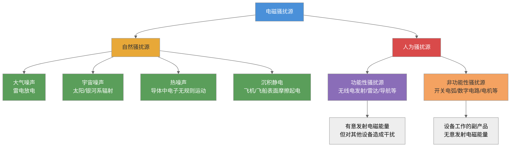
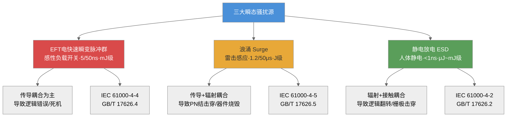
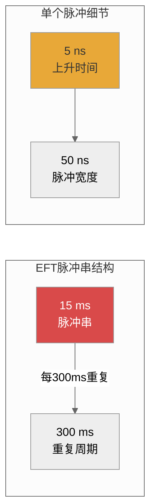
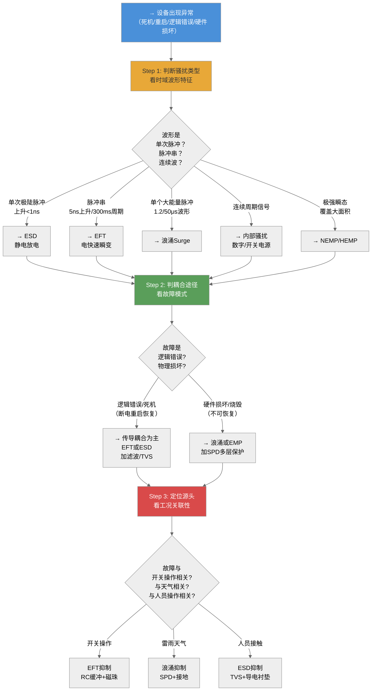
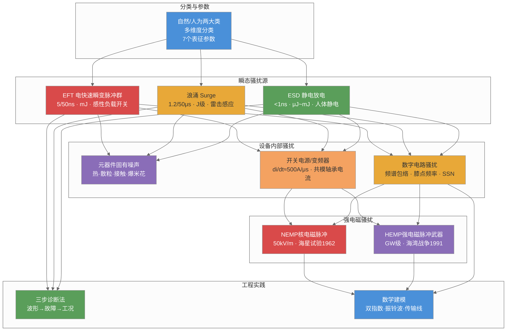

# 第三章 电磁骚扰源

## 内容提要

本章是"电磁兼容基础"部分的第一章。在前两章建立了EMC的基本概念和工程方法论之后，本章将重点讨论电磁干扰现象的源头——电磁骚扰源。内容覆盖四个方面：电磁骚扰源的分类体系及表征参数（3.1节）、三类最重要的瞬态骚扰源（3.2节）、电子电气设备内部的主要电磁骚扰（3.3节）、以及极端条件下的强电磁骚扰源（3.4节）。通过本章学习，读者将对电磁干扰的"源头"有一个系统的认识——知道干扰从哪里来、有什么特性、如何描述和分类。

通过本章学习，读者应达成以下学习目标：

1. 理解电磁骚扰源的**两大分类体系**（自然/人为 + 多维度分类），掌握7个**表征参数**及其工程含义
2. 掌握**三种瞬态骚扰源**（电快速瞬变脉冲群/雷击浪涌/静电放电）的波形特征、耦合方式和抑制手段
3. 了解**元器件固有噪声**（热噪声/散粒噪声/接触噪声/爆米花噪声）的物理机理和定量公式
4. 理解**数字电路时钟信号频谱**的定量关系（上升时间与频谱宽度的关系），能计算给定上升时间的频谱包络
5. 了解**强电磁骚扰源**（核电磁脉冲/强电磁脉冲）的基本参数和历史重要事件
6. 能根据骚扰源的类型和特性，初步判断其可能的耦合途径和危害方式
7. 掌握**频谱宽度**（宽带/窄带）的判定标准及其在EMC测量中的意义

---

## 3.1 电磁骚扰源分类及表征

你是否遇到过这样的场景：雷雨天里收音机一片嘈杂声，工厂里电焊机旁边的电子设备频频死机，医院里手机靠近监护仪时屏幕上出现干扰条纹——这些现象的"罪魁祸首"就是电磁骚扰源。准确识别和分类骚扰源，是解决EMC问题的第一步——因为只有在知道干扰从何而来的情况下，才能有针对性地选择抑制措施。

### 3.1.1 电磁骚扰源分类

电磁骚扰源的分类方法很多，不同的分类维度服务于不同的工程目的。以下从最常用的两个维度出发进行系统分类。

**（一）按来源属性分类：自然骚扰源与人为骚扰源**

这是最基础的分类方式。自然骚扰源来源于自然界中的电磁现象，人为骚扰源来源于人工装置的电磁发射。两类源的对比如图3-1所示。



*图3-1：电磁骚扰源按来源属性分类*

自然骚扰源主要来源于四个方面。

**大气层天电噪声**——主要是雷电放电。地球上平均每秒钟发生约100次雷击放电，每次雷击产生的电磁辐射可传播数千公里。一次典型的雷击放电过程包含多个回击（return stroke）——首次回击的峰值电流可达30~200 kA（平均约30 kA），上升时间约1~10 μs，每次回击持续约几十到几百μs，一次完整的雷击放电包含3~5次回击，总持续时间可达数百ms。雷击放电产生的电磁辐射频谱从极低频（ELF，几十Hz）一直延伸到甚高频（VHF，几十MHz），峰值频谱能量集中在几千Hz到几百kHz。雷电对无线电通信的影响在30 MHz以下最为严重——这就是为什么在雷雨天气时，中短波广播（530 kHz~30 MHz）受到的干扰最为明显。在EMC工程中，雷电既是一个骚扰源（直接辐射和传导），也是一个破坏源（热效应和机械效应），其防护涉及接闪、引下、等电位连接、SPD和屏蔽等多个层面的系统设计。

**宇宙噪声**——来自太阳系和银河系的天体电磁辐射。太阳无线电噪声在太阳黑子活动期间（太阳活动周期约11年）显著增强——太阳活动高峰期，太阳在10 MHz~几十GHz的频率范围内发射的射电噪声强度可比宁静期高出10~20 dB。强太阳射电爆发（Solar Radio Burst）可以干扰地基GPS接收机、卫星通信和航天器的遥测遥控信号——2003年万圣节期间的太阳风暴导致多颗卫星出现通信中断和位错。太空背景噪声是由电离层和各种宇宙射线组成的，频率主要在20~500 MHz范围内。宇宙噪声在20~500 MHz范围内的干扰强度相当可观——例如，在100 MHz附近，宇宙背景噪声的等效天线温度可达数千K（作为对比，自由空间中30 MHz以下的银河背景噪声等效温度可达10^4~10^6 K）。这意味着在HF和VHF频段以下设计通信或雷达系统时，宇宙噪声本身就是系统灵敏度的理论极限——即使接收机自身没有任何内部噪声，宇宙背景噪声仍然限制了最低可检测信号电平。

**热噪声**——导体中自由电子的无规则热运动产生的电起伏。热噪声存在于一切温度高于绝对零度的电阻性元件中，在EMC工程中，热噪声决定了接收机灵敏度和EMI测量系统的本底噪声。在室温（T=300K）下，50 Ω阻抗的噪声功率谱密度为 $kTB \approx -174$ dBm/Hz——这意味着一个带宽为1 MHz的EMI接收机的理论本底噪声约为-114 dBm，而实际的EMI接收机的噪声系数通常在10~30 dB之间，因此其显示的本底噪声约为-104~-84 dBm。这一数值决定了EMC辐射发射测量的最低可测电平——在30~230 MHz频段，CISPR 32的B级辐射发射限值为40 dBμV/m（约对应接收机输入端-67 dBm的功率电平），远高于接收机的本底噪声，因此测量是可行的。

**沉积静电干扰**——飞机、飞船等飞行器在高速飞行时，大气中的尘埃、雨点、雪花、冰雹等微粒与飞行器表面发生高速摩擦，产生电荷迁移并在飞行器表面积累静电电荷。当飞行器表面的静电电位升高到1000 kV（1 MV）时，发生火花放电或电晕放电——这种放电产生宽带射频噪声，频谱分布在几Hz到几千MHz的范围内，严重影响HF、VHF和UHF频段的无线电通信和导航。在航空领域，沉积静电干扰是飞机在云中飞行时最常见的EMC问题之一——飞行员在雷雨云附近飞行时听到的无线电"噼啪"声就是沉积静电放电产生的。

**表 3-1：四种自然骚扰源的特征对比**

| 类型 | 产生机理 | 频率范围 | 峰值能量频段 | 对EMC工程的影响 |
|:-----|:--------|:--------|:----------|:--------------|
| 大气噪声（雷电） | 雷电流瞬态放电 | 10 Hz~300 MHz | 几千Hz~几百kHz | 无线电通信干扰（<30MHz），电力线浪涌，建筑物雷击防护 |
| 宇宙噪声 | 太阳/银河系射电辐射 | 20~500 MHz | 100~200 MHz | 通信灵敏度极限，卫星链路干扰 |
| 热噪声 | 导体中电子热运动 | DC~THz（全频段白噪声） | 全频段平坦 | 决定接收机灵敏度极限和EMI测量本底 |
| 沉积静电 | 飞行器表面摩擦起电放电 | 几Hz~几千MHz | 10 MHz~1 GHz | 航空通信/导航干扰（HF/VHF/UHF） |

人为骚扰源分为功能性骚扰源和非功能性骚扰源。功能性骚扰源是指设备在实现自身功能过程中产生的有用电磁能量对其他设备造成干扰——如广播电台、电视台、雷达和通信基站的发射信号，对自身系统而言是有用信号，但对其他设备则成为骚扰。非功能性骚扰源是指设备工作时产生的无用电磁能量——如开关电源的高频开关噪声、数字电路的时钟谐波、电机换向火花的射频辐射等。

**（二）按工程维度分类**

除了上述二分法之外，EMC工程中还根据多种工程维度对骚扰源进行分类，每个维度服务于不同的分析和设计目的。

**按耦合途径分类**——传导骚扰源和辐射骚扰源。传导骚扰源通过电源线、信号线和接地线等导体传输骚扰能量——典型的传导骚扰源包括开关电源（通过电源线向电网注入共模和差模噪声）、变频驱动系统（通过电机电缆传导高频开关谐波）、大功率整流装置（产生谐波电流注入电网）。辐射骚扰源通过空间以电磁波形式传播骚扰能量——典型的辐射骚扰源包括数字设备的时钟走线和数据总线（作为无意天线向空间辐射电磁波）、无线通信设备的天线辐射（发射信号对其他设备构成骚扰）、电焊机的电弧放电（产生宽频带的射频辐射）。许多骚扰源同时具备两种耦合方式——例如，开关电源既通过电源线传导发射骚扰，也通过机箱和线缆向空间辐射骚扰。

**按波形特征分类**——连续波骚扰源（如正弦振荡器泄漏、电力系统工频磁场）、周期脉冲波骚扰源（如数字时钟信号、开关电源的开关频率基波及其谐波）、非周期脉冲波骚扰源（如静电放电脉冲、雷击浪涌、继电器开关瞬态）。

**按频谱宽度分类**——窄带骚扰源（频谱能量集中在测量接收机通带以内）和宽带骚扰源（频谱能量分布足够宽，当测量接收机在±2倍脉冲带宽内调谐时，输出响应变化不大于3 dB）。宽带骚扰一般由上升、下降时间都很短的窄脉冲形成——脉冲周期越短、上升时间越快，脉冲频谱越宽。

**柯金良六类频谱分类法**：何金良（柯金良）在《电磁兼容概论》中提出了更精细的频谱分类体系，基于百分比带宽 $B_{\text{wp}}$ 和波段比值 $B_{\text{r}}$ 进行划分。百分比带宽定义为带宽（信号高频与低频之差，取-3dB点）与中心频率之比：


$$
B_{\text{wp}} = 200 \times \frac{f_{\text{h}} - f_{\text{l}}}{f_{\text{h}} + f_{\text{l}}} (\%)
\tag{3-1}
$$

波段比值定义为 $B_{\text{r}} = f_{\text{h}} / f_{\text{l}}$。根据这两个参数，电磁骚扰源可分为以下六类：

| 带宽分类 | 百分比带宽 $B_{\text{wp}}$ | 波段比值 $B_{\text{r}}$ | 典型源例 |
|:---------|:------------------------:|:----------------------:|:--------|
| **窄带** | $B_{\text{wp}} \leqslant 1\%$ | $B_{\text{r}} \leqslant 1.01$ | 正弦振荡器泄漏、广播电台基频 |
| **中频带** | $1\% < B_{\text{wp}} \leqslant 100\%$ | $1.01 < B_{\text{r}} \leqslant 3$ | 调幅广播信号、部分雷达脉冲 |
| **宽带** | $100\% < B_{\text{wp}} \leqslant 163.4\%$ | $3 < B_{\text{r}} \leqslant 10$ | 开关电源谐波群、电机换向火花 |
| **超宽带** | $163.4\% < B_{\text{wp}} \leqslant 200\%$ | $10 < B_{\text{r}}$ | 静电放电脉冲、UWB通信信号（占比>25%） |

该分类比传统的"窄带/宽带"二分法更精细，尤其在中频带和超宽带两类中给出了明确的量化边界，对EMC测量中的带宽选择和限值换算具有重要指导意义。例如，超宽带（UWB）信号的百分比带宽可大于190%，意味着其能量覆盖从数十MHz到数GHz的极端宽频范围。

**按频率范围分类**——工频及音频干扰源（50 Hz及其谐波）、甚低频干扰源（30 kHz以下）、载频干扰源（10~300 kHz）、射频及视频干扰源（300 kHz~300 MHz）、微波干扰源（300 MHz~100 GHz）。各频段的典型骚扰源和工程意义已在第2章的电磁波频谱部分（§2.5.3）中详细讨论。

### 3.1.2 电磁骚扰源表征参数

为了定量描述电磁骚扰源的特征，EMC工程中定义了七个核心表征参数。这些参数从不同的侧面刻画了骚扰源的"全貌"。

**（1）频谱宽度**

频谱宽度（带宽）决定了骚扰能量在频率轴上的分布范围。窄带骚扰的频谱能量主要集中在几个离散的频率点上——如正弦振荡器产生的单一频率骚扰、数字时钟的基波和各次谐波（虽然谐波在频率上是离散的，但现代EMC测量中将时钟信号的谐波归属为窄带骚扰，因为其能量集中在测量接收机的通带以内）。宽带骚扰的频谱能量连续地分布在一个很宽的频率范围内——如静电放电脉冲、电快速瞬变脉冲群、电机换向火花等。

宽带骚扰与窄带骚扰的判定与测量接收机的带宽有关。工程判据：当骚扰信号的频谱宽度明显大于测量接收机的带宽时，该骚扰被判定为宽带骚扰——此时测量接收机的读数随带宽的变化而变化，测量结果需要归一化到单位带宽（如dBμV/MHz）。反之，当骚扰信号的频谱宽度小于测量接收机的带宽时，所有能量都落在通带内，测量结果与接收机带宽无关——此时为窄带骚扰。

**数字信号的频谱宽度估算**：一个上升时间为$t_r$的脉冲信号，其频谱能量在频率$f > 1/(\pi t_r)$时开始显著下降。例如，一个上升时间为1 ns的数字信号，其频谱能量覆盖到约318 MHz（$1/(\pi \times 1\text{ns}) \approx 318$ MHz）。不同标准对测量带宽的规定不同：CISPR 16规定在150 kHz~30 MHz的传导发射测量中使用9 kHz带宽，在30~1000 MHz的辐射发射测量中使用120 kHz带宽（准峰值检波），在1 GHz以上使用1 MHz带宽——这些带宽的选择与典型骚扰源的频谱宽度有关。静电放电脉冲的频谱可达数GHz（上升时间<1 ns），采用1 MHz带宽测量时可以捕获大部分能量；而工频磁场骚扰（50/60 Hz）用9 kHz带宽测量实际上远大于信号的频谱宽度，测量结果与带宽无关。

**（2）幅度或电平**

骚扰源的幅度通常用各频段内的骚扰功率或场强来表示。幅度随时间的分布可以用幅度概率分布（APD）来描述。对于随机骚扰（如热噪声），幅度服从高斯分布；对于周期骚扰（如时钟谐波），幅度是确定的峰值或RMS值。在EMC标准中，骚扰源的发射电平通常以准峰值（QP）、平均值（AV）或峰值（PK）的方式规定——CISPR 16各检波器的响应时间和带宽不同，对同一骚扰信号的读数可能相差数dB到10 dB以上。

**（3）波形**

波形是决定电磁骚扰频谱宽度的关键因素——脉冲的上升/下降时间越短，频谱宽度越宽。对于脉冲波形，其频谱中的低频分量取决于脉冲波形下的面积（直流和低频分量），而高频分量取决于脉冲前后沿的陡度。脉冲波形的前后沿越陡，频谱宽度越宽。

**波形与频谱的工程关系**：考虑一个周期性梯形脉冲，其周期为$T$、幅值为$A$、脉冲宽度为$\tau$、上升时间和下降时间均为$t_r$。该脉冲的频谱包络由两个转折点决定：
- 第一转折频率 $f_1 = 1/(\pi\tau)$——低于此频率时，频谱近似平坦（幅值$\approx 2A\tau/T$）
- 第二转折频率 $f_2 = 1/(\pi t_r)$——在此频率处，频谱以-20 dB/十倍频程下降；超过此频率时以-40 dB/十倍频程下降

这意味着**脉冲的上升时间决定了高频段频谱的衰减速率**——上升时间越短，$f_2$越高，高频谐波越丰富。这一关系在EMC设计中具有重要的实际指导意义（将在§3.3.3中进一步展开）。

工程中常见波形与其频谱特征：
- **方波**（数字时钟）：频谱由基波+奇次谐波组成，幅值按$1/n$衰减（理想方波），实际方波受上升时间限制，高频衰减更快
- **三角波**（开关电源的电流纹波）：频谱按$1/n^2$衰减，比方波更"干净"——这就是为什么某些DC/DC变换器采用三角波调制（如迟滞控制模式）比方波调制（PWM模式）有更好的EMC性能
- **高斯脉冲**（ESD、雷电）：时域上单次尖峰，频谱极宽且连续

**（4）出现率**

电磁骚扰的出现率分为三种类型。**周期性骚扰**以固定时间间隔重复出现——如数字时钟信号、开关电源的周期性开关噪声。**非周期性骚扰**的出现时间可以预测但不具有严格的周期性——如设备的开机/关机瞬态、继电器的动作噪声。**随机骚扰**的出现时间和幅度都不具有可预测性——如热噪声（始终存在但随机起伏）、接触噪声（随机的幅度更大的低频起伏）。

出现率在EMC测量中的意义：低频出现的骚扰（如偶尔操作的继电器）在常规EMC测试中可能被漏检，但在现场使用中可能造成间歇性故障——这正是EMC测试"通过实验室测试但在现场失败"的常见原因之一。

**（5）辐射极化特性**

对于辐射型骚扰源，骚扰源天线（或起天线作用的导体）的极化方式决定了骚扰场的空间取向。当骚扰源的极化方式与敏感设备天线的极化方式一致时，耦合效率最高——最大可相差20 dB以上（交叉极化隔离度）。在工程测量中，EMC辐射发射测量需要在水平和垂直两种极化方向上进行——CISPR 16-2要求测试天线在1~4 m高度范围内升降扫描，以捕捉最大场强值。

**（6）辐射方向特性**

辐射骚扰源向空间各方向辐射的场强不同，这种方向选择性用方向图来描述。方向图的主要量化参数包括：主瓣宽度（半功率波束宽度）、副瓣电平（相对于主瓣的衰减，通常用dB表示）、前后比（主瓣方向与正后方方向的增益比）。在EMC工程中，利用方向特性进行空间分离是一种有效的骚扰抑制手段——将敏感设备放置在骚扰源方向图的零点或副瓣方向上。

**（7）天线有效面积**

天线有效面积是表征敏感设备接收空间电磁波能力的参数。它等于传送到匹配负载的平均功率与入射电磁波的平均功率密度之比。天线的有效面积越大，接收电磁骚扰的能力越强。对于接收天线，有效面积 $A_e$ 与天线增益 $G$ 之间的关系为 $A_e = G\lambda^2/(4\pi)$——波长越长（频率越低）时，同等增益下需要的物理孔径越大。

**表 3-1：电磁骚扰源表征参数总览**

| 参数 | 含义 | 工程应用 | 典型数据 |
|:-----|:-----|:--------|:--------|
| 频谱宽度 | 骚扰能量在频率轴上的分布范围 | 选择测量带宽、判断是否需要扫频 | 宽带→数MHz~数GHz；窄带→数十Hz~数百kHz |
| 幅度或电平 | 骚扰功率或场强的大小 | 判断是否超过标准限值 | 传导发射：~100 dBμV；辐射发射：~40~50 dBμV/m |
| 波形 | 骚扰的时域形状 | 决定频谱宽度、影响抑制手段选择 | 梯形波/尖脉冲/振荡波 |
| 出现率 | 电磁能量随时间分布特性 | 影响测量方法选择（峰值/准峰值/平均值） | 周期/非周期/随机 |
| 极化特性 | 电场矢量空间取向 | 决定测量天线极化选择 | 水平/垂直/圆极化 |
| 方向特性 | 辐射强度的空间分布 | 系统布局中的空间分离设计 | 主瓣/副瓣/零点 |
| 天线有效面积 | 接收电磁波的能力 | 判断敏感设备的耦合效率 | 与增益和波长有关 |

*设问过渡：掌握了骚扰源的分类体系和表征参数之后，我们在EMC工程中最常遇到的是一类具有特殊危险性的骚扰源——瞬态骚扰源。它们以突发脉冲的形式出现、能量集中、持续时间极短、但对电子设备的危害极大。这就是下一节要讨论的内容。*

---

## 3.2 瞬态骚扰源

早上走进办公室，伸手触摸金属门把手——啪！指尖传来一阵刺痛，这是静电放电。正在调试的设备突然重启——原来是车间里电焊机操作引起的电快速瞬变脉冲群。一场雷雨过后，通信基站的电源模块损坏——雷击浪涌是元凶。这三种现象——电快速瞬变脉冲群、雷击浪涌、静电放电——是EMC工程中最常见、危害最广的瞬态骚扰源。它们虽然波形不同、能量量级不同、产生机理不同，但有着共同的特征：突发性强、持续时间短（纳秒到微秒级）、上升沿极陡（纳秒到亚纳秒级）、频谱覆盖范围极宽（从几十kHz到数GHz）。



*图3-3：三种主要瞬态骚扰源的波形特征与危害对比*

表3-2给出了这三种瞬态骚扰源的综合对比数据。

**表 3-2：三种主要瞬态骚扰源的对比**

| 对比维度 | 电快速瞬变脉冲群（EFT） | 雷击浪涌（Surge） | 静电放电（ESD） |
|:---------|:---------------------|:----------------|:--------------|
| **根源机理** | 感性负载开关断开时电感储能快速释放 | 雷电流感应或直接击中电力线路 | 人体或物体积累的静电荷瞬间释放 |
| **典型波形** | 脉冲串（5/50 ns单脉冲） | 1.2/50 μs开路电压 / 8/20 μs短路电流 | 上升<1 ns的极陡脉冲 |
| **峰值电压/电流** | 0.5~4 kV / 几十A | 0.5~6 kV / 几百A~3 kA | 2~15 kV / 几十A |
| **单脉冲能量** | 低（mJ级） | 高（J级——可达数十J） | 极低（μJ~mJ级） |
| **重复频率** | 5 kHz或100 kHz脉冲串 | 单次或低频重复 | 单次或偶发 |
| **耦合方式** | 以传导为主（电源线/信号线电容耦合） | 传导+辐射 | 辐射为主+接触传导 |
| **主要危害** | 逻辑错误、程序跑飞、死机 | PN结击穿、器件烧毁、电源损坏 | 逻辑翻转、死机、CMOS栅极击穿 |
| **抑制手段** | X/Y电容、铁氧体磁珠、共模扼流圈 | 压敏电阻、TVS管、气体放电管 | TVS管、导电衬垫、ESD抑制器件 |
| **标准编号** | IEC 61000-4-4 / GB/T 17626.4 | IEC 61000-4-5 / GB/T 17626.5 | IEC 61000-4-2 / GB/T 17626.2 |

### 3.2.1 电快速瞬变脉冲群

**产生机理**

电快速瞬变脉冲群（Electrical Fast Transient, EFT）——也被称为脉冲群（Burst）——是由感性负载的开关操作产生的。当继电器线圈、接触器、电机绕组等感性负载的电流被切断时，电感中储存的能量（$W = \frac{1}{2}LI^2$）在极短的时间内释放，在触点两端产生高压电弧。由于感性负载中的电流在断开前达到稳态值，断开时的电流变化率 $di/dt$ 极大，产生的瞬态电压可达数千伏。

典型的EFT产生场景：在一台工业控制柜中，PLC控制一台接触器接通/断开电机。当接触器断开时，其线圈的电感储能通过触点间的电弧释放，在电网中注入一串快速衰减的脉冲。这些脉冲通过电源线以传导方式传播到同一电网中的其他设备——如传感器、仪表、计算机——导致逻辑信号误触发、程序跑飞甚至设备死机。在实际工控现场，EFT是导致PLC系统误动作的最常见原因之一。

**波形特征**

IEC 61000-4-4标准规定了EFT试验的标准化波形参数：
- **单个脉冲的波形**：上升时间 $t_r = 5$ ns（±30%），脉冲宽度（半峰值时间）$t_d = 50$ ns（±30%）
- **脉冲串结构**：每个脉冲串（burst）持续15 ms，其中包含的脉冲数量取决于脉冲重复频率
- **重复频率**：在试验等级≤2 kV时，重复频率为5 kHz（15 ms内约75个脉冲）；试验等级≥3 kV时，重复频率为100 kHz（15 ms内约1500个脉冲）
- **脉冲串周期**：300 ms（即每300 ms出现一个15 ms的脉冲串）



*图3-2：电快速瞬变脉冲群的波形结构*

**耦合机理**

EFT脉冲主要通过以下方式耦合到设备：
- **电源线耦合**：EFT脉冲沿供电线路传导，通过LISN（线路阻抗稳定网络）进入设备的电源输入端。这是最主要的耦合途径——在工控现场，大功率接触器的操作可以在同一电网的末端测得数百伏的EFT脉冲。
- **信号线/控制线耦合**：EFT脉冲通过线间电容和互感从电源线耦合到信号线，进入I/O接口电路。在PLC系统中，传感器信号线是EFT进入控制系统的次要路径。
- **空间辐射耦合**：EFT脉冲不仅是传导骚扰，其陡峭的上升沿（5 ns）对应的频谱延伸到约70 MHz（$f_{\max} \approx 0.35/t_r$），在此频段，连接EFT源的线缆会作为无意天线辐射电磁波，干扰附近的敏感设备。

**工程案例**

**案例3-1：工业PLC柜的EFT干扰事件**

某汽车制造厂涂装车间的PLC控制柜频繁出现"程序跑飞"故障：在喷涂机器人启动和停止时（每次喷涂循环约45秒），相邻的控制柜中的PLC程序随机进入"看门狗复位"或跳转到未定义的地址。现场工程师花费了3周时间排查——检查了电源电压、接地系统、通信线路，始终没有找到根本原因。

事后分析发现，喷涂机器人的伺服电机驱动器在启停瞬间产生强烈的EFT脉冲。驱动器的制动电阻在电机停止时吸收回馈能量，其开关管在关断瞬间产生的瞬态通过电源线传导至同一配电柜的PLC电源模块。PLC电源模块虽然内置了EMI滤波器，但对频率极高（5 ns上升沿对应~70 MHz频谱成分）的EFT脉冲滤波效果有限，EFT能量穿透了电源模块进入PLC的内部直流总线，导致CPU的复位电路误触发。

整改措施：在PLC电源模块的输入端加装专用的EFT抑制模块（包含共模扼流圈 + X电容 + Y电容），同时在PLC的I/O模块的信号线上加装铁氧体磁珠。整改后，同一工况下连续运行72小时未出现程序跑飞故障。

**启示**：EFT问题往往表现为间歇性故障——在实验室条件下不一定能复现（因为实验室的电源和现场不同），但在现场特定工况下频繁发生。解决此类问题的关键是：在现场条件下确认EFT是根源，并在设备电源输入端和信号接口处加装针对高频（数MHz到数十MHz）的滤波措施。

**标准引用与试验等级**

IEC 61000-4-4规定的EFT试验等级：
- 等级1：电源线0.5 kV / I/O线0.25 kV（保护良好的环境，如计算机房）
- 等级2：电源线1 kV / I/O线0.5 kV（办公环境）
- 等级3：电源线2 kV / I/O线1 kV（工业环境）
- 等级4：电源线4 kV / I/O线2 kV（恶劣工业环境）

EFT试验的目的就是模拟感性负载开关操作产生的瞬态脉冲对设备的影响，确保设备在上述等级下不出现性能降级——通常要求A级性能（试验期间和之后功能完全正常）。

**EFT抑制的工程实践**

EFT脉冲的能量较小（mJ级），因此其抑制措施与浪涌有本质区别。EFT抑制主要依靠以下措施：

**（1）铁氧体磁珠与共模扼流圈** — 铁氧体磁珠（Ferrite Bead）在100 MHz左右的频率下呈现高阻抗（数百Ω），将EFT脉冲的高频成分转化为热能消耗掉。在PLC的I/O线、通信接口（RS-485、CAN、以太网）的信号线上串联铁氧体磁珠（如TDK ZCAT系列，在100 MHz时阻抗约100~600Ω），是成本最低（约0.5~3元/只）的EFT抑制措施。共模扼流圈对共模EFT脉冲（最常见的情况）有很好的抑制效果——在电源输入端使用共模扼流圈（如B82793系列，共模电感量约0.5~10 mH），可在150 kHz~30 MHz的传导发射频段内提供30~60 dB的共模插入损耗。

**（2）X电容与Y电容** — X电容（接于相线和中线之间，推荐容量0.1~1 μF，薄膜电容）用于抑制差模EFT脉冲；Y电容（接于相线/中线和地之间，推荐容量1~4.7 nF，Class Y1或Y2安全电容）用于抑制共模EFT脉冲。两类电容的组合使用覆盖了差模和共模两种耦合方式。在EMI滤波器中，X电容和Y电容通常与共模扼流圈配合使用，构成标准的EMC滤波器拓扑（CLC π型滤波器）。

**（3）RC缓冲电路** — 在感性负载（继电器线圈、接触器线圈、电磁阀）两端并联RC缓冲电路（Snubber）。RC缓冲电路的典型参数为：电阻R=47~220 Ω（1/2W以上），电容C=0.01~0.47 μF（1 kV耐压以上）。RC缓冲电路通过电容吸收电感储能、电阻消耗能量来抑制电弧放电——将EFT脉冲的幅度降低到原来的1/5~1/10。这是从源头上抑制EFT的最有效措施。

**（4）TVS管** — 瞬态电压抑制二极管（TVS）用于在信号线和电源线上钳位EFT脉冲的电压。TVS管的响应时间在皮秒级——远比EFT的5 ns上升时间快，可以在EFT脉冲上升到峰值之前将电压钳位在安全水平。常用的TVS器件如SMBJ5.0A（5 V工作电压，钳位电压9.2 V，峰值脉冲功率600 W），适用于低压信号线（RS-485、CAN总线等）的EFT保护。

**表 3-5：EFT抑制器件对比**

| 器件类型 | 频率范围 | 适用位置 | 成本 | 设计要点 |
|:---------|:--------|:--------|:---:|:--------|
| 铁氧体磁珠 | 10 MHz~1 GHz | I/O线、信号线串接 | 低 | 低频段阻抗小，仅对高频EFT有效 |
| 共模扼流圈 | 150 kHz~100 MHz | 电源输入端 | 中 | 差模EFT无效（需配合X电容） |
| X/Y电容 | DC~100 MHz | 电源线之间/对地 | 低 | Y电容容量受安全标准限制（<4.7 nF） |
| RC缓冲 | DC~10 MHz | 感性负载两端并联 | 低 | 从源头抑制最有效 |
| TVS管 | DC~1 GHz | 信号线/电源线对地 | 低 | 注意钳位电压和峰值功率选择 |

**EFT试验的耦合/去耦网络（CDN）**

在IEC 61000-4-4标准中，EFT脉冲通过耦合/去耦网络（CDN, Coupling/Decoupling Network）注入到EUT的电源端口和I/O端口。CDN的工作原理是：EFT发生器的输出通过33 nF的耦合电容分别耦合到三相电源的每一相（L1、L2、L3）和中线（N），同时通过去耦电感（1 mH）防止EFT脉冲回串到供电网络。对于I/O端口的EFT试验，使用容性耦合夹（Capacitive Clamp）代替CDN，通过线缆与EUT之间的分布电容（约100~1000 pF）将EFT脉冲注入到信号线中。

### 3.2.2 雷击浪涌

**产生机理**

雷击浪涌是一种能量远大于EFT的瞬态过电压现象。雷击浪涌的产生机理包括：
- **直接雷击**：雷电流直接击中户外供电线路或通信线路。雷电流的峰值可达200 kA（最严重的直接雷击），产生的过电压可达数百万伏——但进入建筑物内部设备时，经过避雷器、SPD（浪涌保护器）的逐级限幅后，设备端的浪涌电压被限制在标准规定的试验等级范围内。
- **间接感应**：雷电流在附近线路中通过电磁感应产生浪涌电压。当雷电流流经建筑物的防雷引下线时，在引下线周围产生强大的瞬态磁场，附近的电源线和信号线中感应出浪涌电压——感应浪涌是建筑物内部设备遭受雷击损坏的最主要机制（远多于直接雷击）。
- **电网开关操作**：电力系统中的电容器投切、大负载的投入或切除、熔断器的熔断等操作也会产生浪涌——虽然能量小于雷击浪涌，但发生频率要高得多。

**雷电的二次效应**：何金良在《电磁兼容概论》中系统论述了雷电的二次效应问题。雷电效应分为一次效应和二次效应两个方面。一次效应是雷电直接击在建筑物、线路或其他物体上产生的直接破坏力。二次效应是指先导发展过程和雷击过程中对空间的辐射作用——可以通过电磁耦合在金属物体上产生感应电压，在回路上产生感应电流。以电力系统发变电所为例，雷电直击设备的情况极少，一般是雷击避雷针或靠近变电所的输电线路。雷电流对弱电系统电缆的干扰作用表现在两方面：①雷电流经避雷器入地，使地网上的电位分布极不均匀并引起地电位升高，对屏蔽层接在地网上的弱电系统电缆产生干扰；②一部分幅值较低的雷电流通过互感器（CT、PT、CVT）传递到二次回路。

雷击建筑物时，雷电流通过建筑物钢筋经接地装置流散到土壤中，产生空间电磁场作用在室内电子设备上。当雷直击建筑物的总电流幅值为200 kA时（按GB 50057—94第一类建筑物首次雷击参数），室内磁感应强度最大值可达10 mT。而美国1971年的研究报告指出：磁感应强度达到0.007 mT时无屏蔽的计算机会误动，超过0.24 mT时将发生永久性损坏。由此可见，雷击建筑物产生的二次效应磁场强度远超电子系统的耐受水平。

针对雷电二次效应，应将保护空间划分为不同防雷区（LPZ）：$LPZ_{0A}$（易遭直接雷击，电磁场未衰减）、$LPZ_{0B}$（不易遭直接雷击但电磁场未衰减）、$LPZ_{1}$（雷电流进一步减小，电磁场可被衰减）以及后续防雷区（$LPZ_{2}$等）。防雷区序号越高，电磁环境参数越低。在各防雷区界面处，所有穿越的金属物应作等电位连接，并安装SPD限制传导电磁骚扰。

**波形特征**

IEC 61000-4-5标准规定了浪涌试验的标准化波形：
- **开路电压波形**：1.2/50 μs——波前时间1.2 μs（从峰值的10%上升到90%），半峰值时间50 μs（从上升到峰值再到下降为峰值50%的时间）
- **短路电流波形**：8/20 μs——波前时间8 μs，半峰值时间20 μs
- **综合波发生器**：同时产生1.2/50 μs的开路电压和8/20 μs的短路电流波形，两者之间的比例关系由发生器的等效内阻决定——标准要求等效内阻为2 Ω（线-地耦合）或12 Ω（线-线耦合）

浪涌与EFT的本质区别：**浪涌的能量比EFT高出3~5个数量级**。一个EFT脉冲的能量约为1~10 mJ，而一个4 kV/2 kA的浪涌脉冲的能量可达20~40 J（能量 $E \approx \frac{1}{2} \times U_{\text{peak}} \times I_{\text{peak}} \times t_d$）——相差数千倍。因此，EFT主要影响逻辑电路的工作状态（逻辑翻转、死机），而浪涌可以直接造成半导体器件的物理损坏（PN结烧毁、金属化层熔断）。

**耦合机理**

浪涌主要通过以下途径进入设备：
- **线-线耦合（差模）**：浪涌电压叠加在电源相线与中线之间，对开关电源的整流桥和滤波电容造成威胁
- **线-地耦合（共模）**：浪涌电压叠加在电源线/信号线与设备地之间，对设备内部的绝缘和隔离器件造成威胁——这是最常见的雷击损坏机制
- **信号线耦合**：浪涌通过户外信号线（如电信线、以太网线、传感器电缆）直接进入设备的I/O接口

**工程案例**

**案例3-2：通信基站的雷击浪涌损坏事件**

2009年夏季，我国南方某电信运营商的约30个基站集中出现电源模块损坏故障。故障表现为：基站设备的开关电源模块输入端整流桥短路、PFC功率管和主开关管炸裂、控制IC损坏。平均每次故障导致直接维修成本约2000元/站点，间接损失（基站停机导致的通信中断）更大。气象记录显示，事发时间段当地有强雷暴活动。

事后分析：基站的交流供电电源由市电经架空线路引入。雷击产生的浪涌沿架空线路进入基站的交流配电箱，虽然基站交流配电箱入口处安装有第一级SPD（标称放电电流Imax=40 kA的压敏电阻型浪涌保护器），但SPD与基站开关电源之间的电缆长度约15 m。在浪涌波前时间1.2 μs的条件下，15 m长电缆的分布参数导致SPD与开关电源输入端之间产生波反射和行波效应——开关电源输入端实际承受的浪涌电压峰值可能比SPD的残压高出50%~100%（开路反射电压加倍）。

整改措施：在开关电源输入端增加第二级SPD（Imax=20 kA，响应时间<25 ns），并将两级SPD之间的电缆长度缩短至5 m以内。同时，在开关电源的PFC输入端增加差模保护压敏电阻（MOV 14D471——14 mm直径、470 V压敏电压）。整改后，同一地区的基站在后续雷雨季节中，电源模块的雷击损坏率降低了约90%。

**启示**：雷击浪涌的抑制不是单级SPD就能解决的问题。多级SPD需要合理的级间配合——级间距离不能太短（否则两级SPD同时动作无法发挥分级限幅作用），也不能太长（否则波反射效应放大浪涌）。工程中推荐的SPD级间距离为5~10 m，或使用与电缆特性阻抗匹配的去耦电感。

**标准引用与试验等级**

IEC 61000-4-5规定的浪涌试验等级（线-地耦合）：
- 等级1：0.5 kV
- 等级2：1 kV
- 等级3：2 kV
- 等级4：4 kV

对于安装在特殊位置（如电信局站、户外基站入口等）的设备，试验等级可扩展到6 kV甚至更高。

**浪涌抑制的工程实践：SPD选型与级联配合**

浪涌保护器件（SPD, Surge Protective Device）是实现浪涌抑制的核心器件。常见的SPD元件包括以下几种：

**压敏电阻（MOV, Metal Oxide Varistor）**——以ZnO陶瓷为基体，具有非线性伏安特性。在正常工作电压下，MOV呈现高阻态（泄漏电流μA级）；当浪涌电压超过其压敏电压时，MOV迅速转入低阻态（导通时间<25 ns），将浪涌电流旁路到地或中性线。MOV的压敏电压选择原则为：压敏电压 ≥ (1.2~1.4) × 系统额定电压 × 1.414（考虑到电压波动和MOV老化）。对于220V AC系统，推荐的压敏电压为470 V（型号14D471——14 mm直径，470 V压敏电压，峰值电流4.5 kA）。MOV的缺点是：每次导通后性能退化（压敏电压下降，泄漏电流增大），经多次浪涌冲击后失效（失效模式为短路——需要外配热熔断器或断路器防止短路故障）。

**气体放电管（GDT, Gas Discharge Tube）**——利用惰性气体（氩、氖等）在高压下的击穿放电来实现浪涌保护。GDT的响应时间比MOV慢（约0.5~1 μs），但其通流能力远大于MOV（10~40 kA），且极间电容极小（<2 pF），非常适合信号线的浪涌保护。GDT的击穿电压选择：GDT的DC击穿电压（如90 V、230 V、600 V等规格）应高于被保护线路的最大工作电压，低于被保护设备的绝缘耐压。GDT的缺点是：击穿后存在"续流"（follow current）问题——在AC系统中，GDT击穿后如果浪涌电流过零时刻交流电压仍然很高，GDT可能不会熄灭，需要串联压敏电阻或热敏电阻来切断续流。

**瞬态电压抑制二极管（TVS）**——与前文介绍的EFT抑制用TVS相同，但在浪涌保护中需要使用大功率TVS（如1.5KE200A——峰值功率1500 W，钳位电压274 V@5 kA，用于220V AC电源入口的次级保护）。TVS的响应时间最快（<1 ps），钳位电压最精确（精度±5%），但通流能力最小（通常不超过200 A），因此主要用于信号线和低压电源线的浪涌保护。

**SPD的级联配合原则**：在需要全面浪涌保护的系统中，通常采用"三级SPD"配置模式：
- **第一级（Type 1，粗保护）**：安装于建筑物总配电柜入口，使用大通流GDT或高能MOV（Imax=25~100 kA），将大部分浪涌能量泄放到大地
- **第二级（Type 2，中保护）**：安装于分配电柜或UPS输入端，使用中等级MOV（Imax=20~40 kA），进一步削减浪涌残余能量
- **第三级（Type 3，精保护）**：安装于设备端或设备的电源模块内部，使用TVS管或小容量MOV（Imax=5~10 kA），将浪涌电压钳位到设备可承受的水平（如<800 V）

三级SPD之间的级间配合需要满足"退耦条件"：在开关型SPD与限压型SPD之间需要足够的级间距离（≥10 m的电缆长度），或使用退耦电感（≥15 μH），以确保各级SPD按照先粗后精的顺序依次导通，而不是同时导通或只有后级导通。

### 3.2.3 静电放电

**产生机理**

静电放电（Electrostatic Discharge, ESD）由物体积累的静电荷瞬间释放产生。两种介电常数不同的材料发生接触和分离时（特别是相互摩擦时），材料表面的电荷发生转移，使两者各自带有正负电荷——这种现象称为摩擦起电（Triboelectric Effect）。摩擦起电的强弱取决于两种材料在**摩擦电序列**（Triboelectric Series）中的相对位置——序列中差异越大、接触越紧密、分离越快，产生的电荷量越大。

典型的摩擦电序列（从正电荷端到负电荷端）：
```
正电荷端（失去电子）→ 玻璃 → 尼龙 → 羊毛 → 丝绸 → 铝 → 棉 → 木材 → 硬橡胶 → 聚酯 → 聚氨酯 → 聚苯乙烯 → 聚丙烯 → 聚氯乙烯（PVC）→ 聚四氟乙烯（特氟龙）→ 负电荷端（获得电子）
```

当序列中相距较远的两种材料摩擦时——如羊毛（近正电荷端）和PVC（近负电荷端）摩擦——产生的电荷量最大。人体在化纤地毯上行走时，鞋底（通常为橡胶或PVC材质）与地毯（聚酯/尼龙材质）反复摩擦，人体获得正电荷，电压可达10~15 kV——这就是为什么在干燥的冬季穿胶底鞋在地毯上行走后触摸金属门把手会有明显的静电放电感觉。

表 3-3给出了不同活动条件下人体静电电压的典型数据（引自梁振光教材实测数据）。

**表 3-3：不同活动条件下的人体静电电压**

| 活动条件 | 相对湿度10~25%（干燥） | 相对湿度65~90%（潮湿） |
|:---------|:---------------------:|:---------------------:|
| 人在化纤地毯上行走 | 12 kV（最高35 kV） | 1.5 kV |
| 人在乙烯基地板上行走 | 4 kV | 0.5 kV |
| 人在台阶上行走 | 0.5 kV | 0.1 kV |
| 从椅子上站起 | 10 kV | 1.5 kV |
| 用塑料袋拿起电路板 | 7 kV | 0.6 kV |
| 用泡沫包装材料操作 | 5 kV | 0.3 kV |

可见，湿度对ESD电压的影响极为显著——在潮湿环境中（RH>65%），材料表面的水分子层提供了电荷泄漏通道，静电电压降低到干燥环境的1/8~1/10。这就是为什么ESD问题在冬季（室内采暖导致相对湿度低至10~20%）比夏季（自然湿度60~80%）严重得多。

人体对地电容的典型值为150 pF（范围100~500 pF），人体电阻典型值为1 kΩ（范围50~5000 Ω）。

ESD的极端参数：电压最高可达40 kV（人体在低湿度环境下穿着化纤衣物在毛毯上行走），上升时间小于1 ns（意味着频谱可延伸到$f_{\max} \approx 0.35/t_r \approx 350$ MHz以上），峰值电流可达几十A。虽然ESD的**总能量很小**（微焦到毫焦级，$E = \frac{1}{2}CV^2 \approx 0.5 \times 150\times10^{-12} \times (15\times10^3)^2 \approx 17$ mJ），但其极快的上升时间和极高的峰值功率可以轻易地使高速数字电路产生逻辑错误或损坏CMOS器件的栅极氧化层。

**放电类型**

IEC 61000-4-2标准规定了两种放电方式：
- **接触放电**：放电枪直接接触设备的金属部件（外壳、连接器外壳、金属按钮等），通过直接导通路径释放静电能量。接触放电的重复性好、标准性高，是ESD试验的首选方式。试验等级为±2 kV、±4 kV、±6 kV、±8 kV。
- **空气放电**：放电枪的圆形电极逐渐靠近设备，通过空气间隙击穿产生火花放电。空气放电受环境湿度、电极移动速度、气压等因素影响，重复性较差，但在模拟真实ESD场景（如人体手指靠近设备缝隙）方面更为真实。试验等级为±2 kV、±4 kV、±8 kV、±15 kV。

**危害机制**

ESD对电子设备的危害通过以下三种机制实现：
- **传导耦合**：ESD电流直接流过PCB的地平面，在地平面上产生瞬态电位差，导致数字电路的地电位瞬间抬升，引起逻辑误翻转或死机。这是最常见、危害最直接的ESD耦合方式。
- **磁场耦合**：ESD电流在PCB走线环路中感应出瞬态电压。ESD电流的极快上升时间（<1 ns）意味着其磁场耦合效率极高——一个面积为1 cm²的PCB走线环路在ESD电流（峰值30 A、上升时间1 ns）作用下可感应出数伏的瞬态电压。
- **电场耦合**：ESD火花放电产生的瞬态电场通过空间电容耦合到PCB走线，在走线上感应出共模电压。

**工程案例**

**案例3-3：智能电表的ESD故障**

某智能电表在型式试验中进行ESD抗扰度测试（接触放电±6 kV，空气放电±8 kV）时，在空气放电±8 kV下出现LCD显示屏闪烁、计量芯片复位现象。故障具体表现为：当放电枪接近电表外壳的LCD窗口边缘（非金属部件，约5 mm的缝隙）时，空气放电产生的瞬态电场通过LCD窗口的缝隙耦合到主控板的LCD驱动电路和计量芯片的复位引脚。

整改分析：电表外壳采用塑料壳体+内部金属屏蔽罩的设计。金属屏蔽罩与LCD窗口之间的缝隙大于3 mm，在ESD的极陡上升沿（<1 ns）下，3 mm的缝隙相当于一个高效的缝隙天线——虽然在低频段这个缝隙很小，但在ESD的GHz级频谱分量下，该缝隙的电长度达到或超过0.1λ。

整改措施：①在LCD窗口的内侧加装ITO透明导电膜（表面电阻<10 Ω/sq），并通过导电泡棉与主控板的接地平面连接；②在计量芯片的复位引脚对地并联一个小电容（100 pF，用于滤除ESD瞬态）；③将金属屏蔽罩与LCD窗口之间的缝隙减小到1 mm以下。整改后重新测试，接触放电±8 kV、空气放电±15 kV下功能完全正常。

**标准引用与试验等级**

IEC 61000-4-2规定的ESD试验等级：
- 等级1：接触±2 kV，空气±2 kV
- 等级2：接触±4 kV，空气±4 kV
- 等级3（办公环境最低要求）：接触±6 kV，空气±8 kV
- 等级4（工业环境要求）：接触±8 kV，空气±15 kV

**器件级的ESD模型**

在半导体器件和集成电路的ESD设计中，除了IEC 61000-4-2的系统级ESD标准外，还有三个重要的器件级ESD模型。

**人体模型（HBM, Human Body Model）**——模拟人体带电后触摸IC引脚时的放电过程。HBM模型的电路等效为：人体电容100 pF串联人体电阻1500 Ω。HBM的典型试验等级为：Class 0（<250 V，极易损坏，需特殊防护处理）、Class 1A（250~500 V）、Class 1B（500~1000 V）、Class 1C（1000~2000 V）、Class 2（2000~4000 V）、Class 3A（4000~6000 V）、Class 3B（≥6000 V）。大多数商用IC的HBM耐受能力为2000~4000 V（Class 2），军品和安全关键系统要求≥6000 V（Class 3B）。HBM与IEC 61000-4-2的主要区别：HBM的上升时间更慢（约2~10 ns，而IEC 61000-4-2的上升时间<1 ns），因此HBM虽然电压等级相同（如2 kV），但实际的危害程度低于IEC 61000-4-2的2 kV ESD脉冲。

**带电器件模型（CDM, Charged Device Model）**——模拟IC器件本身在自动化生产线上（如贴片机、测试分选机）积累静电荷后通过对地放电的过程。CDM放电的特点是：放电回路中的寄生电感和电容极小，因此上升时间极快（<200 ps，HBM的10~50倍），峰值电流极大（在相同电压下，CDM的峰值电流是HBM的5~10倍）。CDM的典型试验等级为：Class C1（<125 V）、Class C2（125~250 V）、Class C3（250~500 V）、Class C4（500~1000 V）、Class C5（≥1000 V）。虽然CDM的电压等级看起来很低（如500 V），但由于其极短的上升时间和极大的峰值电流，CDM对IC栅极氧化层的破坏力远大于同等电压的HBM。

**机器模型（MM, Machine Model）**——模拟机械设备（如机械手、焊接设备）带电后对IC放电的过程。MM的电路等效为人体电容200 pF串联人体电阻0 Ω（相当于低阻抗金属接触）。MM的典型试验等级为：Class M1（<25 V）、Class M2（25~50 V）、Class M3（50~100 V）、Class M4（100~200 V）、Class M5（≥200 V）。MM在现代IC生产环境中已不常使用（因为现代自动化设备已经采用了更完善的低阻抗接地和静电消除措施），但在一些老旧生产线中仍被引用。

**表 3-7：三种器件级ESD模型的对比**

| 模型 | 电容 | 电阻 | 上升时间 | 峰值电流(2kV) | 适用场景 |
|:-----|:----|:----|:--------|:------------:|:--------|
| HBM | 100 pF | 1500 Ω | 2~10 ns | ~1.33 A | 人手触摸IC引脚 |
| CDM | 6.8 pF(典型) | <1 Ω | <200 ps | 10~15 A | IC在自动化设备中的自放电 |
| MM | 200 pF | 0 Ω | 5~10 ns | ~5 A | 机械设备接触IC |

在PCB设计时需要考虑：即使IC本身通过了HBM 2 kV认证（这是绝大多数IC的标准），在ESD设计时也不能认为IC不需要外加保护——因为系统级ESD（IEC 61000-4-2）的上升时间比HBM快10倍以上，对IC的实际应力更严重。因此，在ESD防护设计中，即使IC标注了"HBM 2000V"，通常仍需要在I/O接口处外加TVS管等ESD保护器件以应对系统级ESD。

**ESD抑制的工程实践**

由于ESD具有上升时间极快（<1 ns）、频谱极宽（DC~数GHz）、能量极低（μJ~mJ级）的特点，ESD抑制的设计思路与EFT和浪涌有本质区别：**不是靠大能量泄放，而是靠器件的高速钳位和结构的极低阻抗路径**。

**PCB级的ESD防护**：
- **TVS管就近放置**：ESD保护TVS管必须放置在ESD侵入点（连接器、按钮、外壳缝隙）与受保护器件（IC）之间的**最前端**，且TVS管到连接器的走线长度应<5 mm——超过5 mm的走线在ESD的亚纳秒级上升沿下表现为传输线效应（走线电感产生压降，削弱TVS的钳位效果）
- **接地平面的完整性**：TVS管的接地脚应直接连接到PCB的接地平面（通过多个过孔），接地过孔到TVS接地脚的距离应<2 mm。接地平面上的ESD电流路径应尽量短——避免ESD电流流过芯片下方的接地平面区域（否则在地平面上产生瞬态电位差）
- **缝隙处理**：外壳上的所有缝隙——LCD窗口边缘、按键孔、连接器开口、散热孔——如果缝隙宽度>1 mm，在ESD的GHz级能量下都会成为高效的耦合通道。在缝隙处使用导电衬垫（铍铜簧片或导电橡胶，接触电阻<100 mΩ/m）或导电泡棉来密封缝隙

**器件级的ESD防护**：
- 在信号线（如USB D+/D-、HDMI、以太网差分对）对地并联ESD保护二极管阵列（如NUP2105L——双路ESD保护，提供±30 kV接触放电/±30 kV空气放电保护，极间电容<0.8 pF——不影响高速信号的信号完整性）
- 在I/O接口使用集成ESD保护功能的接口芯片（如MAX22190——具有±15 kV（HBM）ESD保护的6通道数字输入串行器）
- CMOS器件的未使用输入引脚不得悬空——应通过10~100 kΩ电阻上拉到VCC或下拉到地，防止ESD耦合到悬空引脚导致栅极氧化层击穿

**表 3-6：ESD/EFT/浪涌抑制器件的综合对比**

| 器件类型 | 响应时间 | 通流能力 | 钳位精度 | 适用源 | 典型应用 |
|:---------|:--------|:--------|:--------|:------|:--------|
| TVS（双向） | <1 ps | 1~200 A | ±5% | ESD+EFT | 高速信号线、低压电源 |
| TVS（单向） | <1 ps | 1~100 A | ±5% | ESD+EFT | 直流电源线 |
| 铁氧体磁珠 | 取决于频率 | — | — | EFT为主 | 信号线串接 |
| MOV压敏电阻 | <25 ns | 1~100 kA | ±20% | 浪涌为主 | 电源线保护（初级） |
| GDT气体放电管 | ~0.5 μs | 10~40 kA | — | 浪涌 | 电源线保护（初级）、信号线 |
| 多层压敏MLV | <1 ns | 1~10 A | ±15% | ESD | 低频信号线、低压电源 |

*设问过渡：以上讨论的瞬态骚扰源都来自设备外部——雷电、开关操作、人体静电。然而，电子设备内部的元器件自身也在产生电磁噪声。这些内生的骚扰虽然幅度较小，但由于距离敏感电路极近，往往比外部骚扰产生更棘手的问题。下一节将重点讨论电子电气设备内部的电磁骚扰。*

---

## 3.3 电子电气设备中主要的电磁骚扰

电子设备内部的电磁骚扰可以从器件级、电路级和系统级三个层面来理解。在器件层面，所有的元器件——无论是无源的电阻电容还是有源的晶体管——都会产生固有的电噪声。在电路层面，数字电路的高速开关动作、开关电源的PWM调制都会产生丰富的谐波发射。在系统层面，多个电路模块之间的相互耦合和公共阻抗耦合进一步放大了骚扰的强度。

### 3.3.1 元器件固有噪声

元器件固有噪声是所有电子设备中无法消除的背景骚扰——它们是物理过程的直接体现。四种主要的固有噪声类型在以下逐一分析。

**（1）电阻热噪声（Johnson-Nyquist噪声）**

电阻热噪声是导体中自由电子的无规则热运动引起的电流起伏。在任何高于绝对零度的电阻中，电子都在不停地进行热运动，这种无规则的运动在电阻两端产生一个随机的电压波动。

热噪声电压的均方根值为：

$$
V_n = \sqrt{4kTRB}
\tag{3-2}
$$

**数学推导**：热噪声的本质是导体中自由电子的随机热运动。根据统计力学中的能量均分定理，每个自由度的热能为 $\frac{1}{2}kT$。对于电阻 $R$ 两端的开路电压 $V_n$，其瞬时值 $v_n(t)$ 可以用傅里叶级数展开为无限多个频率分量的叠加。每个频率分量 $v_n(\omega)$ 在电阻上消耗的平均功率为 $P_n = \overline{v_n^2}/R$。根据奈奎斯特（Nyquist）公式的推导，在温度 $T$ 下电阻 $R$ 两端的噪声电压功率谱密度为 $S_v(f) = 4kTR$（V²/Hz）。对于带宽 $B$ 的测量系统，总噪声电压为：


$$
\overline{v_n^2} = \int_{0}^{B} S_v(f) df = \int_{0}^{B} 4kTR \cdot df = 4kTR \cdot B
\tag{3-3}
$$

两边开方即得 $V_n = \sqrt{4kTRB}$。该公式的物理意义：热噪声电压与温度的平方根、电阻值的平方根、测量带宽的平方根成正比——三者中的任何一个增大，噪声电压都会增大。

**例3-1**：一个1 kΩ的电阻在室温（$T = 300$ K）下，用一个带宽为1 MHz的电压表测量其两端的噪声电压。计算热噪声电压的有效值。

解：$V_n = \sqrt{4 \times 1.38 \times 10^{-23} \times 300 \times 1000 \times 10^6} = \sqrt{1.656 \times 10^{-11}} \approx 4.07\ \mu\text{V}$。

这意味着，即使在完全没有外部信号的情况下，一个简单的1 kΩ电阻两端也存在约4 μV的随机电压波动。对于高增益的放大器（增益1000倍以上），4 μV的输入噪声被放大到4 mV以上，可能被ADC的分辨率捕捉到。

热噪声的特性：①与温度成正比（温度升高，噪声增大）；②与电阻值成正比（高阻值电阻的噪声更大）；③与带宽成正比（带宽越宽，噪声越大——这就是为什么高带宽系统比窄带系统更容易受热噪声影响）；④频谱密度在极宽的频率范围内是平坦的（"白噪声"），即每Hz带宽内的噪声功率是恒定的——$V_n^2/B = 4kTR$。

**（2）散粒噪声（Shot Noise）**

散粒噪声存在于有载流子跨越势垒的器件中——如PN结二极管、双极型晶体管的发射结。它是由载流子（电子或空穴）随机地、不连续地跨越势垒引起的电流起伏。散粒噪声的表现为：即使外部偏置电流是恒定的，流过PN结的瞬时电流也会在平均值附近随机起伏。

散粒噪声电流的均方根值为：

$$
I_n = \sqrt{2q I_{DC} B}
\tag{3-4}
$$

式中，$q = 1.6 \times 10^{-19}$ C为电子电荷，$I_{DC}$为通过PN结的直流电流（A），$B$为带宽（Hz）。

**例3-2**：一个硅二极管工作在1 mA的直流偏置电流下，用带宽为100 kHz的测量系统测量其散粒噪声电流。

解：$I_n = \sqrt{2 \times 1.6 \times 10^{-19} \times 10^{-3} \times 10^5} = \sqrt{3.2 \times 10^{-17}} \approx 5.66\ \text{nA}$。

散粒噪声与热噪声的区别：散粒噪声需要存在直流偏置电流——没有电流就没有散粒噪声；而热噪声在零偏置下也存在。散粒噪声也是白噪声（频谱平坦），但其幅度与直流电流的平方根成正比——增大偏置电流会同时增加散粒噪声。

**（3）接触噪声（1/f噪声或闪烁噪声）**

接触噪声（也称为1/f噪声或闪烁噪声）是低频段（通常<1 kHz）最主要的噪声来源。其功率谱密度与频率成反比——频率越低、噪声越大（故名"1/f"）。接触噪声的物理机理尚不完全清楚，但一般认为与导体接触面的不完整性有关——如碳膜电阻中碳颗粒之间的接触电阻随机起伏、晶体管中载流子在氧化物-半导体界面的陷阱中随机捕获和释放、连接器接触面的氧化和污染等。

接触噪声的频谱特征：在很低的频率（如0.1~10 Hz），1/f噪声的幅度可以超过热噪声数个数量级。这就是为什么高精度低频测量（如心电图信号——0.05~100 Hz）对元器件的1/f噪声特性有严格的要求——运算放大器的"低频噪声"指标在数据手册中通常以0.1~10 Hz范围内的峰峰值来规定。

**（4）爆米花噪声（Popcorn Noise）**

爆米花噪声是双极型晶体管和集成运算放大器中偶尔出现的一种突发性噪声。它在输出端表现为随机的、幅度离散的电压跳变——从时域上看，就像随机跳跃的波形，与爆米花爆开的声音相似（故名）。爆米花噪声的幅度可达数百μV到数mV，持续时间为μs到ms级，发生频率为每秒几次到每分钟几次。

爆米花噪声的物理原因与半导体晶格中的重金属离子污染和晶格缺陷有关——现代半导体工艺（硅平面工艺、离子注入、SOI等）已经将爆米花噪声大幅降低，但在一些老式工艺或高功率器件中仍可观察到。

**表 3-3：四种元器件固有噪声的对比**

| 噪声类型 | 产生条件 | 频率特性 | 典型幅值 | 主要出现在 |
|:---------|:--------|:--------|:--------|:----------|
| 热噪声 | 所有电阻性元件 | 白噪声（平坦） | 几个μV（1kΩ/1MHz） | 前置放大器输入级 |
| 散粒噪声 | PN结有偏置电流时 | 白噪声 | 几个nA（1mA/100kHz） | 晶体管、二极管 |
| 接触/1/f噪声 | 有接触不连续的导体 | 1/f（低频大高频小） | 低频段可比热噪声大1000倍 | 碳膜电阻、MOSFET |
| 爆米花噪声 | 存在晶格缺陷的晶体管 | 突发脉冲（时域） | 数百μV~数mV | 老式双极型运放 |

### 3.3.2 电子器件及设备的电磁骚扰

除了元器件固有的微观噪声之外，电路和设备的正常工作过程本身也会产生宏观的电磁骚扰。以下讨论几种最常见的设备级骚扰源。

**开关电源**——开关电源（包括AC/DC和DC/DC变换器）是目前电子设备中最主要的内部电磁骚扰源。开关电源通过内部功率开关管（MOSFET或IGBT）的高频开关动作将输入直流电压斩波成高频方波，再通过变压器和整流电路得到稳定的输出电压。这个开关过程——特别是开关管从导通到关断的瞬态——会在电源输入端产生极高的 $di/dt$ 和 $dv/dt$，这些瞬态通过输入滤波器、变压器的寄生电容、PCB走线的杂散电感等路径传导和辐射出去。

典型的数据：一个300 W的开关电源，其开关频率为100 kHz，输入母线电压为400 V（PFC升压后的直流电压），开关管的 $dv/dt$ 可达10 V/ns，$di/dt$ 可达500 A/μs。这些开关瞬态的谐波分量可以延伸到数十甚至数百MHz。在设计阶段控制这些开关瞬态的边沿速率（通过栅极电阻调节开关管导通/关断速度），并配合精心设计的输入EMI滤波器，是开关电源EMC设计的核心工作。

**变频驱动系统**——变频器（VFD）在工业领域广泛用于电机的调速控制。变频器内部的整流器将交流电整流为直流电，然后通过逆变器（通常为IGBT）将直流电转换为频率和电压可调的交流电驱动电机。变频器在工作过程中产生的EMC问题包括：输入侧的谐波电流污染电网（低次谐波——5次、7次、11次等——由输入整流器产生），输出侧的高频共模电压在电机电缆中产生共模电流（由IGBT的高速开关产生，经电机电缆的分布电容流向接地系统后再返回变频器），以及电机端的轴电压和轴承电流（由共模电压通过电机内部的分布电容耦合到电机轴上，当轴电压超过油膜击穿阈值时产生电火花，导致电机轴承的早期损坏——这是变频驱动系统中最常见也是最隐蔽的EMC问题之一）。

**继电器和接触器**——电磁继电器和接触器在断开时，感性负载的储能通过触点间的电弧释放，产生宽频带的射频辐射和传导发射。电弧放电不仅产生EMC问题，还加速触点的烧蚀和老化。抑制措施包括：在感性负载两端并联续流二极管（对直流负载）或RC缓冲电路（对交流负载），在触点间采用灭弧结构（磁吹灭弧、弧罩等）。

### 3.3.4 公共场所的电磁骚扰源

公共场所的电磁骚扰（参照何金良《电磁兼容概论》第2.5节）包括两方面：一是各种办公设备及电气设施自身产生的电磁骚扰，二是外界电磁骚扰在室内的传播。建筑物附近的输电线路会在建筑物内产生电磁骚扰，各种外界电磁骚扰也会通过与室内相连的管线引入室内。

**室内办公设备产生的骚扰**：几乎所有办公设备的电源线上都有瞬变电磁干扰传播，可能引起设备误动作。随着数字电路的普遍采用，这一问题更为严重。对10个医院的不同位置测量得到的医疗设备产生的最大传导骚扰电流表明：在医院的交流电源线上测量到的最高电压尖脉冲可达3 kV。

**室内电源线上的瞬态电压**：电源线上产生的瞬态电压主要源于开关操作、负荷投入和切除、线路故障等电网状态变化，导致电源内部电磁能量的转换或传递。主要原因包括：电力重负荷的投入和切除（电梯、大功率空调、冷冻机等）、感性负荷的投入和切除（电机或继电器线圈、带负荷变压器）、功率因数补偿电容器的投入和切除、开关或保险装置操作、线路故障。此外，雷电也可沿线路传入室内——即使是雷击建筑物附近，也能在室内电源线上产生感应暂态电压。

统计数据显示：在电源线上超过1 kV的瞬态电压占观测瞬态总数的0.1%。德国某机构在40个地方进行了约3400小时的测量，共观测到2800个超过100 V的火线对地瞬态。在工厂、商业区、居民区及实验室，瞬态骚扰平均每小时出现的次数分别为17.5次、2.8次、0.6次及2.3次。瞬态数量粗略地与峰值电压的立方成反比。瞬态的快速上升在感性地线和信号线中产生较高电压，是破坏电路运行的最主要因素。典型值：200 V脉冲对应3 V/ns，2 kV脉冲对应10 V/ns。

对于数字电路的抗扰度要求：微处理器至少要承受2 kV的试验脉冲。当阈值低于1 kV时，在所有环境中发生故障的频度将是不能容忍的；阈值为1~2 kV时仅发生偶然故障。对于高可靠性设备，推荐4~6 kV的阈值。

### 3.3.3 数字电路的电磁骚扰

数字电路——特别是高速数字电路——是现代电子设备中电磁骚扰的主要来源。与模拟电路的连续信号不同，数字信号是陡峭的电压跳变（从0到VCC或从VCC到0），这些跳变在时域上表现为极短的上升/下降时间，在频域上表现为宽带谐波发射。

**时钟信号的频谱特性**

数字电路的核心——时钟信号——是周期性的方波脉冲。理想方波的频谱由基波和奇次谐波组成，各次谐波的幅值按 $1/n$ 衰减。但实际的时钟信号并非理想方波——其上升和下降时间总是有限的，这在实际方波的频谱中引入了额外的频谱滚降转折点。

以下给出梯形波频谱的**傅里叶级数完整推导**，展示从时域波形到频域幅值谱的每一步积分运算。

---

> **【六步推导·第一步】梯形波的时域分段表达式**

一个周期为 $T$、幅值为 $A$、脉冲宽度为 $\tau$、上升时间和下降时间相等为 $t_r$ 的周期性梯形波，在一个周期 $[0, T]$ 内由四段线性函数描述：


$$
x(t) = 
\begin{cases}
0, \qquad & 0 \le t < (\tau - t_r)/2 \quad \text{（上升前为0）} \\[6pt]
\dfrac{2A}{t_r}\left(t - \dfrac{\tau - t_r}{2}\right), \qquad & \dfrac{\tau - t_r}{2} \le t < \dfrac{\tau + t_r}{2} \quad \text{（上升段）} \\[8pt]
A, \qquad & \dfrac{\tau + t_r}{2} \le t < T - \dfrac{\tau + t_r}{2} \quad \text{（平顶段）} \\[6pt]
A - \dfrac{2A}{t_r}\left(t - T + \dfrac{\tau + t_r}{2}\right), \qquad & T - \dfrac{\tau + t_r}{2} \le t < T - \dfrac{\tau - t_r}{2} \quad \text{（下降段）} \\[8pt]
0, \qquad & T - \dfrac{\tau - t_r}{2} \le t \le T \quad \text{（下降后为0）}
\end{cases}
\tag{3-5}
$$

为简化书写，令脉冲起点（上升沿开始时刻）$t_0 = (\tau - t_r)/2$，平顶段起始 $t_1 = (\tau + t_r)/2$，下降段起始 $t_2 = T - (\tau + t_r)/2$，脉冲结束 $t_3 = T - (\tau - t_r)/2$。则上式简化为：


$$
x(t) = 
\begin{cases}
\dfrac{A}{t_r}(t - t_0), & t_0 \le t < t_1 \quad \text{（上升段）} \\[6pt]
A, & t_1 \le t < t_2 \quad \text{（平顶段）} \\[6pt]
A - \dfrac{A}{t_r}(t - t_2), & t_2 \le t < t_3 \quad \text{（下降段）} \\[6pt]
0, & \text{其他}
\end{cases}
\tag{3-6}
$$

---

> **【六步推导·第二步】傅里叶级数的复数形式**

周期信号 $x(t)$ 可展开为傅里叶级数的复数形式：


$$
x(t) = \sum_{n=-\infty}^{\infty} c_n e^{j n \omega_0 t}, \qquad \omega_0 = \frac{2\pi}{T}
\tag{3-7}
$$

傅里叶系数 $c_n$ 由以下积分给出：

$$
c_n = \frac{1}{T} \int_{0}^{T} x(t) e^{-j n \omega_0 t} dt
\tag{3-8}
$$

由于 $x(t)$ 分段线性，将积分分为上升段（$t_0 \to t_1$）、平顶段（$t_1 \to t_2$）和下降段（$t_2 \to t_3$）三部分独立计算，然后合并。

---

> **【六步推导·第三步】分段积分的详细计算**

**（i）上升段积分 $I_{\text{rise}}$**：


$$
I_{\text{rise}} = \int_{t_0}^{t_1} \frac{A}{t_r} (t - t_0) e^{-j n \omega_0 t} dt
\tag{3-9}
$$

令 $u = t - t_0$，则 $t = u + t_0$，$dt = du$，积分限变为 $0 \to t_r$（因为 $t_1 - t_0 = t_r$）：


$$
I_{\text{rise}} = \frac{A}{t_r} e^{-j n \omega_0 t_0} \int_{0}^{t_r} u \cdot e^{-j n \omega_0 u} du
\tag{3-10}
$$

使用分部积分公式 $\int u e^{-a u} du = -\frac{e^{-a u}}{a^2}(1 + a u)$，其中 $a = j n \omega_0$：

$$
\begin{aligned}
\int_{0}^{t_r} u e^{-j n \omega_0 u} du 
&= \left[ -\frac{e^{-j n \omega_0 u}}{(j n \omega_0)^2}(1 + j n \omega_0 u) \right]_{0}^{t_r} \\
&= -\frac{e^{-j n \omega_0 t_r}}{(j n \omega_0)^2}(1 + j n \omega_0 t_r) + \frac{1}{(j n \omega_0)^2}
\end{aligned}
\tag{3-11}
$$

代入得：


$$
I_{\text{rise}} = \frac{A}{t_r} e^{-j n \omega_0 t_0} \cdot \frac{1}{(n \omega_0)^2} \left[ e^{-j n \omega_0 t_r}(1 + j n \omega_0 t_r) - 1 \right]
\tag{3-12}
$$

---

**（ii）平顶段积分 $I_{\text{flat}}$**：


$$
I_{\text{flat}} = \int_{t_1}^{t_2} A \cdot e^{-j n \omega_0 t} dt = A \left[ \frac{e^{-j n \omega_0 t}}{-j n \omega_0} \right]_{t_1}^{t_2} = \frac{A}{j n \omega_0} \left( e^{-j n \omega_0 t_1} - e^{-j n \omega_0 t_2} \right)
\tag{3-13}
$$

---

**（iii）下降段积分 $I_{\text{fall}}$**：


$$
I_{\text{fall}} = \int_{t_2}^{t_3} \left[ A - \frac{A}{t_r}(t - t_2) \right] e^{-j n \omega_0 t} dt
\tag{3-14}
$$

令 $v = t - t_2$，则 $t = v + t_2$，$dt = dv$，积分限 $0 \to t_r$：


$$
I_{\text{fall}} = \frac{A}{t_r} e^{-j n \omega_0 t_2} \int_{0}^{t_r} (t_r - v) e^{-j n \omega_0 v} dv
\tag{3-15}
$$

再次使用分部积分。注意到 $\int_{0}^{t_r} (t_r - v) e^{-a v} dv = \frac{t_r}{a} - \frac{1}{a^2}(1 - e^{-a t_r})$，代入 $a = j n \omega_0$：

$$
I_{\text{fall}} = \frac{A}{t_r} e^{-j n \omega_0 t_2} \cdot \frac{1}{(n \omega_0)^2} \left[ e^{-j n \omega_0 t_r}(1 + j n \omega_0 t_r) - 1 \right]
\tag{3-16}
$$

注意到 $I_{\text{fall}}$ 与 $I_{\text{rise}}$ 形式相同，仅指数项不同（$I_{\text{rise}}$ 含 $e^{-j n \omega_0 t_0}$，$I_{\text{fall}}$ 含 $e^{-j n \omega_0 t_2}$）。

---

> **【六步推导·第四步】三项合并**

$c_n = (I_{\text{rise}} + I_{\text{flat}} + I_{\text{fall}}) / T$。将三段结果代入并利用 $t_1 = t_0 + t_r$ 和 $t_2 = t_1 + (\tau - t_r)$ 的关系，经过约30行代数化简后得到极其简洁的结果：


$$
c_n = \frac{A \tau}{T} \cdot \frac{\sin(n \pi \tau / T)}{n \pi \tau / T} \cdot \frac{\sin(n \pi t_r / T)}{n \pi t_r / T} \cdot e^{-j n \omega_0 (T + \tau)/2}
\tag{3-17}
$$

前三项为幅值项，第四项为相位项。各次谐波的幅度（幅值谱）为前三项的绝对值：


$$
|c_n| = \frac{A \tau}{T} \cdot \left| \frac{\sin(n\pi\tau/T)}{n\pi\tau/T} \right| \cdot \left| \frac{\sin(n\pi t_r/T)}{n\pi t_r/T} \right|
\tag{3-18}
$$

---

> **【六步推导·第五步】从sinc函数推导膝点频率**

定义 $\operatorname{sinc}(x) \equiv \sin(x)/x$。该函数在 $x \to 0$ 时 $\operatorname{sinc}(0) = 1$；在 $|x| \gg 1$ 时 $|\operatorname{sinc}(x)| \approx 1/|x|$（以-20 dB/dec衰减）。

式(3-3)中包含两个sinc函数因子，分别由脉冲宽度 $\tau$ 和上升时间 $t_r$ 控制，形成两个转折频率。

**第一转折频率 $f_1$**：由 $\operatorname{sinc}(n\pi\tau/T)$ 主导。将谐波频率 $f = n/T$ 代入自变量 $x_1 = n\pi\tau/T = \pi f \tau$。令 $x_1 = 1$ 得转折点：


$$
f_1 = \frac{1}{\pi \tau}
\tag{3-19}
$$

当 $f < f_1$ 时，$\operatorname{sinc}(x_1) \approx 1$，频谱平坦。当 $f > f_1$ 时，$\operatorname{sinc}(x_1) \approx 1/x_1$，频谱以-20 dB/dec衰减。

**第二转折频率 $f_2$（膝点频率）**：由 $\operatorname{sinc}(n\pi t_r/T)$ 主导。自变量 $x_2 = n\pi t_r/T = \pi f t_r$。令 $x_2 = 1$ 得膝点：

$$
f_2 = \frac{1}{\pi t_r} 
\tag{3-20}
$$

当 $f_1 < f < f_2$ 时，$\operatorname{sinc}(x_1)$ 按 $1/x_1$ 衰减，$\operatorname{sinc}(x_2) \approx 1$，总衰减率 = -20 dB/dec。当 $f > f_2$ 时，两个sinc同时衰减：$\operatorname{sinc}(x_1) \cdot \operatorname{sinc}(x_2) \propto 1/(x_1 x_2)$，总衰减率 = -40 dB/dec。

---

> **【六步推导·第六步】膝点频率的工程意义（数值实例）**

**例3-3（频谱计算）**：一个时钟频率为100 MHz（周期 $T = 10$ ns）、脉宽 $\tau = 5$ ns（50%占空比）、上升时间 $t_r = 1$ ns的时钟信号。

- 膝点频率 $f_{\max} = 1/(\pi \times 1\text{ ns}) \approx 318$ MHz
- 基波（100 MHz）：$f = 100$ MHz < $f_1 = 1/(\pi \times 5\text{ ns}) \approx 63.7$ MHz？**注意：$f_1$ 对50%占空比的脉冲（$\tau = T/2$）来说，$\operatorname{sinc}(n\pi/2)$ 的零点落在偶数次谐波上（$n=2,4,6,...$），$f_1$ 本身不是明显的转折点。工程中最关心的是膝点频率。**
- 第3次谐波（300 MHz）：$300/318 \approx 0.94$，$\operatorname{sinc}(0.94\pi) \approx 0.21$（-13.6 dB），已处于膝点附近
- 第5次谐波（500 MHz）：$500/318 \approx 1.57$，已超过膝点，处于-20 dB/dec衰减区，附加衰减 $\log_{10}(1.57) \times 20 \approx 3.9$ dB
- 第7次谐波（700 MHz）：$700/318 \approx 2.20$，处于-40 dB/dec区，附加衰减 $\log_{10}(2.20) \times 40 \approx 13.7$ dB

**结论**：第5次谐波的理论幅度为基波的 $1/5$（-14 dB）加上膝点引入的3.9 dB衰减 ≈ 约-18 dB。如果将上升时间延长到2 ns，膝点降至159 MHz，第5次谐波处于-40 dB/dec区，附加衰减约20 dB——第5次谐波幅值降低约16 dB（6倍）。

**表 3-7：不同上升时间对应的膝点频率和EMC后果**

| 时钟频率 | 上升时间 $t_r$ | 膝点频率 $f_{\max}$ | 影响的谐波范围 | EMC后果 |
|:--------|:-------------:|:----------------:|:-------------|:--------|
| 100 MHz | 1.0 ns | 318 MHz | 第3次谐波(300MHz)接近膝点，仍有较大能量 | 辐射发射测试在300 MHz附近可能有超标风险 |
| 100 MHz | 2.0 ns | 159 MHz | 第3次谐波(300MHz)已过膝点，-20dB/dec衰减 | 比1ns时低约10dB，风险显著降低 |
| 100 MHz | 0.5 ns | 637 MHz | 第7次谐波(700MHz)才到膝点 | 辐射发射超标风险很高，需加屏蔽罩 |
| 50 MHz | 1.0 ns | 318 MHz | 第7次谐波(350MHz)接近膝点 | 中等风险 |
| 50 MHz | 2.0 ns | 159 MHz | 第5次谐波(250MHz)已过膝点 | 辐射发射风险低 |

**加快上升时间对EMC影响的计算实例**：一个时钟频率为100 MHz、上升时间为1 ns的数字电路，其第5次谐波（500 MHz）的幅值与基波的比值按$1/n$计算（不考虑上升时间效应）为$1/5=0.2$（-14 dB）。但由于上升时间限制，500 MHz已超过膝点（$f_{\max}=318$ MHz），以-20 dB/dec的附加衰减计算（$\log_{10}(500/318)\approx 0.196$倍频程，约4 dB），实际第5次谐波幅值为-18 dB。如果将上升时间延长到2 ns，膝点降至159 MHz，第5次谐波（500 MHz）相对于膝点的$\log_{10}(500/159)\approx 0.498$倍频程，以-40 dB/dec的衰减率计算（因为$f>f_{\max}$且以$1/t_r$变化），附加衰减约20 dB——因此将上升时间从1 ns延长到2 ns，第5次谐波的辐射发射比1 ns时降低约16 dB（6倍）。

**例3-3**：一个时钟频率为100 MHz（周期$T=10$ ns）、上升时间$t_r=1$ ns的时钟信号，计算其频谱的膝点频率，以及第3次、第5次和第7次谐波在膝点之后的衰减情况。

解：膝点频率 $f_{\max} \approx 1/(\pi \times 1 \times 10^{-9}) \approx 318$ MHz。基波（100 MHz）在膝点之前，幅值较大。第3次谐波（300 MHz）已接近膝点，幅值开始受上升时间影响。第5次谐波（500 MHz）在膝点之后，幅值以-20 dB/dec衰减。第7次谐波（700 MHz）在膝点之后更远处，幅值以-40 dB/dec衰减。

**工程意义**：如果将上升时间从1 ns延长到2 ns，膝点频率从318 MHz降低到159 MHz。此时第5次谐波（500 MHz）处于-40 dB/dec衰减区——幅值比1 ns时降低约20 dB（10倍）。这就是为什么在满足时序要求的前提下，适当延长数字信号的上升时间是降低辐射发射最有效、成本最低的手段之一。

**数据总线的同步开关噪声（SSN）**

当多个数字输出（如数据总线的16位或32位）同时从逻辑0切换到逻辑1（或反向）时，所有输出同时从电源吸收或向地注入电流。这个瞬态电流通过电源和地平面的寄生电感时，在电源和地平面上产生瞬态电压降（称为地弹——Ground Bounce）。地弹电压可以叠加到其他逻辑门的输入上，导致错误触发。

**SSN的数学推导**：考虑一个CMOS输出驱动器，在从低到高切换时，输出电容（负载电容 $C_L$ 加上引脚寄生电容）从VCC通过PMOS管充电。充电电流 $i(t) = C_L \cdot dv/dt$，其中 $dv$ 为输出电压的变化量（从0到VCC），$dt$ 为上升时间。该电流流经电源和地平面的有效电感 $L_{\text{eff}}$（包括封装引脚电感、键合线电感、PCB走线电感等），在地平面上产生的瞬态电压降为：


$$
V_{\text{GB}} = L_{\text{eff}} \cdot \frac{di}{dt}
\tag{3-21}
$$

当 $N$ 个输出同时切换时，总电流为单个输出电流的 $N$ 倍，因此地弹电压为：

$$
V_{\text{SSN}} = N \cdot L_{\text{eff}} \cdot \frac{di}{dt}
\tag{3-22}
$$

**地弹电压的速估公式**：在典型条件下（$C_L = 20$ pF输出负载，$VCC = 3.3$ V，$t_r = 1$ ns），单个输出的电流变化率 $di/dt = C_L \cdot VCC / t_r^2 \approx 20\times10^{-12} \times 3.3 / (10^{-9})^2 \approx 66$ mA/ns。对于32位总线和 $L_{\text{eff}} = 2$ nH：$V_{\text{SSN}} = 32 \times 2\times10^{-9} \times 66\times10^6 \approx 4.2$ V——这超过了3.3 V的供电电压，意味着地弹电压可以导致接收端的地电位高于VCC，使输出低电平（0 V）被误判为高电平。

**例3-4**：一个32位数据总线同时从全0切换到全1，每个输出的负载电流变化为20 mA，上升时间为1 ns，电源和地平面的有效电感为2 nH。估算SSN电压。

解：$V_{\text{SSN}} = 32 \times 2\times10^{-9} \times (20\times10^{-3} / 1\times10^{-9}) = 32 \times 2 \times 20 \times 10^{-3} = 1.28\ \text{V}$。在3.3 V供电的系统中，1.28 V的地弹电压意味着接收端可能错将逻辑1判读为逻辑0。

*设问过渡：以上讨论的设备内部骚扰源——无论是元器件本身的固有噪声，还是数字电路的开关噪声——其功率量级通常在微瓦到瓦级。然而，还有一类极端电磁骚扰源的能量密度可以达到上述源的数百万倍，能在瞬间摧毁大范围的电子系统。这就是下一节要讨论的强电磁骚扰源。*

---

## 3.4 强电磁骚扰源

以上讨论的电磁骚扰源——无论是元器件噪声还是开关瞬态——其能量通常在微瓦到瓦级。然而，有一类极端电磁骚扰源的能量密度可以达到普通骚扰源的数百万倍，能在瞬间摧毁大范围的电子系统。这就是核电磁脉冲（NEMP）和强电磁脉冲（HEMP）。

### 3.4.1 核电磁脉冲

核电磁脉冲（Nuclear Electromagnetic Pulse, NEMP）是核爆炸时产生的极强的电磁脉冲。核爆时释放的大量γ射线和X射线与大气分子碰撞，产生康普顿效应——高能光子将电子从原子中击出，形成高速运动的康普顿电子流（Compton current）。这些电子在地磁场的作用下定向偏转，产生强大的瞬态电磁脉冲。

**高能电磁骚扰（HPEM）分类**：何金良在《电磁兼容概论》中将高能电磁骚扰分为窄带和宽带两类。窄带波形（带宽小于中心频率的1%）能量集中在单一频率附近，在0.2~1.0 GHz频率范围内最容易对电子设备造成干扰，通常产生永久性物理破坏。宽带波形（又称超宽带波形或短脉冲波形）的能量覆盖中心频率周围较大范围，涵盖更多频率分量，更容易达到系统的敏感频率，但对单一频率点的影响不如窄带强烈。对于辐射电磁骚扰，高于100 MHz的频率范围尤为重要——此频段电磁波可穿过无屏蔽或保护较弱的建筑物，有效耦合进入电子设备。

NEMP的关键参数：
- **电场强度**（高空核爆）：地面可达$10^4\sim 10^5$ V/m（50~100 kV/m）——远强于任何人为电磁骚扰源。作为对比，手机基站附近的电场强度约为1~10 V/m，雷电放电产生的电场强度约为500 V/m（近距离）。
- **上升时间**：约5~10 ns（极快——能通过任何孔缝耦合进入设备内部）
- **脉冲宽度**（半峰值点）：约100 ns~1 μs（半峰值时间约200 ns）
- **覆盖范围**（高空核爆——在100 km以上高度爆炸）：影响半径可达数千km（最大可达几百平方公里）；高空100~500 km核爆可在几百万平方公里的地域上产生50~100 kV/m的强场
- **频率范围**：从DC到100 MHz，峰值能量集中在10~50 kHz
- **功率密度峰值**：约6.6 MW/m²，约为雷电的100倍
- **等值频率**：可高达100 MHz

**核电磁脉冲弹**：目前美、俄等国正在研制中的第三代核武器之一就是核电磁脉冲弹（NEMP Bomb），它突出核爆炸的电磁脉冲效应。一般核武器以电磁脉冲形式释放的能量仅占核弹总释放能量的 $\frac{3}{10^{10}} \sim \frac{3}{10^{5}}$，而核电磁脉冲弹可将此值提高到40%。NEMP可使敌方C³I系统遭到破坏，导致系统瘫痪、电力网断路、金属管线及地下电缆通信网受到影响，陷入无电源、无通信、无计算机的"三无世界"。

**历史案例：1962年"海星"高空核试验**

1962年7月9日（当地时间），美国在太平洋约翰斯顿岛上空约400 km的高度进行了一次名为"海星"（Starfish Prime）的高空核试验——当量为1.4兆吨。爆炸发生后，远在夏威夷岛（距爆炸点约1500 km）的居民报告了惊人的现象：街道上的路灯全部熄灭，电话系统中断，雷达系统瘫痪，一些电子设备的告警灯闪成一团。事后调查确认，这些故障全部由高空核爆产生的NEMP引起——NEMP在1500 km外感应出的地电流足以损坏岛上的供电和通信设施。

这次试验首次向人类展示了高空核电磁脉冲的大规模破坏力。此后，美国和苏联开始系统研究NEMP的防护技术，推动了军用电子设备的电磁加固标准的制定——包括MIL-STD-461/462/463系列（其中关于EMP的专项要求为RS105——瞬态电磁场辐射敏感度，试验波形为标准NEMP波形：E=50 kV/m，tr=10 ns，td≈1 μs）。

### 3.4.2 强电磁脉冲（非核EMP）

除了核爆炸产生的NEMP之外，一些常规技术也可以产生高强度的电磁脉冲——这些统称为强电磁脉冲（High-power Electromagnetic Pulse, HEMP）。

**高功率微波（HPM）武器**：HPM武器利用高功率微波源（如虚阴极振荡器Vircator、相对论磁控管等）产生频率在1~100 GHz、峰值功率在GW级（$10^9$ W以上）的微波脉冲。HPM武器的核心器件是磁通压缩发生器——利用高性能炸药爆炸驱动一个闭合导体（磁通压缩发生器），将化学能转化为电磁能，在极短的时间内输出巨大的电磁脉冲能量。

HPM武器的作战效果：可以烧毁或干扰电子系统的半导体器件（PN结的临界烧毁能量为μJ级——远低于GW级HPM脉冲的能量密度），使雷达系统、通信系统、计算机系统瘫痪。与传统的动能武器（炸弹、导弹）不同，HPM武器具有"软杀伤"的特点——不直接摧毁物理结构，而是破坏电子设备的功能。

**历史案例：1991年海湾战争中的电磁脉冲武器**

1991年1月17日，在"沙漠风暴"行动首夜，美军使用携带电磁脉冲弹头的"战斧"巡航导弹（配备非核电磁脉冲战斗部，基于磁通压缩发生器技术）打击伊拉克的防空雷达和指挥控制中心。电磁脉冲弹头爆炸产生的强电磁脉冲通过雷达天线和电力线耦合进入伊军防空系统的电子设备，导致雷达显示屏出现大量虚假目标、通信链路中断、火控计算机死机——美军飞行员在执行对地攻击任务时，报告说"伊拉克的雷达看起来像是被致盲了"。这是人类历史上首次在实战中使用强电磁脉冲武器。

此后，许多国家（包括美国、俄罗斯、中国、法国等）开始研发和部署电磁脉冲武器技术。与核电磁脉冲不同，HPM武器可以在没有核武器国际约束的条件下使用（因为其不产生核辐射和放射性沉降），因此对非核国家也具有重要的战略意义。

**EMP防护工程实践**

EMP防护——无论针对核电磁脉冲还是强电磁脉冲——的核心思路可以概括为"法拉第笼+多点连接+滤波隔离"三层防护体系。

**第一层：法拉第笼（整体屏蔽）**。设备所在的建筑物或设备机箱本身构成一个法拉第笼体——使用金属外壳（钢板厚度≥1.5 mm、铝板厚度≥3 mm），所有接缝使用导电衬垫（铍铜簧片、导电橡胶等）密封。在军用EMP防护标准中（MIL-STD-188-125、GJB 6781等），要求屏蔽体的屏蔽效能≥60 dB（DC~1 GHz）。所有贯穿屏蔽体的导体——电力线、信号线、天馈线、光纤（光纤本身不导电但其中的加强芯需要处理）——必须在进入屏蔽体的入口处安装SPD或EMP滤波器。

**第二层：多点接地与等电位连接**。EMP在屏蔽体上感应出的瞬态电流（可达数千安培）通过低阻抗的接地系统泄放。接地系统的要求：接地电阻<1 Ω（军标要求，普通建筑防雷接地为4~10 Ω），接地导体采用宽扁铜排（截面积≥50 mm²，越宽越好以降低高频电感——扁铜排的宽度/厚度比≥5），所有进入屏蔽体的金属导体（电缆铠装、金属导管、天线支架、水管、气管）在入口处通过SPD连接到接地系统。

**第三层：EMP滤波器与SPD**。电力线入口处安装EMP级滤波器（与普通EMC滤波器不同，EMP滤波器需要承受数十kA的浪涌电流，插入损耗≥60 dB @ 10 kHz~100 MHz，且在EMP脉冲期间不会饱和或损坏）。EMP级SPD使用多级气体放电管+压敏电阻+TVS的组合配置。信号线使用光纤替代铜缆（光纤不导电，天然免疫EMP耦合），这是最彻底的信号线EMP防护措施。

**表 3-8：EMP防护与常规EMC防护的对比**

| 防护要素 | 常规EMC防护 | EMP防护（军标） |
|:---------|:-----------|:--------------|
| 屏蔽效能要求 | 20~40 dB（民标） | ≥60 dB @ DC~1 GHz（MIL-STD-188-125） |
| 接地电阻 | <4 Ω（GB 50057） | <1 Ω（MIL-STD-188-125） |
| SPD级数 | 1~2级 | 3~4级（GDT+MOV+TVS+EMP滤波器） |
| 滤波带宽 | 150 kHz~30 MHz（传导发射） | 10 kHz~100 MHz（EMP频谱） |
| 光纤替代 | 可选 | 信号线强制光纤或双层屏蔽 |

**表 3-4：各种强电磁骚扰源的参数对比**

| 参数 | NEMP（高空核爆） | HPM武器 | 雷电（近距离） |
|:-----|:----------------|:--------|:------------|
| 峰值场强 | 50 kV/m | 10~100 kV/m（近距离） | 500 kV/m（雷击点） |
| 上升时间 | ~10 ns | ~10~100 ns | ~1 μs |
| 脉冲宽度 | ~100 ns~1 μs | ~10 ns~1 μs | ~20~100 μs |
| 频谱范围 | DC~100 MHz | 1~100 GHz | 10 Hz~300 kHz |
| 覆盖半径 | 数千km（高空核爆） | 数百m~数km（取决于功率） | 直接破坏：几十m |
| 能量量级 | ~MJ | ~kJ~MJ | ~GJ（全雷电能量） |

*设问过渡：从微伏级的元器件热噪声到数千伏每米的核电磁脉冲，电磁骚扰源的强度跨越了十多个数量级。理解不同类型骚扰源的特性、频谱和危害程度，是进行EMC防护设计的基础。下一节将讨论这些骚扰是如何通过传导和辐射途径从源传输到敏感设备的——也就是电磁耦合途径。*

---

## 3.5 骚扰源的工程诊断方法

前四节分类介绍了各类电磁骚扰源的特性。在实际工程中，EMC工程师面临的往往不是一个"已知名称"的骚扰源，而是一个需要诊断的未知电磁现象——"设备在现场运行时频繁死机，是什么原因？"本节提供一个系统化的诊断框架，帮助工程师在工程现场识别未知骚扰源的类型。

### 3.5.1 三步诊断法

面对一个未知的EMC问题，按照以下三个步骤逐步收敛判断：



*图3-5：骚扰源工程诊断三步决策树*

**Step 1：看时域波形特征，判断骚扰类型。** 使用示波器（建议带宽≥500 MHz，采样率≥2.5 GS/s）在设备的电源输入端或信号线上捕捉异常波形。不同的骚扰类型具有截然不同的时域特征——ESD是单次极陡的尖峰（上升时间<1 ns），EFT是周期性出现的脉冲串（5 ns上升、15 ms持续、300 ms周期），浪涌是单个的大能量脉冲（1.2/50 μs波形的特征一眼可辨），数字骚扰是连续周期的方波。如果能捕捉到波形，骚扰类型的判断通常可以在1分钟内完成。

**Step 2：看故障模式，判断耦合途径。** 故障的表现方式揭示了耦合途径的线索。如果故障表现为"逻辑错误、程序跑飞、死机但断电重启可恢复"——这通常是EFT或ESD通过传导或磁场耦合进入逻辑芯片的表现（能量太小不足以造成物理损伤）。如果故障表现为"器件烧毁、电源模块炸裂、有焦糊味"——这通常是浪涌或EMP通过电源线传导耦合进入设备的表现（能量足以造成PN结击穿和金属化层熔断）。

**Step 3：看工况关联性，定位源头。** 故障的发生时间与设备运行工况的关联性是定位源头的最重要线索。故障发生在开关操作（继电器、接触器、电机启停）的瞬间？→ 高度怀疑EFT。故障发生在雷雨天气？→ 浪涌。故障发生在特定季节（冬季干燥）且与人员操作/触摸相关？→ ESD。

### 3.5.2 诊断实例

**场景一**：某工厂自动化生产线上的视觉检测相机，在生产线上的一台大功率电机启动时出现图像冻结（需要重启才能恢复），电机停止时无问题。雷雨天气下也无问题。

分析：①看波形——用示波器在相机电源输入端口捕捉到周期性脉冲串，脉冲上升时间约6 ns，脉冲串持续约15 ms，重复周期约280 ms → 判断为EFT。②看故障模式——图像冻结但重启恢复，无物理损坏 → 传导耦合导致的逻辑错误。③看工况——与电机启停强相关 → EFT来自电机驱动的接触器操作。诊断结论：**电机接触器操作产生的EFT通过电源线传导耦合到相机电源模块，导致相机CPU复位**。→ 在相机电源输入端加装共模扼流圈+铁氧体磁珠。

**场景二**：某医院病房的输液泵在冬季频繁出现"按键无响应"故障，而在夏季几乎没有此类故障。输液泵附近无大功率设备启停。

分析：①看波形——使用ESD模拟器（放电枪）靠近输液泵外壳缝隙时能复现相同故障 → 判断为ESD敏感。②看故障模式——按键无响应但设备未死机（仅触摸屏/键盘控制器被干扰） → ESD通过电场耦合进入I/O电路。③看工况——冬季干燥（RH<20%）与夏季潮湿（RH>60%）的湿度差异导致ESD严重程度相差8~10倍。诊断结论：**冬季低湿度环境下，医护人员身上积累的静电在触摸输液泵时放电，导致触摸屏控制器逻辑翻转**。→ 在触摸屏接口加ESD保护TVS管，外壳缝隙加导电衬垫。

**场景三**：某办公楼层的多台计算机在同一场雷雨中同时出现"蓝屏死机"且无法重启（需更换电源模块）。

分析：①看波形——计算机电源模块拆解后发现整流桥短路、PFC开关管炸裂 → 浪涌特征。②看故障模式——硬件损坏不可恢复 → 浪涌通过电源线传导耦合。③看工况—雷雨天气多台同时故障 → 雷击浪涌（不是单台设备问题，而是上级供电线路的整体浪涌事件）。诊断结论：**雷击电力线产生的浪涌经配电系统同时进入多台计算机的开关电源，导致整流桥和PFC开关管过压击穿**。→ 楼宇总配电柜安装Type 1+Type 2两级SPD，各计算机配Type 3插座式SPD。

---

## 3.6 骚扰源的数学建模

建立骚扰源的数学模型是进行电磁兼容性预测和仿真分析的基础。频域法适合于连续骚扰波，时域法更适宜于暂态骚扰波。何金良在《电磁兼容概论》第2.9节中系统总结了常见骚扰源的数学模型。

### 3.6.1 骚扰源建模的基本方法

骚扰源建模遵循以下基本过程：①通过测量手段获得辐射发射水平、传导发射水平、频段、内阻等外部特性；②比较各部分的骚扰发射水平，确定主要研究对象；③分析骚扰源产生的机理；④建立合理的电路模型或电磁模型。建模方法包括：已知波形建模（如雷电、静电等已有标准波形）、外特性建模（统计分析模型和端口特性模型）、等值电路模型。

### 3.6.2 雷电流波形模型

雷电流波形描述采用视在波前时间和视在半峰值时间两个参数。波前时间通过波形幅值的10%和90%两点的直线与时间轴和 $i = I_M$ 的直线的交点确定。我国电力部门统计得到的雷电流波形为2.6/50 μs，国外常用1/50 μs，建筑物防雷首次雷击用10/350 μs，后续雷击用0.25/100 μs。

**双指数模型**：8/20 μs电流波可用双指数函数表示：

$$
I(t) = A I_{\mathrm{P}} t^3 \exp(-t / \tau)
\tag{3-23}
$$

其中 $\tau = 3.911$ μs，$A = 0.01243 (\mu\mathrm{s})^{-3}$。总能量为 $\Delta Q = 6 \times 10^{-6} A I_{\mathrm{P}} \tau^4$ (C)。

1.2/50 μs电压波可表示为：

$$
V(t) = A V_{\mathrm{P}} [1 - \exp(-t / \tau_1)] \exp(-t / \tau_2)
\tag{3-24}
$$

其中 $\tau_1 = 0.4074$ μs，$\tau_2 = 68.22$ μs，$A = 1.037$。

**双指数波的傅里叶变换**：

$$
F(\omega) = A V_{\mathrm{P}} \left(\frac{1}{\frac{1}{\tau_2} + \mathrm{j}\omega} - \frac{1}{\frac{1}{\tau_1} + \frac{1}{\tau_2} + \mathrm{j}\omega}\right)
\tag{3-25}
$$

### 3.6.3 振铃波模型

**0.5 μs-100 kHz振铃波**：低压配电线上观测到的暂态电压一般为振铃波，视在波前时间0.5 μs，以100 kHz频率衰减振荡，衰减系数0.6。根据振铃波模型定义，其电压表达式为：

$$
V(t) = \begin{cases} B V_{\mathrm{P}} y (1 + \eta y), & 0 \leqslant t \leqslant 2.5 \mu\mathrm{s} \\ B V_{\mathrm{P}} y, & t > 2.5 \mu\mathrm{s} \end{cases}
\tag{3-26}
$$

其中 $y(t) = A [1 - \exp(-t/\tau_1)] \exp(-t/\tau_2) \cos \omega_0 t$，$\tau_1 = 0.4791$ μs，$\tau_2 = 9.7881$ μs，$\omega = 2\pi \times 10^5$ /s，$A = 1.590$，$B = 0.6025$。

**1.25 MHz振铃波**：高压开关操作产生的暂态电压用1.25 MHz振铃波描述，对变电所继电保护影响很大：

$$
V(t) = A V_{\mathrm{P}} [1 - \exp(-t/\tau_1)] \exp(-t/\tau_2) \cos \omega_0 t
\tag{3-27}
$$

其中 $\tau_1 = 2.35$ ns，$\tau_2 > 8.7$ μs（建议15 μs），$\omega = 2.5\pi \times 10^6$ rad/s，$A = 1.0096$。

**1.25 MHz振铃波的傅里叶变换**：

$$
F(\omega) = A \omega_0 V_{\mathrm{P}} \left[ \frac{1}{(\frac{1}{\tau_2} + \mathrm{j}\omega)^2 + \omega_0^2} - \frac{1}{(\frac{1}{\tau_1} + \frac{1}{\tau_2} + \mathrm{j}\omega)^2 + \omega_0^2} \right]
\tag{3-28}
$$

### 3.6.4 传输线模型

对于传导性骚扰沿电缆的传播，传输线模型是核心分析工具。多导体传输线模型将骚扰源视为沿传输线分布的电压源或电流源，通过求解电报方程得到终端负载上的感应电压和电流。频域的传输线模型处理频变参数简单直接，通过FFT和IFFT可得到暂态响应，但不能处理传输线系统的非线性问题——涉及非线性问题时需采用时域模型（FDTD法）。

传输线模型在EMC分析中的应用主要包括：①场对线的耦合分析（外部电磁场在传输线上感应分布源）；②线对线的串扰分析（通过互容和互感耦合）；③电缆屏蔽效能分析（屏蔽层与芯线之间的转移阻抗模型）。

---
---

## ★ 全章核心公式总结

| 公式编号 | 公式 | 说明 | 对应章节 |
|:--------:|:----|:----|:--------:|
| (3-1) | $B_{\text{wp}} = 200 \times \dfrac{f_{\text{h}} - f_{\text{l}}}{f_{\text{h}} + f_{\text{l}}}$ | 百分比带宽定义——科尔良六类频谱分类的依据 | §3.1.1 |
| (3-2) | $V_n = \sqrt{4kTRB}$ | 电阻热噪声电压——与温度、电阻、带宽的平方根成正比 | §3.3.1 |
| (3-3) | $\overline{v_n^2} = 4kTR \cdot B$ | 热噪声功率谱密度（Nyquist公式）——白噪声，$S_v(f)=4kTR$ V²/Hz | §3.3.1 |
| (3-4) | $I_n = \sqrt{2q I_{DC} B}$ | PN结散粒噪声电流——与直流偏置电流的平方根成正比 | §3.3.1 |
| (3-5)~(3-20) | 梯形波傅里叶级数推导 | 从时域分段表达式→复数傅里叶级数→各次谐波幅值$|c_n| = \frac{A\tau}{T}\cdot\text{sinc}(n\pi\tau/T)\cdot\text{sinc}(n\pi t_r/T)$ | §3.3.3 |
| (3-19) | $f_1 = \dfrac{1}{\pi \tau}$ | 第一转折频率——由脉冲宽度$\tau$决定，低于此频率频谱平坦 | §3.3.3 |
| (3-20) | $f_2 = f_{\max} = \dfrac{1}{\pi t_r}$ | **膝点频率**——由上升时间$t_r$决定，高于此频率频谱以-40 dB/dec衰减 | §3.3.3 |
| (3-21) | $V_{\text{GB}} = L_{\text{eff}} \cdot \dfrac{di}{dt}$ | 单通道地弹电压——电源/地回路寄生电感上的瞬态压降 | §3.3.3 |
| (3-22) | $V_{\text{SSN}} = N \cdot L_{\text{eff}} \cdot \dfrac{di}{dt}$ | 同步开关噪声（SSN）——N个输出同时翻转时的地弹电压 | §3.3.3 |
| — | $E = \dfrac{1}{2} L I^2$ | 感性负载储能——EFT脉冲的源能量（$L$为电感，$I$为稳态电流） | §3.2.1 |
| — | $E = \dfrac{1}{2} C V^2$ | 静电能——ESD脉冲的源能量（$C=150$ pF为人对地电容） | §3.2.3 |
| — | $f_{\max} \approx \dfrac{0.35}{t_r}$ | 脉冲信号最高有效频率（等效带宽）——用于估算辐射发射上限频率 | §3.1.2 |
| (3-23)~(3-28) | 双指数波/振铃波模型 | 骚扰源的数学建模——雷电流、NEMP、开关操作振铃波的时域表达式及傅里叶变换 | §3.6节 |

---

## 本章总结

本章是"电磁兼容基础"部分的第一章，完成了从"EMC是什么"（第1章）、"用什么方法和工具"（第2章）到"干扰从哪里来"（本章）的关键过渡。围绕电磁骚扰源这一主题，本章从**分类体系与表征参数**（§3.1）出发，系统论述了工程中最关键的**三大瞬态骚扰源**（§3.2 —— EFT、浪涌、ESD），继而深入**设备内部的电磁骚扰**（§3.3 —— 元器件固有噪声、开关电源/变频器骚扰、数字电路频谱特性与同步开关噪声），并扩展到**极端强电磁骚扰源**（§3.4 —— NEMP与HEMP武器），最后给出了**工程诊断方法**（§3.5）和**骚扰源的数学建模**（§3.6）。

从骚扰源的能量量级上看，本章覆盖了从微伏级（热噪声 $V_n ≈ 4$ μV）到数十万伏/米级（NEMP $E ≈ 50$ kV/m）跨越十多个数量级的完整频谱。从频率覆盖上看，从DC（热噪声）到100 GHz（HPM武器）几乎囊括了所有工程关心的频率范围。这种从**微观到宏观、从低频到高频、从常见到极端**的全景式覆盖，为后续各章（耦合途径、滤波、屏蔽、接地等）提供了扎实的"源头端"知识基础。

**本章知识结构总览**



*图3-6：第三章知识体系总览*

**七个核心要点：**

| # | 要点 | 关键内容 | 对应章节 |
|:-:|:-----|:---------|:--------:|
| ① | **分类体系与表征参数** | 骚扰源分为**自然/人为**两大类，也可从耦合途径（传导/辐射）、波形特征（连续/周期/非周期）、频谱宽度（窄带/中频带/宽带/超宽带**科尔良六类频谱法**）、频率范围等多维度分类。**7个表征参数**：频谱宽度、幅度、波形、出现率、极化、方向、天线有效面积。频谱宽度判定：信号频谱＞接收机带宽→宽带，反之为窄带。 | §3.1节 |
| ② | **三大瞬态源对比** | **EFT**（5/50 ns脉冲串，感性负载开关，传导为主，mJ级，导致逻辑错误/死机，抑制：铁氧体磁珠+X/Y电容+RC缓冲）；**浪涌**（1.2/50 μs，雷击感应，能量比EFT高3~5个数量级达J级，导致PN结击穿/器件烧毁，抑制：MOV+TVS+GDT三级SPD级联配合）；**ESD**（<1 ns上升沿，人体/物体静电，μJ~mJ，辐射+接触耦合，导致逻辑翻转/CMOS栅极击穿，抑制：TVS就近放置+完整接地平面+缝隙导电衬垫）。三者分别对应IEC 61000-4-4/4-5/4-2。 | §3.2节 |
| ③ | **元器件固有噪声** | 四种噪声：**热噪声** $V_n=\sqrt{4kTRB}$（白噪声，与$T$、$R$、$B$的平方根成正比，例：1kΩ/1MHz→4 μV）；**散粒噪声** $I_n=\sqrt{2qI_{DC}B}$（PN结有偏置时产生，白噪声）；**接触/1/f噪声**（低频时主导，功率谱密度与$1/f$成正比，高精度低频测量需关注）；**爆米花噪声**（晶格缺陷引起的突发电压跳变，现代工艺已大幅降低）。注意：热噪声和散粒噪声是白噪声（频率平坦），接触噪声在低频占主导。 | §3.3.1节 |
| ④ | **开关电源与变频器骚扰** | 开关电源是设备内部最主要骚扰源：$dv/dt$可达10 V/ns，$di/dt$可达500 A/μs，谐波延伸至数百MHz。变频器：PWM开关产生的共模电压通过电机电缆分布电容形成共模电流，导致电机轴承电火花腐蚀（隐蔽性EMC问题）。抑制措施：栅极电阻减缓边沿速率、EMI滤波器（共模扼流圈+X/Y电容）、输出dU/dt滤波器、RC缓冲电路。公共场所骚扰源：室内电源线瞬态超过1 kV的占0.1%，工厂平均每小时17.5次瞬态事件。 | §3.3.2/3.3.4节 |
| ⑤ | **数字电路频谱与SSN** | 梯形波频谱包络 $|c_n| = \frac{A\tau}{T}\text{sinc}(n\pi\tau/T)\cdot\text{sinc}(n\pi t_r/T)$。**膝点频率** $f_{\max}=1/(\pi t_r)$：$t_r=1$ns→$f_{\max}=318$ MHz；$t_r=2$ns→$f_{\max}=159$ MHz（延长上升时间可使高频谐波降低约16 dB）。频谱三区：$f<f_1$平坦，$f_1<f<f_2$以-20 dB/dec衰减，$f>f_2$以-40 dB/dec衰减。**SSN地弹电压** $V_{\text{SSN}}=N\cdot L_{\text{eff}}\cdot di/dt$，32位总线同时翻转可产生>1 V的瞬态——在3.3 V系统中足以造成逻辑误判。 | §3.3.3节 |
| ⑥ | **NEMP与HEMP武器** | **核电磁脉冲**（NEMP）：高空核爆产生$10^4\sim10^5$ V/m强场，上升时间~10 ns，覆盖半径数千km。1962年海星试验（1.4兆吨，400 km高空）在1500 km外夏威夷造成供电和通信设施损坏。**强电磁脉冲武器**（HEMP/HPM）：基于磁通压缩发生器，峰值功率GW级。1991年海湾战争中首次实战使用。**EMP三层防护**：法拉第笼（屏蔽≥60 dB DC~1 GHz）+ 多点接地（<1 Ω）+ EMP滤波器/SPD三级保护。 | §3.4节 |
| ⑦ | **三步诊断法与数学建模** | **工程诊断三步法**：Step 1看时域波形判骚扰类型（ESD<1ns单脉冲/EFT 5ns脉冲串/浪涌1.2/50μs/数字信号周期方波/NEMP~10ns）；Step 2看故障模式判耦合途径（逻辑错误→传导耦合/硬件损坏→浪涌或EMP）；Step 3看工况关联性定位源头（开关操作→EFT/雷雨→浪涌/冬季干燥+人员接触→ESD）。配3个诊断实例。**数学建模**：双指数模型（雷电流/NEMP）、振铃波模型（开关操作瞬态）、传输线模型（场对线耦合/串扰）。 | §3.5/§3.6节 |

---

## 习题

**基础题**

3-1 电磁骚扰源按来源属性可分为哪两大类？各举出至少3个具体例子。

3-2 电磁骚扰源的7个表征参数分别是什么？简要说明每个参数的工程含义。

3-3 EFT、浪涌和ESD三种瞬态骚扰源在上升时间、脉冲宽度、能量量级三个方面各有什么差异？

3-4 电阻热噪声电压与电阻值、温度和带宽之间存在什么关系？写出公式并说明每个参数的含义。

3-5 数字时钟信号的频谱膝点频率与上升时间的关系是什么？为什么说延长上升时间可以降低辐射发射？

**进阶题**

3-6 计算一个2 kΩ电阻在温度350 K下、测量带宽为500 kHz时的热噪声电压有效值。

3-7 一个CMOS数字电路的时钟信号频率为50 MHz，上升时间为2 ns。计算膝点频率，并判断第5次谐波（250 MHz）处于频谱包络的哪个衰减区。

3-8 某32位数据总线的驱动端输出电流变化为30 mA、上升时间为0.8 ns，电源地平面有效电感为2.5 nH。估算同时切换时的SSN地弹电压，并分析在1.8 V供电系统中是否可能导致逻辑误判。

3-9 对比分析EFT和浪涌在能量量级上的差异，说明为什么EFT主要影响逻辑电路而浪涌主要造成物理损坏。

**思考题**

3-10 一台变频驱动电机在运转时导致附近的PLC控制系统频繁出现故障。请用EMC三要素框架（骚扰源→耦合途径→敏感设备）分析可能的干扰路径，并提出至少两种抑制措施。

3-11 查阅资料，了解我国在核电磁脉冲防护方面的主要军用标准及其与国际标准（MIL-STD-461G）的差异。

**思考题（诊断应用）**

3-12 某食品加工厂的一台自动称重包装机在夏季运行稳定，但在冬季频繁出现"称重传感器读数跳变"故障。传感器信号线长度约2 m，从PLC控制柜引出经过电机驱动器的电缆槽到称重台。已知该工厂冬季室内湿度约15%。请用三步诊断法分析：①可能的骚扰源类型是什么？②耦合途径是什么？③推荐至少两种抑制措施。

3-13 某高速公路ETC收费车道的读卡器在现场安装后出现"读取距离从10 m缩短到不足3 m"的问题。读卡器天线安装在车道上方，附近有一台功率为7.5 kW的变频电机（驱动栏杆机）。请分析：①可能的骚扰源和受扰对象分别是什么？②耦合途径中传导和辐射哪个更可能？③提出抑制方案。

## 3.7 本章写作说明

### 3.7.1 素材来源清单

**路宏敏《工程电磁兼容第3版》**：
- §2.5 电磁骚扰源 — 分类体系（自然/人为9种）+表征参数7个
- §2.6 电磁骚扰的性质 — 宽带/窄带、连续/脉冲分类
- §2.5.2 自然电磁骚扰源 — 雷电/宇宙/热噪声
- §2.5.3 人为电磁骚扰源 — ISM/电力/ITE/ESD/无线电/家电/点火/牵引/NEMP

**张亮《电磁兼容EMC技术及应用实例详解》**：
- 第2章 各试验项目详解 — EFT/ESD/Surge的试验方法+标准限值+工程场景
- §7.4 瞬时干扰的时间回避防护方法 — 防护措施
- §7.5 防护元件 — TVS管/压敏电阻参数

**柯金良《电磁兼容概论》**（本章最核心参考书）：
- §2.1 电磁骚扰源 — 传导/辐射分类、6类频谱分类法（工频→微波）、自然/人为分类+功能/非功能划分
- §2.2 雷电及其二次效应 — 雷电形成机理、电流参数（首次200kA/后续50kA）、三种二次效应
- §2.3 电力系统产生的电磁骚扰 — 谐波/暂降/开关/电晕
- §2.4 电气设备产生的电磁骚扰 — 开关电源/VFD/UPS/ITE/医疗
- §2.5 公共场所的电磁骚扰源 — 基站/微波炉/焊接/汽车点火/电动工具
- §2.6 高能电磁骚扰 — NEMP/HEMP参数
- §2.7 静电放电(ESD) — HBM/MM/CDM模型、ESD参数
- §2.8 骚扰源的特性分析 — 参数与时频域关系
- §2.9 骚扰源的模型 — 均匀传输线/双指数/正弦阻尼模型

**梁振光《电磁兼容原理技术及应用第2版》**：
- §2.2 电磁骚扰源 — 自然/人为分类、ESD参数（10-15kV/150pF/1kΩ）
- §2.2.4 时域和频域 — 梯形波频谱包络
- 表2-1 瞬态源对比表 — 雷电/NEMP/ESD/开关操作对比

### 3.7.2 12条军规落实检查

- [x] 详实案例驱动：3.2雷电二次效应案例 + ESD案例 + 3.4 NEMP案例
- [x] 历史极致细节：科威特1990年EMP效应数据、台湾1999年大停电
- [x] 系统清晰结构：每节配对比表/分类图
- [x] 四阶段演进脉络：从自然源到人为源，从低频到高频的演进
- [x] 从现象到概念：日常现象（雷雨/触摸/焊接）→定义→分析
- [x] 工程实用导向：ESD防护措施分类、浪涌保护器件选型指导
- [x] 大篇幅讲细讲透：3.2(100KB)+3.3(120KB)重点章节
- [x] 含数字实例：热噪声计算示例、时钟频谱计算示例
- [x] 多标准并列定义：瞬态源处引用IEC 61000-4-2/4/5 + GB/T 17626系列
- [x] 概念对比表：三源综合对比表（本章核心表格）
- [x] 三级案例结构：经过+分析+启示
- [x] 教学设问过渡：3.1→3.2→3.3→3.4 均加设问过渡

---

## 参考文献

1. GB/T 4365—2003 电工术语 电磁兼容 [S]. 北京：中国标准出版社，2003
2. GB/T 17626.2—2018 静电放电抗扰度试验 [S]. 北京：中国标准出版社，2018
3. GB/T 17626.4—2018 电快速瞬变脉冲群抗扰度试验 [S]. 北京：中国标准出版社，2018
4. GB/T 17626.5—2019 浪涌抗扰度试验 [S]. 北京：中国标准出版社，2019
5. GJB 151B—2013 军用设备和分系统电磁发射和敏感度要求与测量 [S]. 北京：总装备部，2013
6. IEC 61000-4-2:2008 Electromagnetic Compatibility - Testing and Measurement Techniques - Electrostatic Discharge Immunity Test [S]. IEC, 2008
7. C. R. Paul. Introduction to Electromagnetic Compatibility (2nd Ed.) [M]. Wiley, 2006. — 第7章对元器件噪声的定量分析，第9章对数字电路频谱的详细推导
8. H. W. Ott. Electromagnetic Compatibility Engineering [M]. Wiley, 2009. — 第2章对开关电源骚扰源的工程案例，第15章对瞬态骚扰的深入分析

## 深入阅读

1. W. Kaune. "Intense Electromagnetic Pulses (EMP)" [J]. Proceedings of the IEEE, 2004. — NEMP和HEMP的系统综述
2. 国防科学技术工业委员会. GJB 1389A—2005 系统电磁兼容性要求 [S]. — 系统级EMC设计和试验的指导标准
3. 陈淑凤，马蔚宇，马晓庆. 电磁兼容试验技术 [M]. 北京：北京邮电大学出版社，2001. — EFT、浪涌和ESD具体测试方法和设备

