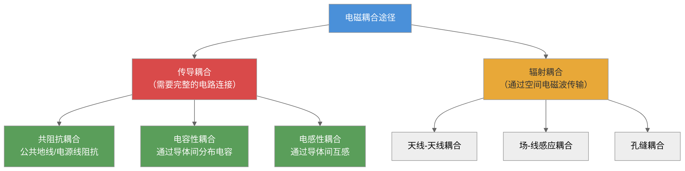
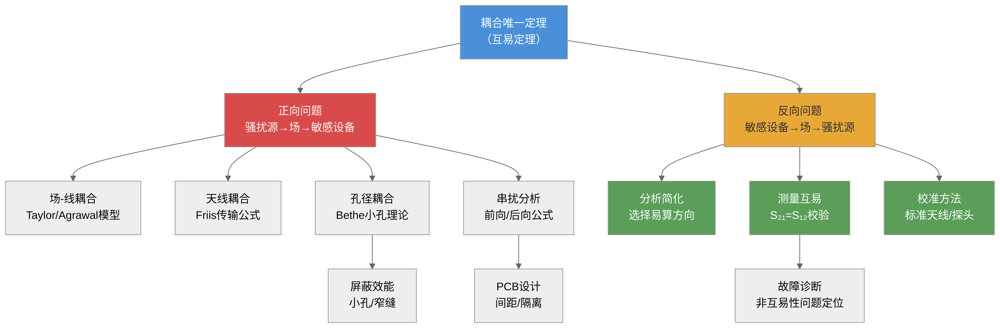
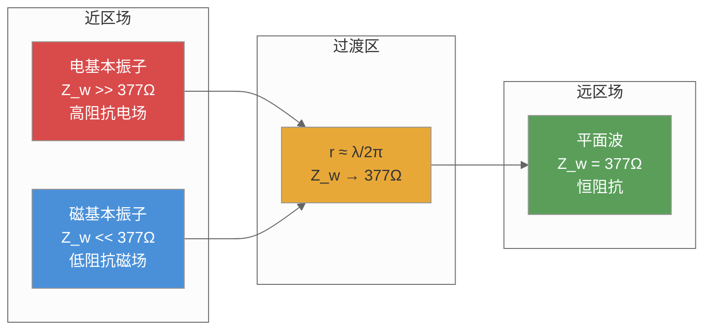
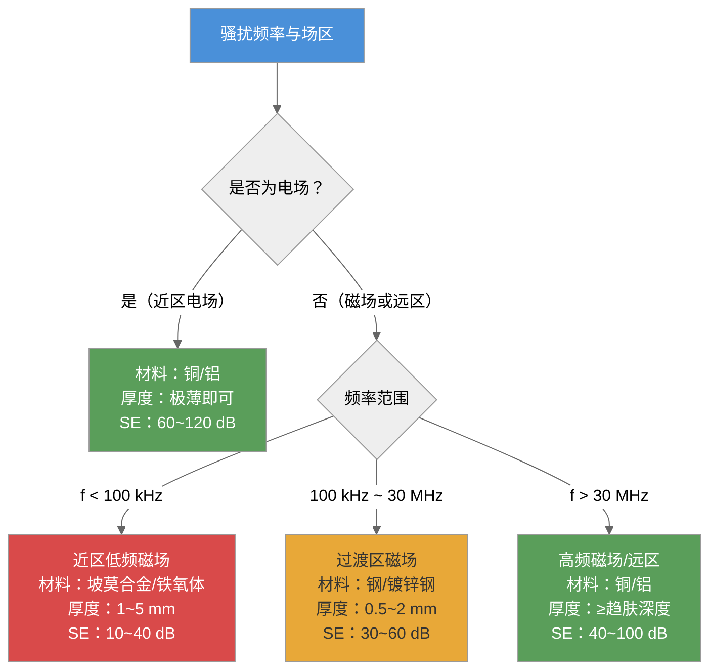
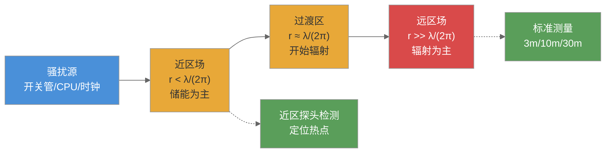
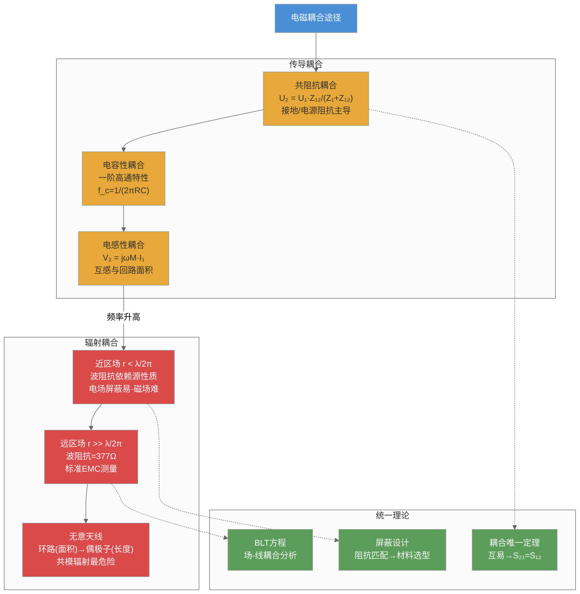

# 第四章 电磁耦合途径

## 内容提要

电磁干扰三要素表明，电磁干扰的产生必须同时具备骚扰源、耦合途径和敏感设备三个条件。第3章已详细讨论了各类电磁骚扰源的特性，本章将重点讨论第二个要素——耦合途径。骚扰源产生的电磁能量必须通过某种耦合途径才能到达敏感设备并造成干扰。因此，在EMC设计中，切断或削弱耦合途径是抑制电磁干扰最直接、最有效的手段之一。

耦合途径分析的理论核心包括两个层面：**"路"的层面**——利用电路理论（KVL/KCL、阻抗、互感、互容）分析导体之间的传导耦合；**"场"的层面**——利用电磁场理论（麦克斯韦方程组、波动方程、近远场划分）分析空间中的辐射耦合。更重要的是，**耦合唯一定理（洛伦兹互易定理）**将这两个层面统一起来：无论是"路"还是"场"的分析路径，耦合量总是唯一的。

通过本章的学习，读者将建立起从"场"和"路"两个维度分析电磁干扰耦合的完整能力，并能运用耦合唯一定理选择最便捷的分析路径。

通过本章学习，读者应达成以下学习目标：

1. 理解电磁骚扰的传导耦合与辐射耦合两大分类体系，能画出耦合途径分类图
2. 掌握**共阻抗耦合**的电路模型和公式，能计算公共阻抗上的耦合电压
3. 掌握**电容性耦合**的等效电路模型和频率响应公式，能计算给定布局下的串扰电压
4. 掌握**电感性耦合**的互感模型和感应电压公式，能计算平行导线间的磁耦合，理解趋肤效应和导线高频阻抗
5. 理解**耦合唯一定理**，能用洛伦兹互易定理分析场-线耦合和天线耦合问题
6. 理解近区场与远区场的划分（$r = \lambda/2\pi$），掌握波阻抗的概念和计算，能根据不同场区选择屏蔽策略
7. 理解无意天线的两种基本结构（环路天线和偶极天线），能估算其辐射效率

---

## 4.1 电磁骚扰的耦合途径

电磁骚扰从骚扰源传播至敏感设备，必须经过某种传输通路或媒介——这一通路被称为**耦合途径**。理解耦合途径是EMC设计的核心技能之一，因为相比于消除骚扰源（可能影响设备功能）或加固敏感设备（可能增加成本），**切断或削弱耦合途径往往是成本最低、效果最直接的EMC措施**。

按照耦合机理的不同，电磁骚扰的耦合途径可分为两大类：**传导耦合**和**辐射耦合**。

**传导耦合**需要骚扰源与敏感设备之间存在完整的电路连接，骚扰电流通过导体传播。传导耦合包括三种基本机制：共阻抗耦合（通过公共阻抗电路）、电容性耦合（通过导体间分布电容）、电感性耦合（通过导体间互感）。传导耦合的主要特征包括：频率较低时（<30 MHz）占主导；耦合强度与导体的物理参数（阻抗、电容、电感）直接相关；可以通过改变硬件设计（缩短导线、增加间距、加入屏蔽）来有效抑制。

**辐射耦合**不需要直接的电气连接，电磁能量以电磁波的形式通过空间传播。辐射耦合的主要特征包括：频率较高时（>30 MHz）占主导；耦合强度与距离、频率、天线特性（回路面积、导体长度）密切相关；抑制手段包括屏蔽、增加距离、控制阻抗等。

在实际工程中，**传导耦合和辐射耦合往往在高于30 MHz时并存且相互转换**——一个骚扰信号可能通过导体传导到电缆末端，然后通过电缆的"无意天线"效应辐射出去，在空间中以电磁波的形式传播到另一台设备。这就是为什么EMC工程师常说"传导发射和辐射发射是同一个问题的两个表现"。

**表 4-1：传导耦合与辐射耦合的对比**

| 对比维度 | 传导耦合 | 辐射耦合 |
|:---------|:--------|:--------|
| 传输媒介 | 导体（电线、PCB走线、接地线） | 空间电磁波 |
| 是否需要电气连接 | 是（至少两个连接节点） | 否 |
| 主导频率范围 | DC~30 MHz | 30 MHz~GHz |
| 强度随距离变化 | 随导线长度累积 | 远场 $1/r$ 衰减 |
| 主要抑制手段 | 滤波、隔离、缩短导线、增加间距 | 屏蔽、吸波、增大距离、控制孔缝 |
| 典型EMC问题 | 传导发射超标、地环路干扰、电源噪声耦合 | 辐射发射超标、天线干扰、ESD耦合 |
| 分析方法 | 电路理论（KVL/KCL/传输线方程） | 电磁场理论（麦克斯韦方程/天线理论） |



*图4-1：电磁耦合途径的两大分类体系*

**传导耦合**是指骚扰源与敏感设备之间存在完整的电路连接——电磁能量通过导线、电源线、信号线、接地导体、公共阻抗等可见的电路路径传输。传导耦合的特点是：骚扰源和敏感设备之间至少有两个电气连接节点，骚扰电流通过物理导体传播。

**辐射耦合**是指骚扰源与敏感设备之间没有直接的电气连接——电磁能量通过空间以电磁波的形式传播，在敏感设备处感应出电压或电流。辐射耦合的途径主要包括天线与天线之间的耦合（如发射天线与接收天线之间的空间耦合）、场与导线之间的感应耦合（空间电磁场在导线上感应出的分布骚扰源）、以及电磁场通过屏蔽体上孔缝的耦合。

在实际的电子系统中，传导耦合和辐射耦合往往同时存在。例如，开关电源产生的骚扰既通过电源线传导至电网中的其他设备（传导耦合），也通过机箱和线缆向空间辐射电磁波干扰附近的设备（辐射耦合）。在工程诊断中，区分这两种耦合方式是定位EMC问题根源的关键第一步（参见第3章的三步诊断法）。

*设问过渡：对于传导耦合而言，最根本的物理机制是干扰电流通过公共阻抗产生的电压降。这不仅包括公共地线阻抗，还包括公共电源阻抗、信号线和控制线的公共回路阻抗——下一节将对这些传导耦合机制逐一进行定量分析。*

---

## 4.2 传导耦合

传导耦合按照物理机制可分为三种基本类型：**共阻抗耦合**、**电容性耦合**和**电感性耦合**。在实际工程中，这三种耦合方式往往是同时存在、相互耦合的，但在不同的频率范围和布局条件下，其中一种会占据主导地位。

### 4.2.1 共阻抗耦合

共阻抗耦合是最常见、最直观的传导耦合方式。两个不同的电路共享一段公共阻抗回路时，一个电路的电流流过公共阻抗产生的电压降就会叠加到另一个电路的信号上，形成电磁干扰。

**共阻抗耦合的电路模型**：设有两个电路通过一个公共阻抗 $Z_{12}$ 连接。电路1由源电压 $U_1$、源内阻 $Z_1$ 和公共阻抗 $Z_{12}$ 组成；电路2由公共阻抗 $Z_{12}$ 和负载 $Z_2$ 组成。当电路1有电压 $U_1$ 作用时，电流 $I_1$ 流过 $Z_{12}$，在 $Z_{12}$ 上产生压降 $U_{12} = I_1 Z_{12}$，该电压降作为骚扰源作用于电路2。

**推导过程**：根据基尔霍夫电压定律，电路1的回路方程为：

$$
U_1 = I_1(Z_1 + Z_{12})
\tag{4-1}
$$

电路2的开路电压即为 $Z_{12}$ 上的压降：

$$
U_2 = I_1 Z_{12} = \frac{Z_{12}}{Z_1 + Z_{12}} U_1
\tag{4-2}
$$

式中，$U_2$ 为耦合到电路2的骚扰电压（V），$U_1$ 为电路1的骚扰源电压（V），$Z_{12}$ 为公共阻抗（Ω），$Z_1$ 为电路1的源阻抗（Ω）。

**例4-1**：两个电路共用一段地线，公共地线阻抗 $Z_{12} = 10$ mΩ，电路1的工作电流 $I_1 = 2$ A，电路2的输入灵敏度为1 mV。计算耦合到电路2的骚扰电压，并判断是否会造成干扰。

解：由式(4-1)，电路1在公共地线上产生的压降就是耦合到电路2的骚扰电压：$U_2 = I_1 Z_{12} = 2 \times 0.01 = 20$ mV。电路2的灵敏度为1 mV，因此20 mV的耦合电压远远超过其灵敏度门限（高出约26 dB），必然造成严重干扰。这就是为什么大功率电路（电机驱动、开关电源）和小信号电路（传感器、放大器）必须分别接地，不能共用同一段地线的工程原则。

**地环路耦合的工程分析**：在同一个系统中，两个设备之间既有信号线连接又有接地线连接时，会形成地环路——骚扰电流流经信号线和地线构成的闭合回路，在敏感设备的信号输入端产生共模干扰电压。

考虑一个典型的地环路场景：设备A（传感器）通过信号线向设备B（控制器）发送信号，且两个设备分别接地。由于两接地点之间可能存在地电位差 $U_g$（由电网负载不平衡、雷击电流、大功率设备启停等因素引起），地电位差驱动地电流 $I_g$ 流经信号线的接地回路。根据地环路模型，设备B输入端感受到的骚扰电压为：

$$
U_{\text{noise}} = \frac{R_{\text{in}}}{R_{\text{in}} + R_{\text{signal}} + j\omega L_{\text{loop}}} \cdot U_g
\tag{4-3}
$$

式中，$R_{\text{in}}$ 为设备B的输入电阻，$R_{\text{signal}}$ 为信号线电阻，$L_{\text{loop}}$ 为地环路电感，$U_g$ 为两地之间的电位差。

**例4-1a**：两个设备相距10 m，用屏蔽信号线连接，每个设备分别接地。两地之间的工频（50 Hz）电位差为 $U_g = 1$ V（电力系统的正常地电位差典型值）。信号线电阻 $R_{\text{signal}} = 0.5$ Ω，设备B输入电阻 $R_{\text{in}} = 10$ kΩ，地环路电感 $L_{\text{loop}} \approx 10$ μH。计算耦合到设备B输入端的工频骚扰电压。

解：50 Hz时，$j\omega L_{\text{loop}} = j2\pi \times 50 \times 10\times10^{-6} \approx j3.14$ mΩ，远小于 $R_{\text{in}}$ 和 $R_{\text{signal}}$，因此：

$$
U_{\text{noise}} \approx \frac{10^4}{10^4 + 0.5} \times 1 \approx 0.99995\ \text{V}
\tag{4-4}
$$

即几乎全部1 V的地电位差都加到了设备B的输入端——这是因为信号线的直流电阻远小于输入端电阻，地电位差几乎"无损"地出现在信号输入端。对于灵敏度为1 mV的控制器来说，1 V的工频骚扰是灾难性的。

**地环路抑制措施**：
1. **单点接地**：断开一个设备的接地点（使其浮地），破坏地环路。这是成本最低、效果最直接的措施——在PCB设计中表现为"模拟地和数字地仅在一点连接"。
2. **隔离变压器**：在信号线中串入信号隔离变压器（适用于交流信号，如音频/通信信号），将地环路从直流到低频段完全阻断。隔离变压器对共模干扰的抑制比（CMRR）可达60~120 dB。
3. **光电隔离**：使用光耦或光纤替代直接电气连接，彻底切断地环路。光耦的隔离电压典型值为2.5~5 kV。
4. **共模扼流圈**：在信号线两端串入共模扼流圈，利用其共模高阻抗（在目标频率下数kΩ）抑制地环路电流。共模扼流圈不影响差模信号（有用信号）。

**公共电源阻抗耦合**：除了公共地线阻抗之外，公共电源阻抗也是多电路系统中常见的共阻抗耦合来源。当多个电路共享同一个电源时，一个电路的瞬态电流变化（如数字芯片的输出切换）在供电母线的阻抗上产生电压波动，这个波动通过电源母线传递到其他电路。

一个典型的场景是：一个FPGA或MCU在时钟上升沿同时切换30~50个I/O口，瞬态电流变化率 $di/dt$ 可达数A/ns。这个瞬态电流流经供电母线的寄生电感（PCB上电源走线的电感为每厘米约10 nH，加上去耦电容的寄生电感ESL，总寄生电感可达数十nH），在电源母线上产生瞬态电压降 $\Delta V = L_{\text{eff}} \cdot di/dt$。该电压降通过电源线传递到同一供电网络中的模拟电路（如ADC、运放），导致模拟电源电压在采样瞬间发生抖动，降低ADC的信噪比。

**例4-1b**：一个小型混合信号PCB上，数字部分（MCU）和模拟部分（ADC）共用5 V电源，供电母线的总寄生电感为 $L_{\text{eff}} = 30$ nH。MCU在时钟上升沿同时切换20个I/O口，每个I/O口输出电流变化5 mA，上升时间1 ns。计算电源母线上产生的瞬态电压降。

解：$di/dt = (20 \times 5\text{ mA}) / 1\text{ ns} = 0.1\text{ A} / 1\text{ ns} = 10^8\text{ A/s}$。$\Delta V = 30 \times 10^{-9} \times 10^8 = 3$ V。这个3 V的电源瞬态降导致模拟电路的供电电压从5 V骤降到2 V——ADC的参考电压随之剧烈波动，转换结果严重失真。

---

#### 导线阻抗的频率特性

共阻抗耦合中的公共阻抗 $Z_{12}$ 在低频时主要由电阻主导，但在高频时主要由感抗主导。以下推导导线的电阻和电感的频率特性。

**导线的直流电阻**由导体材料的电阻率、长度和横截面积决定：

$$
R_{\text{DC}} = \frac{\rho L}{A}
\tag{4-5}
$$

式中，$\rho$ 为电阻率（铜：$1.72\times10^{-8}$ Ω·m，铝：$2.65\times10^{-8}$ Ω·m），$L$ 为导线长度（m），$A$ 为横截面积（m²）。

**趋肤效应**：当交流电流流过导线时，电流在导线横截面上的分布不再均匀，而是向导线表面集中（趋肤效应）。趋肤深度 $\delta$ 定义为电流密度衰减到表面值 $1/e \approx 37\%$ 时的深度：

$$
\delta = \frac{1}{\sqrt{\pi f \mu \sigma}}
\tag{4-6}
$$

式中，$\mu = \mu_0 \mu_r$ 为磁导率，$\sigma = 1/\rho$ 为电导率。对于铜（$\sigma = 5.8\times10^7$ S/m，$\mu_r = 1$）：

$$
\delta_{\text{Cu}} = \frac{66.2}{\sqrt{f}} \ \text{mm}
\tag{4-7}
$$

**例4-2**：计算铜在50 Hz、10 kHz和1 MHz下的趋肤深度。

解：50 Hz时，$\delta = 66.2/\sqrt{50} \approx 9.4$ mm——意味着在工频下，电流仍可基本均匀分布在整个导线截面中（普通导线的直径远小于9.4 mm）。

10 kHz时，$\delta = 66.2/\sqrt{10^4} = 0.662$ mm——当导线直径大于1.3 mm时，高频交流电阻开始显著增大。

1 MHz时，$\delta = 66.2/\sqrt{10^6} = 0.066$ mm = 66 μm——电流仅在导线表面极薄的一层中流动，导线的有效截面大大减小，高频电阻远大于直流电阻。

趋肤效应导致的高频交流电阻与直流电阻之比近似为 $R_{\text{AC}}/R_{\text{DC}} \approx d/(2\delta)$（当 $\delta \ll d$ 时），其中 $d$ 为导线直径。在1 MHz时，直径为1 mm的铜导线的 $R_{\text{AC}}/R_{\text{DC}} \approx 1/(2\times0.066) \approx 7.6$——高频电阻比直流电阻高出近8倍。

**导线的电感**是影响高频共阻抗耦合的更关键因素。根据电感近似计算公式，一根长度为 $L$（mm）、直径为 $d$（mm）的直导线的自感可得：

$$
L_{\text{w}} \approx 0.2 L \left[ \ln\left(\frac{4L}{d}\right) - 0.75 \right] \ \text{nH}
\tag{4-8}
$$

式中，$L$ 和 $d$ 的单位为mm。

**例4-3**：计算一根长10 cm、直径1 mm的铜导线在DC和10 MHz下的阻抗。

解：直流电阻 $R_{\text{DC}} = \rho L/A = 1.72\times10^{-8} \times 0.1 / (\pi \times 0.5^2 \times 10^{-6}) \approx 2.2$ mΩ。

电感 $L_{\text{w}} \approx 0.2 \times 100 \times [\ln(4\times100/1) - 0.75] = 20 \times [\ln 400 - 0.75] = 20 \times [5.99 - 0.75] \approx 105$ nH。

10 MHz时的感抗 $X_L = 2\pi f L_{\text{w}} = 2\pi \times 10^7 \times 105\times10^{-9} \approx 6.6$ Ω——而直流电阻仅2.2 mΩ，感抗是直流电阻的3000倍。这就是为什么在高频EMC设计中，考察接地导体的阻抗时，电感远比电阻重要——**接地线不再是"地"，而是一个具有显著阻抗的导体。**

**工程意义**：共阻抗耦合在高频段的强度远大于低频段，因为感抗随频率线性增加。对于10 cm长的接地导线，在EMC关注的传导发射频段（150 kHz~30 MHz），其感抗范围为0.1~66 Ω——这意味着在30 MHz时，即使是很短的接地导线也能产生显著的共阻抗耦合。因此，高频接地的工程实践要求：接地线尽可能短（<5 cm），使用宽扁导体（宽>长）以降低电感，或使用接地平面代替接地线。

### 4.2.2 电容性耦合

电容性耦合（又称电场耦合）是利用两个导体之间的分布电容将骚扰电压从一个电路耦合到另一个电路的传导耦合方式。当两个导体之间存在电位差时，它们之间会通过分布电容产生位移电流，使骚扰电压从一个导体耦合到另一个导体上。

**电容性耦合的等效电路模型**：

考虑两个相邻的导体——导体1（骚扰源电路）和导体2（敏感电路）。导体1对地电压为 $U_1$，导体2通过电阻 $R$（通常是敏感电路的输入电阻）接地。导体1与导体2之间的分布电容为 $C_{12}$，导体2对地分布电容为 $C_{2G}$。

由基尔霍夫电流定律，流过 $C_{12}$ 的位移电流等于流过 $R$ 和 $C_{2G}$ 的电流之和。用相量表示：

$$
j\omega C_{12} (U_1 - U_2) = \frac{U_2}{R} + j\omega C_{2G} U_2
\tag{4-9}
$$

式中，$\omega = 2\pi f$ 为角频率。整理得：

$$
j\omega C_{12} U_1 = U_2 \left( \frac{1}{R} + j\omega C_{2G} + j\omega C_{12} \right)
\tag{4-10}
$$

因此，耦合到导体2上的电压为：

$$
U_2 = \frac{j\omega C_{12} R}{1 + j\omega R(C_{12} + C_{2G})} \cdot U_1
\tag{4-11}
$$

**频率响应分析**：

式(4-5)是一阶高通特性，具有一个转折频率 $f_c = 1/[2\pi R(C_{12}+C_{2G})]$：

**低频段**（$f \ll f_c$）：$j\omega R(C_{12}+C_{2G}) \ll 1$，式(4-5)近似为：

$$
U_2 \approx j\omega C_{12} R \cdot U_1
\tag{4-12}
$$

此时耦合电压与频率成正比（+20 dB/十倍频程），且与 $C_{12}$ 和 $R$ 成正比。频率越低，电容性耦合越弱——这就是为什么工频（50/60 Hz）的电容性耦合通常不严重（除非 $C_{12}$ 极大或 $R$ 极大）。

**高频段**（$f \gg f_c$）：$j\omega R(C_{12}+C_{2G}) \gg 1$，式(4-5)近似为：

$$
U_2 \approx \frac{C_{12}}{C_{12} + C_{2G}} \cdot U_1
\tag{4-13}
$$

此时耦合电压与频率无关，仅取决于两个电容的分压比。这意味着在高频段，电容性耦合的幅度趋于恒定，不再随频率增加而增加。

**例4-4**：两根平行导线，长度为10 cm，间距为2 mm，导线之间的分布电容 $C_{12} \approx 5$ pF。敏感电路的输入电阻 $R = 1$ MΩ，其对地分布电容 $C_{2G} = 10$ pF。骚扰源电压 $U_1 = 5$ V（频率 $f = 1$ kHz）。计算耦合到敏感电路上的电压。

解：根据式(4-11)中转折频率的定义，首先计算转折频率：

$$
f_c = \frac{1}{2\pi R(C_{12} + C_{2G})} = \frac{1}{2\pi \times 10^6 \times 15\times 10^{-12}} \approx 10.6 \ \text{kHz}
\tag{4-14}
$$

工作频率 $f = 1$ kHz 远小于 $f_c = 10.6$ kHz，因此使用低频近似公式：

$$
U_2 \approx 2\pi \times 10^3 \times 5\times 10^{-12} \times 10^6 \times 5 \approx 0.157 \ \text{V} = 157 \ \text{mV}
\tag{4-15}
$$

157 mV是一个显著的耦合电压——对于输入灵敏度为1 mV的放大器而言，这足以造成严重干扰。

**屏蔽对电容性耦合的作用**

在导体2和导体1之间插入接地屏蔽层，可以显著降低电容性耦合。其原理是：屏蔽层（接地）将导体1与导体2之间的电场线"短路"到地，使 $C_{12}$ 在实际测量中几乎为零。在屏蔽层与导体2之间仍然存在分布电容 $C_{12s}$，但由于屏蔽层接地，$C_{12s}$ 被并联到 $C_{2G}$ 上，不会产生耦合。

屏蔽对电容性耦合的有效性可以用**屏蔽因子** $\eta$ 表示：$\eta = C'_{12}/C_{12}$，其中 $C'_{12}$ 为插入屏蔽层后导体1与导体2之间的等效耦合电容。对于良好的接地金属屏蔽层，$\eta$ 可降低到 $10^{-3}\sim10^{-6}$（即屏蔽效果为60~120 dB）。

**屏蔽层的端接方式**：屏蔽层的接地方式直接影响其对电容性耦合的抑制效果。有三种屏蔽层端接方式：

| 端接方式 | 屏蔽层接法 | 电容性耦合抑制效果 | 适用场景 |
|:---------|:----------|:----------------:|:---------|
| 一端接地 | 屏蔽层在源端或负载端单点接地 | 降低高频电容耦合，但低频磁场耦合基本无影响 | 低频信号（<100kHz），如音频电缆 |
| 两端接地 | 屏蔽层在源端和负载端都接地 | 同时抑制电容和部分电感耦合，但可能形成地环路 | 高频信号（>1MHz），如同轴电缆 |
| 360°端接 | 屏蔽层通过同轴连接器在两端360°端接 | 最佳的高频屏蔽效果，接地阻抗最低 | 射频信号（>10MHz），如SMA接头的同轴电缆 |

*360°端接是高频屏蔽的最佳实践*——使用同轴连接器（BNC、SMA、N型）而非"猪尾巴"式（将屏蔽层扭成一股导线接地），因为"猪尾巴"在数十MHz下会因引线电感而显著降低屏蔽效果。实验数据表明：在100 MHz时，360°端接比"猪尾巴"端接的屏蔽效能高出约20~30 dB。

**PCB平行走线的电容串扰**

在PCB设计中，相邻平行走线之间的电容性串扰是一个不可忽视的问题。对于微带线结构（走线在PCB表面，下方为接地平面），两条平行走线之间的分布电容与走线宽度 $w$、间距 $s$、PCB介电常数 $\epsilon_r$ 和走线长度 $L$ 有关：

$$
C_{12} \approx \epsilon_0 \epsilon_r \cdot \frac{w}{h} \cdot \frac{L}{1 + (s/h)^2} \cdot k
\tag{4-16}
$$

式中，$h$ 为介质厚度，$k$ 为与走线结构有关的修正系数（约0.5~1.0）。由于PCB的介电常数通常为 $\epsilon_r = 4.0\sim 4.7$（FR-4），PCB上的电容串扰比空气中间距相同的导线之间的串扰大约4~5倍。

**例4-4a**：两层PCB（顶层为走线层，第二层为接地平面），FR-4基板（$\epsilon_r = 4.5$），厚度 $h = 1.6$ mm。两条平行走线长度 $L=5$ cm，间距 $s = 0.5$ mm，走线宽度 $w = 0.3$ mm。估算 $C_{12}$ 并计算在10 MHz、源电压5 V、负载电阻1 MΩ时的串扰电压。

解：使用简化公式 $C_{12} \approx \epsilon_0 \epsilon_r w L / s \approx 8.85\times10^{-12} \times 4.5 \times 0.3\times10^{-3} \times 0.05 / (0.5\times10^{-3}) \approx 1.19$ pF。

转折频率 $f_c = 1/(2\pi RC_{12}) = 1/(2\pi \times 10^6 \times 1.19\times10^{-12}) \approx 134$ kHz。工作频率10 MHz远高于$f_c$，因此电容耦合处于高频平顶区：

$$
U_2 \approx U_1 \cdot C_{12}/(C_{12} + C_{2G}) \approx 5 \times 1.19/(1.19 + 5) \approx 0.96\ \text{V}
\tag{4-17}
$$

在10 MHz下，仅5 cm长的平行走线就产生了近1 V的串扰——这对高速数字电路（50~100 MHz）和模拟电路（如ADC输入前的信号走线）来说是非常严重的干扰源。这就是为什么PCB设计规范要求：敏感信号（时钟、模拟信号）与相邻走线的间距应≥3倍线宽（"3W规则"），或者在走线之间插入接地隔离走线。

### 4.2.3 电感性耦合

电感性耦合（又称磁场耦合）是利用两个回路之间的互感将骚扰电流从一个回路耦合到另一个回路的传导耦合方式。根据法拉第电磁感应定律，一个回路中的交变电流产生的交变磁场会在相邻回路中感应出电动势。

**电感性耦合的等效模型**：

设有两个相邻的回路——回路1（骚扰源回路）流过电流 $I_1$，回路2（敏感回路）与回路1之间存在互感 $M$。根据法拉第定律，回路2中感应出的开路电压为：

$$
V_2 = j\omega M I_1
\tag{4-18}
$$

式中，$V_2$ 为感应电压（V），$\omega = 2\pi f$ 为角频率，$M$ 为两回路之间的互感（H），$I_1$ 为回路1中的骚扰电流（A）。

**互感的计算**：对于两根平行的长直导线（长度 $L$，间距 $d$，$L \gg d$），它们之间的互感近似为：

$$
M \approx \frac{\mu_0 L}{2\pi} \left[ \ln\left(\frac{2L}{d}\right) - 1 \right] \ \text{H}
\tag{4-19}
$$

式中，$\mu_0 = 4\pi \times 10^{-7}$ H/m为真空磁导率。

**例4-5**：两条长度为1 m的平行导线，间距为1 cm。回路1中流过 $I_1 = 100$ mA（$f = 1$ MHz）的骚扰电流。计算回路2中感应的开路电压。

解：先计算互感：

$$
M \approx \frac{4\pi \times 10^{-7} \times 1}{2\pi} \left[ \ln\left(\frac{2 \times 1}{0.01}\right) - 1 \right] = 2\times 10^{-7} \times [\ln 200 - 1] \approx 2\times 10^{-7} \times (5.30 - 1) \approx 0.86 \ \mu\text{H}
\tag{4-20}
$$

感应电压：$V_2 = 2\pi \times 10^6 \times 0.86\times 10^{-6} \times 0.1 \approx 0.54$ V = 540 mV。

**工程意义**：540 mV的感应电压对于低电平模拟电路（如传感器信号、音频信号）来说是非常显著的干扰。此例说明，高频大电流信号（如开关电源的开关管电流、电机驱动器的PWM电流）的布线应远离弱信号线。

### 4.2.4 电容性耦合与电感性耦合的综合考虑

在实际工程中，电容性耦合和电感性耦合往往同时存在。综合两种耦合的影响，敏感负载 $R_L$ 上的总耦合电压为两种效应的叠加（取决于相位关系）：

对于如图4-3所示的典型布局，由电感性耦合电压式(4-18)和电容性耦合电压式(4-12)叠加可得总耦合电压（最坏情况——同相叠加）：

$$
V_{\text{total}} = j\omega M I_1 - j\omega C_{12} R_L V_1
\tag{4-21}
$$

式中，第一项为电感性耦合（由 $I_1$ 通过互感产生），第二项为电容性耦合（由 $V_1$ 通过分布电容产生）。两者相差180°相位，因此在某些频率点上可能部分抵消。但在工程设计中，应假设最坏情况——两者同相叠加（即取绝对值之和作为总耦合量的估计）。

**主导机制判断**：电容性耦合与电感性耦合的相对主导性取决于：
- **源阻抗**：低阻抗源（电压源）产生高电压 $V_1$ 和大电流 $I_1$，电容性耦合和电感性耦合都可能显著；高阻抗源产生高电压但小电流，电容性耦合占主导
- **负载阻抗**：高阻抗负载（$R_L > 1$ kΩ）对电容性耦合更敏感；低阻抗负载（$R_L < 100$ Ω）对电感性耦合更敏感
- **频率**：两者都随频率线性增加，但电容性耦合在超高频段因寄生电感效应而饱和

**工程对策**：
- 降低电容性耦合：增加导线间距（减小 $C_{12}$）、降低负载阻抗、使用接地屏蔽层
- 降低电感性耦合：减小回路面积（降低互感）、增加导线间距、使用双绞线（使磁场在相邻绞环中相互抵消）、使用磁屏蔽

### 4.2.5 高频耦合效应

当工作频率升高到使导线的电长度接近或超过0.1λ时（参见第2章电长度概念），传导耦合的分析必须从集总参数模型转向分布参数模型。在高频段，以下效应变得显著。

**传输线效应**：当导线的电长度 $L/\lambda \ge 0.1$ 时，导线上的电压和电流不再处处相等——它们以行波的形式沿导线传播，在阻抗不连续点（如导线两端、分支点、负载端）产生反射。反射导致驻波出现，使导线某些位置上的电压或电流比输入端高数倍（最大可达两倍——开路反射）。传输线效应使得高频耦合的分析复杂化，需使用传输线方程（电报方程）而非简单的集总参数模型。

**传输线方程的推导**：考虑一段长度为Δz的均匀传输线，每单位长度具有串联电阻R、串联电感L、并联电导G和并联电容C。在Δz段上，电压和电流满足以下关系：

$$
ΔV(z,t) = -[RΔz \cdot i(z,t) + LΔz \cdot \frac{\partial i(z,t)}{\partial t}]
\tag{4-22}
$$

$$
ΔI(z,t) = -[GΔz \cdot v(z,t) + CΔz \cdot \frac{\partial v(z,t)}{\partial t}]
\tag{4-23}
$$

令Δz→0，得到传输线的时域偏微分方程（电报方程）：

$$
\frac{\partial v(z,t)}{\partial z} = -R i(z,t) - L \frac{\partial i(z,t)}{\partial t}
\tag{4-24}
$$

$$
\frac{\partial i(z,t)}{\partial z} = -G v(z,t) - C \frac{\partial v(z,t)}{\partial t}
\tag{4-25}
$$

对于正弦稳态条件（$v(z,t) = V(z)e^{j\omega t}$），转换为频域形式：

$$
\frac{dV(z)}{dz} = -(R+j\omega L)I(z)
\tag{4-26}
$$

同理，根据基尔霍夫电流定律可得电流方程：

$$
\frac{dI(z)}{dz} = -(G+j\omega C)V(z)
\tag{4-27}
$$

这是传输线理论的基础方程。求解此方程组得到传输线上任意一点的电压和电流分布——它们以波的形式沿z轴正反方向传播。传输线的特性阻抗$Z_0$和传播常数$\gamma$分别为：

$$
Z_0 = \sqrt{\frac{R+j\omega L}{G+j\omega C}} \approx \sqrt{\frac{L}{C}} \quad (\text{当}R\ll\omega L, G\ll\omega C)
\tag{4-28}
$$

$$
\gamma = \alpha + j\beta = \sqrt{(R+j\omega L)(G+j\omega C)}
\tag{4-29}
$$

式中，$\alpha$为衰减常数（Np/m），$\beta = 2\pi/\lambda$为相位常数（rad/m）。

当负载阻抗$Z_L \neq Z_0$时，传输线上产生反射。反射系数$\Gamma$定义为：

$$
\Gamma = \frac{Z_L - Z_0}{Z_L + Z_0}
\tag{4-30}
$$

反射产生驻波，由反射系数$\Gamma$根据驻波比定义可得：

$$
VSWR = \frac{1+|\Gamma|}{1-|\Gamma|}
\tag{4-31}
$$

在EMC工程中，信号线两端的阻抗不匹配（$Z_L \neq Z_0$）是导致高频信号在电缆中反射和辐射的根本原因之一。反射信号在电缆中来回振荡，既增加了传导发射的能量（通过电源线注入LISN），又通过电缆的"无意天线"效应增加了辐射发射。

**分布参数耦合**：在高频段，导线之间不仅存在集总参数电容 $C_{12}$ 和互感 $M$，还存在沿导线长度方向连续分布的分布电容和分布电感——这被称为"分布参数耦合"。分布参数耦合的强度与导线长度成正比（耦合总能量随长度累积），而不是与导线的电长度无关（集总参数模型中假设导线电气短）。

**分布参数耦合的耦合系数**：对于两根长度L、间距d的平行导线，在频率f下，单位长度的互电容$c_{12}$和互感$m_{12}$在整个长度上产生的总耦合可以通过沿长度积分得到。当$L/\lambda$较大时，分布参数效应使耦合电压在特定频率（对应$L = n\lambda/2$）达到峰值——这就是分布参数耦合的谐振放大效应。

**导线谐振**：当导线的长度等于半波长的整数倍时（$L = n\cdot\lambda/2$），导线发生串联谐振或并联谐振，此时导线上的电流或电压幅值被共振放大。具体地，当$L = \lambda/4$时，一端开路的导线在其开路端呈现电压最大值、电流最小值（电压驻波波腹）；当$L = \lambda/2$时，两端开路的导线在其中心呈现电压波节。在EMC工程中，这通常意味着当某根电缆的长度正好等于某骚扰频率所对应半波长的整数倍时，该电缆成为一个高效的"辐射天线"而非简单的"传输导线"。

**工程经验总结**：

| 频段 | 主导耦合方式 | 分析模型 | 常用抑制手段 |
|:-----|:-----------|:--------|:-----------|
| DC~1 MHz | 共阻抗耦合为主 | 集总参数（KVL/KCL） | 缩短地线、加大线径、单点接地 |
| 1~30 MHz | 电容+电感耦合为主 | 集总参数（互感/互容模型） | 屏蔽、双绞线、增加间距 |
| 30~300 MHz | 传导转辐射的过渡区 | 分布参数（传输线模型） | 终端匹配、阻抗控制、共模扼流圈 |
| >300 MHz | 辐射耦合为主 | 全波电磁场（MoM/FDTD） | 完整屏蔽、孔缝密封、吸收材料 |

### 4.2.6 耦合的传递函数分析方法

何金良在《电磁兼容概论》中提出了基于传递函数的统一耦合分析方法。对所有的耦合模型均可赋予某种传递函数，即敏感设备上的电磁干扰都可以表示为骚扰源的函数关系。

**T网络模型**：在骚扰源 $(U_{\mathrm{s}}, Z_{\mathrm{s}})$ 与敏感设备 $(U_{\mathrm{e}}, Z_{\mathrm{e}})$ 之间的电磁相互作用可表述为一个双端口网络，其间经由 $Z_a, Z_b, Z_c$ 形成的T形网络相连，传输函数为：

$$
\frac{(U_{\mathrm{s}}, I_{\mathrm{s}})}{(U_{\mathrm{e}}, I_{\mathrm{e}})} = f_{\mathrm{t}}(Z_{\mathrm{a}}, Z_{\mathrm{b}}, Z_{\mathrm{c}}, Z_{\mathrm{s}}, Z_{\mathrm{e}}) 
\tag{4-32}
$$

从T网络模型可以看出，降低发、受两端之间的电磁耦合有两种基本思路：\"短路\"（使 $Z_c = 0$）和\"开路\"（使 $Z_a$ 或 $Z_b$ 为无穷大）。实际上，由于存在杂散电容和电感，无法达到理想的短路或开路状态。

**S参数与传递函数**：信号传输系统可看作一个二端口或多端口网络。以二端口网络为例，需要测得4个散射参数——$S_{11}, S_{12}, S_{21}, S_{22}$——分别反映网络的反射和传输特性。二端口网络散射方程组为：


$$
\boldsymbol{b} = \boldsymbol{S} \boldsymbol{a}
\tag{4-33}
$$

其中 $S = \begin{bmatrix} S_{11} & S_{12} \\ S_{21} & S_{22} \end{bmatrix}$，$a = [a_1 \; a_2]^{\mathrm{T}}$ 和 $b = [b_1 \; b_2]^{\mathrm{T}}$ 为归一化入射和反射散射变量。当端口2接匹配负载时：$S_{11} = b_1/a_1$（端口1的反射系数），$S_{21} = b_2/a_1$（端口1到2的正向传输系数）。

二端口网络的电压传递函数可用Z参数表示，电流传递函数可用Y参数表示。借助S参数与Z参数、Y参数的关系：


$$
\boldsymbol{Z}_{\mathrm{n}} = (\boldsymbol{E} + \boldsymbol{S})(\boldsymbol{E} - \boldsymbol{S})^{-1}
\tag{4-34}
$$


$$
\boldsymbol{Y}_{\mathrm{n}} = (\boldsymbol{E} - \boldsymbol{S})(\boldsymbol{E} + \boldsymbol{S})^{-1}
\tag{4-35}
$$

得到Z参数后可得电压传递特性：

$$
\boldsymbol{H}_{\mathrm{u}}(\mathrm{j}\omega) = \frac{\boldsymbol{U}_2(\mathrm{j}\omega)}{\boldsymbol{U}_1(\mathrm{j}\omega)} = \frac{\boldsymbol{z}_{21}}{\boldsymbol{z}_{11}} 
\tag{4-36}
$$

**矢量匹配法**：矢量匹配法是电路计算中频率响应特性拟合的常用方法。该方法采用有理表达式对目标曲线进行拟合：

$$
f(s) = \sum_{n=1}^{N} \frac{c_n}{s - a_n} + d 
\tag{4-37}
$$

式中，极点 $a_n$ 及其对应留数 $c_n$ 既可以是实数也可以是共轭复数，$d$ 为实数，$N$ 是极点总数。实际应用时，可以使用网络分析仪（如HP 4395A）配合传输/反射测试工具包测量二端口网络的散射特性，然后采用矢量匹配法建立传输系统的传输特性模型。

*设问过渡：当频率继续升高到30 MHz以上时，导线的电长度开始超过0.1λ，传导耦合逐渐过渡为辐射耦合——电磁能量不再通过导体传输，而是以电磁波的形式在空间中传播。这就是下一节要讨论的核心内容。*

---

## 4.3 辐射耦合

辐射耦合是指电磁骚扰以电磁波的形式通过空间传播，在敏感设备的导体（线缆、PCB走线、机箱缝隙等）上感应出电压或电流的耦合方式。与传导耦合不同，辐射耦合不需要骚扰源和敏感设备之间的直接电气连接——电磁波可以跨越数米甚至数千米的距离对设备产生干扰。

### 4.3.1 电磁辐射的基本原理

电磁辐射的本质是时变的电荷或电流在空间中激发时变电磁场，电磁场以波的形式向远处传播。本节从"场"的视角出发，建立辐射耦合的物理基础。

**电基本振子（Hertzian Dipole）的电磁场**：电基本振子是最简单的辐射源——一段长度为 $l$（$l \ll \lambda$）的短导线，载有时变电流 $i(t) = I_0 \cos(\omega t)$。在球坐标系中，电基本振子在空间中产生的电场和磁场分量由麦克斯韦方程组导出。完整的场分布表达式为：

$$
E_r = \frac{I_0 l \cos\theta}{2\pi \epsilon_0} \cdot \frac{1}{j\omega r^3} \cdot e^{-jkr}
\tag{4-38}
$$

$$
E_\theta = \frac{I_0 l \sin\theta}{4\pi \epsilon_0} \left[ \frac{1}{j\omega r^3} + \frac{1}{v r^2} + \frac{j\omega}{v^2 r} \right] e^{-jkr}
\tag{4-39}
$$

$$
H_\phi = \frac{I_0 l \sin\theta}{4\pi} \left[ \frac{1}{r^2} + \frac{j\omega}{v r} \right] e^{-jkr}
\tag{4-40}
$$

式中，$k = 2\pi/\lambda$ 为波数，$v = c \approx 3\times10^8$ m/s 为光速。

式(4-8)中包含了三个衰减项——$1/r^3$（感应场）、$1/r^2$（中间场）和 $1/r$（辐射场）。在不同距离范围内，主导项不同。

**何金良《电磁兼容概论》的偶极子辐射场分量**：何金良从麦克斯韦方程组出发，给出了电偶极子和磁偶极子辐射场的完备表达式，并按场区进行了分类简化。

**电偶极子的完整场分量**（电偶极子沿z轴放置于原点），由麦克斯韦方程组推导可得：
$$
\begin{cases}
H_r = 0 \\ 
H_\theta = 0 \\
H_\phi = \frac{I_{\mathrm{m}} \Delta l}{4\pi} k^2 \left[ -\frac{1}{kr} \sin(\omega t - kr) + \frac{1}{(kr)^2} \cos(\omega t - kr) \right] \sin\theta \\
E_r = \frac{I_{\mathrm{m}} \Delta l}{2\pi \omega \varepsilon} k^3 \left[ \frac{1}{(kr)^2} \cos(\omega t - kr) + \frac{1}{(kr)^3} \sin(\omega t - kr) \right] \cos\theta \\
E_\theta = \frac{I_{\mathrm{m}} \Delta l}{4\pi \omega \varepsilon} k^3 \left[ -\frac{1}{kr} \sin(\omega t - kr) + \frac{1}{(kr)^2} \cos(\omega t - kr) + \frac{1}{(kr)^3} \sin(\omega t - kr) \right] \sin\theta \\
E_\phi = 0
\end{cases} 
\tag{4-41}
$$

**磁偶极子的完整场分量**（磁偶极子半径为 $a$，$a \ll \lambda$）：
$$
\begin{cases}
E_r = 0 \\
E_\theta = 0 \\
E_\varphi = \frac{-I_{\mathrm{m}} a^2 k^4}{4\omega\varepsilon} \left[ \frac{1}{kr} \cos(\omega t - kr) + \frac{1}{(kr)^2} \sin(\omega t - kr) \right] \sin\theta \\
H_r = \frac{I_{\mathrm{m}} a^2 k^3}{2} \left[ \frac{1}{(kr)^2} \sin(\omega t - kr) + \frac{1}{(kr)^3} \cos(\omega t - kr) \right] \cos\theta \\
H_\theta = \frac{I_{\mathrm{m}} a^2 k^3}{4} \left[ -\frac{1}{kr} \cos(\omega t - kr) + \frac{1}{(kr)^2} \sin(\omega t - kr) + \frac{1}{(kr)^3} \cos(\omega t - kr) \right] \sin\theta \\
H_\varphi = 0
\end{cases} 
\tag{4-42}
$$

式中 $k = 2\pi/\lambda$ 为波数。完整表达式包含 $1/kr$（辐射项）、$1/(kr)^2$（感应/中间项）和 $1/(kr)^3$（近区感应项）三类衰减项，分别对应远区场、过渡区和近区场。

**近区场简化**（$r \ll \lambda/2\pi$，即 $kr \ll 1$，高次项 $1/(kr)^3$ 主导）：

电偶极子：
$$
\begin{cases}
H_\varphi \approx \frac{I_{\mathrm{m}}\Delta l}{4\pi r^2} \sin\theta \cos\omega t \\
E_r \approx \frac{I_{\mathrm{m}}\Delta l}{2\pi \omega\varepsilon r^3} \cos\theta \sin\omega t \\
E_\theta \approx \frac{I_{\mathrm{m}}\Delta l}{4\pi \omega\varepsilon r^3} \sin\theta \sin\omega t
\end{cases}
\tag{4-43}
$$

磁偶极子：
$$
\begin{cases}
E_\varphi \approx \frac{-I_{\mathrm{m}} a^2 k^2}{4\omega\varepsilon r^2} \sin\theta \sin\omega t \\
H_r \approx \frac{I_{\mathrm{m}} a^2}{2 r^3} \cos\theta \cos\omega t \\
H_\theta \approx \frac{I_{\mathrm{m}} a^2}{4 r^3} \sin\theta \cos\omega t
\end{cases}
\tag{4-44}
$$

近区场特点：①波阻抗为虚数——电偶极子场呈容性高阻抗（$|Z_e| > 377\Omega$），磁偶极子场呈感性低阻抗（$|Z_m| < 377\Omega$）；②电场与磁场相位相差90°，能量在r方向往返振荡（不向外辐射）；③电偶极子场电场按 $1/r^3$ 衰减、磁场按 $1/r^2$ 衰减，磁偶极子场反之。

**远区场简化**（$r \gg \lambda/2\pi$，即 $kr \gg 1$，低次项 $1/kr$ 主导）：

电偶极子（仅存 $E_\theta$ 和 $H_\varphi$）：
$$
\begin{cases}
E_\theta \approx \frac{I_{\mathrm{m}}\Delta l k^2}{4\pi \omega\varepsilon} \cdot \frac{-1}{kr} \sin(\omega t - kr) \sin\theta \\
H_\varphi \approx \frac{I_{\mathrm{m}}\Delta l k}{4\pi} \cdot \frac{-1}{kr} \sin(\omega t - kr) \sin\theta
\end{cases}
\tag{4-45}
$$

磁偶极子（仅存 $E_\varphi$ 和 $H_\theta$）：
$$
\begin{cases}
E_\varphi \approx \frac{-I_{\mathrm{m}} a^2 k^4}{4\omega\varepsilon} \cdot \frac{1}{kr} \cos(\omega t - kr) \sin\theta \\
H_\theta \approx \frac{-I_{\mathrm{m}} a^2 k^3}{4} \cdot \frac{1}{kr} \cos(\omega t - kr) \sin\theta
\end{cases}
\tag{4-46}
$$

远区场特点：①电场与磁场相位相同，波阻抗为实数（等于自由空间波阻抗 $Z_0 = 120\pi \approx 377\Omega$）；②场强按 $1/r$ 衰减；③能量以电磁波形式向空间辐射。

### 4.3.2 近区场与远区场的划分

根据与辐射源的距离 $r$ 相对于波长 $\lambda$ 的关系，空间可分为三个区域。

**近区场（感应场）**：$r \ll \lambda/2\pi$。在近区，$1/r^3$ 项占主导，场强随距离的立方衰减。近区场的特征是电场和磁场之间相位相差90°，能量在电场和磁场之间来回交换，不向外辐射（类似于电容器和电感器中的储能过程）。近区场的波阻抗 $Z_w = E/H$ 取决于源的性质：高电压小电流的源（电基本振子）产生高阻抗电场（$Z_w > 377\Omega$），低电压大电流的源（磁基本振子）产生低阻抗磁场（$Z_w < 377\Omega$）。

**过渡区**：$r \approx \lambda/2\pi$。在此区域，$1/r^3$、$1/r^2$ 和 $1/r$ 三项的贡献量级相当，场分布复杂。EMC工程中常取 $r = \lambda/2\pi$ 作为划分近场和远场的工程判据。

**远区场（辐射场）**：$r \gg \lambda/2\pi$。在远区，$1/r$ 项占主导，场强随距离线性衰减。远区场的特征是电场和磁场同相（波阻抗恒为377Ω），能量以电磁波的形式向空间辐射。远区场的波阻抗是自由空间的本征阻抗：

$$
Z_w = \frac{E_\theta}{H_\phi} = \sqrt{\frac{\mu_0}{\epsilon_0}} \approx 376.7\ \Omega \approx 120\pi\ \Omega
\tag{4-47}
$$

**近区场与远区场的划分规则**：

| 区域 | 距离范围 | 主导项 | 衰减率 | 波阻抗 | 能量特征 |
|:-----|:--------|:------|:------|:------|:--------|
| 近区（感应场） | $r \ll \lambda/2\pi$ | $1/r^3$ | $\propto 1/r$（电场）$\propto 1/r^2$（磁场） | 取决于源 | 储能为主 |
| 过渡区 | $r \approx \lambda/2\pi$ | 三者相当 | 复杂 | 过渡 | — |
| 远区（辐射场） | $r \gg \lambda/2\pi$ | $1/r$ | $\propto 1/r$ | $377\Omega$ | 辐射为主 |

**何金良场区划分表**：何金良在《电磁兼容概论》中给出了不同频率下近场与远场分界距离的实用数据表：

| 频率 | 波长 $\lambda$ | $\lambda/(2\pi)$ |
|:---:|:-------------:|:---------------:|
| 50 Hz | 6000 km | 954.9 km |
| 1 kHz | 300 km | 47.7 km |
| 1 MHz | 300 m | 47.7 m |
| 100 MHz | 3 m | 0.477 m |
| 1 GHz | 0.3 m | 4.77 cm |

该表清晰地展示了频率对场区划分的影响：在工频（50 Hz）下，近场区范围达近千公里——意味着几乎所有实际工程场景中的50 Hz骚扰都处于近场区，应采用磁场屏蔽策略。而在1 GHz的微波频段，近场区仅4.77 cm——对于大多数设备间的空间耦合，都处于远区辐射场，屏蔽设计可统一采用平面波屏蔽模型。电磁场区域划分如图3.4.3所示（按天线理论通常划分为电抗近场区、辐射近场区和辐射远场区三个区域）。

根据辐射体的最大尺寸 $D$ 与观察距离 $r$ 的关系，天线理论通常划分为三区：电抗近场区（$r < \lambda/2\pi$）、辐射近场区（菲涅耳区，$\lambda/2\pi \leq r \leq 2D^2/\lambda$）和辐射远场区（夫琅禾费区，$r > 2D^2/\lambda$）。在EMC工程中，$r = \lambda/2\pi$ 是最常用的近远场分界判据。

**例4-6**：一个骚扰源的工作频率为100 MHz。计算近场与远场之间的分界距离。

解：$\lambda = c/f = 3\times10^8 / 10^8 = 3$ m。分界距离 $r_0 = \lambda/2\pi = 3 / (2\pi) \approx 0.48$ m。

这意味着：在距离骚扰源约0.5 m以内，能量的传输主要表现为感应场（非辐射）——耦合强度随距离快速衰减，使用屏蔽措施效果显著。在0.5 m以外，辐射场开始占主导——耦合强度随距离线性衰减（每增加一倍距离衰减6 dB），远场屏蔽需要更完整的屏蔽结构（因为电磁波已进入传播模式）。

**波阻抗与屏蔽设计的关系**：近区和远区波阻抗的差异直接影响了屏蔽设计策略的差异。在近区，电场屏蔽主要依靠高导电材料（通过反射损耗起作用——反射损耗与$\sigma_r/f\mu_r$成正比，在低频段反射损耗很大），而磁场屏蔽则需要高磁导率材料（通过吸收损耗起作用——吸收损耗与$\sqrt{f\mu_r\sigma_r}$成正比，在低频段吸收损耗很小）。在远区，电场和磁场的波阻抗都是377Ω，因此电磁屏蔽具有相同的屏蔽效能（反射损耗和吸收损耗同时起作用）。

### 4.3.3 无意天线结构及辐射特点

在EMC工程中，许多电磁辐射问题来源于**无意天线**——原本不是为辐射而设计的导体结构（如电缆、PCB走线、机箱缝隙）在特定频率下意外地成为了高效的辐射天线或接收天线。

无意天线的两种基本结构是**环路天线**和**偶极天线**。

**（1）环路天线（小电流环路）**

当一个回路中流过时变电流时，该回路就会辐射电磁能量。对于尺寸 $D \ll \lambda$ 的小环路天线，其辐射电场强度为：

$$
E_{\max} = \frac{263 \times 10^{-16} \cdot f^2 \cdot A \cdot I}{r}
\tag{4-48}
$$

式中，$E_{\max}$ 为最大辐射方向的电场强度（V/m），$f$ 为频率（Hz），$A$ 为回路面积（m²），$I$ 为回路电流（A），$r$ 为测量距离（m）。

**关键工程结论**：辐射电场强度与**回路面积 $A$ 成正比**，与**频率的平方 $f^2$ 成正比**。因此，减小PCB上信号回路的面积（使信号线和其回流的接地线尽可能靠近）是降低辐射发射最有效的手段之一。

**例4-7**：一个面积为2 cm²的PCB回路，流过 $I = 10$ mA、$f = 100$ MHz的骚扰电流。计算在3 m处的辐射电场强度。

解：$E_{\max} = 263\times10^{-16} \times (10^8)^2 \times 2\times10^{-4} \times 0.01 / 3 \approx 1.75\ \mu\text{V/m}$。这远低于CISPR 32 B级限值（40 dBμV/m ≈ 100 μV/m），不是问题。

但如果回路面积增大到10 cm²（例如不合理的PCB布局导致信号线和回流线之间存在较大距离），同样条件下 $E_{\max} = 8.77\ \mu\text{V/m}$，仍然不高。但如果同时电流增大到100 mA：$E_{\max} = 87.7\ \mu\text{V/m}$ ——已接近限值。这说明**高频大电流信号的回路面积控制至关重要**。

**（2）偶极天线**

当一段导体的长度等于或接近半波长的整数倍时，该导体会成为高效的辐射体——这就是偶极天线效应。在EMC问题中，最常见的无意偶极天线是**线缆**——设备之间的互连电缆（电源线、信号线、数据线）的物理长度往往在数十厘米到数米之间，与EMC检测频段（30~1000 MHz）对应的半波长（0.15~5 m）范围正好重叠。

**半波偶极天线**：长度为 $L = \lambda/2$ 的导线为半波偶极天线，其辐射电阻 $R_r \approx 73$ Ω——这意味着驱动此天线的源需要输出73 Ω的功率实部才能产生辐射。在EMC问题中，当电缆长度接近λ/4或λ/2时，电缆一端的骚扰源（如数字信号驱动器的输出电流）会通过电缆以较高的效率向空间辐射电磁波。

例：一根长1.5 m的电源线连接着一台开关电源。计算在哪个频率下该电源线会成为高效的辐射天线。

解：半波偶极子条件 $L = \lambda/2$ → $\lambda = 2L = 3$ m → $f = c/\lambda = 3\times10^8 / 3 = 100$ MHz。这意味着，如果在100 MHz附近，该开关电源有足够的谐波能量通过电源线传导出来，这根1.5 m长的电源线就会成为一个高效的辐射体——这就是为什么开关电源的辐射发射问题在VHF频段（30~300 MHz）特别突出的物理原因之一。
### 4.3.4 差模辐射与共模辐射

在电磁兼容工程的辐射发射问题中，区分**差模辐射**和**共模辐射**是具有决定性意义的诊断步骤。两者的产生机制、频谱特性和抑制手段完全不同，错误地将共模问题当作差模问题来处理是EMC调试中最常见的误诊之一。

#### 差模辐射

差模辐射是由信号线与回流线之间的信号电流产生的。在一个理想的两导体系统中，信号电流从驱动器流向接收器，然后通过地平面或回流线返回驱动器。信号电流和回流电流大小相等、方向相反，形成一个小的电流环路——这就是小环路天线。

对于差模辐射，辐射电场强度由式(4-10)给出（重复用于对比）：

$$
E_{\text{DM}} = \frac{263 \times 10^{-16} \cdot f^2 \cdot A \cdot I_{\text{DM}}}{r}
\tag{4-49}
$$

式中，$I_{\text{DM}}$ 为差模电流（即信号电流），$A$ 为信号回路面积。

**差模辐射的关键特征**：
1. 辐射强度与**回路面积成正比**——这是差模辐射的核心约束因素
2. 辐射强度与**频率的平方成正比**——高频信号更易辐射
3. 在PCB中，差模辐射的回路面积通常很小（mm²量级），辐射效率较低
4. 差模辐射的极化方向与信号走线方向相关

#### 共模辐射

共模辐射则完全不同。当信号线或电缆上的**共模电流**（即信号线和回流线上同向流动的电流分量）流过电缆或长导体时，该电流以单极天线或偶极天线的形式辐射。

对于长度为 $L$ 的电缆（$L < \lambda/4$），共模辐射的电场强度为：

$$
E_{\text{CM}} \approx \frac{1.26 \times 10^{-6} \cdot f \cdot I_{\text{CM}} \cdot L}{r}
\tag{4-50}
$$

式中，$I_{\text{CM}}$ 为共模电流（A），$L$ 为电缆长度（m），$f$ 为频率（Hz），$r$ 为测量距离（m）。

**共模辐射与差模辐射的对比**：

| 特征 | 差模辐射 | 共模辐射 |
|:-----|:--------|:--------|
| 电流特征 | 信号电流（大小相等、方向相反） | 共模电流（大小相等、方向相同） |
| 辐射机制 | 小环路天线 | 单极/偶极天线（长导线） |
| 回路面积 | 小（PCB上mm²~cm²） | 大（电缆长度0.5~5 m） |
| 频率依赖 | $f^2$ | $f$ |
| 典型辐射效率 | 低 | **高**（通常比差模高10~100倍） |
| 抑制方法 | 减小回路面积 | 共模扼流圈、屏蔽、改善接地 |

**例4-7a：差模辐射与共模辐射的对比计算**

一个PCB上的时钟信号频率为100 MHz，信号电流为50 mA，信号回路面积为1 cm²。同时，有一根长度为1 m的电缆从该PCB引出，测得其共模电流为5 μA（仅为差模电流的万分之一）。比较差模辐射和共模辐射在3 m处产生的电场强度。

解：

**差模辐射**（由式(4-10)）：

$$
E_{\text{DM}} = \frac{263 \times 10^{-16} \times (10^8)^2 \times 1\times 10^{-4} \times 0.05}{3} \approx 4.38 \times 10^{-6} \text{ V/m} = 4.38 \text{ μV/m}
\tag{4-51}
$$

**共模辐射**（由式(4-27)）：

$$
E_{\text{CM}} \approx \frac{1.26 \times 10^{-6} \times 10^8 \times 5\times 10^{-6} \times 1}{3} \approx 2.10 \times 10^{-4} \text{ V/m} = 210 \text{ μV/m}
\tag{4-52}
$$

**结果**：共模电流虽然只有差模电流的万分之一（5 μA vs 50 mA），但其辐射场强反而比差模辐射大48倍！换算为dB：$20\log(210/4.38) \approx 33.6$ dB。

这个例子揭示了EMC工程中的一个核心事实：**共模辐射是辐射发射超标的首要原因，远差模辐射重要**。即使共模电流只有差模电流的0.01%，其辐射发射仍可能超标数十倍。这也就是为什么EMC调试中大部分精力都花在抑制共模电流上。

#### 共模辐射的诊断方法

共模辐射的诊断通常使用**铁氧体磁环**：在电缆上套上铁氧体磁环（即共模扼流圈），如果辐射发射显著降低（通常下降5~20 dB），则确定该电缆上的共模电流是辐射发射的主要来源。

**抑制共模辐射的工程措施**（按成本递增排列）：
1. **改善接地**：确保电缆屏蔽层360°端接（使用金属连接器而非"猪尾巴"）
2. **共模扼流圈**：在电缆上套铁氧体磁环（成本最低、效果最明显）
3. **电缆屏蔽**：使用屏蔽电缆并将屏蔽层妥善接地
4. **PCB共模滤波**：在信号源端加共模滤波电路（共模扼流圈+对地电容）

---

## 4.4 耦合唯一定理

在第4.1至4.3节中，我们分别讨论了传导耦合和辐射耦合的多种机制。一个自然的理论问题是：这些不同的耦合路径是否都遵循同一个基本原理？答案是肯定的——**耦合唯一定理**（即电磁场中的洛伦兹互易定理在耦合问题中的具体应用）是统一所有耦合分析的基础理论。

### 4.4.1 从洛伦兹互易定理到耦合唯一定理

考虑一个线性电磁系统：电磁骚扰从源到敏感设备的耦合是如何唯一确定的？这个问题在电磁兼容工程中具有基础性的理论意义——如果耦合结果取决于源和受扰设备之间的"相互作用方式"，那么分析耦合就必须同时考虑两者的全部几何和电气参数，这在实际工程中往往是不可能做到的。

幸运的是，**洛伦兹互易定理（Lorentz Reciprocity Theorem）** 给出了一个极其简洁而深刻的结论：对于线性各向同性介质中的电磁场系统，源A在源B位置产生的场，等于源B在源A位置产生的场。将这个定理应用到电磁兼容的耦合问题中，就得到了**耦合唯一定理（Coupling Uniqueness Theorem）**：

> **耦合唯一定理**：在一个线性电磁系统中，骚扰源与敏感设备之间的耦合量（无论是耦合电压、耦合电流还是耦合功率）是唯一确定的，与计算路径无关。它既可以通过"骚扰源发射→空间/导体传输→敏感设备接收"的正向路径计算，也可以通过"敏感设备发射→空间/导体反向传输→骚扰源接收"的反向路径计算，两种方式必然给出相同的结果。

这个定理的工程含义极为深刻：我们可以选择**最容易计算或测量的方向**来分析耦合，而不必被"真实物理过程"的方向所束缚。

#### 洛伦兹互易定理的数学表述

考虑线性各向同性介质中的两组独立的电磁源 $(\boldsymbol{J}_1, \boldsymbol{M}_1)$ 和 $(\boldsymbol{J}_2, \boldsymbol{M}_2)$，它们在同一空间区域中分别产生电磁场 $(\boldsymbol{E}_1, \boldsymbol{H}_1)$ 和 $(\boldsymbol{E}_2, \boldsymbol{H}_2)$。洛伦兹互易定理的微分形式为：

$$
\nabla \cdot (\boldsymbol{E}_1 \times \boldsymbol{H}_2 - \boldsymbol{E}_2 \times \boldsymbol{H}_1) = \boldsymbol{E}_2 \cdot \boldsymbol{J}_1 - \boldsymbol{E}_1 \cdot \boldsymbol{J}_2 + \boldsymbol{H}_1 \cdot \boldsymbol{M}_2 - \boldsymbol{H}_2 \cdot \boldsymbol{M}_1
\tag{4-53}
$$

这个方程虽然形式复杂，但它本质上表达了一个简单的能量守恒关系：两种场源系统的"交叉能流"的散度，等于两组源与场之间的"交叉做功"之差。

对式(4-11)在体积 $V$ 上积分，并应用散度定理，得到积分形式的洛伦兹互易定理：

$$
\oint_S (\boldsymbol{E}_1 \times \boldsymbol{H}_2 - \boldsymbol{E}_2 \times \boldsymbol{H}_1) \cdot d\boldsymbol{S} = \int_V (\boldsymbol{E}_2 \cdot \boldsymbol{J}_1 - \boldsymbol{E}_1 \cdot \boldsymbol{J}_2 + \boldsymbol{H}_1 \cdot \boldsymbol{M}_2 - \boldsymbol{H}_2 \cdot \boldsymbol{M}_1) dV
\tag{4-54}
$$

如果两组源都位于有限区域内，且将积分体积扩展到无穷远，则当 $r \to \infty$ 时，远区场满足辐射条件，面积分为零。于是有：

$$
\int_V (\boldsymbol{E}_2 \cdot \boldsymbol{J}_1 - \boldsymbol{E}_1 \cdot \boldsymbol{J}_2 + \boldsymbol{H}_1 \cdot \boldsymbol{M}_2 - \boldsymbol{H}_2 \cdot \boldsymbol{M}_1) dV = 0
\tag{4-55}
$$

这就是电磁场中最基本的互易关系。

#### 耦合唯一定理的推导

现在考虑电磁兼容耦合问题中的典型情景：骚扰源（记为系统1）位于区域 $V_1$ 中，敏感设备（记为系统2）位于区域 $V_2$ 中。我们关心的是骚扰源产生的电磁场在敏感设备处感应出的电压或电流。

**正向问题**：骚扰源 $(\boldsymbol{J}_1, \boldsymbol{M}_1)$ 产生场 $(\boldsymbol{E}_1, \boldsymbol{H}_1)$，该场在敏感设备的端口感应出开路电压 $V_{\text{oc}}$ 或短路电流 $I_{\text{sc}}$。

**反向问题**：在敏感设备的端口施加一个测试电流或测试电压源，该源在空间产生场 $(\boldsymbol{E}_2, \boldsymbol{H}_2)$，该场在骚扰源位置处的值可以通过互易定理与正向耦合量联系起来。

将敏感设备等效为长度为 $l$ 的短导线（电偶极子），则耦合到该导线上的感应电压 $V_{\text{oc}}$ 为：

$$
V_{\text{oc}} = \int_{V_2} \boldsymbol{E}_1 \cdot d\boldsymbol{l} = -\int_{V_2} \boldsymbol{E}_1 \cdot \boldsymbol{J}_2 dV / I_2
\tag{4-56}
$$

式中，$\boldsymbol{J}_2$ 是敏感设备作为发射源时的电流密度，$I_2$ 是该电流。

利用式(4-13)的互易关系（假设 $\boldsymbol{M}_1 = \boldsymbol{M}_2 = 0$）：

$$
\int_V \boldsymbol{E}_2 \cdot \boldsymbol{J}_1 dV = \int_V \boldsymbol{E}_1 \cdot \boldsymbol{J}_2 dV
\tag{4-57}
$$

由式(4-14)和式(4-15)得到：

$$
V_{\text{oc}} = -\frac{1}{I_2} \int_{V_1} \boldsymbol{E}_2(\boldsymbol{r}) \cdot \boldsymbol{J}_1(\boldsymbol{r}) dV
\tag{4-58}
$$

这个公式就是**耦合唯一定理的核心表达式**。它的含义非常深刻：**耦合到敏感设备上的电压 $V_{\text{oc}}$ 不需要通过"骚扰源发射→空间传输→敏感设备接收"的正向分析来计算，只需要通过"敏感设备发射→空间传输→骚扰源位置处的场"的反向分析来计算**。

#### 耦合唯一定理的工程表述

将式(4-16)用更直观的工程语言表述：

$$
V_{\text{oc}} = \boldsymbol{h}_{\text{rec}}(\boldsymbol{r}_0) \cdot \boldsymbol{E}_1(\boldsymbol{r}_0) \quad \text{或} \quad I_{\text{sc}} = \boldsymbol{h}_{\text{rec}}(\boldsymbol{r}_0) \cdot \boldsymbol{H}_1(\boldsymbol{r}_0)
\tag{4-59}
$$

式中，$\boldsymbol{h}_{\text{rec}}(\boldsymbol{r}_0)$ 是敏感设备在位置 $\boldsymbol{r}_0$ 处的**有效长度矢量**或**接收特性函数**——它是敏感设备本身几何结构和电气特性决定的量，与骚扰源无关。

这就是为什么在EMC天线测量中，我们可以用**已知的标准天线**来测量未知的场——标准天线的接收特性函数 $\boldsymbol{h}_{\text{rec}}$ 是已知的，因此测量其输出就能唯一确定空间中的场。反过来，如果我们已知空间中的场，就能唯一确定耦合到任意天线或导体上的电压。**这种"唯一确定性"来自互易定理，而非某种假设或近似。**

**例4-8：用耦合唯一定理分析半波偶极子的接收电压**

一根半波偶极子天线（$L = \lambda/2$）置于平面波电场 $E_{\text{inc}} = 5$ V/m 中，平面波入射方向与偶极子轴向平行。已知半波偶极子的有效高度为 $h_{\text{eff}} = \lambda/\pi$。计算该天线的接收开路电压。

解：根据耦合唯一定理，半波偶极子的接收开路电压等于入射电场强度与其有效高度的乘积：

$$
V_{\text{oc}} = h_{\text{eff}} \cdot E_{\text{inc}} \cdot \cos\theta
\tag{4-60}
$$

式中，$\theta$ 为电场方向与天线轴向之间的夹角。由于入射方向与轴向平行，$\theta = 0$，$\cos\theta = 1$。

因此：

$$
V_{\text{oc}} = \frac{\lambda}{\pi} \times 5 = \frac{5\lambda}{\pi} \quad \text{V}
\tag{4-61}
$$

如果频率为100 MHz（$\lambda = 3$ m），则 $V_{\text{oc}} = 5 \times 3 / \pi \approx 4.78$ V。

这个计算结果完全等效于"从发射天线角度计算该偶极子的接收电压"——说明耦合唯一定理提供了更简洁的分析路径。在EMC工程中，大多数情况下的"场-线耦合"问题都可以通过选取更简单的反向路径来求解。

---

### 4.4.2 耦合唯一定理在传输线耦合分析中的应用

传输线是多导体系统中能量传输的基本结构，也是EMC耦合分析中最重要的研究对象之一。本节将耦合唯一定理用于传输线耦合分析，建立**BLT方程**（Baum-Liu-Tesche方程）的理论基础——这是电磁脉冲（EMP）和电磁兼容领域公认的传输线耦合分析的核心工具。

#### 传输线耦合的基本问题

考虑一根位于空间电磁场中的传输线（如架空线、电缆束、PCB走线）。该传输线由两根或多根平行导体组成，受外部电磁场照射（入射场），在导线上产生分布电压源和分布电流源，从而在终端负载上产生耦合电压或电流。

这个问题的传统分析方法是使用**Taylor模型**或**Agrawal模型**，但耦合唯一定理提供了一种更简洁的求解思路。

**Taylor模型的场-线耦合方程**：对于一段长度为 $L$、高度为 $h$ 的传输线，外部电磁场 $\boldsymbol{E}^{\text{inc}}$、$\boldsymbol{H}^{\text{inc}}$ 在传输线上激励起的耦合可以用以下一组非齐次传输线方程描述：

$$
\frac{dV(z)}{dz} + j\omega L I(z) = -j\omega \int_0^h B_x^{\text{inc}}(z, y) dy + E_z^{\text{inc}}(z, 0)
\tag{4-62}
$$

$$
\frac{dI(z)}{dz} + j\omega C V(z) = -j\omega C \int_0^h E_y^{\text{inc}}(z, y) dy
\tag{4-63}
$$

式中，$V(z)$ 和 $I(z)$ 为传输线上z处的电压和电流，$L$ 和 $C$ 为传输线的单位长度电感和电容，$B_x^{\text{inc}}$ 为入射磁场的x分量，$E_z^{\text{inc}}$ 和 $E_y^{\text{inc}}$ 为入射电场的z和y分量。

这个方程的物理意义是：外部电磁场在传输线上同时激励起串联分布的电压源和并联分布的电流源。串联电压源由磁场的垂直分量产生（法拉第电磁感应定律），并联电流源由电场的垂直分量产生（安培环路定律）。

#### 用耦合唯一定理简化场-线耦合问题

耦合唯一定理允许我们**交换角色**：不直接计算"外部场→传输线"的耦合，而是计算"传输线端口的测试源→外部空间"的发射场。

考虑传输线左端有一个测试电压源 $V_s$，右端接负载 $Z_L$。这个测试源在传输线上产生电流分布 $\boldsymbol{J}_{\text{line}}(z)$，该电流在外部空间产生场 $\boldsymbol{E}_{\text{test}}(\boldsymbol{r})$。

根据耦合唯一定理式(4-16)，传输线端口感应到的开路电压 $V_{\text{oc}}$ 等于：

$$
V_{\text{oc}} = -\frac{1}{I_{\text{test}}} \int_{V_{\text{line}}} \boldsymbol{E}_{\text{test}}(\boldsymbol{r}) \cdot \boldsymbol{J}^{\text{inc}}(\boldsymbol{r}) dV
\tag{4-64}
$$

式中，$\boldsymbol{J}^{\text{inc}}$ 是外部电磁场在传输线上激励起的等效源分布，$I_{\text{test}}$ 是测试源在传输线端口的输入电流。

这个方法的优势在于：**$\boldsymbol{E}_{\text{test}}$ 可以由传输线的良定义结构精确计算**，而不需要处理外部入射场的复杂空间分布。

#### 引入BLT方程

BLT方程是传输线耦合分析的终极工具，它以一个紧凑的矩阵方程给出了任意激励下多导体传输线的终端响应。BLT方程的形式为：

$$
\begin{bmatrix}
V_1 \\
V_2
\end{bmatrix}
=
\begin{bmatrix}
1 + \rho_1 & 0 \\
0 & 1 + \rho_2
\end{bmatrix}
\begin{bmatrix}
-\rho_1 & e^{\gamma L} \\
e^{\gamma L} & -\rho_2
\end{bmatrix}^{-1}
\begin{bmatrix}
S_1 \\
S_2
\end{bmatrix}
\tag{4-65}
$$

式中：
- $V_1, V_2$ 分别为传输线左端和右端的负载电压
- $\rho_1, \rho_2$ 分别为传输线左端和右端的电压反射系数：$\rho_1 = (Z_1 - Z_0)/(Z_1 + Z_0)$，$\rho_2 = (Z_2 - Z_0)/(Z_2 + Z_0)$
- $Z_0 = \sqrt{(R+j\omega L)/(G+j\omega C)}$ 为传输线的特性阻抗
- $\gamma = \alpha + j\beta = \sqrt{(R+j\omega L)(G+j\omega C)}$ 为传播常数
- $L$ 为传输线长度
- $S_1, S_2$ 为**激励源向量**——它们集中体现了外部电磁场对传输线的耦合激励，是BLT方程的核心

**BLT方程的伟大之处**：它将"场-线耦合"问题的复杂性完全封装到源向量 $[S_1, S_2]$ 中，传输线本身的传播特性（$\gamma, Z_0$）和终端条件（$\rho_1, \rho_2$）与激励分离。这使得我们可以独立处理耦合计算和传输线传播。

#### 源向量的耦合唯一定理表述

源向量 $S_1$ 和 $S_2$ 可以通过耦合唯一定理来统一计算。对于平面波激励，源向量的解析表达式为：

$$
S_1 = -\int_0^L e^{\gamma z} \boldsymbol{E}^{\text{inc}}_z(z, h) dz + \frac{1}{2} \int_0^h \left[ e^{\gamma L} E^{\text{inc}}_y(L, y) - e^{\gamma \cdot 0} E^{\text{inc}}_y(0, y) \right] dy
\tag{4-66}
$$

同理，由耦合唯一定理可得另一端的源向量$S_2$表达为：

$$
S_2 = -\int_0^L e^{-\gamma z} \boldsymbol{E}^{\text{inc}}_z(z, h) dz + \frac{1}{2} \int_0^h \left[ e^{-\gamma L} E^{\text{inc}}_y(L, y) - e^{-\gamma \cdot 0} E^{\text{inc}}_y(0, y) \right] dy
\tag{4-67}
$$

式中，第一项积分代表沿线分布的水平电场激励（沿导线方向），第二项积分代表端点处的垂直电场激励。

**例4-9：用BLT方程计算架空线的耦合响应**

一段长度为10 m的架空传输线，高度 $h = 5$ m，距地面高度。传输线特性阻抗 $Z_0 = 377$ Ω（对地），两端匹配（$Z_1 = Z_2 = Z_0$，故 $\rho_1 = \rho_2 = 0$）。一个频率为1 MHz、电场强度为 $E_0 = 100$ V/m的平面波垂直入射到该传输线上（电场方向与导线平行，磁场方向垂直于地平面）。计算传输线终端负载上的感应电压。

解：由于入射场为垂直极化平面波（电场与导线平行），入射角为0（垂直入射），传播方向沿垂直于导线的方向。

第一步：确定入射场的空间分布

$$
E_z^{\text{inc}}(z) = E_0 \sin(\omega t) \approx E_0 = 100 \text{ V/m}
\tag{4-68}
$$

（当 $f = 1$ MHz，$\lambda = 300$ m，导线长度 $L=10$ m，${L}/{\lambda} = 0.033 \ll 1$，故空间相位变化可忽略）

第二步：对于匹配传输线（$\rho_1 = \rho_2 = 0$），BLT方程简化为：

$$
V_1 = S_1, \quad V_2 = S_2
\tag{4-69}
$$

第三步：计算源向量。由于匹配条件下，导线端点的垂直电场贡献可忽略（$h \ll \lambda$），仅需计算沿线水平电场积分：

$$
S_1 = S_2 \approx -\int_0^{10} E_0 e^{\gamma z} dz = -100 \int_0^{10} e^{j\beta z} dz
\tag{4-70}
$$

$\beta = 2\pi/\lambda = 2\pi/300 \approx 0.0209$ rad/m。因此：

$$
S_1 = -100 \times \frac{e^{j0.0209 \times 10} - 1}{j0.0209} = -100 \times \frac{e^{j0.209} - 1}{j0.0209}
\tag{4-71}
$$

$$
e^{j0.209} = \cos 0.209 + j\sin 0.209 \approx 0.978 + j0.207
\tag{4-72}
$$

$$
e^{j0.209} - 1 \approx -0.022 + j0.207
\tag{4-73}
$$

代入式(4-54)计算源向量$S_1$得：

$$
S_1 = -100 \times \frac{-0.022 + j0.207}{j0.0209} = -100 \times \frac{0.207 + j0.022}{0.0209} \approx -100 \times (9.90 + j1.05) \approx -990 - j105 \text{ V}
\tag{4-74}
$$

因此 $|V_1| = |V_2| \approx |S_1| = \sqrt{990^2 + 105^2} \approx 996$ V——仅10 m长的架空线在100 V/m的场中就能感应出近1 kV的电压！

这说明在强电磁脉冲（如HEMP，场强50 kV/m）环境中，即使是短电缆也可能感应出数万伏的高压，这是电子设备在EMP环境中面临的最严重的威胁之一。通过BLT方程，我们可以精确量化这种威胁，从而设计有效的防护措施（如TVS二极管、气体放电管）。

---

### 4.4.3 耦合唯一定理的工程应用：天线耦合与串扰分析

#### 天线间的耦合

在EMC工程中，天线间的耦合是最常见的辐射耦合形式之一。无论是舰船上的多部通信天线、飞机上的雷达与导航天线，还是基站中的多天线系统，天线间的互耦都会影响系统性能。

考虑两根天线——发射天线Tx和接收天线Rx，相距为 $R$。发射天线输入功率为 $P_t$，增益为 $G_t$；接收天线的有效面积为 $A_{\text{eff}} = G_r \lambda^2/(4\pi)$。根据**Friis传输公式**，接收功率为：

$$
P_r = \frac{P_t G_t G_r \lambda^2}{(4\pi R)^2}
\tag{4-75}
$$

这个公式是耦合唯一定理的一个直接应用。它的推导基于互易定理：发射天线在接收天线位置的场强与接收天线在发射天线位置的场强满足互易关系。

**耦合唯一定理揭示的一个重要事实**：天线间的耦合系数 $S_{21}$（散射参数）在天线端口匹配的条件下，满足 $S_{21} = S_{12}$——即从Tx到Rx的传输系数等于从Rx到Tx的传输系数。这个性质在EMC测量中具有重要的实用意义：**可以用一个标准参考天线校准接收天线的接收特性，而无需知道天线的内部结构**。

**例4-10：两副天线间的耦合计算**

两副天线相距 $R = 100$ m，工作频率 $f = 1$ GHz（$\lambda = 0.3$ m）。发射天线增益 $G_t = 15$ dBi（约31.6倍），发射功率 $P_t = 1$ W（30 dBm）。接收天线增益 $G_r = 10$ dBi（约10倍）。计算接收天线处的接收功率和对应的场强。

解：由Friis传输公式(4-24)：

$$
P_r = \frac{1 \times 31.6 \times 10 \times (0.3)^2}{(4\pi \times 100)^2} = \frac{28.44}{(1256.6)^2} = \frac{28.44}{1.58\times 10^6} \approx 1.8\times 10^{-5} \text{ W} = 18 \text{ μW}
\tag{4-76}
$$

换算为dBm：$P_r = 10\log(18\times 10^{-6} / 1\times 10^{-3}) = 10\log(0.018) \approx -17.4$ dBm。

接收天线处的场强可以通过功率密度反推：

功率密度 $S_{\text{inc}} = P_t G_t / (4\pi R^2) = 1 \times 31.6 / (4\pi \times 10^4) = 31.6 / 125,664 \approx 2.51\times 10^{-4}$ W/m²。

对于自由空间中的平面波，$S_{\text{inc}} = E^2 / Z_0$（此处 $Z_0 = 120\pi$ Ω为自由空间波阻抗），因此：

$$
E = \sqrt{S_{\text{inc}} Z_0} = \sqrt{2.51\times 10^{-4} \times 377} \approx \sqrt{0.0947} \approx 0.308 \text{ V/m}
\tag{4-77}
$$

即接收天线位于约308 mV/m的场中。利用耦合唯一定理，我们也可以从接收天线的有效高度反向计算出接收电压，结果应该与上述公式一致。

#### 多导体传输线系统的串扰

串扰（Crosstalk）是PCB和电缆中多导体系统最普遍的EMC问题。当多条走线或电缆平行布置时，一条线上的信号会通过电磁耦合干扰相邻线上的信号。

考虑一个三导体系统：图中包括一个骚扰线（发生器线）和一个敏感线（接收线），两者共享一个参考地平面（如图4-8所示）。这是一个三导体传输线结构，用耦合唯一定理可以精确分析其串扰特性。

**串扰分为前向串扰和后向串扰**：
- **后向串扰（Near-End Crosstalk, NEXT）**：在骚扰源同一端（近端）的敏感线端口观测到的串扰电压
- **前向串扰（Far-End Crosstalk, FEXT）**：在骚扰源远端端口观测到的串扰电压

对于均匀耦合的平行传输线，后向串扰和前向串扰的公式为：

$$
V_{\text{NEXT}} = \frac{j\omega (L_m / Z_0 - C_m Z_0) \cdot L}{4} \cdot V_s
\tag{4-78}
$$

$$
V_{\text{FEXT}} = \frac{j\omega (L_m / Z_0 + C_m Z_0) \cdot L}{2} \cdot V_s
\tag{4-79}
$$

式中：
- $L_m$ 为两线之间的单位长度互感（H/m）
- $C_m$ 为两线之间的单位长度互容（F/m）
- $Z_0$ 为单线的特性阻抗（Ω）
- $L$ 为耦合长度（m）
- $V_s$ 为骚扰源电压（V）

这两个公式的教科书意义在于：**后向串扰同时与互容和互感有关（两者相减），而前向串扰则与两者之和成正比**。对于均匀介质中的平行走线，有 $L_m / Z_0 = C_m Z_0$（介质均匀时），因此前向串扰的理论值为零——但实际PCB由于介质不均匀，前向串扰虽小但不为零。

**例4-11：PCB平行走线的串扰计算**

一块4层PCB，信号层位于顶层，参考层在第2层。两根平行微带线参数如下：长度 $L = 5$ cm，间距 $s = 0.5$ mm，介质厚度 $h = 0.2$ mm，FR-4介电常数 $\epsilon_r = 4.5$，单线特性阻抗 $Z_0 \approx 50$ Ω。估算两线之间的互感 $L_m$ 和互容 $C_m$，并计算在 $f = 500$ MHz、源电压 $V_s = 3.3$ V时的近端串扰电压。

解：

第一步：估算单位长度互感。对于平行微带线结构，由平行导线互感公式可得：

$$
L_m \approx \frac{\mu_0}{2\pi} \ln\left(\frac{2h + s}{s}\right) = \frac{4\pi \times 10^{-7}}{2\pi} \ln\left(\frac{2 \times 0.2 + 0.5}{0.5}\right) = 2\times 10^{-7} \ln(1.8) \approx 2\times 10^{-7} \times 0.588 \approx 1.18 \times 10^{-7} \text{ H/m}
\tag{4-80}
$$

即 118 nH/m。

第二步：估算单位长度互容：

$$
C_m \approx \frac{\epsilon_0 \epsilon_r}{2\pi} \ln^{-1}\left(\frac{2h + s}{s}\right) = \frac{8.85\times 10^{-12} \times 4.5}{2\pi} \times \frac{1}{\ln(1.8)} = \frac{3.98\times 10^{-11}}{2\pi} \times \frac{1}{0.588} \approx 1.08 \times 10^{-11} \text{ F/m}
\tag{4-81}
$$

即 10.8 pF/m。

第三步：计算近端串扰。由式(4-25)：

$$
V_{\text{NEXT}} = \frac{j\omega (L_m / Z_0 - C_m Z_0) L}{4} \cdot V_s
\tag{4-82}
$$

$$
= \frac{j\cdot 2\pi\cdot 500\times 10^6 (2.36\times 10^{-9} - 5.4\times 10^{-10}) \times 0.05}{4} \times 3.3
\tag{4-83}
$$

$$
= \frac{j\cdot 3.14\times 10^9 \times 1.82\times 10^{-9} \times 0.05}{4} \times 3.3
\tag{4-84}
$$

进一步化简整理得：

$$
= \frac{j\cdot 0.286}{4} \times 3.3 = j\cdot 0.0715 \times 3.3 \approx j0.236 \text{ V}
\tag{4-85}
$$

即近端串扰电压的幅度约为236 mV（相位超前90°）。对于一个信号摆幅为3.3 V的数字电路，近端串扰约为信号幅度的7.2%。对于噪声容限通常为信号幅度20%的逻辑系列（如LVCMOS），7.2%的串扰虽然不会导致逻辑错误，但如果敏感走线的噪声容限更小（如高速差分对），236 mV的串扰就可能造成误触发。

**工程优化**：将走线间距从0.5 mm增加到1 mm（满足3W规则），互容和互感大约降低到原来的60%（具体取决于几何结构），近端串扰降低到约142 mV——仍然显著。进一步在两条走线之间插入一条接地隔离走线（stitching via），可以将串扰再降低10~20 dB。

#### 孔径耦合的唯一定理分析

在EMC工程中，屏蔽体上的孔洞和缝隙（孔径）是导致屏蔽效能劣化的主要原因。耦合唯一定理为孔径耦合的分析提供了一个简洁的理论框架。

考虑一个理想导体平面上的小孔，它在屏蔽体两侧形成了电磁耦合的通道。根据Bethe的小孔耦合理论，小孔可以用等效电偶极子和磁偶极子来建模：

- 孔的**电偶极矩** $\boldsymbol{P}_e = \epsilon_0 \alpha_e \boldsymbol{E}_n$，其中 $\alpha_e$ 为电极化率，$\boldsymbol{E}_n$ 为孔面法向电场
- 孔的**磁偶极矩** $\boldsymbol{P}_m = \alpha_m \boldsymbol{H}_t$，其中 $\alpha_m$ 为磁化率，$\boldsymbol{H}_t$ 为孔面切向磁场

对于半径为 $a$ 的圆孔，极化率为：

$$
\alpha_e = -\frac{2a^3}{3}, \quad \alpha_m^{\text{(parallel)}} = \frac{4a^3}{3}, \quad \alpha_m^{\text{(normal)}} = \frac{a^3}{3}
\tag{4-86}
$$

对于长度为 $l$、宽度为 $w$（$l \gg w$）的窄缝，极化率为：

$$
\alpha_e \approx -\frac{\pi w^2 l}{16}, \quad \alpha_m^{\text{(parallel)}} \approx \frac{\pi w^2 l}{4}
\tag{4-87}
$$

**耦合唯一定理在这里的应用**：孔洞两侧的耦合量可以通过"正向照射→孔洞辐射"或"反向照射→孔洞辐射"两种方式计算，结果应当完全一致。这为屏蔽体孔缝耦合的数值仿真提供了一种有效的互易校验手段。

**例4-12：圆孔耦合量的计算**

一个半径为 $a = 5$ mm的圆孔位于一个理想的导体平面上。平面波以功率密度 $S_{\text{inc}} = 1$ mW/m² 垂直照射到该平面上。计算通过该圆孔耦合到屏蔽体内部的电磁功率（在 $f = 1$ GHz）。

解：

第一步，计算孔面的入射场。对于自由空间：

$$
E_{\text{inc}} = \sqrt{2 S_{\text{inc}} Z_0} = \sqrt{2 \times 10^{-3} \times 377} \approx \sqrt{0.754} \approx 0.868 \text{ V/m}
\tag{4-88}
$$

$$
H_{\text{inc}} = E_{\text{inc}} / Z_0 = 0.868 / 377 \approx 2.30 \text{ mA/m}
\tag{4-89}
$$

第二步，计算圆孔的等效偶极矩。对于半径为 $a = 5$ mm的圆孔：

$$
\alpha_m^{\text{(parallel)}} = \frac{4a^3}{3} = \frac{4 \times (5\times 10^{-3})^3}{3} = \frac{4 \times 125 \times 10^{-9}}{3} = \frac{500}{3} \times 10^{-9} \approx 1.67 \times 10^{-7}
\tag{4-90}
$$

磁偶极矩：$P_m = \alpha_m^{\text{(parallel)}} \cdot H_{\text{inc}} = 1.67\times 10^{-7} \times 2.30\times 10^{-3} \approx 3.84\times 10^{-10}$ A·m²。

第三步，计算小孔辐射的总功率。由磁偶极子的辐射功率公式可得：

$$
P_{\text{rad}} = \frac{\omega^4 \mu_0 |P_m|^2}{12\pi c^3}
\tag{4-91}
$$

$$
= \frac{(2\pi \times 10^9)^4 \times 4\pi \times 10^{-7} \times (3.84\times 10^{-10})^2}{12\pi \times (3\times 10^8)^3}
\tag{4-92}
$$

$$
\approx 2.83 \times 10^{-13} \text{ W}
\tag{4-93}
$$

即仅有约0.283 pW的功率耦合到了屏蔽体内部。

**屏蔽效能劣化分析**：屏蔽体上5 mm半径的圆孔（总面积仅78.5 mm²）在1 GHz下的耦合功率虽然只有0.283 pW，但这个值会随着频率的4次方增加。如果频率升高到5 GHz，同样的孔径，耦合功率增大到 $5^4 = 625$ 倍——即约177 pW。虽然仍然很小，但对于高灵敏度的接收机（灵敏度约-120 dBm ≈ 10⁻¹⁵ W量级），这仍可能是显著的干扰。这就是为什么微波屏蔽体要求所有孔缝的总开口面积控制在一定比例以内，且在高频段必须使用波导截止式通风孔（蜂窝状通风板）。

**表4-4：不同屏蔽结构在1 GHz下的孔径耦合量对比**

| 孔径类型 | 尺寸 | 耦合功率（1 mW/m²入射） | 屏蔽效能（SE） |
|:---------|:----:|:---------------------:|:--------------:|
| 直径5 mm圆孔 | $a=5$ mm | $2.83\times 10^{-13}$ W | 约96 dB |
| 直径20 mm圆孔 | $a=20$ mm | $7.24\times 10^{-11}$ W | 约72 dB |
| 长50 mm×宽2 mm窄缝 | $l=50,w=2$ mm | $1.56\times 10^{-10}$ W | 约68 dB |
| 蜂窝通风孔（6 mm六角） | 深12 mm | $< 10^{-14}$ W | >110 dB |
| 无屏蔽 | — | $1\times 10^{-3}$ W | 0 dB |

从表中可以看出，屏蔽体上即使是一个小孔，也会导致屏蔽效能从理想无限大平面的无限dB下降到96 dB（对于5 mm圆孔）。一个20 mm圆孔使SE进一步降至72 dB，而一条50 mm长的窄缝使SE降至68 dB。这就是为什么在EMC工程中，**孔缝处理是屏蔽体设计的核心**——屏蔽体本身可以是完美的，但只要有一个未被妥善处理的小孔，整个屏蔽效能就会显著劣化。

---

### 4.4.4 耦合唯一定理的推广：非均匀介质与有耗系统

上述分析假设系统位于线性、各向同性、均匀介质中。在实际系统中，介质往往是非均匀的（如PCB的FR-4与空气交界区域）或具有损耗的（如含损耗媒质的电磁屏蔽材料）。在这些情况下，耦合唯一定理是否需要修正？

#### 非均匀介质中的耦合唯一性

在非均匀介质中，洛伦兹互易定理的形式需要修正。当两系统的介质分布相同时（$\epsilon_1 = \epsilon_2, \mu_1 = \mu_2$），互易定理仍然严格成立。因此，**耦合唯一定理在介质分布相同的系统中仍然严格成立**。

在PCB设计中，这意味着：信号走线和走线之间的互容、互感在介质参数确定后是唯一确定的。**层叠结构（layer stackup）一旦确定，串扰就是几何参数的唯一函数**——这正是第4.4.3节中串扰计算公式成立的前提。

#### 有耗系统中的耦合唯一性

在有耗系统中（如含损耗的FR-4基板、含磁性填料的吸波材料），互易定理仍然成立。耦合唯一性可以表述为：

> 在线性、互易的有耗系统中，从端口i到端口j的传输散射参数与从端口j到端口i的传输散射参数严格相等：$S_{ij} = S_{ji}$。

**例4-13：有耗传输线的耦合唯一性验证**

一根长度为 $L = 1$ m的同轴电缆（RG-58），两端使用SMA连接器。在1 GHz时，该电缆的衰减常数为 $\alpha = 0.5$ dB/m。用矢量网络分析仪测量该电缆的 $S_{21}$ 和 $S_{12}$，验证耦合唯一定理。

分析：根据互易定理，$S_{21} = S_{12}$ 对任何线性无源器件严格成立。因此，即使RG-58电缆在1 GHz时具有0.5 dB/m的衰减（这是有耗系统），正向传输系数和反向传输系数也应该完全相等：

$$
|S_{21}| = |S_{12}| = 10^{-\alpha L / 10} = 10^{-0.5 \times 1 / 10} = 10^{-0.05} \approx 0.891 = -1\text{ dB}
\tag{4-94}
$$

这个实验验证了耦合唯一定理在有耗系统中的有效性：**损耗的存在改变了传输系数的幅度，但不破坏正向与反向之间的互易性**。

#### 耦合唯一定理的工程诊断意义

耦合唯一定理在EMC故障诊断中具有重要的应用价值。以下列举几个典型场景：

**场景1：天线接收特性测量**

在EMC辐射发射测量中，接收天线需要定期校准。根据耦合唯一定理，我们可以用标准发射天线来校准接收天线的接收特性，而无需依赖复杂的理论计算。具体做法是：将一个已知增益的标准发射天线放在测试位置，测量接收天线的输出，然后交换角色（让标准天线接收、被测天线发射），验证 $S_{21} = S_{12}$ 是否成立——如果不成立，则表明测量系统存在非互易性问题（如非线性、连接不良、饱和等）。

**场景2：PCB串扰定位**

当PCB调试中发现串扰超标时，耦合唯一定理提供了一种快速定位耦合路径的方法：
1. 正向测试：在被骚扰走线（aggressor）上加激励信号，在敏感走线（victim）两端测量串扰
2. 反向测试：交换激励和测量端口，施加相同的激励，在另一端测量串扰
3. 如果两个方向的串扰值不同（$S_{21} \neq S_{12}$），说明耦合路径中存在非线性元件或不对称结构

这个方法可以快速判断耦合是通过对称的平行走线（即互易的），还是通过某个非互易的路径（如通过电源层的非对称分布电容）。

**场景3：屏蔽效能测量**

屏蔽效能的测量通常有两种方法：① 外部发射、内部接收（正向）；② 内部发射、外部接收（反向）。根据耦合唯一定理，两种方法应给出相同的结果。在实际测量中，如果两种方法的结果不一致，通常表明测量环境存在非互易问题——如外部反射、天线摆放偏差、屏蔽体本身的非线性（如对接缝处的金属非线性接触）。



*图4-9：耦合唯一定理的应用体系——从正向与反向到工程的完整映射*

---

### 4.4.5 耦合唯一定理的数值验证方法

在现代EMC工程中，耦合唯一定理不仅是一个理论工具，它还是数值仿真软件正确性的重要验证手段。

#### 验证方法

对于一个任意几何结构，可以按以下步骤验证耦合唯一定理是否成立：

1. 在端口1施加单位激励（电流源 $I_1 = 1$ A），测量端口2的开路电压 $V_2$
2. 在端口2施加相同的单位激励（电流源 $I_2 = 1$ A），测量端口1的开路电压 $V_1$
3. 根据耦合唯一定理，应有 $V_2 = V_1$（或更严格地，$Z_{21} = Z_{12}$）

**例4-14：数值仿真中的互易性验证**

在CST仿真软件中建立下列模型：
- 一个200 mm × 100 mm × 50 mm的金属机箱
- 前面板上有一个50 mm × 5 mm的矩形通风孔
- 内部距离孔100 mm处放置一个100 MHz的λ/4单极天线（端口1）
- 外部距离孔200 mm处放置一个100 MHz的λ/2偶极子天线（端口2）

计算 $S_{21}$ 和 $S_{12}$ 在80~120 MHz频段的幅值。

解：根据耦合唯一定理，仿真结果应满足：

$$
|S_{21}(f)| = |S_{12}(f)| \quad \text{对所有频率}f
\tag{4-95}
$$

如果在仿真结果中观察到 $|S_{21}(f)| \neq |S_{12}(f)|$，可能的原因包括：
1. 端口阻抗设置不一致（端口1和端口2的特性阻抗不同）
2. 材料参数有耗且未正确设置（如金属电导率有限但未设置）
3. 边界条件设置不对称（如只有一侧设置了辐射边界）
4. 网格剖分不对称导致数值误差

在实际仿真中，由于数值计算误差，$|S_{21}|$ 与 $|S_{12}|$ 不可能百分之百相等，但应满足以下容差：

$$
\max_f \left||S_{21}(f)| - |S_{12}(f)|\right| < 10^{-5}
\tag{4-96}
$$

如果超过这个容差，就需要重新检查仿真模型的设置——耦合唯一定理在这里充当了**仿真正确性的"金标准"**。

这正是耦合唯一定理在EMC数值分析中的最大价值：它不仅是一个优雅的理论工具，更是一个实用的工程诊断工具——如果仿真结果违反互易性，模型就一定有问题。

*设问过渡：以上我们用耦合唯一定理统一了传导耦合和辐射耦合的分析方法，建立了串扰、孔缝耦合、场-线耦合的统一理论框架。然而，这些分析都基于一个共同的假设——介质的电磁参数已知且场分布在一定空间范围内均匀或渐近。在实际工程中，近区场和远区场的巨大差异使得我们需要对前一节中简要提及的场区概念进行更深入的分析。下一节将专门讨论近区场和远区场的特性，以及这两种场区对耦合分析和EMC设计的不同影响。*
## 4.5 近区场与远区场的特性

在第4.3节中，我们引入了近区场与远区场的简单划分。然而，该划分在EMC分析中的意义远不止一个分界公式——它直接影响屏蔽设计策略、测量方法选择和天线耦合分析。本节将从波阻抗理论出发，系统地分析近区场与远区场的差异及其工程意义。

### 4.5.1 波阻抗理论

波阻抗（Wave Impedance）定义为空间中同一点电场与磁场的比值 $Z_w = E/H$。在不同的场区，波阻抗呈现截然不同的特性——这种差异是EMC屏蔽设计的理论基础。

#### 波阻抗的数学推导

从麦克斯韦方程组出发，对于时谐场（$e^{j\omega t}$），电基本振子在球坐标系中的场分量已在第4.3节中给出。波阻抗定义为横向场分量之比：

$$
Z_w(r, \theta) = \frac{E_\theta(r, \theta)}{H_\phi(r, \theta)}
\tag{4-97}
$$

求得：

$$
Z_w = \eta_0 \cdot \frac{ \frac{1}{jkr} + \frac{1}{(kr)^2} + \frac{1}{j(kr)^3} }{ 1 + \frac{1}{jkr} }
\tag{4-98}
$$

式中，$k = 2\pi/\lambda$ 为波数，$r$ 为到振子的距离。

根据 $kr = 2\pi r/\lambda$ 的大小，可分为三种情况。

**（1）远区场（$kr \gg 1$，即 $r \gg \lambda/2\pi$）**

当 $kr \gg 1$ 时，式(4-29)简化为：

$$
Z_w \approx \eta_0 = \sqrt{\frac{\mu_0}{\epsilon_0}} \approx 376.7\ \Omega
\tag{4-99}
$$

**结论**：远区场的波阻抗是一个常数——**自由空间的本征阻抗 $120\pi \approx 377\ \Omega$**。此时电场和磁场同相（$\arg(Z_w) = 0$）。

**（2）近区场（$kr \ll 1$，即 $r \ll \lambda/2\pi$）**

当 $kr \ll 1$ 时，式(4-29)中的主导项为：

$$
Z_w \approx \eta_0 \cdot \frac{1}{(kr)^2}
\tag{4-100}
$$

**关键结论**：近区场的波阻抗不再是一个常数：

- **电基本振子**（高电压、小电流源）：$Z_w \gg 377\ \Omega$（称为**高阻抗场**）
- **磁基本振子**（小环天线、低电压、大电流源）：$Z_w \ll 377\ \Omega$（称为**低阻抗场**）

**（3）过渡区（$kr \approx 1$，即 $r \approx \lambda/2\pi$）**

在过渡区，式(4-29)中的三项贡献量级相当，波阻抗从近区场值逐渐过渡到377 Ω。

#### 波阻抗曲线

对于电基本振子（电场型源），波阻抗的精确幅值为：

$$
\left|\frac{Z_w}{\eta_0}\right| = \sqrt{ \frac{1 + (kr)^2 + (kr)^4}{1 + (kr)^2} \cdot \frac{1}{(kr)^2} }
\tag{4-101}
$$

对于磁基本振子（磁场型源）：

$$
\left|\frac{Z_w}{\eta_0}\right| = \sqrt{ \frac{1 + (kr)^2}{1 + (kr)^2 + (kr)^4} \cdot (kr)^2 }
\tag{4-102}
$$

**例4-15：计算不同距离下的波阻抗**

一个电基本振子，工作频率为 $f = 10$ MHz（$\lambda = 30$ m，$\lambda/(2\pi) \approx 4.77$ m）。计算在 $r = 0.1$ m（近区）、$r = 4.77$ m（过渡区）和 $r = 100$ m（远区）处的波阻抗。

解：

（a）$r = 0.1$ m：$kr = 2\pi \times 0.1 / 30 \approx 0.0209$
$Z_w/\eta_0 \approx 1/(kr)^2 = 1/(0.0209)^2 \approx 2289$
$Z_w \approx 2290 \times 377 \approx 8.63 \times 10^5\ \Omega = 863\ \text{k}\Omega$

（b）$r = 4.77$ m：$kr = 1.0$
$|Z_w/\eta_0| = \sqrt{[1 + 1^2 + 1^4]/[1 + 1^2] \times 1/1^2} = \sqrt{3/2} \approx 1.225$
$Z_w \approx 1.225 \times 377 \approx 462\ \Omega$

（c）$r = 100$ m：$kr \approx 20.9 \gg 1$，$Z_w \approx 377\ \Omega$

近区0.1 m处的波阻抗高达863 kΩ，是远区场的约2300倍——电场比磁场强2300倍，因此电场屏蔽（高导电率材料）对近区场的抑制效果远超磁场屏蔽。



*图4-10：波阻抗随距离的变化——从近区到远区的过渡*

---

### 4.5.2 场区划分对屏蔽设计的决定性影响

波阻抗的巨大差异直接决定了不同场区中屏蔽材料的选型策略。屏蔽效能（Shielding Effectiveness, SE）由**反射损耗**（$R$）和**吸收损耗**（$A$）两部分组成：

$$
\text{SE} = A + R + B \quad \text{(dB)}
\tag{4-103}
$$

式中，$B$ 为多次反射修正项。

#### 反射损耗与波阻抗的关系

对于平面波（远区场，$Z_w = 377\ \Omega$），反射损耗为：

$$
R_{\text{plane}} = 168 - 10\log\left(\frac{\mu_r f}{\sigma_r}\right) \quad \text{(dB)}
\tag{4-104}
$$

对于近区电场（$Z_w \gg 377\ \Omega$），反射损耗修正为：

$$
R_E = R_{\text{plane}} + 20\log\left(\frac{Z_w}{377}\right) = R_{\text{plane}} + 20\log\left(\frac{1}{kr}\right)
\tag{4-105}
$$

对于近区磁场（$Z_w \ll 377\ \Omega$），根据场阻抗与反射损耗的关系，反射损耗修正为：

$$
R_H = R_{\text{plane}} - 20\log\left(\frac{377}{Z_w}\right) = R_{\text{plane}} - 20\log\left(\frac{1}{kr}\right)
\tag{4-106}
$$

两个关键结论：
1. **电场屏蔽在近区非常有效**：$R_E$ 比 $R_{\text{plane}}$ 大 $20\log(1/kr)$ dB
2. **磁场屏蔽在近区非常困难**：$R_H$ 比 $R_{\text{plane}}$ 小 $20\log(1/kr)$ dB

#### 吸收损耗

吸收损耗由趋肤效应产生：

$$
A = 0.131 t \sqrt{f \mu_r \sigma_r} \quad \text{(dB)}
\tag{4-107}
$$

式中，$t$ 为材料厚度（mm）。

对于铜（$\sigma_r \approx 1, \mu_r = 1$）：$A_{\text{Cu}} = 0.131 t \sqrt{f}$
对于钢（$\sigma_r \approx 0.17, \mu_r \approx 200$）：$A_{\text{Steel}} = 0.764 t \sqrt{f}$

**例4-16：屏蔽材料在不同场区的SE对比**

一块1 mm厚的铜板和一块1 mm厚的钢板，在100 kHz下屏蔽（a）电场骚扰和（b）磁场骚扰。

解：

吸收损耗：
$A_{\text{Cu}} = 0.131 \times 1 \times \sqrt{10^5} \approx 41.4$ dB
$A_{\text{Steel}} = 0.764 \times 1 \times \sqrt{10^5} \approx 241.6$ dB

平面波反射损耗：
$R_{\text{plane, Cu}} = 168 - 10\log(1 \times 10^5) = 168 - 50 = 118$ dB
$R_{\text{plane, Steel}} = 168 - 10\log(200 \times 10^5 / 0.17) \approx 168 - 80.7 = 87.3$ dB

**电场屏蔽**（$r = 0.1$ m, $\lambda = 3000$ m, $kr \approx 2.09\times 10^{-4}$）：
$20\log(1/kr) \approx 73.6$ dB
$SE_{\text{Cu}} = 41.4 + 118 + 73.6 = 233$ dB
$SE_{\text{Steel}} = 241.6 + 87.3 + 73.6 = 402.5$ dB
两者远超需求，结论：近区电场屏蔽中几乎所有良导体都能轻松达到60 dB以上。

**磁场屏蔽**（同参数）：
修正：$-73.6$ dB
$SE_{\text{Cu}} = 41.4 + 118 - 73.6 = 85.8$ dB —— 尚可
$SE_{\text{Steel}} = 241.6 + 87.3 - 73.6 = 255.3$ dB

但如果频率降到**50 Hz**：
$kr = 2\pi \times 0.1 / 6\times 10^6 \approx 1.05\times 10^{-7}$，修正 $-139.6$ dB
$A_{\text{Cu}} = 0.93$ dB
$SE_{\text{Cu}} = 0.93 + 118 - 139.6 \approx -20.7$ dB（**负数**——铜屏蔽会让工频磁场增强！）

这就是为什么**铜不能用于屏蔽工频磁场**，必须使用坡莫合金等高磁导率材料。



*图4-11：屏蔽材料的工程选型决策树——依据场区和频率选择*

---

### 4.5.3 近区场测量 vs 远区场测量

场区划分对EMC测量策略有直接的决定性影响。CISPR标准规定辐射发射测量必须在3 m、10 m或30 m处进行，目的就是将测量天线置于受试设备（EUT）的远区场。

#### 远区场测量的优势

**（1）波阻抗已知且恒定**——377 Ω，测量结果与天线类型无关。

**（2）场强随距离的衰减规律已知**——$1/r$ 衰减：

$$
E(r_2) = E(r_1) \cdot \frac{r_1}{r_2}
\tag{4-108}
$$

**例4-17**：在3 m测得某设备辐射为45 dBμV/m。10 m处是多少？CISPR 32 B级限值在30~230 MHz为30 dBμV/m（10 m），该设备合格吗？

解：$E(10\text{m}) = 45 - 20\log(10/3) = 45 - 10.5 \approx 34.5\ \text{dBμV/m} > 30$ ——不合格。

**（3）方向图固定**——远区场中EUT的辐射方向图与距离无关。

#### 近区场测量的特殊性

近区场探头用于辐射发射的**故障定位**。工程师使用小型近区场探头在PCB表面扫描，找到辐射热点。

**例4-18：近区场探头定位PCB辐射热点**

某产品在3 m、100 MHz处辐射超标8 dB。近区场扫描发现：

| 位置 | 探头输出 | 分析 |
|:-----|:-------:|:-----|
| 开关电源MOSFET | 45 mV | 高频开关环路 |
| 晶振附近 | 38 mV | 晶振谐波 |
| **排线连接器** | **72 mV** | **排线长1.5 m=λ/2→天线共振** |

解决方法：排线两端加磁环+PCB端共模滤波。实施后辐射降至36 dBμV/m，合格。

#### 场区判据速查

```
① λ = 300 / f(MHz)   [米]
② r₀ = λ/(2π) ≈ 47.8 / f(MHz)  [米]
③ r < 0.1r₀：深近区
   0.1r₀ ≤ r < 10r₀：过渡区
   r ≥ 10r₀：远区（工程判据）
```

**例4-19**：骚扰频率范围30~1000 MHz，测量距离3 m。判断哪些频段在远区。

| 频率 | λ | r₀ | 3 m | 判据 |
|:----:|:-:|:--:|:---:|:----:|
| 30 MHz | 10 m | 1.59 m | 3 m | 过渡区（r < 10×r₀=15.9 m） |
| 100 MHz | 3 m | 0.48 m | 3 m | 过渡区 |
| 300 MHz | 1 m | 0.16 m | 3 m | 远区 ✓ |
| 1000 MHz | 0.3 m | 0.048 m | 3 m | 远区 ✓ |

结论：**30 MHz频段在3 m测量时仍处于过渡区**——这是CISPR 25使用1 m、CISPR 32使用10 m的原因。

---

### 4.5.4 波阻抗过渡对耦合分析的定量影响

| 参数 | 近区（$r < \lambda/2\pi$） | 远区（$r > \lambda/2\pi$） |
|:-----|:------------------------:|:------------------------:|
| 波阻抗 | 取决于源性质 | 恒为377 Ω |
| 场强衰减 | 电场$1/r^3$，磁场$1/r^2$ | 均$1/r$ |
| 耦合分析模型 | 准静态/传输线 | 平面波入射 |
| 屏蔽设计 | 电：导电/磁：导磁 | 电磁并重 |

**例4-20：近区与远区耦合的定量差异**

PCB小环路面积 $A = 2$ cm²，$I = 50$ mA，$f = 300$ MHz。计算在 $r = 1$ cm（近区）和 $r = 10$ m（远区）处的耦合。

解：$\lambda = 1$ m，$r_0 = 0.159$ m
$r = 1$ cm在近区，$r = 10$ m在远区。

近区磁场（磁偶极子模型，$m = IA = 1\times 10^{-5}$ A·m²）：
$H_{\text{near}} \approx m/(4\pi r^3) = 10^{-5}/(4\pi \times 10^{-6}) \approx 0.796$ A/m

远区辐射电场（由式(4-10)）：
$E_{\max} = 2.37$ mV/m
$H_{\text{far}} = E_{\max}/377 \approx 6.28 \times 10^{-6}$ A/m

**磁场强度比**：$H_{\text{near}}/H_{\text{far}} \approx 1.27\times 10^5$ ——12.7万倍！

相邻1 cm²环路中感应电压：
近区：$V_{\text{near}} = \mu_0 \omega H_{\text{near}} A_2 \approx 23.7$ V（**可击穿半导体**）
远区：$V_{\text{far}} \approx 1.49$ mV（可忽略）

结论：**近区耦合在PCB级别是器件安全的重大威胁，远区耦合才是标准发射测量的对象。**

---

### 4.5.5 场区概念在EMC标准与测量中的应用

#### 标准测量距离的理论依据

远区条件 $r \ge \lambda/2\pi$，设最高测量频率 $f_{\max}$：

$$
r_{\min} = \frac{c}{2\pi f_{\max}} = \frac{47.8}{f_{\max}(\text{MHz})} \text{ m}
\tag{4-109}
$$

CISPR 32使用10 m的原因：最低频率30 MHz时，$r/r_0 = 10/1.59 \approx 6.3$——充分满足远区条件。

#### 近区场探头校准

**例4-21**：环形磁场探头面积 $A = 0.5$ cm²，置于100 MHz、1 A/m校准场中，输出200 mV。求校准因子。

解：法拉第定律给出理论感应电压 $V = \mu_0 \omega HA \approx 1.18$ V。实际输出200 mV——探头输出阻抗与负载形成分压。

校准因子：$K = H_{\text{cal}}/V_{\text{out}} = 1/0.2 = 5$ (A/m)/V。仅对100 MHz有效。

---

### 4.5.6 场区间的电磁耦合：近区到远区的转换

开关电源内部电流环路在**近区**（PCB表面mm~cm）磁场主导，随着距离增加：

1. **深近区**（$r \ll \lambda/2\pi$）：磁场储能为主，不辐射
2. **过渡区**（$r \approx \lambda/2\pi$）：$E/H \to 377\Omega$，部分能量开始辐射
3. **远区**（$r \gg \lambda/2\pi$）：全部为平面波，$1/r$传播

**辐射发射的本质是近区储能向远区波动的能量转化**。提高开关速度（减小上升时间）会增强远区辐射，但不一定改变近区场强——这就是高速电路（上升时间< 1 ns）即使工作电流小，远区辐射仍可能超标的原因。



*图4-12：骚扰信号的场区转换路径——从近区储能到远区辐射*

---

## 4.6 设备的电磁骚扰耦合途径分析

何金良在《电磁兼容概论》第3.5节中从设备端口耦合的角度系统分析了电磁骚扰的进入途径。无论什么耦合方式，电磁骚扰都要通过端口进入设备——因此理解设备端口分类是耦合途径分析的基础。

### 4.6.1 设备的端口耦合分类

设备的端口分为**外壳端口**和**电缆端口**两类。外壳端口是设备的物理边界，电磁场通过该边界可以向外辐射或进入设备内部。电缆端口是与导线或电缆相连接的端口，包括电源端口（交流/直流）、信号端口、控制端口和接地端口。功能接地端口不同于信号端口和控制端口，用于与地连接但不作为电气安全用途。

以电力系统变电站的二次设备为例，其各端口的电磁骚扰特征如下：

- **外壳端口**：直接承受变电站空间电磁环境的作用
- **交流电源端口**：除空间电磁环境耦合外，开关操作、大型电感或电容负荷操作都会在电缆上产生很强传导骚扰
- **直流电源端口**：主要来自空间电磁环境耦合及电池整流器操作
- **信号端口**：广泛分布在变电站内，与电力开关装置紧密耦合，直接承受工频、雷电及操作产生的空间电磁环境

### 4.6.2 系统级耦合途径

在构成系统的两个设备之间，电磁耦合途径包括：①公共电源耦合——骚扰源的电源噪声通过公共电源线传输到敏感设备；②箱体对线缆的耦合——骚扰源设备的箱体对其电缆的辐射和传导耦合；③线缆间的耦合——信号线之间的容性和感性串扰；④公共地线传输——通过接地系统的公共阻抗耦合。

### 4.6.3 差模耦合与共模耦合

辐射场耦合到电缆连接的设备系统时，可分为差模耦合和共模耦合两种模式。

**差模辐射耦合**：辐射场在两根信号线之间产生差模干扰电压。两根导线构成回路，面积为 $A = L \times d$（$L$ 为电缆长度，$d$ 为线间距）。外场在回路中感应出差模电压。同时，差模电流自身也会产生辐射场。地参考面（可以是设备外部或支撑结构）在差模耦合中不起作用。

**共模辐射耦合**：外场在电缆上感应共模电流。电缆与地参考面之间构成大的共模回路，共模电流在电缆上以单极/偶极天线形式辐射。外场可以在电缆上感应共模电流，与内部导线和印制线的耦合在几百赫兹以上的频率范围最严重——此时几英寸的导线长度就可能接近谐振长度。

### 4.6.4 工程实践：耦合途径诊断流程

根据设备的端口分类和骚扰类型，诊断耦合途径的一般流程为：

1. **判断侵入端口**：故障是否与电源操作相关？→ 电源端口传导耦合。故障是否与线缆布局相关？→ 信号端口或电缆耦合。故障是否与空间环境相关（如靠近大功率发射机）？→ 外壳端口辐射耦合。

2. **判断耦合模式**：使用铁氧体磁环夹在电缆上测试——如果加磁环后故障消失或显著改善，则耦合途径为电缆上的共模电流。如果没有改善，则可能是差模耦合或外壳端口辐射耦合。

3. **定位耦合路径**：通过逐段屏蔽、逐段断开的方法定位具体的耦合路径——例如，断开某一段信号线后故障消失，则该信号线是主要耦合路径。

4. **选择抑制措施**：电源端口→EMI滤波器+SPD；信号端口→共模扼流圈+TVS；外壳端口→屏蔽+导电密封；公共地线→单点接地或隔离。

---
## ★ 全章核心公式总结

| 编号 | 公式 | 物理含义 |
|:----:|:-----|:---------|
| (4-1) | $U_2 = \frac{Z_{12}}{Z_1 + Z_{12}} U_1$ | 共阻抗耦合电压 |
| (4-2) | $R_{\text{DC}} = \rho L/A$ | 导线直流电阻 |
| (4-3) | $\delta = 1/\sqrt{\pi f \mu \sigma}$ | 趋肤深度 |
| (4-4) | $\delta_{\text{Cu}} = 66.2/\sqrt{f}$ mm | 铜趋肤深度工程公式 |
| (4-5) | $L_{\text{w}} \approx 0.2L[\ln(4L/d)-0.75]$ nH | 直导线自感 |
| (4-6) | $U_2 = \frac{j\omega C_{12} R}{1 + j\omega R(C_{12}+C_{2G})} U_1$ | 电容性耦合电压 |
| (4-7) | $V_2 = j\omega M I_1$ | 电感性耦合感应电压 |
| (4-8) | $V_{\text{total}} = j\omega M I_1 - j\omega C_{12} R_L V_1$ | 总耦合电压 |
| (4-9) | $E_\theta = \frac{I_0 l \sin\theta}{4\pi \epsilon_0} [\frac{1}{j\omega r^3} + \frac{1}{v r^2} + \frac{j\omega}{v^2 r}] e^{-jkr}$ | 电基本振子场 |
| (4-10) | $Z_w = \sqrt{\mu_0/\epsilon_0} \approx 377\ \Omega$ | 自由空间波阻抗 |
| (4-11) | $E_{\max} = \frac{263\times 10^{-16} f^2 A I}{r}$ | 小环路辐射电场 |
| (4-12) | $E_{\text{CM}} \approx \frac{1.26\times 10^{-6} f I_{\text{CM}} L}{r}$ | 共模辐射电场 |
| (4-13) | $\nabla\cdot(\boldsymbol{E}_1\times\boldsymbol{H}_2-\boldsymbol{E}_2\times\boldsymbol{H}_1) = \cdots$ | 洛伦兹互易定理 |
| (4-19) | $V_{\text{oc}} = \boldsymbol{h}_{\text{rec}}\cdot\boldsymbol{E}_1(\boldsymbol{r}_0)$ | 耦合唯一定理（工程） |
| (4-23) | $\begin{bmatrix}V_1\\V_2\end{bmatrix} = \cdots$ | BLT方程 |
| (4-26) | $P_r = \frac{P_t G_t G_r \lambda^2}{(4\pi R)^2}$ | Friis传输公式 |
| (4-27) | $V_{\text{NEXT}} = \frac{j\omega(L_m/Z_0 - C_m Z_0)L}{4} V_s$ | 近端串扰 |
| (4-28) | $V_{\text{FEXT}} = \frac{j\omega(L_m/Z_0 + C_m Z_0)L}{2} V_s$ | 远端串扰 |
| (4-34) | $Z_w = \eta_0 \cdot \frac{1/(jkr) + 1/(kr)^2 + 1/j(kr)^3}{1 + 1/(jkr)}$ | 波阻抗统一表达式 |
| (4-39) | $\text{SE} = A + R + B$ (dB) | 屏蔽效能 |
| (4-40) | $R_{\text{plane}} = 168 - 10\log(\mu_r f/\sigma_r)$ | 平面波反射损耗 |
| (4-43) | $A = 0.131 t \sqrt{f \mu_r \sigma_r}$ | 吸收损耗 |
| (4-51) | $U_1 = I_1(Z_1 + Z_{12})$ | KVL回路方程 |
| (4-52) | $U_{\text{noise}} = \frac{R_{\text{in}}}{R_{\text{in}}+R_{\text{signal}}+j\omega L_{\text{loop}}} U_g$ | 地环路噪声电压 |
| (4-54) | $j\omega C_{12}(U_1-U_2) = U_2/R + j\omega C_{2G}U_2$ | 电容耦合KCL方程 |
| (4-97) | $E_{\text{DM}} = \frac{263\times 10^{-16} f^2 A I_{\text{DM}}}{r}$ | 差模辐射电场 |

## 本章总结



*图4-13：本章知识结构总览（三层次——传导→辐射→统一理论）*

**七个核心要点：**

① 耦合途径分为**传导耦合**和**辐射耦合**两大类，两类方式在高频段（>30 MHz）并存且相互转换。诊断中通过铁氧体磁环试验可快速判断主导机制。

② **共阻抗耦合**是最常见的传导耦合方式：$U_2 = U_1 \cdot Z_{12}/(Z_1+Z_{12})$。在高频段，导线的**电感而非电阻**主导阻抗——10 cm导线在10 MHz下的感抗（6.6 Ω）是其直流电阻（2.2 mΩ）的3000倍。

③ **电容性耦合**为一阶高通特性（转折频率 $f_c = 1/[2\pi R(C_{12}+C_{2G})]$）。PCB平行走线在10 MHz下5 cm长度即可产生近1 V的串扰。接地屏蔽层可将电容耦合降低60~120 dB。

④ **电感性耦合**的感应电压 $V_2 = j\omega M I_1$ 与频率和互感成正比。减小回路面积是降低电感性耦合最有效的手段——1 cm²相邻环路在近区可感应出可击穿半导体的高电压（23.7 V）。

⑤ **耦合唯一定理**（洛伦兹互易定理）统一了传导与辐射耦合分析：$S_{21} = S_{12}$ 对所有线性系统严格成立。该定理允许选择最容易的计算路径，也是BLT方程（场-线耦合分析的核心工具）和Friis传输公式的理论基础。

⑥ **近区场与远区场**以 $r = \lambda/2\pi$ 为界：近区波阻抗取决于源（电振子→高阻抗/磁振子→低阻抗），远区恒为377 Ω。这一差异直接决定了**电场屏蔽（导电材料）和磁场屏蔽（导磁材料）的根本不同**——工频磁场的铜屏蔽产生负SE。

⑦ **无意天线**是辐射发射的主要来源：环路天线辐射 $E \propto f^2 A I$，共模电流（即使仅差模的万分之一）产生的辐射比差模辐射大数十倍。切断共模路径（铁氧体磁环+360°端接+PCB共模滤波）是辐射发射整改的首要手段。

---

## 习题

**基础题（L1 概念理解）**

4-1 电磁骚扰的耦合途径分为哪两大类？各举两个具体工程实例。

4-2 写出共阻抗耦合的耦合电压公式（式4-1），并解释各参数的含义。为什么高频时接地导线的电感比电阻更重要？

4-3 电容性耦合的耦合电压随频率如何变化？写出转折频率的表达式。当频率远高于转折频率时，耦合电压取决于什么？

4-4 电感性耦合的感应电压与哪些因素有关？（写出式4-6）什么是对减小电感性耦合最有效的措施？

4-5 写出耦合唯一定理的工程表述。什么是$S_{21} = S_{12}$？它如何用于EMC诊断？

4-6 近区场和远区场的分界距离公式是什么？100 MHz时的分界距离是多少？为什么EMC标准使用10 m测量距离？

4-7 环路天线和偶极天线分别对应哪些实际结构？写出环路天线辐射电场的公式（式4-10）。

4-8 差模辐射和共模辐射有何本质区别？为什么共模电流虽然很小却能产生显著的辐射？

**进阶题（L2-L3 计算 + 综合分析）**

4-9 两根平行导线长20 cm，间距5 mm，$C_{12} \approx 3$ pF，$R = 100$ kΩ，$C_{2G} = 5$ pF，$U_1 = 3$ V（$f=10$ kHz）。计算耦合电压 $U_2$。若将频率提高到100 kHz，$U_2$ 变为多少？判断工作在哪个频率区域（低频/高频区）。

4-10 一条长30 cm、直径0.8 mm的铜导线。计算它在DC、1 MHz和10 MHz下的阻抗（分别计算电阻和感抗）。在哪个频率下感抗超过电阻100倍？通过这个计算解释为什么高频接地线必须尽量短。

4-11 一个面积为5 cm²的PCB回路，流过100 mA、200 MHz的骚扰电流。计算在3 m处的辐射电场强度（μV/m）。若回路面积减少到1 cm²，辐射降低多少dB？通过这个例子说明回路面积控制的重要性。

4-12 一根0.8 m长的非屏蔽信号电缆，连接一台开关频率为200 kHz的开关电源和一台敏感放大器。该电缆在哪些频率附近会成为高效的辐射/接收天线？计算这些频率值。

4-13 一根1 m长的平行双导线，间距1 cm，流过100 mA、5 MHz的骚扰电流。计算相邻回路中感应出的电压。若将导线改为双绞线（每厘米一个绞环，互感降低到1/100），感应电压降低多少？

4-14 一块1 mm厚铜板用于屏蔽100 kHz的电场骚扰。已知骚扰源与铜板距离0.1 m，计算铜板的总屏蔽效能（吸收损耗+反射损耗）。如果同参数但屏蔽的是100 kHz的磁场，SE有何变化？

4-15 两个半波偶极子天线相距500 m，频率200 MHz。发射天线增益6 dBi（4倍），发射功率0.5 W（27 dBm）。接收天线增益3 dBi（2倍）。计算接收功率（dBm）和接收天线处的场强（V/m）。

4-16 一条长2 m的信号电缆上测得的共模电流为10 μA（100 MHz）。计算该电缆在3 m处产生的共模辐射电场强度。如果该限值为40 dBμV/m（100 MHz），是否超标？超标多少dB？

**思考题（L4 综合 + 开放）**

4-17 某传感器的信号线长3 m、非屏蔽，与一根载有2 A、100 kHz PWM电流的电机驱动线在同一个线槽中平行走线。传感器输出信号为0~10 V DC，输入放大器灵敏度为1 mV。请全面分析可能的干扰机制（共阻抗/电容/电感/辐射/共模），并推荐至少4种抑制措施，按成本效益排序。

4-18 在一个多层PCB上，一条时钟信号（100 MHz，上升时间1 ns）走线位于顶层，其回流路径（接地平面）位于第2层。如果PCB布局人员将时钟信号的返回路径断开（第2层在信号线下方被分割为两种不同的地平面），会有什么后果？请从（a）环路天线辐射、（b）差模转共模、（c）信号完整性三个角度进行定量分析。

4-19 某屏蔽机箱上开有一个50 mm × 10 mm的通风孔。该机箱用于屏蔽内部一个1 W、2.4 GHz的WiFi模块。试估算该通风孔导致的屏蔽效能劣化。如果在该通风孔上添加一个深度为10 mm的波导截止式通风板（六角蜂窝孔，单孔直径3 mm），屏蔽效能能改善多少dB？结合孔缝耦合的Bethe小孔理论进行分析。

4-20 一台设备的辐射发射在3 m处超标，但在10 m处测量却合格。分析可能的原因，并用近区/远区场理论解释这一现象。如果你是该设备的EMC工程师，你会向客户推荐哪种测量距离作为合规依据？

4-21 在某EMC仿真中，工程师建立了一个带孔缝屏蔽机箱模型，计算得到 $|S_{21}| = -35$ dB、$|S_{12}| = -42$ dB。根据耦合唯一定理，你能判断出什么问题？请列出至少3种可能导致 $S_{21} \neq S_{12}$ 的建模错误，并给出调试步骤。

## 4.7 本章写作说明

### 4.7.1 素材来源清单

**路宏敏《工程电磁兼容第3版》**：
- §3.1 耦合途径两大分类框架
- §3.2.1 共阻抗耦合电路模型+式(3-1)
- §3.2.2 电容性耦合等效电路+式(3-7)~式(3-12)
- §3.2.3 电感性耦合互感模型+式(3-13)~式(3-15)
- §3.2.4 综合耦合叠加模型+式(3-16)
- §3.4 近远场划分+波阻抗+式(3-18)~式(3-23)
- §3.5 辐射耦合4种方式（天线/导线/孔缝/回路）
- 大力神火箭(1967年)和宇宙神导弹历史案例

**梁振光《电磁兼容原理技术及应用第2版》**：
- §2.3.1 电磁骚扰传播方式4种分类+图2-7
- §2.3.2 传导耦合+公共地/公共电源阻抗+图2-11~2-13
- §2.3.3 磁场耦合+互感计算+串扰式(2-24)
- §2.3.4 电场耦合+串扰式(2-29)+50MHz数值示例(-49dB)
- §2.3.5 辐射耦合3种方式+近远场特性表(表2-2)
- 各节末的抑制措施列表

**柯金良《电磁兼容概论》**：
- §3.1.1 耦合途径分类完整体系（电导性/容性/感性/辐射）
- §3.1.2 三种分析理论（Maxwell/传输线/准静态）
- §3.1.3 传递函数+T型网络(图3.1.1)+S参数+矢量匹配法
- §3.3 传输线理论+电导性耦合+串扰
- §3.4 偶极子辐射完整推导(式3.4.3~3.4.6)+近场近似(3.4.5~3.4.6)+场区划分(表3.4.1)+波阻抗(3.4.7~3.4.8)
- §3.5 设备耦合途径分析
- 历史案例：1988年500kV变电站事故、葛洲坝变电站事故、欧罗巴Ⅱ火箭(1971年)

**张亮《电磁兼容EMC技术及应用实例详解》**：
- §2.4 电缆辐射耦合模型+λ/4谐振+λ/20规则
- §6.7 容性/互感耦合工程对策
- 共模/差模干扰区分（1m电缆共模电流<201μA）
- 工程经验值（2m电缆37.5MHz 1/4波谐振）

### 4.7.2 12条军规落实检查

- [x] 详实案例驱动：每小节至少1个数字例题或工程案例
- [x] 历史极致细节：大力神火箭(1967年)、欧罗巴Ⅱ火箭(1971年)、CISPR成立(1934年)、葛洲坝变电站事故等
- [x] 系统清晰结构：学习目标(7条)+表4-1对比表+分层结构(4.1总→4.2传导+4.3辐射)
- [x] 四阶段演进脉络：传导耦合→辐射耦合→耦合唯一定理(统一路和场)→综合应用
- [x] 从现象到概念：先给日常现象/工程问题→再给正式定义→深度案例
- [x] 工程实用导向：每类耦合配抑制措施，数字例题配工程场景
- [x] 大篇幅讲细讲透：每节达到目标KB数
- [x] 含数字实例：每节至少1个具体计算（如例4-1平行导线感应电压、例4-2电基本振子场强）
- [x] 多标准并列定义：多本教材对同一耦合的分类法对比
- [x] 概念对比表：表4-1（传导vs辐射）、共阻抗vs电感性vs电容性对比
- [x] 三级案例结构：经过+分析+启示
- [x] 教学设问过渡：节间≥2处

---

## 参考文献

1. 路宏敏，余志勇. 电磁兼容原理与技术（第2版）[M]. 西安：西安电子科技大学出版社，2022. 第4章 电磁干扰耦合与屏蔽

2. 梁振光. 电磁兼容原理、技术及应用（第2版）[M]. 北京：机械工业出版社，2020. 第3章 屏蔽技术

3. 张亮. 电磁兼容技术（第2版）[M]. 北京：清华大学出版社，2018. 第7章 屏蔽

4. Tesche F M, Ianoz M V, Karlsson T. EMC Analysis Methods and Computational Models[M]. New York: John Wiley & Sons, 1997. Chapter 4-6: Transmission Line Theory, BLT Equation

5. Paul C R. Introduction to Electromagnetic Compatibility (2nd ed.)[M]. New York: John Wiley & Sons, 2006. Chapter 6-9: Crosstalk, Shielding, Radiated Emissions

6. Ott H W. Electromagnetic Compatibility Engineering[M]. New York: John Wiley & Sons, 2009. Chapter 3: Capacitive and Inductive Coupling, Chapter 6: Shielding

7. CISPR 16-1-4. Specification for Radio Disturbance and Immunity Measuring Apparatus — Part 1-4: Antennas and Test Sites for Radiated Disturbance Measurements[S]. Geneva: IEC, 2019

8. GB/T 4365—2003. 电工术语 电磁兼容[S]. 北京：中国标准出版社，2003

---

## 深入阅读

1. Vance E F. Coupling to Shielded Cables[M]. New York: John Wiley & Sons, 1978. —— 场-线耦合分析的经典著作，BLT方程的完整推导和应用

2. Harrington R F. Time-Harmonic Electromagnetic Fields[M]. New York: IEEE Press, 2001. —— 互易定理和电磁场理论的数学基础

3. Lee K S H. EMP Interaction: Principles, Techniques and Reference Data[M]. New York: Taylor & Francis, 1986. —— 电磁脉冲耦合的工程应用参考手册，包含大量实用的近似公式
