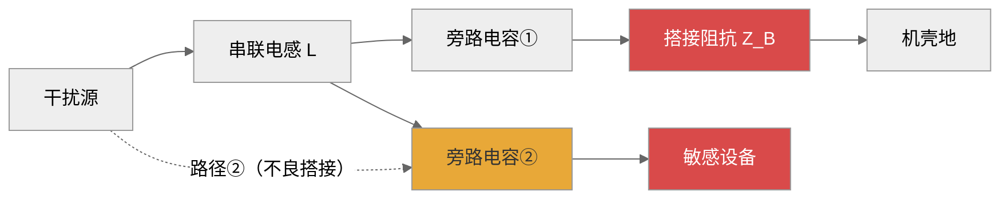
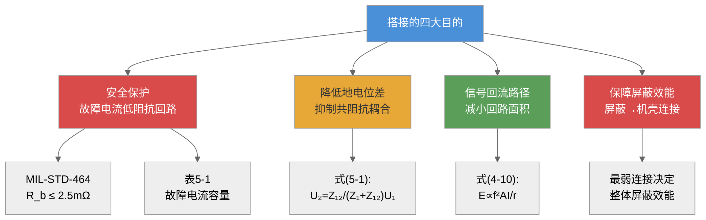
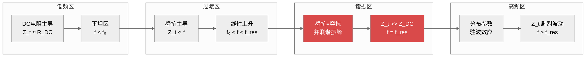
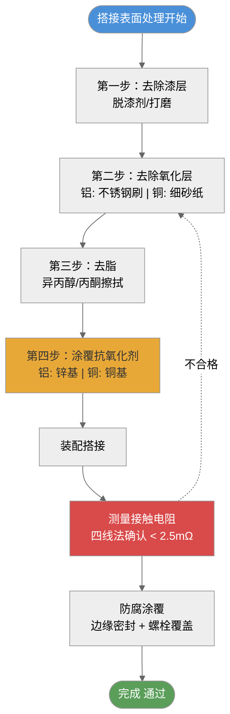

# 第五章 搭接技术

## 内容提要

搭接（Bonding）是电磁兼容设计的基石之一。在电磁兼容工程中，无论是接地、屏蔽还是滤波，每一种抑制技术的效果最终都取决于"连接是否可靠"——这个连接就是搭接。一个设计再完美的滤波器，如果其接地端通过一段高阻抗的导线连接到机壳，那么它的插入损耗可能在10 MHz以上完全丧失。同样，屏蔽体的屏蔽效能再高，如果屏蔽体与机壳之间的搭接阻抗过高，整体屏蔽效能也会被这个搭接点所决定。

本章系统性地介绍搭接技术的各个方面：从搭接的概念和分类出发（5.1节），介绍工程中常用的典型搭接结构（5.2节），然后重点讨论搭接有效性的定量分析方法（5.3节），包括DC搭接电阻的组成、射频电阻的频率特性、转移阻抗和四线法测试。本章还将从路宏敏、张亮和梁振光等多本经典教材中提取工程经验值、典型结构总览和定量分析工具。最后讨论搭接实施中的工程问题（5.4节），包括电化学腐蚀、表面清理、防腐涂覆和加工方法。通过本章的学习，读者应能独立完成工程中的搭接设计和质量评估。

通过本章学习，读者应达成以下学习目标：

1. 理解搭接的概念和在EMC三大技术（接地、屏蔽、滤波）中的基础地位
2. 掌握搭接的三种分类维度（直接/间接、永久/半永久/可拆卸、不同金属组合）
3. 熟悉典型搭接结构及其工程应用场景，能识别20种常见搭接类型
4. 掌握搭接阻抗的频率特性计算（直流电阻、射频电阻、感抗、转移阻抗）
5. 理解射频电阻与直流电阻的差异，能计算集肤效应下的搭接电阻
6. 掌握故障电流容量分析，能按故障电流选择螺栓规格
7. 理解电化学腐蚀的机理和抑制措施，能正确选择搭接金属组合
8. 掌握搭接表面处理的标准流程和防腐涂覆的要求
9. 掌握搭接质量测试的方法和判据，理解四线法和高频测试的原理

---

## 5.1 搭接及其分类

### 5.1.1 搭接的概念

**搭接（Bonding）** 是指两个或多个金属导体之间人为建立的**低阻抗电气连接**，其目的是为电流（包括信号电流、骚扰电流、故障电流、雷电流等）提供一个低阻抗的流通路径。在电磁兼容工程中，搭接是实现接地、屏蔽、滤波等干扰抑制措施的共同前提——没有良好的搭接，任何干扰抑制技术都无从谈起。

这个定义中的三个关键词需要特别关注：

**"低阻抗"**——搭接不是普通的电气连接。一段导线随意地拧在机壳上也是一种"连接"，但这种连接在DC下可能只有几毫欧，在10 MHz下阻抗可能上升到数十欧姆——这就不是"低阻抗搭接"了。工程上要求搭接阻抗必须远低于所涉及回路中的其它阻抗，通常要求DC电阻小于2.5 mΩ（MIL-STD-464要求），特殊场合（如防雷搭接）要求小于1 mΩ。

**"人为建立"**——搭接是设计的一部分，不是偶然形成的。两片金属简单地接触在一起并不构成一个可靠的搭接——因为接触面可能存在氧化层、油污、漆层等绝缘物，导致接触电阻不是金属本身电阻而是通过极窄的接触点形成的收缩电阻。

**"金属导体之间"**——搭接的对象是金属与金属。如果需要连接的部件是非金属（如塑料机壳），则需要先嵌入金属嵌件或金属箔，再通过该金属件搭接。

从第4章的耦合理论来看，搭接的本质就是降低公共阻抗 $Z_{12}$。回顾第4章式(4-1)——共阻抗耦合公式：

$$
U_2 = \frac{Z_{12}}{Z_1 + Z_{12}} U_1
\tag{5-1}
$$

如果公共阻抗 $Z_{12}$ 足够小（理想情况下趋于零），那么耦合电压 $U_2$ 也趋于零。这就是搭接的根本目的——通过提供一个尽可能低的公共阻抗，将共阻抗耦合降低到可忽略的水平。

#### 不良搭接的典型案例：滤波器失效

不良搭接对EMC措施的影响最为典型的表现之一，就是使精心设计的滤波器完全失效。下面以$\pi$形滤波器为例说明这一问题。$\pi$形滤波器由两个旁路电容$C$和一个串联电感$L$组成。按照设计意图，高频干扰电流应通过旁路电容$C$经机壳搭接点流入大地（预期路径①），不会到达敏感设备。然而，当搭接不良时，搭接阻抗$Z_B = R_B + j\omega L_B$增大到一定程度后，干扰电流不再走低阻抗的路径①，而是绕过电感通过后一级电容（路径②）直接到达敏感设备——此时$\pi$形滤波器实际上退化为一个电容分压器，两个旁路电容将电感旁路，使电感完全失去衰减作用。

假设搭接阻抗$Z_B$与后一级电容$C$的容抗$1/(j\omega C)$形成并联分压：

$$
U_{\text{load}} = U_{\text{noise}} \cdot \frac{Z_B}{Z_B + 1/(j\omega C)}
\tag{5-2}
$$

当$|Z_B| \ll 1/(\omega C)$时，大部分干扰电流通过搭接路径流入机壳，滤波器正常工作；当$|Z_B| \gg 1/(\omega C)$时，干扰电流被迫通过后一级电容流入负载，滤波器实效。因此，**滤波器的接地搭接阻抗必须远小于其旁路电容的容抗**，这是滤波器工程安装的核心规则之一。

对于$\Gamma$形滤波器（仅一个旁路电容+串联电感），情况会相对好一些——因为即使搭接阻抗较大，串联电感仍能起到一定的衰减作用。而对于$\pi$形滤波器，搭接质量直接决定了滤波器的实际抑制效果。这一结论对工程实践有重要指导意义：在高频滤波要求严格的场合，$\pi$形滤波器的接地搭接点必须经过特别设计和检验，必要时采用焊接搭接而非螺栓连接。

*图5-2：搭接不良导致$\pi$形滤波器失效的路径示意图——红色路径②为不良搭接下的干扰电流绕过路径*

### 5.1.2 搭接的目的

搭接在电磁兼容设计中服务于以下四个主要目的：

**目的一：建立安全保护的低阻抗通路**

当设备发生故障（如电源线绝缘破损导致机壳带电）时，搭接为故障电流提供了一个低阻抗回路，使保护装置（熔断器、断路器）能够迅速动作切断电源。这一目的是搭接最原始、最基本的功能。

根据欧姆定律，故障电流 $I_f$ 与搭接电阻 $R_b$ 的关系为：

$$
I_f = \frac{U_{\text{phase}}}{R_b + R_{\text{source}}}
\tag{5-3}
$$

式中，$U_{\text{phase}}$ 为电源相电压（220 V AC），$R_b$ 为搭接电阻，$R_{\text{source}}$ 为电源内阻及线路电阻之和。

以MIL-STD-464要求的 $R_b \le 2.5$ mΩ为例，在220 V系统中，$R_{\text{source}}$ 通常为0.1~0.5Ω，故障电流 $I_f = 220 / (0.0025 + 0.1) \approx 2,147$ A——足以使额定电流100 A的断路器在数十毫秒内跳闸。

**搭接点的故障电流容量**是安全设计中必须考虑的另一个关键参数。当大电流通过搭接点时，如果搭接点的电流容量不足，该点将发热成为"热点"（hot spot），严重时可使搭接点达到白炽温度，导致附近金属熔化甚至引燃易燃气体。表5-1给出了不同故障电流下搭接电阻的最大允许值及螺栓直径的最小要求。

**搭接电阻按用途分级体系**：柯金良《电磁兼容概论》从应用场景出发，给出了搭接电阻的按用途分级标准：

- **飞行器/军用设备搭接**：DC电阻 ≤ **2.5 mΩ**（与MIL-STD-464一致），适用于航天器、舰船等对电磁兼容要求极高的系统
- **信号回路/安全保护搭接**：DC电阻 ≤ **50 mΩ**，适用于一般工业设备的保护接地和信号回路
- **静电泄放搭接**：DC电阻 ≤ **50 kΩ**，仅用于静电电荷泄放，不要求低阻抗传导

这一分级体系揭示了搭接电阻要求与搭接用途之间的对应关系：承受故障电流的搭接要求最低电阻（2.5 mΩ），仅需泄放静电的搭接允许较高的电阻（50 kΩ），而信号回路和安全保护的要求介于两者之间（50 mΩ）。柯金良特别指出，实现1 mΩ量级的高质量搭接需要两个条件：**表面清洁至露出金属光泽** + **足够的接触压力**，缺一不可。

**表5-1：不同故障电流下的搭接电阻要求与螺栓直径**

| 故障电流 (A) | 最大允许搭接电阻 (mΩ) | 螺栓最小直径 (mm) | 应用场景 |
|:------------:|:--------------------:|:----------------:|:---------|
| 100 | 2.5 | 6.5 (M6) | 小型设备接地 |
| 500 | 0.5 | 8.0 (M8) | 机柜接地 |
| 1,000 | 0.25 | 10 (M10) | 大型设备接地 |
| 5,000 | 0.05 | 16 (M16) | 工业配电系统 |
| 10,000 | 0.025 | 20 (M20) | 主接地排、防雷系统 |

表中数据基于路宏敏《工程电磁兼容》中故障电流与最大允许电阻的关系曲线（图7-3），安全裕量取2倍。需要特别注意的是，当搭接点处于易燃易爆环境时，允许的搭接电阻还需要降低1~2个数量级——因为即使微小的火花也足以引燃周围的可燃气体。

**目的二：降低地电位差，抑制共阻抗耦合**

当多个电路或设备共享一个接地系统时（如一个机柜内的多块电路板、一艘舰船上的多个电子系统），各个电路的工作电流都会流经公共接地导体。如果搭接不良，接地导体的阻抗过高，各电路的地电位就不再相等——这就是"地电位差"问题。地电位差是共阻抗耦合的直接体现，会导致逻辑误触发、模拟信号失真甚至设备损坏。

**目的三：提供信号回流的低阻抗路径**

高速数字电路中，信号电流的回流路径必须经过地平面或参考导体。如果回流路径上的搭接点阻抗过高，回流电流会寻找其他路径（如穿过电源层、通过连接器引脚返回），形成大的信号回路面积，从而产生第4章式(4-10)描述的环路天线辐射。

**目的四：保障屏蔽效能的完整**

屏蔽体的屏蔽效能最终取决于屏蔽体与设备机壳之间的搭接质量。一个理想的屏蔽体和一个理想的机壳之间如果有一个高阻抗的搭接点，那么整个屏蔽体的屏蔽效能就被这个点所决定——这一点可以用第4章讨论的耦合唯一定理来理解：屏蔽效能被最弱的连接点所决定。

*图5-3：搭接的四大目的及其理论基础*

### 5.1.3 搭接的分类

#### 按连接方式分类

**（1）直接搭接（Direct Bonding）**

直接搭接是指两个金属部件通过直接接触（使用螺栓、铆钉、焊接等方式）形成电气连接，不经过中间过渡导体。

**优点**：电阻最低、可靠性最高、无额外电感引入
**缺点**：要求两个部件的材料电化学兼容、表面处理要求高

**（2）间接搭接（Indirect Bonding）**

间接搭接是指通过搭接条、搭接片、铜编织带等中间导体将两个部件连接起来。

**优点**：便于安装和拆卸、不要求两部件直接接触
**缺点**：引入了中间导体（增加了电感和接触电阻），高频性能降低

#### 按可拆卸性分类

| 类型 | 方式 | 特点 | DC电阻典型值 | 适用场景 |
|:-----|:-----|:-----|:------------:|:---------|
| **永久搭接** | 焊接、钎焊、铆接 | 不可拆卸，最可靠 | < 0.1 mΩ | 接地极连接、屏蔽体拼接 |
| **半永久搭接** | 压接、冷焊 | 可破坏性拆卸 | 0.1~0.5 mΩ | 电缆屏蔽层端接、汇流条 |
| **可拆卸搭接** | 螺栓连接、弹簧夹 | 可维护拆卸 | 0.5~5 mΩ | 机箱面板、模块连接 |

#### 按金属组合分类

**（1）同种金属搭接**：铝-铝、铜-铜。无电化学腐蚀问题，但铝表面有天然氧化层，需要在搭接前清理。

**（2）异种金属搭接**：铜-铝、铜-钢、铝-钢等。存在电化学腐蚀风险，需要根据电化学序列选择相容的金属组合。异种金属间的接触电位差越大，腐蚀风险越高。

### 5.1.4 搭接与接地的关系

搭接和接地是EMC工程中两个密切关联但又有本质区别的概念：

- **接地（Grounding）** ：建立一个低阻抗参考电位面的概念
- **搭接（Bonding）** ：实现该参考电位面的物理手段

用一句话概括：**接地是目标，搭接是手段。** 没有搭接，接地只是一个概念；没有接地设计，搭接就没有明确的目标。

**表5-2：搭接与接地的对比**

| 对比维度 | 搭接 | 接地 |
|:---------|:-----|:-----|
| 本质 | 导体间的低阻抗连接技术 | 建立参考电位的方法 |
| 连接对象 | 金属导体 ↔ 金属导体 | 电路 ↔ 地（大地或基准导体） |
| 关注重点 | 接触电阻、电化学兼容、机械强度 | 接地拓扑（单点/多点）、地环路 |
| 质量标准 | DC电阻、转移阻抗 | 接地电阻、地电位差 |
| 工程关联 | 接地依赖搭接来实现 | 搭接服务于接地的目标 |
| 典型问题 | 腐蚀导致电阻上升 | 地环路导致共模干扰 |

在实际工程中，这两个概念经常同时出现。例如，"将滤波器的接地端通过搭接条连接到机壳"这句话同时包含了接地（滤波器接地端需要基准电位）和搭接（通过搭接条实现低阻抗连接）两个概念。

*设问过渡：理解了搭接的概念和分类后，一个自然的问题是：在实际工程中，搭接应该做成什么样的？哪些结构是经过工程验证的可靠形式？下一节将通过典型的搭接结构来回答这个问题。*

---

## 5.2 典型搭接结构

搭接结构的工程设计直接决定了搭接的可靠性、阻抗特性和使用寿命。本节介绍工程中常见的5种典型搭接结构，并在5.2.6节给出20种工程应用场景的结构总览。

### 5.2.1 螺栓连接（Bolted Connection）

螺栓连接是最常用的可拆卸搭接方式。它通过螺栓的预紧力将两个金属部件的接触面压紧，在接触面之间形成金属-金属的直接接触。

**设计要点**：

螺栓连接的接触电阻 $R_c$ 由收缩电阻和膜层电阻两部分组成：

$$
R_c = \frac{\rho}{2a} + \frac{\rho_d}{\pi a^2}
\tag{5-4}
$$

式中，第一项为收缩电阻：$\rho$ 为材料电阻率（Ω·m），$a$ 为接触斑点半径（m）；第二项为膜层电阻：$\rho_d$ 为表面膜层电阻率。

收缩电阻的物理机制是：即使在看似光滑的金属表面，微观上也是粗糙的——实际接触只发生在表面的微凸起（asperities）处，电流通过这些微小的接触点流动时被"收缩"到极小的截面上，从而产生额外的电阻。

**螺栓连接的工程规则**：

| 规则 | 要求 | 说明 |
|:-----|:-----|:------|
| 接触面积 | ≥ 螺栓直径的3倍 | 接触面太小→接触压力不足→电阻增大 |
| 表面处理 | 清除漆层、氧化层 | 漆层是绝缘体，必须在接触区清除 |
| 防松措施 | 弹簧垫圈+防松胶 | 振动会导致螺栓松动→接触压力下降→电阻增大 |
| 扭矩控制 | 按标准扭矩拧紧 | 扭矩不足→接触电阻大；扭矩过大→螺纹损坏 |
| 电化学防护 | 搭接后涂覆密封胶 | 防止潮气渗入接触面导致腐蚀 |
| 接触面数量 | 尽量少（≤2个） | 每增加一个接触面，总电阻增加一个收缩电阻 |

**表5-3：不同螺栓直径的推荐扭矩和预期接触电阻**

| 螺栓直径 | 推荐扭矩（N·m） | 预期DC接触电阻（铜-铜） |
|:--------:|:---------------:|:---------------------:|
| M4 | 2.0~3.0 | 0.1~0.5 mΩ |
| M6 | 5.0~8.0 | 0.05~0.2 mΩ |
| M8 | 10~15 | 0.03~0.1 mΩ |
| M10 | 20~30 | 0.02~0.05 mΩ |

**例5-1**：两个铜部件使用M8螺栓搭接，接触面积为30 mm × 30 mm，表面清理干净后涂覆防氧化剂。螺栓以12 N·m扭矩拧紧。试计算该搭接的DC接触电阻。

解：对于清理干净的铜-铜接触，膜层电阻可以忽略，收缩电阻近似为：

$$
R_c \approx \frac{\rho_{\text{Cu}}}{2a}
\tag{5-5}
$$
式中，$\rho_{\text{Cu}} = 1.72\times 10^{-8}$ Ω·m，接触斑点半径 $a$ 与接触压力和材料硬度有关。对于M8螺栓以12 N·m拧紧，预紧力约为15 kN，铜的布氏硬度约为100 HB。经验估算下，有效接触斑点半径为 $a \approx 0.5$ mm。

因此：

$$
R_c \approx \frac{1.72\times 10^{-8}}{2 \times 0.5\times 10^{-3}} \approx 1.72\times 10^{-5} \ \Omega \approx 0.017\ \text{mΩ}
\tag{5-6}
$$

这个值远小于MIL-STD-464要求的2.5 mΩ，说明一个良好实施的M8螺栓搭接完全满足要求。

### 5.2.2 焊接连接（Welded Connection）

焊接是最可靠的永久搭接方式。熔焊（如TIG焊、MIG焊）可以直接将两个金属部件熔合在一起，形成冶金结合的连续导体。

**焊接搭接的阻抗特性**：由于没有接触面，焊接连接的DC电阻就是同体积金属本身的电阻，没有收缩电阻和膜层电阻。这是所有搭接方式中阻抗最低的形式。

**不同焊接方式的特点**：

| 焊接方式 | 适用金属 | 优点 | 缺点 | 典型DC电阻 |
|:---------|:---------|:-----|:-----|:----------:|
| TIG焊（钨极氩弧焊） | 铝、不锈钢、铜 | 质量最高、无飞溅 | 速度慢、需要熟练工 | < 0.01 mΩ |
| MIG焊（熔化极气体保护焊） | 钢、铝 | 速度快、适合批量 | 飞溅较多 | < 0.01 mΩ |
| 点焊 | 薄板（< 3 mm） | 速度快、变形小 | 只适用于薄板 | 0.01~0.1 mΩ |
| 钎焊（锡焊） | 铜、铜合金 | 温度低、易于操作 | 强度低、熔点低 | 0.1~0.5 mΩ |

### 5.2.3 铆接连接（Riveted Connection）

铆接是一种半永久搭接方式，通过铆钉的塑性变形使两个部件紧密连接。在航空航天和军用设备中，铆接被广泛使用。

**铆接的优点**：不需要加热（避免热变形）；不需要螺纹（适合薄板）；可靠性高（耐振动）。

**铆接的工程规则**：
- 铆钉材料应与被连接材料电化学兼容
- 铆钉间距一般为铆钉直径的3~5倍
- 铆钉距离部件边缘至少为铆钉直径的1.5倍

### 5.2.4 搭接条连接（Bonding Strap）

搭接条是最常见的间接搭接方式。它使用柔性铜编织带或铜片作为中间导体，连接两个需要保持相对运动或不能直接接触的部件。

**搭接条的设计规则**（最重要的规则）：

> **关键规则**：搭接条的长度与宽度之比应小于5:1，即 $L/W \le 5$。

这一规则的物理依据是：搭接条不仅仅是电阻，它在高频下的**电感**起主导作用。根据导线电感公式，一根长为 $L$、直径为 $d$ 的圆导线的自感为：

$$
L_{\text{w}} \approx 0.2 L \left[ \ln\left(\frac{4L}{d}\right) - 0.75 \right] \ \text{nH}
\tag{5-7}
$$

而对于扁平搭接条（宽度 $W$，厚度 $t$，$W \gg t$），其单位长度电感近似为：

$$
L_{\text{strap}} \approx \frac{\mu_0 L}{2\pi} \left[ \ln\left(\frac{2L}{W}\right) + 0.5 \right] \ \text{H}
\tag{5-8}
$$

式中，$L$ 为搭接条长度（m），$W$ 为宽度（m），$\mu_0 = 4\pi \times 10^{-7}$ H/m。从式(5-8)可以看出，搭接条的宽度 $W$ 越大、长度 $L$ 越短，电感越低。这就是 $L/W \le 5$ 规则的物理基础。

**工程经验值**：在电磁兼容工程中，常用"导线电感约为1 μH/m"的经验值进行快速估算。这一经验值适用于直径1~3 mm的圆导线。需要注意的是，当导线较长（> 1 m）时，导线的粗细对阻抗的影响不明显——阻抗主要取决于导线电感。此时，导体的截面形状对电感的影响也不大。因此，**对于长距离搭接，片面增加导体的截面积并不能有效降低阻抗**，缩短路径长度才是关键。

关于长宽比的要求，不同资料给出的数值略有差异：路宏敏《工程电磁兼容》要求 $L/W \le 5$，而张亮《电磁兼容技术及应用实例详解》指出当搭接导体较短时金属带（长宽比 < 4）的阻抗明显低于金属线。这种差异源于两者关注频率范围的不同——张亮的经验值（$L/W < 4$）更适用于更高频率（100 MHz以上）的场景。在实际工程中，建议遵循**越短越宽越好**的原则，取 $L/W \le 4$ 作为设计目标，$L/W \le 5$ 作为接受下限。

**例5-2**：比较一根圆形导线（长20 cm，直径2 mm）和一根扁平铜编织带（长20 cm，宽4 cm，厚0.5 mm）在10 MHz下的阻抗。

解：

（a）圆形导线的电感（由式5-7，长度单位mm）：

$$
L_{\text{w}} \approx 0.2 \times 200 \times [\ln(4\times 200/2) - 0.75] = 40 \times [\ln 400 - 0.75] = 40 \times [5.99 - 0.75] \approx 210 \ \text{nH}
\tag{5-9}
$$

感抗：$X_L = 2\pi \times 10^7 \times 210 \times 10^{-9} \approx 13.2 \ \Omega$

DC电阻：$R_{\text{DC}} = 1.72\times 10^{-8} \times 0.2 / (\pi \times 10^{-6}) \approx 1.1 \ \text{m}\Omega$

**10 MHz下总阻抗约为13.2 Ω**——完全由感抗主导，DC电阻可以忽略。

（b）扁平搭接条的电感（由式5-8）：

$$
L_{\text{strap}} \approx \frac{4\pi \times 10^{-7} \times 0.2}{2\pi} \left[ \ln\left(\frac{2 \times 0.2}{0.04}\right) + 0.5 \right] = 4\times 10^{-8} \times [\ln 10 + 0.5] \approx 1.12 \times 10^{-7} \ \text{H} = 112 \ \text{nH}
\tag{5-10}
$$

感抗：$X_L = 2\pi \times 10^7 \times 112 \times 10^{-9} \approx 7.0 \ \Omega$

**对比**：扁平编织带的阻抗（7.0 Ω）仅为圆形导线（13.2 Ω）的**53%**——这正是搭接条设计规则要求 $L/W \le 5$ 的原因：宽而短的搭接条比细而长的导线在高频下阻抗低得多。

**例5-3**：如果将上例中的搭接条长度从20 cm缩短到5 cm（保持宽度4 cm不变），计算其在10 MHz下的阻抗。

解：

$$
L_{\text{short}} \approx 4\times 10^{-8} \times \frac{0.05}{0.2} \times \left[ \ln\left(\frac{2 \times 0.05}{0.04}\right) + 0.5 \right] = 1\times 10^{-8} \times [\ln 2.5 + 0.5] \approx 14.2 \ \text{nH}
\tag{5-11}
$$

感抗：$X_L = 2\pi \times 10^7 \times 14.2 \times 10^{-9} \approx 0.89 \ \Omega$

**结论**：同样的搭接条，长度从20 cm缩短到5 cm，10 MHz下的阻抗从7.0 Ω降低到0.89 Ω——降低了约8倍。**搭接条最重要的设计原则：在满足安装要求的前提下，尽可能地短。**

### 5.2.5 导电衬垫与接地电刷

在某些特殊场景中，螺栓或焊接无法使用。例如，机箱面板需要频繁开合（屏蔽门、检修盖板）或需要在旋转部件与固定部件之间建立搭接（雷达天线座、转台）。

**导电衬垫（Conductive Gasket）** ：在面板与机箱之间使用弹性导电衬垫，通过面板闭合时的压力使衬垫变形，形成连续的低阻抗连接。常见材料包括：金属丝网填充橡胶、导电橡胶（银/铜/镍填充硅橡胶）、金属螺旋管屏蔽条（如Spira）。

**接地电刷（Grounding Brush）** ：在旋转部件与固定部件之间使用导电刷（铜合金刷丝或碳刷），通过刷丝与接触面的弹性接触建立低阻抗连接。

### 5.2.6 典型搭接结构总览（路宏敏20例）

路宏敏《工程电磁兼容》第7章中总结了20种工程中常见的典型搭接结构，覆盖了从设备级到系统级的主要搭接场景。以下将其按应用场景分类列出。

```mermaid
%%{init: {"flowchart": {"useMaxWidth": false}, "theme": "neutral"}}%%
graph TB
    TITLE["20种典型搭接结构"] --> A["金属板搭接"]
    TITLE --> B["电缆/导线搭接"]
    TITLE --> C["连接器搭接"]
    TITLE --> D["管道搭接"]
    TITLE --> E["机箱/机架搭接"]
    TITLE --> F["活动部件搭接"]
    
    A --> A1["① 两金属体螺栓搭接"]
    A --> A2["② 搭接线与金属构件<br>螺栓/铆钉连接"]
    A --> A3["⑩ 两种金属构件<br>螺栓连接"]
    
    B --> B1["③ 屏蔽电缆搭接"]
    B --> B2["④ 一束电缆卡箍<br>与金属结构搭接"]
    
    C --> C1["⑤ 连接器与<br>屏蔽电缆搭接"]
    C --> C2["⑥ 连接器座与<br>机箱壳体搭接"]
    
    D --> D1["⑦ 金属管道搭接"]
    D --> D2["⑧ 两根管道<br>衔接处搭接"]
    
    E --> E1["⑭ 设备外壳与<br>基本结构搭接"]
    E --> E2["⑮ 安装支架上<br>设备搭接"]
    E --> E3["⑯ 机箱与电缆<br>托架搭接"]
    E --> E4["⑰ 机壳法兰盘<br>与机架搭接"]
    E --> E5["⑱ 设备机箱之间<br>及与接地格栅搭接"]
    E --> E6["⑲ 机箱通过机架<br>导向轴搭接"]
    E --> E7["⑳ 机架内部搭接"]
    
    F --> F1["⑨ 活动铰链搭接"]
    F --> F2["⑪ 活动摇杆搭接"]
    F --> F3["⑫ 两个活动<br>部件搭接"]
    F --> F4["⑬ 减震器搭接"]
    
    style TITLE fill:#4a90d9,color:#fff
    style A fill:#5a9e5a,color:#fff
    style B fill:#d94a4a,color:#fff
    style C fill:#e8a838,color:#333
    style D fill:#9b59b6,color:#fff
    style E fill:#1abc9c,color:#fff
    style F fill:#e67e22,color:#fff
```

*图5-4：路宏敏20种典型搭接结构分类总览*

### 5.2.7 搭接网络结构：星形、网格与复合

以上讨论的都是组件级别的搭接方式。在系统级别，面对包含多个设备、多条互连线的复杂系统，如何组织搭接线的拓扑结构成为一个关键问题。柯金良《电磁兼容概论》§5.9从系统结构层面给出了三种基本的搭接网络形式：**星形结构**、**网格结构**和**复合结构**。这是其他三本教材未涉及的系统级视角。

**（1）星形结构（Star Configuration）**

在星形结构中，所有电气和电子设备的金属部件与接地系统隔离，只在**一点**接地（接地参考点ERP）。所有设备的搭接线以星形方式汇集到该参考点。柯金良指出，星形等电位搭接结构适用于**所有线路在一点进入的小范围内**的电气及电子设备的搭接。

关键设计规则：
- 所有连线应与搭接线平行布置，防止地回路形成
- 各设备到ERP的路径避免重叠，防止公共阻抗耦合
- 适用于低频（< 1 MHz）、设备间距小、互连线少的系统

**（2）网格结构（Mesh Configuration）**

在网格结构中，所有电气和电子设备的金属部件不必与接地系统隔离，而是**多点与接地网络连接**，形成网格布置的搭接网络。柯金良指出，网格等电位搭接结构可以降低电流流过接地带时产生的空间电磁场。

关键设计规则：
- 网格宽度典型值为 **5 m**（建筑物等电位搭接）
- 适用于**大范围**的电气及电子设备搭接
- 适合设备之间有很多连接线路的场合
- 高频性能优于星形结构

**（3）复合结构（Combined Configuration）**

对于复杂的系统，可以综合采用星形和网格两种搭接网络方式，构成复合搭接网络。例如，将一些设备分组，组内采用星形结构连接到一个局部ERP，而各组的ERP再通过网格结构互联。柯金良§5.9.2给出了复合搭接网络的几种组合方式（星形布置的星形搭接网组 Sₛ、网格布置的网格搭接网组 Mₘ、星形布置的网格搭接网组 Mₛ）。

**搭接网络结构的选型原则：**

| 结构类型 | 适用系统规模 | 适用频率 | 地环路风险 | 典型应用 |
|:--------|:------------|:--------:|:---------:|:---------|
| 星形 | 小（单机柜内） | DC~1 MHz | 低 | 单机柜设备、测试系统 |
| 网格 | 大（全楼、全站） | DC~GHz | 中 | 建筑物接地网、变电站接地 |
| 复合 | 中-大（多机柜） | DC~MHz | 低-中 | 大型电子系统、通信基站 |

*设问过渡：搭接网络提供了系统级的结构框架。但无论采用哪种网络形式，搭接有效性的定量评价始终是设计中的核心问题——下一节将系统讨论搭接的DC电阻、射频电阻和转移阻抗分析方法。*

**类别一：金属板搭接（3种）**

| 序号 | 搭接场景 | 推荐方法 | 关键要点 |
|:----:|:---------|:---------|:---------|
| 1 | 两块金属体用螺栓搭接 | 螺栓连接 | 接触面积 ≥ 螺栓直径3倍；清理表面至露出金属光泽 |
| 2 | 搭接线与金属构件用螺栓或铆钉连接 | 螺栓/铆钉 | 搭接线端部使用压接端子；铆钉材料需电化学兼容 |
| 10 | 两种金属构件用螺栓连接 | 螺栓（异种金属） | 必须使用过渡垫片或镀层；注意电化学兼容 |

**类别二：电缆/导线搭接（2种）**

| 序号 | 搭接场景 | 推荐方法 | 关键要点 |
|:----:|:---------|:---------|:---------|
| 3 | 屏蔽电缆的搭接 | 360°环绕压接或焊接 | 避免"猪尾线"效应；屏蔽层端接长度 < 1/20波长 |
| 4 | 一束电缆用卡箍与金属结构搭接 | 卡箍紧固 | 卡箍材料与电缆屏蔽层电化学兼容；卡箍接触面宽 > 5 mm |

**类别三：连接器搭接（2种）**

| 序号 | 搭接场景 | 推荐方法 | 关键要点 |
|:----:|:---------|:---------|:---------|
| 5 | 连接器与屏蔽电缆的搭接 | 焊接或压接 | 连接器后壳与屏蔽层360°端接；绝缘层剥离长度精确控制 |
| 6 | 连接器座与机箱壳体的搭接 | 导电衬垫或齿形垫圈 | 连接器法兰与机箱之间大面积面接触；必要时加装导电衬垫 |

**类别四：管道搭接（2种）**

| 序号 | 搭接场景 | 推荐方法 | 关键要点 |
|:----:|:---------|:---------|:---------|
| 7 | 金属管道的搭接 | 跨接片或铜编织带 | 管道连接法兰两侧用跨接片导通；跨接片L/W ≤ 5 |
| 8 | 两根管道衔接处的搭接 | 柔性编织带 | 螺纹连接处可能导电不良，需额外跨接 |

**类别五：活动部件搭接（5种）**

| 序号 | 搭接场景 | 推荐方法 | 关键要点 |
|:----:|:---------|:---------|:---------|
| 9 | 活动铰链的搭接 | 铜编织带跨接 | 铰链本身不保证导电连续性；必须使用柔性跨接带 |
| 11 | 活动摇杆的搭接 | 柔性搭接条 | 预留长度裕量防止疲劳断裂 |
| 12 | 两个活动部件的搭接 | 接地电刷或编织带 | 优先使用编织带（电流容量大）；电刷用于高速旋转 |
| 13 | 减震器的搭接 | 铜编织带 | 减震器橡胶/弹簧不导电；必须有独立的搭接通路 |

**类别六：机箱/机架搭接（6种）**

| 序号 | 搭接场景 | 推荐方法 | 关键要点 |
|:----:|:---------|:---------|:---------|
| 14 | 设备外壳与基本结构搭接 | 螺栓+齿形垫圈 | 接触面清除漆层；使用导电膏 |
| 15 | 安装支架上设备的搭接 | 搭接条 | 支架与设备之间使用短而宽的搭接条 |
| 16 | 机箱与电缆托架的搭接 | 螺栓或焊接 | 托架必须与机箱等电位；每段托架之间搭接 |
| 17 | 机壳法兰盘与机架的搭接 | 螺栓+导电衬垫 | 法兰盘接触面 > 10 mm宽；衬垫压缩量 25%~50% |
| 18 | 设备机箱之间以及与接地格栅的搭接 | 铜编织带 | 机箱间距 < 1 m时，L/W ≤ 5；间距 > 1 m时，加粗编织带截面 |
| 19 | 设备机箱通过机架导向轴搭接 | 导电滑轨 | 滑轨接触面镀银或镀金；定期清洁润滑 |
| 20 | 机架内部的搭接 | 接地排或汇流条 | 机架内各设备通过接地排统一搭接 |

*设问过渡：上述典型搭接结构中，搭接条的几何尺寸对其高频阻抗有决定性影响。那么，在工程中如何定量评估一个搭接结构是否"足够好"？这涉及到搭接有效性的定量分析方法——下一节将详细介绍搭接阻抗的计算和测试方法。*

---

## 5.3 搭接有效性

搭接有效性的核心评价指标有三个：**DC搭接电阻**、**射频电阻**和**转移阻抗**。本节从DC特性开始，逐步深入到高频特性，最后讨论搭接质量的工程测量方法。

### 5.3.1 DC搭接电阻

DC搭接电阻 $R_b$ 是衡量搭接质量的最基本指标。它由三部分串联而成：

$$
R_b = R_{\text{conductor}} + R_{\text{contact}} + R_{\text{constriction}}
\tag{5-12}
$$

式中，$R_{\text{conductor}}$ 为搭接导体的体电阻（Ω），$R_{\text{contact}}$ 为接触面的膜层电阻（Ω），$R_{\text{constriction}}$ 为接触面的收缩电阻（Ω）。

**导体体电阻**由材料的电阻率和几何尺寸决定：

$$
R_{\text{conductor}} = \frac{\rho L}{A}
\tag{5-13}
$$

式中，$\rho$ 为电阻率（Ω·m），$L$ 为导电路径长度（m），$A$ 为导体的有效截面积（m²）。

**收缩电阻**来自接触面的微观形貌。两个金属表面的真实接触面积仅为表观接触面积的1%~0.01%（取决于表面粗糙度和接触压力）。电流通过这些微小的实际接触点时，电流线被"收缩"，等效于一个额外的串联电阻。收缩电阻的理论公式为：

$$
R_{\text{constriction}} = \frac{\rho_1 + \rho_2}{4a}
\tag{5-14}
$$

式中，$\rho_1$、$\rho_2$ 为两种金属的电阻率，$a$ 为等效接触斑点半径（m）。

**膜层电阻**来自金属表面的氧化物、硫化物或其他污染层。膜层电阻是接触电阻中最不稳定、最不可预测的部分——因为它会随着时间、温度、湿度和振动条件的变化而剧烈变化。

**例5-4**：一根铜-铜搭接，接触面经打磨清理后以螺栓压紧，接触压力使得有效接触斑点半径 $a = 0.3$ mm。计算收缩电阻。如果该搭接班表面未经清理而存在1 μm厚的氧化铜膜（电阻率 $\rho_{\text{CuO}} \approx 10^6$ Ω·m），膜层的电阻又是多少？

解：

收缩电阻：$\rho_{\text{Cu}} = 1.72\times 10^{-8}$ Ω·m，$\rho_1 = \rho_2 = \rho_{\text{Cu}}$

$$
R_{\text{constriction}} = \frac{1.72\times 10^{-8} + 1.72\times 10^{-8}}{4 \times 0.3\times 10^{-3}} = \frac{3.44\times 10^{-8}}{1.2\times 10^{-3}} \approx 2.87\times 10^{-5} \ \Omega \approx 0.029 \ \text{mΩ}
\tag{5-15}
$$

膜层电阻（假设氧化膜厚度 $d = 1$ μm，接触面积为整个螺栓面积 $A_{\text{bolt}} \approx 50$ mm²）：

根据膜层电阻公式 $R_{\text{film}} = \rho_d d / A_{\text{bolt}}$，代入条件得：

$$
R_{\text{film}} = \frac{\rho_d d}{A_{\text{bolt}}} = \frac{10^6 \times 1\times 10^{-6}}{50\times 10^{-6}} = \frac{1}{50\times 10^{-6}} = 20,000 \ \Omega
\tag{5-16}
$$

**对比**：清理表面后收缩电阻仅0.029 mΩ；不清理表面，氧化膜电阻高达20 kΩ——相差近10亿倍。这充分说明了搭接表面清理的极端重要性。

### 5.3.2 射频电阻与集肤效应

DC搭接电阻只是搭接有效性的一个方面。随着频率升高，集肤效应使电流集中在导体表面，有效导电截面积减小，搭接电阻显著增大。对于高频搭接，需要用**射频电阻**来评价。

对于圆形截面的搭接导体，当频率为 $f$ 时，集肤深度 $\delta$ 为：

$$
\delta = \sqrt{\frac{2\rho}{\omega\mu}} = \sqrt{\frac{\rho}{\pi f \mu}}
\tag{5-17}
$$

式中，$\rho$ 为电阻率（Ω·m），$\omega = 2\pi f$ 为角频率（rad/s），$\mu$ 为磁导率（H/m，对非磁性材料 $\mu = \mu_0 = 4\pi \times 10^{-7}$ H/m）。

当集肤深度 $\delta$ 远小于导体半径 $a$（$\delta \ll a$）时，射频电阻 $R_{\text{s}}$ 的表达式为：

$$
R_{\text{s}} = \frac{\rho l}{2\pi a \delta} = \frac{\rho l}{2\pi a} \sqrt{\frac{\pi f \mu}{\rho}} = \frac{l}{2a} \sqrt{\frac{\rho f \mu}{\pi}}
\tag{5-18}
$$

式中，$l$ 为导体长度（m），$a$ 为导体半径（m）。

将射频电阻与直流电阻 $R_{\text{DC}} = \rho l / (\pi a^2)$ 对比：

由式(5-18)和直流电阻表达式，可得两者之比为：

$$
\frac{R_{\text{s}}}{R_{\text{DC}}} = \frac{\rho l / (2\pi a \delta)}{\rho l / (\pi a^2)} = \frac{a}{2\delta}
\tag{5-19}
$$

式(5-19)表明，射频电阻与直流电阻之比等于导体半径 $a$ 与两倍集肤深度 $2\delta$ 之比。当 $\delta \ll a$ 时，射频电阻可远大于直流电阻。

**例5-5**：比较一根直径为1.29 mm的铜导线在1 MHz下的射频电阻与直流电阻。已知铜的电阻率 $\rho = 1.724 \times 10^{-8}$ Ω·m。

解：

（a）计算1 MHz下的集肤深度：

$$
\delta = \sqrt{\frac{1.724 \times 10^{-8}}{\pi \times 10^6 \times 4\pi \times 10^{-7}}} = \sqrt{\frac{1.724 \times 10^{-8}}{3.948 \times 10^{-6}}} \approx 6.61 \times 10^{-5} \ \text{m} = 0.0661 \ \text{mm}
\tag{5-20}
$$

导体半径 $a = 1.29/2 = 0.645$ mm，$a/\delta = 0.645/0.0661 \approx 9.76$——满足 $\delta \ll a$ 条件，射频电阻公式适用。

（b）直流电阻（单位长度）：

$$
R_{\text{DC}} = \frac{\rho}{\pi a^2} = \frac{1.724 \times 10^{-8}}{\pi \times (0.645 \times 10^{-3})^2} \approx 0.0132 \ \Omega/\text{m}
\tag{5-21}
$$

（c）射频电阻（单位长度）：

根据式(5-18)，代入集肤深度 $\delta = 0.0661$ mm 和导体半径 $a = 0.645$ mm，整理后得：

$$
R_{\text{s}} = \frac{\rho}{2\pi a \delta} = \frac{1.724 \times 10^{-8}}{2\pi \times 0.645 \times 10^{-3} \times 6.61 \times 10^{-5}} \approx 0.0643 \ \Omega/\text{m}
\tag{5-22}
$$

（d）比较：$R_{\text{s}} / R_{\text{DC}} = 0.0643 / 0.0132 \approx 4.87$

**结论**：在1 MHz时，该导线的射频电阻约为其直流电阻的5倍。随着频率继续升高，集肤深度进一步减小，射频电阻将继续增大。例如，在10 MHz时，$\delta$ 减小到约0.021 mm，射频电阻将进一步增大到DC电阻的约15倍。这表明，**在高频搭接中，仅凭直流电阻来评估搭接质量是严重不足的。**

**表5-4：不同频率下铜导线的集肤深度与射频电阻比（导线直径1.29 mm）**

| 频率 | 集肤深度 $\delta$ (mm) | $a/\delta$ | $R_{\text{s}}/R_{\text{DC}}$ |
|:----:|:--------------------:|:----------:|:---------------------------:|
| DC | — | — | 1.0 |
| 100 kHz | 0.209 | 3.09 | 1.54 |
| 1 MHz | 0.0661 | 9.76 | 4.87 |
| 10 MHz | 0.0209 | 30.9 | 15.4 |
| 100 MHz | 0.00661 | 97.6 | 48.7 |

路宏敏教材中还给出了搭接条电感的另一实用计算公式。对于非磁性材料圆横截面的直搭接条，电感（单位为μH）表示为：

$$
L_{\text{s}} = 0.002 l \left[ 2.303 \log\left(\frac{4l}{d}\right) - 0.75 \right] \ \mu\text{H}
\tag{5-23}
$$

式中，$l$ 为搭接条长度（cm），$d$ 为导线直径（cm）。

对于矩形横截面的直搭接条（低频下，集肤深度远大于搭接条厚度），电感为：

$$
L_{\text{s}} = 0.002 l \left( 2.303 \log\frac{2l}{b+c} + 0.5 + 0.2235\frac{b+c}{l} \right) \ \mu\text{H}
\tag{5-24}
$$

式中，$b$ 为搭接条宽度（cm），$c$ 为搭接条厚度（cm），$l$ 为长度（cm）。

在大多数工程设计中，搭接电感应不超过 $0.025\ \mu\text{H}$（25 nH）。当搭接条长度接近 $\lambda/4$ 时，搭接条将起传输线作用，产生驻波效应，此时搭接阻抗急剧恶化，需要通过缩短长度或增加宽度来抑制。

### 5.3.3 转移阻抗

对于高频搭接，DC电阻和射频电阻仍然不能完整描述其性能。要用**转移阻抗（Transfer Impedance）** $Z_t$ 来评价搭接的整体高频性能。转移阻抗定义为：流过搭接点的电流 $I$ 在该搭接点另一端产生的电压降 $V$ 与该电流的比值：

根据定义，转移阻抗 $Z_t(\omega)$ 等于电压 $V(\omega)$ 与电流 $I(\omega)$ 之比：

$$
Z_t(\omega) = \frac{V(\omega)}{I(\omega)}
\tag{5-25}
$$

转移阻抗是频率的函数。对于理想搭接，$Z_t(\omega)$ 在所有频率下都等于DC电阻 $R_b$——但实际搭接在高频下，由于电感效应和趋肤效应，$Z_t(\omega)$ 随频率升高而增大。

**搭接条的转移阻抗模型**：

对于长度为 $L$、宽度为 $W$ 的扁平搭接条，转移阻抗近似为：

$$
Z_t(f) = R_{\text{DC}} \sqrt{1 + \left(\frac{f}{f_0}\right)^2}
\tag{5-26}
$$

式中，$f_0 = R_{\text{DC}} / (2\pi L_{\text{strap}})$ 为转折频率——低于此频率时搭接阻抗由电阻主导，高于此频率时由感抗主导。

实用计算式：

$$
Z_t(f) \approx \sqrt{R_{\text{DC}}^2 + (2\pi f L_{\text{strap}})^2}
\tag{5-27}
$$

#### 搭接阻抗的频率特性

需要特别注意的是，实际工程中的搭接阻抗并非单纯的RL串联特性。当搭接条较长时，搭接条与邻近金属结构（如机壳壁、接地平面）之间存在分布电容，搭接阻抗表现为电容-电感并联谐振特性。柯金良《电磁兼容概论》§5.8.4给出了完整的搭接带高频等效电路分析。

柯金良将搭接带等效为**RLC串联电路**（图5.8.5），其中R为搭接带的交流电阻，L为电感，C为跨接器和两个搭接件之间的电容。在高频下（> 100 kHz），感抗远大于电阻R，可忽略R，搭接带的阻抗表达式为：

$$
Z = \frac{\omega L}{1 - \omega^2 L C}
\tag{5-28}
$$

当频率达到谐振频率时：

$$
f_c = \frac{1}{2\pi \sqrt{L C}}
\tag{5-29}
$$

在谐振点附近，搭接阻抗高达**数百甚至上千欧姆**——此时搭接带已完全失去低阻抗连接的作用，甚至像天线系统一样将原本要降低的干扰放大发射出去。柯金良给出了一个实际测量数据：某搭接条与机壳对地电容构成的谐振频率为 **6 MHz**，谐振时阻抗高达 **约1000 Ω**（图5.8.7）。

对于将搭接带连接于机箱与大地之间的间接搭接系统，柯金良给出了更完整的等效电路（图5.8.6）：$L_s$、$R_s$、$C_s$为搭接带的电感、电阻及分布电容，$L_c$为机箱（或框架）的电感，$C_c$为机箱与参考地或机箱之间的电容。一般情况下 $L_s \gg L_c$、$C_c \gg C_s$，谐振频率简化可得：

$$
f = \frac{1}{2\pi \sqrt{L_s C_c}}
\tag{5-30}
$$

对于一些搭接结构，谐振频率可低至 **10~15 MHz**——在设备工作频段内就可能出现谐振。图5-5示意了典型搭接阻抗随频率变化的特性曲线。

*图5-5：搭接阻抗随频率变化的典型特性（分为低频平坦区、感抗线性上升区、并联谐振峰区、高频驻波区四个阶段）*

其中，并联谐振频率 $f_{\text{res}}$ 由搭接条电感 $L_{\text{strap}}$ 和搭接条对地分布电容 $C_{\text{stray}}$ 决定：

$$
f_{\text{res}} = \frac{1}{2\pi\sqrt{L_{\text{strap}} C_{\text{stray}}}}
\tag{5-31}
$$

在谐振频率处，搭接阻抗理论上趋近无穷大（实际中因电阻存在，为一个有限的高峰值）。这说明**搭接条并非在任何频率下都能提供低阻抗连接**——在特定频率上，看似良好的搭接可能完全失效。工程中应通过计算或测量确认搭接条的工作频率远离其谐振点。

**例5-6**：一段长10 cm、宽5 cm的铜编织搭接条，DC电阻 $R_{\text{DC}} = 0.1$ mΩ，电感 $L_{\text{strap}} \approx 20$ nH，对地分布电容 $C_{\text{stray}} \approx 5$ pF。计算其在：（a）DC、（b）1 MHz、（c）10 MHz、（d）谐振频率下的转移阻抗。

解：

（a）DC：$Z_t(0) = R_{\text{DC}} = 0.1$ mΩ

（b）1 MHz：$2\pi f L = 2\pi \times 10^6 \times 20\times 10^{-9} \approx 0.126$ Ω

$$
Z_t = \sqrt{(0.1\times 10^{-3})^2 + (0.126)^2} \approx 0.126 \ \Omega
\tag{5-32}
$$

已经比DC电阻大了**1260倍**。

（c）10 MHz：$2\pi f L = 2\pi \times 10^7 \times 20\times 10^{-9} \approx 1.26$ Ω

$$
Z_t \approx 1.26 \ \Omega
\tag{5-33}
$$

（d）谐振频率：

根据式(5-26)，代入搭接条电感 $L_{\text{strap}} = 20$ nH 和对地分布电容 $C_{\text{stray}} = 5$ pF，计算得：

$$
f_{\text{res}} = \frac{1}{2\pi\sqrt{20\times 10^{-9} \times 5\times 10^{-12}}} \approx \frac{1}{2\pi\sqrt{10^{-19}}} \approx 159 \ \text{MHz}
\tag{5-34}
$$

在159 MHz附近，搭接阻抗将出现一个明显的峰值，可能高达数十甚至上百欧姆——完全丧失搭接功能。

**这个例子揭示了一个非常重要的工程结论：一条在DC下只有0.1 mΩ的搭接条，在100 MHz下（感抗主导）转移阻抗高达12.6 Ω，而在159 MHz共振点附近更是可能高达数百欧姆——这相当于在该频率下，"短路线"变成了一个大阻抗。** 如果这条搭接条连接的是一个需要实现60 dB屏蔽效能的屏蔽体，那么10 Ω级的搭接阻抗将使屏蔽效能劣化到几乎为零。

### 5.3.4 搭接质量测试

#### 四线法测量DC搭接电阻

DC搭接电阻的测量必须使用**四线法（Kelvin法）** ，不能使用普通的万用表两线法。原因是两线法无法消除测试引线电阻和接触电阻的影响——对于搭接电阻（典型值0.01~2.5 mΩ），测试引线的电阻（约0.1 Ω）本身就比被测电阻大数十倍。

四线法的核心在于：电流回路（C1→搭接点→C2）和电压测量回路（P1→搭接点→P2）是分开的。电压测量回路中的电流极小（高阻抗电压表的输入阻抗 > 10 MΩ），因此电压探针的引线电阻和接触电阻不影响测量结果。

**测量结果计算**：

$$
R_b = \frac{V_{\text{measured}}}{I_{\text{source}}}
\tag{5-35}
$$

**例5-7**：用四线法测量一个搭接条的DC电阻。恒流源输出 $I = 1$ A，电压表读数为 $V = 0.15$ mV。问搭接电阻是多少？是否符合MIL-STD-464的要求？

解：$R_b = 0.15 \times 10^{-3} / 1 = 0.15 \times 10^{-3} \ \Omega = 0.15$ mΩ。

MIL-STD-464要求 $R_b \le 2.5$ mΩ。0.15 mΩ << 2.5 mΩ，结论：符合要求，裕量很大。

#### 转移阻抗的高频测量

对于高频搭接（工作频率 > 1 MHz），需要测量转移阻抗 $Z_t$。转移阻抗的测量通常使用**注入探头法**：

1. 在被测搭接条的一端注入已知幅度的高频电流 $I(f)$
2. 在搭接条的另一端用高频电压探头测量感应电压 $V(f)$
3. 转移阻抗为 $Z_t(f) = V(f) / I(f)$

需要注意的是，评价搭接阻抗时所说的"阻抗"是**交流阻抗（主要是高频交流阻抗），不是直流电阻**。因此，测量时不能简单地用欧姆表进行测量。用普通的两端测试方法（如用欧姆表的两根表笔测量电阻的方法）会产生较大的测量误差，因为两根表笔与被测件之间还存在两个接触点——实际测量的结果还包含这两个点的接触阻抗。

正确的做法是使用高频信号源，采用**四端点方法**测量：用一个信号源向被测量点注入高频电流，然后用高阻抗电压探头测量被测点的电压，最后根据欧姆定律计算阻抗。对于较长的搭接条，还可以利用网络分析仪或带有跟踪信号源的频谱仪测量其扫频阻抗特性。

### 5.3.5 搭接的失效模式

搭接的失效通常不是突然发生的，而是渐进恶化的过程。了解失效模式对预防性维护至关重要。

**表5-5：搭接的典型失效模式**

| 失效模式 | 机理 | 症状 | 预防措施 |
|:---------|:-----|:-----|:---------|
| 腐蚀失效 | 电化学腐蚀导致接触面电阻增大 | EMC性能逐年下降 | 选择相容金属、密封接触面 |
| 机械松动 | 振动导致螺栓松动 | 间歇性EMC故障 | 使用防松垫圈、定期复紧 |
| 热循环失效 | 温度变化导致接触面微动磨损 | 接触电阻漂移 | 使用弹性垫圈、选择匹配热膨胀系数 |
| 氧化失效 | 潮气渗入导致接触面氧化 | 打雷/潮湿天故障 | 涂覆密封胶、使用抗氧化镀层 |
| 疲劳断裂 | 反复弯折导致搭接条断裂 | 突然失效 | 使用编织带（抗弯折）、预留长度裕量 |

---

## 5.4 搭接实施

搭接实施的工程质量直接影响搭接的长期可靠性。本节讨论搭接实施中的三个关键问题：电化学腐蚀、表面处理和加工方法。

### 5.4.1 搭接的电化学腐蚀及抑制

电化学腐蚀是搭接长期失效的最主要原因。当两种不同金属在电解质（潮湿空气、盐雾、工业污染）中接触时，会形成原电池——较活泼的金属（阳极）被腐蚀，较不活泼的金属（阴极）受到保护。

#### 电化学序列

金属的电化学活性可以用**电化学序列（Galvanic Series）** 来排序。在EMC搭接中，两种金属在电化学序列中的位置越接近，电化学腐蚀风险越低。位置差异越大，电位差越大，腐蚀速率越快。

路宏敏《工程电磁兼容》将常见金属按腐蚀灵敏度分为5组（从最活泼到最不活泼）：

| 组别 | 金属 | 说明 |
|:----:|:-----|:-----|
| 第一组 | 镁 | 最活泼（阳极），最容易腐蚀 |
| 第二组 | 铝及其合金、锌、镉 | 活泼，需要特别防护 |
| 第三组 | 碳钢、铁、铅、锡及锡铅焊料 | 中等活泼，常用结构材料 |
| 第四组 | 镍、铬、不锈钢 | 较不活泼 |
| 第五组 | 铜、银、金、铂、钛 | 最不活泼（阴极），抗腐蚀最强 |

张亮教材给出了更精确的电极电位数值：

| 组别 | 金属材料 | 电极电位 (V) |
|:----:|:---------|:-----------:|
| 1 | 镁/镁合金 | -2.37 |
| 2 | 铍 | -1.85 |
| 2 | 铝 | -1.66 |
| 2 | 锌 | -0.76 |
| 2 | 铬 | -0.74 |
| 3 | 铁/钢/铸铁 | -0.44 |
| 3 | 镉 | -0.40 |
| 3 | 镍 | -0.25 |
| 3 | 锡 | -0.14 |
| 3 | 铅 | -0.13 |
| 4 | 铜 | +0.34 |
| 4 | 蒙乃尔 | +0.40 |
| 4 | 不锈钢 | +0.50 |
| 4 | 银 | +0.799 |
| 4 | 铂 | +1.20 |
| 4 | 金 | +1.42 |

**相容性规则**（基于路宏敏5组分类）：
- **同组相容**：同组金属（如铝与锌）接触不会发生明显腐蚀
- **相邻组条件相容**：相差1组（如铝与钢），在干燥室内环境可用
- **相差2组及以上不相容**：相差2组以上（如铝与铜，第2组与第5组），必须采取防护措施

**相容性规则**（基于张亮电极电位数值）：
- **电位差 < 0.25 V**：安全组合
- **电位差 0.25~0.50 V**：有条件使用（需密封接触面）
- **电位差 > 0.50 V**：必须使用过渡金属或完全密封

#### 腐蚀抑制措施

**措施一：选择相容的金属组合**——如果条件允许，首先应从设计上选择电化学序列中位置接近的金属组合。

**措施二：使用中间过渡金属**——当两种金属不相容时，可以在两者之间插入第三种金属（过渡金属）。例如，铝-铜搭接中插入镀锡铜片或双金属过渡片（一面是铝、一面是铜，通过爆炸焊压合在一起）。路宏敏教材特别指出：使用第三组金属（如镀锡）垫圈作为过渡，即使保护层损坏，受腐蚀的也将是垫圈而不是铝壳，从而保护了机壳。

**措施三：密封接触面**——用密封胶完全封闭搭接接触面的边缘，阻止电解质（潮气、盐雾）渗入。密封胶应选择非酸性、非腐蚀性的品种（如聚氨酯密封胶、硅橡胶）。

**措施四：控制阴极/阳极面积比**——当两种不同金属搭接时，阴极（较不活泼金属）的面积越大，电子流量越大，阳极（较活泼金属）处的腐蚀越严重。因此，在设计中应尽可能减小阴极的接触面积，以减轻阳极腐蚀。

**措施五：阴极保护**——对于特别重要的搭接点（如防雷接地系统），可以实施阴极保护——在搭接点附近安装牺牲阳极（锌块或镁块），使腐蚀集中在牺牲阳极上，保护搭接点不被腐蚀。

**例5-8**：一个船舶电子系统的铝合金机箱（材料5052铝）需要与铜制接地母排进行搭接。两种金属在电化学序列中相差约3组（铝在第2组，铜在第5组），电位差约2.0 V，属于严重不相容组合。请设计可接受的搭接方案。

解：有以下三种可行方案：

**方案A（最佳）** ：使用镀锡铜过渡片。在铝机箱与铜母排之间插入一片双面镀锡的铜片（锡在第3组，电位差<0.25 V）。先用不锈钢螺栓将铝机箱与镀锡面连接（铝-锡相容），再用铜螺栓将另一面与铜母排连接（锡-铜相容）。搭接完成后，用聚氨酯密封胶完全封闭所有接触边缘。

**方案B（次优）** ：对铝机箱的接触面进行镀镍处理（镍在第4组，更接近铜），然后与铜母排直接螺栓连接。

**方案C（优先用于室内）** ：使用铜编织搭接条进行间接搭接（避免铝-铜直接接触）。搭接条两端分别用铜-铜连接和铝-铝（锡镀层）连接，搭接条本身作为中间过渡导体。

### 5.4.2 搭接表面的清理和防腐涂覆

#### 表面清理流程

搭接表面的清理是决定搭接质量的第一步。以下标准流程适用于大多数工程场景：

**第一步：去除漆层（Decoating）**
- 使用溶剂型脱漆剂或打磨方式，去除接触表面上的油漆、粉末涂层等绝缘层
- 对于电泳涂层，使用专门的脱漆剂
- 注意：不能在搭接区外围保留完整涂层，防止边缘腐蚀

**第二步：去除氧化层（Deoxidizing）**
- 铝及其合金：使用不锈钢刷或玻璃纤维刷（禁用钢丝刷——钢丝会嵌入铝表面引起电化学腐蚀）
- 铜及其合金：使用细砂纸（400~600 grit）打磨
- 钢：使用砂纸或钢丝刷

**第三步：去脂（Degreasing）**
- 使用无残留的溶剂（异丙醇、丙酮）擦拭接触面
- 注意：擦拭后应尽快装配，避免重新氧化

**第四步：立即涂覆抗氧化剂（Anti-oxidant Coating）**
- 铝-铝搭接：涂覆含锌粉的导电膏
- 铜-铜搭接：涂覆含铜粉的导电膏
- 钢-钢搭接：涂覆含银的导电膏

**表5-6：不同金属的表面处理要求**

| 金属 | 清理工具 | 清理后保护 | 备注 |
|:-----|:---------|:-----------|:-----|
| 铜 | 细砂纸（400 grit） | 涂导电膏或立即装配 | 铜易氧化，处理后应在2小时内完成装配 |
| 铝 | 不锈钢刷/玻璃纤维刷 | 涂锌基导电膏 | 铝的天然氧化层在空气中立即形成（<1分钟） |
| 钢（镀锌） | 不锈钢刷 | 涂银基导电膏 | 镀锌层薄，打磨时要避免磨穿镀层 |
| 不锈钢 | 氧化铝砂纸（600 grit） | 涂银基导电膏 | 不锈钢的钝化层极稳定，需要机械破坏 |

*图5-6：搭接表面处理标准流程——清理4步法 + 验证闭环*

#### 防腐涂覆工艺

搭接完成后的防腐涂覆：

1. **接触面边缘密封**：在搭接接触面的所有外露边缘涂覆一层密封胶（非酸性硅橡胶、聚氨酯）
2. **螺栓头覆盖**：在螺栓头和螺母上涂覆密封胶，防止潮气通过螺纹渗入
3. **隐蔽区域的特殊处理**：搭接在不易检查的区域（如机柜内部深处），应增加防护等级——涂覆两层密封胶

需要特别注意的是：当不同金属接触时，**不能只对阴极材料进行涂覆**——因为涂覆不好的地方会引起更严重的腐蚀。正确做法是**对阳极和阴极两种金属表面都进行涂覆**。

### 5.4.3 搭接的加工方法

搭接的加工方法因搭接类型和现场条件而异。按接合作用原理可分为物理、化学、机械三类：

**物理加工方法**——主要是熔焊和钎焊。熔焊通过气体燃烧或电弧加热使两种金属熔化并流动，形成连续金属桥，电导率高、机械强度好、耐腐蚀，但加工成本高。常用熔焊方法有气焊、电弧焊、氩弧焊、放热焊等。钎焊将连接金属表面加热到低于熔点的温度，施加填充焊料和焊剂实现接合。注意：在大电流场合不允许采用软钎焊。

**机械加工方法**——螺栓连接、铆接、压接、卡箍紧固、销键紧固、拧绞连接等。

**化学加工方法**——主要采用导电黏合剂（银粉填充的热固性环氧树脂），固化后成为导电材料。它既黏合金属表面，又形成低电阻通路，具有很好的防腐能力和机械强度。有时与螺栓结合使用效果更佳。

**表5-7：不同搭接方式的适用场景对比**

| 搭接方式 | 适用频率 | 典型DC电阻 | 维护要求 | 成本 |
|:---------|:--------:|:----------:|:---------|:----:|
| 熔焊 | DC~GHz | < 0.01 mΩ | 几乎不需维护 | 高（需专业人员） |
| 钎焊 | DC~100 MHz | 0.1~0.5 mΩ | 不需维护 | 中 |
| 螺栓（镀银） | DC~30 MHz | 0.05~0.2 mΩ | 定期复紧 | 低 |
| 螺栓（普通） | DC~10 MHz | 0.1~1 mΩ | 定期复紧+检查 | 低 |
| 铆接 | DC~30 MHz | 0.05~0.3 mΩ | 不需维护 | 中 |
| 搭接条（编织带） | DC~30 MHz | 0.1~1 mΩ | 定期检查 | 低 |
| 导电衬垫 | DC~10 GHz | 1~10 mΩ/m | 定期更换 | 中-高 |
| 接地电刷 | DC~100 MHz | 10~100 mΩ | 定期清理+更换 | 中 |

---

## 本章总结

```mermaid
%%{init: {"flowchart": {"useMaxWidth": false}, "theme": "neutral"}}%%
graph TB
    A["搭接技术"] --> B["5.1 概念分类"]
    A --> C["5.2 典型结构"]
    A --> D["5.3 有效性"]
    A --> E["5.4 实施"]
    
    B --> B1["直接/间接"]
    B --> B2["永久/半永久/可拆卸"]
    B --> B3["不良搭接→滤波器失效<br>式(5-2)"]
    
    C --> C1["螺栓连接<br>最常用·可拆卸"]
    C --> C2["焊接<br>最可靠·永久"]
    C --> C3["搭接条<br>L/W ≤ 5"]
    C --> C4["导电衬垫<br>频繁开合场景"]
    C --> C5["20种结构总览<br>路宏敏表7-2"]
    
    D --> D1["DC电阻: R_b ≤ 2.5mΩ<br>式(5-12)~(5-14)"]
    D --> D2["射频电阻: R_s/R_DC = a/2δ<br>式(5-18)~(5-19)"]
    D --> D3["转移阻抗: Z_t(f)<br>式(5-22)~(5-24)"]
    D --> D4["谐振频率: f_res<br>式(5-25)"]
    D --> D5["四线法测量<br>式(5-28)"]
    
    E --> E1["电化学腐蚀抑制"]
    E --> E2["表面清理4步法"]
    E --> E3["加工方法<br>物理/化学/机械"]
    E --> E4["防腐涂覆<br>双面涂覆原则"]
    
    C3 --> F["关键规则!<br>例5-2: 13.2Ω vs 7.0Ω<br>例5-3: 0.89Ω @5cm"]
    D2 --> G["例5-5: 1MHz下R_s≈5倍R_DC"]
    D3 --> H["例5-6: 0.1mΩ→12.6Ω@100MHz"]
    D4 --> I["例5-6: 159MHz谐振峰"]
    E1 --> J["例5-8: 铝-铜过渡方案"]
    
    style A fill:#4a90d9,color:#fff
    style F fill:#d94a4a,color:#fff
    style G fill:#d94a4a,color:#fff
    style H fill:#d94a4a,color:#fff
    style I fill:#d94a4a,color:#fff
    style J fill:#e8a838,color:#333
```

*图5-7：本章知识结构总览*

**七个核心要点：**

① **搭接**是指导体间人为建立的低阻抗电气连接，是所有EMC抑制技术（接地、屏蔽、滤波）的共同基础。没有良好的搭接，任何EMC措施的效果都会被严重劣化。不良搭接可使$\pi$形滤波器完全失效——干扰电流通过后一级旁路电容绕过电感，滤波器退化为电容分压器。

② 搭接的目的有四：安全保护（故障电流回路、$R_b \le 2.5$ mΩ）、降低地电位差（抑制共阻抗耦合）、提供信号回流路径（减小回路面积、降低辐射）、保障屏蔽效能（最弱连接点决定整体SE）。故障电流容量分析表明，搭接电阻需根据最大故障电流选择——100 A故障电流需M6以上螺栓。

③ **搭接条的关键设计规则**：$L/W \le 5$（长宽比小于5:1）。工程经验值：导线电感≈1 μH/m。宽而短的搭接条优于窄而长的，20 cm圆形导线在10 MHz下阻抗13.2 Ω，而扁平编织带（宽4 cm）仅7.0 Ω。将长度缩短到5 cm，阻抗降至0.89 Ω。

④ 路宏敏教材总结了**20种典型搭接结构**，覆盖金属板搭接（3种）、电缆搭接（2种）、连接器搭接（2种）、管道搭接（2种）、活动部件搭接（5种）和机箱/机架搭接（6种），为工程设计提供了全面的参考。

⑤ **搭接有效性**由DC电阻 $R_b$、射频电阻 $R_{\text{s}}$ 和转移阻抗 $Z_t(f)$ 共同评价。集肤效应使高频射频电阻远大于DC电阻——1 MHz时直径为1.29 mm的铜导线射频电阻约为DC电阻的5倍，100 MHz时达49倍。转移阻抗在高频下由感抗主导，一条DC仅0.1 mΩ的搭接条在100 MHz下阻抗可升至12.6 Ω。更严重的是，搭接条与对地分布电容在特定频率形成并联谐振，谐振点附近阻抗急剧恶化。

⑥ **电化学腐蚀**是搭接长期可靠性的最大威胁。两种金属在电化学序列中位置相差不超过1组为相容，相差超过2组必须使用过渡金属或密封措施。铝-铜搭接是不相容组合的典型案例，解决方案包括镀锡过渡片或铜编织带间接搭接。

⑦ **搭接实施的标准流程**：去除漆层→去除氧化层→去脂→立即涂覆抗氧化剂→装配→密封边缘。表面清理质量决定接触电阻——清理良好的搭接收缩电阻仅0.029 mΩ，而带氧化膜的搭接可达20 kΩ（相差10亿倍）。不同金属搭接时，必须对阳极和阴极**双面涂覆**，不可只涂阴极。

---

## 习题

**基础题（L1 概念理解）**

5-1 什么是搭接？搭接与接地有什么区别和联系？

5-2 搭接的四个目的分别是什么？用EMC术语解释为什么搭接是接地、屏蔽、滤波的共同基础。

5-3 搭接按连接方式分为哪两类？按可拆卸性分为哪三类？各举一例。

5-4 为什么异种金属搭接存在电化学腐蚀风险？什么情况下两种金属"相容"？相差5格以上时应采取什么措施？

5-5 什么是集肤效应？为什么在高频搭接中射频电阻远大于直流电阻？请写出集肤深度的计算公式。

**进阶题（L2-L3 计算 + 综合分析）**

5-6 一段长15 cm、宽3 cm的铜编织搭接条，DC电阻为0.15 mΩ，估算其电感（用式5-8），并计算其在1 MHz、10 MHz和30 MHz下的转移阻抗。

5-7 一段直径为2 mm的圆形铜导线，长15 cm，与上题中的扁平搭接条对比。它在1 MHz、10 MHz和30 MHz下的阻抗各是多少？通过对比说明为什么搭接条设计规则要求 $L/W \le 5$。

5-8 一根直径为2 mm的铜导线，计算其在100 kHz、1 MHz和10 MHz下的集肤深度和射频电阻与直流电阻之比。讨论频率对搭接阻抗的影响。

5-9 用四线法测量一个搭接条的DC电阻：恒流源输出2 A，电压表读数为0.32 mV。该搭接是否符合MIL-STD-464的要求（$R_b \le 2.5$ mΩ）？如果使用普通万用表两线法测量（假设测试引线电阻为0.15 Ω），得到的读数是多少？两线法为何不适用？

5-10 一个铝合金机箱（材料6061铝）需要与不锈钢支架进行搭接。两种金属在电化学序列中相差约2组（铝第二组，不锈钢第四组）。请设计一个可接受的搭接方案，并说明理由。

5-11 某设备在10 MHz的辐射发射超标。EMC工程师发现设备机壳与接地母排之间的搭接条长30 cm、宽1 cm。该搭接条在10 MHz下的阻抗是多少？（需要先估算电感）这个阻抗是否可能造成接地不良？建议如何改进？

**思考题（L4 综合 + 开放）**

5-12 某通信设备的屏蔽机箱与机壳之间使用导电橡胶衬垫搭接。该设备在2 GHz的屏蔽效能要求为60 dB。如果在衬垫搭接处存在一个长度为5 mm的缝隙（衬垫压缩不均匀），试估算该缝隙导致的屏蔽效能劣化（参考第4章孔径耦合理论）。该问题说明了什么？

5-13 一艘船舶电子系统需要将多个不同类型的电子设备（钢制机柜、铝制设备箱、铜制接地母排）统一搭接到船体钢板上。请设计一套完整的搭接方案，包括：（a）各搭接点的材料选择与电化学兼容分析；（b）搭接条选型与尺寸计算；（c）安装工艺与防腐措施；（d）测试验收标准。要求具体到材料牌号、螺栓规格和测试参数。

5-14 某$\pi$形EMI滤波器安装在设备内部，滤波器壳体通过螺栓与机壳搭接。在30 MHz的辐射发射测试中，发现该频点的发射超标约15 dB。初步诊断认为可能是滤波器接地搭接不良导致。请设计一套诊断方案，包括：（a）如何验证搭接是否不良？（b）如果确认搭接不良，如何定量评估搭接阻抗对滤波器插入损耗的影响？（c）提出改进方案并估算改进后的预期改善量。

## 参考文献

1. MIL-STD-464C. Electromagnetic Environmental Effects Requirements for Systems[S]. Department of Defense, USA, 2010. §5.3: Bonding
2. GJB 151B-2013. 军用设备和分系统电磁发射和敏感度要求与测量[S]. 北京：总装备部军标出版发行部，2013
3. Ott H W. Electromagnetic Compatibility Engineering[M]. New York: John Wiley & Sons, 2009. Chapter 5: Bonding
4. Paul C R. Introduction to Electromagnetic Compatibility (2nd ed.)[M]. New York: John Wiley & Sons, 2006. Chapter 12: Grounding and Bonding
5. 路宏敏，余志勇，谭康伯. 工程电磁兼容（第3版）[M]. 西安：西安电子科技大学出版社，2022. 第7章 搭接技术及其应用
6. 张亮. 电磁兼容（EMC）技术及应用实例详解[M]. 北京：电子工业出版社，2014. §4.6 搭接
7. 梁振光. 电磁兼容原理、技术及应用（第2版）[M]. 北京：机械工业出版社，2019. §5.5 搭接
8. IEC 60050-161. International Electrotechnical Vocabulary — Chapter 161: Electromagnetic Compatibility[S]. Geneva: IEC
9. MIL-B-5087B. Bonding, Electrical, and Lightning Protection, for Aerospace Systems[S]. Department of Defense, USA
10. Holm R. Electric Contacts: Theory and Application (4th ed.)[M]. Berlin: Springer, 1967

---

## 深入阅读

1. Holm R. Electric Contacts: Theory and Application (4th ed.)[M]. Berlin: Springer, 1967. —— 接触电阻理论的经典著作，系统地讨论了收缩电阻、膜层电阻和电化学腐蚀的物理机制
2. 陈穷. 电磁兼容性工程设计手册[M]. 北京：国防工业出版社，2008. 第6章 搭接技术——包含了大量国内工程实践的搭接案例和标准
3. White D R J. EMI Control Methodology and Procedures[M]. Gainesville: Interference Control Technologies, 1988. —— 搭接技术的系统设计方法论
4. 路宏敏，余志勇，谭康伯. 工程电磁兼容（第3版）[M]. 西安：西安电子科技大学出版社，2022. 第7章——三本书中搭接章节最详尽的一本，含20种典型结构表
