# 第六章 接地技术

**导航：** 第5章-搭接技术|← 第5章 搭接技术 | 第7章-滤波技术|第7章 滤波技术 → | 第1章-绪论|返回目录

---

## 内容提要

接地是电磁兼容设计中最基本、最重要的技术之一。在日常生活中，家用电器三脚电源插头中间较长的那个端子就是接地端——这个司空见惯的设计背后，蕴含着从人身安全保护到电磁干扰抑制的完整技术体系。在电磁兼容工程中，屏蔽、滤波和接地被公认为三种最基本的方法，而接地质量直接影响着屏蔽和滤波的实际效果。

接地不当会引入地线干扰——地线阻抗导致的共阻抗耦合、地环路导致的磁场感应、公共接地系统导致的电位差——这些都是设计中必须认真对待的EMC问题。而正确的接地则能为骚扰信号提供低阻抗通路，有效抑制干扰。

本章从接地的基本概念出发（6.1节），系统介绍安全接地的原理和要求（6.2节），详细分析信号接地的四种基本方式——单点接地、多点接地、混合接地和悬浮接地（6.3节），最后重点讨论地回路干扰的形成机理与抑制技术（6.4节）。通过本章的学习，读者应能根据具体工程需求选择正确的接地方式，并识别和解决常见的地回路干扰问题。

通过本章学习，读者应达成以下学习目标：

1. 理解接地的基本概念，能区分安全接地、干扰控制接地和功能接地三类接地系统
2. 掌握安全接地的原理和相关标准，能根据接地电阻要求选择接地体
3. 掌握单点接地的两种形式（串联/并联）的电位计算，能识别各自优缺点
4. 掌握单点接地与多点接地的频率分界（λ/20规则），能按工作频率选择接地方式
5. 理解混合接地和悬浮接地的工作原理与适用范围
6. 掌握地回路干扰的三种形成机理，能定量估算地环路噪声
7. 掌握地回路干扰的抑制技术，包括单点接地、隔离变压器和共模扼流圈

---

## 6.1 接地及其分类

### 6.1.1 接地的概念

**接地（Grounding）** 在电磁兼容工程中有着丰富的内涵。从最直观的理解出发，接地是指使设备或系统与大地之间建立低阻抗的电气连接。然而，在电子设计中，接地的含义远不止于此。

柯金良《电磁兼容概论》从最学术化的角度给出了"地"的四种定义：

- **定义一（导电性土壤）** ：作为电流回路的导电性土壤，即我们通常所说的大地（Earth）
- **定义二（导电体）** ：作为电路的返回通道的导电体，如设备外壳、接地母线、机架等
- **定义三（零电位点）** ：电路或系统中作为零电位参考的点或面，它不一定是真正的大地
- **定义四（连接）** ：与大地之间有意或偶然形成的电气连接

这四重定义层层递进：从物理的大地（定义一），到工程中的导电体（定义二），再到电路理论中的参考点（定义三），最后到连接行为（定义四），构成了对接地概念的完整理解。

在电路理论中，"地"通常被定义为电路或系统的零电位参考点。这个参考点不一定是真正的大地——它可以是设备的外壳、一块金属板、一条导线，甚至是一层PCB上的铜箔。理想的"地"应该是一个等电位面，无论注入多大的电流，其电位始终保持恒定。大地因其巨大的电容量而最接近这一理想条件，因此是接地的终极参考。

从EMC工程的角度来看，张亮给出了一个更深刻的定义：**地线是电流流回信号源的低阻抗路径**。这个定义与传统"等电位参考点"的概念有所不同，它的精妙之处在于揭示了接地问题的核心矛盾——地线并非理想的零阻抗导体，任何流过地线的电流都将在其阻抗上产生电压降。这意味着，实际地线上的电位是不相等的，不同接地点之间存在电位差——这正是几乎所有地线干扰问题的根源。

综合三本经典教材的视角，可以给出接地的完整定义：**接地是指为了使电路、设备或系统与"地"之间建立低阻抗通路，而将电路、设备或系统连接到一个作为参考电位点或参考电位面的良导体的技术行为**（路宏敏定义），同时必须认识到**地线本质上承载着信号的回流电流，其阻抗特性决定了接地的实际效果**（张亮补充）。

接地的目的可以归纳为以下七个方面（参考梁振光分类）：

| 序号 | 目的 | 类别 |
|:----:|:-----|:-----|
| 1 | 建立雷击电流、静电放电电流的低阻抗通路，将大电流直接导入大地 | 安全接地 |
| 2 | 建立设备外壳的低阻抗通路，当漏电流产生时保护人身安全 | 安全接地 |
| 3 | 提供系统各部分的公共参考电位，消除悬浮电路间的干扰电压 | 干扰控制接地 |
| 4 | 将屏蔽体接地，使屏蔽体的静电场屏蔽作用得以发挥 | 干扰控制接地 |
| 5 | 将滤波器接地，使滤波器能有效抑制共模干扰 | 干扰控制接地 |
| 6 | 为印制电路板上的信号电路提供信号返回通路 | 功能接地 |
| 7 | 为汽车、飞机等设备的金属壳体提供电流返回通路 | 功能接地 |

这七个目的涵盖了接地在电磁兼容中的全部作用。归纳起来，接地可分为三大类别：**安全接地**（目的1~2）、**干扰控制接地**（目的3~5）和**功能接地**（目的6~7）。功能接地是电路正常工作所必需的——它为信号电流提供了返回路径，断开接地会直接导致电路无法工作；而干扰控制接地则是为了提高系统的电磁兼容性而附加的。

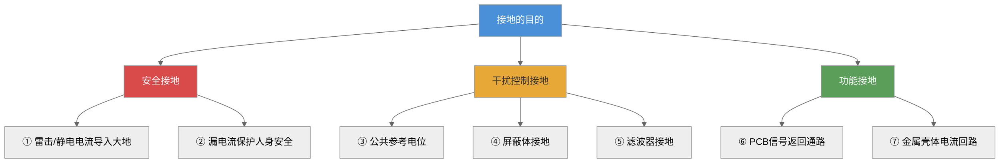

*图6-1：接地目的分类——从安全到功能的递进层次*

### 6.1.2 接地的要求

理想的接地应该满足以下四方面要求（路宏敏《工程电磁兼容》）：

**要求一：各电路互不影响。** 流经地线的各个电路和设备的电流应互不干扰，不应形成地电流环路。

**要求二：接地导体零阻抗。** 理想的接地导体应是零阻抗的实体，流过接地导体的任何电流都不应产生电压降。然而，实际导体的阻抗频率特性决定了这一要求只能在理想情况下成立——直流下尚有微小电阻，高频下感抗和趋肤效应使阻抗大幅增加。

**要求三：接地平面零电位。** 接地平面应是零电位，作为系统中各电路任何位置所有电信号的公共电位参考点。

**要求四：接地平面大分布电容。** 良好的接地平面与布线之间应有大的分布电容，接地平面本身的引线电感应很小。接地平面应采用低阻抗材料（如铜或镀银铜）制成。

在实际工程中，上述理想要求只能近似满足。设计者的任务是**在给定的成本约束和物理条件下，使接地系统尽可能接近这些理想要求**。工程上通常采用以下措施：使用大面积铜箔或铜网作为接地平面；加宽接地导线以降低电感（宽度比厚度更有效）；将接地引线长度控制在信号波长的1/20以内；在关键路径使用镀银导线以降低趋肤效应下的表面电阻。

### 6.1.3 接地的分类

接地可以从多个维度进行分类。按照接地的目的，可分为安全接地和信号接地（路宏敏分类）；按照接地的功能，可分为安全接地、干扰控制接地和功能接地（梁振光分类）。两种分类体系本质上是兼容的。

本文采用路宏敏的分类体系，并结合梁振光的细化：

$$
\text{接地}
\begin{cases}
\text{安全接地}
\begin{cases}
\text{设备安全接地} \\
\text{接零保护接地} \\
\text{防雷接地}
\end{cases}\\
\text{信号接地}
\begin{cases}
\text{单点接地} & \text{串联一点接地} \\
& \text{并联一点接地} \\
\text{多点接地} \\
\text{混合接地} \\
\text{悬浮接地}
\end{cases}
\end{cases}
\tag{6-1}
$$

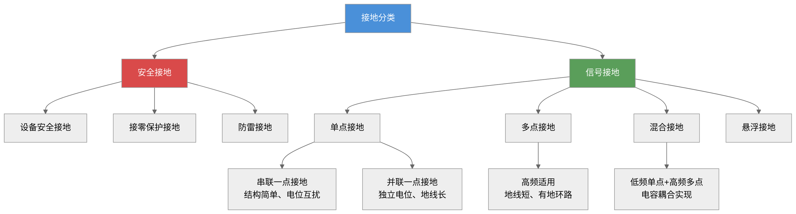

*图6-2：接地分类全景——安全接地与信号接地两大分支*

梁振光在《电磁兼容原理、技术及应用》中还从信号特性出发，将电路分为四类，分别对应不同的接地系统：

| 接地系统类型 | 包含电路 | 特点 |
|:-----------|:---------|:-----|
| 第一类 | 敏感信号、小信号电路（传感器、前级放大、混频器） | 工作电平低，极易受扰，接地必须独立 |
| 第二类 | 非敏感信号、大信号电路（末级放大、大功率电路） | 工作电流大，接地电流大，容易干扰小信号系统 |
| 第三类 | 骚扰源设备（电动机、继电器、开关） | 产生强电磁骚扰，接地必须隔离 |
| 第四类 | 金属构件（机壳、底座、系统构架） | 保证人身安全和设备稳定 |

在工程实践中，也常采用模拟信号地和数字信号地分别设置、直流电源地和交流电源地分别设置的简单原则，以保证信号纯洁度和系统的电磁兼容性。

*设问过渡：了解了接地的概念和分类后，一个最紧迫的问题是——如何确保接地确实能保障人身安全？这正是下一节安全接地要回答的核心问题。*

---

## 6.2 安全接地

安全接地是接地技术中最古老也最基本的功能。安全接地就是用低阻抗的导体将设备或系统的外壳连接到大地，以保证人身及设备的安全。

### 6.2.1 设备安全接地

设备安全接地的目的是保护人体免于触电。

#### 外壳带电的原因

设备外壳带电主要有两种机制。

**机制一：通过杂散阻抗带电。** 设备内部的电路与金属机壳之间存在分布电容和绝缘漏电阻。设设备内部电路电压为 $U_1$，电路与机壳之间的杂散阻抗为 $Z_1$，机壳与大地之间的杂散阻抗为 $Z_2$，则机壳对地的电压 $U_2$ 由分压公式决定：

$$
U_2 = \frac{Z_2}{Z_1 + Z_2} U_1
\tag{6-2}
$$

当机壳与大地绝缘（$Z_2 \to \infty$，即 $Z_2 \gg Z_1$）时，$U_2 \approx U_1$。如果 $U_1$ 超过安全电压（如220 V AC），人体触及机壳就可能发生危险。

**机制二：绝缘击穿导致漏电。** 因绝缘老化、受潮、机械擦碰等原因，电源线与机壳之间的绝缘层破损，导致漏电流直接流入机壳。此时机壳对地电压即为电源相电压（220 V AC），危险等级最高。

#### 人体触电的定量分析

人体触电的危险程度取决于流经人体的电流，而非电压。人体电阻的变化范围很大：干燥、洁净、无破损的皮肤为40~100 kΩ；出汗、潮湿状态下降至约1000 Ω。

人体对电流的耐受能力：交流15~20 mA为安全限值；直流50 mA为安全限值；**100 mA**可能导致死亡。因此我国规定的人体安全电压为36 V（一般环境）和12 V（特别危险环境）。

#### 接地保护的工作原理

当机壳接地后，人体电阻 $R_H$ 与接地导线阻抗 $Z_G$ 形成并联回路。由于人体电阻远大于接地电阻（人体数千~数十万欧姆，接地电阻仅5~10 Ω），绝大部分漏电电流经接地导线旁路流入大地：

$$
I_H \approx \frac{Z_G}{R_H} I_L
\tag{6-3}
$$

式中，$I_H$ 为流经人体的电流，$I_L$ 为漏电流。当 $Z_G = 10\ \Omega$、$R_H = 1000\ \Omega$ 时，$I_H \approx I_L/100$——100 mA的漏电流仅有1 mA通过人体，远低于安全阈值。

#### 特殊问题：电源滤波电容引起的安全地电位偏移

这是工程实践中极易被忽略但影响重大的问题。现代电子设备普遍使用开关电源和电源线滤波器。电源线滤波器的电路中有两个Y电容直接连接在电源线与机壳之间，其作用是将共模干扰电流旁路到机壳地。

然而，这两个Y电容在50 Hz工频下也存在容抗。在220 V交流供电系统中，Y电容与机壳形成电容分压，使机壳对地产生一个**约110 V的交流电压**。当设备未接地或接地不良时，这个电压会通过互连电缆耦合到其他设备，形成严重的共模干扰。

更严重的是，当机壳内电路地与机壳相连时，电路地的电位也是110 V。如果这台设备再与其他接地的设备互连（另一台设备的地电位为0 V），两者之间将存在110 V的共模电压，可能导致接口电路中的共模滤波电容损坏，甚至造成通信接口的永久性失效。

因此，**所有使用了电源线滤波器的设备都必须可靠接地**——这不仅是为了人身安全，也是保证系统正常工作的必要条件。

### 6.2.2 接零保护接地

设备安全接地虽然能将大部分漏电电流分流，但在某些情况下仅靠接地并不足以保证安全。

分析如下：在220 V单相供电系统中，变压器中性点直接接地，接地电阻为 $R_N$。设备外壳通过接地体接地，接地电阻为 $R_G$。当发生绝缘击穿时，故障电流路径为：电源火线→机壳→接地体 $R_G$→大地→中性点接地 $R_N$→变压器中性点。等效电阻为 $R_G + R_N$。假设 $R_G = 4\ \Omega$、$R_N = 4\ \Omega$，则故障电流为 $220/8 = 27.5$ A——不足以使大多数断路器（额定电流16~32 A）在安全时间内跳闸。此时机壳对地电压为 $220 \times 4/8 = 110$ V——远超安全电压36 V。

这就是**接零保护**的必要性所在。接零保护是将设备外壳与供电系统的零线（中性线）直接相连，而非仅仅接地。当绝缘击穿时，故障电流经零线形成短路回路：

$$
I_{\text{fault}} = \frac{U_{\text{phase}}}{R_{\text{line}} + R_{\text{neutral}}}
\tag{6-4}
$$

式中，$R_{\text{line}}$ 为火线电阻，$R_{\text{neutral}}$ 为零线电阻。由于火线和零线的阻抗都很小（通常远小于1 Ω），故障电流可达数百甚至数千安培——足以使断路器或熔断器在数十毫秒内动作。

**单相三线制系统（L/N/PE）** 是接零保护的标准实现：火线（L）和零线（N）构成工作回路；保护地线（PE）与设备外壳相连，在配电箱处与零线连接于同一点。正常工作时地线中无电流；只有发生绝缘击穿时，地线中才有瞬态故障电流，使保护装置迅速动作。

### 6.2.3 安全接地的有效性

安全接地的质量直接关系到人身和设备的安危。判断安全接地是否有效，最核心的指标是**接地电阻**。

#### 接地电阻的要求

| 应用场景 | 要求接地电阻 | 说明 |
|:---------|:----------:|:-----|
| 设备安全接地 | < 10 Ω | 一般工业与民用设备 |
| 1000 V以上电力线路 | < 0.5 Ω | 高压电力系统 |
| 防雷接地（建筑物） | 10~25 Ω | 取决于建筑物类型 |
| 单独避雷针 | < 25 Ω | 独立避雷装置 |
| 计算机/精密仪器 | < 1 Ω | 高敏感设备 |
| 通信基站 | < 5 Ω | 按GB 50689 |

接地电阻由三部分组成：接地导线的电阻、接地体本身的电阻和大地杂散电阻。其中**大地杂散电阻起主要作用**。

#### 跨步电压问题

当接地体中有大电流（如雷击）流入大地时，在接地体周围会形成流散电场。设接地体半径为 $a$、高度为 $h$，完全埋入大地，流入电流为 $I_0$。在距离接地体中心 $r$ 处，流散电流密度为：

$$
J(r) = \frac{I_0}{2\pi r h}
\tag{6-5}
$$

跨步电压的大小与雷电流峰值、土壤电阻率和步距有关。典型雷电流峰值为20 kA，即使在接地电阻仅1 Ω的情况下，接地体上也会产生20 kV的电压。

#### 接地体的类型与选择

**自然接地体**包括埋设在地下的金属水管、建筑物地下金属构件、电缆金属外皮等。对于1000 V以下的系统通常优先采用。**人工接地体**是专门埋入地下的金属导体，常见形式包括垂直钢管或角钢、水平圆钢或扁钢等。

需要特别指出：在弱信号、高灵敏度测控系统和精密仪器中，不应滥用自然接地体——水管与建筑金属构件及大地的接触可能不良，接地电阻不稳定。

#### 降低接地电阻的方法

当接地电阻不符合要求时，可采用以下三种方法降低土壤电阻率：

**方法一：保持水分。** 在接地体周围的土壤中保持一定的湿度，湿润土壤的电阻率远低于干燥土壤。定期灌溉或在接地体附近埋设保水材料可以有效维持低电阻率。

**方法二：化学盐化。** 在接地体周围添加食盐(NaCl)或硫酸铜等电解质，提高土壤的导电性。注意：化学盐化会加速接地体的腐蚀，需要对接地体采取防腐措施，并定期补充电解质。

**方法三：化学凝胶。** 使用专门的降阻剂（化学凝胶），其导电性好且对金属腐蚀性小，是工程中较为常用的方法。

#### 接地电阻的测量

接地电阻的测量通常使用**三极法**（也称电位降法）。测量原理：在被测接地体G和辅助电流极C之间注入测试电流 $I$，测量接地体G与辅助电压极P之间的电位差 $U$，接地电阻为 $R_G = U/I$。

辅助电流极和电压极的布置原则：电流极距被测接地体的距离通常为接地体最大对角线长度的4~5倍；电压极布置在电流极与被测接地体连线上，距离被测接地体约0.618倍电流极距离处。


*图6-3：三极法测量接地电阻的原理——电流注入+电压测量*

**例6-1**：一个变电站接地网的最大对角线长度为50 m。采用三极法测量其接地电阻，电流极应布置在距离接地网多远的位置？若注入测试电流为5 A，测得电压极与接地网之间的电压为0.85 V，接地电阻是多少？

解：
（a）电流极距离：$d_{\text{min}} = 4 \times 50 = 200$ m。因此电流极应布置在距接地网至少200 m处。
（b）电压极距离（取0.618法）：$d_p \approx 0.618 \times 200 \approx 124$ m。
（c）接地电阻：$R_G = U/I = 0.85/5 = 0.17\ \Omega$。该值远小于10 Ω，满足安全接地要求。

#### 接地体的工程设计

柯金良《电磁兼容概论》§5.2.2系统总结了常见接地装置的接地电阻计算公式体系（表5.2.1），利用恒流场与静电场的相似性，根据静电学中电容的计算公式推导接地电阻：

$$
R = \frac{U}{I} = \frac{U}{\oint_S j_n \mathrm{d}S} = \frac{U}{\oint_S \frac{E_n}{\rho} \mathrm{d}S} = \frac{U}{\frac{1}{\varepsilon\rho}\oint_S D_n \mathrm{d}S} = \frac{\varepsilon\rho U}{Q} = \frac{\varepsilon\rho}{C}
\tag{6-6}
$$

式中，$\rho$ 为土壤电阻率（Ω·m），$\varepsilon$ 为介电常数（F/m），$C$ 为接地体对无穷远处的电容（F）。基于此通用公式，三种常见接地装置的计算公式如下：

**表6-4：常见接地装置的接地电阻计算公式（柯金良表5.2.1）**

| 接地装置 | 半球接地体 | 垂直接地体 | 水平接地体 |
|:---------|:----------|:-----------|:-----------|
| 计算公式 | $R = \frac{\rho}{2\pi r}$ | 单根: $R = \frac{\rho}{2\pi l}\ln\frac{4l}{d}$ <br>多根并联: $R_\Sigma = \frac{R}{\eta n}$ | $R = \frac{\rho}{2\pi L}\left(\ln\frac{L^2}{dh} + A\right)$ |
| 注释 | $r$ 为接地体半径(m) | $l$ 长度(m), $d$ 直径(m)<br>$\eta=0.65\sim0.8$ 为利用系数 | $L$ 总长度(m), $h$ 埋深(m)<br>$A$ 为屏蔽影响系数 |

其中，垂直接地体单根公式与路宏敏给出的公式一致。柯金良特别给出了多根并联时需要考虑的**利用系数 $\eta$**（0.65~0.8）——由于各接地体之间的屏蔽效应，并联后总电阻并不等于各根电阻的简单并联，需乘以利用系数修正。

人工接地体的接地电阻可以通过以下公式估算。对于单根垂直埋设的钢管或角钢接地体：

$$
R_{\text{rod}} = \frac{\rho}{2\pi l} \left( \ln\frac{4l}{d} - 1 \right)
\tag{6-7}
$$

式中，$\rho$ 为土壤电阻率（Ω·m），$l$ 为接地体长度（m），$d$ 为接地体直径（m）。

类似地，根据静电场理论，对于水平埋设的扁钢接地体：

$$
R_{\text{strip}} = \frac{\rho}{2\pi l} \left( \ln\frac{2l^2}{wh} + \frac{1}{2} \right)
\tag{6-8}
$$

式中，$w$ 为扁钢宽度（m），$h$ 为埋设深度（m）。

**例6-2**：某通信基站的土壤电阻率为200 Ω·m。采用单根垂直钢管接地体，钢管直径5 cm，长度2.5 m。计算该接地体的接地电阻。如果要求接地电阻小于5 Ω，单根是否满足？如不满足需要几根并联？

解：
（a）单根接地电阻：
$$
R_{\text{rod}} = \frac{200}{2\pi \times 2.5} \left( \ln\frac{4 \times 2.5}{0.05} - 1 \right) = 12.73 \times (\ln 200 - 1) = 12.73 \times (5.30 - 1) \approx 54.7\ \Omega
\tag{6-9}
$$

（b）单根电阻54.7 Ω > 5 Ω，远不满足要求。

（c）多根并联（间距≥接地体长度的2倍，间距5 m，忽略互电阻近似）：
$$
R_{\text{total}} \approx \frac{R_{\text{rod}}}{n}
\tag{6-10}
$$

取 $n=12$ 根：$R_{\text{total}} \approx 54.7/12 \approx 4.56\ \Omega < 5\ \Omega$。因此至少需要12根垂直接地体并联，呈环形布置于基站周围。

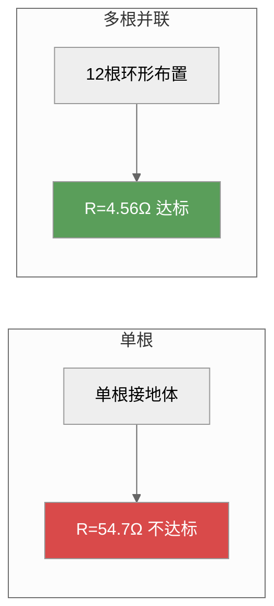

*图6-4：单根 vs 多根并联接地体的对比——通信基站接地设计实例*

*设问过渡：安全接地解决了人身保护的问题。然而，对于电子设备而言，接地导体的阻抗特性决定了接地效果的高频极限。无论安全接地还是信号接地，理解接地导体的阻抗频率特性都是选择正确接地方式的基础。*

---

## 6.3 接地导体的阻抗频率特性

在电磁兼容工程中，接地导体的阻抗频率特性是理解所有接地问题的关键。一段看似完好的接地导线，在直流或工频下可能只有几毫欧，但在高频下阻抗可上升至数十甚至数百欧姆——这个差异足以决定接地系统的成败。

### 6.3.1 直流电阻

圆截面导线的直流电阻由材料的电阻率和几何尺寸决定：

$$
R_{\text{DC}} = \frac{\rho l}{S}
\tag{6-11}
$$

式中，$\rho$ 为电阻率（Ω·m），$l$ 为长度（m），$S$ 为横截面积（m²）。

对于圆导线（半径 $a$）和扁平导体条（宽度 $w$、厚度 $t$），分别有：

$$
R_{\text{DC,round}} = \frac{\rho l}{\pi a^2}
\tag{6-12}
$$

$$
R_{\text{DC,strap}} = \frac{\rho l}{w t}
\tag{6-13}
$$

### 6.3.2 高频交流电阻与集肤效应

根据电磁场理论，集肤深度 $\delta$ 为：

$$
\delta = \sqrt{\frac{\rho}{\pi f \mu}}
\tag{6-14}
$$

式中，$f$ 为频率（Hz），$\mu$ 为磁导率（H/m，非磁性材料取 $\mu_0 = 4\pi \times 10^{-7}$ H/m）。

将集肤深度表达式(6-12)代入，当 $\delta \ll a$（导体半径远大于集肤深度）时，圆导线的高频交流电阻为：

$$
R_{\text{AC}} = \frac{a}{2\delta} \cdot R_{\text{DC}} = \frac{\sqrt{\pi \mu \sigma}}{2} \cdot R_{\text{DC}} \cdot \sqrt{f}
\tag{6-15}
$$

式中，$\sigma = 1/\rho$ 为电导率（S/m）。

**核心结论**：在集肤效应主导的区域，高频交流电阻与频率的平方根成正比——频率每升高4倍，AC电阻增加约2倍。

**例6-3**：一根半径为0.6 mm、长为1 m的铜导线（$\rho=1.724\times 10^{-8}$ Ω·m），计算其直流电阻和1 MHz下的交流电阻及两者之比。

解：
（a）直流电阻：
$$
R_{\text{DC}} = \frac{\rho \times 1}{\pi \times (0.6\times 10^{-3})^2} = \frac{1.724\times 10^{-8}}{1.131\times 10^{-6}} \approx 15.25\ \text{mΩ}
\tag{6-16}
$$

（b）1 MHz下的集肤深度，由式(6-12)代入数值计算可得：
$$
\delta = \sqrt{\frac{1.724\times 10^{-8}}{\pi \times 10^6 \times 4\pi \times 10^{-7}}} = \sqrt{4.367\times 10^{-12}} \approx 2.09\times 10^{-5}\ \text{m} = 0.0209\ \text{mm}
\tag{6-17}
$$

$a/\delta = 0.6/0.0209 \approx 28.7$，满足 $\delta \ll a$ 条件。

（c）1 MHz下的交流电阻，由式(6-13)代入计算得：
$$
R_{\text{AC}} = \frac{a}{2\delta} \cdot R_{\text{DC}} = \frac{0.6}{2 \times 0.0209} \times 15.25 \approx 14.36 \times 15.25 \approx 219\ \text{mΩ}
\tag{6-18}
$$

（d）比值：$R_{\text{AC}}/R_{\text{DC}} \approx 14.4$。即1 MHz时交流电阻是直流电阻的约**14倍**。

**表6-3：铜导线（半径0.6 mm）的交流电阻与直流电阻比随频率变化**

| 频率 | 集肤深度 δ (mm) | a/δ | R_AC/R_DC |
|:----:|:---------------:|:---:|:---------:|
| DC | ∞ | 0 | 1.0 |
| 100 kHz | 0.0661 | 9.07 | 4.5 |
| 1 MHz | 0.0209 | 28.7 | 14.4 |
| 10 MHz | 0.00661 | 90.7 | 45.3 |
| 100 MHz | 0.00209 | 287 | 144 |

### 6.3.3 导体的电感

导体的电感分为内电感（电流在导体内部储存的磁能）和外电感（电流在导体外部空间储存的磁能）。

**圆导线的内电感**

直流内电感：

$$
L_{\text{i,DC}} = \frac{\mu}{8\pi} l
\tag{6-19}
$$

根据集肤效应修正，高频交流内电感（$\delta \ll a$）：

$$
L_{\text{i,AC}} = \frac{2\delta}{a} \cdot L_{\text{i,DC}} = \frac{l}{4\pi a} \sqrt{\frac{\mu}{\pi \sigma}} \cdot \frac{1}{\sqrt{f}}
\tag{6-20}
$$

考虑外部空间的磁场储能，圆导线的外电感（$l \gg a$）：

$$
L_{\text{ext}} = \frac{\mu_0}{2\pi} l \left[ \ln\left(\frac{2l}{a}\right) - 1 \right]
\tag{6-21}
$$

以半径0.6 mm、长1 m的铜导线为例，工作频率1 MHz：

- 直流内电感：$L_{\text{i,DC}} = 50$ nH
- 高频内电感：$L_{\text{i,AC}} = 11$ nH，对应感抗 $X_L = 69.2$ mΩ
- 外电感：$L_{\text{ext}} = 1.4$ μH，对应感抗 $X_L = 8.94$ Ω

可见**外电感远大于内电感**，工程计算时可以忽略内电感。此外，外电感与导线长度成正比，因此缩短接地导线是降低高频阻抗的最有效方法。

#### 影响电感量的关键因素

路宏敏《工程电磁兼容》通过以下四组曲线系统揭示了影响扁平导体条电感量的关键因素。

**因素一：宽度的影响。** 在相同长度和厚度下，增大宽度可以显著降低电感。例如，长1 m、厚0.5 mm的扁平条，宽度从1 cm增大到10 cm时，电感从约1.8 μH降至约0.8 μH——降低超过50%。

**因素二：厚度的影响。** 在相同长度和宽度下，增大厚度对降低电感的贡献远小于宽度。例如，长1 m、宽5 cm的扁平条，厚度从1 mm增大到20 mm（增大20倍），电感仅从约0.80 μH降至约0.78 μH——几乎不变。这是因为当 $w \gg t$ 时，式(6-20)中 $\ln\frac{2l}{w+t}$ 的主要影响因素是 $w$ 而非 $t$。

**因素三：横截面形状的影响。** 在相同截面积下，矩形截面（宽厚比大）比正方形截面（宽厚比=1）的电感更小。宽厚比 $w/t$ 从1增大到10时，电感约降低25%。

**因素四：长宽比（$l/w$）的影响。** 长宽比是最关键的设计参数。$l/w$ 从1增大到10时，电感呈近似线性增长。这就是为什么所有接地设计标准都要求尽量缩短接地导体的长度、尽量增大其宽度的根本原因——**电感随 $l/w$ 单调增长**。

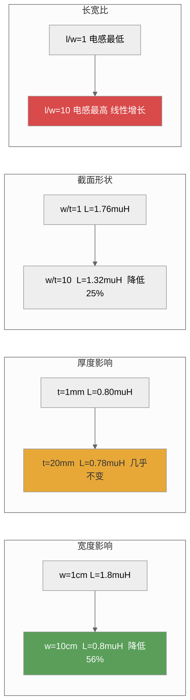

*图6-5：影响扁平接地条电感量的四个关键因素——宽度和长宽比远重要于厚度*

**例6-5**：设计一条接地条：需要在10 MHz下总阻抗小于1 Ω。现有铜条长0.2 m、宽2 cm、厚1 mm。是否满足要求？如不满足，如何改进？

解：
（a）DC电阻：
$$
R_{\text{DC}} = \frac{1.724\times 10^{-8} \times 0.2}{0.02 \times 0.001} = \frac{3.45\times 10^{-9}}{2\times 10^{-5}} \approx 0.172\ \text{mΩ}
\tag{6-22}
$$

（b）外电感，由式(6-26)代入参数可得：
$$
L_{\text{ext}} \approx 2\times 10^{-7} \times 0.2 \times \left[ \ln\frac{2\times 0.2}{0.02+0.001} + 0.5 + 0.2235 \times \frac{0.02+0.001}{0.2} \right]
= 4\times 10^{-8} \times [\ln 19.05 + 0.5 + 0.0235] = 4\times 10^{-8} \times [2.947 + 0.5 + 0.024] \approx 0.139\ \mu\text{H}
\tag{6-23}
$$

（c）10 MHz下感抗：$X_L = 2\pi \times 10^7 \times 0.139\times 10^{-6} \approx 8.73\ \Omega$

（d）总阻抗：$Z \approx 8.73\ \Omega \gg 1\ \Omega$——**不满足要求**，感抗超标8.7倍。

（e）改进方案——缩短长度到0.05 m（保留宽度2 cm），由比例关系估算电感：
$$
L_{\text{short}} \approx 0.139 \times \frac{0.05}{0.2} \approx 0.0348\ \mu\text{H}
\tag{6-24}
$$
感抗：$X_L = 2\pi \times 10^7 \times 0.0348\times 10^{-6} \approx 2.19\ \Omega$——还是超标。

（f）进一步增大宽度到10 cm（保留长度0.05 m），由式(6-26)重新计算：
$$
L_{\text{wide}} \approx 2\times 10^{-7} \times 0.05 \times \left[ \ln\frac{2\times 0.05}{0.1+0.001} + 0.5 + 0.2235 \times \frac{0.1+0.001}{0.05} \right]
= 1\times 10^{-8} \times [\ln 0.99 + 0.5 + 0.453] \approx 1\times 10^{-8} \times [-0.01 + 0.5 + 0.453] \approx 9.43\ \text{nH}
\tag{6-25}
$$
感抗：$X_L = 2\pi \times 10^7 \times 9.43\times 10^{-9} \approx 0.593\ \Omega$
总阻抗：$Z \approx \sqrt{(0.172\times 10^{-3})^2 + (0.593)^2} \approx 0.593\ \Omega < 1\ \Omega$ ✅

**结论**：将接地条从20 cm×2 cm缩短到5 cm并加宽到10 cm（长宽比从10降至0.5），阻抗从8.73 Ω降至0.593 Ω——改善**约15倍**。这充分体现了"短而宽"的接地设计原则。

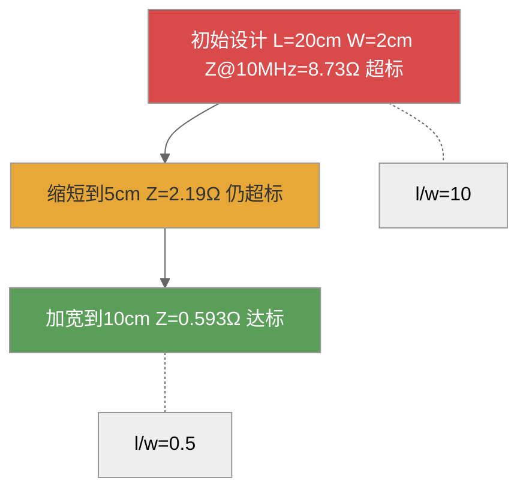

*图6-6：接地条设计优化——通过缩短长度和增加宽度，阻抗降低15倍*

**扁平导体条的外电感**（宽度 $w$，厚度 $t$，$w \gg t$）：

$$
L_{\text{ext,strap}} = \frac{\mu_0 l}{2\pi} \left( \ln\frac{2l}{w+t} + 0.5 + 0.2235\frac{w+t}{l} \right)
\tag{6-26}
$$

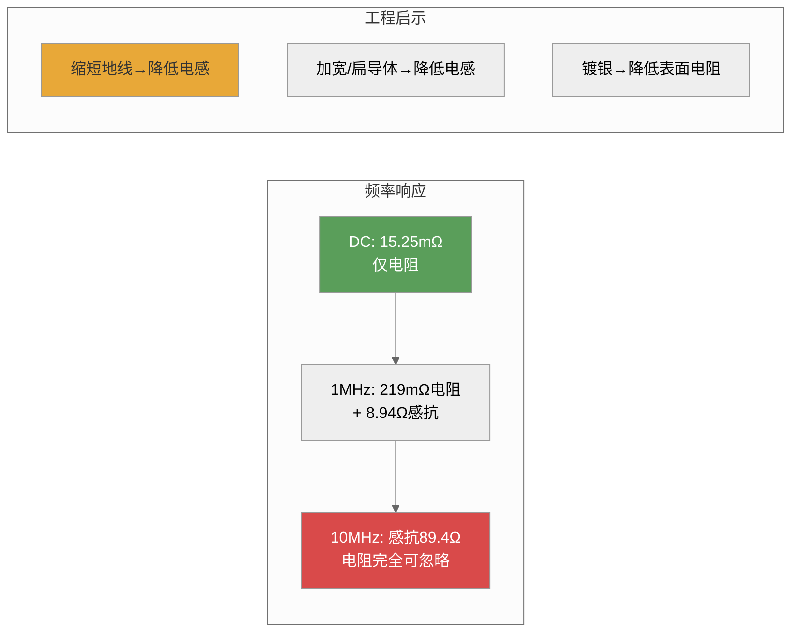

*图6-7：接地导体阻抗随频率的变化——DC→1 MHz→10 MHz的阻抗演进及工程启示*

**例6-4**：一根长0.5 m、宽5 cm、厚0.5 mm的扁平铜接地条，计算其在DC和10 MHz下的阻抗，并对比同长度的圆导线（直径2 mm）。

解：
（a）扁平条的DC电阻：
$$
R_{\text{DC,strap}} = \frac{1.724\times 10^{-8} \times 0.5}{0.05 \times 0.5\times 10^{-3}} = \frac{8.62\times 10^{-9}}{2.5\times 10^{-5}} \approx 0.345\ \text{mΩ}
\tag{6-27}
$$

（b）扁平条的外电感（由式6-16）：
$$
L_{\text{ext}} \approx \frac{4\pi \times 10^{-7} \times 0.5}{2\pi} \left[ \ln\frac{2\times 0.5}{0.05+0.0005} + 0.5 + 0.2235 \times \frac{0.05+0.0005}{0.5} \right]
\tag{6-28}
$$

代入数值计算得：

$$
= 10^{-7} \times [\ln 19.8 + 0.5 + 0.0224] = 10^{-7} \times [2.99 + 0.5 + 0.022] \approx 0.351\ \mu\text{H}
\tag{6-29}
$$

（c）10 MHz下的感抗：$X_L = 2\pi \times 10^7 \times 0.351\times 10^{-6} \approx 22.1\ \Omega$

（d）10 MHz下总阻抗：$Z \approx \sqrt{(0.345\times 10^{-3})^2 + (22.1)^2} \approx 22.1\ \Omega$——感抗完全主导。

（e）同长度圆导线（半径1 mm）的外电感，由式(6-19)可得：
$$
L_{\text{ext,wire}} \approx 2\times 10^{-7} \times 0.5 \times [\ln(2\times 0.5/0.001) - 1] = 10^{-7} \times [\ln 1000 - 1] = 10^{-7} \times [6.91 - 1] \approx 0.591\ \mu\text{H}
\tag{6-30}
$$

10 MHz下感抗：$X_L = 2\pi \times 10^7 \times 0.591\times 10^{-6} \approx 37.1\ \Omega$

**对比**：扁平条（22.1 Ω）vs 圆导线（37.1 Ω）——扁平条的阻抗仅为圆导线的**60%**。这就是工程中推荐使用扁平导体（而非圆导线）作为接地导体的根本原因。

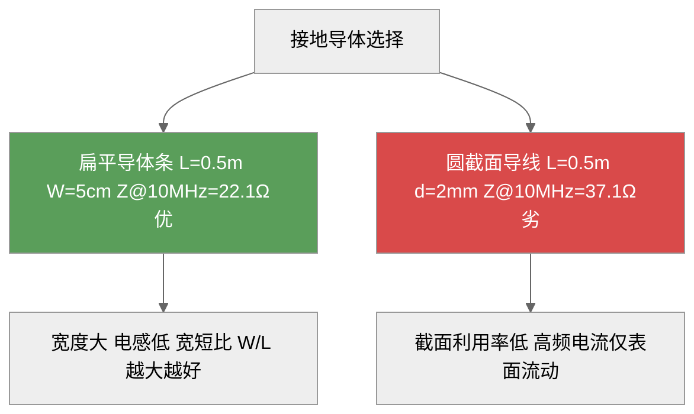

*图6-8：接地导体选型——高频下扁平条明显优于圆导线*

### 6.3.4 导体阻抗特性对接地设计的指导意义

从以上分析可以总结出以下工程指导原则：

**原则一：接地导体的高频阻抗主要由电感决定，而非电阻。** 例6-3显示，1 m长的铜导线在1 MHz下，219 mΩ的电阻加上8.94 Ω的感抗——电感贡献比电阻大40倍以上。

**原则二：缩短接地导线的长度是降低高频阻抗的最有效手段。** 电感与长度成正比——导线长度减半，电感减半，感抗减半。

**原则三：使用扁平导体而非圆导线可以显著降低电感。** 在相同的截面积下，扁平导体的电感小于圆导线（例6-4证明约降低40%）。

**原则四：增加导体的宽度比增加厚度更有效。** 从式(6-15)可见，电感随宽度 $w$ 增大而减小，而厚度 $t$ 的贡献远小于宽度（因为 $w \gg t$ 时，$\ln\frac{2l}{w+t}$ 中的 $t$ 几乎不可见）。

**原则五：在大电流接地系统中考虑集肤效应。** 在50 Hz工频下，铜的集肤深度约9.3 mm——对于厚度小于18 mm的导体，集肤效应可以忽略。但在开关电源的开关频率（数十至数百kHz）下，集肤效应必须考虑。

*设问过渡：理解了接地导体的阻抗频率特性后，一个自然的问题是：在复杂的电子系统中，不同的信号应如何选择接地方式？这正是下一节信号接地要回答的核心问题。*

## 6.4 信号接地

信号接地是为设备或系统内部各种电路的信号电压提供一个零电位的公共参考点或参考面。

复杂系统中既有高频信号又有低频信号，既有强电电路又有弱电电路。信号接地的四种基本方式为**单点接地**、**多点接地**、**混合接地**和**悬浮接地**。

### 6.4.1 单点接地

单点接地（Single-Point Grounding）是指整个系统中只有一个参考接地点。有两种具体形式。

#### 串联一点接地

串联一点接地是最简单的接地方式——各电路共用一根地线，地线的一端接地。这种方式结构简单，但存在严重的电位互扰问题。设电路1、2、3注入地线的电流分别为 $I_1$、$I_2$、$I_3$，地线各段电阻分别为 $R_1$（G→A段）、$R_2$（A→B段）、$R_3$（B→C段）。各点电位为：

A点电位：

$$
U_A = (I_1 + I_2 + I_3) R_1
\tag{6-31}
$$

由基尔霍夫电压定律可得B点电位：

$$
U_B = U_A + (I_2 + I_3) R_2
\tag{6-32}
$$

同理，C点电位为：

$$
U_C = U_B + I_3 R_3
\tag{6-33}
$$

从式(6-5)~(6-8)可见，串联一点接地中每个电路的地电位都受到其他电路地电流的影响。距离接地点最远的电路（电路C）受干扰最大。

**使用串联一点接地时必须遵循的原则**：将最低电平电路放置在最靠近接地点G的位置。

#### 并联一点接地

并联一点接地是各电路分别用独立的地线连接到同一个接地点。各电路地电位只与本电路的地电流和地线阻抗有关：

$$
\begin{cases}
U_A = I_1 R_1 \\
U_B = I_2 R_2 \\
U_C = I_3 R_3
\end{cases}
\tag{6-34}
$$

并联一点接地的优点是各电路地电位不受其他电路影响。但缺点也很明显：需要多根地线，增加了地线总长度和复杂度；地线间的互感和分布电容在高频时产生耦合；**不适用于高频**。

#### λ/20规则——传输线理论的工程应用

单点接地适用于低频的根本原因在于地线的传输线效应。当频率升高，地线长度 $l$ 与信号波长 $\lambda$ 可比时，地线不再表现为集总参数的电阻和电感，而成为分布参数传输线。

根据传输线理论，一端接地的短路线，其输入阻抗为：

$$
Z_{\text{in}} = Z_0 \tanh(\gamma l) = Z_0 \frac{\tanh(\alpha l) + j \tan(\beta l)}{1 + j \tan(\beta l) \tanh(\alpha l)}
\tag{6-35}
$$

式中，$Z_0$ 为地线的特性阻抗，$\gamma = \alpha + j\beta$ 为传播常数。对于低损耗地线（$\alpha l \ll 1$），输入阻抗可近似为：

$$
Z_{\text{in}} \approx j Z_0 \tan(\beta l) = j Z_0 \tan\left(\frac{2\pi l}{\lambda}\right)
\tag{6-36}
$$

当 $l \ll \lambda$（即地线电长度很小）时，$\tan(\beta l) \approx \beta l$，输入阻抗简化为：

$$
Z_{\text{in}} \approx j Z_0 \cdot \frac{2\pi l}{\lambda} = j\omega L_{\text{DC}}
\tag{6-37}
$$

此时地线可用集总参数电感近似，单点接地有效。但当 $l = \lambda/4$ 时：

$$
Z_{\text{in}} = j Z_0 \tan\left(\frac{\pi}{2}\right) \to \infty
\tag{6-38}
$$

地线输入阻抗趋近无穷大——**完全失去接地功能**。当 $l > \lambda/4$ 时，输入阻抗呈容性，接地线实际上变成了一个电容器，接地功能进一步恶化。

工程上通用的安全规则是：地线长度不应超过信号波长的1/20，即：

$$
l \le \frac{\lambda}{20}
\tag{6-39}
$$

此时 $\beta l = 2\pi l/\lambda \le \pi/10 \approx 18^\circ$，$\tan(\beta l) \approx \beta l$ 的误差小于2%，地线可安全地视为集总参数元件。

**表6-7：不同频率下λ/20对应的最大地线长度**

| 频率 | 波长 λ | λ/20 | 适用接地方式 |
|:----:|:-----:|:----:|:----------:|
| 50 Hz | 6000 km | 300 km | 单点/任何方式 |
| 1 kHz | 300 km | 15 km | 单点接地 |
| 100 kHz | 3 km | 150 m | 单点接地 |
| 1 MHz | 300 m | 15 m | 单点接地（注意） |
| 10 MHz | 30 m | 1.5 m | 视情况/混合接地 |
| 100 MHz | 3 m | 15 cm | 多点接地 |
| 1 GHz | 0.3 m | 1.5 cm | 必须多点接地 |

**例6-6（λ/20规则的应用）**：某数字电路的工作频率为50 MHz，其接地导体的长度限制是多少？如果实际地线长度为30 cm，应采用何种接地方式？

解：
(a) 50 MHz信号的波长：$\lambda = c/f = 3\times 10^8 / (50\times 10^6) = 6$ m
(b) λ/20限制：$\lambda/20 = 6/20 = 0.3$ m = 30 cm
(c) 若地线长度为30 cm，刚好等于λ/20——处于临界状态，建议使用多点接地或混合接地以确保安全裕量。
(d) 若地线长度能缩短到15 cm（λ/40），则可使用单点接地但仍需谨慎。工程设计一般保留2倍安全裕量，即 $l \le \lambda/40$。

**例6-7**：某混合信号系统包含10 kHz的模拟信号和100 MHz的数字信号。如何为该系统选择接地方式？

解：这是一个典型的宽频带混合信号系统接地问题。
(a) 对于10 kHz模拟部分：$\lambda = 30$ km，λ/20 = 1.5 km——任何实际地线长度都满足λ/20规则，单点接地完全适用。
(b) 对于100 MHz数字部分：$\lambda = 3$ m，λ/20 = 15 cm——必须使用非常短的地线，只有多点接地或地平面接地可行。
(c) 综合方案：采用**分区混合接地**——模拟部分用单点接地，数字部分用地平面多点接地，两部分在电源入口处通过一个点连接，再统一接大地。

#### 单点接地中导体电感的定量影响

在前文的串联一点接地分析中，我们仅考虑了地线的电阻分量。在实际工程中，特别是当信号频率进入kHz范围后，地线的电感效应开始显著。考虑电感的串联一点接地等效电路如图6-XX所示。

设各段地线的电阻和电感分别为 $R_1$、$L_1$、$R_2$、$L_2$、$R_3$、$L_3$，则各点电位为：

A点电位（包含电感和电阻的复阻抗）：

$$
\dot{U}_A = (I_1 + I_2 + I_3)(R_1 + j\omega L_1)
\tag{6-40}
$$

B点电位：

$$
\dot{U}_B = \dot{U}_A + (I_2 + I_3)(R_2 + j\omega L_2)
\tag{6-41}
$$

C点电位：

$$
\dot{U}_C = \dot{U}_B + I_3(R_3 + j\omega L_3)
\tag{6-42}
$$

以典型参数为例：$R_1 = R_2 = R_3 = 1$ mΩ，$L_1 = L_2 = L_3 = 0.5$ μH（对应约0.5 m长的接地导线），$I_1 = 0.1$ A，$I_2 = 0.5$ A，$I_3 = 2$ A。

在100 kHz下，各段感抗为：
$$
X_{L1} = 2\pi \times 10^5 \times 0.5 \times 10^{-6} = 0.314\ \Omega
\tag{6-43}
$$

比较电阻分量（1 mΩ = 0.001 Ω）和感抗分量（0.314 Ω），感抗是电阻的**314倍**！

A点电位幅值：
$$
U_A = |(0.1 + 0.5 + 2.0)| \times |0.001 + j0.314| \approx 2.6 \times 0.314 \approx 0.816\ \text{V}
\tag{6-44}
$$

C点电位幅值将更高——说明高频下串联一点接地的电位互扰问题比直流分析显示的严重得多。

#### 并联一点接地的寄生参数分析

并联一点接地虽然消除了各电路之间的公共地阻抗耦合，但引入了另一个高频问题：地线间的互感耦合和分布电容耦合。

设两根并联接地导线相距 $d$（中心距），长度为 $l$，半径均为 $a$（$l \gg d \gg a$），则两导线间的互感为：

$$
M = \frac{\mu_0}{2\pi} l \left[ \ln\left(\frac{2l}{d}\right) - 1 + \frac{d}{l} \right]
\tag{6-45}
$$

互感耦合使一根地线中的电流在另一根地线上感应出电压：

$$
U_{\text{ind},i} = j\omega M I_j
\tag{6-46}
$$

**例6-8**：两根并联接地导线长2 m，间距5 cm，半径1 mm。一根地线中流过100 mA、频率为1 MHz的电流，估算在另一根地线上感应的电压。

解：
(a) 互感计算（由式6-44）：
$$
M = \frac{4\pi \times 10^{-7}}{2\pi} \times 2 \times \left[ \ln\left(\frac{2 \times 2}{0.05}\right) - 1 + \frac{0.05}{2} \right]
= 4\times 10^{-7} \times [\ln 80 - 1 + 0.025] = 4\times 10^{-7} \times [4.382 - 1 + 0.025] \approx 1.363\ \mu\text{H}
\tag{6-47}
$$

(b) 感应电压：
$$
U_{\text{ind}} = 2\pi \times 10^6 \times 1.363 \times 10^{-6} \times 0.1 \approx 0.856\ \text{V}
\tag{6-48}
$$

这个0.856 V的感应电压对于毫伏级的模拟信号而言是严重的干扰。因此，并联一点接地虽然消除了公共阻抗耦合，但引入了互感耦合——在高频下，这两种耦合的严重程度相当。

**工程对策**：为了降低并联接地导线间的互感耦合，应：
1. 尽量缩短接地导线的长度
2. 增大导线间距（但效果有限，因互感随距离的对数缓慢下降）
3. 使用地平面代替分立导线（地平面的互感极小）
4. 关键敏感信号使用屏蔽线，屏蔽层单点接地

#### 单点接地的工程应用准则

综合以上分析，单点接地在工程实践中应遵循以下准则：

**准则一**：串联一点接地仅用于地电流很小且对地电位不敏感的电路。使用时应将最低电平电路放在最靠近接地点处。

**准则二**：并联一点接地适用于低频（$f < 1$ MHz）且各电路地电流差异大的场合。使用时应尽量缩短各分支地线长度，并增大分支间距。

**准则三**：在混合信号系统中，模拟地和数字地应分别设置并联一点接地，然后在系统电源入口处单点汇接。

**准则四**：地线长度必须满足λ/20规则。当频率超过1 MHz时，必须校验地线长度是否满足要求。

**准则五**：单点接地导体的截面形状应优先选择扁平导体，宽厚比尽量大，以降低高频阻抗。

#### 两点接地导致的地环路干扰：定量分析

张亮给出了一个经典的定量案例。考虑传感器与放大器通过导线连接，两端分别接地。设信号源电压 $U_S$，放大器内阻 $R_L$，导线电阻 $R_{C1}$、$R_{C2}$，两点间地电位差 $U_G$。

两点接地时，根据回路电流法对地环路进行分析，推导得放大器输入端的干扰电压（当 $R_{C2} \ll R_L + R_{C1} + R_S$ 时）为

$$
U_N = \frac{R_L}{R_L + R_{C1} + R_S} \cdot \frac{R_{C2}}{R_{C2} + R_G} \cdot U_G
\tag{6-49}
$$

将给定数值代入式(6-35)可得：

$$
U_N = \frac{10^4}{10^4 + 1 + 500} \times \frac{1}{1 + 0.01} \times 100 \approx 95\ \text{mV}
\tag{6-50}
$$

地线噪声100 mV几乎**100%地**（95 mV）传入了放大器。

采用单点接地后，由电路分压关系可得：

$$
U_N = \frac{R_L}{R_L + R_{C1} + R_S} \cdot \frac{R_{C2}}{Z_{SG}} \cdot U_G
\tag{6-51}
$$

若 $Z_{SG} = 1$ MΩ，则 $U_N \approx 0.095\ \mu\text{V}$——**改善约120 dB！** 这一数字揭示了单点接地在地环路干扰抑制中的巨大作用。

### 6.4.2 多点接地

多点接地（Multi-Point Grounding）是指各电路和设备直接连接到距其最近的接地平面，以使接地线长度最短。设各电路地线电阻和电感分别为 $R_1$、$L_1$、$R_2$、$L_2$、$R_3$、$L_3$，地线电流分别为 $I_1$、$I_2$、$I_3$，则各电路对地电位差为：

$$
\begin{cases}
\dot{U}_1 = I_1 (R_1 + j\omega L_1) \\
\dot{U}_2 = I_2 (R_2 + j\omega L_2) \\
\dot{U}_3 = I_3 (R_3 + j\omega L_3)
\end{cases}
\tag{6-52}
$$

多点接地的核心优点是**地线短**，适用于高频。多点接地的主要缺点是**会形成各种地线回路**，造成地环路干扰。

#### 多点接地的高频特性

多点接地系统的关键优势在于其高频性能。考虑一段长度为 $l$ 的接地导线连接电路到地平面，其高频阻抗为：

$$
Z_{\text{stub}} = Z_0 \tanh(\gamma l) \approx j Z_0 \tan\left(\frac{2\pi l}{\lambda}\right)
\tag{6-53}
$$

在多点接地中，每条接地引线的长度 $l$ 被最小化。当 $l \ll \lambda/20$ 时：

$$
Z_{\text{stub}} \approx j Z_0 \cdot \frac{2\pi l}{\lambda} = j\omega L_{\text{stub}}
\tag{6-54}
$$

其中 $L_{\text{stub}}$ 是短接地引线的集总电感。对于长度1 cm、直径0.5 mm的短接地引线，电感约为8~10 nH，在100 MHz下感抗仅约5~6 Ω——远低于长导线的感抗。

#### 地平面的阻抗特性

多点接地通常以地平面作为公共参考面。地平面的面阻抗（sheet impedance）由下式给出：

$$
Z_{\text{sheet}} = \frac{\rho}{\delta} \cdot \frac{1}{1 + j} = R_{\text{sheet}} + jX_{\text{sheet}}
\tag{6-55}
$$

式中，$\rho$ 为导体电阻率，$\delta$ 为集肤深度。对于1 oz铜箔（厚度35 μm），在1 MHz下：
- $\delta_{\text{Cu}} \approx 66$ μm > 35 μm，集肤效应尚未完全发展
- 面电阻 $R_{\text{sheet}} \approx 0.5$ mΩ/□（毫欧每方）
- 在10 MHz下：$\delta_{\text{Cu}} \approx 21$ μm < 35 μm，集肤效应完全发展
- 面电阻 $R_{\text{sheet}} \approx 0.82$ mΩ/□

对于一块10 cm × 10 cm的地平面，从一角到对角的电阻仅约 $0.82 \times \sqrt{2} \approx 1.16$ mΩ——相比分立接地导线的数百毫欧，地平面的阻抗要低得多。

#### 多点接地中的地环路问题

虽然多点接地的地线短、高频性能好，但它不可避免地会形成地环路。考虑两个设备A和B，各自通过短引线接到地平面，两台设备之间有信号电缆连接。信号电缆的两端接地与地平面构成一个地环路：

$$
U_{\text{loop}} = \frac{d\Phi}{dt} = A \cdot \frac{dB}{dt}
\tag{6-56}
$$

式中 $A$ 为环路面积，$B$ 为穿过环路的磁通密度。环路面积由信号电缆与地平面之间的间隔决定。

**例6-9**：两个设备通过一条1 m长的扁平电缆互连，电缆距地平面高度为5 cm，工作环境中存在100 kHz、10 μT的磁场。估算地环路感应的干扰电压。

解：
(a) 环路面积：$A = 1 \times 0.05 = 0.05$ m²
(b) 磁场随时间变化：$dB/dt = 2\pi f B = 2\pi \times 10^5 \times 10 \times 10^{-6} = 6.28$ T/s
(c) 感应电压：$U_{\text{loop}} = 0.05 \times 6.28 = 0.314$ V = 314 mV

对于5 V逻辑电平系统，314 mV的感应电压尚不至于造成逻辑错误，但对于模拟信号（如4~20 mA，精度0.1%对应约0.04 mA的误差），这已经是一个显著的干扰源。

**多点接地中地环路的抑制措施**：
1. **减小环路面积**——信号电缆应紧贴地平面布线（扁平电缆使用地线/信号线交替排列结构）
2. **使用共模扼流圈**——在电缆两端串联共模扼流圈，对地环路电流呈高阻抗
3. **差分传输**——使用差分信号代替单端信号，地环路干扰作为共模分量被差分接收器抑制
4. **限制接地点的数量**——对于同一功能区内的电路，并非越多接地点越好

#### 高频接地中的接地条设计

在高频多点接地系统中，接地条（ground strap）的设计至关重要。柯金良指出，对于高频电子设备，通常采用矩形截面的镀银铜片作为接地带。镀银处理可以显著降低集肤效应下的表面电阻——银的电导率比铜高约5%，且银的氧化层仍具有导电性（而铜的氧化层是绝缘的）。

接地条的尺寸选择原则：

**原则一**：宽度越大越好。从6.3节的分析可知，扁平条的电感随宽度增大而减小。对于1 cm宽的接地条，单位长度电感约为0.8~1.0 nH/mm；对于10 cm宽的接地条，单位长度电感降至0.3~0.4 nH/mm。

**原则二**：长度越短越好。这是所有接地原则中最重要的——长度对电感的影响是线性的。

**原则三**：厚度对电感的影响很小。只要保证机械强度和载流量即可，一般取0.3~1 mm。

**例6-10**：一个射频功放模块在900 MHz下工作，需要使用宽5 mm、长3 cm的铜接地条连接到地平面。计算该接地条在900 MHz下的阻抗，并判断是否满足阻抗小于1 Ω的要求。

解：
(a) 接地条电感估算（使用式6-26，忽略厚度项）：
$$
L \approx 2\times 10^{-7} \times 0.03 \times \left[ \ln\left(\frac{2 \times 0.03}{0.005}\right) + 0.5 \right] 
= 6 \times 10^{-9} \times [\ln 12 + 0.5] 
= 6 \times 10^{-9} \times [2.485 + 0.5] \approx 17.9\ \text{nH}
\tag{6-57}
$$

(b) 900 MHz下的感抗：
$$
X_L = 2\pi \times 9\times 10^8 \times 17.9 \times 10^{-9} \approx 101.2\ \Omega
\tag{6-58}
$$

(c) 阻抗远大于1 Ω——**不满足要求**。原因：3 cm长的接地条在900 MHz下已经相当于 $\lambda/20$ 的长度（900 MHz的λ/20 ≈ 1.67 cm）。

(d) 改进方案：将接地条长度缩短到1 cm（从模块边缘就近接地），宽度增大到2 cm：
$$
L \approx 2\times 10^{-7} \times 0.01 \times \left[ \ln\left(\frac{2 \times 0.01}{0.02}\right) + 0.5 \right]
= 2 \times 10^{-9} \times [\ln 1 + 0.5] = 2 \times 10^{-9} \times 0.5 = 1.0\ \text{nH}
\tag{6-59}
$$

(e) 改进后的感抗：$X_L = 2\pi \times 9\times 10^8 \times 1.0 \times 10^{-9} \approx 5.65\ \Omega$——仍然大于1 Ω，但已有大幅改善（从101 Ω降至5.65 Ω）。

(f) 进一步改进：使用多点接地镀银铜片直接焊接在地平面上（消除接地条，实现近于零长度的接地），此时接地阻抗由焊点和铜箔的分布阻抗决定，可控制在1 Ω以下。


*图6-XX：900 MHz射频模块接地改进历程——缩短接地引线是实现低阻抗的关键*

#### 多点接地的频率分界线

工程实践中，单点接地与多点接地的频率分界遵循以下规则（综合路宏敏、柯金良和梁振光的结论）：

| 频率范围 | 推荐接地方式 | 理由 |
|:--------|:-----------|:-----|
| $f < 100$ kHz | 单点接地（并联优先） | 地线电长度极小，λ/20安全裕度充足 |
| 100 kHz ~ 1 MHz | 单点接地 | 需注意地线长度，确保 $l < \lambda/20$ |
| 1 MHz ~ 10 MHz | 视地线长度而定 | 若 $l < \lambda/20$ 仍可用单点接地，否则用混合接地 |
| 10 MHz ~ 100 MHz | 多点接地或混合接地 | 地线长度必须极短，使用地平面 |
| $f > 100$ MHz | 必须多点接地 | 必须使用地平面，接地引线长度 < λ/20 |

柯金良给出了更细致的定量分界：当频率满足以下条件时，应使用多点接地：

$$
f > \frac{c}{20l_{\text{max}}}
\tag{6-60}
$$

式中 $l_{\text{max}}$ 是系统中可能的最长接地线长度。例如，若最长地线为 50 cm，则分界频率为 $f = 3\times 10^8 / (20 \times 0.5) = 30$ MHz——超过30 MHz就必须使用多点接地。

#### 多点接地的工程实现

在实际PCB设计中，多点接地通过以下方式实现：

1. **完整地平面**：多层PCB中设置一整层作为地平面（GND layer），所有元器件的接地引脚通过过孔直接连接到地平面
2. **地网格**：当完整地平面不可行时（如双面板），使用地网格（ground grid）代替，网格线宽≥0.5 mm，网格间距≤1.3 cm
3. **地过孔阵列**：在关键芯片（如FPGA、高速ADC）的下方布置地过孔阵列，过孔间距≤λ/20
4. **缝合过孔**：沿PCB边缘每隔λ/20设置一个地过孔，将顶层和底层的地铜皮缝合在一起

**单点接地 vs 多点接地的对比：**

| 对比维度 | 单点接地 | 多点接地 |
|:---------|:--------|:--------|
| 适用频率 | $f < 1$ MHz | $f > 10$ MHz |
| 地线长度 | 可较长（＜λ/20） | 尽可能短（＜λ/20） |
| 地环路问题 | 无 | 有 |
| 电路互扰 | 串联式有，并联式无 | 通过公共地平面耦合 |
| 高频性能 | 差 | 好 |
| PCB复杂度 | 低（分离地线） | 高（地平面/层） |
| 典型应用 | 音频、低频模拟电路 | 射频、高速数字电路 |

### 6.4.3 混合接地

当电路工作频带很宽、低频需单点接地而高频需多点接地时，可采用混合接地。核心思路是利用**电容的频率特性**：低频时电容高阻抗→单点接地；高频时电容低阻抗→多点接地。

混合接地有两种形式：**电容耦合混合接地**（在接地线上串联电容）和**系统分区混合接地**（不同区域采用不同接地方式，汇总后单点接大地）。

#### 电容耦合混合接地的谐振计算

电容耦合混合接地的等效电路如图6-XX所示。设备机壳通过一个小电容 $C_c$ 连接到地平面。低频时 $C_c$ 呈现高阻抗，相当于机壳与地平面断开，实现单点接地效果；高频时 $C_c$ 呈现低阻抗，相当于机壳与地平面短路，实现多点接地效果。

然而，实际的电容并非理想元件——它包含等效串联电阻（ESR）和等效串联电感（ESL）。电容耦合路径的阻抗为：

$$
Z_c = R_{\text{ESR}} + j\left(\omega L_{\text{ESL}} - \frac{1}{\omega C_c}\right)
\tag{6-61}
$$

当发生串联谐振时：

$$
\omega_0 L_{\text{ESL}} = \frac{1}{\omega_0 C_c}
\quad\Rightarrow\quad
f_0 = \frac{1}{2\pi\sqrt{L_{\text{ESL}} C_c}}
\tag{6-62}
$$

在谐振频率 $f_0$ 处，电容呈现纯电阻特性（$Z_c = R_{\text{ESR}}$），接地阻抗最低。但谐振频率是设计的关键约束——必须确保 $f_0$ 远高于系统的工作频率上限，否则在工作频带内电容会呈现低阻抗（相当于机壳始终接地），失去混合接地的低频单点特性。

**例6-11**：设计一个电容耦合混合接地系统，要求10 kHz以下呈现单点接地（隔断阻抗 > 10 kΩ），10 MHz以上呈现多点接地（耦合阻抗 < 1 Ω）。选用普通MLCC电容，其ESL约为1 nH，ESR约为0.1 Ω。

解：
(a) 低频要求：在10 kHz下，$Z_c > 10$ kΩ。由于10 kHz下感抗很小（$2\pi \times 10^4 \times 10^{-9} = 6.28\times 10^{-5}$ Ω可以忽略），阻抗主要由电容决定：
$$
Z_c \approx \frac{1}{2\pi f C_c}
\quad\Rightarrow\quad
C_c < \frac{1}{2\pi \times 10^4 \times 10^4} \approx 1.59\ \text{nF}
\tag{6-63}
$$

(b) 高频要求：在10 MHz下，$Z_c < 1$ Ω。假设10 MHz下电容已接近谐振点，阻抗接近ESR：
$$
C_c > \frac{1}{(2\pi \times 10^7)^2 \times 10^{-9}} \approx 253\ \text{pF}
\tag{6-64}
$$
这个值太小，说明ESL主导了高频阻抗。更准确的计算需考虑ESL。

(c) 综合选择：取 $C_c = 1$ nF。验证谐振频率：
$$
f_0 = \frac{1}{2\pi\sqrt{10^{-9} \times 10^{-9}}} = \frac{1}{2\pi \times 10^{-9}} \approx 159\ \text{MHz}
\tag{6-65}
$$

(d) 在10 kHz下的阻抗：$Z_c \approx 1/(2\pi \times 10^4 \times 10^{-9}) \approx 15.9$ kΩ > 10 kΩ ✅
(e) 在10 MHz下的阻抗：此时电容的容抗 $X_c = 1/(2\pi \times 10^7 \times 10^{-9}) \approx 15.9$ Ω，感抗 $X_L = 2\pi \times 10^7 \times 10^{-9} \approx 0.063$ Ω，净电抗 $X = 15.9 - 0.063 \approx 15.8$ Ω（容性），总阻抗 $Z_c = \sqrt{0.1^2 + 15.8^2} \approx 15.8$ Ω > 1 Ω ❌——不满足10 MHz下的低阻抗要求。

(f) 改进方案：使用更大的电容 $C_c = 100$ nF：
$$
f_0 = \frac{1}{2\pi\sqrt{10^{-9} \times 100 \times 10^{-9}}} = \frac{1}{2\pi \times 10^{-8}} \approx 15.9\ \text{MHz}
\tag{6-66}
$$

在10 MHz下：$X_c = 1/(2\pi \times 10^7 \times 10^{-7}) \approx 0.159$ Ω，$X_L = 0.063$ Ω，净电抗 $|X| = 0.159 - 0.063 = 0.096$ Ω（容性），$Z_c \approx \sqrt{0.1^2 + 0.096^2} \approx 0.139$ Ω < 1 Ω ✅

在10 kHz下：$Z_c \approx 1/(2\pi \times 10^4 \times 10^{-7}) \approx 159$ Ω——这远小于10 kΩ的要求 ❌，意味着在10 kHz下机壳已经通过电容"接地"了！

(g) **矛盾**：单一电容无法同时满足低频高阻抗和高频低阻抗的要求。这就是混合接地设计的核心挑战。

**解决方案**：使用**多个电容并联**的方法。将一个高容值电容（如100 nF）和一个低容值电容（如1 nF）并联。100 nF电容在10 MHz下提供低阻抗通路，但它在10 kHz下仅有159 Ω——通过在该通路上串联一个铁氧体磁珠来增加低频阻抗。

#### 系统分区混合接地

另一种更实用的混合接地方式是**系统分区混合接地**。将系统按信号频率分为低频区和高频区：

1. **低频区**（模拟电路、电源电路）：采用单点接地，各电路独立地线汇总到一点
2. **高频区**（射频电路、高速数字电路）：采用地平面多点接地
3. **两区连接**：两个区域之间通过一个低阻抗连接点（通常选在电源入口处）相连，然后统一接大地

关键设计规则：低频区和高频区之间的地线连接应使用**电感器或铁氧体磁珠**，使低频区看到的是单点接地（DC通路），而高频区的高频噪声不会通过地线耦合到低频区。

**例6-12**：一个数据采集系统包含以下模块：传感器前置放大器（10 kHz带宽）、12位ADC（1 Msps）、DSP处理器（200 MHz主频）、开关电源（100 kHz开关频率）。设计该系统的混合接地方案。

解：
(a) 模块分类：
- 低频敏感区：前置放大器（10 kHz，低电平）→ 单点接地
- 中频区：ADC（1 Msps，包含模拟和数字部分）→ 分区接地
- 高频区：DSP（200 MHz）→ 地平面多点接地
- 噪声源：开关电源（100 kHz）→ 独立接地

(b) 接地拓扑：
```
前置放大器 ── 模拟地 ──┐
ADC模拟部分 ──────────┤
ADC数字部分 ── 数字地 ─┤
DSP ──────────── 地平面 ─┤
开关电源 ────── 电源地 ──┘
                        │
                    [单点连接]──→ 大地
```

(c) 关键设计细节：
- 模拟地和数字地之间使用0 Ω电阻或铁氧体磁珠连接
- 电源地独立布线，不与信号地共享回路
- PCB采用四层板：顶层信号 + 第二层地平面 + 第三层电源 + 底层信号
- DSP正下方布置地过孔阵列，间距1 cm
- 模拟区下方地平面保持完整，不做分割

#### 混合接地的频率响应分析

混合接地系统的地线阻抗-频率特性可以用以下公式描述：

$$
Z_{\text{hybrid}}(f) = \left| \frac{1}{\frac{1}{Z_{\text{LF}}(f)} + \frac{1}{Z_{\text{HF}}(f)}} \right|
\tag{6-67}
$$

式中，$Z_{\text{LF}}(f)$ 是低频单点接地支路的阻抗（大电感或电阻），$Z_{\text{HF}}(f)$ 是高频多点接地支路的阻抗（电容）。

对于电容耦合混合接地：

$$
Z_{\text{LF}}(f) = R_{\text{iso}} \quad\text{（隔离电阻，通常1~10 MΩ）}
\tag{6-68}
$$

$$
Z_{\text{HF}}(f) = R_{\text{ESR}} + j\left(2\pi f L_{\text{ESL}} - \frac{1}{2\pi f C_c}\right)
\tag{6-69}
$$

对于系统分区混合接地：

$$
Z_{\text{hybrid}}(f) = \sqrt{R_{\text{DC}}^2 + (2\pi f L_{\text{strap}})^2} \quad\text{（当 $f < f_{\text{cross}}$ 时，长接地带）}
\tag{6-70}
$$

$$
Z_{\text{hybrid}}(f) = \sqrt{R_{\text{plane}}^2 + (2\pi f L_{\text{via}})^2} \quad\text{（当 $f > f_{\text{cross}}$ 时，短接地过孔）}
\tag{6-71}
$$

式中 $f_{\text{cross}}$ 是混合接地的交叉频率，在该频率下系统从单点接地模式切换为多点接地模式。

### 6.4.4 悬浮接地

悬浮接地（Floating Ground）是将信号接地系统与安全接地系统完全隔离，即信号地不与大地连接。主要优点是抗干扰能力强——切断地环路，使外部地电位差无法驱动电流流过信号电路。

#### 浮地的定量分析：分布电容的影响

悬浮接地并非真正的"悬浮"——设备与大地之间始终存在分布电容。设信号地与大地的分布电容为 $C_p$（包括变压器绕组间电容、PCB与机壳间电容、电源适配器Y电容等），则浮地对大地的阻抗为：

$$
Z_{\text{float}} = \frac{1}{j\omega C_p}
\tag{6-72}
$$

这个阻抗随着频率升高而降低。当频率足够高时，$Z_{\text{float}}$ 变得很小，悬浮地将失去隔离作用。

**例6-13**：某浮地设备与大地之间的分布电容为100 pF，计算该设备在50 Hz、1 kHz、100 kHz、10 MHz下对地的等效阻抗。

解：
(a) 50 Hz：$Z_{\text{float}} = 1/(2\pi \times 50 \times 100\times 10^{-12}) \approx 31.8$ MΩ——隔离效果极好
(b) 1 kHz：$Z_{\text{float}} = 1/(2\pi \times 10^3 \times 100\times 10^{-12}) \approx 1.59$ MΩ——仍然很好
(c) 100 kHz：$Z_{\text{float}} = 1/(2\pi \times 10^5 \times 100\times 10^{-12}) \approx 15.9$ kΩ——隔离效果显著下降
(d) 10 MHz：$Z_{\text{float}} = 1/(2\pi \times 10^7 \times 100\times 10^{-12}) \approx 159$ Ω——几乎相当于直接接地！

| 频率 | 浮地阻抗 (C_p=100 pF) | 隔离效果 |
|:----:|:--------------------:|:--------:|
| 50 Hz | 31.8 MΩ | 极好 |
| 1 kHz | 1.59 MΩ | 很好 |
| 10 kHz | 159 kΩ | 好 |
| 100 kHz | 15.9 kΩ | 中等 |
| 1 MHz | 1.59 kΩ | 差 |
| 10 MHz | 159 Ω | 几乎失效 |
| 100 MHz | 15.9 Ω | 完全失效 |

**核心结论**：悬浮接地只适用于1 MHz以下的应用；超过10 MHz，分布电容使悬浮接地完全失效。

#### 静电积累问题

悬浮接地存在**静电积累**的根本性缺点——设备不接地，静电荷无法泄放，积累到足够高的电压时会通过空气间隙放电，产生ESD事件。设设备对地的总分布电容为 $C_p$，环境中的静电荷积累速率为 $dQ/dt$，则设备对地电压的上升速率为：

$$
\frac{dU}{dt} = \frac{1}{C_p} \cdot \frac{dQ}{dt}
\tag{6-73}
$$

**例6-14**：一台便携式设备采用悬浮接地，对地分布电容为50 pF。在干燥环境中（相对湿度20%），人体活动产生的静电积累速率约为10 nC/s。计算：(a) 设备对地电压的上升速率；(b) 如果不加泄放，多少秒后电压会达到500 V（可能发生ESD放电的阈值）？

解：
(a) 电压上升速率：
$$
\frac{dU}{dt} = \frac{10 \times 10^{-9}}{50 \times 10^{-12}} = 200\ \text{V/s}
\tag{6-74}
$$

(b) 达到500 V的时间：
$$
t = \frac{500}{200} = 2.5\ \text{s}
\tag{6-75}
$$

仅2.5秒就会积累到足以产生ESD的电压——这就是为什么悬浮设备必须配备静电泄放路径。

**工程实践**：在悬浮设备与公共地之间接入一个大阻值电阻（典型值1~10 MΩ），缓慢泄放静电荷，同时保持高阻隔离。加入泄放电阻后，浮地对大地的阻抗变为：

$$
Z_{\text{float}} = \frac{R_{\text{leak}}}{1 + j\omega R_{\text{leak}} C_p}
\tag{6-76}
$$

直流下 $Z_{\text{float}} = R_{\text{leak}}$（典型1~10 MΩ），高频下 $Z_{\text{float}} \approx 1/(j\omega C_p)$（与不加电阻相同）。

**例6-15**：在上例的设备中加入一个5 MΩ的泄放电阻，重新计算设备对地稳态电压（假设静电积累速率10 nC/s）。

解：
加入泄放电阻后，静电积累和泄放达到平衡：
$$
\frac{dQ}{dt} = I_{\text{leak}} = \frac{U}{R_{\text{leak}}}
\tag{6-77}
$$
稳态时：$\frac{dU}{dt} = 0$，即 $\frac{1}{C_p}\left(\frac{dQ}{dt} - \frac{U}{R_{\text{leak}}}\right) = 0$
$$
U_{\text{steady}} = R_{\text{leak}} \cdot \frac{dQ}{dt} = 5 \times 10^6 \times 10 \times 10^{-9} = 50\ \text{mV}
\tag{6-78}
$$

50 mV远低于500 V的ESD阈值——泄放电阻有效解决了静电积累问题。

#### 浮地的适用范围和局限性

| 适用场景 | 不适用场景 |
|:--------|:----------|
| 便携式/电池供电设备 | 高频电路（>1 MHz） |
| 医疗电子（需极低漏电流） | 含大功率开关电源的设备 |
| 精密测量仪器（消除地环路） | 与外部设备有线连接的设备 |
| 低频模拟前端（<100 kHz） | 对ESD敏感的CMOS电路 |
| 实验室原型调试 | 工业现场（电磁环境恶劣） |

#### 浮地与隔离式接地对比

浮地与隔离式接地的本质区别在于：
- **浮地**：信号地完全不与大地连接，仅通过泄放电阻和分布电容耦合
- **隔离式接地**：使用隔离变压器、光耦合器或DC-DC隔离电源，在电气上断开地环路，但隔离两侧各自有自己的参考地

隔离式接地的隔离阻抗远高于浮地（可达$10^{11}$ Ω以上），且不受频率影响——因此在高频和强干扰环境下比浮地更可靠。

### 6.4.5 地平面与地栅系统

高频和高速数字脉冲电路的信号接地必须具有极低的地阻抗（极低的地线电感量）。解决这个问题的最好方法是给整个系统提供一个理想的地平面，使每个需要接地的元器件都能就近接地。柯金良《电磁兼容概论》§5.3.2给出了两种实现方式：

#### 地平面系统（Ground Plane）的定量分析

采用多层印制电路板，设置专门的地线层（或电源层）作为地平面。地平面具有极低的阻抗和分布电感，为所有元器件提供就近接地条件。这是效果最好的方式，但会增加PCB制造成本。

地平面的阻抗主要包括两个方面：**直流电阻**和**高频电感**。

**地平面的面电阻**：
对于厚度为 $t$ 的铜箔，面电阻（每方电阻）为：

$$
R_{\square} = \frac{\rho}{t}
\tag{6-79}
$$

标准PCB铜箔厚度对应的面电阻：

| 铜箔规格 | 厚度 (μm) | 面电阻 (mΩ/□) |
|:--------:|:---------:|:-------------:|
| 0.5 oz | 17.5 | 0.98 |
| 1 oz | 35 | 0.49 |
| 2 oz | 70 | 0.25 |
| 3 oz | 105 | 0.16 |

对于一块 $W \times L$ 的矩形地平面，沿长度方向的电阻为：

$$
R_{\text{plane}} = R_{\square} \cdot \frac{L}{W}
\tag{6-80}
$$

**地平面的电感**：
地平面的电感远小于分立导线。一块完整地平面的单位长度电感约为：

$$
L_{\text{plane}} \approx \mu_0 \cdot \frac{h}{W}
\tag{6-81}
$$

式中 $h$ 是地平面到最近参考层（电源层或信号层）的距离，$W$ 是地平面的宽度。

**例6-16**：一块四层PCB，第二层为完整地平面（1 oz铜箔），尺寸为10 cm × 15 cm。地平面与第三层电源层间距为0.2 mm。计算：(a) 地平面沿15 cm方向的直流电阻；(b) 地平面的单位长度电感；(c) 在100 MHz下，从一角到对角的阻抗。

解：
(a) 面电阻：1 oz铜箔 $R_{\square} = 0.49$ mΩ/□
沿15 cm方向的方数 = 15/10 = 1.5
$R_{\text{plane}} = 0.49 \times 1.5 = 0.735$ mΩ

(b) 单位长度电感：
$$
L_{\text{plane}} \approx 4\pi \times 10^{-7} \times \frac{0.2 \times 10^{-3}}{0.1} = 2.51\ \text{nH/m}
\tag{6-82}
$$
地平面沿15 cm的电感：$L = 2.51 \times 0.15 \approx 0.377$ nH

(c) 100 MHz下，忽略电阻：
$X_L = 2\pi \times 10^8 \times 0.377 \times 10^{-9} \approx 0.237\ \Omega$

对比：同样尺寸的分立接地导线（长15 cm，直径1 mm）在100 MHz下电感约150 nH，感抗约94 Ω——地平面的阻抗比分立导线低**约400倍**！

#### 地平面上的电流分布

在地平面上，高频电流并不均匀分布在整个平面上，而是集中在信号走线正下方的区域。这被称为**镜像平面效应**（image plane effect）。高频信号的回流电流倾向于沿着信号走线正下方的路径流回源端，以最小化回路电感。

回流电流的分布宽度近似为：

$$
W_{\text{return}} \approx 3h \quad\text{（当 $h \ll W$ 时）}
\tag{6-83}
$$

式中 $h$ 是信号层到地平面的间距。这意味着大部分回流电流集中在信号走线正下方宽度为 $3h$ 的带状区域内。

**工程启示**：即使地平面是完整的一整块，也不应认为各部分电位都相等。地平面的局部电压降为：

$$
\Delta U(x) = I_{\text{return}}(x) \cdot R_{\square} \cdot \frac{\Delta x}{3h}
\tag{6-84}
$$

这就是为什么在混合信号PCB中，模拟部分和数字部分的地平面虽然物理上是同一块，但需要通过"地平面分割"来防止数字噪声污染模拟区域。

#### 地栅系统（Ground Grid）的设计计算

对于双面板，可以采用"地栅"系统。在双面板的两面分别制作互相垂直的地栅网络，空间交叉点处用过孔相连构成"地栅"。主要地线采用粗栅条承载主要电流；其他栅网可用较细线条。

**地栅的阻抗计算**：
地栅可以看作由水平和垂直的导线组成的网格。每个网格的等效电感为：

$$
L_{\text{grid}} \approx \frac{\mu_0}{2\pi} \cdot a \cdot \left[ \ln\left(\frac{2a}{r}\right) - 1 \right] \cdot \frac{1}{N}
\tag{6-85}
$$

式中 $a$ 为网格间距（m），$r$ 为导线半径（m），$N$ 为网格数量。

**例6-17**：一块10 cm × 10 cm的双面板，采用地栅系统。地栅网格间距为1 cm，导线宽0.5 mm（等效半径0.25 mm）。计算地栅的总电感。

解：
(a) 每边的网格数：$N_{\text{side}} = 10/1 = 10$
(b) 总网格数（交叉点数）：$N = 10 \times 10 = 100$
(c) 单条导线（长1 cm、半径0.25 mm）的电感：
$$
L_{\text{single}} \approx 2\times 10^{-7} \times 0.01 \times \left[\ln\left(\frac{2\times 0.01}{0.00025}\right) - 1\right] = 2\times 10^{-9} \times [\ln 80 - 1] 
= 2\times 10^{-9} \times [4.382 - 1] \approx 6.76\ \text{nH}
\tag{6-86}
$$

(d) 总电感估算（100个网格并联）：
$$
L_{\text{grid}} \approx \frac{6.76}{100} \approx 0.068\ \text{nH}
\tag{6-87}
$$

这是一个极低的电感值，在100 MHz下感抗仅约0.043 Ω。对比不接地栅的单点接地系统（电感约100~200 nH），地栅的电感降低了**三个数量级**。

**地栅与单点接地的噪声对比**：
柯金良指出，地栅网与单点信号接地相比，地噪声电压可以**降低一个数量级左右**。原因是地栅提供了多条并联的低阻抗通路，使地电流均匀分布，地电位差显著减小。

**地栅间距的选择**：
地栅的每一网络间距应控制在 **1.3 cm** 左右，但最好不超过 **5 cm**。间距的选择遵循以下规则：

1. 网格间距应小于 $\lambda/20$（对应于信号中最高频率分量）
2. 对于100 MHz的数字信号，$\lambda/20 \approx 1.5$ cm——网格间距应取1.3 cm
3. 对于10 MHz信号，$\lambda/20 \approx 15$ cm——网格间距可取5 cm
4. 网格间距越密，地阻抗越低，但占用的布线面积越大

**表6-8：地栅网格间距选择指南**

| 信号最高频率 | 推荐网格间距 | 说明 |
|:-----------:|:-----------:|:-----|
| < 1 MHz | ≤ 5 cm | 宽松要求 |
| 1~10 MHz | ≤ 3 cm | 中等要求 |
| 10~100 MHz | ≤ 1.3 cm | 严格要求 |
| 100~500 MHz | ≤ 3 mm | 极严格，建议用地平面 |
| > 500 MHz | 用地平面 | 地栅不再适用 |

#### 地平面与地栅的对比

| 对比维度 | 地平面 | 地栅 |
|:--------|:------|:-----|
| 适用PCB层数 | 多层板（≥4层） | 双面板 |
| 阻抗水平 | 极低（<1 mΩ/□） | 低（数mΩ~数十mΩ） |
| 单位长度电感 | 0.1~2 nH/cm | 0.5~5 nH/cm |
| 制造成本 | 较高 | 低 |
| 布线便利性 | 信号层无地线占用 | 地线占用布线通道 |
| 抗干扰效果 | 最优 | 良好 |
| 适用范围 | 高速数字、射频 | 中低频、双面板系统 |

#### 高频接地母线

对于高频电子设备，通常以**镀银底板**作为接地母线，以**矩形截面的镀银铜片**做接地带，使设备内各级电路直接与它就近相接。接地线的镀银处理可以有效降低集肤效应下的表面电阻。

镀银接地母线的表面电阻与频率的关系（式6-14修正为考虑镀层效应）：

$$
R_{\text{Ag-plated}} = \frac{1}{\sigma_{\text{Ag}} \cdot 2\pi a \cdot \delta_{\text{Ag}}} \quad\text{（当镀层厚度 $> 3\delta_{\text{Ag}}$ 时才有效）}
\tag{6-88}
$$

在1 GHz下，银的集肤深度约2.0 μm。因此银镀层厚度至少应达到6 μm才能有效发挥银的高频导电优势。工程中常用的银镀层厚度为5~10 μm。

### 6.4.6 电路接地点选取

在复杂电子系统中，接地点选择不合理会引入严重的共阻抗耦合。柯金良《电磁兼容概论》§5.3.1给出了多级电路接地点选择的定量分析方法。

#### 四类接地系统的独立设置

在大型系统中，应将电路按信号特性分为四类，分别构成独立的接地系统：
- **第一类**：敏感信号和小信号电路（传感器输入、前级放大器）——工作电平低，极易受扰
- **第二类**：非敏感信号或大信号电路（末级功放、大功率电路）——工作电流大，容易干扰小信号系统
- **第三类**：强骚扰源电路（电动机、继电器、开关）——产生强电磁骚扰
- **第四类**：金属构件（机壳、底座、系统构架）——保证人身安全和设备稳定

四类接地系统应物理分离，最后在唯一的一个系统接地点汇合。

#### 多级电路接地点选择的定量分析

柯金良给出了多级电路接地点的定量选择方法。考虑一个三级放大器系统（图5.3.4a/b），各级放大器共享一条公共地线。设各级地线电阻分别为 $R_1$、$R_2$、$R_3$，各级地线电流分别为 $I_1$、$I_2$、$I_3$。

**情况一：接地点靠近高电平端（错误方案）**

当接地点位于高电平端（靠近第三级）时，各点电位为：

$$
\begin{cases}
U_A = (I_1 + I_2 + I_3)R_1 \\
U_B = U_A + (I_2 + I_3)R_2 \\
U_C = U_B + I_3R_3
\end{cases}
\tag{6-89}
$$

在典型多级放大器中，各级电流满足 $I_1 \ll I_2 \ll I_3$（末级电流最大）。第一级（最敏感）的参考地电位 $U_A$ 受到 $I_2 + I_3$ 的影响——末级的大电流完全反映在输入级的参考地电位上，造成严重的共阻抗耦合。

**情况二：接地点靠近低电平端（正确方案）**

当接地点位于低电平端（靠近第一级）时，各点电位变为：

$$
\begin{cases}
U_C = I_3R_3 \\
U_B = U_C + I_2R_2 \\
U_A = U_B + I_1R_1
\end{cases}
\tag{6-90}
$$

**关键差异**：在正确方案中，第一级（最敏感）的参考地电位 $U_A = I_1R_1 + I_2R_2 + I_3R_3$ 虽然仍然包含各级贡献，但各级的干扰电压在后续各级中被抑制——因为干扰电压从地线串入后先在第二级、第三级被放大，但不会反馈到第一级的输入端。

更重要的是，当接地点靠近低电平端时，第一级的地线电流 $I_1$ 最小，$U_A$ 中 $I_1R_1$ 项最小；而接地点靠近高电平端时，第一级的地电位由最大的 $I_3$ 决定。

**例6-18**：三级放大器的地线参数如下：$R_1=10$ mΩ，$R_2=5$ mΩ，$R_3=2$ mΩ；各级地线电流：$I_1=1$ mA，$I_2=10$ mA，$I_3=100$ mA。分别计算接地点在高电平端和低电平端时第一级（最敏感级）的参考地电位。

解：
**方案A——接地点在高电平端（错误）：**
$$
U_A = (1 + 10 + 100) \times 10^{-3} \times 10 \times 10^{-3} = 111 \times 10^{-3} \times 10 \times 10^{-3} = 1.11\ \text{mV}
\tag{6-91}
$$

**方案B——接地点在低电平端（正确）：**
$$
U_C = 100 \times 10^{-3} \times 2 \times 10^{-3} = 0.2\ \text{mV}
U_B = 0.2 + 10 \times 10^{-3} \times 5 \times 10^{-3} = 0.2 + 0.05 = 0.25\ \text{mV}
U_A = 0.25 + 1 \times 10^{-3} \times 10 \times 10^{-3} = 0.25 + 0.01 = 0.26\ \text{mV}
\tag{6-92}
$$

**对比**：正确方案的第一级参考地电位（0.26 mV）仅为错误方案（1.11 mV）的**23%**。更重要的是，从第一级的输入端看，错误方案中第一级的输入端与地之间存在1.11 mV的干扰电压，而正确方案中第一级输入端与地之间的干扰电压仅为0.26 mV。若第一级增益为40 dB，输出端将产生26 μV与1.11 mV的噪声差——**降低了约33 dB**。

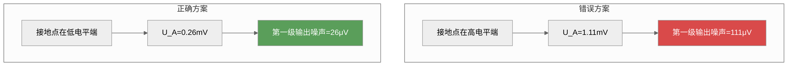

*图6-XX：三级放大器接地点选择——正确方案噪声降低33 dB*

#### 高增益放大器接地系统设计

柯金良给出了一个高增益放大器接地系统的设计范例。对于一个多级高增益放大器，接地系统的设计原则为：

1. **各级独立地线**：各级放大器使用独立的地线汇接到公共接地点，避免共阻抗耦合
2. **接地点靠近输入端**：公共接地点选择在靠近第一级（输入端）的位置
3. **输入屏蔽层单点接地**：输入电缆的屏蔽层在放大器输入端接地
4. **电源去耦**：每级放大器的电源引脚就近对地去耦（0.1 μF + 10 μF并联）

#### 混合信号系统的接地点选取

在包含模拟和数字电路的混合信号系统中，接地点选取还需要额外考虑：

**规则一：模拟地和数字地物理分离**。模拟信号的回流电流和数字信号的回流电流不应共享同一条地线。模拟地和数字地在PCB上是两个独立的地网络。

**规则二：单点汇接**。模拟地和数字地只在系统的一点汇接——通常选择在ADC芯片下方或电源入口处。

**规则三：桥接元件**。在模拟地和数字地之间可以使用以下桥接元件：
- **0 Ω电阻**：最简单的连接方式，适用于低频
- **铁氧体磁珠**：提供高频隔离，适用于数MHz以上的系统
- **肖特基二极管对**（背靠背）：提供电压钳位，防止地电位差过大，但不提供DC隔离
- **地分割+桥接**：物理上分割地平面，在分割处通过一个窄桥（通常宽度5~10 mm）连接

**例6-19**：一个16位数据采集系统，模拟部分包含4通道仪表放大器（增益100）、16位ADC（转换速率100 kHz）；数字部分包含FPGA（100 MHz主频）和DDR存储器。设计其接地系统。

解：
(a) 系统分析：
- 16位ADC的LSB电压（参考电压5 V）：$V_{\text{LSB}} = 5/2^{16} \approx 76\ \mu\text{V}$
- 地噪声必须远小于LSB（通常 < LSB/10），即 < 7.6 μV
- 模拟部分最高频率100 kHz，数字部分100 MHz——频率跨度1000倍

(b) 接地策略：
- PCB采用四层板：顶层（模拟+数字信号）+ 第二层（完整地平面）+ 第三层（电源）+ 底层（辅助信号）
- 地平面不做物理分割——使用完整地平面并通过分区布局实现隔离
- 全部模拟器件集中布局在PCB左侧区域，数字器件在右侧
- ADC放置在模拟区和数字区的交界处
- 模拟区下方地平面不布线，保持完整

(c) 关键接口处理：
- ADC的模拟地和数字地引脚分开，在ADC芯片正下方通过一个窄桥连接
- FPGA下方设置间距1 cm的地过孔阵列
- 模拟电源和数字电源使用独立的LDO，分别供电
- 模拟地和数字地之间不设桥接元件——使用完整地平面自然耦合

#### 总结：接地点选取的通用准则

| 系统类型 | 接地点选取原则 | 典型示例 |
|:--------|:-------------|:--------|
| 单级放大器 | 接地点靠近输入端 | 前置放大器 |
| 多级放大器 | 接地点靠近低电平级（第一级） | 三级中频放大器 |
| 高增益放大器 | 各级独立地线+输入端附近汇接 | 仪表放大器 |
| 混合信号系统 | 模拟地/数字地分离+单点汇接 | 数据采集系统 |
| 射频系统 | 多点接地+地平面 | 射频功放模块 |
| 电力电子系统 | 电源地/信号地分离+安全地独立 | 变频器 |

*设问过渡：无论采用何种信号接地方式，只要系统中有两个以上的接地点且存在电位差，就会产生地环路干扰。下一节将系统讨论地回路干扰的形成原因和抑制方法。*

---

## 6.5 地回路干扰及其抑制

地回路干扰（Ground Loop Interference）是多设备系统中最常见的EMC问题之一。当两个或更多设备通过信号电缆互连，且各设备分别通过不同路径接地时，互连电缆和接地路径就构成了一个闭合环路——地环路。

### 6.5.1 地回路干扰的形成

地回路干扰的形成有三个根本原因。

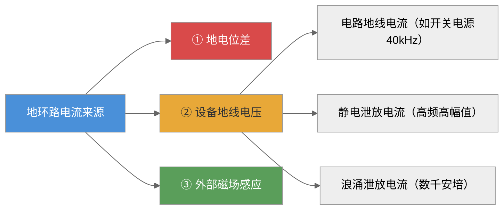

*图6-9：地环路电流的三个来源*

#### 原因一：地电位差（Ground Potential Difference）

两台设备的接地点位于建筑物不同位置，地线存在阻抗，其他设备电流流过这段地线时产生电位差。这个电位差驱动"设备1→互连电缆→设备2→大地"环路中的电流。

地线电位差估算：

$$
U_G = I_{\text{ground}} \times Z_{\text{ground}}
\tag{6-93}
$$

在实际工程中，地电位差的大小可以从数mV到数V不等，取决于以下因素：
- 建筑接地系统的质量和接地电阻
- 附近大功率设备的漏电流和开关噪声
- 接地导线的长度和阻抗
- 土壤电阻率

**地电位差的定量估算**：

考虑两栋建筑物之间的接地系统，各自有独立接地体。当一栋建筑中有大功率设备运行时，其接地电流通过大地流到另一栋建筑，在两接地体之间产生电位差：

$$
U_{\text{GPD}} = I_{\text{fault}} \times (R_{G1} + R_{\text{earth}} + R_{G2})
\tag{6-94}
$$

式中 $R_{G1}$、$R_{G2}$ 分别为两建筑的接地电阻，$R_{\text{earth}}$ 为两接地体之间大地的等效电阻。

**例6-20**：建筑物A的接地电阻为5 Ω，建筑物B的接地电阻为10 Ω，两建筑间距100 m，大地等效电阻约2 Ω。建筑物A中一台大功率变频器有1 A的漏电流流入接地系统。计算建筑物A和B之间的地电位差。

解：
$$
U_{\text{GPD}} = 1 \times (5 + 2 + 10) = 17\ \text{V}
\tag{6-95}
$$

17 V的地电位差足以严重干扰通过长距离电缆互连的两建筑之间的通信信号。

#### 原因二：设备地线上的电压降

包括以下三个子来源：

**（a）电路地线电流——开关电源噪声**：开关电源的开关管在高频（数十至数百kHz）开关动作时，通过Y电容（连接于电源线与机壳之间的电容）将高频电流注入安全地线。这个电流在接地导线的阻抗上产生电压降。

以10 m长的接地导线为例，40 kHz时电感约10 μH，感抗约2.5 Ω。若地线上有10 mA的开关电源电流流过，则 $U_G = 10\ \text{mA} \times 2.5\ \Omega = 25$ mV——对于灵敏度为毫伏级的模拟系统，这已足以造成干扰。

**（b）静电泄放电流**：ESD事件发生时，静电电荷在纳秒级时间内泄放，产生极高的电流变化率（$di/dt$ 可达数十A/ns）。这个电流通过接地导线时，即使很小的电感也会产生很高的感应电压：

$$
U_{\text{ESD}} = L \cdot \frac{di}{dt}
\tag{6-96}
$$

**例6-21**：一根10 cm长的接地导线，电感约100 nH。当ESD电流在1 ns内上升至10 A时，接地线上产生的感应电压为多少？

解：
$$
U_{\text{ESD}} = 100 \times 10^{-9} \times \frac{10}{1 \times 10^{-9}} = 1000\ \text{V}
\tag{6-97}
$$

1000 V的感应电压足以击穿CMOS器件的栅氧化层——这就是ESD造成设备损坏的一个重要机理。

**（c）浪涌泄放电流**：雷击浪涌电流可达数千安培，流入接地系统后产生极高的地电位升。

#### 原因三：外部电磁场感应

根据法拉第电磁感应定律，地环路在交变磁场中感应出电压：

$$
U_{\text{ind}} = A \cdot \frac{dB}{dt}
\tag{6-98}
$$

式中 $A$ 为环路面积，$B$ 为穿过环路的磁通密度。

考虑一个由信号电缆和地平面构成的矩形环路，宽为 $w$、长为 $l$，置于磁通密度为 $B$ 的均匀交变磁场中：

$$
U_{\text{ind}} = w \cdot l \cdot \frac{dB}{dt} = A \cdot 2\pi f B
\tag{6-99}
$$

**例6-22**：一条长30 m的信号电缆连接两个设备，电缆距离地平面高度20 cm（环路面积 $A = 30 \times 0.2 = 6$ m²），附近有一条10 kV电力线（50 Hz），在电缆环路处产生3 μT的磁场。计算地环路感应的50 Hz干扰电压。

解：
$$
U_{\text{ind}} = 6 \times 2\pi \times 50 \times 3 \times 10^{-6} = 6 \times 9.42 \times 10^{-4} \approx 5.65\ \text{mV}
\tag{6-100}
$$

5.65 mV的50 Hz干扰对于4~20 mA模拟信号（精度0.1%对应约~0.02 mA）已经达到显著水平。

如果磁场频率为100 kHz（开关电源噪声），磁场强度1 μT：
$$
U_{\text{ind}} = 6 \times 2\pi \times 10^5 \times 1 \times 10^{-6} = 3.77\ \text{V}
\tag{6-101}
$$

3.77 V的干扰足以使逻辑电路产生误动作。这个例子清楚地说明了：**减小环路面积是抑制磁场感应最有效的方法**。如果电缆紧贴地平面布线（高度降至1 cm），感应电压将降低20倍。

#### 地环路干扰的频域特性

从第4章耦合唯一定理的角度，地环路干扰可以统一理解为**共阻抗耦合**和**电感性耦合**的组合：

$$
U_{\text{noise}}(f) = I_{\text{loop}}(f) \times Z_{\text{common}}(f) + j\omega M(f) I_{\text{source}}(f)
\tag{6-102}
$$

式中第一项为共阻抗耦合项（由地线阻抗引起），第二项为电感性耦合项（由互感引起）。

在低频下（$f < 1$ kHz），地环路干扰以**共阻抗耦合**为主——地线电阻占主导，电位差驱动环路电流。在高频下（$f > 100$ kHz），地环路干扰以**电感性耦合**为主——地线感抗和互感占主导。

**表6-9：不同频率下地环路干扰的主导机制**

| 频率范围 | 主导机制 | 主要来源 | 抑制重点 |
|:--------|:--------|:--------|:--------|
| DC~1 kHz | 共阻抗耦合 | 接地电阻、工频漏电流 | 降低接地电阻 |
| 1~100 kHz | 混合 | 开关电源、谐波 | 缩短地线、共模扼流圈 |
| 100 kHz~10 MHz | 电感性耦合 | 开关瞬态、谐波 | 减小环路面积、屏蔽 |
| > 10 MHz | 电磁辐射耦合 | 射频干扰 | 屏蔽+滤波+接地 |

### 6.5.2 地回路干扰的抑制

以下是六种常用抑制方法。在实际工程中，通常是多种方法的组合使用效果最佳。

#### 方法一：单点接地——从根源切断地环路

单点接地是切断地环路的最直接方法。张亮案例已证明：两点接地时100 mV地噪声→95 mV传入放大器；单点接地后降至0.095 μV——**改善约120 dB**。但仅在低频有效——高于10 MHz时分布电容提供了无形的高频通路。

单点接地抑制效果的定量分析已在6.4.1节的两个案例中详细给出（见式6-35~6-37和例6-XX）。

#### 方法二：隔离变压器

隔离变压器在信号的电气路径中插入一个高阻抗（变压器的磁耦合传递信号，但初次级之间没有直接电气连接），从而切断地环路中的直流和低频电流通路。

根据隔离变压器的阻抗变换原理，隔离变压器抑制地回路干扰的定量关系为：

$$
U_N = U_G \times \frac{Z_{\text{iso}}}{Z_{\text{iso}} + Z_{\text{ground}}}
\tag{6-103}
$$

当隔离阻抗 $Z_{\text{iso}} \to \infty$ 时，$U_N \to 0$。

实际变压器的初次级间存在分布电容 $C_{\text{ps}}$，高频时隔离效果减弱：

$$
Z_{\text{iso}}(f) = \frac{1}{j2\pi f C_{\text{ps}}}
\tag{6-104}
$$

**例6-23**：一个音频隔离变压器的初次级间分布电容为50 pF，信号频率为1 kHz和100 kHz，分别计算其隔离阻抗。

解：
(a) 1 kHz下：$Z_{\text{iso}} = 1/(2\pi \times 10^3 \times 50 \times 10^{-12}) \approx 3.18$ MΩ——隔离效果极好
(b) 100 kHz下：$Z_{\text{iso}} = 1/(2\pi \times 10^5 \times 50 \times 10^{-12}) \approx 31.8$ kΩ——隔离效果显著下降

**改进方法**：在变压器的初次级之间加入**静电屏蔽层**并接地。屏蔽层截断了初次级之间的电场耦合路径，将分布电容从50 pF降至约1 pF以下，使100 kHz下的隔离阻抗提升至约1.6 MΩ。

#### 方法三：光耦合器

光耦合器利用光信号实现电气隔离，隔离阻抗极高（$10^{11}\ \Omega$量级），输入输出间的分布电容极小（< 1 pF）。

光耦合器传输信号的等效模型：

$$
U_{\text{out}} = \text{CTR} \times I_{\text{in}} \times R_{\text{load}}
\tag{6-105}
$$

式中CTR（Current Transfer Ratio）为电流传输比，典型值10%~1000%。

局限性：
- 传输速率受限：普通光耦 < 1 Mbps，高速光耦可达10~50 Mbps
- 只能传输数字信号（或经过V/F转换的模拟信号）
- 需要隔离电源为输出侧供电

**应用场景**：隔离式ADC、数字通信接口、驱动电路的隔离控制。

#### 方法四：共模扼流圈

共模扼流圈（Common Mode Choke）对差模信号呈现低阻抗，对共模信号（地环路干扰）呈现高阻抗。

共模扼流圈的等效电路：两个绕向相同的线圈绕在同一个磁环上。差模电流在两个线圈中产生的磁通方向相反，相互抵消，不产生净磁场；共模电流产生的磁通方向相同，相互叠加，呈现高阻抗。

共模扼流圈的阻抗为：

$$
Z_{\text{CM}} = j\omega L_{\text{CM}} + R_{\text{core}}
\tag{6-106}
$$

电感量选择原则：在干扰频率下，共模阻抗应远大于地环路阻抗：

$$
2\pi f L_{\text{CM}} \gg Z_{\text{loop}}
\tag{6-107}
$$

**例6-24**：一个地环路的阻抗约为10 Ω（含地线电阻和感抗），干扰频率为100 kHz。选择共模扼流圈的电感量。

解：
要求 $2\pi f L_{\text{CM}} \geq 10 \times Z_{\text{loop}} = 100$ Ω（10倍裕量）：
$$
L_{\text{CM}} \geq \frac{100}{2\pi \times 10^5} \approx 159\ \mu\text{H}
\tag{6-108}
$$

选择标称值220 μH的共模扼流圈，在100 kHz下共模阻抗约138 Ω，可有效抑制地环路电流。

共模扼流圈的频率特性受磁芯材料的限制。锰锌铁氧体（Mn-Zn ferrite）适用于10 kHz~1 MHz，镍锌铁氧体（Ni-Zn ferrite）适用于1 MHz~100 MHz，纳米晶磁芯适用于10 kHz~100 MHz。

#### 方法五：平衡电路

将非平衡传输改为平衡传输（差分放大器、平衡变压器），地环路干扰作为共模信号被抑制。

差分电路的共模抑制比为：

$$
\text{CMRR} = 20\log\frac{A_d}{A_c}
\tag{6-109}
$$

理想差分放大器对共模信号的增益为0。实际差分放大器的CMRR受电阻匹配精度限制：

$$
\text{CMRR} \approx 20\log\frac{1 + A_d}{4\delta}
\tag{6-110}
$$

式中 $\delta$ 为电阻匹配误差。例如，$\delta = 0.1\%$ 时，CMRR ≈ 54 dB；$\delta = 0.01\%$ 时，CMRR ≈ 74 dB。

**例6-25**：一个地环路在差分输入端产生300 mV的共模干扰，仪表放大器的CMRR为90 dB。计算输出端的共模干扰电压。

解：
(a) 90 dB对应的共模增益：$A_c = 10^{-90/20} = 3.16 \times 10^{-5}$
(b) 输出端共模干扰：$U_{\text{out,CM}} = 300\ \text{mV} \times 3.16 \times 10^{-5} \approx 9.5\ \mu\text{V}$

9.5 μV的等效输入干扰对于16位ADC（LSB ≈ 76 μV @ 5V参考）是可以接受的。

#### 方法六：浮地+高阻泄放

在信号地与安全地之间接入1~10 MΩ电阻，缓慢泄放静电荷，同时保持高阻隔离。具体定量分析已在6.4.4节给出。

#### 方法七：综合应用——多层屏蔽与接地

对于高要求的系统，通常采用**多层屏蔽**并配合正确的接地策略：

1. **第一层屏蔽**：设备机箱——屏蔽外部电磁场，接到安全地
2. **第二层屏蔽**：内部电路屏蔽盒——屏蔽内部电路间的串扰，接到信号地
3. **第三层屏蔽**：关键信号线的屏蔽层——屏蔽线间串扰，单点接地

各层屏蔽的接地必须遵循：安全地<->信号地通过一个点连接（通常在电源入口），严禁各层屏蔽在多点随意连接，以免形成复杂的地环路耦合。

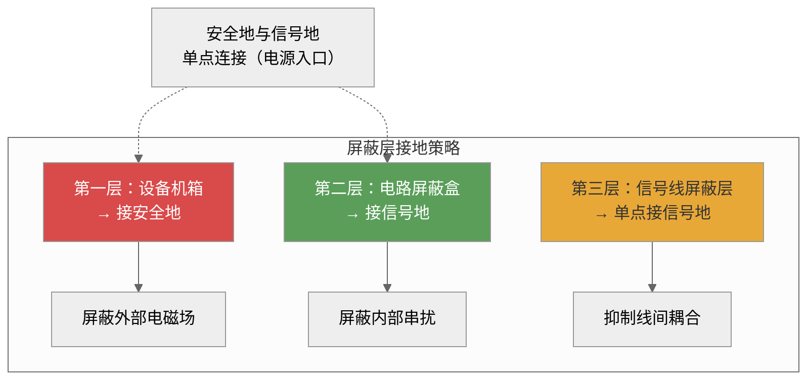

*图6-10：多层屏蔽接地策略——各层各自接地，仅在电源入口处单点连接*

**抑制方法对比：**

| 抑制方法 | 适用频率 | 隔离效果 | 成本 | 典型应用 |
|:---------|:--------:|:--------:|:----:|:---------|
| 单点接地 | DC~1 MHz | 好 | 低 | 音频、仪器系统 |
| 隔离变压器 | DC~100 MHz | 好 | 中 | 通信接口、电源 |
| 光耦合器 | DC~50 Mbps | 极好 | 中 | 数字隔离 |
| 共模扼流圈 | 10 kHz~GHz | 中等 | 低 | 电缆、电源线 |
| 平衡电路 | DC~MHz | 取决于CMRR | 中-高 | 传感器、音频 |
| 浮地+高阻泄放 | DC~1 MHz | 好 | 低 | 便携设备 |
| 多层屏蔽 | DC~GHz | 极好 | 高 | 精密仪器、医疗 |

*设问过渡：地回路干扰的抑制需要综合运用多种技术。在实际工程中，往往是单点接地+隔离变压器+共模扼流圈的组合策略最为有效。*

---

## 6.6 屏蔽体接地

屏蔽体接地是信号接地和干扰控制接地的重要应用。无论是机箱屏蔽、放大器屏蔽盒还是电缆屏蔽层，正确的接地方式决定了屏蔽能否发挥作用。

### 6.6.1 放大器屏蔽盒的接地

高增益放大器常常装在金属屏蔽盒内，以防止外部电磁场耦合到敏感电路。然而，屏蔽盒与放大器之间存在寄生电容——如果接地不当，这些寄生电容会形成有害的反馈通路。

放大器与屏蔽盒之间的寄生电容 $C_{1S}$ 和 $C_{3S}$ 会在输出端到输入端之间构成反馈回路。反馈到输入端的骚扰电压为：

$$
U_{\text{n}} = \frac{C_{3S}}{C_{2S} + C_{3S}} U_3
\tag{6-111}
$$

式中，$U_3$ 为放大器输出端电压，$U_{\text{n}}$ 为反馈到输入端的骚扰电压。

这一反馈可能引起放大器自激振荡或性能降级。抑制的方法是将屏蔽盒与放大器的参考地（信号地）连接，使 $C_{2S}$ 和 $C_{3S}$ 被短路，切断反馈路径。屏蔽盒的接地点应选择在放大器的输入端参考地附近。

**定量分析**：设放大器的中频增益为 $A_0 = 60$ dB（1000倍），输出信号幅值 $U_3 = 1$ V。若 $C_{3S} = 5$ pF，$C_{2S} = 10$ pF，则：

$$
U_{\text{n}} = \frac{5}{10 + 5} \times 1 = 0.333\ \text{V}
\tag{6-112}
$$

这个0.333 V的反馈电压经放大器放大后（$A_0 = 1000$），在输出端产生的等效干扰为 $0.333 \times 1000 = 333$ V——显然会导致放大器饱和或自激。将屏蔽盒接信号地后，$C_{2S}$ 被短路，$U_{\text{n}} \approx 0$。

**工程经验**：对于增益超过40 dB的高增益放大器，屏蔽盒接地是防止自激的**必要条件**而非可选措施。对于增益超过60 dB的电路，还应考虑使用双层屏蔽——内层屏蔽接信号地，外层屏蔽接安全地。

### 6.6.2 电缆屏蔽层的接地

信号传输电缆的屏蔽层接地是工程中最常见的接地应用之一。屏蔽层的接地方式取决于信号频率、传输距离和系统接地情况。

#### 屏蔽层接地的屏蔽效能计算

屏蔽层的屏蔽效能主要由以下两个因素决定：

**（1）电场屏蔽**：屏蔽层为信号线提供静电屏蔽。当屏蔽层接地时，屏蔽层与信号线之间的分布电容为外部电场提供了一个低阻抗旁路路径。屏蔽层对电场的屏蔽效能为：

$$
\text{SE}_E = 20\log\left(1 + \frac{Z_{\text{shield}}}{Z_{\text{stray}}}\right)
\tag{6-113}
$$

式中 $Z_{\text{shield}}$ 为屏蔽层接地阻抗，$Z_{\text{stray}}$ 为屏蔽层与外部电场源之间的杂散阻抗。

**（2）磁场屏蔽**：对于磁场屏蔽，屏蔽效能取决于屏蔽层中感应电流产生的抵消磁场。在高频下，屏蔽层中的感应电流产生的磁场方向与入射磁场相反，实现磁屏蔽。

$$
\text{SE}_H = 20\log\left(1 + \frac{j\omega M}{Z_{\text{shield}}}\right)
\tag{6-114}
$$

式中 $M$ 为屏蔽层与信号线之间的互感。从式(6-84)可以看出，$Z_{\text{shield}}$ 越小，磁场屏蔽效能越高——这就是为什么屏蔽层接地阻抗必须足够低的根本原因。

**例6-XX（屏蔽层接地的猪尾线效应）**：一根同轴电缆的屏蔽层在连接器处采用5 cm长的猪尾线接地。猪尾线的电感约50 nH。在100 MHz下，计算猪尾线的感抗及其对屏蔽效能的影响。

解：
(a) 5 cm猪尾线在100 MHz下的感抗：
$$
X_L = 2\pi \times 10^8 \times 50 \times 10^{-9} = 31.4\ \Omega
\tag{6-115}
$$

(b) 设同轴电缆的特性阻抗为50 Ω，屏蔽层与信号线的互感 $M \approx L_{\text{shield}} \approx 50$ nH（估算）。100 MHz下，$j\omega M = 31.4\ \Omega$。

(c) 根据式(6-84)，磁场屏蔽效能：
$$
\text{SE}_H = 20\log\left(1 + \frac{31.4}{31.4}\right) = 20\log(2) \approx 6\ \text{dB}
\tag{6-116}
$$

仅6 dB的磁场屏蔽效能——几乎是无效的！如果使用360°端接（屏蔽层阻抗接近0 Ω），$\text{SE}_H \to \infty$。

```mermaid
%%{init: {"flowchart": {"useMaxWidth": false}, "theme": "neutral"}}%%
graph TB
    subgraph 猪尾线接地（错误）
    PIG["5cm猪尾线 L=50nH"] --> PIG1["Z_shield=31.4Ω@100MHz"]
    PIG1 --> PIG2["SE_H=6dB  几乎无效"]
    end
    subgraph 360°端接（正确）
    FULL["360°屏蔽层端接"] --> FULL1["Z_shield≈0Ω"]
    FULL1 --> FULL2["SE_H→∞  屏蔽完美"]
    end
    style PIG2 fill:#d94a4a,color:#fff
    style FULL2 fill:#5a9e5a,color:#fff
```

*图6-XX：猪尾线接地vs 360°端接的屏蔽效能对比*

#### 机箱屏蔽的接地设计

设备机箱的屏蔽接地也遵循类似的原则。在低频段（< 100 kHz），机箱应单点接地以避免地环路；在高频段（> 1 MHz），机箱应通过多条短接地带与系统地连接。

机箱接地带的设计要求：
1. 接地带长度应小于最高工作频率对应波长的1/20
2. 接地带宽度应尽量大（推荐宽厚比 > 10）
3. 使用镀银铜带以降低高频表面电阻
4. 在机箱的多个位置设置接地点，接地点间距 < λ/20

**机箱接地带的阻抗计算**：

机箱接地带在高频下的阻抗为：

$$
Z_{\text{strap}}(f) = \sqrt{R_{\text{AC}}^2(f) + (2\pi f L_{\text{strap}})^2}
\tag{6-117}
$$

**例6-XX**：一个射频屏蔽机箱的工作频率上限为500 MHz，机箱到地平面的接地带长2 cm、宽1 cm、厚0.5 mm。计算该接地带在500 MHz下的阻抗。如果改用长5 cm的接地带，阻抗变化多少？

解：
(a) 短接地带（2 cm × 1 cm）：
电感估算：$L \approx 2\times 10^{-7} \times 0.02 \times [\ln(2\times 0.02/0.01) + 0.5] = 4\times 10^{-9} \times [\ln 4 + 0.5] \approx 4\times 10^{-9} \times 1.886 \approx 7.54$ nH
感抗：$X_L = 2\pi \times 5\times 10^8 \times 7.54 \times 10^{-9} \approx 23.7\ \Omega$

(b) 长接地带（5 cm × 1 cm）：
电感：$L \approx 2\times 10^{-7} \times 0.05 \times [\ln(2\times 0.05/0.01) + 0.5] = 10^{-8} \times [\ln 10 + 0.5] = 10^{-8} \times 2.803 \approx 28.0$ nH
感抗：$X_L = 2\pi \times 5\times 10^8 \times 28.0 \times 10^{-9} \approx 88.0\ \Omega$

(c) 对比：接地带从2 cm加长到5 cm，阻抗从23.7 Ω增加到88.0 Ω——增加了3.7倍。在500 MHz下，88 Ω的接地阻抗几乎处于开路状态，机箱屏蔽完全失效。这就是为什么射频屏蔽机箱必须使用极短的接地带，并在多个位置同时接地。

#### 屏蔽电缆接地的综合案例

**例6-XX**：某测量系统包含以下信号链路：
- 模拟信号：±10 V，带宽100 kHz，通过双绞屏蔽线传输，距离30 m
- 数字信号：RS-485，波特率1 Mbps，通过双绞屏蔽线传输，距离100 m
- 视频信号：CVBS，6 MHz带宽，通过75 Ω同轴电缆传输，距离50 m

设计各信号电缆的屏蔽层接地方案。

解：
**（a）模拟信号（100 kHz）：**
- 频率100 kHz < 1 MHz，属于低频
- 屏蔽层应采用**单点接地**
- 若信号源浮空、接收端接地：屏蔽层在接收端接地
- 若30 m电缆两端的地电位差较大（> 1 V），增加信号隔离器

**（b）RS-485数字信号（1 Mbps）：**
- RS-485本身就是平衡传输，共模抑制能力强
- 屏蔽层采用**单点接地**（在控制器端接地）
- 在电缆两端各加一个共模扼流圈（100 μH），抑制共模干扰

**（c）视频信号（6 MHz）：**
- 6 MHz > 1 MHz，接近10 MHz，属于中频
- 75 Ω同轴电缆的屏蔽层应采用**多点接地**（至少两端接地）
- 确保屏蔽层与BNC连接器进行360°端接
- 检查屏蔽层接地点的间距 < λ/20（6 MHz的λ/20 ≈ 2.5 m，远大于50 m电缆，因此两端接地足够）
- 检查屏蔽层接地点的间距 < λ/20（6 MHz的λ/20 ≈ 2.5 m，远大于50 m电缆，因此两端接地足够）

### 6.6.3 电缆屏蔽层接地案例分析

**例6-6**：某工业现场，一台传感器（输出4~20 mA信号）通过50 m长的双绞屏蔽线连接到PLC模拟量输入模块。传感器端和PLC端都采用独立电源供电。现场存在较强的50 Hz工频电磁场。应如何设计屏蔽层接地？

解：
（a）信号频率：4~20 mA为DC信号，属低频。
（b）两端供电情况：传感器和PLC的电源各自独立，两地的接地点不同，存在地电位差风险。
（c）设计方案：
   - 在传感器端浮空（不接地），PLC端接地
   - 屏蔽层在PLC端单点接地
   - 在PLC输入端并联TVS管和共模扼流圈，抑制瞬态干扰
   - 如50 Hz干扰仍然严重，在传感器输出和PLC输入之间串联信号隔离器

（d）预期效果：屏蔽层单点接地避免了地环路，同时利用屏蔽层的静电屏蔽作用抑制了50 Hz电场耦合。

*设问过渡：至此，本章完成了从接地概念到安全接地、从接地导体阻抗特性到信号接地方式、从地回路干扰到屏蔽体接地的完整知识体系。下一节将讨论大型系统的接地设计，这是接地理论在实际工程中的综合应用。*

## 6.7 大型系统接地举例

柯金良《电磁兼容概论》§5.7提供了四本书中独有的大型系统接地工程案例，是对前面各节接地理论在实际工程中的综合运用。本节从建筑物接地、变电站接地网、通信基站接地和工业厂房接地四个方面，给出详细的工程计算和设计方法。

### 6.7.1 建筑物接地系统

建筑物的接地系统由三部分组成：

- **基础接地体**：建筑物的钢筋混凝土基础中的钢筋，通过焊接形成网格状接地体，与大地直接接触。基础钢筋网格的接地电阻可按式(6-6)计算，其中电容 $C$ 为钢筋网格对大地的分布电容。
- **接地网**：在建筑物周围地中埋设的水平接地体网格，与基础接地体相连，用于分散流散电流
- **等电位搭接网络**：将所有进入建筑物的金属管线（水管、气管、电缆金属护套等）与建筑物的接地系统进行等电位搭接

**例6-26**：一栋长50 m、宽30 m的建筑物，基础采用钢筋混凝土条形基础。地基土壤电阻率为100 Ω·m。估算该建筑物的基础接地电阻。

解：
建筑物的基础接地体可近似为一块埋在地中的水平金属板。根据静电学公式，矩形金属板的电容约为：
$$
C \approx 4\varepsilon_0\sqrt{A}
\tag{6-118}
$$
式中 $A$ 为金属板面积。

(a) 基础面积：$A = 50 \times 30 = 1500$ m²
(b) 等效电容：$C \approx 4 \times 8.85 \times 10^{-12} \times \sqrt{1500} \approx 4 \times 8.85 \times 10^{-12} \times 38.73 \approx 1.37 \times 10^{-9}$ F
(c) 接地电阻（由式6-6：$R = \varepsilon\rho/C$）：
$$
R = \frac{8.85 \times 10^{-12} \times 100}{1.37 \times 10^{-9}} \approx 0.646\ \Omega
\tag{6-119}
$$

0.646 Ω的接地电阻非常低——这就是为什么现代建筑规范强制要求利用基础钢筋作为自然接地体，它能以最低的成本获得最优的接地效果。

**等电位搭接网络**：柯金良强调，建筑物内电子设备应通过等电位搭接网络与建筑物钢筋相连，确保雷击时各设备电位大致相等，防止出现不同设备与建筑物间的危险电位差。典型的建筑物搭接网络网格宽度为 **5 m**。

**例6-27**：一栋高层建筑共30层，每层面积1000 m²。在雷击时，雷电流为100 kA（8/20 μs波形），建筑物的接地电阻为1 Ω。计算：(a) 雷击时的地电位升；(b) 如果顶层和底层之间的接地引线电感为5 μH，顶层和底层之间的瞬态电位差。

解：
(a) 地电位升（由接地电阻引起）：
$$
U_{\text{rise}} = I_{\text{lightning}} \times R_G = 100 \times 10^3 \times 1 = 100\ \text{kV}
\tag{6-120}
$$
这是接地体对无穷远处的电压。但建筑物内部各设备之间的电位差取决于等电位搭接网络。

(b) 顶层和底层间的电位差（由接地引线电感引起）：
雷电流上升时间8 μs，峰值100 kA，$di/dt \approx 100 \times 10^3 / (8 \times 10^{-6}) = 1.25 \times 10^{10}$ A/s
$$
U_{\text{L}} = L \times \frac{di}{dt} = 5 \times 10^{-6} \times 1.25 \times 10^{10} = 62.5\ \text{kV}
\tag{6-121}
$$

62.5 kV的电位差足以击穿电子设备的绝缘——这就是为什么高层建筑的接地引线必须使用多条并联的宽扁铜带以降低电感，且每层都要与建筑物钢筋可靠搭接。

### 6.7.2 变电站接地网

变电站接地网由水平接地体和垂直接地体组成，是变电站安全运行的关键基础设施。其功能包括：
- 流散雷击电流和故障短路电流
- 维持低的地电位升，确保设备绝缘安全
- 控制接触电压和跨步电压在安全范围内
- 为弱电系统提供稳定的参考地电位

#### 接地网的电阻计算

对于矩形网格接地网，其接地电阻的估算公式（由IEEE Std 80-2000推荐）为：

$$
R_g = \rho \left[ \frac{1}{L_T} + \frac{1}{\sqrt{20A}} \left(1 + \frac{1}{1 + h\sqrt{20/A}}\right) \right]
\tag{6-122}
$$

式中：
- $\rho$ = 土壤电阻率（Ω·m）
- $L_T$ = 接地体总长度（m），包括水平接地体和垂直接地体
- $A$ = 接地网面积（m²）
- $h$ = 接地网埋设深度（m）

**例6-28**：一个100 m × 80 m的变电站接地网，埋深0.6 m，土壤电阻率200 Ω·m。接地网使用10 mm直径的圆钢，水平网格间距10 m，所有交叉点焊接。沿网格周边均匀布置20根垂直接地体（每根长3 m）。计算接地网的接地电阻。

解：
(a) 接地网面积：$A = 100 \times 80 = 8000$ m²
(b) 水平接地体数量：沿100 m方向11根（间距10 m）× 沿80 m方向9根（间距10 m）= 99个网格
水平接地体总长：$11 \times 80 + 9 \times 100 = 880 + 900 = 1780$ m
(c) 垂直接地体总长：$20 \times 3 = 60$ m
(d) 接地体总长度：$L_T = 1780 + 60 = 1840$ m
(e) 接地电阻（由式6-72）：
$$
R_g = 200 \times \left[ \frac{1}{1840} + \frac{1}{\sqrt{20 \times 8000}} \left(1 + \frac{1}{1 + 0.6\sqrt{20/8000}}\right) \right]
= 200 \times \left[ 0.000543 + \frac{1}{400} \times \left(1 + \frac{1}{1 + 0.6 \times 0.05}\right) \right]
= 200 \times [0.000543 + 0.0025 \times (1 + 0.971)] = 200 \times [0.000543 + 0.004928]
= 200 \times 0.005471 \approx 1.094\ \Omega
\tag{6-123}
$$

1.094 Ω的接地电阻满足变电站接地电阻小于2 Ω（IEC标准）的要求。

#### 变电站接地网的相关事故案例分析

柯金良引用了国内外变电站接地事故实例：

**案例一**：1988年我国某500 kV变电站在操作220 kV隔离开关时，暂态过电压通过接地网耦合到弱电系统，冲击损坏了几十只晶体管并导致开关误动作。事后分析发现，控制电缆的屏蔽层接地方式不当——在两端同时接地，形成了高频地环路，将接地网上的暂态过电压引入了弱电系统。

**案例二**：葛洲坝500 kV变电站调试过程中，隔离刀闸切合空母线时产生的干扰将差动保护的7片集成电路元件损坏。分析表明，保护柜的接地引线过长（超过5 m），在1 MHz以上的高频暂态下，接地引线的感抗高达31 Ω，导致机壳电位瞬间抬升，超过集成电路的耐受电压。

**案例三**：美国某500 kV变电站实测数据显示，接地网上不同点之间的电位差在操作开关时可达数V至20 kV（200 Hz~数MHz范围），这个数据清楚地表明即使精心设计的接地网也不是等电位体——这就是为什么控制电缆必须采用单点接地且屏蔽层不能随意两端接地的根本原因。

这些事故表明，大型系统接地设计中的任何疏忽都可能导致严重的经济损失和安全事故。

### 6.7.3 接地网与设备接地线的连接

柯金良提供了具体的接地棒与接地网连接示意图及设备与接地网连接示意图。关键工程要点：

- 接地棒与接地栅网之间应**焊接连接**（至少焊接长度≥10倍接地棒直径），不得仅依靠机械夹紧——因为机械夹紧会因腐蚀而松动
- 设备机座与接地栅网之间使用 **φ6.4 mm铜线**绞接并焊接，或使用截面不小于25 mm²的铜编织带
- 所有连接点均应涂覆防腐层（如沥青涂层），并定期检查
- 接地引下线应尽量短——每超过1 m的额外引线会增加约1 μH的电感

**例6-29**：一个保护柜通过15 m长的接地线连接到主接地网。在雷击时，雷电流的1 MHz分量流过该接地线，接地线的电感为1 μH/m。计算：(a) 接地线的感抗；(b) 若10 kA的雷电流流过，接地线上的电压降。

解：
(a) 接地线总电感：$L = 15 \times 1 = 15$ μH
1 MHz下的感抗：$X_L = 2\pi \times 10^6 \times 15 \times 10^{-6} \approx 94.2\ \Omega$

(b) 雷电流在接地线上产生的电压降（忽略电阻，感抗主导）：
$$
U = I \times X_L = 10 \times 10^3 \times 94.2 = 942\ \text{kV}
\tag{6-124}
$$

942 kV的电压——这显然是不可能的，实际中还没到这么高的电压就会发生击穿放电。但这个计算说明：**15 m长的接地引线在1 MHz下呈现约94 Ω的感抗，雷电流在其上产生极高的电压降**。这就是为什么保护柜必须尽量靠近接地网（引线< 1 m）。

### 6.7.4 通信基站接地系统设计

通信基站的接地系统是一个典型的综合接地案例，包含防雷接地、工作接地和保护接地。

**基站的接地电阻要求**：按GB 50689标准，通信基站接地电阻应小于5 Ω。在高土壤电阻率地区（> 1000 Ω·m），允许放宽到10 Ω。

**基站的环形接地体设计**：
通信基站周围应敷设环形水平接地体，埋深0.5~0.8 m，距离基站基础2~3 m。环形接地体使用40 mm × 4 mm的镀锌扁钢。环形接地体的接地电阻为：

$$
R_{\text{ring}} = \frac{\rho}{2\pi^2 D} \ln\frac{4\pi D}{d}
\tag{6-125}
$$

式中 $D$ 为环形接地体直径（m），$d$ 为扁钢等效直径（m）。

**例6-30**：某通信基站建在土壤电阻率为300 Ω·m的地区。基站外围敷设直径10 m的环形水平接地体（40 mm × 4 mm镀锌扁钢），并在环上均匀布置6根2.5 m长的垂直接地体。计算接地系统的总接地电阻。

解：
(a) 环形接地体扁钢的等效直径：$d = (4w/\pi)^{1/2} = (4 \times 0.04/\pi)^{1/2} \approx 0.225$ m
(b) 环形接地体电阻（由式6-73）：
$$
R_{\text{ring}} = \frac{300}{2\pi^2 \times 10} \ln\frac{4\pi \times 10}{0.225} = \frac{300}{197.4} \times \ln(558.5) = 1.52 \times 6.32 \approx 9.61\ \Omega
\tag{6-126}
$$

(c) 单根垂直接地体电阻（由式6-7，直径取16 mm）：
$$
R_{\text{rod}} = \frac{300}{2\pi \times 2.5} \left( \ln\frac{4 \times 2.5}{0.016} - 1 \right) = 19.1 \times (\ln 625 - 1) = 19.1 \times (6.44 - 1) \approx 103.9\ \Omega
\tag{6-127}
$$

(d) 6根垂直接地体并联（利用系数 $\eta = 0.7$）：
$$
R_{\text{rods,total}} = \frac{103.9}{6 \times 0.7} \approx 24.7\ \Omega
\tag{6-128}
$$

(e) 环形接地体与垂直接地体并联后的总电阻：
$$
R_{\text{total}} = \frac{9.61 \times 24.7}{9.61 + 24.7} \approx 6.92\ \Omega
\tag{6-129}
$$

(f) 6.92 Ω > 5 Ω——不满足GB 50689标准要求。

(g) 改进方案：将环形接地体直径增大到15 m，并增加垂直接地体到10根：
重新计算环形接地体：$R_{\text{ring}} = \frac{300}{2\pi^2 \times 15} \ln\frac{4\pi \times 15}{0.225} = \frac{300}{296.1} \times \ln 837.8 = 1.013 \times 6.73 \approx 6.82\ \Omega$
10根垂直接地体并联：$R_{\text{rods,total}} = \frac{103.9}{10 \times 0.65} \approx 15.98\ \Omega$
总电阻：$R_{\text{total}} = \frac{6.82 \times 15.98}{6.82 + 15.98} \approx 4.78\ \Omega < 5\ \Omega$ ✅

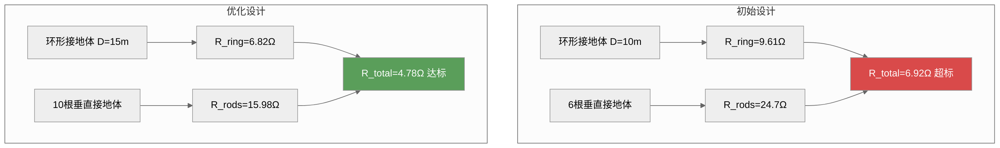

*图6-XX：通信基站接地系统优化——增大环形接地体直径和增加垂直接地体数量*

### 6.7.5 工业厂房接地系统设计

工业厂房包含多种设备：电力变压器、开关柜、电机、PLC控制柜、传感器、变频器等。其接地系统设计需要综合安全接地、信号接地和防雷接地的要求。

**设计原则**：
1. **统一接地网**：厂房内所有接地系统（安全地、信号地、防雷地）共用一个接地网
2. **网格化接地**：厂房接地网采用5 m × 5 m的网格
3. **分层接地**：强电设备和弱电设备不共享同一接地引线
4. **等电位连接**：所有进入厂房的金属管线做等电位连接

**例6-31**：一个50 m × 40 m的工业厂房，土壤电阻率150 Ω·m。厂房内包含变频器（10台，每台功率37 kW）、PLC柜（5面）、传感器（200个）和上位机系统。设计厂房的接地系统。

解：
(a) 接地网设计：沿厂房周边敷设40 mm × 4 mm镀锌扁钢，网格间距5 m × 5 m。水平接地体总长度：
沿50 m方向：11根 × 40 m = 440 m
沿40 m方向：9根 × 50 m = 450 m
水平总长：890 m

沿周边均匀布置20根垂直接地体（L=2.5 m，d=16 mm）。

(b) 接地电阻估算（由式6-72）：
$$
R_g = 150 \times \left[ \frac{1}{890 + 50} + \frac{1}{\sqrt{20 \times 2000}} \left(1 + \frac{1}{1 + 0.6\sqrt{20/2000}}\right) \right]
= 150 \times \left[ 0.001064 + \frac{1}{200} \times \left(1 + \frac{1}{1 + 0.6 \times 0.1}\right) \right]
= 150 \times [0.001064 + 0.005 \times (1 + 0.943)] = 150 \times [0.001064 + 0.009715]
= 150 \times 0.01078 \approx 1.62\ \Omega
\tag{6-130}
$$

1.62 Ω满足工业厂房的接地电阻要求（< 4 Ω）。

(c) 接地引线设计：
- 变频器柜：使用50 mm²铜编织带，长度< 2 m
- PLC柜：使用25 mm²铜编织带，长度< 1 m
- 传感器：使用4 mm²铜线，屏蔽层单点接地

(d) 等电位连接：
- 进入厂房的电缆金属外皮在入口处接地
- 金属水管、气管在入口处接地
- 厂房钢结构与接地网多点焊接（间距5 m）

### 6.7.6 大型系统接地的设计要点

综合柯金良的案例分析，大型系统接地设计应遵循以下要点：

1. **统一接地**：所有子接地系统（保护地、防雷地、安全地、信号地）最终汇总于**一点**与大地相连。这避免了不同接地体之间的电位差。

2. **网格化**：接地网采用网格结构，网格尺寸根据系统规模和土壤电阻率确定。典型网格尺寸为5~20 m。

3. **低阻抗**：接地电阻是核心指标，需根据系统要求计算并满足规范值：
   - 一般工业厂房：< 4 Ω
   - 通信基站：< 5 Ω
   - 变电站：< 2 Ω（或按设计）
   - 高层建筑：< 1 Ω

4. **等电位**：通过搭接网络实现各设备间的等电位连接，消除危险电位差。等电位连接导体的截面积应不小于系统最大接地引线截面积的1/2。

5. **可靠性**：所有连接点应采用焊接或压接加焊接的工艺，并做防腐处理。对于户外接地体，镀锌层厚度应不小于65 μm。

6. **可维护性**：在关键接地连接点设置可拆卸的测试点（螺栓连接+跨接线），方便定期测量接地电阻。

7. **防反击**：弱电系统的接地引线与防雷引下线之间的距离应保持≥2 m，防止雷击时弱电系统被反击损坏。

*设问过渡：至此，本章完成了从接地概念到安全接地、从接地导体阻抗特性到信号接地方式、从地回路干扰到屏蔽体接地、再到大型系统接地的完整知识体系。下面通过一个综合设计实例，将本章全部知识点融会贯通。*

## 6.8 综合设计实例：医疗监护仪的接地系统设计

本节通过一个完整的工程实例，综合运用本章所学的全部接地设计知识。

### 6.8.1 系统描述

某医用多参数监护仪需要测量以下生理信号：
- **心电信号（ECG）**：0.05~100 Hz，幅值0.1~5 mV，精度要求≤10 μV（等效输入噪声）
- **血氧饱和度（SpO₂）**：DC~10 Hz，红光/红外光测量
- **无创血压（NIBP）**：DC~5 Hz，压力传感器
- **体温**：DC信号，热敏电阻测量

监护仪同时包含：
- ARM Cortex-A7主控处理器（1 GHz主频）
- 7英寸LCD显示屏（含LVDS接口，600 MHz时钟）
- WiFi/蓝牙无线通信模块（2.4 GHz）
- 开关电源适配器（100 kHz开关频率）
- 隔离式DC-DC电源模块（患者隔离）

### 6.8.2 接地设计需求分析

**安全性要求**：医疗设备必须满足IEC 60601-1标准，患者漏电流 < 10 μA，外壳漏电流 < 100 μA。

**信号完整性要求**：ECG信号的最小可检测电平为10 μV，接地系统引入的噪声必须 < 1 μV（参考输入端）。

**EMC要求**：满足YY 0505-2012（医用电气设备EMC标准），辐射发射限值Class B。

**关键设计约束**：
1. 患者必须与大地电气隔离（患者地浮空），确保漏电流 < 10 μA
2. 主控部分（高速数字电路）必须使用地平面
3. 模拟前端（ECG、SpO₂）对噪声极其敏感
4. 开关电源是主要噪声源，必须有效隔离

### 6.8.3 接地系统拓扑设计

#### 5类独立接地系统的划分

根据6.4.6节的四类接地系统划分原则，将监护仪的电路分为5个独立的接地系统：

| 接地系统 | 包含电路 | 接地方式 | 噪声容忍度 |
|:--------|:---------|:--------|:---------|
| 患者地（Patient GND） | ECG前端、SpO₂前端 | 浮地+隔离 | 极高（μV级） |
| 模拟地（AGND） | 信号调理、ADC驱动 | 单点接地 | 高（mV级） |
| 数字地（DGND） | ARM处理器、LCD、WiFi | 地平面多点接地 | 低（V级） |
| 电源地（PGND） | DC-DC转换器、电源 | 单点接地 | 极低（噪声源） |
| 安全地（SGND） | 机壳、电源适配器地 | 接大地 | 安全相关 |

#### 5类地的隔离和连接

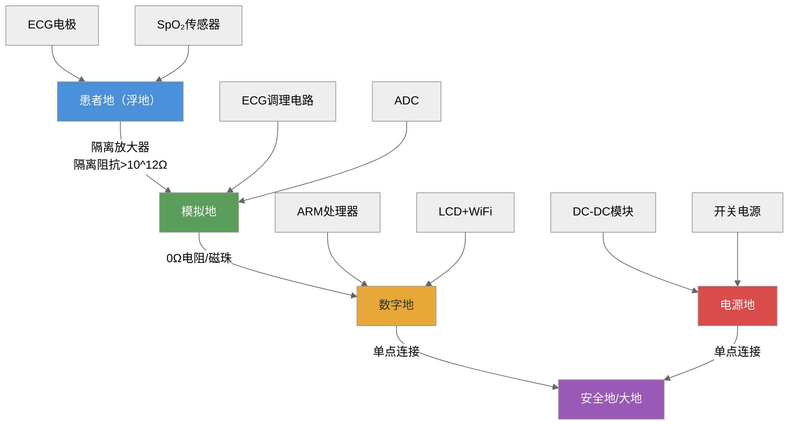

*图6-XX：医疗监护仪5类接地系统拓扑——从患者隔离到安全的完整链路*

### 6.8.4 各接地子系统的详细设计

#### 患者地（浮地+隔离）

患者地与监护仪的其他电路完全隔离，通过隔离放大器（ISO124，隔离阻抗$10^{12}$ Ω）、隔离式DC-DC电源模块和光耦合器实现。患者地对大地的分布电容约为50 pF。

根据式(6-47)（浮地阻抗公式）：
- 在50 Hz下：$Z_{\text{float}} = 1/(2\pi \times 50 \times 50 \times 10^{-12}) \approx 63.7$ MΩ
- 漏电流（220 V供电时）：$I_{\text{leak}} = 220 / 63.7 \times 10^6 \approx 3.45$ μA < 10 μA ✅（满足IEC 60601-1要求）

患者地接入一个10 MΩ泄放电阻以防止静电积累（根据例6-14、6-15的分析，50 pF分布电容+5 nC/s静电积累速率，不加泄放电阻仅需10秒即可达到1000 V）。

#### 模拟地（单点接地+星形拓扑）

ECG模拟前端采用并联一点接地（星形拓扑），各功能块（右腿驱动、前置放大、滤波、ADC驱动）使用独立地线汇接到ADC芯片正下方的一点。

ECG信号的最小检测电平为10 μV，根据例6-18的分析，必须将接地点靠近最低电平整（前置放大器）。接地引线使用3 mm宽的镀银铜带，长度< 20 mm，使电感 < 10 nH。

**共模抑制性能计算**：
ECG导联的共模抑制比（CMRR）要求 > 80 dB（@50 Hz）。患者对地的分布电容（50 pF）在两个导联上不一致（差动电容ΔC ≈ 2 pF），会导致共模到差模的转换：

$$
U_{\text{diff}} = U_{\text{CM}} \times \frac{\Delta C}{C_{\text{total}}} \times \frac{j\omega R_{\text{in}}}{1 + j\omega R_{\text{in}}C_{\text{total}}}
\tag{6-131}
$$

式中 $U_{\text{CM}}$ 为共模电压（由电源线Y电容引起的110 V共模电压），$R_{\text{in}}$ 为放大器输入阻抗（10 MΩ），$C_{\text{total}} \approx 50$ pF。在50 Hz下：

$$
U_{\text{diff}} = 110 \times \frac{2}{50} \times \frac{j \times 314 \times 10^7 \times 50 \times 10^{-12}}{1 + j \times 314 \times 10^7 \times 50 \times 10^{-12}} \approx 110 \times 0.04 \times 0.999 \approx 4.4\ \text{V}
\tag{6-132}
$$

4.4 V的差模干扰——这显然不可接受！解决方案是使用**右腿驱动电路**（Driven Right Leg, DRL），将共模电压反馈到患者右腿，使共模电压降低40~60 dB，降至约44 mV以下。此时：

$$
U_{\text{diff}} = 0.044 \times 0.04 \approx 1.76\ \text{mV}
\tag{6-133}
$$

1.76 mV对于10 μV的ECG信号仍然太大。需要进一步使用**屏蔽驱动**（Shield Drive）技术——将屏蔽层驱动到共模电压，使屏蔽层与信号线之间的寄生电容不产生额外差模电流。

#### 数字地（地平面+多点接地）

ARM处理器（1 GHz主频）和LCD（LVDS信号，600 MHz）使用四层PCB的第二层作为完整地平面（1 oz铜箔）。根据例6-16的计算，10 cm × 10 cm地平面的阻抗在1 GHz下仅约2.37 Ω。

地平面上的电流分布遵循镜像平面效应（式6-53）。LVDS信号的回流宽度约为 $3h = 3 \times 0.2 = 0.6$ mm——非常局部化，因此数字地平面的局部电压降不会干扰模拟区域。

处理器下方布置地过孔阵列（间距5 mm），确保每个接地引脚都有最近的地过孔。

#### 电源地（独立接地）

开关电源的接地应独立走线，不与其他信号地共享回路。电源地线使用10 mm宽的铜带，长度< 5 cm（确保在100 kHz下电感 < 30 nH，感抗 < 0.02 Ω）。

DC-DC隔离模块的输出地（为模拟前端供电）与控制电路地之间使用铁氧体磁珠连接（BLM31PG601SN1，@100 MHz阻抗600 Ω），防止数字噪声通过电源地耦合到模拟地。

### 6.8.5 屏蔽体接地设计

**机箱屏蔽**：监护仪使用金属机箱（铝制，厚1.5 mm）。机箱在低频（< 100 kHz）下单点接地（电源入口处接安全地），在高频（> 1 MHz）下通过4条短接地带（长2 cm、宽1 cm）在机箱四角多点接地。根据6.7节接地带阻抗计算公式(6-86)，2 cm×1 cm接地带在1 GHz下感抗约23.7 Ω——对于机箱屏蔽是可接受的（配合机箱自身的屏蔽效能）。

**信号电缆屏蔽**：
- ECG导联线：屏蔽层在监护仪端单点接患者地，通过隔离放大器后的屏蔽层接模拟地
- SpO₂传感器线：屏蔽层在监护仪端接患者地
- 电源线：使用三芯电源线，保护地端接安全地

### 6.8.6 接地性能验证

**验证项目一：安全接地电阻**。使用三极法测量安全接地电阻，要求 < 0.1 Ω（医疗设备特殊要求）。

**验证项目二：患者漏电流**。按IEC 60601-1标准测量，患者漏电流 < 10 μA。

**验证项目三：接地噪声频谱**。使用频谱分析仪通过近场探头测量各接地系统上的噪声谱：
- 患者地：< 1 μV（0.05~100 Hz）
- 模拟地：< 10 μV（DC~1 MHz）
- 数字地：< 100 mV（DC~1 GHz）

**验证项目四：共模抑制比**。在ECG输入端施加20 Vpp共模电压（@50 Hz），测量输出端的差模响应，CMRR应 > 80 dB。

**验证项目五：辐射发射**。按YY 0505-2012在电波暗室中测量，辐射发射应满足Class B限值。

### 6.8.7 设计总结

本综合实例展示了接地系统设计的完整流程：
1. **系统分析**：识别所有功能模块、信号频率和噪声源
2. **接地分类**：将电路分为独立接地系统（本例5类）
3. **方式选择**：根据频率选择单点/多点/混合/浮地
4. **隔离设计**：安全相关的隔离（患者隔离）必须优先保证
5. **屏蔽配合**：接地与屏蔽协同设计，确保屏蔽效能
6. **验证测试**：通过系统的测试计划验证接地设计的有效性

这个设计流程适用于任何复杂电子系统的接地设计——从简单的单板电路到大型系统，核心原则始终不变。

```mermaid
%%{init: {"flowchart": {"useMaxWidth": false}, "theme": "neutral"}}%%
graph TB
    A["接地技术"] --> B["6.1 概念分类"]
    A --> C["6.2 安全接地"]
    A --> D["6.3 导体阻抗"]
    A --> E["6.4 信号接地"]
    A --> F["6.5 地回路干扰"]
    A --> G["6.6 屏蔽体接地"]
    A --> H["6.7 大型系统接地"]
    A --> I["6.8 综合设计实例"]
    B --> B1["接地=目标 搭接=手段"]
    B --> B2["7目的→3大类"]
    B --> B3["4类接地系统"]
    C --> C1["设备安全接地 式(6-1)~(6-3)"]
    C --> C2["接零保护接地 式(6-3)"]
    C --> C3["接地体设计 式(6-5)~(6-7)"]
    C --> C4["例6-1 三极法测量"]
    C --> C5["例6-2 基站接地体"]
    D --> D1["DC电阻/AC电阻/集肤效应"]
    D --> D2["内电感/外电感"]
    D --> D3["扁平条 vs 圆导线"]
    D --> D4["例6-3~例6-5"]
    E --> E1["单点接地 式(6-31)~(6-45)"]
    E --> E2["多点接地 式(6-76)~(6-43)"]
    E --> E3["混合接地+谐振计算"]
    E --> E4["悬浮接地+ESD分析"]
    E --> E5["地平面与地栅系统"]
    E --> E6["电路接地点选取"]
    F --> F1["三种成因+频域特性"]
    F --> F2["张亮案例 120dB改善"]
    F --> F3["7种抑制方法"]
    G --> G1["放大器屏蔽盒 式(6-80)"]
    G --> G2["猪尾线效应计算"]
    G --> G3["机箱接地带设计"]
    H --> H1["建筑物/变电站接地网"]
    H --> H2["通信基站/工业厂房"]
    H --> H3["例6-26~例6-31"]
    I --> I1["医疗监护仪5类接地"]
    I --> I2["患者隔离/浮地+泄放"]
    I --> I3["综合验证方案"]
    E1 --> J["120dB改善!"]
    D4 --> K["R_AC∝√f"]
    style A fill:#4a90d9,color:#fff
    style J fill:#d94a4a,color:#fff
    style K fill:#e8a838,color:#333
```

*图6-11：本章知识结构总览——涵盖6大节+综合实例*

**十五个核心要点：**

① **接地**是指使电路、设备或系统与"地"之间建立低阻抗通路的技术行为。从EMC角度，地线本质上是**电流流回信号源的低阻抗路径**（张亮定义）。实际地线存在阻抗——这是所有接地问题的根源。

② 接地目的分三大类：**安全接地**（雷击保护、漏电保护）、**干扰控制接地**（公共参考点、屏蔽接地、滤波器接地）和**功能接地**（信号返回路径）。工程中按信号特性分四类接地系统。

③ **安全接地**利用接地电阻远小于人体电阻的特性分流漏电流。接地电阻应小于10 Ω（一般设备）。**接零保护**（外壳接零线）可产生足够大的故障电流触发保护器件，比单纯接地更安全。接地体的工程设计可使用式(6-5)~(6-7)估算，接地电阻的测量使用三极法。

④ **电源线滤波器的Y电容会使设备机壳带上约110 V的交流电压**——未接地的设备互连时会产生严重的共模干扰。这是工程实践中极易忽略但影响重大的问题。

⑤ **接地导体的高频阻抗主要由电感决定，而非电阻。** 1 m长铜导线在1 MHz下，AC电阻（219 mΩ）仅为感抗（8.94 Ω）的1/40。**集肤效应**使AC电阻与√f成正比——频率每升高4倍，AC电阻增加约2倍。**扁平导体条的阻抗在10 MHz下仅为圆导线的60%**。接地设计的核心原则是"短而宽"。

⑥ **单点接地**有串联和并联两种形式。串联式结构简单但电位互扰严重——高频下电感效应使互扰加剧数百倍（式6-41~6-43）。并联式电位独立但地线间互感耦合不可忽略（式6-44~6-45）。并联一点接地可将地环路干扰**改善约120 dB**。

⑦ 单点与多点接地的频率分界为**λ/20规则**（式6-36~6-40，从传输线理论推导）。$f < 1$ MHz用单点，$f > 10$ MHz用多点。地线在λ/4处输入阻抗趋近无穷大——完全失去接地功能。

⑧ **混合接地**通过电容耦合实现低频单点、高频多点的自适应接地。电容的**串联谐振频率**（式6-45）是设计的关键约束——单一电容难以同时满足低频高阻抗和高频低阻抗要求，需多电容并联或系统分区方案。**悬浮接地**必须配备1~10 MΩ泄放电阻防止静电积累（式6-48~6-49），且分布电容在高频（>1 MHz）下使浮地失效。

⑨ **地平面与地栅系统**提供极低的地阻抗。地平面的面电阻（式6-50）和电感（式6-52）远低于分立导线，100 MHz下地平面阻抗比分立导线低约400倍。地栅系统的电感计算公式（式6-55）显示，100个网格可使总电感降至0.068 nH。镜像平面效应（式6-53）决定了高频回流电流的分布宽度。

⑩ **电路接地点选取**的定量分析（式6-57~6-58）表明：接地点应靠近低电平端（第一级），使敏感级的参考地电位仅受本级小电流影响。例6-18证明正确选择可使噪声降低33 dB。混合信号系统应遵循模拟地/数字地分离、单点汇接的原则。

⑪ 地回路干扰的形成有三个原因（地电位差、设备地线电压、外部磁场感应），在频域上可统一理解为共阻抗耦合和电感性耦合的组合（式6-64）。低频（<1 kHz）以共阻抗耦合为主，高频（>100 kHz）以电感性耦合为主。

⑫ 地回路干扰的抑制方法包括：单点接地（从根源切断地环路）、隔离变压器（式6-65~6-66，需考虑分布电容）、光耦合器（式6-67）、共模扼流圈（式6-68~6-69）、平衡电路（CMRR由电阻匹配精度决定，式6-70~6-71）和浮地+高阻泄放。工程中通常是多种方法的组合。

⑬ **屏蔽体接地**的综合应用包括：放大器屏蔽盒接地（切断寄生电容反馈，式6-42）、屏蔽电缆接地（低频单点/高频多点/360°端接）、猪尾线效应（使屏蔽效能降至6 dB，几乎无效）、机箱接地带设计（式6-45，阻抗随长度线性增长）。

⑭ **大型系统接地**包含建筑物接地（基础接地电阻可低至0.65 Ω）、变电站接地网（IEEE Std 80公式，式6-72）、通信基站接地（环形接地体+垂直接地体，式6-73）和工业厂房接地。统一接地、网格化、低阻抗、等电位、可靠连接是五大设计要点。

⑮ **综合设计实例**（医疗监护仪）展示了5类接地系统的划分与设计（患者地浮地隔离→模拟地单点→数字地地平面→电源地独立→安全地接大地），将全章知识点融会贯通。关键公式包括浮地漏电流计算（式6-47）、ECG共模抑制计算（式6-46）、地平面阻抗计算（式6-50~6-52）等。

---

## 习题

**基础题（L1 概念理解）**

6-1 什么是接地？张亮给出的"地线是电流流回信号源的低阻抗路径"与传统"零电位参考点"的定义有何不同？它揭示了什么核心矛盾？

6-2 接地目的有哪些？按照安全接地、干扰控制接地和功能接地三大类别分类。

6-3 接零保护与设备安全接地有什么不同？为什么仅靠接地不足以保证安全？

6-4 单点接地有哪两种形式？各有什么优缺点？

6-5 什么是λ/20规则？它在接地方式的选择中起什么作用？

6-6 什么是集肤效应？为什么高频下接地导体的阻抗主要由电感决定而非电阻？

6-7 悬浮接地的优点和缺点是什么？为什么需要配备1~10 MΩ的泄放电阻？

6-8 混合接地有哪两种主要形式？电容耦合混合接地的核心设计矛盾是什么？

**进阶题（L2-L3 计算 + 综合分析）**

6-9 三个电路采用串联一点接地，地线各段电阻分别为 $R_1=2$ mΩ、$R_2=3$ mΩ、$R_3=1$ mΩ，各电路地线电流分别为 $I_1=0.1$ A、$I_2=0.5$ A、$I_3=2$ A。计算A、B、C三点的地电位。如果改为并联一点接地（各电路独立地线电阻均为2 mΩ），各点的地电位是多少？

6-10 一段15 m长的接地导线，电感约为1 μH/m。当100 kHz的干扰电流（幅值50 mA）流过时，计算接地线两端的电压差。

6-11 一根长0.3 m、直径1 mm的铜导线，计算其在DC、1 MHz和10 MHz下的电阻和感抗。（已知铜的电阻率 $\rho=1.724\times10^{-8}\ \Omega\cdot\text{m}$，外电感用式6-21，集肤深度用式6-14）

6-12 一根长0.3 m、宽3 cm、厚0.5 mm的扁平铜接地条，重复习题6-11的计算。对比结果说明为什么高频下应优先使用扁平接地条而非圆导线。

6-13 某通信基站的土壤电阻率为150 Ω·m。采用单根垂直接地体（直径5 cm），要求接地电阻小于5 Ω。计算需要的接地体长度。如果限制最大长度2.5 m，需要多少根并联？

6-14 两个设备通过电缆互连，两个接地点之间存在 $U_G=200$ mV的电位差。信号源内阻 $R_S=100$ Ω，放大器输入电阻 $R_L=50$ kΩ，地线电阻 $R_G=0.02$ Ω，导线电阻 $R_{C1}=R_{C2}=1$ Ω。计算：(a) 两点接地时放大器输入端的干扰电压；(b) 改为单点接地后（$Z_{SG}=2$ MΩ），干扰电压降低到多少？(c) 用dB表示改善量。

6-15 设计一个电容耦合混合接地系统，要求1 kHz以下呈现单点接地（隔断阻抗 > 100 kΩ），1 MHz以上呈现多点接地（耦合阻抗 < 5 Ω）。选用MLCC电容，ESL=1 nH，ESR=0.1 Ω。选择合适的电容值并验证是否满足要求。如果单一电容无法满足要求，提出改进方案。

6-16 一台浮地设备对地分布电容为200 pF。在干燥环境中静电积累速率为5 nC/s。(a) 如果不加泄放电阻，多少秒后对地电压达到1000 V？(b) 加入10 MΩ泄放电阻后，稳态对地电压是多少？

6-17 一块10 cm × 10 cm的双面板采用地栅系统，地栅网格间距2 cm，导线宽0.3 mm。计算地栅在50 MHz下的总阻抗。如果改用1 cm间距，阻抗改善多少倍？

6-18 三级放大器的地线参数：$R_1=5$ mΩ、$R_2=3$ mΩ、$R_3=1$ mΩ；各级地线电流：$I_1=0.5$ mA、$I_2=5$ mA、$I_3=50$ mA。(a) 接地点在高电平端时第一级的参考地电位是多少？(b) 接地点在低电平端时第一级的参考地电位是多少？(c) 对比结果并说明为什么接地点应靠近低电平端。

6-19 一条50 m长的信号电缆连接两个设备，电缆距离地平面高度10 cm。附近存在100 μT的工频磁场（50 Hz）。(a) 计算地环路感应的50 Hz电压；(b) 如果将电缆紧贴地平面布线（高度降至0.5 cm），感应电压降低多少？

6-20 一个音频隔离变压器的初次级间分布电容为30 pF。(a) 计算1 kHz和50 kHz下的隔离阻抗；(b) 如果在初次级间加入静电屏蔽层使分布电容降至0.5 pF，50 kHz下的隔离阻抗提高到多少？

6-21 一个地环路的阻抗为5 Ω，干扰频率为50 kHz。选择共模扼流圈的电感量（取10倍裕量），并说明应使用何种磁芯材料。

6-22 某500 kV变电站的接地网尺寸为120 m × 100 m，埋深0.5 m，土壤电阻率250 Ω·m。水平接地网网格间距10 m，沿周边布置24根3 m长的垂直接地体。(a) 用式(6-72)估算接地电阻；(b) 判断是否满足变电站接地电阻小于2 Ω的要求。

6-23 某通信基站的土壤电阻率为500 Ω·m。采用环形水平接地体（D=12 m，40×4 mm扁钢）和8根2.5 m长垂直接地体。(a) 计算总接地电阻；(b) 判断是否满足GB 50689标准（<5 Ω）的要求；(c) 如不满足提出改进方案。

**思考题（L4 综合 + 开放）**

6-24 一个混合信号系统包含4~20 mA模拟传感器输入（精度要求0.1%）、100 Mbps以太网通信接口、24 V/2 A直流电机驱动。请设计该系统的接地方案，包括不同子系统的接地方式选择、接地系统拓扑结构图，以及如何验证接地设计的有效性。

6-25 在高端音频系统中，接地不当会导致可闻的50 Hz/100 Hz交流声干扰。请分析交流声的来源（从地电位差、电源线滤波器Y电容、外部磁场三个角度），并设计接地方案将信噪比提升到90 dB以上。

6-26 某医疗设备的接地导体使用1 m长、直径2 mm的铜导线。工程师发现该设备在10 MHz的辐射发射超标，怀疑是接地不良导致。请通过计算分析：(a) 该接地导体在10 MHz下的总阻抗；(b) 如果改用长0.3 m、宽5 cm、厚0.5 mm的扁平接地条，阻抗改善多少？(c) 从接地导体阻抗的角度给出改进建议。

6-27 一个工业厂房面积60 m × 40 m，土壤电阻率200 Ω·m。厂房内有变频器（15台）、PLC柜（8面）、仪表传感器（300个）和上位机系统。请设计该厂房的综合接地系统，包括：(a) 接地网设计（尺寸、网格间距、垂直接地体数量）；(b) 不同设备的接地引线设计；(c) 接地电阻估算；(d) 等电位连接方案。

6-28 某电子设备包含以下部分：(1) 一个12位ADC（参考电压3.3 V，转换速率200 kHz）；(2) 一个ARM Cortex-M7处理器（主频400 MHz）；(3) 一个WiFi模块（2.4 GHz）；(4) 一个DC-DC开关电源（开关频率500 kHz）；(5) 一个模拟前端（带宽50 kHz，增益60 dB）。请设计该设备的PCB接地系统（四层板），包括：(a) 层叠结构设计；(b) 地平面分割方案；(c) 模拟地/数字地/电源地的连接方式；(d) 地过孔布置方案；(e) 屏蔽罩接地方案。

## 参考文献

1. MIL-STD-464C. Electromagnetic Environmental Effects Requirements for Systems[S]. Department of Defense, USA, 2010. §5.2: Grounding
2. GJB 151B-2013. 军用设备和分系统电磁发射和敏感度要求与测量[S]. 北京：总装备部军标出版发行部，2013
3. Ott H W. Electromagnetic Compatibility Engineering[M]. New York: John Wiley & Sons, 2009. Chapter 4: Grounding — EMC领域接地技术的经典著作，系统阐述了单点接地、多点接地、混合接地的原理和设计方法
4. Paul C R. Introduction to Electromagnetic Compatibility (2nd ed.)[M]. New York: John Wiley & Sons, 2006. Chapter 12: Grounding and Bonding — 从传输线角度分析了接地导体的高频特性，推导了λ/20规则
5. 路宏敏，余志勇，谭康伯. 工程电磁兼容（第3版）[M]. 西安：西安电子科技大学出版社，2022. 第6章 接地技术及其应用 — 接地导体阻抗频率特性的系统推导，单点接地电位公式(6-12~6-15)
6. 梁振光. 电磁兼容原理、技术及应用（第2版）[M]. 北京：机械工业出版社，2019. 第5章 接地及搭接 — 7个目的→3大类的接地分类体系，屏蔽层接地低频/高频完整分类
7. 张亮. 电磁兼容（EMC）技术及应用实例详解[M]. 北京：电子工业出版社，2014. 第3章 接地设计 — 地环路干扰定量分析（10m地线@40kHz→25mV），单点接地120dB改善量的经典案例
8. 柯金良. 电磁兼容概论[M]. 北京：科学出版社，2011. 第5章 接地与搭接 — 4种"地"的学术定义，接地电阻计算公式体系(表5.2.1)，地平面/地栅系统(图5.3.9)，大型系统接地举例(§5.7) —— 四本书中接地内容最全面的一本
9. IEC 60364-1. Low-voltage electrical installations — Part 1: Fundamental principles, assessment of general characteristics, definitions[S]. Geneva: IEC
10. GB/T 50065-2011. 交流电气装置的接地设计规范[S]. 北京：中国标准出版社，2011
11. Denny H W. Grounding for the Control of EMI[M]. Gainesville: Don White Consultants, 1983
12. IEEE Std 80-2000. IEEE Guide for Safety in AC Substation Grounding[S]. New York: IEEE, 2000
13. GB 50689-2011. 通信局（站）防雷与接地工程设计规范[S]. 北京：中国标准出版社，2011
14. IEC 60601-1. Medical electrical equipment — Part 1: General requirements for basic safety and essential performance[S]. Geneva: IEC, 2005
15. YY 0505-2012. 医用电气设备 第1-2部分：安全通用要求 并列标准：电磁兼容 要求和试验[S]. 北京：中国标准出版社，2012
16. Morrison R. Grounding and Shielding: Circuits and Interference (6th ed.)[M]. New York: John Wiley & Sons, 2016 — 接地与屏蔽技术的深层理论著作
17. Van Doren T. Grounding and Shielding Electronic Systems (Short Course Notes)[M]. Rolla: Missouri University of Science and Technology, 2010
18. Archambeault B, Brench C, Connor S. Review of Printed-Circuit-Board Level EMI/EMC Issues and Tools[J]. IEEE Transactions on Electromagnetic Compatibility, 2010, 52(2): 455-466

---

## 深入阅读

1. Ott H W. Electromagnetic Compatibility Engineering[M]. New York: John Wiley & Sons, 2009. Chapter 4: Grounding — EMC领域接地技术的经典著作，详细分析了地线阻抗的频率特性、单点/多点/混合接地的工程应用准则，以及地环路干扰的定量分析方法。Ott书中关于"地线是系统中最不可忽视的EMC因素"的论述值得反复品味。

2. 路宏敏，余志勇，谭康伯. 工程电磁兼容（第3版）[M]. 西安：西安电子科技大学出版社，2022. 第6章 — 导体阻抗频率特性的系统推导（从DC电阻→AC电阻→内电感→外电感的完整链条），单点接地串联/并联电位对比公式(6-12~6-15)，是理解接地导体高频特性的最佳教材。

3. 张亮. 电磁兼容（EMC）技术及应用实例详解[M]. 北京：电子工业出版社，2014. 第3章 — 地线环路干扰的定量分析和工程解决方案，含有大量工程案例和具体计算数字。张亮对"地线是电流回流的低阻抗路径"的颠覆性定义是对传统教材的重要补充。

4. 柯金良. 电磁兼容概论[M]. 北京：科学出版社，2011. 第5章 接地与搭接 — 本章最丰富的内容来源。柯金良从4种"地"的学术定义开始，给出了完整的接地电阻计算公式体系（表5.2.1）、地平面与地栅系统设计（图5.3.9）、大型系统接地工程案例（§5.7），是四本教材中接地内容最全面的一本。

5. Morrison R. Grounding and Shielding: Circuits and Interference (6th ed.)[M]. New York: John Wiley & Sons, 2016. — 接地与屏蔽技术的深层理论，讨论了浮地系统的分布电容效应、多层屏蔽接地的设计方法，以及从电路理论到电磁场理论的统一视角。

6. Paul C R. Introduction to Electromagnetic Compatibility (2nd ed.)[M]. New York: John Wiley & Sons, 2006. Chapter 12: Grounding and Bonding — 从传输线理论出发，严格推导了接地导体的高频特性，包括λ/4谐振、地线阻抗的频率依赖性等内容。Paul的教材以数学推导严谨著称，适合希望深入理解理论基础的读者。

7. IEEE Std 80-2000. IEEE Guide for Safety in AC Substation Grounding[S]. New York: IEEE, 2000 — 变电站接地设计的权威标准，包含了接地网电阻计算的Sverak公式、跨步电压和接触电压的安全评估方法，以及接地网设计的具体步骤和示例。

8. IEC 60364 series. Low-voltage electrical installations — 低电压电气装置的国际标准系列，涵盖了接地系统类型（TN/TT/IT）、接地导体的选择、接地电阻的要求等内容，是全球电气装置接地设计的基准标准。

9. GB/T 50065-2011. 交流电气装置的接地设计规范[S]. 北京：中国标准出版社，2011 — 中国国家标准，规定了交流电气装置接地的设计方法、接地电阻的要求值、接地体的选择和安装要求等，是从事电力系统接地设计的工程技术人员必须掌握的标准。

10. Archambeault B. PCB Design for Real-World EMI Control[M]. New York: Springer, 2002 — 从PCB设计角度讨论了地平面设计、地分割、地过孔布置等接地技术，特别适合从事高速数字电路设计的工程师参考。

---

> **本章知识地图**：6.1 接地概念与分类 → 6.2 安全接地（设备安全/接零保护/接地体设计）→ 6.3 接地导体阻抗特性（DC电阻/集肤效应/电感）→ 6.4 信号接地（单点/多点/混合/浮地/地平面/接地点选取）→ 6.5 地回路干扰（形成机理/7种抑制方法）→ 6.6 屏蔽体接地（放大器/电缆/机箱）→ 6.7 大型系统接地（建筑物/变电站/通信基站/工业厂房）→ 6.8 综合设计实例（医疗监护仪5类接地系统）。
> 
> **核心设计原则**：地线是电流回流的低阻抗路径。接地导体的高频阻抗由电感主导——遵循"短而宽"原则。单点与多点接地的分界遵循λ/20规则。接地不当是所有EMC问题的根源——正确的接地是屏蔽、滤波和搭接的基础。
