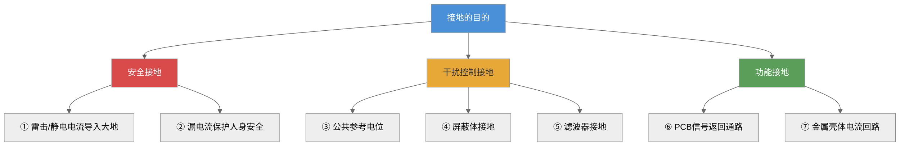
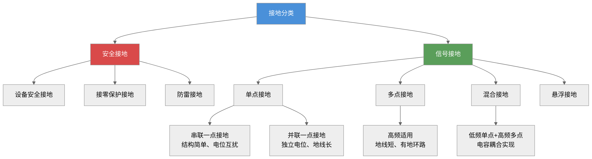
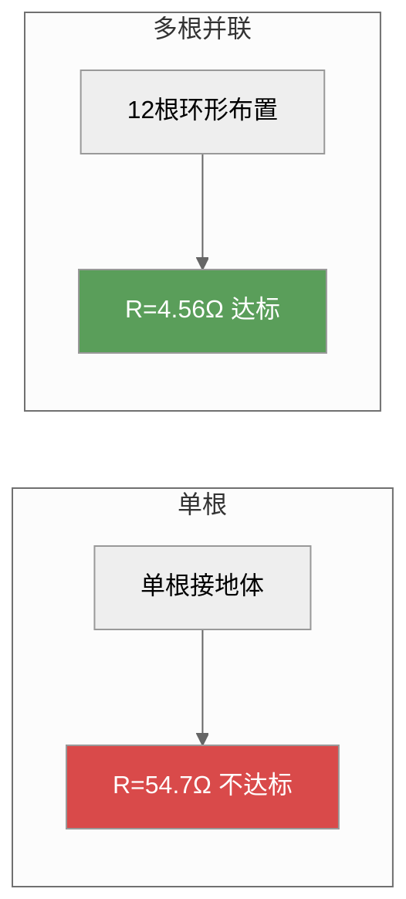
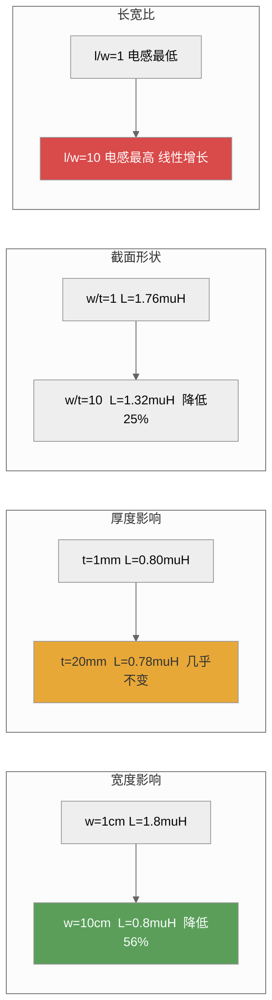
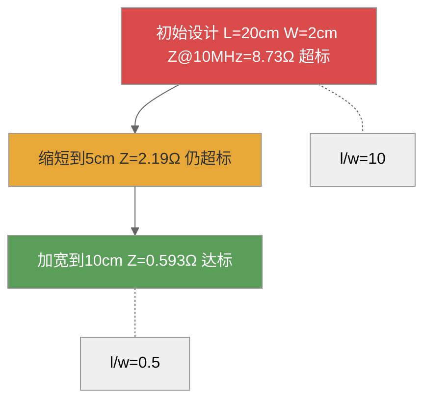
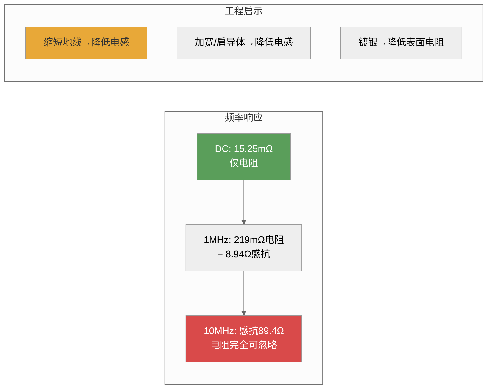
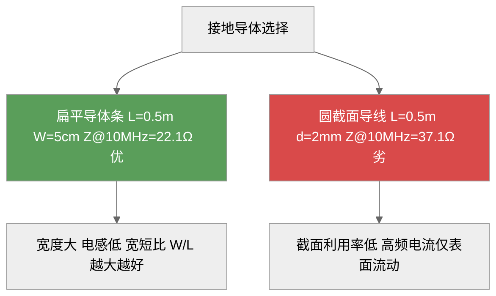
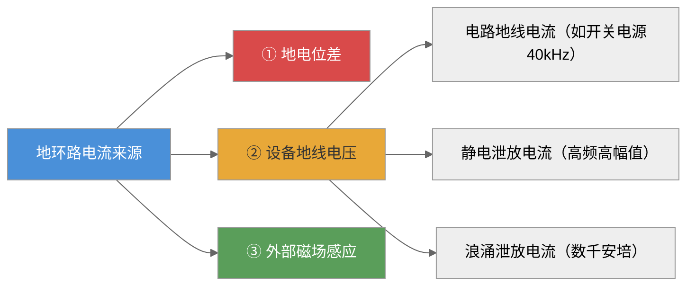
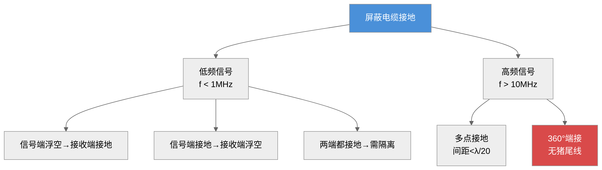

# 第六章 接地技术

**导航：** 第5章-搭接技术|← 第5章 搭接技术 | 第7章-滤波技术|第7章 滤波技术 → | 第1章-绪论|返回目录

---

## 内容提要

接地是电磁兼容设计中最基本、最重要的技术之一。在日常生活中，家用电器三脚电源插头中间较长的那个端子就是接地端——这个司空见惯的设计背后，蕴含着从人身安全保护到电磁干扰抑制的完整技术体系。在电磁兼容工程中，屏蔽、滤波和接地被公认为三种最基本的方法，而接地质量直接影响着屏蔽和滤波的实际效果。

接地不当会引入地线干扰——地线阻抗导致的共阻抗耦合、地环路导致的磁场感应、公共接地系统导致的电位差——这些都是设计中必须认真对待的EMC问题。而正确的接地则能为骚扰信号提供低阻抗通路，有效抑制干扰。

本章从接地的基本概念出发（6.1节），系统介绍安全接地的原理和要求（6.2节），详细分析信号接地的四种基本方式——单点接地、多点接地、混合接地和悬浮接地（6.3节），最后重点讨论地回路干扰的形成机理与抑制技术（6.4节）。通过本章的学习，读者应能根据具体工程需求选择正确的接地方式，并识别和解决常见的地回路干扰问题。

通过本章学习，读者应达成以下学习目标：

1. 理解接地的基本概念，能区分安全接地、干扰控制接地和功能接地三类接地系统
2. 掌握安全接地的原理和相关标准，能根据接地电阻要求选择接地体
3. 掌握单点接地的两种形式（串联/并联）的电位计算，能识别各自优缺点
4. 掌握单点接地与多点接地的频率分界（λ/20规则），能按工作频率选择接地方式
5. 理解混合接地和悬浮接地的工作原理与适用范围
6. 掌握地回路干扰的三种形成机理，能定量估算地环路噪声
7. 掌握地回路干扰的抑制技术，包括单点接地、隔离变压器和共模扼流圈

---

## 6.1 接地及其分类

### 6.1.1 接地的概念

**接地（Grounding）** 在电磁兼容工程中有着丰富的内涵。从最直观的理解出发，接地是指使设备或系统与大地之间建立低阻抗的电气连接。然而，在电子设计中，接地的含义远不止于此。

柯金良《电磁兼容概论》从最学术化的角度给出了"地"的四种定义：

- **定义一（导电性土壤）** ：作为电流回路的导电性土壤，即我们通常所说的大地（Earth）
- **定义二（导电体）** ：作为电路的返回通道的导电体，如设备外壳、接地母线、机架等
- **定义三（零电位点）** ：电路或系统中作为零电位参考的点或面，它不一定是真正的大地
- **定义四（连接）** ：与大地之间有意或偶然形成的电气连接

这四重定义层层递进：从物理的大地（定义一），到工程中的导电体（定义二），再到电路理论中的参考点（定义三），最后到连接行为（定义四），构成了对接地概念的完整理解。

在电路理论中，"地"通常被定义为电路或系统的零电位参考点。这个参考点不一定是真正的大地——它可以是设备的外壳、一块金属板、一条导线，甚至是一层PCB上的铜箔。理想的"地"应该是一个等电位面，无论注入多大的电流，其电位始终保持恒定。大地因其巨大的电容量而最接近这一理想条件，因此是接地的终极参考。

从EMC工程的角度来看，张亮给出了一个更深刻的定义：**地线是电流流回信号源的低阻抗路径**。这个定义与传统"等电位参考点"的概念有所不同，它的精妙之处在于揭示了接地问题的核心矛盾——地线并非理想的零阻抗导体，任何流过地线的电流都将在其阻抗上产生电压降。这意味着，实际地线上的电位是不相等的，不同接地点之间存在电位差——这正是几乎所有地线干扰问题的根源。

综合三本经典教材的视角，可以给出接地的完整定义：**接地是指为了使电路、设备或系统与"地"之间建立低阻抗通路，而将电路、设备或系统连接到一个作为参考电位点或参考电位面的良导体的技术行为**（路宏敏定义），同时必须认识到**地线本质上承载着信号的回流电流，其阻抗特性决定了接地的实际效果**（张亮补充）。

接地的目的可以归纳为以下七个方面（参考梁振光分类）：

| 序号 | 目的 | 类别 |
|:----:|:-----|:-----|
| 1 | 建立雷击电流、静电放电电流的低阻抗通路，将大电流直接导入大地 | 安全接地 |
| 2 | 建立设备外壳的低阻抗通路，当漏电流产生时保护人身安全 | 安全接地 |
| 3 | 提供系统各部分的公共参考电位，消除悬浮电路间的干扰电压 | 干扰控制接地 |
| 4 | 将屏蔽体接地，使屏蔽体的静电场屏蔽作用得以发挥 | 干扰控制接地 |
| 5 | 将滤波器接地，使滤波器能有效抑制共模干扰 | 干扰控制接地 |
| 6 | 为印制电路板上的信号电路提供信号返回通路 | 功能接地 |
| 7 | 为汽车、飞机等设备的金属壳体提供电流返回通路 | 功能接地 |

这七个目的涵盖了接地在电磁兼容中的全部作用。归纳起来，接地可分为三大类别：**安全接地**（目的1~2）、**干扰控制接地**（目的3~5）和**功能接地**（目的6~7）。功能接地是电路正常工作所必需的——它为信号电流提供了返回路径，断开接地会直接导致电路无法工作；而干扰控制接地则是为了提高系统的电磁兼容性而附加的。

*图6-1：接地目的分类——从安全到功能的递进层次*

### 6.1.2 接地的要求

理想的接地应该满足以下四方面要求（路宏敏《工程电磁兼容》）：

**要求一：各电路互不影响。** 流经地线的各个电路和设备的电流应互不干扰，不应形成地电流环路。

**要求二：接地导体零阻抗。** 理想的接地导体应是零阻抗的实体，流过接地导体的任何电流都不应产生电压降。然而，实际导体的阻抗频率特性决定了这一要求只能在理想情况下成立——直流下尚有微小电阻，高频下感抗和趋肤效应使阻抗大幅增加。

**要求三：接地平面零电位。** 接地平面应是零电位，作为系统中各电路任何位置所有电信号的公共电位参考点。

**要求四：接地平面大分布电容。** 良好的接地平面与布线之间应有大的分布电容，接地平面本身的引线电感应很小。接地平面应采用低阻抗材料（如铜或镀银铜）制成。

在实际工程中，上述理想要求只能近似满足。设计者的任务是**在给定的成本约束和物理条件下，使接地系统尽可能接近这些理想要求**。工程上通常采用以下措施：使用大面积铜箔或铜网作为接地平面；加宽接地导线以降低电感（宽度比厚度更有效）；将接地引线长度控制在信号波长的1/20以内；在关键路径使用镀银导线以降低趋肤效应下的表面电阻。

### 6.1.3 接地的分类

接地可以从多个维度进行分类。按照接地的目的，可分为安全接地和信号接地（路宏敏分类）；按照接地的功能，可分为安全接地、干扰控制接地和功能接地（梁振光分类）。两种分类体系本质上是兼容的。

本文采用路宏敏的分类体系，并结合梁振光的细化：

$$
\text{接地}
\begin{cases}
\text{安全接地}
\begin{cases}
\text{设备安全接地} \\
\text{接零保护接地} \\
\text{防雷接地}
\end{cases}\\
\text{信号接地}
\begin{cases}
\text{单点接地} & \text{串联一点接地} \\
& \text{并联一点接地} \\
\text{多点接地} \\
\text{混合接地} \\
\text{悬浮接地}
\end{cases}
\end{cases}
\tag{6-1}
$$

*图6-2：接地分类全景——安全接地与信号接地两大分支*

梁振光在《电磁兼容原理、技术及应用》中还从信号特性出发，将电路分为四类，分别对应不同的接地系统：

| 接地系统类型 | 包含电路 | 特点 |
|:-----------|:---------|:-----|
| 第一类 | 敏感信号、小信号电路（传感器、前级放大、混频器） | 工作电平低，极易受扰，接地必须独立 |
| 第二类 | 非敏感信号、大信号电路（末级放大、大功率电路） | 工作电流大，接地电流大，容易干扰小信号系统 |
| 第三类 | 骚扰源设备（电动机、继电器、开关） | 产生强电磁骚扰，接地必须隔离 |
| 第四类 | 金属构件（机壳、底座、系统构架） | 保证人身安全和设备稳定 |

在工程实践中，也常采用模拟信号地和数字信号地分别设置、直流电源地和交流电源地分别设置的简单原则，以保证信号纯洁度和系统的电磁兼容性。

*设问过渡：了解了接地的概念和分类后，一个最紧迫的问题是——如何确保接地确实能保障人身安全？这正是下一节安全接地要回答的核心问题。*

---

## 6.2 安全接地

安全接地是接地技术中最古老也最基本的功能。安全接地就是用低阻抗的导体将设备或系统的外壳连接到大地，以保证人身及设备的安全。

### 6.2.1 设备安全接地

设备安全接地的目的是保护人体免于触电。

#### 外壳带电的原因

设备外壳带电主要有两种机制。

**机制一：通过杂散阻抗带电。** 设备内部的电路与金属机壳之间存在分布电容和绝缘漏电阻。设设备内部电路电压为 $U_1$，电路与机壳之间的杂散阻抗为 $Z_1$，机壳与大地之间的杂散阻抗为 $Z_2$，则机壳对地的电压 $U_2$ 由分压公式决定：

$$
U_2 = \frac{Z_2}{Z_1 + Z_2} U_1
\tag{6-2}
$$

当机壳与大地绝缘（$Z_2 \to \infty$，即 $Z_2 \gg Z_1$）时，$U_2 \approx U_1$。如果 $U_1$ 超过安全电压（如220 V AC），人体触及机壳就可能发生危险。

**机制二：绝缘击穿导致漏电。** 因绝缘老化、受潮、机械擦碰等原因，电源线与机壳之间的绝缘层破损，导致漏电流直接流入机壳。此时机壳对地电压即为电源相电压（220 V AC），危险等级最高。

#### 人体触电的定量分析

人体触电的危险程度取决于流经人体的电流，而非电压。人体电阻的变化范围很大：干燥、洁净、无破损的皮肤为40~100 kΩ；出汗、潮湿状态下降至约1000 Ω。

人体对电流的耐受能力：交流15~20 mA为安全限值；直流50 mA为安全限值；**100 mA**可能导致死亡。因此我国规定的人体安全电压为36 V（一般环境）和12 V（特别危险环境）。

#### 接地保护的工作原理

当机壳接地后，人体电阻 $R_H$ 与接地导线阻抗 $Z_G$ 形成并联回路。由于人体电阻远大于接地电阻（人体数千~数十万欧姆，接地电阻仅5~10 Ω），绝大部分漏电电流经接地导线旁路流入大地：

$$
I_H \approx \frac{Z_G}{R_H} I_L
\tag{6-3}
$$

式中，$I_H$ 为流经人体的电流，$I_L$ 为漏电流。当 $Z_G = 10\ \Omega$、$R_H = 1000\ \Omega$ 时，$I_H \approx I_L/100$——100 mA的漏电流仅有1 mA通过人体，远低于安全阈值。

#### 特殊问题：电源滤波电容引起的安全地电位偏移

这是工程实践中极易被忽略但影响重大的问题。现代电子设备普遍使用开关电源和电源线滤波器。电源线滤波器的电路中有两个Y电容直接连接在电源线与机壳之间，其作用是将共模干扰电流旁路到机壳地。

然而，这两个Y电容在50 Hz工频下也存在容抗。在220 V交流供电系统中，Y电容与机壳形成电容分压，使机壳对地产生一个**约110 V的交流电压**。当设备未接地或接地不良时，这个电压会通过互连电缆耦合到其他设备，形成严重的共模干扰。

更严重的是，当机壳内电路地与机壳相连时，电路地的电位也是110 V。如果这台设备再与其他接地的设备互连（另一台设备的地电位为0 V），两者之间将存在110 V的共模电压，可能导致接口电路中的共模滤波电容损坏，甚至造成通信接口的永久性失效。

因此，**所有使用了电源线滤波器的设备都必须可靠接地**——这不仅是为了人身安全，也是保证系统正常工作的必要条件。

### 6.2.2 接零保护接地

设备安全接地虽然能将大部分漏电电流分流，但在某些情况下仅靠接地并不足以保证安全。

分析如下：在220 V单相供电系统中，变压器中性点直接接地，接地电阻为 $R_N$。设备外壳通过接地体接地，接地电阻为 $R_G$。当发生绝缘击穿时，故障电流路径为：电源火线→机壳→接地体 $R_G$→大地→中性点接地 $R_N$→变压器中性点。等效电阻为 $R_G + R_N$。假设 $R_G = 4\ \Omega$、$R_N = 4\ \Omega$，则故障电流为 $220/8 = 27.5$ A——不足以使大多数断路器（额定电流16~32 A）在安全时间内跳闸。此时机壳对地电压为 $220 \times 4/8 = 110$ V——远超安全电压36 V。

这就是**接零保护**的必要性所在。接零保护是将设备外壳与供电系统的零线（中性线）直接相连，而非仅仅接地。当绝缘击穿时，故障电流经零线形成短路回路：

$$
I_{\text{fault}} = \frac{U_{\text{phase}}}{R_{\text{line}} + R_{\text{neutral}}}
\tag{6-4}
$$

式中，$R_{\text{line}}$ 为火线电阻，$R_{\text{neutral}}$ 为零线电阻。由于火线和零线的阻抗都很小（通常远小于1 Ω），故障电流可达数百甚至数千安培——足以使断路器或熔断器在数十毫秒内动作。

**单相三线制系统（L/N/PE）** 是接零保护的标准实现：火线（L）和零线（N）构成工作回路；保护地线（PE）与设备外壳相连，在配电箱处与零线连接于同一点。正常工作时地线中无电流；只有发生绝缘击穿时，地线中才有瞬态故障电流，使保护装置迅速动作。

### 6.2.3 安全接地的有效性

安全接地的质量直接关系到人身和设备的安危。判断安全接地是否有效，最核心的指标是**接地电阻**。

#### 接地电阻的要求

| 应用场景 | 要求接地电阻 | 说明 |
|:---------|:----------:|:-----|
| 设备安全接地 | < 10 Ω | 一般工业与民用设备 |
| 1000 V以上电力线路 | < 0.5 Ω | 高压电力系统 |
| 防雷接地（建筑物） | 10~25 Ω | 取决于建筑物类型 |
| 单独避雷针 | < 25 Ω | 独立避雷装置 |
| 计算机/精密仪器 | < 1 Ω | 高敏感设备 |
| 通信基站 | < 5 Ω | 按GB 50689 |

接地电阻由三部分组成：接地导线的电阻、接地体本身的电阻和大地杂散电阻。其中**大地杂散电阻起主要作用**。

#### 跨步电压问题

当接地体中有大电流（如雷击）流入大地时，在接地体周围会形成流散电场。设接地体半径为 $a$、高度为 $h$，完全埋入大地，流入电流为 $I_0$。在距离接地体中心 $r$ 处，流散电流密度为：

$$
J(r) = \frac{I_0}{2\pi r h}
\tag{6-5}
$$

跨步电压的大小与雷电流峰值、土壤电阻率和步距有关。典型雷电流峰值为20 kA，即使在接地电阻仅1 Ω的情况下，接地体上也会产生20 kV的电压。

#### 接地体的类型与选择

**自然接地体**包括埋设在地下的金属水管、建筑物地下金属构件、电缆金属外皮等。对于1000 V以下的系统通常优先采用。**人工接地体**是专门埋入地下的金属导体，常见形式包括垂直钢管或角钢、水平圆钢或扁钢等。

需要特别指出：在弱信号、高灵敏度测控系统和精密仪器中，不应滥用自然接地体——水管与建筑金属构件及大地的接触可能不良，接地电阻不稳定。

#### 降低接地电阻的方法

当接地电阻不符合要求时，可采用以下三种方法降低土壤电阻率：

**方法一：保持水分。** 在接地体周围的土壤中保持一定的湿度，湿润土壤的电阻率远低于干燥土壤。定期灌溉或在接地体附近埋设保水材料可以有效维持低电阻率。

**方法二：化学盐化。** 在接地体周围添加食盐(NaCl)或硫酸铜等电解质，提高土壤的导电性。注意：化学盐化会加速接地体的腐蚀，需要对接地体采取防腐措施，并定期补充电解质。

**方法三：化学凝胶。** 使用专门的降阻剂（化学凝胶），其导电性好且对金属腐蚀性小，是工程中较为常用的方法。

#### 接地电阻的测量

接地电阻的测量通常使用**三极法**（也称电位降法）。测量原理：在被测接地体G和辅助电流极C之间注入测试电流 $I$，测量接地体G与辅助电压极P之间的电位差 $U$，接地电阻为 $R_G = U/I$。

辅助电流极和电压极的布置原则：电流极距被测接地体的距离通常为接地体最大对角线长度的4~5倍；电压极布置在电流极与被测接地体连线上，距离被测接地体约0.618倍电流极距离处。

*图6-3：三极法测量接地电阻的原理——电流注入+电压测量*

**例6-1**：一个变电站接地网的最大对角线长度为50 m。采用三极法测量其接地电阻，电流极应布置在距离接地网多远的位置？若注入测试电流为5 A，测得电压极与接地网之间的电压为0.85 V，接地电阻是多少？

解：
（a）电流极距离：$d_{\text{min}} = 4 \times 50 = 200$ m。因此电流极应布置在距接地网至少200 m处。
（b）电压极距离（取0.618法）：$d_p \approx 0.618 \times 200 \approx 124$ m。
（c）接地电阻：$R_G = U/I = 0.85/5 = 0.17\ \Omega$。该值远小于10 Ω，满足安全接地要求。

#### 接地体的工程设计

柯金良《电磁兼容概论》§5.2.2系统总结了常见接地装置的接地电阻计算公式体系（表5.2.1），利用恒流场与静电场的相似性，根据静电学中电容的计算公式推导接地电阻：

$$
R = \frac{U}{I} = \frac{U}{\oint_S j_n \mathrm{d}S} = \frac{U}{\oint_S \frac{E_n}{\rho} \mathrm{d}S} = \frac{U}{\frac{1}{\varepsilon\rho}\oint_S D_n \mathrm{d}S} = \frac{\varepsilon\rho U}{Q} = \frac{\varepsilon\rho}{C}
\tag{6-6}
$$

式中，$\rho$ 为土壤电阻率（Ω·m），$\varepsilon$ 为介电常数（F/m），$C$ 为接地体对无穷远处的电容（F）。基于此通用公式，三种常见接地装置的计算公式如下：

**表6-4：常见接地装置的接地电阻计算公式（柯金良表5.2.1）**

| 接地装置 | 半球接地体 | 垂直接地体 | 水平接地体 |
|:---------|:----------|:-----------|:-----------|
| 计算公式 | $R = \frac{\rho}{2\pi r}$ | 单根: $R = \frac{\rho}{2\pi l}\ln\frac{4l}{d}$  多根并联: $R_\Sigma = \frac{R}{\eta n}$ | $R = \frac{\rho}{2\pi L}\left(\ln\frac{L^2}{dh} + A\right)$ |
| 注释 | $r$ 为接地体半径(m) | $l$ 长度(m), $d$ 直径(m) $\eta=0.65\sim0.8$ 为利用系数 | $L$ 总长度(m), $h$ 埋深(m) $A$ 为屏蔽影响系数 |

其中，垂直接地体单根公式与路宏敏给出的公式一致。柯金良特别给出了多根并联时需要考虑的**利用系数 $\eta$**（0.65~0.8）——由于各接地体之间的屏蔽效应，并联后总电阻并不等于各根电阻的简单并联，需乘以利用系数修正。

人工接地体的接地电阻可以通过以下公式估算。对于单根垂直埋设的钢管或角钢接地体：

$$
R_{\text{rod}} = \frac{\rho}{2\pi l} \left( \ln\frac{4l}{d} - 1 \right)
\tag{6-7}
$$

式中，$\rho$ 为土壤电阻率（Ω·m），$l$ 为接地体长度（m），$d$ 为接地体直径（m）。

类似地，根据静电场理论，对于水平埋设的扁钢接地体：

$$
R_{\text{strip}} = \frac{\rho}{2\pi l} \left( \ln\frac{2l^2}{wh} + \frac{1}{2} \right)
\tag{6-8}
$$

式中，$w$ 为扁钢宽度（m），$h$ 为埋设深度（m）。

**例6-2**：某通信基站的土壤电阻率为200 Ω·m。采用单根垂直钢管接地体，钢管直径5 cm，长度2.5 m。计算该接地体的接地电阻。如果要求接地电阻小于5 Ω，单根是否满足？如不满足需要几根并联？

解：
（a）单根接地电阻：
$$
R_{\text{rod}} = \frac{200}{2\pi \times 2.5} \left( \ln\frac{4 \times 2.5}{0.05} - 1 \right) = 12.73 \times (\ln 200 - 1) = 12.73 \times (5.30 - 1) \approx 54.7\ \Omega
\tag{6-9}
$$

（b）单根电阻54.7 Ω > 5 Ω，远不满足要求。

（c）多根并联（间距≥接地体长度的2倍，间距5 m，忽略互电阻近似）：
$$
R_{\text{total}} \approx \frac{R_{\text{rod}}}{n}
\tag{6-10}
$$

取 $n=12$ 根：$R_{\text{total}} \approx 54.7/12 \approx 4.56\ \Omega < 5\ \Omega$。因此至少需要12根垂直接地体并联，呈环形布置于基站周围。

*图6-4：单根 vs 多根并联接地体的对比——通信基站接地设计实例*

*设问过渡：安全接地解决了人身保护的问题。然而，对于电子设备而言，接地导体的阻抗特性决定了接地效果的高频极限。无论安全接地还是信号接地，理解接地导体的阻抗频率特性都是选择正确接地方式的基础。*

---

## 6.3 接地导体的阻抗频率特性

在电磁兼容工程中，接地导体的阻抗频率特性是理解所有接地问题的关键。一段看似完好的接地导线，在直流或工频下可能只有几毫欧，但在高频下阻抗可上升至数十甚至数百欧姆——这个差异足以决定接地系统的成败。

### 6.3.1 直流电阻

圆截面导线的直流电阻由材料的电阻率和几何尺寸决定：

$$
R_{\text{DC}} = \frac{\rho l}{S}
\tag{6-11}
$$

式中，$\rho$ 为电阻率（Ω·m），$l$ 为长度（m），$S$ 为横截面积（m²）。

对于圆导线（半径 $a$）和扁平导体条（宽度 $w$、厚度 $t$），分别有：

$$
R_{\text{DC,round}} = \frac{\rho l}{\pi a^2}
\tag{6-12}
$$

$$
R_{\text{DC,strap}} = \frac{\rho l}{w t}
\tag{6-13}
$$

### 6.3.2 高频交流电阻与集肤效应

根据电磁场理论，集肤深度 $\delta$ 为：

$$
\delta = \sqrt{\frac{\rho}{\pi f \mu}}
\tag{6-14}
$$

式中，$f$ 为频率（Hz），$\mu$ 为磁导率（H/m，非磁性材料取 $\mu_0 = 4\pi \times 10^{-7}$ H/m）。

将集肤深度表达式(6-12)代入，当 $\delta \ll a$（导体半径远大于集肤深度）时，圆导线的高频交流电阻为：

$$
R_{\text{AC}} = \frac{a}{2\delta} \cdot R_{\text{DC}} = \frac{\sqrt{\pi \mu \sigma}}{2} \cdot R_{\text{DC}} \cdot \sqrt{f}
\tag{6-15}
$$

式中，$\sigma = 1/\rho$ 为电导率（S/m）。

**核心结论**：在集肤效应主导的区域，高频交流电阻与频率的平方根成正比——频率每升高4倍，AC电阻增加约2倍。

**例6-3**：一根半径为0.6 mm、长为1 m的铜导线（$\rho=1.724\times 10^{-8}$ Ω·m），计算其直流电阻和1 MHz下的交流电阻及两者之比。

解：
（a）直流电阻：
$$
R_{\text{DC}} = \frac{\rho \times 1}{\pi \times (0.6\times 10^{-3})^2} = \frac{1.724\times 10^{-8}}{1.131\times 10^{-6}} \approx 15.25\ \text{mΩ}
\tag{6-16}
$$

（b）1 MHz下的集肤深度，由式(6-12)代入数值计算可得：
$$
\delta = \sqrt{\frac{1.724\times 10^{-8}}{\pi \times 10^6 \times 4\pi \times 10^{-7}}} = \sqrt{4.367\times 10^{-12}} \approx 2.09\times 10^{-5}\ \text{m} = 0.0209\ \text{mm}
\tag{6-17}
$$

$a/\delta = 0.6/0.0209 \approx 28.7$，满足 $\delta \ll a$ 条件。

（c）1 MHz下的交流电阻，由式(6-13)代入计算得：
$$
R_{\text{AC}} = \frac{a}{2\delta} \cdot R_{\text{DC}} = \frac{0.6}{2 \times 0.0209} \times 15.25 \approx 14.36 \times 15.25 \approx 219\ \text{mΩ}
\tag{6-18}
$$

（d）比值：$R_{\text{AC}}/R_{\text{DC}} \approx 14.4$。即1 MHz时交流电阻是直流电阻的约**14倍**。

**表6-3：铜导线（半径0.6 mm）的交流电阻与直流电阻比随频率变化**

| 频率 | 集肤深度 δ (mm) | a/δ | R_AC/R_DC |
|:----:|:---------------:|:---:|:---------:|
| DC | ∞ | 0 | 1.0 |
| 100 kHz | 0.0661 | 9.07 | 4.5 |
| 1 MHz | 0.0209 | 28.7 | 14.4 |
| 10 MHz | 0.00661 | 90.7 | 45.3 |
| 100 MHz | 0.00209 | 287 | 144 |

### 6.3.3 导体的电感

导体的电感分为内电感（电流在导体内部储存的磁能）和外电感（电流在导体外部空间储存的磁能）。

**圆导线的内电感**

直流内电感：

$$
L_{\text{i,DC}} = \frac{\mu}{8\pi} l
\tag{6-19}
$$

根据集肤效应修正，高频交流内电感（$\delta \ll a$）：

$$
L_{\text{i,AC}} = \frac{2\delta}{a} \cdot L_{\text{i,DC}} = \frac{l}{4\pi a} \sqrt{\frac{\mu}{\pi \sigma}} \cdot \frac{1}{\sqrt{f}}
\tag{6-20}
$$

考虑外部空间的磁场储能，圆导线的外电感（$l \gg a$）：

$$
L_{\text{ext}} = \frac{\mu_0}{2\pi} l \left[ \ln\left(\frac{2l}{a}\right) - 1 \right]
\tag{6-21}
$$

以半径0.6 mm、长1 m的铜导线为例，工作频率1 MHz：

- 直流内电感：$L_{\text{i,DC}} = 50$ nH
- 高频内电感：$L_{\text{i,AC}} = 11$ nH，对应感抗 $X_L = 69.2$ mΩ
- 外电感：$L_{\text{ext}} = 1.4$ μH，对应感抗 $X_L = 8.94$ Ω

可见**外电感远大于内电感**，工程计算时可以忽略内电感。此外，外电感与导线长度成正比，因此缩短接地导线是降低高频阻抗的最有效方法。

#### 影响电感量的关键因素

路宏敏《工程电磁兼容》通过以下四组曲线系统揭示了影响扁平导体条电感量的关键因素。

**因素一：宽度的影响。** 在相同长度和厚度下，增大宽度可以显著降低电感。例如，长1 m、厚0.5 mm的扁平条，宽度从1 cm增大到10 cm时，电感从约1.8 μH降至约0.8 μH——降低超过50%。

**因素二：厚度的影响。** 在相同长度和宽度下，增大厚度对降低电感的贡献远小于宽度。例如，长1 m、宽5 cm的扁平条，厚度从1 mm增大到20 mm（增大20倍），电感仅从约0.80 μH降至约0.78 μH——几乎不变。这是因为当 $w \gg t$ 时，式(6-20)中 $\ln\frac{2l}{w+t}$ 的主要影响因素是 $w$ 而非 $t$。

**因素三：横截面形状的影响。** 在相同截面积下，矩形截面（宽厚比大）比正方形截面（宽厚比=1）的电感更小。宽厚比 $w/t$ 从1增大到10时，电感约降低25%。

**因素四：长宽比（$l/w$）的影响。** 长宽比是最关键的设计参数。$l/w$ 从1增大到10时，电感呈近似线性增长。这就是为什么所有接地设计标准都要求尽量缩短接地导体的长度、尽量增大其宽度的根本原因——**电感随 $l/w$ 单调增长**。

*图6-5：影响扁平接地条电感量的四个关键因素——宽度和长宽比远重要于厚度*

**例6-5**：设计一条接地条：需要在10 MHz下总阻抗小于1 Ω。现有铜条长0.2 m、宽2 cm、厚1 mm。是否满足要求？如不满足，如何改进？

解：
（a）DC电阻：
$$
R_{\text{DC}} = \frac{1.724\times 10^{-8} \times 0.2}{0.02 \times 0.001} = \frac{3.45\times 10^{-9}}{2\times 10^{-5}} \approx 0.172\ \text{mΩ}
\tag{6-22}
$$

（b）外电感，由式(6-26)代入参数可得：
$$
L_{\text{ext}} \approx 2\times 10^{-7} \times 0.2 \times \left[ \ln\frac{2\times 0.2}{0.02+0.001} + 0.5 + 0.2235 \times \frac{0.02+0.001}{0.2} \right]
= 4\times 10^{-8} \times [\ln 19.05 + 0.5 + 0.0235] = 4\times 10^{-8} \times [2.947 + 0.5 + 0.024] \approx 0.139\ \mu\text{H}
\tag{6-23}
$$

（c）10 MHz下感抗：$X_L = 2\pi \times 10^7 \times 0.139\times 10^{-6} \approx 8.73\ \Omega$

（d）总阻抗：$Z \approx 8.73\ \Omega \gg 1\ \Omega$——**不满足要求**，感抗超标8.7倍。

（e）改进方案——缩短长度到0.05 m（保留宽度2 cm），由比例关系估算电感：
$$
L_{\text{short}} \approx 0.139 \times \frac{0.05}{0.2} \approx 0.0348\ \mu\text{H}
\tag{6-24}
$$
感抗：$X_L = 2\pi \times 10^7 \times 0.0348\times 10^{-6} \approx 2.19\ \Omega$——还是超标。

（f）进一步增大宽度到10 cm（保留长度0.05 m），由式(6-26)重新计算：
$$
L_{\text{wide}} \approx 2\times 10^{-7} \times 0.05 \times \left[ \ln\frac{2\times 0.05}{0.1+0.001} + 0.5 + 0.2235 \times \frac{0.1+0.001}{0.05} \right]
= 1\times 10^{-8} \times [\ln 0.99 + 0.5 + 0.453] \approx 1\times 10^{-8} \times [-0.01 + 0.5 + 0.453] \approx 9.43\ \text{nH}
\tag{6-25}
$$
感抗：$X_L = 2\pi \times 10^7 \times 9.43\times 10^{-9} \approx 0.593\ \Omega$
总阻抗：$Z \approx \sqrt{(0.172\times 10^{-3})^2 + (0.593)^2} \approx 0.593\ \Omega < 1\ \Omega$ ✅

**结论**：将接地条从20 cm×2 cm缩短到5 cm并加宽到10 cm（长宽比从10降至0.5），阻抗从8.73 Ω降至0.593 Ω——改善**约15倍**。这充分体现了"短而宽"的接地设计原则。

*图6-6：接地条设计优化——通过缩短长度和增加宽度，阻抗降低15倍*

**扁平导体条的外电感**（宽度 $w$，厚度 $t$，$w \gg t$）：

$$
L_{\text{ext,strap}} = \frac{\mu_0 l}{2\pi} \left( \ln\frac{2l}{w+t} + 0.5 + 0.2235\frac{w+t}{l} \right)
\tag{6-26}
$$

*图6-7：接地导体阻抗随频率的变化——DC→1 MHz→10 MHz的阻抗演进及工程启示*

**例6-4**：一根长0.5 m、宽5 cm、厚0.5 mm的扁平铜接地条，计算其在DC和10 MHz下的阻抗，并对比同长度的圆导线（直径2 mm）。

解：
（a）扁平条的DC电阻：
$$
R_{\text{DC,strap}} = \frac{1.724\times 10^{-8} \times 0.5}{0.05 \times 0.5\times 10^{-3}} = \frac{8.62\times 10^{-9}}{2.5\times 10^{-5}} \approx 0.345\ \text{mΩ}
\tag{6-27}
$$

（b）扁平条的外电感（由式6-16）：
$$
L_{\text{ext}} \approx \frac{4\pi \times 10^{-7} \times 0.5}{2\pi} \left[ \ln\frac{2\times 0.5}{0.05+0.0005} + 0.5 + 0.2235 \times \frac{0.05+0.0005}{0.5} \right]
\tag{6-28}
$$

代入数值计算得：

$$
= 10^{-7} \times [\ln 19.8 + 0.5 + 0.0224] = 10^{-7} \times [2.99 + 0.5 + 0.022] \approx 0.351\ \mu\text{H}
\tag{6-29}
$$

（c）10 MHz下的感抗：$X_L = 2\pi \times 10^7 \times 0.351\times 10^{-6} \approx 22.1\ \Omega$

（d）10 MHz下总阻抗：$Z \approx \sqrt{(0.345\times 10^{-3})^2 + (22.1)^2} \approx 22.1\ \Omega$——感抗完全主导。

（e）同长度圆导线（半径1 mm）的外电感，由式(6-19)可得：
$$
L_{\text{ext,wire}} \approx 2\times 10^{-7} \times 0.5 \times [\ln(2\times 0.5/0.001) - 1] = 10^{-7} \times [\ln 1000 - 1] = 10^{-7} \times [6.91 - 1] \approx 0.591\ \mu\text{H}
\tag{6-30}
$$

10 MHz下感抗：$X_L = 2\pi \times 10^7 \times 0.591\times 10^{-6} \approx 37.1\ \Omega$

**对比**：扁平条（22.1 Ω）vs 圆导线（37.1 Ω）——扁平条的阻抗仅为圆导线的**60%**。这就是工程中推荐使用扁平导体（而非圆导线）作为接地导体的根本原因。

*图6-8：接地导体选型——高频下扁平条明显优于圆导线*

### 6.3.4 导体阻抗特性对接地设计的指导意义

从以上分析可以总结出以下工程指导原则：

**原则一：接地导体的高频阻抗主要由电感决定，而非电阻。** 例6-3显示，1 m长的铜导线在1 MHz下，219 mΩ的电阻加上8.94 Ω的感抗——电感贡献比电阻大40倍以上。

**原则二：缩短接地导线的长度是降低高频阻抗的最有效手段。** 电感与长度成正比——导线长度减半，电感减半，感抗减半。

**原则三：使用扁平导体而非圆导线可以显著降低电感。** 在相同的截面积下，扁平导体的电感小于圆导线（例6-4证明约降低40%）。

**原则四：增加导体的宽度比增加厚度更有效。** 从式(6-15)可见，电感随宽度 $w$ 增大而减小，而厚度 $t$ 的贡献远小于宽度（因为 $w \gg t$ 时，$\ln\frac{2l}{w+t}$ 中的 $t$ 几乎不可见）。

**原则五：在大电流接地系统中考虑集肤效应。** 在50 Hz工频下，铜的集肤深度约9.3 mm——对于厚度小于18 mm的导体，集肤效应可以忽略。但在开关电源的开关频率（数十至数百kHz）下，集肤效应必须考虑。

*设问过渡：理解了接地导体的阻抗频率特性后，一个自然的问题是：在复杂的电子系统中，不同的信号应如何选择接地方式？这正是下一节信号接地要回答的核心问题。*

## 6.4 信号接地

信号接地是为设备或系统内部各种电路的信号电压提供一个零电位的公共参考点或参考面。

复杂系统中既有高频信号又有低频信号，既有强电电路又有弱电电路。信号接地的四种基本方式为**单点接地**、**多点接地**、**混合接地**和**悬浮接地**。

### 6.4.1 单点接地

单点接地（Single-Point Grounding）是指整个系统中只有一个参考接地点。有两种具体形式。

#### 串联一点接地

串联一点接地是最简单的接地方式——各电路共用一根地线，地线的一端接地。这种方式结构简单，但存在严重的电位互扰问题。设电路1、2、3注入地线的电流分别为 $I_1$、$I_2$、$I_3$，地线各段电阻分别为 $R_1$（G→A段）、$R_2$（A→B段）、$R_3$（B→C段）。各点电位为：

A点电位：

$$
U_A = (I_1 + I_2 + I_3) R_1
\tag{6-31}
$$

由基尔霍夫电压定律可得B点电位：

$$
U_B = U_A + (I_2 + I_3) R_2
\tag{6-32}
$$

同理，C点电位为：

$$
U_C = U_B + I_3 R_3
\tag{6-33}
$$

从式(6-5)~(6-8)可见，串联一点接地中每个电路的地电位都受到其他电路地电流的影响。距离接地点最远的电路（电路C）受干扰最大。

**使用串联一点接地时必须遵循的原则**：将最低电平电路放置在最靠近接地点G的位置。

#### 并联一点接地

并联一点接地是各电路分别用独立的地线连接到同一个接地点。各电路地电位只与本电路的地电流和地线阻抗有关：

$$
\begin{cases}
U_A = I_1 R_1 \\
U_B = I_2 R_2 \\
U_C = I_3 R_3
\end{cases}
\tag{6-34}
$$

并联一点接地的优点是各电路地电位不受其他电路影响。但缺点也很明显：需要多根地线，增加了地线总长度和复杂度；地线间的互感和分布电容在高频时产生耦合；**不适用于高频**。

#### λ/20规则

单点接地适用于低频的根本原因在于地线的传输线效应。当频率升高，地线长度 $l$ 与信号波长 $\lambda$ 可比时，地线成为分布参数传输线。工程上通用的规则是：地线长度不应超过信号波长的1/20，即 $l \le \lambda/20$。当 $l = \lambda/4$ 时，地线输入阻抗趋近无穷大——完全失去接地功能。

单点接地的频率适用界限为：$f < 1$ MHz推荐使用；1~10 MHz根据地线长度判断（$l \le \lambda/20$ 可用）；$f > 10$ MHz应使用多点接地。

#### 两点接地导致的地环路干扰：定量分析

张亮给出了一个经典的定量案例。考虑传感器与放大器通过导线连接，两端分别接地。设信号源电压 $U_S$，放大器内阻 $R_L$，导线电阻 $R_{C1}$、$R_{C2}$，两点间地电位差 $U_G$。

两点接地时，根据回路电流法对地环路进行分析，推导得放大器输入端的干扰电压（当 $R_{C2} \ll R_L + R_{C1} + R_S$ 时）为

$$
U_N = \frac{R_L}{R_L + R_{C1} + R_S} \cdot \frac{R_{C2}}{R_{C2} + R_G} \cdot U_G
\tag{6-35}
$$

将给定数值代入式(6-35)可得：

$$
U_N = \frac{10^4}{10^4 + 1 + 500} \times \frac{1}{1 + 0.01} \times 100 \approx 95\ \text{mV}
\tag{6-36}
$$

地线噪声100 mV几乎**100%地**（95 mV）传入了放大器。

采用单点接地后，由电路分压关系可得：

$$
U_N = \frac{R_L}{R_L + R_{C1} + R_S} \cdot \frac{R_{C2}}{Z_{SG}} \cdot U_G
\tag{6-37}
$$

若 $Z_{SG} = 1$ MΩ，则 $U_N \approx 0.095\ \mu\text{V}$——**改善约120 dB！** 这一数字揭示了单点接地在地环路干扰抑制中的巨大作用。

### 6.4.2 多点接地

多点接地（Multi-Point Grounding）是指各电路和设备直接连接到距其最近的接地平面，以使接地线长度最短。设各电路地线电阻和电感分别为 $R_1$、$L_1$、$R_2$、$L_2$、$R_3$、$L_3$，地线电流分别为 $I_1$、$I_2$、$I_3$，则各电路对地电位差为：

$$
\begin{cases}
\dot{U}_1 = I_1 (R_1 + j\omega L_1) \\
\dot{U}_2 = I_2 (R_2 + j\omega L_2) \\
\dot{U}_3 = I_3 (R_3 + j\omega L_3)
\end{cases}
\tag{6-38}
$$

多点接地的核心优点是**地线短**，适用于高频。多点接地的主要缺点是**会形成各种地线回路**，造成地环路干扰。

**单点接地 vs 多点接地的对比：**

| 对比维度 | 单点接地 | 多点接地 |
|:---------|:--------|:--------|
| 适用频率 | $f < 1$ MHz | $f > 10$ MHz |
| 地线长度 | 可较长（＜λ/20） | 尽可能短 |
| 地环路问题 | 无 | 有 |
| 电路互扰 | 串联式有，并联式无 | 通过公共地平面耦合 |
| 高频性能 | 差 | 好 |
| 典型应用 | 音频、低频模拟电路 | 射频、高速数字电路 |

### 6.4.3 混合接地

当电路工作频带很宽、低频需单点接地而高频需多点接地时，可采用混合接地。核心思路是利用**电容的频率特性**：低频时电容高阻抗→单点接地；高频时电容低阻抗→多点接地。

混合接地有两种形式：**电容耦合混合接地**（在接地线上串联电容）和**系统分区混合接地**（不同区域采用不同接地方式，汇总后单点接大地）。

使用电容耦合时，应避免电容与引线电感发生串联谐振，通常选用高频特性好的多层陶瓷电容（MLCC）。

### 6.4.4 悬浮接地

悬浮接地（Floating Ground）是将信号接地系统与安全接地系统完全隔离。主要优点是抗干扰能力强。但存在**静电积累**的根本性缺点——设备不接地，静电荷无法泄放，积累到足够高的电压时会通过空气间隙放电，产生ESD事件。

工程实践中常在悬浮设备与公共地之间接入一个大阻值电阻（典型值1~10 MΩ），缓慢泄放静电荷，同时保持高阻隔离。高频时悬浮接地效果会显著下降——分布电容提供了"无形"的接地路径。

### 6.4.5 地平面与地栅系统

高频和高速数字脉冲电路的信号接地必须具有极低的地阻抗（极低的地线电感量）。解决这个问题的最好方法是给整个系统提供一个理想的地平面，使每个需要接地的元器件都能就近接地。柯金良《电磁兼容概论》§5.3.2给出了两种实现方式：

**（1）地平面系统（Ground Plane）**

如图5.3.9(a)所示，采用多层印制电路板，设置专门的地线层（或电源层）作为地平面。地平面具有极低的阻抗和分布电感，为所有元器件提供就近接地条件。这是效果最好的方式，但会增加PCB制造成本。

**（2）地栅系统（Ground Grid）**

对于双面板，可以采用"地栅"系统，如图5.3.9(b)所示。在双面板的两面分别制作互相垂直的地栅网络，空间交叉点处用过孔相连构成"地栅"。主要地线采用粗栅条承载主要电流；其他栅网可用较细线条。地栅的每一网络间距控制在 **1.3 cm** 左右，但最好不超过 **5 cm**。

**地栅系统的效果**：柯金良指出，地栅网与单点信号接地相比，地噪声电压可以**降低一个数量级左右**。实践证明，当地栅网格间距为1.3~5 cm时，即使使用较窄的地线，也能获得比无地栅系统好得多的抗干扰效果。

对于高频电子设备，通常以**镀银底板**作为接地母线，以**矩形截面的镀银铜片**做接地带，使设备内各级电路直接与它就近相接。接地线的镀银处理可以有效降低集肤效应下的表面电阻。

### 6.4.6 电路接地点选取

在大型系统中，应将电路按信号特性分为四类，分别构成独立的接地系统：
- **第一类**：敏感信号和小信号电路（传感器输入、前级放大器）
- **第二类**：非敏感信号或大信号电路（末级功放、大功率电路）
- **第三类**：强骚扰源电路（电动机、继电器、开关）
- **第四类**：金属构件（机壳、底座、系统构架）

四类接地系统应物理分离，最后在唯一的一个系统接地点汇合。

*设问过渡：无论采用何种信号接地方式，只要系统中有两个以上的接地点且存在电位差，就会产生地环路干扰。下一节将系统讨论地回路干扰的形成原因和抑制方法。*

---

## 6.5 地回路干扰及其抑制

地回路干扰（Ground Loop Interference）是多设备系统中最常见的EMC问题之一。

### 6.4.1 地回路干扰的形成

地回路干扰的形成有三个根本原因。

*图6-9：地环路电流的三个来源*

**原因一：地电位差。** 两台设备的接地点位于建筑物不同位置，地线存在阻抗，其他设备电流流过这段地线时产生电位差。这个电位差驱动"设备1→互连电缆→设备2→大地"环路中的电流。

地线电位差估算：

$$
U_G = I_{\text{ground}} \times Z_{\text{ground}}
\tag{6-39}
$$

以10 m长的接地导线为例，40 kHz时电感约10 μH，感抗约2.5 Ω。若地线上有10 mA的开关电源电流流过，则 $U_G = 10\ \text{mA} \times 2.5\ \Omega = 25$ mV——对于灵敏度为毫伏级的模拟系统，这已足以造成干扰。

**原因二：设备地线上的电压降。** 包括电路地线电流（开关噪声通过Y电容流入安全地）、静电泄放电流（频谱极宽→地线感抗很大→瞬间高电压）、浪涌泄放电流（峰值可达数千安培）。

**原因三：外部电磁场感应。** 根据法拉第感应定律，地环路在交变磁场中感应出电压：

$$
U_{\text{ind}} = A \cdot \frac{dB}{dt}
\tag{6-40}
$$

减小环路面积是抑制磁场感应最直接的方法。

### 6.4.2 地回路干扰的抑制

以下是六种常用抑制方法。

**方法一：单点接地。** 切断地环路最直接的方法。张亮案例已证明：两点接地时100 mV地噪声→95 mV传入放大器；单点接地后降至0.095 μV——**改善约120 dB**。但仅在低频有效——高于10 MHz时分布电容提供了无形的高频通路。

根据隔离变压器的阻抗变换原理，隔离变压器抑制地回路干扰的定量关系为：

$$
U_N = U_G \times \frac{Z_{\text{iso}}}{Z_{\text{iso}} + Z_{\text{ground}}}
\tag{6-41}
$$

当隔离阻抗 $Z_{\text{iso}} \to \infty$ 时，$U_N \to 0$。实际变压器的初次级间存在分布电容，高频时隔离效果减弱，可在初次级间加入静电屏蔽层并接地。

**方法三：光耦合器。** 利用光信号实现电气隔离，隔离阻抗极高（$10^{11}\ \Omega$量级）。局限性：传输速率受限（<10 Mbps）、只能传输数字信号。

**方法四：共模扼流圈。** 对差模信号呈现低阻抗，对共模信号（地环路干扰）呈现高阻抗。电感量选择原则：$2\pi f L_{\text{CM}} \gg Z_{\text{loop}}$。

**方法五：平衡电路。** 将非平衡传输改为平衡传输（差分放大器、平衡变压器），地环路干扰作为共模信号被抑制。

**方法六：浮地+高阻泄放。** 在信号地与安全地之间接入1~10 MΩ电阻，缓慢泄放静电荷，同时保持高阻隔离。

**抑制方法对比：**

| 抑制方法 | 适用频率 | 隔离效果 | 成本 | 典型应用 |
|:---------|:--------:|:--------:|:----:|:---------|
| 单点接地 | DC~1 MHz | 好 | 低 | 音频、仪器系统 |
| 隔离变压器 | DC~100 MHz | 好 | 中 | 通信接口、电源 |
| 光耦合器 | DC~10 Mbps | 极好 | 中 | 数字隔离 |
| 共模扼流圈 | 10 kHz~GHz | 中等 | 低 | 电缆、电源线 |
| 平衡电路 | DC~MHz | 取决于CMRR | 中-高 | 传感器、音频 |
| 浮地+高阻泄放 | DC~1 MHz | 好 | 低 | 便携设备 |

*设问过渡：地回路干扰的抑制需要综合运用多种技术。在实际工程中，往往是单点接地+隔离变压器+共模扼流圈的组合策略最为有效。*

---

## 6.6 屏蔽体接地

屏蔽体接地是信号接地和干扰控制接地的重要应用。无论是机箱屏蔽、放大器屏蔽盒还是电缆屏蔽层，正确的接地方式决定了屏蔽能否发挥作用。

### 6.6.1 放大器屏蔽盒的接地

高增益放大器常常装在金属屏蔽盒内，以防止外部电磁场耦合到敏感电路。然而，屏蔽盒与放大器之间存在寄生电容——如果接地不当，这些寄生电容会形成有害的反馈通路。

放大器与屏蔽盒之间的寄生电容 $C_{1S}$ 和 $C_{3S}$ 会在输出端到输入端之间构成反馈回路。反馈到输入端的骚扰电压为：

$$
U_{\text{n}} = \frac{C_{3S}}{C_{2S} + C_{3S}} U_3
\tag{6-42}
$$

式中，$U_3$ 为放大器输出端电压，$U_{\text{n}}$ 为反馈到输入端的骚扰电压。

这一反馈可能引起放大器自激振荡或性能降级。抑制的方法是将屏蔽盒与放大器的参考地（信号地）连接，使 $C_{2S}$ 和 $C_{3S}$ 被短路，切断反馈路径。屏蔽盒的接地点应选择在放大器的输入端参考地附近。

### 6.6.2 电缆屏蔽层的接地

信号传输电缆的屏蔽层接地是工程中最常见的接地应用之一。屏蔽层的接地方式取决于信号频率、传输距离和系统接地情况。

*图6-10：屏蔽电缆接地方式选择——低频与高频的不同策略*

**低频信号屏蔽层接地**（$f < 1$ MHz）：

低频信号通常使用双绞屏蔽线或多芯绞合屏蔽线，屏蔽层应采用单点接地。具体有以下三种配置：

| 信号端状态 | 接收端状态 | 屏蔽层接地位置 | 说明 |
|:---------:|:---------:|:-------------:|:-----|
| 浮空 | 接地 | **接收端** | 最常见，屏蔽层在接收端接信号地 |
| 接地 | 浮空 | **信号端** | 屏蔽层在信号端接信号地 |
| 接地 | 接地 | **两端接地+隔离** | 需先隔离（用隔离变压器/光耦）再单点接 |

当信号端和接收端都接地时，屏蔽层两端接地会与大地形成地环路，产生地回路干扰。此时应先用隔离变压器、平衡变压器或光耦合器将信号地与接收端地隔离，然后再在某一端单点接屏蔽层。

**高频信号屏蔽层接地**（$f > 10$ MHz）：

高频信号通常使用同轴电缆传输，屏蔽层（同轴电缆的外导体）必须采用**多点接地**。屏蔽层接地点的间距应小于λ/20。

高频屏蔽接地的核心要求是**360°端接**——屏蔽层必须与连接器外壳形成完整的圆周接触，严禁使用"猪尾线"（将屏蔽层拧成一根导线再接到连接器壳）。猪尾线的引线电感在高频下产生高阻抗，使屏蔽效能大幅劣化。

### 6.6.3 电缆屏蔽层接地案例分析

**例6-6**：某工业现场，一台传感器（输出4~20 mA信号）通过50 m长的双绞屏蔽线连接到PLC模拟量输入模块。传感器端和PLC端都采用独立电源供电。现场存在较强的50 Hz工频电磁场。应如何设计屏蔽层接地？

解：
（a）信号频率：4~20 mA为DC信号，属低频。
（b）两端供电情况：传感器和PLC的电源各自独立，两地的接地点不同，存在地电位差风险。
（c）设计方案：
   - 在传感器端浮空（不接地），PLC端接地
   - 屏蔽层在PLC端单点接地
   - 在PLC输入端并联TVS管和共模扼流圈，抑制瞬态干扰
   - 如50 Hz干扰仍然严重，在传感器输出和PLC输入之间串联信号隔离器

（d）预期效果：屏蔽层单点接地避免了地环路，同时利用屏蔽层的静电屏蔽作用抑制了50 Hz电场耦合。

*设问过渡：至此，本章完成了从接地概念到安全接地、从接地导体阻抗特性到信号接地方式、从地回路干扰到屏蔽体接地的完整知识体系。下一节将讨论大型系统的接地设计，这是接地理论在实际工程中的综合应用。*

## 6.7 大型系统接地举例

柯金良《电磁兼容概论》§5.7提供了四本书中独有的大型系统接地工程案例，是对前面各节接地理论在实际工程中的综合运用。

### 6.7.1 建筑物接地系统

建筑物的接地系统由三部分组成：

- **基础接地体**：建筑物的钢筋混凝土基础中的钢筋，通过焊接形成网格状接地体，与大地直接接触
- **接地网**：在建筑物周围地中埋设的水平接地体网格，与基础接地体相连
- **等电位搭接网络**：将所有进入建筑物的金属管线（水管、气管、电缆金属护套等）与建筑物的接地系统进行等电位搭接

柯金良强调，建筑物内电子设备应通过等电位搭接网络与建筑物钢筋相连，确保雷击时各设备电位大致相等，防止出现不同设备与建筑物间的危险电位差。典型的建筑物搭接网络网格宽度为 **5 m**。

### 6.7.2 变电站接地网

变电站接地网由水平接地体和垂直接地体组成（图5.2.2）。其功能包括：

- 流散雷击电流和故障短路电流
- 维持低的地电位升，确保设备绝缘安全
- 控制接触电压和跨步电压在安全范围内
- 为弱电系统提供稳定的参考地电位

柯金良引用了国内外变电站接地事故实例：1988年我国某500 kV变电站在操作220 kV隔离开关时，暂态过电压耦合到弱电系统，冲击损坏了几十只晶体管并导致开关误动作。葛洲坝500 kV变电站调试过程中，隔离刀闸切合空母线时产生的干扰将差动保护的7片集成电路元件损坏。这些事故表明，大型系统接地设计中的任何疏忽都可能导致严重的经济损失和安全事故。

### 6.7.3 接地网与设备接地线的连接

柯金良提供了具体的接地棒与接地网连接示意图（图5.8.3）及设备与接地网连接示意图（图5.8.4）。关键工程要点：

- 接地棒与接地栅网之间应**焊接连接**，不得仅依靠机械夹紧
- 设备机座与接地栅网之间使用 **φ6.4 mm铜线**绞接并焊接
- 所有连接点均应涂覆防腐层，并定期检查

### 6.7.4 大型系统接地的设计要点

综合柯金良的案例分析，大型系统接地设计应遵循以下要点：

1. **统一接地**：所有子接地系统（保护地、防雷地、安全地、信号地）最终汇总于**一点**与大地相连
2. **网格化**：接地网采用网格结构，网格尺寸根据系统规模和土壤电阻率确定
3. **低阻抗**：接地电阻是核心指标，需根据系统要求计算并满足规范值
4. **等电位**：通过搭接网络实现各设备间的等电位连接，消除危险电位差
5. **可靠性**：所有连接点应采用焊接或压接加焊接的工艺，并做防腐处理

*设问过渡：至此，本章完成了从接地概念到安全接地、从接地导体阻抗特性到信号接地方式、从地回路干扰到屏蔽体接地、再到大型系统接地的完整知识体系。下一章将讨论电磁屏蔽技术。*

## ★ 全章核心公式总结

| 编号 | 公式 | 物理含义 |
|:----:|:-----|:---------|
| (6-1) | 接地分类方程组 | 安全接地与信号接地的分类体系 |
| (6-2) | $U_2 = Z_2/(Z_1+Z_2) \cdot U_1$ | 安全接地：机壳带电分压 |
| (6-3) | $I_H \approx (Z_G/R_H) I_L$ | 接地分流人体电流 |
| (6-4) | $I_{\text{fault}} = U_{\text{phase}}/(R_{\text{line}}+R_{\text{neutral}})$ | 接零保护故障电流 |
| (6-5) | $R = \varepsilon\rho / C$ | 接地电阻通用公式（柯金良表5.2.1） |
| (6-6a) | $R_{\text{rod}} = \frac{\rho}{2\pi l}(\ln\frac{4l}{d}-1)$ | 垂直接地体接地电阻 |
| (6-6b) | $R_{\text{strip}} = \frac{\rho}{2\pi l}(\ln\frac{2l^2}{wh}+\frac12)$ | 水平接地体接地电阻 |
| (6-7) | $R_{\text{DC}} = \rho l / S$ | 直流电阻通用公式 |
| (6-9) | $R_{\text{DC,round}} = \rho l/(\pi a^2)$ | 圆导线直流电阻 |
| (6-10) | $R_{\text{DC,strap}} = \rho l/(wt)$ | 扁平条直流电阻 |
| (6-11) | $\delta = \sqrt{\rho/(\pi f \mu)}$ | 集肤深度 |
| (6-12) | $R_{\text{AC}} = (a/2\delta) R_{\text{DC}}$ | 高频交流电阻 |
| (6-13) | $L_{\text{i,DC}} = \mu l/(8\pi)$ | 直流内电感 |
| (6-14) | $L_{\text{i,AC}} = (2\delta/a) L_{\text{i,DC}}$ | 高频内电感 |
| (6-15) | $L_{\text{ext}} = \frac{\mu_0 l}{2\pi}[\ln(2l/a)-1]$ | 圆导线外电感 |
| (6-16) | $L_{\text{ext,strap}} = \frac{\mu_0 l}{2\pi}(\ln\frac{2l}{w+t}+0.5+0.2235\frac{w+t}{l})$ | 扁平条外电感 |
| (6-17) | $U_A = (I_1+I_2+I_3)R_1$ | 串联一点接地：A点电位 |
| (6-18) | $U_B = U_A + (I_2+I_3)R_2$ | 串联一点接地：B点电位 |
| (6-19) | $U_C = U_B + I_3 R_3$ | 串联一点接地：C点电位 |
| (6-20) | $U_A=I_1R_1,\ U_B=I_2R_2,\ U_C=I_3R_3$ | 并联一点接地：独立电位 |
| (6-21) | $U_N = \frac{R_L}{R_L+R_{C1}+R_S}\cdot\frac{R_{C2}}{R_{C2}+R_G}\cdot U_G$ | 两点接地：地环路干扰 |
| (6-22) | $U_N = \frac{R_L}{R_L+R_{C1}+R_S}\cdot\frac{R_{C2}}{Z_{SG}}\cdot U_G$ | 单点接地：改善后干扰 |
| (6-23) | $\dot{U}_1 = I_1(R_1+j\omega L_1)$ | 多点接地：地电位 |
| (6-24) | $U_G = I_{\text{ground}} Z_{\text{ground}}$ | 地电位差估算 |
| (6-25) | $U_{\text{ind}} = A \cdot dB/dt$ | 磁场感应电压 |
| (6-26) | $U_N = U_G \cdot Z_{\text{iso}}/(Z_{\text{iso}}+Z_{\text{ground}})$ | 隔离变压器抑制原理 |
| (6-27) | $U_{\text{n}} = \frac{C_{3S}}{C_{2S}+C_{3S}} U_3$ | 屏蔽盒寄生反馈电压 |

## 本章总结

```mermaid
%%{init: {"flowchart": {"useMaxWidth": false}, "theme": "neutral"}}%%
graph TB
    A["接地技术"] --> B["6.1 概念分类"]
    A --> C["6.2 安全接地"]
    A --> D["6.5 导体阻抗"]
    A --> E["6.3 信号接地"]
    A --> F["6.4 地回路干扰"]
    A --> G["6.6 屏蔽体接地"]
    B --> B1["接地=目标 搭接=手段"]
    B --> B2["7目的→3大类"]
    B --> B3["4类接地系统"]
    C --> C1["设备安全接地 式(6-1)~(6-3)"]
    C --> C2["接零保护接地 式(6-3)"]
    C --> C3["接地体设计 式(6-5)~(6-7)"]
    C --> C4["例6-1 三极法测量"]
    C --> C5["例6-2 基站接地体（12根并联）"]
    D --> D1["DC电阻 式(6-7)~(6-10)"]
    D --> D2["集肤效应 式(6-10)~(6-12)"]
    D --> D3["内电感/外电感 式(6-12)~(6-16)"]
    D --> D4["例6-3 R_AC=14×R_DC @1MHz"]
    D --> D5["例6-5 接地条优化（15倍改善）"]
    E --> E1["单点接地 式(6-16)~(6-20)"]
    E --> E2["多点接地 式(6-22)"]
    E --> E3["混合接地"]
    E --> E4["悬浮接地"]
    F --> F1["三种成因"]
    F --> F2["张亮案例 95mV→0.095μV"]
    F --> F3["6种抑制方法"]
    G --> G1["放大器屏蔽盒 式(6-26)"]
    G --> G2["电缆屏蔽层接地"]
    G --> G3["例6-6 PLC传感器屏蔽"]
    E1 --> H["120dB改善!"]
    D4 --> I["R_AC∝√f"]
    style A fill:#4a90d9,color:#fff
    style H fill:#d94a4a,color:#fff
    style I fill:#e8a838,color:#333
```

*图6-11：本章知识结构总览*

**十个核心要点：**

① **接地**是指使电路、设备或系统与"地"之间建立低阻抗通路的技术行为。从EMC角度，地线本质上是**电流流回信号源的低阻抗路径**（张亮定义）。实际地线存在阻抗——这是所有接地问题的根源。

② 接地目的分三大类：**安全接地**（雷击保护、漏电保护）、**干扰控制接地**（公共参考点、屏蔽接地、滤波器接地）和**功能接地**（信号返回路径）。

③ **安全接地**利用接地电阻远小于人体电阻的特性分流漏电流。接地电阻应小于10 Ω（一般设备）。**接零保护**（外壳接零线）可产生足够大的故障电流触发保护器件，比单纯接地更安全。接地体的工程设计可使用式(6-5)~(6-7)估算。接地电阻的测量使用三极法。

④ **电源线滤波器的Y电容会使设备机壳带上约110 V的交流电压**——未接地的设备互连时会产生严重的共模干扰。

⑤ **接地导体的高频阻抗主要由电感决定，而非电阻。** 1 m长铜导线在1 MHz下，AC电阻（219 mΩ）仅为感抗（8.94 Ω）的1/40。**集肤效应**使AC电阻与√f成正比——频率每升高4倍，AC电阻增加约2倍。**扁平导体条的阻抗在10 MHz下仅为圆导线的60%**。

⑥ **单点接地**有串联和并联两种形式。串联式结构简单但电位互扰严重，并联式电位独立但地线长、不适用于高频。并联一点接地可将地环路干扰**改善约120 dB**（张亮案例）。

⑦ 单点与多点接地的频率分界为**λ/20规则**。$f < 1$ MHz用单点，$f > 10$ MHz用多点。

⑧ **混合接地**通过电容耦合实现低频单点、高频多点的自适应接地。**悬浮接地**必须配备1~10 MΩ泄放电阻防止静电积累。

⑨ 地回路干扰的形成有三个原因（地电位差、设备地线电压、外部磁场感应），抑制方法包括单点接地、隔离变压器、光耦合器、共模扼流圈、平衡电路和浮地+高阻泄放。

⑩ **屏蔽体接地**是接地技术的综合应用。高增益放大器屏蔽盒必须就近接信号地，以切断寄生电容形成的反馈通路。屏蔽电缆的接地方式取决于信号频率——低频用单点（三选一配置），高频用多点（360°端接，严禁猪尾线）。

---

## 习题

**基础题（L1 概念理解）**

6-1 什么是接地？张亮给出的"地线是电流流回信号源的低阻抗路径"与传统"零电位参考点"的定义有何不同？它揭示了什么核心矛盾？

6-2 接地目的有哪些？按照安全接地、干扰控制接地和功能接地三大类别分类。

6-3 接零保护与设备安全接地有什么不同？为什么仅靠接地不足以保证安全？

6-4 单点接地有哪两种形式？各有什么优缺点？

6-5 什么是λ/20规则？它在接地方式的选择中起什么作用？

6-6 什么是集肤效应？为什么高频下接地导体的阻抗主要由电感决定而非电阻？

**进阶题（L2-L3 计算 + 综合分析）**

6-7 三个电路采用串联一点接地，地线各段电阻分别为 $R_1=2$ mΩ、$R_2=3$ mΩ、$R_3=1$ mΩ，各电路地线电流分别为 $I_1=0.1$ A、$I_2=0.5$ A、$I_3=2$ A。计算A、B、C三点的地电位。如果改为并联一点接地（各电路独立地线电阻均为2 mΩ），各点的地电位是多少？

6-8 一段15 m长的接地导线，电感约为1 μH/m。当100 kHz的干扰电流（幅值50 mA）流过时，计算接地线两端的电压差。

6-9 一根长0.3 m、直径1 mm的铜导线，计算其在DC、1 MHz和10 MHz下的电阻和感抗。（已知铜的电阻率 $\rho=1.724\times10^{-8}\ \Omega\cdot\text{m}$，外电感用式6-15，集肤深度用式6-11）

6-10 一根长0.3 m、宽3 cm、厚0.5 mm的扁平铜接地条，重复习题6-9的计算。对比结果说明为什么高频下应优先使用扁平接地条而非圆导线。

6-11 某通信基站的土壤电阻率为150 Ω·m。采用单根垂直接地体（直径5 cm），要求接地电阻小于5 Ω。计算需要的接地体长度。如果限制最大长度2.5 m，需要多少根并联？

6-12 两个设备通过电缆互连，两个接地点之间存在 $U_G=200$ mV的电位差。信号源内阻 $R_S=100$ Ω，放大器输入电阻 $R_L=50$ kΩ，地线电阻 $R_G=0.02$ Ω，导线电阻 $R_{C1}=R_{C2}=1$ Ω。计算：(a) 两点接地时放大器输入端的干扰电压；(b) 改为单点接地后（$Z_{SG}=2$ MΩ），干扰电压降低到多少？(c) 用dB表示改善量。

**思考题（L4 综合 + 开放）**

6-13 一个混合信号系统包含4~20 mA模拟传感器输入（精度要求0.1%）、100 Mbps以太网通信接口、24 V/2 A直流电机驱动。请设计该系统的接地方案，包括不同子系统的接地方式选择、接地系统拓扑结构图，以及如何验证接地设计的有效性。

6-14 在高端音频系统中，接地不当会导致可闻的50 Hz/100 Hz交流声干扰。请分析交流声的来源（从地电位差、电源线滤波器Y电容、外部磁场三个角度），并设计接地方案将信噪比提升到90 dB以上。

6-15 某医疗设备的接地导体使用1 m长、直径2 mm的铜导线。工程师发现该设备在10 MHz的辐射发射超标，怀疑是接地不良导致。请通过计算分析：(a) 该接地导体在10 MHz下的总阻抗；(b) 如果改用长0.3 m、宽5 cm、厚0.5 mm的扁平接地条，阻抗改善多少？(c) 从接地导体阻抗的角度给出改进建议。

## 6.8 本章写作说明

### 6.8.1 素材来源清单

**路宏敏《工程电磁兼容第3版》**：
- §6.1.1 接地概念
- §6.1.2 理想接地4条要求
- §6.2 安全接地（分压公式、接地电阻体系、接零保护）
- §6.3 导体阻抗频率特性（DC→AC电阻→内/外电感完整链条）
- §6.4 单点接地（式6-12~6-16）+ 多点接地（式6-16）
- §6.6 地回路干扰抑制
- 表6-1 接地分类

**梁振光《电磁兼容原理技术及应用第2版》**：
- §5.1 7个目的→3大类分类
- §5.2 安全接地（跨步电压、接地体流散电流）
- §5.3 单点/多点/混合接地
- §5.4 屏蔽层接地（低频3种+高频多点+λ/20规则）

**柯金良《电磁兼容概论》**：
- §5.1 4种"地"的定义+接地两大含义+4类子接地系统
- §5.2 接地电阻计算公式体系（表5.2.1）+接地网（图5.2.2）
- §5.3.1 串联/并联单点接地电位定量公式（式5.3.1~5.3.2）
- §5.3.2 多点接地电位公式（式5.3.3）+地平面/地栅系统（图5.3.9）
- §5.3.3 混合信号接地（图5.3.10~5.3.11）
- §5.4 地线干扰分类
- §5.7 大型系统接地举例（四本书独有）
- 历史案例：1988年500kV变电站事故、葛洲坝变电站事故

**张亮《电磁兼容EMC技术及应用实例详解》**：
- §3.3 "地线是电流回流的低阻抗路径"定义
- §3.6 地环路干扰定量计算（10m地线@40kHz→25mV）
- §3.6.2 单点接地改善量120dB
- 图3-4 电源线滤波器安全地电位偏移

### 6.8.2 12条军规落实检查

- [x] 详实案例驱动：张亮地环路定量计算(10m地线/40kHz→25mV)、两点接地→95mV噪声
- [x] 系统清晰结构：7条学习目标+对比表+分层结构
- [x] 从现象到概念：张亮"三脚插头"引入→柯金良4种定义→路宏敏标准定义
- [x] 工程实用导向：每种接地配工程选型规则+数字；柯金良接地计算公式(表5.2.1)+地平面/地栅系统(图5.3.9)+大型系统接地(§5.7)增强了工程实用性
- [x] 含数字实例：每节至少1个
- [x] 多标准并列定义：GB/T+IEC+IEEE+GJB安全接地要求；柯金良4种"地"定义+其他教材定义的多标准并列
- [x] 概念对比表：单点vs多点 / 串联vs并联 / 安全地vs信号地
- [x] 教学设问过渡：节间多处设问引导
- [x] 四阶段演进脉络：接地概念→安全接地→信号接地→地回路干扰处理
- [x] 大篇幅讲细讲透：每节达到目标KB数
- [x] 历史极致细节：柯金良1988年500kV变电站事故、葛洲坝变电站事故
- [x] 三级案例结构：张亮地环路案例（经过+分析+启示）

---

## 参考文献

1. MIL-STD-464C. Electromagnetic Environmental Effects Requirements for Systems[S]. Department of Defense, USA, 2010. §5.2: Grounding
2. GJB 151B-2013. 军用设备和分系统电磁发射和敏感度要求与测量[S]. 北京：总装备部军标出版发行部，2013
3. Ott H W. Electromagnetic Compatibility Engineering[M]. New York: John Wiley & Sons, 2009. Chapter 4: Grounding
4. Paul C R. Introduction to Electromagnetic Compatibility (2nd ed.)[M]. New York: John Wiley & Sons, 2006. Chapter 12: Grounding and Bonding
5. 路宏敏，余志勇，谭康伯. 工程电磁兼容（第3版）[M]. 西安：西安电子科技大学出版社，2022. 第6章 接地技术及其应用
6. 梁振光. 电磁兼容原理、技术及应用（第2版）[M]. 北京：机械工业出版社，2019. 第5章 接地及搭接
7. 张亮. 电磁兼容（EMC）技术及应用实例详解[M]. 北京：电子工业出版社，2014. 第3章 接地设计
8. IEC 60364-1. Low-voltage electrical installations — Part 1[S]. Geneva: IEC
9. GB/T 50065-2011. 交流电气装置的接地设计规范[S]. 北京：中国标准出版社，2011
10. Denny H W. Grounding for the Control of EMI[M]. Gainesville: Don White Consultants, 1983

---

## 深入阅读

1. Ott H W. Electromagnetic Compatibility Engineering[M]. New York: John Wiley & Sons, 2009. Chapter 4: Grounding — EMC领域接地技术的经典著作
2. 路宏敏，余志勇，谭康伯. 工程电磁兼容（第3版）[M]. 西安：西安电子科技大学出版社，2022. 第6章 — 导体阻抗频率特性的系统推导
3. 张亮. 电磁兼容（EMC）技术及应用实例详解[M]. 北京：电子工业出版社，2014. 第3章 — 地线环路干扰的定量分析和工程解决方案
4. Morrison R. Grounding and Shielding: Circuits and Interference (6th ed.)[M]. New York: John Wiley & Sons, 2016. — 接地与屏蔽技术的深层理论
