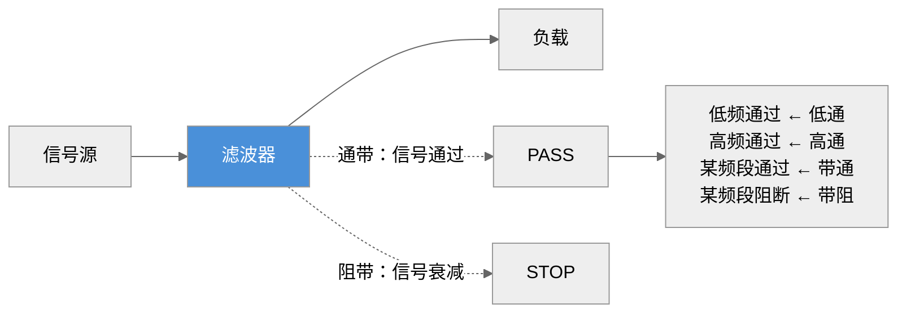
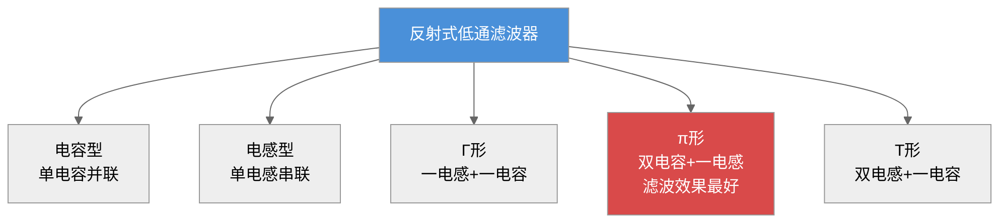
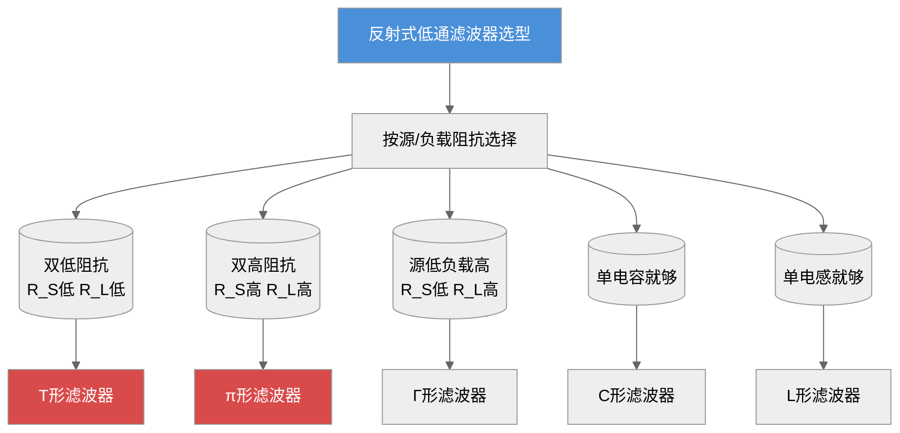
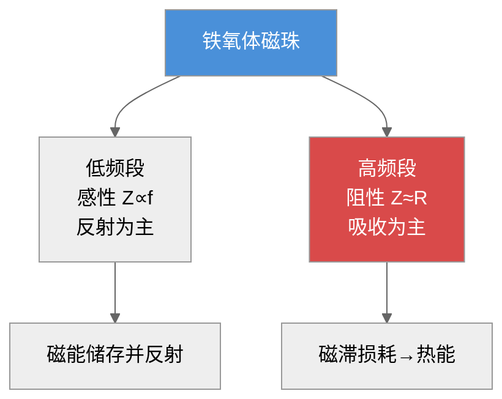
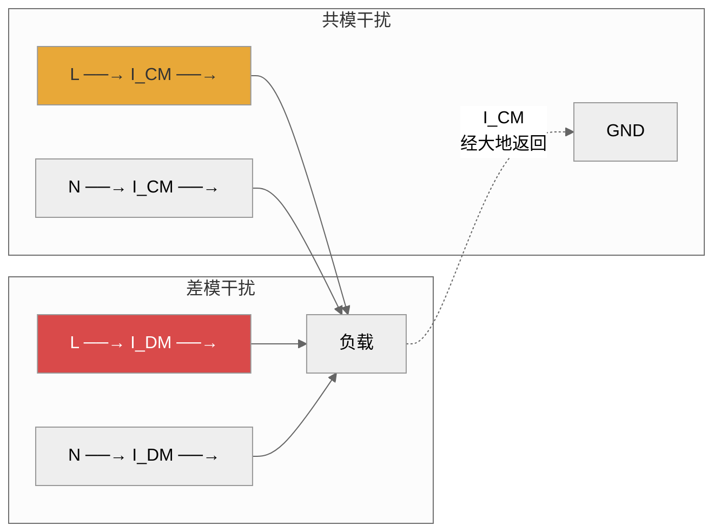
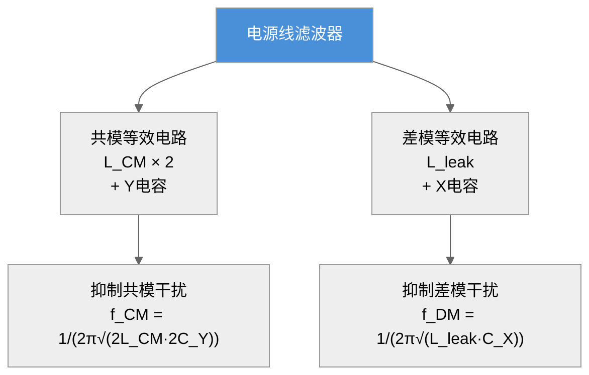
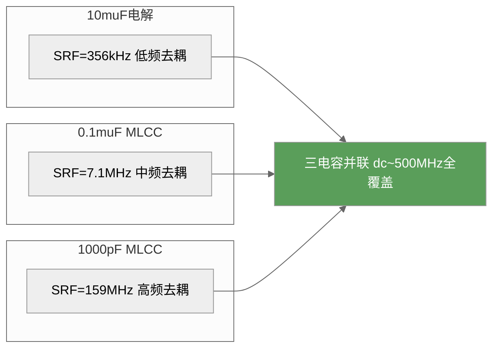
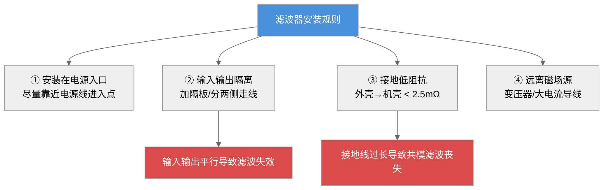
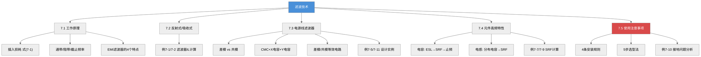

# 第七章 滤波技术

## 内容提要

滤波是电磁兼容三大基本技术之一。电磁骚扰可在空间和电路中传播——对于空间传播的骚扰，屏蔽技术是主要抑制手段；而对于电路中传播的骚扰，则需要滤波技术来解决。滤波的实质是将信号频谱划分为有用频率分量和干扰频率分量，然后剔除干扰分量，保留有用信号。

在电子设备中，滤波无处不在：电源入口处的电源线滤波器阻止电网中的骚扰进入设备，也防止设备产生的骚扰污染电网；信号线上的滤波器确保有用信号通过的同时抑制带外干扰；PCB上的去耦电容滤除高频开关噪声。一个设计良好的滤波器可以在不改变电路功能的前提下，将传导骚扰降低几个数量级。

本章从滤波器的工作原理出发（7.1节），介绍反射式滤波器和吸收式滤波器两大类基本结构（7.2节），重点讨论工程中最常使用的电源线滤波器（7.3节），分析电阻、电容、电感等基本元件在高频下的非理想特性（7.4节），最后总结滤波器在实际工程中的使用注意事项（7.5节）。通过本章的学习，读者应能根据实际工程需求选择合适的滤波器类型，正确安装和使用滤波器，并理解元件高频特性对滤波性能的影响。

通过本章学习，读者应达成以下学习目标：

1. 理解滤波器的基本工作原理，掌握插入损耗的定义和计算
2. 掌握反射式滤波器的四种基本结构（L型、π型、T型、Γ型），能计算其插入损耗
3. 理解吸收式滤波器（铁氧体磁珠/磁环）的工作原理和选型方法
4. 掌握电源线滤波器的基本电路结构（差模/共模等效电路）
5. 理解电阻、电容、电感在高频下的非理想特性（寄生参数、自谐振频率）
6. 掌握滤波器的工程安装规则——输入输出隔离、接地搭接、布线
7. 能根据实际EMC测试结果选择和设计滤波器

---

## 7.1 滤波器工作原理及特性指标

### 7.1.1 滤波器工作原理

**滤波器（Filter）** 是一种选择性地通过或抑制特定频率分量的二端口网络。在一定的通频带内，滤波器的衰减很小，信号可以顺利通过；在此通频带之外，滤波器的衰减很大，抑制信号的传输。滤波器将有用信号的频谱和骚扰的频谱隔离得越完善，抑制电磁骚扰的效果就越好。

从电磁兼容的角度来看，滤波器的作用可分为两类：**信号选择滤波**——从多种频率成分中选择出有用信号，剔除无用信号；**电磁干扰滤波**——抑制电磁骚扰的传播，保护敏感设备不被骚扰。

滤波器的基本构成单元是电抗元件——**电感**和**电容**。电感表现为串联高阻抗，阻碍高频电流的通过；电容表现为并联低阻抗，将高频电流旁路到地。通过电感和电容的合理组合，可以实现对不同频率信号的选择性衰减。

$$
\boxed{\text{滤波器基本原理：电感串联阻高频，电容并联旁路高频}}
\tag{7-1}
$$

|> **柯金良信噪比论证（《电磁兼容概论》第6章）：** 从通信理论的角度看，滤波的本质是提高信噪比。若接收机的频带无限宽，噪声频谱为 $N(f)$，则进入接收机的总噪声功率为
>
> $$
> N = \int_{0}^{\infty} N(f)\,\mathrm{d}f
> \tag{7-2}
> $$
> 设有用信号功率为 $S$，则信噪比为
> $$
> S/N = S \Big/ \int_{0}^{\infty} N(f)\,\mathrm{d}f
> \tag{7-3}
> $$
> 如果将接收器的频带限制在 $[f_1, f_2]$ 的范围内，则进入接收器的噪声变为
> $$
> N' = \int_{f_1}^{f_2} N(f)\,\mathrm{d}f
> \tag{7-4}
> $$
> 显然 $N' < N$，因此信噪比得到改善：
> $$
> S/N' > S/N
> \tag{7-5}
> $$
> 这一论证揭示了滤波器抑制电磁干扰的数学本质——通过限制接收频带，从频域上将干扰信号与有用信号分离，从而在保证有用信号质量的同时大幅降低噪声功率。这也是为什么在EMC工程中，滤波被广泛用于提高系统抗扰度的根本原因。

*图7-1：滤波器的基本功能——选择性通过或抑制不同频率分量*

### 7.1.2 滤波器的类型

滤波器的分类方式很多，从不同角度可以分为以下类型：

**按工作原理分类：**
- **反射式滤波器**（Reflective Filter）：利用电抗元件的阻抗不连续性，将骚扰能量反射回源端。由电感和电容组成，理论上无能量损耗。
- **吸收式滤波器**（Dissipative/Absorptive Filter）：将骚扰能量转化为热能消耗掉。常用铁氧体材料制成，高频时呈现电阻性。

**按频率特性分类：**
- **低通滤波器**：低于截止频率的信号通过，高于截止频率的信号衰减
- **高通滤波器**：高于截止频率的信号通过，低于截止频率的信号衰减
- **带通滤波器**：某一频带内的信号通过，频带外的信号衰减
- **带阻滤波器**：某一频带内的信号衰减，频带外的信号通过

**按应用场合分类：**
- **电源线滤波器**：安装在设备电源入口，抑制传导发射和抗扰度
- **信号线滤波器**：安装在信号输入/输出端口，抑制信号线上的骚扰
- **PCB去耦滤波器**：集成电路电源引脚附近的去耦电容，滤除高频开关噪声
- **控制线滤波器**：安装在控制信号线上

**按组成元件特征分类：**
- **LC滤波器**：由电感和电容组成，最常用
- **晶体滤波器**：利用压电晶体的谐振特性，频率选择性极好
- **机械滤波器**：利用机械谐振实现选频
- **陶瓷滤波器**：利用陶瓷压电效应，体积小
- **螺旋滤波器**：利用螺旋谐振结构，适用于微波频段

**按有无源元件分类：**
- **无源滤波器**：仅由无源元件（R、L、C）组成，不需电源，可靠性高
- **有源滤波器**：含有运算放大器等有源器件，可做到体积小、重量轻，但本身也是骚扰源，在EMC工程中应慎用——有源器件的非线性会产生新的骚扰频率成分

**按信号选择与EMI抑制的功能区分：**
- **信号选择滤波器**：主要考虑对有用信号的幅度及相位影响最小，追求频率响应保真度
- **EMI滤波器**（电磁干扰滤波器）：主要追求对电磁干扰的有效抑制，允许在通带内有较大的幅度和相位变化

> **柯金良（《电磁兼容概论》）补充：** 上述六大分类体系覆盖了滤波器的全部维度。在EMC工程中需特别注意的是——不要试图用有源滤波器来解决电磁干扰问题，因为运算放大器本身也是骚扰源，其非线性会产生新的骚扰频率成分。EMC滤波器与信号滤波器虽然在基本原理上相同，但EMC滤波器的L、C元件需要承受相当大的无功电流和无功功率，且必须在阻抗失配状态下工作——这完全不同于信号滤波器的阻抗匹配设计原则。

在EMC工程中，**低通滤波器**是最常用的类型——因为电磁骚扰通常表现为高频信号（开关噪声、时钟谐波等），而有用信号往往在较低频段。

### 7.1.3 滤波器的特性指标

描述滤波器性能的主要技术指标包括以下各项。

#### 插入损耗（Insertion Loss, IL）

插入损耗是衡量滤波器性能的最核心指标。插入损耗定义为：在不接入滤波器时，信号源在负载上产生的电压 $U_1$，与接入滤波器后信号源在同一负载上产生的电压 $U_2$ 之比，以dB表示：

$$
\text{IL} = 20 \log \frac{U_1}{U_2} \quad \text{dB}
\tag{7-6}
$$

插入损耗值越大，滤波器对骚扰信号的抑制作用越强。例如，IL = 40 dB意味着骚扰电压被衰减到原来的1/100。

在实际应用中，滤波器的插入损耗与以下因素密切相关：
- **信号源频率**：不同频率下电抗元件的阻抗不同，IL随频率变化
- **源阻抗和负载阻抗**：滤波器的IL数据通常是在50 Ω系统中测得的，实际应用中的阻抗失配会使IL发生显著变化
- **工作电流**：大电流会使磁芯饱和，电感值下降，IL降低
- **环境温度**：温度影响磁芯材料的磁导率和电容器的容量

#### 频率特性

滤波器的插入损耗随频率变化的曲线称为频率特性。根据频率特性可确定滤波器的**截止频率** $f_c$（插入损耗达到-3 dB时的频率）、**通带**（插入损耗小于某个阈值的频率范围）和**阻带**（插入损耗大于某个阈值的频率范围）。

#### 阻抗特性

滤波器的输入阻抗和输出阻抗直接影响其插入损耗特性。在EMC工程中，一条核心原则是：**使用EMI滤波器时应保证输入、输出端最大限度地失配**。例如，低阻抗的骚扰源应配合高输入阻抗的滤波器，以获得最佳抑制效果。这与信号选择滤波器要求阻抗匹配完全不同。

#### 额定电压和额定电流

额定电压是滤波器允许的最高工作电压，超过此电压可能导致内部元件（特别是电容）击穿。额定电流是滤波器不降低插入损耗性能的最大使用电流。需要特别注意：**当滤波器中流过超过额定电流的工作电流时，磁芯可能饱和，电感值大幅下降，滤波效果急剧劣化**。

**表7-1：不同类型滤波器的特性对比**

| 滤波器类型 | 适用频段 | 典型IL (@10MHz) | 特点 | 典型应用 |
|:---------|:--------:|:--------------:|:-----|:---------|
| LC低通 | DC~100 MHz | 20~60 dB | 结构简单，成本低 | 电源线滤波 |
| π形低通 | DC~100 MHz | 40~80 dB | 滤波效果好，接地要求高 | EMI电源滤波器 |
| T形低通 | DC~100 MHz | 40~80 dB | 输入/输出端高阻抗 | 信号线滤波 |
| 铁氧体磁珠 | 10 MHz~GHz | 3~30 dB | 吸收式，无反射 | 高频信号线/电源 |
| 共模扼流圈 | 100 kHz~100 MHz | 20~60 dB | 抑制共模，对差模无影响 | 电源线/信号线 |

### 7.1.4 EMI滤波器的特点

电磁干扰滤波器（EMI Filter）与常规信号选择滤波器有本质区别：

**特点一：阻抗失配下工作。** 电磁骚扰源的阻抗频率特性变化范围很宽，其阻抗通常是整个频段的函数。由于经济和技术上的原因，不可能设计出全频段阻抗匹配的EMI滤波器。因此，EMI滤波器必须在阻抗失配的条件下有效工作。

**特点二：骚扰源电平变化幅度大。** 骚扰源的电平可能从微伏级到千伏级变化，有可能使EMI滤波器中的磁芯出现饱和效应，导致电感量下降。

**特点三：骚扰源频带范围宽。** 电磁骚扰的频谱从几十Hz到数GHz，高频特性非常复杂，难以用集总参数电路精确模拟滤波器的高频行为。

**特点四：可靠性要求高。** 由于骚扰源的工作频率范围宽，可能包含大电流脉冲，必须选择具有良好性能的滤波元件。滤波器的布局、滤波器与设备的连接不能引入附加的电磁干扰。

### 7.1.5 信号滤波器与电源滤波器的区分

> **柯金良（《电磁兼容概论》第6.1.3节）观点：** 安装在电源线上的滤波器称为电源线干扰滤波器，安装在信号线上的滤波器称为信号线干扰滤波器。两者除了都对电磁干扰有抑制作用外，还需特别注意以下区别：
> **信号滤波器的特殊要求：**
> - 滤波器不能对工作信号造成严重的幅度和相位影响，不能造成信号失真
> - 通常按阻抗完全匹配状态设计，以保证预定的频率响应
> - 对插入损耗的平坦度要求较高
> **电源滤波器的特殊要求：**
> - 当负载电流较大时，电路中的电感可能发生饱和，导致滤波器性能急剧下降
> - L、C元件需要处理和承受相当大的无功电流和无功功率，必须具有足够大的无功功率容量
> - 电网侧的源阻抗和负载侧的设备阻抗通常未知且随频率变化，滤波器必须在阻抗失配状态下运行
> - 需严格控制浪涌电流（开关电源启动时的冲击电流可能达到额定电流的10倍）
> **工程要点：** 在EMC设计中，滤波器必须考虑使用中的阻抗失配特性，以保证在所需频率范围内的滤波特性。此外，EMI滤波器使用不当可能产生"振铃"效应或在某一频率下产生谐振，若滤波器本身缺乏良好的屏蔽或接地不当，还可能给电路引进新的噪声。

---

## 7.2 反射式滤波器与吸收式滤波器

### 7.2.1 反射式滤波器

反射式滤波器（Reflective Filter）是电磁兼容中使用最广泛的滤波器类型。它的工作原理是利用电抗元件（电感L和电容C）组成的无源网络，在电磁信号传输路径上形成阻抗不连续，使大部分电磁能量反射回信号源处，而不是被消耗掉。理论上，反射式滤波器中的电感和电容是无耗元件。

低通滤波器是EMC中最常用的反射式滤波器。以下介绍四种基本结构。

#### 电容型滤波器（C形）

最简单的低通EMI滤波器——在骚扰信号线与地线之间并联一只电容器，利用电容在高频时阻抗低的特性，将骚扰电流旁路到地。根据电容分压原理，当源阻抗与负载阻抗均为R时，推导得其插入损耗为：

$$
\text{IL} = 10 \log \left[ 1 + (\pi f R C)^2 \right] \quad \text{dB}
\tag{7-7}
$$

式中，$f$ 为频率（Hz），$R$ 为源电阻和负载电阻（通常相等），$C$ 为滤波电容（F）。

电容型滤波器的缺点是：在低频时滤波效果有限，且输入和输出之间的隔离度不够。

#### 电感型滤波器（L形）

在信号传输路径上串联一只电感，利用电感在高频时阻抗高的特性，阻碍骚扰电流的流通。根据电感分压原理，在源与负载阻抗均为R的条件下，推导得其插入损耗为：

$$
\text{IL} = 10 \log \left[ 1 + \left( \frac{\pi f L}{R} \right)^2 \right] \quad \text{dB}
\tag{7-8}
$$

式中，$L$ 为电感量（H）。

电感型滤波器在低频时效果有限，且电感存在直流电阻会产生电压降。

#### Γ形滤波器

由一个串联电感L和一个并联电容C组成，在源阻抗低、负载阻抗高时效果最好。根据Γ形LC网络的阻抗分压关系，推导得其插入损耗为：

$$
\text{IL} = 10 \log \left[ 1 + \left( \frac{\pi f L}{R} - \pi f R C \right)^2 \right] \quad \text{dB}
\tag{7-9}
$$

#### π形滤波器

由一个串联电感L和两个并联电容C组成（输入和输出各一只）。π形滤波器的滤波效果优于Γ形，在源阻抗和负载阻抗都较高时效果最好。其插入损耗近似为两倍Γ形滤波器：

$$
\text{IL}_\pi \approx 2 \times \text{IL}_\Gamma \quad \text{dB}
\tag{7-10}
$$

但π形滤波器对滤波器的接地阻抗非常敏感——如果接地阻抗过高，后一级电容形同虚设，干扰电流可绕过电感直接耦合到负载端。因此，**π形滤波器的接地质量直接决定其实际滤波效果**。

π形滤波器的插入损耗更精确的表达式为：
$$
\text{IL}_\pi = 20\log\left|\frac{(R_S + R_L)(1 - \omega^2 LC) + j\omega(L + R_S R_L C)}{2R_L(1 - \omega^2 L C / 2) + j\omega(2L + R_S R_L C)}\right| \quad \text{dB}
\tag{7-11}
$$
当 $R_S = R_L = R$ 且 $\omega^2 LC \ll 1$ 时，式(7-7)退化为 $\text{IL}_\pi \approx 2 \times \text{IL}_\Gamma$，即式(7-6)。但在实际工程中，源和负载阻抗往往不相等，必须使用式(7-7)进行精确计算。

**阻抗失配影响**：π形滤波器对源和负载阻抗的比值 $R_S/R_L$ 敏感。当 $R_S/R_L \to 0$（源阻抗极低）或 $R_S/R_L \to \infty$（负载阻抗极高）时，IL下降可达10~20 dB。因此，设计π形滤波器时必须同时考虑源和负载的实际阻抗。

#### T形滤波器

由两个串联电感和一个并联电容组成（输入端一个电感、输出端一个电感、中间一个电容）。T形滤波器在源阻抗和负载阻抗都较低时效果最好。

T形滤波器的插入损耗为：
$$
\text{IL}_T = 20\log\left|\frac{(R_S + R_L)(1 - \omega^2 LC) + j\omega(L + R_S R_L C)}{2R_S + j\omega(2L + R_S R_L C - \omega^2 L^2 C)}\right| \quad \text{dB}
\tag{7-12}
$$
当 $R_S = R_L = R$ 时，式(7-8)简化为：
$$
\text{IL}_T = 20\log\left|\frac{(1 - \omega^2 LC) + j\omega\frac{L + R^2 C}{2R}}{1 + j\omega\frac{2L + R^2 C}{2R} - \frac{\omega^2 L^2 C}{2R}}\right| \quad \text{dB}
\tag{7-13}
$$

*图7-2：反射式低通滤波器的五种基本结构——π形滤波效果最好但对接地要求最高*

**例7-1**

解：
（a）100 kHz：$f = 10^5$ Hz。由感抗公式代入参数得：
$$
X_L = 2\pi \times 10^5 \times 10\times 10^{-6} = 6.28\ \Omega
\tag{7-14}
$$
由容抗公式代入参数得：
$$
X_C = \frac{1}{2\pi \times 10^5 \times 0.1\times 10^{-6}} = 15.9\ \Omega
\tag{7-15}
$$
将$X_L$、$X_C$代入式(7-5)得插入损耗：
$$
\text{IL} = 10\log\left[1 + \left(\frac{6.28}{50} - \frac{50}{15.9}\right)^2\right] = 10\log[1 + (-3.02)^2] = 10\log 10.12 \approx 10.1\ \text{dB}
\tag{7-16}
$$

（b）1 MHz：$X_L = 62.8\ \Omega$，$X_C = 1.59\ \Omega$。同理代入式(7-5)得：
$$
\text{IL} = 10\log\left[1 + \left(\frac{62.8}{50} - \frac{50}{1.59}\right)^2\right] = 10\log[1 + (1.256 - 31.45)^2] = 10\log 914 \approx 29.6\ \text{dB}
\tag{7-17}
$$

（c）10 MHz：$X_L = 628\ \Omega$，$X_C = 0.159\ \Omega$。此时容抗远小于感抗，式(7-5)中$ \pi f R C $项可忽略，近似得：
$$
\text{IL} \approx 10\log\left[1 + \left(\frac{628}{50}\right)^2\right] \approx 10\log 158.7 \approx 22.0\ \text{dB}
\tag{7-18}
$$

注意：10 MHz时的IL反而不如1 MHz——这是因为$\pi f L/R$和$\pi f R C$两项在高频时不平衡，导致插入损耗下降。这说明**反射式滤波器的插入损耗并非单调随频率升高而增大**，在工程中必须针对特定频段优化设计。

**例7-2**

解：由式(7-3)~(7-6)：

（a）电容型：$\text{IL}_C = 10\log[1 + (\pi \times 10^6 \times 50 \times 0.1\times10^{-6})^2] = 10\log(1 + 247) \approx 23.9\ \text{dB}$

（b）电感型：$\text{IL}_L = 10\log[1 + (\pi \times 10^6 \times 10\times10^{-6} / 50)^2] = 10\log(1 + 0.395) \approx 1.5\ \text{dB}$

（c）π形（近似为2×Γ形IL，Γ形IL≈29.6 dB由例7-1）：$\text{IL}_\pi \approx 59.2\ \text{dB}$

（d）T形：对称结构，当源和负载阻抗相等时IL与π形接近：$\text{IL}_T \approx 60\ \text{dB}$

**对比**：电感型最弱（1.5 dB），电容型中等（23.9 dB），π/T形最强（约60 dB）。但π/T形对接地阻抗和元件寄生参数敏感，实际应用中20 dB以上的衰减通常就足够了，应优先选用简单结构。

> **柯金良（《电磁兼容概论》表6.3.1~6.3.3）补充——多阻抗条件下的IL估算表与阻抗选型关系：**
> 不同结构的滤波器对源阻抗和负载阻抗有明确要求。表7-2a总结了四种基本滤波器的阻抗适配关系；表7-2b给出了考虑源阻抗和负载阻抗的一般IL估算公式；表7-2c给出了源阻抗与负载阻抗相等时的简化IL估算公式。
> **表7-2a：不同结构滤波器所要求的源阻抗和负载阻抗（柯金良表6.3.1）**
> | 滤波器类型 | T形 | Π形 | L形（Γ形） | C形（反Γ形） |
> |:---------|:---:|:---:|:---------:|:----------:|
> | 电路结构 | 双L+单C | 双C+单L | 单L+单C（L在前） | 单C+单L（C在前） |
> | 要求源阻抗 $R_S$ | 小 | 大 | 大 | 小 |
> | 要求负载阻抗 $R_L$ | 小 | 大 | 小 | 大 |
> **选型规则：**
> - T形滤波器适用于信号内阻和负载电阻都比较小的情况（如低于50 Ω）
> - Π形滤波器适用于信号内阻和负载电阻都比较高的情况
> - 当源阻抗和负载阻抗不相等且差别较大时，选用L形（源大/负小）或C形（源小/负大）
> **表7-2b：不同滤波器的插入损耗估算公式（柯金良表6.3.2）**
> | 滤波电路 | 插入损耗计算公式/dB | 适用条件 |
> |:---------|:-------------------|:--------|
> | 单电感滤波 | $\text{IL} = 20\lg\left[\dfrac{\omega L}{Z_S+Z_L}\right]$ | $Z_S, Z_L \ll 50\ \Omega$ |
> | 单电容滤波 | $\text{IL} = 20\lg\left[\dfrac{\omega C Z_S Z_L}{Z_S+Z_L}\right]$ | $Z_S, Z_L \gg 50\ \Omega$ |
> | Γ形滤波 | $\text{IL} = 20\lg\left[\dfrac{\omega L}{Z_S} + \omega^2 LC\right]$ | $Z_S \gg Z_L$ |
> | 反Γ形滤波 | $\text{IL} = 20\lg\left[\dfrac{\omega L}{Z_L} + \omega^2 LC\right]$ | $Z_S \ll Z_L$ |
> | T形滤波 | $\text{IL} = 20\lg\left[\omega^2 LC + \dfrac{\omega^3 L^2 C + 2\omega L}{Z_S+Z_L}\right]$ | $Z_S, Z_L < 50\ \Omega$ |
> | Π形滤波 | $\text{IL} = 20\lg\left[\omega^2 LC + \dfrac{(\omega^3 LC^2 + 2\omega C) Z_S Z_L}{Z_S+Z_L}\right]$ | $Z_S, Z_L > 50\ \Omega$ |
> **表7-2c：源阻抗和负载阻抗相等（$R_S = R_L = R$）时的简化IL估算公式（柯金良表6.3.3）**
> | 滤波电路 | 插入损耗计算公式/dB |
> |:---------|:-------------------|
> | 单电感滤波 | $\text{IL} = 10\lg(1 + \pi f L / R)$ |
> | 单电容滤波 | $\text{IL} = 10\lg(1 + \pi f R C)$ |
> | Γ形滤波 | $\text{IL} = 10\lg\left[(2-\omega^2 LC)^2 + \left(\dfrac{\omega L}{R} + \omega CR\right)^2/4\right]$ |
> | T形滤波 | $\text{IL} = 10\lg\left[(1-\omega^2 LC)^2 + \left(\dfrac{\omega L}{R} - \dfrac{\omega^3 L^2 C}{2R} + \dfrac{\omega CR}{2}\right)^2\right]$ |
> | Π形滤波 | $\text{IL} = 10\lg\left[(1-\omega^2 LC)^2 + \left(\dfrac{\omega L}{2R} - \dfrac{\omega^2 LC^2 R}{2} + \omega CR\right)^2\right]$ |
> **阻抗选型表工程使用说明：** 实际电路的阻抗很难精确估算，特别是在高频时由于寄生参数的影响，电路阻抗变化很大且与工作状态有关。因此，上述公式中假设电感和电容是理想器件，实际应用时必须考虑二者杂散参数的影响。工程中一般先根据阻抗条件选择拓扑，再通过试验结果验证并调整。当源阻抗和负载阻抗未知或变化范围较大时，可在滤波器输入和输出端并接阻值合适的固定电阻以稳定滤波性能。

*图7-3：反射式低通滤波器选型指南——根据源阻抗和负载阻抗的组合选择最优拓扑*

### 7.2.2 吸收式滤波器

吸收式滤波器（Dissipative Filter）将骚扰能量转化为热能消耗掉，而不是反射回源端。与反射式滤波器相比，吸收式滤波器的最大优点是**不会产生反射驻波**——在高速数字信号线或射频电路中，反射式滤波器可能引起信号完整性问题，而吸收式滤波器不会。

EMC工程中最常用的吸收式滤波器是**铁氧体磁珠（Ferrite Bead）**和**铁氧体磁环**。

#### 铁氧体磁珠的工作原理

铁氧体磁珠由高磁导率的铁氧体材料制成，当导线穿过磁珠时，导线相当于单匝电感线圈。在低频段，铁氧体表现为电感性（$Z \approx j\omega L$），能量以磁场形式储存；在高频段，铁氧体材料中的磁畴跟不上磁场变化，产生磁滞损耗，铁氧体表现为电阻性（$Z \approx R$），将高频能量转化为热能。

铁氧体磁珠的阻抗-频率特性可以用以下简化模型描述，根据铁氧体材料的磁导率频率特性推导得：

$$
Z(f) = R(f) + j\omega L(f)
\tag{7-19}
$$

在低频段（$f < f_0$），$Z \approx \omega L$（感性）；在高频段（$f > f_0$），$Z \approx R_{\text{max}}$（阻性）。转折频率 $f_0$ 取决于铁氧体材料的类型。

*图7-4：铁氧体磁珠的双频段特性——低频反射、高频吸收*

#### 铁氧体材料的选择

不同材料的铁氧体适用于不同频段：

| 材料类型 | 适用频段 | 特点 |
|:---------|:--------:|:-----|
| 锰锌铁氧体（MnZn） | 1~30 MHz | 磁导率高（2000~15000），低频效果好 |
| 镍锌铁氧体（NiZn） | 30 MHz~GHz | 磁导率低（100~2000），高频效果好 |

在EMC工程中，对于10 MHz以下的骚扰，应选择锰锌铁氧体；对于30 MHz以上的骚扰，应选择镍锌铁氧体。

**例7-3**

解：
（a）需要抑制的频率：100 MHz和300 MHz——均高于30 MHz。
（b）应选择**镍锌铁氧体**（NiZn），因为镍锌铁氧体在30 MHz以上呈现较高的阻抗（主要为电阻分量），能有效吸收高频骚扰能量。
（c）锰锌铁氧体在100 MHz以上阻抗迅速下降，不适合此应用。
（d）选择磁珠时，应选择在100~300 MHz频段内阻抗最大的型号——通常磁珠的数据手册会给出阻抗-频率曲线。

#### 铁氧体磁环（电缆扼流圈）

当需要抑制电缆上的共模骚扰时，通常使用铁氧体磁环（Ferrite Core）。将电缆穿过磁环一次或多次，形成共模扼流圈。共模电流流过时，磁环呈现高阻抗；差模电流的磁场在磁环中相互抵消，不受影响。

磁环的抑制效果与匝数有关。穿过磁环的次数越多，等效电感量越大（与匝数的平方成正比）。但匝数过多会增加分布电容，降低高频性能。通常1~3匝为最佳。

**例7-4**

解：
（a）电缆的特性阻抗通常为50 Ω（共模）。
（b）磁环串入电缆后，相当于在传输路径上串联了120 Ω的阻抗。
（c）共模电流的衰减量：
$$
\text{IL} \approx 20 \log \left(1 + \frac{Z_{\text{core}}}{Z_{\text{cable}}}\right) = 20\log\left(1 + \frac{120}{50}\right) = 20\log 3.4 \approx 10.6\ \text{dB}
\tag{7-20}
$$
（d）如果将电缆在磁环上绕2匝（等效电感4倍，阻抗约4倍=480 Ω）：
$$
\text{IL} \approx 20\log\left(1 + \frac{480}{50}\right) = 20\log 10.6 \approx 20.5\ \text{dB}
\tag{7-21}
$$
（e）注意：2匝的分布电容也增大，高频性能会有所下降。实际应用中需在效果和频率响应之间权衡。

*设问过渡：反射式滤波器和吸收式滤波器各有优势。在实际工程中，最常将两者结合使用——电源线滤波器就是反射式滤波器和共模扼流圈的经典组合。下一节将详细分析电源线滤波器的电路结构和设计要点。*

---

## 7.3 电源线滤波器

电源线滤波器（Power Line Filter）是EMC工程中使用最广泛的滤波器。所有使用电源供电的电子设备，从家电到工业设备，几乎都需要在电源入口处安装电源线滤波器，以满足传导发射和抗扰度标准的要求。

### 7.3.1 差模干扰与共模干扰

理解差模和共模干扰是设计和使用电源线滤波器的基础。在电源线上，骚扰信号以两种模式传输。

**差模干扰（Differential Mode, DM）** ：骚扰信号在火线（L）和零线（N）之间传播，方向与电源电流方向相同。差模干扰的频率通常较低（<10 MHz），主要来源于开关电源的开关频率及其谐波。

**共模干扰（Common Mode, CM）** ：骚扰信号在火线（L）和零线（N）上以相同的方向和相位传播，以大地为返回路径。共模干扰的频率通常较高（>10 MHz），主要来源于开关管的快速开关产生的位移电流、变压器绕组间的分布电容耦合等。

*图7-5：差模干扰与共模干扰——骚扰信号在电源线上的两种传输模式*

**例7-5**

解：可用以下方法判断：
（a）**频率特征法**——差模干扰的频率通常为开关频率的基波和谐波（65 kHz、130 kHz、195 kHz...）。150 kHz接近130 kHz（2次谐波），可能是差模。
（b）**LISN相位法**——如果在LISN(L1)和LISN(L2)上的读数相近，说明是共模；如果只在某一相上读数高，说明是差模。
（c）**共模扼流圈测试法**——在电源线上夹一个共模扼流圈，如果干扰量下降，说明是共模；如果不下降，说明是差模。

### 7.3.2 电源线滤波器的网络结构

标准的电源线滤波器采用**共模扼流圈 + X电容 + Y电容**的组合结构，同时抑制差模和共模干扰。

#### 基本电路结构

电源线滤波器的典型电路为一个**四端网络**，包含以下元件：

- **共模扼流圈（Common Mode Choke, CMC）** ：两个绕向相同的线圈绕在同一磁芯上。对差模电流（两线圈中的电流方向相反），磁通相互抵消，呈现低阻抗；对共模电流（两线圈中的电流方向相同），磁通叠加，呈现高阻抗。
- **X电容**：连接在火线和零线之间（差模），用于抑制差模干扰。X电容的容量较大（0.1~1 μF）。
- **Y电容**：连接在火线与地线之间、零线与地线之间（共模），用于抑制共模干扰。Y电容的容量较小（1~10 nF），受漏电流安全标准限制。

综上，由前述LC滤波器的工作原理及电路分析推导得电源线滤波器的核心组成可总结为：

$$
\boxed{\text{共模扼流圈抑制共模干扰}} + \boxed{\text{X电容抑制差模干扰}} + \boxed{\text{Y电容抑制共模干扰}}
\tag{7-22}
$$

**共模扼流圈的电感设计：** 共模扼流圈的电感量由所需的最低共模抑制频率决定。对于开关电源，根据LC谐振频率关系式 $f_{\text{CM}} = 1/(2\pi\sqrt{L_{\text{CM}}C_Y})$，将上式两边平方并移项整理后，推导得所需共模扼流圈电感为：

$$
L_{\text{CM}} = \frac{1}{(2\pi f_{\text{CM}})^2 C_Y}
\tag{7-23}
$$
式中，$f_{\text{CM}}$ 为需要抑制的最低共模频率（Hz），$C_Y$ 为Y电容的总容量（F）。Y电容的总容量受安全标准限制——对于220 V/50 Hz电网，通常 $C_Y \leq 4.7\ \text{nF}$（对应漏电流 $< 0.5\ \text{mA}$）。

**磁芯饱和分析：** 共模扼流圈的两个绕组中的差模电流方向相反，磁通在磁芯中相互抵消——因此理论上差模电流不会导致磁芯饱和。但实际中存在两个因素使磁芯产生偏磁。根据安培环路定理及磁路欧姆定律，推导得直流偏磁磁通密度为：
$$
B_{\text{DC}} \approx \frac{\mu_0 \mu_r N I_{\text{leak}}}{l_e}
\tag{7-24}
$$
其中，$I_{\text{leak}}$ 为两绕组差模电流的不平衡分量（通常为额定电流的1~5%），$N$ 为匝数，$l_e$ 为磁芯有效磁路长度（m）。当 $B_{\text{DC}}$ 超过磁芯材料饱和磁通密度 $B_{\text{sat}}$（锰锌铁氧体典型值0.3~0.5 T）的20%时，磁导率显著下降，共模电感减小。

**匝数优化：** 共模扼流圈的匝数 $N$ 和电感量的关系为：
$$
L_{\text{CM}} = N^2 A_L
\tag{7-25}
$$
式中，$A_L$ 为磁芯的电感系数（H/匝²，由磁芯数据手册给出）。增加匝数可提高电感量，但也会增加分布电容，降低高频性能。工程中常用1~5匝，优先选择高 $A_L$ 值的磁芯而非多匝数。

**例7-6**

解：
（a）由式(7-18)计算所需共模电感：
$$
L_{\text{CM}} = \frac{1}{(2\pi \times 150\times 10^3)^2 \times 4.7\times 10^{-9}} \approx \frac{1}{4.17\times 10^{12}} \approx 240\ \mu\text{H}
\tag{7-26}
$$

（b）由式(7-20)计算所需匝数：
$$
N = \sqrt{\frac{L_{\text{CM}}}{A_L}} = \sqrt{\frac{240}{3.2}} \approx \sqrt{75} \approx 8.7 \ \text{匝}
\tag{7-27}
$$
取 $N=9$ 匝。实际电感 $L_{\text{actual}} = 9^2 \times 3.2 = 259\ \mu\text{H}$，裕量充足。

（c）校验磁芯饱和（式7-19，取 $I_{\text{leak}} = 1\% \times 3\ \text{A} = 0.03\ \text{A}$，$\mu_0 = 4\pi\times 10^{-7}$，$\mu_r = 2000$）：
$$
B_{\text{DC}} \approx \frac{4\pi\times 10^{-7} \times 2000 \times 9 \times 0.03}{0.065} \approx 0.0104\ \text{T} = 10.4\ \text{mT}
\tag{7-28}
$$
仅为 $B_{\text{sat}}$ 的2.6%，远低于危险阈值，磁芯不会饱和。

（d）结论：选择 $N=9$ 匝的共模扼流圈，配合4.7 nF Y电容，可在150 kHz提供足够的共模抑制。实际设计中还需用EMI测试验证。

#### 差模等效电路

在分析差模干扰时，共模扼流圈两个绕组的磁通相互抵消，相当于只有两线圈的漏感起作用（典型值1~5%的总电感）。差模等效电路相当于一个LC低通滤波器，由差模电感（即共模扼流圈的漏感）和X电容组成。

差模截止频率：

$$
f_{\text{DM}} = \frac{1}{2\pi \sqrt{L_{\text{leak}} C_X}}
\tag{7-29}
$$

式中，$L_{\text{leak}}$ 为共模扼流圈的漏感（H），$C_X$ 为X电容（F）。

#### 共模等效电路

在分析共模干扰时，火线和零线并联，共模扼流圈的总电感为两个绕组电感之和（$2L$）。共模等效电路由共模电感和Y电容组成。

共模截止频率：

$$
f_{\text{CM}} = \frac{1}{2\pi \sqrt{2L_{\text{CM}} (C_{Y1} + C_{Y2})}}
\tag{7-30}
$$

式中，$L_{\text{CM}}$ 为共模扼流圈每绕组的电感（H），$C_{Y1}$、$C_{Y2}$ 为Y电容（F）。

*图7-6：电源线滤波器的共模与差模等效电路——两种模式需分别设计*

**表7-2：电源线滤波器元器件选型指南**

| 元件 | 类型 | 典型值 | 作用 | 选择要点 |
|:-----|:-----|:------:|:-----|:---------|
| 共模扼流圈 | 环形磁芯双线并绕 | 1~50 mH | 抑制共模干扰 | 磁芯材料（MnZn/NiZn）、饱和电流 |
| X电容 | 金属化聚丙烯膜 | 0.1~1 μF | 抑制差模干扰 | 耐压（X1/X2等级）、安全认证 |
| Y电容 | 陶瓷电容 | 1~10 nF | 抑制共模干扰 | 漏电流限制（Y1/Y2等级） |

### 7.3.3 滤波器的性能测试与仿真

电源线滤波器的插入损耗通常使用**50 Ω系统**进行测量——信号源内阻50 Ω，负载阻抗50 Ω。但实际应用中，滤波器的源阻抗（电网侧）和负载阻抗（设备侧）都不等于50 Ω，且随频率变化。

**源阻抗的影响**：当源阻抗远小于50 Ω时，电容型滤波器的效果优于电感型；当源阻抗远大于50 Ω时，电感型滤波器的效果优于电容型。

**负载阻抗的影响**：当负载阻抗远大于50 Ω时，π形滤波器效果最好；当负载阻抗远小于50 Ω时，T形滤波器效果最好。

**阻抗失配的核心策略**：使滤波器两端尽量失配——若源阻抗低，滤波器输入应呈现高阻抗（串联电感）；若负载阻抗高，滤波器输出应呈现低阻抗（并联电容）。

*设问过渡：以上讨论假设电感和电容都是理想元件。然而在实际高频电路中，电阻、电容、电感都表现出非理想的高频特性——它们不再是纯净的单参数元件，而是包含寄生参数的复合网络。这些非理想特性在数十MHz以上的频段对滤波性能有决定性影响。*

---

## 7.4 电阻、电容、电感的高频特性

在EMC工程中，一个常见的误解是认为电容在"所有高频"下都是低阻抗、电感在"所有高频"下都是高阻抗。实际上，由于寄生参数的存在，电容在高到一定程度后会呈现电感性，电感在高到一定程度后会呈现电容性。理解这些非理想特性，是正确选择和设计滤波器的关键。

### 7.4.1 电容的高频特性

实际电容的等效电路为一个RLC串联网络：

$$
C_{\text{real}} = C_{\text{ideal}} + \text{ESR} + \text{ESL} + R_{\text{leak}}
\tag{7-31}
$$

其中，**ESR**（等效串联电阻）和**ESL**（等效串联电感）是两个最重要的寄生参数。

电容的阻抗频率特性由下式描述：

$$
Z_C(f) = \sqrt{\text{ESR}^2 + \left(2\pi f L_{\text{ESL}} - \frac{1}{2\pi f C}\right)^2}
\tag{7-32}
$$

在低频时，容抗（$1/2\pi fC$）占主导，阻抗随频率升高而下降；在**自谐振频率（SRF）** 处，容抗与感抗相等，阻抗达到最小值（等于ESR）；超过自谐振频率后，感抗（$2\pi f L_{\text{ESL}}$）占主导，阻抗随频率升高而**上升**——此时电容不再起旁路作用，而是呈现电感性。

自谐振频率：

$$
f_{\text{SRF}} = \frac{1}{2\pi \sqrt{L_{\text{ESL}} C}}
\tag{7-33}
$$

**例7-7**

解：
（a）自谐振频率：代入式(7-25)得：
$$
f_{\text{SRF}} = \frac{1}{2\pi \sqrt{5\times 10^{-9} \times 0.1\times 10^{-6}}} = \frac{1}{2\pi \sqrt{5\times 10^{-16}}} \approx \frac{1}{2\pi \times 2.24\times 10^{-8}} \approx 7.1\ \text{MHz}
\tag{7-34}
$$

（b）各频率下的阻抗：
- 1 MHz：$Z \approx 1/(2\pi \times 10^6 \times 0.1\times 10^{-6}) \approx 1.59\ \Omega$（容性主导）
- 10 MHz（接近SRF）：$Z \approx \text{ESR} = 0.1\ \Omega$（最低阻抗）
- 100 MHz：$Z \approx 2\pi \times 10^8 \times 5\times 10^{-9} \approx 3.14\ \Omega$（感性主导）
- 500 MHz：$Z \approx 2\pi \times 5\times 10^8 \times 5\times 10^{-9} \approx 15.7\ \Omega$（感性主导，已远比低频时**高**）

**结论**：这只0.1 μF电容只在10 MHz以下能有效旁路；超过10 MHz后阻抗反而升高，在500 MHz时阻抗高达15.7 Ω——已完全失去旁路功能。

**表7-3：不同电容类型的ESL和ESR对比**

| 电容类型 | 典型ESL | 典型ESR (@1MHz) | 自谐振频率 (0.1μF) | 适用频率上限 |
|:---------|:-------:|:---------------:|:------------------:|:-----------:|
| 铝电解 | 10~50 nH | 0.5~5 Ω | ~500 kHz | <1 MHz |
| 钽电解 | 5~20 nH | 0.1~1 Ω | ~3 MHz | <10 MHz |
| 多层陶瓷（MLCC） | 1~5 nH | 0.01~0.1 Ω | ~10 MHz | <100 MHz |
| 穿心电容 | <1 nH | <0.01 Ω | >100 MHz | <1 GHz |

**工程实践要点：并联电容宽带去耦策略**。单个电容的有效滤波频段受到其SRF的根本限制——超过SRF后阻抗升高，旁路失效。要在宽频段内保持低阻抗，必须**并联多个不同容值的电容**，利用各自SRF附近的最低阻抗区段拼接成宽带低阻抗特性。

并联电容网络的等效阻抗为各电容阻抗的并联，根据电阻并联公式推广到复阻抗，可得总阻抗为各支路阻抗倒数之和的倒数：
$$
Z_{\text{total}}(f) = (Z_1^{-1} + Z_2^{-1} + \cdots + Z_N^{-1})^{-1}
\tag{7-35}
$$
其中，每个电容的阻抗为 $Z_i(f) = R_{\text{ESR},i} + j\left(2\pi f L_{\text{ESL},i} - \frac{1}{2\pi f C_i}\right)$。

并联网络的优点是：各电容的ESL并联减小，总等效ESL降低，高频段阻抗更小。但也要注意**反谐振（Anti-Resonance）**：当两个电容的SRF接近时，在两者SRF之间的某个频率上，并联网络的阻抗可能高于单个电容的阻抗——这是因为一个电容呈容性、另一个呈感性时，LC串联谐振导致局部阻抗升高。

**例7-8**

解：
（a）各电容的SRF（由式7-25）：
- 10 μF：$f_{\text{SRF}} = 1/(2\pi\sqrt{20\times10^{-9} \times 10\times10^{-6}}) \approx 356\ \text{kHz}$
- 0.1 μF：$f_{\text{SRF}} \approx 7.1\ \text{MHz}$（由例7-7）
- 1000 pF：$f_{\text{SRF}} = 1/(2\pi\sqrt{1\times10^{-9} \times 1000\times10^{-12}}) \approx 159\ \text{MHz}$

（b）各频段的阻抗分析：
- dc~300 kHz：10 μF主导，阻抗<0.5 Ω
- 300 kHz~10 MHz：0.1 μF主导，在7.1 MHz处阻抗低至0.1 Ω
- 10~100 MHz：1000 pF主导，在159 MHz处阻抗约0.05 Ω
- 100~500 MHz：三电容ESL并联（20∥3∥1 ≈ 0.7 nH），100 MHz时阻抗约0.44 Ω，500 MHz时约2.2 Ω

（c）反谐振检查：10 μF和0.1 μF的SRF（356 kHz vs 7.1 MHz）相差20倍，不会产生明显反谐振。0.1 μF和1000 pF的SRF（7.1 MHz vs 159 MHz）相差22倍，同样安全。

（d）结论：三电容并联可在dc~500 MHz频段内将阻抗控制在2.2 Ω以下，远优于单电容方案。工程中建议选择SRF相差5倍以上的电容组合，以避免反谐振。

*图7-7：三电容并联宽带去耦策略——不同容值电容覆盖不同频段*

**通用设计准则**：宽带去耦电容组的选择应遵循以下原则：
1. 容值跨度为50~100倍（如10 μF→0.1 μF→1000 pF，跨度分别为100倍和100倍）
2. 各电容的物理尺寸尽可能小（减小ESL），并用最短的走线连接到电源/地平面
3. 在高频段（>100 MHz），建议使用穿心电容或低ESL专用MLCC（如0402/0201封装）

### 7.4.2 电感的高频特性

实际电感的等效电路为：

$$
L_{\text{real}} = L_{\text{ideal}} + R_{\text{DC}} + C_{\text{parasitic}}
\tag{7-36}
$$

其中，**分布电容**（$C_{\text{parasitic}}$）是决定电感高频特性的关键参数。由于匝间和层间分布电容的存在，实际电感在高频时表现为一个LC并联谐振电路。

电感的阻抗频率特性：

$$
Z_L(f) = \sqrt{R_{\text{DC}}^2 + \left(\frac{2\pi f L}{1 - (f/f_{\text{SRF}})^2}\right)^2}
\tag{7-37}
$$

在低频时，感抗（$2\pi f L$）占主导，阻抗随频率升高而线性增大；在**自谐振频率**处，电感与分布电容发生并联谐振，阻抗达到最大值；超过自谐振频率后，容抗占主导，阻抗随频率升高而**下降**——此时电感不再起阻流作用，而是呈现电容性。

电感的自谐振频率：令感抗与分布电容容抗相等，由$2\pi f L = 1/(2\pi f C_{\text{parasitic}})$推导可得
$$
f_{\text{SRF}} = \frac{1}{2\pi \sqrt{L C_{\text{parasitic}}}}
\tag{7-38}
$$

**例7-9**

解：
（a）自谐振频率：代入式(7-30)得：
$$
f_{\text{SRF}} = \frac{1}{2\pi \sqrt{10\times 10^{-6} \times 5\times 10^{-12}}} = \frac{1}{2\pi \sqrt{5\times 10^{-17}}} \approx \frac{1}{2\pi \times 7.07\times 10^{-9}} \approx 22.5\ \text{MHz}
\tag{7-39}
$$

（b）各频率下的阻抗：
- 1 MHz：$Z \approx 2\pi \times 10^6 \times 10\times 10^{-6} \approx 62.8\ \Omega$（感性）
- 10 MHz：$Z \approx 2\pi \times 10^7 \times 10\times 10^{-6} \approx 628\ \Omega$（感性）
- 22.5 MHz（SRF）：$Z$ 达到极大值（理论上无穷大，受限于$R_{\text{DC}}$）
- 30 MHz：$Z$ 下降，容性主导
- 50 MHz：$Z$ 进一步下降，容性

**结论**：这只10 μH电感只能在22.5 MHz以下作为电感使用；超过22.5 MHz后，它表现为电容，失去阻流作用。

**表7-4：不同电感类型的分布电容和自谐振频率**

| 电感类型 | 典型电感量 | 分布电容 | 自谐振频率 |
|:---------|:---------:|:--------:|:----------:|
| 绕线磁芯电感 | 1~100 μH | 1~10 pF | 10~100 MHz |
| 多层片式电感 | 0.1~10 μH | 0.1~1 pF | 100~1000 MHz |
| 铁氧体磁珠 | 0.1~10 μH @低频 | 小 | >1 GHz（阻性） |

### 7.4.3 电阻的高频特性

实际电阻的等效电路为$R + L_{\text{lead}} + C_{\text{parasitic}}$。引线电感和分布电容在低频时可忽略，但在高频时使电阻的阻抗偏离标称值。根据等效电路的阻抗串并联关系，推导得其高频阻抗为：
$$
Z_R(f) = \frac{R}{\sqrt{1 + (2\pi f R C_{\text{parasitic}})^2}} \parallel (2\pi f L_{\text{lead}})
\tag{7-40}
$$

在极高频率下，电阻的阻抗可能远低于标称值。因此，在高频电路中：
- 应使用**贴片电阻**（引线电感极小）而非插件电阻
- 碳膜电阻的寄生参数小于绕线电阻
- 多个电阻串联/并联使用时，注意分布电容和引线电感的累加

*设问过渡：了解了元器件的非理想高频特性后，一个工程中的核心问题出现了——如何在整机系统中正确安装和使用滤波器，使滤波器的标称性能在实际应用中得到充分发挥？*

---

## 7.5 滤波器使用注意事项

滤波器的性能不仅取决于其电路设计，在很大程度上也取决于其安装和使用方式。一个设计精良的滤波器可能因为错误的安装而完全失效。以下是滤波器使用中的关键注意事项。

### 7.5.1 滤波器的安装规则

**规则一：滤波器应安装在电源入口处。** 滤波器应尽量靠近设备电源入口安装，使未经过滤的导线尽可能短。如果滤波器安装在设备内部深处，电源输入线在进入滤波器之前的一段会像天线一样辐射或接收骚扰，使滤波效果大打折扣。

**规则二：滤波器的输入和输出必须隔离。** 滤波器的输入端（接电网侧）和输出端（接设备侧）必须物理隔离，不能平行走线或靠得太近。输入输出之间的电磁耦合会形成寄生通路，使高频骚扰直接"绕过"滤波器耦合到输出端。必要的隔离措施包括：
- 在滤波器安装处加装金属隔板
- 输入输出线分列滤波器两侧
- 输入输出线间距大于5 cm
- 必要时在滤波器外部加装屏蔽盒

**规则三：滤波器的接地必须低阻抗。** 滤波器的金属外壳必须与设备机壳之间形成低阻抗搭接。接地阻抗过大时，共模滤波效果会严重劣化——Y电容旁路的共模电流无法顺畅流入机壳，而会通过其他路径耦合到电路中。具体要求：
- 滤波器外壳与机壳之间的搭接电阻 < 2.5 mΩ
- 接地线长度 < 5 cm
- 优先使用大面积面接触而非单点螺栓连接

**规则四：滤波器应远离变压器等强磁场源。** 强磁场会使滤波器的磁芯饱和，导致电感量下降。必要时加装磁屏蔽罩。

*图7-8：滤波器安装的四大规则——违反任何一条都可能导致滤波效果严重劣化*

### 7.5.2 滤波器安装案例分析

**例7-10**

解：
（a）**问题分析**：滤波器外壳通过15 cm长的导线接地，15 cm导线的电感约150 nH。在10 MHz下，感抗约9.4 Ω；在30 MHz下，感抗约28.3 Ω。Y电容（典型值2.2 nF）在10 MHz下的容抗约7.2 Ω。结果：Y电容+接地导线形成的串联阻抗在10 MHz约 $Z = \sqrt{7.2^2 + 9.4^2} \approx 11.8\ \Omega$——远大于理想接地时的阻抗（约7.2 Ω），共模滤波效果下降。

（b）**改进方案**：
- 将滤波器外壳直接贴合机壳安装（面接触），消除接地导线
- 在滤波器与机壳的接触面上清除漆层，确保导电良好
- 在机壳上开一个与滤波器外壳尺寸匹配的安装孔，使滤波器的输入侧在机壳外、输出侧在机壳内

（c）**预期改善**：接地阻抗从约10 Ω降至接近0，Y电容的旁路作用完全发挥，预期可改善8~15 dB。

### 7.5.3 滤波器的选型指南

**步骤一：确定骚扰类型。** 通过传导发射测试或频谱分析确定超标频率点和骚扰模式（差模/共模）。150 kHz~1 MHz的超标通常为差模；1 MHz以上的超标通常为共模。

**步骤二：确定所需衰减量。** 用标准限值减去实测发射值，加上3~6 dB的裕量。

**步骤三：选择滤波器拓扑结构。**
- 差模为主→加大X电容或增加差模电感
- 共模为主→加大共模扼流圈电感或Y电容
- 两者都有→选择标准电源线滤波器

**步骤四：验证阻抗匹配。** 根据源阻抗和负载阻抗选择合适的滤波器结构：
- 源阻抗低、负载阻抗高 → π形滤波器优选
- 源阻抗高、负载阻抗低 → T形滤波器优选
- 不确定 → Γ形滤波器（适应性最好）

**步骤五：确认额定值。** 滤波器的额定电压和额定电流必须大于设备的工作电压和电流，并留有不小于20%的裕量。特别注意**浪涌电流**——开关电源启动时的冲击电流可能达到额定电流的10倍，可能导致共模扼流圈瞬时饱和。

**例7-11**

解：
（a）超标分析：150 kHz（差模）需8 dB衰减，2 MHz（共模）需12 dB衰减。
（b）差模设计：加X电容$C_X$。假设差模电感为共模扼流圈的漏感（约5%），取$L_{\text{CM}} = 10$ mH，则$L_{\text{leak}} \approx 0.5$ mH。差模截止频率：
$$
f_{\text{DM}} = \frac{1}{2\pi \sqrt{0.5\times 10^{-3} C_X}} < 150\ \text{kHz}
\Rightarrow C_X > \frac{1}{(2\pi \times 150\times 10^3)^2 \times 0.5\times 10^{-3}} \approx 2.25\ \mu\text{F}
\tag{7-41}
$$
取标准值$C_X = 2.2\ \mu\text{F}$。在150 kHz的衰减量约15 dB（有裕量）。

（c）共模设计：Y电容受漏电流限制。对于220 V/50 Hz系统，总Y电容通常限制在10 nF以下（漏电流<0.5 mA）。取$C_{Y1} = C_{Y2} = 2.2$ nF。共模截止频率：
$$
f_{\text{CM}} = \frac{1}{2\pi \sqrt{2\times 10\times 10^{-3} \times (2.2+2.2)\times 10^{-9}}} = \frac{1}{2\pi \sqrt{8.8\times 10^{-11}}} \approx 17\ \text{kHz}
\tag{7-42}
$$
在2 MHz的衰减量远大于12 dB，满足要求。

（d）额定值：工作电压220 V AC，选额定电压250 V AC。工作电流3 A，考虑1.5倍裕量，选额定电流5 A。启动浪涌电流约30 A，选择具有抗饱和设计的共模扼流圈。

（e）最终方案：标准电源线滤波器，参数为：$L_{\text{CM}}=10$ mH，$C_X=2.2\ \mu\text{F}$（X2等级），$C_Y=2.2$ nF（Y2等级），额定电压250 V AC，额定电流5 A。

### 7.5.4 常见滤波问题及诊断

| 问题现象 | 可能原因 | 诊断方法 | 解决方案 |
|:---------|:---------|:---------|:---------|
| 低频传导发射超标 | 差模滤波不足 | 断开Y电容测试 | 增大C_X或增加差模电感 |
| 高频传导发射超标 | 共模滤波不足 | 加夹铁氧体磁环测试 | 增大C_Y或L_CM，或改善接地 |
| 滤波器发热 | 磁芯饱和或工作电流过大 | 检查电流波形 | 增大额定电流规格 |
| 安装后效果不及预期 | 输入输出耦合或接地不良 | 检查安装位置和接地阻抗 | 加隔板、改善接地 |
| 插入损耗随负载变化 | 阻抗失配 | 改变负载类型测试 | 选择更适合的滤波器拓扑 |

*设问过渡：本章系统介绍了滤波技术从基本原理到工程应用的完整知识体系。无论是反射式滤波器的插入损耗计算、吸收式铁氧体磁珠的频率特性、电源线滤波器的差模/共模设计，还是元器件的高频非理想特性和安装注意事项，这些都是EMC工程师在实战中必须掌握的核心技能。*

---

## 本章总结

*图7-9：本章知识结构总览*

**九个核心要点：**

① **滤波**是电磁兼容三大基本技术之一，其实质是将信号频谱划分为有用分量和干扰分量，剔除干扰分量。滤波器分为反射式（电抗元件反射能量）和吸收式（铁氧体消耗能量）两大类。

② **插入损耗（IL）** 是衡量滤波器性能的核心指标，定义为$\text{IL} = 20\log(U_1/U_2)$ dB。IL越大，滤波效果越好。但注意：IL数据通常是在50 Ω系统中测得的，实际应用中的阻抗失配会使IL发生显著变化。

③ **反射式低通滤波器**有五种基本结构：电容型、电感型、Γ形、π形和T形。π形滤波效果最好（近似为Γ形的2倍），但对接地阻抗最为敏感。

④ **吸收式滤波器（铁氧体磁珠/磁环）** 在高频段将骚扰能量转化为热能，不会产生反射驻波问题。锰锌铁氧体适用于1~30 MHz，镍锌铁氧体适用于30 MHz~GHz。

⑤ **电源线滤波器**由共模扼流圈 + X电容 + Y电容组成，分别抑制共模和差模干扰。火线与零线之间的X电容抑制差模；火线/零线对地的Y电容抑制共模。Y电容受漏电流安全标准的严格限制（总容量通常≤10 nF）。

⑥ **实际电容**因ESL存在自谐振频率——超过SRF后，电容呈现电感性，失去旁路作用。0.1 μF MLCC的SRF约7 MHz，超过此频率需要并联更小容值的电容。

⑦ **实际电感**因分布电容存在自谐振频率——超过SRF后，电感呈现电容性，失去阻流作用。因此，滤波器的高频性能受到元件SRF的根本限制。

⑧ 滤波器的安装质量决定了其实际效果。**四大安装规则**：①安装在电源入口 ②输入输出隔离（加隔板）③接地低阻抗（<2.5 mΩ）④远离强磁场源。

⑨ 滤波器的选型应遵循**五步法**：确定骚扰类型（差模/共模）→确定所需衰减量→选择拓扑结构→验证阻抗匹配→确认额定值（含浪涌电流）。

---

## 习题

**基础题（L1 概念理解）**

7-1 滤波器的基本工作原理是什么？反射式滤波器和吸收式滤波器在工作原理上有何本质区别？

7-2 什么是插入损耗？写出其定义公式。滤波器的插入损耗受哪些因素影响？

7-3 EMC工程中的EMI滤波器与常规信号选择滤波器有哪些主要区别？

7-4 什么是电容的自谐振频率（SRF）？超过SRF后电容呈现什么特性？这对滤波器的设计有何影响？

7-5 电源线滤波器中的X电容和Y电容分别起什么作用？为什么Y电容的容量受到限制？

**进阶题（L2-L3 计算 + 综合分析）**

7-6 一个Γ形低通滤波器，L = 5 μH，C = 0.047 μF，源和负载电阻R = 50 Ω。计算其在200 kHz、1 MHz和5 MHz下的插入损耗。

7-7 一只0.047 μF的陶瓷电容，ESL = 3 nH，ESR = 0.05 Ω。计算其自谐振频率，以及1 MHz、10 MHz、50 MHz、200 MHz下的阻抗。讨论该电容能否用于抑制200 MHz的噪声。

7-8 一只22 μH的电感，分布电容$C_p = 3$ pF。计算其自谐振频率。该电感在10 MHz和30 MHz时的阻抗各是多少？

7-9 某电源线滤波器，共模扼流圈$L_{\text{CM}} = 15$ mH，$C_X = 1\ \mu\text{F}$，$C_{Y1}=C_{Y2}=3.3$ nF，共模扼流圈漏感$L_{\text{leak}} = 0.5$ mH。计算差模截止频率和共模截止频率。

7-10 一台开关电源在500 kHz处传导发射超标15 dB，经诊断为差模干扰。现有X电容0.47 μF和一个共模扼流圈（漏感约0.3 mH）。请计算该组合在500 kHz的差模衰减量，并判断是否满足要求。

**思考题（L4 综合 + 开放）**

7-11 某设备的开关电源在150 kHz~30 MHz频段内有多处传导发射超标，经测试分析，150 kHz和250 kHz为差模，2~10 MHz为共模。设备工作电压220 V AC，电流2 A。请设计一款电源线滤波器，给出共模扼流圈电感、X电容、Y电容的参数，并画出电路原理图。

7-12 一台带有金属机箱的设备，将电源线滤波器安装在机箱内部，滤波器外壳通过一根8 cm长的导线接地。传导发射测试在20 MHz处超标6 dB。请分析原因（定量计算接地导线的阻抗和Y电容的阻抗），并给出改进方案和预期改善量。

7-13 某工程师用一只0.01 μF电容并联在一根50 MHz的信号线与地之间，意图滤除高频噪声，结果发现插入该电容后噪声反而增加了。请分析可能的原因（从电容SRF的角度）并给出正确的解决方案。

## 参考文献

1. MIL-STD-464C. Electromagnetic Environmental Effects Requirements for Systems[S]. Department of Defense, USA, 2010. §5.5: Filtering
2. GJB 151B-2013. 军用设备和分系统电磁发射和敏感度要求与测量[S]. 北京：总装备部军标出版发行部，2013
3. Ott H W. Electromagnetic Compatibility Engineering[M]. New York: John Wiley & Sons, 2009. Chapter 8: Filtering
4. Paul C R. Introduction to Electromagnetic Compatibility (2nd ed.)[M]. New York: John Wiley & Sons, 2006. Chapter 7: Filtering
5. 路宏敏，余志勇，谭康伯. 工程电磁兼容（第3版）[M]. 西安：西安电子科技大学出版社，2022. 第8章 滤波技术及其应用
6. 梁振光. 电磁兼容原理、技术及应用（第2版）[M]. 北京：机械工业出版社，2019. 第4章 滤波
7. 张亮. 电磁兼容（EMC）技术及应用实例详解[M]. 北京：电子工业出版社，2014. 第5章 干扰滤波
8. IEC 60939. Passive filter units for electromagnetic interference suppression[S]. Geneva: IEC
9. GB/T 7343. 无源EMI滤波器抑制特性的测量方法[S]. 北京：中国标准出版社
10. 何金良. 电磁兼容概论[M]. 北京：科学出版社，2010. 第6章 电磁干扰滤波技术

---

## 深入阅读

1. Ott H W. Electromagnetic Compatibility Engineering[M]. New York: John Wiley & Sons, 2009. Chapter 8: Filtering — EMC滤波技术的经典参考，深入讨论了阻抗失配对滤波器性能的影响
2. 路宏敏，余志勇，谭康伯. 工程电磁兼容（第3版）[M]. 西安：西安电子科技大学出版社，2022. 第8章 — 从滤波器分类到电源线滤波器的完整体系，反射式滤波器公式推导详细
3. 张亮. 电磁兼容（EMC）技术及应用实例详解[M]. 北京：电子工业出版社，2014. 第5章 — 工程实例丰富，特别是电源线滤波器的设计安装案例
4. Shown T. Power Line Filter Design for Conducted EMI[M]. New York: IEEE Press, 2005. — 电源线滤波器设计的专项著作，含详细的差模/共模等效电路分析
5. 何金良. 电磁兼容概论[M]. 北京：科学出版社，2010. 第6章 — 包含信噪比论证、多阻抗IL估算表（表6.3.1~6.3.3）、信号/电源滤波器区分等系统性内容
