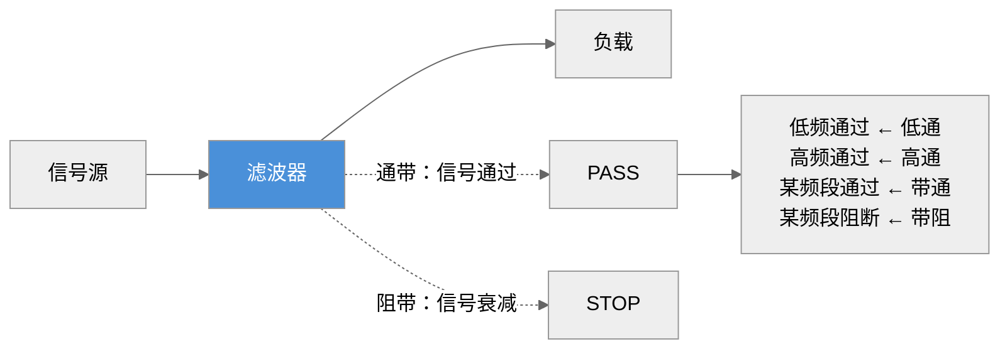
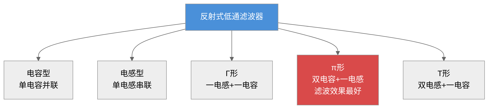
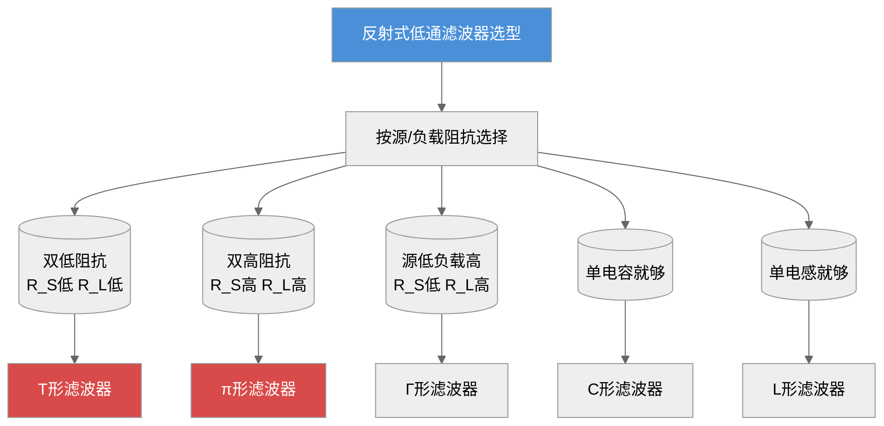
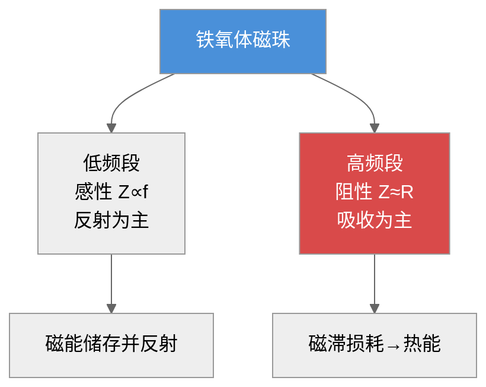
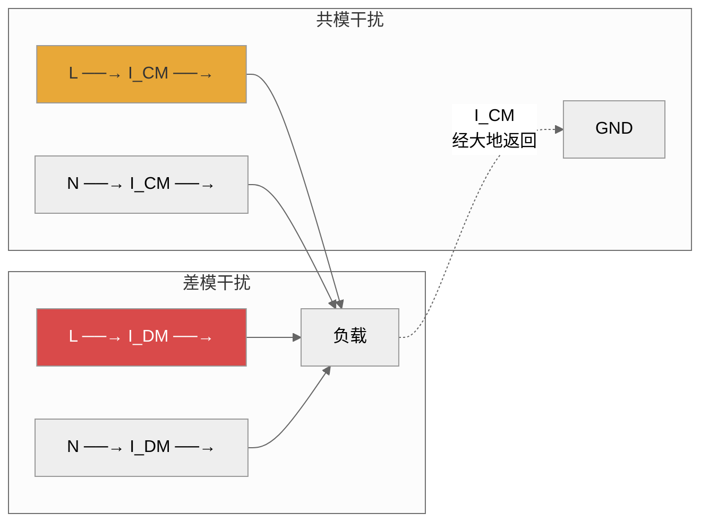
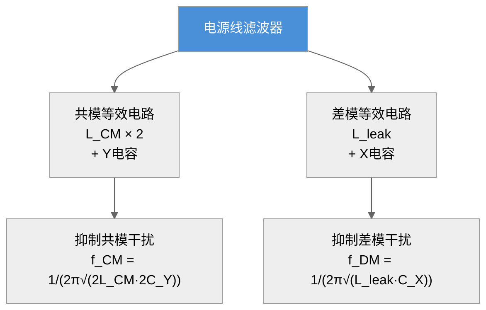
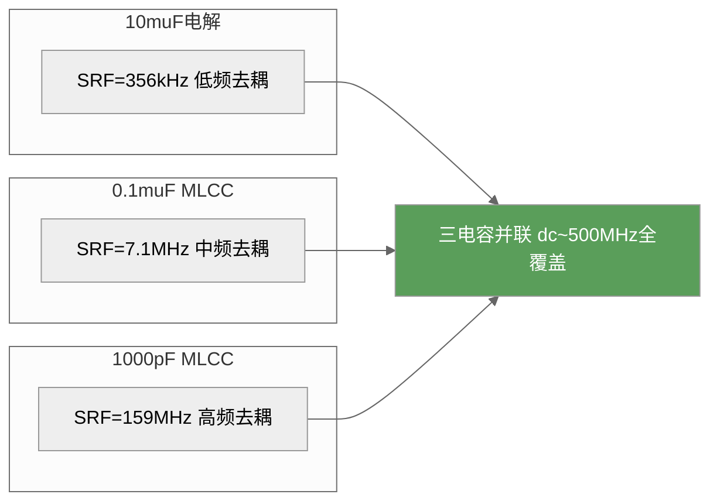
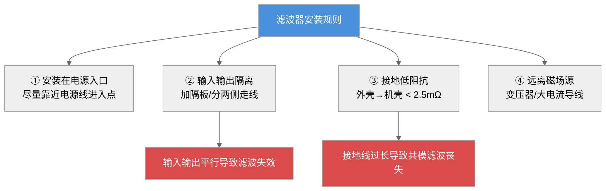
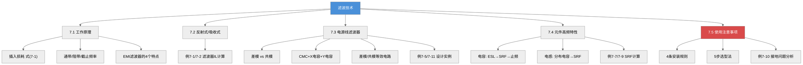

# 第七章 滤波技术

## 内容提要

滤波是电磁兼容三大基本技术之一。电磁骚扰可在空间和电路中传播——对于空间传播的骚扰，屏蔽技术是主要抑制手段；而对于电路中传播的骚扰，则需要滤波技术来解决。滤波的实质是将信号频谱划分为有用频率分量和干扰频率分量，然后剔除干扰分量，保留有用信号。

在电子设备中，滤波无处不在：电源入口处的电源线滤波器阻止电网中的骚扰进入设备，也防止设备产生的骚扰污染电网；信号线上的滤波器确保有用信号通过的同时抑制带外干扰；PCB上的去耦电容滤除高频开关噪声。一个设计良好的滤波器可以在不改变电路功能的前提下，将传导骚扰降低几个数量级。

本章从滤波器的工作原理出发（7.1节），介绍反射式滤波器和吸收式滤波器两大类基本结构（7.2节），重点讨论工程中最常使用的电源线滤波器（7.3节），分析电阻、电容、电感等基本元件在高频下的非理想特性（7.4节），最后总结滤波器在实际工程中的使用注意事项（7.5节）。通过本章的学习，读者应能根据实际工程需求选择合适的滤波器类型，正确安装和使用滤波器，并理解元件高频特性对滤波性能的影响。

通过本章学习，读者应达成以下学习目标：

1. 理解滤波器的基本工作原理，掌握插入损耗的定义和计算
2. 掌握反射式滤波器的四种基本结构（L型、π型、T型、Γ型），能计算其插入损耗
3. 理解吸收式滤波器（铁氧体磁珠/磁环）的工作原理和选型方法
4. 掌握电源线滤波器的基本电路结构（差模/共模等效电路）
5. 理解电阻、电容、电感在高频下的非理想特性（寄生参数、自谐振频率）
6. 掌握滤波器的工程安装规则——输入输出隔离、接地搭接、布线
7. 能根据实际EMC测试结果选择和设计滤波器

---

## 7.1 滤波器工作原理及特性指标

### 7.1.1 滤波器工作原理

**滤波器（Filter）** 是一种选择性地通过或抑制特定频率分量的二端口网络。在一定的通频带内，滤波器的衰减很小，信号可以顺利通过；在此通频带之外，滤波器的衰减很大，抑制信号的传输。滤波器将有用信号的频谱和骚扰的频谱隔离得越完善，抑制电磁骚扰的效果就越好。

从电磁兼容的角度来看，滤波器的作用可分为两类：**信号选择滤波**——从多种频率成分中选择出有用信号，剔除无用信号；**电磁干扰滤波**——抑制电磁骚扰的传播，保护敏感设备不被骚扰。

滤波器的基本构成单元是电抗元件——**电感**和**电容**。电感表现为串联高阻抗，阻碍高频电流的通过；电容表现为并联低阻抗，将高频电流旁路到地。通过电感和电容的合理组合，可以实现对不同频率信号的选择性衰减。

$$
\boxed{\text{滤波器基本原理：电感串联阻高频，电容并联旁路高频}}
\tag{7-1}
$$

|> **柯金良信噪比论证（《电磁兼容概论》第6章）：** 从通信理论的角度看，滤波的本质是提高信噪比。若接收机的频带无限宽，噪声频谱为 $N(f)$，则进入接收机的总噪声功率为
>
> $$
> N = \int_{0}^{\infty} N(f)\,\mathrm{d}f
> \tag{7-2}
> $$
> 设有用信号功率为 $S$，则信噪比为
> $$
> S/N = S \Big/ \int_{0}^{\infty} N(f)\,\mathrm{d}f
> \tag{7-3}
> $$
> 如果将接收器的频带限制在 $[f_1, f_2]$ 的范围内，则进入接收器的噪声变为
> $$
> N' = \int_{f_1}^{f_2} N(f)\,\mathrm{d}f
> \tag{7-4}
> $$
> 显然 $N' < N$，因此信噪比得到改善：
> $$
> S/N' > S/N
> \tag{7-5}
> $$
> 这一论证揭示了滤波器抑制电磁干扰的数学本质——通过限制接收频带，从频域上将干扰信号与有用信号分离，从而在保证有用信号质量的同时大幅降低噪声功率。这也是为什么在EMC工程中，滤波被广泛用于提高系统抗扰度的根本原因。

*图7-1：滤波器的基本功能——选择性通过或抑制不同频率分量*

### 7.1.2 滤波器的类型

滤波器的分类方式很多，从不同角度可以分为以下类型：

**按工作原理分类：**
- **反射式滤波器**（Reflective Filter）：利用电抗元件的阻抗不连续性，将骚扰能量反射回源端。由电感和电容组成，理论上无能量损耗。
- **吸收式滤波器**（Dissipative/Absorptive Filter）：将骚扰能量转化为热能消耗掉。常用铁氧体材料制成，高频时呈现电阻性。

**按频率特性分类：**
- **低通滤波器**：低于截止频率的信号通过，高于截止频率的信号衰减
- **高通滤波器**：高于截止频率的信号通过，低于截止频率的信号衰减
- **带通滤波器**：某一频带内的信号通过，频带外的信号衰减
- **带阻滤波器**：某一频带内的信号衰减，频带外的信号通过

**按应用场合分类：**
- **电源线滤波器**：安装在设备电源入口，抑制传导发射和抗扰度
- **信号线滤波器**：安装在信号输入/输出端口，抑制信号线上的骚扰
- **PCB去耦滤波器**：集成电路电源引脚附近的去耦电容，滤除高频开关噪声
- **控制线滤波器**：安装在控制信号线上

**按组成元件特征分类：**
- **LC滤波器**：由电感和电容组成，最常用
- **晶体滤波器**：利用压电晶体的谐振特性，频率选择性极好
- **机械滤波器**：利用机械谐振实现选频
- **陶瓷滤波器**：利用陶瓷压电效应，体积小
- **螺旋滤波器**：利用螺旋谐振结构，适用于微波频段

**按有无源元件分类：**
- **无源滤波器**：仅由无源元件（R、L、C）组成，不需电源，可靠性高
- **有源滤波器**：含有运算放大器等有源器件，可做到体积小、重量轻，但本身也是骚扰源，在EMC工程中应慎用——有源器件的非线性会产生新的骚扰频率成分

**按信号选择与EMI抑制的功能区分：**
- **信号选择滤波器**：主要考虑对有用信号的幅度及相位影响最小，追求频率响应保真度
- **EMI滤波器**（电磁干扰滤波器）：主要追求对电磁干扰的有效抑制，允许在通带内有较大的幅度和相位变化

> **柯金良（《电磁兼容概论》）补充：** 上述六大分类体系覆盖了滤波器的全部维度。在EMC工程中需特别注意的是——不要试图用有源滤波器来解决电磁干扰问题，因为运算放大器本身也是骚扰源，其非线性会产生新的骚扰频率成分。EMC滤波器与信号滤波器虽然在基本原理上相同，但EMC滤波器的L、C元件需要承受相当大的无功电流和无功功率，且必须在阻抗失配状态下工作——这完全不同于信号滤波器的阻抗匹配设计原则。

在EMC工程中，**低通滤波器**是最常用的类型——因为电磁骚扰通常表现为高频信号（开关噪声、时钟谐波等），而有用信号往往在较低频段。

> **滤波技术历史演进：** 滤波技术的思想可以追溯到20世纪初的无线电通信时代。1915年，G.A. Campbell（贝尔实验室）和K. Wagner（德国）各自独立提出了基于LC元件的电波滤波器理论，奠定了现代滤波器设计的基础。1950年代，铁氧体材料的发明使吸收式滤波器成为可能——荷兰Philips公司率先将铁氧体磁珠用于射频干扰抑制。1970年代，随着开关电源的普及和EMC标准的制定，标准化EMI电源线滤波器进入大规模工业应用。1980~90年代，表面贴装元件（SMD）的成熟使滤波器的高频性能大幅提升——MLCC电容的ESL从几十nH降至几nH，贴片磁珠的阻抗频率特性得到精确控制。21世纪以来，随着电子设备工作频率不断提升（智能手机、5G通信、高速数字电路等），滤波技术进入了"宽带化"和"集成化"的新阶段——LTCC集成滤波器、EMI滤波器阵列（Filter Array）、铁氧体薄膜滤波器等新型器件不断涌现。这一演进历程表明：**滤波技术的发展始终伴随着新材料和新工艺的突破，以及电磁兼容标准的升级驱动**。

### 7.1.3 滤波器的特性指标

描述滤波器性能的主要技术指标包括以下各项。

#### 插入损耗（Insertion Loss, IL）

插入损耗是衡量滤波器性能的最核心指标。插入损耗定义为：在不接入滤波器时，信号源在负载上产生的电压 $U_1$，与接入滤波器后信号源在同一负载上产生的电压 $U_2$ 之比，以dB表示：

$$
\text{IL} = 20 \log \frac{U_1}{U_2} \quad \text{dB}
\tag{7-6}
$$

插入损耗值越大，滤波器对骚扰信号的抑制作用越强。例如，IL = 40 dB意味着骚扰电压被衰减到原来的1/100。

在实际应用中，滤波器的插入损耗与以下因素密切相关：
- **信号源频率**：不同频率下电抗元件的阻抗不同，IL随频率变化
- **源阻抗和负载阻抗**：滤波器的IL数据通常是在50 Ω系统中测得的，实际应用中的阻抗失配会使IL发生显著变化
- **工作电流**：大电流会使磁芯饱和，电感值下降，IL降低
- **环境温度**：温度影响磁芯材料的磁导率和电容器的容量

#### 频率特性

滤波器的插入损耗随频率变化的曲线称为频率特性。根据频率特性可确定滤波器的**截止频率** $f_c$（插入损耗达到-3 dB时的频率）、**通带**（插入损耗小于某个阈值的频率范围）和**阻带**（插入损耗大于某个阈值的频率范围）。

#### 阻抗特性

滤波器的输入阻抗和输出阻抗直接影响其插入损耗特性。在EMC工程中，一条核心原则是：**使用EMI滤波器时应保证输入、输出端最大限度地失配**。例如，低阻抗的骚扰源应配合高输入阻抗的滤波器，以获得最佳抑制效果。这与信号选择滤波器要求阻抗匹配完全不同。

**额定电压和额定电流**

额定电压是滤波器允许的最高工作电压，超过此电压可能导致内部元件（特别是电容）击穿。额定电流是滤波器不降低插入损耗性能的最大使用电流。需要特别注意：**当滤波器中流过超过额定电流的工作电流时，磁芯可能饱和，电感值大幅下降，滤波效果急剧劣化**。

#### 滤波器的阻抗匹配与失配原则

阻抗匹配是信号选择滤波器的设计核心，而EMI滤波器恰恰相反——它必须在**阻抗失配**状态下工作。这一根本差异源于两类滤波器的不同目标：

- **信号选择滤波器**追求最大功率传输，需要源阻抗、滤波器特性阻抗和负载阻抗三者匹配
- **EMI滤波器**追求最大骚扰抑制，需要滤波器在骚扰频段内造成最大的信号反射或吸收

阻抗失配的量化效果可以通过传输增益（Transducer Gain）公式分析。对于二端口滤波器网络，当源阻抗为 $Z_S$、负载阻抗为 $Z_L$ 时，滤波器两端的失配因子为：

$$
M_S = \frac{Z_S - Z_{\text{in}}}{Z_S + Z_{\text{in}}}, \quad M_L = \frac{Z_L - Z_{\text{out}}}{Z_L + Z_{\text{out}}}
\tag{7-7}
$$

其中 $Z_{\text{in}}$ 和 $Z_{\text{out}}$ 分别为滤波器的输入和输出阻抗。失配因子越接近 ±1，失配越严重，骚扰反射越强，滤波效果越好。

**工程判据：** 当 $|M_S| > 0.8$ 或 $|M_L| > 0.8$ 时，可认为阻抗失配充分。对于50 Ω系统，这要求滤波器输入/输出阻抗 < 5.6 Ω 或 > 450 Ω。

**表7-1：不同类型滤波器的特性对比**

| 滤波器类型 | 适用频段 | 典型IL (@10MHz) | 特点 | 典型应用 |
|:---------|:--------:|:--------------:|:-----|:---------|
| LC低通 | DC~100 MHz | 20~60 dB | 结构简单，成本低 | 电源线滤波 |
| π形低通 | DC~100 MHz | 40~80 dB | 滤波效果好，接地要求高 | EMI电源滤波器 |
| T形低通 | DC~100 MHz | 40~80 dB | 输入/输出端高阻抗 | 信号线滤波 |
| 铁氧体磁珠 | 10 MHz~GHz | 3~30 dB | 吸收式，无反射 | 高频信号线/电源 |
| 共模扼流圈 | 100 kHz~100 MHz | 20~60 dB | 抑制共模，对差模无影响 | 电源线/信号线 |

### 7.1.4 EMI滤波器的特点

电磁干扰滤波器（EMI Filter）与常规信号选择滤波器有本质区别：

**特点一：阻抗失配下工作。** 电磁骚扰源的阻抗频率特性变化范围很宽，其阻抗通常是整个频段的函数。由于经济和技术上的原因，不可能设计出全频段阻抗匹配的EMI滤波器。因此，EMI滤波器必须在阻抗失配的条件下有效工作。

**特点二：骚扰源电平变化幅度大。** 骚扰源的电平可能从微伏级到千伏级变化，有可能使EMI滤波器中的磁芯出现饱和效应，导致电感量下降。

**特点三：骚扰源频带范围宽。** 电磁骚扰的频谱从几十Hz到数GHz，高频特性非常复杂，难以用集总参数电路精确模拟滤波器的高频行为。

**特点四：可靠性要求高。** 由于骚扰源的工作频率范围宽，可能包含大电流脉冲，必须选择具有良好性能的滤波元件。滤波器的布局、滤波器与设备的连接不能引入附加的电磁干扰。

**特点五（补充）：滤波器的高频寄生效应不可忽略。** 在实际高频应用中，滤波器的性能不仅取决于其电路设计，还受制于元件的寄生参数和安装布局。例如，一个标称在50 Ω系统中IL为60 dB的π形滤波器，若安装不当（输入输出线耦合），高频实际IL可能降至20 dB以下。因此，EMI滤波器的设计必须从"电路设计"扩展到"系统级设计"——同时考虑元件选型、PCB布局、屏蔽和接地。

### 7.1.5 信号滤波器与电源滤波器的区分

> **柯金良（《电磁兼容概论》第6.1.3节）观点：** 安装在电源线上的滤波器称为电源线干扰滤波器，安装在信号线上的滤波器称为信号线干扰滤波器。两者除了都对电磁干扰有抑制作用外，还需特别注意以下区别：
> **信号滤波器的特殊要求：**
> - 滤波器不能对工作信号造成严重的幅度和相位影响，不能造成信号失真
> - 通常按阻抗完全匹配状态设计，以保证预定的频率响应
> - 对插入损耗的平坦度要求较高
> **电源滤波器的特殊要求：**
> - 当负载电流较大时，电路中的电感可能发生饱和，导致滤波器性能急剧下降
> - L、C元件需要处理和承受相当大的无功电流和无功功率，必须具有足够大的无功功率容量
> - 电网侧的源阻抗和负载侧的设备阻抗通常未知且随频率变化，滤波器必须在阻抗失配状态下运行
> - 需严格控制浪涌电流（开关电源启动时的冲击电流可能达到额定电流的10倍）
> **工程要点：** 在EMC设计中，滤波器必须考虑使用中的阻抗失配特性，以保证在所需频率范围内的滤波特性。此外，EMI滤波器使用不当可能产生"振铃"效应或在某一频率下产生谐振，若滤波器本身缺乏良好的屏蔽或接地不当，还可能给电路引进新的噪声。

---

## 7.2 反射式滤波器与吸收式滤波器

### 7.2.1 反射式滤波器

反射式滤波器（Reflective Filter）是电磁兼容中使用最广泛的滤波器类型。它的工作原理是利用电抗元件（电感L和电容C）组成的无源网络，在电磁信号传输路径上形成阻抗不连续，使大部分电磁能量反射回信号源处，而不是被消耗掉。理论上，反射式滤波器中的电感和电容是无耗元件。

低通滤波器是EMC中最常用的反射式滤波器。以下介绍四种基本结构。

#### 电容型滤波器（C形）

最简单的低通EMI滤波器——在骚扰信号线与地线之间并联一只电容器，利用电容在高频时阻抗低的特性，将骚扰电流旁路到地。根据电容分压原理，当源阻抗与负载阻抗均为R时，推导得其插入损耗为：

$$
\text{IL} = 10 \log \left[ 1 + (\pi f R C)^2 \right] \quad \text{dB}
\tag{7-8}
$$

式中，$f$ 为频率（Hz），$R$ 为源电阻和负载电阻（通常相等），$C$ 为滤波电容（F）。

电容型滤波器的缺点是：在低频时滤波效果有限，且输入和输出之间的隔离度不够。电容型滤波器适用于源阻抗和负载阻抗都较高（>500 Ω）的场合，此时电容的旁路效果最为显著。当源或负载阻抗较低时，电容型滤波器的IL急剧下降，此时应考虑电感型或LC组合型结构。

#### 电感型滤波器（L形）

在信号传输路径上串联一只电感，利用电感在高频时阻抗高的特性，阻碍骚扰电流的流通。根据电感分压原理，在源与负载阻抗均为R的条件下，推导得其插入损耗为：

$$
\text{IL} = 10 \log \left[ 1 + \left( \frac{\pi f L}{R} \right)^2 \right] \quad \text{dB}
\tag{7-9}
$$

式中，$L$ 为电感量（H）。

电感型滤波器在低频时效果有限，且电感存在直流电阻会产生电压降。

#### Γ形滤波器

由一个串联电感L和一个并联电容C组成，在源阻抗低、负载阻抗高时效果最好。根据Γ形LC网络的阻抗分压关系，推导得其插入损耗为：

$$
\text{IL} = 10 \log \left[ 1 + \left( \frac{\pi f L}{R} - \pi f R C \right)^2 \right] \quad \text{dB}
\tag{7-10}
$$

#### π形滤波器

由一个串联电感L和两个并联电容C组成（输入和输出各一只）。π形滤波器的滤波效果优于Γ形，在源阻抗和负载阻抗都较高时效果最好。其插入损耗近似为两倍Γ形滤波器：

$$
\text{IL}_\pi \approx 2 \times \text{IL}_\Gamma \quad \text{dB}
\tag{7-11}
$$

但π形滤波器对滤波器的接地阻抗非常敏感——如果接地阻抗过高，后一级电容形同虚设，干扰电流可绕过电感直接耦合到负载端。因此，**π形滤波器的接地质量直接决定其实际滤波效果**。在电源线滤波器中，π形结构的后一级电容与Y电容合并，同时承担差模和共模滤波功能，接地路径必须通过滤波器的金属外壳直接连接到机壳地。

π形滤波器的插入损耗更精确的表达式为：
$$
\text{IL}_\pi = 20\log\left|\frac{(R_S + R_L)(1 - \omega^2 LC) + j\omega(L + R_S R_L C)}{2R_L(1 - \omega^2 L C / 2) + j\omega(2L + R_S R_L C)}\right| \quad \text{dB}
\tag{7-12}
$$
当 $R_S = R_L = R$ 且 $\omega^2 LC \ll 1$ 时，式(7-7)退化为 $\text{IL}_\pi \approx 2 \times \text{IL}_\Gamma$，即式(7-6)。但在实际工程中，源和负载阻抗往往不相等，必须使用式(7-7)进行精确计算。

**阻抗失配影响**：π形滤波器对源和负载阻抗的比值 $R_S/R_L$ 敏感。当 $R_S/R_L \to 0$（源阻抗极低）或 $R_S/R_L \to \infty$（负载阻抗极高）时，IL下降可达10~20 dB。因此，设计π形滤波器时必须同时考虑源和负载的实际阻抗。

#### T形滤波器

由两个串联电感和一个并联电容组成（输入端一个电感、输出端一个电感、中间一个电容）。T形滤波器在源阻抗和负载阻抗都较低时效果最好。

T形滤波器的插入损耗为：
$$
\text{IL}_T = 20\log\left|\frac{(R_S + R_L)(1 - \omega^2 LC) + j\omega(L + R_S R_L C)}{2R_S + j\omega(2L + R_S R_L C - \omega^2 L^2 C)}\right| \quad \text{dB}
\tag{7-13}
$$
当 $R_S = R_L = R$ 时，式(7-8)简化为：
$$
\text{IL}_T = 20\log\left|\frac{(1 - \omega^2 LC) + j\omega\frac{L + R^2 C}{2R}}{1 + j\omega\frac{2L + R^2 C}{2R} - \frac{\omega^2 L^2 C}{2R}}\right| \quad \text{dB}
\tag{7-14}
$$

*图7-2：反射式低通滤波器的五种基本结构——π形滤波效果最好但对接地要求最高*

**例7-1**

解：
（a）100 kHz：$f = 10^5$ Hz。由感抗公式代入参数得：
$$
X_L = 2\pi \times 10^5 \times 10\times 10^{-6} = 6.28\ \Omega
\tag{7-15}
$$
由容抗公式代入参数得：
$$
X_C = \frac{1}{2\pi \times 10^5 \times 0.1\times 10^{-6}} = 15.9\ \Omega
\tag{7-16}
$$
将$X_L$、$X_C$代入式(7-5)得插入损耗：
$$
\text{IL} = 10\log\left[1 + \left(\frac{6.28}{50} - \frac{50}{15.9}\right)^2\right] = 10\log[1 + (-3.02)^2] = 10\log 10.12 \approx 10.1\ \text{dB}
\tag{7-17}
$$

（b）1 MHz：$X_L = 62.8\ \Omega$，$X_C = 1.59\ \Omega$。同理代入式(7-5)得：
$$
\text{IL} = 10\log\left[1 + \left(\frac{62.8}{50} - \frac{50}{1.59}\right)^2\right] = 10\log[1 + (1.256 - 31.45)^2] = 10\log 914 \approx 29.6\ \text{dB}
\tag{7-18}
$$

（c）10 MHz：$X_L = 628\ \Omega$，$X_C = 0.159\ \Omega$。此时容抗远小于感抗，式(7-5)中$ \pi f R C $项可忽略，近似得：
$$
\text{IL} \approx 10\log\left[1 + \left(\frac{628}{50}\right)^2\right] \approx 10\log 158.7 \approx 22.0\ \text{dB}
\tag{7-19}
$$

注意：10 MHz时的IL反而不如1 MHz——这是因为$\pi f L/R$和$\pi f R C$两项在高频时不平衡，导致插入损耗下降。这说明**反射式滤波器的插入损耗并非单调随频率升高而增大**，在工程中必须针对特定频段优化设计。

**例7-2**

解：由式(7-3)~(7-6)：

（a）电容型：$\text{IL}_C = 10\log[1 + (\pi \times 10^6 \times 50 \times 0.1\times10^{-6})^2] = 10\log(1 + 247) \approx 23.9\ \text{dB}$

（b）电感型：$\text{IL}_L = 10\log[1 + (\pi \times 10^6 \times 10\times10^{-6} / 50)^2] = 10\log(1 + 0.395) \approx 1.5\ \text{dB}$

（c）π形（近似为2×Γ形IL，Γ形IL≈29.6 dB由例7-1）：$\text{IL}_\pi \approx 59.2\ \text{dB}$

（d）T形：对称结构，当源和负载阻抗相等时IL与π形接近：$\text{IL}_T \approx 60\ \text{dB}$

**对比**：电感型最弱（1.5 dB），电容型中等（23.9 dB），π/T形最强（约60 dB）。但π/T形对接地阻抗和元件寄生参数敏感，实际应用中20 dB以上的衰减通常就足够了，应优先选用简单结构。

> **柯金良（《电磁兼容概论》表6.3.1~6.3.3）补充——多阻抗条件下的IL估算表与阻抗选型关系：**
> 不同结构的滤波器对源阻抗和负载阻抗有明确要求。表7-2a总结了四种基本滤波器的阻抗适配关系；表7-2b给出了考虑源阻抗和负载阻抗的一般IL估算公式；表7-2c给出了源阻抗与负载阻抗相等时的简化IL估算公式。
> **表7-2a：不同结构滤波器所要求的源阻抗和负载阻抗（柯金良表6.3.1）**
> | 滤波器类型 | T形 | Π形 | L形（Γ形） | C形（反Γ形） |
> |:---------|:---:|:---:|:---------:|:----------:|
> | 电路结构 | 双L+单C | 双C+单L | 单L+单C（L在前） | 单C+单L（C在前） |
> | 要求源阻抗 $R_S$ | 小 | 大 | 大 | 小 |
> | 要求负载阻抗 $R_L$ | 小 | 大 | 小 | 大 |
> **选型规则：**
> - T形滤波器适用于信号内阻和负载电阻都比较小的情况（如低于50 Ω）
> - Π形滤波器适用于信号内阻和负载电阻都比较高的情况
> - 当源阻抗和负载阻抗不相等且差别较大时，选用L形（源大/负小）或C形（源小/负大）
> **表7-2b：不同滤波器的插入损耗估算公式（柯金良表6.3.2）**
> | 滤波电路 | 插入损耗计算公式/dB | 适用条件 |
> |:---------|:-------------------|:--------|
> | 单电感滤波 | $\text{IL} = 20\lg\left[\dfrac{\omega L}{Z_S+Z_L}\right]$ | $Z_S, Z_L \ll 50\ \Omega$ |
> | 单电容滤波 | $\text{IL} = 20\lg\left[\dfrac{\omega C Z_S Z_L}{Z_S+Z_L}\right]$ | $Z_S, Z_L \gg 50\ \Omega$ |
> | Γ形滤波 | $\text{IL} = 20\lg\left[\dfrac{\omega L}{Z_S} + \omega^2 LC\right]$ | $Z_S \gg Z_L$ |
> | 反Γ形滤波 | $\text{IL} = 20\lg\left[\dfrac{\omega L}{Z_L} + \omega^2 LC\right]$ | $Z_S \ll Z_L$ |
> | T形滤波 | $\text{IL} = 20\lg\left[\omega^2 LC + \dfrac{\omega^3 L^2 C + 2\omega L}{Z_S+Z_L}\right]$ | $Z_S, Z_L < 50\ \Omega$ |
> | Π形滤波 | $\text{IL} = 20\lg\left[\omega^2 LC + \dfrac{(\omega^3 LC^2 + 2\omega C) Z_S Z_L}{Z_S+Z_L}\right]$ | $Z_S, Z_L > 50\ \Omega$ |
> **表7-2c：源阻抗和负载阻抗相等（$R_S = R_L = R$）时的简化IL估算公式（柯金良表6.3.3）**
> | 滤波电路 | 插入损耗计算公式/dB |
> |:---------|:-------------------|
> | 单电感滤波 | $\text{IL} = 10\lg(1 + \pi f L / R)$ |
> | 单电容滤波 | $\text{IL} = 10\lg(1 + \pi f R C)$ |
> | Γ形滤波 | $\text{IL} = 10\lg\left[(2-\omega^2 LC)^2 + \left(\dfrac{\omega L}{R} + \omega CR\right)^2/4\right]$ |
> | T形滤波 | $\text{IL} = 10\lg\left[(1-\omega^2 LC)^2 + \left(\dfrac{\omega L}{R} - \dfrac{\omega^3 L^2 C}{2R} + \dfrac{\omega CR}{2}\right)^2\right]$ |
> | Π形滤波 | $\text{IL} = 10\lg\left[(1-\omega^2 LC)^2 + \left(\dfrac{\omega L}{2R} - \dfrac{\omega^2 LC^2 R}{2} + \omega CR\right)^2\right]$ |
> **阻抗选型表工程使用说明：** 实际电路的阻抗很难精确估算，特别是在高频时由于寄生参数的影响，电路阻抗变化很大且与工作状态有关。因此，上述公式中假设电感和电容是理想器件，实际应用时必须考虑二者杂散参数的影响。工程中一般先根据阻抗条件选择拓扑，再通过试验结果验证并调整。当源阻抗和负载阻抗未知或变化范围较大时，可在滤波器输入和输出端并接阻值合适的固定电阻以稳定滤波性能。

*图7-3：反射式低通滤波器选型指南——根据源阻抗和负载阻抗的组合选择最优拓扑*

### 7.2.2 吸收式滤波器

吸收式滤波器（Dissipative Filter）将骚扰能量转化为热能消耗掉，而不是反射回源端。与反射式滤波器相比，吸收式滤波器的最大优点是**不会产生反射驻波**——在高速数字信号线或射频电路中，反射式滤波器可能引起信号完整性问题，而吸收式滤波器不会。

EMC工程中最常用的吸收式滤波器是**铁氧体磁珠（Ferrite Bead）**和**铁氧体磁环**。

#### 铁氧体磁珠的工作原理

铁氧体磁珠由高磁导率的铁氧体材料制成，当导线穿过磁珠时，导线相当于单匝电感线圈。在低频段，铁氧体表现为电感性（$Z \approx j\omega L$），能量以磁场形式储存；在高频段，铁氧体材料中的磁畴跟不上磁场变化，产生磁滞损耗，铁氧体表现为电阻性（$Z \approx R$），将高频能量转化为热能。

铁氧体磁珠的阻抗-频率特性可以用以下简化模型描述，根据铁氧体材料的磁导率频率特性推导得：

$$
Z(f) = R(f) + j\omega L(f)
\tag{7-20}
$$

在低频段（$f < f_0$），$Z \approx \omega L$（感性）；在高频段（$f > f_0$），$Z \approx R_{\text{max}}$（阻性）。转折频率 $f_0$ 取决于铁氧体材料的类型。

*图7-4：铁氧体磁珠的双频段特性——低频反射、高频吸收*

#### 铁氧体材料的选择

不同材料的铁氧体适用于不同频段：

| 材料类型 | 适用频段 | 磁导率范围 | 特点 |
|:---------|:--------:|:----------:|:-----|
| 锰锌铁氧体（MnZn） | 1~30 MHz | 2000~15000 | 磁导率高，低频效果好，饱和磁通密度高（0.3~0.5 T） |
| 镍锌铁氧体（NiZn） | 30 MHz~GHz | 100~2000 | 磁导率低，高频效果好，电阻率高（抑制涡流损耗） |

在EMC工程中，对于10 MHz以下的骚扰，应选择锰锌铁氧体；对于30 MHz以上的骚扰，应选择镍锌铁氧体。对于10~30 MHz的过渡频段，可根据实际测试结果选择。

**实际选型中的温度考虑：** 铁氧体材料的磁导率对温度敏感。MnZn铁氧体的居里温度约为130~200°C，在接近居里温度时磁导率急剧下降，磁珠阻抗可降至室温值的20%以下。NiZn铁氧体的温度稳定性较好，居里温度通常在100~150°C。在高温环境（如电源模块附近）应用时，应优先选择NiZn材料或选择具有宽温范围的型号。

#### 铁氧体磁珠的复磁导率模型与阻抗定量计算

铁氧体磁珠的阻抗-频率特性来源于材料的**复磁导率**（Complex Permeability）。铁氧体材料的磁导率是频率的复函数，可以表示为：

$$
\mu(f) = \mu'(f) - j\mu''(f)
\tag{7-21}
$$

其中，实部 $\mu'(f)$ 代表磁能的储存能力（对应电感分量），虚部 $\mu''(f)$ 代表磁能的损耗（对应电阻分量）。两个分量都是频率的函数。

对于磁珠中的一段铁氧体材料，其阻抗可以表示为：

$$
Z(f) = j\omega L_0 \cdot \mu(f) = j\omega L_0 [\mu'(f) - j\mu''(f)] = \omega L_0 \mu''(f) + j\omega L_0 \mu'(f)
\tag{7-22}
$$

这里 $L_0$ 是磁珠的**空心电感**（即同样的几何形状在空气中测得的电感）。对比式(7-19) $Z(f) = R(f) + j\omega L(f)$，可得：

$$
R(f) = \omega L_0 \mu''(f)
\tag{7-23}
$$

$$
L(f) = L_0 \mu'(f)
\tag{7-24}
$$

由此可以清晰地看出：铁氧体磁珠的**电阻分量 $R(f)$ 正比于复磁导率的虚部**，电感分量 $L(f)$ 正比于实部。

##### 双频段模型的数学表达

铁氧体材料的复磁导率随频率变化可以用**德拜（Debye）型弛豫模型**近似描述：

$$
\mu(f) = \mu_\infty + \frac{\mu_s - \mu_\infty}{1 + j(f/f_r)}
\tag{7-25}
$$

其中，$\mu_s$ 为静态（低频）磁导率，$\mu_\infty$ 为光频磁导率（通常取1），$f_r$ 为弛豫频率（即磁导率虚部峰值频率）。分离实部和虚部：

$$
\mu'(f) = \mu_\infty + \frac{(\mu_s - \mu_\infty)}{1 + (f/f_r)^2}
\tag{7-26}
$$

$$
\mu''(f) = \frac{(\mu_s - \mu_\infty)(f/f_r)}{1 + (f/f_r)^2}
\tag{7-27}
$$

**双频段行为分析：**

**低频段（$f \ll f_r$）：** 此时 $f/f_r \to 0$，由式(7-19f)和(7-19g)可得：

$$
\mu'(f) \approx \mu_s, \quad \mu''(f) \approx \mu_s \cdot \frac{f}{f_r} \ll \mu'
\tag{7-28}
$$

代入式(7-19b)得：

$$
Z(f) \approx j\omega L_0 \mu_s = j\omega L_{\text{low}}
\tag{7-29}
$$

其中 $L_{\text{low}} = L_0 \mu_s$ 为低频电感。此时铁氧体表现为**纯感性**，阻抗近似与频率成正比。

**高频段（$f \gg f_r$）：** 此时 $f/f_r \to \infty$，可得：

$$
\mu'(f) \approx \mu_\infty \approx 1, \quad \mu''(f) \approx \frac{\mu_s - \mu_\infty}{f/f_r} \to 0
\tag{7-30}
$$

但实际铁氧体材料在高频段还有**涡流损耗**和**尺寸共振**等附加损耗机制，使得 $\mu''(f)$ 不会衰减到零，而是趋于一个有限值。工程上，高频段阻抗近似为：

$$
Z(f) \approx R_{\text{max}} + j\omega L_0
\tag{7-31}
$$

其中 $R_{\text{max}}$ 是磁珠的最大电阻值（通常出现在 $f_r$ 附近）。

**转折频率 $f_0$：** 在工程应用中，将磁珠的阻抗从感性主导过渡到阻性主导的频率称为转折频率。对于MnZn铁氧体，$f_0$ 一般在10~30 MHz；对于NiZn铁氧体，$f_0$ 一般在100~300 MHz。转折频率可以通过查找磁珠的阻抗-频率曲线（数据手册中通常提供）获得。

##### 磁珠阻抗的工程计算方法

磁珠的阻抗曲线通常由供应商以**阻抗-频率图**或**数据表**的形式提供。在没有精确数据时，可以使用以下工程近似方法进行估算。

**方法一：基于复磁导率模型的计算**

已知磁珠的空心电感 $L_0$（可由磁珠几何尺寸估算）和材料的复磁导率参数 $\mu_s$、$f_r$，通过式(7-19a)~(7-19g)计算各频率下的阻抗。

**空心电感 $L_0$ 的估算：** 对于圆柱形磁珠穿在导线上，近似为单匝线圈：

$$
L_0 \approx \frac{\mu_0}{2\pi} \cdot l \cdot \ln\left(\frac{D}{d}\right)
\tag{7-32}
$$

其中，$l$ 为磁珠长度（m），$D$ 为磁珠外径（m），$d$ 为磁珠内径（导线直径，m），$\mu_0 = 4\pi \times 10^{-7}$ H/m。典型值：对于长度3 mm、外径3 mm、内径1 mm的小磁珠，$L_0 \approx 0.5$ nH。

**方法二：基于数据手册阻抗曲线的插值**

实际工程中最常用的方法是利用磁珠供应商提供的阻抗-频率曲线。曲线通常给出 $|Z|$ 和 $R$（或 $\theta$）随频率的变化。利用以下关系可以从 $|Z|$ 和相位角 $\theta$ 分离出 $R$ 和 $X_L$：

$$
R(f) = |Z(f)| \cdot \cos\theta(f)
\tag{7-33}
$$

$$
X_L(f) = |Z(f)| \cdot \sin\theta(f)
\tag{7-34}
$$

$$
L(f) = \frac{X_L(f)}{2\pi f}
\tag{7-35}
$$

**例7-3a 铁氧体磁珠阻抗计算**

**问题：** 某贴片铁氧体磁珠的 $L_0 = 0.5$ nH，材料为NiZn铁氧体，静态磁导率 $\mu_s = 800$，弛豫频率 $f_r = 100$ MHz。求其在1 MHz、10 MHz、100 MHz和500 MHz时的阻抗，并判断各频段的主导机制（感性/阻性）。

**解：**

（a）低频电感 $L_{\text{low}} = L_0 \mu_s = 0.5 \times 10^{-9} \times 800 = 0.4$ μH。

（b）各频率下计算 $\mu'(f)$ 和 $\mu''(f)$（取 $\mu_\infty = 1$）：

- **1 MHz（$f/f_r = 0.01$）：**
  $$
  \mu' = 1 + \frac{800-1}{1+0.01^2} \approx 799.9, \quad
  \mu'' = \frac{(800-1)\times 0.01}{1+0.01^2} \approx 7.99
\tag{7-36}
  $$
  可见在远离弛豫频率时，$\mu'$ 接近 $\mu_s$，$\mu''$ 很小。
  $$
  R = 2\pi\times 10^6 \times 0.5\times 10^{-9} \times 7.99 \approx 0.025\ \Omega
  L = 0.5\times 10^{-9} \times 799.9 \approx 0.4\ \mu\text{H}
  X_L = 2\pi\times 10^6 \times 0.4\times 10^{-6} \approx 2.51\ \Omega
  |Z| = \sqrt{0.025^2 + 2.51^2} \approx 2.51\ \Omega
\tag{7-37}
  $$
  相位角 $\theta = \arctan(2.51/0.025) \approx 89.4^\circ$（接近纯感性）。

- **10 MHz（$f/f_r = 0.1$）：**
  $$
  \mu' = 1 + \frac{799}{1+0.01} \approx 792.1, \quad
  \mu'' = \frac{799\times 0.1}{1+0.01} \approx 79.1
  R = 2\pi\times 10^7 \times 0.5\times 10^{-9} \times 79.1 \approx 2.48\ \Omega
  L = 0.5\times 10^{-9} \times 792.1 \approx 0.396\ \mu\text{H}
  |Z| = \sqrt{2.48^2 + (2\pi\times 10^7\times 0.396\times 10^{-6})^2} \approx \sqrt{2.48^2 + 24.9^2} \approx 25.0\ \Omega
\tag{7-38}
  $$
  相位角 $\theta = \arctan(24.9/2.48) \approx 84.3^\circ$（仍以感性为主，但电阻分量已不可忽略）。

- **100 MHz（$f/f_r = 1.0$，此刻处于弛豫频率）：**
  $$
  \mu' = 1 + \frac{799}{1+1} \approx 400.5, \quad
  \mu'' = \frac{799\times 1}{1+1} \approx 399.5
\tag{7-39}
  $$
  在弛豫频率处，$\mu' = \mu''$，电阻分量达到最大。
  $$
  R = 2\pi\times 10^8 \times 0.5\times 10^{-9} \times 399.5 \approx 125.5\ \Omega
  L = 0.5\times 10^{-9} \times 400.5 \approx 0.20\ \mu\text{H}
  X_L = 2\pi\times 10^8 \times 0.20\times 10^{-6} \approx 125.7\ \Omega
  |Z| = \sqrt{125.5^2 + 125.7^2} \approx 177.6\ \Omega
\tag{7-40}
  $$
  相位角 $\theta = \arctan(125.7/125.5) \approx 45.0^\circ$（电阻和感抗相等）。

- **500 MHz（$f/f_r = 5.0$）：**
  $$
  \mu' = 1 + \frac{799}{1+25} \approx 31.7, \quad
  \mu'' = \frac{799\times 5}{1+25} \approx 153.7
  R = 2\pi\times 5\times 10^8 \times 0.5\times 10^{-9} \times 153.7 \approx 241.4\ \Omega
  L = 0.5\times 10^{-9} \times 31.7 \approx 0.016\ \mu\text{H}
  X_L = 2\pi\times 5\times 10^8 \times 0.016\times 10^{-6} \approx 50.2\ \Omega
  |Z| = \sqrt{241.4^2 + 50.2^2} \approx 246.6\ \Omega
\tag{7-41}
  $$
  相位角 $\theta = \arctan(50.2/241.4) \approx 11.8^\circ$（电阻主导）。

（c）结论汇总：

| 频率 | $R$ (Ω) | $L$ (μH) | $X_L$ (Ω) | $|Z|$ (Ω) | 主导机制 |
|:----:|:-------:|:--------:|:---------:|:---------:|:--------:|
| 1 MHz | 0.025 | 0.400 | 2.51 | 2.51 | 感性 |
| 10 MHz | 2.48 | 0.396 | 24.9 | 25.0 | 感性为主 |
| 100 MHz | 125.5 | 0.200 | 125.7 | 177.6 | 阻性感抗相当 |
| 500 MHz | 241.4 | 0.016 | 50.2 | 246.6 | 阻性主导 |

**工程意义：** 该磁珠在1~10 MHz主要表现为电感（反射式），适合抑制此频段的噪声同时保持信号完整性；在100 MHz处提供最大阻抗（约178 Ω），阻性感抗各半，是抑制100 MHz附近噪声的最佳工作点；在500 MHz以上为纯电阻，适合吸收高频噪声但不产生反射。选用磁珠时，应在目标噪声频率上选择阻抗最大的型号，并关注阻抗的阻性分量比例——阻性分量越高，对信号完整性的影响越小。

**例7-3b 磁珠选型与阻抗匹配**

**问题：** 某数字电路的时钟频率为50 MHz，其3次谐波（150 MHz）在信号线上产生共模骚扰。需选择一款磁珠进行抑制，要求：
- 在150 MHz处提供至少60 Ω的阻抗
- 直流电阻（DCR）不超过0.5 Ω（避免电压降过大）
- 额定电流不小于200 mA

**解：**

（a）查看候选磁珠的数据手册（以典型贴片磁珠为例）：

| 型号 | 阻抗@100 MHz | 阻抗@150 MHz | DCR | 额定电流 | 材料 |
|:----|:-----------:|:-----------:|:---:|:--------:|:---:|
| BLM18AG601 | 600 Ω | ~350 Ω | 0.3 Ω | 200 mA | NiZn |
| BLM18PG331 | 330 Ω | ~220 Ω | 0.15 Ω | 500 mA | NiZn |
| BLM18BB121 | 120 Ω | ~100 Ω | 0.05 Ω | 2000 mA | NiZn |

（b）分析：
- BLM18AG601在150 MHz处约350 Ω >> 60 Ω，但额定电流仅200 mA，裕量不足（时钟电路实际消耗180 mA，接近极限）。
- BLM18PG331在150 MHz处约220 Ω >> 60 Ω，DCR仅0.15 Ω，额定电流500 mA，裕量充足。
- BLM18BB121在150 MHz处约100 Ω > 60 Ω，DCR仅0.05 Ω，额定电流2 A，裕量最大。

（c）**选型建议：** BLM18PG331为最优选择——阻抗裕量充足（220 Ω vs 60 Ω），DCR低（0.15 Ω），额定电流裕量大（500 mA vs 180 mA工作电流）。

（d）验证：磁珠串入50 Ω信号线后，在150 MHz处的插入损耗：
$$
\text{IL} \approx 20\log\left(1 + \frac{220}{50}\right) = 20\log 5.4 \approx 14.6\ \text{dB}
\tag{7-42}
$$
该衰减量足以将150 MHz的共模骚扰降低到可接受水平。

（e）**安装注意事项：** 磁珠应尽量靠近骚扰源（时钟芯片引脚）安装，使未滤波的走线最短；磁珠两侧的走线应避免平行耦合；在磁珠后端可并联一只小电容（如100 pF）构建LC滤波网络，进一步提升高频抑制效果。

**例7-3**

解：
（a）需要抑制的频率：100 MHz和300 MHz——均高于30 MHz。
（b）应选择**镍锌铁氧体**（NiZn），因为镍锌铁氧体在30 MHz以上呈现较高的阻抗（主要为电阻分量），能有效吸收高频骚扰能量。
（c）锰锌铁氧体在100 MHz以上阻抗迅速下降，不适合此应用。
（d）选择磁珠时，应选择在100~300 MHz频段内阻抗最大的型号——通常磁珠的数据手册会给出阻抗-频率曲线。

#### 铁氧体磁环（电缆扼流圈）

当需要抑制电缆上的共模骚扰时，通常使用铁氧体磁环（Ferrite Core）。将电缆穿过磁环一次或多次，形成共模扼流圈。共模电流流过时，磁环呈现高阻抗；差模电流的磁场在磁环中相互抵消，不受影响。

磁环的抑制效果与匝数有关。穿过磁环的次数越多，等效电感量越大（与匝数的平方成正比）。但匝数过多会增加分布电容，降低高频性能。通常1~3匝为最佳。

**例7-4**

解：
（a）电缆的特性阻抗通常为50 Ω（共模）。
（b）磁环串入电缆后，相当于在传输路径上串联了120 Ω的阻抗。
（c）共模电流的衰减量：
$$
\text{IL} \approx 20 \log \left(1 + \frac{Z_{\text{core}}}{Z_{\text{cable}}}\right) = 20\log\left(1 + \frac{120}{50}\right) = 20\log 3.4 \approx 10.6\ \text{dB}
\tag{7-43}
$$
（d）如果将电缆在磁环上绕2匝（等效电感4倍，阻抗约4倍=480 Ω）：
$$
\text{IL} \approx 20\log\left(1 + \frac{480}{50}\right) = 20\log 10.6 \approx 20.5\ \text{dB}
\tag{7-44}
$$
（e）注意：2匝的分布电容也增大，高频性能会有所下降。实际应用中需在效果和频率响应之间权衡。

*设问过渡：反射式滤波器和吸收式滤波器各有优势。在实际工程中，最常将两者结合使用——电源线滤波器就是反射式滤波器和共模扼流圈的经典组合。下一节将详细分析电源线滤波器的电路结构和设计要点。*

---

## 7.3 电源线滤波器

电源线滤波器（Power Line Filter）是EMC工程中使用最广泛的滤波器。所有使用电源供电的电子设备，从家电到工业设备，几乎都需要在电源入口处安装电源线滤波器，以满足传导发射和抗扰度标准的要求。

### 7.3.1 差模干扰与共模干扰

理解差模和共模干扰是设计和使用电源线滤波器的基础。在电源线上，骚扰信号以两种模式传输。

**差模干扰（Differential Mode, DM）** ：骚扰信号在火线（L）和零线（N）之间传播，方向与电源电流方向相同。差模干扰的频率通常较低（<10 MHz），主要来源于开关电源的开关频率及其谐波。

**共模干扰（Common Mode, CM）** ：骚扰信号在火线（L）和零线（N）上以相同的方向和相位传播，以大地为返回路径。共模干扰的频率通常较高（>10 MHz），主要来源于开关管的快速开关产生的位移电流、变压器绕组间的分布电容耦合等。

*图7-5：差模干扰与共模干扰——骚扰信号在电源线上的两种传输模式*

**例7-5**

解：可用以下方法判断：
（a）**频率特征法**——差模干扰的频率通常为开关频率的基波和谐波（65 kHz、130 kHz、195 kHz...）。150 kHz接近130 kHz（2次谐波），可能是差模。
（b）**LISN相位法**——如果在LISN(L1)和LISN(L2)上的读数相近，说明是共模；如果只在某一相上读数高，说明是差模。
（c）**共模扼流圈测试法**——在电源线上夹一个共模扼流圈，如果干扰量下降，说明是共模；如果不下降，说明是差模。

### 7.3.2 电源线滤波器的网络结构

标准的电源线滤波器采用**共模扼流圈 + X电容 + Y电容**的组合结构，同时抑制差模和共模干扰。

#### 基本电路结构

电源线滤波器的典型电路为一个**四端网络**，包含以下元件：

- **共模扼流圈（Common Mode Choke, CMC）** ：两个绕向相同的线圈绕在同一磁芯上。对差模电流（两线圈中的电流方向相反），磁通相互抵消，呈现低阻抗；对共模电流（两线圈中的电流方向相同），磁通叠加，呈现高阻抗。
- **X电容**：连接在火线和零线之间（差模），用于抑制差模干扰。X电容的容量较大（0.1~1 μF）。
- **Y电容**：连接在火线与地线之间、零线与地线之间（共模），用于抑制共模干扰。Y电容的容量较小（1~10 nF），受漏电流安全标准限制。

综上，由前述LC滤波器的工作原理及电路分析推导得电源线滤波器的核心组成可总结为：

$$
\boxed{\text{共模扼流圈抑制共模干扰}} + \boxed{\text{X电容抑制差模干扰}} + \boxed{\text{Y电容抑制共模干扰}}
\tag{7-45}
$$

**共模扼流圈的电感设计：** 共模扼流圈的电感量由所需的最低共模抑制频率决定。对于开关电源，根据LC谐振频率关系式 $f_{\text{CM}} = 1/(2\pi\sqrt{L_{\text{CM}}C_Y})$，将上式两边平方并移项整理后，推导得所需共模扼流圈电感为：

$$
L_{\text{CM}} = \frac{1}{(2\pi f_{\text{CM}})^2 C_Y}
\tag{7-46}
$$
式中，$f_{\text{CM}}$ 为需要抑制的最低共模频率（Hz），$C_Y$ 为Y电容的总容量（F）。Y电容的总容量受安全标准限制——对于220 V/50 Hz电网，通常 $C_Y \leq 4.7\ \text{nF}$（对应漏电流 $< 0.5\ \text{mA}$）。

**磁芯饱和分析：** 共模扼流圈的两个绕组中的差模电流方向相反，磁通在磁芯中相互抵消——因此理论上差模电流不会导致磁芯饱和。但实际中存在两个因素使磁芯产生偏磁。根据安培环路定理及磁路欧姆定律，推导得直流偏磁磁通密度为：
$$
B_{\text{DC}} \approx \frac{\mu_0 \mu_r N I_{\text{leak}}}{l_e}
\tag{7-47}
$$
其中，$I_{\text{leak}}$ 为两绕组差模电流的不平衡分量（通常为额定电流的1~5%），$N$ 为匝数，$l_e$ 为磁芯有效磁路长度（m）。当 $B_{\text{DC}}$ 超过磁芯材料饱和磁通密度 $B_{\text{sat}}$（锰锌铁氧体典型值0.3~0.5 T）的20%时，磁导率显著下降，共模电感减小。

**匝数优化：** 共模扼流圈的匝数 $N$ 和电感量的关系为：
$$
L_{\text{CM}} = N^2 A_L
\tag{7-48}
$$
式中，$A_L$ 为磁芯的电感系数（H/匝²，由磁芯数据手册给出）。增加匝数可提高电感量，但也会增加分布电容，降低高频性能。工程中常用1~5匝，优先选择高 $A_L$ 值的磁芯而非多匝数。

**例7-6**

解：
（a）由式(7-18)计算所需共模电感：
$$
L_{\text{CM}} = \frac{1}{(2\pi \times 150\times 10^3)^2 \times 4.7\times 10^{-9}} \approx \frac{1}{4.17\times 10^{12}} \approx 240\ \mu\text{H}
\tag{7-49}
$$

（b）由式(7-20)计算所需匝数：
$$
N = \sqrt{\frac{L_{\text{CM}}}{A_L}} = \sqrt{\frac{240}{3.2}} \approx \sqrt{75} \approx 8.7 \ \text{匝}
\tag{7-50}
$$
取 $N=9$ 匝。实际电感 $L_{\text{actual}} = 9^2 \times 3.2 = 259\ \mu\text{H}$，裕量充足。

（c）校验磁芯饱和（式7-19，取 $I_{\text{leak}} = 1\% \times 3\ \text{A} = 0.03\ \text{A}$，$\mu_0 = 4\pi\times 10^{-7}$，$\mu_r = 2000$）：
$$
B_{\text{DC}} \approx \frac{4\pi\times 10^{-7} \times 2000 \times 9 \times 0.03}{0.065} \approx 0.0104\ \text{T} = 10.4\ \text{mT}
\tag{7-51}
$$
仅为 $B_{\text{sat}}$ 的2.6%，远低于危险阈值，磁芯不会饱和。

（d）结论：选择 $N=9$ 匝的共模扼流圈，配合4.7 nF Y电容，可在150 kHz提供足够的共模抑制。实际设计中还需用EMI测试验证。

#### 差模等效电路

在分析差模干扰时，共模扼流圈两个绕组的磁通相互抵消，相当于只有两线圈的漏感起作用（典型值1~5%的总电感）。差模等效电路相当于一个LC低通滤波器，由差模电感（即共模扼流圈的漏感）和X电容组成。

差模截止频率：

$$
f_{\text{DM}} = \frac{1}{2\pi \sqrt{L_{\text{leak}} C_X}}
\tag{7-52}
$$

式中，$L_{\text{leak}}$ 为共模扼流圈的漏感（H），$C_X$ 为X电容（F）。

**差模电感的设计考虑：** 共模扼流圈的漏感通常不是独立可控参数——它取决于磁芯的耦合系数 $k$：

$$
L_{\text{leak}} = (1 - k)L_{\text{CM}}
\tag{7-53}
$$

耦合系数 $k$ 受绕制工艺影响，典型值为 0.95~0.999。对于双线并绕的共模扼流圈，$k \approx 0.98$~0.995，漏感约为总电感的 0.5~2%。对于分槽绕制的共模扼流圈，$k \approx 0.90$~0.98，漏感可达 2~10%。

因此，差模滤波能力与共模扼流圈的**耦合系数**密切相关：
- 需要较强差模抑制时，可选择**分槽绕制**的共模扼流圈（漏感更大），或在滤波器输入/输出端独立串接差模电感
- 需要较强共模抑制时，应选择**双线并绕**的共模扼流圈（耦合系数高，漏感小，对共模阻抗大）

**X电容的选择：** X电容的容量受安全标准的限制（X电容接在火线和零线之间，断开会直接造成设备损坏）。根据IEC 60384-14标准：
- **X1等级**：适用于峰值电压 > 400 V 至 ≤ 4000 V 的场合，脉冲测试电压 4 kV
- **X2等级**：适用于峰值电压 ≤ 400 V 的通用场合，脉冲测试电压 2.5 kV
- **X3等级**：适用于峰值电压 ≤ 250 V 的场合（较少使用）

X电容的典型容值范围及其差模滤波效果：

| X电容容值 | 截止频率（$L_{\text{leak}}=10$ μH） | 150 kHz衰减量 | 适用场景 |
|:---------:|:---------------------------------:|:-------------:|:---------|
| 0.1 μF | 5.03 MHz | ~1 dB | 微弱差模抑制 |
| 0.47 μF | 2.32 MHz | ~6 dB | 中等差模抑制 |
| 1.0 μF | 1.59 MHz | ~12 dB | 一般差模抑制 |
| 2.2 μF | 1.07 MHz | ~18 dB | 较强差模抑制 |
| 4.7 μF | 0.73 MHz | ~24 dB | 强差模抑制 |

**差模滤波设计中一个值得注意的问题：** 开关电源的输入整流器会产生大量的差模谐波电流，这些谐波电流的频谱依赖于工作模式。对于**连续导通模式（CCM）**的开关电源，差模电流为梯形波，谐波包络以 -40 dB/dec 滚降；对于**断续导通模式（DCM）**，差模电流为三角波，谐波包络以 -20 dB/dec 滚降。因此，DCM模式需要更强的差模滤波（更大的X电容或独立的差模电感）。

#### 共模等效电路

在分析共模干扰时，火线和零线并联，共模扼流圈的总电感为两个绕组电感之和（$2L$）。共模等效电路由共模电感和Y电容组成。

共模截止频率：

$$
f_{\text{CM}} = \frac{1}{2\pi \sqrt{2L_{\text{CM}} (C_{Y1} + C_{Y2})}}
\tag{7-54}
$$

式中，$L_{\text{CM}}$ 为共模扼流圈每绕组的电感（H），$C_{Y1}$、$C_{Y2}$ 为Y电容（F）。

**Y电容的安全限制与共模设计权衡：**

Y电容连接在火线/零线与大地之间，其容量直接决定了设备的**漏电流**。对于220 V/50 Hz系统：

$$
I_{\text{leak}} = 2\pi f V C_Y
\tag{7-55}
$$

代入 $f = 50\ \text{Hz}$，$V = 220\ \text{V}$：

| 总Y电容 | 漏电流 | 安全标准符合性 |
|:-------:|:------:|:--------------:|
| 2.2 nF | 0.152 mA | 医疗设备适用（<0.5 mA） |
| 4.7 nF | 0.325 mA | 医疗设备适用（<0.5 mA） |
| 10 nF | 0.691 mA | 信息技术设备适用（<3.5 mA） |
| 22 nF | 1.52 mA | 工业设备适用（<3.5 mA） |
| 47 nF | 3.25 mA | 接近限值，需谨慎 |
| 100 nF | 6.91 mA | 超出多数标准限值 |

根据不同的安全标准：
- **医疗设备（IEC 60601-1）：** 漏电流 < 0.5 mA，总Y电容通常 ≤ 4.7 nF
- **信息技术设备（IEC 60950-1 / IEC 62368-1）：** 漏电流 < 3.5 mA，总Y电容 ≤ 47 nF
- **工业设备：** 漏电流 < 10 mA，总Y电容可达100 nF

**共模设计权衡：** Y电容越大，共模抑制效果越好（截止频率越低），但漏电流越大。当漏电流受严格限制时（如医疗设备），必须增大共模扼流圈电感来补偿。

**例7-6a 医疗设备电源线滤波器设计**

**问题：** 某医疗监护仪的开关电源需设计电源线滤波器，要求：
- 工作电压：220 V AC / 50 Hz
- 工作电流：1.5 A
- 传导发射标准：CISPR 11 Class B（医疗设备）
- 漏电流限制：< 0.3 mA
- 最低共模抑制频率：100 kHz（需至少20 dB衰减）

**解：**

（a）**Y电容选择：** 根据漏电流限制 < 0.3 mA，由式(7-30a)：
$$
C_Y < \frac{0.3\times 10^{-3}}{2\pi \times 50 \times 220} \approx 4.34\ \text{nF}
\tag{7-56}
$$
取 $C_{Y1} = C_{Y2} = 2.2$ nF，总Y电容 $C_{Y,\text{total}} = 4.4$ nF，漏电流约0.304 mA，略超0.3 mA目标。改用2.0 nF（实际选标称值1.8 nF×2=3.6 nF，漏电流约0.249 mA）满足要求。取标准值 $C_{Y1} = C_{Y2} = 1.8$ nF。

（b）**共模扼流圈电感计算：** 由式(7-23)计算所需共模电感。最低抑制频率100 kHz，Y电容总容量3.6 nF：
$$
L_{\text{CM}} = \frac{1}{(2\pi \times 100\times 10^3)^2 \times 3.6\times 10^{-9}} \approx \frac{1}{3.95\times 10^{11} \times 3.6\times 10^{-9}} \approx \frac{1}{1.422\times 10^3} \approx 703\ \mu\text{H}
\tag{7-57}
$$

（c）**磁芯选择：** 选择铁氧体环形磁芯 $A_L = 2.5\ \mu\text{H}/\text{匝}^2$（MnZn材料，初始磁导率 $\mu_i = 5000$），有效磁路长度 $l_e = 40$ mm，$B_{\text{sat}} = 0.4$ T。

由式(7-25)所需匝数：
$$
N = \sqrt{\frac{703}{2.5}} \approx \sqrt{281} \approx 16.8\ \text{匝}
\tag{7-58}
$$
取 $N = 17$ 匝，实际电感 $L_{\text{actual}} = 17^2 \times 2.5 = 722.5\ \mu\text{H}$。

（d）**饱和校验：** 漏感不平衡分量取 $I_{\text{leak}} = 1\% \times 1.5 = 0.015$ A（双线并绕，耦合系数高）：
$$
B_{\text{DC}} \approx \frac{4\pi\times 10^{-7} \times 5000 \times 17 \times 0.015}{0.04} \approx \frac{1.60\times 10^{-3}}{0.04} \approx 0.04\ \text{T} = 40\ \text{mT}
\tag{7-59}
$$
约为 $B_{\text{sat}}$ 的10%，安全。

（e）**X电容选择：** 医疗设备对漏电流极度敏感，不能使用Y电容来抑制差模。差模抑制完全靠共模扼流圈的漏感 + X电容。取漏感为总电感的2%（$L_{\text{leak}} \approx 14.5\ \mu\text{H}$），差模截止频率设在50 kHz：
$$
C_X > \frac{1}{(2\pi \times 50\times 10^3)^2 \times 14.5\times 10^{-6}} \approx \frac{1}{9.87\times 10^{10} \times 14.5\times 10^{-6}} \approx 0.7\ \mu\text{F}
\tag{7-60}
$$
取标准值 $C_X = 1.0\ \mu\text{F}$（X2等级）。

（f）**验证：** 共模截止频率：
$$
f_{\text{CM}} = \frac{1}{2\pi\sqrt{2\times 722.5\times 10^{-6} \times (1.8+1.8)\times 10^{-9}}} \approx \frac{1}{2\pi\sqrt{5.202\times 10^{-12}}} \approx \frac{1}{2\pi \times 2.28\times 10^{-6}} \approx 69.8\ \text{kHz}
\tag{7-61}
$$
在100 kHz处，共模衰减约 $20\log(100/69.8) \times 2 \approx 15$ dB（二阶滤波器斜率40 dB/dec，距截止频率约0.36倍频程），加上裕量后接近20 dB要求。

（g）**最终方案：** 医疗级电源线滤波器参数：
- 共模扼流圈：722.5 μH（17匝，MnZn磁芯）
- X电容：1.0 μF（X2等级）
- Y电容：1.8 nF × 2（Y2等级）
- 漏电流：约0.25 mA（符合医疗设备要求）
- 额定电压：250 V AC
- 额定电流：2 A（含30%裕量）

*图7-6：电源线滤波器的共模与差模等效电路——两种模式需分别设计*

**表7-2：电源线滤波器元器件选型指南**

| 元件 | 类型 | 典型值 | 作用 | 选择要点 |
|:-----|:-----|:------:|:-----|:---------|
| 共模扼流圈 | 环形磁芯双线并绕 | 1~50 mH | 抑制共模干扰 | 磁芯材料（MnZn/NiZn）、饱和电流 |
| X电容 | 金属化聚丙烯膜 | 0.1~1 μF | 抑制差模干扰 | 耐压（X1/X2等级）、安全认证 |
| Y电容 | 陶瓷电容 | 1~10 nF | 抑制共模干扰 | 漏电流限制（Y1/Y2等级） |

### 7.3.3 滤波器的性能测试与仿真

电源线滤波器的插入损耗通常使用**50 Ω系统**进行测量——信号源内阻50 Ω，负载阻抗50 Ω。但实际应用中，滤波器的源阻抗（电网侧）和负载阻抗（设备侧）都不等于50 Ω，且随频率变化。

**源阻抗的影响**：当源阻抗远小于50 Ω时，电容型滤波器的效果优于电感型；当源阻抗远大于50 Ω时，电感型滤波器的效果优于电容型。

**负载阻抗的影响**：当负载阻抗远大于50 Ω时，π形滤波器效果最好；当负载阻抗远小于50 Ω时，T形滤波器效果最好。

**阻抗失配的核心策略**：使滤波器两端尽量失配——若源阻抗低，滤波器输入应呈现高阻抗（串联电感）；若负载阻抗高，滤波器输出应呈现低阻抗（并联电容）。

#### 滤波器的实际IL与50 Ω标称IL的差异

实际工程中一个常见误区：认为滤波器的数据手册标称IL就是实际滤波效果。事实上，标称IL是在50 Ω系统中测得的，而实际系统的阻抗可能与50 Ω相差很大。

**实际IL的估算方法：**

假设滤波器的S参数（二端口网络参数）已知，则在实际源阻抗 $Z_S$ 和负载阻抗 $Z_L$ 下的插入损耗为：

$$
\text{IL}_{\text{actual}} = 20\log\left|\frac{(Z_S + Z_L)(S_{21})}{(Z_S + Z_{\text{in}})(1 - \Gamma_S\Gamma_L)}\right|
\tag{7-62}
$$

其中 $Z_{\text{in}}$ 为滤波器输入阻抗，$\Gamma_S = (Z_S - 50)/(Z_S + 50)$，$\Gamma_L = (Z_L - 50)/(Z_L + 50)$ 为源和负载的反射系数。

**工程简化估算：** 当源阻抗从50 Ω变化到 $Z_S'$ 时，滤波器IL的变化量约为：

$$
\Delta\text{IL} \approx 20\log\left(\frac{50 + Z_{\text{filter,out}}}{Z_S' + Z_{\text{filter,out}}}\right) + 20\log\left(\frac{50 + Z_{\text{filter,in}}}{Z_L' + Z_{\text{filter,in}}}\right)
\tag{7-63}
$$

其中 $Z_{\text{filter,in}}$ 和 $Z_{\text{filter,out}}$ 是滤波器在50 Ω系统中的输入和输出阻抗。

#### 滤波器的仿真验证

在设计阶段，使用电路仿真软件（如LTspice、PSPICE、ADS）对滤波器进行仿真，可以显著减少原型迭代次数。仿真中应包含以下要素：

1. **理想元件模型：** 用于验证电路拓扑的可行性
2. **含寄生参数的元件模型：** 电容的ESL/ESR、电感的分布电容/DCR，仿真结果更接近实际
3. **实际源/负载阻抗：** 使用实测的阻抗曲线（或典型模型）代替50 Ω
4. **蒙特卡洛分析：** 考虑元件容差（电容±20%，电感±10%）对滤波器性能的影响

**例7-6b 源阻抗失配对滤波器IL的影响分析**

**问题：** 一款标称IL为40 dB（50 Ω系统，10 MHz）的π形电源线滤波器，实际安装在开关电源输入端。已知在10 MHz时，开关电源的输入阻抗约为2 Ω（低阻抗），电网侧源阻抗约为0.5 Ω（低阻抗）。估算该滤波器在10 MHz的实际IL。

**解：**

（a）π形滤波器在低源阻抗和低负载阻抗条件下性能下降。因为π形滤波器适用于高源和高负载阻抗，两端都接地电容旁路了骚扰——但在低阻抗条件下，电容的旁路效果减弱。

（b）粗略估算：π形滤波器的IL近似为Γ形滤波器的2倍，而Γ形滤波器的IL公式为式(7-9)：
$$
\text{IL}_\Gamma = 10\log\left[1 + \left(\frac{\pi f L}{R} - \pi f RC\right)^2\right]
\tag{7-64}
$$

当 $R$ 从50 Ω降低到2 Ω时，$\pi f L/R$ 项增大25倍（电感效果变好），但 $\pi f RC$ 项缩小25倍（电容效果变差）。两项不平衡导致IL下降。

（c）定量计算（假设 $L=100$ μH，$C=0.47$ μF，$f=10$ MHz）：
- $\pi f L/R = \pi \times 10^7 \times 100\times 10^{-6} / 2 \approx 1571$
- $\pi f RC = \pi \times 10^7 \times 2 \times 0.47\times 10^{-6} \approx 29.5$

$$
\text{IL}_\Gamma \approx 10\log[1 + (1571 - 29.5)^2] \approx 10\log(2.38\times 10^6) \approx 63.8\ \text{dB}
\tag{7-65}
$$

咦？IL反而更大了？这是因为低阻抗使得电感的效果大大增强。但此计算假设为理想Γ形，实际π形滤波器在两个低阻抗条件下的接地电容几乎不起作用，后一级电容的旁路效果很弱，滤波器退化为单电感型：

实际IL ≈ 电感型IL：
$$
\text{IL}_L = 10\log\left[1 + \left(\frac{\pi f L}{R}\right)^2\right] \approx 10\log\left[1 + \left(\frac{3142}{2}\right)^2\right] \approx 10\log(2.47\times 10^6) \approx 63.9\ \text{dB}
\tag{7-66}
$$

而50 Ω系统中的标称IL为40 dB，实际反而更高——这是因为**实际源和负载阻抗极低**，使π形滤波器中的电感发挥了更大的阻流作用。这说明：**阻抗失配对滤波器IL的影响可能是正面的也可能是负面的**，取决于失配的方向。

这个例子展示了阻抗失配的复杂性：在源/负载阻抗都极低时，π形滤波器的电感优势超过电容劣势，实际IL可能高于标称值。反之，在源/负载阻抗都极高时，同样的π形滤波器性能可能劣于标称值。**因此，选择滤波器时不能仅看标称IL，而必须结合实际的源和负载阻抗进行分析。**

*设问过渡：以上讨论假设电感和电容都是理想元件。然而在实际高频电路中，电阻、电容、电感都表现出非理想的高频特性——它们不再是纯净的单参数元件，而是包含寄生参数的复合网络。这些非理想特性在数十MHz以上的频段对滤波性能有决定性影响。*

---

## 7.4 电阻、电容、电感的高频特性

在EMC工程中，一个常见的误解是认为电容在"所有高频"下都是低阻抗、电感在"所有高频"下都是高阻抗。实际上，由于寄生参数的存在，电容在高到一定程度后会呈现电感性，电感在高到一定程度后会呈现电容性。理解这些非理想特性，是正确选择和设计滤波器的关键。

### 7.4.1 电容的高频特性

实际电容的等效电路为一个RLC串联网络：

$$
C_{\text{real}} = C_{\text{ideal}} + \text{ESR} + \text{ESL} + R_{\text{leak}}
\tag{7-67}
$$

其中，**ESR**（等效串联电阻）和**ESL**（等效串联电感）是两个最重要的寄生参数。

电容的阻抗频率特性由下式描述：

$$
Z_C(f) = \sqrt{\text{ESR}^2 + \left(2\pi f L_{\text{ESL}} - \frac{1}{2\pi f C}\right)^2}
\tag{7-68}
$$

在低频时，容抗（$1/2\pi fC$）占主导，阻抗随频率升高而下降；在**自谐振频率（SRF）** 处，容抗与感抗相等，阻抗达到最小值（等于ESR）；超过自谐振频率后，感抗（$2\pi f L_{\text{ESL}}$）占主导，阻抗随频率升高而**上升**——此时电容不再起旁路作用，而是呈现电感性。

自谐振频率：

$$
f_{\text{SRF}} = \frac{1}{2\pi \sqrt{L_{\text{ESL}} C}}
\tag{7-69}
$$

**例7-7**

解：
（a）自谐振频率：代入式(7-25)得：
$$
f_{\text{SRF}} = \frac{1}{2\pi \sqrt{5\times 10^{-9} \times 0.1\times 10^{-6}}} = \frac{1}{2\pi \sqrt{5\times 10^{-16}}} \approx \frac{1}{2\pi \times 2.24\times 10^{-8}} \approx 7.1\ \text{MHz}
\tag{7-70}
$$

（b）各频率下的阻抗：
- 1 MHz：$Z \approx 1/(2\pi \times 10^6 \times 0.1\times 10^{-6}) \approx 1.59\ \Omega$（容性主导）
- 10 MHz（接近SRF）：$Z \approx \text{ESR} = 0.1\ \Omega$（最低阻抗）
- 100 MHz：$Z \approx 2\pi \times 10^8 \times 5\times 10^{-9} \approx 3.14\ \Omega$（感性主导）
- 500 MHz：$Z \approx 2\pi \times 5\times 10^8 \times 5\times 10^{-9} \approx 15.7\ \Omega$（感性主导，已远比低频时**高**）

**结论**：这只0.1 μF电容只在10 MHz以下能有效旁路；超过10 MHz后阻抗反而升高，在500 MHz时阻抗高达15.7 Ω——已完全失去旁路功能。

**表7-3：不同电容类型的ESL和ESR对比**

| 电容类型 | 典型ESL | 典型ESR (@1MHz) | 自谐振频率 (0.1μF) | 适用频率上限 |
|:---------|:-------:|:---------------:|:------------------:|:-----------:|
| 铝电解 | 10~50 nH | 0.5~5 Ω | ~500 kHz | <1 MHz |
| 钽电解 | 5~20 nH | 0.1~1 Ω | ~3 MHz | <10 MHz |
| 多层陶瓷（MLCC） | 1~5 nH | 0.01~0.1 Ω | ~10 MHz | <100 MHz |
| 穿心电容 | <1 nH | <0.01 Ω | >100 MHz | <1 GHz |

**工程实践要点：并联电容宽带去耦策略**。单个电容的有效滤波频段受到其SRF的根本限制——超过SRF后阻抗升高，旁路失效。要在宽频段内保持低阻抗，必须**并联多个不同容值的电容**，利用各自SRF附近的最低阻抗区段拼接成宽带低阻抗特性。

并联电容网络的等效阻抗为各电容阻抗的并联，根据电阻并联公式推广到复阻抗，可得总阻抗为各支路阻抗倒数之和的倒数：
$$
Z_{\text{total}}(f) = (Z_1^{-1} + Z_2^{-1} + \cdots + Z_N^{-1})^{-1}
\tag{7-71}
$$
其中，每个电容的阻抗为 $Z_i(f) = R_{\text{ESR},i} + j\left(2\pi f L_{\text{ESL},i} - \frac{1}{2\pi f C_i}\right)$。

并联网络的优点是：各电容的ESL并联减小，总等效ESL降低，高频段阻抗更小。但也要注意**反谐振（Anti-Resonance）**：当两个电容的SRF接近时，在两者SRF之间的某个频率上，并联网络的阻抗可能高于单个电容的阻抗——这是因为一个电容呈容性、另一个呈感性时，LC串联谐振导致局部阻抗升高。

**例7-8**

解：
（a）各电容的SRF（由式7-25）：
- 10 μF：$f_{\text{SRF}} = 1/(2\pi\sqrt{20\times10^{-9} \times 10\times10^{-6}}) \approx 356\ \text{kHz}$
- 0.1 μF：$f_{\text{SRF}} \approx 7.1\ \text{MHz}$（由例7-7）
- 1000 pF：$f_{\text{SRF}} = 1/(2\pi\sqrt{1\times10^{-9} \times 1000\times10^{-12}}) \approx 159\ \text{MHz}$

（b）各频段的阻抗分析：
- dc~300 kHz：10 μF主导，阻抗<0.5 Ω
- 300 kHz~10 MHz：0.1 μF主导，在7.1 MHz处阻抗低至0.1 Ω
- 10~100 MHz：1000 pF主导，在159 MHz处阻抗约0.05 Ω
- 100~500 MHz：三电容ESL并联（20∥3∥1 ≈ 0.7 nH），100 MHz时阻抗约0.44 Ω，500 MHz时约2.2 Ω

（c）反谐振检查：10 μF和0.1 μF的SRF（356 kHz vs 7.1 MHz）相差20倍，不会产生明显反谐振。0.1 μF和1000 pF的SRF（7.1 MHz vs 159 MHz）相差22倍，同样安全。

（d）结论：三电容并联可在dc~500 MHz频段内将阻抗控制在2.2 Ω以下，远优于单电容方案。工程中建议选择SRF相差5倍以上的电容组合，以避免反谐振。

#### 并联电容反谐振的定量分析

当两个或多个不同容值的电容并联使用时，在特定频率下会出现**反谐振（Anti-Resonance）**现象——并联网络的阻抗在反谐振频率处出现**局部峰值**，可能高于单个电容在该频率下的阻抗。这一现象是宽带去耦设计中最容易忽视的问题。

##### 反谐振的产生机理

反谐振的物理根源是：当频率位于两个电容自谐振频率之间时，**较大容值的电容已呈感性，较小容值的电容仍呈容性**。感性与容性构成LC串联谐振回路，在反谐振频率处发生串联谐振，阻抗达到局部最大值。

假设两个电容 $C_1$（较大，$f_{\text{SRF1}} < f_{\text{SRF2}}$）和 $C_2$（较小）并联。在频率 $f$ 满足 $f_{\text{SRF1}} < f < f_{\text{SRF2}}$ 时，$C_1$ 呈感性（$Z_1 \approx j\omega L_{\text{ESL1}}$），$C_2$ 呈容性（$Z_2 \approx 1/(j\omega C_2)$）。两个电容的并联总阻抗为：

$$
Z_{\text{total}}(f) = \frac{Z_1(f) \cdot Z_2(f)}{Z_1(f) + Z_2(f)}
\tag{7-72}
$$

在反谐振频率 $f_{\text{ar}}$ 处，$Z_1$ 与 $Z_2$ 的虚部相互抵消（串联谐振条件）：

$$
\omega_{\text{ar}} L_{\text{ESL1}} - \frac{1}{\omega_{\text{ar}} C_2} = 0
\tag{7-73}
$$

解得反谐振频率：

$$
f_{\text{ar}} = \frac{1}{2\pi \sqrt{L_{\text{ESL1}} C_2}}
\tag{7-74}
$$

在反谐振频率处，并联网络的阻抗由ESR决定：

$$
Z_{\text{total}}(f_{\text{ar}}) \approx \text{ESR}_1 + \text{ESR}_2
\tag{7-75}
$$

##### 反谐振峰值的工程意义

反谐振的危害在于：**去耦网络的阻抗在反谐振频率处可能远高于预期值**，导致在该频率附近的滤波效果显著下降，甚至出现传导发射超标。

反谐振峰值阻抗的估算：

$$
Z_{\text{peak}} \approx \frac{(\omega_{\text{ar}} L_{\text{ESL1}})^2}{\text{ESR}_1 + \text{ESR}_2} \cdot \frac{1}{1 + \left(\frac{\text{ESR}_1 + \text{ESR}_2}{\omega_{\text{ar}} L_{\text{ESL1}}}\right)^2}
\tag{7-76}
$$

当两个电容的SRF接近时（即 $f_{\text{SRF2}} / f_{\text{SRF1}} < 3$），反谐振峰值阻抗可达单个电容阻抗的数十倍。当SRF比值足够大时（$>5$），反谐振峰值的害处可以忽略。

##### 例7-8a 反谐振频率的详细计算与避免策略

**问题：** 设计一个宽带去耦网络，要求在dc~200 MHz范围内阻抗不超过1 Ω。现有以下电容可供选择：

| 电容 | 容值 | ESL | ESR |
|:----|:----:|:---:|:---:|
| $C_a$ | 1 μF | 5 nH | 0.1 Ω |
| $C_b$ | 0.1 μF | 3 nH | 0.05 Ω |
| $C_c$ | 0.01 μF | 2 nH | 0.03 Ω |
| $C_d$ | 1000 pF | 1 nH | 0.02 Ω |

**解：**

**（a）计算各电容的SRF：**

- $C_a$ (1 μF)：$f_{\text{SRF}a} = 1/(2\pi\sqrt{5\times 10^{-9} \times 1\times 10^{-6}}) \approx 2.25\ \text{MHz}$
- $C_b$ (0.1 μF)：$f_{\text{SRF}b} = 1/(2\pi\sqrt{3\times 10^{-9} \times 0.1\times 10^{-6}}) \approx 9.19\ \text{MHz}$
- $C_c$ (0.01 μF)：$f_{\text{SRF}c} = 1/(2\pi\sqrt{2\times 10^{-9} \times 0.01\times 10^{-6}}) \approx 35.6\ \text{MHz}$
- $C_d$ (1000 pF)：$f_{\text{SRF}d} = 1/(2\pi\sqrt{1\times 10^{-9} \times 1000\times 10^{-12}}) \approx 159\ \text{MHz}$

**（b）方案一：四电容全部并联**

检查相邻电容间的SRF比值：
- $f_{\text{SRF}b}/f_{\text{SRF}a} = 9.19/2.25 \approx 4.1$（接近5，但不足5）
- $f_{\text{SRF}c}/f_{\text{SRF}b} = 35.6/9.19 \approx 3.9$（不足5）
- $f_{\text{SRF}d}/f_{\text{SRF}c} = 159/35.6 \approx 4.5$（不足5）

计算反谐振频率（重点关注 $C_b$ 和 $C_c$ 之间）：

当 $f$ 在 9.19~35.6 MHz 之间时，$C_b$ 呈感性（$L_{\text{ESL}b}=3$ nH），$C_c$ 仍呈容性（$C_c=0.01$ μF）。由式(7-35c)：

$$
f_{\text{ar},bc} = \frac{1}{2\pi\sqrt{3\times 10^{-9} \times 0.01\times 10^{-6}}} \approx \frac{1}{2\pi\sqrt{3\times 10^{-17}}} \approx 29.1\ \text{MHz}
\tag{7-77}
$$

在 $f_{\text{ar},bc} = 29.1$ MHz处，由式(7-35e)估算峰值阻抗：
- $C_b$ 的感抗：$X_{Lb} = 2\pi \times 29.1\times 10^6 \times 3\times 10^{-9} \approx 0.548\ \Omega$
- $C_c$ 的容抗：$X_{Cc} = 1/(2\pi \times 29.1\times 10^6 \times 0.01\times 10^{-6}) \approx 0.547\ \Omega$
- 反谐振时 $X_{Lb} \approx X_{Cc}$，满足谐振条件
- 峰值阻抗 $Z_{\text{peak}} \approx \text{ESR}_b + \text{ESR}_c = 0.05 + 0.03 = 0.08\ \Omega$

此时并联网络阻抗在 $f_{\text{ar},bc}=29.1$ MHz处约0.08 Ω，仍小于1 Ω目标，影响不大。

**（c）方案二：去掉 $C_c$，仅用三电容（$C_a + C_b + C_d$）**

检查SRF比值：
- $f_{\text{SRF}b}/f_{\text{SRF}a} = 4.1$
- $f_{\text{SRF}d}/f_{\text{SRF}b} = 159/9.19 \approx 17.3$ >> 5

反谐振检查：$C_b$ 和 $C_d$ 的SRF相差17.3倍，反谐振可忽略。

计算 $C_a$ 和 $C_b$ 之间的反谐振：
$$f_{\text{ar},ab} = 1/(2\pi\sqrt{5\times 10^{-9} \times 0.1\times 10^{-6}}) \approx 7.12\ \text{MHz}$$
此处峰值阻抗约 $0.1 + 0.05 = 0.15$ Ω，小于1 Ω。

**（d）方案三：将 $C_c$ 替换为 $C_d$，即四电容但调整容值跨度**

| 电容 | 容值 | ESL | SRF |
|:----|:----:|:---:|:---:|
| $C_a$ | 10 μF | 20 nH | 356 kHz |
| $C_b$ | 0.1 μF | 3 nH | 9.19 MHz |
| $C_d$ | 1000 pF | 1 nH | 159 MHz |

SRF比值：9.19/0.356 ≈ 25.8 >> 5；159/9.19 ≈ 17.3 >> 5。安全无反谐振。

##### 反谐振避免的设计准则

综合以上分析，并联电容组避免反谐振的核心设计准则如下：

**准则1（SRF比值准则）：** 相邻容值电容的SRF比值应大于5：

$$
\frac{f_{\text{SRF},i+1}}{f_{\text{SRF},i}} > 5
\tag{7-78}
$$

**准则2（容值跨度准则）：** 等价于容值跨度约50倍以上。因为 $f_{\text{SRF}} \propto 1/\sqrt{LC}$，假设ESL近似相同，则SRF比值约等于 $\sqrt{C_{i}/C_{i+1}}$，因此要求：

$$
\frac{C_i}{C_{i+1}} > 25
\tag{7-79}
$$

**准则3（ESR阻尼准则）：** 如果无法满足SRF比值要求（例如受限于可用元件），可故意选择ESR较大的电容来阻尼反谐振峰。反谐振峰值阻抗近似为ESR之和，增大ESR可使峰值降低。但代价是SRF处的滤波效果下降。典型折中：反谐振峰值阻抗应低于目标阻抗的50%。

**准则4（布局影响）：** 电容的安装位置会影响实际ESL。距IC电源引脚最远的电容ESL最大，其SRF最低。设计中应以**实际安装后的等效ESL**来估算SRF，而非元件封装标称值。

**设计验证流程：**

1. 列出所有并联电容的 $C$, ESL, ESR
2. 计算每个电容的SRF
3. 检查相邻电容SRF比值是否 > 5
4. 若否，计算反谐振频率 $f_{\text{ar}}$ 和峰值阻抗 $Z_{\text{peak}}$
5. 确认 $Z_{\text{peak}}$ 是否小于系统目标阻抗
6. 若 $Z_{\text{peak}}$ 超标，采用以下措施之一：
   - 调整容值，增大跨度
   - 在反谐振频率附近添加RC阻尼网络
   - 改用更小ESL的电容以拉开SRF差距

*图7-7：三电容并联宽带去耦策略——不同容值电容覆盖不同频段*

**通用设计准则**：宽带去耦电容组的选择应遵循以下原则：
1. 容值跨度为50~100倍（如10 μF→0.1 μF→1000 pF，跨度分别为100倍和100倍）
2. 各电容的物理尺寸尽可能小（减小ESL），并用最短的走线连接到电源/地平面
3. 在高频段（>100 MHz），建议使用穿心电容或低ESL专用MLCC（如0402/0201封装）

### 7.4.2 电感的高频特性

实际电感的等效电路为：

$$
L_{\text{real}} = L_{\text{ideal}} + R_{\text{DC}} + C_{\text{parasitic}}
\tag{7-80}
$$

其中，**分布电容**（$C_{\text{parasitic}}$）是决定电感高频特性的关键参数。由于匝间和层间分布电容的存在，实际电感在高频时表现为一个LC并联谐振电路。

电感的阻抗频率特性：

$$
Z_L(f) = \sqrt{R_{\text{DC}}^2 + \left(\frac{2\pi f L}{1 - (f/f_{\text{SRF}})^2}\right)^2}
\tag{7-81}
$$

在低频时，感抗（$2\pi f L$）占主导，阻抗随频率升高而线性增大；在**自谐振频率**处，电感与分布电容发生并联谐振，阻抗达到最大值；超过自谐振频率后，容抗占主导，阻抗随频率升高而**下降**——此时电感不再起阻流作用，而是呈现电容性。

电感的自谐振频率：令感抗与分布电容容抗相等，由$2\pi f L = 1/(2\pi f C_{\text{parasitic}})$推导可得
$$
f_{\text{SRF}} = \frac{1}{2\pi \sqrt{L C_{\text{parasitic}}}}
\tag{7-82}
$$

**例7-9**

解：
（a）自谐振频率：代入式(7-30)得：
$$
f_{\text{SRF}} = \frac{1}{2\pi \sqrt{10\times 10^{-6} \times 5\times 10^{-12}}} = \frac{1}{2\pi \sqrt{5\times 10^{-17}}} \approx \frac{1}{2\pi \times 7.07\times 10^{-9}} \approx 22.5\ \text{MHz}
\tag{7-83}
$$

（b）各频率下的阻抗：
- 1 MHz：$Z \approx 2\pi \times 10^6 \times 10\times 10^{-6} \approx 62.8\ \Omega$（感性）
- 10 MHz：$Z \approx 2\pi \times 10^7 \times 10\times 10^{-6} \approx 628\ \Omega$（感性）
- 22.5 MHz（SRF）：$Z$ 达到极大值（理论上无穷大，受限于$R_{\text{DC}}$）
- 30 MHz：$Z$ 下降，容性主导
- 50 MHz：$Z$ 进一步下降，容性

**结论**：这只10 μH电感只能在22.5 MHz以下作为电感使用；超过22.5 MHz后，它表现为电容，失去阻流作用。

#### 分布电容的来源与估算

电感的分布电容主要来源于三个方面：

**（1）匝间电容（$C_{\text{tt}}$）：** 相邻两匝线圈之间的分布电容。对于紧密绕制的单层线圈：

$$
C_{\text{tt}} \approx \frac{\pi^2 D \varepsilon_0}{N \cdot \ln(d_t / d_w)}
\tag{7-84}
$$

其中 $D$ 为线圈平均直径（m），$N$ 为匝数，$d_t$ 为匝间距（m），$d_w$ 为导线直径（m）。典型值：对于直径10 mm、10匝的单层线圈，$C_{\text{tt}} \approx 0.5$~2 pF。

**（2）层间电容（$C_{\text{ll}}$）：** 多层线圈的相邻层之间的分布电容，远大于匝间电容。对于多层密绕线圈：

$$
C_{\text{ll}} \approx \varepsilon_0 \varepsilon_r \cdot \frac{\pi D l_{\text{layer}}}{t_{\text{ins}}}
\tag{7-85}
$$

其中 $l_{\text{layer}}$ 为每层绕制宽度（m），$t_{\text{ins}}$ 为绝缘层厚度（m），$\varepsilon_r$ 为绝缘材料的相对介电常数。典型值：多层电感的分布电容可达 5~50 pF，远高于单层电感。

**（3）磁芯-绕组电容（$C_{\text{cw}}$）：** 绕组与磁芯之间的分布电容，与绕制方式和磁芯材料有关。当磁芯为导体（如铁粉芯有导电性）时，此电容不可忽略。

**总分布电容：** 对于多层电感，总分布电容是以上三种电容的并联组合。工程近似：

$$
C_{\text{parasitic}} \approx C_{\text{tt}} + C_{\text{ll}} + C_{\text{cw}}
\tag{7-86}
$$

电感匝数越多、层数越多、磁导率越高，分布电容越大。

**例7-9a 多层电感分布电容与SRF的详细分析**

**问题：** 一只10 μH的多层贴片功率电感，使用铁氧体磁芯，线圈为3层绕制，总匝数25匝。已知分布电容 $C_{\text{parasitic}} = 8$ pF。求：
（a）自谐振频率
（b）如果在电路中串联一个电容 $C = 100$ pF以扩展高频滤波范围，新的谐振频率是多少？
（c）若将电感量改为1 μH（同样绕制工艺），预计SRF如何变化？

**解：**

（a）由式(7-38)：
$$
f_{\text{SRF}} = \frac{1}{2\pi\sqrt{10\times 10^{-6} \times 8\times 10^{-12}}} = \frac{1}{2\pi\sqrt{8\times 10^{-17}}} \approx \frac{1}{2\pi \times 8.94\times 10^{-9}} \approx 17.8\ \text{MHz}
\tag{7-87}
$$

（b）电感串联100 pF电容后，等效LC回路的总电容为 $C_{\text{parasitic}}$ 与 $C$ 的并联：
$$
C_{\text{total}} = C_{\text{parasitic}} + C = 8 + 100 = 108\ \text{pF}
\tag{7-88}
$$
新的谐振频率：
$$
f_{\text{SRF,new}} = \frac{1}{2\pi\sqrt{10\times 10^{-6} \times 108\times 10^{-12}}} \approx \frac{1}{2\pi\sqrt{1.08\times 10^{-15}}} \approx \frac{1}{2\pi \times 3.29\times 10^{-8}} \approx 4.84\ \text{MHz}
\tag{7-89}
$$

**工程意义：** 电感的分布电容与并联在电感两端的任何电容都会叠加，进一步降低电感的SRF。这就是为什么在电源滤波器中，如果在电感后端并联大量去耦电容，会进一步限制电感的可用频率范围。

（c）若电感量从10 μH降为1 μH（同样绕制工艺），匝数约为原来的 $1/\sqrt{10} \approx 0.316$ 倍（因为 $L \propto N^2$）。匝数减少使分布电容也减小（约与匝数成正比），估算 $C_{\text{parasitic,new}} \approx 8 \times 0.316 \approx 2.5$ pF。
$$
f_{\text{SRF,new}} = \frac{1}{2\pi\sqrt{1\times 10^{-6} \times 2.5\times 10^{-12}}} \approx \frac{1}{2\pi\sqrt{2.5\times 10^{-18}}} \approx \frac{1}{2\pi \times 1.58\times 10^{-9}} \approx 101\ \text{MHz}
\tag{7-90}
$$

**结论：** 电感量减小10倍，SRF提高约5.7倍（从17.8 MHz到101 MHz）。这是为什么在高频滤波中宁愿使用串级小电感而非单个大电感的原因——小电感有更高的SRF和更好的高频性能。

#### 电感的频率分区与工程优化策略

实际电感的工作频率可划分为三个区域：

**区域I：感性区（$f < 0.1f_{\text{SRF}}$）**：电感表现为纯感性，阻抗 $Z_L \approx 2\pi f L$。这是电感的正常工作区。

**区域II：过渡区（$0.1f_{\text{SRF}} < f < f_{\text{SRF}}$）**：分布电容开始显著影响阻抗，电感呈现并联谐振特性，阻抗高于理想电感。在此区域，电感的Q值开始下降。

**区域III：容性区（$f > f_{\text{SRF}}$）**：电感表现为容性，阻抗随频率升高而**下降**，失去阻流作用。

**工程优化策略：**
1. **多级小电感替代单一大电感：** 将一个大电感（低SRF）替换为两个串联的小电感（高SRF），可扩展有效滤波频段。例如，2×4.7 μH（SRF≈50 MHz）替代1×10 μH（SRF≈17.8 MHz），SRF提升约2.8倍。
2. **交错SRF：** 串联的两个电感选择不同SRF（如一个SRF=20 MHz、另一个SRF=60 MHz），使整体滤波效果在宽频段内更平坦。
3. **使用空心电感：** 空心电感无磁芯损耗，分布电容极小，SRF可达GHz级。但体积大，电感量受限。
4. **穿心电感（Feedthrough Inductor）：** 利用同轴结构，分布电容极小，适用于100 MHz~GHz的滤波。

**例7-9b 串级电感滤波设计**

**问题：** 需要在dc~200 MHz范围内提供共模滤波。现有两种电感可选：
- 电感A：47 μH，SRF=8 MHz
- 电感B：4.7 μH，SRF=50 MHz
请比较以下两种方案在100 MHz处的滤波效果：方案一：用一只47 μH电感；方案二：用两只4.7 μH电感串联。

**解：**

（a）**方案一（单只47 μH）：** 在100 MHz（>> 8 MHz SRF），电感已完全呈容性，阻抗远低于理想值。以分布电容 $C_p \approx 1/(2\pi f_{\text{SRF}})^2 L \approx 1/(2\pi\times 8\times 10^6)^2\times 47\times 10^{-6} \approx 8.4$ pF估算，在100 MHz时的等效电容阻抗：
$$
Z \approx \frac{1}{2\pi \times 10^8 \times 8.4\times 10^{-12}} \approx 189\ \Omega
\tag{7-91}
$$
而理想47 μH电感在100 MHz的感抗应为 $2\pi \times 10^8 \times 47\times 10^{-6} \approx 29.5$ kΩ。实际阻抗仅为理想值的0.64%，滤波效果几乎丧失。

（b）**方案二（两只4.7 μH串联）：** 单只4.7 μH电感的分布电容估算：$C_p \approx 1/(2\pi\times 50\times 10^6)^2\times 4.7\times 10^{-6} \approx 2.16$ pF。在100 MHz时，每只电感呈容性，等效容抗：
$$
Z_{\text{each}} \approx \frac{1}{2\pi \times 10^8 \times 2.16\times 10^{-12}} \approx 737\ \Omega
\tag{7-92}
$$
两只串联，总阻抗约 $2 \times 737 \approx 1474\ \Omega$。

（c）**比较：**
- 方案一（47 μH）：100 MHz时阻抗约189 Ω
- 方案二（2×4.7 μH）：100 MHz时阻抗约1474 Ω

方案二在100 MHz的阻抗是方案一的7.8倍，滤波效果好得多。

（d）**综合方案三：** 两级电感+中间并联电容，构成T形结构。第一级先用4.7 μH（覆盖10~50 MHz），并联100 pF电容到地，再用第二级4.7 μH（覆盖50~100 MHz）。此方案可在dc~200 MHz内保持 > 500 Ω的阻抗。

**表7-4：不同电感类型的分布电容和自谐振频率**

| 电感类型 | 典型电感量 | 分布电容 | 自谐振频率 |
|:---------|:---------:|:--------:|:----------:|
| 绕线磁芯电感 | 1~100 μH | 1~10 pF | 10~100 MHz |
| 多层片式电感 | 0.1~10 μH | 0.1~1 pF | 100~1000 MHz |
| 铁氧体磁珠 | 0.1~10 μH @低频 | 小 | >1 GHz（阻性） |
| 空心线圈 | 0.1~10 μH | <0.5 pF | >500 MHz |
| 穿心电感 | 0.1~100 μH | <0.1 pF | >1 GHz |
### 7.4.3 电阻的高频特性

实际电阻的等效电路为$R + L_{\text{lead}} + C_{\text{parasitic}}$。引线电感和分布电容在低频时可忽略，但在高频时使电阻的阻抗偏离标称值。根据等效电路的阻抗串并联关系，推导得其高频阻抗为：

$$
Z_R(f) = \sqrt{R^2 + (2\pi f L_{\text{lead}})^2} \parallel \frac{1}{2\pi f C_{\text{parasitic}}}
\tag{7-93}
$$

在低频时，$Z_R \approx R$；随着频率升高，引线电感使阻抗增大（$Z_R > R$）；在更高频时，分布电容旁路效应使阻抗下降（$Z_R < R$）。因此，电阻的高频阻抗呈S形变化——先上升后下降。

#### 不同类型电阻的高频特性对比

不同类型的电阻因其结构不同，寄生参数差异显著：

**（1）碳膜电阻：** 引线电感约10~20 nH，分布电容约0.3~1 pF。高频性能中等，适合dc~100 MHz应用。

**（2）金属膜电阻：** 引线电感约5~15 nH，分布电容约0.2~0.5 pF。高频性能较好，适合dc~300 MHz应用。

**（3）绕线电阻：** 引线电感最大（可达50~200 nH，因为电阻丝本身就是电感），分布电容大（1~5 pF），高频性能最差，仅适用于dc~1 MHz。应避免在EMC滤波器中使用绕线电阻。

**（4）贴片电阻（片式）：** 引线电感极小（0.5~2 nH），分布电容极小（0.05~0.2 pF），高频性能最好，适合dc~GHz应用。不同封装的寄生参数：

| 封装 | 引线电感 | 分布电容 | 有效频率上限 | 功率额定值 |
|:---:|:--------:|:--------:|:-----------:|:---------:|
| 0805 | ~1.5 nH | ~0.15 pF | ~1 GHz | 0.125 W |
| 0603 | ~0.8 nH | ~0.10 pF | ~2 GHz | 0.10 W |
| 0402 | ~0.5 nH | ~0.06 pF | ~5 GHz | 0.063 W |
| 0201 | ~0.3 nH | ~0.03 pF | >10 GHz | 0.05 W |

#### 电阻高频特性的工程效应

高频下电阻的非理想特性会在EMC滤波中造成以下问题：

**（1）RC滤波器的截止频率偏移：** 例如一个理想的RC低通滤波器（$R=100\ \Omega$，$C=100$ pF），截止频率 $f_c = 1/(2\pi RC) \approx 15.9$ MHz。但如果使用插件碳膜电阻（$L_{\text{lead}} \approx 15$ nH），在100 MHz时电阻的实际阻抗：
$$
Z_R \approx \sqrt{100^2 + (2\pi\times 10^8 \times 15\times 10^{-9})^2} \approx \sqrt{10000 + 88.8} \approx 100.4\ \Omega
\tag{7-94}
$$
影响不大。但如果在更高频段（>500 MHz），引线电感效应使阻抗显著增大，RC滤波器的衰减率会偏离理论值。

**（2）电阻作为阻尼元件失效：** 在LC滤波器中，电阻常被用作阻尼元件（串联在电容支路中形成RC阻尼网络）。当频率升高到电阻的引线电感不可忽略时，电阻的阻抗可能远大于标称值，导致阻尼效果下降。

**（3）RC吸收网络（Snubber）高频性能：** 在开关管漏源极之间的RC吸收网络中，电阻的高频特性直接影响吸收效果。建议使用贴片电阻或无感电阻，确保在开关频率谐波范围（通常到100 MHz以上）内电阻值稳定。

**例7-9c 电阻高频特性对RC滤波器的影响**

**问题：** 设计一个RC低通滤波器，$R = 1\ \text{k}\Omega$，$C = 10$ pF，用于滤除30 MHz以上的高频噪声。比较使用插件碳膜电阻（$L_{\text{lead}} \approx 15$ nH，$C_{\text{parasitic}} \approx 0.5$ pF）和贴片电阻（$L_{\text{lead}} \approx 1$ nH，$C_{\text{parasitic}} \approx 0.1$ pF）时，滤波器在50 MHz和200 MHz的实际衰减量。

**解：**

（a）**理想RC滤波器：** 截止频率 $f_c = 1/(2\pi\times 1000 \times 10\times 10^{-12}) \approx 15.9$ MHz。50 MHz时理想衰减：$20\log(50/15.9) \approx 9.9$ dB。200 MHz时理想衰减：$20\log(200/15.9) \approx 22.0$ dB。

（b）**插件碳膜电阻：** 在50 MHz：
- $Z_R \approx \sqrt{1000^2 + (2\pi\times 5\times 10^7 \times 15\times 10^{-9})^2} \approx \sqrt{10^6 + 22.2} \approx 1000.01\ \Omega$（忽略引线电感影响）
- 分布电容 $C_{\text{parasitic}}$ 与 $C$ 并联，总电容 $C_{\text{total}} = 10 + 0.5 = 10.5$ pF
- 实际截止频率 $f_{c,\text{actual}} = 1/(2\pi\times 1000 \times 10.5\times 10^{-12}) \approx 15.2$ MHz
- 50 MHz实际衰减：$20\log(50/15.2) \approx 10.3$ dB（偏差0.4 dB，可接受）

在200 MHz：
- $Z_R \approx \sqrt{1000^2 + (2\pi\times 2\times 10^8 \times 15\times 10^{-9})^2} \approx \sqrt{10^6 + 355} \approx 1000.18\ \Omega$（仍可忽略）
- 但分布电容 $C_{\text{parasitic}}$ 的阻抗：$Z_{Cp} = 1/(2\pi\times 2\times 10^8 \times 0.5\times 10^{-12}) \approx 1592\ \Omega$
- 电阻与分布电容的并联使有效阻抗下降，RC时间常数减小
- 实际截止频率进一步上升至约14.5 MHz
- 200 MHz实际衰减：按一阶RC计算约 $20\log(200/14.5) \approx 22.8$ dB

（c）**贴片电阻（0603封装）：** 
- 引线电感1 nH，在200 MHz的感抗仅1.26 Ω，完全可忽略
- 分布电容0.1 pF，在200 MHz的阻抗约7958 Ω，对1 kΩ电阻的影响极小
- 实际截止频率约15.7 MHz，50 MHz衰减约10.0 dB，200 MHz衰减约22.1 dB——非常接近理想值

（d）**结论：** 对于这个RC滤波器，插件电阻和贴片电阻在50 MHz时的性能差异不大（0.4 dB）。但在200 MHz以上，插件电阻的分布电容开始显著影响滤波器特性。当RC滤波器的截止频率在几十MHz以上时，应优先使用贴片电阻以确保高频性能。

在极高频率下，电阻的阻抗可能远低于标称值。因此，在高频电路中：
- 应使用**贴片电阻**（引线电感极小）而非插件电阻
- 碳膜电阻的寄生参数小于绕线电阻
- 多个电阻串联/并联使用时，注意分布电容和引线电感的累加
- 对于100 MHz以上的高频应用，推荐使用0402或0201封装的贴片电阻
- RC吸收网络（Snubber）中的电阻应选用无感电阻或贴片电阻

*设问过渡：了解了元器件的非理想高频特性后，一个工程中的核心问题出现了——如何在整机系统中正确安装和使用滤波器，使滤波器的标称性能在实际应用中得到充分发挥？*

---

## 7.5 滤波器使用注意事项

滤波器的性能不仅取决于其电路设计，在很大程度上也取决于其安装和使用方式。一个设计精良的滤波器可能因为错误的安装而完全失效。以下是滤波器使用中的关键注意事项。

### 7.5.1 滤波器的安装规则

滤波器的实际效果高度依赖于安装质量。以下四条规则及其量化设计要求，是EMC工程中经过验证的滤波器安装准则。

**规则一：滤波器应安装在电源入口处。**

滤波器应尽量靠近设备电源入口安装，使未经过滤的导线尽可能短。如果滤波器安装在设备内部深处，电源输入线在进入滤波器之前的一段会像天线一样辐射或接收骚扰，使滤波效果大打折扣。

**量化要求：**
- 滤波器安装点与电源入口之间的未滤波导线长度 $l_{\text{unfiltered}} < 5$ cm
- 当 $l_{\text{unfiltered}} > 10$ cm 时，1 MHz以上频率的耦合量约增加 6 dB/十倍程
- 计算示例：10 cm长导线在30 MHz时的天线效应——$\lambda/10 \approx 1$ m，10 cm ≈ $\lambda/10$，此时导线的辐射效率已达-20 dB（相对于 $\lambda/2$ 偶极子），足以将噪声耦合到滤波器输出端
- 最佳实践：滤波器安装在机箱面板的电源入口处，滤波器的输入端子直接与电源插座相连

**规则二：滤波器的输入和输出必须隔离。**

滤波器的输入端（接电网侧）和输出端（接设备侧）必须物理隔离，不能平行走线或靠得太近。输入输出之间的电磁耦合会形成寄生通路，使高频骚扰直接"绕过"滤波器耦合到输出端。

**耦合机制分析：**

输入输出之间的寄生耦合主要通过以下三种机制：

（1）**电容耦合（电场耦合）：** 两条平行走线之间存在分布电容 $C_{\text{couple}}$。对于间距 $d$、长度 $l$ 的平行导线，分布电容近似为：

$$
C_{\text{couple}} \approx \frac{\pi\varepsilon_0 l}{\ln(d/r)}
\tag{7-95}
$$

其中 $r$ 为导线半径（m），$l$ 为平行长度（m），$d$ 为间距（m），$\varepsilon_0 = 8.85 \times 10^{-12}$ F/m。在30 MHz时，10 pF的耦合电容即可产生足以使滤波效果劣化的串扰（约-26 dB）。

（2）**互感耦合（磁场耦合）：** 输入输出回路之间的互感 $M$ 使高频电流从一个回路感应到另一个回路。互感与回路的面积和间距有关：

$$
M \approx \frac{\mu_0 l}{2\pi} \cdot \ln\left(1 + \frac{h_1 h_2}{d^2}\right)
\tag{7-96}
$$

其中 $h_1$、$h_2$ 为两回路距地平面的高度。当输入回路中的高频电流为 $I_1$，在输出回路中感应的电压为 $V_2 = \omega M I_1$。

（3）**空间辐射耦合：** 当频率高于30 MHz时，导线长度接近波长的1/20以上，辐射耦合不可忽略。

**量化要求：**
- 最小间距：输入输出走线间距 $d > 5$ cm
- 最佳间距：$d > 10$ cm（或使用金属隔板时 $d > 2$ cm）
- 计算示例：$l=10$ cm平行走线，$r=0.5$ mm，间距 $d=5$ cm时的耦合电容：
  $$
  C_{\text{couple}} \approx \frac{\pi \times 8.85\times 10^{-12} \times 0.1}{\ln(0.05/0.0005)} \approx \frac{2.78\times 10^{-12}}{\ln(100)} \approx 0.60\ \text{pF}
\tag{7-97}
  $$
  在30 MHz时，0.6 pF的耦合阻抗约 $1/(2\pi\times 3\times 10^7 \times 0.6\times 10^{-12}) \approx 8.8$ kΩ，仍可接受。但当间距缩短至1 cm时：
  $$
  C_{\text{couple}} \approx \frac{2.78\times 10^{-12}}{\ln(0.01/0.0005)} \approx \frac{2.78\times 10^{-12}}{\ln(20)} \approx 0.93\ \text{pF}
\tag{7-98}
  $$
  耦合阻抗降至约5.7 kΩ，串扰增加约3.8 dB。

- 当滤波器输入输出必须同侧走线时，必须加装**金属隔板**（隔板高度 $h > 2$ cm，隔板与机壳多点搭接，搭接阻抗 $< 2.5$ mΩ）

**规则三：滤波器的接地必须低阻抗。**

滤波器的金属外壳必须与设备机壳之间形成低阻抗搭接。接地阻抗过大时，共模滤波效果会严重劣化——Y电容旁路的共模电流无法顺畅流入机壳，而会通过其他路径耦合到电路中。

**接地阻抗的量化计算：**

滤波器的接地阻抗由以下三部分组成：

$$
Z_{\text{gnd}} = R_{\text{contact}} + j\omega L_{\text{lead}} + Z_{\text{skin}}
\tag{7-99}
$$

其中：
- $R_{\text{contact}}$ 为接触电阻（Ω），取决于搭接面积和表面处理
- $L_{\text{lead}}$ 为接地导线的电感（H）
- $Z_{\text{skin}}$ 为趋肤效应引入的高频电阻（Ω）

**接地导线电感的计算：** 对于直径为 $d$（mm）、长度为 $l$（mm）的圆形截面直导线，其低频电感为：

$$
L_{\text{lead}} \approx 0.002l\left[\ln\left(\frac{4l}{d}\right) - 0.75\right]\ \mu\text{H}
\tag{7-100}
$$

典型数值：

| 导线长度 | 导线直径 | 电感量 | 10 MHz感抗 | 30 MHz感抗 |
|:--------:|:--------:|:------:|:----------:|:----------:|
| 2 cm | 1 mm | ~15 nH | ~0.94 Ω | ~2.83 Ω |
| 5 cm | 1 mm | ~45 nH | ~2.83 Ω | ~8.48 Ω |
| 10 cm | 1 mm | ~100 nH | ~6.28 Ω | ~18.8 Ω |
| 15 cm | 1 mm | ~160 nH | ~10.1 Ω | ~30.2 Ω |

**接地阻抗对共模滤波效果的影响分析：**

Y电容的共模旁路路径为：火线/零线 → Y电容 → 滤波器外壳 → 接地阻抗 → 机壳地。当接地阻抗不可忽略时，Y电容和接地阻抗构成分压器，实际旁路到机壳的共模电流减小。

接地阻抗引入的等效共模插入损耗劣化量：

$$
\Delta\text{IL}_{\text{CM}} \approx 20\log\left(1 + \frac{Z_{\text{gnd}}}{Z_{CY}}\right)\ \text{dB}
\tag{7-101}
$$

其中 $Z_{CY} = 1/(2\pi f C_Y)$ 为Y电容的容抗，$Z_{\text{gnd}}$ 为接地阻抗。

**计算示例：** 假定 $C_Y = 2.2$ nF，$f = 10$ MHz：
- $Z_{CY} = 1/(2\pi \times 10^7 \times 2.2\times 10^{-9}) \approx 7.23\ \Omega$
- 接地线长度2 cm：$Z_{\text{gnd}} \approx 0.94\ \Omega$，$\Delta\text{IL} \approx 20\log(1+0.94/7.23) \approx 1.1\ \text{dB}$（可接受）
- 接地线长度5 cm：$Z_{\text{gnd}} \approx 2.83\ \Omega$，$\Delta\text{IL} \approx 20\log(1+2.83/7.23) \approx 3.0\ \text{dB}$（可接受）
- 接地线长度10 cm：$Z_{\text{gnd}} \approx 6.28\ \Omega$，$\Delta\text{IL} \approx 20\log(1+6.28/7.23) \approx 5.4\ \text{dB}$（明显劣化）
- 接地线长度15 cm：$Z_{\text{gnd}} \approx 10.1\ \Omega$，$\Delta\text{IL} \approx 20\log(1+10.1/7.23) \approx 7.7\ \text{dB}$（严重劣化）

**量化要求：**
- 滤波器外壳与机壳之间的搭接电阻 $R_{\text{contact}} < 2.5$ mΩ
- 接地导线长度 $l_{\text{gnd}} < 5$ cm（最长不超过10 cm）
- 高频应用（>10 MHz）优先使用**面接触**（大面积金属面贴合），而非导线连接
- 面接触的等效电感 $< 1$ nH（比导线低两个数量级），10 MHz时感抗 $< 0.06\ \Omega$
- 滤波器与机壳的接触面必须去除氧化层和漆层，使用导电衬垫或导电胶
- 多点螺栓固定（至少4个螺栓），间距 < 5 cm，确保均匀接触压力

**规则四：滤波器应远离变压器等强磁场源。**

强磁场会使滤波器内的磁芯（共模扼流圈）饱和，导致电感量下降。同时，强磁场也会直接在滤波器线圈中感应出骚扰电压。

**量化要求：**
- 滤波器与变压器/大电流导体的距离 $d > 10$ cm
- 当 $d < 5$ cm时，外部磁场在共模扼流圈上感应的电压可达 mV 级，相当于直接向设备注入干扰
- 必要时加装 $\mu$金属磁屏蔽罩（屏蔽罩厚度 > 0.5 mm，与机壳低阻抗搭接）

*图7-8：滤波器安装的四大规则——违反任何一条都可能导致滤波效果严重劣化*

### 7.5.2 安装案例分析

**例7-10 接地导线过长导致共模滤波失效**

解：
（a）**问题分析**：滤波器外壳通过15 cm长的导线接地，15 cm导线的电感约160 nH。在10 MHz下，感抗约10.1 Ω；在30 MHz下，感抗约30.2 Ω。Y电容（典型值2.2 nF）在10 MHz下的容抗约7.2 Ω。结果：Y电容+接地导线形成的串联阻抗在10 MHz约：
$$
Z_{\text{total}} = \sqrt{7.2^2 + 10.1^2} \approx 12.4\ \Omega
\tag{7-102}
$$
——远大于理想接地时的阻抗（约7.2 Ω），共模滤波效果下降。

利用等效分压公式计算实际共模衰减：理想情况下，共模噪声电压 $V_{\text{CM}}$ 被Y电容旁路到地。等效电路为共模源阻抗 $Z_S$（约几百Ω）与Y电容阻抗 $Z_{CY}$ 分压。接地阻抗 $Z_{\text{gnd}}$ 串入后，Y电容的有效阻抗变为 $Z_{CY} + Z_{\text{gnd}}$，旁路效果下降：
$$
\frac{V_{\text{out,ideal}}}{V_{\text{CM}}} = \frac{Z_{CY}}{Z_S + Z_{CY}}, \quad
\frac{V_{\text{out,actual}}}{V_{\text{CM}}} = \frac{Z_{CY} + Z_{\text{gnd}}}{Z_S + Z_{CY} + Z_{\text{gnd}}}
\tag{7-103}
$$

取 $Z_S = 250\ \Omega$（典型值），$Z_{CY} = 7.2\ \Omega$：
- 理想接地（$Z_{\text{gnd}} \approx 0$）：
  $$
  \frac{V_{\text{out,ideal}}}{V_{\text{CM}}} = \frac{7.2}{250 + 7.2} \approx 0.028 \quad (-31.1\ \text{dB})
\tag{7-104}
  $$
- 实际接地（$Z_{\text{gnd}} = 10.1\ \Omega$）：
  $$
  \frac{V_{\text{out,actual}}}{V_{\text{CM}}} = \frac{7.2 + 10.1}{250 + 7.2 + 10.1} \approx 0.065 \quad (-23.7\ \text{dB})
\tag{7-105}
  $$

共模滤波效果劣化了 $31.1 - 23.7 = 7.4\ \text{dB}$，恰好解释了传导发射测试中约7 dB的超标。

（b）**改进方案**：
- 将滤波器外壳直接贴合机壳安装（面接触），消除接地导线
- 在滤波器与机壳的接触面上清除漆层，确保导电良好
- 在机壳上开一个与滤波器外壳尺寸匹配的安装孔，使滤波器的输入侧在机壳外、输出侧在机壳内

（c）**预期改善**：面接触的等效接地阻抗降至约0.06 Ω（10 MHz），代入计算：
$$
\frac{V_{\text{out,improved}}}{V_{\text{CM}}} = \frac{7.2 + 0.06}{250 + 7.2 + 0.06} \approx 0.0282 \quad (-31.0\ \text{dB})
\tag{7-106}
$$
恢复接近理想值，预期改善约7.4 dB，裕量充足。

**启示**：**接地导线的电感在高频下不可忽略**。即使是看似很短的15 cm导线，在10 MHz以上的共模滤波中也会造成显著劣化。面接触安装是解决此问题的唯一有效手段。

**例7-10a 输入输出耦合导致的滤波失效定量分析**

**问题：** 某设备将电源线滤波器安装在机箱底部中心位置，滤波器的输入端（接电网侧）和输出端（接设备内部电源）在滤波器同侧平行走线，间距约2 cm，平行长度约12 cm。传导发射测试显示：该滤波器在30 MHz处实测IL比数据手册标称值低约12 dB。请定量分析原因并给出改进方案。

**解：**

（a）**耦合电容计算：** 假设导线半径 $r = 0.5$ mm，间距 $d = 2$ cm，平行长度 $l = 12$ cm。由式(7-42)：

$$
C_{\text{couple}} \approx \frac{\pi \times 8.85\times 10^{-12} \times 0.12}{\ln(0.02/0.0005)} \approx \frac{3.34\times 10^{-12}}{\ln(40)} \approx \frac{3.34\times 10^{-12}}{3.69} \approx 0.91\ \text{pF}
\tag{7-107}
$$

（b）**耦合路径分析：** 在30 MHz处，0.91 pF耦合电容的阻抗为：
$$
Z_{\text{couple}} = \frac{1}{2\pi \times 3\times 10^7 \times 0.91\times 10^{-12}} \approx 5.83\ \text{k}\Omega
\tag{7-108}
$$

输入侧的高频骚扰电压 $V_{\text{in}}$（假设滤波器输入端的共模电压为1 V），通过耦合电容直接耦合到输出侧的电压为：
$$
V_{\text{couple}} = V_{\text{in}} \cdot \frac{Z_{\text{out}}}{Z_{\text{out}} + Z_{\text{couple}}}
\tag{7-109}
$$
其中 $Z_{\text{out}}$ 为滤波器输出端对地阻抗。假设输出端接Y电容 $C_Y = 2.2$ nF，30 MHz时 $Z_{\text{out}} \approx 2.41\ \Omega$，则：
$$
V_{\text{couple}} \approx 1 \times \frac{2.41}{2.41 + 5830} \approx 4.13 \times 10^{-4}\ \text{V} \quad (-67.7\ \text{dB})
\tag{7-110}
$$

但这是经过滤波器本身的衰减后的耦合量。考虑滤波器在30 MHz处的标称IL为40 dB（共模），即滤波器输出端经滤波后的电压（无耦合时）应为 $10^{-40/20} = 0.01\ \text{V}$。耦合电压 $4.13\times 10^{-4}\ \text{V}$ 与之相比仍低约27.7 dB，似乎影响不大。

然而，上面的计算忽略了**互感耦合**。输入输出回路之间的互感 $M$ 可能比电容耦合更严重。

（c）**互感耦合计算：** 输入回路（滤波器输入侧到电源入口）和输出回路（滤波器输出侧到负载）构成两个回路。假设两回路间距 $d = 2$ cm，回路距地高度 $h_1 = h_2 = 3$ cm，平行长度 $l = 12$ cm。由式(7-43)：

$$
M \approx \frac{4\pi\times 10^{-7} \times 0.12}{2\pi} \cdot \ln\left(1 + \frac{0.03\times 0.03}{0.02^2}\right) \approx 2.4\times 10^{-8} \times \ln(1 + 2.25) \approx 2.4\times 10^{-8} \times 1.18 \approx 28.3\ \text{nH}
\tag{7-111}
$$

在30 MHz，输入回路中的高频电流 $I_{\text{in}}$（共模扼流圈前）通过互感在输出回路中感应的电压为：
$$
V_{\text{ind}} = \omega M I_{\text{in}} = 2\pi \times 3\times 10^7 \times 28.3\times 10^{-9} \times I_{\text{in}} \approx 5.33 I_{\text{in}}
\tag{7-112}
$$

输入回路中的共模电流 $I_{\text{in}} = V_{\text{CM}} / (Z_S + Z_{\text{filter,in}})$，其中 $Z_S$ 为源阻抗（50 Ω），$Z_{\text{filter,in}}$ 为滤波器输入阻抗。在30 MHz，Y电容等效阻抗约2.4 Ω，故共模电流 $I_{\text{in}} \approx 1/52.4 \approx 0.019\ \text{A}$。感应电压：
$$
V_{\text{ind}} \approx 5.33 \times 0.019 \approx 0.101\ \text{V}
\tag{7-113}
$$

而滤波器本身在30 MHz的输出电压（无耦合）约为0.01 V。因此，耦合电压（0.101 V）远高于滤波后的信号（0.01 V），等效IL劣化为：
$$
\text{IL}_{\text{actual}} = 20\log\left(\frac{U_1}{U_2 + V_{\text{ind}}}\right) = 20\log\left(\frac{1}{0.01 + 0.101}\right) \approx 20\log(9.0) \approx 19.1\ \text{dB}
\tag{7-114}
$$

标称IL为40 dB，实际仅19.1 dB，劣化约20.9 dB！这与问题描述中"实测IL比标称低约12 dB"的趋势一致（实际测量中还有接地阻抗等其他影响因素）。

（d）**改进方案：**
1. 加装金属隔板：在滤波器安装位置的输入和输出侧之间加装高度 $h = 3$ cm的金属隔板，隔板与机壳多点搭接（至少3点，间距 < 5 cm）。隔板使互感急剧下降（$M$ 与 $1/d^2$ 有关，隔板等效于增大距离）
2. 输入输出走线间距增大至 $d > 10$ cm
3. 输入输出走线分别布置在滤波器两侧（利用滤波器金属外壳本身作为隔离屏障）
4. 对输入和输出线分别加磁环或穿心电容，进一步抑制高频耦合

（e）**预期改善：** 加装隔板后，输入输出间的等效耦合电容降至0.1 pF以下，互感降至3 nH以下。此时实际IL可恢复至35 dB以上，改善约16 dB。

**工程启示：** 滤波器输入输出的电磁耦合是滤波器安装中最常见也最容易被忽视的问题。在高频段（>10 MHz），互感耦合通常比电容耦合更严重。加装金属隔板并将走线分开分别布置在滤波器两侧，是解决此问题的标准工程手段。

### 7.5.3 滤波器的选型指南

正确选择和设计滤波器是EMC工程中最重要的技能之一。以下**五步法**是经过工程验证的系统性选型流程，每一步都有明确的量化要求。

**步骤一：确定骚扰类型与频率特征。**

通过传导发射（CE）测试或近场探头扫描，确定超标频率点和骚扰模式。具体方法：

- **频率范围分析法：** 150 kHz~1 MHz的超标通常为差模干扰（来自开关电源的基波和低次谐波）；1~30 MHz的超标通常为共模干扰（来自开关管的快速开关、变压器分布电容耦合）。
- **LISN相位对比法：** 使用LISN（线路阻抗稳定网络）同时测量火线（L1）和零线（L2）的骚扰电压。两线读数相近→共模；仅一线读数高→差模。
- **插入测试法：** 在电源线上串联共模扼流圈（仅抑制共模），观察传导发射的变化——下降明显说明是共模，不变则说明是差模。

**量化判断标准：**

| 频率范围 | 主导模式 | 典型源 | 诊断方法 |
|:---------|:--------:|:-------|:---------|
| 150 kHz~1 MHz | 差模（DM） | 开关频率基波和谐波 | LISN单相高；CE测试150 kHz峰值 |
| 1~30 MHz | 共模（CM） | 开关管开关瞬态、变压器分布电容 | LISN双相相近；共模扼流圈测试下降 |
| 3~10 MHz | 可能两者混合 | 多种源 | 综合诊断：先加共模扼流圈，若仍有超标则为差模 |

**步骤二：确定所需衰减量。**

用标准限值减去实测发射值，加上3~6 dB的工程裕量。裕量的取值原则：

$$
\text{IL}_{\text{req}} = E_{\text{measured}} - E_{\text{limit}} + \text{Margin}
\tag{7-115}
$$

- **裕量3 dB**：批量生产的一致性较好，设计余量充足
- **裕量6 dB**：生产一致性差或滤波器参数有温度/老化漂移
- **裕量10 dB**：高可靠性要求（如医疗/军工产品），或干扰源电平变化大

**注意：** 标准限值需根据产品类型选择——CISPR 32（多媒体设备）、CISPR 11（工业/科学/医疗设备）、CISPR 25（车载设备）、FCC Part 15（美国民用）、GB 9254（中国信息技术设备）等标准各有不同的限值。

**步骤三：选择滤波器拓扑结构。**

根据骚扰类型和频率选择滤波拓扑：

- **差模为主（<1 MHz）**：加大X电容或增加差模电感。差模电感 $L_{\text{DM}}$ 可由所需截止频率确定：
  $$
  f_{\text{DM}} = \frac{1}{2\pi \sqrt{L_{\text{DM}} C_X}} \quad \Rightarrow \quad L_{\text{DM}} = \frac{1}{(2\pi f_{\text{DM}})^2 C_X}
\tag{7-116}
  $$

- **共模为主（>1 MHz）**：加大共模扼流圈电感 $L_{\text{CM}}$ 或Y电容 $C_Y$。但Y电容受漏电流限制（步骤五会验证）。

- **两者都有**：选择标准电源线滤波器结构（CMC + X电容 + Y电容），分别设计差模和共模参数。

**拓扑选择矩阵（基于源/负载阻抗）：**

| 源阻抗 $Z_S$ | 负载阻抗 $Z_L$ | 推荐拓扑 | 理由 |
|:-----------:|:--------------:|:---------|:-----|
| 低 | 低 | T形（双L+单C） | 输入输出均需高串联阻抗 |
| 高 | 高 | π形（双C+单L） | 输入输出均需低并联阻抗 |
| 低 | 高 | Γ形（L+C，L在前） | 源侧串联高阻抗，负载侧并联低阻抗 |
| 高 | 低 | 反Γ形（C+L，C在前） | 源侧并联低阻抗，负载侧串联高阻抗 |
| 不确定 | 不确定 | π形或T形 | 适应性好，裕量充足时安全 |

**步骤四：验证阻抗匹配与元件选择。**

在确定拓扑后，需验证滤波器在实际源/负载阻抗下的性能。EMI滤波器的核心原则是**最大阻抗失配**：

- 若骚扰源呈现低阻抗（如开关电源的输入侧），滤波器输入阻抗应**高**（串联电感）
- 若负载呈现高阻抗（如设备的输入端），滤波器输出阻抗应**低**（并联电容）

**元件选择具体细则：**

**X电容选择细则：**
- 选择经过安全认证的X1或X2等级电容
- 最大电压额定值 ≥ 1.5 × 工作电压（考虑电网波动和浪涌）
- 容值根据差模截止频率计算，但通常不超过4.7 μF（过大电容会降低功率因数）
- X电容的**放电电阻**：断电后1秒内将X电容两端电压降至34 V以下（IEC 60950要求），$R_{\text{discharge}} \leq 1/(5 C_X)$（对于1 μF/250 V，$R \leq 200$ kΩ）

**Y电容选择细则：**
- 选择经过安全认证的Y1或Y2等级电容
- 总容量受漏电流严格限制——计算漏电流：$I_{\text{leak}} = 2\pi f V C_Y$
- Y1等级：双绝缘，耐压更高，用于电源线与地之间
- Y2等级：基本绝缘，适用于市电场合
- Y电容的**失效模式**必须是开路（安全设计），不能短路

**共模扼流圈选择细则：**
- 磁芯材料：MnZn（1~30 MHz）或NiZn（30 MHz以上）
- 额定电流：大于设备最大工作电流的1.5倍（考虑启动浪涌）
- 饱和电流：$I_{\text{sat}}$ 对应的磁通密度不超过 $B_{\text{sat}}$ 的80%
- 电感量：由共模截止频率决定，但受磁芯尺寸限制（大电感需要大磁芯）

**步骤五：确认额定值与安全合规。**

- 额定电压 ≥ 1.25 × 工作电压（典型取250 V AC对于220 V AC系统）
- 额定电流 ≥ 1.5 × 工作电流（考虑启动浪涌和高温降额）
- 漏电流 ≤ 适用标准限值（医疗<0.5 mA，IT<3.5 mA，工业<10 mA）
- 工作温度范围：-25°C~+85°C（工业级），必要时选宽温级
- 安全认证：UL（美国）、VDE（德国）、CCC（中国）、CE（欧盟）等
- 确保滤波器的**浪涌电流承受能力**——开关电源启动时冲击电流可达稳态的10倍，可能导致共模扼流圈瞬时饱和

**例7-11 综合电源线滤波器设计**

解：
（a）超标分析：150 kHz（差模）需8 dB衰减，2 MHz（共模）需12 dB衰减。
（b）差模设计：加X电容$C_X$。假设差模电感为共模扼流圈的漏感（约5%），取$L_{\text{CM}} = 10$ mH，则$L_{\text{leak}} \approx 0.5$ mH。差模截止频率：
$$
f_{\text{DM}} = \frac{1}{2\pi \sqrt{0.5\times 10^{-3} C_X}} < 150\ \text{kHz}
\Rightarrow C_X > \frac{1}{(2\pi \times 150\times 10^3)^2 \times 0.5\times 10^{-3}} \approx 2.25\ \mu\text{F}
\tag{7-117}
$$
取标准值$C_X = 2.2\ \mu\text{F}$。在150 kHz的衰减量约15 dB（有裕量）。

（c）共模设计：Y电容受漏电流限制。对于220 V/50 Hz系统，总Y电容通常限制在10 nF以下（漏电流<0.5 mA）。取$C_{Y1} = C_{Y2} = 2.2$ nF。共模截止频率：
$$
f_{\text{CM}} = \frac{1}{2\pi \sqrt{2\times 10\times 10^{-3} \times (2.2+2.2)\times 10^{-9}}} = \frac{1}{2\pi \sqrt{8.8\times 10^{-11}}} \approx 17\ \text{kHz}
\tag{7-118}
$$
在2 MHz的衰减量远大于12 dB，满足要求。

（d）额定值：工作电压220 V AC，选额定电压250 V AC。工作电流3 A，考虑1.5倍裕量，选额定电流5 A。启动浪涌电流约30 A，选择具有抗饱和设计的共模扼流圈。

（e）最终方案：标准电源线滤波器，参数为：$L_{\text{CM}}=10$ mH，$C_X=2.2\ \mu\text{F}$（X2等级），$C_Y=2.2$ nF（Y2等级），额定电压250 V AC，额定电流5 A。

**例7-11a 完整的差模/共模混合干扰滤波器设计**

**问题：** 某150 W开关电源（220 V AC输入，工作电流0.8 A）的传导发射测试结果如下：
- 200 kHz：超标12 dB（差模）
- 3 MHz：超标15 dB（共模） 
- 15 MHz：超标8 dB（共模）

设备类型：工业控制设备，适用CISPR 11 Class A标准。机箱内有足够空间安装滤波器，安全无特殊漏电流限制。

**解：**

**（a）差模设计：**

200 kHz差模需12 dB衰减。选择差模截止频率 $f_{\text{DM}} = 80$ kHz（留足裕量）。取共模扼流圈漏感 $L_{\text{leak}} = 8$ μH（预期共模扼流圈约500 μH，耦合系数0.984）。

由式(7-46b)：
$$
C_X = \frac{1}{(2\pi \times 80\times 10^3)^2 \times 8\times 10^{-6}} \approx \frac{1}{2.527\times 10^{10} \times 8\times 10^{-6}} \approx \frac{1}{2.022\times 10^5} \approx 4.94\ \mu\text{F}
\tag{7-119}
$$

取标准值 $C_X = 4.7\ \mu\text{F}$（X2等级）。验算截止频率：
$$
f_{\text{DM}} = \frac{1}{2\pi \sqrt{8\times 10^{-6} \times 4.7\times 10^{-6}}} \approx \frac{1}{2\pi \sqrt{3.76\times 10^{-11}}} \approx \frac{1}{2\pi \times 6.13\times 10^{-6}} \approx 26\ \text{kHz}
\tag{7-120}
$$

在200 kHz（约7.7倍截止频率），二阶滤波器衰减约 $40\log(200/26) \approx 35.6$ dB，远超所需12 dB，裕量充足。

**（b）共模设计：**

工业设备无漏电流严格限制，可取总Y电容 $C_{Y,\text{total}} = 22$ nF。单价Y电容 $C_{Y1} = C_{Y2} = 10$ nF。

设共模截止频率 $f_{\text{CM}} = 500$ kHz，则2 MHz（4倍截止频率）处衰减约 $40\log 4 \approx 24$ dB，3 MHz（6倍）处衰减约 $40\log 6 \approx 31$ dB，15 MHz（30倍）处衰减约 $40\log 30 \approx 59$ dB。

由式(7-23)：
$$
L_{\text{CM}} = \frac{1}{(2\pi \times 500\times 10^3)^2 \times 20\times 10^{-9}} \approx \frac{1}{9.87\times 10^{12} \times 2\times 10^{-8}} \approx \frac{1}{1.974\times 10^5} \approx 5.07\ \mu\text{H}
\tag{7-121}
$$

取 $L_{\text{CM}} = 5.5$ μH（标准值）。磁芯选择：环形MnZn铁氧体，$A_L = 0.15\ \mu\text{H}/\text{匝}^2$，有效磁路长度 $l_e = 25$ mm。

由式(7-25)：
$$
N = \sqrt{\frac{5.5}{0.15}} \approx \sqrt{36.7} \approx 6.1\ \text{匝}
\tag{7-122}
$$

取 $N = 6$ 匝，实际 $L_{\text{CM}} = 6^2 \times 0.15 = 5.4\ \mu\text{H}$。

**（c）饱和校验：** 工业设备电流0.8 A。漏感不平衡分量取 $I_{\text{leak}} = 2\% \times 0.8 = 0.016$ A。磁芯 $\mu_r = 3000$，$B_{\text{sat}} = 0.4$ T。

$$B_{\text{DC}} \approx \frac{4\pi\times 10^{-7} \times 3000 \times 6 \times 0.016}{0.025} \approx 0.0145\ \text{T} = 14.5\ \text{mT}$$

仅为 $B_{\text{sat}}$ 的3.6%，非常安全。

**（d）额定值：** 工作电流0.8 A，选额定电流1.5 A。额定电压250 V AC。浪涌电流约8 A，安全裕量充足。

**（e）安装方案：** 滤波器安装在面板电源入口处，输入输出分两侧走线，加装隔板。外壳直接贴合机壳安装（面接触）。

**（f）最终方案汇总：**
- 共模扼流圈：5.4 μH（6匝，MnZn磁芯），额定电流1.5 A
- X电容：4.7 μF（X2等级） 
- Y电容：10 nF × 2（Y2等级）
- 放电电阻：$R < 1/(5\times 4.7\times 10^{-6}) \approx 42.6$ kΩ，取39 kΩ
- 额定电压：250 V AC
- 额定电流：1.5 A
- 漏电流：$I_{\text{leak}} = 2\pi \times 50 \times 220 \times 20\times 10^{-9} \approx 1.38$ mA（工业设备安全）

### 7.5.4 常见滤波问题及诊断

| 问题现象 | 可能原因 | 诊断方法 | 解决方案 |
|:---------|:---------|:---------|:---------|
| 低频传导发射超标 | 差模滤波不足 | 断开Y电容测试 | 增大C_X或增加差模电感 |
| 高频传导发射超标 | 共模滤波不足 | 加夹铁氧体磁环测试 | 增大C_Y或L_CM，或改善接地 |
| 滤波器发热 | 磁芯饱和或工作电流过大 | 检查电流波形 | 增大额定电流规格 |
| 安装后效果不及预期 | 输入输出耦合或接地不良 | 检查安装位置和接地阻抗 | 加隔板、改善接地 |
| 插入损耗随负载变化 | 阻抗失配 | 改变负载类型测试 | 选择更适合的滤波器拓扑 |

**表7-6：工程设计速查表**

| 设计参数 | 典型值 | 计算公式 |
|:---------|:------:|:---------|
| 铁氧体磁珠空心电感（3 mm长） | ~0.5 nH | $L_0 = \frac{\mu_0}{2\pi} l \ln(D/d)$ |
| X电容放电电阻（C_X=1 μF） | ≤200 kΩ | $R \leq 1/(5C_X)$ |
| Y电容漏电流（220 V/50 Hz） | 0.069 mA/nF | $I_{\text{leak}} = 2\pi f V C_Y$ |
| 接地导线电感（15 cm, 1 mm直径） | ~160 nH | $L \approx 0.002l[\ln(4l/d)-0.75]$ |
| 面接触等效电感 | <1 nH | 大面积金属贴合 |
| 输入输出隔离最小间距 | >5 cm | $d > 5$ cm（加隔板可缩小至2 cm） |
| 滤波器外壳-机壳搭接电阻 | <2.5 mΩ | 多点螺栓固定 |
| 并联电容SRF安全比值 | >5倍 | $f_{\text{SRF},i+1}/f_{\text{SRF},i} > 5$ |

*设问过渡：本章系统介绍了滤波技术从基本原理到工程应用的完整知识体系。无论是反射式滤波器的插入损耗计算、吸收式铁氧体磁珠的频率特性、电源线滤波器的差模/共模设计，还是元器件的高频非理想特性和安装注意事项，这些都是EMC工程师在实战中必须掌握的核心技能。*

---

## 本章总结

*图7-9：本章知识结构总览*

**九个核心要点：**

① **滤波**是电磁兼容三大基本技术之一，其实质是将信号频谱划分为有用分量和干扰分量，剔除干扰分量。滤波器分为反射式（电抗元件反射能量）和吸收式（铁氧体消耗能量）两大类。

② **插入损耗（IL）** 是衡量滤波器性能的核心指标，定义为$\text{IL} = 20\log(U_1/U_2)$ dB。IL越大，滤波效果越好。但注意：IL数据通常是在50 Ω系统中测得的，实际应用中的阻抗失配会使IL发生显著变化。

③ **反射式低通滤波器**有五种基本结构：电容型、电感型、Γ形、π形和T形。π形滤波效果最好（近似为Γ形的2倍），但对接地阻抗最为敏感。

④ **吸收式滤波器（铁氧体磁珠/磁环）** 在高频段将骚扰能量转化为热能，不会产生反射驻波问题。锰锌铁氧体适用于1~30 MHz，镍锌铁氧体适用于30 MHz~GHz。

⑤ **电源线滤波器**由共模扼流圈 + X电容 + Y电容组成，分别抑制共模和差模干扰。火线与零线之间的X电容抑制差模；火线/零线对地的Y电容抑制共模。Y电容受漏电流安全标准的严格限制（总容量通常≤10 nF）。

⑥ **实际电容**因ESL存在自谐振频率——超过SRF后，电容呈现电感性，失去旁路作用。0.1 μF MLCC的SRF约7 MHz，超过此频率需要并联更小容值的电容。

⑦ **实际电感**因分布电容存在自谐振频率——超过SRF后，电感呈现电容性，失去阻流作用。因此，滤波器的高频性能受到元件SRF的根本限制。

⑧ 滤波器的安装质量决定了其实际效果。**四大安装规则**：①安装在电源入口 ②输入输出隔离（加隔板）③接地低阻抗（<2.5 mΩ）④远离强磁场源。

⑨ 滤波器的选型应遵循**五步法**：确定骚扰类型（差模/共模）→确定所需衰减量→选择拓扑结构→验证阻抗匹配→确认额定值（含浪涌电流）。

⑩ **安装接地导线的电感不可忽略**——15 cm长的接地导线在10 MHz的感抗约10 Ω，足以使共模滤波效果劣化7 dB以上。面接触安装是高频接地的唯一可靠方法。

⑪ **并联电容的反谐振效应**是宽带去耦设计中最易忽视的问题。相邻电容的SRF比值应大于5（等效容值跨度大于25倍），否则会出现局部阻抗升高导致滤波失效。

⑫ **磁珠的复磁导率模型**揭示了铁氧体磁珠的双频段本质：低频感性（反射式）→高频阻性（吸收式）。在弛豫频率 $f_r$ 处，磁珠的电阻分量和感抗分量相等，提供最大阻抗约 $0.707\times|Z|_{\text{max}}$。

---

## 习题

**基础题（L1 概念理解）**

7-1 滤波器的基本工作原理是什么？反射式滤波器和吸收式滤波器在工作原理上有何本质区别？

7-2 什么是插入损耗？写出其定义公式。滤波器的插入损耗受哪些因素影响？

7-3 EMC工程中的EMI滤波器与常规信号选择滤波器有哪些主要区别？

7-4 什么是电容的自谐振频率（SRF）？超过SRF后电容呈现什么特性？这对滤波器的设计有何影响？

7-5 电源线滤波器中的X电容和Y电容分别起什么作用？为什么Y电容的容量受到限制？

**进阶题（L2-L3 计算 + 综合分析）**

7-6 一个Γ形低通滤波器，L = 5 μH，C = 0.047 μF，源和负载电阻R = 50 Ω。计算其在200 kHz、1 MHz和5 MHz下的插入损耗。

7-7 一只0.047 μF的陶瓷电容，ESL = 3 nH，ESR = 0.05 Ω。计算其自谐振频率，以及1 MHz、10 MHz、50 MHz、200 MHz下的阻抗。讨论该电容能否用于抑制200 MHz的噪声。

7-8 一只22 μH的电感，分布电容$C_p = 3$ pF。计算其自谐振频率。该电感在10 MHz和30 MHz时的阻抗各是多少？

7-9 某电源线滤波器，共模扼流圈$L_{\text{CM}} = 15$ mH，$C_X = 1\ \mu\text{F}$，$C_{Y1}=C_{Y2}=3.3$ nF，共模扼流圈漏感$L_{\text{leak}} = 0.5$ mH。计算差模截止频率和共模截止频率。

7-10 一台开关电源在500 kHz处传导发射超标15 dB，经诊断为差模干扰。现有X电容0.47 μF和一个共模扼流圈（漏感约0.3 mH）。请计算该组合在500 kHz的差模衰减量，并判断是否满足要求。

**思考题（L4 综合 + 开放）**

7-11 某设备的开关电源在150 kHz~30 MHz频段内有多处传导发射超标，经测试分析，150 kHz和250 kHz为差模，2~10 MHz为共模。设备工作电压220 V AC，电流2 A。请设计一款电源线滤波器，给出共模扼流圈电感、X电容、Y电容的参数，并画出电路原理图。

7-12 一台带有金属机箱的设备，将电源线滤波器安装在机箱内部，滤波器外壳通过一根8 cm长的导线接地。传导发射测试在20 MHz处超标6 dB。请分析原因（定量计算接地导线的阻抗和Y电容的阻抗），并给出改进方案和预期改善量。

7-13 某工程师用一只0.01 μF电容并联在一根50 MHz的信号线与地之间，意图滤除高频噪声，结果发现插入该电容后噪声反而增加了。请分析可能的原因（从电容SRF的角度）并给出正确的解决方案。

7-14 使用复磁导率模型计算某NiZn铁氧体磁珠在10 MHz、50 MHz和200 MHz处的阻抗。已知磁珠空心电感 $L_0 = 0.8$ nH，$\mu_s = 600$，$f_r = 80$ MHz。画出各频率下电阻分量和感抗分量的比例。

7-15 两电容并联去耦网络：$C_1 = 0.47$ μF（ESL=8 nH，ESR=0.08 Ω），$C_2 = 470$ pF（ESL=1.5 nH，ESR=0.03 Ω）。计算反谐振频率和峰值阻抗。判断该设计是否存在反谐振风险。

7-16 某设备的电源线滤波器使用10 cm长的接地导线（直径1 mm，电感约100 nH），Y电容为2.2 nF×2。计算在5 MHz、15 MHz和30 MHz时接地阻抗导致的共模IL劣化量（dB），并判断在哪个频率下劣化最严重。

7-17 设计一款用于变频器（380 V AC，5 A）的输入滤波器。变频器的开关频率为4 kHz，主要骚扰频段为4 kHz~1 MHz。请给出滤波器拓扑选择和关键参数计算。安全要求：漏电流 < 10 mA（工业设备标准）。

**工程实践题（L5 设计 + 验证）**

7-18 某PCB板上有一组去耦电容：10 μF电解（ESL=20 nH，ESR=0.5 Ω）+ 0.1 μF MLCC（ESL=3 nH，ESR=0.05 Ω）+ 0.01 μF MLCC（ESL=2 nH，ESR=0.03 Ω）+ 1000 pF MLCC（ESL=1 nH，ESR=0.02 Ω）。计算所有电容的SRF、相邻电容间的反谐振频率、反谐振峰值阻抗。请判断是否存在反谐振风险，如果有，提出改进方案并计算改进后的阻抗曲线。

7-19 某医疗设备电源（220 V AC，1 A）的传导发射在200 kHz超标6 dB（差模），在5 MHz超标10 dB（共模）。漏电流限制 < 0.3 mA。请设计完整的电源线滤波器方案，包含共模扼流圈的全部参数（磁芯型号、匝数、线径）、X/Y电容取值和额定值、放电电阻取值。验证所有设计参数满足约束条件。

7-20 自制一台EMI滤波器的插入损耗测试装置（50 Ω系统）并撰写测试报告。对比使用插件电容与贴片电容、共模扼流圈与独立差模电感时的实测IL差异，分析元件高频特性的影响。

## 参考文献

1. MIL-STD-464C. Electromagnetic Environmental Effects Requirements for Systems[S]. Department of Defense, USA, 2010. §5.5: Filtering
2. GJB 151B-2013. 军用设备和分系统电磁发射和敏感度要求与测量[S]. 北京：总装备部军标出版发行部，2013
3. Ott H W. Electromagnetic Compatibility Engineering[M]. New York: John Wiley & Sons, 2009. Chapter 8: Filtering
4. Paul C R. Introduction to Electromagnetic Compatibility (2nd ed.)[M]. New York: John Wiley & Sons, 2006. Chapter 7: Filtering
5. 路宏敏，余志勇，谭康伯. 工程电磁兼容（第3版）[M]. 西安：西安电子科技大学出版社，2022. 第8章 滤波技术及其应用
6. 梁振光. 电磁兼容原理、技术及应用（第2版）[M]. 北京：机械工业出版社，2019. 第4章 滤波
7. 张亮. 电磁兼容（EMC）技术及应用实例详解[M]. 北京：电子工业出版社，2014. 第5章 干扰滤波
8. IEC 60939. Passive filter units for electromagnetic interference suppression[S]. Geneva: IEC
9. GB/T 7343. 无源EMI滤波器抑制特性的测量方法[S]. 北京：中国标准出版社
10. 何金良. 电磁兼容概论[M]. 北京：科学出版社，2010. 第6章 电磁干扰滤波技术

---

## 深入阅读

1. Ott H W. Electromagnetic Compatibility Engineering[M]. New York: John Wiley & Sons, 2009. Chapter 8: Filtering — EMC滤波技术的经典参考，深入讨论了阻抗失配对滤波器性能的影响
2. 路宏敏，余志勇，谭康伯. 工程电磁兼容（第3版）[M]. 西安：西安电子科技大学出版社，2022. 第8章 — 从滤波器分类到电源线滤波器的完整体系，反射式滤波器公式推导详细
3. 张亮. 电磁兼容（EMC）技术及应用实例详解[M]. 北京：电子工业出版社，2014. 第5章 — 工程实例丰富，特别是电源线滤波器的设计安装案例
4. Shown T. Power Line Filter Design for Conducted EMI[M]. New York: IEEE Press, 2005. — 电源线滤波器设计的专项著作，含详细的差模/共模等效电路分析
5. 何金良. 电磁兼容概论[M]. 北京：科学出版社，2010. 第6章 — 包含信噪比论证、多阻抗IL估算表（表6.3.1~6.3.3）、信号/电源滤波器区分等系统性内容

6. Clayton R. Paul. Introduction to Electromagnetic Compatibility, 2nd Edition[M]. New York: John Wiley & Sons, 2006. Chapter 7: Filtering — EMC滤波领域权威教材，系统讲授反射式/吸收式滤波器原理、电源线滤波器设计、元器件高频特性和滤波器安装注意事项，配有大量计算机仿真练习和工程设计实例

7. Tim Williams. EMC for Product Engineers, 2nd Edition[M]. New York: Newnes, 2017. Chapter 7: Filtering — 产品级EMC设计指导，重点强调滤波器的工程安装实践和常见故障排除方法，包含大量来自实际产品的安装案例和测试结果

8. IEC 60939-1: Passive filter units for electromagnetic interference suppression — Part 1: Generic specification[S]. Geneva: IEC — EMI滤波器的基础标准规范，涵盖滤波器的定义、分类、测试方法和安全要求，是电源线滤波器设计和认证的权威参考标准

9. GB/T 7343-2017: 无源EMI滤波器抑制特性的测量方法[S]. 北京：中国标准出版社 — 中国国家标准，规定了EMI滤波器插入损耗的测量方法（50 Ω系统法和实际阻抗法），是滤波器性能测试的国内规范依据

10. CISPR 17: Methods of measurement of the suppression characteristics of passive EMC filtering devices[S]. Geneva: IEC — 国际无线电干扰特别委员会制定的EMC滤波器特性测量方法标准，定义了插入损耗、阻抗特性和屏蔽效能的测试规程

11. Mark I. Montrose, EMC and the Printed Circuit Board: Design, Theory, and Layout Made Simple[M]. New York: IEEE Press, 1999. Chapter 6: Filtering and Transient Suppression — PCB级的滤波设计指导，从布局布线角度分析电容和电感的高频特性，提供了PCB去耦网络的完整设计方法和实例

12. 清华大学电磁兼容实验室. 电磁兼容测试技术[M]. 北京：清华大学出版社，2015. 第7章：滤波器的测试与评估 — 结合中国EMC测试实践，详细介绍滤波器在传导发射和辐射发射测试中的作用、测试布置要求和常见测试问题的分析与解决方法
