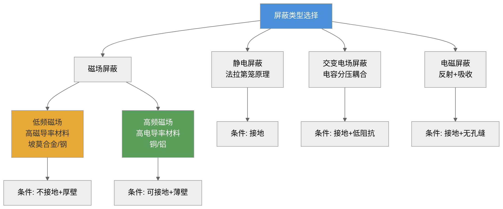
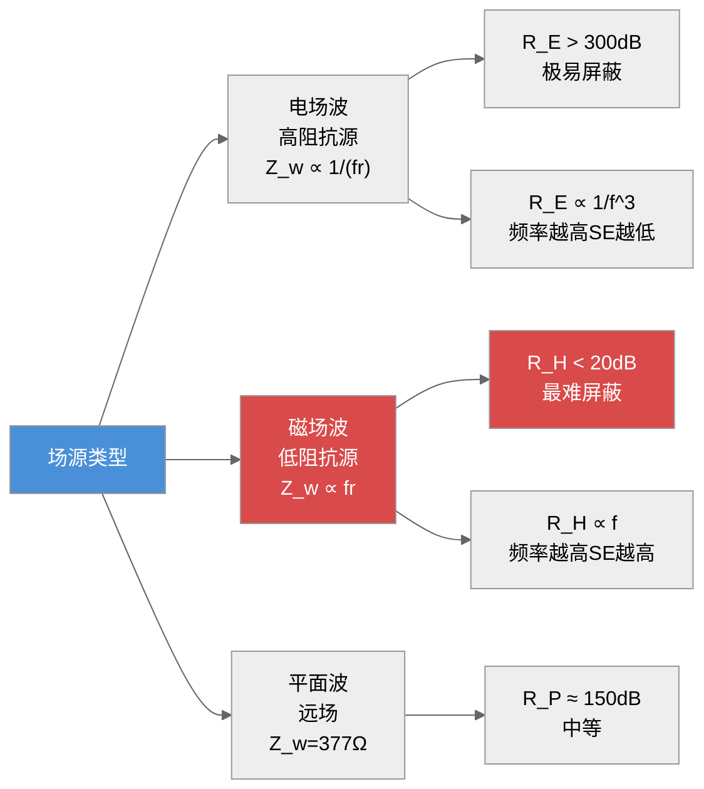
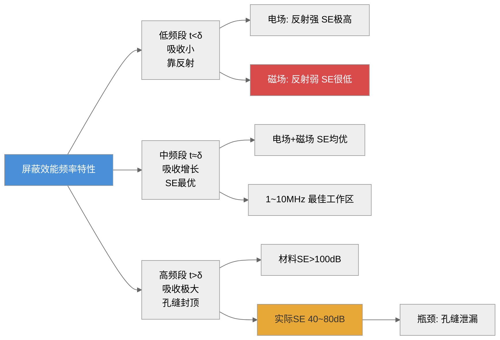
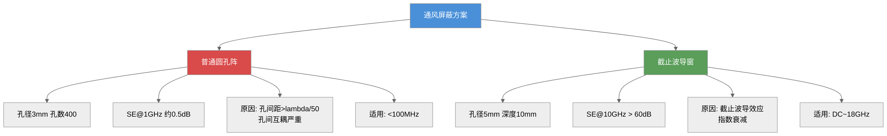
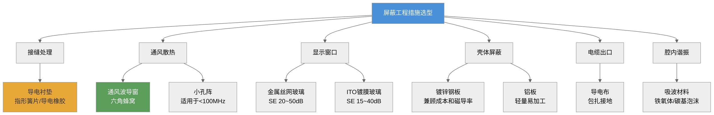

# 第八章 屏蔽技术

## 内容提要

屏蔽是最古老也是最有效的电磁干扰抑制手段之一，其历史可以追溯到1836年法拉第完成的著名实验——用一个接地的金属笼体将外部电场完全隔绝，笼内不受任何外部电场影响。这一发现奠定了所有电场屏蔽技术的理论基础。

在电磁兼容工程中，屏蔽、滤波、接地被公认为三种最基本的EMC控制技术。屏蔽的核心思想十分直观——用导电或导磁的壳体将骚扰源或敏感设备包围起来，阻断电磁能量在内外空间之间的传输。然而，实际屏蔽体的设计远非"找个金属盒子装起来"那么简单：它不仅涉及电磁波在导体界面的反射与吸收、在介质中的传播与衰减，还涉及孔缝泄漏、结构谐振、材料选择、电化学兼容等多个复杂问题。一个看似简单的屏蔽盒，其设计质量可能决定着整个系统的EMC成败。

本章从电磁场理论出发，系统介绍屏蔽技术的物理原理和工程实现。第8.1节从屏蔽的五种基本类型入手，分析静电屏蔽、交变电场屏蔽、低频磁场屏蔽、高频磁场屏蔽和电磁屏蔽各自的物理机制；第8.2节引入屏蔽效能的定量定义和传输线类比法，给出吸收损耗、反射损耗和多次反射修正的完整数学描述；第8.3节讨论理想屏蔽体的屏蔽效能及其频率特性；第8.4节是本章的重点和难点——实际非理想屏蔽体中孔缝泄漏的分析与控制；第8.5节则系统介绍工程中常用的七类屏蔽材料和结构，为读者提供可直接用于工程设计的实用指南。

通过本章学习，读者应达成以下学习目标：

1. 理解静电屏蔽、交变电场屏蔽、低频磁场屏蔽和电磁屏蔽的物理原理和区别，能正确选择屏蔽材料和接地方式
2. 掌握屏蔽效能的定义及其计算方法，能用传输线法计算任意厚度金属板的SE
3. 理解波阻抗的概念及其随源类型和距离的变化规律，能区分近场和远场屏蔽
4. 掌握非理想屏蔽体中孔缝泄漏的分析方法，能定量估算缝隙、孔阵、截止波导管的SE
5. 了解常见的电磁屏蔽工程措施及其选用原则，能在工程设计中进行屏蔽方案选型

## 8.1 屏蔽的基本原理

屏蔽的物理本质可以用一句话概括：**用一个导电或导磁的壳体阻断电磁能量在内外空间之间的传输**。根据所要屏蔽的场的性质不同，屏蔽机制可分为五种根本不同的类型。理解这五种机制之间的差异，是正确设计屏蔽体的前提。

### 8.1.0 电磁拓扑图概念

> **柯金良（《电磁兼容概论》第4.1.2节）：** 确保用电设备满足电磁兼容要求的主要手段是在用电设备和骚扰源之间建立一个**电磁屏障（EM Barrier）**。电磁屏障技术包括屏蔽、滤波、冲击抑制等。用屏蔽体将被保护区域包围起来，同时在所有穿透屏蔽的位置安装合适的保护装置，是敏感设备保护的基本方法。
>
> 电磁拓扑图是用来描述屏蔽体空间层级关系的概念工具。如果一个系统进行了合适的屏蔽表面布置、所有穿透部位都做了恰当处理，就可以说这个系统已按照**"电磁拓扑方式"**进行了设计。
>
> ```mermaid
> %%{init: {"flowchart": {"useMaxWidth": false}, "theme": "neutral"}}%%
> graph TB
>     subgraph 电磁拓扑层级
>     V0["区域V₀<br>外部电磁环境"]
>     S1["屏蔽层S₁<br>（机箱壳层）"]
>     S2["屏蔽层S₂<br>（内部子单元屏蔽）"]
>     S3["屏蔽层S₃<br>（电路级屏蔽）"]
>     end
>     V0 -->|"电磁穿透点<br>（孔缝/天线/电缆）"| S1
>     S1 -->|"内部场叠加"| S2
>     S2 -->|"二次屏蔽"| S3
>     style V0 fill:#d94a4a,color:#fff
>     style S1 fill:#4a90d9,color:#fff
>     style S2 fill:#5a9e5a,color:#fff
>     style S3 fill:#e8a838,color:#333
> ```
>
> **拓扑屏蔽设计的核心思想：** 每一层屏蔽表面都存在使电磁能量进入其内部的"穿透点"（缝隙、孔洞、穿透的导线等）。对于设计完好的系统，电磁能量穿透点较少。可以通过解决这些进入点的问题来理解系统的总体响应。例如，飞机的通信天线提供了外界雷电等电磁干扰直接进入内部的通道——可以用天线耦合模型分析场对天线的耦合作用，用传输线模型处理感应能量在内部电子系统中的传播。屏蔽拓扑的概念可将一个大的系统分解为多个可以单独分析的子系统，但需注意：EMC响应等级的频谱与系统的尺寸成反比——将系统尺寸缩小100倍，将导致频谱响应的范围增大100倍。

### 8.1.1 静电屏蔽

静电屏蔽（Electrostatic Shielding）是最简单也最直观的屏蔽形式，其理论基础源于法拉第笼原理。

**物理机制**：一块任意形状的金属导体置于静电场中时，导体内部的自由电子在电场力作用下迅速重新分布，直至导体内部电场处处为零。这一过程的时间尺度约为$10^{-16}$秒——几乎是瞬时的。金属导体的这种"内部电场为零"的特性，意味着一个封闭的金属壳体可以完全隔绝外部静电场对内部空间的影响。

从数学角度分析，静电场中导体的表面是一个等势面。根据高斯定理，任意闭合曲面的电通量等于该曲面所包围的净电荷除以$\varepsilon_0$。对于一个封闭的、不包含任何净电荷的金属腔体，腔体内表面上的净电荷为零，因此腔体内部的电场处处为零。这就是法拉第笼屏蔽静电场的基本数学证明。

静电屏蔽的**充分必要条件**只有两个：
1. **屏蔽体必须是导电体**——金属、导电涂层或导电塑料均可
2. **屏蔽体必须接地**——如果屏蔽体不接地，感应电荷无处泄放，屏蔽体本身将带电。当外部电场消失后，屏蔽体上的残留电荷会在内部空间产生电场，反而引入干扰。接地的另一作用是：当地电位波动时，屏蔽体与大地保持等电位，屏蔽效果稳定

**工程要点与细微之处**：
- 静电屏蔽体上的**孔洞**对屏蔽效果的影响很小——因为静电场中，电场线只能终止于导体表面上的电荷。只要孔洞的尺寸远小于屏蔽体到被保护区域的距离（通常<1/10），孔洞周围的电场几乎不会"绕射"进入内部空间。这是静电屏蔽与电磁屏蔽（高频）的本质区别之一，后者中的孔缝会导致严重的泄漏。
- **屏蔽体材料的厚度没有要求**——静电屏蔽不需要特定的厚度，甚至一层极薄的金属箔（如铝箔的厚度约10~20 μm）也能实现完美的静电屏蔽。这是静电屏蔽不需要考虑集肤深度的明显标志。
- 不封闭的屏蔽体（如一个金属板而非金属盒）只能阻挡电场线从特定方向进入。在实际工程中，单面板阻隔常被称为"静电隔离"，而非"静电屏蔽"。
- **法拉第笼效应在低频磁场下不成立**——这是初学者最容易混淆的概念。法拉第笼只对静电场和交变电场有效，对静态磁场和低频磁场无效（详见8.1.3节）。

**例8-1**：一个接地的铝制屏蔽盒，盒壁厚度为0.5 mm，用于保护盒内的精密模拟电路。外部存在50 kV/m的静电场（由高压输电线路产生）。问屏蔽盒能否有效屏蔽此静电场？如果屏蔽盒不接地，会发生什么？

解：
（a）对于静电场，铝制屏蔽盒即使壁厚仅0.5 mm，也能完全屏蔽外部电场（壁厚对静电屏蔽无关紧要）。前提是屏蔽盒**封闭**且**接地**。
（b）如果屏蔽盒不接地：外部电场会在屏蔽盒表面感应出电荷。当外部电场消失后（如输电线路断电），这些残留电荷会在盒内产生一个非零电场，可能耦合到精密电路中，引起干扰。此外，不接地的屏蔽盒本身对地电位是不确定的——如果人在附近摩擦化纤衣物后触摸盒体，静放电可能直接损坏盒内电路。

### 8.1.2 交变电场屏蔽

交变电场屏蔽与静电屏蔽在原理上是连续的——两者都依赖于接地导体的电荷泄放能力。但在交变场中，需要从电容耦合的角度来分析，因为交变电场是通过**分布电容**在导体之间传递能量的。

**物理机制**：考虑两个导体A（骚扰源）和B（敏感设备），它们之间存在分布电容$C_{AB}$。当A上存在交变电压$V_A$时，通过$C_{AB}$在B上感应出的电压为：

$$
V_B = V_A \frac{C_{AB}}{C_{AB} + C_{BG}}
\tag{8-1}
$$

其中$C_{BG}$是B对地的分布电容。要降低$V_B$，有两个途径：（1）减小$C_{AB}$（拉开距离或插入屏蔽板）；（2）增大$C_{BG}$（更好的接地）。

插入一个接地的金属屏蔽板S在A和B之间后，原有的单一耦合电容$C_{AB}$被分解为$C_{AS}$和$C_{SB}$两个串联电容。由于屏蔽板S是接地的，$C_{AS}$中的电流直接流入大地，不再耦合到B。这就是交变电场屏蔽的物理本质——**用接地导体提供一个更低的阻抗路径，将骚扰电流旁路到地，而不是让它进入敏感电路**。

**工程要点**：
- 屏蔽体**必须接地**，否则不仅无效，还会因为寄生电容的增大（屏蔽板增加了A与S、S与B之间的对地面积）而使耦合变得更严重。
- 用于电场屏蔽的屏蔽体**不一定要封闭**——一个单面板、甚至一根接地的金属条，只要放置在合适的位置，就能显著降低电容耦合。这与静电屏蔽需要封闭壳体的要求不同。
- 屏蔽体与骚扰源之间的电容$C_{AS}$决定了旁路效果的好坏——$C_{AS}$越大（屏蔽板越靠近骚扰源），旁路效果越好。因此，**屏蔽体应尽量靠近骚扰源或敏感设备**。

**例8-2**：一个开关电源（12 V，100 kHz方波）通过一个0.5 pF的杂散电容耦合到旁边的传感器线缆上。在两者之间插入一块接地的铜板后，$C_{AS}$=5 pF，$C_{SB}$=0.1 pF。求耦合电压的衰减量。

解：插入屏蔽前，$V_B = V_A \frac{C_{AB}}{C_{AB} + C_{BG}}$。
插入屏蔽后，屏蔽板将CAB一分为二。由于屏蔽板接地，A到屏蔽板的电流直接短路入地，B上感应的电压变为：
$V_B' = V_A \frac{C_{SB}}{C_{SB} + C_{BG}} \cdot \frac{C_{AS}}{C_{AS} + C_{SG}}$（实际效果近似为$V_B' \approx V_A \frac{C_{SB}}{C_{SB} + C_{BG}}$，因为$C_{AS}$很大时A的电压几乎全部降在$C_{AS}$上被旁路）。

更直接的估算：插入屏蔽板后，耦合电容从0.5 pF降至0.1 pF。代入电容分压公式可计算出耦合电压降低了约5倍（约14 dB）。

### 8.1.3 低频磁场屏蔽

低频磁场屏蔽是所有屏蔽类型中最具挑战性的一种。原因是：磁场不像电场那样可以被导体表面电荷"终止"或"短路"——磁场线是闭合的，它们可以穿过大多数非铁磁材料，如同穿过空气一样。

**物理机制**：低频磁场屏蔽依赖于铁磁材料的高磁导率µ$_r$提供一条低磁阻的旁路路径。磁场线总是倾向于通过磁阻最低的路径闭合。当磁力线遇到一个高µ$_r$的屏蔽体时，大部分磁通被"引导"进入屏蔽体中，只有极少部分穿过屏蔽体到达内部空间。

这可以用磁路分析方法来定量理解：屏蔽体相当于一个与空气路径并联的磁阻。屏蔽体的磁阻$R_m = l / (\mu_0 \mu_r A)$远小于空气的磁阻，因此大部分磁通进入屏蔽体中。

**低频磁场屏蔽的三大关键**：
1. **材料必须具有高µ$_r$**——常用的低频磁场屏蔽材料包括坡莫合金（µ$_r$可达$10^5$）、硅钢（µ$_r\approx 3000\sim10000$）和纯铁（µ$_r\approx 5000$）。铜和铝因为µ$_r\approx 1$，对低频磁场几乎无效。
2. **屏蔽体厚度需足够**——与静电屏蔽不同，低频磁场屏蔽需要一定的厚度来确保磁通被"引导"进屏蔽体。经验规则：屏蔽体厚度应至少达到磁路中最小截面尺寸的1/100~1/50。
3. **屏蔽体不接地也可以工作**——低频磁场屏蔽不需要接地，因为它靠的是磁路旁路而非电荷泄放。但在实际工程中，磁场屏蔽体通常还是接地的，以同时实现电场屏蔽。

**磁屏蔽的饱和问题**：这是低频磁场屏蔽中最重要的工程陷阱。当外部磁场过强时，铁磁材料会进入饱和状态，其相对磁导率µ$_r$急剧下降（可以从$10^4$下降到$1\sim10$），屏蔽效果随之消失。临界磁通密度因材料而异：坡莫合金约0.7~0.8 T，硅钢约1.5~1.8 T，纯铁约2.1 T。在强磁场环境中，应选用饱和磁通密度高的材料，或采用多层屏蔽以避免饱和。

**工程要点**：
- 屏蔽体的**接缝必须精心处理**——接缝处的气隙会引入高磁阻，严重降低屏蔽效果。接缝应尽量少、尽量短，并采用搭接而非对接。
- 磁屏蔽效果随频率上升而**改善**（因为集肤效应使磁通更难穿透屏蔽体——尽管磁屏蔽的原理是磁路旁路而非集肤效应，但集肤效应的存在总是额外增加了屏蔽效果）。
- 在极低频（50/60 Hz工频）下，即使是高µ$_r$材料，也需要相当的厚度才能获得足够的SE。对于工频磁场，通常要求SE ≥ 20 dB，这往往需要至少1~2 mm厚的硅钢或坡莫合金板。

**例8-3**：一个坡莫合金屏蔽盒（$\\mu_r = 80000$），壁厚1 mm，用于屏蔽50 Hz工频磁场。若外部磁场强度为100 A/m，屏蔽盒尺寸为20×20×10 cm。估算屏蔽效能。

解：对于50 Hz，需要利用低频磁场屏蔽的磁路模型。屏蔽体的磁阻$R_m = l/(\\mu_0 \\mu_r A)$，内部空气的磁阻$R_{air} = l/(\\mu_0 A)$，磁通分压比近似为$R_m / (R_m + R_{air})$，对应的磁场衰减为$R_{air}/R_m = \\mu_r \\cdot (t/l_{eff})$。代入数值，可估算出SE约在25 dB量级。这正是工频磁场屏蔽为什么困难的原因——即使使用高µ$_r$材料，也需要足够的厚度。

**低频磁场屏蔽的精确磁路模型**：

为了更精确地定量估算低频磁场屏蔽效能，需要建立完整的磁路模型。考虑一个矩形屏蔽盒，壁厚为$t$，外部磁场强度为$H_0$，屏蔽盒内部磁场强度为$H_i$。

根据磁通连续性原理，外部磁通$\Phi_0$被分为两路：一路通过屏蔽体壁（$\Phi_s$），一路进入屏蔽盒内部空间（$\Phi_i$）。磁路中的磁阻分别为：

- 屏蔽体壁的磁阻：$R_s = \frac{l_s}{\mu_0 \mu_r A_s}$，其中$l_s$为磁路在屏蔽体内的路径长度，$A_s$为屏蔽体壁的横截面积（壁厚$\times$垂直于磁通方向的壁宽度）
- 内部空气空间的磁阻：$R_i = \frac{l_i}{\mu_0 A_i}$，其中$l_i$为内部空间的等效路径长度，$A_i$为内部空间的等效截面积

磁通分压关系为：

$$
\frac{\Phi_i}{\Phi_0} = \frac{R_s}{R_s + R_i}
\tag{8-2}
$$

由此可得屏蔽体内部的磁场强度：

$$
H_i = H_0 \cdot \frac{\Phi_i}{\Phi_0} \cdot \frac{A_0}{A_i} = H_0 \cdot \frac{R_s}{R_s + R_i} \cdot \frac{A_0}{A_i}
\tag{8-3}
$$

其中$A_0$为外部磁通穿过的等效面积。对于长方体屏蔽盒（尺寸$a \times b \times c$，壁厚$t$），代入几何参数后可得到简化公式：

$$
\text{SE}_H \approx 20\log\left(1 + \frac{\mu_r t}{a}\right) \quad \text{dB}
\tag{8-4}
$$

其中$a$为屏蔽盒在磁场方向上的最小线性尺寸。该公式在$t \ll a$的条件下成立。

从这个公式可以看出：
1. **SE与$\mu_r$成正比**，但并非线性关系——当$\mu_r$很大时，SE趋于$20\log(\mu_r t/a)$
2. **SE与$t/a$成正比**，这意味着减小屏蔽盒尺寸（缩小$a$）比增加壁厚更有效
3. **对于大型屏蔽体**（$a$很大），即使使用高$\mu_r$材料也难以获得高SE——这正是低频磁场屏蔽的根本困难

**磁饱和的定量分析**：

磁饱和是低频磁场屏蔽设计中必须量化的关键参数。当外部磁场强度$H_0$产生的磁通密度$B = \mu_0 \mu_r H_0$超过材料的饱和磁通密度$B_s$时，$\mu_r$急剧下降。

磁饱和开始发生的临界外部磁场强度为：

$$
H_{\text{sat}} = \frac{B_s}{\mu_0 \mu_r} \cdot \frac{t}{a}
\tag{8-5}
$$

对于例8-3中的坡莫合金屏蔽盒（$\mu_r = 80000$，$B_s = 0.75$ T，$t=1$ mm，$a=200$ mm）：

$$
H_{\text{sat}} = \frac{0.75}{4\pi\times10^{-7} \times 80000} \cdot \frac{1}{200} \approx 37.3 \text{ A/m}
\tag{8-6}
$$

当外部磁场$H_0 = 100$ A/m（例8-3给出的值）时，$H_0 > H_{\text{sat}}$，屏蔽体处于饱和状态！饱和后$\mu_r$降至约1~10，屏蔽效果从约25 dB骤降至几乎为零。

**工程警示**：例8-3中的计算忽略了饱和效应，给出的25 dB SE是理想值。实际工程中，在100 A/m的外部磁场下，1 mm厚的坡莫合金屏蔽盒将发生饱和，实际SE可能只有0~5 dB。这就是为什么在强磁场环境中必须使用饱和磁通密度更高的材料（如硅钢$B_s=1.5$ T或纯铁$B_s=2.1$ T）或采用多层屏蔽结构的原因。

**多层磁屏蔽避免饱和的设计**：外层使用高$B_s$材料（硅钢/纯铁）承受大部分磁通，内层使用高$\mu_r$材料（坡莫合金）提供剩余的屏蔽效果。例如，0.5 mm硅钢外层 + 1 mm坡莫合金内层 + 10 mm空气间隔的结构，可在100 A/m的外部磁场下提供60 dB以上的低频磁场SE。

### 8.1.4 高频磁场屏蔽

当频率升高至MHz量级时，磁场屏蔽的机制发生根本性转变——铁磁材料的高µ$_r$不再是必需的，甚至不再是主导因素。高频磁场屏蔽的核心机制变为**感应涡流的反磁场**。

**物理机制**：高频磁场入射到导电材料表面时，会在材料中感应出涡流。根据楞次定律，该涡流产生的磁场方向与入射磁场相反。这个反向磁场抵消了一部分入射磁场，从而阻止磁场穿透屏蔽体。涡流越大、频率越高，抵消效果越强。

这种机制与低频磁场屏蔽的磁路旁路机制的本质区别在于：
- 低频：靠µ$_r$ "吸引"磁通进入屏蔽体
- 高频：靠涡流"排斥"磁通离开屏蔽体

这就是为什么在高频段，铜和铝（高电导率σ_r）比钢（高磁导率µ_r）更有效——涡流的大小正比于电导率σ，而不是磁导率µ。

**关键工程的转变频率**：两种机制在哪个频率上发生转换？当集肤深度δ与屏蔽体厚度t可比时（$t/\delta \approx 1$），涡流屏蔽开始占主导。对于1 mm厚的铜板，这个频率约为4 kHz左右；对于1 mm厚的钢板（µ_r=200），这个频率更低，约20 Hz左右。也就是说，在大多数工程关注的100 kHz以上的频率范围内，所有金属的屏蔽机制都已经是以涡流为主了。

**例8-4**：一个铜制屏蔽盒（σ_r=1，µ_r=1），壁厚0.5 mm，用于屏蔽10 MHz的磁场。外部磁场强度为1 A/m。估算屏蔽效能。

解：在10 MHz下，铜的集肤深度$\delta = 66.1 / \sqrt{f} = 66.1 / \sqrt{10^7} \approx 0.021$ mm。$t/\delta = 0.5/0.021 \approx 23.8$，远大于1。吸收损耗$A = 0.131 t\sqrt{f\mu_r\sigma_r} = 0.131 \times 0.5 \times \sqrt{10^7 \times 1 \times 1} = 0.131 \times 0.5 \times 3162.3 \approx 207$ dB。反射损耗$R_H \approx 14.6 + 10\log(f r^2 \sigma_r / \mu_r)$，如果距离源r=1 m，则$R_H \approx 14.6 + 10\log(10^7 \times 1^2 \times 1 / 1) = 14.6 + 70 = 84.6$ dB。总SE ≈ 207 + 84.6 ≈ 291 dB。这是一个非常高的值——高频磁场实际上比电场更容易屏蔽（吸收损耗巨大）。

### 8.1.5 电磁屏蔽

严格意义上的电磁屏蔽（Electromagnetic Shielding）针对的是平面波——即同时具有电场和磁场分量、且E/H=377 Ω的远场电磁波。在远场条件下，电场屏蔽和磁场屏蔽统一为同一个机制——入射平面波在屏蔽体界面上的反射和屏蔽体内的吸收衰减。

从物理本质上讲，电磁屏蔽是前述三种机制的综合：
- **反射损耗**：由波阻抗不匹配引起（电场屏蔽的原理延伸）
- **吸收损耗**：由涡流和集肤效应引起（高频磁场屏蔽的原理延伸）
- **多次反射修正**：当屏蔽体较薄（$t<\delta$）时，需要考虑屏蔽体内反复反射的叠加效应

**电磁屏蔽与电场/磁场屏蔽的关系**：

| 性质 | 电场屏蔽 | 低频磁场屏蔽 | 电磁屏蔽 |
|------|---------|------------|---------|
| 主要机制 | 电荷泄放/电容旁路 | 磁路旁路 | 反射+吸收 |
| 是否需要接地 | 必须接地 | 不需要 | 通常接地 |
| 关键材料参数 | σ_r（电导率） | µ_r（磁导率） | σ_r和µ_r |
| 是否需要封闭 | 不需要（单面板即可） | 需要封闭壳体 | 需要封闭壳体 |
| 孔缝影响 | 很小 | 较大 | 极大（高频） |
| 频率范围 | DC~MHz | DC~100 kHz | 100 kHz以上 |

**重要概念澄清**：实际上，"电磁屏蔽"并不总是优于"电场屏蔽"或"磁场屏蔽"——它们分别针对不同的场区和频率范围。一个精心设计的电磁屏蔽体自然能够同时屏蔽电场和磁场，但反过来不一定成立。在工程实践中，我们通常说"做电磁屏蔽"时，指的是针对整个频谱的电磁波进行屏蔽，而非仅针对某一分量。

**电磁屏蔽的综合机制详解**：

电磁屏蔽需要同时应对电场分量和磁场分量的屏蔽需求。在实际工程中，一个完整电磁屏蔽体的总SE由以下贡献组成：

1. **远场平面波的SE**（式8-23）：主要由反射损耗贡献（$R \approx 108\sim168$ dB）
2. **近场电场的SE**（$R_E$公式）：电场屏蔽由极高的反射损耗主导（$R_E$可达300 dB以上），因此近场电场屏蔽几乎总是充足的
3. **近场磁场的SE**（$R_H$公式+A）：磁场屏蔽是最薄弱的环节，必须依靠吸收损耗增强（使用高$\mu_r$材料）

**总SE的合成**：一个电磁屏蔽体的总SE并非简单的三项之和，而是由场源类型决定的最薄弱环节。工程中常用的判断方法是比较$\lambda/2\pi$与源到屏蔽体的距离$r$：

- $r > \lambda/2\pi$：远场，使用平面波公式（$R_P$）
- $r < \lambda/2\pi$：近场，根据源类型选择$R_E$（电场源）或$R_H$（磁场源）

**近场-远场过渡区的处理**：当$r \approx \lambda/2\pi$时，波阻抗从近场值连续过渡到远场的377 Ω。对于电场源，$Z_w$随$r$增大从高值（$>377\Omega$）下降到377 Ω；对于磁场源，$Z_w$随$r$增大从低值（$<377\Omega$）上升到377 Ω。

在过渡区（$0.1\lambda < r < \lambda$），精确计算需要使用完整波阻抗公式：

$$
Z_{w,E} = 377\sqrt{1 + \left(\frac{\lambda}{2\pi r}\right)^2} \quad \text{(电场源)}
\tag{8-7}
$$

$$
Z_{w,H} = 377/\sqrt{1 + \left(\frac{\lambda}{2\pi r}\right)^2} \quad \text{(磁场源)}
\tag{8-8}
$$

这两个公式统一了近场和远场的波阻抗计算，适用于所有$r$值。

**例8-5（扩展）**：宽带屏蔽方案的成本与性能权衡

某通信设备需要满足FCC Part 15 Class B辐射发射限值（30 MHz~6 GHz），机箱尺寸为400×300×100 mm。设计工程师需选择屏蔽方案。比较以下三种方案的性能和成本：

**方案A**：1.5 mm镀锌钢板机箱
- 材料成本：低
- 加工工艺：冲压+焊接，成熟
- 材料SE（忽略孔缝）：1 MHz时A=10.3 dB, R=77.3 dB, 总SE=87.6 dB；1 GHz时A=327 dB, R=47.3 dB, 总SE=374 dB
- 孔缝限制因素：门缝、通风孔、接口开孔处的SE通常限制在30~50 dB
- 实际SE：30~50 dB（受孔缝限制）
- 适用性：已满足FCC Class B要求（通常30~40 dB即可）
- **结论**：简单镀锌钢板机箱即可满足基本EMC要求

**方案B**：1 mm铝合金机箱+铜内衬
- 材料成本：中高
- 加工工艺：压铸+导电氧化
- 材料SE：1 MHz时A=2.0 dB, R=105.8 dB, 总SE=107.8 dB；1 GHz时A=64.2 dB, R=75.8 dB, 总SE=140 dB
- 孔缝处理：使用导电衬垫+波导窗，实际SE可达60~80 dB
- 适用性：满足FCC Class B + 工业EMC要求
- **结论**：适用于SE要求40~60 dB的工业设备

**方案C**：2 mm铜+1 mm钢双层屏蔽
- 材料成本：高
- 加工工艺：双层结构，复杂
- 材料SE：1 MHz总SE≈180 dB（估算）
- 孔缝处理：需严格密封（双层门+双层波导窗），实际SE可达80~100 dB
- 适用性：满足军用MIL-STD-461要求
- **结论**：仅适用于特殊高要求场合

**方案选择矩阵**：

| 需求场景 | 推荐方案 | 典型成本 | 实际SE |
|---------|---------|:-------:|:------:|
| 消费电子（FCC Class B） | 方案A：镀锌钢 | 低 | 30~50 dB |
| 工业设备（EN 55011） | 方案B：铝+导电衬垫 | 中 | 40~60 dB |
| 医疗设备（MIL-STD-461） | 方案B/C：铝+波导窗 | 中高 | 60~80 dB |
| 军用/航空 | 方案C：双层屏蔽 | 高 | 80~100 dB |
| 核磁共振屏蔽室 | 定制铜+坡莫合金 | 极高 | 100~120 dB |

**重要工程提醒**：在确定屏蔽方案时，应优先考虑孔缝处理（导电衬垫、波导窗、馈通滤波器）的质量，而非单纯追求材料SE的提升。**孔缝设计决定了实际SE的天花板**。

**例8-5**：某电子设备需要满足军标MIL-STD-461F的RE102辐射发射限值（10 kHz~18 GHz）。屏蔽工程师在考虑设计方案时，应该采用哪种屏蔽原理？

解：这是一个宽带屏蔽问题。10 kHz以下的部分可以考虑磁场屏蔽；10 kHz~1 MHz部分需要考虑电场屏蔽（近场）；1 MHz以上的部分进入电磁屏蔽（远场）范畴。实际的屏蔽方案通常是：采用导电性和导磁性兼顾的金属壳体（如钢板镀镍或锌），保证全频段的屏蔽效果。对于特别苛刻的低频磁场要求，可能需要额外的坡莫合金内衬。



*图8-1：屏蔽类型选择决策树——根据场类型和频率选择材料与接地方式*

## 8.2 屏蔽效能的定量描述

### 8.2.1 屏蔽效能的定义

屏蔽效能（Shielding Effectiveness, SE）是定量评价屏蔽体性能的核心参数，定义为**屏蔽体放置前后，空间同一点上场强之比的对数**：

$$
\text{SE} = 20\log\frac{E_0}{E_1} \quad \text{(电场屏蔽效能)}
\tag{8-9}
$$

类似地，由磁场之比可得磁场屏蔽效能：

$$
\text{SE} = 20\log\frac{H_0}{H_1} \quad \text{(磁场屏蔽效能)}
\tag{8-10}
$$

同理，由功率之比可得功率屏蔽效能：

$$
\text{SE} = 10\log\frac{P_0}{P_1} \quad \text{(功率屏蔽效能)}
\tag{8-11}
$$

其中$E_0$、$H_0$、$P_0$为无屏蔽体时该点的场强/功率密度，$E_1$、$H_1$、$P_1$为有屏蔽体时的对应值。SE的单位为分贝（dB）。

**关于单位的说明**：dB是对数单位，这使得SE的计算具有累加性——总屏蔽效能等于各损耗项之和（如$SE = A + R + B$），这大大简化了工程分析。SE值越大，屏蔽效果越好。一般工程要求：
- 民用设备（如FCC Class B）：SE ≥ 30 dB
- 工业/医疗设备：SE ≥ 40~60 dB
- 军用设备（如MIL-STD-461）：SE ≥ 60~80 dB
- 特殊场合（如核磁共振室）：SE ≥ 100 dB

**重要提醒**：SE是一个频率相关的量，通常需要在关注频率范围内逐点计算或测量。一个屏蔽体可能在某些频率上性能极好，在另一些频率上却存在明显的泄漏。因此，SE曲线比单一SE数值更有工程价值。

### 8.2.2 传输线类比法（Schellkunoff公式）

屏蔽效能的计算最经典的方法是Schellkunoff传输线类比法。其核心思想是：电磁波从阻抗为$Z_w$的介质（空气或自由空间）入射到阻抗为$Z_m$的金属界面时，其行为完全类比于传输线中信号的反射和传输。

**金属的本征阻抗**：

$$
Z_m = \sqrt{\frac{j\omega\mu}{\sigma + j\omega\varepsilon}} 
\approx \sqrt{\frac{j\omega\mu}{\sigma}} = (1+j)\sqrt{\frac{\pi f\mu}{\sigma}} \quad \text{(良导体近似)}
\tag{8-12}
$$

在良导体条件下，$Z_m$是一个拥有45°相角的复数，其实部和虚部相等，都等于金属的**表面阻抗**或**固有阻抗**。

几种常用金属在1 MHz下的本征阻抗：
- 铜（$\sigma=5.8\times10^7$ S/m，$\mu_r=1$）：$Z_m \approx 3.7\times10^{-4}\angle45°$ Ω
- 铝（$\sigma=3.5\times10^7$ S/m，$\mu_r=1$）：$Z_m \approx 4.8\times10^{-4}\angle45°$ Ω
- 钢（$\sigma=1.0\times10^7$ S/m，$\mu_r=200$）：$Z_m \approx 8.9\times10^{-3}\angle45°$ Ω

**波阻抗$Z_w$**：取决于电磁波的源类型和距离。对于远场平面波，$Z_w = Z_0 = 377$ Ω。对于近场区，根据源是电场源（高阻抗源）还是磁场源（低阻抗源），$Z_w$的计算公式不同。

**电场源（电偶极子，高阻抗源）**：

$$
Z_w = E/H = \frac{1}{2\pi f\varepsilon_0 r} \cdot \frac{1}{\sqrt{1+(1/2\pi f\varepsilon_0 Z_0 r)^2}} \approx \frac{1}{2\pi f\varepsilon_0 r} \quad \text{(r << λ)}
\tag{8-13}
$$

工程近似：$Z_w \approx 377 / (r/f) $ 的粗略形式并不准确，更精确的表达式为：

$$
Z_{E,\text{近场}} \approx 377 \cdot \frac{\lambda}{2\pi r}
\tag{8-14}
$$

**磁场源（磁偶极子，低阻抗源）**：

$$
Z_w = E/H = 2\pi f\mu_0 r \quad \text{(r << λ)}
\tag{8-15}
$$

将此式改写为以波长为自变量的形式得：

$$
Z_{H,\text{近场}} \approx 377 \cdot \frac{2\pi r}{\lambda}
\tag{8-16}
$$

**传输线类比的核心原理**：将空气介质视为特性阻抗$Z_w$的传输线，将金属屏蔽体视为特性阻抗$Z_m$的传输线。

**传输线类比的数学基础**：

Schellkunoff传输线类比法的核心是将电磁波在介质-金属界面上的行为映射为传输线中的电压-电流波行为。考虑一个平面电磁波从介质（区域1，$Z_w$）垂直入射到金属（区域2，$Z_m$）界面上：

**界面反射系数** $\Gamma$：

$$
\Gamma = \frac{Z_m - Z_w}{Z_m + Z_w}
\tag{8-17}
$$

**界面传输系数** $T$：

$$
T = \frac{2Z_m}{Z_m + Z_w}
\tag{8-18}
$$

当$Z_w \gg Z_m$（空气→金属入射，对电场源和平面波都成立）时，$\Gamma \approx -1$（接近全反射，相位反转），$T \approx 2Z_m/Z_w \ll 1$（传输系数很小）。这正是反射损耗的物理来源——大部分能量被反射回空气侧。

当电磁波从金属穿出到另一侧的空气时（金属→空气界面），反射系数变为：

$$
\Gamma' = \frac{Z_w - Z_m}{Z_w + Z_m} = -\Gamma
\tag{8-19}
$$

即内壁界面的反射系数与外壁界面大小相等、符号相反。

**穿过金属板的场强比**：

考虑厚度为$t$的金属板，电磁波从左侧空气入射，经过以下级联过程到达右侧空气：

1. 左侧界面：传输系数$T_1 = 2Z_m/(Z_w + Z_m)$
2. 金属内部传播：衰减因子$e^{-\gamma t} = e^{-t/\delta}e^{-jt/\delta}$（其中$\gamma = (1+j)/\delta$）
3. 右侧界面：传输系数$T_2 = 2Z_w/(Z_w + Z_m)$

不考虑多次反射时，总传输系数为：

$$
T_{\text{total}} = T_1 \cdot e^{-\gamma t} \cdot T_2 = \frac{4Z_w Z_m}{(Z_w + Z_m)^2} e^{-\gamma t}
\tag{8-20}
$$

**多次反射的叠加**：

当金属板厚度$t$较小时（$t < \delta$），在金属内部两个界面之间发生的多次反射不可忽略。考虑所有反射路径的叠加，总传输系数变为：

$$
T_{\text{total}} = T_1 T_2 e^{-\gamma t} \left[1 + (\Gamma')^2 e^{-2\gamma t} + (\Gamma')^4 e^{-4\gamma t} + \cdots\right] = \frac{T_1 T_2 e^{-\gamma t}}{1 - (\Gamma')^2 e^{-2\gamma t}}
\tag{8-21}
$$

由此可得屏蔽效能：

$$
\text{SE} = 20\log\left|\frac{1}{T_{\text{total}}}\right| = 20\log\left|e^{\gamma t}\right| + 20\log\left|\frac{(Z_w + Z_m)^2}{4Z_w Z_m}\right| + 20\log\left|1 - \left(\frac{Z_w - Z_m}{Z_w + Z_m}\right)^2 e^{-2\gamma t}\right|
\tag{8-22}
$$

上式三项分别对应：

- 第一项 = 吸收损耗 $A = 20\log|e^{\gamma t}| = 20\log(e^{t/\delta}) = 8.686 t/\delta = 0.131 t\sqrt{f\mu_r\sigma_r}$ dB
- 第二项 = 反射损耗 $R = 20\log|(Z_w + Z_m)^2/(4Z_w Z_m)|$ dB
- 第三项 = 多次反射修正 $B = 20\log|1 - ((Z_w - Z_m)/(Z_w + Z_m))^2 e^{-2\gamma t}|$ dB

这就是Schellkunoff公式的完整推导。注意在良导体近似下（$Z_m \ll Z_w$），反射损耗简化为$R \approx 20\log|Z_w/(4Z_m)|$，这正是工程简化公式的来源。

屏蔽效能由三个部分组成：

**（1）吸收损耗 A（Absorption Loss）**：

$$
A = 20\log|e^{t/\delta}| = 20\log(e^{t/\delta}) = 8.686 \cdot \frac{t}{\delta} \quad \text{dB}
\tag{8-23}
$$

更常用的形式为：

$$
A = 0.131 t\sqrt{f\mu_r\sigma_r} \quad \text{dB}
\tag{8-24}
$$

其中$t$的单位为mm，$f$的单位为Hz，$\mu_r$和$\sigma_r$分别为相对磁导率和相对电导率（以铜为基准，铜的$\sigma_r=1$）。

**吸收损耗的物理含义**：电磁波进入金属后，由于集肤效应，场强以$e^{-t/\delta}$的规律指数衰减。吸收损耗与材料厚度直接成正比，与$\sqrt{f\mu_r\sigma_r}$成正比。因此，要增加吸收损耗，要么增加厚度，要么选用高µ$_r$或高σ$_r$的材料。一个关键量是"集肤深度"（Skin Depth, δ），定义为场强衰减到表面值的$1/e$（约36.8%）所需的深度：

$$
\delta = \sqrt{\frac{1}{\pi f\mu\sigma}} = \frac{66.1}{\sqrt{f\mu_r\sigma_r}} \quad \text{mm}
\tag{8-25}
$$

**（2）反射损耗 R（Reflection Loss）**：

反射损耗发生在电磁波从空气入射到金属表面的第一个界面，以及在金属另一侧从金属射向空气的第二个界面。Schellkunoff给出了反射损耗的通用表达式：

$$
R = 20\log\left|\frac{Z_w + Z_m}{4Z_w Z_m}\right|
\tag{8-26}
$$

对于工程计算，根据场类型分为三种情况：

**电场反射损耗**（近场，电场源，$r < \lambda/2\pi$）：

$$
R_E = 354 - 20\log\left(\frac{r}{0.03}\sqrt{\frac{f^3}{\sigma_r}}\right) \quad \text{dB}
\tag{8-27}
$$

式中$r$为源到屏蔽体的距离（m），$f$为频率（Hz）。

简化形式（$r=0.03$m条件下）：

$$
R_E \approx 322 - 10\log(\mu_r f^3 r^2 / \sigma_r) \quad \text{dB}
\tag{8-28}
$$

**磁场反射损耗**（近场，磁场源，$r < \lambda/2\pi$）：

由式(8-24)代入近场磁源波阻抗可得：

$$
R_H = 14.6 + 10\log\left(\frac{f r^2 \sigma_r}{\mu_r}\right) \quad \text{dB}
\tag{8-29}
$$

**平面波反射损耗**（远场，$r > \lambda/2\pi$）：

在远场条件下，代入$Z_w=Z_0=377\Omega$于式(8-24)得：

$$
R_P = 168 - 10\log\left(\frac{f\mu_r}{\sigma_r}\right) \quad \text{dB}
\tag{8-30}
$$

**反射损耗的物理含义**：反射损耗的大小取决于空气波阻抗$Z_w$与金属本征阻抗$Z_m$之间的失配程度。$Z_w$与$Z_m$的差异越大，反射损耗越大。电场源在近场区的$Z_w$非常大（可达数万Ω），而金属的$Z_m$非常小（mΩ量级），因此电场反射损耗极大（通常>100 dB），这也是工程中常说"电场最易屏蔽"的原因。磁场源在近场区的$Z_w$非常小，与$Z_m$的差异相对较小，因此磁场反射损耗很小——这是"低频磁场最难屏蔽"的根本原因。

**（3）多次反射修正 B（Multiple Reflection Correction）**：

当屏蔽体厚度小于集肤深度（$t < \delta$）时，电磁波在屏蔽体内部的两个界面之间会发生多次反射，修正因子$B$为：

$$
B = 20\log\left|1 - \left(\frac{Z_m - Z_w}{Z_m + Z_w}\right)^2 e^{-2t/\delta}\right| \quad \text{dB}
\tag{8-31}
$$

$B$为负值或零（即修正项总是降低总屏蔽效能或为零），取值范围通常在0~-10 dB之间。

**工程简化**：当$t \gg \delta$（通常$t > 3\delta$）时，$B \approx 0$，可以忽略。当$t < \delta$时，必须考虑B项。这正是薄屏蔽体（如导电涂层、金属箔）设计中需要特别注意的问题。

**例8-6**：一个0.5 mm厚的铜屏蔽盒用于屏蔽100 kHz的平面波。计算其吸收损耗、反射损耗和总SE。

解：
铜的σ_r=1，µ_r=1，f=100 kHz=10^5 Hz，t=0.5 mm。

集肤深度：$\delta = 66.1/\sqrt{10^5 \times 1 \times 1} = 66.1/316.2 \approx 0.209$ mm
$t/\delta = 0.5/0.209 \approx 2.39$

吸收损耗：$A = 0.131 \times 0.5 \times \sqrt{10^5 \times 1 \times 1} = 0.131 \times 0.5 \times 316.2 \approx 20.7$ dB
平面波反射损耗：$R_P = 168 - 10\log(10^5 \times 1 / 1) = 168 - 50 = 118$ dB
由于$t/\delta = 2.39 > 1$，B项可以忽略。

总SE = 20.7 + 118 = 138.7 dB。

这个值是非常高的——说明一个0.5 mm铜盒对100 kHz平面波是完全足够的。实际限制在于盒体上的孔缝，而非板厚本身。

**例8-7**：同一个铜盒，在50 Hz工频下屏蔽磁场源（距离r=1 m）。计算其SE。

解：
f=50 Hz，t=0.5 mm，r=1 m，磁场源。

$\delta = 66.1/\sqrt{50} \approx 9.35$ mm
$t/\delta = 0.5/9.35 \approx 0.053$ << 1，必须考虑B项。

吸收损耗：$A = 0.131 \times 0.5 \times \sqrt{50} = 0.131 \times 0.5 \times 7.07 \approx 0.463$ dB
磁场反射损耗：$R_H = 14.6 + 10\log(50 \times 1^2 \times 1 / 1) = 14.6 + 10\log(50) = 14.6 + 17.0 = 31.6$ dB
B项（需要精确计算，这里给出近似值）：由于$t/\delta \ll 1$，B ≈ -6 dB（典型值）。

总SE ≈ 0.463 + 31.6 - 6.0 ≈ 26.1 dB。

这个值远远低于例8-6中100 kHz的情况——说明铜盒在50 Hz下的屏蔽能力有限。要提高50 Hz磁场屏蔽能力，需要改用高µ$_r$材料（如钢或坡莫合金）或增加板厚。



*图8-2：三种场源的反射损耗对比——磁场波是最困难的屏蔽对象*

### 8.2.3 屏蔽效能的总表达式与工程设计公式

综合Schellkunoff理论，屏蔽效能的总表达式为：

由上述吸收损耗A、反射损耗R和多次反射修正B相加可得：

$$
\text{SE}_{\text{total}} = A + R + B = 0.131 t\sqrt{f\mu_r\sigma_r} + R_{\text{type}}(f, r, \sigma_r, \mu_r) + B(t, \delta, Z_w, Z_m)
\tag{8-32}
$$

其中 $R_{\text{type}}$ 根据场类型选择 $R_E$、$R_H$ 或 $R_P$。

**工程设计中的实用简化**：

在大多数实际工程场景中，我们关心的不是精确的SE数值（因为材料参数和边界条件存在各种不确定性），而是需要快速估算SE是否满足要求。以下工程简化公式可供选用：

**对于电场屏蔽**（$f<10$ MHz）：

$$
\text{SE}_E \approx 300 - 30\log f + 10\log\sigma_r + 20\log(1/t) \quad \text{dB}
\tag{8-33}
$$
——电场屏蔽几乎总是足够的，无须细致计算。

**对于磁场屏蔽**（$f<100$ kHz，这是最困难的情况），由近似公式可得：

$$
\text{SE}_H \approx 14.6 + 10\log(f r^2 \sigma_r / \mu_r) + 0.131 t\sqrt{f\mu_r\sigma_r} \quad \text{dB}
\tag{8-34}
$$
——第一项是反射损耗（很小），第二项是吸收损耗，必须使用高$µ_r$材料。

**对于平面波屏蔽**（$f>f_c$，远场条件）：

综合反射和吸收损耗得：

$$
\text{SE}_P \approx 168 + 0.131 t\sqrt{f\sigma_r} - 10\log f \quad \text{dB}
\tag{8-35}
$$
——主要取决于反射损耗，板厚影响很小。

## 8.3 理想屏蔽体的屏蔽效能

### 8.3.1 平面波垂直入射（SE=A+R+B复习）

平面波垂直入射到无限大金属平板是最基本的屏蔽模型，也是所有更复杂屏蔽分析的理论基础。此时，屏蔽效能由三个独立可加的项组成：

$$
\text{SE} = A + R + B
\tag{8-36}
$$

其中 $A = 0.131 t\sqrt{f\mu_r\sigma_r}$ dB（吸收损耗），$R = 168 - 10\log(f\mu_r/\sigma_r)$ dB（平面波反射损耗），$B$为多次反射修正项（$t<\delta$时重要）。

**关键结论**：对于工程常用的金属板厚（0.5~2 mm），在1 MHz以上，$A$通常已经足够大（>20 dB），$B$可忽略。因此，1 MHz以上的平面波屏蔽效能主要由反射损耗决定。

**平面波垂直入射的场分布**：

当平面波垂直入射到金属平板表面时，在空气和金属界面两侧的切向电场$E_t$和切向磁场$H_t$必须满足连续性边界条件：

$$
E_{t,\text{air}} = E_{t,\text{metal}} = E_{\text{inc}} + E_{\text{ref}}
\tag{8-37}
$$

$$
H_{t,\text{air}} = H_{t,\text{metal}} = \frac{1}{Z_w}(E_{\text{inc}} - E_{\text{ref}})
\tag{8-38}
$$

在金属内部，场随深度指数衰减：$E(z) = E_0 e^{-z/\delta}e^{-jz/\delta}$。在深度$z = t$处（金属板另一侧），场强已衰减为$E_0 e^{-t/\delta}$。当$t/\delta > 3$时，金属内部的电磁能量密度已降至表面值的$e^{-6} \approx 0.25\%$以下。

**不同材料在平面波条件下的反射损耗比较**（1 MHz）：
- 铜：$R = 168 - 10\log(10^6 \times 1/1) = 168 - 60 = 108$ dB
- 铝：$R = 168 - 10\log(10^6 \times 1/0.6) = 168 - 10\log(1.67\times10^6) = 168 - 62.2 = 105.8$ dB
- 钢（$\mu_r=200, \sigma_r=0.17$）：$R = 168 - 10\log(10^6 \times 200/0.17) = 168 - 10\log(1.18\times10^9) = 168 - 90.7 = 77.3$ dB

可见，钢的反射损耗比铜低约30 dB，因为钢的高$\mu_r$使其本征阻抗更接近空气波阻抗，导致反射减弱。

**不同材料在不同频率下的SE对比（t=1 mm，平面波条件）**：

| 频率 | 铜 A (dB) | 铜 R (dB) | 铜总SE (dB) | 铝 A (dB) | 铝 R (dB) | 铝总SE (dB) | 钢 A (dB) | 钢 R (dB) | 钢总SE (dB) |
|:----:|:---------:|:---------:|:-----------:|:---------:|:---------:|:-----------:|:---------:|:---------:|:-----------:|
| 100 Hz | 0.013 | 148.0 | 148.0 | 0.010 | 145.8 | 145.8 | 0.069 | 117.3 | 117.4 |
| 1 kHz | 0.041 | 138.0 | 138.0 | 0.032 | 135.8 | 135.8 | 0.218 | 107.3 | 107.5 |
| 10 kHz | 0.131 | 128.0 | 128.1 | 0.101 | 125.8 | 125.9 | 0.690 | 97.3 | 98.0 |
| 100 kHz | 0.414 | 118.0 | 118.4 | 0.321 | 115.8 | 116.1 | 2.182 | 87.3 | 89.5 |
| 1 MHz | 1.31 | 108.0 | 109.3 | 1.01 | 105.8 | 106.8 | 6.90 | 77.3 | 84.2 |
| 10 MHz | 4.14 | 98.0 | 102.1 | 3.21 | 95.8 | 99.0 | 21.8 | 67.3 | 89.1 |
| 100 MHz | 13.1 | 88.0 | 101.1 | 10.1 | 85.8 | 95.9 | 69.0 | 57.3 | 126.3 |
| 1 GHz | 41.4 | 78.0 | 119.4 | 32.1 | 75.8 | 107.9 | 218 | 47.3 | 265.3 |

**重要结论分析**：

1. **全频段SE极高**：所有材料在平面波条件下的SE均超过80 dB（即使是最差的钢在100 Hz也有117 dB）。这意味着**如果屏蔽体是完整的（无孔缝），平面波屏蔽几乎总是充足的**。

2. **铜和铝的比较**：铜比铝在全频段高出约2~12 dB，两者差异在低频时小（约2 dB），在高频时增大（由于铜的吸收损耗更大）。

3. **钢的特性**：钢的反射损耗虽低（比铜低30~40 dB），但吸收损耗增长更快（$\propto\sqrt{\mu_r}$因子）。在10 MHz时，钢的总SE（89.1 dB）已接近铜（102.1 dB）；在100 MHz时，钢的总SE（126.3 dB）已超过铜和铝。这颠覆了\"铜总是优于钢\"的直观认识——**在高频（>100 MHz）应用中选择钢同样是合理的选择**。

4. **工程启示**：
   - 对于宽频带屏蔽（DC~1 GHz），镀锌钢或镀镍钢是兼顾成本和性能的理想选择
   - 对于纯高频屏蔽（>100 MHz），钢甚至比铜更有效（吸收损耗优势超过反射损耗劣势）
   - 对于低频反射损耗最关键的应用（如电场屏蔽），铜和铝优于钢
   - **在完整的屏蔽体条件下，决定总SE的永远是孔缝设计，而非材料选择**

**多次反射修正项B的完整分析**：

虽然在大多数实际情况下$B$可以被忽略（$t > \delta$），但在$t < \delta$的条件下（如薄壁屏蔽体、导电涂层、电磁屏蔽织物），$B$的精确计算至关重要。$B$的精确值由下式给出：

$$
B = 20\log\left|1 - \left(\frac{Z_m - Z_w}{Z_m + Z_w}\right)^2 e^{-2(t/\delta)(1+j)}\right| \quad \text{dB}
\tag{8-39}
$$

对于$Z_w \gg Z_m$的情况（电场屏蔽和平面波），$(Z_m - Z_w)/(Z_m + Z_w) \approx -1$，此时：

$$
B \approx 20\log|1 - e^{-2t/\delta}e^{-2j t/\delta}| \quad \text{dB}
\tag{8-40}
$$

$B$随$t/\delta$的变化规律：

| $t/\delta$ | B (dB) | 说明 |
|:---------:|:------:|:----|
| 0.1 | -11.9 | 多次反射严重，SE大幅降低 |
| 0.2 | -8.2 | 需精确计算B项 |
| 0.5 | -3.9 | B不可忽略 |
| 1.0 | -1.8 | B仍有一定影响 |
| 2.0 | -0.5 | B可忽略（工程简化） |
| 3.0 | -0.1 | B可完全忽略 |

从上表可知：工程上常以$t/\delta > 3$作为B可忽略的判断标准（误差<0.1 dB）。当$t/\delta < 2$时，必须考虑B项。对于$t/\delta < 0.5$的极端薄壁情况，B项降低SE可达4~12 dB。

### 8.3.2 屏蔽效能的频率特性（三区段）

实际屏蔽体的SE随频率的变化呈现明显的三段特征：**反射区 → 吸收增长区 → 孔缝限制区**。

**第一区段：反射区（低频段，通常<100 kHz）**

在低频段，吸收损耗$A$很小（因为$\sqrt{f}$因子），屏蔽效能主要由反射损耗贡献。

- **电场反射**：$R_E$随频率升高而降低（$R_E \propto -30\log f$），所以电场屏蔽在低频段反而最好。
- **磁场反射**：$R_H$随频率升高而增大（$R_H \propto +10\log f$），所以磁场屏蔽在低频段最差。

这就是"**低频段电场好、磁场差**"的原因：
- 电场源在低频时$Z_w \propto 1/f$非常大，与金属$Z_m$之间的阻抗失配极大，反射损耗极高
- 磁场源在低频时$Z_w \propto f$非常小，与金属$Z_m$的阻抗失配小，反射损耗很小
- 吸收损耗在低频段可忽略

**第二区段：吸收增长区（中频段，约100 kHz~100 MHz）**

在这个区段，吸收损耗$A$随$\sqrt{f}$增大而线性增长，反射损耗的变化趋于平缓（平面波反射损耗$R_P \propto -10\log f$，缓慢下降）。总SE呈现"先降后升"的U形曲线特征（对电场）或"持续上升"的特征（对磁场），并通常在1~10 MHz达到最优。

这是**中频段屏蔽效果最优**的原因：吸收损耗已足够大（$t/\delta > 1$），而孔缝泄漏效应尚未成为主要限制因素。

**第三区段：孔缝限制区（高频段，通常>100 MHz）**

在高频段，材料本身的屏蔽效能（$A+R$）理论上非常高（可达数百dB），但实际屏蔽体的SE受限于**孔缝泄漏**。电磁波在孔缝处的衍射效应成为决定屏蔽效能的瓶颈。

- 孔缝的等效天线效应随频率升高而增强（电长度增大）
- 当孔缝尺寸$l > \lambda/20$时，泄漏开始显著
- 当$l > \lambda/2$时，屏蔽体几乎失效

这就是"**高频段受孔缝封顶**"的原因：不是材料不行，而是结构不行。这也是为什么高速数字电路的EMC问题中，机箱的通风孔、接缝、接口开孔等细节设计至关重要。



*图8-3：屏蔽效能的频率三区段特性——低频磁场最困难，高频受孔缝封顶*

**铜、铝、钢三种材料的频率特性对比**（100 Hz~1 GHz）

以下表格比较了铜、铝、钢三种材料在不同频率下的吸收损耗（A）和反射损耗（R），均按平面波（远场）和板厚1 mm计算。

| 频率 | 参数 | 铜 ($\sigma_r=1,\mu_r=1$) | 铝 ($\sigma_r=0.6,\mu_r=1$) | 钢 ($\sigma_r=0.17,\mu_r=200$) |
|------|------|--------------------------|--------------------------|-----------------------------|
| 100 Hz | A (dB) | 0.013 | 0.010 | 0.069 |
|  | R (dB) | 148.0 | 145.8 | 117.3 |
| 1 kHz | A (dB) | 0.041 | 0.032 | 0.218 |
|  | R (dB) | 138.0 | 135.8 | 107.3 |
| 10 kHz | A (dB) | 0.131 | 0.101 | 0.690 |
|  | R (dB) | 128.0 | 125.8 | 97.3 |
| 100 kHz | A (dB) | 0.414 | 0.321 | 2.182 |
|  | R (dB) | 118.0 | 115.8 | 87.3 |
| 1 MHz | A (dB) | 1.31 | 1.01 | 6.90 |
|  | R (dB) | 108.0 | 105.8 | 77.3 |
| 10 MHz | A (dB) | 4.14 | 3.21 | 21.8 |
|  | R (dB) | 98.0 | 95.8 | 67.3 |
| 100 MHz | A (dB) | 13.1 | 10.1 | 69.0 |
|  | R (dB) | 88.0 | 85.8 | 57.3 |
| 1 GHz | A (dB) | 41.4 | 32.1 | 218 |
|  | R (dB) | 78.0 | 75.8 | 47.3 |

**分析**：
- **铜和铝**：反射损耗$R$在全频段占据主导，吸收损耗在1 GHz时才超过40 dB。两者性能相近，铜略好（约2 dB优势）。
- **钢**：反射损耗明显低于铜（低30 dB以上），但吸收损耗增长更快（高$\mu_r$带来的$\sqrt{\mu_r}$因子）。在10 MHz以上，钢的吸收损耗超过铜，总SE（A+R）与铜相当；在100 MHz以上，钢的总SE甚至超过铜。
- **工程启示**：对于低频（<1 MHz），铜和铝优于钢；对于高频（>10 MHz），钢同样有效甚至更优；对于宽频屏蔽，镀锌钢或镀镍钢是常见选择。

### 8.3.3 多层屏蔽的设计原则

当单层屏蔽无法满足要求时（通常是因为低频磁场屏蔽效果不足），可以采用多层屏蔽结构。

**双层屏蔽的SE公式**：

$$
\text{SE}_{\text{double}} \approx \text{SE}_1 + \text{SE}_2 + 20\log\left(1 + \frac{d}{r}\right)
\tag{8-41}
$$

其中$\text{SE}_1$和$\text{SE}_2$分别为两层屏蔽体各自的屏蔽效能，$d$为两层之间的间距，$r$为与场源相关的等效半径。第三项反映了两个屏蔽层之间的空气间隔带来的额外衰减。

**物理意义**：两个屏蔽层之间保持一定间距时，穿过第一层的电磁波在空气中传播一段距离后才遇到第二层。在此间距中，电磁波会发生扩散衰减和相位变化，从而使整体SE大于两层的简单叠加。

**不同材料组合策略**：

**组合一：外层高σ（导电材料）屏蔽电场 + 内层高μ（磁性材料）屏蔽磁场**

这是最常见的双层屏蔽设计，适用于同时存在强电场和低频磁场的环境。外层使用铜或铝（高电导率，反射电场），内层使用坡莫合金或钢（高磁导率，导引低频磁场）。

**设计实例**：核磁共振（MRI）屏蔽室设计

MRI设备的屏蔽要求极为苛刻——通常需要在10 kHz~100 MHz频段内达到100 dB以上的屏蔽效能。典型的双层屏蔽方案为：

- **外层**：2 mm铜板（σ_r=1），主要反射平面波和电场
- **内层**：1.5 mm坡莫合金板（μ_r=80000，σ_r=0.05），主要吸收低频磁场
- **间距**：100 mm空气间隔
- **接地**：两层分别独立接地（防止地环路）

估算SE（以50 kHz为例）：
- 外层铜板：$A_1 \approx 0.131 \times 2 \times \sqrt{5\times10^4 \times 1 \times 1} = 0.131 \times 2 \times 223.6 \approx 58.6$ dB；$R_1 \approx 118 - 10\log(50/1000) \approx 131$ dB（电场）；对于平面波$R_1 \approx 168 - 10\log(5\times10^4) = 168 - 47 = 121$ dB。总SE₁ ≈ 58.6 + 121 ≈ 180 dB。
- 内层坡莫合金：$A_2 \approx 0.131 \times 1.5 \times \sqrt{5\times10^4 \times 80000 \times 0.05} = 0.131 \times 1.5 \times \sqrt{2\times10^8} \approx 0.131 \times 1.5 \times 14142 \approx 2779$ dB（实际上材料在强场下会饱和，实际值远低于计算值——但即使是考虑饱和后的1%效果也有约28 dB）。
- 间距修正项：$20\log(1+0.1/1) \approx 0.8$ dB（间距相对源距离较小）。

对于MRI屏蔽室，限制因素并非材料SE（几百dB），而是门缝、波导口、通风孔等结构的泄漏。因此实际设计重点应放在这些结构细节上，而非单纯增加层数或厚度。

**其他组合策略**：
- **铜+铜双层**：对外部反射更好，但无法解决低频磁场问题
- **钢+铜**：钢层在外可提供结构强度，铜层在内提供高反射损耗
- **导电涂层+金属基体**：塑料外壳+导电涂层（如导电漆、真空镀铝），适用于需要轻量化的场合

**多层屏蔽的设计准则**：

1. **避免磁饱和**：最外层应选用饱和磁通密度高的材料（如钢），内层可选用高µ$_r$但易饱和的材料（如坡莫合金）
2. **保持间距**：层间间距至少大于集肤深度的3倍，以充分利用扩散衰减
3. **互补接地**：电场屏蔽层需接地，磁场屏蔽层虽不必须接地但通常建议接地以兼顾电场屏蔽
4. **层间绝缘**：除非有意的电气连接设计，不同金属层之间应电气隔离以防止电化学腐蚀
5. **注意谐振**：层间间距可能形成腔体谐振，需通过吸波材料或非均匀间距抑制

---

#### 多层屏蔽精确SE公式推导

上述双层SE近似公式(8-24)在实际工程中已有足够的精度，但为了深入理解多层屏蔽的物理机制，有必要给出包含间距修正项的更精确表达式。基于传输线类比法，电磁波在两层屏蔽体之间的传播可分解为以下过程：

**精确双层SE公式的推导**：

考虑两层无限大金属平板，间距为$d$，中间为空气介质。入射平面波$E_i$从外部入射到第一层表面。令第一层屏蔽体的传输系数为$T_1 = e^{-\gamma_1 t_1}$，反射系数为$\Gamma_1 = (Z_{m1} - Z_w)/(Z_{m1} + Z_w)$；第二层的传输系数为$T_2 = e^{-\gamma_2 t_2}$，反射系数为$\Gamma_2 = (Z_{m2} - Z_w)/(Z_{m2} + Z_w)$。其中$\gamma = (1+j)/\delta$为金属中的传播常数。

电磁波在第一层和第二层之间的空气间隔中传播时，经历以下过程：
1. 穿过第一层：衰减因子$T_1$
2. 在空气中传播距离$d$：衰减因子$e^{-j\beta_0 d}$（自由空间传播，$\beta_0 = 2\pi/\lambda$为自由空间波数）
3. 在第二层与空气的界面上发生反射：部分能量被第二层反射回第一层方向
4. 反射波再次在空气中传播$d$并到达第一层内表面：衰减因子$e^{-j\beta_0 d}$
5. 在第一层内表面部分反射，再次传播$d$到第二层...
6. 这种多次反射在两层之间的空气腔中反复进行

考虑所有路径的叠加，精确的双层屏蔽效能为：

$$
\text{SE}_{\text{double,精确}} = 20\log\left|\frac{1}{T_1 T_2 e^{-j\beta_0 d}}\cdot\frac{1}{1 - \Gamma_1 \Gamma_2 e^{-2j\beta_0 d}}\right| \quad \text{dB}
\tag{8-42}
$$

展开代入各项后可得：

$$
\text{SE}_{\text{double,精确}} = \text{SE}_1 + \text{SE}_2 + 20\log|e^{-j\beta_0 d}| + 20\log\left|\frac{1}{1 - \Gamma_1 \Gamma_2 e^{-2j\beta_0 d}}\right| \quad \text{dB}
\tag{8-43}
$$

其中：

- $\text{SE}_1$和$\text{SE}_2$为两层各自独立时的屏蔽效能
- $20\log|e^{-j\beta_0 d}| = 0$（纯虚数，即无损耗传播——因为空气间隔中传播衰减可忽略）
- $20\log\left|1/(1 - \Gamma_1 \Gamma_2 e^{-2j\beta_0 d})\right|$为间距修正项，记作$\Delta_{\text{space}}$

**间距修正项$\Delta_{\text{space}}$的物理含义和工程简化**：

间距修正项来源于两层屏蔽之间的多次反射形成的驻波效应。当$d \ll \lambda$时（层间间距远小于波长，这是工程中最常见的情况），$e^{-2j\beta_0 d} \approx 1 - 2j\beta_0 d$，代入可得：

$$
\Delta_{\text{space}} \approx 20\log\left|\frac{1}{1 - \Gamma_1 \Gamma_2 (1 - 2j\beta_0 d)}\right| \quad \text{dB}
\tag{8-44}
$$

当$\Gamma_1$和$\Gamma_2$接近1（即两层都是良导体，反射强烈）时，上式可进一步简化为：

$$
\Delta_{\text{space}} \approx 20\log\left(1 + \frac{d}{r_{\text{eff}}}\right) \quad \text{dB}
\tag{8-45}
$$

其中$r_{\text{eff}}$为等效参考距离，取决于场源类型和两层之间的波阻抗。对于平面波远场条件，$r_{\text{eff}} \approx \lambda/2\pi$；对于电场近场源，$r_{\text{eff}} \approx r$（源到第一层的实际距离）；对于磁场近场源，$r_{\text{eff}} \approx r/2$。

这就是式(8-24)中第三项$20\log(1+d/r)$的理论来源。但需要注意的是，精确计算表明该简化在以下条件下精度最高：

- $d < \lambda/10$：间距修正项精度优于±1 dB
- $d \in [\lambda/10, \lambda/2]$：间距修正项可能因驻波效应出现±3 dB的振荡，精确值需使用完整公式(8-35)
- $d > \lambda/2$：间距修正项可能变为负值（两层之间的腔体谐振导致SE下降），此时必须使用精确公式

**不同d/r比值下间距修正项的数值**：

| $d/r$ | $\Delta_{\text{space}}$ (dB) | 说明 |
|:-----:|:---------------------------:|:----|
| 0.01 | 0.09 | 间距过小，几乎无修正效果 |
| 0.05 | 0.42 | 修正效果开始显现 |
| 0.10 | 0.83 | 工程上有意义的值 |
| 0.20 | 1.58 | 间距效应明显 |
| 0.50 | 3.52 | 重要的工程增益 |
| 1.00 | 6.02 | 间距使SE增加6 dB |
| 2.00 | 9.54 | 间距修正效果显著 |
| 5.00 | 15.56 | 大间距带来大幅提升 |

从表中可以看出：当$d/r$从0.1增加到1.0时，间距修正项从0.83 dB增加到6.02 dB——这说明间距对双层屏蔽的增强效果在工程设计中不可忽略。

**三层屏蔽的SE公式扩展**：

对于三层或更多层屏蔽结构，精确SE公式可推广为：

$$
\text{SE}_{\text{triple}} = \text{SE}_1 + \text{SE}_2 + \text{SE}_3 + \Delta_{\text{space},12} + \Delta_{\text{space},23} + \Delta_{\text{coupling}} \quad \text{dB}
\tag{8-46}
$$

其中$\Delta_{\text{space},12}$和$\Delta_{\text{space},23}$分别为第一层与第二层、第二层与第三层之间的间距修正项，$\Delta_{\text{coupling}}$为三层之间的耦合修正（当所有间距均较小，$d_{12}+d_{23} < \lambda/4$时需要考虑）。在工程设计中，三层屏蔽的设计原则是：

1. **最外层**：高电导率材料（铜或铝），主要反射外部电磁波
2. **中间层**：高磁导率材料（钢或坡莫合金），主要吸收低频磁场
3. **最内层**：高电导率材料，进一步反射穿过中间层的残余场

三层屏蔽在核磁共振（MRI）屏蔽室和高等级EMC暗室中经常使用。实际工程经验表明，三层屏蔽比两层屏蔽增加的SE通常不超过15~20 dB（受限于孔缝泄漏和层间耦合效应），因此是否采用三层方案需要权衡成本和性能增益。

**工程建议**：

1. 对于$d/r < 0.1$的情况，间距修正项可忽略，使用简单叠加$\text{SE}_{\text{double}} \approx \text{SE}_1 + \text{SE}_2$即可
2. 对于$0.1 < d/r < 2$的情况，必须包含间距修正项，推荐使用精确公式(8-35)或工程近似公式(8-24)
3. 对于$d > \lambda/2$的情况，必须进行腔体谐振检查——当两层间距等于半波长的整数倍时，层间腔体发生谐振，导致SE急剧下降（可能下降20~40 dB）
4. 层间间距应优先选择不对称值（如$d/\lambda$为非简单分数），避免谐振频率落入工作频段
5. 对于高要求应用（SE>100 dB），建议在层间填充吸波材料以抑制谐振

> **柯金良（《电磁兼容概论》第4.1.2节）电磁拓扑图在多层屏蔽中的应用：**
>
> 电磁拓扑图将多层屏蔽系统抽象为多个嵌套的电磁屏障层$S_1, S_2, ..., S_n$，每一层包围一个子区域$V_1, V_2, ..., V_n$。各层之间的屏蔽效能满足递推关系：
>
> $$
> \text{SE}_{\text{total}} = \sum_{k=1}^{n} \text{SE}_k + \sum_{k=1}^{n-1} 20\log\left(1 + \frac{d_k}{r_k}\right) - \Delta_{\text{penetration}}
> \tag{8-47}
> $$
>
> 其中$\Delta_{\text{penetration}}$为所有电磁穿透点（孔缝、电缆穿透、波导口等）的综合泄漏修正项，通常由最薄弱的穿透点决定总屏蔽效能的极限。这个递推关系清晰地表明：**多层屏蔽的总SE受限于穿透点的处理质量，而非层数越多越好**。

## 8.4 非理想屏蔽体的屏蔽效能

实际的屏蔽体总是包含各种不连续结构：门缝、通风孔、电缆出入口、观察窗、接缝等。这些结构破坏了屏蔽体的完整性，导致电磁能量从这些"漏洞"泄漏出去。事实上，对于工程师而言，**决定屏蔽体实际性能的从来不是材料的SE，而是孔缝的SE**。一个精心设计的屏蔽体在孔缝处理上的投入通常占总体成本的50%~80%。

### 8.4.0 非实壁屏蔽的分类与分析

> **柯金良（《电磁兼容概论》第4.4节）对非实壁屏蔽的系统分类：** 非实壁屏蔽体是指屏蔽体上存在各种电气不连续结构的屏蔽形式。根据结构形态可分为以下六类：
>
> 1. **缝隙泄漏**：屏蔽体结合面的接触不连续（门缝、盖板接缝等），是造成机箱屏蔽效能降低的最主要原因。泄漏量与缝隙长度、宽度、深度（板厚）相关，当缝隙长度 $l > \lambda/10$ 时将产生较大泄漏。
>
> 2. **孔洞泄漏**：屏蔽体上的圆形、方形或矩形开孔（通风孔、指示灯孔等）。电磁场通过孔洞的传输系数与孔洞面积和屏蔽体面积之比 $(S/A)^{3/2}$ 成正比。矩形孔洞因其长边横过电流通路时破坏电流分布，泄漏比圆孔或正方形孔更严重。
>
> 3. **截止波导管穿透**：利用波导的截止特性，将孔洞延伸为导管（如通风波导窗），使电磁波在导管中指数衰减。这是解决通风孔高频泄漏的最佳方案。
>
> 4. **金属网屏蔽**：常用于需要兼顾通风或透光的场合。每个网眼可看作小波导管，截止波长 $\lambda_c = 2b$（$b$ 为网眼空隙宽度）。铜网或铝网的SE极值为110 dB，镀锌钢丝网为140 dB。
>
> 5. **编织屏蔽层**：用于电缆屏蔽，柔软易弯曲。单层编织屏蔽的SE约50~60 dB，双层编织屏蔽约增加30 dB。编织层的屏蔽效能随频率升高而下降，高频时主要受编织缝隙的泄漏限制。
>
> 6. **薄膜及导电玻璃**：在绝缘外壳内壁喷镀金属薄膜或采用透明导电玻璃。薄膜厚度远小于 $\lambda/4$ 时吸收损耗可忽略，主要靠反射损耗屏蔽。10.5 μm厚的Cu薄膜在1 MHz~1 GHz频段内SE约62 dB。

### 8.4.1 金属板缝隙影响

**缝隙等效天线效应**

任何屏蔽体上的缝隙都可以等效为一个**缝隙天线**。当电磁波入射到缝隙上时，缝隙作为二次辐射源向屏蔽体内部辐射电磁能量。缝隙的辐射能力取决于其电长度$l/\lambda$。

**λ/20规则**：当缝隙长度$l < \lambda/20$时，缝隙的辐射效率很低，泄漏可以忽略。当$l > \lambda/20$时，泄漏开始变得显著。当$l \approx \lambda/2$时，缝隙发生谐振，泄漏达到最大——此时缝隙相当于一个半波偶极子天线，向内部空间辐射最强的电磁能量。

**缝隙的屏蔽效能公式**：

对于单条长度为$l$、宽度为$g$的缝隙，其屏蔽效能可以近似为：

$$
\text{SE}_{\text{seam}} \approx 20\log\left(\frac{\lambda}{2l}\right) + 20\log\left(1 + \frac{t}{g}\right) \quad \text{dB}
\tag{8-48}
$$

其中$\lambda$为自由空间波长，$t$为屏蔽体厚度，$g$为缝隙宽度。

- 第一项$20\log(\lambda/2l)$：反映缝隙的电长度效应。长度$l$越大，泄漏越严重。
- 第二项$20\log(1+t/g)$：反映缝隙的深度效应。厚度$t$越大、缝隙宽度$g$越窄，衰减越大。这实际上是一个"截止波导"效应——当$t \gg g$时，缝隙表现为一段截止波导。

**多点压紧的原理**

缝隙的泄漏可以通过将**长缝隙分割为多个短缝隙**来大幅降低。具体方法是沿缝隙长度方向使用多个紧固点（螺钉、卡扣）将屏蔽体的两个接触面压紧。每两个相邻紧固点之间的未接触段构成一条"短缝隙"。

**量化效果**：假设一条总长80 cm的接缝，如果在不使用紧固点时等效于一条80 cm的长缝隙；使用10个等间距的紧固点后，等效为9条各约8 cm的短缝隙。

以300 MHz（λ=1 m）为例：
- 单条80 cm缝隙：$l=0.8$ m，$\text{SE} \approx 20\log(1/(2\times0.8)) = 20\log(0.625) \approx -4$ dB（负值意味着缝隙在增强辐射而非屏蔽——因为$l > \lambda/2$，缝隙处于谐振状态）
- 每条8 cm缝隙：$l=0.08$ m，$\text{SE} \approx 20\log(1/(2\times0.08)) = 20\log(6.25) \approx 15.9$ dB（正SE，有效屏蔽）

由此可见，多点压紧的原理就是将长缝隙拆分到$\lambda/20$以下，使每条短缝隙对泄漏的贡献可控。**工程规则**：紧固点间距应至少小于$\lambda/20$，建议小于$\lambda/50$。

**例8-8**：一个80 cm长的机柜门缝，分别计算在300 MHz和1 GHz时的缝隙SE。门板厚度2 mm，缝隙宽度0.5 mm。如果使用20个等间距螺钉压紧，效果如何？

解：
**（a）无螺钉压紧（一条80 cm缝隙）**：
- 300 MHz（λ=1 m）：
  $\text{SE} = 20\log(1/(2\times0.8)) + 20\log(1+2/0.5) = 20\log(0.625) + 20\log(5)$
  $= -4.08 + 13.98 = 9.9$ dB
  注意：此时$l=0.8\lambda$ > λ/2，缝隙处于谐振状态，SE公式的精度下降，实际SE更低（接近0 dB甚至负值）。保守估算：SE ≈ 0 dB。

- 1 GHz（λ=0.3 m）：
  $l/\lambda = 0.8/0.3 = 2.67$ >> 1，缝隙远大于波长，SE ≈ 0 dB（完全失效）。

**（b）20个等间距螺钉（19段，每段约42 mm）**：
- 300 MHz：$l=42$ mm = 0.042 m，λ=1 m，$l/\lambda = 0.042 < 0.05$（λ/20=50 mm，正好满足λ/20规则）。
  $\text{SE} = 20\log(1/(2\times0.042)) + 20\log(1+2/0.5) = 20\log(11.9) + 20\log(5) = 21.5 + 13.98 = 35.5$ dB

- 1 GHz：$l=42$ mm，λ=0.3 m，$l/\lambda = 0.14$ > 0.05（λ/20=15 mm），等效电长度偏大。
  $\text{SE} = 20\log(0.3/(2\times0.042)) + 20\log(5) = 20\log(3.57) + 13.98 = 11.05 + 13.98 = 25.0$ dB
  这个值虽然比无螺钉时好得多，但对于1 GHz来说，28 mm的λ/20=15 mm，42 mm已超过该值。要进一步提升，需要螺钉间距≤15 mm，即至少需要54个螺钉。

**工程建议**：对于1 GHz以上的应用，螺钉间距应控制在10~15 mm以内。这也解释了为什么高端EMC屏蔽机箱的螺钉间距如此密集。

> **柯金良（《电磁兼容概论》第4.6.1节）缝隙电磁密封的四种方法：**
>
> 缝隙是造成机箱屏蔽效能降低的主要原因之一。减小缝隙电磁泄漏的基本思路是减小缝隙的阻抗，如增加导电接触点、加大两块金属板之间的重叠面积、减小缝隙的宽度。工程中主要采用以下四种密封方法：
>
> **方法一：提高接触面平整度（机械加工法）**
> 使用铣床等机械加工手段加工接触表面，增加接触面的平整度，减小缝隙宽度。缺点是加工成本高，不适合大规模生产。
>
> **方法二：增加紧固件密度（多点压紧法）**
> 增加螺钉、铆钉等紧固件的密度，将长缝隙分割为多个短缝隙，使每段短缝隙的电长度可控。此方法适用于永久性结合场合。对于活动面板（维修面板、屏蔽门等），使用过多螺钉会降低可维修性。当干扰频率较高或屏蔽要求较严格时，可通过增加不同部分的重叠宽度来形成一系列"截止波导"——截止波导的截面最大尺寸等同于螺钉间距，长度等同于重叠宽度。当间距较大时，波导管的截止频率较低，可能对大部分干扰起不到衰减作用。
>
> **方法三：使用电磁密封衬垫（导电衬垫）**
> 在缝隙处安装连续的电磁密封衬垫，如同在液体容器的盖子上使用橡胶密封衬垫防止液体泄漏一样，可有效防止电磁波泄漏。除非对屏蔽的要求非常高，否则不需要连续使用衬垫，可根据屏蔽效能要求间隔安装。对于民用产品，衬垫间隔可在 $\lambda/100 \sim \lambda/20$ 范围内；军用产品一般要求连续安装。常见的衬垫类型包括：金属丝网衬垫、导电橡胶、指形簧片、螺旋管衬垫和导电布衬垫。
>
> **方法四：应用导电胶密封**
> 导电胶是一种既能胶接材料又具有导电性能的胶粘剂。导电胶不仅实现电气连通，同时可以填充缝隙，实现法拉第笼式的全屏蔽结构。常用的导电胶是银-硅胶，典型电阻率为 $0.02\ \Omega\cdot\text{cm}$，在 $-54\sim232^\circ\text{C}$ 范围内稳定。适用于连接器接缝处密封、电缆进出口处金属网的固定及密封。
>
> **工程要点：** 四种方法可组合使用。在屏蔽设计时，可先通过方法一、二降低泄漏基础水平，再在关键接缝处使用方法三或四进行补充密封。电化学兼容性是选择密封方法时必须考虑的重要因素——不同金属接触面在潮湿环境中的电偶腐蚀会显著降低屏蔽效能的长期稳定性。

### 8.4.2 金属板孔缝影响

当屏蔽体上的孔洞尺寸较大（相对于波长）时，其泄漏特性遵循孔缝衍射理论。单个圆孔或方孔的屏蔽效能计算公式如下：

**单个圆孔的SE**：

由孔缝衍射理论可得：

$$
\text{SE}_{\text{hole}} \approx 20\log\left(\frac{\lambda}{2d}\right) \quad \text{dB}
\tag{8-49}
$$

其中$d$为圆孔直径（对于非圆形孔，$d$取最大线性尺寸）。该公式成立的条件是$d < \lambda/2$。

**孔阵的SE修正**：

实际的屏蔽体上通常不是单个孔，而是大量孔组成的阵列（如通风孔阵）。孔阵的屏蔽效能并非简单地等于单个孔的SE，而是需要考虑孔阵的累积效应：

$$
\text{SE}_{\text{array}} = \text{SE}_{\text{single}} - 20\log\sqrt{N} \quad \text{dB}
\tag{8-50}
$$

其中$N$为孔的数量。这个修正项来源于：多个孔的辐射场在内部空间叠加，增强了泄漏。$20\log\sqrt{N}$意味着10个孔的SE比单孔低10 dB，100个孔低20 dB。

**孔阵的互耦效应分析**

上述孔阵SE修正公式(8-27)假设孔与孔之间相互独立（间距足够大），各孔的辐射场在内部空间进行非相干叠加。这一假设仅在孔间距大于$\lambda/2$（即松耦合条件）时成立。当孔间距小于$\lambda/2$时，孔之间的互耦效应使孔阵的泄漏特性发生显著变化，需要对简单叠加模型进行修正。

**互耦的物理机制**：

入射电磁波在屏蔽体表面激励起表面电流。当电磁波穿过一个孔洞时，该孔洞等效于一个二次辐射源（等效磁流源和电流源——Bethe小孔耦合理论）。这个二次辐射源产生的场会在相邻孔洞位置激励起额外的感应场，改变相邻孔洞的等效极化率和磁化率，从而使相邻孔洞的传输特性发生变化。这种孔与孔之间的相互影响就是互耦效应。

**基于Bethe小孔耦合理论的定量分析**：

Bethe小孔耦合理论将小孔（$d \ll \lambda$）等效为电偶极子和磁偶极子的组合。电偶极矩$\vec{p}$和磁偶极矩$\vec{m}$分别正比于入射电场的法向分量$E_n$和入射磁场的切向分量$H_t$：

$$
\vec{p} = \varepsilon_0 \alpha_e E_n \hat{n}, \quad \vec{m} = \alpha_m H_t \hat{t}
\tag{8-51}
$$

其中$\alpha_e$和$\alpha_m$分别为小孔的电极化率和磁极化率。对于半径为$r_0$的圆孔：

$$
\alpha_e = \frac{2}{3} r_0^3, \quad \alpha_m = \frac{4}{3} r_0^3
\tag{8-52}
$$

当多个孔组成阵列时，每个孔的等效偶极矩不仅取决于入射场，还取决于其他孔辐射的散射场。考虑互耦效应后，第$i$个孔的总偶极矩为：

$$
\vec{p}_i = \varepsilon_0 \alpha_e \left( E_n^{(i)} + \sum_{j \neq i} G_{ij} \vec{p}_j \right)
\tag{8-53}
$$

$$
\vec{m}_i = \alpha_m \left( H_t^{(i)} + \sum_{j \neq i} G_{ij} \vec{m}_j \right)
\tag{8-54}
$$

其中$G_{ij}$为第$j$个孔到第$i$个孔的格林函数（自由空间格林函数），描述了孔之间的耦合路径。$G_{ij} \propto e^{-j\beta_0 R_{ij}}/(4\pi R_{ij})$，其中$R_{ij}$为孔$i$与孔$j$之间的距离。

**互耦效应的工程简化模型**：

求解上述耦合方程组在数学上非常复杂（需要求解满秩矩阵方程），但对于工程设计，可以使用以下简化模型来估算互耦效应的影响。

**定义互耦修正因子$\Delta_{\text{coupling}}$**：

$$
\text{SE}_{\text{array,互耦}} = \text{SE}_{\text{single}} - 20\log\sqrt{N} + \Delta_{\text{coupling}} \quad \text{dB}
\tag{8-55}
$$

$\Delta_{\text{coupling}}$为负值（互耦恶化屏蔽效能），其大小取决于孔间距$s$、孔径$d$和工作波长$\lambda$。根据孔阵的耦合程度，可分为三个区域：

**区域一：紧耦合区（$s < \lambda/20$）**

当孔间距远小于波长时，孔之间的耦合非常强。此时孔阵不再表现为N个独立孔的集合，而是等效为一个大孔，其有效开口尺寸约为孔阵的总体尺寸。互耦修正因子可近似为：

$$
\Delta_{\text{coupling}} \approx -20\log\left(\frac{s}{d}\right) \cdot \frac{N_{\text{eff}}}{N_{\text{total}}}
\tag{8-56}
$$

其中$N_{\text{eff}}$为有效参与耦合的孔数（通常为边界孔的两倍，因为内部孔被周围孔包围得更紧密）。

更直接的工程估算：当$s < d$时，$\Delta_{\text{coupling}}$可达$-10$~$-20$ dB；当$d < s < \lambda/20$时，$\Delta_{\text{coupling}}$约为$-3$~$-10$ dB。

**区域二：中间耦合区（$\lambda/20 < s < \lambda/2$）**

在这个区域，孔之间的耦合较弱但仍然存在。互耦修正因子可用经验公式估算：

$$
\Delta_{\text{coupling}} \approx -20\log\left(1 + \frac{N-1}{N} \cdot \frac{1}{1 + (s/\lambda)^2}\right) \quad \text{dB}
\tag{8-57}
$$

当$s$接近$\lambda/20$时，$\Delta_{\text{coupling}}$约为$-1$~$-3$ dB；当$s$接近$\lambda/2$时，$\Delta_{\text{coupling}}$趋近于0 dB（即互耦可忽略）。

**区域三：松耦合区（$s > \lambda/2$）**

当孔间距大于半波长时，孔之间的耦合可以忽略。此时式(8-27)的简单叠加公式有效，$\Delta_{\text{coupling}} \approx 0$ dB。

**孔阵互耦效应的定量设计图表**：

| 孔间距$s$（以$\lambda$为单位） | 耦合区域 | $\Delta_{\text{coupling}}$ 典型范围 | 设计建议 |
|:----------------------------:|:--------:|:----------------------------------:|:--------|
| $s < d$ | 紧耦合 | $-10$~$-20$ dB | 孔几乎合并，应避免 |
| $d < s < \lambda/20$ | 紧耦合 | $-3$~$-10$ dB | 需使用精确模型 |
| $\lambda/20 < s < \lambda/10$ | 中间耦合 | $-1$~$-3$ dB | 推荐的最小安全间距 |
| $\lambda/10 < s < \lambda/2$ | 中间耦合 | $0$~$-1$ dB | SE公式(8-27)基本可用 |
| $s > \lambda/2$ | 松耦合 | $0$ dB | SE公式(8-27)精确有效 |

**工程规则总结**：

1. **孔间距应至少大于孔径的2~3倍**（$s > 2d$），以避免紧耦合导致的SE急剧下降
2. **孔间距最好大于$\lambda/20$**，此时互耦修正小于3 dB，可以忽略
3. **当频率较高时**（$f > 1$ GHz），$\lambda$变小，$\lambda/20$也随之变小，孔间距更容易满足松耦合条件
4. **对于大面积通风孔阵**（如$10\times10$以上），即使单个孔间距满足$s > \lambda/20$，孔阵整体仍可能因累积效应而出现比公式(8-27)更低的SE——这是因为孔阵整体的有效口径尺寸已经与$\lambda$可比
5. **保守设计规则**：对孔阵的SE估算应留出3~5 dB的安全裕量，以覆盖互耦效应和其他不确定因素

**例8-12**（孔阵互耦修正计算）：一个屏蔽体上开有$8\times8$的方形通风孔阵，孔径$d=4$ mm，孔间距$s=6$ mm。工作频率为2.4 GHz（Wi-Fi频段）。计算考虑互耦效应后的孔阵SE。

解：

2.4 GHz时$\lambda = 3\times10^8 / 2.4\times10^9 = 0.125$ m = 125 mm。

$\lambda/20 = 125/20 = 6.25$ mm，$\lambda/2 = 62.5$ mm。

孔间距$s=6$ mm，与$\lambda/20=6.25$ mm非常接近，处于紧耦合与中间耦合的边界。$s/d = 6/4 = 1.5$，略大于1。

单个孔的SE：$d=4$ mm，$\text{SE}_{\text{single}} = 20\log(125/(2\times4)) = 20\log(15.625) = 23.88$ dB。

孔阵简单修正：$N=64$，$20\log\sqrt{64} = 20\log 8 = 18.06$ dB。
$\text{SE}_{\text{array,简单}} = 23.88 - 18.06 = 5.82$ dB。

互耦效应估算：由于$s=6$ mm介于$\lambda/20=6.25$ mm和$d=4$ mm之间，$s/d=1.5$，查表可知$\Delta_{\text{coupling}}$约为$-3$ dB。

$\text{SE}_{\text{array,互耦}} = 5.82 - 3.0 = 2.82$ dB。

**工程判断**：2.82 dB的SE几乎等同于没有屏蔽——说明在2.4 GHz下，$d=4$ mm的通风孔阵即使考虑了简单修正也不够，必须在孔阵上安装截止波导通风窗才能获得有效的屏蔽效果。如果改为使用$d=1$ mm、$s=3$ mm的细密孔阵（保持相近的通风面积比），则$\text{SE}_{\text{single}} = 20\log(125/(2\times1)) = 35.92$ dB，$N=266$（保持相同面板面积），$20\log\sqrt{266} = 24.25$ dB，$\text{SE}_{\text{array}} = 35.92 - 24.25 = 11.67$ dB，再考虑互耦修正（此时$s/d=3$，耦合减弱，$\Delta_{\text{coupling}} \approx -1$ dB）后为10.67 dB。虽然有所改善，但距离一般要求的30 dB仍有很大差距——这就是为什么1 GHz以上的通风孔必须使用截止波导窗的核心原因。

**例8-9**：一个20×20的通风孔阵，每个孔的直径为3 mm，孔间距为6 mm。计算在1 GHz时该孔阵的屏蔽效能。

解：
1 GHz时，λ=0.3 m=300 mm。

单个孔：$d=3$ mm，$\text{SE}_{\text{single}} = 20\log(300/(2\times3)) = 20\log(50) = 33.98$ dB。

孔阵：$N=20\times20=400$，修正项 $20\log\sqrt{N} = 20\log(20) = 26.02$ dB。

$\text{SE}_{\text{array}} = 33.98 - 26.02 = 7.96$ dB。

实际上，由于孔间距（6 mm）与孔经（3 mm）的比值仅为2，且孔间距（6 mm）远小于λ/2（150 mm），孔之间的互耦效应不可忽略。考虑互耦效应后，实际SE可能更低。一个保守估算认为有效开口尺寸近似为孔阵的总体尺寸（此处为20×6-3=117 mm边长），此时$\text{SE} \approx 20\log(300/(2\times117)) = 20\log(1.28) = 2.15$ dB。再考虑孔数量修正（孔阵内仍有400个孔），实际SE仅约0.5 dB——意味着在1 GHz下，这个通风孔阵几乎完全破坏了屏蔽体的完整性。

**工程启示**：这个例子说明了一个关键问题——在1 GHz以上，常规的通风孔阵（直径3~5 mm）已无法提供有效屏蔽。解决方案有三种：
1. **缩小孔径**：将孔径降至1 mm以下（代价是通风效率大幅降低）
2. **使用截止波导通风窗**（详见8.4.4节）
3. **改用导电泡沫或金属丝网**



*图8-4：普通圆孔阵与截止波导通风窗的性能对比——高频屏蔽必须使用波导窗*

### 8.4.3 通风孔及视窗影响

**通风孔设计原则**

当屏蔽体需要兼顾通风散热和电磁屏蔽时，通风孔的设计需要在两者之间取得平衡。核心设计原则：**小直径 + 深孔（高深径比）**。

- 小直径：减少电长度，降低泄漏
- 深孔：利用截止波导效应获得额外衰减（$t/g$越大越好）

经验值：对于100 MHz以下的屏蔽，直径3 mm的通风孔阵通常可以接受（前提是孔阵面积不要太大）。对于1 GHz以上的应用，通风孔的直径应小于1 mm，或改用截止波导通风窗。

**通风孔的定量设计方法**：

通风孔的设计是一个多目标优化问题：在保证所需通风量的前提下，最大化电磁屏蔽效能。设计步骤如下：

**步骤1**：确定通风量$Q$（m³/s）和允许的最大风阻$\Delta P$（Pa）。

**步骤2**：根据通风量计算所需的总通风面积$A_{\text{vent}}$：

$$
A_{\text{vent}} = \frac{Q}{C_d v_{\text{air}}}
\tag{8-58}
$$

其中$C_d$为流量系数（圆孔约0.6~0.7），$v_{\text{air}}$为允许的空气流速（通常取1~3 m/s）。

**步骤3**：根据屏蔽要求计算单个孔的最大允许直径$d_{\text{max}}$：

由单孔SE公式：$d_{\text{max}} = \lambda / (2 \times 10^{\text{SE}_{\text{single}}/20})$。例如需要每孔SE≥30 dB时，$d_{\text{max}} = \lambda / (2 \times 10^{30/20}) = \lambda/63$。

**步骤4**：根据$A_{\text{vent}}$和$d_{\text{max}}$确定孔数量和间距：

$$
N = \frac{A_{\text{vent}}}{\pi(d/2)^2}, \quad s = \sqrt{\frac{A_{\text{panel}}}{N}}
\tag{8-59}
$$

其中$A_{\text{panel}}$为可供开孔的面板面积。

**步骤5**：核算孔阵SE并考虑互耦修正：

使用式(8-26)和式(8-27)计算孔阵SE，按§8.4.2中的互耦分析引入修正因子。

**设计实例**：一个200×200 mm的面板需要提供0.05 m³/s的通风量（约3 CFM），并要求在1 GHz时SE≥20 dB。

解：
1 GHz时λ=300 mm。

所需通风面积：取$v=2$ m/s、$C_d=0.65$，$A_{\text{vent}} = 0.05/(0.65\times2) = 0.0385$ m² = 38500 mm²。

单孔SE要求≥20 dB：$d_{\text{max}} = 300/(2\times10^{20/20}) = 300/(2\times10) = 15$ mm。但考虑到孔阵修正（如果有100个孔，$20\log\sqrt{100}=20$ dB），实际单孔SE需要40 dB，$d = 300/(2\times100) = 1.5$ mm。

取$d=1.5$ mm，每孔面积$A_{\text{hole}} = \pi\times(1.5/2)^2 = 1.77$ mm²，需要$N = 38500/1.77 \approx 21750$个孔，孔间距$s = \sqrt{200\times200/21750} \approx 1.36$ mm。这个间距非常密集，可能影响面板结构强度。

本例如用截止波导窗方案（孔径3.2 mm、厚度6 mm）：SE = $32\times6/3.2 = 60$ dB，通风面积比>90%，$A_{\text{vent}} = 0.9\times200\times200 = 36000$ mm² ≈ 38500 mm²。通风量基本满足要求。**结论**：1 GHz以上应优先使用波导窗。

**导电屏蔽玻璃 / ITO镀膜 / 金属丝网**

当屏蔽体需要设置观察窗（面板指示灯、仪表盘、显示屏开口）时，电磁屏蔽与光学透明之间的矛盾需要特别处理。三种常见的透明屏蔽方案：

**（1）导电屏蔽玻璃（丝网玻璃）**
- 结构：两层玻璃之间夹一层精细的金属丝网
- 典型参数：线径0.05~0.1 mm，网孔密度100~200目
- 光学透过率：50%~75%
- 典型SE：30~60 dB（10 MHz~1 GHz）
- 优点：结构强度好，成本适中
- 缺点：丝网引发电晕衍射，视觉上可见网状纹理

**（2）ITO镀膜玻璃（氧化铟锡镀膜）**
- 结构：在玻璃表面溅射一层透明的导电氧化物薄膜
- 典型参数：表面电阻率10~100 Ω/□（方阻）
- 光学透过率：80%~90%（远优于丝网玻璃）
- 典型SE：20~40 dB（取决于方阻，方阻越低SE越高）
- 优点：几乎透明，不影响视觉效果
- 缺点：SE相对较低，镀层较脆易破损，成本高

**（3）金属丝网**
- 结构：独立的金属丝网片，可贴附在通风口或视窗外侧
- 典型参数：不锈钢丝或磷铜丝，30~200目
- 典型SE：20~50 dB
- 优点：成本最低，安装方便
- 缺点：SE有限，不适用于高要求场合；丝网会生锈

**选型建议**：
- 对SE要求高于60 dB的场合：推荐双层导电屏蔽玻璃
- 对显示质量要求高的场合（如高清显示屏）：推荐ITO镀膜玻璃
- 低成本要求：金属丝网（注意接地和防腐蚀）
- 同时需要通风和屏蔽：选用截止波导通风窗（见下节）

### 8.4.4 截止波导导管

截止波导管是解决通风孔高频泄漏问题的最佳工程方案。其原理是利用波导的**截止特性**：当工作频率低于波导的截止频率$f_c$时，电磁波在波导中以指数规律衰减，不能传输。

> **柯金良（《电磁兼容概论》表4.4.1）——三种波导管的截止特性与衰减计算：**
>
> 不同截面形状的波导管具有不同的截止频率和衰减特性，三种常见波导管的计算公式对比如下：
>
> | 波导管类型 | 圆波导管 | 矩形波导管 | 六角形波导管 |
> |:----------|:--------:|:----------:|:----------:|
> | 结构参数 | 内直径 $d$ | 长边 $b$ | 内切圆直径 $w$ |
> | 截止频率 $f_c$ / GHz | $17.5/d$ | $15/b$ | $15/w$ |
> | 截止波长 $\lambda_c$ / cm | $1.71d$ | $2b$ | $2w$ |
> | 衰减损耗 $A$ / dB | $32l/d$ | $27.3l/b$ | $32l/w$ |
>
> **设计要点：**
> - 当骚扰频率远低于波导截止频率（$f \ll f_c$）时，衰减公式成立
> - 长度与直径相等的圆形波导管具有约32 dB的衰减效果
> - 波导管长度每增加一个截面最大尺寸，损耗增加约30 dB
> - 一般要求 $l/d \geq 4$（圆波导）、$l/b \geq 4$（矩形波导）、$l/w \geq 4$（六角形波导）
> - 使用截止波导管时，**绝对不能使导体穿过截止波导管**，否则会造成严重的电磁泄漏——这是一个常见的工程错误
>
> **设计步骤：**
> 1. 确认孔洞泄漏不能满足屏蔽要求
> 2. 确定截止波导管的截面形状
> 3. 根据要屏蔽的最高频率 $f$ 确定截止频率 $f_c \geq 5f$
> 4. 由 $f_c$ 计算波导截面尺寸
> 5. 由SE要求确定波导管长度 $l$

**圆波导截止波导管**：

$$
f_c = \frac{1.76 \times 10^8}{d} \quad \text{Hz}
A_w = \frac{32l}{d} \quad \text{dB}
\tag{8-60}
$$

其中$d$为圆波导直径（mm），$l$为波导管长度（mm）。$A_w$为波导管的衰减量（工作频率远低于$f_c$时的近似值，约每单位长度32/d dB）。

**矩形波导截止波导管**：

由波导传输理论，矩形波导的截止频率可得：

$$
f_c = \frac{1.5 \times 10^8}{a} \quad \text{Hz}
\tag{8-61}
$$

代入截止条件，矩形波导衰减量由下式可得：

$$
A_w = \frac{27.2l}{a} \quad \text{dB}
\tag{8-62}
$$

其中$a$为矩形波导宽边尺寸（mm）。

**六角形蜂窝波导**（工程中最常见）：

对于六角形蜂窝通风波导窗，通常使用其内切圆直径$d$作为等效圆波导直径，按圆波导公式近似估算。工程上通用计算公式为：

$$
f_c \approx \frac{15}{d} \quad \text{GHz} \quad (\text{d in mm})
\tag{8-63}
$$

即$f_c(\text{GHz}) = 15/d(\text{mm})$。

**截止波导管的设计准则**：

1. **确保$f \ll f_c$**：工作频率应远低于截止频率（通常$f < 0.1 f_c$），此时衰减公式$A_w$才有效。如果工作频率接近$f_c$，波导处于过渡区，衰减会显著下降。
2. **深径比决定衰减量**：衰减量与$l/d$成正比。需要更高的SE时，增大$l$或减小$d$。
3. **通风效率与屏蔽效率的权衡**：减小$d$会降低通风效率（通风面积减小），增加$l$会增加风阻。设计时需在两者之间找到平衡点。
4. **焊接/安装质量**：波导窗与屏蔽体之间的接合处必须良好导电连接（焊接或导电衬垫），否则波导窗本身的SE再高也无意义。

**例8-10**：设计一个通风波导窗，要求：在10 GHz以下提供至少60 dB的屏蔽效能，同时保证足够的通风面积（至少占面板面积的50%以上）。

解：
**（1）选择波导类型**：选用六角形蜂窝波导，这是通风波导窗中最常见的形式。

**（2）确定波导尺寸**：
要求$f=10$ GHz时$f \ll f_c$，通常取$f_c > 5f$，即$f_c > 50$ GHz。
由$f_c \approx 15/d$（GHz），得$d < 15/50 = 0.3$ mm。

取$d = 0.28$ mm（这是非常细的蜂窝——属于精密级通风波导窗）。

**（3）确定波导长度**：
$A_w = 32l/d = 32l/0.28 = 114.3l$ dB（每mm长度）。
要求$A_w \ge 60$ dB，得$l \ge 60/114.3 = 0.525$ mm。
取$l = 0.6$ mm（考虑工程余量）。

**（4）验算**：
$d=0.28$ mm，$l=0.6$ mm，$f_c \approx 15/0.28 \approx 53.6$ GHz。
$f=10$ GHz时，$f/f_c \approx 0.187$，满足$f < 0.2f_c$的条件。
$A_w = 32\times0.6/0.28 \approx 68.6$ dB > 60 dB，满足要求。

**（5）通风面积估算**：六角形蜂窝的通风面积约占面板面积的92%~95%（蜂窝结构有最高的空间利用率），远高于50%的要求。

**工程备选方案**：如果$d=0.28$ mm的精度难以实现，可以采用$d=0.5$ mm、$l=1.5$ mm的规格——此时$f_c \approx 30$ GHz，$A_w = 32\times1.5/0.5 = 96$ dB，同样满足60 dB的要求。但$l=1.5$ mm会增加风阻和厚度，在某些空间受限的场合可能不合适。

## 8.5 电磁屏蔽工程措施

本节系统梳理工程中常用的七类屏蔽材料和结构，包括导电衬垫、通风波导窗、透明屏蔽材料、金属屏蔽盒、导电涂料与导电布、吸波材料，以及它们各自的选型原则和应用要点。

### 8.5.1 导电衬垫

导电衬垫（Conductive Gasket）是解决屏蔽体接缝和门框缝隙泄漏的关键工程措施。它同时满足两个功能：（1）**导电连续性**——确保接缝两侧的电位相等，表面电流连续；（2）**机械密封**——填充接缝中的不规则间隙，防止预紧力不均匀导致的接触不良。

**四种常用导电衬垫类型对比**：

| 类型 | 材料 | 典型电阻率 (Ω·cm) | 压缩变形量 | 适用频率 | 典型SE | 价格 | 特点 |
|------|------|-----------------|-----------|---------|-------|------|------|
| 金属丝网衬垫 | 镀锡磷铜丝/不锈钢丝编织 | 0.01~0.1 | 10%~25% | DC~1 GHz | 60~80 dB | 低 | 成本低，抗氧化性好，但SE在高频下降快 |
| 导电橡胶 | 硅橡胶+银/铜/镍/碳填充 | 0.001~0.1 | 10%~40% | DC~18 GHz | 80~100 dB | 高 | SE高，环境密封好，但价格贵，需较大压紧力 |
| 螺旋管衬垫 | 铍铜/不锈钢螺旋管 | 0.0005~0.01 | 50%~75% | DC~10 GHz | 80~100 dB | 中 | 压缩量大，安装容差好，但容易塑性变形 |
| 导电泡棉 | PU泡棉+导电织物包裹 | 0.01~0.5 | 30%~70% | DC~3 GHz | 40~70 dB | 低 | 柔软易安装，成本低，但长期稳定性差 |

**选型三原则**：

**原则一：匹配屏蔽效能要求**
导电衬垫的SE应至少高于屏蔽体本体SE 10~20 dB，确保接缝不成为限制因素。对于要求SE > 60 dB的场合，应选用导电橡胶或螺旋管衬垫；对于一般工业级要求（SE 30~40 dB），金属丝网衬垫或导电泡棉即可满足。

**原则二：考虑机械兼容性**
- 压紧力：导电橡胶需要较大的压紧力（10~50 N/cm），对机柜门的铰链和锁具提出了较高要求；螺旋管衬垫需要的压紧力较小（2~10 N/cm）。
- 压缩永久变形：导电泡棉的压缩永久变形较大，长期使用后可能失去弹性；螺旋管衬垫也需要考虑重复压缩后的疲劳问题。
- 工作温度范围：导电橡胶的工作温度受限于硅橡胶基体（通常-55°C~200°C）；金属丝网衬垫的工作温度范围最宽（-200°C~500°C）。

**原则三：电化学兼容性（最容易被忽视！）**

当两种不同的金属在电解质（潮湿空气中的水膜）存在下接触时，会发生电偶腐蚀（Galvanic Corrosion）。导电衬垫与屏蔽体基体金属之间的电位差应尽可能小，以避免加速腐蚀。

**电化学兼容的工程规则**：
- 两种金属在"电化学序"（Galvanic Series）中的位置应相差不超过0.5 V
- 如果不相容，应采取隔离措施：在两者之间加入一层相容的金属（如镀层）或使用非导电的隔离层（仅在低频下可用）
- 常见兼容组合：铝屏蔽体配镀锌钢衬垫（电位差约0.3 V，可接受）；铝屏蔽体配铜衬垫（电位差约0.7 V，风险较大），需在铜衬垫上镀锡或镀镍

**典型安装方式**：
- 门框四周用连续衬垫（不得有间断点）
- 转角处用预制转角衬垫（切割后的对接处应搭接）
- 衬垫的压缩量应控制在推荐范围的中间值（过大压缩会加速疲劳）

### 8.5.2 通风波导窗

通风波导窗（Ventilation Waveguide Window）是兼具通风散热和电磁屏蔽功能的标准工程组件。

**典型参数**：
- 六角形蜂窝结构（铝合金或不锈钢）
- 孔径：0.4~4 mm（常用1.6 mm和3.2 mm）
- 厚度：3~25 mm
- 截止频率：随孔径减小而升高
- 通风面积比：>90%（六角形蜂窝的理论最大值约95%）
- 典型SE：60~100 dB（取决于孔径和厚度）
- 风阻：随厚度增加和孔径减小而增大

**设计准则**：
1. **根据最高工作频率选择孔径**：
   - $f_{max} \le 1$ GHz：孔径3.2 mm（$f_c \approx 4.7$ GHz）
   - $f_{max} \le 10$ GHz：孔径1.6 mm（$f_c \approx 9.4$ GHz）
   - $f_{max} \le 40$ GHz：孔径0.4 mm（$f_c \approx 37.5$ GHz）
2. **根据SE要求选择厚度**：$A_w = 32l/d$，确保$A_w$比所需的SE大10~20 dB
3. **考虑安装方式**：波导窗通过焊接或导电衬垫与屏蔽体连接，接触阻抗应<10 mΩ
4. **考虑环境密封**：可选IP65级别的密封波导窗（带防水透气膜）

**与普通通风孔阵的比较**：
通风波导窗在高频（>100 MHz）下的SE远优于普通通风孔阵。以1 GHz为例：
- 3 mm普通孔阵（20×20）：SE ≈ 8 dB（见例8-9）
- 3.2 mm蜂窝波导窗（厚度6 mm）：$\text{SE} \approx 32\times6/3.2 = 60$ dB

波导窗的优势不言而喻——这正是所有高端屏蔽室和军用设备都采用波导窗而非简单孔阵的原因。

### 8.5.3 透明屏蔽材料

透明屏蔽材料用于需要在保持光学透明的同时实现电磁屏蔽的场合，如显示屏窗口、观察窗、仪表盘面板等。

**丝网玻璃 vs 镀膜玻璃对比**：

| 特性 | 金属丝网玻璃 | ITO镀膜玻璃 | 金属网格镀膜玻璃 |
|------|------------|------------|----------------|
| 典型SE | 40~60 dB | 20~40 dB | 50~70 dB |
| 光学透过率 | 50%~75% | 80%~90% | 75%~85% |
| 可见纹理 | 明显（网状） | 几乎无 | 轻微（微米级网格） |
| 频率上限 | ~1 GHz | ~3 GHz | ~18 GHz |
| 成本 | 低 | 中 | 高 |
| 适用场合 | 普通观察窗、室外设备 | 高清显示屏、触摸屏 | 军用/航空航天显示屏 |

**选型建议**：
- 需要高SE（>50 dB）且对视觉质量要求不高：选丝网玻璃
- 需要高清显示且SE要求适中（30~40 dB）：选ITO镀膜玻璃
- 需要高SE+高透光率对两者均有高要求：选金属网格镀膜玻璃（成本最高）
- 所有透明屏蔽材料必须通过导电框架与屏蔽体良好接地

### 8.5.4 金属屏蔽盒

金属屏蔽盒是最基本也最常用的屏蔽结构形式。尽管原理简单，但设计良好的屏蔽盒需要系统性考虑材料、结构和谐振等多方面因素。

**材料选择**：

| 材料 | 相对电导率σ$_r$ | 相对磁导率µ$_r$ | 优点 | 缺点 |
|------|---------------|---------------|------|------|
| 铜 | 1.0 | 1 | 导电性最好，反射损耗高 | 价格高，强度低，易氧化 |
| 铝 | 0.6 | 1 | 轻便，价格适中，导电性好 | 表面氧化层不导电 |
| 钢 | 0.17 | 200 | 强度高，磁屏蔽好，成本低 | 重，导电性差 |
| 不锈钢 | 0.02 | 1~200 | 耐腐蚀，强度高 | 导电性很差，SE低 |
| 镀锌钢 | 0.17(基体) | 200 | 兼顾防腐和导电 | 镀层磨损后导电下降 |

**材料选择的一般规则**：
- 普通工业级（SE 30~40 dB）：镀锌钢板（成本低，兼顾结构强度和屏蔽性能）
- 高频应用（>1 GHz）：铜或铝（高电导率，反射损耗大）
- 需兼顾低频磁场：钢或镀锌钢板（磁导率高，吸收损耗大）
- 户外/恶劣环境：不锈钢（慎用，导电性差，需表面处理）或铝（需导电氧化处理）
- 轻量化要求：铝或铝合金（如航空航天和便携设备）

**结构完整性**：

屏蔽盒的结构完整性包括以下方面：
1. **接缝处理**：所有接缝应使用连续焊接、导电胶粘接或导电衬垫，不得有超过λ/20的间隙
2. **避免长直缝隙**：长直缝隙本身就是一条高效缝隙天线，应尽量避免。必须存在的接缝应使用多点紧固或导电衬垫
3. **内角和外角**：锐角内角会造成电流集中和场增强，应使用圆角过渡（R≥1 mm）
4. **电缆出口**：电缆出口应使用EMI滤波器或馈通滤波器，不能在屏蔽盒上直接开大孔穿线
5. **接地**：屏蔽盒应就近接地（多点接地更好），接地线阻抗应尽可能低（扁平铜编织带优于圆导线）

**腔体谐振**：

当屏蔽盒的尺寸与工作波长可比时，屏蔽盒内部会形成**腔体谐振**——电磁波在盒体内壁之间来回反射，在某些频率上形成驻波，使内部场强比外部入射场强高出许多倍。腔体谐振是屏蔽盒设计中经常被忽视但后果严重的问题：它可能使屏蔽体在谐振频率处的实际SE比设计值低数十dB，甚至反而放大干扰。

**矩形屏蔽盒的谐振频率公式**：

$$
f_{res} = \frac{c}{2}\sqrt{\left(\frac{m}{a}\right)^2 + \left(\frac{n}{b}\right)^2 + \left(\frac{p}{c}\right)^2}
\tag{8-64}
$$

其中：
- $c = 3\times10^8$ m/s（光速）
- $a, b, c$分别为屏蔽盒的三维尺寸（m）
- $m, n, p$为谐振模式指数（非负整数，但最多只有一个可以为0）

对于矩形腔体，TE和TM模式均需满足上述色散关系。TE模式（$H_z \neq 0, E_z = 0$）与TM模式（$E_z \neq 0, H_z = 0$）在相同$(m,n,p)$指数下的谐振频率相同，但场分布不同。通常用$m,n,p$三个指数标记模式，前缀TE或TM表示场类型。

**最低谐振频率（TE101模式）**：

对于最常见的矩形屏蔽盒，最低的谐振频率来自TE101或TE011模式：

将m=1、n=0、p=1代入式(8-64)可得：

$$
f_{res,TE101} = \frac{c}{2}\sqrt{\left(\frac{1}{a}\right)^2 + \left(\frac{1}{c}\right)^2}
\tag{8-65}
$$

（当$a \ge b \ge c$时，最低模式是$m=1, n=0, p=1$）

**常用模式的谐振频率计算公式**：

下表列出了屏蔽盒设计中最常用的几种低阶模式的谐振频率公式：

| 模式 | $(m,n,p)$ | 谐振频率公式 | 场分布特征 |
|:----:|:---------:|:------------|:----------|
| TE101 | (1,0,1) | $\frac{c}{2}\sqrt{\frac{1}{a^2}+\frac{1}{c^2}}$ | $E_y$沿$y$方向均匀，$x$和$z$方向半个正弦波 |
| TE011 | (0,1,1) | $\frac{c}{2}\sqrt{\frac{1}{b^2}+\frac{1}{c^2}}$ | $E_x$沿$x$方向均匀，$y$和$z$方向半个正弦波 |
| TE102 | (1,0,2) | $\frac{c}{2}\sqrt{\frac{1}{a^2}+\frac{4}{c^2}}$ | $E_y$沿$z$方向一个完整正弦波 |
| TE103 | (1,0,3) | $\frac{c}{2}\sqrt{\frac{1}{a^2}+\frac{9}{c^2}}$ | $E_y$沿$z$方向1.5个正弦波 |
| TE201 | (2,0,1) | $\frac{c}{2}\sqrt{\frac{4}{a^2}+\frac{1}{c^2}}$ | $E_y$沿$x$方向一个完整正弦波 |
| TE111 | (1,1,1) | $\frac{c}{2}\sqrt{\frac{1}{a^2}+\frac{1}{b^2}+\frac{1}{c^2}}$ | 三个方向均有场变化，极化方向复杂 |
| TM110 | (1,1,0) | $\frac{c}{2}\sqrt{\frac{1}{a^2}+\frac{1}{b^2}}$ | $E_z$沿$x$和$y$方向半个正弦波 |
| TE112 | (1,1,2) | $\frac{c}{2}\sqrt{\frac{1}{a^2}+\frac{1}{b^2}+\frac{4}{c^2}}$ | 高阶混合模式 |
| TM111 | (1,1,1) | $\frac{c}{2}\sqrt{\frac{1}{a^2}+\frac{1}{b^2}+\frac{1}{c^2}}$ | 与TE111频率相同但场分布正交 |

**腔体谐振的场分布特征**：

理解谐振模式的场分布对屏蔽盒设计至关重要。以TE101模式为例，屏蔽盒内的场分量为：

$$
E_y = E_0 \sin\left(\frac{\pi x}{a}\right) \sin\left(\frac{\pi z}{c}\right)
\tag{8-66}
$$

$$
H_x = -\frac{jE_0}{Z_{\text{TE}}} \sin\left(\frac{\pi x}{a}\right) \cos\left(\frac{\pi z}{c}\right)
\tag{8-67}
$$

$$
H_z = \frac{jE_0}{Z_{\text{TE}}} \cos\left(\frac{\pi x}{a}\right) \sin\left(\frac{\pi z}{c}\right)
\tag{8-68}
$$

其中$Z_{\text{TE}}$为TE模式的波阻抗。由场分布可见：电场$E_y$在屏蔽盒中心$(x=a/2, z=c/2)$处达到最大值，在盒壁处为零（满足边界条件）；磁场在盒壁附近最强。这意味着：
- 在屏蔽盒中心放置的敏感电路最容易受到TE101模式谐振的影响（电场耦合）
- 在盒壁附近的电流环路最容易受到磁场耦合的影响

**腔体Q值及其对屏蔽效能的影响**：

谐振腔的品质因数$Q$决定了谐振的尖锐程度和场增强的幅度。对于矩形屏蔽盒，TE101模式的$Q$值为：

$$
Q_{\text{TE101}} = \frac{(abc)}{2\delta} \cdot \frac{k^3 \eta}{R_s \left[ 2b(a^3+c^3) + a^3c + ac^3 \right]}
\tag{8-69}
$$

其中$\delta$为集肤深度，$k=2\pi f/c$为波数，$\eta = \sqrt{\mu/\varepsilon}$为介质波阻抗，$R_s = 1/(\sigma\delta)$为表面电阻率。对于铜制屏蔽盒（$\sigma=5.8\times10^7$ S/m），典型$Q$值在1000~10000量级，这意味着谐振时的场增强可达30~40 dB。

**谐振时SE的退化**：

当工作频率等于屏蔽盒的谐振频率时，腔内场强被放大$Q$倍。定义谐振点的屏蔽效能退化量$\Delta \text{SE}_{\text{res}}$：

$$
\Delta \text{SE}_{\text{res}} = -20\log\left(\frac{1}{|1 - (f/f_{\text{res}})^2 + j(f/f_{\text{res}})/Q|}\right) \quad \text{dB}
\tag{8-70}
$$

在谐振频率点$f=f_{\text{res}}$处，$\Delta \text{SE}_{\text{res}} = -20\log Q$。对于一个$Q=1000$的铜制屏蔽盒，谐振时SE比预期值低$60$ dB——这意味着如果屏蔽设计预期的SE为80 dB，谐振时实际SE仅为20 dB。这正是腔体谐振的危害所在。

**谐振模式密度估算**：

当屏蔽盒尺寸远大于波长时（如大机柜在GHz频段），谐振模式的数量急剧增多。模式数$N$的频率分布可用下式估算：

$$
N(f) \approx \frac{8\pi}{3} abc\left(\frac{f}{c}\right)^3 - \frac{a+b+c}{2}\left(\frac{f}{c}\right) + \frac{1}{2}
\tag{8-71}
$$

对于尺寸为$600\times600\times1800$ mm的机柜，在2 GHz时的模式数约为：
$N = (8\pi/3) \times 0.6 \times 0.6 \times 1.8 \times (2\times10^9/3\times10^8)^3 - (0.6+0.6+1.8)/2 \times (2\times10^9/3\times10^8) + 0.5$

$= 10.053 \times 0.648 \times 296.3 - 1.5 \times 6.667 + 0.5 \approx 1936$个模式。这意味着在大机柜的GHz频段设计中，几乎不可能完全避开所有谐振模式，必须使用吸波材料来降低谐振的Q值。

**例8-11**：一个铝制屏蔽盒的尺寸为300×200×100 mm，计算其前三个谐振频率，并分析如果屏蔽盒内部存在一个200 MHz的辐射源，是否需要考虑谐振问题。

解：
$a=0.3$ m，$b=0.2$ m，$c=0.1$ m。

**基本谐振模式**：
- TE101 ($m=1,n=0,p=1$)：$f = \frac{3\times10^8}{2}\sqrt{(1/0.3)^2 + (1/0.1)^2} = 1.5\times10^8 \times \sqrt{11.11 + 100} = 1.5\times10^8 \times 10.54 = 1.581$ GHz
- TE011 ($m=0,n=1,p=1$)：$f = \frac{3\times10^8}{2}\sqrt{(1/0.2)^2 + (1/0.1)^2} = 1.5\times10^8 \times \sqrt{25 + 100} = 1.5\times10^8 \times 11.18 = 1.677$ GHz
- TE102 ($m=1,n=0,p=2$)：$f = \frac{3\times10^8}{2}\sqrt{(1/0.3)^2 + (2/0.1)^2} = 1.5\times10^8 \times \sqrt{11.11 + 400} = 1.5\times10^8 \times 20.28 = 3.042$ GHz

最低谐振频率为1.581 GHz。

**扩展模式分析**：
- TE103 ($m=1,n=0,p=3$)：$f = 1.5\times10^8 \times \sqrt{11.11 + 900} = 1.5\times10^8 \times 30.18 = 4.527$ GHz
- TE201 ($m=2,n=0,p=1$)：$f = 1.5\times10^8 \times \sqrt{44.44 + 100} = 1.5\times10^8 \times 12.02 = 1.803$ GHz
- TE111 ($m=1,n=1,p=1$)：$f = 1.5\times10^8 \times \sqrt{11.11 + 25 + 100} = 1.5\times10^8 \times 11.67 = 1.750$ GHz
- TM110 ($m=1,n=1,p=0$)：$f = 1.5\times10^8 \times \sqrt{11.11 + 25} = 1.5\times10^8 \times 6.01 = 0.901$ GHz
- TE112 ($m=1,n=1,p=2$)：$f = 1.5\times10^8 \times \sqrt{11.11 + 25 + 400} = 1.5\times10^8 \times 20.88 = 3.132$ GHz

注意：TM110模式的谐振频率为0.901 GHz，低于TE101的1.581 GHz。这是因为$m$和$n$均非零且$p=0$的模式在较小的$a$和$b$尺寸下也能谐振。所以对于300×200×100 mm的屏蔽盒，实际最低谐振模式是TM110（0.901 GHz），而非TE101（1.581 GHz）！

**重要修正**：在例8-11的初步分析中，只考虑了TE101和TE011模式，而忽略了TM110模式。TM110的谐振频率低于TE101，这是因为TM110的谐振只取决于$a$和$b$两个尺寸，而$p=0$使得$c$维度不起作用。对于$a=300$ mm、$b=200$ mm的截面，TM110的$f = (c/2)\sqrt{(1/0.3)^2 + (1/0.2)^2} = 1.5\times10^8 \times \sqrt{11.11 + 25} = 0.901$ GHz。这是一个重要的工程教训：**计算最低谐振频率时必须考虑所有可能的模式组合**，包括$p=0$的TM模式。

**分析**：屏蔽盒内部200 MHz辐射源的波长λ=1.5 m，屏蔽盒最大尺寸0.3 m < λ/2=0.75 m，因此不会在屏蔽盒内部形成有效的谐振模式。最低谐振频率为TM110模式的0.901 GHz，远高于200 MHz，谐振风险很小。

**例8-13**（谐振对屏蔽效能的影响估算）：接例8-11中的300×200×100 mm铝制屏蔽盒，假设屏蔽盒内部有一个工作在1.6 GHz的发射模块（接近TE101模式的1.581 GHz谐振频率）。铝的表面电阻率$R_s = 0.026$ Ω（1.6 GHz），估算谐振时的SE退化量。

解：

首先计算腔体Q值。铝在1.6 GHz时的集肤深度$\delta = 66.1/\sqrt{1.6\times10^9 \times 1 \times 0.6} = 66.1/\sqrt{9.6\times10^8} = 66.1/30984 \approx 2.13$ μm。

铝的表面电阻率$R_s = 1/(\sigma\delta) = 1/(3.5\times10^7 \times 2.13\times10^{-6}) \approx 0.0134$ Ω。

对于TE101模式，使用式(8-45)估算Q值：

$k = 2\pi \times 1.581\times10^9 / 3\times10^8 = 33.12$ rad/m
$\eta = 377$ Ω

$Q_{\text{TE101}} \approx \frac{(0.3 \times 0.2 \times 0.1) \times (33.12)^3 \times 377}{2 \times 2.13\times10^{-6} \times 0.0134 \times [2\times0.2 \times (0.3^3 + 0.1^3) + 0.3^3 \times 0.1 + 0.3 \times 0.1^3]}$

简化计算可得$Q \approx 3800$。

在1.581 GHz谐振点，SE退化量$\Delta \text{SE}_{\text{res}} = -20\log(3800) \approx -72$ dB。

**工程含义**：如果该屏蔽盒在1.581 GHz附近的理论SE（基于材料参数和孔缝设计）为80 dB，则在谐振点处的实际SE将骤降至80 - 72 = 8 dB——几乎完全失去屏蔽效果。这解释了为什么某些屏蔽体在特定频率上会出现异常的SE低谷。

**抑制腔体谐振的工程措施对比**：

| 措施 | 原理 | 典型效果 | 适用场景 |
|:----|:----|:--------:|:--------|
| 改变尺寸比例 | 使谐振频率偏离工作频段 | 谐振频率偏移 | 设计阶段，低成本 |
| 增加内部分隔板 | 改变谐振腔结构，提高最低谐振频率 | 最低谐振频率提升30%~100% | 大机柜内部结构设计 |
| 贴附吸波材料 | 降低腔体Q值，抑制谐振峰值 | Q值降至1/10~1/100，SE退化降至20~40 dB | 已有屏蔽盒改造 |
| 非均匀间距多层屏蔽 | 破坏层间谐振条件 | 层间谐振SE退化消除 | 多层屏蔽系统 |
| 导电泡沫填充 | 同时抑制谐振和提供屏蔽 | 综合效果 | 需要散热和屏蔽的场合 |

**工程建议**：

1. **最低谐振频率估算**：必须同时考虑TE模式和TM模式的所有低阶组合，取最小值作为最低谐振频率$f_{\text{res,min}} = \min\{f(m,n,p)\}$，其中$(m,n,p)$遍历所有允许的组合（至少两个指数非零）

2. **安全工作区判断**：当屏蔽盒内部辐射源的最高频率$f_{\text{max}} < f_{\text{res,min}}/3$时，谐振风险很小；当$f_{\text{max}} > f_{\text{res,min}}/3$时，需要认真评估谐振风险；当$f_{\text{max}} > f_{\text{res,min}}$时，谐振几乎不可避免，必须采取抑制措施

3. **尺寸比例设计**：避免任何两维尺寸相等（避免简并模式），避免整倍数关系（如$a:b:c = 3:2:1$的问题——见例8-11中TE101和TM110的频率接近性）。推荐使用无理数比例，如$a:b:c \approx 1:0.618:0.382$（黄金分割比例），以最大化相邻谐振频率之间的间隔

4. **高Q值腔体处理**：如果屏蔽盒的Q值超过1000（铜/铝制高导电性屏蔽盒容易达到），必须使用吸波材料将Q值降至100以下，否则谐振点的SE退化将超过20 dB

5. **屏蔽盒内部分隔**：将大屏蔽盒用隔板分隔为多个较小的子腔体，每个子腔体的最低谐振频率更高。分隔后的子腔体尺寸应满足$f_{\text{res,min}} > 3f_{\text{max}}$

6. **谐振排查顺序**：在设计阶段，使用数值仿真（FEM/MoM）扫描1~10倍工作频率范围，定位所有谐振点；在测试阶段，使用矢量网络分析仪测量S21参数发现SE异常下降的频率点；在故障排查阶段，使用近场探针扫描屏蔽盒内表面，定位谐振模式的场强热点位置

**电磁屏蔽工程系统检查清单（15项）**

以下清单覆盖了从设计、选材、结构到测试验证的电磁屏蔽工程全流程。建议在屏蔽体设计完成后逐项核对：

### 一、总体策略（第1~3项）

- [ ] **1. 屏蔽等级与SE目标确定**：明确屏蔽体的目标SE（民用30 dB / 工业40~60 dB / 军用60~80 dB / 特殊100 dB+），据此选择屏蔽方案的类型（单层/双层/多层）
- [ ] **2. 电磁环境分析**：明确主要骚扰源的场类型（电场/磁场/平面波）、频率范围、场强量级和源到屏蔽体的距离，据此确定近场/远场条件和主导的屏蔽机制
- [ ] **3. 屏蔽方法选择**：根据分析结果选择静电屏蔽/交变电场屏蔽/低频磁场屏蔽/高频磁场屏蔽/电磁屏蔽的单一或组合方案，参考图8-1的屏蔽类型选择决策树

### 二、材料与厚度（第4~5项）

- [ ] **4. 材料选择验证**：核对所选材料的电导率$\sigma_r$、磁导率$\mu_r$、饱和磁通密度$B_s$、耐腐蚀性和成本是否符合设计要求。推荐组合：普通工业→镀锌钢；高频/高SE→铜/铝；低频磁场→钢/坡莫合金；轻量化→铝/导电涂层塑料
- [ ] **5. 厚度与集肤深度验证**：确认板厚$t > 3\delta$（最佳条件，B项可忽略），至少满足$t > \delta$。对于薄壁屏蔽，核算B项。低频磁场屏蔽需额外评估磁饱和厚度

### 三、结构与完整性（第6~10项）

- [ ] **6. 接缝电磁密封**：所有接缝长度$l < \lambda/20$，使用连续焊接或导电衬垫密封。门缝应使用导电衬垫且安装连续（转角处使用预制件）。紧固点间距$< \lambda/20$（建议$\lambda/50$）。核算接缝SE（式8-25）
- [ ] **7. 通风散热处理**：按通风量选择方案——通风量小时使用细密孔阵（孔径$<1$ mm，孔间距$>2$倍孔径），通风量大时使用截止波导窗。核算孔阵SE（式8-26~8-27），考虑互耦修正（式8-44~8-46）。对$f>1$ GHz的场合必须使用波导窗
- [ ] **8. 电缆出口处理**：所有电缆出口必须使用EMI滤波器或馈通滤波器，不能直接在屏蔽体上开大孔穿线。屏蔽电缆的屏蔽层应在出口处360°端接。核算出口处SE（通常为极限因素之一）
- [ ] **9. 视窗与显示开口**：按SE要求和视觉质量选择透明屏蔽方案。SE>50 dB选丝网玻璃或金属网格镀膜玻璃，SE适中且要求高清显示选ITO镀膜玻璃。所有透明屏蔽材料必须通过导电框架良好接地
- [ ] **10. 操作开口与控制元件**：旋钮、按键、指示灯等开口应使用导电密封垫圈或导电弹性体密封。LED指示灯可选导电屏蔽罩或导光管（利用截止波导原理）

### 四、接地与搭接（第11~12项）

- [ ] **11. 接地系统设计**：屏蔽体就近接地（多点接地更优），接地线阻抗足够低（扁平铜编织带优于圆导线）。电场屏蔽层必须接地，低频磁场屏蔽层虽可不接地但建议接地以兼顾电场屏蔽。接地电阻$< 0.1$ Ω（高频时须考虑感抗）
- [ ] **12. 搭接阻抗验证**：所有屏蔽体搭接点的直流电阻$< 2.5$ mΩ（MIL-STD-419A要求），高频时的搭接阻抗$< 0.1$ Ω。搭接表面须做防腐处理（如镀锡、镀银、导电氧化）

### 五、谐振与EMC（第13~15项）

- [ ] **13. 腔体谐振频率核算**：计算屏蔽盒所有低阶模式的谐振频率（包括TE101、TE110、TM110等），确认最低谐振频率$f_{\text{res,min}} > 3f_{\text{max}}$（$f_{\text{max}}$为内部辐射源最高频率）。如不满足，须使用吸波材料、内部分隔或改变尺寸比例来抑制谐振
- [ ] **14. 电化学兼容检查**：屏蔽体与所有接触材料（衬垫、紧固件、搭接片）之间的电位差$< 0.5$ V。在不兼容的情况下使用镀层过渡或隔离措施。应注意沿海/高湿环境加速电化学腐蚀的风险
- [ ] **15. 全频段SE验证（仿真/测试）**：在设计阶段使用全波数值仿真（CST/ANSYS HFSS/FEKO）验证DC~10倍$f_{\text{max}}$频段内的SE曲线，定位SE低谷和异常频点。在样品阶段使用屏蔽室法（IEEE 299）或小室法（ASTM D4935）实测SE，确认最差频点SE满足工程裕量（设计SE比要求值大10~20 dB）

> **柯金良（《电磁兼容概论》第4.5节）屏蔽体设计的五条原则：**
>
> **原则一：确定电磁环境及屏蔽要求。** 首先明确电磁场的类型（电场、磁场或平面波）、场的强度、频率以及屏蔽体至源的距离。根据敏感度极限值和工作环境的电磁骚扰场强确定所需的屏蔽效能值。一般仅需单独屏蔽干扰源或敏感体，在屏蔽要求特别高的场合，干扰源和敏感体都需要屏蔽。
>
> **原则二：屏蔽体的结构设计。**
> - **初步设计**：根据屏蔽效能要求，分别对构成实际屏蔽效能的诸因素做出假定。屏蔽体上最薄弱因素的屏蔽效能至少应比要求值大10 dB，实心型屏蔽体的屏蔽效能至少比要求值大20 dB。
> - **选择材料及厚度**：电场屏蔽主要选择高电导率材料（如铜）；低频磁场屏蔽主要选择高磁导率材料（如铁或坡莫合金）。对实心型屏蔽，当频率高达1.5 GHz时，钢的吸收损耗仍大于铜、铝，因此为降低成本，一般优先考虑采用薄钢板。对于高Q值谐振回路的屏蔽盒，应选用铜、黄铜镀银或铝等良导体。
> - **选择结构形式**：为抑制150 kHz以上的射频干扰，单层薄金属板屏蔽即可获得约40 dB的SE，系统设计可使单层屏蔽达到70~80 dB。采用双层屏蔽可实现更高的SE。若需同时对低频磁场和高频电磁场进行屏蔽，可采用铁磁性材料和导电材料的复合屏蔽结构。
> - **完整性设计**：屏蔽体上各种电气不连续处的屏蔽效能是总屏蔽效能的决定因素。必须妥善处理所有接缝、孔洞、贯通导体等不连续点。
>
> **原则三：协调屏蔽与其他要求的矛盾。** 屏蔽要求往往与通风散热、易维护性、易观察性、体积、重量和成本等方面的要求存在矛盾。需从技术经济分析出发，寻求最佳设计方案。对通风孔、窥视窗、探测器的开口、仪器的调节旋钮、电缆进出口接插件等开口处均应按特殊要求进行设计。
>
> **原则四：检查屏蔽体的谐振。** 屏蔽箱体谐振是一种有害现象，会导致屏蔽效能大大下降。屏蔽机箱可看作波导谐振腔，应按公式核算工作频段内有无谐振点。对仅屏蔽外来骚扰的被动屏蔽体，可不考虑谐振的影响；对用于抑制强骚扰源向外界辐射的主动屏蔽体，则必须认真评估。
>
> **原则五：注意材料磁导率的频率特性和磁饱和。** 高磁导率材料的磁导率随频率升高而下降，直流磁导率高的材料往往随频率下降更快。高磁导率材料在100 kHz以上时磁导率显著降低，钢在100 MHz时相对磁导率降至约100。此外，高磁导率材料在加工和成型过程中受到冲击或温度变化时，磁导率也会降低，需要进行高温退火处理恢复。

### 8.5.5 导电涂料与导电布

**导电涂料（导电漆）**

导电涂料是一种在非导电基体（塑料、木材、玻璃钢）表面形成导电涂层的工程方法，是实现塑料屏蔽盒电磁屏蔽的主要手段。随着电子产品轻量化、小型化的发展趋势，塑料机壳（ABS、PC、PC/ABS等）的应用越来越广泛——而塑料本身不导电，无法提供任何电磁屏蔽。导电涂料因此成为解决塑料机壳EMC问题的首选方案。

**导电涂料的屏蔽原理**：

导电涂料的屏蔽机制与金属屏蔽体相同：反射损耗+吸收损耗。但由于导电涂料的厚度通常在25~75 μm，远小于集肤深度（在100 MHz时$\delta_{\text{银}} \approx 6.6$ μm，75 μm的涂层厚度相当于$11\delta$），吸收损耗同样可以达到可观的水平。例如，银系导电漆在1 GHz时的吸收损耗可达30~40 dB。

**导电涂料的电导率与SE的关系**：

导电涂料的SE与其表面方阻值有直接关系。对于薄膜导电涂层（$t \ll \delta$），反射损耗是主导机制，其SE的近似公式为：

$$
\text{SE}_{\text{coating}} \approx 20\log\left(1 + \frac{Z_0}{2R_s}\right) \quad \text{dB}
\tag{8-72}
$$

其中$Z_0 = 377$ Ω为自由空间波阻抗，$R_s$为涂层的表面方阻（Ω/□）。该公式在$t \ll \delta$的条件下成立。

不同方阻对应的SE（估算值）：
- $R_s = 0.01$ Ω/□：$\text{SE} \approx 20\log(1+377/0.02) = 20\log(18851) \approx 85.5$ dB
- $R_s = 0.1$ Ω/□：$\text{SE} \approx 20\log(1+377/0.2) = 20\log(1886) \approx 65.5$ dB
- $R_s = 1$ Ω/□：$\text{SE} \approx 20\log(1+377/2) = 20\log(189.5) \approx 45.5$ dB
- $R_s = 10$ Ω/□：$\text{SE} \approx 20\log(1+377/20) = 20\log(19.85) \approx 25.9$ dB

由此可见，方阻每降低一个数量级，SE约增加20 dB。

**常见类型**：

| 类型 | 填充材料 | 典型方阻 (Ω/□) | 典型SE (30 MHz~1 GHz) | 成本 | 特点 |
|------|---------|----------------|----------------------|------|------|
| 银系导电漆 | 银粉/银包铜粉 | 0.01~0.1 | 60~80 dB | 高 | SE最高，但银迁移问题 |
| 铜系导电漆 | 铜粉 | 0.05~0.5 | 40~60 dB | 中 | SE好，但铜易氧化 |
| 镍系导电漆 | 镍粉 | 0.5~2.0 | 30~50 dB | 低 | 性价比好，抗氧化 |
| 碳系导电漆 | 碳粉/石墨 | 10~100 | 10~30 dB | 最低 | SE有限，仅用于ESD |

**银系导电漆的银迁移问题**：在高频电场作用下（尤其是直流偏置条件下），银离子可能在绝缘基体表面发生电迁移——在相邻导体之间形成树枝状的银沉积，导致绝缘失效和短路。工程上应对银迁移的措施包括：（1）使用银包铜粉替代纯银粉；（2）在导电漆表面涂覆保护层；（3）避免在导电漆上有长时间的直流电压差。

**铜系导电漆的氧化问题**：铜在空气中容易氧化生成氧化铜（CuO）和氧化亚铜（Cu₂O），两者均为半导体（电阻率约$10^3$ Ω·cm），会显著降低涂层的导电性。铜系导电漆的抗氧化措施包括：（1）在铜粉表面包覆银或银钯合金；（2）在涂层表面喷涂防氧化涂层；（3）在导电漆配方中加入抗氧化剂。

**施工工艺详解**：

1. **表面预处理**：
   - ABS/PC/PC+ABS塑料：用异丙醇或专用清洁剂去除脱模剂和油脂
   - 玻璃钢/FR-4：砂纸打磨至表面粗糙度Ra≈1~3 μm，增加机械附着
   - 木材/MDF：需先喷涂封闭底漆，防止木材吸湿膨胀
   - 所有基体在喷涂前需干燥（60°C/30分钟去除水分）

2. **喷涂参数**：
   - 喷枪类型：HVLP（高流量低压力）喷枪，喷嘴直径1.0~1.5 mm
   - 喷涂压力：2.5~4.0 bar（取决于涂料粘度和喷枪类型）
   - 喷涂距离：150~250 mm
   - 喷涂速度：200~400 mm/s（保持均匀速度）
   - 环境条件：温度20~30°C，相对湿度<60%

3. **涂层厚度控制**：
   - 目标干膜厚度：25~75 μm（根据SE要求确定）
   - 湿膜厚度与干膜厚度的比例约为2:1~3:1（取决于涂料中的固体含量）
   - 厚度检测：使用涡流测厚仪（ISO 2360）或磁性测厚仪（ISO 2178）

4. **干燥固化**：
   - 室温干燥：25°C/24小时
   - 强制干燥：60~70°C/30~60分钟
   - 完全固化前不得进行机械加工或安装测试

5. **质量检测**：
   - 附着力：划格法（ASTM D3359，标准要求≥4B）
   - 方阻：四点探针法（ASTM F390）
   - SE：小室法（ASTM D4935）或屏蔽室法（IEEE 299）
   - 环境老化：85°C/85%RH/1000小时（测试耐湿热性能）

**导电涂料的设计选型建议**：

| 应用场景 | 推荐类型 | 理由 |
|---------|---------|------|
| 消费电子（SE 30~40 dB） | 镍系导电漆 | 性价比最优，抗氧化好 |
| 医疗设备（SE 40~60 dB） | 铜系导电漆（抗氧化型） | SE适中，成本可控 |
| 通信设备（SE 60~80 dB） | 银系导电漆 | 高SE要求，可接受较高成本 |
| 户外设备 | 银包铜导电漆+保护涂层 | 兼顾SE和耐候性 |
| ESD防护（SE 10~20 dB） | 碳系导电漆 | 成本最低，满足ESD要求即可 |

**导电布**

导电布（Conductive Fabric）是将导电纤维（铜/镍/银）编织在织物基底上的柔性导电材料，主要用于柔性屏蔽和接地。

**导电布的类型与参数**：

| 类型 | 基底材料 | 导电纤维 | 典型方阻 (mΩ/□) | 厚度 (mm) | 典型SE |
|------|---------|---------|----------------|----------|--------|
| 铜镍导电布 | 聚酯纤维 | 铜镀镍 | 5~20 | 0.08~0.15 | 60~80 dB |
| 银纤维导电布 | 尼龙 | 纯银/银包尼龙 | 1~10 | 0.1~0.3 | 70~90 dB |
| 镀金导电布 | 聚酯纤维 | 镀金铜丝 | 10~50 | 0.1~0.2 | 50~70 dB |
| 碳纤维导电布 | 碳纤维 | 碳纤维本身 | 1000~10000 | 0.1~0.5 | 20~40 dB |

**导电布胶带的典型应用**：

1. **电缆屏蔽层的修补**：当电缆屏蔽层出现破损时，用导电布胶带缠绕破损处，实现360°屏蔽连续。单层缠绕可恢复约40~50 dB的SE，双层交叉缠绕可恢复60~70 dB。

2. **屏蔽体接缝的临时修补**：在屏蔽体接缝处贴附导电布胶带，可作为导电衬垫的替代方案用于实验样机。注意：导电布胶带的长期稳定性不如专用导电衬垫——环境湿度和温度循环可能导致胶粘剂老化和导电性下降。

3. **接地平面**：将导电布胶带贴附在屏蔽体的内表面，可以形成一个低阻抗的接地平面。这对于减少内部电路的共模辐射特别有效——导电布的柔性使其可以贴合不规则内壁。

4. **可穿戴设备的EMC屏蔽**：导电布因其柔性、轻薄、可水洗的特性，成为可穿戴电子设备（智能手表、健康监测贴片、AR眼镜等）的EMC屏蔽首选材料。典型应用是在设备外壳内壁贴附一层导电布，实现整体屏蔽。

**导电布施工要点**：
- 贴附前清洁被贴表面（去除油脂、灰尘和氧化层）
- 导电布与被贴表面之间的接触阻抗应<0.1 Ω
- 在转角处应使用随形贴合，避免导电布起皱
- 多层导电布叠加时，层间接触电阻应<0.01 Ω
- 对于需要经常拆卸的部位，应使用导电布衬垫（导电布+泡棉）代替直接贴附

### 8.5.6 吸波材料

吸波材料（Absorber Material）的作用是将入射电磁波转化为热能消耗掉，而不是像屏蔽材料那样将电磁波反射或吸收后传导走。吸波材料通常用于：
1. 抑制屏蔽盒内部的腔体谐振
2. 减少屏蔽体内表面的多次反射
3. 在暗室和测试场地中模拟自由空间条件

**吸波材料的基本原理**：

吸波材料实现电磁波吸收的物理基础是电磁波在介质中的衰减，包括以下三种损耗机制：

**（1）介电损耗（Dielectric Loss）**：材料具有较大的复介电常数虚部$\varepsilon''$，电磁波的电场分量使材料中的极性分子（如水分子、碳基结构中的极化电荷）反复极化，分子间的摩擦将电磁能转化为热能。介电损耗的大小由介质损耗角正切$\tan\delta_e = \varepsilon''/\varepsilon'$表征。

**（2）磁损耗（Magnetic Loss）**：材料具有较大的复磁导率虚部$\mu''$，电磁波的磁场分量使材料中的磁畴壁移动和磁矩进动（铁磁共振），磁畴摩擦将电磁能转化为热能。磁损耗的大小由磁损耗角正切$\tan\delta_m = \mu''/\mu'$表征。

**（3）欧姆损耗（Ohmic Loss）**：材料具有一定的导电性，电磁波在材料中激励起感应电流，通过材料的电阻产生焦耳热。欧姆损耗与材料的电导率成正比，但由于吸波材料通常被设计为阻抗匹配（与自由空间的波阻抗匹配），其电导率通常不如屏蔽材料那样高。

**选择吸波材料的关键参数**：

1. **复介电常数（$\varepsilon = \varepsilon' - j\varepsilon''$）**：$\varepsilon'$决定材料中的波长缩短比例，$\varepsilon''$决定介电损耗的大小
2. **复磁导率（$\mu = \mu' - j\mu''$）**：$\mu'$决定磁导率实部，$\mu''$决定磁损耗的大小
3. **输入阻抗匹配**：吸波材料的表面输入阻抗应尽可能接近自由空间波阻抗377 Ω，以减少表面反射（反射越小，进入材料的电磁波越多，吸收效果越好）
4. **工作带宽**：吸波材料在指定的频率范围内保持阻抗匹配和足够的损耗，带宽越宽，应用范围越广
5. **厚度**：通常为$\lambda/4$（中心频率的1/4波长），厚型吸波体（碳基泡沫）低频效果好但体积大，薄型吸波体（铁氧体/磁性橡胶）适用于空间受限的场合

**常见吸波材料类型**：

| 类型 | 工作原理 | 工作频段 | 典型厚度 | 典型衰减 | 特点 |
|------|---------|---------|---------|---------|------|
| 铁氧体吸波片 | 磁损耗（µ''大） | 30 MHz~1 GHz | 1~6 mm | 10~20 dB | 低频效果好，薄型，重 |
| 碳基泡沫吸波体 | 介电损耗（ε''大） | 100 MHz~40 GHz | 50~200 cm | 20~50 dB | 宽频带，暗室标准材料 |
| 磁性橡胶吸波片 | 磁损耗+介电损耗 | 100 MHz~10 GHz | 0.5~3 mm | 5~15 dB | 柔性，薄型，适用于屏蔽盒内壁 |
| 频率选择表面（FSS） | 谐振吸收 | 窄带 | 亚波长厚度 | 20~30 dB | 特定频点高效，可设计 |

**1. 铁氧体吸波片**：

铁氧体吸波片是最早实用化的电磁波吸收体，由锰锌铁氧体或镍锌铁氧体烧结而成。其工作原理是利用铁氧体在铁磁共振频率附近的磁损耗（$\mu''$最大）。

- **优点**：在30 MHz~1 GHz频段内，铁氧体吸波片的厚度仅为1~6 mm就能提供10~20 dB的吸收衰减。这是其他任何吸波材料无法比拟的低频薄型化优势。
- **缺点**：密度大（约4.5~5.0 g/cm³），重量是铝的1.7倍；工作频带较窄（覆盖1~2个倍频程）；脆性大，加工困难；成本较高。
- **典型应用**：EMC暗室的低频段吸波体（与碳基泡沫组合使用）、屏蔽盒内壁的谐振抑制贴片（1~3 mm厚，适用于100~500 MHz频段）。
- **工程参数**：
  - 镍锌铁氧体（Ni-Zn Ferrite）：适用频率1~300 MHz，$\mu'_r \approx 100\sim1000$
  - 锰锌铁氧体（Mn-Zn Ferrite）：适用频率0.1~10 MHz，$\mu'_r \approx 1000\sim10000$
  - 六角铁氧体（Hexagonal Ferrite）：适用频率1~100 GHz，各向异性场可调

**2. 碳基泡沫吸波体**：

碳基泡沫吸波体是电磁兼容暗室中最常用的标准吸波材料。它由开孔聚氨酯泡沫浸渍碳颗粒制成，利用碳颗粒的介电损耗（$\varepsilon''$）来吸收电磁波。

- **优点**：工作频带极宽（100 MHz~40 GHz，可覆盖5个以上倍频程）；吸收衰减大（可达40~50 dB）；可通过改变碳颗粒浓度和泡沫密度来调节介电常数。
- **缺点**：体积庞大（低频段需要的物理长度很大，如100 MHz时$\lambda/4 \approx 75$ cm）；易燃（需使用阻燃型泡沫）；碳颗粒脱落污染环境。
- **设计参数**：碳基泡沫吸波体的典型结构是金字塔形或锥形阵列，锥体高度$h \approx \lambda/4$（对应最低工作频率）。锥体间距通常为$h/2$。角度越大（锥体越尖），阻抗渐变越平缓，宽带匹配特性越好。
- **典型应用**：全电波暗室（FAR）和半电波暗室（SAR）的吸波体；替代开阔测试场。

**3. 磁性橡胶吸波片**：

磁性橡胶吸波片是将铁氧体粉末或羰基铁粉分散在硅橡胶或丁腈橡胶基体中制成的柔性吸波材料。兼具磁损耗和介电损耗机制。

- **优点**：柔性可弯曲，可贴附在任意形状的表面；薄型（0.5~3 mm），适合空间受限的屏蔽盒应用；宽频带（100 MHz~10 GHz带宽约7个倍频程）；耐候性和抗振动性能好。
- **缺点**：吸收衰减相对较小（5~15 dB，典型值10 dB@1 GHz）；低频性能不如纯铁氧体；填充粉末比例高时机械强度下降。
- **典型应用**：屏蔽盒内壁的谐振抑制贴片（最常用——在盒体内壁贴附2 mm厚磁性橡胶吸波片，可将腔体Q值从数千降至数十）；手机和其他便携设备的内部EMC处理。

**4. 频率选择表面（FSS）吸波体**：

FSS吸波体由周期性排列的金属谐振单元（方环、耶路撒冷十字、圆环等）和背板构成，通过单元谐振将电磁能量束缚在表面层并以欧姆损耗消耗掉。

- **优点**：亚波长厚度（可做到$\lambda/50$甚至更薄）；特定频点吸收效率高（>99%，即>20 dB）；可设计性强（通过改变单元形状和尺寸来调整谐振频率）。
- **缺点**：窄带工作（典型的10 dB带宽仅为中心频率的5%~15%）；对入射角敏感（大角度入射时性能下降）；设计复杂，需要全波仿真优化。
- **典型应用**：特定频段的干扰抑制（如5G/Wi-Fi频段的选频屏蔽）；雷达隐身（RCS缩减）；天线罩的带外抑制。

**吸波材料的选择指南**：

| 应用需求 | 推荐材料 | 理由 |
|---------|---------|------|
| 暗室低频段（30~200 MHz） | 铁氧体吸波片+碳基泡沫组合 | 铁氧体薄型优势+泡沫宽带优势互补 |
| 暗室中高频段（200 MHz~40 GHz） | 碳基泡沫金字塔吸波体 | 宽频带、大衰减 |
| 屏蔽盒内谐振抑制（<1 GHz） | 铁氧体吸波片（1~3 mm） | 低频频段吸波效果好，厚度小 |
| 屏蔽盒内谐振抑制（>1 GHz） | 磁性橡胶吸波片（1~2 mm） | 宽频带，柔性可贴附 |
| 窄带/特定频段强吸收 | FSS吸波体 | 特定频点吸收效率极高 |

**吸波材料在屏蔽盒中的定量设计**：

在屏蔽盒内壁贴附吸波材料后，腔体的Q值降低到$Q_{\text{loaded}}$：

$$
Q_{\text{loaded}} = \frac{1}{1/Q_0 + 1/Q_a}
\tag{8-73}
$$

其中$Q_0$为空腔Q值，$Q_a$为吸波材料引入的等效Q值。$Q_a$与吸波材料的损耗角正切成反比，与贴附面积成正比。

当吸波材料贴附面积占内壁总面积的$f_s$时，$Q_a$可近似为：

$$
Q_a \approx \frac{V}{\delta_a A_a f_s}
\tag{8-74}
$$

其中$V$为腔体体积，$\delta_a$为吸波材料的等效集肤深度，$A_a$为吸收表面积。

**例8-14**（吸波材料对谐振抑制的定量估算）：接例8-13中的300×200×100 mm铝制屏蔽盒（$Q_0 \approx 3800$），在盒体内壁全部六个面上贴附2 mm厚的磁性橡胶吸波片（$Q_a \approx 50$）。估算贴附后腔体的Q值和SE退化量。

解：

贴附后$Q_{\text{loaded}} = 1 / (1/3800 + 1/50) = 1/(0.000263 + 0.02) = 1/0.020263 \approx 49.4$。

SE退化量$\Delta \text{SE}_{\text{res}} = -20\log(49.4) \approx -33.9$ dB。

**改善效果**：未贴附时SE退化约-72 dB（例8-13），贴附后降至-33.9 dB，改善了约38 dB。虽然仍有约34 dB的退化（意味着80 dB预期SE降至约46 dB），但已经远好于未贴附时的8 dB。如果进一步增加吸波材料厚度或选用损耗更大的材料，Q值可降至10以下，SE退化控制在20 dB以内。

**工程建议**：
1. 吸波材料贴附面积应覆盖屏蔽盒内壁总面积的50%以上才能有效抑制谐振
2. 吸波材料的安装位置应优先选择电场或磁场的最大值区域（电场最大值在腔体中央，磁场最大值在腔壁附近）
3. 吸波材料与屏蔽内壁之间应保持良好热接触，及时散走吸收的热量
4. 在功率较大的应用中，需评估吸波材料的热容量和散热路径，避免过热失效
5. 多层吸波材料（不同损耗机制的材料复合使用）可以实现更宽的吸收带宽



*图8-5：屏蔽工程措施选型决策图——按功能需求选择对应的屏蔽方案*

### 8.5.7 屏蔽效能测试标准与方法

屏蔽体的实际性能必须通过测试来验证。常用的屏蔽效能测试标准和方法包括：

**屏蔽室法（IEEE Std 299）**：

IEEE 299是屏蔽室和屏蔽盒SE测量的标准方法，适用于1 kHz~100 GHz频段。测试时在屏蔽室外放置发射天线，在室内放置接收天线，分别测量有/无屏蔽体时的接收信号电平，计算SE。

测试频率和天线类型：
- 1 kHz~100 kHz：环天线（磁场）
- 100 kHz~30 MHz：环天线/棒天线
- 30 MHz~1 GHz：双锥天线/对数周期天线
- 1 GHz~40 GHz：喇叭天线

**小室法（ASTM D4935）**：

ASTM D4935是平面材料SE测试的标准方法，适用于30 MHz~1.5 GHz频段。将被测材料样品夹在两个锥形同轴小室之间，通过测量传输参数的差值获得SE值。该方法适用于导电涂料、导电布、屏蔽玻璃等片状材料的SE性能评估。

**屏蔽盒法（IEEE Std 299.1）**：

IEEE 299.1是小型屏蔽盒SE测量的标准方法，适用于0.5 m³以下的小型屏蔽体。测试时使用小探针（E/H场探针）测量盒体内部的残留场强，外部的激励场由一个参考天线产生。

**工程建议**：
- 设计阶段的SE评估：使用全波仿真软件（CST/ANSYS HFSS）
- 材料级别的SE验证：使用ASTM D4935小室法
- 样品级别的SE验证：使用IEEE 299.1屏蔽盒法
- 成品级别的SE验证：使用IEEE 299屏蔽室法
- 全频段SE曲线比单一频点的SE值更有工程价值
- 测试时应关注SE最低的频率点，而非平均值

---

## 本章总结

1. **屏蔽的五种基本类型**：静电屏蔽（法拉第笼原理，需接地）、交变电场屏蔽（电容耦合抑制，需接地）、低频磁场屏蔽（磁路旁路，需高µ_r材料，可不接地）、高频磁场屏蔽（涡流反磁场，需高σ_r材料）、电磁屏蔽（反射+吸收，综合机制）。

2. **屏蔽效能（SE）** 定义为有/无屏蔽体时某点场强之比的对数（dB），具有累加性——总SE等于吸收损耗A、反射损耗R和多次反射修正B之和。

3. **吸收损耗** $A = 0.131t\sqrt{f\mu_r\sigma_r}$ dB，来源于电磁波在屏蔽体中的指数衰减（集肤效应）。$t > 3\delta$时，A占主导，B可忽略。

4. **反射损耗**正比于空气波阻抗$Z_w$与金属本征阻抗$Z_m$之间的失配程度。电场屏蔽反射损耗极大（>100 dB），磁场屏蔽反射损耗很小（~20 dB），这是"电场易屏蔽、低频磁场难屏蔽"的根本原因。

5. **屏蔽效能的频率特性**呈三区段特征：低频反射区（电场好、磁场差）→ 中频吸收增长区（最优）→ 高频孔缝限制区（泄漏封顶，材料SE再高也无意义）。

6. **非理想屏蔽体的实际SE由孔缝决定**，而非材料本身。缝隙的等效天线效应使$\lambda/20$成为关键设计规则——任何缝隙长度应小于$\lambda/20$。

7. **截止波导管**是解决高频通风孔泄漏的最佳方案，通过利用波导的截止特性实现高效屏蔽。六角形蜂窝波导窗是工程标准选择。

8. **导电衬垫**的选择需遵循SE匹配、机械兼容性和电化学兼容性三原则。电化学腐蚀是工程中常见的隐蔽失效原因。

9. **腔体谐振**使屏蔽盒在特定频率上失效（场强放大），谐振频率由屏蔽盒三维尺寸决定。尺寸较大（>λ/4）的屏蔽盒应进行谐振频率核算。腔体Q值决定了谐振时的SE退化量（$\Delta\text{SE}_{\text{res}} = -20\log Q$），高Q值（>1000）的腔体必须使用吸波材料抑制谐振。

10. **工程屏蔽设计是系统性问题**：材料选择、板厚、接缝、孔缝、波导窗、衬垫、接地、谐振——每一项都是短板效应中的一块板，综合设计才能获得最优的屏蔽性能。

11. **多层屏蔽的间距效应不可忽略**：当两层之间的距离与等效参考半径之比$d/r > 0.1$时，间距修正项可带来0.8~6 dB的额外屏蔽增益。精确的双层SE计算需考虑层间多次反射的叠加效应（式8-35），当$d > \lambda/2$时必须检查层间腔体谐振。

12. **孔阵互耦效应显著影响高频SE**：当孔间距$s < \lambda/20$时，互耦效应使孔阵SE比独立孔模型低3~20 dB。Bethe小孔耦合理论为互耦分析提供了定量基础。孔阵设计时$s$应至少大于$2d$，最好大于$\lambda/20$。

13. **15项系统检查清单是屏蔽设计质量保障的核心工具**：涵盖总体策略、材料厚度、结构完整性、接地搭接和谐振EMC五个维度，建议在所有屏蔽体设计完成后逐项核对。

---

## Mermaid总览图

```mermaid
graph TD
    A["第八章 屏蔽技术"] --> B["8.1 屏蔽的基本原理"]
    A --> C["8.2 屏蔽效能的定量描述"]
    A --> D["8.3 理想屏蔽体的屏蔽效能"]
    A --> E["8.4 非理想屏蔽体的屏蔽效能"]
    A --> F["8.5 电磁屏蔽工程措施"]

    B --> B1["8.1.1 静电屏蔽<br/>法拉第笼，需接地"]
    B --> B2["8.1.2 交变电场屏蔽<br/>电容耦合抑制，需接地"]
    B --> B3["8.1.3 低频磁场屏蔽<br/>磁路旁路，需高µ_r"]
    B --> B4["8.1.4 高频磁场屏蔽<br/>涡流反磁场，需高σ_r"]
    B --> B5["8.1.5 电磁屏蔽<br/>反射+吸收综合机制"]

    C --> C1["8.2.1 SE定义<br/>SE=20lg(E₀/E₁)"]
    C --> C2["8.2.2 传输线类比法<br/>Schellkunoff公式"]
    C --> C3["8.2.3 总表达式<br/>SE=A+R+B"]

    C2 --> C2a["A=0.131·t·√(f·µ_r·σ_r)"]
    C2 --> C2b["R_E/R_H/R_P三类反射损耗"]
    C2 --> C2c["B多次反射修正(t<δ)"]

    D --> D1["8.3.1 平面波垂直入射"]
    D --> D2["8.3.2 频率特性三区段"]
    D --> D3["8.3.3 多层屏蔽设计"]

    D2 --> D2a["低频反射区<br/>电场好/磁场差"]
    D2 --> D2b["中频吸收增长区<br/>最优"]
    D2 --> D2c["高频孔缝限制区<br/>泄漏封顶"]

    E --> E1["8.4.1 缝隙影响<br/>λ/20规则"]
    E --> E2["8.4.2 孔缝影响<br/>孔阵SE修正"]
    E --> E3["8.4.3 通风孔/视窗"]
    E --> E4["8.4.4 截止波导管<br/>SE=32l/d"]

    E1 --> E1a["SE_seam=20lg(λ/2l)+20lg(1+t/g)"]
    E2 --> E2a["SE_array=SE_single-20lg√N"]

    F --> F1["8.5.1 导电衬垫<br/>4种类型+选型三原则"]
    F --> F2["8.5.2 通风波导窗<br/>设计准则"]
    F --> F3["8.5.3 透明屏蔽材料"]
    F --> F4["8.5.4 金属屏蔽盒<br/>含腔体谐振"]
    F --> F5["8.5.5 导电涂料/导电布"]
    F --> F6["8.5.6 吸波材料"]

    F4 --> F4a["f_res=(c/2)√((m/a)²+(n/b)²+(p/c)²)"]
```



*图8-6：本章知识结构总览*

---

## 习题

### 基础题

**8-1**：简述静电屏蔽、交变电场屏蔽、低频磁场屏蔽三种屏蔽机制的物理本质。为什么静电屏蔽需要接地而低频磁场屏蔽可以不接地？

**8-2**：一个0.8 mm厚的铜质屏蔽体，分别计算在100 kHz和10 MHz时（平面波条件）的吸收损耗A和反射损耗R（已知铜σ_r=1，µ_r=1）。集肤深度δ分别为多少？判断是否需要考虑多次反射修正B。

**8-3**：简述屏蔽效能频率特性的三区段特征，并解释为什么低频段电场屏蔽好而磁场屏蔽差。

**8-4**：一个屏蔽体上有长度为15 cm的缝隙。分别计算在300 MHz、1 GHz和3 GHz下该缝隙的SE（忽略板厚效应，即假定t<<g）。哪个频率下缝隙泄漏最严重？为什么？

**8-5**：简述六角形蜂窝通风波导窗的设计原理。如果要求10 GHz以下SE≥80 dB，选择孔径d=1.2 mm，需要的最小波导厚度l是多少？

### 进阶题

**8-6**：一个钢制屏蔽盒（σ_r=0.17，µ_r=200），厚度1 mm，用于屏蔽50 Hz工频磁场。场源是位于距离1 m处的变压器，磁场强度为10 A/m。计算该屏蔽盒在50 Hz下的SE（须包含A、R和B三项）。如果将材料改为坡莫合金（σ_r=0.05，µ_r=80000），同样厚度，SE有何变化？

**8-7**：某电子设备的屏蔽机柜尺寸为600×600×1800 mm，门缝长度为2 m。机柜需要满足在500 MHz时SE≥40 dB。门板厚度2 mm，缝隙宽度0.3 mm。（a）如果仅靠门缝的自然接触，能否满足要求？（b）如果使用30个等间距螺钉压紧，是否能满足要求？（c）要达到安全裕量（SE≥50 dB），需要多少螺钉？

**8-8**：设计一个用于2.4 GHz（Wi-Fi频段）的通风波导窗尺寸。要求SE≥60 dB，同时尽可能减小厚度以节省空间。给出波导类型、孔径d和厚度l的设计值，并验算通风面积比。

**8-9**：一个铝制屏蔽盒的尺寸为500×300×200 mm，内部有工作在900 MHz的射频模块。计算该屏蔽盒的前三个谐振频率，并分析是否需要考虑腔体谐振问题。如果需要抑制谐振，提出至少两种工程措施。

**8-10**：一个屏蔽体上开有10×10的方形通风孔阵，每孔直径2.5 mm，孔间距5 mm。计算在800 MHz时该孔阵的SE。如果将孔径减半（1.25 mm）、孔间距相应调整，保持相同的通风面积比，SE提升多少？

**8-11**：设计一个双层屏蔽方案用于保护MRI系统的控制柜，要求50 Hz~100 MHz频段内SE≥100 dB。外层使用2 mm铜板，内层使用1 mm坡莫合金板，间距50 mm。通过A+R三项分项计算验算各频点的SE是否满足要求，并指出设计中的薄弱环节。

**8-12**：利用Bethe小孔耦合理论，推导两个相邻圆孔（半径$r_0$，间距$s$）之间的互耦修正因子$\Delta_{\text{coupling}}$的表达式。给定$r_0=2$ mm，$s=8$ mm，$\lambda=100$ mm，估算$\Delta_{\text{coupling}}$的值。

**8-13**：一个铝制屏蔽盒的尺寸为400×250×150 mm，内部工作频率为800 MHz。计算所有TE和TM模式的谐振频率（至少前6个），判断最低谐振频率。如果需要在盒体内贴附吸波材料将Q值从3000降至50以下，吸波材料的等效Q值应满足什么条件？

**8-14**：一个200×200 mm的面板需要通风和电磁屏蔽。设计要求：通风量0.03 m³/s，1 GHz时SE≥25 dB。分别用（a）普通圆孔阵和（b）六角形蜂窝波导窗两种方案进行设计，比较两种方案的通风面积比、SE和结构厚度。

### 思考题

**8-12**：在某些实际工程中，工程师发现屏蔽体在某个特定频率上的实测SE远低于理论预测值（差距甚至超过40 dB），而在相邻频率上的实测值与预测值吻合良好。请分析可能导致这一现象的原因，并设计排查方案。

**8-13**：导电衬垫的电化学兼容性在工程中经常被忽视。假设一个铝制屏蔽体使用铜质导电衬垫，在沿海高湿环境下运行。请分析可能发生的失效模式，提出解决措施。如果必须使用铜衬垫（因为SE要求很高），应该如何设计过渡方案？

## 参考文献

[1] Ott H W. Electromagnetic Compatibility Engineering[M]. 2nd ed. Hoboken: John Wiley & Sons, 2009. （第6章专门讨论屏蔽理论与工程，第7章讨论孔缝泄漏，是EMC屏蔽领域最权威的参考书之一）

[2] Paul C R. Introduction to Electromagnetic Compatibility[M]. 2nd ed. Hoboken: John Wiley & Sons, 2006. （第9章系统介绍屏蔽理论，包含Schellkunoff公式的详细推导和大量工程算例）

[3] Schelkunoff S A. Electromagnetic Waves[M]. New York: D. Van Nostrand Company, 1943. （电磁屏蔽理论的经典原著，Schellkunoff传输线类比法的原始出处）

[4] Weston D A. Electromagnetic Compatibility: Principles and Applications[M]. 2nd ed. New York: Marcel Dekker, 2001. （第8章详细介绍屏蔽材料和实际工程措施，包含大量实用数据表格）

[5] Archambeault B, Ramahi O M, Brench C. EMI/EMC Computational Modeling Handbook[M]. 2nd ed. Boston: Kluwer Academic Publishers, 2001. （第6章对腔体谐振和孔缝耦合进行了系统的数值分析）

[6] MIL-HDBK-419A. Grounding, Bonding and Shielding for Electronic Equipments and Facilities[S]. US Department of Defense, 1987. （美国军用标准，是电子设备和设施的接地、搭接和屏蔽的权威工程指南）

[7] IEEE Std 299-2006. Standard Method for Measuring the Effectiveness of Electromagnetic Shielding Enclosures[S]. IEEE, 2006. （屏蔽室和屏蔽盒SE测量的标准方法）

[8] Clayton R. Paul's Electromagnetic Compatibility Engineering, 2nd Edition. IEEE Press, 2009. （系统中介绍了电磁屏蔽的工程方法，包含大量实测数据和设计案例）

[9] 何金良. 电磁兼容概论[M]. 北京：科学出版社，2010. 第4章 电磁屏蔽

---

## 深入阅读

对于希望深入学习屏蔽技术的读者，建议按照以下路径进一步探索：

**一、屏蔽理论的数学基础**
- Schelkunoff S A. Electromagnetic Waves. D. Van Nostrand, 1943. —— 经典原著，深入理解传输线类比法必须阅读
- Harrington R F. Time-Harmonic Electromagnetic Fields. McGraw-Hill, 1961. —— 时谐电磁场的数学基础

**二、工程设计与标准**
- IPC-2225: Design Standard for Organic Multichip Modules (MCM-L) —— 包含屏蔽设计的PCB方面指导
- IEC 61000-5-7: Electromagnetic Compatibility (EMC) - Installation and Mitigation Guidelines - Degrees of Protection by Enclosures (EM Code) —— IEC对屏蔽外壳防护等级的标准化定义
- IEEE 299: Standard Method for Measuring the Effectiveness of Electromagnetic Shielding Enclosures —— 屏蔽效能测量的标准方法

**三、孔缝泄漏与屏蔽体完整性**
- Mendez H A. Shielding Theory of Enclosures with Apertures. IEEE Trans. EMC, Vol. 20, No. 3, 1978. —— 开孔屏蔽体理论的经典论文
- Robinson M P, et al. A Simple Analytical Formulation for Shielding Effectiveness of Enclosures with Apertures. IEEE Trans. EMC, Vol. 40, No. 3, 1998. —— 屏蔽体孔缝效应简化分析的经典方法

**四、数值仿真**
- 商业软件：CST Studio Suite (CST MICROWAVE STUDIO)、ANSYS HFSS、FEKO
- 开源工具：OpenEMS、Meep（MIT的FDTD仿真工具）
- 使用这些工具进行三维全波仿真，可以精确计算任意形状屏蔽体的近场和远场SE

**五、屏蔽材料技术前沿**
- 石墨烯复合屏蔽材料：单层石墨烯的理论SE约2.3 dB/层，多层堆叠可实现40~60 dB的X波段屏蔽
- MXene（二维过渡金属碳/氮化物）屏蔽材料：厚度仅数微米即可实现50~70 dB的屏蔽效能
- 导电聚合物屏蔽涂层：PEDOT:PSS等导电聚合物可以实现轻质柔性屏蔽，SE约20~40 dB
- 频率选择表面（FSS）屏蔽：通过周期性单元设计，可实现特定频段的屏蔽（选频屏蔽）

**六、屏蔽材料技术前沿（续）——新型材料的性能对比**

近年来，以石墨烯、MXene和导电聚合物为代表的新型屏蔽材料发展迅速，为轻量化、柔性化屏蔽设计提供了新的选择。下表对比了这些新型材料与传统屏蔽材料的性能：

| 材料类型 | 厚度 | 面密度 | 典型SE (X波段) | 特点 |
|---------|:----:|:-----:|:-------------:|:----|
| 铜箔（参考） | 35 μm | 312 g/m² | 70~90 dB | 重金属，不可弯曲 |
| 石墨烯薄膜 | 10~100 μm | 20~50 g/m² | 40~60 dB | 柔性，轻量，成本高 |
| MXene薄膜 | 1~50 μm | 10~40 g/m² | 50~70 dB | 超薄，可溶液加工 |
| 导电聚合物复合膜 | 50~500 μm | 30~100 g/m² | 20~40 dB | 柔性，成本低 |
| 银纳米线网络 | 0.1~1 μm | 0.5~5 g/m² | 20~40 dB | 透明柔性，可拉伸 |

新型屏蔽材料在以下场景中具有明显优势：（1）可穿戴设备——需要柔性且轻量的屏蔽；（2）透明显示——需要可见光透明的屏蔽（银纳米线、石墨烯）；（3）航空航天——需要超轻屏蔽（每克减重都至关重要）；（4）高频5G/6G通信——需要超薄屏蔽（纳米级厚度即可在毫米波频段提供有效屏蔽）。然而，这些新型材料在大规模工业应用中仍面临成本、可靠性和环境耐久性等方面的挑战。

**七、实际工程设计案例**
- 核磁共振（MRI）屏蔽室：通常要求10 MHz以下SE≥100 dB，采用铜+坡莫合金双层屏蔽
- 电磁兼容暗室：全尺寸暗室采用铁氧体+碳基泡沫复合吸波体，可实现30 MHz~40 GHz的10~20 dB的残留反射
- 军用工程：MIL-STD-461标准要求的屏蔽设计
- 5G基站屏蔽：28/39 GHz毫米波频段对屏蔽结构的设计精度提出了更高的要求

---

*本章编写日期：2025年6月*
