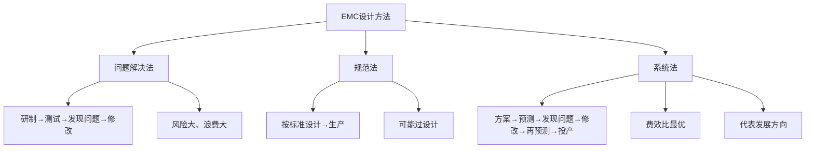
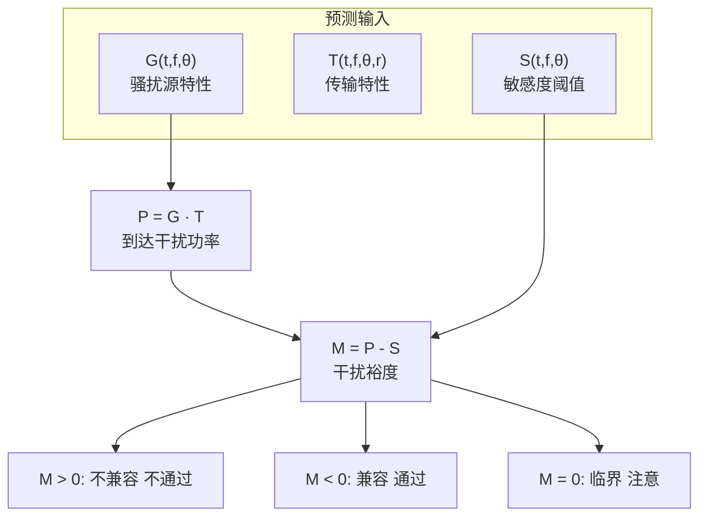
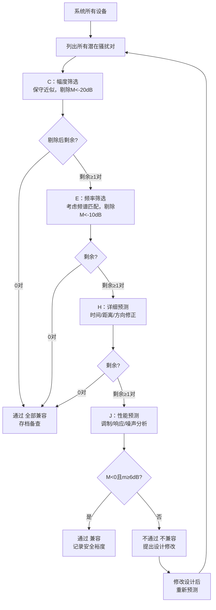
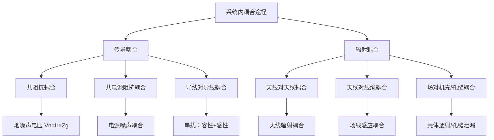
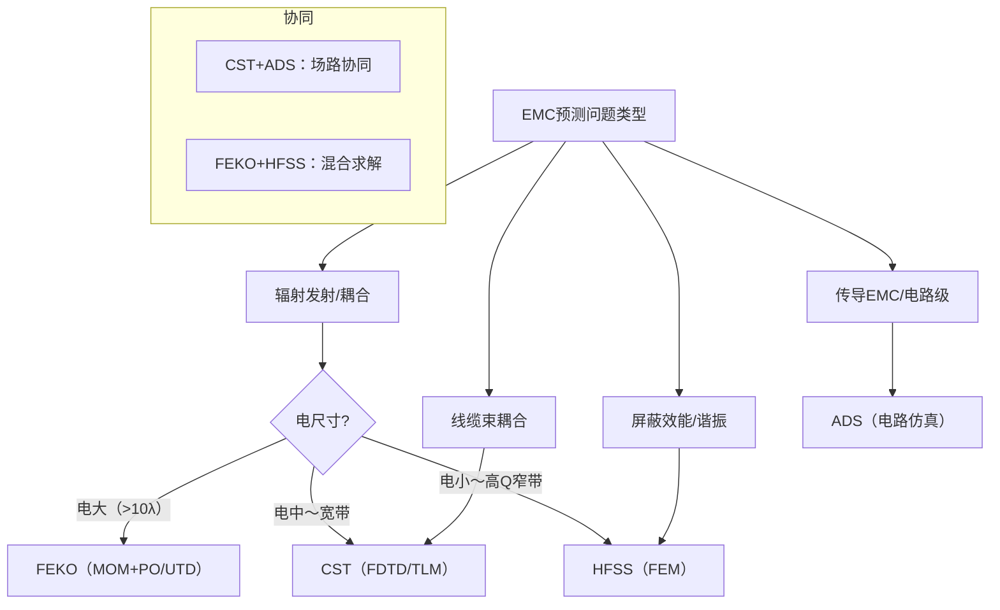
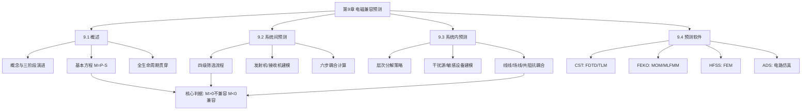

# 第9章 电磁兼容预测

## 学习目标

1. **记忆层**：能复述电磁兼容预测的定义、基本方程 $M=P-S$ 的含义以及四级筛选的名称和顺序。
2. **理解层**：能解释EMC设计三阶段（问题解决法、规范法、系统法）的演进逻辑和各阶段的优缺点。
3. **应用层**：能根据给定的发射机和接收机参数，计算自由空间传播损耗、到达功率和干扰裕度 $M$，判断系统兼容性。
4. **分析层**：能比较系统间预测与系统内预测在耦合途径上的差异，分析特定场景下应选用的预测策略。
5. **评价层**：能评估四级筛选过程中参数的保守程度是否恰当，对临界状态提出是否需要精确建模或实验验证的判断。
6. **创造层**：能针对一个包含多设备的电子系统设计完整的EMC预测分析方案，包括层次分解、参数获取、筛选计划和兼容性判据。
7. **综合层**：能综合理解电磁兼容预测从概念到工程实践的全链条知识体系，将其与屏蔽、滤波、接地等EMC控制技术建立关联。

## 9.1 电磁兼容预测概述

### 9.1.1 电磁兼容预测的概念

电磁兼容预测是电磁兼容设计及管理的基础，其发展经历了三个重要阶段。

**（1）问题解决法**

问题解决法是EMC设计的早期方法。其流程为：先按功能要求进行设备和系统研制，研制完成后进行EMC测试，发现电磁干扰问题后，再运用各种抑制干扰的技术逐个解决。这种方法本质上是在开发出样品后被动"找问题"。其最大的风险在于：一旦发现严重的EMC问题，往往需要大幅度修改设计甚至重新设计，造成人力和财力的巨大浪费，延误研制周期。

**（2）规范法**

规范法是指依据电磁兼容性标准和规范进行设备和系统设计和制造。工程师将EMC指标按照标准要求分解到各个部件，在设计过程中遵循标准规定的限值和方法。规范法可以在一定程度上预防电磁干扰问题的出现，避免了问题解决法的被动局面。但是，标准、规范并非针对某个设备或系统制定，往往造成过量设计裕量，或虽满足规范但仍存在干扰的现象。例如，某产品按GJB 151B要求设计了滤波电路，裕量达到20dB，但成本增加了30%——过设计造成资源浪费。

**（3）系统法**

系统法建立在计算机技术和数值计算技术基础上，采用预测程序针对设计方案进行电磁兼容性预测和分析。其流程为：方案设计→EMC预测分析→发现不兼容问题或过量设计→修改设计→再次预测→形成优化方案→投产。系统法的核心优势在于可以在设计阶段早期预知潜在问题，实现"先预测后设计"的主动模式。实践证明，基于EMC预测的系统法可以解决多数电磁不兼容或兼容裕量过大问题，有助于缩短研制周期、节约研制成本。

**电磁兼容性预测**（Electromagnetic Compatibility Prediction）是一种通过理论计算对用电设备或系统的电磁兼容状况进行分析评估的方法。它基于电磁干扰三要素原理，通过建立骚扰源数学模型 $G(t,f,\theta)$、传输特性数学模型 $T(t,f,\theta,r)$ 和敏感度阈值数学模型 $S(t,f,\theta)$，利用计算机数字仿真技术模拟电磁干扰传播和耦合的过程，在系统或设备研制的方案设计阶段和工程研制阶段提前发现可能存在的电磁不兼容问题，评价系统兼容的安全裕度。

*图9-7：示意图*

**图9-1 EMC设计三阶段演进对比**

上图展示了EMC设计方法从被动到主动的演进路径。问题解决法（最左）是"先做后改"的模式，风险最高；规范法（中间）引入标准约束但可能过度设计；系统法（最右）基于预测循环迭代，在成本和性能之间找到最优平衡，是现代EMC设计的发展方向。

电磁兼容性预测的主要作用体现在四个方面：

1. 在已知电路板结构、元器件或设备的电磁敏感性等情况下，预测和分析骚扰源特性、系统内部所有设备的电磁兼容性和安全性；
2. 设备的特性参数（如工作频段、安放方位或信号电缆走向）修改后，分析比较电磁干扰的变化；
3. 对各种防护设计（屏蔽、滤波、接地等）的效能进行预先评估分析；
4. 制定干扰极限和敏感度规范——通过设备已知的敏感度值确定其允许所受干扰的极限范围，或通过计算已知的各种电磁干扰的综合作用，确定设备应该具有的敏感度极限。

### 9.1.2 电磁兼容预测的目的和意义

电磁兼容预测的根本目的，是在系统或设备投入实际使用之前，通过理论计算和仿真分析，预先发现可能存在的电磁兼容问题，为方案优化和防护设计提供定量依据。具体而言，包括以下三个层面：

**（1）分析不兼容的薄弱环节**

通过对系统中所有可能的骚扰源-敏感设备对的系统性分析，找出那些干扰裕度不足的环节。例如，在飞机航电系统中，导航接收机可能受到通信发射机的带外干扰——通过预测可以预先识别这一薄弱环节。

**（2）评价兼容的安全裕度**

安全裕度 $m = -M$（当 $M<0$ 时）是衡量系统可靠性程度的重要指标。工程实践中通常要求安全裕度不小于6dB，以确保系统在极端工况下仍能保持兼容。预测分析可以定量给出每个骚扰对的 $m$ 值，判断是否满足工程要求。

**（3）为方案修改和防护设计提供依据**

当预测发现不兼容问题时，可以针对性地提出修改设计方案：调整天线布局以增加空间隔离度、加装滤波器以抑制特定频段的骚扰、增加屏蔽以降低耦合通路等。修改后的效果同样通过预测来验证，形成"预测—修改—再预测"的闭环优化流程。

电磁兼容预测的工程意义可以概括为一条经验法则：**在方案设计阶段投入1元进行预测分析，相当于在EMC设计阶段节省10元，相当于在产品投产后的整改阶段节省100元。** 正是由于预测技术能够从源头上预防EMC问题，它已成为现代电磁兼容设计不可或缺的技术环节。

### 9.1.3 电磁兼容预测的内容与基本方程

电磁兼容预测的内容可以分为两个层次：系统间预测和系统内预测。

**系统间预测**关注的是不同系统之间的电磁兼容问题，主要分析不同系统之间通过天线对天线的辐射耦合产生的干扰。例如，舰载雷达对舰载通信设备的干扰分析、地面通信基站对机载导航设备的干扰分析等。系统间预测的主要耦合途径是天线对天线的空间辐射耦合。

**系统内预测**关注的是同一系统内部各设备和分系统之间的电磁兼容问题，耦合途径更为多样，除天线辐射耦合外，还包括线间耦合、场线耦合、共阻抗耦合、机壳泄漏等。系统内预测的分析更为复杂，需要按层次将系统分解为分系统级、设备级、组件级，同时考虑各层次之间的交互作用。

**电磁兼容预测的基本方程**是整个预测技术的理论基础。任何电磁干扰的发生过程都遵循电磁干扰三要素原理——骚扰源、耦合途径和敏感设备。预测方程从这一原理出发，通过数学建模定量描述干扰链路。

**推导过程**如下（以六步推导结构展开）：

**① 物理原理**：基于电磁干扰三要素原理（骚扰源、耦合途径、敏感设备），任何电磁干扰的发生过程都遵循这三个基本环节的能量传递关系。

**② 建模假设**：忽略非线性效应和极化失配的瞬态变化，将骚扰源、传输路径和敏感设备的特性抽象为频率、时间和空间方位的函数，且假设各环节之间无耦合（即传输函数独立于源特性和敏感特性）。

**③ 原始方程**：根据干扰三要素的能量关系，骚扰源在单位距离处产生的场强或功率密度为 $G(t,f,\theta)$，经传输路径衰减后到达敏感设备处的信号功率 $P$ 可表示为源函数与传输函数的乘积：

$$
P(t,f,\theta,r) = G(t,f,\theta) \cdot T(t,f,\theta,r)
\tag{9-1}
$$

**④ 数学代入**：将到达敏感设备的干扰功率 $P$ 与敏感度阈值 $S$ 进行比较，其差值定义为干扰裕度 $M$，用于定量判定兼容性：

$$
M(t,f,\theta,r) = P(t,f,\theta,r) - S(t,f,\theta)
\tag{9-2}
$$

**⑤ 导出结果**：综合上述建模，得到电磁兼容预测的基本方程组——式（9-1）为到达功率方程，式（9-2）为干扰裕度方程。

**⑥ 参数解释**：$G(t,f,\theta)$ 为骚扰源函数（骚扰源在单位距离处产生的场强或功率密度），$T(t,f,\theta,r)$ 为传输函数（包含路径损耗、极化失配、反射折射衰减等因素），$P$ 为到达敏感设备的信号功率，$S(t,f,\theta)$ 为敏感设备的敏感度阈值，$M$ 为干扰裕度；各参数均为时间 $t$、频率 $f$、空间方位 $\theta$ 和传播距离 $r$ 的函数。

式（9-2）称为**电磁兼容预测基本方程**。其判据为：

- $M > 0$：到达的电磁干扰大于设备敏感度阈值，不兼容，$M$ 值越大干扰越严重；
- $M < 0$：设备敏感度阈值大于到达干扰，兼容，安全系数 $m = -M > 0$，$m$ 越大兼容裕度越大；
- $M = 0$：临界状态。

实际工程中，经常有敏感设备受到若干骚扰源共同作用的情况，此时基本方程扩展为：

**① 物理原理**：多源叠加原理——当多个骚扰源同时对同一敏感设备作用时，总的到达干扰功率为各源贡献的线性叠加（假设各源不相关，相干叠加需另计相位）。

**④ 数学代入**：将式（9-1）代入多源叠加情形，总到达功率为各源贡献之和，再代入式（9-2）的干扰裕度定义：

$$
M = \sum_{i=1}^{n} P_i(t,f,\theta,r) - S(t,f,\theta)
\tag{9-3}
$$

**⑤ 导出结果**：得到多源情形下电磁兼容预测基本方程的扩展形式。式中各 $P_i$ 为第 $i$ 个骚扰源经传输路径衰减后到达敏感设备的功率。

预测基本方程中的 $G$、$T$、$S$ 通常用功率（dBm或dBW）表示，也可用电压、电流或电磁场强度表示，但需注意单位的一致性。

*图9-8：示意图*

**图9-2 电磁兼容预测基本方程 $M=P-S$ 结构图**

上图从电磁干扰三要素出发，展示了预测基本方程的计算逻辑。左侧是三个输入函数 $G$、$T$ 和 $S$；中间是核心计算步骤 $P=G\cdot T$ 和 $M=P-S$；右侧是根据 $M$ 符号做出的兼容性判定结果。这一结构贯穿所有预测分析过程，无论是系统间预测还是系统内预测，最终都要归结到干扰裕度 $M$ 的计算上。

建立 $G$、$T$、$S$ 的数学模型是进行电磁兼容预测的关键。数学模型由实际的物理模型经过简化和近似处理而得到，其近似程度决定了预测分析的准确性。在实际工程中，设备电气特性可通过五种途径获取：设计数据、相似产品数据、经验资料、实验测量数据、规范和标准数据。应优先使用实测数据，无法获取实测数据时采用保守估计。

**【例题9-1】** 某通信系统工作频率 $f=100\text{MHz}$，发射机在接收机方向上的有效辐射功率 $P_t G_t = +40\text{dBm}$，传播距离 $r=1\text{km}$，接收机天线增益 $G_r=0\text{dBi}$，接收机敏感度阈值 $S=-95\text{dBm}$。判断该系统是否兼容。

**解**：
波长 $\lambda = \frac{c}{f} = \frac{3\times 10^8}{100\times 10^6} = 3\text{m}$

自由空间传播损耗（见式（9-4））：

$$
L_{bf} = 20\log\left(\frac{4\pi r}{\lambda}\right) = 20\log\left(\frac{4\pi \times 1000}{3}\right) = 20\log(4188.79) \approx 72.4\text{dB}
\tag{9-4}
$$

到达接收机的干扰功率：

$$
P_r = P_t + G_t + G_r - L_{bf} = 40 + 0 + 0 - 72.4 = -32.4\text{dBm}
\tag{9-5}
$$

干扰裕度：

$$
M = P_r - S = -32.4 - (-95) = 62.6\text{dB} > 0
\tag{9-6}
$$

**验证**：$M=62.6\text{dB}>0$，不兼容。干扰功率 $-32.4\text{dBm}$ 远大于接收机敏感度阈值 $-95\text{dBm}$，接收机将完全被干扰信号阻塞。需采取增加传播距离、降低发射功率或加装滤波器的措施。若将距离增加到 $10\text{km}$，传播损耗增加 $20\text{dB}$，$P_r=-52.4\text{dBm}$，$M=42.6\text{dB}>0$——仍不兼容，说明此系统还需更大的隔离。💡

### 9.1.4 电磁兼容预测的基本知识和理论方法

电磁兼容预测的基本知识涵盖五个方面：传导耦合分析（波过程理论）、电磁发射建模（偶极子模型和片元模型）、场线耦合问题、空间电磁场对壳体的散射及空隙透射、多路径复合传输。

**（1）预测的数学方法分类**

电磁兼容预测的数学方法分为解析法、近似解析法和数值法三大类。

解析法利用数学变换得出严格解（分离变量法/变换数学法），可将解答表示为参数函数，作为近似法和数值法的检验标准，但仅适用于极简单形状场域。

近似解析法包括逐步逼近法、微扰法、变分法以及高频方法中的几何光学法、物理光学法、几何绕射理论（GTD）。GTD由凯勒（Keller J B）在20世纪50年代提出，以已知简单形状的严格解为基础，分解复杂物体后叠加求解。

数值法用差分代替微分、有限求和代替积分，化为代数方程组，已成为预测的主流方法。

**（2）场线耦合基本理论**

当外部电磁场入射到传输线时形成分布式激励源。总场分解为入射场和散射场。三种分析方法：Taylor方法（沿线分布源）、Agrawal方法（切向电压源）和Rachidi方法（磁场电流源），实质相同可相互转换。

**（3）时域与频域技术**

时域：用高斯脉冲等带限脉冲激励，一次仿真得宽带响应，适合瞬态问题（雷电/ESD），但谐振点附近需延长时间。频域：逐频点计算，低频可加大网格，速度较快但宽带需多次仿真。

**（4）参数获取的五种途径**

①设计数据；②相似产品数据；③经验资料；④实验测量（优先）；⑤标准规范数据。遵循"实测优先、保守兜底"——无实测时发射加+3dB余量、敏感度减-3dB余量。

### 9.1.5 电磁兼容预测的数值分析方法

电磁兼容预测的数值分析方法是实现精确预测的核心工具。随着计算机技术的发展，有限元法（FEM）、矩量法（MOM）和时域有限差分法（FDTD）已成为EMC预测的三大支柱性数值方法。

**（1）有限元法（FEM）**

有限元法通过将求解域划分为统一的小单元（如三角形或四面体），在每个单元中用简单的插值函数近似场量，利用变分技术将偏微分方程的边值问题转化为求解能量最小函数的代数方程组。三维时谐问题的能量函数为：

**① 物理原理**：变分原理——电磁场的边值问题等价于使能量泛函取驻值的变分问题。能量泛函中磁场储能项 $\frac{\mu}{2}|\boldsymbol{H}|^2$、电场储能项 $\frac{\varepsilon}{2}|\boldsymbol{E}|^2$ 和传导电流耗散项 $\frac{\boldsymbol{J}\cdot\boldsymbol{E}}{2j\omega}$ 共同构成系统的总电磁能量。

**② 建模假设**：求解域离散为有限个四面体/六面体单元，每个单元内场量用线性或高阶插值函数近似，材料参数（$\mu$、$\varepsilon$、$\sigma$）在各单元内为常数。

**③ 原始方程**：三维时谐电磁场的变分泛函为 $F = \int_V \mathcal{L} dv$，其中 $\mathcal{L}$ 为Lagrangian密度。

**④ 数学代入**：将电磁场能量密度表达式和传导电流的焦耳热损耗代入变分泛函，并用 $\boldsymbol{H} = (1/j\omega\mu)\nabla\times\boldsymbol{E}$ 消去 $\boldsymbol{H}$：

**⑤ 导出结果**：

$$
F = \int_V \left(\frac{\mu}{2}|\boldsymbol{H}|^2 + \frac{\varepsilon}{2}|\boldsymbol{E}|^2 - \frac{\boldsymbol{J}\cdot\boldsymbol{E}}{2j\omega}\right)dv
\tag{9-7}
$$

**⑥ 参数解释**：$\boldsymbol{E}$ 为电场强度（V/m），$\boldsymbol{H}$ 为磁场强度（A/m），$\boldsymbol{J}$ 为电流密度（A/m²），$\mu$ 为磁导率（H/m），$\varepsilon$ 为介电常数（F/m），$\omega$ 为角频率（rad/s），$V$ 为求解域体积（m³）。前两项表示磁场和电场中的储能，第三项为传导电流的耗散能量。

将 $\boldsymbol{H}$ 用 $\boldsymbol{E}$ 表示，求函数驻值，在 $N$ 个节点上应用边界条件后得到矩阵方程：

$$
\begin{bmatrix} J_1 \\ J_2 \\ \vdots \\ J_n \end{bmatrix} = \begin{bmatrix} y_{11} & y_{12} & \dots & y_{1n} \\ y_{21} & y_{22} & \dots & y_{2n} \\ \vdots & \vdots & & \vdots \\ y_{n1} & y_{n2} & \dots & y_{nn} \end{bmatrix} \begin{bmatrix} E_1 \\ E_2 \\ \vdots \\ E_n \end{bmatrix}
\tag{9-8}
$$

FEM的主要优势：可以在每个单元中定义不同电气和几何属性，允许在复杂几何区域定义小单元而在开放区域定义大单元，适合处理具有复杂形状的介质区域。局限：处理开放问题（无闭合边界的辐射结构）比较困难，需采用膨胀气球或吸收边界技术来克服。

**（2）矩量法（MOM）**

矩量法依据加权余量法，将积分方程转化为线性代数方程组。采用的方程一般为电场积分方程（EFIE）或磁场积分方程（MFIE）：

**① 物理原理**：基于电磁场的等效原理——导体表面的感应电流 $ \boldsymbol{J}$ 产生的散射场与入射场在导体表面满足边界条件（切向电场为零或切向磁场连续），从而建立 $ \boldsymbol{E}$ 或 $ \boldsymbol{H}$ 关于 $ \boldsymbol{J}$ 的积分方程。

**② 建模假设**：导体为理想导体（PEC），表面阻抗为零；入射场为已知激励；远场辐射边界已在积分方程的格林函数中自然满足。

**③ 原始方程**：根据导体表面边界条件，电场积分方程（EFIE）将入射电场表示为感应电流的函数 $\boldsymbol{E} = f_e(\boldsymbol{J})$，磁场积分方程（MFIE）将入射磁场表示为感应电流的函数 $\boldsymbol{H} = f_m(\boldsymbol{J})$。

**④ 数学代入**：将导体表面离散为三角形/四边形面元，感应电流 $\boldsymbol{J}$ 在各面元上用基函数展开。

**⑤ 导出结果**：

$$
\text{EFIE: } \boldsymbol{E} = f_e(\boldsymbol{J}) \qquad \text{MFIE: } \boldsymbol{H} = f_m(\boldsymbol{J})
\tag{9-9}
$$

**⑥ 参数解释**：$\boldsymbol{E}$ 和 $\boldsymbol{H}$ 为入射场量（V/m 和 A/m），$\boldsymbol{J}$ 为导体表面感应电流密度（A/m²），$f_e$ 和 $f_m$ 为积分算子，分别由自由空间格林函数和表面阻抗边界条件决定。MOM的第一步是将 $\boldsymbol{J}$ 展开为基函数的线性组合：

$$
\boldsymbol{J} = \sum_{i=1}^{M} J_i b_i
\tag{9-10}
$$

定义 $M$ 个线性独立的权函数 $w_j$，在方程两边做内积，形成矩阵方程 $\boldsymbol{H} = \boldsymbol{Z}\boldsymbol{J}$。MOM特别适用于细线结构（如天线耦合分析）和导电大平面上的线段问题。局限是处理非均匀介质和导电密闭空间内问题不够有效。

**（3）时域有限差分法（FDTD）**

FDTD直接对Maxwell时间旋度方程做中心差分近似：

**① 物理原理**：法拉第电磁感应定律和安培环路定律的微分形式——时变电场产生磁场，时变磁场产生电场，两者互相耦合构成电磁波的传播机制。

**② 建模假设**：计算域离散为Yee元胞网格（电场和磁场在空间上交错半个网格步长），媒质参数（$\varepsilon$、$\mu$、$\sigma$）在各网格元胞内为常数，时间步长满足CFL稳定性条件。

**③ 原始方程**：Maxwell方程组的两个旋度方程——$\nabla \times \boldsymbol{E} = -\mu\frac{\partial\boldsymbol{H}}{\partial t}$ 和 $\nabla \times \boldsymbol{H} = \sigma\boldsymbol{E} + \varepsilon\frac{\partial\boldsymbol{E}}{\partial t}$。

**④ 数学代入**：对时间微分用中心差分近似 $\frac{\partial f}{\partial t} \approx \frac{f(t+\Delta t) - f(t-\Delta t)}{2\Delta t}$，对空间微分用Yee元胞上的环路积分近似：

**⑤ 导出结果**：

$$
\nabla \times \boldsymbol{E} = -\mu\frac{\partial\boldsymbol{H}}{\partial t}, \quad \nabla \times \boldsymbol{H} = \sigma\boldsymbol{E} + \varepsilon\frac{\partial\boldsymbol{E}}{\partial t}
\tag{9-11}
$$

FDTD是一种时间递推方法：$t$ 时刻的电场量确定 $t+\Delta t$ 时刻的磁场量，$t+\Delta t$ 时刻的磁场量确定 $t+2\Delta t$ 时刻的电场量。在每个时间步长中场量更新采用显式格式，无须解线性代数方程组。

FDTD的一阶中心差分格式为：

**① 物理原理**：对式（9-37）中法拉第定律的旋度方程在Yee元胞面上做面积分，利用斯托克斯定理将旋度转化为环路积分，得到电场与磁场之间的显式时间递推关系。

**② 建模假设**：电场分量取 $t$ 时刻值，磁场分量取 $t \pm \Delta t$ 时刻值（时间交错），Yee元胞各边上电场均匀，各面上磁场均匀。

**③ 原始方程**：法拉第电磁感应定律的积分形式 $\oint_C \boldsymbol{E} \cdot d\boldsymbol{l} = -\mu\frac{\partial}{\partial t}\int_S \boldsymbol{H} \cdot d\boldsymbol{S}$。

**④ 数学代入**：取Yee元胞的一个面（$yz$平面），四条边上的电场分量 $E_{z1}$、$E_{y2}$、$E_{z3}$、$E_{y4}$ 的环路积分等于该面内磁场 $H_{x0}$ 的时间变化率乘以 $\mu_0$，对时间微分用中心差分近似：

**⑤ 导出结果**：

$$
\frac{1}{A}[E_{z1}(t) + E_{y2}(t) - E_{z3}(t) - E_{y4}(t)] = -\frac{\mu_0}{2\Delta t}[H_{x0}(t+\Delta t) - H_{x0}(t-\Delta t)]
\tag{9-12}
$$

**⑥ 参数解释**：$A$ 为Yee元胞面的面积（m²），$E_{z1}$、$E_{y2}$、$E_{z3}$、$E_{y4}$ 为元胞四条棱边上的电场分量（V/m），$H_{x0}$ 为元胞面中心处的磁场分量（A/m），$\mu_0$ 为真空磁导率（H/m），$\Delta t$ 为时间步长（s）。式（9-38）给出了由 $t$ 时刻电场更新 $t+\Delta t$ 时刻磁场的显式递推公式。

FDTD的主要优点：灵活性极高，对任意复杂的导体形状、电介质、有损非线性和非各向同性媒质以及任意波形信号都可应用；容易在大型并行计算机上实现。局限：对于含微小精细结构的大尺度问题，网格数巨大导致计算量过大。

FDTD方法中**吸收边界条件（ABC）** 是截断计算域的关键技术。最常用的是完美匹配层（PML），通过在计算域边界添加一层有耗介质，使入射波进入PML后被无反射地吸收。PML中电导率 $\sigma$ 和磁导率 $\sigma^*$ 按多项式分布：

**① 物理原理**：PML通过阻抗匹配条件使有耗介质层的波阻抗与自由空间相同（$Z_{PML}=Z_0$），实现任意频率和入射角的无反射吸收。电导率和磁导率按空间渐变多项式分布以减小数值反射。

**⑤ 导出结果**：

$$
\sigma(\rho) = \sigma_{max}\left(\frac{\rho}{d}\right)^n, \quad \sigma^*(\rho) = \sigma_{max}^*\left(\frac{\rho}{d}\right)^n
\tag{9-13}
$$

**⑥ 参数解释**：$\rho$ 为到PML内边界的距离，$d$ 为PML厚度，$n$ 为多项式阶数（通常取 $n=2\sim4$）。PML的理论反射系数为：

**① 物理原理**：PML的理论反射系数由电导率分布和PML厚度的积分决定，反射波在PML内往返一次的总衰减量由指数函数描述。

**⑤ 导出结果**：

$$
R_{PML} = \exp\left(-\frac{2\sigma_{max}d}{n+1}\sqrt{\frac{\varepsilon}{\mu}}\right)
\tag{9-14}
$$

**⑥ 参数解释**：$\sigma_{max}$ 为PML外边界处的最大电导率（S/m），$d$ 为PML厚度（m），$n$ 为多项式阶数，$\varepsilon$ 和 $\mu$ 为PML介质的介电常数和磁导率。典型PML厚度为 $10\sim20$ 个网格，理论反射系数可达 $-60\text{dB}\sim-80\text{dB}$。PML的实现在FDTD电磁仿真软件中已成为标准配置，但在EMC预测的实际应用中，需注意PML厚度与最低频率的关系——对于超宽带EMC问题，PML参数需要特别优化。

**（4）三种数值方法的选型对比**

根据EMC预测问题的具体特征选择适合的数值方法：

| 方法 | 方程类型 | 离散方式 | 适合问题 | 计算量特征 |
|:-----|:---------|:---------|:---------|:-----------|
| FEM | 微分方程（变分） | 体单元（四面体/六面体） | 封闭结构、高Q谐振、介质不均匀 | 矩阵稀疏，存储量中等 |
| MOM | 积分方程（加权余量） | 面单元（三角形/四边形） | 天线、细线、散射体、开放结构 | 矩阵稠密，高精度但电大问题受限 |
| FDTD | 微分方程（中心差分） | 正交网格（Yee元胞） | 宽带、时域脉冲、场线耦合 | 网格数决定，易于并行 |

电磁兼容预测中经常采用混合法：例如MOM+PO（物理光学）处理电大平台上的天线问题，FDTD+FEM处理含精细结构的宽带问题。

**（5）预测模型建立的一般流程**

建立EMC预测模型的一般流程为：
① 定义问题：明确需要分析的EMC问题，确定关键参数（如干扰裕度 $M$、安全系数 $m$）；
② 选择维度：根据问题特征选择二维模型（快速评估、参数扫描）或三维模型（精确分析）；
③ 选择方法：根据频率范围、电尺寸、介质特性选择FEM/MOM/FDTD或混合方法；
④ 建立模型：输入几何结构、材料属性、激励源和边界条件；
⑤ 求解计算：运行求解器，监控收敛状态；
⑥ 后处理分析：提取关键参数（S参数、电流分布、辐射场、干扰裕度等）；
⑦ 验证评估：与理论值或实测数据对比，评估模型准确性。

这一流程与四级筛选技术结合使用：幅度筛选和频率筛选阶段可采用保守近似方法（如准静态法），详细预测和性能预测阶段采用精确数值方法。

## 9.2 系统间电磁兼容预测

### 9.2.1 系统间电磁兼容预测基本原理

系统间电磁兼容预测主要解决不同系统之间的电磁兼容性问题，其核心是分析天线对天线的辐射耦合。系统间预测的基本流程围绕预测基本方程 $M=P-S$ 展开，其中 $P = G\cdot T$ 中 $G$ 主要是发射天线辐射特性，$T$ 主要是自由空间传播衰减。

**（1）基本预测方程在系统间预测中的应用**

在系统间预测中，自由空间传播损耗是传输衰减 $T$ 的主要分量。该公式基于Friis传输方程推导。

**① 物理原理**：Friis传输方程——电磁波在自由空间中传播时，功率密度按球面波规律衰减，接收功率与发射功率、天线增益和距离的平方成反比。

**② 建模假设**：发射天线为各向同性辐射源（增益为0dBi），接收天线为各向同性天线（有效面积 $A_e = \lambda^2/(4\pi)$），传播介质为真空（无吸收、无反射），收发天线极化完全匹配。

**③ 原始方程**：各向同性辐射源在距离 $r$ 处的功率密度为 $S = P_t/(4\pi r^2)$，各向同性接收天线的有效面积为 $A_e = \lambda^2/(4\pi)$。

**④ 数学代入**：接收功率 $P_r = S \cdot A_e = P_t \cdot \lambda^2/(4\pi r)^2$。取分贝形式，自由空间传播损耗定义为发射功率与接收功率之比：

$$
L_{bf} = 10\log\left(\frac{P_t}{P_r}\right) = 10\log\left(\frac{(4\pi r)^2}{\lambda^2}\right) = 20\log\left(\frac{4\pi r}{\lambda}\right) \quad \text{[dB]}
\tag{9-15}
$$

**⑤ 导出结果**：式（9-4）为自由空间传播损耗的经典计算公式，以分贝（dB）为单位。

**⑥ 参数解释**：$r$ 为传播距离（m），$\lambda$ 为信号波长（m），$c$ 为光速，$f$ 为频率，$\lambda = c/f$。

在实际工程中，除自由空间传播外还需考虑地面反射的影响。当发射和接收天线均位于地面附近时，地面反射波与直射波在接收点叠加，形成干涉效应。考虑地面反射后的传播损耗修正为：

**① 物理原理**：地面反射波与直射波的干涉效应——在平坦地面附近，电磁波经地面反射后与直射波在接收点叠加，合成场强随天线高度和距离变化。

**⑤ 导出结果**：

$$
L_{total} = L_{bf} + L_{ground} \quad \text{[dB]}
\tag{9-16}
$$

地面反射修正项 $L_{ground}$ 与天线高度和距离有关。当收发间距 $r$ 远大于天线高度 $h_t$ 和 $h_r$ 时，地面反射使接收场强随距离按 $1/r^2$ 衰减（而非自由空间的 $1/r$），此时传播损耗近似为：

**① 物理原理**：在远距离地面反射条件下，直射波和反射波路径差小，干涉产生 $1/r^2$ 衰减规律，传播损耗按 $40\log r$ 变化（平面地球传播模型）。

**⑤ 导出结果**：

$$
L_{grnd} \approx 40\log r - 20\log h_t - 20\log h_r + 20\log\left(\frac{4\pi}{\lambda}\right) \quad \text{[dB]}
\tag{9-17}
$$

**⑥ 参数解释**：$r$ 为收发天线间距（m），$h_t$、$h_r$ 分别为发射和接收天线高度（m），$\lambda$ 为波长（m）。

在系统间EMC预测中，地面反射效应对于近距离（$r < 1\text{km}$）的低频段（$f < 100\text{MHz}$）通信系统影响显著，不可忽略。

对于高频段（$f > 1\text{GHz}$），大气吸收损耗成为附加传输衰减的重要组成部分。氧气和水蒸气的谐振吸收导致信号衰减，其经验公式为：

**① 物理原理**：氧气分子（$O_2$）和水蒸气分子（$H_2O$）在毫米波频段存在谐振吸收峰，电磁波在大气中传播时因分子共振而产生额外衰减。

**⑤ 导出结果**：

$$
L_{atm} = \alpha_0(f) \cdot r \quad \text{[dB]}
\tag{9-18}
$$

**⑥ 参数解释**：$\alpha_0(f)$ 为大气衰减系数（dB/km），在 $f=10\text{GHz}$ 时约为 $0.01\text{dB/km}$，在 $f=22\text{GHz}$（水蒸气谐振峰）时可达 $0.2\text{dB/km}$。

除地面反射和大气吸收外，电磁波在传播路径中还会遇到各种障碍物（建筑物、山体、树木等），产生绕射损耗。对于非视距（NLOS）传播场景，绕射损耗是EMC预测中不可忽略的因素。刃峰绕射模型给出了最简单的绕射损耗估算公式：

**① 物理原理**：基尔霍夫绕射理论——电磁波遇到障碍物边缘时发生绕射，在阴影区仍存在场强。刃峰绕射模型将障碍物简化为半无限大理想导电屏。

**⑤ 导出结果**：

$$
L_{diff} = 6.9 + 20\log\left(\sqrt{(v-0.1)^2+1} + v - 0.1\right) \quad \text{[dB]}
\tag{9-19}
$$

**⑥ 参数解释**：$v$ 为菲涅尔-基尔霍夫绕射参数，$v = h\sqrt{2(d_1+d_2)/(\lambda d_1 d_2)}$，$h$ 为障碍物超出收发连线的距离，$d_1$ 和 $d_2$ 分别为收发到障碍物的距离。

在系统间EMC预测的详细预测阶段（四级筛选的第三级），上述地面反射修正、大气吸收和绕射损耗需要精确计入，从而获得更接近实际工况的干扰裕度评估值。

到达接收天线端口的干扰功率综合考虑上述因素为：

**① 物理原理**：基于式（9-1）的功率传输方程和式（9-4）的自由空间传播损耗，引入天线增益和附加损耗因素。

**④ 数学代入**：将发射功率 $P_t$ 加上发射天线增益 $G_t$ 和接收天线增益 $G_r$，减去自由空间传播损耗 $L_{bf}$ 和其他附加损耗 $L_{other}$：

$$
P_r = P_t + G_t + G_r - L_{bf} - L_{other} \quad \text{[dBm]}
\tag{9-20}
$$

**⑤ 导出结果**：式（9-5）为系统间预测中到达接收天线端口干扰功率的完整计算公式，所有量均以分贝（dB）为单位。

式中 $P_t$ 为发射功率（dBm），$G_t$、$G_r$ 分别为发射和接收天线增益（dBi），$L_{other}$ 为其他附加损耗（极化失配、大气吸收等，dB）。

接收机的敏感度阈值（灵敏度）从热噪声出发推导。

**① 物理原理**：热噪声（Johnson-Nyquist噪声）——任何温度高于绝对零度的电阻性材料中的载流子随机热运动产生噪声功率，其功率谱密度为 $k T_0$，其中 $k$ 为玻尔兹曼常数，$T_0$ 为标准温度。

**② 建模假设**：标准室温 $T_0=290\text{K}$，接收机噪声系数 $NF$ 为常数（或取其工作频段内最差值），噪声基底远大于其他干扰本底，信号解调所需最小信噪比 $SNR_{min}$ 已知且固定。

**③ 原始方程**：在温度 $T_0=290\text{K}$ 的标准条件下，$1\text{Hz}$ 带宽内的热噪声功率为 $kT_0$。

**④ 数学代入**：$kT_0 = 1.38\times 10^{-23} \times 290 \approx 4\times 10^{-21}\text{W} = -174\text{dBm/Hz}$。经噪声系数 $NF$ 放大后的等效噪声功率密度为 $(-174 + NF)\ \text{dBm/Hz}$。在接收机带宽 $B$ 内的总噪声功率为 $(-174 + NF) + 10\log B$。若要正确解调信号，信噪比需达到 $SNR_{min}$，因此灵敏度为噪声基底加上最小信噪比：

$$
S_{min} = -174 + NF + 10\log B + SNR_{min} \quad \text{[dBm]}
\tag{9-21}
$$

**⑤ 导出结果**：式（9-6）为接收机灵敏度的标准计算公式，源于热噪声理论。

**⑥ 参数解释**：$NF$ 为接收机噪声系数（dB），$B$ 为接收机带宽（Hz），$SNR_{min}$ 为最小信噪比（dB），$-174$ 为 $kT_0$ 在 $T_0=290\text{K}$ 时的功率密度（dBm/Hz）。

干扰裕度：

**① 物理原理**：基于电磁兼容预测基本方程式（9-2），将接收机灵敏度 $S_{min}$ 作为敏感度阈值代入。

**④ 数学代入**：将式（9-5）的到达功率 $P_r$ 和式（9-6）的灵敏度 $S_{min}$ 代入基本方程式（9-2）：

$$
M = P_r - S_{min}
\tag{9-22}
$$

**⑤ 导出结果**：式（9-7）为系统间预测中判断兼容性的核心判据。

**（2）四级筛选预测技术**

在实际工程中，一个复杂电子系统往往包含大量设备，潜在的骚扰源-敏感设备对数极其庞大。例如，一个由20个收发设备组成的系统，每对设备之间考虑发射-接收关系，可能的骚扰对将超过100万对。如果对全部骚扰对进行详细计算，在计算资源和时间上都是不可接受的。为此，工程实践中广泛采用**四级筛选**（Four-Level Screening）技术，按"先粗后细"的原则逐级缩小分析范围。

*图9-9：示意图*

**图9-3 四级筛选预测流程图**

上图展示了四级筛选的完整流程。从系统所有设备出发，枚举全部潜在骚扰对后，依次经过幅度筛选、频率筛选、详细预测和性能预测四个阶段的逐级筛选。每级筛选设定不同的剔除阈值，幅度最为宽松（M<-20dB剔除），性能预测最为严格。不兼容项进入设计修改循环，修改完成后重新进入筛选流程。

**第一级：幅度筛选（Amplitude Screening）**

幅度筛选是四级筛选中计算量最小、效率最高的阶段，其目标是快速剔除大量弱骚扰对，使后续分析聚焦于少数关键骚扰对。幅度筛选采用简单、合理、保守的近似式——每个输入函数尽可能简单，发射功率取最大值（加3dB安全余量），敏感度阈值取最小值（减3dB安全余量）。这种保守近似确保不会在筛选阶段漏掉任何可能的临界骚扰对，同时将大量明显兼容的对快速剔除。

幅度筛选的判据为：$M < -20\text{dB}$ 的骚扰对可直接存档备查（认为兼容，安全裕度足够大）；$M \ge -20\text{dB}$ 的骚扰对进入下一级筛选。

幅度筛选可将超过90%的弱骚扰情况剔除，大幅降低后续分析的计算量。例如，一个10×10=100对的系统，幅度筛选后通常仅剩不到10对需要进一步分析。

**第二级：频率筛选（Frequency Screening）**

频率筛选在幅度筛选基础上，通过考虑附加的骚扰抑制度来详细处理频率变量之间的相互关系。需要将发射频谱与接收响应曲线进行频率卷积，计算每个频点上的有效干扰功率。

频率筛选需考虑以下频率效应：
- 发射机的工作频率、谐波和杂散发射；
- 接收机的选择性曲线（3dB/6dB/60dB带宽）；
- 频率变换效应（互调、交调等）。

频率筛选的判据为：$M < -10\text{dB}$ 的骚扰对剔除存档；$M \ge -10\text{dB}$ 的进入下一级筛选。

**第三级：详细预测（Detailed Prediction）**

详细预测阶段完成按时间、距离和方向变量的精确修正：

- **时间变量**：分析收发时隙是否重叠。若两设备不在同一时段工作，则干扰概率大大降低。
- **距离变量**：采用精确的路径损耗模型（而非自由空间近似），考虑地面反射、绕射等效应。
- **方向变量**：采用精确的天线方向图数据，考虑主瓣-副瓣耦合、极化匹配等因素。

详细预测的判据为：$M < -6\text{dB}$ 且安全裕度 $m \ge 6\text{dB}$ 的认为兼容；其余进入性能预测。

**第四级：性能预测（Performance Prediction）**

性能预测是四级筛选的最后阶段，考虑周围发射机和接收机的调制特征和响应特性，计算接收机输入端的潜在骚扰、信号电平及接收机噪声电平，从而确定系统信噪比和误码率。这一阶段的输出直接反映系统在实际工况下的EMC性能。

性能预测的最终输出包含：
- 各骚扰对的干扰裕度 $M$；
- 系统整体的信噪比指标；
- 不兼容项的定量分析报告和设计修改建议。

**【例题9-2】** 某飞机通信系统包含3部发射机和2部接收机，工作频率范围100~400MHz。试按四级筛选流程设计预测分析方案，重点说明各阶段的输入参数和输出。

**解**：
系统共有3×2=6对潜在骚扰对。

**幅度筛选**：
采用保守参数——发射功率取最大可能值（+3dB余量），接收灵敏度取最差值（-3dB余量）。假设1号发射机在接收机方向上的 $EIRP=+36\text{dBm}$（含3dB余量），接收机灵敏度 $S=-90\text{dBm}$（含-3dB余量），自由空间衰减按最差频率（下限100MHz）计算 $L_{bf}=20\log(4\pi\times 300/3)\approx 62\text{dB}$（假设距离300m）。则 $P_r\approx 36-62=-26\text{dBm}$，$M=-26-(-90)=64\text{dB}>-20\text{dB}$——未剔除，进入频率筛选。

**频率筛选**：
1号发射机工作频率150MHz，2号发射机200MHz，3号发射机350MHz。接收机A工作频段100~250MHz，接收机B工作频段300~500MHz。发射机3与接收机A频段不重叠，频率卷积后可剔除（M<-10dB）。发射机1、2与接收机A频段重叠，保留；发射机3与接收机B频段重叠，保留。剩余约4对。

**详细预测**：
对保留的4对进行精确计算——考虑实际使用中的时隙分配（通信收发时隙是否重叠）、精确距离（天线之间的三维空间距离）和天线方向图（飞机机体遮挡效应）。

**性能预测**：
对最恶劣的骚扰对计算详细信噪比，确认兼容性。若不兼容，提出天线布局优化或加装滤波器的方案。

**验证**：经过四级筛选，6个初始骚扰对降为1~2个关键对进行详细计算，分析工作量减少约75%。💡

### 9.2.2 系统间电磁兼容预测问题建模

系统间预测需要建立发射机模型和接收机模型的精确数学描述。

**（1）发射机模型**

发射机模型的核心参数包括：

**① 物理原理**：发射机端口输出功率在通过天线辐射前受天线增益和输出滤波器的影响，遵循射频链路级联增益/衰减原理。

**⑤ 导出结果**：

$$
P_{Tx}(f) = P_0 + G_t(f,\theta,\phi) - A_{filter}(f)
\tag{9-23}
$$

**⑥ 参数解释**：$P_0$ 为发射机额定功率（dBm），$G_t(f,\theta,\phi)$ 为发射天线增益（dBi，频率和方向函数），$A_{filter}(f)$ 为输出滤波器的插入损耗（dB）。

发射频谱模型通常包含三个分量：

**① 物理原理**：实际发射机的输出频谱不是单一载波，而是包含载波、谐波和宽带噪声的复合频谱，各分量对应不同的物理产生机制。

**⑤ 导出结果**：

$$
S_{Tx}(f) = S_{carrier}(f) + S_{harmonic}(f) + S_{broadband}(f)
\tag{9-24}
$$

**⑥ 参数解释**：$S_{carrier}$ 为主载波频谱，$S_{harmonic}$ 为 $nf_0$ 处的谐波分量（通常以 dBc 表示），$S_{broadband}$ 为宽带噪声基底。

发射机的相位噪声是重要的建模参数，尤其是在接收机邻近频道的干扰分析中。相位噪声通常用单边带相位噪声密度 $\mathcal{L}(f_m)$ 表示，单位为 dBc/Hz@$f_m$ 偏移：

**① 物理原理**：振荡器的相位噪声源于振荡信号的随机相位抖动，在频域表现为载波两侧的连续噪声边带，由Leeson方程描述。

**⑤ 导出结果**：

$$
\mathcal{L}(f_m) = 10\log\left(\frac{P_{SSB}}{P_{carrier}}\right) \quad \text{[dBc/Hz]}
\tag{9-25}
$$

**⑥ 参数解释**：$\mathcal{L}(f_m)$ 为在频率偏移 $f_m$ 处的单边带相位噪声密度（dBc/Hz），$P_{SSB}$ 为偏移 $f_m$ 处 $1\text{Hz}$ 带宽内的单边带噪声功率，$P_{carrier}$ 为载波功率。

典型晶振的相位噪声在 $10\text{kHz}$ 偏移处约为 $-120\text{dBc/Hz}$，在 $100\text{kHz}$ 偏移处约为 $-140\text{dBc/Hz}$。相位噪声导致的接收机邻道干扰功率为：

**① 物理原理**：发射机相位噪声在接收机中频带宽内积分后产生邻道干扰，干扰功率等于发射功率加上相位噪声密度在接收带宽内的积分。

**⑤ 导出结果**：

$$
P_{PN} = P_t + \mathcal{L}(\Delta f) + 10\log B_{Rx} \quad \text{[dBm]}
\tag{9-26}
$$

**⑥ 参数解释**：$P_t$ 为发射功率（dBm），$\mathcal{L}(\Delta f)$ 为在频率偏移 $\Delta f$ 处的相位噪声密度（dBc/Hz），$B_{Rx}$ 为接收机带宽（Hz），$10\log B_{Rx}$ 将相位噪声密度积分到接收带宽内。

发射机杂散发射的典型限值（以 GJB 151B 为例）为：对于 $1\text{GHz}$ 以下频段，杂散发射电平不超过 $-36\text{dBm}$（军标限值）。这一限值在EMC预测中作为发射机模型输出滤波效果的依据。

**（2）接收机模型**

接收机的选择性特性可用带宽参数描述：

**① 物理原理**：超外差接收机的中频滤波器对不同频率信号的选择性由其幅频响应曲线描述，不同抑制深度对应不同的带宽指标。

**⑤ 导出结果**：

$$
B_{3dB} \le B_{6dB} \le B_{60dB}
\tag{9-27}
$$

**⑥ 参数解释**：$B_{3dB}$、$B_{6dB}$、$B_{60dB}$ 分别为3dB、6dB和60dB带宽（Hz），典型的超外差接收机带宽比约为 $B_{60dB}:B_{6dB}:B_{3dB} \approx 5:2:1$。

接收机的互调特性是另一个重要的建模参数。三阶互调截点（IP3）与接收机灵敏度之间的关系为：

**① 物理原理**：接收机前端非线性产生三阶互调失真，IP3是衡量非线性特性的关键指标，其与1dB压缩点的经验关系为 $IP3 = P_{1dB} + 10.6$。

**⑤ 导出结果**：

$$
IP3 = P_{1dB} + 10.6 \approx S_{min} + DR + 10.6
\tag{9-28}
$$

**⑥ 参数解释**：$P_{1dB}$ 为1dB压缩点（dBm），$DR$ 为接收机动态范围（dB），$S_{min}$ 为灵敏度（dBm）。

**（3）天线耦合模型**

系统间预测的核心是天线对天线的耦合。天线之间的传输损耗包括自由空间路径损耗和极化失配损耗：

**① 物理原理**：天线间的总传输损耗由自由空间传播损耗、极化失配损耗和阻抗失配损耗三部分级联构成。

**⑤ 导出结果**：

$$
L_{total} = L_{bf} + L_{pol} + L_{mismatch}
\tag{9-29}
$$

极化失配损耗 $L_{pol}$ 的计算公式为：

**① 物理原理**：发射和接收天线的极化状态不完全匹配时，接收天线只能接收到入射波中与其极化方向一致的分量，产生极化失配损耗。

**⑤ 导出结果**：

$$
L_{pol} = -20\log|\boldsymbol{\rho}_t \cdot \boldsymbol{\rho}_r^*| \quad \text{[dB]}
\tag{9-30}
$$

**⑥ 参数解释**：式（9-12）中 $L_{bf}$ 为自由空间传播损耗，$L_{pol}$ 为极化失配损耗，$L_{mismatch}$ 为阻抗失配损耗。式（9-13）中 $\boldsymbol{\rho}_t$ 和 $\boldsymbol{\rho}_r$ 分别为发射和接收天线的极化单位矢量。当极化完全正交时 $L_{pol}\to\infty$（实际工程中通常为20~40dB）；极化完全匹配时 $L_{pol}=0\text{dB}$。

**（4）接收机灵敏度计算**

接收机灵敏度是EMC预测中敏感度阈值 $S$ 的主要组成部分。从热噪声基底出发，经噪声系数和带宽放大后的等效噪声功率为：

$$
N_{floor} = -174 + NF + 10\log B \quad \text{[dBm]}
\tag{9-31}
$$

**① 物理原理**：热噪声功率谱密度经接收机噪声系数放大后，在有限带宽内积分得到总噪声功率——源于式（9-6）的热噪声推导。

**⑤ 导出结果**：式（9-14）为接收机噪声基底的通用计算公式。

**⑥ 参数解释**：$NF$ 为接收机噪声系数（dB），$B$ 为接收机带宽（Hz），$-174$ 为标准温度 $T_0=290\text{K}$ 下的热噪声功率谱密度（dBm/Hz）。

考虑解调所需的最小信噪比 $SNR_{min}$ 后，接收机灵敏度为：

$$
S_{min}(f) = -174 + NF(f) + 10\log B + SNR_{min}
\tag{9-32}
$$

**① 物理原理**：在噪声基底 $N_{floor}$ 基础上叠加最小信噪比要求，得到能够正确解调信号的最小输入功率。

**⑤ 导出结果**：式（9-15）为接收机灵敏度随频率变化的通用公式。

**⑥ 参数解释**：$NF(f)$ 为接收机噪声系数的频率特性（dB），$B$ 为接收机带宽（Hz），$SNR_{min}$ 为最小信噪比（dB），$-174$ 含义同式（9-14）。EMC预测中一般取接收机工作频段内最差值作为保守估计。

#### （5）柯金良预测模型参数体系

柯金良《电磁兼容概论》§10.5给出了EMC/EMI数值模型建立的完整参数体系，系统性地归纳了预测中所需的三大类模型参数：骚扰源特性参数、传播耦合特性参数和设备电路特性参数。

**① 骚扰源特性参数**包含六种典型骚扰源的数学描述：

- 正弦波骚扰：幅度和频率可变（$V(t)=V_0\\sin(2\\pi f_0 t)$）
- 双指数脉冲：上升时间、下降时间、幅度可变（雷电和NEMP典型波形）
- 矩形脉冲：幅度和持续时间可变（数字电路时钟信号）
- 任意波形电压：逐点描述任意波形（实际测量的骚扰波形）
- 平面波电磁场：频率、场强可变
- 指数脉冲瞬态场：幅值和上升/下降时间可变

**② 传播耦合特性参数**分为传导耦合和辐射耦合两大类：

传导耦合参数包括：公共阻抗耦合参数（共享地阻抗$Z_g$的频率特性）、共电源阻抗耦合参数、电场对回路耦合、磁场对回路耦合、导线对导线耦合（传输线模型$Z'$和$Y'$、分段等效模型）以及导线防护模型参数（屏蔽电缆转移阻抗$Z_t$、双绞线的绞距和共模抑制比）。

辐射耦合参数包括：自由空间传播（含绕射和遮蔽修正因子）、金属壳体透射（屏蔽效能SE随频率的分布函数$SE(f)$）、孔缝泄漏（来自天线发射的电磁波激励，已知孔表面场的辐射波激励）。

**③ 设备电路特性参数**包括：敏感度阈值$S(t,f,\\theta)$在频域和时域的分布函数、各端口等效阻抗频率特性、电路拓扑结构参数、元器件电压电流计算参数。

柯金良特别指出，建立EMC预测模型时需注意模型维度的选择——**二维模型**适用于轴对称或平行平面结构（如传输线），只需一个磁场分量和两个电场分量，计算量小，适合参数扫描和快速评估；**三维模型**需同时求解六个场分量，可精确描述实际问题的空间特征，但计算复杂度远高于二维模型。工程实践中建议：先用简化的二维模型计算各参数对系统EMC性能的影响趋势，对最终设计结果再采用三维模型进行精确分析。

此外，模型建立还需区分**准静态场技术**（适用于求解域尺寸远小于波长，电场磁场不耦合，主要用于参数提取）和**全波技术**（基于Maxwell方程组，适用于任意尺度，但计算复杂度更高）。在四级筛选的不同阶段可灵活选用：幅度筛选和频率筛选阶段采用准静态近似方法，详细预测和性能预测阶段则必须采用全波数值方法。

这一参数体系为系统间预测和系统内预测提供了统一的模型框架，与§9.1.4所述的五种参数获取途径（设计数据→相似产品数据→经验资料→实验测量→标准规范数据）紧密配合，共同构成可操作的预测模型数据基础。

### 9.2.3 系统间电磁兼容预测耦合计算

系统间电磁兼容预测的耦合计算遵循以下六步流程：

**第一步**：选择敏感设备 $R_i$。

**第二步**：选择骚扰源 $G_j$。

**第三步**：分析确定 $G_j$ 对 $R_i$ 所有可能的耦合途径。系统间主要是天线对天线的辐射耦合，但还需考虑机壳的二次散射、地面反射等。

**第四步**：对所有耦合途径逐个计算 $G_j$ 传输到 $R_i$ 的干扰量：

**① 物理原理**：同一骚扰源可通过多条耦合途径到达同一敏感设备，总干扰为各途径的线性叠加。

**④ 数学代入**：将第 $j$ 个骚扰源通过各耦合途径的干扰功率求和：

$$
P_{ij} = \sum_{k=1}^{K} P_{ijk}
\tag{9-33}
$$

**⑤ 导出结果**：式中 $P_{ijk}$ 为第 $k$ 条耦合途径的干扰功率，$K$ 为耦合途径总数。

**第五步**：对所有 $n$ 个骚扰源重复第三步和第四步，得到敏感设备 $R_i$ 接收到的总干扰功率：

**① 物理原理**：多个独立骚扰源同时作用时，总干扰功率为各源贡献的线性叠加（不相关假设）。

**④ 数学代入**：将各骚扰源通过式（9-16）计算得到的干扰功率求和：

$$
P_{total,i} = \sum_{j=1}^{n} P_{ij}
\tag{9-34}
$$

**⑤ 导出结果**：$P_{total,i}$ 为敏感设备 $R_i$ 接收到的总干扰功率。

**第六步**：计算干扰裕度 $M_i = P_{total,i} - S_i$，判断兼容性，并确定对敏感设备 $R_i$ 起决定作用的主要骚扰源。

**【例题9-3】** 某舰船通信系统，一部短波发射机（频率10MHz，功率100W，天线增益2dBi）与一部VHF接收机（频率150MHz，NF=6dB，带宽25kHz，$SNR_{min}=12\text{dB}$）同舰布置，天线间距50m。判断是否兼容。

**解**：
**发射机参数**：$P_t=10\log(100/0.001)=+50\text{dBm}$，$G_t=2\text{dBi}$，$f=10\text{MHz}$。

**波长**：$\lambda=3\times 10^8/10\times 10^6=30\text{m}$，$\lambda/2\pi\approx 4.77\text{m}$，$r=50\text{m}>4.77\text{m}$，符合远场条件。

**自由空间传播损耗**（式（9-4））：

$$
L_{bf}=20\log(4\pi\times 50/30)=20\log(20.94)\approx 26.4\text{dB}
\tag{9-35}
$$

**到达干扰功率**（式（9-5），忽略极化失配）：

$$
P_r=50+2+0-26.4=25.6\text{dBm}
\tag{9-36}
$$

**接收机灵敏度**（式（9-15））：

$$
S_{min}=-174+6+10\log(25000)+12=-174+6+44+12=-112\text{dBm}
\tag{9-37}
$$

由式(9-11)可得干扰裕度：

**干扰裕度**：

$$
M=25.6-(-112)=137.6\text{dB}>0
\tag{9-38}
$$

**验证**：$M=137.6\text{dB}$，严重不兼容。短波发射机的强信号以 25.6dBm 量级的功率进入VHF接收机——实际上这主要是由于短波发射机在VHF接收机频段内的谐波和杂散发射造成的。因此需要转入频率筛选，计算短波发射机在150MHz处的杂散发射电平。若按GJB 151B限值 $-36\text{dBm}$（杂散限值），实际到达功率约为 $-36+2-26.4=-60.4\text{dBm}$，$M=-60.4-(-112)=51.6\text{dB}>0$——仍不兼容。需加装150MHz带通滤波器（抑制度≥60dB）或增加天线间距。💡

## 9.3 系统内电磁兼容预测

### 9.3.1 系统内电磁兼容预测基本原理

系统内电磁兼容预测关注的是同一系统内部各设备和分系统之间的电磁兼容问题。与系统间预测相比，系统内预测的耦合途径更加多样化——除了需要考虑天线对天线的辐射耦合外，还需要考虑线间耦合（串扰）、场线耦合（空间电磁场在传输线上的感应）、共阻抗耦合（公共地阻抗或公共电源阻抗）以及机壳泄漏等。

系统内预测的分析策略是层次分解与专门子系统相结合。一方面按系统级—分系统级—设备级—部件级—元件级五层结构进行自上而下的分解，使复杂问题结构化；另一方面，对于线缆束这类跨越多个层次的耦合问题，将其作为一个专门子系统单独分析。

系统内预测的另一个特点是"全生命周期贯穿"——不仅应用于方案设计阶段，还贯穿于研制的全过程：
- **全生命周期贯穿**：随着研制工程的进展——原来在图纸上的设备或组件，随着调试、试验和原理样机的产生——需要用实验数据代替理论数据来重新对系统进行分析评估。随着系统研制的局部修改、增删和更新，需要跟踪监测电磁兼容性的变化。
- **多学科交叉融合**：融合电磁场理论、计算电磁学、电路理论和数值分析方法等多学科知识，预测方法涵盖解析法、近似解析法和数值法三大类，涉及FEM、MOM、FDTD、GTD等多种数值计算方法。
- **多尺度问题统一处理**：涉及对象从微电子器件到舰船设备，频率从直流到几十吉赫兹，几何尺寸从毫米到数十米，不同尺度的问题需选择不同的分析方法。

### 9.3.2 系统内电磁兼容预测问题建模

**（1）干扰源建模**

系统内的干扰源建模分为传导干扰源和辐射干扰源两类。

**传导干扰源模型**通常采用等效电压源或电流源的形式：

**① 物理原理**：传导干扰源在频域可等效为开路电压频谱 $V_0(f)$ 与源内阻抗频率特性 $H_{source}(f)$ 的级联，遵循线性电路频域分析原理。

**⑤ 导出结果**：

$$
V_s(f) = V_0(f) \cdot H_{source}(f)
\tag{9-39}
$$

**⑥ 参数解释**：$V_0(f)$ 为源的开路电压频谱，$H_{source}(f)$ 为源内阻抗的频率特性函数。

对于数字电路中的时钟信号，其辐射骚扰频谱具有明确的数学表达，来源于周期梯形脉冲串的傅里叶变换。

**① 物理原理**：周期信号的频谱由傅里叶级数决定，时钟信号近似为周期梯形波——幅度 $A$、周期 $T_0=1/f_0$、脉宽 $\tau=dT_0$（$d$ 为占空比）、上升/下降时间 $t_r$。

**② 建模假设**：时钟信号为理想周期梯形波，上升时间和下降时间相等 $t_r=t_f$，忽略过冲和振铃。

**③ 原始方程**：周期信号 $x(t)$ 的傅里叶级数系数 $c_n = \frac{1}{T_0}\int_{-T_0/2}^{T_0/2} x(t) e^{-j2\pi n f_0 t} dt$。

**④ 数学代入**：将梯形波的分段函数代入傅里叶积分，经计算得到各次谐波 $f=Nf_0$ 的幅度为矩形脉冲的 $\sin(x)/x$ 包络乘以上升/下降时间的 $\sin(x)/x$ 包络：

**⑤ 导出结果**：

$$
A(f) = 2A \cdot d \cdot \frac{\sin(N\pi d)}{N\pi d} \cdot \frac{\sin(\pi t_r f)}{\pi t_r f}
\tag{9-40}
$$

**⑥ 参数解释**：$A$ 为脉冲幅度，$d$ 为占空比（$d=\tau/T_0$），$N$ 为谐波次数（$f=Nf_0$），$t_r$ 为上升时间（等于下降时间 $t_f$）。频谱包络低频段以 $-20\text{dB/dec}$ 斜率下降；在 $f = 1/(\pi t_r)$ 处出现第一个零点，高频段以 $-40\text{dB/dec}$ 斜率下降；上升时间越短，高频分量越丰富。

数字电路时钟信号的频谱特征对于EMC预测至关重要。以一个 $f_0=100\text{MHz}$、$t_r=1\text{ns}$、$d=0.5$ 的时钟信号为例：
- 在 $100\text{MHz}$（基波）：幅度 $A(1) = 2A\cdot 0.5 \cdot \frac{\sin(\pi\cdot 0.5)}{\pi\cdot 0.5} \cdot \frac{\sin(\pi\cdot 1\times 10^{-9}\cdot 1\times 10^8)}{\pi\cdot 1\times 10^{-9}\cdot 1\times 10^8} \approx 0.637A$
- 在 $300\text{MHz}$（3次谐波）：$A(3) = 2A\cdot 0.5 \cdot \frac{\sin(3\pi\cdot 0.5)}{3\pi\cdot 0.5} \cdot \frac{\sin(\pi\cdot 1\times 10^{-9}\cdot 3\times 10^8)}{\pi\cdot 1\times 10^{-9}\cdot 3\times 10^8} \approx 0.212A$
- 在 $f=318\text{MHz}$（零点，$1/(\pi t_r) \approx 318\text{MHz}$）：包络出现第一个零点
- 超过 $318\text{MHz}$ 后，频谱包络以 $-40\text{dB/dec}$ 快速衰减

这一频谱特征说明：时钟信号的主要辐射能量集中在基波到第一个零点之间的频段。

数字电路的谐波辐射强度随频率的变化关系还可以由式（9-19）推导出更简洁的dB形式：

**① 物理原理**：将式（9-19）的幅度谱转换为dB表示的电场辐射强度，$E_{rad}(f) = 20\log|A(f)| + \text{常数}$。

**④ 数学代入**：对式（9-19）取20倍对数，加上参考辐射电平 $E_0$：

$$
E_{rad}(f) = E_0 + 20\log\left(\frac{2A d \sin(N\pi d)}{N\pi d}\right) + 20\log\left(\frac{\sin(\pi t_r f)}{\pi t_r f}\right) \quad \text{[dB$\mu$V/m]}
\tag{9-41}
$$

式中 $E_0$ 为参考辐射电平（dB$\mu$V/m），由电路几何尺寸和环路面积决定。

**辐射干扰源模型**主要采用偶极子模型和电流环模型。对于电小尺寸的辐射源（尺寸远小于波长），可以用电偶极子（短导线）或磁偶极子（小电流环）近似：

- 电偶极子辐射场：$E_\theta \propto IL\sin\theta / r$（近场），$E_\theta \propto IL\sin\theta / (r\lambda)$（远场）
- 磁偶极子辐射场：$H_\phi \propto IA\sin\theta / r^2$（近场），$E_\phi \propto IA\sin\theta / (r\lambda)$（远场）

式中 $I$ 为电流（A），$L$ 为导线长度（m），$A$ 为环面积（$m^2$）。

**（2）敏感设备建模**

敏感设备的建模核心是建立敏感度阈值函数 $S(t,f,\theta)$。在系统内预测中，设备的敏感度通常通过端口模型来描述：

**① 物理原理**：设备的电磁敏感度由传导敏感度、辐射敏感度和静电放电敏感度三个维度共同决定，整体敏感度受最薄弱环节制约——取三者最小值。

**⑤ 导出结果**：

$$
S_{port}(f) = \min\left\{S_{CS}(f),\; S_{RS}(f),\; S_{ESD}(f)\right\}
\tag{9-42}
$$

**⑥ 参数解释**：$S_{CS}(f)$ 为传导敏感度（dBm），$S_{RS}(f)$ 为辐射敏感度（dBm），$S_{ESD}(f)$ 为静电放电敏感度（dBm）。取最小值表征最薄弱环节。

设备的敏感度等级通常按GJB 151B分类：
- **CS101**：电源线传导敏感度（25Hz~150kHz）
- **CS114**：电缆束注入传导敏感度（10kHz~400MHz）
- **RS103**：电场辐射敏感度（10kHz~40GHz）
- **RS105**：瞬态电磁场辐射敏感度

*图9-10：示意图*

**图9-4 系统内电磁兼容耦合途径分类**

上图对系统内的所有耦合途径进行了系统化的分类梳理。传导耦合分为共阻抗、共电源和导线对导线三类；辐射耦合分为天线对天线、天线对线缆和场对机壳/孔缝三类。每种途径都有其主导物理机制和适用的数学模型。实际系统分析中，需要根据设备间的物理连接和空间布局，判断哪些耦合途径占主导地位。

系统内预测与系统间预测的主要区别如下表：

| 对比维度 | 系统间预测 | 系统内预测 |
|:---------|:-----------|:-----------|
| 关注范围 | 不同系统间的干扰 | 同一系统内部的干扰 |
| 主要耦合途径 | 天线对天线辐射耦合 | 天线+线间+场线+共阻抗+泄漏 |
| 分析粒度 | 较粗（幅频筛选为主） | 较细（含多层分解和专门子系统） |
| 参数需求 | 发射功率/天线增益/灵敏度 | 电路参数+线缆参数+结构参数 |
| 系统分解 | 不分层 | 五层分解（系统→分系统→设备→部件→元件） |

### 9.3.3 系统内电磁兼容预测耦合计算

系统内预测的耦合计算涵盖三大类耦合途径：线-线耦合（串扰）、场-线耦合（空间电磁场对传输线的感应）和共阻抗耦合。

**（1）线-线耦合（串扰模型）**

传输线之间的串扰通过互容和互感两种机制实现。考虑两根平行传输线，长度为 $l$，间距为 $s$。当源线上传输信号 $V_s$ 时，通过互容 $C_m$ 和互感 $L_m$ 在受害线上感应出串扰电压。

**① 物理原理**：串扰基于电磁感应中的容性耦合（互容 $C_m$ 在受害线上产生耦合电流 $I_C = C_m dV_s/dt$）和感性耦合（互感 $L_m$ 在受害线上感应出串联电压 $V_L = L_m dI_s/dt$）两种机制。

**② 建模假设**：电短耦合条件（$l \ll \lambda/4$），线路为均匀微带线，互容 $C_m$ 和互感 $L_m$ 沿线均匀分布，信号为单一频率或慢变信号。

**③ 原始方程**：定义容性耦合系数 $k_C = C_m/C$ 和感性耦合系数 $k_L = L_m/L$，其中 $C$ 和 $L$ 分别为受害线的单位长度自电容和自电感。互容耦合电流向受害线两端各分流一半；互感感应电压在近端与容性同向，在远端与容性反向。

**④ 数学代入**：近端串扰由容性和感性两部分叠加——容性部分 $V_{N,C} = (1/4)k_C V_s$，感性部分 $V_{N,L} = (1/4)k_L V_s$；远端串扰中容性部分 $V_{F,C} = (1/4)k_C V_s$（符号同近端），感性部分 $V_{F,L} = -(1/4)k_L V_s$（方向相反），再乘以传播延迟因子。

**⑤ 导出结果**：

$$
V_{NEXT} = \frac{1}{4}(k_C + k_L) V_s
\tag{9-43}
$$

$$
V_{FEXT} = \frac{1}{2}(k_C - k_L) \cdot \frac{l}{v} \cdot \frac{dV_s}{dt}
\tag{9-44}
$$

**⑥ 参数解释**：$V_{NEXT}$ 为近端串扰电压（V），$V_{FEXT}$ 为远端串扰电压（V），$k_C$ 为容性耦合系数，$k_L$ 为感性耦合系数，$V_s$ 为源电压（V），$l$ 为耦合长度（m），$v$ 为信号传播速度（m/s）。当 $k_C = k_L$ 时（均匀介质），远端串扰为零。

容性耦合系数 $k_C$ 和感性耦合系数 $k_L$ 的大小与导线间距、介质材料和导线半径相关。对于典型的印制板微带线结构（间距0.5mm，线宽0.25mm，介质FR-4），$k_C$ 和 $k_L$ 的典型值在 0.1~0.3 范围内。

串扰的频率响应特性为：低频段（电短耦合，$l \ll \lambda/4$）串扰随频率线性增加（+20dB/dec）；高频段（电长耦合，$l \ge \lambda/4$）串扰随频率呈驻波振荡。在EMC预测中，通常按最恶劣情况取电短耦合的近端串扰最大值作为保守估计。

**（2）场-线耦合（Taylor模型）**

场线耦合是系统内预测中最重要的耦合形式之一。其物理本质是：外界电磁场在传输线导体上感应出电动势和电流，这些分布源沿传输线传播，在终端负载上产生干扰响应。

考虑一根位于 $x$ 轴上方 $h$ 高度处、沿 $x$ 方向延伸的两导体传输线。外界电磁场 $\boldsymbol{E}^i$ 和 $\boldsymbol{H}^i$ 入射到传输线上。

**① 物理原理**：基于法拉第电磁感应定律——时变磁场在传输线回路中感应出电动势，以及安培环路定律的推广形式（含位移电流）——垂直电场在导体上产生线电荷密度变化形成的位移电流。

**② 建模假设**：传输线为理想二导体结构（上方源导体、下方地导体），外界入射场为已知均匀平面波或多极子辐射场，传输线满足准TEM波传播条件（横向尺寸 $h \ll \lambda$），忽略高阶模。

**③ 原始方程**：法拉第电磁感应定律的积分形式——$\oint_C \boldsymbol{E} \cdot d\boldsymbol{l} = -\frac{d}{dt}\int_S \boldsymbol{B} \cdot d\boldsymbol{S}$。将积分路径取为传输线回路——沿源导体从 $x$ 到 $x+\Delta x$，再沿垂直方向向下到地导体，沿地导体回到 $x$，再垂直向上回到源导体。

**④ 数学代入**：应用斯托克斯定理并取 $\Delta x \to 0$ 的极限，得到分布电压源项 $V_{sl}'(x) = -j\omega\mu_0\int_0^h H_y^i dz$（横向磁场在回路中感应的电动势）。再由安培环路定律的推广形式，考虑位移电流的连续性，得到分布电流源项 $I_{sl}'(x) = -j\omega C'\int_0^h E_z^i dz$（垂直电场在线电荷密度变化中产生的位移电流）。将上述分布源代入传输线电报方程：

**⑤ 导出结果**：

$$
\frac{dV(x)}{dx} + Z'I(x) = V_{sl}'(x)
\tag{9-45}
$$

$$
\frac{dI(x)}{dx} + Y'V(x) = I_{sl}'(x)
\tag{9-46}
$$

式中 $Z'$ 和 $Y'$ 分别为传输线的单位长度串联阻抗和并联导纳。分布电压源 $V_{sl}'(x)$ 和分布电流源 $I_{sl}'(x)$ 为：

$$
V_{sl}'(x) = -j\omega\mu_0\int_0^d H_y^i(x,z)dz
\tag{9-47}
$$

类似地，由Taylor模型可得分布电流源：

$$
I_{sl}'(x) = -j\omega C'\int_0^d E_z^i(x,z)dz
\tag{9-48}
$$

**⑥ 参数解释**：$V(x)$ 和 $I(x)$ 分别为传输线上沿线分布的电压和电流，$Z'$ 为单位长度串联阻抗（$\Omega$/m），$Y'$ 为单位长度并联导纳（S/m），$H_y^i$ 为入射磁场的横向分量，$E_z^i$ 为入射电场的垂直分量，$C'$ 为单位长度电容（F/m），$\mu_0$ 为真空磁导率，$\omega$ 为角频率，$d$ 为导体间距（等于 $h$）。Taylor模型将外界电磁场的作用等效为沿线分布的电压源（由横向磁场感应）和电流源（由垂直电场感应），然后通过传输线方程求解线上任意位置的电压和电流响应。

将式（9-23）和式（9-24）做Laplace变换，得到时域形式的电报方程：

**① 物理原理**：频域Taylor电报方程经Laplace逆变换得到时域形式，将 $j\omega$ 替换为 $\partial/\partial t$。

**④ 数学代入**：将频域量 $j\omega$ 替换为 $\partial/\partial t$，$Z' = R' + j\omega L'$ 和 $Y' = G' + j\omega C'$ 代入频域方程：

**⑤ 导出结果**：

$$
\frac{\partial v(x,t)}{\partial x} + R'i(x,t) + L'\frac{\partial i(x,t)}{\partial t} = v_{sl}'(x,t)
\tag{9-49}
$$

$$
\frac{\partial i(x,t)}{\partial x} + G'v(x,t) + C'\frac{\partial v(x,t)}{\partial t} = i_{sl}'(x,t)
\tag{9-50}
$$

式中 $R'$、$L'$、$G'$、$C'$ 分别为传输线的单位长度电阻、电感、电导和电容，$v_{sl}'(x,t)$ 和 $i_{sl}'(x,t)$ 为时域分布源：

**① 物理原理**：时域分布源由频域形式经 $j\omega \to \partial/\partial t$ 替换得到，体现时变磁场和电场的感应效应。

**⑤ 导出结果**：

$$
v_{sl}'(x,t) = -\frac{\partial}{\partial t}\int_0^h B_y^i(x,z,t)dz
\tag{9-51}
$$

$$
i_{sl}'(x,t) = -C'\frac{\partial}{\partial t}\int_0^h E_z^i(x,z,t)dz
\tag{9-52}
$$

**⑥ 参数解释**：$v(x,t)$ 和 $i(x,t)$ 为时域沿线电压和电流，$R'$、$L'$、$G'$、$C'$ 为单位长度传输线参数，$B_y^i$ 为时域入射磁感应强度横向分量，$E_z^i$ 为时域入射电场垂直分量，$h$ 为导体距地高度（m）。

除Taylor模型外，场线耦合还有Agrawal方法和Rachidi方法。Agrawal方法将场线耦合处理为电磁散射问题，传输线上切向电场强度产生分布电压源；Rachidi方法将传输线的分布源仅由入射磁场引起的分布电流源等效。三种模型采用不同的待求未知量描述同一问题，实质相同且可以相互转换。

**① 物理原理**：Agrawal方法将场线耦合视为电磁散射问题，仅考虑入射电场的切向分量作为激励源。

**④ 数学代入**：切向电场 $E_x^i$ 在传输线上下导体之间的差值形成分布电压源，代入散射传输线方程：

$$
dV^{sc}(x)/dx + Z'I(x) = E_x^i(x,h) - E_x^i(x,0)
\tag{9-53}
$$

散射电压的连续方程不含电流源项：

$$
dI(x)/dx + Y'V^{sc}(x) = 0
\tag{9-54}
$$

**⑥ 参数解释**：$V^{sc}$ 为散射电压（V），是总电压减去入射场产生的开路电压后的剩余部分；$E_x^i$ 为入射电场沿 $x$ 方向（传输线方向）的切向分量（V/m）；$h$ 为导体距地高度（m）。

Rachidi方法的方程形式与上述两种方法均不同：

**① 物理原理**：Rachidi方法仅用入射磁场作为等效源，从对偶性出发导出纯磁场驱动形式。

**④ 数学代入**：将入射磁场 $H_y^i$ 的分布效应等效为电流源项，代入传输线方程：

$$
dV(x)/dx + Z'I(x) = 0
\tag{9-55}
$$

$$
dI(x)/dx + Y'V(x) = -Y'\int_0^h E_z^i(x,z)dz + \frac{\partial}{\partial x}\left(\frac{1}{j\omega}\frac{\partial H_y^i(x,z)}{\partial z}\right)
\tag{9-56}
$$

**⑥ 参数解释**：$H_y^i$ 为入射磁场的横向分量（A/m），$E_z^i$ 为入射电场垂直分量（V/m），其余参数同Taylor模型。

三种方法的相互转换关系如下：Taylor方法的分布电压源 $V_{sl}'$ 和电流源 $I_{sl}'$ 可通过Agrawal方法的切向电场分布源和Rachidi方法的磁场分布源等效表示。在实际应用中，对于雷电脉冲等低频场线耦合分析，三种方法结果一致；但对于高频（$f > 100\text{MHz}$）情况，由于传输线假设条件 $d \ll \lambda$ 可能不再严格满足，需注意各方法的使用边界。

**（3）共阻抗耦合**

共阻抗耦合是系统内预测中传导耦合的主要形式，通过公共阻抗（公共地阻抗或公共电源阻抗）实现干扰的传递。其物理本质是：两个电路共享一段阻抗路径，电路1的回流电流在该阻抗上产生电压降，此电压降作为干扰源施加到电路2的输入端。

**① 物理原理**：欧姆定律——电流通过阻抗产生压降。在PCB地线或机壳接地线中，回流电流 $I_r$ 流经公共地阻抗 $Z_g$ 产生干扰电压 $V_n$。

**② 建模假设**：公共地阻抗为线性集总参数，各路回流电流在公共点叠加，各电路的地电位在公共点相等。

**③ 原始方程**：根据欧姆定律，电压等于电流乘以阻抗：

**⑤ 导出结果**：

$$
V_n = I_r \cdot Z_g
\tag{9-57}
$$

**⑥ 参数解释**：$I_r$ 为回流电流（A），即骚扰源电路的回流经过公共地阻抗的部分；$Z_g$ 为公共地阻抗（$\Omega$），其值随频率变化。

地阻抗的频率特性受趋肤效应支配。当频率超过趋肤起始频率 $f_{skin}$ 时，电流集中在导体表面，有效截面积减小，交流电阻增大：

**① 物理原理**：趋肤效应——高频电流在导体中趋于表面分布，有效导电截面积随频率升高而减小，导致交流电阻按 $\sqrt{f}$ 规律增大。

**⑤ 导出结果**：

$$
Z_g(f) = R_{dc} \sqrt{\frac{f}{f_{skin}}} \quad (f > f_{skin})
\tag{9-58}
$$

**⑥ 参数解释**：$R_{dc}$ 为直流电阻（$\Omega$），$f_{skin}$ 为趋肤效应起始频率（Hz），$f_{skin} = 1/(\pi\mu\sigma t^2)$，$t$ 为导体厚度（m）。

地回路干扰的抑制措施包括：
- 隔离变压器：阻断地环路的直流和低频传导路径；
- 纵向扼流圈（共模扼流圈）：对共模干扰呈现高阻抗；
- 光电耦合器：实现完全的电气隔离；
- 差分平衡电路：抑制共模干扰的耦合。

**【例题9-4】** 一个数字电路系统，地线长0.1m，宽1mm，铜厚35$\mu$m（1oz），回流电流 $I_r=0.5\text{A}$，信号频率 $f=100\text{MHz}$。计算公共地阻抗及其产生的干扰电压。

**解**：
铜的电导率 $\sigma = 5.8\times 10^7\text{S/m}$，磁导率 $\mu_0 = 4\pi\times 10^{-7}\text{H/m}$，导体厚度 $t=35\mu\text{m}=3.5\times 10^{-5}\text{m}$。

趋肤效应起始频率：

$$
f_{skin} = \frac{1}{\pi\mu_0\sigma t^2} = \frac{1}{\pi \times 4\pi\times 10^{-7} \times 5.8\times 10^7 \times (3.5\times 10^{-5})^2} \approx 1.14\text{MHz}
\tag{9-59}
$$

$f=100\text{MHz} \gg f_{skin}=1.14\text{MHz}$，趋肤效应显著。

直流电阻：

$$
R_{dc} = \frac{l}{\sigma \cdot w \cdot t} = \frac{0.1}{5.8\times 10^7 \times 10^{-3} \times 3.5\times 10^{-5}} \approx 4.93\times 10^{-2}\Omega
\tag{9-60}
$$

由趋肤效应公式代入得：

代入参数得100MHz下的交流电阻：

$$
R_{ac} = R_{dc} \sqrt{\frac{f}{f_{skin}}} = 4.93\times 10^{-2} \times \sqrt{\frac{100}{1.14}} \approx 0.46\Omega
\tag{9-61}
$$

100MHz下地线电感（按微带线近似，距地平面 $h=1.5\text{mm}$）：
$$
L \approx \frac{\mu_0 l}{2\pi}\ln\left(\frac{2h}{w}\right) = \frac{4\pi\times 10^{-7}\times 0.1}{2\pi}\ln\left(\frac{2\times 1.5\times 10^{-3}}{10^{-3}}\right) \approx 44\text{nH}
\tag{9-62}
$$

感抗 $X_L = 2\pi f L = 2\pi \times 100\times 10^6 \times 44\times 10^{-9} \approx 27.6\Omega$

地阻抗 $Z_g = \sqrt{R_{ac}^2 + X_L^2} \approx 27.6\Omega$（感抗主导）

干扰电压 $V_n = I_r \cdot Z_g = 0.5 \times 27.6 = 13.8\text{V}$

**验证**：100MHz下0.1m地线干扰电压高达13.8V！这个干扰电压足以使数字电路的逻辑电平反转（TTL逻辑门噪声容限约0.4V）。实际工程中需采用多点接地或地平面技术降低地阻抗。若采用地平面（整个PCB铜层），地阻抗可降低至毫欧量级，干扰电压降至毫伏水平。💡

**（4）系统内预测的完整分析流程**

综合上述三类耦合模型，系统内预测的完整分析流程如下：

**步骤1：系统分解**——将系统按五层结构（系统级→分系统级→设备级→部件级→元件级）分解，同时识别线缆束等跨层次子系统。

**步骤2：耦合途径识别**——对每对需要分析的设备，列出所有可能的耦合途径：传导途径（公共阻抗、公共电源、导线间传导）和辐射途径（天线耦合、线缆耦合、孔缝泄漏）。

**步骤3：耦合量计算**——按以下公式对各途径逐项计算：

**① 物理原理**：系统内总耦合量为传导、辐射和线缆三类耦合途径贡献的线性叠加，基于式（9-1）的功率叠加原理。

**④ 数学代入**：将三部分耦合功率求和：

$$
P_{total} = P_{cond} + P_{rad} + P_{cable}
\tag{9-63}
$$

**⑤ 导出结果**：式中 $P_{cond}$ 为传导耦合量（含共阻抗和共电源），$P_{rad}$ 为辐射耦合量（含天线耦合和孔缝泄漏），$P_{cable}$ 为线缆耦合量（含串扰和场线感应）。

**步骤4：兼容性判定**——将总耦合量与敏感度阈值比较：

**① 物理原理**：基于预测基本方程式（9-2），将总耦合功率作为到达干扰代入。

**④ 数学代入**：将式（9-39）的总耦合功率代入干扰裕度定义：

$$
M = P_{total} - S
\tag{9-64}
$$

**⑤ 导出结果**：若 $M > 0$，则判定为不兼容，需进入设计修改循环。

**步骤5：设计反馈**——对不兼容项提出修改措施：调整布局（增加空间隔离）、增加滤波（抑制特定频段）、改善接地（降低地阻抗）、加强屏蔽（阻断耦合路径）。修改完成后重新进入步骤2~4，直至全系统兼容。

#### （4）柯金良系统分析与设备级分析步骤

柯金良《电磁兼容概论》§10.6进一步将电磁兼容预测分析分为**系统级预测**和**设备级预测**两个层次，给出了更具体的操作步骤。

**系统级预测分析步骤**（柯金良§10.6.2）：

(1) 选择一个敏感设备 $R_i$；
(2) 选择一个骚扰源 $G_j$；
(3) 分析确定 $G_j$ 对 $R_i$ 的所有可能耦合途径；
(4) 对所有耦合途径逐个分析计算 $G_j$ 传输到 $R_i$ 的干扰量；
(5) 对所有骚扰源 $G_{j+1}, G_{j+2}, \\ldots$ 分别重复步骤(3)、(4)；
(6) 对敏感设备 $R_i$ 接收到的所有电磁干扰量进行综合处理，判断兼容性，并确定起决定作用的主要骚扰源。

系统间预测（如舰载飞机与舰船的干扰分析）主要耦合途径是天线对天线耦合；系统内预测还需考虑线间耦合、天线对线缆耦合、共阻抗耦合和机壳泄漏等。

**设备级预测分析步骤**（柯金良§10.6.3）：

(1) 分析两设备所在空间的电磁环境，确认有无外来电磁辐射骚扰；
(2) 分析两设备的相互联系：有无互连电缆、有无共用电源、有无公共接地平面、是否通过机壳接地构成接地环路；
(3) 分析设备内部电路辐射源、传导骚扰源和敏感电路，并以"端口"形式表示两设备的所有骚扰源和敏感器；
(4) 确定两设备之间的所有电磁干扰耦合途径：导线对导线耦合、公共阻抗耦合、共电源阻抗耦合、天线对天线耦合、天线对导线射频耦合、近场共模/差模感应耦合等；
(5) 逐项一对一分析，既考虑多"端口"的综合效应，更要抓住主要骚扰源端口，判断兼容与否。

柯金良特别强调，对于实际系统，同一个设备往往既是骚扰源又是敏感设备。一个由20个收发设备组成的系统，可能的骚扰对将超过100万对，因此必须按"先粗后细"的原则（即四级筛选技术）逐级缩小分析范围，将占多数的弱骚扰对快速剔除。

**【例题9-7】** 某机载电子设备舱内包含10个电子设备模块，各模块之间通过线缆束互连。请按柯金良设备级分析步骤设计预测方案，重点说明端口表示方法和耦合途径识别。

**解**：
(1) 电磁环境分析：机舱内外部电磁环境包括VHF/UHF通信天线辐射场、雷击电磁脉冲（LEMP）等，各模块均处于同一金属机壳内，外界骚扰先经机体衰减后进入舱内。
(2) 相互联系分析：各模块通过线缆束互连，共享同一机壳地（公共接地平面），共享28V直流电源（共电源阻抗），且模块机壳通过安装架与机体构成接地环路。
(3) 端口表示：将每个模块的电源输入端口、信号I/O端口和机壳分别表示为"端口"——骚扰源端口（发射端口）和敏感端口（接收端口），端口总数约10×3=30个。采用图10.6.1所示的矩阵形式，建立30×30的传输函数矩阵 $T_{ij}$。
(4) 耦合途径识别：线缆束串扰（导线对导线耦合）为主要耦合途径；其次为公共电源阻抗耦合（通过28V电源总线的内阻）和机壳地共阻抗耦合。
(5) 逐项分析：先做幅度筛选剔除弱骚扰对（30×30=900对，预计可剔除85%以上），再对剩余约100~150对进行频率筛选和详细预测。重点分析电源线上的纹波耦合（低频）和信号线缆间的串扰（高频）。

**验证**：通过端口矩阵化的系统分析方法，将原本难以处理的复杂机载设备EMC问题转化为可逐级简化的过程，实现了从粗到精的系统化分析。💡

**【例题9-6】** 采用FDTD方法仿真一段20cm长PCB微带线的电磁辐射特性。微带线宽 $w=0.5\text{mm}$，介质厚度 $h=0.25\text{mm}$，$\varepsilon_r=4.4$，信号频率 $f=500\text{MHz}$。确定网格尺寸 $\Delta x$ 和时间步长 $\Delta t$ 的取值。

**解**：
有效介电常数：

$$
\varepsilon_{eff} = \frac{\varepsilon_r+1}{2} + \frac{\varepsilon_r-1}{2}\left(1+\frac{12h}{w}\right)^{-1/2} = \frac{4.4+1}{2} + \frac{4.4-1}{2}\left(1+\frac{12\times 0.25}{0.5}\right)^{-1/2} = 2.7 + 1.7/\sqrt{7} \approx 3.34
\tag{9-65}
$$

波在介质中的传播速度：

由电磁波基本关系得：

$$
v_p = \frac{c}{\sqrt{\varepsilon_{eff}}} = \frac{3\times 10^8}{\sqrt{3.34}} \approx 1.64\times 10^8\text{m/s}
\tag{9-66}
$$

根据波长与波速、频率的关系可得：

介质中波长：

$$
\lambda_g = \frac{v_p}{f} = \frac{1.64\times 10^8}{500\times 10^6} \approx 0.328\text{m} = 32.8\text{cm}
\tag{9-67}
$$

由式代入得FDTD网格尺寸要求 $\Delta \le \lambda_g/10$（常规精度）或 $\Delta \le \lambda_g/20$（高精度）：
$$
\Delta_{max} = \frac{\lambda_g}{10} \approx 3.28\text{cm} \quad (\text{常规})
\Delta_{fine} = \frac{\lambda_g}{20} \approx 1.64\text{cm} \quad (\text{高精度})
\tag{9-68}
$$

但微带线结构要求网格尺寸至少能分辨线宽 $w=0.5\text{mm}$ 和介质厚度 $h=0.25\text{mm}$，因此实际网格取 $\Delta = 0.1\text{mm}$（满足线宽分辨率和精度要求）。

时间步长由CFL稳定性条件决定（三维）：

**① 物理原理**：Courant-Friedrichs-Lewy（CFL）稳定性条件——FDTD中数值波速必须大于物理波速，否则数值解发散。三维情况下时间步长受最小网格尺寸和波速的联合约束。

**⑤ 导出结果**：

由CFL条件代入均匀网格条件得：

$$
\Delta t \le \frac{1}{v_p\sqrt{3/\Delta x^2 + 3/\Delta y^2 + 3/\Delta z^2}} = \frac{\Delta}{v_p\sqrt{3}}
\tag{9-69}
$$

**⑥ 参数解释**：$\Delta t$ 为时间步长（s），$v_p$ 为介质中的波速（m/s），$\Delta x$、$\Delta y$、$\Delta z$ 为各方向网格尺寸（m），$\Delta$ 为均匀网格边长（m）。对于均匀网格（$\Delta x=\Delta y=\Delta z=\Delta$），简化为 $\Delta t \le \Delta/(v_p\sqrt{3})$。

代入 $\Delta = 0.1\text{mm} = 10^{-4}\text{m}$：
$$
\Delta t \le \frac{10^{-4}}{1.64\times 10^8 \times 1.732} \approx 3.52\times 10^{-13}\text{s} = 0.352\text{ps}
\tag{9-70}
$$

总网格数（仿真区域 $4\text{cm}\times 3\text{cm}\times 1\text{cm}$）：
$$
N = \frac{0.04}{10^{-4}} \times \frac{0.03}{10^{-4}} \times \frac{0.01}{10^{-4}} = 400 \times 300 \times 100 = 1.2\times 10^7
\tag{9-71}
$$

**验证**：网格尺寸 $0.1\text{mm}$ 远小于 $\lambda_g/20=1.64\text{cm}$，满足高精度要求。时间步长 $0.352\text{ps}$ 满足CFL条件，可保证FDTD算法的数值稳定性。总网格数约1200万，在当前高性能计算机上可在数小时内完成仿真。需要特别注意：微带线的金属薄片厚度（通常$35\mu\text{m}$）远小于网格尺寸，应处理为"零厚度"金属片以降低计算复杂度。💡

电磁兼容预测已经从理论计算发展为以商业软件为核心的工程实践工具。目前主流的EMC仿真软件包括CST、FEKO、ANSYS HFSS和ADS等，它们各自基于不同的数值算法，适用于不同场景的EMC预测分析。

### 9.4.1 CST工作室套装

CST（Computer Simulation Technology）工作室套装是面向三维电磁、电路、温度和结构仿真的高集成度专业软件包。其核心算法是时域有限差分法（FDTD）和传输线矩阵法（TLM），覆盖几乎整个电磁频段。

CST的主要子工作室包括：
- **CST微波工作室（MWS）**：系统级EMC及通用高频无源器件仿真，可计算任意结构和材料的电大宽带电磁问题；
- **CST电缆工作室（CABLE）**：专业线缆级EMC仿真，对真实工况下由各类线型构成的长线束进行EMI/EMS/SI分析；
- **CST印制板工作室（PCB）**：专业板级EMC仿真，对印制板的信号完整性（SI）、电源完整性（PI）和电磁辐射进行协同仿真；
- **CST设计工作室（DS）**：系统级有源及无源电路仿真，支持三维电磁场和电路的瞬态和频域协同仿真。

CST在EMC预测中的典型应用包括：整机辐射发射仿真、线缆束耦合分析、PCB-机箱联合仿真以及屏蔽效能计算。

### 9.4.2 FEKO软件

FEKO（德语缩写：任意复杂电磁场计算）是基于矩量法（MOM）的电磁仿真软件，同时集成了多层快速多极子法（MLFMM）、物理光学法（PO）、几何绕射理论（UTD/GTD）和有限元法（FEM）等多种数值方法。

FEKO的三个核心模块：
- **CADFEKO**：三维建模和网格划分，支持参数化建模和布尔操作；
- **EDITFEKO**：求解参数设置、激励控制和输出配置，支持编程功能；
- **POSTFEKO**：模型检查和数据后处理，支持2D/3D视图、切平面显示和颜色幅度显示。

FEKO在EMC预测中的典型应用包括：天线布局分析（如舰船上多天线间的耦合分析）、电磁散射RCS分析和系统级EMC耦合计算。其混合算法（MOM+PO+UTD）特别适用于电大尺寸平台的EMC预测——例如整架飞机的天线耦合分析。

### 9.4.3 ANSYS HFSS

HFSS（High Frequency Structure Simulator）是基于有限元法（FEM）的高频电磁场仿真软件。其核心求解器包括模态分析、终端驱动、瞬态和本征模四种模式。

HFSS在EMC预测中的优势领域包括：
- **天线与阵列设计**：精确计算天线方向图、增益、输入阻抗和端口间耦合；
- **高速互连分析**：连接器、IC封装、PCB的信号完整性和电磁辐射分析；
- **谐振结构分析**：滤波器、腔体和屏蔽结构的精确谐振特性计算。

由于FEM算法在频域求解中的高精度特性，HFSS特别适合分析窄带、高Q值的EMC问题，如屏蔽体谐振和滤波器EMC特性分析。

### 9.4.4 ADS（Advanced Design System）

ADS是基于电路/系统级仿真的EDA工具，在EMC预测中主要用于传导EMC分析和系统级链路预算。其核心优势在于电路级和系统级的建模能力，可与电磁场仿真软件协同工作——利用矩量法提取的S参数模型作为电路仿真的输入。

ADS在EMC预测中的典型应用包括：电源线传导发射仿真、滤波器网络设计和EMC裕度分析、接收机前端EMC链路预算。

**（5）混合仿真技术与场路协同**

复杂系统的EMC预测往往需要综合运用多种分析方法。场路协同（Field-Circuit Co-Simulation）是最常用的混合仿真策略。在CST+ADS联合仿真中，场求解器（CST MWS）计算三维电磁结构的S参数和辐射场，然后以等效电路模型形式导入ADS进行系统级EMC链路分析：

**① 物理原理**：系统级EMC链路的总传输函数等于各环节传输函数的级联乘积。

**⑤ 导出结果**：
$$
S_{sys}(f) = S_{ant}(f) \cdot H_{filter}(f) \cdot H_{LNA}(f)
\tag{9-72}
$$

**⑥ 参数解释**：$S_{ant}(f)$ 为天线耦合的S参数（来自场仿真，无量纲），$H_{filter}(f)$ 为滤波器传输函数，$H_{LNA}(f)$ 为低噪声放大器增益（dB）。

对于电大平台的EMC预测，FEKO支持MOM+PO的混合求解策略。在MOM+PO混合法中，将结构分为MOM区域（精细结构，如天线馈电点附近）和PO区域（电大光滑表面，如机身蒙皮）。MOM区域的感应电流通过矩量法精确求解，其辐射场在PO区域表面产生感应电流：

**① 物理原理**：物理光学（PO）近似认为照明区的感应电流仅由入射磁场决定，忽略表面电流之间的相互作用。

**⑤ 导出结果**：
$$
\boldsymbol{J}_{PO} = 2\delta \cdot \hat{n} \times \boldsymbol{H}_{MOM}
\tag{9-73}
$$

式中 $\delta$ 为阴影区指示函数（$\delta=1$ 表示照明区，$\delta=0$ 表示阴影区），$\boldsymbol{H}_{MOM}$ 为来自MOM区域的入射磁场，$\hat{n}$ 为表面法向量。

混合法的核心优势在于计算效率：MOM处理复杂精细结构（天线馈电、缝隙、线缆等），PO处理电大光滑表面（飞机/舰船平台），两区域通过迭代耦合实现整体求解。这种策略使FEKO能高效处理整架飞机的天线布局EMC预测问题——若纯用MOM，千波长量级的飞机表面需要数百万个未知数，超出大多数计算机的处理能力。

### 9.4.5 软件对比与选型建议

*图9-11：示意图*

**图9-5 EMC仿真软件选型决策图**

---

## 本章总结
上图根据EMC预测问题的类型提供了软件选型的决策路径。辐射问题按电尺寸分：电大→FEKO、电中/宽带→CST、电小/高Q→HFSS；传导问题→ADS；线缆问题→CST Cable Studio。实际工程中经常需要场路协同（CST+ADS）或混合求解（FEKO+HFSS）来处理复杂系统。

各软件的核心特性对比：

| 软件 | 核心算法 | 优势场景 | 主要局限 | 适用频率范围 |
|:----|:---------|:---------|:---------|:------------|
| CST | FDTD/TLM/MOM混合 | 宽带EMC、线缆/PCB-机箱联合 | 电大问题计算量大 | DC~THz |
| FEKO | MOM/MLFMM/PO/UTD | 天线布局、电大平台散射 | 时域分析能力弱 | 10kHz~THz |
| HFSS | FEM | 高精度窄带、滤波器、屏蔽腔 | 宽带效率不如FDTD | DC~THz |
| ADS | 电路仿真 | 传导EMC、系统链路预算 | 辐射分析需协同场工具 | DC~100GHz |

**【例题9-5】** 某机载电子系统需要在方案设计阶段完成EMC预测，主要问题包括：（1）10部天线之间的耦合分析；（2）30m长航电线缆束的场线感应耦合；（3）接收机前端的传导EMC滤波网络设计。请提出软件选型方案。

**解**：
（1）天线耦合分析 → FEKO（MOM+UTD混合），飞机为电大尺寸（翼展>10λ），FEKO的MOM+UTD混合算法可有效处理天线布局问题。
（2）线缆束场线耦合 → CST Cable Studio，FDTD算法适合宽带场线耦合的时域仿真，可精确计算雷电脉冲和电磁脉冲在长线束上的感应响应。
（3）传导EMC滤波网络 → ADS电路仿真，建立接收机前端RF链路模型，仿真滤波器的EMC性能。

**验证**：三个问题分别选择最适合的软件：FEKO处理电大辐射问题、CST处理宽带线缆问题、ADS处理传导电路问题。场路的协同可通过CST+ADS联合仿真接口实现。💡

## 本章总结

*图9-12：示意图*

**图9-6 本章知识结构总览**

### 本章要点

| 节段 | 核心知识点 | 关键公式 | 工程要点 |
|:-----|:-----------|:---------|:---------|
| 9.1 预测概述 | EMC设计三阶段演进、预测基本方程 | $M=P-S$（9-2）、$M=\sum P_i-S$（9-3） | 预测贯穿全生命周期 |
| 9.1.4 基本知识 | 数学方法分类、场线耦合、时频域技术 | — | "实测优先、保守兜底" |
| 9.1.5 数值方法 | FEM/MOM/FDTD三大数值方法 | $F=\int(\mu|H|^2+\varepsilon|E|^2-JE/2j\omega)dv$（9-33） | 混合法处理复杂系统 |
| 9.2.1 四级筛选 | 幅度→频率→详细→性能 | $L_{bf}=20\log(4\pi r/\lambda)$（9-4） | 幅度筛选剔除90%弱骚扰 |
| 9.2.2 系统间建模 | 发射机/接收机/天线模型 | $S_{min}=-174+NF+10\log B+SNR_{min}$（9-15） | 保守参数确保筛选可靠 |
| 9.2.3 耦合计算 | 六步耦合计算流程 | $P_{total}=\sum P_i$（9-17） | 天线辐射耦合为主 |
| 9.3.1 系统内原则 | 层次分解+专门子系统 | — | 五层分解策略 |
| 9.3.2 干扰源/敏感设备 | 时钟频谱/端口模型 | $A(f)=2Ad\sin(N\pi d)/(N\pi d)\cdot\sin(\pi t_r f)/(\pi t_r f)$（9-19） | 上升时间决定高频辐射 |
| 9.3.3 线-线耦合 | 串扰模型 | $V_{NEXT}=(k_C+k_L)V_s/4$（9-21） | 容性+感性耦合 |
| 9.3.3 场-线耦合 | Taylor模型 | $V_{sl}'=-j\omega\mu_0\int H_y^i dz$（9-25） | 分布式激励源模型 |
| 9.3.3 共阻抗耦合 | 地阻抗频率特性 | $V_n=I_rZ_g$（9-31） | 地平面降低阻抗 |
| 9.4 预测软件 | CST/FEKO/HFSS/ADS | — | 按问题类型选软件 |

### 习题

**9-1**（计算）某发射机功率 $P_t=+30\text{dBm}$，天线增益 $G_t=3\text{dBi}$，与接收机距离 $r=500\text{m}$，工作频率 $f=200\text{MHz}$，接收机天线增益 $G_r=0\text{dBi}$，接收机噪声系数 $NF=8\text{dB}$，带宽 $B=10\text{kHz}$，$SNR_{min}=10\text{dB}$。求：（1）自由空间传播损耗；（2）到达接收机的干扰功率；（3）接收机灵敏度；（4）干扰裕度，判断兼容性。

**9-2**（分析）对比EMC设计的问题解决法、规范法和系统法，从风险程度、成本效率、适用范围三个方面分析各方法的优劣，并给出选型建议。

**9-3**（应用）某通信系统包含5部发射机（频率分别为100、150、200、300、400MHz）和3部接收机（频段分别为80~160MHz、180~280MHz、300~500MHz）。按四级筛选流程分析哪些骚扰对需要重点考虑。

**9-4**（计算）一对平行PCB微带线，耦合长度 $l=5\text{cm}$，容性耦合系数 $k_C=0.2$，感性耦合系数 $k_L=0.15$，信号传播速度 $v=1.5\times 10^8\text{m/s}$，源电压 $V_s=3.3\text{V}$，信号上升时间 $t_r=1\text{ns}$。计算近端串扰电压和远端串扰电压。若耦合长度增加到 $l=20\text{cm}$，串扰如何变化？

**9-5**（设计）某舰船需对10部天线进行EMC预测分析。请设计完整的预测方案，包括：（1）系统层次分解方案；（2）参数获取途径；（3）四级筛选的实施计划；（4）软件选型建议。

**9-6**（计算）一系统内预测，敏感设备受到3个骚扰源的同时作用，各源到达功率分别为 $-50\text{dBm}$、$-45\text{dBm}$ 和 $-55\text{dBm}$，敏感度阈值 $S=-48\text{dBm}$。计算总干扰功率和干扰裕度，判断是否兼容。

**9-7**（分析）系统间预测与系统内预测在耦合途径上有哪些差异？为什么系统内预测需要采用"层次分解+专门子系统"的分析策略？

**9-8**（计算）双绞线屏蔽电缆的转移阻抗 $Z_t=10\text{m}\Omega/\text{m}$（@10MHz），电缆长 $3\text{m}$，外皮电流 $I_s=100\text{mA}$。计算屏蔽电缆在终端负载上产生的干扰电压。若改用双层屏蔽电缆（$Z_t=0.5\text{m}\Omega/\text{m}$），干扰电压降低多少？（提示：干扰电压 $V_n = Z_t \times l \times I_s$）

### 习题解答要点

**9-1**：$\lambda=1.5\text{m}$，$L_{bf}=20\log(4\pi\times 500/1.5)=62.4\text{dB}$；$P_r=30+3+0-62.4=-29.4\text{dBm}$；$S_{min}=-174+8+10\log(10000)+10=-174+8+40+10=-116\text{dBm}$；$M=86.6\text{dB}>0$，不兼容，需加装滤波器或增大距离。

**9-2**：问题解决法风险高/浪费大/适用于简单系统；规范法风险中等/可能过设计/适用于通用设计；系统法风险低/费效比最优/适用于复杂系统——推荐系统法。

**9-3**：幅度筛选：15对全部进入；频率筛选：按频段匹配，可剔除约6对（频率完全不重叠）；详细预测：剩余9对中再剔除4对（时隙不重叠）；性能预测：对5对关键对精算。

**9-4**：$V_{NEXT}=0.25\times(0.2+0.15)\times 3.3=0.29\text{V}$（近端）；$V_{FEXT}=0.5\times(0.2-0.15)\times 0.05/(1.5\times10^8)\times(3.3/10^{-9})=27.5\text{mV}$（远端）。$l=20\text{cm}$时，NEXT不变（饱和），FEXT增至110mV（线性增加）。

**9-5**：分层→系统级（天线耦合）+分系统级（设备间）+专门子系统（线缆束）；参数→设计数据+相似产品数据+标准限值；筛选→幅度（$P_t$取最大+3dB）→频率（按工作频段）→详细（天线方向图+极化）→性能；软件→FEKO（天线耦合）+CST（线缆）。

**9-6**：先将dBm转换为mW：$-50\text{dBm}=10^{-5}\text{mW}=0.00001\text{mW}$，$-45\text{dBm}=3.16\times10^{-5}\text{mW}$，$-55\text{dBm}=3.16\times10^{-6}\text{mW}$。总功率=$4.48\times10^{-5}\text{mW}=-43.5\text{dBm}$。$M=-43.5-(-48)=4.5\text{dB}>0$，不兼容。

**9-7**：系统间以天线辐射为主，系统内还需线间/场线/共阻抗/泄漏等。策略原因：系统内设备相互联系紧密、空间布局密集，既有横向连接又有纵向连接，需层次分解结构化+专门子系统处理跨层次耦合。

**9-8**：单层屏蔽：$V_n=10\times10^{-3}\times3\times0.1=3\text{mV}$；双层屏蔽：$V_n=0.5\times10^{-3}\times3\times0.1=0.15\text{mV}$；降低比 $20\log(3/0.15)=26\text{dB}$。

### 参考文献

1. 柯金良. 电磁兼容概论[M]. 北京: 国防工业出版社, 第10章(预测原理及模型参数)和§10.5(EMC/EMI数值模型建立)、§10.6(预测分析步骤). 本章§9.1~9.3关于预测基本方程、四级筛选、模型参数和分析步骤的内容主要参考此著作.
2. 路宏敏. 工程电磁兼容[M]. 第3版. 西安: 西安电子科技大学出版社, 第12章.
3. 梁振光. 电磁兼容原理技术及应用[M]. 第2版. 北京: 机械工业出版社, 第1章§1.5, 第8章.
4. C. R. Paul. Introduction to Electromagnetic Compatibility[M]. 2nd ed. Hoboken: Wiley, 2006. Chapter 14: "EMC Prediction and Analysis".
5. J. B. Keller. Geometrical Theory of Diffraction[J]. Journal of the Optical Society of America, 1962, 52(2): 116-130.
6. GJB 151B-2013, 军用设备和分系统电磁发射和敏感度要求与测量[S].
7. GJB 1389A-2005, 系统电磁兼容性要求[S].
8. IEEE Std 1597.1-2008, Standard for Validation of Computational Electromagnetics Computer Modeling and Simulation[S].
9. F. M. Tesche, M. V. Ianoz, T. Karlsson. EMC Analysis Methods and Computational Models[M]. New York: Wiley, 1997.

### 深入阅读

1. **C. R. Paul, "Introduction to Electromagnetic Compatibility", Chapter 14** — 英文经典教材的系统级EMC预测方法论述，含详细的干扰裕度统计分析和四级筛选技术详解。
2. **F. M. Tesche et al., "EMC Analysis Methods and Computational Models"** — 专注于EMC分析的数值方法和计算模型，含传输线耦合分析、屏蔽效能计算等章节。
3. **A. P. Duffy et al., "EMC for Product Designers"** — 从产品设计角度出发，提供了系统法和预测方法在工程实践中的应用指南。
4. **GJB 1389A-2005 系统电磁兼容性要求** — 军用系统EMC预测和管理的统标依据，含系统EMC大纲编制要求。
5. **GJB 151B-2013 军用设备和分系统电磁发射和敏感度要求与测量** — 设备级EMC测试标准，为预测提供参数获取的基础数据。
6. **CST Studio Suite: Getting Started with EMC/EMI Simulation** — CST官方电磁兼容仿真教程，含多个工程实例。
7. **FEKO: Antenna Placement and EMC Analysis Applications** — FEKO官方天线布局和EMC分析应用指南。

---
